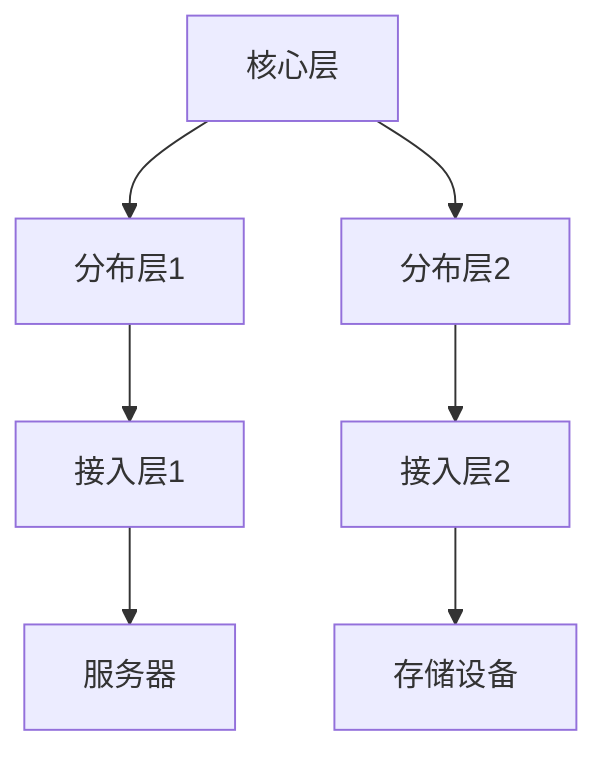

                 

## 《AI 大模型应用数据中心建设：数据中心运营与管理》

### 关键词：AI大模型、数据中心、架构设计、运营管理、性能优化、能源管理、安全性、智能调度

> 摘要：本文将深入探讨AI大模型在数据中心建设中的应用，以及数据中心运营与管理的核心技术和策略。通过对数据中心硬件、软件和网络基础设施的详细分析，本文阐述了AI大模型对数据中心建设的影响，以及数据中心在AI大模型训练和推理中的关键角色。同时，文章将介绍数据中心运营流程管理、能耗管理与可持续发展、安全管理与隐私保护等方面的内容，旨在为读者提供一份全面的数据中心与AI大模型融合的指南。

## 《AI 大模型应用数据中心建设：数据中心运营与管理》目录大纲

### 第一部分: 数据中心基础与AI大模型应用

#### 第1章: 数据中心概述与重要性
- 1.1 数据中心的定义与分类
- 1.2 数据中心的发展历程
- 1.3 数据中心在AI大模型应用中的重要性
- 1.4 数据中心面临的挑战与机遇

#### 第2章: AI大模型与数据中心架构
- 2.1 AI大模型在数据中心的应用场景
- 2.2 数据中心与AI大模型架构设计
- 2.3 数据中心硬件与AI大模型兼容性
- 2.4 数据中心网络拓扑与优化

#### 第3章: 数据中心基础设施与运维
- 3.1 数据中心物理基础设施
- 3.2 数据中心IT基础设施
- 3.3 数据中心运维策略
- 3.4 数据中心安全保障与隐私保护

#### 第4章: AI大模型在数据中心的应用实践
- 4.1 AI大模型在数据中心性能优化
- 4.2 AI大模型在数据中心能效管理
- 4.3 AI大模型在数据中心安全监控
- 4.4 AI大模型在数据中心智能调度

### 第二部分: 数据中心运营与管理

#### 第5章: 数据中心运营流程管理
- 5.1 数据中心运维流程设计
- 5.2 数据中心服务级别管理
- 5.3 数据中心故障处理与应急预案
- 5.4 数据中心性能监测与优化

#### 第6章: 数据中心能耗管理与可持续发展
- 6.1 数据中心能耗模型与优化策略
- 6.2 数据中心制冷与散热系统优化
- 6.3 数据中心绿色能源与节能技术
- 6.4 数据中心可持续发展评估

#### 第7章: 数据中心安全管理与隐私保护
- 7.1 数据中心安全威胁与风险分析
- 7.2 数据中心安全策略与控制措施
- 7.3 数据中心数据隐私保护措施
- 7.4 数据中心安全监控与响应

#### 第8章: 数据中心运维自动化与智能化
- 8.1 数据中心运维自动化工具与应用
- 8.2 数据中心智能化运维平台
- 8.3 数据中心智能运维算法与应用
- 8.4 数据中心运维发展趋势与挑战

### 第三部分: AI大模型应用案例与实践

#### 第9章: AI大模型数据中心应用案例
- 9.1 案例一：数据中心智能调度系统
- 9.2 案例二：数据中心能效管理平台
- 9.3 案例三：数据中心安全监控系统
- 9.4 案例四：数据中心性能优化系统

#### 第10章: AI大模型数据中心实践指南
- 10.1 实践准备与开发环境搭建
- 10.2 数据集准备与数据处理
- 10.3 模型选择与训练
- 10.4 模型部署与优化

#### 第11章: 未来数据中心与AI大模型发展展望
- 11.1 未来数据中心发展趋势
- 11.2 AI大模型的发展趋势
- 11.3 数据中心与AI大模型的融合趋势
- 11.4 数据中心与AI大模型的发展战略与建议

## 附录

### 附录 A: 相关技术资源与工具
- A.1 数据中心建设与运维资源
- A.2 AI大模型开发工具与框架
- A.3 数据中心与AI大模型相关书籍与论文

### 附录 B: Mermaid 流程图
- B.1 数据中心架构设计流程图
- B.2 AI大模型训练与推理流程图
- B.3 数据中心运维管理流程图

### 附录 C: 伪代码示例
- C.1 数据中心性能优化算法伪代码
- C.2 数据中心智能调度算法伪代码
- C.3 数据中心安全监控算法伪代码

### 附录 D: 代码实现与解读
- D.1 数据中心性能优化系统实现
- D.2 数据中心智能调度系统实现
- D.3 数据中心安全监控系统实现

### 附录 E: 数学模型与公式
- E.1 数据中心能耗计算模型
- E.2 数据中心性能评估模型
- E.3 数据中心安全风险评估模型

### 附录 F: 实战案例与解析
- F.1 智能调度系统应用案例
- F.2 能效管理平台应用案例
- F.3 安全监控系统应用案例
- F.4 性能优化系统应用案例

### 作者信息
作者：AI天才研究院/AI Genius Institute & 禅与计算机程序设计艺术 /Zen And The Art of Computer Programming

现在我们已经完成了文章的目录大纲和摘要部分，接下来我们将按照大纲结构逐一撰写各章节的内容。每个章节都将包含核心概念、原理讲解、数学模型、伪代码、实际案例和分析等，确保文章内容丰富、结构清晰、逻辑严密。让我们开始第一部分的撰写。

---

## 第1章: 数据中心概述与重要性

### 1.1 数据中心的定义与分类

数据中心（Data Center）是指专门用于存储、处理、管理和分发大量数据的服务设施。根据其用途和规模，数据中心可以分为以下几类：

1. **企业级数据中心**：这类数据中心通常为企业内部提供数据处理和存储服务，具备较高的安全性和可靠性，通常拥有独立的网络连接和电力供应。
   
2. **公共数据中心**：也称为商业数据中心，这类数据中心为多个企业或用户提供服务，通常拥有强大的计算能力和网络带宽，能够提供弹性的云计算服务。

3. **托管数据中心**：这类数据中心为用户提供物理设施和基础设施托管服务，用户可以租用机柜、服务器等资源，用于自己的业务需求。

4. **边缘数据中心**：边缘数据中心位于网络边缘，靠近数据生成源头，用于处理和缓存数据，以减少网络延迟和带宽消耗。

### 1.2 数据中心的发展历程

数据中心的发展可以追溯到20世纪60年代，最初的数据中心主要用于存储和组织数据。随着计算技术的进步和互联网的普及，数据中心经历了以下几个重要发展阶段：

1. **初期阶段**（20世纪60年代 - 80年代）：数据中心主要以大型机为主，数据存储和管理依赖于磁带和磁盘。

2. **集中化阶段**（20世纪90年代）：随着服务器虚拟化和存储技术的发展，企业开始集中化数据存储和处理，数据中心规模逐渐扩大。

3. **云计算阶段**（21世纪初至今）：云计算的出现改变了数据中心的运作模式，数据中心逐渐向虚拟化、自动化和智能化的方向发展。

### 1.3 数据中心在AI大模型应用中的重要性

随着AI大模型在各个领域的广泛应用，数据中心在AI大模型训练和推理过程中扮演着至关重要的角色。具体体现在以下几个方面：

1. **计算资源**：AI大模型通常需要大量的计算资源进行训练和推理，数据中心提供了强大的计算能力和高效的资源调度机制。

2. **数据存储与管理**：数据中心拥有海量的存储空间，可以存储和处理AI大模型所需的大量数据。

3. **网络连接**：数据中心提供了高速、稳定的网络连接，确保AI大模型能够快速访问所需的数据和资源。

4. **环境控制**：数据中心具备良好的环境控制设施，如温控和电力供应，确保AI大模型运行的高效性和可靠性。

### 1.4 数据中心面临的挑战与机遇

随着AI大模型的广泛应用，数据中心也面临一系列挑战和机遇：

1. **计算资源需求**：AI大模型对计算资源的需求不断增加，数据中心需要不断升级硬件设施以满足需求。

2. **能效管理**：数据中心能耗巨大，需要采取有效的能效管理措施，以降低运营成本和碳排放。

3. **数据安全与隐私**：随着数据量的增加，数据安全和隐私保护成为数据中心面临的重要挑战。

4. **智能化运维**：数据中心运维逐渐向智能化和自动化方向发展，需要引入先进的运维技术和管理理念。

通过以上分析，我们可以看出数据中心在AI大模型应用中具有不可替代的作用。在接下来的章节中，我们将深入探讨数据中心与AI大模型在硬件、软件和网络等方面的关系，以及数据中心运营与管理的核心技术和策略。

### 1.5 数据中心硬件基础设施

数据中心硬件基础设施是数据中心运行的基础，包括服务器、存储设备、网络设备和电源与冷却系统。以下是数据中心硬件基础设施的详细分类和配置。

#### 服务器与存储设备

服务器是数据中心的核心设备，用于处理数据和提供服务。根据不同的应用场景，服务器可以分为以下几类：

1. **计算型服务器**：主要用于大数据处理和复杂计算任务，如深度学习模型的训练和推理。

2. **存储型服务器**：主要用于存储大量数据，如数据仓库和文件服务器。

3. **应用型服务器**：主要用于运行特定应用，如Web服务器和数据库服务器。

在选择服务器时，需要考虑以下配置因素：

- **CPU**：选择多核CPU，以提高计算性能。

- **内存**：选择大容量内存，以支持大规模数据处理。

- **存储**：根据数据量和访问需求，选择合适的存储设备，如SSD和HDD。

存储设备是数据中心数据存储的核心，分为以下几类：

1. **磁盘阵列**：通过多个磁盘组合成一个整体，提供高可靠性和高性能的存储解决方案。

2. **固态硬盘（SSD）**：具有高速读写性能，适合用于存储频繁访问的数据。

3. **硬盘（HDD）**：具有大容量存储空间，但读写速度较慢。

在选择存储设备时，需要考虑以下因素：

- **容量**：根据数据存储需求选择合适的容量。

- **性能**：根据数据访问需求选择合适的读写速度。

- **可靠性**：选择具有高可靠性保证的存储设备，以降低数据丢失风险。

#### 网络设备

网络设备是数据中心通信的核心，包括路由器、交换机、防火墙等。以下是网络设备的分类和配置：

1. **路由器**：用于连接不同网络，实现数据包转发和路由选择。

2. **交换机**：用于连接服务器和其他网络设备，实现数据交换和流量管理。

3. **防火墙**：用于保护数据中心网络安全，防止外部攻击。

在选择网络设备时，需要考虑以下因素：

- **吞吐量**：根据数据中心的流量需求选择合适的吞吐量。

- **性能**：根据数据中心的网络需求选择合适的处理能力。

- **安全性**：选择具有高级安全功能的网络设备，以提高网络安全。

#### 电源与冷却系统

电源与冷却系统是数据中心正常运行的关键保障，包括以下几部分：

1. **不间断电源（UPS）**：提供电源备份，确保在电网故障时数据中心设备正常运行。

2. **备用发电机**：用于长时间电网故障时提供电力供应。

3. **冷却系统**：通过空调、冷水系统等设备，维持数据中心内的温湿度在合理范围内。

在选择电源与冷却系统时，需要考虑以下因素：

- **可靠性**：选择具有高可靠性保障的电源和冷却系统。

- **效率**：选择高效节能的电源和冷却系统，以降低能耗。

- **扩展性**：考虑未来数据中心扩展时的电源和冷却需求。

综上所述，数据中心硬件基础设施是数据中心运行的基础。通过合理选择和配置服务器、存储设备、网络设备和电源与冷却系统，可以确保数据中心的高性能、高可靠性和高安全性。

### 1.6 数据中心软件基础设施

数据中心的软件基础设施是确保数据中心高效运行的关键组成部分，包括操作系统、数据库管理系统、虚拟化技术与云计算等。以下是对这些软件基础设施的详细分类和配置。

#### 操作系统

操作系统（OS）是数据中心服务器和虚拟机的核心软件，用于管理和控制硬件资源，提供应用程序运行的环境。常见的操作系统包括：

1. **Linux操作系统**：具有开源、稳定和安全的优点，广泛应用于数据中心。常见的Linux发行版有Red Hat Enterprise Linux（RHEL）、CentOS、Ubuntu Server等。

2. **Windows Server**：微软的Windows Server操作系统在商业环境中也有广泛应用，尤其在需要与Windows桌面系统兼容的企业中。

在选择操作系统时，需要考虑以下因素：

- **稳定性**：选择具有高稳定性的操作系统，以确保数据中心服务的连续性。

- **安全性**：选择具有高级安全功能的操作系统，如防火墙、安全补丁管理等。

- **兼容性**：确保操作系统与数据中心硬件设备和软件应用兼容。

#### 数据库管理系统

数据库管理系统（DBMS）是数据中心用于存储、管理和查询数据的软件。常见的数据库管理系统包括：

1. **关系型数据库**：如MySQL、PostgreSQL、Oracle等，适用于结构化数据的存储和管理。

2. **非关系型数据库**：如MongoDB、Cassandra、Redis等，适用于大规模数据存储和高并发访问。

在选择数据库管理系统时，需要考虑以下因素：

- **性能**：选择能够满足数据存储和处理性能需求的数据库管理系统。

- **扩展性**：选择能够水平扩展的数据库管理系统，以应对数据量增长。

- **可用性**：选择具有高可用性保障的数据库管理系统，如主从复制、自动故障切换等。

#### 虚拟化技术与云计算

虚拟化技术是数据中心软件基础设施的重要组成部分，通过虚拟化技术可以将物理服务器和存储资源抽象成虚拟资源，实现资源的高效管理和灵活调度。常见的虚拟化技术包括：

1. **服务器虚拟化**：如VMware ESXi、Microsoft Hyper-V等，通过虚拟化技术可以将多台物理服务器虚拟化为多个虚拟机，实现资源的高效利用。

2. **存储虚拟化**：如VMware VSAN、Nutanix等，通过虚拟化技术可以将多个物理存储设备虚拟化为一个统一的存储资源池，提高存储资源的利用率。

云计算是数据中心软件基础设施的另一个重要组成部分，通过云计算技术可以提供动态的、按需的IT资源服务。常见的云计算平台包括：

1. **公有云**：如Amazon Web Services（AWS）、Microsoft Azure、Google Cloud等，提供全球范围内的计算、存储、网络等资源。

2. **私有云**：在企业内部部署的云计算平台，提供企业内部使用的计算、存储、网络等资源。

在选择虚拟化技术和云计算平台时，需要考虑以下因素：

- **性能**：选择能够满足数据中心性能需求的虚拟化技术和云计算平台。

- **灵活性**：选择具有高灵活性的虚拟化技术和云计算平台，以适应不同业务需求。

- **成本**：选择具有成本效益的虚拟化技术和云计算平台，以降低运营成本。

综上所述，数据中心软件基础设施是数据中心高效运行的核心保障。通过合理选择和配置操作系统、数据库管理系统、虚拟化技术与云计算，可以确保数据中心的高性能、高可靠性和高安全性。

### 1.7 数据中心网络拓扑设计

数据中心网络拓扑设计是数据中心整体架构中至关重要的一环，它决定了数据中心内部设备之间的连接方式、数据传输效率以及网络的可扩展性。以下是数据中心网络拓扑设计的详细分类和配置。

#### 网络拓扑类型

数据中心网络拓扑主要分为以下几种类型：

1. **平面网络拓扑**：平面网络拓扑是一种最简单的网络结构，所有设备直接连接到一个交换机上。平面网络拓扑的优点是简单和易于管理，缺点是扩展性和冗余性较差。

2. **环状网络拓扑**：环状网络拓扑中，所有设备通过环形连接形成一个闭合的网络。环状网络拓扑的优点是数据传输稳定，缺点是单点故障可能导致整个网络瘫痪。

3. **树状网络拓扑**：树状网络拓扑是一种层次化的网络结构，通过多个交换机形成一个树状结构。树状网络拓扑的优点是扩展性和冗余性较好，缺点是管理复杂。

4. **网状网络拓扑**：网状网络拓扑中，所有设备通过多条路径相互连接，形成一个高度冗余的网络结构。网状网络拓扑的优点是数据传输高效、可靠性高，缺点是网络复杂度较高。

5. **混合网络拓扑**：混合网络拓扑是将多种网络拓扑结合使用，以获得更好的性能和可靠性。常见的混合网络拓扑有：核心层-分布层-接入层架构、多层网状拓扑等。

#### 网络架构设计原则

在设计数据中心网络拓扑时，需要遵循以下原则：

1. **高可靠性**：确保网络在任何情况下都能正常运行，减少单点故障风险。

2. **高性能**：提高网络带宽和传输速度，确保数据传输效率。

3. **可扩展性**：设计灵活的网络结构，能够适应数据中心规模的扩展。

4. **高安全性**：保障网络数据安全，防止非法访问和攻击。

5. **易管理性**：网络结构简单明了，便于管理和维护。

#### 网络设备选型与配置

在配置数据中心网络时，需要选择合适的网络设备，并进行合理配置。以下是常见的网络设备及其选型：

1. **交换机**：选择支持多层交换、高速传输和高级功能的交换机，如Cisco Nexus、Juniper QFX等。交换机配置包括端口密度、吞吐量、VLAN支持等。

2. **路由器**：选择具有高性能和高级路由功能的路由器，如Cisco ASR、Juniper MX等。路由器配置包括路由策略、VPN支持等。

3. **防火墙**：选择具有高级安全功能的防火墙，如Cisco ASA、Palo Alto等。防火墙配置包括访问控制、入侵检测等。

4. **负载均衡器**：选择具有高可用性和负载均衡功能的负载均衡器，如F5 BIG-IP、A10 Thunder等。负载均衡器配置包括负载均衡算法、健康检查等。

5. **无线接入点**：选择具有高性能和稳定性的无线接入点，如Aruba AP、Cisco AireOS等。无线接入点配置包括信道分配、信号强度调整等。

#### 数据中心网络架构示例

以下是一个典型的数据中心网络架构示例，包括核心层、分布层和接入层：

- **核心层**：负责连接数据中心内部和外部的网络，提供高速数据传输和路由功能。
- **分布层**：负责连接核心层和接入层，实现不同网络区域的连接和流量管理。
- **接入层**：负责连接终端设备，如服务器和存储设备，实现数据接入和转发。

通过合理的网络拓扑设计和设备选型，可以构建一个高效、可靠和可扩展的数据中心网络架构，为数据中心提供良好的网络支持。

---

在撰写第1章的过程中，我们首先介绍了数据中心的定义与分类，回顾了数据中心的发展历程，并探讨了数据中心在AI大模型应用中的重要性。接着，我们详细介绍了数据中心的硬件基础设施和软件基础设施，包括服务器、存储设备、网络设备以及操作系统、数据库管理系统、虚拟化技术和云计算。最后，我们阐述了数据中心网络拓扑设计的分类、原则以及网络设备选型与配置。通过这些内容的讲解，我们为读者搭建了一个全面的数据中心基础框架，为后续章节的深入探讨奠定了基础。在下一章中，我们将继续探讨AI大模型与数据中心架构的详细关系，以及数据中心在AI大模型训练和推理中的应用。

---

## 第2章: AI大模型与数据中心架构

### 2.1 AI大模型在数据中心的应用场景

AI大模型在数据中心的应用场景广泛，主要包括以下几类：

1. **数据预处理与特征提取**：在数据中心中，AI大模型可以对大量数据进行预处理和特征提取，为后续训练和推理提供高质量的数据输入。

2. **模型训练与优化**：数据中心提供强大的计算资源，可以高效地训练AI大模型，并进行优化。例如，深度学习模型的训练通常需要大量的计算资源和时间，数据中心能够满足这一需求。

3. **模型推理与预测**：在数据中心中，AI大模型可以快速地进行推理和预测，为各种应用提供实时服务。例如，在金融风控、医疗诊断、智能安防等领域，AI大模型推理的效率至关重要。

4. **模型部署与运维**：数据中心可以为AI大模型提供部署和运维环境，实现模型的持续更新和维护。通过自动化工具，数据中心可以简化AI大模型的部署过程，提高运维效率。

### 2.2 数据中心与AI大模型架构设计

数据中心与AI大模型架构设计需要综合考虑硬件、软件和网络等方面，以实现高性能、高可靠性和可扩展性的系统架构。以下是一个典型的数据中心与AI大模型架构设计：

1. **硬件架构设计**：数据中心硬件架构包括服务器集群、存储系统和网络设备。服务器集群负责计算资源的提供，存储系统负责数据存储和管理，网络设备负责数据传输和通信。在设计硬件架构时，需要考虑以下几个方面：

   - **计算资源**：根据AI大模型的计算需求，选择合适的CPU、GPU和TPU等计算设备，确保计算资源的充足性。

   - **存储资源**：选择大容量、高性能的存储设备，如SSD和分布式存储系统，以满足数据存储需求。

   - **网络带宽**：设计高速网络架构，确保数据传输的快速和稳定。

2. **软件架构设计**：数据中心软件架构包括操作系统、数据库管理系统、虚拟化技术和云计算平台等。软件架构设计需要考虑以下几个方面：

   - **操作系统**：选择稳定、安全、兼容性好的操作系统，如Linux和Windows Server。

   - **数据库管理系统**：根据数据存储和处理需求，选择合适的数据库管理系统，如MySQL、PostgreSQL和MongoDB等。

   - **虚拟化技术**：采用虚拟化技术，将物理服务器虚拟化为多个虚拟机，提高资源利用率和灵活性。

   - **云计算平台**：构建云计算平台，提供弹性、动态的资源分配和管理能力，如AWS、Azure和Google Cloud等。

3. **网络架构设计**：数据中心网络架构包括内部网络和外部网络。内部网络负责数据中心内部设备之间的数据传输和通信，外部网络负责数据中心与外部网络的连接和数据交换。网络架构设计需要考虑以下几个方面：

   - **内部网络**：采用层次化网络架构，包括核心层、分布层和接入层，确保网络的高性能和可扩展性。

   - **外部网络**：采用高性能、高可靠性的网络设备，如路由器和交换机，确保数据中心与外部网络的快速连接。

4. **架构优化**：为了提高数据中心与AI大模型架构的性能和效率，可以进行以下优化：

   - **负载均衡**：采用负载均衡技术，将计算和存储任务分配到多个节点上，避免单点瓶颈。

   - **缓存机制**：采用缓存技术，减少数据访问延迟，提高数据访问速度。

   - **数据压缩**：采用数据压缩技术，减少数据传输量，提高数据传输效率。

   - **自动化运维**：采用自动化运维工具，简化运维流程，提高运维效率。

### 2.3 数据中心硬件与AI大模型兼容性

数据中心硬件与AI大模型的兼容性是确保系统性能和稳定性的关键。以下是数据中心硬件与AI大模型兼容性的一些考虑因素：

1. **计算设备兼容性**：AI大模型通常需要使用GPU和TPU等高性能计算设备。数据中心硬件需要支持这些设备的安装和运行，如GPU插槽、TPU加速器等。

2. **存储设备兼容性**：AI大模型需要大量的数据存储，数据中心存储设备需要支持高性能、大容量的存储解决方案，如SSD、分布式存储系统等。

3. **网络设备兼容性**：数据中心网络设备需要支持高速网络协议，如TCP/IP、NVMe over Fabrics等，以提供高效的数据传输。

4. **电源和冷却系统兼容性**：数据中心电源和冷却系统需要能够支持高性能计算设备的电力需求和散热需求，如冗余电源、高效冷却系统等。

### 2.4 数据中心网络拓扑与优化

数据中心网络拓扑设计对AI大模型的训练和推理性能有着重要影响。以下是数据中心网络拓扑设计的一些优化策略：

1. **网络层次化设计**：采用层次化网络架构，将网络分为核心层、分布层和接入层，确保网络的高性能和可扩展性。

2. **网络带宽优化**：提高网络带宽，采用高速网络协议和设备，如100Gbps网络接口卡、高性能交换机等。

3. **网络冗余设计**：采用网络冗余设计，确保网络的高可用性。例如，使用多路径传输协议、网络冗余路由等。

4. **缓存机制**：采用缓存机制，减少数据访问延迟，提高数据传输效率。例如，在核心层和分布层之间部署缓存设备，如高速缓存交换机等。

5. **流量管理**：采用流量管理策略，优化数据传输路径，减少网络拥塞和延迟。例如，使用QoS（服务质量）技术、流量工程等。

通过以上对AI大模型与数据中心架构的探讨，我们了解了AI大模型在数据中心中的应用场景和架构设计要点。在下一章中，我们将深入探讨数据中心的物理基础设施与IT基础设施，以及数据中心的运维策略和安全保障措施。

---

在撰写第2章的过程中，我们首先介绍了AI大模型在数据中心的应用场景，包括数据预处理与特征提取、模型训练与优化、模型推理与预测以及模型部署与运维。接着，我们详细阐述了数据中心与AI大模型架构设计的硬件、软件和网络方面，包括计算资源、存储资源、网络带宽、虚拟化技术和云计算平台等。此外，我们还讨论了数据中心硬件与AI大模型的兼容性以及网络拓扑设计的一些优化策略。通过这些内容的讲解，我们为读者搭建了一个全面的数据中心与AI大模型架构框架，为后续章节的深入探讨奠定了基础。在下一章中，我们将继续探讨数据中心的物理基础设施与IT基础设施，以及数据中心的运维策略和安全保障措施。

---

## 第3章：数据中心基础设施与运维

### 3.1 数据中心物理基础设施

数据中心物理基础设施是数据中心正常运行的基础，包括建筑物、机房、电力供应、冷却系统和物理安全等方面。

#### 建筑物与机房设计

数据中心建筑物的设计和机房布局对数据中心的稳定性和可靠性至关重要。以下是一些关键设计要点：

1. **地理位置**：数据中心应选择地理位置优越、地质稳定的地点，以减少自然灾害的影响。

2. **抗震能力**：数据中心建筑物应具备良好的抗震能力，以应对地震等自然灾害。

3. **机房布局**：机房布局应合理规划，确保设备分布均匀，便于管理和维护。

4. **环境控制**：数据中心机房应具备良好的环境控制设施，包括温湿度控制、空气净化等，以保证设备运行环境。

#### 电力供应

电力供应是数据中心运行的关键，以下是一些电力供应的关键设计要点：

1. **冗余电源**：数据中心应配备冗余电源，包括UPS（不间断电源）和备用发电机，以应对电网故障。

2. **电力分配**：数据中心应设计合理的电力分配系统，确保电力供应的稳定性和可靠性。

3. **电力监控**：应配置电力监控设备，实时监测电力供应状况，及时发现和处理电力故障。

#### 冷却系统

冷却系统是确保数据中心设备运行温度在合理范围内的关键，以下是一些冷却系统的设计要点：

1. **空调系统**：数据中心应配备高效空调系统，包括冷冻水系统、空气冷却系统等，以维持机房温度。

2. **散热设计**：设备布局应考虑散热需求，确保设备周围的空气流通，避免局部过热。

3. **冷却效率**：选择高效冷却设备，如冷却塔、热管等，以提高冷却效率。

#### 物理安全

物理安全是保障数据中心安全的重要环节，以下是一些物理安全的关键设计要点：

1. **门禁系统**：配置高安全性的门禁系统，包括生物识别、电子锁等，限制未经授权的人员进入。

2. **视频监控**：数据中心机房应配备高清视频监控设备，实现全方位监控，确保安全事件的可追溯性。

3. **防火措施**：配置防火墙、灭火器等防火设备，以防止火灾等安全事故的发生。

### 3.2 数据中心IT基础设施

数据中心IT基础设施包括服务器、存储设备、网络设备、虚拟化技术、云计算平台等方面。以下是数据中心IT基础设施的关键设计要点：

#### 服务器与存储设备

1. **服务器选择**：根据业务需求，选择适合的服务器，如计算型服务器、存储型服务器等。考虑CPU性能、内存容量、存储容量等因素。

2. **存储解决方案**：选择高性能、高可靠的存储解决方案，如SSD、分布式存储系统、NAS等。考虑数据访问速度、存储容量、数据冗余等因素。

#### 网络设备

1. **网络架构**：设计合理的网络架构，包括核心层、分布层和接入层。选择高性能、高可靠性的网络设备，如交换机、路由器等。

2. **网络带宽**：根据业务需求，配置足够的网络带宽，确保数据传输的快速和稳定。

3. **网络冗余**：配置网络冗余，确保网络的高可用性，如多路径传输、网络冗余路由等。

#### 虚拟化技术

1. **虚拟化平台**：选择适合的数据中心虚拟化平台，如VMware、Hyper-V等。考虑虚拟化平台的性能、可靠性、扩展性等因素。

2. **虚拟机管理**：配置虚拟机管理工具，实现虚拟机的高效管理，如VMware vCenter、Microsoft SCVMM等。

#### 云计算平台

1. **云计算服务**：选择适合的云计算服务，如IaaS、PaaS、SaaS等。考虑云计算服务的性能、成本、灵活性等因素。

2. **云资源管理**：配置云资源管理工具，实现云资源的高效管理和调度，如AWS CloudWatch、Azure Monitor等。

### 3.3 数据中心运维策略

数据中心运维策略是确保数据中心稳定运行、高效管理和持续改进的关键。以下是数据中心运维策略的关键设计要点：

#### 运维流程

1. **运维流程设计**：设计合理的运维流程，包括设备管理、故障处理、变更管理等。确保运维流程的规范性和可追溯性。

2. **运维规范**：制定运维规范，包括操作步骤、安全要求、故障处理流程等。确保运维人员按照规范进行操作。

#### 故障处理

1. **故障分类**：根据故障的性质和影响范围，将故障分为不同等级，如紧急故障、严重故障等。

2. **故障处理流程**：制定故障处理流程，包括故障报告、故障分析、故障修复等。确保故障处理的及时性和有效性。

#### 变更管理

1. **变更分类**：根据变更的影响范围和紧急程度，将变更分为不同类型，如紧急变更、常规变更等。

2. **变更管理流程**：制定变更管理流程，包括变更申请、变更评估、变更执行等。确保变更管理的规范性和可控性。

### 3.4 数据中心安全保障与隐私保护

数据中心安全保障和隐私保护是确保数据中心业务连续性和数据安全的关键。以下是数据中心安全保障和隐私保护的关键设计要点：

#### 安全策略

1. **安全策略制定**：制定数据中心安全策略，包括网络安全、服务器安全、存储安全等。确保安全策略的全面性和可操作性。

2. **安全控制措施**：配置安全控制措施，如防火墙、入侵检测系统（IDS）、入侵防御系统（IPS）等。确保安全控制措施的有效性和实时性。

#### 隐私保护

1. **隐私保护法规**：遵守相关隐私保护法规，如《通用数据保护条例》（GDPR）、《加州消费者隐私法案》（CCPA）等。

2. **数据加密**：采用数据加密技术，对存储和传输的数据进行加密，确保数据安全性。

3. **访问控制**：配置严格的访问控制机制，限制未经授权的访问，确保数据的安全性和隐私。

通过以上对数据中心基础设施和运维策略的详细讲解，我们为读者搭建了一个全面的数据中心基础设施框架，为后续章节的深入探讨奠定了基础。在下一章中，我们将继续探讨AI大模型在数据中心中的实际应用，以及数据中心性能优化、能效管理、安全监控和智能调度等方面的内容。

---

在第3章中，我们详细介绍了数据中心基础设施与运维的核心内容。首先，我们探讨了数据中心的物理基础设施，包括建筑物、机房设计、电力供应、冷却系统和物理安全。接着，我们讨论了数据中心的IT基础设施，包括服务器、存储设备、网络设备、虚拟化技术和云计算平台。随后，我们提出了数据中心运维策略的关键设计要点，包括运维流程、故障处理和变更管理。最后，我们强调了数据中心安全保障和隐私保护的重要性，提出了相关的安全策略和隐私保护措施。

通过本章的讲解，我们为读者搭建了一个全面的数据中心基础设施框架，明确了数据中心在硬件、软件和网络等方面的关键要素。同时，我们提出了数据中心运维和管理的核心策略，为数据中心的高效运行提供了指导。

在下一章中，我们将继续探讨AI大模型在数据中心中的实际应用，包括性能优化、能效管理、安全监控和智能调度等方面。我们将通过具体的案例和实践，展示AI大模型在数据中心运营中的强大作用，并讨论其应用前景和挑战。敬请期待！

