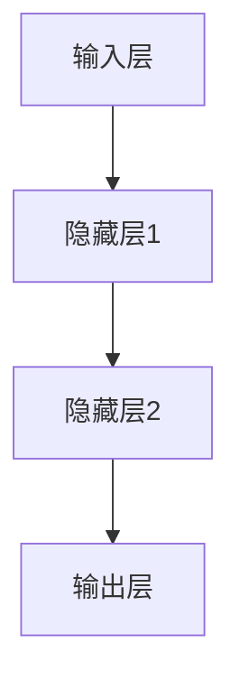
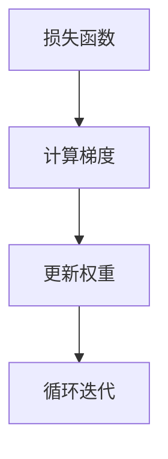
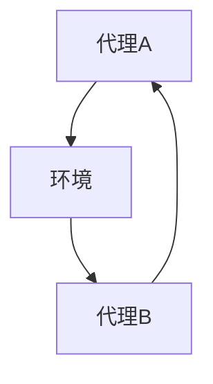

                 

# 《AI大模型计算机科学家群英传：明斯基（Marvin Lee Minsky，1927年—2016年）》

## 关键词
AI大模型，神经网络，深度学习，自然语言处理，多代理系统，计算机科学家，明斯基，人工智能哲学。

## 摘要
本文将深入探讨AI大模型领域的重要人物之一——明斯基（Marvin Lee Minsky，1927年—2016年）的生平与贡献。文章将从AI大模型的基础概念入手，分析明斯基在神经网络与深度学习、自然语言处理以及多代理系统等领域的贡献，并讨论其对人工智能哲学的深刻思考。通过这篇文章，读者可以了解明斯基如何推动了AI技术的发展，并思考其在现代AI大模型中的应用与未来。

## 第一部分：AI大模型基础与明斯基贡献

### 第1章：AI大模型概述与明斯基的奠基作用

#### 1.1 明斯基的生平与成就
明斯基是计算机科学和人工智能领域的先驱人物，被誉为“人工智能之父”之一。1927年出生于美国纽约，他不仅在学术上取得了卓越的成就，还积极参与了工业界的研究与实践。明斯基在麻省理工学院（MIT）任教长达50年，培养了大量的人工智能人才。

#### 1.2 AI大模型的基本概念
AI大模型是指拥有极高参数规模、能够处理大规模数据的深度学习模型。这些模型通常基于神经网络结构，能够在各种复杂的任务中取得出色的性能。AI大模型的核心特点是数据驱动和自适应，能够通过学习大量数据来提取有用信息和知识。

#### 1.3 明斯基在神经网络与深度学习领域的贡献
明斯基在神经网络与深度学习领域有着重要的奠基作用。他在1958年提出了感知机（Perceptron）模型，这是最早的神经网络模型之一。尽管感知机模型存在局限性，但它为后来的神经网络研究奠定了基础。此外，明斯基还提出了很多重要的理论，如多层感知机、反向传播算法等，这些理论对深度学习的发展产生了深远的影响。

### 第2章：神经网络与深度学习技术

#### 2.1 神经网络基本原理
神经网络是由大量简单的处理单元（神经元）组成的复杂网络，通过学习输入数据之间的映射关系来实现特定任务。神经网络的三个主要层次包括输入层、隐藏层和输出层。输入层接收外部输入数据，隐藏层对输入数据进行加工处理，输出层产生最终的输出结果。

**图解与Mermaid流程图：**


**伪代码：**
```python
def neural_network(input_data):
    hidden_layer1 = activation_function(np.dot(input_data, weights1))
    hidden_layer2 = activation_function(np.dot(hidden_layer1, weights2))
    output = activation_function(np.dot(hidden_layer2, weights3))
    return output
```

#### 2.2 深度学习算法
深度学习是一种通过多层神经网络来学习的机器学习技术。深度学习算法的核心是神经网络，通过优化神经网络的权重和偏置，使其能够准确地预测或分类输入数据。深度学习算法包括多种不同的模型，如卷积神经网络（CNN）、循环神经网络（RNN）等。

**数学模型与公式：**
$$ y = \sigma(W \cdot x + b) $$

**算法详细讲解：**
深度学习算法主要包括以下步骤：
1. **前向传播**：将输入数据传递到神经网络中，通过每一层神经元的计算，最终得到输出结果。
2. **损失函数**：计算预测结果与实际结果之间的差距，用于评估模型的性能。
3. **反向传播**：计算损失函数关于神经网络参数的梯度，并通过梯度下降等方法更新参数。
4. **迭代优化**：重复前向传播和反向传播过程，不断优化模型参数，直至达到预定的性能目标。

**图解与Mermaid流程图：**


#### 2.3 明斯基的贡献与深度学习发展
明斯基在神经网络与深度学习领域做出了许多重要贡献。他不仅提出了感知机模型，还研究了多层感知机和反向传播算法。这些理论为深度学习的发展奠定了基础。此外，明斯基还提出了许多有关神经网络训练和优化的方法，如学习率调整、动量优化等。

### 第3章：明斯基在自然语言处理中的贡献

#### 3.1 自然语言处理基础
自然语言处理（Natural Language Processing，NLP）是人工智能领域的一个重要分支，旨在使计算机能够理解、生成和处理人类语言。NLP涉及语言学、计算机科学、统计学等多个领域的知识。

#### 3.2 明斯基与规则基础模型
明斯基在自然语言处理领域的研究主要集中在规则基础模型上。他提出了一些早期的自然语言处理算法，如基于上下文的词性标注和句法分析。这些算法通过建立一系列规则来处理文本数据，从而实现语言的理解和生成。

#### 3.3 明斯基与统计模型
随着统计方法在自然语言处理中的广泛应用，明斯基也开始研究统计模型在NLP中的应用。他提出了基于概率的模型，如隐马尔可夫模型（HMM）和条件概率模型。这些模型能够通过学习大量语料库数据来提高语言处理的准确性和效果。

### 第4章：明斯基的多代理系统与人工智能

#### 4.1 多代理系统理论
多代理系统（Multi-Agent System，MAS）是一种由多个独立代理组成的复杂系统，这些代理可以相互协作或竞争，以实现特定目标。明斯基在多代理系统理论的研究中取得了重要进展，他提出了许多有关代理通信、协作和决策的方法。

**图解与Mermaid流程图：**


#### 4.2 明斯基的多代理系统应用案例
明斯基的多代理系统理论在实际应用中取得了显著成果。例如，在智能交通系统中，多代理系统可以用于协调交通信号、优化交通流量。在智能制造领域，多代理系统可以用于协调机器人的任务分配和协作。

### 第5章：明斯基的人工智能哲学

#### 5.1 明斯基对人工智能的哲学思考
明斯基对人工智能的哲学思考主要体现在他对智能本质的理解和人工智能的发展方向。他认为，智能是由符号操作和信息处理组成的，通过符号运算和推理来实现智能行为。

#### 5.2 明斯基关于人工智能的预言与反思
明斯基对人工智能的未来发展有着深刻的预言和反思。他预言，随着计算机技术的发展，人工智能将能够实现人类水平的智能。同时，他也反思了人工智能可能带来的伦理和社会问题，如隐私保护、就业影响等。

## 第二部分：AI大模型应用与明斯基影响

### 第6章：AI大模型在现实世界中的应用

#### 6.1 AI大模型在医疗领域的应用
AI大模型在医疗领域具有广泛的应用前景。例如，通过深度学习技术，AI大模型可以用于医疗图像分析、疾病预测和诊断。这些应用有助于提高医疗诊断的准确性和效率。

#### 6.2 AI大模型在金融领域的应用
AI大模型在金融领域也发挥着重要作用。例如，通过机器学习技术，AI大模型可以用于风险评估、投资策略优化和金融市场预测。这些应用有助于提高金融决策的准确性和稳定性。

#### 6.3 AI大模型在教育领域的应用
AI大模型在教育领域具有广泛的应用潜力。例如，通过个性化学习推荐系统，AI大模型可以根据学生的兴趣和学习习惯提供个性化的学习资源。此外，AI大模型还可以用于智能评测和教学分析，帮助教师更好地了解学生的学习状况。

### 第7章：明斯基在AI产业中的遗产

#### 7.1 明斯基对AI产业的影响
明斯基对AI产业的影响深远。他提出的一系列理论和算法为AI技术的发展奠定了基础。此外，他在多代理系统和自然语言处理等领域的研究也为AI产业的实际应用提供了重要指导。

#### 7.2 明斯基思想的现代应用与未来发展
明斯基的思想在现代AI产业中仍然具有重要价值。他的多代理系统理论为智能协作和智能系统设计提供了新思路。同时，他的自然语言处理理论也为智能语音助手、机器翻译等应用提供了基础。

### 第8章：AI大模型开发环境与工具

#### 8.1 AI大模型开发环境搭建
搭建AI大模型开发环境是进行深度学习研究的第一步。开发环境通常包括操作系统、编程语言和深度学习框架等。例如，常见的开发环境包括Linux操作系统、Python编程语言和TensorFlow深度学习框架。

#### 8.2 主流AI大模型开发工具
当前主流的AI大模型开发工具有TensorFlow、PyTorch、Keras等。这些工具提供了丰富的功能，包括神经网络搭建、训练和评估等。开发人员可以根据项目需求和自身熟悉程度选择合适的工具。

### 第9章：AI大模型项目实战

#### 9.1 实战项目介绍
本文将介绍一个基于TensorFlow的图像分类项目。该项目使用卷积神经网络（CNN）对图像进行分类，实现对不同类别图像的识别。

#### 9.2 实战项目代码实现
以下是一个简单的CNN图像分类项目的代码实现：

```python
import tensorflow as tf
from tensorflow.keras import layers

# 构建CNN模型
model = tf.keras.Sequential([
    layers.Conv2D(32, (3, 3), activation='relu', input_shape=(28, 28, 1)),
    layers.MaxPooling2D((2, 2)),
    layers.Conv2D(64, (3, 3), activation='relu'),
    layers.MaxPooling2D((2, 2)),
    layers.Conv2D(64, (3, 3), activation='relu'),
    layers.Flatten(),
    layers.Dense(64, activation='relu'),
    layers.Dense(10, activation='softmax')
])

# 编译模型
model.compile(optimizer='adam',
              loss='sparse_categorical_crossentropy',
              metrics=['accuracy'])

# 训练模型
model.fit(train_images, train_labels, epochs=5)

# 评估模型
test_loss, test_acc = model.evaluate(test_images, test_labels)
print('Test accuracy:', test_acc)
```

#### 9.3 代码解读与分析
上述代码实现了一个简单的CNN图像分类模型。模型由四个卷积层（Conv2D）、两个最大池化层（MaxPooling2D）和一个全连接层（Dense）组成。卷积层用于提取图像的特征，池化层用于降低特征图的维度，全连接层用于分类。模型使用Adam优化器进行训练，并使用交叉熵损失函数评估模型的性能。

### 第10章：未来展望

#### 10.1 AI大模型技术的未来发展方向
AI大模型技术在未来的发展将更加注重以下几个方向：
1. **模型压缩与高效推理**：为了满足实时性和移动设备的需求，需要研究和开发更高效的模型压缩和推理算法。
2. **多模态学习**：未来的AI大模型将能够同时处理文本、图像、语音等多种数据类型，实现更全面的信息理解。
3. **可解释性**：提高AI大模型的可解释性，使其能够更好地理解和信任。

#### 10.2 明斯基思想对未来的启示
明斯基的思想对未来的AI发展具有重要的启示。他强调智能的本质是符号运算和信息处理，这一观点为AI的发展提供了新的思路。同时，他提出的多代理系统和自然语言处理理论也为未来的AI应用提供了重要参考。

## 附录

### 附录A：AI大模型相关资源与工具

#### A.1 AI大模型学习资源
1. **在线课程**：Coursera、Udacity、edX等在线教育平台提供了丰富的AI大模型相关课程。
2. **书籍**：《深度学习》、《神经网络与深度学习》、《AI实战》等。
3. **博客和社区**：TensorFlow、PyTorch等深度学习框架的官方博客和相关技术社区。

#### A.2 AI大模型开发工具对比
1. **TensorFlow**：由Google开发，具有广泛的社区支持和丰富的功能。
2. **PyTorch**：由Facebook开发，具有动态计算图和灵活的编程接口。
3. **Keras**：基于TensorFlow和Theano的开源深度学习库，提供简化的接口。
4. **其他框架简介**：Caffe、Theano、MXNet等。

#### A.3 开发环境配置指南
1. **操作系统**：推荐使用Linux或MacOS。
2. **编程语言**：Python是首选编程语言。
3. **深度学习框架**：根据需求选择合适的框架，如TensorFlow或PyTorch。
4. **其他依赖**：安装必要的库和工具，如Numpy、Pandas等。

### 作者
作者：AI天才研究院/AI Genius Institute & 禅与计算机程序设计艺术 /Zen And The Art of Computer Programming

本文通过系统地梳理和深入分析，介绍了AI大模型领域的重要人物明斯基的生平与贡献。从神经网络与深度学习、自然语言处理、多代理系统到人工智能哲学，明斯基的研究成果和思想为AI技术的发展奠定了基础。本文还探讨了AI大模型在现实世界中的应用，并对未来发展方向进行了展望。通过这篇文章，读者可以更全面地了解明斯基对AI领域的贡献，以及AI大模型在现代技术中的重要作用。

