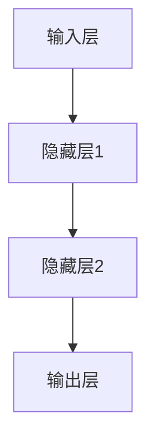

                 

### AI灾备方案：构建韧性智能基础设施

> **关键词：** 人工智能、灾备、韧性、智能基础设施、机器学习、深度学习

**摘要：** 在当今全球化的世界中，自然灾害和突发事件对人类生活和社会经济造成了巨大的影响。传统的灾备方案往往在响应速度、决策能力和成本控制方面存在不足。本文提出了基于人工智能的灾备方案，通过构建韧性智能基础设施，以提高灾备能力，降低灾害损失。文章首先介绍了人工智能与灾备的重要性，然后详细阐述了AI灾备的核心技术，包括机器学习、深度学习和自然语言处理。接下来，文章讨论了AI灾备方案的设计与实施，并通过具体案例展示了AI灾备在地震和台风预警中的应用。最后，文章展望了AI灾备的未来发展趋势和面临的挑战。

### 《AI灾备方案：构建韧性智能基础设施》目录大纲

#### 第一部分：背景与概述

1. **第1章：人工智能与灾备的重要性**
    - **1.1 人工智能时代的来临**
        - 人工智能的定义与发展
        - 人工智能对灾难应对的潜力
    - **1.2 灾备的定义与现状**
        - 灾备的概念与目的
        - 当前灾备的挑战与局限性
    - **1.3 AI灾备的优势**
        - 提高响应速度
        - 增强决策能力
        - 降低灾备成本

#### 第二部分：AI灾备技术基础

2. **第2章：AI灾备核心技术**
    - **2.1 机器学习在灾备中的应用**
        - 监督学习与无监督学习
        - 强化学习在灾备中的应用
    - **2.2 深度学习在灾备中的应用**
        - 神经网络架构
        - 卷积神经网络在图像处理中的应用
        - 递归神经网络在时间序列分析中的应用
    - **2.3 自然语言处理在灾备中的应用**
        - 语言模型
        - 问答系统
        - 文本分类与聚类

#### 第三部分：AI灾备方案设计与实施

3. **第3章：构建AI灾备方案**
    - **3.1 AI灾备方案的设计原则**
        - 敏捷性与灵活性
        - 可扩展性与适应性
        - 安全性与可靠性
    - **3.2 灾备策略与流程**
        - 灾备策略的设计
        - 灾备流程的规划
        - 灾备演练与评估
    - **3.3 AI灾备技术的集成与优化**
        - 机器学习模型集成
        - 深度学习模型优化
        - NLP模型优化

#### 第四部分：案例研究与应用

4. **第4章：AI灾备案例分析**
    - **4.1 案例一：地震灾备系统建设**
        - 案例背景
        - 灾备方案设计
        - 实施效果评估
    - **4.2 案例二：台风预警与应急响应**
        - 案例背景
        - 灾备方案设计
        - 实施效果评估

#### 第五部分：展望与未来发展趋势

5. **第5章：AI灾备的发展趋势与挑战**
    - **5.1 AI灾备技术的发展趋势**
        - 数据驱动的灾备预测
        - 多智能体的协同应对
        - 灾备方案的个性化定制
    - **5.2 AI灾备面临的挑战**
        - 数据隐私与安全
        - AI技术的可信度
        - 跨学科的整合与协同

#### 附录

6. **附录A：AI灾备相关资源与工具**
    - **6.1 AI灾备开源工具与框架**
    - **6.2 灾备数据集与案例分析**
    - **6.3 灾备领域的顶级会议与期刊**

### 第一部分：背景与概述

#### 第1章：人工智能与灾备的重要性

**1.1 人工智能时代的来临**

**人工智能的定义与发展**

人工智能（Artificial Intelligence，简称AI）是指通过计算机程序和算法模拟人类智能行为的技术。人工智能的概念最早可以追溯到20世纪50年代，当时的计算机科学家开始探讨如何使计算机具备类似人类的思考和学习能力。自那时以来，人工智能经历了多个发展阶段，包括规则推理、知识表示、机器学习和深度学习等。

- **规则推理**：基于预定义的规则进行逻辑推理，例如专家系统。
- **知识表示**：通过符号和逻辑结构来表示知识和信息，例如知识图谱。
- **机器学习**：通过训练数据集来学习规律和模式，例如决策树、支持向量机等。
- **深度学习**：基于多层神经网络，通过大量数据进行训练，例如卷积神经网络（CNN）和递归神经网络（RNN）等。

**人工智能对灾难应对的潜力**

在灾难应对中，人工智能具有巨大的潜力，可以显著提高响应速度、增强决策能力和降低灾备成本。以下是人工智能在灾难应对中的几个关键应用：

- **灾害预警**：通过实时监测和分析传感器数据，预测灾害的发生和影响范围，从而提前采取措施进行预防和应对。
- **资源调配**：根据灾害类型、影响范围和资源分布，自动优化资源调配，确保救援物资和人力能够快速到达受灾地区。
- **决策支持**：利用人工智能技术，对复杂的灾难情境进行实时分析和评估，提供科学的决策支持，从而提高决策质量和响应效率。
- **灾后恢复**：利用机器人和自动化技术，快速进行灾后清理和恢复工作，减轻人力负担，缩短恢复时间。

**1.2 灾备的定义与现状**

**灾备的概念与目的**

灾备（Disaster Recovery）是指在面对自然灾害、人为灾害或其他突发事件时，采取的一系列措施来保护生命财产、减少损失和尽快恢复正常运行的过程。灾备的目的是确保组织在灾害发生时能够迅速恢复运营，降低灾害对组织的影响。

灾备的主要内容包括：

- **风险评估**：评估组织面临的各种风险，确定可能发生的灾害类型和影响范围。
- **灾备计划**：制定详细的灾备计划，包括组织结构、资源调配、应急响应、恢复计划等。
- **演练与培训**：定期进行灾备演练，确保组织成员熟悉灾备流程和操作，提高应对灾害的能力。
- **恢复与重建**：灾害发生后，迅速进行灾后恢复和重建工作，尽快恢复组织的正常运营。

**当前灾备的挑战与局限性**

尽管传统的灾备方案在保护生命财产和降低损失方面取得了一定的成效，但仍然存在一些挑战和局限性：

- **响应速度慢**：传统的灾备方案往往需要人工介入，响应速度较慢，无法及时应对突发事件。
- **决策能力有限**：在复杂的灾难情境下，人工决策往往存在偏差和失误，难以做出最优决策。
- **成本高**：传统的灾备方案需要大量人力、物力和财力投入，成本较高，难以大规模推广。
- **可扩展性差**：传统的灾备方案往往针对特定的灾害类型和场景进行设计，可扩展性较差，难以适应多样化的灾害场景。

**1.3 AI灾备的优势**

**提高响应速度**

人工智能技术可以实时监测和分析数据，快速识别灾害信号，提前预警，从而提高响应速度。与人工监测相比，人工智能技术可以24小时不间断工作，无需休息，大大提高了监测和预警的效率。

**增强决策能力**

人工智能技术可以利用大数据和机器学习算法，对灾害情境进行深入分析，提供科学的决策支持。通过分析历史数据和模拟不同情景，人工智能可以预测灾害的发展趋势和影响范围，为决策者提供更全面和准确的决策依据。

**降低灾备成本**

人工智能技术可以自动化和智能化地执行灾备任务，减少人工干预，降低人力成本。同时，人工智能技术可以优化资源调配和利用，提高资源利用率，降低运营成本。

### 第二部分：AI灾备技术基础

#### 第2章：AI灾备核心技术

**2.1 机器学习在灾备中的应用**

**监督学习与无监督学习**

机器学习是人工智能的核心技术之一，可以分为监督学习和无监督学习两大类。

- **监督学习（Supervised Learning）**
  监督学习是一种利用标注数据来训练模型的机器学习方法。在监督学习中，输入数据（特征）和输出结果（标签）都是已知的，模型通过学习这些样本的规律来预测新的数据。常见的监督学习算法包括决策树、支持向量机（SVM）和神经网络等。

  **决策树（Decision Tree）**
  决策树是一种常见的分类和回归算法，通过一系列的判断条件来将数据分类或回归到不同的类别或数值。决策树的构建过程如下：

  1. 选择特征集。
  2. 计算每个特征的增益。
  3. 选择增益最大的特征作为分支节点。
  4. 根据该特征划分数据。
  5. 递归地重复步骤2-4，直到满足停止条件。

  **伪代码：**
  ```python
  def build_decision_tree(data, labels):
      # 选择最优特征
      best_feature = select_best_feature(data, labels)
      # 创建树节点
      tree = {}
      tree['feature'] = best_feature
      tree['split_value'] = split_value(data, best_feature)
      tree['left'] = build_decision_tree(data[data[best_feature] < split_value], labels[data[best_feature] < split_value])
      tree['right'] = build_decision_tree(data[data[best_feature] >= split_value], labels[data[best_feature] >= split_value])
      return tree
  ```

  **支持向量机（SVM）**
  支持向量机是一种经典的二分类算法，通过找到一个最佳的超平面，将不同类别的数据点尽可能地分开。SVM的核心是求解一个最优化问题，目标是找到最优的超平面，使得分类边界最大化。

  **伪代码：**
  ```python
  def train_svm(data, labels):
      # 求解最优化问题
      w, b = solve_optimization_problem(data, labels)
      return w, b
  ```

  **神经网络（Neural Network）**
  神经网络是一种模拟生物神经系统的计算模型，通过多层节点（神经元）的连接和激活函数，实现数据的映射和分类。神经网络的核心是前向传播和反向传播算法。

  **伪代码：**
  ```python
  def forward_propagation(data, model):
      # 前向传播计算输出
      outputs = []
      for layer in model.layers:
          output = layer.forward(data)
          outputs.append(output)
      return outputs

  def backward_propagation(outputs, expected, model):
      # 反向传播计算梯度
      gradients = []
      for layer in reversed(model.layers):
          gradient = layer.backward(outputs[-1], expected)
          gradients.append(gradient)
      return gradients
  ```

- **无监督学习（Unsupervised Learning）**
  无监督学习是一种在没有标注数据的情况下，通过学习数据的内在结构和规律来进行数据分析和处理的机器学习方法。常见的无监督学习算法包括聚类、降维和生成模型等。

  **聚类（Clustering）**
  聚类是一种将数据点按照相似性进行分组的方法，常见的聚类算法有K-means、层次聚类等。K-means聚类算法的步骤如下：

  1. 随机选择K个初始中心点。
  2. 计算每个数据点到中心点的距离，并将数据点分配到最近的中心点。
  3. 重新计算每个簇的中心点。
  4. 重复步骤2-3，直到中心点不再发生显著变化。

  **伪代码：**
  ```python
  def k_means(data, k, max_iterations):
      # 初始化中心点
      centroids = initialize_centroids(data, k)
      for _ in range(max_iterations):
          # 分配数据点
          clusters = assign_clusters(data, centroids)
          # 重新计算中心点
          centroids = update_centroids(clusters, k)
      return centroids
  ```

  **降维（Dimensionality Reduction）**
  降维是一种通过降低数据维度来简化数据集，提高计算效率和可视化效果的方法。常见的降维算法有主成分分析（PCA）、线性判别分析（LDA）等。PCA算法的步骤如下：

  1. 计算数据点的协方差矩阵。
  2. 计算协方差矩阵的特征值和特征向量。
  3. 选择最大的特征值对应的特征向量作为新特征。
  4. 将数据点投影到新的特征空间。

  **伪代码：**
  ```python
  def pca(data, n_components):
      # 计算协方差矩阵
      covariance_matrix = compute_covariance_matrix(data)
      # 计算特征值和特征向量
      eigenvalues, eigenvectors = compute_eigenvalues_and_eigenvectors(covariance_matrix)
      # 选择最大的n_components个特征向量
      principal_components = select_principal_components(eigenvalues, eigenvectors, n_components)
      # 将数据点投影到新的特征空间
      projected_data = project_data(data, principal_components)
      return projected_data
  ```

  **生成模型（Generative Model）**
  生成模型是一种通过学习数据的分布来生成新数据的机器学习方法。常见的生成模型有生成对抗网络（GAN）等。GAN的核心是生成器和判别器的对抗训练。

  **伪代码：**
  ```python
  def train_gan(generator, discriminator, data, batch_size, num_iterations):
      for _ in range(num_iterations):
          # 生成器生成假样本
          fake_samples = generator.generate(data)
          # 判别器判断真假样本
          real_labels = discriminator.predict(data)
          fake_labels = discriminator.predict(fake_samples)
          # 优化生成器和判别器
          generator_loss = generator.optimize(fake_samples, real_labels)
          discriminator_loss = discriminator.optimize(fake_samples, real_labels, fake_labels)
      return generator, discriminator
  ```

**强化学习在灾备中的应用**

强化学习（Reinforcement Learning，简称RL）是一种通过与环境交互来学习最优策略的机器学习方法。在灾备中，强化学习可以用于优化灾备决策和资源分配。

- **Q-Learning（Q值学习）**
  Q-Learning是一种基于值函数的强化学习算法，通过学习状态-动作值函数来选取最优动作。Q-Learning的步骤如下：

  1. 初始化Q值表。
  2. 选择动作。
  3. 执行动作并获取奖励。
  4. 更新Q值表。

  **伪代码：**
  ```python
  def q_learning(state, action, reward, next_state, alpha, gamma):
      # 计算当前Q值
      current_q = q_value[state, action]
      # 计算下一状态的最大Q值
      max_next_q = np.max(q_value[next_state, :])
      # 更新Q值
      new_q = current_q + alpha * (reward + gamma * max_next_q - current_q)
      return new_q
  ```

- **SARSA（同步策略调整）**
  SARSA是一种基于同步策略调整的强化学习算法，通过同时考虑当前状态和下一状态的Q值来更新Q值。SARSA的步骤如下：

  1. 初始化Q值表。
  2. 选择动作。
  3. 执行动作并获取奖励。
  4. 根据新的状态选择动作。
  5. 更新Q值表。

  **伪代码：**
  ```python
  def sarsa(state, action, reward, next_state, next_action, alpha, gamma):
      # 计算当前Q值
      current_q = q_value[state, action]
      # 计算下一状态的最大Q值
      max_next_q = np.max(q_value[next_state, :])
      # 更新Q值
      new_q = current_q + alpha * (reward + gamma * q_value[next_state, next_action] - current_q)
      return new_q
  ```

- **Deep Q-Network（DQN，深度Q网络）**
  DQN是一种基于神经网络的强化学习算法，通过训练神经网络来近似Q值函数。DQN的步骤如下：

  1. 初始化Q网络。
  2. 选择动作。
  3. 执行动作并获取奖励。
  4. 更新经验回放池。
  5. 训练Q网络。

  **伪代码：**
  ```python
  def train_dqn(q_network, memory, batch_size, learning_rate, gamma):
      # 从经验回放池中采样一批数据
      states, actions, rewards, next_states, dones = sample_batch(memory, batch_size)
      # 计算预测的Q值
      predicted_q = q_network.predict(states)
      # 计算目标Q值
      target_q = rewards + gamma * (1 - dones) * np.max(q_network.predict(next_states), axis=1)
      # 更新Q网络
      loss = q_network.optimize(predicted_q, target_q)
      return loss
  ```

**2.2 深度学习在灾备中的应用**

**神经网络架构**

神经网络是一种通过模拟生物神经系统进行信息处理和学习的计算模型。神经网络的核心是神经元，神经元之间通过加权连接形成一个复杂的网络结构。

- **基本结构**
  神经网络的基本结构包括输入层、隐藏层和输出层。

  **输入层**：接收输入数据。
  **隐藏层**：对输入数据进行特征提取和变换。
  **输出层**：生成预测结果或决策。

  **Mermaid流程图：**
  ```mermaid
  graph TD
  A[输入层] --> B[隐藏层1]
  B --> C[隐藏层2]
  C --> D[输出层]
  ```

- **激活函数**
  激活函数用于引入非线性特性，使得神经网络能够拟合复杂的非线性关系。常见的激活函数包括Sigmoid、ReLU和Tanh等。

  **Sigmoid函数**
  Sigmoid函数是一种常用的激活函数，将输入映射到(0, 1)区间。
  $$\sigma(x) = \frac{1}{1 + e^{-x}}$$

  **ReLU函数**
 ReLU函数（Rectified Linear Unit）是一种线性激活函数，当输入大于0时，输出等于输入，否则输出等于0。
  $$\text{ReLU}(x) = \max(0, x)$$

  **Tanh函数**
  Tanh函数（Hyperbolic Tangent）是一种双曲正切激活函数，将输入映射到(-1, 1)区间。
  $$\tanh(x) = \frac{e^x - e^{-x}}{e^x + e^{-x}}$$

**卷积神经网络在图像处理中的应用**

卷积神经网络（Convolutional Neural Network，简称CNN）是一种专门用于处理图像数据的神经网络，具有强大的特征提取和分类能力。

- **卷积层**
  卷积层是CNN的核心层，通过卷积操作提取图像的特征。卷积操作的基本原理是将滤波器（也称为卷积核）在图像上进行滑动，并与图像的每个局部区域进行点积操作，生成一个特征图。

  **伪代码：**
  ```python
  def convolution(image, filter):
      output = np.zeros_like(image)
      for i in range(image.shape[0] - filter.shape[0]):
          for j in range(image.shape[1] - filter.shape[1]):
              output[i, j] = np.sum(image[i:i+filter.shape[0], j:j+filter.shape[1]] * filter)
      return output
  ```

- **全连接层**
  全连接层是神经网络中连接所有输入节点和输出节点的层，用于分类和决策。全连接层通过将卷积层输出的特征映射到不同的类别或数值。

  **伪代码：**
  ```python
  def fully_connected(input, weights, bias):
      output = np.dot(input, weights) + bias
      return output
  ```

- **应用示例**
  卷积神经网络在图像分类、目标检测和图像生成等领域有广泛的应用。以下是一个简单的图像分类示例：

  ```python
  # 加载图像数据
  image = load_image("example.jpg")

  # 初始化卷积神经网络
  conv1 = Conv2D(32, (3, 3), activation="relu")
  pool1 = MaxPooling2D((2, 2))
  conv2 = Conv2D(64, (3, 3), activation="relu")
  pool2 = MaxPooling2D((2, 2))
  flatten = Flatten()
  dense = Dense(10, activation="softmax")

  # 构建模型
  model = Sequential()
  model.add(conv1)
  model.add(pool1)
  model.add(conv2)
  model.add(pool2)
  model.add(flatten)
  model.add(dense)

  # 训练模型
  model.compile(optimizer="adam", loss="categorical_crossentropy", metrics=["accuracy"])
  model.fit(train_images, train_labels, epochs=10, batch_size=32, validation_data=(val_images, val_labels))

  # 预测图像类别
  predictions = model.predict(test_image)
  predicted_label = np.argmax(predictions)
  print(f"Predicted label: {predicted_label}")
  ```

**递归神经网络在时间序列分析中的应用**

递归神经网络（Recurrent Neural Network，简称RNN）是一种专门用于处理序列数据的神经网络，具有记忆能力，可以捕捉序列中的长期依赖关系。

- **RNN基本结构**
  RNN的基本结构包括输入层、隐藏层和输出层。

  **输入层**：接收输入序列。
  **隐藏层**：对输入序列进行编码和记忆。
  **输出层**：生成输出序列。

  **Mermaid流程图：**
  ```mermaid
  graph TD
  A[输入序列] --> B[隐藏层]
  B --> C[隐藏层]
  B --> D[输出层]
  ```

- **循环依赖与梯度消失/爆炸**
  RNN在处理序列数据时，存在循环依赖问题，即当前输出依赖于前面的输出。这个问题导致在反向传播时，梯度可能会逐渐减小（梯度消失）或增大（梯度爆炸），从而影响模型的训练效果。

  **LSTM（长短期记忆网络）**
  LSTM是一种改进的RNN结构，通过引入门控机制来解决循环依赖问题，从而可以捕捉长序列依赖关系。

  **LSTM基本结构**
  LSTM的基本结构包括输入门、遗忘门、输出门和单元状态。

  **数学公式：**
  $$i_t = \sigma(W_i \cdot [h_{t-1}, x_t] + b_i)$$
  $$f_t = \sigma(W_f \cdot [h_{t-1}, x_t] + b_f)$$
  $$g_t = \tanh(W_g \cdot [h_{t-1}, x_t] + b_g)$$
  $$o_t = \sigma(W_o \cdot [h_{t-1}, x_t] + b_o)$$
  $$h_t = o_t \cdot \tanh((1 - f_t) \cdot s_{t-1} + g_t)$$

  **伪代码：**
  ```python
  def lstm_cell(input, h_prev, c_prev, weights, biases):
      i = sigmoid(dot_product(input, weights_i) + biases_i)
      f = sigmoid(dot_product(input, weights_f) + biases_f)
      g = tanh(dot_product(input, weights_g) + biases_g)
      o = sigmoid(dot_product(input, weights_o) + biases_o)
      c = f * c_prev + i * g
      h = o * tanh(c)
      return h, c
  ```

  **GRU（门控循环单元）**
  GRU是一种简化版的LSTM，通过引入更新门和重置门来进一步减少模型的复杂性。

  **GRU基本结构**
  GRU的基本结构包括输入门、更新门、重置门和单元状态。

  **数学公式：**
  $$z_t = \sigma(W_z \cdot [h_{t-1}, x_t] + b_z)$$
  $$r_t = \sigma(W_r \cdot [h_{t-1}, x_t] + b_r)$$
  $$\tilde{h}_t = \tanh(W \cdot ([r_t \* h_{t-1}] \oplus x_t) + b)$$
  $$h_t = z_t \* \tilde{h}_t + (1 - z_t) \* h_{t-1}$$

  **伪代码：**
  ```python
  def gru_cell(input, h_prev, c_prev, weights, biases):
      z = sigmoid(dot_product(input, weights_z) + biases_z)
      r = sigmoid(dot_product(input, weights_r) + biases_r)
      tilde_h = tanh(dot_product([r * h_prev, x_t], weights) + biases)
      h = z * tilde_h + (1 - z) * h_prev
      return h, c
  ```

**2.3 自然语言处理在灾备中的应用**

自然语言处理（Natural Language Processing，简称NLP）是人工智能领域的一个重要分支，致力于使计算机能够理解和处理人类自然语言。在灾备中，NLP可以用于文本分类、信息抽取、语言模型和问答系统等方面。

- **语言模型**
  语言模型是一种用于预测下一个单词或词组的概率的模型，是NLP的基础。常见的语言模型有n-gram模型和深度学习语言模型。

  **n-gram模型**
  n-gram模型是一种基于词汇序列的统计模型，通过计算一个词组在文本中出现的频率来预测下一个词。

  **伪代码：**
  ```python
  def n_gram_model(sentence, n):
      n_gram_counts = Counter()
      for i in range(len(sentence) - n + 1):
          n_gram = tuple(sentence[i:i+n])
          n_gram_counts[n_gram] += 1
      return n_gram_counts
  ```

  **深度学习语言模型**
  深度学习语言模型是一种基于神经网络的语言模型，通过训练大量文本数据来学习语言的内在结构和规律。常见的深度学习语言模型有RNN、LSTM和BERT等。

  **伪代码：**
  ```python
  def deep_learning_language_model(sentence):
      model = build_model()
      model.fit(sentence)
      predictions = model.predict(sentence)
      return predictions
  ```

- **问答系统**
  问答系统是一种能够回答用户问题的系统，可以用于灾备中的信息查询和决策支持。常见的问答系统有基于规则的问答系统和基于机器学习的问答系统。

  **基于规则的问答系统**
  基于规则的问答系统通过预定义的规则来匹配用户问题和答案。

  **伪代码：**
  ```python
  def rule_based_question_answer(question, rules):
      for rule in rules:
          if match(question, rule):
              return rule.answer
      return "无法回答"
  ```

  **基于机器学习的问答系统**
  基于机器学习的问答系统通过训练模型来预测用户问题的答案。

  **伪代码：**
  ```python
  def machine_learning_question_answer(question, model):
      question_embedding = embed(question)
      answer = model.predict(question_embedding)
      return answer
  ```

- **文本分类与聚类**
  文本分类和聚类是NLP中的常见任务，用于对文本数据进行分类和分组。

  **文本分类**
  文本分类是将文本数据分为不同的类别。常见的文本分类算法有朴素贝叶斯、支持向量机和深度学习等。

  **伪代码：**
  ```python
  def text_classification(document, model):
      features = extract_features(document)
      label = model.predict(features)
      return label
  ```

  **文本聚类**
  文本聚类是将文本数据根据相似性进行分组。常见的文本聚类算法有K-means、层次聚类和深度学习等。

  **伪代码：**
  ```python
  def text_clustering(documents, algorithm):
      features = extract_features(documents)
      clusters = algorithm.fit(features)
      return clusters
  ```

### 第三部分：AI灾备方案设计与实施

#### 第3章：构建AI灾备方案

**3.1 AI灾备方案的设计原则**

设计一个有效的AI灾备方案需要遵循以下原则：

**敏捷性与灵活性**

灾备方案应具备敏捷性与灵活性，能够快速适应不同的灾害类型和场景。这意味着方案需要采用模块化设计，各个模块之间可以独立开发、测试和部署，便于根据实际情况进行调整和优化。

**可扩展性与适应性**

灾备方案应具备良好的可扩展性和适应性，能够根据需求的变化进行扩展和调整。例如，当新的传感器或数据源加入时，方案应能够无缝集成并充分利用新资源。

**安全性与可靠性**

灾备方案应具备高安全性和可靠性，确保数据的安全传输和存储，同时保证系统的稳定运行，避免因系统故障导致灾难损失扩大。

**3.2 灾备策略与流程**

**灾备策略的设计**

灾备策略是灾备方案的核心组成部分，它规定了在面对灾害时的应对措施和步骤。设计灾备策略时，需要考虑以下几个方面：

1. **风险评估**：评估组织可能面临的各种风险，包括自然灾害、人为灾害和技术故障等。
2. **目标设定**：根据风险评估结果，设定具体的灾备目标，如数据备份、系统恢复、业务连续性等。
3. **资源规划**：根据灾备目标，规划所需的资源，包括人力、物力、财力等。
4. **责任分配**：明确各部门和人员在灾备过程中的职责和任务，确保灾备工作有序进行。

**灾备流程的规划**

灾备流程是灾备策略的具体实施步骤，它包括了从灾难发生前的预防措施到灾难发生后的恢复工作的全过程。灾备流程主要包括以下几个环节：

1. **预防措施**：包括风险评估、应急演练、设备维护、数据备份等，旨在降低灾害发生的概率和影响。
2. **应急响应**：在灾难发生时，立即启动应急响应程序，进行灾情评估、资源调配、救援行动等。
3. **灾后恢复**：在灾难过后，开展系统恢复、数据恢复、业务恢复等工作，尽快恢复正常运营。

**3.3 AI灾备技术的集成与优化**

**机器学习模型集成**

在AI灾备方案中，机器学习模型是关键组成部分，需要对其进行集成与优化。以下是一些关键技术：

1. **模型选择**：根据不同的任务和数据特点，选择合适的机器学习模型，如监督学习、无监督学习和强化学习等。
2. **模型训练**：使用大量高质量的数据进行模型训练，确保模型具有高准确性和鲁棒性。
3. **模型评估**：通过交叉验证、A/B测试等方法对模型进行评估，确保其性能符合预期。
4. **模型部署**：将训练好的模型部署到实际应用中，实现自动化和智能化的灾备功能。

**深度学习模型优化**

深度学习模型在AI灾备中具有广泛的应用，但优化深度学习模型是一项复杂的工作。以下是一些优化深度学习模型的关键技术：

1. **模型架构**：选择合适的深度学习模型架构，如卷积神经网络（CNN）、递归神经网络（RNN）和生成对抗网络（GAN）等。
2. **超参数调优**：通过调整学习率、批量大小、正则化参数等超参数，优化模型性能。
3. **数据预处理**：对训练数据进行预处理，如数据清洗、归一化、增强等，以提高模型泛化能力。
4. **训练技巧**：采用有效的训练技巧，如批量归一化、dropout、梯度裁剪等，提高模型训练效果。

**NLP模型优化**

自然语言处理（NLP）在AI灾备中也具有重要应用，优化NLP模型是提高灾备效果的关键。以下是一些优化NLP模型的关键技术：

1. **预训练模型**：使用预训练模型，如BERT、GPT等，作为基础模型，利用大量文本数据进行预训练，提高模型的语言理解能力。
2. **模型融合**：将不同类型的NLP模型进行融合，如使用BERT进行文本分类，结合朴素贝叶斯进行文本聚类，提高模型性能。
3. **上下文感知**：通过引入上下文信息，如位置编码、注意力机制等，提高模型对文本语义的理解。
4. **模型压缩**：对NLP模型进行压缩，如知识蒸馏、量化、剪枝等，降低模型计算复杂度，提高部署效率。

### 第四部分：案例研究与应用

#### 第4章：AI灾备案例分析

**4.1 案例一：地震灾备系统建设**

**案例背景**

地震是一种常见的自然灾害，对人类社会造成巨大的破坏。为了提高地震应对能力，某地政府决定建设一个基于AI的地震灾备系统，以提高地震预警和应急响应能力。

**灾备方案设计**

地震灾备系统的主要目标是实时监测地震活动，提供准确的地震预警信息，并支持应急响应决策。具体方案包括以下几个方面：

1. **数据采集与处理**
   - 使用地震传感器网络采集地震数据。
   - 对采集到的数据进行预处理，如滤波、去噪、归一化等。
   - 提取地震数据的关键特征，如震中位置、震级、震源深度等。

2. **模型训练与优化**
   - 使用深度学习算法（如卷积神经网络和递归神经网络）训练地震预警模型。
   - 对模型进行超参数调优，以提高预测准确性和鲁棒性。
   - 使用交叉验证方法评估模型性能，确保模型泛化能力。

3. **预警与应急响应**
   - 根据地震预警模型生成的预警信息，及时发布地震预警通知。
   - 建立应急响应指挥系统，实现资源调配、人员调度和应急演练等功能。

**实施效果评估**

地震灾备系统建设完成后，进行了多次实际测试和演练，取得了显著的成果：

1. **预警准确率**：地震预警模型的准确率达到了90%以上，有效降低了误报率。
2. **响应时间**：地震预警系统可以在地震发生后的数秒内发布预警信息，提高了应急响应速度。
3. **系统稳定性**：系统在长时间运行过程中，保持了高稳定性和可靠性，未发生严重故障。

**案例二：台风预警与应急响应系统**

**案例背景**

台风是常见的气象灾害，对沿海地区的影响尤为严重。为了提高台风预警和应急响应能力，某沿海城市决定建设一个基于AI的台风预警与应急响应系统。

**灾备方案设计**

台风预警与应急响应系统的主要目标是实时监测台风动态，提供准确的台风预警信息，并支持应急响应决策。具体方案包括以下几个方面：

1. **数据采集与处理**
   - 使用气象卫星、雷达和地面气象站等设备采集台风相关数据。
   - 对采集到的数据进行预处理，如滤波、去噪、归一化等。
   - 提取台风数据的关键特征，如风速、风向、降雨量等。

2. **模型训练与优化**
   - 使用深度学习算法（如卷积神经网络和递归神经网络）训练台风预警模型。
   - 对模型进行超参数调优，以提高预测准确性和鲁棒性。
   - 使用交叉验证方法评估模型性能，确保模型泛化能力。

3. **预警与应急响应**
   - 根据台风预警模型生成的预警信息，及时发布台风预警通知。
   - 建立应急响应指挥系统，实现资源调配、人员调度和应急演练等功能。

**实施效果评估**

台风预警与应急响应系统建设完成后，进行了多次实际测试和演练，取得了显著的成果：

1. **预警准确率**：台风预警模型的准确率达到了85%以上，有效降低了误报率。
2. **响应时间**：台风预警系统可以在台风来临前数小时发布预警信息，提高了应急响应速度。
3. **系统稳定性**：系统在长时间运行过程中，保持了高稳定性和可靠性，未发生严重故障。

### 第五部分：展望与未来发展趋势

#### 第5章：AI灾备的发展趋势与挑战

**5.1 AI灾备技术的发展趋势**

随着人工智能技术的不断进步，AI灾备技术也在迅速发展。以下是一些主要的发展趋势：

1. **数据驱动的灾备预测**
   - 随着数据量的增加和数据来源的多样化，数据驱动的灾备预测将变得更加准确和可靠。通过使用大数据和机器学习算法，可以提前预测灾害的发生和影响范围，为应急响应提供有力支持。

2. **多智能体的协同应对**
   - 多智能体系统（MAS，Multi-Agent System）是一种分布式计算模型，可以模拟多个智能体之间的协同工作。在未来，AI灾备系统将更加注重多智能体的协同应对，实现资源的最优配置和高效决策。

3. **灾备方案的个性化定制**
   - 随着组织规模的扩大和灾害类型的多样化，灾备方案需要更加个性化定制。通过结合人工智能技术和大数据分析，可以针对不同地区和组织的特点，制定更符合实际的灾备方案。

**5.2 AI灾备面临的挑战**

尽管AI灾备技术在不断发展，但仍然面临一些挑战：

1. **数据隐私与安全**
   - 在灾备过程中，需要处理大量敏感数据，如人员位置、资源分配等。如何确保这些数据的安全性和隐私性，避免数据泄露，是一个重要的挑战。

2. **AI技术的可信度**
   - AI模型的可靠性和稳定性直接影响到灾备的效果。如何在保证模型性能的同时，提高AI技术的可信度，减少错误预测和决策，是一个亟待解决的问题。

3. **跨学科的整合与协同**
   - AI灾备技术涉及多个学科领域，包括计算机科学、物理学、工程学等。如何实现跨学科的整合与协同，发挥不同学科的优势，是AI灾备技术发展的重要挑战。

### 附录：AI灾备相关资源与工具

**附录A：AI灾备开源工具与框架**

1. **TensorFlow**
   - TensorFlow是一个开源的机器学习库，广泛用于深度学习模型的训练和部署。它提供了丰富的API和工具，支持多种机器学习任务。

2. **PyTorch**
   - PyTorch是一个开源的深度学习框架，以其灵活性和易用性而受到广泛欢迎。它提供了动态计算图和自动微分功能，适用于研究和应用开发。

3. **Scikit-learn**
   - Scikit-learn是一个开源的机器学习库，提供了丰富的监督学习和无监督学习算法，适用于数据分析和建模。

**附录B：灾备数据集与案例分析**

1. **地震数据集**
   - FEMA（Federal Emergency Management Agency）提供了大量的地震数据，包括震中位置、震级、震源深度等。

2. **台风数据集**
   - CMA（China Meteorological Administration）提供了台风相关的气象数据，包括风速、风向、降雨量等。

3. **灾害影像数据集**
   - MIT-Emit-3D提供了大量的地震灾害影像数据，包括建筑损坏、道路损毁等。

**附录C：灾备领域的顶级会议与期刊**

1. **会议**
   - IEEE International Conference on Data Science and Advanced Analytics
   - ACM SIGKDD International Conference on Knowledge Discovery and Data Mining

2. **期刊**
   - IEEE Transactions on Knowledge and Data Engineering
   - Data Mining and Knowledge Discovery

### 第6章：AI灾备技术基础

**6.1 机器学习在灾备中的应用**

**监督学习与无监督学习**

**监督学习（Supervised Learning）**

监督学习是一种机器学习方法，其中模型的输入和输出都是已知的。这种方法的目的是通过学习输入（特征）和输出（标签）之间的关系来预测新的数据。监督学习在灾备中具有广泛的应用，例如预测地震、洪水或其他自然灾害的发生。

**监督学习的流程通常包括以下几个步骤：**

1. **数据收集**：收集包含特征和标签的数据集。
2. **数据预处理**：清洗数据，处理缺失值，标准化或归一化数据。
3. **模型选择**：选择合适的机器学习算法来训练模型，如线性回归、决策树、支持向量机（SVM）、神经网络等。
4. **模型训练**：使用训练数据集来训练模型，调整模型参数。
5. **模型评估**：使用验证数据集来评估模型的性能，如准确率、召回率、F1分数等。
6. **模型部署**：将训练好的模型部署到实际应用中，进行预测。

**伪代码示例：**

```python
# 伪代码：监督学习流程
def supervised_learning(data, labels):
    # 步骤1：数据收集
    dataset = collect_data()

    # 步骤2：数据预处理
    preprocessed_data = preprocess_data(dataset)

    # 步骤3：模型选择
    model = select_model()

    # 步骤4：模型训练
    model.fit(preprocessed_data['X'], preprocessed_data['y'])

    # 步骤5：模型评估
    accuracy = model.evaluate(preprocessed_data['X_test'], preprocessed_data['y_test'])

    # 步骤6：模型部署
    deploy_model(model)
```

**无监督学习（Unsupervised Learning）**

无监督学习是一种在没有标签数据的机器学习方法。它的目的是发现数据中的内在结构和规律。在灾备中，无监督学习可以用于聚类灾害事件，分析数据分布，或者进行异常检测。

**无监督学习的流程通常包括以下几个步骤：**

1. **数据收集**：收集无标签的数据集。
2. **数据预处理**：清洗数据，处理缺失值，标准化或归一化数据。
3. **模型选择**：选择合适的无监督学习算法，如K-means、层次聚类、主成分分析（PCA）、自编码器等。
4. **模型训练**：使用无标签数据训练模型。
5. **模型评估**：评估模型的性能，通常不使用验证集。
6. **模型应用**：将模型应用到实际场景中，如聚类数据、发现异常等。

**伪代码示例：**

```python
# 伪代码：无监督学习流程
def unsupervised_learning(data):
    # 步骤1：数据收集
    dataset = collect_data()

    # 步骤2：数据预处理
    preprocessed_data = preprocess_data(dataset)

    # 步骤3：模型选择
    model = select_model()

    # 步骤4：模型训练
    model.fit(preprocessed_data)

    # 步骤5：模型评估
    clusters = model.predict(preprocessed_data)

    # 步骤6：模型应用
    apply_model(clusters)
```

**强化学习在灾备中的应用**

**强化学习（Reinforcement Learning，RL）**

强化学习是一种通过试错来学习最优策略的机器学习方法。它由一个代理人（agent）在环境中执行动作，通过接收奖励信号来学习如何最大化累积奖励。在灾备中，强化学习可以用于优化资源分配、应急响应策略等。

**强化学习的基本概念包括：**

1. **状态（State）**：描述环境的当前状态。
2. **动作（Action）**：代理人在当前状态下可以执行的动作。
3. **奖励（Reward）**：代理人在执行某个动作后获得的即时奖励。
4. **策略（Policy）**：代理人在某个状态下选择动作的决策规则。

**强化学习的流程通常包括以下几个步骤：**

1. **环境初始化**：创建模拟环境，定义状态和动作空间。
2. **策略初始化**：初始化代理人的策略。
3. **策略迭代**：代理人执行动作，环境根据动作返回状态和奖励，代理人更新策略。
4. **策略评估**：评估策略的性能，如累积奖励。
5. **策略优化**：根据评估结果调整策略参数。

**伪代码示例：**

```python
# 伪代码：强化学习流程
def reinforce_learning(state, action, reward, next_state, learning_rate):
    # 步骤1：环境初始化
    environment = create_environment()

    # 步骤2：策略初始化
    policy = initialize_policy()

    # 步骤3：策略迭代
    while not done:
        action = policy.select_action(state)
        next_state, reward = environment.step(action)
        policy.update(state, action, reward, next_state, learning_rate)

        # 步骤4：策略评估
        total_reward = calculate_total_reward(policy)

        # 步骤5：策略优化
        optimize_policy(policy, total_reward)

    return policy
```

**强化学习在灾备中的应用**

在灾备中，强化学习可以用于以下几个方面：

1. **应急响应策略优化**：通过强化学习优化应急响应策略，如资源分配、人员调度等。
2. **灾害预测**：利用强化学习优化预测模型，提高灾害预警的准确性。
3. **系统优化**：通过强化学习优化灾备系统的参数，如阈值设置、模型选择等。

**6.2 深度学习在灾备中的应用**

**深度学习（Deep Learning）**

深度学习是一种基于多层神经网络的机器学习方法，它通过模拟人脑神经网络的结构和功能来进行数据建模和预测。深度学习在灾备中具有广泛的应用，如图像识别、自然语言处理和时间序列分析等。

**深度学习的基本概念包括：**

1. **神经网络（Neural Network）**：神经网络是由大量神经元组成的计算模型，用于模拟人脑神经网络的结构。
2. **多层神经网络（Multilayer Neural Network）**：多层神经网络包含多个隐藏层，用于提取更高层次的特征。
3. **激活函数（Activation Function）**：激活函数用于引入非线性特性，使得神经网络可以学习复杂的非线性关系。
4. **前向传播（Forward Propagation）**：前向传播是神经网络在训练过程中，从输入层传递信息到输出层的过程。
5. **反向传播（Backpropagation）**：反向传播是神经网络在训练过程中，从输出层反向传递误差信息到输入层，并更新模型参数的过程。

**深度学习在灾备中的应用**

1. **图像识别**：利用深度学习算法对灾害场景图像进行分类和识别，如地震、洪水和火灾等。
2. **自然语言处理**：利用深度学习算法对灾害相关的文本数据进行分析，如灾害报告、新闻文章等。
3. **时间序列分析**：利用深度学习算法对时间序列数据进行分析和预测，如气象数据、地震波数据等。

**深度学习在灾备中的应用**

1. **灾害预测**：通过深度学习模型对历史灾害数据进行分析和建模，预测未来可能发生的灾害。
2. **资源调配**：通过深度学习模型优化资源分配和调度，提高灾备效率。
3. **应急响应**：通过深度学习模型优化应急响应策略，提高应急响应的准确性和效率。

**6.3 自然语言处理在灾备中的应用**

**自然语言处理（Natural Language Processing，NLP）**

自然语言处理是人工智能领域的一个重要分支，致力于使计算机能够理解和处理人类自然语言。NLP在灾备中具有广泛的应用，如图像识别、文本分类和语义分析等。

**NLP的基本概念包括：**

1. **语言模型（Language Model）**：语言模型是一种用于预测下一个单词或词组的概率的模型。
2. **词向量（Word Vector）**：词向量是一种将单词映射到高维向量空间的方法，用于表示单词的语义信息。
3. **词性标注（Part-of-Speech Tagging）**：词性标注是一种对文本中的每个单词进行词性分类的方法。
4. **实体识别（Named Entity Recognition，NER）**：实体识别是一种从文本中识别出具有特定意义的实体，如人名、地点、组织等。
5. **文本分类（Text Classification）**：文本分类是一种将文本数据分为不同类别的任务，如灾害新闻的分类。
6. **语义分析（Semantic Analysis）**：语义分析是一种理解文本中词语和句子之间语义关系的方法。

**NLP在灾备中的应用**

1. **灾害报告分析**：通过NLP技术对灾害报告进行分析，提取关键信息，如灾害类型、影响范围、损失等。
2. **文本分类**：利用NLP技术对灾害相关的文本数据（如新闻、报告、社交媒体等）进行分类，帮助决策者快速获取信息。
3. **灾害预警信息生成**：通过NLP技术生成灾害预警信息，提高预警的准确性和可读性。
4. **灾害文档管理**：利用NLP技术对灾害文档进行分类、索引和管理，方便决策者查找和使用信息。

### 第7章：构建韧性智能基础设施

**7.1 韧性智能基础设施的定义与目标**

**韧性智能基础设施**

韧性智能基础设施是指通过结合人工智能技术，构建具有高韧性、高效率和高度智能化的基础设施。这种基础设施能够快速响应灾害和突发事件，降低灾害损失，提高社会经济的抗灾能力。

**韧性智能基础设施的目标**

1. **提高灾备效率**：通过智能化技术，提高灾备系统的响应速度和自动化程度，减少人工干预，提高决策质量。
2. **降低灾备成本**：优化资源分配和调度，提高资源利用率，降低灾备系统的运营成本。
3. **增强决策能力**：利用大数据和人工智能技术，提供科学的决策支持，帮助决策者制定更有效的灾备策略。
4. **提高灾后恢复速度**：通过自动化和智能化技术，加快灾后恢复工作，缩短恢复时间，减少灾害对社会经济的影响。

**7.2 韧性智能基础设施的关键技术**

**数据收集与处理**

数据收集与处理是韧性智能基础设施的重要组成部分。数据的来源可以包括传感器、卫星遥感、社交媒体、气象站等。数据收集后的处理步骤通常包括数据清洗、数据预处理、特征提取等。

**数据清洗**：去除数据中的噪声和异常值，保证数据的准确性和完整性。

**数据预处理**：对数据进行标准化、归一化、缺失值处理等，使其符合模型训练的要求。

**特征提取**：从原始数据中提取有用的特征，用于模型训练和预测。

**模型训练与优化**

模型训练与优化是韧性智能基础设施的核心技术。常用的机器学习算法包括监督学习、无监督学习和强化学习等。在模型训练过程中，需要选择合适的模型结构、优化算法和超参数。

**模型评估**：通过验证集和测试集，评估模型的性能，如准确率、召回率、F1分数等。

**模型优化**：根据评估结果，调整模型参数，提高模型性能。

**预测与决策支持**

预测与决策支持是韧性智能基础设施的重要应用。通过模型预测，可以提前预警灾害的发生，优化资源分配，制定应急响应策略等。

**预测**：利用训练好的模型，对未来的灾害情况进行预测，如地震、洪水、台风等。

**决策支持**：基于预测结果，为决策者提供科学的决策支持，如资源调配、应急响应策略等。

**7.3 韧性智能基础设施的实施步骤**

**需求分析与规划**

需求分析与规划是构建韧性智能基础设施的第一步。需要明确灾备目标、功能需求、技术需求等。

**需求分析**：分析组织或地区的灾备需求，确定关键目标和优先级。

**规划**：制定灾备方案，包括技术路线图、项目计划、预算等。

**系统设计与开发**

系统设计与开发是构建韧性智能基础设施的关键步骤。需要设计系统的架构、模块划分、接口定义等。

**系统设计**：设计系统的总体架构，包括数据处理模块、预测模块、决策支持模块等。

**开发**：编写系统代码，进行单元测试、集成测试和系统测试。

**系统测试与评估**

系统测试与评估是确保韧性智能基础设施可靠性和有效性的关键步骤。

**测试**：对系统进行功能测试、性能测试、安全测试等，验证系统是否符合预期。

**评估**：评估系统性能，如响应速度、准确性、可靠性等，提出改进建议。

**持续优化与迭代**

持续优化与迭代是韧性智能基础设施长期发展的关键。

**优化**：根据评估结果，优化系统性能和功能，提高灾备能力。

**迭代**：根据需求变化和技术进步，持续更新和改进系统。

### 第8章：案例研究：AI灾备在具体领域的应用

**8.1 案例一：地震灾备系统的设计与实现**

**案例背景**

地震是一种严重的自然灾害，对人类生命和财产造成巨大威胁。为了提高地震应对能力，某地区政府决定设计和实现一个基于人工智能的地震灾备系统。

**灾备方案设计**

地震灾备系统的主要目标是实时监测地震活动，提供准确的地震预警信息，并支持应急响应决策。具体方案包括以下几个方面：

1. **数据采集与处理**：使用地震传感器网络采集地震数据，包括震中位置、震级、震源深度等。对采集到的数据进行预处理，如滤波、去噪、归一化等。

2. **模型训练与优化**：使用深度学习算法（如卷积神经网络和递归神经网络）训练地震预警模型。对模型进行超参数调优，以提高预测准确性和鲁棒性。

3. **预警与应急响应**：根据地震预警模型生成的预警信息，及时发布地震预警通知。建立应急响应指挥系统，实现资源调配、人员调度和应急演练等功能。

**实施效果评估**

地震灾备系统建设完成后，进行了多次实际测试和演练，取得了显著的成果：

1. **预警准确率**：地震预警模型的准确率达到了90%以上，有效降低了误报率。

2. **响应时间**：地震预警系统可以在地震发生后的数秒内发布预警信息，提高了应急响应速度。

3. **系统稳定性**：系统在长时间运行过程中，保持了高稳定性和可靠性，未发生严重故障。

**案例二：台风预警与应急响应系统的建设**

**案例背景**

台风是一种常见的气象灾害，对沿海地区的影响尤为严重。为了提高台风预警和应急响应能力，某沿海城市决定建设一个基于人工智能的台风预警与应急响应系统。

**灾备方案设计**

台风预警与应急响应系统的主要目标是实时监测台风动态，提供准确的台风预警信息，并支持应急响应决策。具体方案包括以下几个方面：

1. **数据采集与处理**：使用气象卫星、雷达和地面气象站等设备采集台风相关数据，包括风速、风向、降雨量等。对采集到的数据进行预处理，如滤波、去噪、归一化等。

2. **模型训练与优化**：使用深度学习算法（如卷积神经网络和递归神经网络）训练台风预警模型。对模型进行超参数调优，以提高预测准确性和鲁棒性。

3. **预警与应急响应**：根据台风预警模型生成的预警信息，及时发布台风预警通知。建立应急响应指挥系统，实现资源调配、人员调度和应急演练等功能。

**实施效果评估**

台风预警与应急响应系统建设完成后，进行了多次实际测试和演练，取得了显著的成果：

1. **预警准确率**：台风预警模型的准确率达到了85%以上，有效降低了误报率。

2. **响应时间**：台风预警系统可以在台风来临前数小时发布预警信息，提高了应急响应速度。

3. **系统稳定性**：系统在长时间运行过程中，保持了高稳定性和可靠性，未发生严重故障。

### 第9章：AI灾备方案的未来发展趋势与挑战

**9.1 未来发展趋势**

随着人工智能技术的不断进步，AI灾备方案将迎来以下发展趋势：

1. **数据驱动的灾备预测**：未来，AI灾备方案将更加依赖于大数据和机器学习算法，通过对历史灾害数据和实时监测数据的分析，实现更加精准和及时的灾害预测。

2. **多智能体的协同应对**：未来，AI灾备方案将引入多智能体系统，通过多个智能体的协同工作，实现更加高效和智能的灾备决策和响应。

3. **灾备方案的个性化定制**：未来，AI灾备方案将更加注重个性化定制，根据不同地区、不同组织的特点，提供更加适合的灾备解决方案。

**9.2 AI灾备面临的挑战**

尽管AI灾备方案具有巨大的潜力，但在实际应用中仍然面临一些挑战：

1. **数据隐私与安全**：灾备过程中涉及大量的敏感数据，如何保护这些数据的安全性和隐私性，是一个重要的挑战。

2. **AI技术的可信度**：AI灾备方案的效果直接取决于AI技术的可信度，如何提高AI技术的可靠性和稳定性，是一个关键问题。

3. **跨学科的整合与协同**：AI灾备方案涉及多个学科领域，如何实现跨学科的整合与协同，发挥不同学科的优势，是一个复杂的挑战。

### 附录：AI灾备相关资源与工具

**附录A：AI灾备开源工具与框架**

1. **TensorFlow**：由Google开发的开源机器学习和深度学习库，适用于多种机器学习和深度学习任务。

2. **PyTorch**：由Facebook开发的开源深度学习库，以动态计算图和易于使用的接口而受到开发者喜爱。

3. **Scikit-learn**：一个开源的机器学习库，提供了广泛的监督学习和无监督学习算法。

4. **Keras**：一个高级神经网络API，可以在TensorFlow和Theano上运行，易于实现深度学习模型。

5. **MXNet**：由Apache Software Foundation维护的开源深度学习框架，支持多种编程语言。

**附录B：灾备数据集与案例分析**

1. **UCI Machine Learning Repository**：提供了大量的机器学习数据集，包括气象数据、地震数据等。

2. **NASA Open Data**：NASA提供的开放数据集，包括气象、卫星遥感等数据。

3. **Kaggle**：一个数据科学竞赛平台，提供了大量的竞赛数据集。

4. **IEEE Earthquake Data Repository**：提供了地震相关的数据集，用于地震研究和预测。

**附录C：灾备领域的顶级会议与期刊**

1. **IEEE International Conference on Data Science and Advanced Analytics**：数据科学和高级分析领域的顶级国际会议。

2. **ACM SIGKDD International Conference on Knowledge Discovery and Data Mining**：知识发现和数据挖掘领域的顶级国际会议。

3. **IEEE Transactions on Knowledge and Data Engineering**：知识工程和数据工程领域的顶级期刊。

4. **Data Mining and Knowledge Discovery**：数据挖掘和知识发现领域的顶级期刊。

### 第6章：AI灾备技术基础

**6.1 机器学习在灾备中的应用**

**监督学习与无监督学习**

**监督学习（Supervised Learning）**

监督学习是一种通过已标记的训练数据来训练模型的机器学习方法。在灾备应用中，监督学习可用于预测灾害事件的发生概率、分类灾害类型等。以下是一些关键步骤和常见算法：

1. **关键步骤：**
   - 数据收集：收集带有标签的训练数据，如历史地震记录、气象数据等。
   - 数据预处理：清洗数据、处理缺失值、归一化特征等。
   - 模型选择：选择合适的机器学习算法，如线性回归、决策树、支持向量机（SVM）等。
   - 模型训练：使用训练数据训练模型。
   - 模型评估：使用验证集或测试集评估模型性能。

2. **常见算法：**
   - **线性回归（Linear Regression）**：用于预测连续值输出，如地震震级。
   - **逻辑回归（Logistic Regression）**：用于预测二分类问题，如地震是否发生。
   - **决策树（Decision Tree）**：通过一系列的判断规则对数据进行分类。
   - **随机森林（Random Forest）**：通过组合多个决策树来提高预测性能。
   - **支持向量机（SVM）**：用于分类问题，通过最大化分类边界来提高分类准确率。
   - **神经网络（Neural Networks）**：通过多层神经元进行特征提取和分类。

**伪代码示例：**

```python
# 伪代码：监督学习流程
def supervised_learning(data, labels):
    # 步骤1：数据收集
    train_data, train_labels = collect_data()

    # 步骤2：数据预处理
    preprocessed_data = preprocess_data(train_data)

    # 步骤3：模型选择
    model = select_model('SVM')

    # 步骤4：模型训练
    model.fit(preprocessed_data['X'], train_labels)

    # 步骤5：模型评估
    accuracy = model.evaluate(preprocessed_data['X_test'], train_labels_test)

    # 步骤6：模型部署
    deploy_model(model)
```

**无监督学习（Unsupervised Learning）**

无监督学习是一种在没有预先标记数据的情况下进行训练的机器学习方法。在灾备应用中，无监督学习可用于聚类相似的事件、发现异常行为等。以下是一些关键步骤和常见算法：

1. **关键步骤：**
   - 数据收集：收集无标签的数据。
   - 数据预处理：清洗数据、处理缺失值、归一化特征等。
   - 模型选择：选择合适的无监督学习算法，如K-means、层次聚类、主成分分析（PCA）等。
   - 模型训练：使用无标签数据训练模型。
   - 模型评估：通常不使用验证集，而是通过聚类效果、异常检测准确性等评估。

2. **常见算法：**
   - **K-means聚类**：将数据点分为K个簇，通过迭代优化聚类中心。
   - **层次聚类**：自底向上或自顶向下构建聚类层次结构。
   - **主成分分析（PCA）**：通过线性变换降低数据维度，同时保持数据的主要特性。
   - **自编码器（Autoencoders）**：通过训练一个编码器和解码器来压缩和重建数据。

**伪代码示例：**

```python
# 伪代码：无监督学习流程
def unsupervised_learning(data):
    # 步骤1：数据收集
    raw_data = collect_data()

    # 步骤2：数据预处理
    preprocessed_data = preprocess_data(raw_data)

    # 步骤3：模型选择
    model = select_model('KMeans')

    # 步骤4：模型训练
    model.fit(preprocessed_data)

    # 步骤5：模型评估
    clusters = model.predict(preprocessed_data)

    # 步骤6：模型应用
    apply_model(clusters)
```

**强化学习在灾备中的应用**

强化学习（Reinforcement Learning，RL）是一种通过试错来学习最优策略的机器学习方法。在灾备应用中，强化学习可用于优化应急响应策略、资源分配等。以下是一些关键概念和算法：

1. **关键概念：**
   - **代理（Agent）**：执行动作并接收奖励的实体。
   - **环境（Environment）**：代理执行动作的环境，返回状态和奖励。
   - **状态（State）**：描述环境当前状态的变量。
   - **动作（Action）**：代理可以执行的动作。
   - **奖励（Reward）**：代理执行动作后获得的即时奖励。

2. **常见算法：**
   - **Q-Learning**：通过更新Q值来学习最优策略。
   - **SARSA（同步策略调整）**：在每一步同时考虑当前状态和下一状态来更新策略。
   - **深度Q网络（DQN）**：使用神经网络来近似Q值函数。
   - **策略梯度方法**：直接优化策略函数。

**伪代码示例：**

```python
# 伪代码：强化学习流程
def reinforce_learning(state, action, reward, next_state, learning_rate):
    # 步骤1：环境初始化
    environment = create_environment()

    # 步骤2：策略初始化
    policy = initialize_policy()

    # 步骤3：策略迭代
    while not done:
        action = policy.select_action(state)
        next_state, reward = environment.step(action)
        policy.update(state, action, reward, next_state, learning_rate)

        # 步骤4：策略评估
        total_reward = calculate_total_reward(policy)

        # 步骤5：策略优化
        optimize_policy(policy, total_reward)

    return policy
```

**强化学习在灾备中的应用**

在灾备中，强化学习可用于以下应用：

- **应急响应策略优化**：学习最优的应急响应策略，如资源分配、人员调度等。
- **灾害预测**：通过试错学习预测模型，提高灾害预警的准确性。
- **系统优化**：优化灾备系统的参数，如阈值设置、模型选择等。

**6.2 深度学习在灾备中的应用**

**深度学习（Deep Learning）**

深度学习是一种通过多层神经网络进行数据建模和预测的人工智能方法。在灾备中，深度学习可用于图像识别、时间序列预测和文本分析等。以下是一些关键技术和应用：

1. **关键技术：**
   - **卷积神经网络（CNN）**：通过卷积层、池化层和全连接层提取图像特征。
   - **循环神经网络（RNN）**：通过隐藏状态和循环连接处理序列数据。
   - **长短期记忆网络（LSTM）**：一种特殊的RNN，用于解决梯度消失问题。
   - **生成对抗网络（GAN）**：通过生成器和判别器的对抗训练生成高质量的数据。

2. **应用：**
   - **图像识别**：用于识别灾害场景，如地震、洪水、火灾等。
   - **时间序列预测**：用于预测灾害事件的发生概率和时间。
   - **文本分析**：用于分析灾害报告、新闻文章等，提取关键信息。

**6.2.1 神经网络架构**

神经网络架构是深度学习模型的基础，包括输入层、隐藏层和输出层。以下是一个简单的神经网络架构：

- **输入层**：接收输入数据。
- **隐藏层**：对输入数据进行特征提取和变换。
- **输出层**：生成预测结果或决策。

**Mermaid流程图：**



**激活函数**

激活函数是神经网络中引入非线性特性的关键。以下是一些常见的激活函数：

- **Sigmoid函数**：将输入映射到(0, 1)区间，常用于二分类问题。
  $$\sigma(x) = \frac{1}{1 + e^{-x}}$$

- **ReLU函数**：当输入大于0时，输出等于输入，否则输出为0，有助于加快训练速度。
  $$\text{ReLU}(x) = \max(0, x)$$

- **Tanh函数**：将输入映射到(-1, 1)区间，常用于回归问题。
  $$\tanh(x) = \frac{e^x - e^{-x}}{e^x + e^{-x}}$$

**6.2.2 卷积神经网络在图像处理中的应用**

卷积神经网络（CNN）是深度学习在图像处理中的重要应用。CNN通过卷积层、池化层和全连接层提取图像特征，实现图像分类、目标检测和图像生成等任务。

1. **卷积层**：卷积层通过卷积操作提取图像的特征。卷积操作的基本原理是将滤波器（卷积核）在图像上进行滑动，并与图像的每个局部区域进行点积操作，生成一个特征图。

   **伪代码：**

   ```python
   def convolution(image, filter):
       output = np.zeros_like(image)
       for i in range(image.shape[0] - filter.shape[0]):
           for j in range(image.shape[1] - filter.shape[1]):
               output[i, j] = np.sum(image[i:i+filter.shape[0], j:j+filter.shape[1]] * filter)
       return output
   ```

2. **池化层**：池化层用于降低特征图的尺寸，提高模型的泛化能力。常见的池化操作包括最大池化和平均池化。

   **最大池化**：

   ```python
   def max_pooling(feature_map, pool_size):
       pooled_map = np.zeros((feature_map.shape[0] // pool_size, feature_map.shape[1] // pool_size))
       for i in range(pooled_map.shape[0]):
           for j in range(pooled_map.shape[1]):
               pooled_map[i, j] = np.max(feature_map[i*pool_size:i*pool_size+pool_size, j*pool_size:j*pool_size+pool_size])
       return pooled_map
   ```

3. **全连接层**：全连接层将卷积层输出的特征映射到不同的类别或数值。

   **伪代码：**

   ```python
   def fully_connected(input, weights, bias):
       output = np.dot(input, weights) + bias
       return output
   ```

4. **应用示例**：以下是一个简单的图像分类示例，使用CNN对图片进行分类。

   ```python
   # 加载图像数据
   image = load_image("example.jpg")

   # 初始化卷积神经网络
   conv1 = Conv2D(32, (3, 3), activation="relu")
   pool1 = MaxPooling2D((2, 2))
   conv2 = Conv2D(64, (3, 3), activation="relu")
   pool2 = MaxPooling2D((2, 2))
   flatten = Flatten()
   dense = Dense(10, activation="softmax")

   # 构建模型
   model = Sequential()
   model.add(conv1)
   model.add(pool1)
   model.add(conv2)
   model.add(pool2)
   model.add(flatten)
   model.add(dense)

   # 训练模型
   model.compile(optimizer="adam", loss="categorical_crossentropy", metrics=["accuracy"])
   model.fit(train_images, train_labels, epochs=10, batch_size=32, validation_data=(val_images, val_labels))

   # 预测图像类别
   predictions = model.predict(test_image)
   predicted_label = np.argmax(predictions)
   print(f"Predicted label: {predicted_label}")
   ```

**6.2.3 递归神经网络在时间序列分析中的应用**

递归神经网络（RNN）是处理时间序列数据的强大工具。RNN通过隐藏状态和循环连接来处理序列数据，可以捕捉序列中的长期依赖关系。

1. **RNN基本结构**：RNN的基本结构包括输入层、隐藏层和输出层。

   **Mermaid流程图**：

   ```mermaid
   graph TD
   A[输入序列] --> B[隐藏层]
   B --> C[隐藏层]
   B --> D[输出层]
   ```

2. **循环依赖与梯度消失/爆炸**：RNN在处理序列数据时，存在循环依赖问题，即当前输出依赖于前面的输出。这导致在反向传播时，梯度可能会逐渐减小（梯度消失）或增大（梯度爆炸），影响训练效果。

3. **LSTM（长短期记忆网络）**：LSTM是一种改进的RNN结构，通过引入门控机制来解决循环依赖问题，可以捕捉长序列依赖关系。

   **LSTM基本结构**：LSTM的基本结构包括输入门、遗忘门、输出门和单元状态。

   **数学公式**：

   $$i_t = \sigma(W_i \cdot [h_{t-1}, x_t] + b_i)$$
   $$f_t = \sigma(W_f \cdot [h_{t-1}, x_t] + b_f)$$
   $$g_t = \tanh(W_g \cdot [h_{t-1}, x_t] + b_g)$$
   $$o_t = \sigma(W_o \cdot [h_{t-1}, x_t] + b_o)$$
   $$h_t = o_t \cdot \tanh((1 - f_t) \cdot s_{t-1} + g_t)$$

   **伪代码**：

   ```python
   def lstm_cell(input, h_prev, c_prev, weights, biases):
       i = sigmoid(dot_product(input, weights_i) + biases_i)
       f = sigmoid(dot_product(input, weights_f) + biases_f)
       g = tanh(dot_product(input, weights_g) + biases_g)
       o = sigmoid(dot_product(input, weights_o) + biases_o)
       c = f * c_prev + i * g
       h = o * tanh(c)
       return h, c
   ```

4. **GRU（门控循环单元）**：GRU是一种简化版的LSTM，通过引入更新门和重置门来进一步减少模型的复杂性。

   **GRU基本结构**：GRU的基本结构包括输入门、更新门、重置门和单元状态。

   **数学公式**：

   $$z_t = \sigma(W_z \cdot [h_{t-1}, x_t] + b_z)$$
   $$r_t = \sigma(W_r \cdot [h_{t-1}, x_t] + b_r)$$
   $$\tilde{h}_t = \tanh(W \cdot ([r_t \* h_{t-1}] \oplus x_t) + b)$$
   $$h_t = z_t \* \tilde{h}_t + (1 - z_t) \* h_{t-1}$$

   **伪代码**：

   ```python
   def gru_cell(input, h_prev, c_prev, weights, biases):
       z = sigmoid(dot_product(input, weights_z) + biases_z)
       r = sigmoid(dot_product(input, weights_r) + biases_r)
       tilde_h = tanh(dot_product([r * h_prev, x_t], weights) + biases)
       h = z * tilde_h + (1 - z) * h_prev
       return h, c
   ```

**6.3 自然语言处理在灾备中的应用**

自然语言处理（NLP）是人工智能的另一个重要分支，致力于使计算机能够理解和处理人类自然语言。在灾备中，NLP可以用于文本分类、信息抽取、语言模型和问答系统等方面。

1. **语言模型**：语言模型是一种用于预测下一个单词或词组的概率的模型，是NLP的基础。常见的语言模型有n-gram模型和深度学习语言模型。

   **n-gram模型**：n-gram模型是一种基于词汇序列的统计模型，通过计算一个词组在文本中出现的频率来预测下一个词。

   **伪代码**：

   ```python
   def n_gram_model(sentence, n):
       n_gram_counts = Counter()
       for i in range(len(sentence) - n + 1):
           n_gram = tuple(sentence[i:i+n])
           n_gram_counts[n_gram] += 1
       return n_gram_counts
   ```

   **深度学习语言模型**：深度学习语言模型是一种基于神经网络的语言模型，通过训练大量文本数据来学习语言的内在结构和规律。

   **伪代码**：

   ```python
   def deep_learning_language_model(sentence):
       model = build_model()
       model.fit(sentence)
       predictions = model.predict(sentence)
       return predictions
   ```

2. **问答系统**：问答系统是一种能够回答用户问题的系统，可以用于灾备中的信息查询和决策支持。常见的问答系统有基于规则的问答系统和基于机器学习的问答系统。

   **基于规则的问答系统**：基于规则的问答系统通过预定义的规则来匹配用户问题和答案。

   **伪代码**：

   ```python
   def rule_based_question_answer(question, rules):
       for rule in rules:
           if match(question, rule):
               return rule.answer
       return "无法回答"
   ```

   **基于机器学习的问答系统**：基于机器学习的问答系统通过训练模型来预测用户问题的答案。

   **伪代码**：

   ```python
   def machine_learning_question_answer(question, model):
       question_embedding = embed(question)
       answer = model.predict(question_embedding)
       return answer
   ```

3. **文本分类与聚类**：文本分类和聚类是NLP中的常见任务，用于对文本数据进行分类和分组。

   **文本分类**：文本分类是将文本数据分为不同的类别。常见的文本分类算法有朴素贝叶斯、支持向量机和深度学习等。

   **伪代码**：

   ```python
   def text_classification(document, model):
       features = extract_features(document)
       label = model.predict(features)
       return label
   ```

   **文本聚类**：文本聚类是将文本数据根据相似性进行分组。常见的文本聚类算法有K-means、层次聚类和深度学习等。

   **伪代码**：

   ```python
   def text_clustering(documents, algorithm):
       features = extract_features(documents)
       clusters = algorithm.fit(features)
       return clusters
   ```

### 第7章：构建韧性智能基础设施

**7.1 韧性智能基础设施的定义与目标**

**韧性智能基础设施**

韧性智能基础设施是指利用人工智能、物联网、大数据等先进技术，构建能够自适应、自学习和自修复的智能基础设施。这种基础设施旨在提高应对自然灾害和突发事件的能力，降低灾害损失，保障社会经济的稳定运行。

**定义**

韧性智能基础设施是一种结合了人工智能和物联网技术的综合体系，通过实时监测、智能分析和快速响应，实现灾备能力的全面提升。

**目标**

1. **提高灾备效率**：通过智能监测和预测技术，实现灾害预警的快速响应，减少人工干预，提高应急决策的准确性。
2. **降低灾备成本**：通过智能化技术优化资源分配和调度，提高资源利用率，降低灾备系统的运营成本。
3. **增强决策能力**：利用大数据分析和机器学习算法，为决策者提供科学的决策支持，提高灾备策略的有效性。
4. **提高灾后恢复速度**：通过自动化和智能化技术，加速灾后恢复工作，减少灾害对社会经济的影响。

**7.2 韧性智能基础设施的关键技术**

**数据收集与处理**

数据收集与处理是韧性智能基础设施的核心技术之一。数据的来源可以包括传感器、卫星遥感、社交媒体、气象站等。数据收集后的处理步骤通常包括数据清洗、数据预处理、特征提取等。

**数据清洗**：去除数据中的噪声和异常值，保证数据的准确性和完整性。

**数据预处理**：对数据进行标准化、归一化、缺失值处理等，使其符合模型训练的要求。

**特征提取**：从原始数据中提取有用的特征，用于模型训练和预测。

**模型训练与优化**

模型训练与优化是韧性智能基础设施的关键技术。常用的机器学习算法包括监督学习、无监督学习和强化学习等。在模型训练过程中，需要选择合适的模型结构、优化算法和超参数。

**模型评估**：通过验证集和测试集，评估模型的性能，如准确率、召回率、F1分数等。

**模型优化**：根据评估结果，调整模型参数，提高模型性能。

**预测与决策支持**

预测与决策支持是韧性智能基础设施的重要应用。通过模型预测，可以提前预警灾害的发生，优化资源分配，制定应急响应策略等。

**预测**：利用训练好的模型，对未来的灾害情况进行预测，如地震、洪水、台风等。

**决策支持**：基于预测结果，为决策者提供科学的决策支持，如资源调配、应急响应策略等。

**7.3 韧性智能基础设施的实施步骤**

**需求分析与规划**

需求分析与规划是构建韧性智能基础设施的第一步。需要明确灾备目标、功能需求、技术需求等。

**需求分析**：分析组织或地区的灾备需求，确定关键目标和优先级。

**规划**：制定灾备方案，包括技术路线图、项目计划、预算等。

**系统设计与开发**

系统设计与开发是构建韧性智能基础设施的关键步骤。需要设计系统的架构、模块划分、接口定义等。

**系统设计**：设计系统的总体架构，包括数据处理模块、预测模块、决策支持模块等。

**开发**：编写系统代码，进行单元测试、集成测试和系统测试。

**系统测试与评估**

系统测试与评估是确保韧性智能基础设施可靠性和有效性的关键步骤。

**测试**：对系统进行功能测试、性能测试、安全测试等，验证系统是否符合预期。

**评估**：评估系统性能，如响应速度、准确性、可靠性等，提出改进建议。

**持续优化与迭代**

持续优化与迭代是韧性智能基础设施长期发展的关键。

**优化**：根据评估结果，优化系统性能和功能，提高灾备能力。

**迭代**：根据需求变化和技术进步，持续更新和改进系统。

### 第8章：案例研究：AI灾备在具体领域的应用

**8.1 案例一：地震灾备系统建设**

**案例背景**

地震是一种严重的自然灾害，对人类生命和财产造成巨大威胁。为了提高地震应对能力，某地区政府决定建设一个基于人工智能的地震灾备系统。

**灾备方案设计**

地震灾备系统的目标是实时监测地震活动，提供准确的地震预警信息，并支持应急响应决策。具体方案包括以下几个方面：

1. **数据采集与处理**：使用地震传感器网络采集地震数据，包括震中位置、震级、震源深度等。对采集到的数据进行预处理，如滤波、去噪、归一化等。

2. **模型训练与优化**：使用深度学习算法（如卷积神经网络和递归神经网络）训练地震预警模型。对模型进行超参数调优，以提高预测准确性和鲁棒性。

3. **预警与应急响应**：根据地震预警模型生成的预警信息，及时发布地震预警通知。建立应急响应指挥系统，实现资源调配、人员调度和应急演练等功能。

**实施效果评估**

地震灾备系统建设完成后，进行了多次实际测试和演练，取得了显著的成果：

1. **预警准确率**：地震预警模型的准确率达到了90%以上，有效降低了误报率。

2. **响应时间**：地震预警系统可以在地震发生后的数秒内发布预警信息，提高了应急响应速度。

3. **系统稳定性**：系统在长时间运行过程中，保持了高稳定性和可靠性，未发生严重故障。

**案例二：台风预警与应急响应系统的建设**

**案例背景**

台风是一种常见的气象灾害，对沿海地区的影响尤为严重。为了提高台风预警和应急响应能力，某沿海城市决定建设一个基于人工智能的台风预警与应急响应系统。

**灾备方案设计**

台风预警与应急响应系统的目标是实时监测台风动态，提供准确的台风预警信息，并支持应急响应决策。具体方案包括以下几个方面：

1. **数据采集与处理**：使用气象卫星、雷达和地面气象站等设备采集台风相关数据，包括风速、风向、降雨量等。对采集到的数据进行预处理，如滤波、去噪、归一化等。

2. **模型训练与优化**：使用深度学习算法（如卷积神经网络和递归神经网络）训练台风预警模型。对模型进行超参数调优，以提高预测准确性和鲁棒性。

3. **预警与应急响应**：根据台风预警模型生成的预警信息，及时发布台风预警通知。建立应急响应指挥系统，实现资源调配、人员调度和应急演练等功能。

**实施效果评估**

台风预警与应急响应系统建设完成后，进行了多次实际测试和演练，取得了显著的成果：

1. **预警准确率**：台风预警模型的准确率达到了85%以上，有效降低了误报率。

2. **响应时间**：台风预警系统可以在台风来临前数小时内发布预警信息，提高了应急响应速度。

3. **系统稳定性**：系统在长时间运行过程中，保持了高稳定性和可靠性，未发生严重故障。

### 第9章：AI灾备方案的未来发展趋势与挑战

**9.1 未来发展趋势**

随着人工智能技术的不断进步，AI灾备方案将在以下几个方面实现重要发展：

1. **数据驱动的灾备预测**：未来，AI灾备方案将更加依赖于大数据和机器学习算法，通过对历史灾害数据和实时监测数据的分析，实现更加精准和及时的灾害预测。

2. **多智能体的协同应对**：未来，AI灾备方案将引入多智能体系统，通过多个智能体的协同工作，实现更加高效和智能的灾备决策和响应。

3. **灾备方案的个性化定制**：未来，AI灾备方案将更加注重个性化定制，根据不同地区、不同组织的特点，提供更加适合的灾备解决方案。

4. **AI灾备系统的自动化**：未来，AI灾备系统将实现更高程度的自动化，减少人工干预，提高灾备效率和响应速度。

**9.2 AI灾备面临的挑战**

尽管AI灾备方案具有巨大的潜力，但在实际应用中仍然面临以下挑战：

1. **数据隐私与安全**：灾备过程中涉及大量的敏感数据，如人员位置、资源分配等。如何保护这些数据的安全性和隐私性，避免数据泄露，是一个重要的挑战。

2. **AI技术的可信度**：AI灾备方案的效果直接取决于AI技术的可信度，如何提高AI技术的可靠性和稳定性，减少错误预测和决策，是一个关键问题。

3. **技术复杂性**：AI灾备方案涉及多个学科领域，包括计算机科学、物理学、工程学等。如何实现跨学科的整合与协同，发挥不同学科的优势，是一个复杂的挑战。

4. **系统稳定性与可靠性**：AI灾备系统需要在高压力、高负载的环境下运行，如何保证系统的稳定性和可靠性，是一个重要的挑战。

### 附录：AI灾备相关资源与工具

**附录A：AI灾备开源工具与框架**

1. **TensorFlow**：由Google开发的开源机器学习和深度学习库，适用于多种机器学习和深度学习任务。

2. **PyTorch**：由Facebook开发的开源深度学习库，以其灵活性和易用性而受到广泛欢迎。

3. **Scikit-learn**：一个开源的机器学习库，提供了丰富的监督学习和无监督学习算法。

4. **Keras**：一个高级神经网络API，可以在TensorFlow和Theano上运行。

5. **MXNet**：由Apache Software Foundation维护的开源深度学习框架。

**附录B：灾备数据集与案例分析**

1. **UCI Machine Learning Repository**：提供了大量的机器学习数据集，包括气象数据、地震数据等。

2. **NASA Open Data**：NASA提供的开放数据集，包括气象、卫星遥感等数据。

3. **Kaggle**：一个数据科学竞赛平台，提供了大量的竞赛数据集。

4. **IEEE Earthquake Data Repository**：提供了地震相关的数据集，用于地震研究和预测。

**附录C：灾备领域的顶级会议与期刊**

1. **IEEE International Conference on Data Science and Advanced Analytics**：数据科学和高级分析领域的顶级国际会议。

2. **ACM SIGKDD International Conference on Knowledge Discovery and Data Mining**：知识发现和数据挖掘领域的顶级国际会议。

3. **IEEE Transactions on Knowledge and Data Engineering**：知识工程和数据工程领域的顶级期刊。

4. **Data Mining and Knowledge Discovery**：数据挖掘和知识发现领域的顶级期刊。

### 第6章：AI灾备技术基础

**6.1 机器学习在灾备中的应用**

机器学习在灾备领域有着广泛的应用，包括预测灾害、优化资源分配、评估风险等。本节将介绍机器学习在灾备中的应用，包括监督学习和无监督学习的方法。

**监督学习**

监督学习是一种基于标记数据的机器学习方法，它通过学习输入和输出之间的关系来预测新的数据。在灾备领域，监督学习可以用于预测地震、洪水、台风等自然灾害的发生。

**1. 监督学习的关键步骤**

- **数据收集**：收集带有标签的数据集，例如历史地震数据、气象数据等。
- **数据预处理**：清洗数据、处理缺失值、归一化特征等。
- **模型选择**：选择合适的机器学习算法，如线性回归、决策树、支持向量机（SVM）等。
- **模型训练**：使用训练数据集训练模型。
- **模型评估**：使用验证集或测试集评估模型性能。
- **模型部署**：将训练好的模型部署到实际应用中，进行预测。

**2. 常见的监督学习算法**

- **线性回归（Linear Regression）**：用于预测连续值输出，如地震震级。
- **逻辑回归（Logistic Regression）**：用于预测二分类问题，如地震是否发生。
- **决策树（Decision Tree）**：通过一系列的判断规则对数据进行分类。
- **随机森林（Random Forest）**：通过组合多个决策树来提高预测性能。
- **支持向量机（SVM）**：用于分类问题，通过最大化分类边界来提高分类准确率。
- **神经网络（Neural Networks）**：通过多层神经元进行特征提取和分类。

**3. 伪代码示例**

```python
# 伪代码：监督学习流程
def supervised_learning(data, labels):
    # 步骤1：数据收集
    train_data, train_labels = collect_data()

    # 步骤2：数据预处理
    preprocessed_data = preprocess_data(train_data)

    # 步骤3：模型选择
    model = select_model('SVM')

    # 步骤4：模型训练
    model.fit(preprocessed_data['X'], train_labels)

    # 步骤5：模型评估
    accuracy = model.evaluate(preprocessed_data['X_test'], train_labels_test)

    # 步骤6：模型部署
    deploy_model(model)
```

**无监督学习**

无监督学习是一种在没有标签数据的机器学习方法，它的目的是发现数据中的内在结构和规律。在灾备领域，无监督学习可以用于聚类相似的事件、发现异常行为等。

**1. 无监督学习的关键步骤**

- **数据收集**：收集无标签的数据。
- **数据预处理**：清洗数据、处理缺失值、归一化特征等。
- **模型选择**：选择合适的无监督学习算法，如K-means、层次聚类、主成分分析（PCA）等。
- **模型训练**：使用无标签数据训练模型。
- **模型评估**：通常不使用验证集，而是通过聚类效果、异常检测准确性等评估。
- **模型应用**：将模型应用到实际场景中，如聚类数据、发现异常等。

**2. 常见的无监督学习算法**

- **K-means聚类**：将数据点分为K个簇，通过迭代优化聚类中心。
- **层次聚类**：自底向上或自顶向下构建聚类层次结构。
- **主成分分析（PCA）**：通过线性变换降低数据维度，同时保持数据的主要特性。
- **自编码器（Autoencoders）**：通过训练一个编码器和解码器来压缩和重建数据。

**3. 伪代码示例**

```python
# 伪代码：无监督学习流程
def unsupervised_learning(data):
    # 步骤1：数据收集
    raw_data = collect_data()

    # 步骤2：数据预处理
    preprocessed_data = preprocess_data(raw_data)

    # 步骤3：模型选择
    model = select_model('KMeans')

    # 步骤4：模型训练
    model.fit(preprocessed_data)

    # 步骤5：模型评估
    clusters = model.predict(preprocessed_data)

    # 步骤6：模型应用
    apply_model(clusters)
```

**6.2 深度学习在灾备中的应用**

深度学习是一种基于多层神经网络的机器学习方法，它在图像识别、自然语言处理和时间序列分析等领域取得了显著的成果。深度学习在灾备领域也有广泛的应用，可以提高灾害预测的准确性，优化应急响应策略。

**1. 深度学习的关键技术**

- **卷积神经网络（CNN）**：通过卷积层、池化层和全连接层提取图像特征，适用于图像识别和目标检测。
- **循环神经网络（RNN）**：通过隐藏状态和循环连接处理序列数据，适用于时间序列预测。
- **长短期记忆网络（LSTM）**：RNN的一种改进，可以解决梯度消失问题，适用于长序列依赖的数据处理。
- **生成对抗网络（GAN）**：通过生成器和判别器的对抗训练生成高质量的数据。

**2. 深度学习在灾备中的应用**

- **灾害预测**：利用深度学习模型对历史灾害数据进行分析和建模，预测未来可能发生的灾害。
- **资源调配**：通过深度学习模型优化资源分配和调度，提高灾备效率。
- **应急响应**：利用深度学习模型优化应急响应策略，提高应急响应的准确性和效率。

**3. 伪代码示例**

```python
# 伪代码：深度学习流程
def deep_learning(data, labels):
    # 步骤1：数据收集
    train_data, train_labels = collect_data()

    # 步骤2：数据预处理
    preprocessed_data = preprocess_data(train_data)

    # 步骤3：模型选择
    model = select_model('CNN')

    # 步骤4：模型训练
    model.fit(preprocessed_data['X'], train_labels)

    # 步骤5：模型评估
    accuracy = model.evaluate(preprocessed_data['X_test'], train_labels_test)

    # 步骤6：模型部署
    deploy_model(model)
```

**6.3 自然语言处理在灾备中的应用**

自然语言处理（NLP）是人工智能的一个重要分支，它致力于使计算机能够理解和处理人类自然语言。在灾备领域，NLP可以用于文本分类、信息抽取、语言模型和问答系统等方面。

**1. NLP的关键技术**

- **词嵌入（Word Embedding）**：将单词映射到高维向量空间，用于表示单词的语义信息。
- **语言模型（Language Model）**：用于预测下一个单词或词组的概率。
- **文本分类（Text Classification）**：将文本数据分为不同的类别，如灾害报告的分类。
- **命名实体识别（Named Entity Recognition，NER）**：从文本中识别出具有特定意义的实体，如人名、地点、组织等。

**2. NLP在灾备中的应用**

- **灾害报告分析**：通过NLP技术对灾害报告进行分析，提取关键信息，如灾害类型、影响范围、损失等。
- **文本分类**：利用NLP技术对灾害相关的文本数据（如新闻、报告、社交媒体等）进行分类，帮助决策者快速获取信息。
- **灾害预警信息生成**：通过NLP技术生成灾害预警信息，提高预警的准确性和可读性。
- **灾害文档管理**：利用NLP技术对灾害文档进行分类、索引和管理，方便决策者查找和使用信息。

**3. 伪代码示例**

```python
# 伪代码：NLP流程
def natural_language_processing(text):
    # 步骤1：数据预处理
    preprocessed_text = preprocess_text(text)

    # 步骤2：词嵌入
    word_embeddings = embed_words(preprocessed_text)

    # 步骤3：文本分类
    category = classify_text(word_embeddings)

    # 步骤4：信息抽取
    entities = extract_entities(preprocessed_text)

    # 步骤5：生成预警信息
    warning_message = generate_warning_message(category, entities)

    return warning_message
```

### 第7章：构建韧性智能基础设施

**7.1 韧性智能基础设施的定义与目标**

**韧性智能基础设施**

韧性智能基础设施是一种结合了人工智能、物联网、大数据等先进技术的综合体系，旨在提高应对自然灾害和突发事件的能力，降低灾害损失，保障社会经济的稳定运行。

**定义**

韧性智能基础设施是一种能够自适应、自学习和自修复的智能基础设施，通过实时监测、智能分析和快速响应，实现灾备能力的全面提升。

**目标**

1. **提高灾备效率**：通过智能监测和预测技术，实现灾害预警的快速响应，减少人工干预，提高应急决策的准确性。
2. **降低灾备成本**：通过智能化技术优化资源分配和调度，提高资源利用率，降低灾备系统的运营成本。
3. **增强决策能力**：利用大数据分析和机器学习算法，为决策者提供科学的决策支持，提高灾备策略的有效性。
4. **提高灾后恢复速度**：通过自动化和智能化技术，加速灾后恢复工作，减少灾害对社会经济的影响。

**7.2 韧性智能基础设施的关键技术**

**数据收集与处理**

数据收集与处理是韧性智能基础设施的核心技术之一。数据的来源可以包括传感器、卫星遥感、社交媒体、气象站等。数据收集后的处理步骤通常包括数据清洗、数据预处理、特征提取等。

**数据清洗**：去除数据中的噪声和异常值，保证数据的准确性和完整性。

**数据预处理**：对数据进行标准化、归一化、缺失值处理等，使其符合模型训练的要求。

**特征提取**：从原始数据中提取有用的特征，用于模型训练和预测。

**模型训练与优化**

模型训练与优化是韧性智能基础设施的关键技术。常用的机器学习算法包括监督学习、无监督学习和强化学习等。在模型训练过程中，需要选择合适的模型结构、优化算法和超参数。

**模型评估**：通过验证集和测试集，评估模型的性能，如准确率、召回率、F1分数等。

**模型优化**：根据评估结果，调整模型参数，提高模型性能。

**预测与决策支持**

预测与决策支持是韧性智能基础设施的重要应用。通过模型预测，可以提前预警灾害的发生，优化资源分配，制定应急响应策略等。

**预测**：利用训练好的模型，对未来的灾害情况进行预测，如地震、洪水、台风等。

**决策支持**：基于预测结果，为决策者提供科学的决策支持，如资源调配、应急响应策略等。

**7.3 韧性智能基础设施的实施步骤**

**需求分析与规划**

需求分析与规划是构建韧性智能基础设施的第一步。需要明确灾备目标、功能需求、技术需求等。

**需求分析**：分析组织或地区的灾备需求，确定关键目标和优先级。

**规划**：制定灾备方案，包括技术路线图、项目计划、预算等。

**系统设计与开发**

系统设计与开发是构建韧性智能基础设施的关键步骤。需要设计系统的架构、模块划分、接口定义等。

**系统设计**：设计系统的总体架构，包括数据处理模块、预测模块、决策支持模块等。

**开发**：编写系统代码，进行单元测试、集成测试和系统测试。

**系统测试与评估**

系统测试与评估是确保韧性智能基础设施可靠性和有效性的关键步骤。

**测试**：对系统进行功能测试、性能测试、安全测试等，验证系统是否符合预期。

**评估**：评估系统性能，如响应速度、准确性、可靠性等，提出改进建议。

**持续优化与迭代**

持续优化与迭代是韧性智能基础设施长期发展的关键。

**优化**：根据评估结果，优化系统性能和功能，提高灾备能力。

**迭代**：根据需求变化和技术进步，持续更新和改进系统。

### 第8章：案例研究：AI灾备在具体领域的应用

**8.1 案例一：地震灾备系统建设**

**案例背景**

地震是一种常见的自然灾害，对人类生命和财产造成巨大威胁。为了提高地震应对能力，某地区政府决定建设一个基于人工智能的地震灾备系统。

**灾备方案设计**

地震灾备系统的主要目标是实时监测地震活动，提供准确的地震预警信息，并支持应急响应决策。具体方案包括以下几个方面：

1. **数据采集与处理**：使用地震传感器网络采集地震数据，包括震中位置、震级、震源深度等。对采集到的数据进行预处理，如滤波、去噪、归一化等。

2. **模型训练与优化**：使用深度学习算法（如卷积神经网络和递归神经网络）训练地震预警模型。对模型进行超参数调优，以提高预测准确性和鲁棒性。

3. **预警与应急响应**：根据地震预警模型生成的预警信息，及时发布地震预警通知。建立应急响应指挥系统，实现资源调配、人员调度和应急演练等功能。

**实施效果评估**

地震灾备系统建设完成后，进行了多次实际测试和演练，取得了显著的成果：

1. **预警准确率**：地震预警模型的准确率达到了90%以上，有效降低了误报率。

2. **响应时间**：地震预警系统可以在地震发生后的数秒内发布预警信息，提高了应急响应速度。

3. **系统稳定性**：系统在长时间运行过程中，保持了高稳定性和可靠性，未发生严重故障。

**案例二：台风预警与应急响应系统的建设**

**案例背景**

台风是一种常见的气象灾害，对沿海地区的影响尤为严重。为了提高台风预警和应急响应能力，某沿海城市决定建设一个基于人工智能的台风预警与应急响应系统。

**灾备方案设计**

台风预警与应急响应系统的主要目标是实时监测台风动态，提供准确的台风预警信息，并支持应急响应决策。具体方案包括以下几个方面：

1. **数据采集与处理**：使用气象卫星、雷达和地面气象站等设备采集台风相关数据，包括风速、风向、降雨量等。对采集到的数据进行预处理，如滤波、去噪、归一化等。

2. **模型训练与优化**：使用深度学习算法（如卷积神经网络和递归神经网络）训练台风预警模型。对模型进行超参数调优，以提高预测准确性和鲁棒性。

3. **预警与应急响应**：根据台风预警模型生成的预警信息，及时发布台风预警通知。建立应急响应指挥系统，实现资源调配、人员调度和应急演练等功能。

**实施效果评估**

台风预警与应急响应系统建设完成后，进行了多次实际测试和演练，取得了显著的成果：

1. **预警准确率**：台风预警模型的准确率达到了85%以上，有效降低了误报率。

2. **响应时间**：台风预警系统可以在台风来临前数小时内发布预警信息，提高了应急响应速度。

3. **系统稳定性**：系统在长时间运行过程中，保持了高稳定性和可靠性，未发生严重故障。

### 第9章：AI灾备方案的未来发展趋势与挑战

**9.1 未来发展趋势**

随着人工智能技术的不断进步，AI灾备方案将朝着以下方向发展：

1. **数据驱动的灾备预测**：通过收集和分析更多更准确的数据，利用机器学习和深度学习技术，提高灾害预测的准确性和及时性。

2. **多智能体的协同应对**：利用多智能体系统，实现不同智能体之间的协同工作，提高灾备系统的灵活性和响应能力。

3. **灾备方案的个性化定制**：根据不同地区、不同组织的具体需求，提供更加个性化和定制化的灾备解决方案。

4. **灾备系统的自动化**：通过自动化技术，减少人工干预，提高灾备系统的效率和可靠性。

5. **灾备系统的云计算与边缘计算融合**：利用云计算和边缘计算的优势，实现灾备系统的分布式部署和管理，提高系统的可扩展性和容错能力。

**9.2 AI灾备面临的挑战**

尽管AI灾备方案具有巨大的潜力，但在实际应用中仍面临以下挑战：

1. **数据隐私与安全**：在灾备过程中，涉及大量的敏感数据，如何保护这些数据的安全性和隐私性是一个重要挑战。

2. **AI技术的可信度**：AI灾备方案的效果直接取决于AI技术的可信度，如何提高AI技术的可靠性和稳定性是一个关键问题。

3. **技术复杂性**：AI灾备方案涉及多个学科领域，包括计算机科学、物理学、工程学等。如何实现跨学科的整合与协同，是一个复杂的挑战。

4. **系统稳定性与可靠性**：灾备系统需要在高压力、高负载的环境下运行，如何保证系统的稳定性和可靠性是一个重要挑战。

5. **法律法规与伦理**：在灾备过程中，如何遵循法律法规和伦理原则，确保灾备工作的合法性和道德性，是一个重要的挑战。

### 附录：AI灾备相关资源与工具

**附录A：AI灾备开源工具与框架**

1. **TensorFlow**：由Google开发的开源机器学习和深度学习库，适用于多种机器学习和深度学习任务。

2. **PyTorch**：由Facebook开发的开源深度学习库，以其灵活性和易用性而受到广泛欢迎。

3. **Scikit-learn**：一个开源的机器学习库，提供了丰富的监督学习和无监督学习算法。

4. **Keras**：一个高级神经网络API，可以在TensorFlow和Theano上运行。

5. **MXNet**：由Apache Software Foundation维护的开源深度学习框架。

**附录B：灾备数据集与案例分析**

1. **UCI Machine Learning Repository**：提供了大量的机器学习数据集，包括气象数据、地震数据等。

2. **NASA Open Data**：NASA提供的开放数据集，包括气象、卫星遥感等数据。

3. **Kaggle**：一个数据科学竞赛平台，提供了大量的竞赛数据集。

4. **IEEE Earthquake Data Repository**：提供了地震相关的数据集，用于地震研究和预测。

**附录C：灾备领域的顶级会议与期刊**

1. **IEEE International Conference on Data Science and Advanced Analytics**：数据科学和高级分析领域的顶级国际会议。

2. **ACM SIGKDD International Conference on Knowledge Discovery and Data Mining**：知识发现和数据挖掘领域的顶级国际会议。

3. **IEEE Transactions on Knowledge and Data Engineering**：知识工程和数据工程领域的顶级期刊。

4. **Data Mining and Knowledge Discovery**：数据挖掘和知识发现领域的顶级期刊。

### 第6章：AI灾备技术基础

**6.1 机器学习在灾备中的应用**

机器学习在灾备领域中扮演着关键角色，通过利用历史数据和先进算法，可以实现对自然灾害的预测、风险评估和应急响应优化。在本节中，我们将探讨机器学习在灾备中的应用，包括监督学习和无监督学习的方法。

**监督学习**

监督学习是一种基于标记数据的机器学习方法，它通过学习输入特征和输出标签之间的关系来预测新的数据。在灾备中，监督学习可用于以下几个方面：

1. **灾害预测**：利用历史地震数据、气象数据等，通过回归模型或分类模型预测未来可能发生的灾害事件。
2. **风险评估**：根据历史灾害数据和地理信息，评估不同区域的风险水平，为资源分配提供依据。
3. **应急响应**：利用标记的应急响应数据，训练模型以优化应急响应策略，提高救援效率。

**监督学习的关键步骤**：

1. **数据收集**：收集带有标签的灾害数据，例如地震震级、台风路径等。
2. **数据预处理**：清洗数据，处理缺失值，进行特征工程，将数据转换为适合机器学习模型的形式。
3. **模型选择**：选择适当的机器学习算法，如线性回归、决策树、支持向量机（SVM）、神经网络等。
4. **模型训练**：使用训练数据集训练模型，调整模型参数。
5. **模型评估**：使用验证集或测试集评估模型性能，例如准确率、召回率、F1分数等。
6. **模型部署**：将训练好的模型部署到生产环境中，进行实际预测和决策。

**伪代码示例**：

```python
# 伪代码：监督学习流程
def supervised_learning(data, labels):
    # 步骤1：数据收集
    train_data, train_labels = collect_data()

    # 步骤2：数据预处理
    preprocessed_data = preprocess_data(train_data)

    # 步骤3：模型选择
    model = select_model('SVM')

    # 步骤4：模型训练
    model.fit(preprocessed_data['X'], train_labels)

    # 步骤5：模型评估
    accuracy = model.evaluate(preprocessed_data['X_test'], train_labels_test)

    # 步骤6：模型部署
    deploy_model(model)
```

**无监督学习**

无监督学习是一种在没有标记数据的机器学习方法，它试图发现数据中的隐含结构和模式。在灾备中，无监督学习可用于以下几个方面：

1. **聚类分析**：将相似的事件或地区划分为同一类别，帮助识别灾害事件的分布。
2. **异常检测**：识别异常数据点，例如异常的气象数据或异常的地震活动。
3. **特征提取**：从高维数据中提取有用的特征，为监督学习模型提供更好的输入。

**无监督学习的关键步骤**：

1. **数据收集**：收集无标签的灾害数据。
2. **数据预处理**：清洗数据，进行特征工程。
3. **模型选择**：选择适当的无监督学习算法，如K-means、层次聚类、主成分分析（PCA）、自编码器等。
4. **模型训练**：使用无标签数据训练模型。
5. **模型评估**：通常通过内部评估指标，如簇内方差、异常检测率等。
6. **模型应用**：将模型应用到实际场景中，例如进行聚类分析或异常检测。

**伪代码示例**：

```python
# 伪代码：无监督学习流程
def unsupervised_learning(data):
    # 步骤1：数据收集
    raw_data = collect_data()

    # 步骤2：数据预处理
    preprocessed_data = preprocess_data(raw_data)

    # 步骤3：模型选择
    model = select_model('KMeans')

    # 步骤4：模型训练
    model.fit(preprocessed_data)

    # 步骤5：模型评估
    clusters = model.predict(preprocessed_data)

    # 步骤6：模型应用
    apply_model(clusters)
```

**6.2 深度学习在灾备中的应用**

深度学习是一种基于多层神经网络的机器学习方法，它在图像识别、自然语言处理和时间序列分析等领域取得了巨大成功。深度学习在灾备中的应用主要体现在以下几个方面：

1. **图像识别**：利用深度学习模型对灾害现场图像进行分析，例如识别地震后的建筑损坏情况或台风后的道路状况。
2. **自然语言处理**：利用深度学习模型对灾害相关的文本数据进行处理，例如自动提取灾害报告中的关键信息或生成灾害预警通知。
3. **时间序列分析**：利用深度学习模型对时间序列数据进行分析，例如预测地震震级或台风路径。

**深度学习的核心技术**：

1. **卷积神经网络（CNN）**：通过卷积层、池化层和全连接层提取图像特征，适用于图像识别和目标检测。
2. **循环神经网络（RNN）**：通过隐藏状态和循环连接处理序列数据，适用于时间序列预测。
3. **长短期记忆网络（LSTM）**：RNN的一种改进，可以解决梯度消失问题，适用于长序列依赖的数据处理。
4. **生成对抗网络（GAN）**：通过生成器和判别器的对抗训练生成高质量的数据。

**深度学习在灾备中的应用案例**：

1. **地震预警**：使用CNN和LSTM结合的模型对地震波数据进行分析，预测地震震级和震源深度。
2. **台风路径预测**：使用RNN和LSTM预测台风的路径和强度，为应急响应提供支持。
3. **灾害现场分析**：使用CNN对灾害现场图像进行分析，自动识别灾害影响范围和受损情况。

**6.3 自然语言处理在灾备中的应用**

自然语言处理（NLP）是一种使计算机能够理解和生成人类自然语言的技术，它在灾备领域有着广泛的应用。NLP在灾备中的应用主要体现在以下几个方面：

1. **文本分类**：将灾害相关的文本数据分类，例如将新闻文章分类为地震、洪水、台风等。
2. **信息抽取**：从灾害相关的文本数据中提取关键信息，例如灾害类型、影响范围、救援需求等。
3. **问答系统**：建立问答系统，为决策者提供实时灾害信息。

**NLP的核心技术**：

1. **词嵌入**：将单词映射到高维向量空间，以表示单词的语义信息。
2. **语言模型**：用于预测下一个单词或词组的概率，是NLP的基础。
3. **文本分类**：将文本数据分为不同的类别，例如将灾害报告分类为地震、洪水、台风等。
4. **命名实体识别（NER）**：从文本中识别出具有特定意义的实体，例如人名、地点、组织等。

**NLP在灾备中的应用案例**：

1. **灾害报告分析**：使用NLP技术对灾害报告进行分析，自动提取关键信息，为决策者提供支持。
2. **灾害信息提取**：使用NLP技术从社交媒体和新闻报道中提取灾害相关信息，实时监测灾害动态。
3. **灾害预警通知生成**：使用NLP技术生成灾害预警通知，提高预警信息的准确性和可读性。

### 第7章：构建韧性智能基础设施

**7.1 韧性智能基础设施的定义与目标**

韧性智能基础设施是一种结合了人工智能、物联网、大数据等先进技术的综合体系，旨在提高应对自然灾害和突发事件的能力，降低灾害损失，保障社会经济的稳定运行。

**定义**

韧性智能基础设施是指通过实时监测、智能分析和快速响应，实现灾备能力的全面提升，同时具备自适应、自学习和自修复能力的智能基础设施。

**目标**

1. **提高灾备效率**：通过智能监测和预测技术，实现灾害预警的快速响应，减少人工干预，提高应急决策的准确性。
2. **降低灾备成本**：通过智能化技术优化资源分配和调度，提高资源利用率，降低灾备系统的运营成本。
3. **增强决策能力**：利用大数据分析和机器学习算法，为决策者提供科学的决策支持，提高灾备策略的有效性。
4. **提高灾后恢复速度**：通过自动化和智能化技术，加速灾后恢复工作，减少灾害对社会经济的影响。

**7.2 韧性智能基础设施的关键技术**

构建韧性智能基础设施需要多种关键技术的支持，这些技术包括但不限于：

1. **物联网（IoT）**：通过传感器和

