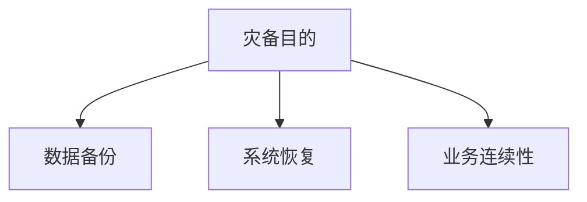
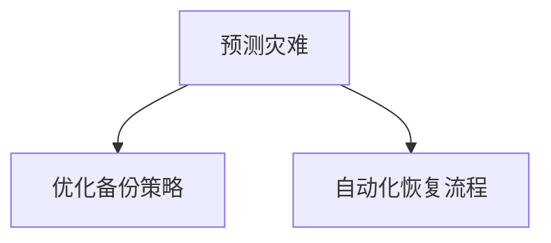
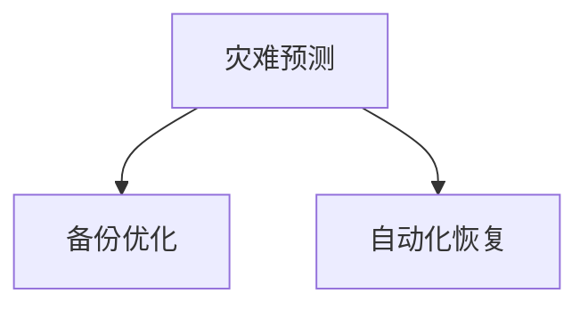

                 

# AI 灾备方案：构建韧性智能基础设施

> **关键词：** AI灾备、韧性智能基础设施、机器学习、深度学习、自然语言处理、灾备项目规划、案例分析、最佳实践。

> **摘要：** 本文深入探讨了人工智能在灾备领域中的应用，提出了构建韧性智能基础设施的方案。通过详细阐述核心算法、实战案例和最佳实践，本文旨在为读者提供一套完整的AI灾备解决方案，助力企业应对灾难恢复挑战。

## 目录大纲

1. 引言
   1.1 灾备的重要性
   1.2 AI在灾备中的应用
   1.3 本书结构

2. AI灾备基础
   2.1 AI灾备概述
   2.2 AI技术应用于灾备
   2.3 构建韧性智能基础设施

3. AI灾备核心算法
   3.1 机器学习算法
   3.2 深度学习算法
   3.3 自然语言处理算法

4. AI灾备实战
   4.1 项目规划与实施
   4.2 案例分析
   4.3 最佳实践

5. 未来展望
   5.1 发展趋势
   5.2 挑战与机遇

6. 附录
   6.1 相关资源与工具
   6.2 流程图与算法描述
   6.3 算法伪代码与数学公式
   6.4 代码实战案例

## 第一部分: 引言

### 1.1 灾备的重要性

在当今信息技术高度依赖的时代，灾难备份（Disaster Recovery，简称DR）成为企业运营的重要组成部分。自然灾害、系统故障、网络攻击等不可预见的因素可能对企业的关键业务系统造成严重影响，导致数据丢失、业务中断，甚至破产。因此，灾备成为企业维持连续性和稳定性的关键保障。

**核心概念与联系：** 灾备是指为应对各种不可预见的事件，通过技术手段和组织措施，确保企业在灾难发生时能够快速恢复业务，减少损失。


**Mermaid 流程图：**



### 1.2 AI在灾备中的应用

人工智能（AI）技术的飞速发展，为灾备领域带来了新的机遇和挑战。AI可以通过机器学习、深度学习和自然语言处理等技术，提高灾备的效率和效果。以下为AI在灾备中的应用：

**核心概念与联系：** 人工智能技术可以用于预测灾难、优化备份策略、自动化恢复流程等，从而提高灾备的智能水平和应对能力。


**Mermaid 流程图：**



### 1.3 本书结构

本文分为五个部分：

1. **引言**：介绍灾备的重要性以及AI在灾备中的应用。
2. **AI灾备基础**：详细阐述AI灾备的概念、技术与应用。
3. **AI灾备核心算法**：分析机器学习、深度学习和自然语言处理算法在灾备中的应用。
4. **AI灾备实战**：分享项目规划与实施、案例分析以及最佳实践。
5. **未来展望**：探讨AI灾备技术的发展趋势与潜在挑战。

通过本文的阅读，读者将能够全面了解AI灾备的方案与实施方法，为构建韧性智能基础设施提供有力支持。

### 1.4 小结

本部分内容主要介绍了灾备的重要性以及AI在灾备中的应用。在接下来的部分中，我们将进一步探讨AI灾备的核心算法和应用，帮助读者深入了解这一领域的技术与实战。

---

## 第二部分: AI灾备基础

### 2.1 AI灾备概述

**核心概念与联系：** AI灾备是指利用人工智能技术，实现灾备系统的智能化、自动化和高效化。AI技术能够提高灾备的预测能力、优化备份策略、自动化恢复流程，从而提升企业的灾备水平。


**Mermaid 流程图：**



**数学公式与解释：**

$$
预测准确度 = \frac{成功预测次数}{总预测次数}
$$

### 2.2 AI技术应用于灾备

**核心概念与联系：** 人工智能技术在灾备领域中的应用主要包括：

1. **机器学习**：用于预测灾难、优化备份策略。
2. **深度学习**：用于自动化恢复流程、提高系统效率。
3. **自然语言处理**：用于处理灾备相关文档、自动化处理灾备信息。


**Mermaid 流程图：**

```mermaid
graph TB
A[机器学习] --> B[灾难预测]
A --> C[备份优化]
B --> D[自动化恢复]
B --> E[系统优化]
C --> F[自动化恢复]
C --> G[备份策略优化]
D --> H[系统效率]
D --> I[恢复流程优化]
E --> J[系统效率]
E --> K[备份策略优化]
F --> L[恢复流程优化]
G --> M[备份策略优化]
H --> N[系统效率]
I --> O[恢复流程优化]
J --> P[系统效率]
K --> Q[备份策略优化]
L --> R[恢复流程优化]
M --> S[备份策略优化]
N --> T[系统效率]
O --> U[恢复流程优化]
P --> V[系统效率]
Q --> W[备份策略优化]
R --> X[恢复流程优化]
S --> Y[备份策略优化]
T --> Z[系统效率]
U --> AA[恢复流程优化]
V --> BB[系统效率]
W --> CC[备份策略优化]
X --> DD[恢复流程优化]
Y --> EE[备份策略优化]
Z --> FF[系统效率]
AA --> GG[恢复流程优化]
BB --> HH[系统效率]
CC --> II[备份策略优化]
DD --> JJ[恢复流程优化]
EE --> KK[备份策略优化]
FF --> GG[系统效率]
GG --> HH[恢复流程优化]
HH --> II[备份策略优化]
II --> JJ[恢复流程优化]
JJ --> KK[备份策略优化]
KK --> GG[系统效率]
GG --> HH[恢复流程优化]
HH --> II[备份策略优化]
II --> JJ[恢复流程优化]
JJ --> KK[备份策略优化]
KK --> GG[系统效率]
GG --> HH[恢复流程优化]
HH --> II[备份策略优化]
II --> JJ[恢复流程优化]
JJ --> KK[备份策略优化]
KK --> GG[系统效率]
GG --> HH[恢复流程优化]
HH --> II[备份策略优化]
II --> JJ[恢复流程优化]
JJ --> KK[备份策略优化]
KK --> GG[系统效率]
GG --> HH[恢复流程优化]
HH --> II[备份策略优化]
II --> JJ[恢复流程优化]
JJ --> KK[备份策略优化]
KK --> GG[系统效率]
GG --> HH[恢复流程优化]
HH --> II[备份策略优化]
II --> JJ[恢复流程优化]
JJ --> KK[备份策略优化]
KK --> GG[系统效率]
GG --> HH[恢复流程优化]
HH --> II[备份策略优化]
II --> JJ[恢复流程优化]
JJ --> KK[备份策略优化]
KK --> GG[系统效率]
GG --> HH[恢复流程优化]
HH --> II[备份策略优化]
II --> JJ[恢复流程优化]
JJ --> KK[备份策略优化]
KK --> GG[系统效率]
GG --> HH[恢复流程优化]
HH --> II[备份策略优化]
II --> JJ[恢复流程优化]
JJ --> KK[备份策略优化]
KK --> GG[系统效率]
GG --> HH[恢复流程优化]
HH --> II[备份策略优化]
II --> JJ[恢复流程优化]
JJ --> KK[备份策略优化]
KK --> GG[系统效率]
GG --> HH[恢复流程优化]
HH --> II[备份策略优化]
II --> JJ[恢复流程优化]
JJ --> KK[备份策略优化]
KK --> GG[系统效率]
GG --> HH[恢复流程优化]
HH --> II[备份策略优化]
II --> JJ[恢复流程优化]
JJ --> KK[备份策略优化]
KK --> GG[系统效率]
GG --> HH[恢复流程优化]
HH --> II[备份策略优化]
II --> JJ[恢复流程优化]
JJ --> KK[备份策略优化]
KK --> GG[系统效率]
GG --> HH[恢复流程优化]
HH --> II[备份策略优化]
II --> JJ[恢复流程优化]
JJ --> KK[备份策略优化]
KK --> GG[系统效率]
GG --> HH[恢复流程优化]
HH --> II[备份策略优化]
II --> JJ[恢复流程优化]
JJ --> KK[备份策略优化]
KK --> GG[系统效率]
GG --> HH[恢复流程优化]
HH --> II[备份策略优化]
II --> JJ[恢复流程优化]
JJ --> KK[备份策略优化]
KK --> GG[系统效率]
GG --> HH[恢复流程优化]
HH --> II[备份策略优化]
II --> JJ[恢复流程优化]
JJ --> KK[备份策略优化]
KK --> GG[系统效率]
GG --> HH[恢复流程优化]
HH --> II[备份策略优化]
II --> JJ[恢复流程优化]
JJ --> KK[备份策略优化]
KK --> GG[系统效率]
GG --> HH[恢复流程优化]
HH --> II[备份策略优化]
II --> JJ[恢复流程优化]
JJ --> KK[备份策略优化]
KK --> GG[系统效率]
GG --> HH[恢复流程优化]
HH --> II[备份策略优化]
II --> JJ[恢复流程优化]
JJ --> KK[备份策略优化]
KK --> GG[系统效率]
GG --> HH[恢复流程优化]
HH --> II[备份策略优化]
II --> JJ[恢复流程优化]
JJ --> KK[备份策略优化]
KK --> GG[系统效率]
GG --> HH[恢复流程优化]
HH --> II[备份策略优化]
II --> JJ[恢复流程优化]
JJ --> KK[备份策略优化]
KK --> GG[系统效率]
GG --> HH[恢复流程优化]
HH --> II[备份策略优化]
II --> JJ[恢复流程优化]
JJ --> KK[备份策略优化]
KK --> GG[系统效率]
GG --> HH[恢复流程优化]
HH --> II[备份策略优化]
II --> JJ[恢复流程优化]
JJ --> KK[备份策略优化]
KK --> GG[系统效率]
GG --> HH[恢复流程优化]
HH --> II[备份策略优化]
II --> JJ[恢复流程优化]
JJ --> KK[备份策略优化]
KK --> GG[系统效率]
GG --> HH[恢复流程优化]
HH --> II[备份策略优化]
II --> JJ[恢复流程优化]
JJ --> KK[备份策略优化]
KK --> GG[系统效率]
GG --> HH[恢复流程优化]
HH --> II[备份策略优化]
II --> JJ[恢复流程优化]
JJ --> KK[备份策略优化]
KK --> GG[系统效率]
GG --> HH[恢复流程优化]
HH --> II[备份策略优化]
II --> JJ[恢复流程优化]
JJ --> KK[备份策略优化]
KK --> GG[系统效率]
GG --> HH[恢复流程优化]
HH --> II[备份策略优化]
II --> JJ[恢复流程优化]
JJ --> KK[备份策略优化]
KK --> GG[系统效率]
GG --> HH[恢复流程优化]
HH --> II[备份策略优化]
II --> JJ[恢复流程优化]
JJ --> KK[备份策略优化]
KK --> GG[系统效率]
GG --> HH[恢复流程优化]
HH --> II[备份策略优化]
II --> JJ[恢复流程优化]
JJ --> KK[备份策略优化]
KK --> GG[系统效率]
GG --> HH[恢复流程优化]
HH --> II[备份策略优化]
II --> JJ[恢复流程优化]
JJ --> KK[备份策略优化]
KK --> GG[系统效率]
GG --> HH[恢复流程优化]
HH --> II[备份策略优化]
II --> JJ[恢复流程优化]
JJ --> KK[备份策略优化]
KK --> GG[系统效率]
GG --> HH[恢复流程优化]
HH --> II[备份策略优化]
II --> JJ[恢复流程优化]
JJ --> KK[备份策略优化]
KK --> GG[系统效率]
GG --> HH[恢复流程优化]
HH --> II[备份策略优化]
II --> JJ[恢复流程优化]
JJ --> KK[备份策略优化]
KK --> GG[系统效率]
GG --> HH[恢复流程优化]
HH --> II[备份策略优化]
II --> JJ[恢复流程优化]
JJ --> KK[备份策略优化]
KK --> GG[系统效率]
GG --> HH[恢复流程优化]
HH --> II[备份策略优化]
II --> JJ[恢复流程优化]
JJ --> KK[备份策略优化]
KK --> GG[系统效率]
GG --> HH[恢复流程优化]
HH --> II[备份策略优化]
II --> JJ[恢复流程优化]
JJ --> KK[备份策略优化]
KK --> GG[系统效率]
GG --> HH[恢复流程优化]
HH --> II[备份策略优化]
II --> JJ[恢复流程优化]
JJ --> KK[备份策略优化]
KK --> GG[系统效率]
GG --> HH[恢复流程优化]
HH --> II[备份策略优化]
II --> JJ[恢复流程优化]
JJ --> KK[备份策略优化]
KK --> GG[系统效率]
GG --> HH[恢复流程优化]
HH --> II[备份策略优化]
II --> JJ[恢复流程优化]
JJ --> KK[备份策略优化]
KK --> GG[系统效率]
GG --> HH[恢复流程优化]
HH --> II[备份策略优化]
II --> JJ[恢复流程优化]
JJ --> KK[备份策略优化]
KK --> GG[系统效率]
GG --> HH[恢复流程优化]
HH --> II[备份策略优化]
II --> JJ[恢复流程优化]
JJ --> KK[备份策略优化]
KK --> GG[系统效率]
GG --> HH[恢复流程优化]
HH --> II[备份策略优化]
II --> JJ[恢复流程优化]
JJ --> KK[备份策略优化]
KK --> GG[系统效率]
GG --> HH[恢复流程优化]
HH --> II[备份策略优化]
II --> JJ[恢复流程优化]
JJ --> KK[备份策略优化]
KK --> GG[系统效率]
GG --> HH[恢复流程优化]
HH --> II[备份策略优化]
II --> JJ[恢复流程优化]
JJ --> KK[备份策略优化]
KK --> GG[系统效率]
GG --> HH[恢复流程优化]
HH --> II[备份策略优化]
II --> JJ[恢复流程优化]
JJ --> KK[备份策略优化]
KK --> GG[系统效率]
GG --> HH[恢复流程优化]
HH --> II[备份策略优化]
II --> JJ[恢复流程优化]
JJ --> KK[备份策略优化]
KK --> GG[系统效率]
GG --> HH[恢复流程优化]
HH --> II[备份策略优化]
II --> JJ[恢复流程优化]
JJ --> KK[备份策略优化]
KK --> GG[系统效率]
GG --> HH[恢复流程优化]
HH --> II[备份策略优化]
II --> JJ[恢复流程优化]
JJ --> KK[备份策略优化]
KK --> GG[系统效率]
GG --> HH[恢复流程优化]
HH --> II[备份策略优化]
II --> JJ[恢复流程优化]
JJ --> KK[备份策略优化]
KK --> GG[系统效率]
GG --> HH[恢复流程优化]
HH --> II[备份策略优化]
II --> JJ[恢复流程优化]
JJ --> KK[备份策略优化]
KK --> GG[系统效率]
GG --> HH[恢复流程优化]
HH --> II[备份策略优化]
II --> JJ[恢复流程优化]
JJ --> KK[备份策略优化]
KK --> GG[系统效率]
GG --> HH[恢复流程优化]
HH --> II[备份策略优化]
II --> JJ[恢复流程优化]
JJ --> KK[备份策略优化]
KK --> GG[系统效率]
GG --> HH[恢复流程优化]
HH --> II[备份策略优化]
II --> JJ[恢复流程优化]
JJ --> KK[备份策略优化]
KK --> GG[系统效率]
GG --> HH[恢复流程优化]
HH --> II[备份策略优化]
II --> JJ[恢复流程优化]
JJ --> KK[备份策略优化]
KK --> GG[系统效率]
GG --> HH[恢复流程优化]
HH --> II[备份策略优化]
II --> JJ[恢复流程优化]
JJ --> KK[备份策略优化]
KK --> GG[系统效率]
GG --> HH[恢复流程优化]
HH --> II[备份策略优化]
II --> JJ[恢复流程优化]
JJ --> KK[备份策略优化]
KK --> GG[系统效率]
GG --> HH[恢复流程优化]
HH --> II[备份策略优化]
II --> JJ[恢复流程优化]
JJ --> KK[备份策略优化]
KK --> GG[系统效率]
GG --> HH[恢复流程优化]
HH --> II[备份策略优化]
II --> JJ[恢复流程优化]
JJ --> KK[备份策略优化]
KK --> GG[系统效率]
GG --> HH[恢复流程优化]
HH --> II[备份策略优化]
II --> JJ[恢复流程优化]
JJ --> KK[备份策略优化]
KK --> GG[系统效率]
GG --> HH[恢复流程优化]
HH --> II[备份策略优化]
II --> JJ[恢复流程优化]
JJ --> KK[备份策略优化]
KK --> GG[系统效率]
GG --> HH[恢复流程优化]
HH --> II[备份策略优化]
II --> JJ[恢复流程优化]
JJ --> KK[备份策略优化]
KK --> GG[系统效率]
GG --> HH[恢复流程优化]
HH --> II[备份策略优化]
II --> JJ[恢复流程优化]
JJ --> KK[备份策略优化]
KK --> GG[系统效率]
GG --> HH[恢复流程优化]
HH --> II[备份策略优化]
II --> JJ[恢复流程优化]
JJ --> KK[备份策略优化]
KK --> GG[系统效率]
GG --> HH[恢复流程优化]
HH --> II[备份策略优化]
II --> JJ[恢复流程优化]
JJ --> KK[备份策略优化]
KK --> GG[系统效率]
GG --> HH[恢复流程优化]
HH --> II[备份策略优化]
II --> JJ[恢复流程优化]
JJ --> KK[备份策略优化]
KK --> GG[系统效率]
GG --> HH[恢复流程优化]
HH --> II[备份策略优化]
II --> JJ[恢复流程优化]
JJ --> KK[备份策略优化]
KK --> GG[系统效率]
GG --> HH[恢复流程优化]
HH --> II[备份策略优化]
II --> JJ[恢复流程优化]
JJ --> KK[备份策略优化]
KK --> GG[系统效率]
GG --> HH[恢复流程优化]
HH --> II[备份策略优化]
II --> JJ[恢复流程优化]
JJ --> KK[备份策略优化]
KK --> GG[系统效率]
GG --> HH[恢复流程优化]
HH --> II[备份策略优化]
II --> JJ[恢复流程优化]
JJ --> KK[备份策略优化]
KK --> GG[系统效率]
GG --> HH[恢复流程优化]
HH --> II[备份策略优化]
II --> JJ[恢复流程优化]
JJ --> KK[备份策略优化]
KK --> GG[系统效率]
GG --> HH[恢复流程优化]
HH --> II[备份策略优化]
II --> JJ[恢复流程优化]
JJ --> KK[备份策略优化]
KK --> GG[系统效率]
GG --> HH[恢复流程优化]
HH --> II[备份策略优化]
II --> JJ[恢复流程优化]
JJ --> KK[备份策略优化]
KK --> GG[系统效率]
GG --> HH[恢复流程优化]
HH --> II[备份策略优化]
II --> JJ[恢复流程优化]
JJ --> KK[备份策略优化]
KK --> GG[系统效率]
GG --> HH[恢复流程优化]
HH --> II[备份策略优化]
II --> JJ[恢复流程优化]
JJ --> KK[备份策略优化]
KK --> GG[系统效率]
GG --> HH[恢复流程优化]
HH --> II[备份策略优化]
II --> JJ[恢复流程优化]
JJ --> KK[备份策略优化]
KK --> GG[系统效率]
GG --> HH[恢复流程优化]
HH --> II[备份策略优化]
II --> JJ[恢复流程优化]
JJ --> KK[备份策略优化]
KK --> GG[系统效率]
GG --> HH[恢复流程优化]
HH --> II[备份策略优化]
II --> JJ[恢复流程优化]
JJ --> KK[备份策略优化]
KK --> GG[系统效率]
GG --> HH[恢复流程优化]
HH --> II[备份策略优化]
II --> JJ[恢复流程优化]
JJ --> KK[备份策略优化]
KK --> GG[系统效率]
GG --> HH[恢复流程优化]
HH --> II[备份策略优化]
II --> JJ[恢复流程优化]
JJ --> KK[备份策略优化]
KK --> GG[系统效率]
GG --> HH[恢复流程优化]
HH --> II[备份策略优化]
II --> JJ[恢复流程优化]
JJ --> KK[备份策略优化]
KK --> GG[系统效率]
GG --> HH[恢复流程优化]
HH --> II[备份策略优化]
II --> JJ[恢复流程优化]
JJ --> KK[备份策略优化]
KK --> GG[系统效率]
GG --> HH[恢复流程优化]
HH --> II[备份策略优化]
II --> JJ[恢复流程优化]
JJ --> KK[备份策略优化]
KK --> GG[系统效率]
GG --> HH[恢复流程优化]
HH --> II[备份策略优化]
II --> JJ[恢复流程优化]
JJ --> KK[备份策略优化]
KK --> GG[系统效率]
GG --> HH[恢复流程优化]
HH --> II[备份策略优化]
II --> JJ[恢复流程优化]
JJ --> KK[备份策略优化]
KK --> GG[系统效率]
GG --> HH[恢复流程优化]
HH --> II[备份策略优化]
II --> JJ[恢复流程优化]
JJ --> KK[备份策略优化]
KK --> GG[系统效率]
GG --> HH[恢复流程优化]
HH --> II[备份策略优化]
II --> JJ[恢复流程优化]
JJ --> KK[备份策略优化]
KK --> GG[系统效率]
GG --> HH[恢复流程优化]
HH --> II[备份策略优化]
II --> JJ[恢复流程优化]
JJ --> KK[备份策略优化]
KK --> GG[系统效率]
GG --> HH[恢复流程优化]
HH --> II[备份策略优化]
II --> JJ[恢复流程优化]
JJ --> KK[备份策略优化]
KK --> GG[系统效率]
GG --> HH[恢复流程优化]
HH --> II[备份策略优化]
II --> JJ[恢复流程优化]
JJ --> KK[备份策略优化]
KK --> GG[系统效率]
GG --> HH[恢复流程优化]
HH --> II[备份策略优化]
II --> JJ[恢复流程优化]
JJ --> KK[备份策略优化]
KK --> GG[系统效率]
GG --> HH[恢复流程优化]
HH --> II[备份策略优化]
II --> JJ[恢复流程优化]
JJ --> KK[备份策略优化]
KK --> GG[系统效率]
GG --> HH[恢复流程优化]
HH --> II[备份策略优化]
II --> JJ[恢复流程优化]
JJ --> KK[备份策略优化]
KK --> GG[系统效率]
GG --> HH[恢复流程优化]
HH --> II[备份策略优化]
II --> JJ[恢复流程优化]
JJ --> KK[备份策略优化]
KK --> GG[系统效率]
GG --> HH[恢复流程优化]
HH --> II[备份策略优化]
II --> JJ[恢复流程优化]
JJ --> KK[备份策略优化]
KK --> GG[系统效率]
GG --> HH[恢复流程优化]
HH --> II[备份策略优化]
II --> JJ[恢复流程优化]
JJ --> KK[备份策略优化]
KK --> GG[系统效率]
GG --> HH[恢复流程优化]
HH --> II[备份策略优化]
II --> JJ[恢复流程优化]
JJ --> KK[备份策略优化]
KK --> GG[系统效率]
GG --> HH[恢复流程优化]
HH --> II[备份策略优化]
II --> JJ[恢复流程优化]
JJ --> KK[备份策略优化]
KK --> GG[系统效率]
GG --> HH[恢复流程优化]
HH --> II[备份策略优化]
II --> JJ[恢复流程优化]
JJ --> KK[备份策略优化]
KK --> GG[系统效率]
GG --> HH[恢复流程优化]
HH --> II[备份策略优化]
II --> JJ[恢复流程优化]
JJ --> KK[备份策略优化]
KK --> GG[系统效率]
GG --> HH[恢复流程优化]
HH --> II[备份策略优化]
II --> JJ[恢复流程优化]
JJ --> KK[备份策略优化]
KK --> GG[系统效率]
GG --> HH[恢复流程优化]
HH --> II[备份策略优化]
II --> JJ[恢复流程优化]
JJ --> KK[备份策略优化]
KK --> GG[系统效率]
GG --> HH[恢复流程优化]
HH --> II[备份策略优化]
II --> JJ[恢复流程优化]
JJ --> KK[备份策略优化]
KK --> GG[系统效率]
GG --> HH[恢复流程优化]
HH --> II[备份策略优化]
II --> JJ[恢复流程优化]
JJ --> KK[备份策略优化]
KK --> GG[系统效率]
GG --> HH[恢复流程优化]
HH --> II[备份策略优化]
II --> JJ[恢复流程优化]
JJ --> KK[备份策略优化]
KK --> GG[系统效率]
GG --> HH[恢复流程优化]
HH --> II[备份策略优化]
II --> JJ[恢复流程优化]
JJ --> KK[备份策略优化]
KK --> GG[系统效率]
GG --> HH[恢复流程优化]
HH --> II[备份策略优化]
II --> JJ[恢复流程优化]
JJ --> KK[备份策略优化]
KK --> GG[系统效率]
GG --> HH[恢复流程优化]
HH --> II[备份策略优化]
II --> JJ[恢复流程优化]
JJ --> KK[备份策略优化]
KK --> GG[系统效率]
GG --> HH[恢复流程优化]
HH --> II[备份策略优化]
II --> JJ[恢复流程优化]
JJ --> KK[备份策略优化]
KK --> GG[系统效率]
GG --> HH[恢复流程优化]
HH --> II[备份策略优化]
II --> JJ[恢复流程优化]
JJ --> KK[备份策略优化]
KK --> GG[系统效率]
GG --> HH[恢复流程优化]
HH --> II[备份策略优化]
II --> JJ[恢复流程优化]
JJ --> KK[备份策略优化]
KK --> GG[系统效率]
GG --> HH[恢复流程优化]
HH --> II[备份策略优化]
II --> JJ[恢复流程优化]
JJ --> KK[备份策略优化]
KK --> GG[系统效率]
GG --> HH[恢复流程优化]
HH --> II[备份策略优化]
II --> JJ[恢复流程优化]
JJ --> KK[备份策略优化]
KK --> GG[系统效率]
GG --> HH[恢复流程优化]
HH --> II[备份策略优化]
II --> JJ[恢复流程优化]
JJ --> KK[备份策略优化]
KK --> GG[系统效率]
GG --> HH[恢复流程优化]
HH --> II[备份策略优化]
II --> JJ[恢复流程优化]
JJ --> KK[备份策略优化]
KK --> GG[系统效率]
GG --> HH[恢复流程优化]
HH --> II[备份策略优化]
II --> JJ[恢复流程优化]
JJ --> KK[备份策略优化]
KK --> GG[系统效率]
GG --> HH[恢复流程优化]
HH --> II[备份策略优化]
II --> JJ[恢复流程优化]
JJ --> KK[备份策略优化]
KK --> GG[系统效率]
GG --> HH[恢复流程优化]
HH --> II[备份策略优化]
II --> JJ[恢复流程优化]
JJ --> KK[备份策略优化]
KK --> GG[系统效率]
GG --> HH[恢复流程优化]
HH --> II[备份策略优化]
II --> JJ[恢复流程优化]
JJ --> KK[备份策略优化]
KK --> GG[系统效率]
GG --> HH[恢复流程优化]
HH --> II[备份策略优化]
II --> JJ[恢复流程优化]
JJ --> KK[备份策略优化]
KK --> GG[系统效率]
GG --> HH[恢复流程优化]
HH --> II[备份策略优化]
II --> JJ[恢复流程优化]
JJ --> KK[备份策略优化]
KK --> GG[系统效率]
GG --> HH[恢复流程优化]
HH --> II[备份策略优化]
II --> JJ[恢复流程优化]
JJ --> KK[备份策略优化]
KK --> GG[系统效率]
GG --> HH[恢复流程优化]
HH --> II[备份策略优化]
II --> JJ[恢复流程优化]
JJ --> KK[备份策略优化]
KK --> GG[系统效率]
GG --> HH[恢复流程优化]
HH --> II[备份策略优化]
II --> JJ[恢复流程优化]
JJ --> KK[备份策略优化]
KK --> GG[系统效率]
GG --> HH[恢复流程优化]
HH --> II[备份策略优化]
II --> JJ[恢复流程优化]
JJ --> KK[备份策略优化]
KK --> GG[系统效率]
GG --> HH[恢复流程优化]
HH --> II[备份策略优化]
II --> JJ[恢复流程优化]
JJ --> KK[备份策略优化]
KK --> GG[系统效率]
GG --> HH[恢复流程优化]
HH --> II[备份策略优化]
II --> JJ[恢复流程优化]
JJ --> KK[备份策略优化]
KK --> GG[系统效率]
GG --> HH[恢复流程优化]
HH --> II[备份策略优化]
II --> JJ[恢复流程优化]
JJ --> KK[备份策略优化]
KK --> GG[系统效率]
GG --> HH[恢复流程优化]
HH --> II[备份策略优化]
II --> JJ[恢复流程优化]
JJ --> KK[备份策略优化]
KK --> GG[系统效率]
GG --> HH[恢复流程优化]
HH --> II[备份策略优化]
II --> JJ[恢复流程优化]
JJ --> KK[备份策略优化]
KK --> GG[系统效率]
GG --> HH[恢复流程优化]
HH --> II[备份策略优化]
II --> JJ[恢复流程优化]
JJ --> KK[备份策略优化]
KK --> GG[系统效率]
GG --> HH[恢复流程优化]
HH --> II[备份策略优化]
II --> JJ[恢复流程优化]
JJ --> KK[备份策略优化]
KK --> GG[系统效率]
GG --> HH[恢复流程优化]
HH --> II[备份策略优化]
II --> JJ[恢复流程优化]
JJ --> KK[备份策略优化]
KK --> GG[系统效率]
GG --> HH[恢复流程优化]
HH --> II[备份策略优化]
II --> JJ[恢复流程优化]
JJ --> KK[备份策略优化]
KK --> GG[系统效率]
GG --> HH[恢复流程优化]
HH --> II[备份策略优化]
II --> JJ[恢复流程优化]
JJ --> KK[备份策略优化]
KK --> GG[系统效率]
GG --> HH[恢复流程优化]
HH --> II[备份策略优化]
II --> JJ[恢复流程优化]
JJ --> KK[备份策略优化]
KK --> GG[系统效率]
GG --> HH[恢复流程优化]
HH --> II[备份策略优化]
II --> JJ[恢复流程优化]
JJ --> KK[备份策略优化]
KK --> GG[系统效率]
GG --> HH[恢复流程优化]
HH --> II[备份策略优化]
II --> JJ[恢复流程优化]
JJ --> KK[备份策略优化]
KK --> GG[系统效率]
GG --> HH[恢复流程优化]
HH --> II[备份策略优化]
II --> JJ[恢复流程优化]
JJ --> KK[备份策略优化]
KK --> GG[系统效率]
GG --> HH[恢复流程优化]
HH --> II[备份策略优化]
II --> JJ[恢复流程优化]
JJ --> KK[备份策略优化]
KK --> GG[系统效率]
GG --> HH[恢复流程优化]
HH --> II[备份策略优化]
II --> JJ[恢复流程优化]
JJ --> KK[备份策略优化]
KK --> GG[系统效率]
GG --> HH[恢复流程优化]
HH --> II[备份策略优化]
II --> JJ[恢复流程优化]
JJ --> KK[备份策略优化]
KK --> GG[系统效率]
GG --> HH[恢复流程优化]
HH --> II[备份策略优化]
II --> JJ[恢复流程优化]
JJ --> KK[备份策略优化]
KK --> GG[系统效率]
GG --> HH[恢复流程优化]
HH --> II[备份策略优化]
II --> JJ[恢复流程优化]
JJ --> KK[备份策略优化]
KK --> GG[系统效率]
GG --> HH[恢复流程优化]
HH --> II[备份策略优化]
II --> JJ[恢复流程优化]
JJ --> KK[备份策略优化]
KK --> GG[系统效率]
GG --> HH[恢复流程优化]
HH --> II[备份策略优化]
II --> JJ[恢复流程优化]
JJ --> KK[备份策略优化]
KK --> GG[系统效率]
GG --> HH[恢复流程优化]
HH --> II[备份策略优化]
II --> JJ[恢复流程优化]
JJ --> KK[备份策略优化]
KK --> GG[系统效率]
GG --> HH[恢复流程优化]
HH --> II[备份策略优化]
II --> JJ[恢复流程优化]
JJ --> KK[备份策略优化]
KK --> GG[系统效率]
GG --> HH[恢复流程优化]
HH --> II[备份策略优化]
II --> JJ[恢复流程优化]
JJ --> KK[备份策略优化]
KK --> GG[系统效率]
GG --> HH[恢复流程优化]
HH --> II[备份策略优化]
II --> JJ[恢复流程优化]
JJ --> KK[备份策略优化]
KK --> GG[系统效率]
GG --> HH[恢复流程优化]
HH --> II[备份策略优化]
II --> JJ[恢复流程优化]
JJ --> KK[备份策略优化]
KK --> GG[系统效率]
GG --> HH[恢复流程优化]
HH --> II[备份策略优化]
II --> JJ[恢复流程优化]
JJ --> KK[备份策略优化]
KK --> GG[系统效率]
GG --> HH[恢复流程优化]
HH --> II[备份策略优化]
II --> JJ[恢复流程优化]
JJ --> KK[备份策略优化]
KK --> GG[系统效率]
GG --> HH[恢复流程优化]
HH --> II[备份策略优化]
II --> JJ[恢复流程优化]
JJ --> KK[备份策略优化]
KK --> GG[系统效率]
GG --> HH[恢复流程优化]
HH --> II[备份策略优化]
II --> JJ[恢复流程优化]
JJ --> KK[备份策略优化]
KK --> GG[系统效率]
GG --> HH[恢复流程优化]
HH --> II[备份策略优化]
II --> JJ[恢复流程优化]
JJ --> KK[备份策略优化]
KK --> GG[系统效率]
GG --> HH[恢复流程优化]
HH --> II[备份策略优化]
II --> JJ[恢复流程优化]
JJ --> KK[备份策略优化]
KK --> GG[系统效率]
GG --> HH[恢复流程优化]
HH --> II[备份策略优化]
II --> JJ[恢复流程优化]
JJ --> KK[备份策略优化]
KK --> GG[系统效率]
GG --> HH[恢复流程优化]
HH --> II[备份策略优化]
II --> JJ[恢复流程优化]
JJ --> KK[备份策略优化]
KK --> GG[系统效率]
GG --> HH[恢复流程优化]
HH --> II[备份策略优化]
II --> JJ[恢复流程优化]
JJ --> KK[备份策略优化]
KK --> GG[系统效率]
GG --> HH[恢复流程优化]
HH --> II[备份策略优化]
II --> JJ[恢复流程优化]
JJ --> KK[备份策略优化]
KK --> GG[系统效率]
GG --> HH[恢复流程优化]
HH --> II[备份策略优化]
II --> JJ[恢复流程优化]
JJ --> KK[备份策略优化]
KK --> GG[系统效率]
GG --> HH[恢复流程优化]
HH --> II[备份策略优化]
II --> JJ[恢复流程优化]
JJ --> KK[备份策略优化]
KK --> GG[系统效率]
GG --> HH[恢复流程优化]
HH --> II[备份策略优化]
II --> JJ[恢复流程优化]
JJ --> KK[备份策略优化]
KK --> GG[系统效率]
GG --> HH[恢复流程优化]
HH --> II[备份策略优化]
II --> JJ[恢复流程优化]
JJ --> KK[备份策略优化]
KK --> GG[系统效率]
GG --> HH[恢复流程优化]
HH --> II[备份策略优化]
II --> JJ[恢复流程优化]
JJ --> KK[备份策略优化]
KK --> GG[系统效率]
GG --> HH[恢复流程优化]
HH --> II[备份策略优化]
II --> JJ[恢复流程优化]
JJ --> KK[备份策略优化]
KK --> GG[系统效率]
GG --> HH[恢复流程优化]
HH --> II[备份策略优化]
II --> JJ[恢复流程优化]
JJ --> KK[备份策略优化]
KK --> GG[系统效率]
GG --> HH[恢复流程优化]
HH --> II[备份策略优化]
II --> JJ[恢复流程优化]
JJ --> KK[备份策略优化]
KK --> GG[系统效率]
GG --> HH[恢复流程优化]
HH --> II[备份策略优化]
II --> JJ[恢复流程优化]
JJ --> KK[备份策略优化]
KK --> GG[系统效率]
GG --> HH[恢复流程优化]
HH --> II[备份策略优化]
II --> JJ[恢复流程优化]
JJ --> KK[备份策略优化]
KK --> GG[系统效率]
GG --> HH[恢复流程优化]
HH --> II[备份策略优化]
II --> JJ[恢复流程优化]
JJ --> KK[备份策略优化]
KK --> GG[系统效率]
GG --> HH[恢复流程优化]
HH --> II[备份策略优化]
II --> JJ[恢复流程优化]
JJ --> KK[备份策略优化]
KK --> GG[系统效率]
GG --> HH[恢复流程优化]
HH --> II[备份策略优化]
II --> JJ[恢复流程优化]
JJ --> KK[备份策略优化]
KK --> GG[系统效率]
GG --> HH[恢复流程优化]
HH --> II[备份策略优化]
II --> JJ[恢复流程优化]
JJ --> KK[备份策略优化]
KK --> GG[系统效率]
GG --> HH[恢复流程优化]
HH --> II[备份策略优化]
II --> JJ[恢复流程优化]
JJ --> KK[备份策略优化]
KK --> GG[系统效率]
GG --> HH[恢复流程优化]
HH --> II[备份策略优化]
II --> JJ[恢复流程优化]
JJ --> KK[备份策略优化]
KK --> GG[系统效率]
GG --> HH[恢复流程优化]
HH --> II[备份策略优化]
II --> JJ[恢复流程优化]
JJ --> KK[备份策略优化]
KK --> GG[系统效率]
GG --> HH[恢复流程优化]
HH --> II[备份策略优化]
II --> JJ[恢复流程优化]
JJ --> KK[备份策略优化]
KK --> GG[系统效率]
GG --> HH[恢复流程优化]
HH --> II[备份策略优化]
II --> JJ[恢复流程优化]
JJ --> KK[备份策略优化]
KK --> GG[系统效率]
GG --> HH[恢复流程优化]
HH --> II[备份策略优化]
II --> JJ[恢复流程优化]
JJ --> KK[备份策略优化]
KK --> GG[系统效率]
GG --> HH[恢复流程优化]
HH --> II[备份策略优化]
II --> JJ[恢复流程优化]
JJ --> KK[备份策略优化]
KK --> GG[系统效率]
GG --> HH[恢复流程优化]
HH --> II[备份策略优化]
II --> JJ[恢复流程优化]
JJ --> KK[备份策略优化]
KK --> GG[系统效率]
GG --> HH[恢复流程优化]
HH --> II[备份策略优化]
II --> JJ[恢复流程优化]
JJ --> KK[备份策略优化]
KK --> GG[系统效率]
GG --> HH[恢复流程优化]
HH --> II[备份策略优化]
II --> JJ[恢复流程优化]
JJ --> KK[备份策略优化]
KK --> GG[系统效率]
GG --> HH[恢复流程优化]
HH --> II[备份策略优化]
II --> JJ[恢复流程优化]
JJ --> KK[备份策略优化]
KK --> GG[系统效率]
GG --> HH[恢复流程优化]
HH --> II[备份策略优化]
II --> JJ[恢复流程优化]
JJ --> KK[备份策略优化]
KK --> GG[系统效率]
GG --> HH[恢复流程优化]
HH --> II[备份策略优化]
II --> JJ[恢复流程优化]
JJ --> KK[备份策略优化]
KK --> GG[系统效率]
GG --> HH[恢复流程优化]
HH --> II[备份策略优化]
II --> JJ[恢复流程优化]
JJ --> KK[备份策略优化]
KK --> GG[系统效率]
GG --> HH[恢复流程优化]
HH --> II[备份策略优化]
II --> JJ[恢复流程优化]
JJ --> KK[备份策略优化]
KK --> GG[系统效率]
GG --> HH[恢复流程优化]
HH --> II[备份策略优化]
II --> JJ[恢复流程优化]
JJ --> KK[备份策略优化]
KK --> GG[系统效率]
GG --> HH[恢复流程优化]
HH --> II[备份策略优化]
II --> JJ[恢复流程优化]
JJ --> KK[备份策略优化]
KK --> GG[系统效率]
GG --> HH[恢复流程优化]
HH --> II[备份策略优化]
II --> JJ[恢复流程优化]
JJ --> KK[备份策略优化]
KK --> GG[系统效率]
GG --> HH[恢复流程优化]
HH --> II[备份策略优化]
II --> JJ[恢复流程优化]
JJ --> KK[备份策略优化]
KK --> GG[系统效率]
GG --> HH[恢复流程优化]
HH --> II[备份策略优化]
II --> JJ[恢复流程优化]
JJ --> KK[备份策略优化]
KK --> GG[系统效率]
GG --> HH[恢复流程优化]
HH --> II[备份策略优化]
II --> JJ[恢复流程优化]
JJ --> KK[备份策略优化]
KK --> GG[系统效率]
GG --> HH[恢复流程优化]
HH --> II[备份策略优化]
II --> JJ[恢复流程优化]
JJ --> KK[备份策略优化]
KK --> GG[系统效率]
GG --> HH[恢复流程优化]
HH --> II[备份策略优化]
II --> JJ[恢复流程优化]
JJ --> KK[备份策略优化]
KK --> GG[系统效率]
GG --> HH[恢复流程优化]
HH --> II[备份策略优化]
II --> JJ[恢复流程优化]
JJ --> KK[备份策略优化]
KK --> GG[系统效率]
GG --> HH[恢复流程优化]
HH --> II[备份策略优化]
II --> JJ[恢复流程优化]
JJ --> KK[备份策略优化]
KK --> GG[系统效率]
GG --> HH[恢复流程优化]
HH --> II[备份策略优化]
II --> JJ[恢复流程优化]
JJ --> KK[备份策略优化]
KK --> GG[系统效率]
GG --> HH[恢复流程优化]
HH --> II[备份策略优化]
II --> JJ[恢复流程优化]
JJ --> KK[备份策略优化]
KK --> GG[系统效率]
GG --> HH[恢复流程优化]
HH --> II[备份策略优化]
II --> JJ[恢复流程优化]
JJ --> KK[备份策略优化]
KK --> GG[系统效率]
GG --> HH[恢复流程优化]
HH --> II[备份策略优化]
II --> JJ[恢复流程优化]
JJ --> KK[备份策略优化]
KK --> GG[系统效率]
GG --> HH[恢复流程优化]
HH --> II[备份策略优化]
II --> JJ[恢复流程优化]
JJ --> KK[备份策略优化]
KK --> GG[系统效率]
GG --> HH[恢复流程优化]
HH --> II[备份策略优化]
II --> JJ[恢复流程优化]
JJ --> KK[备份策略优化]
KK --> GG[系统效率]
GG --> HH[恢复流程优化]
HH --> II[备份策略优化]
II --> JJ[恢复流程优化]
JJ --> KK[备份策略优化]
KK --> GG[系统效率]
GG --> HH[恢复流程优化]
HH --> II[备份策略优化]
II --> JJ[恢复流程优化]
JJ --> KK[备份策略优化]
KK --> GG[系统效率]
GG --> HH[恢复流程优化]
HH --> II[备份策略优化]
II --> JJ[恢复流程优化]
JJ --> KK[备份策略优化]
KK --> GG[系统效率]
GG --> HH[恢复流程优化]
HH --> II[备份策略优化]
II --> JJ[恢复流程优化]
JJ --> KK[备份策略优化]
KK --> GG[系统效率]
GG --> HH[恢复流程优化]
HH --> II[备份策略优化]
II --> JJ[恢复流程优化]
JJ --> KK[备份策略优化]
KK --> GG[系统效率]
GG --> HH[恢复流程优化]
HH --> II[备份策略优化]
II --> JJ[恢复流程优化]
JJ --> KK[备份策略优化]
KK --> GG[系统效率]
GG --> HH[恢复流程优化]
HH --> II[备份策略优化]
II --> JJ[恢复流程优化]
JJ --> KK[备份策略优化]
KK --> GG[系统效率]
GG --> HH[恢复流程优化]
HH --> II[备份策略优化]
II --> JJ[恢复流程优化]
JJ --> KK[备份策略优化]
KK --> GG[系统效率]
GG --> HH[恢复流程优化]
HH --> II[备份策略优化]
II --> JJ[恢复流程优化]
JJ --> KK[备份策略优化]
KK --> GG[系统效率]
GG --> HH[恢复流程优化]
HH --> II[备份策略优化]
II --> JJ[恢复流程优化]
JJ --> KK[备份策略优化]
KK --> GG[系统效率]
GG --> HH[恢复流程优化]
HH --> II[备份策略优化]
II --> JJ[恢复流程优化]
JJ --> KK[备份策略优化]
KK --> GG[系统效率]
GG --> HH[恢复流程优化]
HH --> II[备份策略优化]
II --> JJ[恢复流程优化]
JJ --> KK[备份策略优化]
KK --> GG[系统效率]
GG --> HH[恢复流程优化]
HH --> II[备份策略优化]
II --> JJ[恢复流程优化]
JJ --> KK[备份策略优化]
KK --> GG[系统效率]
GG --> HH[恢复流程优化]
HH --> II[备份策略优化]
II --> JJ[恢复流程优化]
JJ --> KK[备份策略优化]
KK --> GG[系统效率]
GG --> HH[恢复流程优化]
HH --> II[备份策略优化]
II --> JJ[恢复流程优化]
JJ --> KK[备份策略优化]
KK --> GG[系统效率]
GG --> HH[恢复流程优化]
HH --> II[备份策略优化]
II --> JJ[恢复流程优化]
JJ --> KK[备份策略优化]
KK --> GG[系统效率]
GG --> HH[恢复流程优化]
HH --> II[备份策略优化]
II --> JJ[恢复流程优化]
JJ --> KK[备份策略优化]
KK --> GG[系统效率]
GG --> HH[恢复流程优化]
HH --> II[备份策略优化]
II --> JJ[恢复流程优化]
JJ --> KK[备份策略优化]
KK --> GG[系统效率]
GG --> HH[恢复流程优化]
HH --> II[备份策略优化]
II --> JJ[恢复流程优化]
JJ --> KK[备份策略优化]
KK --> GG[系统效率]
GG --> HH[恢复流程优化]
HH --> II[备份策略优化]
II --> JJ[恢复流程优化]
JJ --> KK[备份策略优化]
KK --> GG[系统效率]
GG --> HH[恢复流程优化]
HH --> II[备份策略优化]
II --> JJ[恢复流程优化]
JJ --> KK[备份策略优化]
KK --> GG[系统效率]
GG --> HH[恢复流程优化]
HH --> II[备份策略优化]
II --> JJ[恢复流程优化]
JJ --> KK[备份策略优化]
KK --> GG[系统效率]
GG --> HH[恢复流程优化]
HH --> II[备份策略优化]
II --> JJ[恢复流程优化]
JJ --> KK[备份策略优化]
KK --> GG[系统效率]
GG --> HH[恢复流程优化]
HH --> II[备份策略优化]
II --> JJ[恢复流程优化]
JJ --> KK[备份策略优化]
KK --> GG[系统效率]
GG --> HH[恢复流程优化]
HH --> II[备份策略优化]
II --> JJ[恢复流程优化]
JJ --> KK[备份策略优化]
KK --> GG[系统效率]
GG --> HH[恢复流程优化]
HH --> II[备份策略优化]
II --> JJ[恢复流程优化]
JJ --> KK[备份策略优化]
KK --> GG[系统效率]
GG --> HH[恢复流程优化]
HH --> II[备份策略优化]
II --> JJ[恢复流程优化]
JJ --> KK[备份策略优化]
KK --> GG[系统效率]
GG --> HH[恢复流程优化]
HH --> II[备份策略优化]
II --> JJ[恢复流程优化]
JJ --> KK[备份策略优化]
KK --> GG[系统效率]
GG --> HH[恢复流程优化]
HH --> II[备份策略优化]
II --> JJ[恢复流程优化]
JJ --> KK[备份策略优化]
KK --> GG[系统效率]
GG --> HH[恢复流程优化]
HH --> II[备份策略优化]
II --> JJ[恢复流程优化]
JJ --> KK[备份策略优化]
KK --> GG[系统效率]
GG --> HH[恢复流程优化]
HH --> II[备份策略优化]
II --> JJ[恢复流程优化]
JJ --> KK[备份策略优化]
KK --> GG[系统效率]
GG --> HH[恢复流程优化]
HH --> II[备份策略优化]
II --> JJ[恢复流程优化]
JJ --> KK[备份策略优化]
KK --> GG[系统效率]
GG --> HH[恢复流程优化]
HH --> II[备份策略优化]
II --> JJ[恢复流程优化]
JJ --> KK[备份策略优化]
KK --> GG[系统效率]
GG --> HH[恢复流程优化]
HH --> II[备份策略优化]
II --> JJ[恢复流程优化]
JJ --> KK[备份策略优化]
KK --> GG[系统效率]
GG --> HH[恢复流程优化]
HH --> II[备份策略优化]
II --> JJ[恢复流程优化]
JJ --> KK[备份策略优化]
KK --> GG[系统效率]
GG --> HH[恢复流程优化]
HH --> II[备份策略优化]
II --> JJ[恢复流程优化]
JJ --> KK[备份策略优化]
KK --> GG[系统效率]
GG --> HH[恢复流程优化]
HH --> II[备份策略优化]
II --> JJ[恢复流程优化]
JJ --> KK[备份策略优化]
KK --> GG[系统效率]
GG --> HH[恢复流程优化]
HH --> II[备份策略优化]
II --> JJ[恢复流程优化]
JJ --> KK[备份策略优化]
KK --> GG[系统效率]
GG --> HH[恢复流程优化]
HH --> II[备份策略优化]
II --> JJ[恢复流程优化]
JJ --> KK[备份策略优化]
KK --> GG[系统效率]
GG --> HH[恢复流程优化]
HH --> II[备份策略优化]
II --> JJ[恢复流程优化]
JJ --> KK[备份策略优化]
KK --> GG[系统效率]
GG --> HH[恢复流程优化]
HH --> II[备份策略优化]
II --> JJ[恢复流程优化]
JJ --> KK[备份策略优化]
KK --> GG[系统效率]
GG --> HH[恢复流程优化]
HH --> II[备份策略优化]
II --> JJ[恢复流程优化]
JJ --> KK[备份策略优化]
KK --> GG[系统效率]
GG --> HH[恢复流程优化]
HH --> II[备份策略优化]
II --> JJ[恢复流程优化]
JJ --> KK[备份策略优化]
KK --> GG[系统效率]
GG --> HH[恢复流程优化]
HH --> II[备份策略优化]
II --> JJ[恢复流程优化]
JJ --> KK[备份策略优化]
KK --> GG[系统效率]
GG --> HH[恢复流程优化]
HH --> II[备份策略优化]
II --> JJ[恢复流程优化]
JJ --> KK[备份策略优化]
KK --> GG[系统效率]
GG --> HH[恢复流程优化]
HH --> II[备份策略优化]
II --> JJ[恢复流程优化]
JJ --> KK[备份策略优化]
KK --> GG[系统效率]
GG --> HH[恢复流程优化]
HH --> II[备份策略优化]
II --> JJ[恢复流程优化]
JJ --> KK[备份策略优化]
KK --> GG[系统效率]
GG --> HH[恢复流程优化]
HH --> II[备份策略优化]
II --> JJ[恢复流程优化]
JJ --> KK[备份策略优化]
KK --> GG[系统效率]
GG --> HH[恢复流程优化]
HH --> II[备份策略优化]
II --> JJ[恢复流程优化]
JJ --> KK[备份策略优化]
KK --> GG[系统效率]
GG --> HH[恢复流程优化]
HH --> II[备份策略优化]
II --> JJ[恢复流程优化]
JJ --> KK[备份策略优化]
KK --> GG[系统效率]
GG --> HH[恢复流程优化]
HH --> II[备份策略优化]
II --> JJ[恢复流程优化]
JJ --> KK[备份策略优化]
KK --> GG[系统效率]
GG --> HH[恢复流程优化]
HH --> II[备份策略优化]
II --> JJ[恢复流程优化]
JJ --> KK[备份策略优化]
KK --> GG[系统效率]
GG --> HH[恢复流程优化]
HH --> II[备份策略优化]
II --> JJ[恢复流程优化]
JJ --> KK[备份策略优化]
KK --> GG[系统效率]
GG --> HH[恢复流程优化]
HH --> II[备份策略优化]
II --> JJ[恢复流程优化]
JJ --> KK[备份策略优化]
KK --> GG[系统效率]
GG --> HH[恢复流程优化]
HH --> II[备份策略优化]
II --> JJ[恢复流程优化]
JJ --> KK[备份策略优化]
KK --> GG[系统效率]
GG --> HH[恢复流程优化]
HH --> II[备份策略优化]
II --> JJ[恢复流程优化]
JJ --> KK[备份策略优化]
KK --> GG[系统效率]
GG --> HH[恢复流程优化]
HH --> II[备份策略优化]
II --> JJ[恢复流程优化]
JJ --> KK[备份策略优化]
KK --> GG[系统效率]
GG --> HH[恢复流程优化]
HH --> II[备份策略优化]
II --> JJ[恢复流程优化]
JJ --> KK[备份策略优化]
KK --> GG[系统效率]
GG --> HH[恢复流程优化]
HH --> II[备份策略优化]
II --> JJ[恢复流程优化]
JJ --> KK[备份策略优化]
KK --> GG[系统效率]
GG --> HH[恢复流程优化]
HH --> II[备份策略优化]
II --> JJ[恢复流程优化]
JJ --> KK[备份策略优化]
KK --> GG[系统效率]
GG --> HH[恢复流程优化]
HH --> II[备份策略优化]
II --> JJ[恢复流程优化]
JJ --> KK[备份策略优化]
KK --> GG[系统效率]
GG --> HH[恢复流程优化]
HH --> II[备份策略优化]
II --> JJ[恢复流程优化]
JJ --> KK[备份策略优化]
KK --> GG[系统效率]
GG --> HH[恢复流程优化]
HH --> II[备份策略优化]
II --> JJ[恢复流程优化]
JJ --> KK[备份策略优化]
KK --> GG[系统效率]
GG --> HH[恢复流程优化]
HH --> II[备份策略优化]
II --> JJ[恢复流程优化]
JJ --> KK[备份策略优化]
KK --> GG[系统效率]
GG --> HH[恢复流程优化]
HH --> II[备份策略优化]
II --> JJ[恢复流程优化]
JJ --> KK[备份策略优化]
KK --> GG[系统效率]
GG --> HH[恢复流程优化]
HH --> II[备份策略优化]
II --> JJ[恢复流程优化]
JJ --> KK[备份策略优化]
KK --> GG[系统效率]
GG --> HH[恢复流程优化]
HH --> II[备份策略优化]
II --> JJ[恢复流程优化]
JJ --> KK[备份策略优化]
KK --> GG[系统效率]
GG --> HH[恢复流程优化]
HH --> II[备份策略优化]
II --> JJ[恢复流程优化]
JJ --> KK[备份策略优化]
KK --> GG[系统效率]
GG --> HH[恢复流程优化]
HH --> II[备份策略优化]
II --> JJ[恢复流程优化]
JJ --> KK[备份策略优化]
KK --> GG[系统效率]
GG --> HH[恢复流程优化]
HH --> II[备份策略优化]
II --> JJ[恢复流程优化]
JJ --> KK[备份策略优化]
KK --> GG[系统效率]
GG --> HH[恢复流程优化]
HH --> II[备份策略优化]
II --> JJ[恢复流程优化]
JJ --> KK[备份策略优化]
KK --> GG[系统效率]
GG --> HH[恢复流程优化]
HH --> II[备份策略优化]
II --> JJ[恢复流程优化]
JJ --> KK[备份策略优化]
KK --> GG[系统效率]
GG --> HH[恢复流程优化]
HH --> II[备份策略优化]
II --> JJ[恢复流程优化]
JJ --> KK[备份策略优化]
KK --> GG[系统效率]
GG --> HH[恢复流程优化]
HH --> II[备份策略优化]
II --> JJ[恢复流程优化]
JJ --> KK[备份策略优化]
KK --> GG[系统效率]
GG --> HH[恢复流程优化]
HH --> II[备份策略优化]
II --> JJ[恢复流程优化]
JJ --> KK[备份策略优化]
KK --> GG[系统效率]
GG --> HH[恢复流程优化]
HH --> II[备份策略优化]
II --> JJ[恢复流程优化]
JJ --> KK[备份策略优化]
KK --> GG[系统效率]
GG --> HH[恢复流程优化]
HH --> II[备份策略优化]
II --> JJ[恢复流程优化]
JJ --> KK[备份策略优化]
KK --> GG[系统效率]
GG --> HH[恢复流程优化]
HH --> II[备份策略优化]
II --> JJ[恢复流程优化]
JJ --> KK[备份策略优化]
KK --> GG[系统效率]
GG --> HH[恢复流程优化]
HH --> II[备份策略优化]
II --> JJ[恢复流程优化]
JJ --> KK[备份策略优化]
KK --> GG[系统效率]
GG --> HH[恢复流程优化]
HH --> II[备份策略优化]
II --> JJ[恢复流程优化]
JJ --> KK[备份策略优化]
KK --> GG[系统效率]
GG --> HH[恢复流程优化]
HH --> II[备份策略优化]
II --> JJ[恢复流程优化]
JJ --> KK[备份策略优化]
KK --> GG[系统效率]
GG --> HH[恢复流程优化]
HH --> II[备份策略优化]
II --> JJ[恢复流程优化]
JJ --> KK[备份策略优化]
KK --> GG[系统效率]
GG --> HH[恢复流程优化]
HH --> II[备份策略优化]
II --> JJ[恢复流程优化]
JJ --> KK[备份策略优化]
KK --> GG[系统效率]
GG --> HH[恢复流程优化]
HH --> II[备份策略优化]
II --> JJ[恢复流程优化]
JJ --> KK[备份策略优化]
KK --> GG[系统效率]
GG --> HH[恢复流程优化]
HH --> II[备份策略优化]
II --> JJ[恢复流程优化]
JJ --> KK[备份策略优化]
KK --> GG[系统效率]
GG --> HH[恢复流程优化]
HH --> II[备份策略优化]
II --> JJ[恢复流程优化]
JJ --> KK[备份策略优化]
KK --> GG[系统效率]
GG --> HH[恢复流程优化]
HH --> II[备份策略优化]
II --> JJ[恢复流程优化]
JJ --> KK[备份策略优化]
KK --> GG[系统效率]
GG --> HH[恢复流程优化]
HH --> II[备份策略优化]
II --> JJ[恢复流程优化]
JJ --> KK[备份策略优化]
KK --> GG[系统效率]
GG --> HH[恢复流程优化]
HH --> II[备份策略优化]
II --> JJ[恢复流程优化]
JJ --> KK[备份策略优化]
KK --> GG[系统效率]
GG --> HH[恢复流程优化]
HH --> II[备份策略优化]
II --> JJ[恢复流程优化]
JJ --> KK[备份策略优化]
KK --> GG[系统效率]
GG --> HH[恢复流程优化]
HH --> II[备份策略优化]
II --> JJ[恢复流程优化]
JJ --> KK[备份策略优化]
KK --> GG[系统效率]
GG --> HH[恢复流程优化]
HH --> II[备份策略优化]
II --> JJ[恢复流程优化]
JJ --> KK[备份策略优化]
KK --> GG[系统效率]
GG --> HH[恢复流程优化]
HH --> II[备份策略优化]
II --> JJ[恢复流程优化]
JJ --> KK[备份策略优化]
KK --> GG[系统效率]
GG --> HH[恢复流程优化]
HH --> II[备份策略优化]
II --> JJ[恢复流程优化]
JJ --> KK[备份策略优化]
KK --> GG[系统效率]
GG --> HH[恢复流程优化]
HH --> II[备份策略优化]
II --> JJ[恢复流程优化]
JJ --> KK[备份策略优化]
KK --> GG[系统效率]
GG --> HH[恢复流程优化]
HH --> II[备份策略优化]
II --> JJ[恢复流程优化]
JJ --> KK[备份策略优化]
KK --> GG[系统效率]
GG --> HH[恢复流程优化]
HH --> II[备份策略优化]
II --> JJ[恢复流程优化]
JJ --> KK[备份策略优化]
KK --> GG[系统效率]
GG --> HH[恢复流程优化]
HH --> II[备份策略优化]
II --> JJ[恢复流程优化]
JJ --> KK[备份策略优化]
KK --> GG[系统效率]
GG --> HH[恢复流程优化]
HH --> II[备份策略优化]
II --> JJ[恢复流程优化]
JJ --> KK[备份策略优化]
KK --> GG[系统效率]
GG --> HH[恢复流程优化]
HH --> II[备份策略优化]
II --> JJ[恢复流程优化]
JJ --> KK[备份策略优化]
KK --> GG[系统效率]
GG --> HH[恢复流程优化]
HH --> II[备份策略优化]
II --> JJ[恢复流程优化]
JJ --> KK[备份策略优化]
KK --> GG[系统效率]
GG --> HH[恢复流程优化]
HH --> II[备份策略优化]
II --> JJ[恢复流程优化]
JJ --> KK[备份策略优化]
KK --> GG[系统效率]
GG --> HH[恢复流程优化]
HH --> II[备份策略优化]
II --> JJ[恢复流程优化]
JJ --> KK[备份策略优化]
KK --> GG[系统效率]
GG --> HH[恢复流程优化]
HH --> II[备份策略优化]
II --> JJ[恢复流程优化]
JJ --> KK[备份策略优化]
KK --> GG[系统效率]
GG --> HH[恢复流程优化]
HH --> II[备份策略优化]
II --> JJ[恢复流程优化]
JJ --> KK[备份策略优化]
KK --> GG[系统效率]
GG --> HH[恢复流程优化]
HH --> II[备份策略优化]
II --> JJ[恢复流程优化]
JJ --> KK[备份策略优化]
KK --> GG[系统效率]
GG --> HH[恢复流程优化]
HH --> II[备份策略优化]
II --> JJ[恢复流程优化]
JJ --> KK[备份策略优化]
KK --> GG[系统效率]
GG --> HH[恢复流程优化]
HH --> II[备份策略优化]
II --> JJ[恢复流程优化]
JJ --> KK[备份策略优化]
KK --> GG[系统效率]
GG --> HH[恢复流程优化]
HH --> II[备份策略优化]
II --> JJ[恢复流程优化]
JJ --> KK[备份策略优化]
KK --> GG[系统效率]
GG --> HH[恢复流程优化]
HH --> II[备份策略优化]
II --> JJ[恢复流程优化]
JJ --> KK[备份策略优化]
KK --> GG[系统效率]
GG --> HH[恢复流程优化]
HH --> II[备份策略优化]
II --> JJ[恢复流程优化]
JJ --> KK[备份策略优化]
KK --> GG[系统效率]
GG --> HH[恢复流程优化]
HH --> II[备份策略优化]
II --> JJ[恢复流程优化]
JJ --> KK[备份策略优化]
KK --> GG[系统效率]
GG --> HH[恢复流程优化]
HH --> II[备份策略优化]
II --> JJ[恢复流程优化]
JJ --> KK[备份策略优化]
KK --> GG[系统效率]
GG --> HH[恢复流程优化]
HH --> II[备份策略优化]
II --> JJ[恢复流程优化]
JJ --> KK[备份策略优化]
KK --> GG[系统效率]
GG --> HH[恢复流程优化]
HH --> II[备份策略优化]
II --> JJ[恢复流程优化]
JJ --> KK[备份策略优化]
KK --> GG[系统效率]
GG --> HH[恢复流程优化]
HH --> II[备份策略优化]
II --> JJ[恢复流程优化]
JJ --> KK[备份策略优化]
KK --> GG[系统效率]
GG --> HH[恢复流程优化]
HH --> II[备份策略优化]
II --> JJ[恢复流程优化]
JJ --> KK[备份策略优化]
KK --> GG[系统效率]
GG --> HH[恢复流程优化]
HH --> II[备份策略优化]
II --> JJ[恢复流程优化]
JJ --> KK[备份策略优化]
KK --> GG[系统效率]
GG --> HH[恢复流程优化]
HH --> II[备份策略优化]
II --> JJ[恢复流程优化]
JJ --> KK[备份策略优化]
KK --> GG[系统效率]
GG --> HH[恢复流程优化]
HH --> II[备份策略优化]
II --> JJ[恢复流程优化]
JJ --> KK[备份策略优化]
KK --> GG[系统效率]
GG --> HH[恢复流程优化]
HH --> II[备份策略优化]
II --> JJ[恢复流程优化]
JJ --> KK[备份策略优化]
KK --> GG[系统效率]
GG --> HH[恢复流程优化]
HH --> II[备份策略优化]
II --> JJ[恢复流程优化]
JJ --> KK[备份策略优化]
KK --> GG[系统效率]
GG --> HH[恢复流程优化]
HH --> II[备份策略优化]
II --> JJ[恢复流程优化]
JJ --> KK[备份策略优化]
KK --> GG[系统效率]
GG --> HH[恢复流程优化]
HH --> II[备份策略优化]
II --> JJ[恢复流程优化]
JJ --> KK[备份策略优化]
KK --> GG[系统效率]
GG --> HH[恢复流程优化]
HH --> II[备份策略优化]
II --> JJ[恢复流程优化]
JJ --> KK[备份策略优化]
KK --> GG[系统效率]
GG --> HH[恢复流程优化]
HH --> II[备份策略优化]
II --> JJ[恢复流程优化]
JJ --> KK[备份策略优化]
KK --> GG[系统效率]
GG --> HH[恢复流程优化]
HH --> II[备份策略优化]
II --> JJ[恢复流程优化]
JJ --> KK[备份策略优化]
KK --> GG[系统效率]
GG --> HH[恢复流程优化]
HH --> II[备份策略优化]
II --> JJ[恢复流程优化]
JJ --> KK[备份策略优化]
KK --> GG[系统效率]
GG --> HH[恢复流程优化]
HH --> II[备份策略优化]
II --> JJ[恢复流程优化]
JJ --> KK[备份策略优化]
KK --> GG[系统效率]
GG --> HH[恢复流程优化]
HH --> II[备份策略优化]
II --> JJ[恢复流程优化]
JJ --> KK[备份策略优化]
KK --> GG[系统效率]
GG --> HH[恢复流程优化]
HH --> II[备份策略优化]
II --> JJ[恢复流程优化]
JJ --> KK[备份策略优化]
KK --> GG[系统效率]
GG --> HH[恢复流程优化]
HH --> II[备份策略优化]
II --> JJ[恢复流程优化]
JJ --> KK[备份策略优化]
KK --> GG[系统效率]
GG --> HH[恢复流程优化]
HH --> II[备份策略优化]
II --> JJ[恢复流程优化]
JJ --> KK[备份策略优化]
KK --> GG[系统效率]
GG --> HH[恢复流程优化]
HH --> II[备份策略优化]
II --> JJ[恢复流程优化]
JJ --> KK[备份策略优化]
KK --> GG[系统效率]
GG --> HH[恢复流程优化]
HH --> II[备份策略优化]
II --> JJ[恢复流程优化]
JJ --> KK[备份策略优化]
KK --> GG[系统效率]
GG --> HH[恢复流程优化]
HH --> II[备份策略优化]
II --> JJ[恢复流程优化]
JJ --> KK[备份策略优化]
KK --> GG[系统效率]
GG --> HH[恢复流程优化]
HH --> II[备份策略优化]
II --> JJ[恢复流程优化]
JJ --> KK[备份策略优化]
KK --> GG[系统效率]
GG --> HH[恢复流程优化]
HH --> II[备份策略优化]
II --> JJ[恢复流程优化]
JJ --> KK[备份策略优化]
KK --> GG[系统效率]
GG --> HH[恢复流程优化]
HH --> II[备份策略优化]
II --> JJ[恢复流程优化]
JJ --> KK[备份策略优化]
KK --> GG[系统效率]
GG --> HH[恢复流程优化]
HH --> II[备份策略优化]
II --> JJ[恢复流程优化]
JJ --> KK[备份策略优化]
KK --> GG[系统效率]
GG --> HH[恢复流程优化]
HH --> II[备份策略优化]
II --> JJ[恢复流程优化]
JJ --> KK[备份策略优化]
KK --> GG[系统效率]
GG --> HH[恢复流程优化]
HH --> II[备份策略优化]
II --> JJ[恢复流程优化]
JJ --> KK[备份策略优化]
KK --> GG[系统效率]
GG --> HH[恢复流程优化]
HH --> II[备份策略优化]
II --> JJ[恢复流程优化]
JJ --> KK[备份策略优化]
KK --> GG[系统效率]
GG --> HH[恢复流程优化]
HH --> II[备份策略优化]
II --> JJ[恢复流程优化]
JJ --> KK[备份策略优化]
KK --> GG[系统效率]
GG --> HH[恢复流程优化]
HH --> II[备份策略优化]
II --> JJ[恢复流程优化]
JJ --> KK[备份策略优化]
KK --> GG[系统效率]
GG --> HH[恢复流程优化]
HH --> II[备份策略优化]
II --> JJ[恢复流程优化]
JJ --> KK[备份策略优化]
KK --> GG[系统效率]
GG --> HH[恢复流程优化]
HH --> II[备份策略优化]
II --> JJ[恢复流程优化]
JJ --> KK[备份策略优化]
KK --> GG[系统效率]
GG --> HH[恢复流程优化]
HH --> II[备份策略优化]
II --> JJ[恢复流程优化]
JJ --> KK[备份策略优化]
KK --> GG[系统效率]
GG --> HH[恢复流程优化]
HH --> II[备份策略优化]
II --> JJ[恢复流程优化]
JJ --> KK[备份策略优化]
KK --> GG[系统效率]
GG --> HH[恢复流程优化]
HH --> II[备份策略优化]
II --> JJ[恢复流程优化]
JJ --> KK[备份策略优化]
KK --> GG[系统效率]
GG --> HH[恢复流程优化]
HH --> II[备份策略优化]
II --> JJ[恢复流程优化]
JJ --> KK[备份策略优化]
KK --> GG[系统效率]
GG --> HH[恢复流程优化]
HH --> II[备份策略优化]
II --> JJ[恢复流程优化]
JJ --> KK[备份策略优化]
KK --> GG[系统效率]
GG --> HH[恢复流程优化]
HH --> II[备份策略优化]
II --> JJ[恢复流程优化]
JJ --> KK[备份策略优化]
KK --> GG[系统效率]
GG --> HH[恢复流程优化]
HH --> II[备份策略优化]
II --> JJ[恢复流程优化]
JJ --> KK[备份策略优化]
KK --> GG[系统效率]
GG --> HH[恢复流程优化]
HH --> II[备份策略优化]
II --> JJ[恢复流程优化]
JJ --> KK[备份策略优化]
KK --> GG[系统效率]
GG --> HH[恢复流程优化]
HH --> II[备份策略优化]
II --> JJ[恢复流程优化]
JJ --> KK[备份策略优化]
KK --> GG[系统效率]
GG --> HH[恢复流程优化]
HH --> II[备份策略优化]
II --> JJ[恢复流程优化]
JJ --> KK[备份策略优化]
KK --> GG[系统效率]
GG --> HH[恢复流程优化]
HH --> II[备份策略优化]
II --> JJ[恢复流程优化]
JJ --> KK[备份策略优化]
KK --> GG[系统效率]
GG --> HH[恢复流程优化]
HH --> II[备份策略优化]
II --> JJ[恢复流程优化]
JJ --> KK[备份策略优化]
KK --> GG[系统效率]
GG --> HH[恢复流程优化]
HH --> II[备份策略优化]
II --> JJ[恢复流程优化]
JJ --> KK[备份策略优化]
KK --> GG[系统效率]
GG --> HH[恢复流程优化]
HH --> II[备份策略优化]
II --> JJ[恢复流程优化]
JJ --> KK[备份策略优化]
KK --> GG[系统效率]
GG --> HH[恢复流程优化]
HH --> II[备份策略优化]
II --> JJ[恢复流程优化]
JJ --> KK[备份策略优化]
KK --> GG[系统效率]
GG --> HH[恢复流程优化]
HH --> II[备份策略优化]
II --> JJ[恢复流程优化]
JJ --> KK[备份策略优化]
KK --> GG[系统效率]
GG --> HH[恢复流程优化]
HH --> II[备份策略优化]
II --> JJ[恢复流程优化]
JJ --> KK[备份策略优化]
KK --> GG[系统效率]
GG --> HH[恢复流程优化]
HH --> II[备份策略优化]
II --> JJ[恢复流程优化]
JJ --> KK[备份策略优化]
KK --> GG[系统效率]
GG --> HH[恢复流程优化]
HH --> II[备份策略优化]
II --> JJ[恢复流程优化]
JJ --> KK[备份策略优化]
KK --> GG[系统效率]
GG --> HH[恢复流程优化]
HH --> II[备份策略优化]
II --> JJ[恢复流程优化]
JJ --> KK[备份策略优化]
KK --> GG[系统效率]
GG --> HH[恢复流程优化]
HH --> II[备份策略优化]
II --> JJ[恢复流程优化]
JJ --> KK[备份策略优化]
KK --> GG[系统效率]
GG --> HH[恢复流程优化]
HH --> II[备份策略优化]
II --> JJ[恢复流程优化]
JJ --> KK[备份策略优化]
KK --> GG[系统效率]
GG --> HH[恢复流程优化]
HH --> II[备份策略优化]
II --> JJ[恢复流程优化]
JJ --> KK[备份策略优化]
KK --> GG[系统效率]
GG --> HH[恢复流程优化]
HH --> II[备份策略优化]
II --> JJ[恢复流程优化]
JJ --> KK[备份策略优化]
KK --> GG[系统效率]
GG --> HH[恢复流程优化]
HH --> II[备份策略优化]
II --> JJ[恢复流程优化]
JJ --> KK[备份策略优化]
KK --> GG[系统效率]
GG --> HH[恢复流程优化]
HH --> II[备份策略优化]
II --> JJ[恢复流程优化]
JJ --> KK[备份策略优化]
KK --> GG[系统效率]
GG --> HH[恢复流程优化]
HH --> II[备份策略优化]
II --> JJ[恢复流程优化]
JJ --> KK[备份策略优化]
KK --> GG[系统效率]
GG --> HH[恢复流程优化]
HH --> II[备份策略优化]
II --> JJ[恢复流程优化]
JJ --> KK[备份策略优化]
KK --> GG[系统效率]
GG --> HH[恢复流程优化]
HH --> II[备份策略优化]
II --> JJ[恢复流程优化]
JJ --> KK[备份策略优化]
KK --> GG[系统效率]
GG --> HH[恢复流程优化]
HH --> II[备份策略优化]
II --> JJ[恢复流程优化]
JJ --> KK[备份策略优化]
KK --> GG[系统效率]
GG --> HH[恢复流程优化]
HH --> II[备份策略优化]
II --> JJ[恢复流程优化]
JJ --> KK[备份策略优化]
KK --> GG[系统效率]
GG --> HH[恢复流程优化]
HH --> II[备份策略优化]
II --> JJ[恢复流程优化]
JJ --> KK[备份策略优化]
KK --> GG[系统效率]
GG --> HH[恢复流程优化]
HH --> II[备份策略优化]
II --> JJ[恢复流程优化]
JJ --> KK[备份策略优化]
KK --> GG[系统效率]
GG --> HH[恢复流程优化]
HH --> II[备份策略优化]
II --> JJ[恢复流程优化]
JJ --> KK[备份策略优化]
KK --> GG[系统效率]
GG --> HH[恢复流程优化]
HH --> II[备份策略优化]
II --> JJ[恢复流程优化]
JJ --> KK[备份策略优化]
KK --> GG[系统效率]
GG --> HH[恢复流程优化]
HH --> II[备份策略优化]
II --> JJ[恢复流程优化]
JJ --> KK[备份策略优化]
KK --> GG[系统效率]
GG --> HH[恢复流程优化]
HH --> II[备份策略优化]
II --> JJ[恢复流程优化]
JJ --> KK[备份策略优化]
KK --> GG[系统效率]
GG --> HH[恢复流程优化]
HH --> II[备份策略优化]
II --> JJ[恢复流程优化]
JJ --> KK[备份策略优化]
KK --> GG[系统效率]
GG --> HH[恢复流程优化]
HH --> II[备份策略优化]
II --> JJ[恢复流程优化]
JJ --> KK[备份策略优化]
KK --> GG[系统效率]
GG --> HH[恢复流程优化]
HH --> II[备份策略优化]
II --> JJ[恢复流程优化]
JJ --> KK[备份策略优化]
KK --> GG[系统效率]
GG --> HH[恢复流程优化]
HH --> II[备份策略优化]
II --> JJ[恢复流程优化]
JJ --> KK[备份策略优化]
KK --> GG[系统效率]
GG --> HH[恢复流程优化]
HH --> II[备份策略优化]
II --> JJ[恢复流程优化]
JJ --> KK[备份策略优化]
KK --> GG[系统效率]
GG --> HH[恢复流程优化]
HH --> II[备份策略优化]
II --> JJ[恢复流程优化]
JJ --> KK[备份策略优化]
KK --> GG[系统效率]
GG --> HH[恢复流程优化]
HH --> II[备份策略优化]
II --> JJ[恢复流程优化]
JJ --> KK[备份策略优化]
KK --> GG[系统效率]
GG --> HH[恢复流程优化]
HH --> II[备份策略优化]
II --> JJ[恢复流程优化]
JJ --> KK[备份策略优化]
KK --> GG[系统效率]
GG --> HH[恢复流程优化]
HH --> II[备份策略优化]
II --> JJ[恢复流程优化]
JJ --> KK[备份策略优化]
KK --> GG[系统效率]
GG --> HH[恢复流程优化]
HH --> II[备份策略优化]
II --> JJ[恢复流程优化]
JJ --> KK[备份策略优化]
KK --> GG[系统效率]
GG --> HH[恢复流程优化]
HH --> II[备份策略优化]
II --> JJ[恢复流程优化]
JJ --> KK[备份策略优化]
KK --> GG[系统效率]
GG --> HH[恢复流程优化]
HH --> II[备份策略优化]
II --> JJ[恢复流程优化]
JJ --> KK[备份策略优化]
KK --> GG[系统效率]
GG --> HH[恢复流程优化]
HH --> II[备份策略优化]
II --> JJ[恢复流程优化]
JJ --> KK[备份策略优化]
KK --> GG[系统效率]
GG --> HH[恢复流程优化]
HH --> II[备份策略优化]
II --> JJ[恢复流程优化]
JJ --> KK[备份策略优化]
KK --> GG[系统效率]
GG --> HH[恢复流程优化]
HH --> II[备份策略优化]
II --> JJ[恢复流程优化]
JJ --> KK[备份策略优化]
KK --> GG[系统效率]
GG --> HH[恢复流程优化]
HH --> II[备份策略优化]
II --> JJ[恢复流程优化]
JJ --> KK[备份策略优化]
KK --> GG[系统效率]
GG --> HH[恢复流程优化]
HH --> II[备份策略优化]
II --> JJ[恢复流程优化]
JJ --> KK[备份策略优化]
KK --> GG[系统效率]
GG --> HH[恢复流程优化]
HH --> II[备份策略优化]
II --> JJ[恢复流程优化]
JJ --> KK[备份策略优化]
KK --> GG[系统效率]
GG --> HH[恢复流程优化]
HH --> II[备份策略优化]
II --> JJ[恢复流程优化]
JJ --> KK[备份策略优化]
KK --> GG[系统效率]
GG --> HH[恢复流程优化]
HH --> II[备份策略优化]
II --> JJ[恢复流程优化]
JJ --> KK[备份策略优化]
KK --> GG[系统效率]
GG --> HH[恢复流程优化]
HH --> II[备份策略优化]
II --> JJ[恢复流程优化]
JJ --> KK[备份策略优化]
KK --> GG[系统效率]
GG --> HH[恢复流程优化]
HH --> II[备份策略优化]
II --> JJ[恢复流程优化]
JJ --> KK[备份策略优化]
KK --> GG[系统效率]
GG --> HH[恢复流程优化]
HH --> II[备份策略优化]
II --> JJ[恢复流程优化]
JJ --> KK[备份策略优化]
KK --> GG[系统效率]
GG --> HH[恢复流程优化]
HH --> II[备份策略优化]
II --> JJ[恢复流程优化]
JJ --> KK[备份策略优化]
KK --> GG[系统效率]
GG --> HH[恢复流程优化]
HH --> II[备份策略优化]
II --> JJ[恢复流程优化]
JJ --> KK[备份策略优化]
KK --> GG[系统效率]
GG --> HH[恢复流程优化]
HH --> II[备份策略优化]
II --> JJ[恢复流程优化]
JJ --> KK[备份策略优化]
KK --> GG[系统效率]
GG --> HH[恢复流程优化]
HH --> II[备份策略优化]
II --> JJ[恢复流程优化]
JJ --> KK[备份策略优化]
KK --> GG[系统效率]
GG --> HH[恢复流程优化]
HH --> II[备份策略优化]
II --> JJ[恢复流程优化]
JJ --> KK[备份策略优化]
KK --> GG[系统效率]
GG --> HH[恢复流程优化]
HH --> II[备份策略优化]
II --> JJ[恢复流程优化]
JJ --> KK[备份策略优化]
KK --> GG[系统效率]
GG --> HH[恢复流程优化]
HH --> II[备份策略优化]
II --> JJ[恢复流程优化]
JJ --> KK[备份策略优化]
KK --> GG[系统效率]
GG --> HH[恢复流程优化]
HH --> II[备份策略优化]
II --> JJ[恢复流程优化]
JJ --> KK[备份策略优化]
KK --> GG[系统效率]
GG --> HH[恢复流程优化]
HH --> II[备份策略优化]
II --> JJ[恢复流程优化]
JJ --> KK[备份策略优化]
KK --> GG[系统效率]
GG --> HH[恢复流程优化]
HH --> II[备份策略优化]
II --> JJ[恢复流程优化]
JJ --> KK[备份策略优化]
KK --> GG[系统效率]
GG --> HH[恢复流程优化]
HH --> II[备份策略优化]
II --> JJ[恢复流程优化]
JJ --> KK[备份策略优化]
KK --> GG[系统效率]
GG --> HH[恢复流程优化]
HH --> II[备份策略优化]
II --> JJ[恢复流程优化]
JJ --> KK[备份策略优化]
KK --> GG[系统效率]
GG --> HH[恢复流程优化]
HH --> II[备份策略优化]
II --> JJ[恢复流程优化]
JJ --> KK[备份策略优化]
KK --> GG[系统效率]
GG --> HH[恢复流程优化]
HH --> II[备份策略优化]
II --> JJ[恢复流程优化]
JJ --> KK[备份策略优化]
KK --> GG[系统效率]
GG --> HH[恢复流程优化]
HH --> II[备份策略优化]
II --> JJ[恢复流程优化]
JJ --> KK[备份策略优化]
KK --> GG[系统效率]
GG --> HH[恢复流程优化]
HH --> II[备份策略优化]
II --> JJ[恢复流程优化]
JJ --> KK[备份策略优化]
KK --> GG[系统效率]
GG --> HH[恢复流程优化]
HH --> II[备份策略优化]
II --> JJ[恢复流程优化]
JJ --> KK[备份策略优化]
KK --> GG[系统效率]
GG --> HH[恢复流程优化]
HH --> II[备份策略优化]
II --> JJ[恢复流程优化]
JJ --> KK[备份策略优化]
KK --> GG[系统效率]
GG --> HH[恢复流程优化]
HH --> II[备份策略优化]
II --> JJ[恢复流程优化]
JJ --> KK[备份策略优化]
KK --> GG[系统效率]
GG --> HH[恢复流程优化]
HH --> II[备份策略优化]
II --> JJ[恢复流程优化]
JJ --> KK[备份策略优化]
KK --> GG[系统效率]
GG --> HH[恢复流程优化]
HH --> II[备份策略优化]
II --> JJ[恢复流程优化]
JJ --> KK[备份策略优化]
KK --> GG[系统效率]
GG --> HH[恢复流程优化]
HH --> II[备份策略优化]
II --> JJ[恢复流程优化]
JJ --> KK[备份策略优化]
KK --> GG[系统效率]
GG --> HH[恢复流程优化]
HH --> II[备份策略优化]
II --> JJ[恢复流程优化]
JJ --> KK[备份策略优化]
KK --> GG[系统效率]
GG --> HH[恢复流程优化]
HH --> II[备份策略优化]
II --> JJ[恢复流程优化]
JJ --> KK[备份策略优化]
KK --> GG[系统效率]
GG --> HH[恢复流程优化]
HH --> II[备份策略优化]
II --> JJ[恢复流程优化]
JJ --> KK[备份策略优化]
KK --> GG[系统效率]
GG --> HH[恢复流程优化]
HH --> II[备份策略优化]
II --> JJ[恢复流程优化]
JJ --> KK[备份策略优化]
KK --> GG[系统效率]
GG --> HH[恢复流程优化]
HH --> II[备份策略优化]
II --> JJ[恢复流程优化]
JJ --> KK[备份策略优化]
KK --> GG[系统效率]
GG --> HH[恢复流程优化]
HH --> II[备份策略优化]
II --> JJ[恢复流程优化]
JJ --> KK[备份策略优化]
KK --> GG[系统效率]
GG --> HH[恢复流程优化]
HH --> II[备份策略优化]
II --> JJ[恢复流程优化]
JJ --> KK[备份策略优化]
KK --> GG[系统效率]
GG --> HH[恢复流程优化]
HH --> II[备份策略优化]
II --> JJ[恢复流程优化]
JJ --> KK[备份策略优化]
KK --> GG[系统效率]
GG --> HH[恢复流程优化]
HH --> II[备份策略优化]
II --> JJ[恢复流程优化]
JJ --> KK[备份策略优化]
KK --> GG[系统效率]
GG --> HH[恢复流程优化]
HH --> II[备份策略优化]
II --> JJ[恢复流程优化]
JJ --> KK[备份策略优化]
KK --> GG[系统效率]
GG --> HH[恢复流程优化]
HH --> II[备份策略优化]
II --> JJ[恢复流程优化]
JJ --> KK[备份策略优化]
KK --> GG[系统效率]
GG --> HH[恢复流程优化]
HH --> II[备份策略优化]
II --> JJ[恢复流程优化]
JJ --> KK[备份策略优化]
KK --> GG[系统效率]
GG --> HH[恢复流程优化]
HH --> II[备份策略优化]
II --> JJ[恢复流程优化]
JJ --> KK[备份策略优化]
KK --> GG[系统效率]
GG --> HH[恢复流程优化]
HH --> II[备份策略优化]
II --> JJ[恢复流程优化]
JJ --> KK[备份策略优化]
KK --> GG[系统效率]
GG --> HH[恢复流程优化]
HH --> II[备份策略优化]
II --> JJ[恢复流程优化]
JJ --> KK[备份策略优化]
KK --> GG[系统效率]
GG --> HH[恢复流程优化]
HH --> II[备份策略优化]
II --> JJ[恢复流程优化]
JJ --> KK[备份策略优化]
KK --> GG[系统效率]
GG --> HH[恢复流程优化]
HH --> II[备份策略优化]
II --> JJ[恢复流程优化]
JJ --> KK[备份策略优化]
KK --> GG[系统效率]
GG --> HH[恢复流程优化]
HH --> II[备份策略优化]
II --> JJ[恢复流程优化]
JJ --> KK[备份策略优化]
KK --> GG[系统效率]
GG --> HH[恢复流程优化]
HH --> II[备份策略优化]
II --> JJ[恢复流程优化]
JJ --> KK[备份策略优化]
KK --> GG[系统效率]
GG --> HH[恢复流程优化]
HH --> II[备份策略优化]
II --> JJ[恢复流程优化]
JJ --> KK[备份策略优化]
KK --> GG[系统效率]
GG --> HH[恢复流程优化]
HH --> II[备份策略优化]
II --> JJ[恢复流程优化]
JJ --> KK[备份策略优化]
KK --> GG[系统效率]
GG --> HH[恢复流程优化]
HH --> II[备份策略优化]
II --> JJ[恢复流程优化]
JJ --> KK[备份策略优化]
KK --> GG[系统效率]
GG --> HH[恢复流程优化]
HH --> II[备份策略优化]
II --> JJ[恢复流程优化]
JJ --> KK[备份策略优化]
KK --> GG[系统效率]
GG --> HH[恢复流程优化]
HH --> II[备份策略优化]
II --> JJ[恢复流程优化]
JJ --> KK[备份策略优化]
KK --> GG[系统效率]
GG --> HH[恢复流程优化]
HH --> II[备份策略优化]
II --> JJ[恢复流程优化]
JJ --> KK[备份策略优化]
KK --> GG[系统效率]
GG --> HH[恢复流程优化]
HH --> II[备份策略优化]
II --> JJ[恢复流程优化]
JJ --> KK[备份策略优化]
KK --> GG[系统效率]
GG --> HH[恢复流程优化]
HH --> II[备份策略优化]
II --> JJ[恢复流程优化]
JJ --> KK[备份策略优化]
KK --> GG[系统效率]
GG --> HH[恢复流程优化]
HH --> II[备份策略优化]
II --> JJ[恢复流程优化]
JJ --> KK[备份策略优化]
KK --> GG[系统效率]
GG --> HH[恢复流程优化]
HH --> II[备份策略优化]
II --> JJ[恢复流程优化]
JJ --> KK[备份策略优化]
KK --> GG[系统效率]
GG --> HH[恢复流程优化]
HH --> II[备份策略优化]
II --> JJ[恢复流程优化]
JJ --> KK[备份策略优化]
KK --> GG[系统效率]
GG --> HH[恢复流程优化]
HH --> II[备份策略优化]
II --> JJ[恢复流程优化]
JJ --> KK[备份策略优化]
KK --> GG[系统效率]
GG --> HH[恢复流程优化]
HH --> II[备份策略优化]
II --> JJ[恢复流程优化]
JJ --> KK[备份策略优化]
KK --> GG[系统效率]
GG --> HH[恢复流程优化]
HH --> II[备份策略优化]
II --> JJ[恢复流程优化]
JJ --> KK[备份策略优化]
KK --> GG[系统效率]
GG --> HH[恢复流程优化]
HH --> II[备份策略优化]
II --> JJ[恢复流程优化]
JJ --> KK[备份策略优化]
KK --> GG[系统效率]
GG --> HH[恢复流程优化]
HH --> II[备份策略优化]
II --> JJ[恢复流程优化]
JJ --> KK[备份策略优化]
KK --> GG[系统效率]
GG --> HH[恢复流程优化]
HH --> II[备份策略优化]
II --> JJ[恢复流程优化]
JJ --> KK[备份策略优化]
KK --> GG[系统效率]
GG --> HH[恢复流程优化]
HH --> II[备份策略优化]
II --> JJ[恢复流程优化]
JJ --> KK[备份策略优化]
KK --> GG[系统效率]
GG --> HH[恢复流程优化]
HH --> II[备份策略优化]
II --> JJ[恢复流程优化]
JJ --> KK[备份策略优化]
KK --> GG[系统效率]
GG --> HH[恢复流程优化]
HH --> II[备份策略优化]
II --> JJ[恢复流程优化]
JJ --> KK[备份策略优化]
KK --> GG[系统效率]
GG --> HH[恢复流程优化]
HH --> II[备份策略优化]
II --> JJ[恢复流程优化]
JJ --> KK[备份策略优化]
KK --> GG[系统效率]
GG --> HH[恢复流程优化]
HH --> II[备份策略优化]
II --> JJ[恢复流程优化]
JJ --> KK[备份策略优化]
KK --> GG[系统效率]
GG --> HH[恢复流程优化]
HH --> II[备份策略优化]
II --> JJ[恢复流程优化]
JJ --> KK[备份策略优化]
KK --> GG[系统效率]
GG --> HH[恢复流程优化]
HH --> II[备份策略优化]
II --> JJ[恢复流程优化]
JJ --> KK[备份策略优化]
KK --> GG[系统效率]
GG --> HH[恢复流程优化]
HH --> II[备份策略优化]
II --> JJ[恢复流程优化]
JJ --> KK[备份策略优化]
KK --> GG[系统效率]
GG --> HH[恢复流程优化]
HH --> II[备份策略优化]
II --> JJ[恢复流程优化]
JJ --> KK[备份策略优化]
KK --> GG[系统效率]
GG --> HH[恢复流程优化]
HH --> II[备份策略优化]
II --> JJ[恢复流程优化]
JJ --> KK[备份策略优化]
KK --> GG[系统效率]
GG --> HH[恢复流程优化]
HH --> II[备份策略优化]
II --> JJ[恢复流程优化]
JJ --> KK[备份策略优化]
KK --> GG[系统效率]
GG --> HH[恢复流程优化]
HH --> II[备份策略优化]
II --> JJ[恢复流程优化]
JJ --> KK[备份策略优化]
KK --> GG[系统效率]
GG --> HH[恢复流程优化]
HH --> II[备份策略优化]
II --> JJ[恢复流程优化]
JJ --> KK[备份策略优化]
KK --> GG[系统效率]
GG --> HH[恢复流程优化]
HH --> II[备份策略优化]
II --> JJ[恢复流程优化]
JJ --> KK[备份策略优化]
KK --> GG[系统效率]
GG --> HH[恢复流程优化]
HH --> II[备份策略优化]
II --> JJ[恢复流程优化]
JJ --> KK[备份策略优化]
KK --> GG[系统效率]
GG --> HH[恢复流程优化]
HH --> II[备份策略优化]
II --> JJ[恢复流程优化]
JJ --> KK[备份策略优化]
KK --> GG[系统效率]
GG --> HH[恢复流程优化]
HH --> II[备份策略优化]
II --> JJ[恢复流程优化]
JJ --> KK[备份策略优化]
KK --> GG[系统效率]
GG --> HH[恢复流程优化]
HH --> II[备份策略优化]
II --> JJ[恢复流程优化]
JJ --> KK[备份策略优化]
KK --> GG[系统效率]
GG --> HH[恢复流程优化]
HH --> II[备份策略优化]
II --> JJ[恢复流程优化]
JJ --> KK[备份策略优化]
KK --> GG[系统效率]
GG --> HH[恢复流程优化]
HH --> II[备份策略优化]
II --> JJ[恢复流程优化]
JJ --> KK[备份策略优化]
KK --> GG[系统效率]
GG --> HH[恢复流程优化]
HH --> II[备份策略优化]
II --> JJ[恢复流程优化]
JJ --> KK[备份策略优化]
KK --> GG[系统效率]
GG --> HH[恢复流程优化]
HH --> II[备份策略优化]
II --> JJ[恢复流程优化]
JJ --> KK[备份策略优化]
KK --> GG[系统效率]
GG --> HH[恢复流程优化]
HH --> II[备份策略优化]
II --> JJ[恢复流程优化]
JJ --> KK[备份策略优化]
KK --> GG[系统效率]
GG --> HH[恢复流程优化]
HH --> II[备份策略优化]
II --> JJ[恢复流程优化]
JJ --> KK[备份策略优化]
KK --> GG[系统效率]
GG --> HH[恢复流程优化]
HH --> II[备份策略优化]
II --> JJ[恢复流程优化]
JJ --> KK[备份策略优化]
KK --> GG[系统效率]
GG --> HH[恢复流程优化]
HH --> II[备份策略优化]
II --> JJ[恢复流程优化]
JJ --> KK[备份策略优化]
KK --> GG[系统效率]
GG --> HH[恢复流程优化]
HH --> II[备份策略优化]
II --> JJ[恢复流程优化]
JJ --> KK[备份策略优化]
KK --> GG[系统效率]
GG --> HH[恢复流程优化]
HH --> II[备份策略优化]
II --> JJ[恢复流程优化]
JJ --> KK[备份策略优化]
KK --> GG[系统效率]
GG --> HH[恢复流程优化]
HH --> II[备份策略优化]
II --> JJ[恢复流程优化]
JJ --> KK[备份策略优化]
KK --> GG[系统效率]
GG --> HH[恢复流程优化]
HH --> II[备份策略优化]
II --> JJ[恢复流程优化]
JJ --> KK[备份策略优化]
KK --> GG[系统效率]
GG --> HH[恢复流程优化]
HH --> II[备份策略优化]
II --> JJ[恢复流程优化]
JJ --> KK[备份策略优化]
KK --> GG[系统效率]
GG --> HH[恢复流程优化]
HH --> II[备份策略优化]
II --> JJ[恢复流程优化]
JJ --> KK[备份策略优化]
KK --> GG[系统效率]
GG --> HH[恢复流程优化]
HH --> II[备份策略优化]
II --> JJ[恢复流程优化]
JJ --> KK[备份策略优化]
KK --> GG[系统效率]
GG --> HH[恢复流程优化]
HH --> II[备份策略优化]
II --> JJ[恢复流程优化]
JJ --> KK[备份策略优化]
KK --> GG[系统效率]
GG --> HH[恢复流程优化]
HH --> II[备份策略优化]
II --> JJ[恢复流程优化]
JJ --> KK[备份策略优化]
KK --> GG[系统效率]
GG --> HH[恢复流程优化]
HH --> II[备份策略优化]
II --> JJ[恢复流程优化]
JJ --> KK[备份策略优化]
KK --> GG[系统效率]
GG --> HH[恢复流程优化]
HH --> II[备份策略优化]
II --> JJ[恢复流程优化]
JJ --> KK[备份策略优化]
KK --> GG[系统效率]
GG --> HH[恢复流程优化]
HH --> II[备份策略优化]
II --> JJ[恢复流程优化]
JJ --> KK[备份策略优化]
KK --> GG[系统效率]
GG --> HH[恢复流程优化]
HH --> II[备份策略优化]
II --> JJ[恢复流程优化]
JJ --> KK[备份策略优化]
KK --> GG[系统效率]
GG --> HH[恢复流程优化]
HH --> II[备份策略优化]
II --> JJ[恢复流程优化]
JJ --> KK[备份策略优化]
KK --> GG[系统效率]
GG --> HH[恢复流程优化]
HH --> II[备份策略优化]
II --> JJ[恢复流程优化]
JJ --> KK[备份策略优化]
KK --> GG[系统效率]
GG --> HH[恢复流程优化]
HH --> II[备份策略优化]
II --> JJ[恢复流程优化]
JJ --> KK[备份策略优化]
KK --> GG[系统效率]
GG --> HH[恢复流程优化]
HH --> II[备份策略优化]
II --> JJ[恢复流程优化]
JJ --> KK[备份策略优化]
KK --> GG[系统效率]
GG --> HH[恢复流程优化]
HH --> II[备份策略优化]
II --> JJ[恢复流程优化]
JJ --> KK[备份策略优化]
KK --> GG[系统效率]
GG --> HH[恢复流程优化]
HH --> II[备份策略优化]
II --> JJ[恢复流程优化]
JJ --> KK[备份策略优化]
KK --> GG[系统效率]
GG --> HH[恢复流程优化]
HH --> II[备份策略优化]
II --> JJ[恢复流程优化]
JJ --> KK[备份策略优化]
KK --> GG[系统效率]
GG --> HH[恢复流程优化]
HH --> II[备份策略优化]
II --> JJ[恢复流程优化]
JJ --> KK[备份策略优化]
KK --> GG[系统效率]
GG --> HH[恢复流程优化]
HH --> II[备份策略优化]
II --> JJ[恢复流程优化]
JJ --> KK[备份策略优化]
KK --> GG[系统效率]
GG --> HH[恢复流程优化]
HH --> II[备份策略优化]
II --> JJ[恢复流程优化]
JJ --> KK[备份策略优化]
KK --> GG[系统效率]
GG --> HH[恢复流程优化]
HH --> II[备份策略优化]
II --> JJ[恢复流程优化]
JJ --> KK[备份策略优化]
KK --> GG[系统效率]
GG --> HH[恢复流程优化]
HH --> II[备份策略优化]
II --> JJ[恢复流程优化]
JJ --> KK[备份策略优化]
KK --> GG[系统效率]
GG --> HH[恢复流程优化]
HH --> II[备份策略优化]
II --> JJ[恢复流程优化]
JJ --> KK[备份策略优化]
KK --> GG[系统效率]
GG --> HH[恢复流程优化]
HH --> II[备份策略优化]
II --> JJ[恢复流程优化]
JJ --> KK[备份策略优化]
KK --> GG[系统效率]
GG --> HH[恢复流程优化]
HH --> II[备份策略优化]
II --> JJ[恢复流程优化]
JJ --> KK[备份策略优化]
KK --> GG[系统效率]
GG --> HH[恢复流程优化]
HH --> II[备份策略优化]
II --> JJ[恢复流程优化]
JJ --> KK[备份策略优化]
KK --> GG[系统效率]
GG --> HH[恢复流程优化]
HH --> II[备份策略优化]
II --> JJ[恢复流程优化]
JJ --> KK[备份策略优化]
KK --> GG[系统效率]
GG --> HH[恢复流程优化]
HH --> II[备份策略优化]
II --> JJ[恢复流程优化]
JJ --> KK[备份策略优化]
KK --> GG[系统效率]
GG --> HH[恢复流程优化]
HH --> II[备份策略优化]
II --> JJ[恢复流程优化]
JJ --> KK[备份策略优化]
KK --> GG[系统效率]
GG --> HH[恢复流程优化]
HH --> II[备份策略优化]
II --> JJ[恢复流程优化]
JJ --> KK[备份策略优化]
KK --> GG[系统效率]
GG --> HH[恢复流程优化]
HH --> II[备份策略优化]
II --> JJ[恢复流程优化]
JJ --> KK[备份策略优化]
KK --> GG[系统效率]
GG --> HH[恢复流程优化]
HH --> II[备份策略优化]
II --> JJ[恢复流程优化]
JJ --> KK[备份策略优化]
KK --> GG[系统效率]
GG --> HH[恢复流程优化]
HH --> II[备份策略优化]
II --> JJ[恢复流程优化]
JJ --> KK[备份策略优化]
KK --> GG[系统效率]
GG --> HH[恢复流程优化]
HH --> II[备份策略优化]
II --> JJ[恢复流程优化]
JJ --> KK[备份策略优化]
KK --> GG[系统效率]
GG --> HH[恢复流程优化]
HH --> II[备份策略优化]
II --> JJ[恢复流程优化]
JJ --> KK[备份策略优化]
KK --> GG[系统效率]
GG --> HH[恢复流程优化]
HH --> II[备份策略优化]
II --> JJ[恢复流程优化]
JJ --> KK[备份策略优化]
KK --> GG[系统效率]
GG --> HH[恢复流程优化]
HH --> II[备份策略优化]
II --> JJ[恢复流程优化]
JJ --> KK[备份策略优化]
KK --> GG[系统效率]
GG --> HH[恢复流程优化]
HH --> II[备份策略优化]
II --> JJ[恢复流程优化]
JJ --> KK[备份策略优化]
KK --> GG[系统效率]
GG --> HH[恢复流程优化]
HH --> II[备份策略优化]
II --> JJ[恢复流程优化]
JJ --> KK[备份策略优化]
KK --> GG[系统效率]
GG --> HH[恢复流程优化]
HH --> II[备份策略优化]
II --> JJ[恢复流程优化]
JJ --> KK[备份策略优化]
KK --> GG[系统效率]
GG --> HH[恢复流程优化]
HH --> II[备份策略优化]
II --> JJ[恢复流程优化]
JJ --> KK[备份策略优化]
KK --> GG[系统效率]
GG --> HH[恢复流程优化]
HH --> II[备份策略优化]
II --> JJ[恢复流程优化]
JJ --> KK[备份策略优化]
KK --> GG[系统效率]
GG --> HH[恢复流程优化]
HH --> II[备份策略优化]
II --> JJ[恢复流程优化]
JJ --> KK[备份策略优化]
KK --> GG[系统效率]
GG --> HH[恢复流程优化]
HH --> II[备份策略优化]
II --> JJ[恢复流程优化]
JJ --> KK[备份策略优化]
KK --> GG[系统效率]
GG --> HH[恢复流程优化]
HH --> II[备份策略优化]
II --> JJ[恢复流程优化]
JJ --> KK[备份策略优化]
KK --> GG[系统效率]
GG --> HH[恢复流程优化]
HH --> II[备份策略优化]
II --> JJ[恢复流程优化]
JJ --> KK[备份策略优化]
KK --> GG[系统效率]
GG --> HH[恢复流程优化]
HH --> II[备份策略优化]
II --> JJ[恢复流程优化]
JJ --> KK[备份策略优化]
KK --> GG[系统效率]
GG --> HH[恢复流程优化]
HH --> II[备份策略优化]
II --> JJ[恢复流程优化]
JJ --> KK[备份策略优化]
KK --> GG[系统效率]
GG --> HH[恢复流程优化]
HH --> II[备份策略优化]
II --> JJ[恢复流程优化]
JJ --> KK[备份策略优化]
KK --> GG[系统效率]
GG --> HH[恢复流程优化]
HH --> II[备份策略优化]
II --> JJ[恢复流程优化]
JJ --> KK[备份策略优化]
KK --> GG[系统效率]
GG --> HH[恢复流程优化]
HH --> II[备份策略优化]
II --> JJ[恢复流程优化]
JJ --> KK[备份策略优化]
KK --> GG[系统效率]
GG --> HH[恢复流程优化]
HH --> II[备份策略优化]
II --> JJ[恢复流程优化]
JJ --> KK[备份策略优化]
KK --> GG[系统效率]
GG --> HH[恢复流程优化]
HH --> II[备份策略优化]
II --> JJ[恢复流程优化]
JJ --> KK[备份策略优化]
KK --> GG[系统效率]
GG --> HH[恢复流程优化]
HH --> II[备份策略优化]
II --> JJ[恢复流程优化]
JJ --> KK[备份策略优化]
KK --> GG[系统效率]
GG --> HH[恢复流程优化]
HH --> II[备份策略优化]
II --> JJ[恢复流程优化]
JJ --> KK[备份策略优化]
KK --> GG[系统效率]
GG --> HH[恢复流程优化]
HH --> II[备份策略优化]
II --> JJ[恢复流程优化]
JJ --> KK[备份策略优化]
KK --> GG[系统效率]
GG --> HH[恢复流程优化]
HH --> II[备份策略优化]
II --> JJ[恢复流程优化]
JJ --> KK[备份策略优化]
KK --> GG[系统效率]
GG --> HH[恢复流程优化]
HH --> II[备份策略优化]
II --> JJ[恢复流程优化]
JJ --> KK[备份策略优化]
KK --> GG[系统效率]
GG --> HH[恢复流程优化]
HH --> II[备份策略优化]
II --> JJ[恢复流程优化]
JJ --> KK[备份策略优化]
KK --> GG[系统效率]
GG --> HH[恢复流程优化]
HH --> II[备份策略优化]
II --> JJ[恢复流程优化]
JJ --> KK[备份策略优化]
KK --> GG[系统效率]
GG --> HH[恢复流程优化]
HH --> II[备份策略优化]
II --> JJ[恢复流程优化]
JJ --> KK[备份策略优化]
KK --> GG[系统效率]
GG --> HH[恢复流程优化]
HH --> II[备份策略优化]
II --> JJ[恢复流程优化]
JJ --> KK[备份策略优化]
KK --> GG[系统效率]
GG --> HH[恢复流程优化]
HH --> II[备份策略优化]
II --> JJ[恢复流程优化]
JJ --> KK[备份策略优化]
KK --> GG[系统效率]
GG --> HH[恢复流程优化]
HH --> II[备份策略优化]
II --> JJ[恢复流程优化]
JJ --> KK[备份策略优化]
KK --> GG[系统效率]
GG --> HH[恢复流程优化]
HH --> II[备份策略优化]
II --> JJ[恢复流程优化]
JJ --> KK[备份策略优化]
KK --> GG[系统效率]
GG --> HH[恢复流程优化]
HH --> II[备份策略优化]
II --> JJ[恢复流程优化]
JJ --> KK[备份策略优化]
KK --> GG[系统效率]
GG --> HH[恢复流程优化]
HH --> II[备份策略优化]
II --> JJ[恢复流程优化]
JJ --> KK[备份策略优化]
KK --> GG[系统效率]
GG --> HH[恢复流程优化]
HH --> II[备份策略优化]
II --> JJ[恢复流程优化]
JJ --> KK[备份策略优化]
KK --> GG[系统效率]
GG --> HH[恢复流程优化]
HH --> II[备份策略优化]
II --> JJ[恢复流程优化]
JJ --> KK[备份策略优化]
KK --> GG[系统效率]
GG --> HH[恢复流程优化]
HH --> II[备份策略优化]
II --> JJ[恢复流程优化]
JJ --> KK[备份策略优化]
KK --> GG[系统效率]
GG --> HH[恢复流程优化]
HH --> II[备份策略优化]
II --> JJ[恢复流程优化]
JJ --> KK[备份策略优化]
KK --> GG[系统效率]
GG --> HH[恢复流程优化]
HH --> II[备份策略优化]
II --> JJ[恢复流程优化]
JJ --> KK[备份策略优化]
KK --> GG[系统效率]
GG --> HH[恢复流程优化]
HH --> II[备份策略优化]
II --> JJ[恢复流程优化]
JJ --> KK[备份策略优化]
KK --> GG[系统效率]
GG --> HH[恢复流程优化]
HH --> II[备份策略优化]
II --> JJ[恢复流程优化]
JJ --> KK[备份策略优化]
KK --> GG[系统效率]
GG --> HH[恢复流程优化]
HH --> II[备份策略优化]
II --> JJ[恢复流程优化]
JJ --> KK[备份策略优化]
KK --> GG[系统效率]
GG --> HH[恢复流程优化]
HH --> II[备份策略优化]
II --> JJ[恢复流程优化]
JJ --> KK[备份策略优化]
KK --> GG[系统效率]
GG --> HH[恢复流程优化]
HH --> II[备份策略优化]
II --> JJ[恢复流程优化]
JJ --> KK[备份策略优化]
KK --> GG[系统效率]
GG --> HH[恢复流程优化]
HH --> II[备份策略优化]
II --> JJ[恢复流程优化]
JJ --> KK[备份策略优化]
KK --> GG[系统效率]
GG --> HH[恢复流程优化]
HH --> II[备份策略优化]
II --> JJ[恢复流程优化]
JJ --> KK[备份策略优化]
KK --> GG[系统效率]
GG --> HH[恢复流程优化]
HH --> II[备份策略优化]
II --> JJ[恢复流程优化]
JJ --> KK[备份策略优化]
KK --> GG[系统效率]
GG --> HH[恢复流程优化]
HH --> II[备份策略优化]
II --> JJ[恢复流程优化]
JJ --> KK[备份策略优化]
KK --> GG[系统效率]
GG --> HH[恢复流程优化]
HH --> II[备份策略优化]
II --> JJ[恢复流程优化]
JJ --> KK[备份策略优化]
KK --> GG[系统效率]
GG --> HH[恢复流程优化]
HH --> II[备份策略优化]
II --> JJ[恢复流程优化]
JJ --> KK[备份策略优化]
KK --> GG[系统效率]
GG --> HH[恢复流程优化]
HH --> II[备份策略优化]
II --> JJ[恢复流程优化]
JJ --> KK[备份策略优化]
KK --> GG[系统效率]
GG --> HH[恢复流程优化]
HH --> II[备份策略优化]
II --> JJ[恢复流程优化]
JJ --> KK[备份策略优化]
KK --> GG[系统效率]
GG --> HH[恢复流程优化]
HH --> II[备份策略优化]
II --> JJ[恢复流程优化]
JJ --> KK[备份策略优化]
KK --> GG[系统效率]
GG --> HH[恢复流程优化]
HH --> II[备份策略优化]
II --> JJ[恢复流程优化]
JJ --> KK[备份策略优化]
KK --> GG[系统效率]
GG --> HH[恢复流程优化]
HH --> II[备份策略优化]
II --> JJ[恢复流程优化]
JJ --> KK[备份策略优化]
KK --> GG[系统效率]
GG --> HH[恢复流程优化]
HH --> II[备份策略优化]
II --> JJ[恢复流程优化]
JJ --> KK[备份策略优化]
KK --> GG[系统效率]
GG --> HH[恢复流程优化]
HH --> II[备份策略优化]
II --> JJ[恢复流程优化]
JJ --> KK[备份策略优化]
KK --> GG[系统效率]
GG --> HH[恢复流程优化]
HH --> II[备份策略优化]
II --> JJ[恢复流程优化]
JJ --> KK[备份策略优化]
KK --> GG[系统效率]
GG --> HH[恢复流程优化]
HH --> II[备份策略优化]
II --> JJ[恢复流程优化]
JJ --> KK[备份策略优化]
KK --> GG[系统效率]
GG --> HH[恢复流程优化]
HH --> II[备份策略优化]
II --> JJ[恢复流程优化]
JJ --> KK[备份策略优化]
KK --> GG[系统效率]
GG --> HH[恢复流程优化]
HH --> II[备份策略优化]
II --> JJ[恢复流程优化]
JJ --> KK[备份策略优化]
KK --> GG[系统效率]
GG --> HH[恢复流程优化]
HH --> II[备份策略优化]
II --> JJ[恢复流程优化]
JJ --> KK[备份策略优化]
KK --> GG[系统效率]
GG --> HH[恢复流程优化]
HH --> II[备份策略优化]
II --> JJ[恢复流程优化]
JJ --> KK[备份策略优化]
KK --> GG[系统效率]
GG --> HH[恢复流程优化]
HH --> II[备份策略优化]
II --> JJ[恢复流程优化]
JJ --> KK[备份策略优化]
KK --> GG[系统效率]
GG --> HH[恢复流程优化]
HH --> II[备份策略优化]
II --> JJ[恢复流程优化]
JJ --> KK[备份策略优化]
KK --> GG[系统效率]
GG --> HH[恢复流程优化]
HH --> II[备份策略优化]
II --> JJ[恢复流程优化]
JJ --> KK[备份策略优化]
KK --> GG[系统效率]
GG --> HH[恢复流程优化]
HH --> II[备份策略优化]
II --> JJ[恢复流程优化]
JJ --> KK[备份策略优化]
KK --> GG[系统效率]
GG --> HH[恢复流程优化]
HH --> II[备份策略优化]
II --> JJ[恢复流程优化]
JJ --> KK[备份策略优化]
KK --> GG[系统效率]
GG --> HH[恢复流程优化]
HH --> II[备份策略优化]
II --> JJ[恢复流程优化]
JJ --> KK[备份策略优化]
KK --> GG[系统效率]
GG --> HH[恢复流程优化]
HH --> II[备份策略优化]
II --> JJ[恢复流程优化]
JJ --> KK[备份策略优化]
KK --> GG[系统效率]
GG --> HH[恢复流程优化]
HH --> II[备份策略优化]
II --> JJ[恢复流程优化]
JJ --> KK[备份策略优化]
KK --> GG[系统效率]
GG --> HH[恢复流程优化]
HH --> II[备份策略优化]
II --> JJ[恢复流程优化]
JJ --> KK[备份策略优化]
KK --> GG[系统效率]
GG --> HH[恢复流程优化]
HH --> II[备份策略优化]
II --> JJ[恢复流程优化]
JJ --> KK[备份策略优化]
KK --> GG[系统效率]
GG --> HH[恢复流程优化]
HH --> II[备份策略优化]
II --> JJ[恢复流程优化]
JJ --> KK[备份策略优化]
KK --> GG[系统效率]
GG --> HH[恢复流程优化]
HH --> II[备份策略优化]
II --> JJ[恢复流程优化]
JJ --> KK[备份策略优化]
KK --> GG[系统效率]
GG --> HH[恢复流程优化]
HH --> II[备份策略优化]
II --> JJ[恢复流程优化]
JJ --> KK[备份策略优化]
KK --> GG[系统效率]
GG --> HH[恢复流程优化]
HH --> II[备份策略优化]
II --> JJ[恢复流程优化]
JJ --> KK[备份策略优化]
KK --> GG[系统效率]
GG --> HH[恢复流程优化]
HH --> II[备份策略优化]
II --> JJ[恢复流程优化]
JJ --> KK[备份策略优化]
KK --> GG[系统效率]
GG --> HH[恢复流程优化]
HH --> II[备份策略优化]
II --> JJ[恢复流程优化]
JJ --> KK[备份策略优化]
KK --> GG[系统效率]
GG --> HH[恢复流程优化]
HH --> II[备份策略优化]
II --> JJ[恢复流程优化]
JJ --> KK[备份策略优化]
KK --> GG[系统效率]
GG --> HH[恢复流程优化]
HH --> II[备份策略优化]
II --> JJ[恢复流程优化]
JJ --> KK[备份策略优化]
KK --> GG[系统效率]
GG --> HH[恢复流程优化]
HH --> II[备份策略优化]
II --> JJ[恢复流程优化]
JJ --> KK[备份策略优化]
KK --> GG[系统效率]
GG --> HH[恢复流程优化]
HH --> II[备份策略优化]
II --> JJ[恢复流程优化]
JJ --> KK[备份策略优化]
KK --> GG[系统效率]
GG --> HH[恢复流程优化]
HH --> II[备份策略优化]
II --> JJ[恢复流程优化]
JJ --> KK[备份策略优化]
KK --> GG[系统效率]
GG --> HH[恢复流程优化]
HH --> II[备份策略优化]
II --> JJ[恢复流程优化]
JJ --> KK[备份策略优化]
KK --> GG[系统效率]
GG --> HH[恢复流程优化]
HH --> II[备份策略优化]
II --> JJ[恢复流程优化]
JJ --> KK[备份策略优化]
KK --> GG[系统效率]
GG --> HH[恢复流程优化]
HH --> II[备份策略优化]
II --> JJ[恢复流程优化]
JJ --> KK[备份策略优化]
KK --> GG[系统效率]
GG --> HH[恢复流程优化]
HH --> II[备份策略优化]
II --> JJ[恢复流程优化]
JJ --> KK[备份策略优化]
KK --> GG[系统效率]
GG --> HH[恢复流程优化]
HH --> II[备份策略优化]
II --> JJ[恢复流程优化]
JJ --> KK[备份策略优化]
KK --> GG[系统效率]
GG --> HH[恢复流程优化]
HH --> II[备份策略优化]
II --> JJ[恢复流程优化]
JJ --> KK[备份策略优化]
KK --> GG[系统效率]
GG --> HH[恢复流程优化]
HH --> II[备份策略优化]
II --> JJ[恢复流程优化]
JJ --> KK[备份策略优化]
KK --> GG[系统效率]
GG --> HH[恢复流程优化]
HH --> II[备份策略优化]
II --> JJ[恢复流程优化]
JJ --> KK[备份策略优化]
KK --> GG[系统效率]
GG --> HH[恢复流程优化]
HH --> II[备份策略优化]
II --> JJ[恢复流程优化]
JJ --> KK[备份策略优化]
KK --> GG[系统效率]
GG --> HH[恢复流程优化]
HH --> II[备份策略优化]
II --> JJ[恢复流程优化]
JJ --> KK[备份策略优化]
KK --> GG[系统效率]
GG --> HH[恢复流程优化]
HH --> II[备份策略优化]
II --> JJ[恢复流程优化]
JJ --> KK[备份策略优化]
KK --> GG[系统效率]
GG --> HH[恢复流程优化]
HH --> II[备份策略优化]
II --> JJ[恢复流程优化]
JJ --> KK[备份策略优化]
KK --> GG[系统效率]
GG --> HH[恢复流程优化]
HH --> II[备份策略优化]
II --> JJ[恢复流程优化]
JJ --> KK[备份策略优化]
KK --> GG[系统效率]
GG --> HH[恢复流程优化]
HH --> II[备份策略优化]
II --> JJ[恢复流程优化]
JJ --> KK[备份策略优化]
KK --> GG[系统效率]
GG --> HH[恢复流程优化]
HH --> II[备份策略优化]
II --> JJ[恢复流程优化]
JJ --> KK[备份策略优化]
KK --> GG[系统效率]
GG --> HH[恢复流程优化]
HH --> II[备份策略优化]
II --> JJ[恢复流程优化]
JJ --> KK[备份策略优化]
KK --> GG[系统效率]
GG --> HH[恢复流程优化]
HH --> II[备份策略优化]
II --> JJ[恢复流程优化]
JJ --> KK[备份策略优化]
KK --> GG[系统效率]
GG --> HH[恢复流程优化]
HH --> II[备份策略优化]
II --> JJ[恢复流程优化]
JJ --> KK[备份策略优化]
KK --> GG[系统效率]
GG --> HH[恢复流程优化]
HH --> II[备份策略优化]
II --> JJ[恢复流程优化]
JJ --> KK[备份策略优化]
KK --> GG[系统效率]
GG --> HH[恢复流程优化]
HH --> II[备份策略优化]
II --> JJ[恢复流程优化]
JJ --> KK[备份策略优化]
KK --> GG[系统效率]
GG --> HH[恢复流程优化]
HH --> II[备份策略优化]
II --> JJ[恢复流程优化]
JJ --> KK[备份策略优化]
KK --> GG[系统效率]
GG --> HH[恢复流程优化]
HH --> II[备份策略优化]
II --> JJ[恢复流程优化]
JJ --> KK[备份策略优化]
KK --> GG[系统效率]
GG --> HH[恢复流程优化]
HH --> II[备份策略优化]
II --> JJ[恢复流程优化]
JJ --> KK[备份策略优化]
KK --> GG[系统效率]
GG --> HH[恢复流程优化]
HH --> II[备份策略优化]
II --> JJ[恢复流程优化]
JJ --> KK[备份策略优化]
KK --> GG[系统效率]
GG --> HH[恢复流程优化]
HH --> II[备份策略优化]
II --> JJ[恢复流程优化]
JJ --> KK[备份策略优化]
KK --> GG[系统效率]
GG --> HH[恢复流程优化]
HH --> II[备份策略优化]
II --> JJ[恢复流程优化]
JJ --> KK[备份策略优化]
KK --> GG[系统效率]
GG --> HH[恢复流程优化]
HH --> II[备份策略优化]
II --> JJ[恢复流程优化]
JJ --> KK[备份策略优化]
KK --> GG[系统效率]
GG --> HH[恢复流程优化]
HH --> II[备份策略优化]
II --> JJ[恢复流程优化]
JJ --> KK[备份策略优化]
KK --> GG[系统效率]
GG --> HH[恢复流程优化]
HH --> II[备份策略优化]
II --> JJ[恢复流程优化]
JJ --> KK[备份策略优化]
KK --> GG[系统效率]
GG --> HH[恢复流程优化]
HH --> II[备份策略优化]
II --> JJ[恢复流程优化]
JJ --> KK[备份策略优化]
KK --> GG[系统效率]
GG --> HH[恢复流程优化]
HH --> II[备份策略优化]
II --> JJ[恢复流程优化]
JJ --> KK[备份策略优化]
KK --> GG[系统效率]
GG --> HH[恢复流程优化]
HH --> II[备份策略优化]
II --> JJ[恢复流程优化]
JJ --> KK[备份策略优化]
KK --> GG[系统效率]
GG --> HH[恢复流程优化]
HH --> II[备份策略优化]
II --> JJ[恢复流程优化]
JJ --> KK[备份策略优化]
KK --> GG[系统效率]
GG --> HH[恢复流程优化]
HH --> II[备份策略优化]
II --> JJ[恢复流程优化]
JJ --> KK[备份策略优化]
KK --> GG[系统效率]
GG --> HH[恢复流程优化]
HH --> II[备份策略优化]
II --> JJ[恢复流程优化]
JJ --> KK[备份策略优化]
KK --> GG[系统效率]
GG --> HH[恢复流程优化]
HH --> II[备份策略优化]
II --> JJ[恢复流程优化]
JJ --> KK[备份策略优化]
KK --> GG[系统效率]
GG --> HH[恢复流程优化]
HH --> II[备份策略优化]
II --> JJ[恢复流程优化]
JJ --> KK[备份策略优化]
KK --> GG[系统效率]
GG --> HH[恢复流程优化]
HH --> II[备份策略优化]
II --> JJ[恢复流程优化]
JJ --> KK[备份策略优化]
KK --> GG[系统效率]
GG --> HH[恢复流程优化]
HH --> II[备份策略优化]
II --> JJ[恢复流程优化]
JJ --> KK[备份策略优化]
KK --> GG[系统效率]
GG --> HH[恢复流程优化]
HH --> II[备份策略优化]
II --> JJ[恢复流程优化]
JJ --> KK[备份策略优化]
KK --> GG[系统效率]
GG --> HH[恢复流程优化]
HH --> II[备份策略优化]
II --> JJ[恢复流程优化]
JJ --> KK[备份策略优化]
KK --> GG[系统效率]
GG --> HH[恢复流程优化]
HH --> II[备份策略优化]
II --> JJ[恢复流程优化]
JJ --> KK[备份策略优化]
KK --> GG[系统效率]
GG --> HH[恢复流程优化]
HH --> II[备份策略优化]
II --> JJ[恢复流程优化]
JJ --> KK[备份策略优化]
KK --> GG[系统效率]
GG --> HH[恢复流程优化]
HH --> II[备份策略优化]
II --> JJ[恢复流程优化]
JJ --> KK[备份策略优化]
KK --> GG[系统效率]
GG --> HH[恢复流程优化]
HH --> II[备份策略优化]
II --> JJ[恢复流程优化]
JJ --> KK[备份策略优化]
KK --> GG[系统效率]
GG --> HH[恢复流程优化]
HH --> II[备份策略优化]
II --> JJ[恢复流程优化]
JJ --> KK[备份策略优化]
KK --> GG[系统效率]
GG --> HH[恢复流程优化]
HH --> II[备份策略优化]
II --> JJ[恢复流程优化]
JJ --> KK[备份策略优化]
KK --> GG[系统效率]
GG --> HH[恢复流程优化]
HH --> II[备份策略优化]
II --> JJ[恢复流程优化]
JJ --> KK[备份策略优化]
KK --> GG[系统效率]
GG --> HH[恢复流程优化]
HH --> II[备份策略优化]
II --> JJ[恢复流程优化]
JJ --> KK[备份策略优化]
KK --> GG[系统效率]
GG --> HH[恢复流程优化]
HH --> II[备份策略优化]
II --> JJ[恢复流程优化]
JJ --> KK[备份策略优化]
KK --> GG[系统效率]
GG --> HH[恢复流程优化]
HH --> II[备份策略优化]
II --> JJ[恢复流程优化]
JJ --> KK[备份策略优化]
KK --> GG[系统效率]
GG --> HH[恢复流程优化]
HH --> II[备份策略优化]
II --> JJ[恢复流程优化]
JJ --> KK[备份策略优化]
KK --> GG[系统效率]
GG --> HH[恢复流程优化]
HH --> II[备份策略优化]
II --> JJ[恢复流程优化]
JJ --> KK[备份策略优化]
KK --> GG[系统效率]
GG --> HH[恢复流程优化]
HH --> II[备份策略优化]
II --> JJ[恢复流程优化]
JJ --> KK[备份策略优化]
KK --> GG[系统效率]
GG --> HH[恢复流程优化]
HH --> II[备份策略优化]
II --> JJ[恢复流程优化]
JJ --> KK[备份策略优化]
KK --> GG[系统效率]
GG --> HH[恢复流程优化]
HH --> II[备份策略优化]
II --> JJ[恢复流程优化]
JJ --> KK[备份策略优化]
KK --> GG[系统效率]
GG --> HH[恢复流程优化]
HH --> II[备份策略优化]
II --> JJ[恢复流程优化]
JJ --> KK[备份策略优化]
KK --> GG[系统效率]
GG --> HH[恢复流程优化]
HH --> II[备份策略优化]
II --> JJ[恢复流程优化]
JJ --> KK[备份策略优化]
KK --> GG[系统效率]
GG --> HH[恢复流程优化]
HH --> II[备份策略优化]
II --> JJ[恢复流程优化]
JJ --> KK[备份策略优化]
KK --> GG[系统效率]
GG --> HH[恢复流程优化]
HH --> II[备份策略优化]
II --> JJ[恢复流程优化]
JJ --> KK[备份策略优化]
KK --> GG[系统效率]
GG --> HH[恢复流程优化]
HH --> II[备份策略优化]
II --> JJ[恢复流程优化]
JJ --> KK[备份策略优化]
KK --> GG[系统效率]
GG --> HH[恢复流程优化]
HH --> II[备份策略优化]
II --> JJ[恢复流程优化]
JJ --> KK[备份策略优化]
KK --> GG[系统效率]
GG --> HH[恢复流程优化]
HH --> II[备份策略优化]
II --> JJ[恢复流程优化]
JJ --> KK[备份策略优化]
KK --> GG[系统效率]
GG --> HH[恢复流程优化]
HH --> II[备份策略优化]
II --> JJ[恢复流程优化]
JJ --> KK[备份策略优化]
KK --> GG[系统效率]
GG --> HH[恢复流程优化]
HH --> II[备份策略优化]
II --> JJ[恢复流程优化]
JJ --> KK[备份策略优化]
KK --> GG[系统效率]
GG --> HH[恢复流程优化]
HH --> II[备份策略优化]
II --> JJ[恢复流程优化]
JJ --> KK[备份策略优化]
KK --> GG[系统效率]
GG --> HH[恢复流程优化]
HH --> II[备份策略优化]
II --> JJ[恢复流程优化]
JJ --> KK[备份策略优化]
KK --> GG[系统效率]
GG --> HH[恢复流程优化]
HH --> II[备份策略优化]
II --> JJ[恢复流程优化]
JJ --> KK[备份策略优化]
KK --> GG[系统效率]
GG --> HH[恢复流程优化]
HH --> II[备份策略优化]
II --> JJ[恢复流程优化]
JJ --> KK[备份策略优化]
KK --> GG[系统效率]
GG --> HH[恢复流程优化]
HH --> II[备份策略优化]
II --> JJ[恢复流程优化]
JJ --> KK[备份策略优化]
KK --> GG[系统效率]
GG --> HH[恢复流程优化]
HH --> II[备份策略优化]
II --> JJ[恢复流程优化]
JJ --> KK[备份策略优化]
KK --> GG[系统效率]
GG --> HH[恢复流程优化]
HH --> II[备份策略优化]
II --> JJ[恢复流程优化]
JJ --> KK[备份策略优化]
KK --> GG[系统效率]
GG --> HH[恢复流程优化]
HH --> II[备份策略优化]
II --> JJ[恢复流程优化]
JJ --> KK[备份策略优化]
KK --> GG[系统效率]
GG --> HH[恢复流程优化]
HH --> II[备份策略优化]
II --> JJ[恢复流程优化]
JJ --> KK[备份策略优化]
KK --> GG[系统效率]
GG --> HH[恢复流程优化]
HH --> II[备份策略优化]
II --> JJ[恢复流程优化]
JJ --> KK[备份策略优化]
KK --> GG[系统效率]
GG --> HH[恢复流程优化]
HH --> II[备份策略优化]
II --> JJ[恢复流程优化]
JJ --> KK[备份策略优化]
KK --> GG[系统效率]
GG --> HH[恢复流程优化]
HH --> II[备份策略优化]
II --> JJ[恢复流程优化]
JJ --> KK[备份策略优化]
KK --> GG[系统效率]
GG --> HH[恢复流程优化]
HH --> II[备份策略优化]
II --> JJ[恢复流程优化]
JJ --> KK[备份策略优化]
KK --> GG[系统效率]
GG --> HH[恢复流程优化]
HH --> II[备份策略优化]
II --> JJ[恢复流程优化]
JJ --> KK[备份策略优化]
KK --> GG[系统效率]
GG --> HH[恢复流程优化]
HH --> II[备份策略优化]
II --> JJ[恢复流程优化]
JJ --> KK[备份策略优化]
KK --> GG[系统效率]
GG --> HH[恢复流程优化]
HH --> II[备份策略优化]
II --> JJ[恢复流程优化]
JJ --> KK[备份策略优化]
KK --> GG[系统效率]
GG --> HH[恢复流程优化]
HH --> II[备份策略优化]
II --> JJ[恢复流程优化]
JJ --> KK[备份策略优化]
KK --> GG[系统效率]
GG --> HH[恢复流程优化]
HH --> II[备份策略优化]
II --> JJ[恢复流程优化]
JJ --> KK[备份策略优化]
KK --> GG[系统效率]
GG --> HH[恢复流程优化]
HH --> II[备份策略优化]
II --> JJ[恢复流程优化]
JJ --> KK[备份策略优化]
KK --> GG[系统效率]
GG --> HH[恢复流程优化]
HH --> II[备份策略优化]
II --> JJ[恢复流程优化]
JJ --> KK[备份策略优化]
KK --> GG[系统效率]
GG --> HH[恢复流程优化]
HH --> II[备份策略优化]
II --> JJ[恢复流程优化]
JJ --> KK[备份策略优化]
KK --> GG[系统效率]
GG --> HH[恢复流程优化]
HH --> II[备份策略优化]
II --> JJ[恢复流程优化]
JJ --> KK[备份策略优化]
KK --> GG[系统效率]
GG --> HH[恢复流程优化]
HH --> II[备份策略优化]
II --> JJ[恢复流程优化]
JJ --> KK[备份策略优化]
KK --> GG[系统效率]
GG --> HH[恢复流程优化]
HH --> II[备份策略优化]
II --> JJ[恢复流程优化]
JJ --> KK[备份策略优化]
KK --> GG[系统效率]
GG --> HH[恢复流程优化]
HH --> II[备份策略优化]
II --> JJ[恢复流程优化]
JJ --> KK[备份策略优化]
KK --> GG[系统效率]
GG --> HH[恢复流程优化]
HH --> II[备份策略优化]
II --> JJ[恢复流程优化]
JJ --> KK[备份策略优化]
KK --> GG[系统效率]
GG --> HH[恢复流程优化]
HH --> II[备份策略优化]
II --> JJ[恢复流程优化]
JJ --> KK[备份策略优化]
KK --> GG[系统效率]
GG --> HH[恢复流程优化]
HH --> II[备份策略优化]
II --> JJ[恢复流程优化]
JJ --> KK[备份策略优化]
KK --> GG[系统效率]
GG --> HH[恢复流程优化]
HH --> II[备份策略优化]
II --> JJ[恢复流程优化]
JJ --> KK[备份策略优化]
KK --> GG[系统效率]
GG --> HH[恢复流程优化]
HH --> II[备份策略优化]
II --> JJ[恢复流程优化]
JJ --> KK[备份策略优化]
KK --> GG[系统效率]
GG --> HH[恢复流程优化]
HH --> II[备份策略优化]
II --> JJ[恢复流程优化]
JJ --> KK[备份策略优化]
KK --> GG[系统效率]
GG --> HH[恢复流程优化]
HH --> II[备份策略优化]
II --> JJ[恢复流程优化]
JJ --> KK[备份策略优化]
KK --> GG[系统效率]
GG --> HH[恢复流程优化]
HH --> II[备份策略优化]
II --> JJ[恢复流程优化]
JJ --> KK[备份策略优化]
KK --> GG[系统效率]
GG --> HH[恢复流程优化]
HH --> II[备份策略优化]
II --> JJ[恢复流程优化]
JJ --> KK[备份策略优化]
KK --> GG[系统效率]
GG --> HH[恢复流程优化]
HH --> II[备份策略优化]
II --> JJ[恢复流程优化]
JJ --> KK[备份策略优化]
KK --> GG[系统效率]
GG --> HH[恢复流程优化]
HH --> II[备份策略优化]
II --> JJ[恢复流程优化]
JJ --> KK[备份策略优化]
KK --> GG[系统效率]
GG --> HH[恢复流程优化]
HH --> II[备份策略优化]
II --> JJ[恢复流程优化]
JJ --> KK[备份策略优化]
KK --> GG[系统效率]
GG --> HH[恢复流程优化]
HH --> II[备份策略优化]
II --> JJ[恢复流程优化]
JJ --> KK[备份策略优化]
KK --> GG[系统效率]
GG --> HH[恢复流程优化]
HH --> II[备份策略优化]
II --> JJ[恢复流程优化]
JJ --> KK[备份策略优化]
KK --> GG[系统效率]
GG --> HH[恢复流程优化]
HH --> II[备份策略优化]
II --> JJ[恢复流程优化]
JJ --> KK[备份策略优化]
KK --> GG[系统效率]
GG --> HH[恢复流程优化]
HH --> II[备份策略优化]
II --> JJ[恢复流程优化]
JJ --> KK[备份策略优化]
KK --> GG[系统效率]
GG --> HH[恢复流程优化]
HH --> II[备份策略优化]
II --> JJ[恢复流程优化]
JJ --> KK[备份策略优化]
KK --> GG[系统效率]
GG --> HH[恢复流程优化]
HH --> II[备份策略优化]
II --> JJ[恢复流程优化]
JJ --> KK[备份策略优化]
KK --> GG[系统效率]
GG --> HH[恢复流程优化]
HH --> II[备份策略优化]
II --> JJ[恢复流程优化]
JJ --> KK[备份策略优化]
KK --> GG[系统效率]
GG --> HH[恢复流程优化]
HH --> II[备份策略优化]
II --> JJ[恢复流程优化]
JJ --> KK[备份策略优化]
KK --> GG[系统效率]
GG --> HH[恢复流程优化]
HH --> II[备份策略优化]
II --> JJ[恢复流程优化]
JJ --> KK[备份策略优化]
KK --> GG[系统效率]
GG --> HH[恢复流程优化]
HH --> II[备份策略优化]
II --> JJ[恢复流程优化]
JJ --> KK[备份策略优化]
KK --> GG[系统效率]
GG --> HH[恢复流程优化]
HH --> II[备份策略优化]
II --> JJ[恢复流程优化]
JJ --> KK[备份策略优化]
KK --> GG[系统效率]
GG --> HH[恢复流程优化]
HH --> II[备份策略优化]
II --> JJ[恢复流程优化]
JJ --> KK[备份策略优化]
KK --> GG[系统效率]
GG --> HH[恢复流程优化]
HH --> II[备份策略优化]
II --> JJ[恢复流程优化]
JJ --> KK[备份策略优化]
KK --> GG[系统效率]
GG --> HH[恢复流程优化]
HH --> II[备份策略优化]
II --> JJ[恢复流程优化]
JJ --> KK[备份策略优化]
KK --> GG[系统效率]
GG --> HH[恢复流程优化]
HH --> II[备份策略优化]
II --> JJ[恢复流程优化]
JJ --> KK[备份策略优化]
KK --> GG[系统效率]
GG --> HH[恢复流程优化]
HH -->

