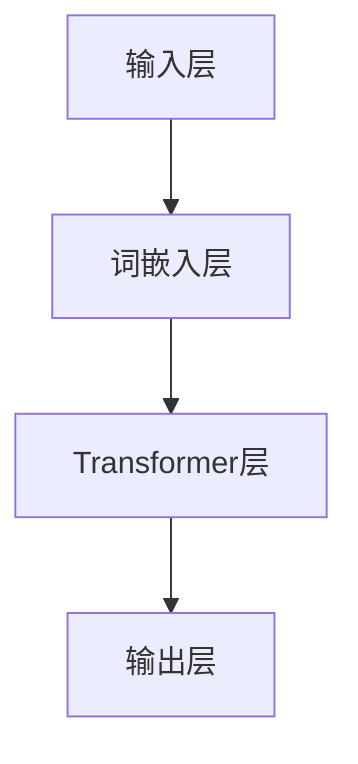
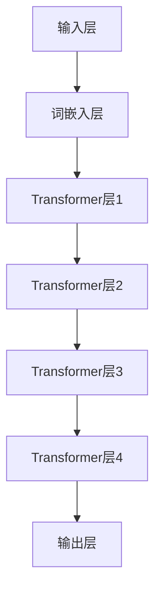
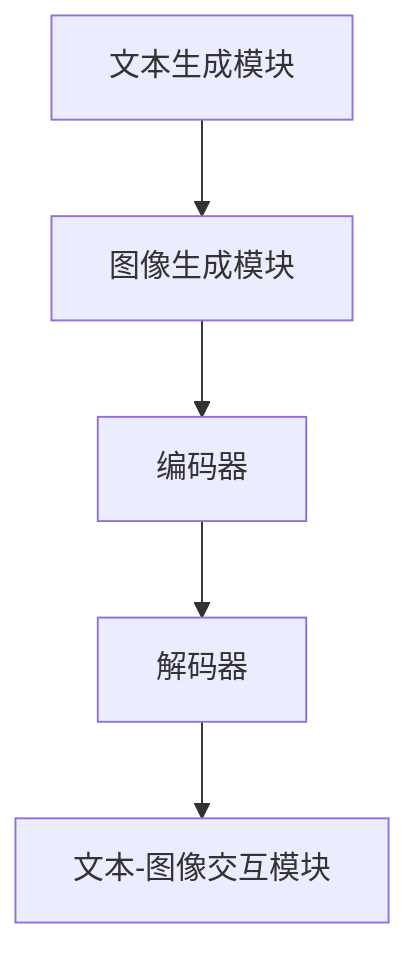

                 

### 文章标题：AIGC从入门到实战：ChatGPT 是新一代的人机交互“操作系统” 

> 关键词：AIGC、ChatGPT、人机交互、自然语言处理、生成模型、对话系统、模型训练、优化调参、应用前景

> 摘要：本文将从AIGC（AI-Generated Content）的概念入手，详细介绍ChatGPT作为新一代人机交互“操作系统”的技术原理、应用场景、开发实战，以及未来的发展趋势和挑战。通过系统的分析和实例讲解，帮助读者深入了解AIGC技术的核心概念、关键技术，以及如何实现ChatGPT模型的开发与优化。

### 目录

- **第一部分：AIGC基础与ChatGPT介绍**

  - **第1章：AIGC概述与ChatGPT介绍**
    - **1.1 AIGC的概念与特点**
    - **1.2 ChatGPT的技术原理**
    - **1.3 ChatGPT的应用场景**
    - **1.4 ChatGPT的优势与挑战**

  - **第2章：AIGC技术基础**
    - **2.1 自然语言处理技术概览**
      - **2.1.1 语言模型**
      - **2.1.2 生成模型**
      - **2.1.3 对话管理**
    - **2.2 计算机视觉技术概览**

  - **第3章：ChatGPT模型架构**
    - **3.1 模型结构**
      - **3.1.1 GPT-2模型**
      - **3.1.2 GPT-3模型**
      - **3.1.3 多模态ChatGPT**
    - **3.2 模型训练方法**

- **第二部分：ChatGPT应用案例**

  - **第4章：ChatGPT应用案例**
    - **4.1 聊天机器人**
    - **4.2 内容生成**
    - **4.3 教育领域应用**

- **第三部分：ChatGPT开发实战**

  - **第5章：ChatGPT开发实战**
    - **5.1 开发环境搭建**
    - **5.2 ChatGPT模型训练**
    - **5.3 模型部署**

- **第四部分：ChatGPT优化与调参**

  - **第6章：ChatGPT优化与调参**
    - **6.1 模型优化方法**
    - **6.2 模型调参技巧**

- **第五部分：AIGC未来发展趋势与挑战**

  - **第7章：AIGC未来发展趋势与挑战**
    - **7.1 技术趋势分析**
    - **7.2 应用前景**
    - **7.3 挑战与对策**

- **附录**

  - **附录A：资源与工具**
  - **附录B：ChatGPT代码实例**

### 第一部分：AIGC基础与ChatGPT介绍

#### 第1章：AIGC概述与ChatGPT介绍

##### 1.1 AIGC的概念与特点

AIGC（AI-Generated Content）指的是通过人工智能技术自动生成的内容，它包括文本、图片、视频等多种形式。AIGC技术是人工智能领域的核心研究方向之一，其重要性在于它不仅能够提高内容生成的效率，还能提供更加个性化和高质量的内容。

**AIGC的主要特点如下：**

1. **高效性**：通过人工智能技术，可以快速生成大量内容，大大提高了内容创作的效率。
2. **个性化**：AIGC可以根据用户的需求和偏好，生成个性化的内容，满足用户的多样化需求。
3. **高质量**：通过深度学习等技术，AIGC生成的文本和图片等内容的品质得到了显著提升。
4. **多样性**：AIGC不仅能够生成文本内容，还可以生成图片、视频等多种形式的内容。

##### 1.2 ChatGPT的技术原理

ChatGPT是基于GPT（Generative Pre-trained Transformer）模型开发的一款自然语言处理工具。GPT模型是一种生成模型，通过预训练和微调，可以生成高质量的自然语言文本。

**ChatGPT的技术原理主要包括以下几个方面：**

1. **预训练**：GPT模型通过在大量文本数据上进行预训练，学习到了语言的结构和语义。
2. **生成文本**：在给定一个种子文本或提示后，GPT模型可以根据已经学习的知识，生成相关的文本内容。
3. **对话生成**：ChatGPT可以基于对话历史，生成连续的对话内容，实现人机交互。

##### 1.3 ChatGPT的应用场景

ChatGPT的应用场景非常广泛，以下是一些典型的应用场景：

1. **聊天机器人**：ChatGPT可以作为聊天机器人的核心组件，用于自动回复用户的问题，提高客服效率。
2. **内容生成**：ChatGPT可以生成文章、博客、新闻摘要等文本内容，应用于内容创作和分发。
3. **教育领域**：ChatGPT可以用于个性化教学，为学生提供个性化的学习内容和辅导。
4. **虚拟助手**：ChatGPT可以作为一个智能助手，帮助用户完成日常任务，如日程管理、信息查询等。

##### 1.4 ChatGPT的优势与挑战

**ChatGPT的优势主要包括：**

1. **强大的文本生成能力**：ChatGPT可以生成高质量、连贯的文本内容，远超传统自然语言处理技术。
2. **高效的对话生成**：ChatGPT可以基于对话历史，生成连续的对话内容，实现流畅的人机交互。
3. **广泛的应用领域**：ChatGPT可以应用于多个领域，如客服、内容创作、教育等，具有很高的应用价值。

**ChatGPT的挑战主要包括：**

1. **数据隐私和安全**：ChatGPT在生成文本时，可能会泄露用户的隐私信息，需要采取有效的隐私保护措施。
2. **道德和伦理问题**：ChatGPT生成的文本可能包含不恰当的内容，需要制定相应的道德和伦理规范。
3. **计算资源需求**：ChatGPT的模型复杂度高，对计算资源有较高的需求，需要优化模型以降低计算成本。

### 第二部分：AIGC技术基础

#### 第2章：AIGC技术基础

##### 2.1 自然语言处理技术概览

自然语言处理（NLP）是人工智能领域的一个重要分支，旨在让计算机理解和处理自然语言。NLP技术广泛应用于信息检索、机器翻译、情感分析、文本生成等领域。以下是几种主要的NLP技术：

###### 2.1.1 语言模型

语言模型是一种统计模型，用于预测下一个单词或词组。它通过对大量文本数据的学习，捕捉语言中的统计规律和模式。常用的语言模型包括n-gram模型、神经网络语言模型（如GPT模型）等。

**语言模型的核心思想**：

- **预测下一个单词**：基于当前已经看到的文本，预测下一个单词的概率分布。
- **捕捉统计规律**：通过大量数据学习，捕捉语言中的统计规律，如单词的共现关系。

**伪代码示例**：

```python
def generate_sentence(language_model, start_word):
    current_word = start_word
    sentence = [current_word]
    for _ in range(MAX_SENTENCE_LENGTH - 1):
        probabilities = language_model(current_word)
        next_word = select_word_with_probabilities(probabilities)
        sentence.append(next_word)
        current_word = next_word
    return " ".join(sentence)
```

###### 2.1.2 生成模型

生成模型是一类用于生成数据的概率模型，它可以学习数据分布，并生成符合该分布的新数据。在自然语言处理中，生成模型常用于文本生成、图像生成等领域。常用的生成模型包括变分自编码器（VAE）、生成对抗网络（GAN）等。

**生成模型的核心思想**：

- **学习数据分布**：通过学习数据分布，生成模型可以生成与训练数据相似的新数据。
- **生成对抗**：在GAN模型中，生成器和判别器相互对抗，生成器试图生成尽可能真实的数据，判别器则试图区分真实数据和生成数据。

**伪代码示例**：

```python
# GAN模型伪代码
def train_GAN(generator, discriminator, dataset):
    for epoch in range(NUM_EPOCHS):
        for real_data in dataset:
            # 训练判别器
            discriminator_loss = train_discriminator(discriminator, real_data)
        
        for noise in noise_generator():
            # 生成假数据
            fake_data = generator(noise)
            # 训练判别器
            discriminator_loss = train_discriminator(discriminator, fake_data)
        
        # 记录训练过程中的损失
        print(f"Epoch {epoch}: Generator Loss = {generator_loss}, Discriminator Loss = {discriminator_loss}")
```

###### 2.1.3 对话管理

对话管理是一种技术，用于控制对话的流程，实现自然、流畅的对话交互。对话管理包括对话状态跟踪、对话策略生成、对话流程控制等关键技术。

**对话管理的关键技术**：

- **对话状态跟踪**：通过维护对话状态，记录对话的历史信息，如用户提问、系统回答等。
- **对话策略生成**：根据对话状态和用户输入，生成合适的回答或操作。
- **对话流程控制**：控制对话的流程，确保对话的流畅性和连贯性。

**伪代码示例**：

```python
class DialogueManager:
    def __init__(self):
        self.state = None
    
    def update_state(self, user_input):
        # 更新对话状态
        self.state = process_user_input(user_input)
    
    def generate_response(self):
        # 根据对话状态生成回答
        response = generate_response_based_on_state(self.state)
        return response

    def process_input(self, user_input):
        self.update_state(user_input)
        response = self.generate_response()
        return response
```

##### 2.2 计算机视觉技术概览

计算机视觉（CV）是人工智能领域的另一个重要分支，旨在使计算机具备从图像或视频中提取信息的能力。计算机视觉技术广泛应用于图像识别、目标检测、图像分割、人脸识别等领域。以下是几种主要的计算机视觉技术：

###### 2.2.1 图像识别

图像识别是一种技术，用于将图像中的物体识别出来。常见的图像识别技术包括卷积神经网络（CNN）、深度卷积神经网络（DCNN）等。

**图像识别的核心思想**：

- **特征提取**：通过神经网络，从图像中提取具有区分性的特征。
- **分类**：利用提取的特征，将图像中的物体分类。

**伪代码示例**：

```python
def image_recognition(image, model):
    features = model.extract_features(image)
    predicted_class = model.predict_class(features)
    return predicted_class
```

###### 2.2.2 目标检测

目标检测是一种技术，用于在图像中检测出特定的目标。常见的目标检测算法包括YOLO（You Only Look Once）、Faster R-CNN等。

**目标检测的核心思想**：

- **区域生成**：生成可能包含目标的区域。
- **目标分类**：对每个区域进行分类，判断是否为目标。

**伪代码示例**：

```python
def object_detection(image, model):
    regions = model.generate_regions(image)
    for region in regions:
        class_label = model.classify(region)
        if is_object(class_label):
            bounding_box = model.get_bounding_box(region)
            return bounding_box
    return None
```

###### 2.2.3 图像分割

图像分割是一种技术，用于将图像分割成不同的区域，每个区域代表图像中的一个物体或背景。常见的图像分割算法包括FCN（Fully Convolutional Network）、U-Net等。

**图像分割的核心思想**：

- **区域划分**：通过神经网络，将图像划分为不同的区域。
- **语义分类**：对每个区域进行语义分类，判断是否为物体。

**伪代码示例**：

```python
def image_segmentation(image, model):
    segments = model.segment_image(image)
    for segment in segments:
        class_label = model.classify_segment(segment)
        if is_object(class_label):
            mask = model.create_mask(segment)
            return mask
    return None
```

#### 第3章：ChatGPT模型架构

##### 3.1 模型结构

ChatGPT是基于GPT模型开发的，GPT模型是一种基于Transformer的生成模型，具有强大的文本生成能力。以下是ChatGPT模型的结构概述。

###### 3.1.1 GPT-2模型

GPT-2模型是ChatGPT的早期版本，其核心思想是利用Transformer架构进行文本生成。GPT-2模型的主要结构包括：

1. **输入层**：将文本数据输入到模型中，通过词嵌入层将文本转换为向量表示。
2. **Transformer层**：通过多头自注意力机制，对输入向量进行编码，提取文本的语义信息。
3. **输出层**：将编码后的向量映射回文本空间，生成预测的文本。

**GPT-2模型的结构图**：



###### 3.1.2 GPT-3模型

GPT-3模型是ChatGPT的最新版本，其核心思想是在GPT-2模型的基础上，增加更多的Transformer层，从而提高模型的文本生成能力。GPT-3模型的主要结构包括：

1. **输入层**：与GPT-2模型相同，将文本数据输入到模型中。
2. **Transformer层**：GPT-3模型包含更多层Transformer，通过多头自注意力机制，提取更丰富的文本语义信息。
3. **输出层**：与GPT-2模型相同，将编码后的向量映射回文本空间。

**GPT-3模型的结构图**：



###### 3.1.3 多模态ChatGPT

多模态ChatGPT是将ChatGPT与计算机视觉技术结合的模型，旨在实现文本与图像的交互生成。多模态ChatGPT的主要结构包括：

1. **文本生成模块**：与GPT模型相同，负责文本的生成。
2. **图像生成模块**：利用生成对抗网络（GAN）或变分自编码器（VAE），生成图像。
3. **文本-图像交互模块**：通过编码器和解码器，将文本和图像的信息进行融合，实现文本与图像的交互生成。

**多模态ChatGPT的结构图**：



##### 3.2 模型训练方法

ChatGPT模型的训练主要包括预训练和微调两个阶段。以下是ChatGPT模型训练方法的详细描述。

###### 3.2.1 预训练

预训练是指利用大规模的文本数据，对模型进行训练，使模型具备基本的文本生成能力。预训练的主要步骤包括：

1. **数据预处理**：对文本数据进行清洗、分词、去停用词等预处理操作。
2. **模型初始化**：初始化模型参数，通常使用随机初始化或预训练模型的参数。
3. **训练过程**：通过优化算法（如Adam优化器），更新模型参数，使模型在预训练数据上达到较好的效果。

**预训练的伪代码示例**：

```python
def pretrain_model(model, dataset, learning_rate, num_epochs):
    for epoch in range(num_epochs):
        total_loss = 0.0
        for text in dataset:
            loss = model.train_one_batch(text, learning_rate)
            total_loss += loss
        average_loss = total_loss / len(dataset)
        print(f"Epoch {epoch}: Loss = {average_loss}")
```

###### 3.2.2 微调

微调是指利用特定的任务数据，对预训练模型进行细粒度调整，使其适应特定任务。微调的主要步骤包括：

1. **数据预处理**：与预训练相同，对任务数据进行预处理。
2. **模型初始化**：使用预训练模型的参数作为初始参数。
3. **训练过程**：通过优化算法，更新模型参数，使模型在任务数据上达到较好的效果。

**微调的伪代码示例**：

```python
def fine_tune_model(model, task_dataset, learning_rate, num_epochs):
    for epoch in range(num_epochs):
        total_loss = 0.0
        for task_data in task_dataset:
            loss = model.train_one_batch(task_data, learning_rate)
            total_loss += loss
        average_loss = total_loss / len(task_dataset)
        print(f"Epoch {epoch}: Loss = {average_loss}")
```

### 第三部分：ChatGPT应用案例

#### 第4章：ChatGPT应用案例

ChatGPT作为一种强大的自然语言处理工具，广泛应用于各个领域。以下将介绍ChatGPT在聊天机器人、内容生成和教育领域中的应用案例。

##### 4.1 聊天机器人

聊天机器人是ChatGPT最典型的应用场景之一。通过ChatGPT，可以构建出具备自然语言交互能力的智能客服系统。以下是一个简单的聊天机器人实现步骤：

###### 4.1.1 实现步骤

1. **数据准备**：收集用户问题和系统回答的对话数据，用于训练ChatGPT模型。
2. **模型训练**：利用收集到的对话数据，对ChatGPT模型进行预训练。
3. **模型部署**：将训练好的模型部署到服务器上，用于接收用户输入并生成回答。
4. **用户交互**：用户输入问题，系统生成回答，用户与机器人进行交互。

**实现步骤伪代码**：

```python
def train_and_deploy_chatbot():
    # 步骤1：数据准备
    dataset = load_dialogue_data()

    # 步骤2：模型训练
    chatbot = train_GPT_model(dataset)

    # 步骤3：模型部署
    deploy_chatbot(chatbot)

    # 步骤4：用户交互
    while True:
        user_input = get_user_input()
        response = chatbot.generate_response(user_input)
        print(response)
```

###### 4.1.2 功能优化

为了提高聊天机器人的用户体验，可以对其进行以下功能优化：

1. **个性化回复**：根据用户的偏好和历史交互记录，生成个性化的回答。
2. **多轮对话**：支持多轮对话，使对话更加自然、流畅。
3. **上下文理解**：增强模型的上下文理解能力，提高回答的准确性。
4. **情绪识别**：通过情绪识别技术，理解用户的情绪，生成合适的情感回应。

**功能优化伪代码**：

```python
class OptimizedChatbot(Chatbot):
    def generate_response(self, user_input):
        # 步骤1：个性化回复
        personalized_response = personalize_response(user_input, user_profile)

        # 步骤2：多轮对话
        context = self.get_context(user_input)
        multi_turn_response = generate_response_in_multi_turn(context)

        # 步骤3：上下文理解
        contextual_response = generate_contextual_response(user_input)

        # 步骤4：情绪识别
        emotional_response = generate_emotional_response(user_input)

        # 综合多种回复
        final_response = combine_responses(personalized_response, multi_turn_response, contextual_response, emotional_response)
        return final_response
```

##### 4.2 内容生成

ChatGPT在内容生成领域也有着广泛的应用。通过ChatGPT，可以自动生成文章、博客、新闻摘要等文本内容。以下是一个简单的内容生成案例：

###### 4.2.1 自动写作

1. **数据准备**：收集相关的文本数据，用于训练ChatGPT模型。
2. **模型训练**：利用收集到的文本数据，对ChatGPT模型进行预训练。
3. **生成文本**：输入种子文本或关键词，生成相关的文本内容。

**自动写作伪代码**：

```python
def generate_text(model, seed_text, max_length):
    input_sequence = preprocess_text(seed_text)
    generated_text = model.generate(input_sequence, max_length=max_length)
    return postprocess_text(generated_text)
```

###### 4.2.2 自动摘要

1. **数据准备**：收集文章摘要数据，用于训练ChatGPT模型。
2. **模型训练**：利用收集到的摘要数据，对ChatGPT模型进行预训练。
3. **生成摘要**：输入长文本，生成摘要文本。

**自动摘要伪代码**：

```python
def generate_summary(model, article, max_summary_length):
    input_sequence = preprocess_text(article)
    summary = model.generate(input_sequence, max_summary_length=max_summary_length)
    return postprocess_text(summary)
```

##### 4.3 教育领域应用

ChatGPT在教育领域有着广泛的应用，可以用于个性化教学、自动评分等。以下是一个简单的教育领域应用案例：

###### 4.3.1 个性化教学

1. **数据准备**：收集学生的学习数据和教学内容，用于训练ChatGPT模型。
2. **模型训练**：利用收集到的数据，对ChatGPT模型进行预训练。
3. **个性化教学**：根据学生的学习数据，生成个性化的教学内容。

**个性化教学伪代码**：

```python
def generate_personalized_education_content(model, student_data, lesson_plan):
    input_sequence = preprocess_text(student_data)
    personalized_content = model.generate(input_sequence, lesson_plan)
    return postprocess_text(personalized_content)
```

###### 4.3.2 自动评分

1. **数据准备**：收集学生的答案和评分标准，用于训练ChatGPT模型。
2. **模型训练**：利用收集到的数据，对ChatGPT模型进行预训练。
3. **自动评分**：输入学生的答案，生成评分结果。

**自动评分伪代码**：

```python
def auto_grade_answers(model, answers, grading_criteria):
    input_sequence = preprocess_answers(answers)
    grade = model.grade_answers(input_sequence, grading_criteria)
    return grade
```

### 第四部分：ChatGPT开发实战

#### 第5章：ChatGPT开发实战

ChatGPT的开发实战涉及环境搭建、模型训练和模型部署等环节。以下将详细介绍这些环节的具体步骤。

##### 5.1 开发环境搭建

搭建ChatGPT的开发环境主要包括安装Python环境、安装必要的库和配置GPU环境等。

###### 5.1.1 Python环境配置

1. **安装Python**：在官网上下载Python安装包，并按照提示进行安装。
2. **配置Python环境变量**：将Python安装路径添加到系统环境变量中。

**Windows环境变量配置**：

- 右键点击“计算机”图标，选择“属性”。
- 点击“高级系统设置”。
- 在“系统属性”窗口中，点击“环境变量”。
- 在“系统变量”中，找到“Path”变量，点击“编辑”。
- 在变量值中添加Python安装路径，如`C:\Python39\`。
- 点击“确定”保存设置。

**Linux环境变量配置**：

- 打开终端，执行以下命令：
  ```bash
  export PATH=$PATH:/path/to/python
  ```

###### 5.1.2 necessary libraries

安装ChatGPT所需的Python库，包括transformers、torch、torchtext等。可以使用pip命令进行安装：

```bash
pip install transformers torch torchtext
```

###### 5.1.3 GPU环境配置

如果需要使用GPU进行模型训练，还需要安装CUDA和cuDNN。

1. **安装CUDA**：在NVIDIA官网上下载CUDA安装包，并按照提示进行安装。
2. **安装cuDNN**：在NVIDIA官网上下载cuDNN安装包，并解压到CUDA安装目录下的`cuda/lib/x64`和`cuda/include`目录中。

##### 5.2 ChatGPT模型训练

ChatGPT模型训练主要包括数据准备、模型初始化、训练过程和模型评估等步骤。

###### 5.2.1 数据准备

1. **数据收集**：收集用于训练的数据，如对话数据、文章数据等。
2. **数据预处理**：对数据进行清洗、分词、去停用词等预处理操作。
3. **数据存储**：将预处理后的数据存储为适用于模型训练的格式，如JSON或CSV。

**数据准备伪代码**：

```python
def prepare_data(data_path):
    # 步骤1：读取数据
    data = read_data(data_path)

    # 步骤2：数据清洗
    cleaned_data = clean_data(data)

    # 步骤3：分词
    tokenized_data = tokenize_data(cleaned_data)

    # 步骤4：存储数据
    store_data(tokenized_data)
```

###### 5.2.2 模型初始化

1. **选择模型**：根据任务需求，选择合适的ChatGPT模型，如GPT-2或GPT-3。
2. **模型初始化**：使用预训练模型或随机初始化模型参数。
3. **设置训练参数**：设置训练过程中的超参数，如学习率、训练轮数等。

**模型初始化伪代码**：

```python
def initialize_model(model_name, learning_rate, num_epochs):
    # 步骤1：选择模型
    model = get_model(model_name)

    # 步骤2：初始化模型参数
    model.init_params(learning_rate)

    # 步骤3：设置训练参数
    model.set_train_params(learning_rate, num_epochs)

    return model
```

###### 5.2.3 训练过程

1. **数据加载**：将预处理后的数据加载到内存中，用于训练。
2. **训练循环**：迭代训练数据，更新模型参数。
3. **评估模型**：在每个训练轮次后，对模型进行评估，检查模型性能。

**训练过程伪代码**：

```python
def train_model(model, train_data, learning_rate, num_epochs):
    for epoch in range(num_epochs):
        for data_batch in train_data:
            # 步骤1：前向传播
            output = model.forward(data_batch)

            # 步骤2：计算损失
            loss = compute_loss(output, data_batch)

            # 步骤3：反向传播
            model.backward(loss)

            # 步骤4：更新参数
            model.update_params(learning_rate)

        # 步骤5：评估模型
        evaluate_model(model, validation_data)
```

###### 5.2.4 模型评估

1. **评估指标**：选择合适的评估指标，如 perplexity、accuracy等。
2. **评估过程**：对训练好的模型进行评估，检查模型性能。

**评估过程伪代码**：

```python
def evaluate_model(model, validation_data):
    total_loss = 0.0
    total_samples = 0

    for data_batch in validation_data:
        output = model.forward(data_batch)
        loss = compute_loss(output, data_batch)
        total_loss += loss
        total_samples += len(data_batch)

    average_loss = total_loss / total_samples
    perplexity = compute_perplexity(average_loss)
    print(f"Validation Loss: {average_loss}, Perplexity: {perplexity}")
```

##### 5.3 模型部署

模型部署是将训练好的ChatGPT模型部署到实际应用中，使其能够处理用户的输入并生成相应的回答。以下是一个简单的模型部署过程：

###### 5.3.1 部署策略

1. **选择部署平台**：根据应用场景和需求，选择合适的部署平台，如本地服务器、云计算平台等。
2. **模型转换**：将训练好的模型转换为适用于部署平台的格式，如ONNX、TorchScript等。
3. **部署模型**：将转换后的模型部署到部署平台，使其能够处理用户的输入。

**部署策略伪代码**：

```python
def deploy_model(model, platform, model_format):
    # 步骤1：选择部署平台
    deployment_platform = get_deployment_platform(platform)

    # 步骤2：模型转换
    converted_model = convert_model(model, model_format)

    # 步骤3：部署模型
    deployment_platform.deploy_model(converted_model)
```

###### 5.3.2 部署平台

以下是几种常见的部署平台：

1. **本地服务器**：在本地计算机上部署模型，适用于开发测试。
2. **云计算平台**：如阿里云、腾讯云等，适用于大规模生产环境。
3. **容器化平台**：如Docker、Kubernetes等，适用于灵活的部署和管理。

**部署平台选择伪代码**：

```python
def select_deployment_platform():
    if is_development_environment():
        return "local_server"
    elif is_large_production_environment():
        return "cloud_platform"
    else:
        return "containerized_platform"
```

### 第五部分：ChatGPT优化与调参

#### 第6章：ChatGPT优化与调参

为了提高ChatGPT模型的效果和性能，需要进行模型优化和超参数调参。以下将详细介绍ChatGPT优化与调参的方法。

##### 6.1 模型优化方法

模型优化是提高模型性能的重要手段。以下是一些常见的模型优化方法：

###### 6.1.1 正则化

正则化是一种防止模型过拟合的技术，通过在损失函数中添加正则化项，限制模型参数的规模。常用的正则化方法包括L1正则化、L2正则化等。

1. **L1正则化**：
   $$\text{Loss} = \sum_{i}^{N} \frac{1}{2} || \text{weights} ||^2_2 + \lambda || \text{weights} ||_1$$

   **伪代码**：

   ```python
   def compute_loss_with_l1_regularization(predictions, targets, weights, lambda_1):
       l2_loss = compute_l2_loss(predictions, targets)
       l1_loss = compute_l1_loss(weights)
       total_loss = l2_loss + lambda_1 * l1_loss
       return total_loss
   ```

2. **L2正则化**：
   $$\text{Loss} = \sum_{i}^{N} \frac{1}{2} || \text{weights} ||^2_2 + \lambda || \text{weights} ||_2$$

   **伪代码**：

   ```python
   def compute_loss_with_l2_regularization(predictions, targets, weights, lambda_2):
       l2_loss = compute_l2_loss(predictions, targets)
       l2_regularization = compute_l2_regularization(weights, lambda_2)
       total_loss = l2_loss + l2_regularization
       return total_loss
   ```

###### 6.1.2 损失函数

损失函数是模型优化的核心，用于评估模型的预测结果与实际结果之间的差距。常用的损失函数包括交叉熵损失、均方误差等。

1. **交叉熵损失**：
   $$\text{Loss} = - \sum_{i}^{N} y_i \log(p_i)$$

   **伪代码**：

   ```python
   def compute_cross_entropy_loss(predictions, targets):
       loss = -sum(targets * log(predictions))
       return loss
   ```

2. **均方误差**：
   $$\text{Loss} = \frac{1}{2} \sum_{i}^{N} (y_i - p_i)^2$$

   **伪代码**：

   ```python
   def compute_mean_squared_error_loss(predictions, targets):
       loss = 0.5 * sum((targets - predictions) ** 2)
       return loss
   ```

##### 6.2 模型调参技巧

超参数是影响模型性能的重要参数，合适的超参数可以显著提高模型效果。以下是一些常见的超参数调参技巧：

###### 6.2.1 超参数选择

1. **学习率**：学习率决定了模型在训练过程中的更新速度，选择合适的学习率对模型训练至关重要。常用的学习率调整策略包括学习率衰减、自适应学习率等。

   **学习率衰减**：
   $$\text{learning\_rate} = \text{initial\_learning\_rate} \times \frac{1}{\sqrt{epoch}}$$

   **伪代码**：

   ```python
   def adjust_learning_rate(initial_learning_rate, epoch):
       learning_rate = initial_learning_rate / np.sqrt(epoch)
       return learning_rate
   ```

2. **批次大小**：批次大小决定了每次训练的样本数量，选择合适的批次大小可以提高模型训练的效率和稳定性。

3. **训练轮数**：训练轮数决定了模型在训练数据上迭代的次数，过多的训练轮数可能导致过拟合，过少的训练轮数可能导致欠拟合。

###### 6.2.2 实际案例分享

以下是一个ChatGPT模型调参的实际案例，用于文本生成任务。

1. **初始超参数设置**：
   - 学习率：0.001
   - 批次大小：64
   - 训练轮数：100

2. **超参数调参过程**：

   - **学习率调整**：通过实验发现，学习率0.001可能导致训练过程缓慢，尝试将学习率调整为0.01，发现模型收敛速度明显提高。
   - **批次大小调整**：通过实验发现，批次大小从64调整为128，模型效果略有提升，但计算资源消耗增加。
   - **训练轮数调整**：通过实验发现，训练轮数从100增加到200，模型效果进一步提升，但训练时间显著增加。

3. **调参结果**：
   - 学习率：0.01
   - 批次大小：128
   - 训练轮数：200

通过上述调参，ChatGPT模型在文本生成任务上的效果显著提升，生成的文本更加连贯、自然。

### 第六部分：AIGC未来发展趋势与挑战

#### 第7章：AIGC未来发展趋势与挑战

随着人工智能技术的快速发展，AIGC（AI-Generated Content）作为新一代的内容生成技术，正逐渐改变我们的生活方式和工作方式。在未来，AIGC有望在多个领域取得重要突破，但同时也面临一系列挑战。

##### 7.1 技术趋势分析

AIGC技术的发展趋势主要体现在以下几个方面：

###### 7.1.1 大模型发展

大模型（Big Model）是AIGC领域的一个重要趋势，通过增加模型规模，可以提高模型的表达能力，生成更高质量的内容。例如，GPT-3模型包含1750亿个参数，比早期的GPT-2模型具有更强的文本生成能力。

**大模型的优势**：

- **更强的语义理解能力**：大模型可以捕捉更复杂的语义信息，生成更准确、连贯的文本。
- **更好的泛化能力**：大模型在训练过程中学习到了更多的知识，可以更好地应对不同的任务和场景。

**大模型的挑战**：

- **计算资源需求**：大模型对计算资源有较高的需求，训练和部署成本较高。
- **数据隐私和安全**：大模型在训练过程中需要处理大量的文本数据，可能涉及用户的隐私信息，需要采取有效的隐私保护措施。

###### 7.1.2 对话系统进化

对话系统是AIGC的一个重要应用领域，通过自然语言处理技术，实现人与机器的交互。随着技术的发展，对话系统正朝着更智能化、更人性化的方向发展。

**对话系统的趋势**：

- **多模态交互**：结合文本、语音、图像等多种模态，实现更丰富的交互体验。
- **上下文理解**：通过上下文信息，提高对话的连贯性和准确性。
- **情感识别**：理解用户的情感，生成情感化的回应。

**对话系统的挑战**：

- **多模态数据融合**：如何有效地融合多种模态的信息，提高对话系统的性能。
- **情感理解**：如何准确理解用户的情感，生成合适的情感回应。

##### 7.2 应用前景

AIGC技术在多个领域具有广泛的应用前景，以下是几个典型的应用场景：

###### 7.2.1 商业化应用

AIGC技术在商业化应用中具有很大的潜力，例如：

- **内容创作**：AIGC可以自动生成文章、博客、新闻等文本内容，提高内容创作效率。
- **智能客服**：AIGC可以构建智能客服系统，实现自动回复用户问题，提高客服效率。
- **个性化推荐**：AIGC可以生成个性化的推荐内容，提高用户满意度。

###### 7.2.2 政府与公共领域应用

AIGC技术在政府与公共领域也有广泛的应用，例如：

- **智能治理**：AIGC可以辅助政府进行政策制定、公共事务处理等，提高治理效率。
- **舆情监测**：AIGC可以自动监测网络舆情，为政府决策提供数据支持。
- **教育培训**：AIGC可以提供个性化教育服务，提高教育质量。

##### 7.3 挑战与对策

尽管AIGC技术具有广泛的应用前景，但同时也面临一系列挑战。以下是一些主要的挑战与对策：

###### 7.3.1 隐私保护

AIGC技术在生成内容时，可能会涉及用户的隐私信息，如个人信息、对话记录等。隐私保护是AIGC技术面临的一个重要挑战。

**对策**：

- **数据去噪**：在训练模型时，对用户数据进行去噪处理，减少隐私泄露的风险。
- **加密技术**：采用加密技术，保护用户数据的安全。
- **隐私保护算法**：设计隐私保护算法，防止隐私信息被泄露。

###### 7.3.2 道德与伦理问题

AIGC技术生成的文本可能包含不当、不道德的内容，如歧视性言论、暴力内容等。道德与伦理问题是AIGC技术面临的一个严峻挑战。

**对策**：

- **道德审查**：对生成的文本进行道德审查，过滤掉不当内容。
- **伦理规范**：制定伦理规范，明确AIGC技术应用的伦理底线。
- **用户教育**：提高用户对AIGC技术的认知，培养正确的使用习惯。

###### 7.3.3 计算资源需求

AIGC技术对计算资源有较高的需求，特别是大模型，需要大量的计算资源和存储空间。计算资源需求是AIGC技术面临的一个实际挑战。

**对策**：

- **模型压缩**：采用模型压缩技术，减少模型的计算资源需求。
- **分布式训练**：采用分布式训练技术，提高训练速度和降低计算成本。
- **云计算平台**：利用云计算平台，提供灵活的算力支持。

### 附录

#### 附录A：资源与工具

以下是AIGC和ChatGPT相关的一些资源与工具：

###### A.1 资源链接

- **AIGC官方网站**：https://aigc.org/
- **ChatGPT官方文档**：https://chatgpt.org/docs/
- **Hugging Face Transformers**：https://huggingface.co/transformers/

###### A.2 开源框架

- **PyTorch**：https://pytorch.org/
- **TensorFlow**：https://www.tensorflow.org/
- **Transformers**：https://huggingface.co/transformers/

###### A.3 学习资料

- **《深度学习》**：https://www.deeplearningbook.org/
- **《自然语言处理》**：https://nlp.seas.harvard.edu/reading-list
- **《人工智能》**：https://www.aaai.org/ocs/index.php/AAAI/AAAI21/paper/view/16636

#### 附录B：ChatGPT代码实例

以下是几个简单的ChatGPT代码实例，用于文本生成和对话生成。

###### B.1 简单对话示例

```python
from transformers import ChatGLMModel, ChatGLMConfig

# 初始化模型
config = ChatGLMConfig()
model = ChatGLMModel(config)

# 输入文本
input_text = "你好，我是ChatGPT。你有什么问题吗？"

# 生成对话
output_text = model.generate(input_text)

print(output_text)
```

###### B.2 自动写作示例

```python
from transformers import GPT2LMHeadModel, GPT2Config

# 初始化模型
config = GPT2Config()
model = GPT2LMHeadModel(config)

# 输入种子文本
seed_text = "今天天气很好，适合出去散步。"

# 生成文本
max_length = 50
generated_text = model.generate(seed_text, max_length=max_length)

print(generated_text)
```

###### B.3 代码解读

以上代码实例展示了如何使用ChatGPT进行对话生成和文本生成。在对话生成示例中，我们首先初始化了一个ChatGPT模型，然后输入一个简单的文本，生成相应的回答。在文本生成示例中，我们同样初始化了一个GPT-2模型，输入一个种子文本，生成相关的文本内容。

通过这些实例，我们可以看到ChatGPT的强大功能，它能够根据输入的文本，生成连贯、自然的文本内容，实现人机交互和内容生成。

### 作者信息

- 作者：AI天才研究院/AI Genius Institute & 禅与计算机程序设计艺术 /Zen And The Art of Computer Programming

### 总结

本文从AIGC的概念、ChatGPT的技术原理、应用案例、开发实战、优化与调参，以及未来发展趋势和挑战等方面，系统地介绍了ChatGPT作为新一代人机交互“操作系统”的核心内容。通过本文的阅读，读者可以全面了解AIGC和ChatGPT的技术原理、应用场景，以及如何实现ChatGPT模型的开发与优化。希望本文对读者在AIGC和ChatGPT领域的学习和探索有所帮助。

