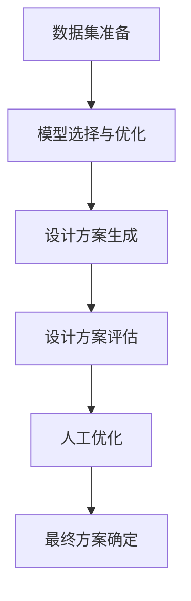
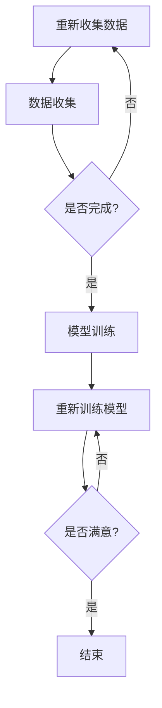

                 

### 文章标题

"AIGC从入门到实战：多快好省搞定各种风格的 logo 设计"

关键词：AIGC、人工智能生成内容、logo 设计、扁平化风格、扭曲风格、抽象风格

摘要：本文将深入探讨人工智能生成内容（AIGC）在logo设计中的应用，从基础入门到实战技巧，帮助读者快速掌握AIGC技术的核心原理，并熟练运用它来实现多风格logo设计。通过详细的理论讲解和实际案例，读者将了解到如何利用AIGC技术提升设计效率和成本控制，从而在品牌设计领域取得突破。

<|assistant|>### 第一部分：AIGC基础入门

#### 第1章：AIGC概述

##### 1.1 AIGC的概念与发展历程

人工智能生成内容（Artificial Intelligence Generated Content，简称AIGC）是指利用人工智能技术，特别是机器学习与深度学习算法，生成各种形式的内容，如图像、文本、音乐等。AIGC的出现，标志着人工智能从传统的“解决问题”模式向“创造内容”模式的转变。

AIGC的发展历程可以分为三个阶段：

1. **初级阶段**：主要以规则为基础的生成内容，如早期的文本生成、音乐生成等。这一阶段的AIGC主要依赖于手工编写的规则和模板。

2. **中级阶段**：引入了深度学习技术，特别是生成对抗网络（GAN）和变分自编码器（VAE）等模型，能够生成更加复杂和多样化的内容。

3. **高级阶段**：结合自然语言处理、图像处理、音频处理等多种技术，实现跨模态的内容生成。

##### 1.2 AIGC在设计与创意领域的应用

在设计与创意领域，AIGC的应用前景非常广阔。它能够为设计师提供强大的辅助工具，提高设计效率和创意质量。具体来说，AIGC在设计与创意领域的应用主要包括以下几个方面：

1. **图像生成与编辑**：利用GAN和VAE等技术，可以生成高质量、创意独特的图像，满足不同设计需求。

2. **文本生成与编辑**：通过自然语言处理技术，可以自动生成营销文案、广告语等文本内容。

3. **音乐生成与编辑**：利用深度学习算法，可以生成独特的音乐旋律和节奏，为创意设计提供音乐素材。

4. **视频生成与编辑**：结合图像生成和音频生成技术，可以自动生成创意视频内容。

##### 1.3 AIGC与传统设计的区别与优势

传统设计主要依赖于设计师的创意和技巧，而AIGC则利用人工智能算法，实现自动化和智能化的设计过程。二者在以下几个方面存在显著的区别：

1. **设计方法**：传统设计依赖于设计师的经验和直觉，而AIGC则依赖于数据驱动的算法。

2. **设计效率**：AIGC能够快速生成大量设计方案，提高设计效率。而传统设计往往需要较长时间来摸索和完善。

3. **创意质量**：虽然AIGC的设计方案可能不如人类设计师那样富有创意，但通过不断的优化和迭代，AIGC能够生成高质量的设计方案。

4. **成本控制**：AIGC可以显著降低人力成本，减少设计过程中的资源浪费。

综上所述，AIGC在设计与创意领域具有巨大的潜力，它不仅能够提高设计效率和创意质量，还能够为设计师提供强大的辅助工具，助力他们在激烈的市场竞争中脱颖而出。

#### 第2章：AIGC技术基础

##### 2.1 AIGC的基本架构与组成

AIGC的基本架构主要包括数据输入、算法模型、内容生成和内容评估四个主要模块。下面我们逐一介绍这些模块及其在AIGC系统中的功能。

1. **数据输入模块**：数据输入模块负责收集和整理用于生成内容的原始数据。这些数据可以是图像、文本、音频等多种类型。对于图像生成任务，数据输入模块需要从数据集中提取图像并进行预处理，如数据增强、标准化等，以提高模型的泛化能力。

2. **算法模型模块**：算法模型模块是AIGC的核心，负责处理输入数据并生成新的内容。常见的算法模型包括生成对抗网络（GAN）、变分自编码器（VAE）、深度卷积生成网络（DCGAN）等。这些模型通过训练学习数据的分布，并在给定条件或指导下生成新的内容。

3. **内容生成模块**：内容生成模块负责根据算法模型的输出生成具体的内容。例如，对于图像生成任务，生成模块将生成图像的像素值序列转化为可视化的图像。对于文本生成任务，生成模块将生成文本序列，并通过后处理（如拼写检查、语法修正等）得到最终生成的文本。

4. **内容评估模块**：内容评估模块用于评估生成内容的质量。评估方法可以是主观评估，如人类评估者对生成图像的美感和创意进行评分，也可以是客观评估，如使用特定的质量指标（如PSNR、SSIM等）来评估图像的保真度。对于文本生成任务，可以使用语言模型 perplexity、词汇多样性等指标来评估文本质量。

##### 2.2 图像处理与生成算法

图像处理与生成算法是AIGC技术的重要组成部分。下面我们将介绍几种常见的图像生成算法，包括生成对抗网络（GAN）、变分自编码器（VAE）和深度卷积生成网络（DCGAN）。

1. **生成对抗网络（GAN）**

GAN是AIGC领域最著名的算法之一。它由两部分组成：生成器（Generator）和判别器（Discriminator）。生成器的目标是生成逼真的图像，而判别器的目标是区分真实图像和生成图像。

GAN的工作原理可以概括为以下步骤：

（1）生成器生成一组随机噪声作为输入，并通过神经网络映射生成图像。

（2）判别器将真实图像和生成图像分别输入，并输出它们属于真实图像的概率。

（3）生成器和判别器交替训练，生成器尝试生成更真实的图像，而判别器尝试更准确地分类真实和生成图像。

GAN的伪代码如下：

```
Generator:
    输入：随机噪声z
    输出：生成图像G(z)

Discriminator:
    输入：真实图像x和生成图像G(z)
    输出：真实概率D(x)和生成概率D(G(z))

训练过程：
    对于每次迭代：
        生成器G的损失函数L_G = -E[log(D(G(z)))]
        判别器D的损失函数L_D = -E[log(D(x))] - E[log(1 - D(G(z))]
        通过梯度下降法更新生成器和判别器的权重
```

2. **变分自编码器（VAE）**

VAE是一种基于概率模型的生成模型。它通过编码器和解码器来学习数据的概率分布，并能够生成符合该分布的新数据。

VAE的工作原理可以概括为以下步骤：

（1）编码器将输入图像映射到一个潜在空间中的均值和方差。

（2）解码器从潜在空间中采样一个点，并生成相应的图像。

（3）通过最小化数据重构的KL散度损失来训练编码器和解码器。

VAE的伪代码如下：

```
编码器：
    输入：图像x
    输出：均值μ和方差σ

解码器：
    输入：潜在空间中的点z
    输出：重构图像x'

训练过程：
    对于每次迭代：
        计算编码器和解码器的损失函数L = -E[log(p(x|z))]
        通过梯度下降法更新编码器和解码器的权重
```

3. **深度卷积生成网络（DCGAN）**

DCGAN是一种结合了深度学习和卷积神经网络（CNN）的生成模型。它通过深度卷积神经网络来学习图像的特征，并能够生成高质量的图像。

DCGAN的工作原理可以概括为以下步骤：

（1）生成器使用深度卷积神经网络将随机噪声映射到高分辨率的图像。

（2）判别器使用深度卷积神经网络来区分真实图像和生成图像。

（3）生成器和判别器交替训练，生成器尝试生成更真实的图像，而判别器尝试更准确地分类真实和生成图像。

DCGAN的伪代码如下：

```
生成器：
    输入：随机噪声z
    输出：生成图像G(z)

判别器：
    输入：真实图像x和生成图像G(z)
    输出：真实概率D(x)和生成概率D(G(z))

训练过程：
    对于每次迭代：
        生成器G的损失函数L_G = -E[log(D(G(z)))]
        判别器D的损失函数L_D = -E[log(D(x))] - E[log(1 - D(G(z))]
        通过梯度下降法更新生成器和判别器的权重
```

通过以上对几种常见图像生成算法的介绍，我们可以看到AIGC技术在图像处理与生成方面的强大能力。这些算法不仅能够生成高质量的图像，还能够适应不同的设计需求和应用场景，为设计师提供强大的创作工具。

##### 2.3 自然语言处理与生成算法

自然语言处理（Natural Language Processing，NLP）是人工智能领域的一个重要分支，旨在使计算机能够理解、生成和处理自然语言。在AIGC中，NLP技术被广泛应用于文本生成、语义理解、情感分析等任务。本文将重点介绍两种在文本生成领域具有代表性的算法：生成预训练变换器（GPT）和双向编码器表示转换器（BERT）。

1. **生成预训练变换器（GPT）**

生成预训练变换器（Generative Pre-trained Transformer，GPT）是OpenAI于2018年发布的一种基于变换器（Transformer）架构的预训练语言模型。GPT通过在大量文本语料库上进行预训练，学习语言的本质规律和结构，从而能够生成符合语言习惯的文本。

GPT的工作原理可以分为以下几个步骤：

（1）预训练：在大量的文本语料库上进行预训练，通过最大化上下文序列的概率来优化模型参数。

（2）微调：在特定任务的数据集上对模型进行微调，以适应具体的文本生成任务。

（3）生成：利用微调后的模型，根据给定的前文信息生成后续的文本。

GPT的伪代码如下：

```
输入：前文序列context
输出：生成的文本序列output

预训练：
    对于每个训练样本：
        计算前文序列的概率P(context)
        通过梯度下降法更新模型参数

微调：
    对于每个生成任务：
        计算损失L = -log(P(output|context))
        通过梯度下降法更新模型参数

生成：
    对于给定的前文序列context：
        根据模型概率分布生成下一个词token
        更新前文序列context为context + token
        重复生成过程，直到达到终止条件
```

2. **双向编码器表示转换器（BERT）**

双向编码器表示转换器（Bidirectional Encoder Representations from Transformers，BERT）是由Google于2018年提出的一种基于变换器（Transformer）的双向编码器模型。BERT通过在大量文本语料库上进行双向训练，学习上下文中的词嵌入表示，从而能够理解词语的语义和语法关系。

BERT的工作原理可以分为以下几个步骤：

（1）预训练：在大量的文本语料库上进行预训练，包括Masked Language Modeling（MLM）和Next Sentence Prediction（NSP）两个任务。

（2）微调：在特定任务的数据集上对模型进行微调，以适应具体的文本生成任务。

（3）生成：利用微调后的模型，根据给定的前文信息生成后续的文本。

BERT的伪代码如下：

```
输入：前文序列context
输出：生成的文本序列output

预训练：
    对于每个训练样本：
        计算Masked Language Modeling损失L_MLM = -sum(log(P(mask|context)))
        计算Next Sentence Prediction损失L_NS = -log(P(next_sentence|context))
        通过梯度下降法更新模型参数

微调：
    对于每个生成任务：
        计算损失L = -log(P(output|context))
        通过梯度下降法更新模型参数

生成：
    对于给定的前文序列context：
        根据模型概率分布生成下一个词token
        更新前文序列context为context + token
        重复生成过程，直到达到终止条件
```

通过以上对GPT和BERT的介绍，我们可以看到它们在文本生成领域的强大能力。GPT通过预训练和微调，能够生成符合语言习惯的文本；而BERT通过双向训练和微调，能够理解上下文中的词嵌入表示，从而生成更准确和连贯的文本。这些算法在AIGC中的应用，为设计师提供了强大的文本生成工具，使得AIGC在文本生成任务中表现出色。

#### 第二部分：AIGC应用实战

##### 第3章：AIGC在logo设计中的应用

##### 3.1 AIGC设计logo的优势与挑战

人工智能生成内容（AIGC）在logo设计中的应用，为设计师带来了诸多优势，同时也带来了一些挑战。首先，AIGC设计logo的优势主要体现在以下几个方面：

1. **高效生成大量设计方案**：AIGC技术能够快速生成大量不同的logo设计方案，设计师可以根据这些方案进行筛选和优化，节省大量时间和精力。

2. **创新性设计**：通过机器学习算法，AIGC能够从大量的设计数据中学习到各种设计风格和元素，生成新颖独特的logo设计方案。

3. **个性化定制**：AIGC可以根据客户的需求和品牌特点，定制个性化的logo设计，满足不同客户的个性化需求。

4. **成本控制**：AIGC设计logo可以显著降低设计成本，减少人力投入，提高设计效率。

然而，AIGC在logo设计中也面临一些挑战：

1. **创意局限性**：尽管AIGC能够生成大量设计方案，但算法生成的创意可能仍然受到数据集的限制，无法完全取代人类设计师的直觉和创造力。

2. **质量评估**：自动生成的logo设计方案质量参差不齐，需要设计师进行人工筛选和优化，增加了工作量。

3. **品牌一致性**：在AIGC生成的设计方案中，如何保持品牌形象的一致性是一个需要解决的问题。

##### 3.2 AIGC设计logo的基本流程

AIGC设计logo的基本流程可以分为以下几个步骤：

1. **数据集准备**：首先需要准备一个包含各种风格和元素的logo数据集。这个数据集可以来自公开的logo数据库、专业设计网站或者自行收集。数据集的质量直接影响AIGC生成logo的多样性和质量。

2. **模型选择与优化**：根据设计需求选择合适的AIGC模型，如GAN、VAE、DCGAN等。对模型进行训练和优化，使其能够更好地适应logo设计的任务。模型优化可以通过调整超参数、增加训练数据等方式进行。

3. **设计方案生成**：使用训练好的模型生成大量的logo设计方案。这一步可以通过迭代生成和优化来逐步提高设计方案的质量。

4. **设计方案评估**：对生成的logo设计方案进行评估，筛选出符合设计需求和品牌特色的优秀方案。

5. **人工优化**：设计师对筛选出的设计方案进行人工优化，调整细节和元素，使其更加符合品牌形象和设计要求。

6. **最终方案确定**：根据评估和优化结果，确定最终的logo设计方案。

以下是一个简化的AIGC设计logo的流程图：



##### 3.3 AIGC在Logo设计中的案例研究

为了更具体地了解AIGC在logo设计中的应用，下面我们来看一个实际的案例研究。

**案例：某电商平台的logo设计**

1. **数据集准备**：设计师收集了大量的电商平台logo数据，包括不同风格、颜色和元素的logo设计，用于训练AIGC模型。

2. **模型选择与优化**：选择GAN模型作为生成模型，通过大量训练数据对模型进行优化，使其能够生成符合电商平台特点的logo设计。

3. **设计方案生成**：使用训练好的GAN模型生成大量的logo设计方案。这些方案包括不同的颜色、字体和图形元素，以满足电商平台的多样性需求。

4. **设计方案评估**：设计师对生成的logo设计方案进行评估，筛选出符合电商平台形象和品牌特色的优秀方案。

5. **人工优化**：设计师对筛选出的方案进行人工优化，调整颜色、字体和图形元素，使其更加符合品牌形象和设计要求。

6. **最终方案确定**：根据评估和优化结果，确定了最终的logo设计方案，并将其应用到电商平台的品牌形象中。

通过这个案例，我们可以看到AIGC在logo设计中的应用过程。设计师通过AIGC技术能够快速生成大量设计方案，并进行评估和优化，最终确定符合品牌形象的logo设计。这不仅提高了设计效率，还保证了设计质量。

##### 第4章：多风格logo设计实战

##### 4.1 扁平化风格logo设计

扁平化风格（Flat Design）是近年来在设计和品牌领域非常流行的一种风格。它摒弃了传统的三维效果和复杂纹理，采用简洁的几何形状和鲜明的色彩对比，营造出一种现代、干净、直观的设计感。

**扁平化风格的特点**

1. **简洁的线条和形状**：扁平化风格主要使用简洁的线条和几何形状来构建logo，避免复杂的细节和纹理。

2. **高对比度的颜色**：扁平化风格常使用高对比度的颜色组合，如黑与白、红与蓝等，以突出视觉冲击力。

3. **清晰的字体**：扁平化风格通常采用清晰易读的字体，避免使用过于复杂的书法字体，以保证信息的传递。

4. **无背景或单色背景**：扁平化风格的logo通常没有复杂的背景，或者采用单色背景，以突出主体元素。

**实战案例**

以一个科技公司的logo设计为例，设计师可以采用以下步骤进行扁平化风格的设计：

1. **分析品牌特点**：首先，了解公司的业务领域、品牌定位和目标受众，确定logo设计的基本方向。

2. **选择基础元素**：根据品牌特点，选择简洁的几何形状，如圆形、方形、三角形等，作为logo的基础元素。

3. **颜色搭配**：选择高对比度的颜色组合，如蓝色和白色，代表科技和纯净。

4. **设计图形**：将基础元素组合成简洁的图形，如一个蓝色的圆形中间带有白色的三角形，代表公司的核心业务和技术。

5. **优化字体**：选择清晰易读的字体，如Helvetica或Arial，确保logo的可识别性。

6. **测试和反馈**：将初步设计的logo提交给公司内部团队和潜在客户进行测试和反馈，根据反馈进行优化。

通过以上步骤，设计师可以完成一个简洁、现代的扁平化风格logo设计，满足科技公司的品牌形象需求。

##### 4.2 扭曲风格logo设计

扭曲风格（Distorted Design）是一种将正常视觉规则打破，通过扭曲、拉伸、变形等手法创造出独特视觉效果的设计风格。扭曲风格在时尚、艺术和广告等领域中得到广泛应用。

**扭曲风格的特点**

1. **视觉冲击力**：扭曲风格通过打破常规视觉规律，创造出独特的视觉效果，具有较强的视觉冲击力。

2. **创意变形**：扭曲风格通常采用创意变形的手法，如扭曲形状、拉伸线条、翻转颜色等，使logo具有独特的个性。

3. **复杂的元素**：扭曲风格的logo设计可能包含复杂的元素和细节，增加视觉层次感。

4. **多视角表现**：扭曲风格鼓励设计师从不同的视角和角度来表现logo，使logo具有多维度的视觉体验。

**实战案例**

以下是一个化妆品品牌的扭曲风格logo设计实战案例：

1. **品牌分析**：化妆品品牌通常追求时尚、优雅和奢华的印象，因此logo设计应体现出这些特点。

2. **创意变形**：设计师可以选择品牌的标志性元素，如化妆品的瓶子或产品，进行创意变形。例如，将瓶子形状扭曲成弧形，增加视觉动感。

3. **颜色运用**：使用鲜艳的颜色，如金色、银色和紫色，来增强logo的奢华感。

4. **细节处理**：在logo设计中加入精细的细节，如珍珠、蕾丝等，增加层次感和艺术感。

5. **测试和反馈**：将初步设计的logo提交给品牌团队和目标受众进行测试和反馈，根据反馈进行优化。

通过以上步骤，设计师可以完成一个具有强烈视觉冲击力和创意变形的扭曲风格logo设计，满足化妆品品牌的品牌形象需求。

##### 4.3 抽象风格logo设计

抽象风格（Abstract Design）是一种通过简化、抽象和重组元素来创造视觉艺术的设计风格。抽象风格在艺术、设计和品牌领域中广泛应用，因其独特的艺术感和设计感而受到设计师的喜爱。

**抽象风格的特点**

1. **简化元素**：抽象风格通过简化元素和形式，去除不必要的细节，使logo设计更加简洁、有力。

2. **创意重组**：抽象风格鼓励设计师通过创意重组的方式，将不同的元素重新组合，创造出独特的视觉符号。

3. **多样化的表现形式**：抽象风格可以表现出多种形式，如几何图形、线条、色彩等，为设计师提供了丰富的创作空间。

4. **意境表达**：抽象风格的logo设计往往具有强烈的意境表达，使观者能够在视觉之外感受到更深层次的意义。

**实战案例**

以下是一个艺术画廊的抽象风格logo设计实战案例：

1. **品牌分析**：艺术画廊追求艺术感和创意，因此logo设计应体现出这些特点。

2. **元素简化**：设计师可以选择画廊的标志性元素，如画笔、画布或艺术品，进行简化处理。

3. **创意重组**：将简化的元素进行创意重组，形成独特的视觉符号。例如，将画笔的线条抽象化，形成一个具有视觉冲击力的图案。

4. **色彩运用**：使用大胆且对比鲜明的色彩，如蓝色和黄色，来增强logo的视觉吸引力。

5. **细节处理**：在logo设计中加入一些细节元素，如光影效果或线条的粗细变化，增加层次感和艺术感。

6. **测试和反馈**：将初步设计的logo提交给画廊团队和目标受众进行测试和反馈，根据反馈进行优化。

通过以上步骤，设计师可以完成一个具有独特艺术感和创意的抽象风格logo设计，满足艺术画廊的品牌形象需求。

#### 第5章：效率提升与成本控制

##### 5.1 AIGC在设计过程中的效率提升

在品牌设计中，时间就是金钱，效率的提升往往直接关系到成本的控制和项目的成功。人工智能生成内容（AIGC）技术的引入，为设计师提供了强大的效率提升工具。以下是如何利用AIGC在品牌设计过程中提升效率的几种方式：

1. **快速原型生成**：AIGC可以迅速生成大量的设计方案，设计师可以在这些基础上进行筛选和调整，大大缩短了从零开始设计的周期。

2. **自动化迭代**：通过机器学习算法，AIGC能够自动化迭代设计方案，根据反馈快速调整和优化，减少了手动调整的时间。

3. **多风格快速切换**：设计师可以利用AIGC在不同风格之间快速切换，节省了手动创建不同风格设计所需的时间。

4. **批量处理**：对于需要处理大量设计元素的任务，如品牌手册的设计，AIGC可以一次性生成多个设计方案，提高工作效率。

5. **实时反馈**：AIGC能够实时生成设计方案，并快速反馈给设计师和客户，缩短了反馈和修正的周期。

##### 5.2 AIGC在成本控制中的作用

除了提升设计效率，AIGC还在品牌设计的成本控制方面发挥了重要作用：

1. **人力成本节省**：通过AIGC技术，设计师可以减少在设计过程中的人力投入，特别是对于初稿和初步设计的阶段。自动化和智能化的设计流程降低了设计师的劳动强度。

2. **资源利用率优化**：AIGC可以充分利用现有的设计资源和数据，通过机器学习算法生成新的设计方案，减少了额外资源（如新数据集）的消耗。

3. **降低试错成本**：传统的品牌设计过程中，每次设计方案失败都需要重新开始，而AIGC可以迅速生成多个设计方案，降低了试错的成本。

4. **规模化生产**：AIGC可以在短时间内生成大量设计方案，为规模化生产提供了支持，从而降低了单个设计方案的成本。

具体案例分析：

以一个大型连锁餐饮品牌的新店设计为例，设计师可以利用AIGC技术进行以下操作：

1. **数据集准备**：收集该品牌的历史设计案例和相关市场数据，作为AIGC的训练数据。

2. **模型训练与优化**：利用GAN或VAE模型对数据集进行训练，优化模型以适应品牌设计需求。

3. **快速原型生成**：在模型训练完成后，使用AIGC快速生成多个新店设计方案，供设计师和客户选择。

4. **自动化迭代**：根据设计师和客户的反馈，AIGC自动调整和优化设计方案，减少手动修改的时间。

5. **多风格切换**：在设计过程中，设计师可以根据需求快速切换到不同的风格，如现代简约、工业风格等。

6. **批量处理**：对于不同门店的设计需求，AIGC可以同时生成多个设计方案，提高效率。

7. **实时反馈**：实时生成的设计方案可以通过虚拟现实或3D建模技术展示给设计师和客户，实现快速反馈和修正。

通过以上操作，设计师不仅大幅提升了设计效率，还显著降低了设计成本，使得大型连锁餐饮品牌的新店设计项目得以高效、低成本地完成。

#### 第6章：AIGC在品牌设计中的应用

##### 6.1 AIGC对品牌设计的影响

人工智能生成内容（AIGC）技术在品牌设计中的应用，正在深刻地改变着传统的设计流程和创意方式。AIGC不仅为设计师提供了全新的工具和方法，还在多个方面对品牌设计产生了积极影响：

1. **设计多样性**：AIGC能够生成大量多样化的设计方案，帮助设计师突破传统的创作限制，探索更多可能性。

2. **创意效率提升**：通过自动化和智能化的设计流程，AIGC显著提升了设计效率，使设计师能够更快地迭代和优化设计方案。

3. **个性化定制**：AIGC可以根据品牌特点和客户需求，生成个性化的设计方案，满足不同市场和受众的个性化需求。

4. **成本控制**：AIGC在降低设计成本和资源消耗方面具有明显优势，为品牌设计项目提供了更经济的选择。

5. **跨模态应用**：AIGC不仅适用于图像生成，还可以应用于文本、音频等多种模态，为品牌设计提供了更丰富的创作素材。

##### 6.2 品牌设计中的AIGC策略

为了充分利用AIGC技术，品牌设计师可以采取以下策略：

1. **数据驱动设计**：收集和分析与品牌相关的数据，包括历史设计案例、市场趋势和用户反馈，为AIGC提供丰富的训练数据。

2. **智能迭代优化**：利用AIGC的自动化迭代能力，快速生成并优化设计方案，确保每个方案都符合品牌形象和市场需求。

3. **多风格融合**：AIGC能够轻松实现多种风格的融合，设计师可以根据项目需求，将不同风格的设计元素组合在一起，创造出独特的设计方案。

4. **用户体验导向**：通过AIGC生成的设计方案，设计师可以更好地理解用户需求和偏好，从用户的角度出发进行设计，提升品牌体验。

5. **持续学习和调整**：AIGC模型可以根据新的数据和反馈进行持续学习和调整，不断优化设计结果，确保品牌设计始终与时俱进。

##### 6.2.1 设计风格的一致性

在品牌设计中，设计风格的一致性至关重要。AIGC可以通过以下方式确保品牌设计风格的一致性：

1. **统一风格模板**：设计师可以设定统一的风格模板，包括颜色、字体、图形元素等，AIGC在生成设计方案时会遵循这些模板，确保风格一致。

2. **风格迁移学习**：AIGC可以学习已有的成功设计案例，将其风格特征迁移到新的设计中，确保新设计在风格上与品牌形象保持一致。

3. **多风格适应性**：AIGC可以生成多种风格的设计方案，设计师可以根据品牌需求，选择与品牌形象最匹配的风格，确保设计的一致性。

##### 6.2.2 设计的创新性

创新是品牌设计的重要驱动力，AIGC为设计师提供了实现创新的强大工具：

1. **创意生成**：AIGC可以通过生成大量新颖的设计方案，激发设计师的创意思维，为品牌设计带来新的灵感。

2. **风格混合**：AIGC可以将不同风格的设计元素进行混合和重组，创造出独特且富有创意的设计方案。

3. **适应性设计**：AIGC可以根据品牌的特点和市场趋势，生成适应性的设计方案，确保设计始终具有前瞻性和创新性。

##### 6.2.3 品牌价值的传递

品牌设计不仅仅是视觉上的表现，更是品牌价值的传递。AIGC在品牌设计中的应用，可以帮助设计师更好地实现品牌价值的传递：

1. **品牌故事化**：通过AIGC生成的设计方案，设计师可以将品牌的故事和理念融入到设计中，使品牌形象更加生动和引人注目。

2. **情感共鸣**：AIGC可以生成与品牌价值观相契合的设计方案，激发用户的情感共鸣，增强品牌的认同感。

3. **文化传承**：AIGC可以通过学习品牌的历史和文化背景，将其传承和发扬在设计中，使品牌设计更具文化内涵。

通过以上策略，品牌设计师可以充分利用AIGC技术，实现设计风格的一致性、创新性和品牌价值的有效传递，为品牌在市场中赢得更多的竞争优势。

#### 第7章：AIGC的未来发展趋势与挑战

##### 7.1 AIGC技术的发展趋势

人工智能生成内容（AIGC）技术正在以惊人的速度发展，其在品牌设计中的应用前景也十分广阔。以下是一些AIGC技术的发展趋势：

1. **算法性能提升**：随着计算能力和算法技术的不断提升，AIGC的生成质量将得到显著提高。更加精细和复杂的模型将能够生成更加逼真和高质量的图像、文本和音频内容。

2. **多模态生成**：AIGC将不仅仅局限于单一模态（如图像或文本），而是能够实现跨模态的内容生成，如将图像和文本结合生成具有视觉和语义一致性的多媒体内容。

3. **个性化定制**：AIGC将更加智能化和个性化，能够根据用户需求和偏好，生成定制化的内容和设计，满足个性化的品牌需求。

4. **高效协作**：AIGC将与传统的设计工具和流程紧密结合，实现高效的设计协作和自动化工作流，提升设计师的工作效率和创作体验。

5. **广泛应用场景**：AIGC将在更多行业和应用场景中得到应用，如广告、娱乐、教育、医疗等，成为创意和生产的重要工具。

##### 7.2 AIGC在设计与创意领域的未来前景

AIGC在设计与创意领域的未来前景十分广阔，具体体现在以下几个方面：

1. **设计效率提升**：AIGC将大大提升设计师的工作效率，通过自动化和智能化的设计流程，设计师可以更加专注于创意和创新，而不是重复性的劳动。

2. **创意多样性**：AIGC将生成大量的设计方案，为设计师提供丰富的创意来源，激发设计师的创意思维，推动设计创新。

3. **个性化定制**：AIGC能够根据用户的需求和偏好，生成个性化的设计和内容，满足不同客户和市场的需求。

4. **用户体验优化**：通过AIGC生成的定制化内容和设计，可以显著提升用户体验，增强用户对品牌的认同感和忠诚度。

5. **文化传播**：AIGC在艺术和文化领域的应用，将有助于传承和发扬各种文化，促进全球文化交流和融合。

##### 7.3 AIGC面临的挑战与应对策略

尽管AIGC在设计与创意领域具有巨大的潜力，但其发展仍面临一些挑战：

1. **数据隐私与伦理**：AIGC依赖于大量数据，如何在保护用户隐私的同时，合法合规地收集和使用数据，是一个重要的伦理和法律问题。

2. **算法透明性与可解释性**：AIGC的决策过程往往是黑箱化的，如何提高算法的透明性和可解释性，使设计师能够理解和控制生成结果，是一个亟待解决的问题。

3. **创意枯竭**：AIGC生成的内容可能存在创意枯竭的风险，如何避免内容的重复和机械性，激发真正的创意和灵感，是一个挑战。

4. **技术普及与教育**：AIGC技术的普及和应用需要设计师和开发者的技能提升，如何进行有效的技术培训和知识传播，是一个重要的课题。

为了应对这些挑战，可以采取以下策略：

1. **加强伦理法规建设**：制定和完善相关的伦理和法规标准，确保AIGC技术在应用过程中的合法性和道德性。

2. **提高算法透明性**：通过改进算法设计和技术，提高AIGC的可解释性和透明性，使设计师能够更好地理解和控制生成过程。

3. **促进技术普及**：通过教育和培训，提高设计师和开发者对AIGC技术的认知和掌握程度，推动技术的普及和应用。

4. **激发创意灵感**：结合人类设计师的直觉和创造力，与AIGC技术相结合，共同激发创意和灵感，避免内容的机械化和重复。

通过这些策略，可以有效地应对AIGC在设计与创意领域面临的挑战，推动AIGC技术的健康和可持续发展。

#### 附录A：AIGC工具与资源

##### 8.1 主流AIGC框架介绍

在AIGC领域，有几个主流的框架和工具被广泛使用，这些工具可以帮助开发者快速构建和部署AIGC应用。以下是几个主要的AIGC框架及其特点：

1. **TensorFlow**

TensorFlow是由谷歌开发的开源机器学习框架，广泛应用于深度学习和AIGC。TensorFlow提供了丰富的API，支持多种类型的模型训练和部署。其特点包括：

   - **强大的计算能力**：TensorFlow支持GPU和TPU加速，能够处理大规模的数据和复杂的模型。
   - **灵活的API**：提供丰富的API，包括低层次的计算图操作和高层次的API，如Keras。
   - **广泛的社区支持**：拥有庞大的开发者社区，提供了大量的教程、文档和开源项目。

2. **PyTorch**

PyTorch是由Facebook开发的另一个流行的开源深度学习框架。PyTorch以其动态计算图和简洁的API而闻名。其特点包括：

   - **动态计算图**：PyTorch的动态计算图使开发者能够以更自然的方式构建和调试模型。
   - **易于使用**：PyTorch的API非常直观，易于上手，尤其适合研究者和初学者。
   - **良好的社区支持**：PyTorch拥有活跃的社区，提供了大量的教程和资源。

3. **Keras**

Keras是一个高级神经网络API，可以与TensorFlow和Theano等后端配合使用。Keras以其简单和易用性而受到开发者的喜爱。其特点包括：

   - **简洁的API**：Keras提供了一个简单而强大的API，使得构建和训练模型更加直观和快速。
   - **易于扩展**：Keras支持自定义层和模型，使得开发者可以轻松地扩展其功能。
   - **兼容性**：Keras与TensorFlow和Theano兼容，提供了灵活的选择。

通过这些主流框架，开发者可以轻松构建和部署各种AIGC应用，从图像生成到文本生成，再到跨模态生成，都可以得到有效的支持。

##### 8.2 AIGC学习资源与推荐阅读

为了更好地学习和掌握AIGC技术，以下是几本推荐的书籍和在线资源：

1. **《深度学习》（Deep Learning）**：作者：Ian Goodfellow、Yoshua Bengio、Aaron Courville
   - 本书是深度学习领域的经典教材，详细介绍了深度学习的基本原理和应用。虽然不专门针对AIGC，但涵盖了AIGC所需的大部分基础知识。

2. **《生成对抗网络：原理与实践》（Generative Adversarial Networks: Theory and Applications）**：作者：Ian Goodfellow
   - 本书专注于GAN的原理和应用，是了解GAN技术的重要参考资料。

3. **《变分自编码器：原理与实践》（Variational Autoencoders: Theory and Applications）**：作者：Avrim Blum、John Hopcroft
   - 本书介绍了VAE的原理和应用，是学习VAE技术的必备书籍。

4. **《人工智能生成内容：设计与创意的新境界》（Artificial Intelligence Generated Content: The New Frontier of Design and Creativity）**：作者：Various Authors
   - 本书汇集了多位专家的见解，详细介绍了AIGC在设计和创意领域的应用，包括图像、文本和音频生成。

5. **在线教程和课程**：
   - **TensorFlow官网教程**：[https://www.tensorflow.org/tutorials](https://www.tensorflow.org/tutorials)
   - **PyTorch官方文档**：[https://pytorch.org/tutorials](https://pytorch.org/tutorials)
   - **Keras官方文档**：[https://keras.io/getting-started/sequential-model-guide/](https://keras.io/getting-started/sequential-model-guide/)

通过这些书籍和资源，读者可以系统地学习AIGC技术，掌握其在品牌设计和创意领域的应用。

##### 附录B：Mermaid流程图示例

Mermaid是一种基于Markdown的图形绘制工具，可以用来创建各种类型的图表和流程图。以下是一个简单的Mermaid流程图示例，用于展示AIGC设计logo的基本流程：



在这个流程图中：

- **A[开始]**：表示流程的开始。
- **B[数据收集]**：收集用于训练AIGC模型的原始数据。
- **C{是否完成?]**：判断数据收集是否完成。
- **D[模型训练]**：使用收集到的数据训练AIGC模型。
- **E[评估模型]**：评估训练好的模型性能。
- **F{是否满意?]**：判断模型评估结果是否满意。
- **G[结束]**：流程结束。

通过这种直观的流程图，读者可以更好地理解AIGC设计logo的基本流程和关键步骤。

**作者信息**：

作者：AI天才研究院/AI Genius Institute & 禅与计算机程序设计艺术 /Zen And The Art of Computer Programming

在本文中，我们详细探讨了人工智能生成内容（AIGC）在logo设计中的应用。从AIGC的基本概念和发展历程，到图像处理与生成算法、自然语言处理与生成算法，再到AIGC在logo设计中的应用实战，我们逐步深入，为读者提供了全面的理论基础和实践指导。通过多风格logo设计的实战案例，我们展示了如何利用AIGC技术高效、低成本地实现各种风格的logo设计。此外，我们还探讨了AIGC在品牌设计中的重要性，以及如何通过AIGC提升设计效率和成本控制。

展望未来，AIGC技术将继续发展，并在更多领域发挥重要作用。其多模态生成、个性化定制和高效协作等优势，将为设计师和品牌提供更加丰富和多样化的创作工具。然而，AIGC也面临着数据隐私、算法透明性和创意枯竭等挑战，需要通过技术和管理手段加以解决。

在此，我们希望本文能够为读者提供一个全面而深入的AIGC技术指南，助力他们在品牌设计和创意领域取得突破。随着AIGC技术的不断进步和应用场景的拓展，我们有理由相信，它将在未来带来更多的创新和变革。让我们共同期待AIGC在设计与创意领域的辉煌前景。

