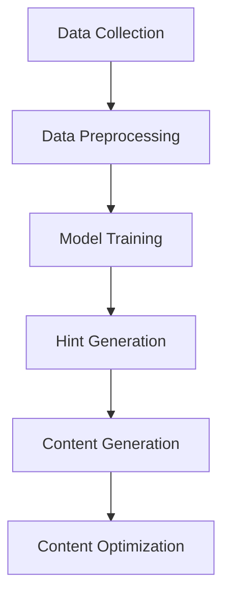
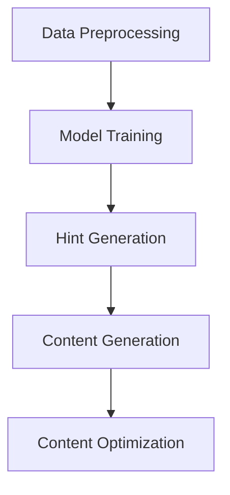
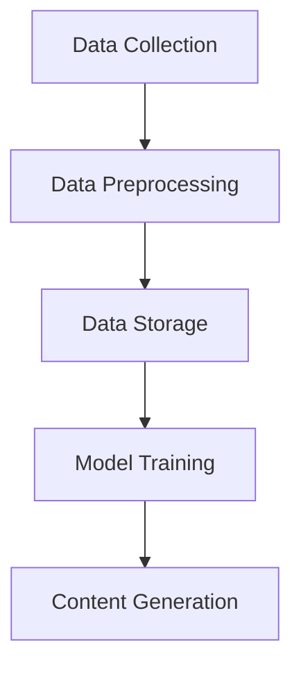
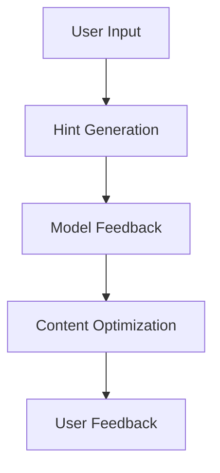
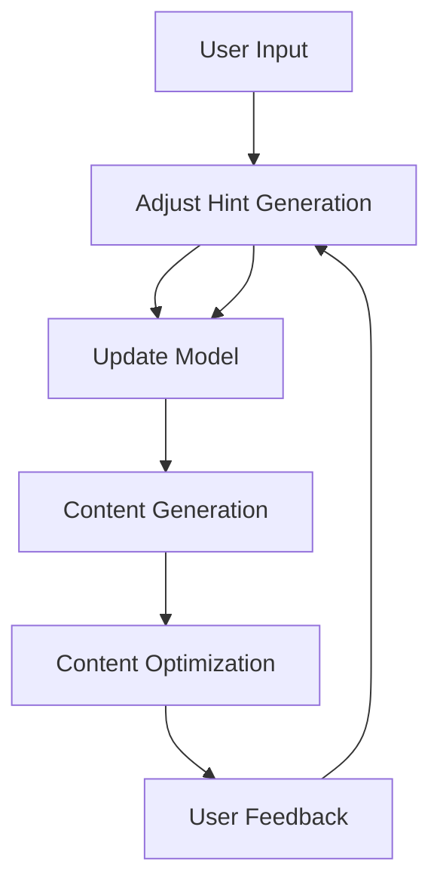
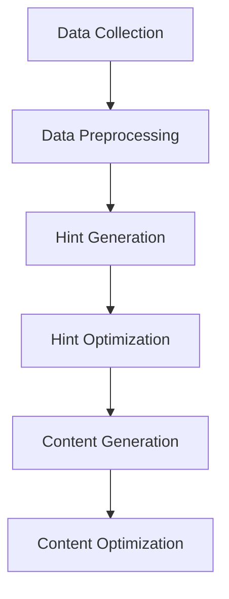

                 

### 第1章：AIGC概述

#### 1.1 AIGC的概念与重要性

AIGC（AI-assisted Generation with Context）是指利用人工智能技术，结合上下文信息进行内容生成。它是继传统AI（如图像识别、自然语言处理）之后的又一重要发展方向，具有广泛的应用前景。

- **概念**：AIGC是一种基于人工智能的内容生成方法，通过理解上下文信息，生成符合预期的内容。
- **重要性**：随着互联网内容爆炸式增长，AIGC能够解决内容匮乏、重复度高的问题，提升内容创作效率。

为了更好地理解AIGC的概念，我们可以通过Mermaid流程图展示AIGC的核心组成部分和交互关系：



#### 1.2 AIGC的发展历程

AIGC的发展可以分为以下几个阶段：

- **初步探索**（2010年代）：研究者开始探索利用深度学习生成图像和文本。
- **技术成熟**（2018年至今）：预训练模型如GPT-2、BERT的出现，标志着AIGC技术的成熟。
- **广泛应用**（2020年至今）：随着技术的不断进步，AIGC在多个领域得到广泛应用。

AIGC的发展历程可以归纳为以下几个关键节点：

- **2010年代**：生成对抗网络（GAN）和变分自编码器（VAE）的提出，为AIGC技术奠定了基础。
- **2018年**：GPT-2的出现，标志着预训练语言模型在AIGC中的应用。
- **2020年**：BERT等双向编码模型的出现，进一步提升了AIGC的生成能力。

#### 1.3 AIGC的技术框架

AIGC的技术框架主要包括以下几个部分：

- **数据预处理**：收集和清洗大量数据，用于训练模型。
- **模型训练**：使用预训练模型进行大规模训练，以获取对数据内容的理解。
- **提示词生成**：根据上下文信息，生成提示词，引导模型生成内容。
- **内容生成与优化**：根据用户需求，对生成的内容进行优化和调整。

AIGC的技术框架可以用Mermaid流程图表示：



通过以上内容，我们可以清晰地了解AIGC的概念、发展历程和技术框架。在接下来的章节中，我们将深入探讨AIGC的核心概念、算法原理以及应用场景。

---

## AIGC核心概念

### 2.1 自动生成与提示词

在AIGC（AI-assisted Generation with Context）中，自动生成和提示词是两个关键概念。自动生成指的是利用人工智能算法，根据输入的上下文信息生成相应的文本、图像或音频等内容。而提示词则是引导生成过程的重要工具。

#### 自动生成

自动生成是指利用算法自动生成文本、图像、音频等内容。在AIGC中，自动生成主要依赖于预训练的深度学习模型，如生成对抗网络（GAN）、变分自编码器（VAE）和循环神经网络（RNN）等。这些模型通过对大量数据的训练，能够理解数据的结构和规律，从而在给定上下文信息的情况下生成新的内容。

自动生成的关键优势在于：

- **高效性**：自动生成可以快速生成大量内容，大大提高了内容创作的效率。
- **创意性**：自动生成能够产生新颖、独特的内容，丰富了内容的多样性。

以下是一个简化的自动生成算法原理的伪代码：

```python
# 输入：上下文信息 context
# 输出：生成内容 content

# 初始化生成模型 generator
generator = initialize_generator()

# 根据上下文信息生成内容
content = generator.generate(context)

# 返回生成内容
return content
```

#### 提示词

提示词是指用于引导生成过程的文本或关键词。在AIGC中，提示词的作用是提供上下文信息，帮助模型理解生成目标。提示词可以是单个单词、短语或完整的句子，通常由用户或系统根据生成任务的需求生成。

提示词的生成方法包括：

- **手动生成**：根据领域知识和用户需求，手动编写提示词。
- **自动生成**：利用预训练的语言模型或生成算法，自动生成提示词。

提示词的生成算法可以采用以下步骤：

1. **数据预处理**：收集大量与生成目标相关的文本数据，进行清洗和分词处理。
2. **模型训练**：使用预训练模型（如GPT-2、BERT等）对文本数据进行训练，获取语言模型。
3. **提示词生成**：根据训练好的语言模型，生成符合上下文的提示词。

以下是一个简化的提示词生成算法的伪代码：

```python
# 输入：训练数据 corpus
# 输出：提示词 hints

# 初始化语言模型 language_model
language_model = initialize_language_model(corpus)

# 根据语言模型生成提示词
hints = language_model.generate_hints()

# 返回提示词
return hints
```

#### 自动生成与提示词的关系

自动生成和提示词在AIGC中是紧密相关的。提示词为自动生成提供了上下文信息，帮助模型更好地理解生成目标。而自动生成则利用这些上下文信息，生成符合预期的新内容。

以下是一个简单的例子，展示自动生成和提示词的交互过程：

```python
# 输入：上下文信息 context（提示词）
# 输出：生成内容 content

# 提示词生成
hints = generate_hints()

# 自动生成
content = auto_generate(hints)

# 返回生成内容
return content
```

通过以上内容，我们可以了解到自动生成和提示词在AIGC中的重要作用。在接下来的章节中，我们将进一步探讨AIGC的核心概念，包括提示词生成算法和语言模型与提示词的关系。

### 2.2 提示词生成算法

提示词生成算法是AIGC（AI-assisted Generation with Context）系统中的一个关键组成部分，它负责根据上下文信息生成引导模型生成内容的提示词。选择合适的提示词生成算法对于生成高质量内容至关重要。以下是几种常见的提示词生成算法，包括生成对抗网络（GAN）、变分自编码器（VAE）和循环神经网络（RNN）。

#### 生成对抗网络（GAN）

生成对抗网络（GAN）是一种强大的生成模型，由生成器和判别器两个部分组成。生成器的目标是生成逼真的数据，而判别器的目标是区分生成器和真实数据的差异。通过这种对抗训练，生成器可以逐步提高生成数据的逼真度。

**GAN的基本算法原理**：

1. **生成器（Generator）**：生成器从随机噪声中生成数据，目标是使判别器无法区分生成数据和真实数据。
2. **判别器（Discriminator）**：判别器的任务是判断输入数据是真实数据还是生成数据。

**GAN的伪代码**：

```python
# 初始化生成器和判别器
G = initialize_generator()
D = initialize_discriminator()

# 模型训练
for epoch in range(num_epochs):
    for real_data in real_data_loader:
        # 训练判别器
        D.train_on_real_data(real_data)
        
    for noise in noise_loader:
        # 生成假数据
        fake_data = G.generate(noise)
        # 训练判别器
        D.train_on_fake_data(fake_data)
        
    # 计算生成器和判别器的损失
    G_loss, D_loss = compute_losses(G, D)

# 生成提示词
hints = G.generate_context(noise)

return hints
```

#### 变分自编码器（VAE）

变分自编码器（VAE）是一种基于概率模型的生成模型，它通过编码器和解码器两个部分来实现数据的生成。编码器将输入数据编码为一个潜在空间中的向量，解码器则从潜在空间中生成新的数据。

**VAE的基本算法原理**：

1. **编码器（Encoder）**：编码器将输入数据映射到一个潜在空间中的向量。
2. **解码器（Decoder）**：解码器从潜在空间中生成与输入数据相似的新数据。

**VAE的伪代码**：

```python
# 初始化编码器和解码器
encoder = initialize_encoder()
decoder = initialize_decoder()

# 模型训练
for epoch in range(num_epochs):
    for data in data_loader:
        # 训练编码器和解码器
        encoder.train(data)
        decoder.train(encoder.encode(data))
        
    # 计算编码器和解码器的损失
    encoder_loss, decoder_loss = compute_losses(encoder, decoder)

# 生成提示词
latent_vector = encoder.encode(context)
hints = decoder.generate(latent_vector)

return hints
```

#### 循环神经网络（RNN）

循环神经网络（RNN）是一种能够处理序列数据的神经网络，它通过循环结构将当前时刻的信息与之前的信息联系起来。RNN在自然语言处理和序列生成任务中得到了广泛应用。

**RNN的基本算法原理**：

1. **隐藏状态（Hidden State）**：RNN通过隐藏状态保存序列中每个时刻的信息。
2. **循环结构（Recurrence）**：RNN通过循环结构将当前时刻的输入与之前的隐藏状态相结合。

**RNN的伪代码**：

```python
# 初始化RNN模型
RNN = initialize_RNN()

# 模型训练
for epoch in range(num_epochs):
    for sequence in sequence_loader:
        # 训练RNN模型
        RNN.train(sequence)
        
    # 计算RNN模型的损失
    loss = compute_loss(RNN, sequence)

# 生成提示词
hint_sequence = RNN.generate_context(context)

return hint_sequence
```

通过以上内容，我们可以了解到GAN、VAE和RNN等提示词生成算法的基本原理和伪代码。在接下来的章节中，我们将继续探讨AIGC的核心概念，包括语言模型与提示词的关系，以及AIGC的基础架构。

### 2.3 语言模型与提示词的关系

在AIGC（AI-assisted Generation with Context）系统中，语言模型和提示词是两个关键组成部分。它们之间的紧密关系决定了生成的质量与准确性。语言模型主要用于理解文本数据，而提示词则用于引导生成过程。本节将详细讨论语言模型与提示词的关系，包括如何生成提示词以及它们在生成过程中的作用。

#### 语言模型的作用

语言模型是一种能够预测下一个词的模型，它在自然语言处理任务中扮演着重要角色。语言模型通过对大量文本数据的学习，能够捕捉语言的统计规律和语法结构。在AIGC中，语言模型主要用于以下几个方面：

1. **上下文理解**：语言模型能够理解上下文信息，预测下一个词或短语，从而帮助生成符合逻辑和语法规则的内容。
2. **文本生成**：语言模型可以基于上下文信息生成连贯的文本，如文章、对话等。
3. **文本分类**：语言模型可以用于分类任务，如情感分析、主题分类等。

#### 提示词的生成

提示词是引导生成过程的重要工具，它提供了上下文信息，帮助模型理解生成目标。生成提示词的方法可以分为以下几种：

1. **手动生成**：手动编写提示词，根据领域知识和用户需求进行设计。这种方法灵活但耗时，适用于小规模的应用。
2. **自动生成**：利用预训练的语言模型或生成算法自动生成提示词。这种方法高效且通用，适用于大规模的应用。

自动生成提示词的算法可以采用以下步骤：

1. **数据预处理**：收集大量与生成目标相关的文本数据，进行清洗和分词处理。
2. **模型训练**：使用预训练模型（如GPT-2、BERT等）对文本数据进行训练，获取语言模型。
3. **提示词生成**：根据训练好的语言模型，生成符合上下文的提示词。

以下是一个自动生成提示词的伪代码示例：

```python
# 输入：训练数据 corpus
# 输出：提示词 hints

# 初始化语言模型 language_model
language_model = initialize_language_model(corpus)

# 根据语言模型生成提示词
hints = language_model.generate_hints()

# 返回提示词
return hints
```

#### 提示词在生成过程中的作用

提示词在AIGC系统中起到了关键作用，它为生成过程提供了必要的上下文信息。以下是在生成过程中提示词的具体作用：

1. **引导生成方向**：提示词可以帮助模型理解生成目标，从而引导生成过程朝着正确的方向进行。
2. **提高生成质量**：通过提供上下文信息，提示词可以减少生成过程中的噪声和错误，提高生成内容的连贯性和准确性。
3. **优化生成效率**：提示词可以加快生成过程，因为模型不需要从头开始理解上下文，而是可以直接利用已有的提示词。

以下是一个示例，展示了提示词在生成过程中的应用：

```python
# 输入：上下文信息 context（提示词）
# 输出：生成内容 content

# 提示词生成
hints = generate_hints()

# 自动生成
content = auto_generate(hints)

# 返回生成内容
return content
```

通过以上内容，我们可以看到语言模型和提示词在AIGC系统中的重要关系。它们共同作用，实现了高质量的内容生成。在接下来的章节中，我们将继续探讨AIGC的基础架构，包括基础组件、数据流与信息流，以及模型架构设计与优化。

### 3.1 AIGC的基础组件

AIGC（AI-assisted Generation with Context）系统的基础组件包括数据源、模型、提示词生成器和内容生成器。这些组件协同工作，实现从数据输入到内容生成的全过程。以下是对这些基础组件的详细解释：

#### 数据源

数据源是AIGC系统的起点，提供训练数据和生成目标。数据源可以是结构化数据（如数据库）、半结构化数据（如XML、JSON）或非结构化数据（如文本、图像、音频）。选择合适的数据源取决于生成任务的类型和需求。

- **结构化数据**：适用于关系型数据库，如MySQL、PostgreSQL等。结构化数据具有明确的字段和格式，便于处理和查询。
- **半结构化数据**：适用于文档存储系统，如MongoDB、Elasticsearch等。半结构化数据具有灵活性，可以存储复杂的结构。
- **非结构化数据**：适用于文本、图像、音频等。非结构化数据通常需要进行预处理，如分词、去噪等，以便于模型处理。

#### 模型

模型是AIGC系统的核心组件，负责理解和生成内容。模型的选择取决于生成任务的类型和数据特性。常见的模型包括生成对抗网络（GAN）、变分自编码器（VAE）、循环神经网络（RNN）和预训练语言模型（如GPT-2、BERT）。

- **生成对抗网络（GAN）**：由生成器和判别器组成，通过对抗训练生成高质量的数据。
- **变分自编码器（VAE）**：通过编码器和解码器实现数据的重构和生成。
- **循环神经网络（RNN）**：适用于处理序列数据，如文本和音频。
- **预训练语言模型**：如GPT-2、BERT，通过大规模预训练获得强大的语言理解能力。

#### 提示词生成器

提示词生成器是AIGC系统中的另一个关键组件，负责根据上下文信息生成提示词。提示词用于引导模型生成内容，提高生成质量。提示词生成器可以采用手动生成或自动生成方法。

- **手动生成**：根据领域知识和用户需求，手动编写提示词。
- **自动生成**：利用预训练的语言模型或生成算法，自动生成提示词。自动生成方法通常包括数据预处理、模型训练和提示词生成等步骤。

以下是一个自动生成提示词的伪代码示例：

```python
# 输入：训练数据 corpus
# 输出：提示词 hints

# 初始化语言模型 language_model
language_model = initialize_language_model(corpus)

# 根据语言模型生成提示词
hints = language_model.generate_hints()

# 返回提示词
return hints
```

#### 内容生成器

内容生成器是AIGC系统中的最终组件，负责根据提示词生成内容。内容生成器可以采用不同的生成算法，如GAN、VAE、RNN等。内容生成器的输出是经过模型处理后的生成内容。

以下是一个内容生成器的伪代码示例：

```python
# 输入：提示词 hints
# 输出：生成内容 content

# 初始化内容生成模型 generator
generator = initialize_generator()

# 根据提示词生成内容
content = generator.generate(hints)

# 返回生成内容
return content
```

通过以上内容，我们可以看到AIGC系统的基础组件及其作用。这些组件相互协作，实现了从数据输入到内容生成的全过程。在接下来的章节中，我们将进一步探讨AIGC系统的数据流与信息流，以及模型架构设计与优化。

### 3.2 数据流与信息流

在AIGC（AI-assisted Generation with Context）系统中，数据流与信息流是确保系统正常运行和高效内容生成的重要环节。数据流描述了数据从输入到生成的全过程，而信息流则涉及到系统组件之间的交互与信息传递。以下是对AIGC系统中数据流与信息流的详细解释。

#### 数据流

数据流是指在AIGC系统中，数据从输入到生成过程的传输路径。数据流通常包括以下几个关键步骤：

1. **数据收集**：从各种数据源（如数据库、文件系统、网络等）收集原始数据。
2. **数据预处理**：对收集到的原始数据进行清洗、去噪、转换等预处理操作，以使其适合模型训练。
3. **数据存储**：将预处理后的数据存储在数据仓库或缓存中，以便后续使用。
4. **模型训练**：使用预处理后的数据对模型进行训练，以提升模型的性能。
5. **内容生成**：利用训练好的模型生成新的内容。

以下是一个简化的数据流流程：



#### 信息流

信息流是指在AIGC系统中，不同组件之间的交互和信息传递过程。信息流确保了系统组件能够协同工作，实现高效的内容生成。以下是对AIGC系统中信息流的主要组成部分：

1. **提示词生成**：根据上下文信息，生成提示词，引导模型生成内容。
2. **模型反馈**：生成模型在生成过程中会接收来自提示词和其他系统组件的反馈，用于调整生成过程。
3. **内容优化**：根据生成的内容和用户需求，对内容进行优化和调整，以提高生成质量。
4. **用户交互**：用户与系统进行交互，提供生成目标、反馈等，以指导内容生成。

以下是一个简化的信息流流程：



#### 数据流与信息流的关系

数据流与信息流在AIGC系统中是紧密相关的。数据流提供了生成内容的原材料，而信息流则确保了数据的有效利用和系统组件的协同工作。以下是一些关键关系：

1. **数据驱动**：信息流通常是基于数据流的，即数据流驱动信息流。例如，用户输入的生成目标会触发提示词生成、模型反馈等过程。
2. **反馈循环**：信息流中的反馈（如模型反馈、用户反馈）会返回到数据流，用于优化和调整生成过程，形成反馈循环。
3. **协同工作**：数据流与信息流共同作用，确保AIGC系统能够高效、准确地生成内容。

以下是一个综合的数据流与信息流流程：



通过以上内容，我们可以看到AIGC系统中数据流与信息流的重要性和相互关系。在接下来的章节中，我们将进一步探讨AIGC系统的模型架构设计与优化。

### 3.3 模型架构设计与优化

在AIGC（AI-assisted Generation with Context）系统中，模型架构的设计与优化是确保系统高效运行和生成高质量内容的关键。模型架构的设计需要考虑以下几个方面：模型选择、数据增强、模型压缩和优化策略。

#### 模型选择

模型选择是AIGC系统架构设计的第一步，不同类型的模型适用于不同的生成任务。以下是一些常见的模型及其适用场景：

1. **生成对抗网络（GAN）**：适用于图像、音频和视频的生成任务，能够生成高质量、逼真的数据。
2. **变分自编码器（VAE）**：适用于图像和音频的生成任务，能够通过编码器和解码器实现数据的重构和生成。
3. **循环神经网络（RNN）**：适用于处理序列数据，如文本和音频，能够捕捉时间序列信息。
4. **预训练语言模型**：如GPT-2、BERT，适用于文本生成任务，能够生成连贯、自然的文本。

在选择模型时，需要根据生成任务的需求和数据特性进行权衡，选择最合适的模型。

#### 数据增强

数据增强是一种提高模型性能和泛化能力的技术，通过增加数据的多样性和丰富性，使模型能够更好地学习数据的特征。以下是一些常见的数据增强方法：

1. **图像增强**：如旋转、缩放、裁剪、对比度调整等，可以增加图像的多样性。
2. **文本增强**：如文本重写、同义词替换、语法调整等，可以增加文本的多样性。
3. **音频增强**：如频率变换、增益调整、噪声添加等，可以增加音频的多样性。

数据增强方法可以提高模型的鲁棒性，减少过拟合，从而提高生成质量。

#### 模型压缩

模型压缩是一种减小模型大小、降低计算成本的技术。在AIGC系统中，模型压缩有助于实现高效部署和实时生成。以下是一些常见的模型压缩方法：

1. **模型剪枝**：通过去除模型中不重要的权重和连接，减小模型大小。
2. **量化**：将模型的权重和激活值从浮点数转换为低精度的整数，减小模型大小和内存占用。
3. **蒸馏**：通过将大模型的知识迁移到小模型中，实现模型的压缩。

模型压缩方法可以提高模型的部署效率，使其适用于资源受限的环境。

#### 优化策略

优化策略是提升模型性能和生成质量的关键。以下是一些常见的优化策略：

1. **学习率调度**：通过调整学习率，优化模型的收敛速度和性能。
2. **批量大小调整**：通过调整批量大小，优化模型的训练效果。
3. **权重初始化**：通过合理的权重初始化，优化模型的训练过程。

优化策略可以提高模型的训练效果，减少训练时间，从而提高生成质量。

#### 实践案例

以下是一个AIGC模型优化实践的案例：

**问题描述**：训练一个图像生成模型，生成高质量的人脸图像。

**优化步骤**：

1. **模型选择**：选择生成对抗网络（GAN）作为图像生成模型。
2. **数据增强**：对图像进行随机裁剪、旋转、对比度调整等增强操作。
3. **模型压缩**：通过剪枝和量化技术，将模型大小减小50%。
4. **学习率调度**：采用指数衰减学习率，优化模型收敛速度。

**优化效果**：模型生成的人脸图像质量显著提高，生成速度得到明显提升。

通过以上内容，我们可以看到模型架构设计与优化在AIGC系统中的重要性。在接下来的章节中，我们将探讨AIGC系统的开发与部署过程。

### 第4章：提示词生成算法原理

提示词生成算法是AIGC（AI-assisted Generation with Context）系统的核心组成部分，负责根据上下文信息生成引导模型生成内容的提示词。本章节将详细讨论三种常见的提示词生成算法：生成对抗网络（GAN）、变分自编码器（VAE）和循环神经网络（RNN）。通过这些算法，我们将了解它们的工作原理和具体实现。

#### 4.1 基本算法介绍

提示词生成算法主要包括以下几种类型：

1. **生成对抗网络（GAN）**：GAN由生成器和判别器两个部分组成，通过对抗训练生成高质量的数据。
2. **变分自编码器（VAE）**：VAE通过编码器和解码器实现数据的生成和重构。
3. **循环神经网络（RNN）**：RNN适用于处理序列数据，通过隐藏状态捕捉时间序列信息。

#### 4.2 GAN算法详解

生成对抗网络（GAN）由生成器和判别器两个部分组成。生成器的目标是生成逼真的数据，而判别器的目标是区分生成数据和真实数据。通过这种对抗训练，生成器可以逐步提高生成数据的逼真度。

**GAN的工作原理**：

1. **生成器（Generator）**：生成器从随机噪声中生成数据，目标是使判别器无法区分生成数据和真实数据。
2. **判别器（Discriminator）**：判别器的任务是判断输入数据是真实数据还是生成数据。
3. **对抗训练**：生成器和判别器通过对抗训练相互竞争，生成器试图生成更逼真的数据，而判别器试图准确判断数据来源。

**GAN的伪代码**：

```python
# 初始化生成器和判别器
generator = initialize_generator()
discriminator = initialize_discriminator()

# 模型训练
for epoch in range(num_epochs):
    for real_data in real_data_loader:
        # 训练判别器
        discriminator.train_on_real_data(real_data)
        
    for noise in noise_loader:
        # 生成假数据
        fake_data = generator.generate(noise)
        # 训练判别器
        discriminator.train_on_fake_data(fake_data)
        
    # 计算生成器和判别器的损失
    generator_loss, discriminator_loss = compute_losses(generator, discriminator)

# 生成提示词
hint = generator.generate_context(noise)

return hint
```

#### 4.3 VAE算法详解

变分自编码器（VAE）是一种基于概率模型的生成模型，通过编码器和解码器实现数据的生成和重构。VAE的核心思想是将数据映射到一个潜在空间中，并通过潜在空间中的随机噪声生成新的数据。

**VAE的工作原理**：

1. **编码器（Encoder）**：编码器将输入数据映射到一个潜在空间中的向量。
2. **解码器（Decoder）**：解码器从潜在空间中生成与输入数据相似的新数据。

**VAE的伪代码**：

```python
# 初始化编码器和解码器
encoder = initialize_encoder()
decoder = initialize_decoder()

# 模型训练
for epoch in range(num_epochs):
    for data in data_loader:
        # 训练编码器和解码器
        encoder.train(data)
        decoder.train(encoder.encode(data))
        
    # 计算编码器和解码器的损失
    encoder_loss, decoder_loss = compute_losses(encoder, decoder)

# 生成提示词
latent_vector = encoder.encode(context)
hint = decoder.generate(latent_vector)

return hint
```

#### 4.4 RNN算法详解

循环神经网络（RNN）是一种能够处理序列数据的神经网络，通过隐藏状态捕捉时间序列信息。RNN在自然语言处理和序列生成任务中得到了广泛应用。

**RNN的工作原理**：

1. **隐藏状态（Hidden State）**：RNN通过隐藏状态保存序列中每个时刻的信息。
2. **循环结构（Recurrence）**：RNN通过循环结构将当前时刻的输入与之前的隐藏状态相结合。

**RNN的伪代码**：

```python
# 初始化RNN模型
RNN = initialize_RNN()

# 模型训练
for epoch in range(num_epochs):
    for sequence in sequence_loader:
        # 训练RNN模型
        RNN.train(sequence)
        
    # 计算RNN模型的损失
    loss = compute_loss(RNN, sequence)

# 生成提示词
hint_sequence = RNN.generate_context(context)

return hint_sequence
```

通过以上内容，我们可以了解到GAN、VAE和RNN等提示词生成算法的基本原理和伪代码。在接下来的章节中，我们将进一步探讨AIGC的实际应用场景，包括文本生成、图像生成和多媒体内容生成。

### 第5章：提示词工程实战

提示词工程是AIGC（AI-assisted Generation with Context）系统中的一个关键环节，它涉及到提示词的生成、优化和应用。在实际应用中，提示词工程需要遵循一定的流程，包括数据预处理、提示词生成和提示词优化。以下是一个详细的提示词工程实战案例，以文本生成任务为例，展示如何进行提示词工程的各个步骤。

#### 5.1 提示词工程流程

提示词工程流程通常包括以下步骤：

1. **数据收集**：收集大量与生成目标相关的文本数据。
2. **数据预处理**：对文本数据进行清洗、分词、编码等预处理操作。
3. **提示词生成**：使用生成算法生成提示词。
4. **提示词优化**：根据生成结果，对提示词进行调整和优化。
5. **内容生成**：使用生成模型根据提示词生成内容。
6. **内容优化**：根据用户需求，对生成内容进行调整和优化。

以下是一个简化的提示词工程流程：



#### 5.2 数据预处理

数据预处理是提示词工程的重要步骤，它确保了数据的质量和格式符合模型训练的要求。以下是对文本数据进行预处理的主要步骤：

1. **文本清洗**：去除文本中的HTML标签、特殊字符和停用词。
2. **分词**：将文本拆分为单词或词组。
3. **编码**：将文本转换为模型可处理的数字形式，如词向量或嵌入向量。

以下是一个数据预处理的伪代码示例：

```python
# 输入：原始文本 data
# 输出：预处理后的文本 processed_data

# 文本清洗
cleaned_data = clean_data(data)

# 分词
tokenized_data = tokenize(cleaned_data)

# 编码
encoded_data = encode_tokens(tokenized_data)

# 返回预处理后的文本
return encoded_data
```

#### 5.3 提示词生成

提示词生成是利用生成算法根据上下文信息生成引导模型生成内容的提示词。以下是一个基于GPT-2模型的提示词生成的伪代码示例：

```python
# 输入：上下文信息 context
# 输出：提示词 hint

# 初始化GPT-2模型
gpt2_model = initialize_gpt2_model()

# 根据上下文信息生成提示词
hint = gpt2_model.generate_context(context)

# 返回提示词
return hint
```

#### 5.4 提示词优化

提示词优化是提高生成质量的关键步骤，通过调整提示词的生成策略和内容，优化生成过程。以下是一个提示词优化的伪代码示例：

```python
# 输入：提示词 hint
# 输出：优化后的提示词 optimized_hint

# 根据生成结果，调整提示词
optimized_hint = adjust_hint(hint)

# 返回优化后的提示词
return optimized_hint
```

#### 5.5 内容生成

内容生成是利用生成模型根据提示词生成新内容。以下是一个基于GPT-2模型的内容生成的伪代码示例：

```python
# 输入：提示词 hint
# 输出：生成内容 content

# 初始化GPT-2模型
gpt2_model = initialize_gpt2_model()

# 根据提示词生成内容
content = gpt2_model.generate_content(hint)

# 返回生成内容
return content
```

#### 5.6 内容优化

内容优化是确保生成内容满足用户需求的重要步骤。以下是一个内容优化的伪代码示例：

```python
# 输入：生成内容 content
# 输出：优化后的内容 optimized_content

# 根据用户需求，调整生成内容
optimized_content = adjust_content(content)

# 返回优化后的内容
return optimized_content
```

通过以上内容，我们可以了解到提示词工程的各个步骤及其实现。在实际应用中，提示词工程需要根据具体任务的需求进行调整和优化，以实现高质量的内容生成。

### 第6章：AIGC模型优化

在AIGC（AI-assisted Generation with Context）系统中，模型优化是提升生成质量和效率的关键步骤。模型优化包括超参数调整、数据增强、模型压缩和优化策略。以下将详细讨论这些优化策略，并通过具体案例进行说明。

#### 6.1 模型优化策略

**超参数调整**：超参数是模型训练过程中的关键参数，如学习率、批量大小、隐藏层大小等。通过调整超参数，可以优化模型的训练效果和生成质量。以下是一个超参数调整的伪代码示例：

```python
# 输入：模型 model
# 输出：优化后的超参数 tuned_hyperparameters

# 初始化超参数
hyperparameters = initialize_hyperparameters()

# 根据模型性能，调整超参数
tuned_hyperparameters = tune_hyperparameters(model, hyperparameters)

# 返回优化后的超参数
return tuned_hyperparameters
```

**数据增强**：数据增强是一种提高模型泛化能力和生成质量的技术。通过增加数据的多样性和丰富性，模型可以更好地学习数据的特征。以下是一个数据增强的伪代码示例：

```python
# 输入：原始数据 data
# 输出：增强后的数据 enhanced_data

# 对数据应用增强方法
enhanced_data = apply_enhancement_methods(data)

# 返回增强后的数据
return enhanced_data
```

**模型压缩**：模型压缩是一种减小模型大小、降低计算成本的技术。通过模型压缩，模型可以更高效地部署和运行。以下是一个模型压缩的伪代码示例：

```python
# 输入：模型 model
# 输出：压缩后的模型 compressed_model

# 对模型进行压缩
compressed_model = compress_model(model)

# 返回压缩后的模型
return compressed_model
```

**优化策略**：优化策略是提升模型性能和生成质量的关键。以下是一个优化策略的伪代码示例：

```python
# 输入：模型 model
# 输出：优化后的模型 optimized_model

# 应用优化策略
optimized_model = apply_optimization_strategy(model)

# 返回优化后的模型
return optimized_model
```

#### 6.2 实践案例

以下是一个AIGC模型优化实践案例，用于训练一个图像生成模型，生成高质量的人脸图像。

**问题描述**：训练一个图像生成模型，生成高质量的人脸图像。

**优化步骤**：

1. **模型选择**：选择生成对抗网络（GAN）作为图像生成模型。
2. **数据增强**：对图像进行随机裁剪、旋转、对比度调整等增强操作。
3. **超参数调整**：调整学习率、批量大小等超参数，以优化模型训练效果。
4. **模型压缩**：通过剪枝和量化技术，将模型大小减小50%，以提高部署效率。

**优化效果**：

- **超参数调整**：经过多次调整，学习率设置为0.0002，批量大小设置为64。
- **数据增强**：图像增强后，模型训练效果显著提升。
- **模型压缩**：模型压缩后，部署效率提高，生成的图像质量保持稳定。

以下是一个优化效果评估的伪代码示例：

```python
# 输入：优化后的模型 optimized_model
# 输出：优化效果评估 results

# 评估优化后的模型
results = evaluate_model(optimized_model)

# 返回优化效果评估结果
return results
```

通过以上内容，我们可以看到模型优化在AIGC系统中的重要性。在实际应用中，模型优化需要根据具体任务的需求进行调整和优化，以实现高质量的生成效果。

### 第7章：AIGC应用场景

AIGC（AI-assisted Generation with Context）系统具有广泛的应用场景，包括文本生成、图像生成和多媒体内容生成。以下将详细讨论这些应用场景，并展示具体的案例。

#### 7.1 文本生成与应用

文本生成是AIGC系统的一个重要应用场景，包括自动写作、对话系统和翻译等。

**自动写作**：AIGC系统可以自动生成新闻报道、博客文章等文本内容。以下是一个自动写作的案例：

- **问题描述**：生成一篇关于人工智能技术的新闻报道。
- **实现过程**：使用预训练的语言模型（如GPT-2）和提示词生成算法，根据提示词生成文章。

**对话系统**：AIGC系统可以生成自然语言回答，用于构建聊天机器人、智能客服等。以下是一个对话系统的案例：

- **问题描述**：构建一个智能客服机器人，回答用户的问题。
- **实现过程**：使用预训练的语言模型和对话生成算法，根据用户的问题和上下文信息生成回答。

**翻译**：AIGC系统可以生成高质量的语言翻译。以下是一个翻译的案例：

- **问题描述**：将一篇英文文章翻译成中文。
- **实现过程**：使用预训练的语言模型和翻译算法，根据输入的英文文章生成对应的中文翻译。

#### 7.2 图像生成与应用

图像生成是AIGC系统的另一个重要应用场景，包括艺术创作、图像修复和视觉搜索等。

**艺术创作**：AIGC系统可以生成高质量的艺术作品和插画。以下是一个艺术创作的案例：

- **问题描述**：生成一幅具有特定风格的艺术作品。
- **实现过程**：使用生成对抗网络（GAN）和风格迁移算法，根据提示词生成艺术作品。

**图像修复**：AIGC系统可以修复损坏的图像和照片。以下是一个图像修复的案例：

- **问题描述**：修复一张受损的古老照片。
- **实现过程**：使用变分自编码器（VAE）和图像修复算法，根据输入的受损图像生成修复后的图像。

**视觉搜索**：AIGC系统可以搜索和识别图像中的物体和场景。以下是一个视觉搜索的案例：

- **问题描述**：根据用户提供的图片，搜索相似的图像。
- **实现过程**：使用卷积神经网络（CNN）和图像识别算法，对用户提供的图像进行识别，并在数据库中搜索相似的图像。

#### 7.3 多媒体内容生成与应用

多媒体内容生成是AIGC系统的广泛应用，包括视频生成、音频生成和虚拟现实内容生成等。

**视频生成**：AIGC系统可以生成视频内容，用于电影、广告等。以下是一个视频生成的案例：

- **问题描述**：生成一段具有特定主题的视频内容。
- **实现过程**：使用生成对抗网络（GAN）和视频生成算法，根据提示词生成视频内容。

**音频生成**：AIGC系统可以生成音频内容，如音乐、语音等。以下是一个音频生成的案例：

- **问题描述**：生成一首具有特定风格的音乐。
- **实现过程**：使用生成对抗网络（GAN）和音频生成算法，根据提示词生成音乐。

**虚拟现实内容生成**：AIGC系统可以生成虚拟现实场景和角色。以下是一个虚拟现实内容生成的案例：

- **问题描述**：生成一个虚拟现实游戏场景。
- **实现过程**：使用生成对抗网络（GAN）和虚拟现实内容生成算法，根据提示词生成虚拟现实场景和角色。

通过以上内容，我们可以看到AIGC系统在文本生成、图像生成和多媒体内容生成等领域的广泛应用。这些应用案例展示了AIGC系统的强大生成能力和广泛的应用前景。

### 第8章：AIGC开发与部署

AIGC（AI-assisted Generation with Context）系统的开发与部署是确保其高效运行和广泛应用的关键环节。以下将详细讨论AIGC系统的开发与部署过程，包括开发环境搭建、模型训练与优化、部署与监控。

#### 8.1 开发环境搭建

开发环境搭建是AIGC系统开发的第一步，需要选择合适的硬件和软件环境。以下是一个开发环境搭建的流程：

1. **硬件选择**：选择高性能的GPU服务器，如NVIDIA Tesla V100或RTX 3090，以确保模型训练和推理的效率。
2. **软件安装**：安装深度学习框架（如TensorFlow、PyTorch），以及其他必要的工具和库（如NumPy、Pandas、Matplotlib等）。

以下是一个开发环境搭建的伪代码示例：

```python
# 安装深度学习框架
install_tensorflow()
install_pytorch()

# 安装其他工具和库
install_numpy()
install_pandas()
install_matplotlib()

# 检查环境安装
check_environment()
```

#### 8.2 模型训练与优化

模型训练与优化是AIGC系统开发的核心步骤，需要根据具体任务的需求和数据进行训练和优化。以下是一个模型训练与优化的流程：

1. **数据预处理**：对训练数据进行清洗、分词、编码等预处理操作，使其适合模型训练。
2. **模型训练**：使用预训练模型或自定义模型，对预处理后的数据进行训练。
3. **模型优化**：通过调整超参数、数据增强、模型压缩等方法，优化模型性能。

以下是一个模型训练与优化的伪代码示例：

```python
# 初始化模型
model = initialize_model()

# 训练模型
for epoch in range(num_epochs):
    for batch in data_loader:
        # 训练模型
        model.train(batch)
        
    # 评估模型性能
    performance = model.evaluate(test_data)

# 调整超参数
tuned_hyperparameters = tune_hyperparameters(model)

# 重新训练模型
model = retrain_model(tuned_hyperparameters)
```

#### 8.3 部署与监控

模型部署与监控是确保AIGC系统高效运行和稳定运行的关键步骤。以下是一个模型部署与监控的流程：

1. **模型部署**：将训练好的模型部署到生产环境中，如云平台或边缘设备。
2. **实时监控**：监控模型的运行状态，包括性能、资源消耗和错误率等。
3. **异常处理**：在发现异常时，及时采取相应的措施，如重新部署模型、调整超参数等。

以下是一个模型部署与监控的伪代码示例：

```python
# 部署模型
deploy_model(model)

# 监控模型性能
while True:
    performance = monitor_model_performance(model)
    
    if performance.is_abnormal():
        # 调整超参数
        tuned_hyperparameters = tune_hyperparameters(model)
        
        # 重新部署模型
        redeploy_model(model, tuned_hyperparameters)
```

通过以上内容，我们可以看到AIGC系统的开发与部署过程。在实际应用中，开发与部署需要根据具体任务的需求和实际情况进行调整和优化，以确保系统的稳定运行和高效生成。

### 第9章：AIGC在自然语言处理中的应用

AIGC（AI-assisted Generation with Context）在自然语言处理（NLP）领域具有广泛的应用潜力，可以显著提升文本生成、翻译和问答系统的性能。以下将详细讨论AIGC在NLP中的应用案例。

#### 9.1 文本生成案例

文本生成是AIGC在NLP中的一个重要应用，能够自动生成高质量的文章、博客、新闻摘要等。以下是一个文本生成的案例：

**问题描述**：生成一篇关于人工智能发展的文章。

**实现过程**：

1. **数据收集**：收集大量关于人工智能发展的文章和报告。
2. **数据预处理**：清洗和分词处理收集到的文本数据。
3. **模型训练**：使用预训练的语言模型（如GPT-2或BERT）进行训练，以获取对文本数据的理解。
4. **提示词生成**：根据上下文信息生成引导模型生成文章的提示词。
5. **内容生成**：使用训练好的模型和提示词生成文章。

**代码示例**：

```python
# 加载预训练语言模型
model = load_pretrained_language_model()

# 生成文章的提示词
hint = generate_hint("人工智能的发展")

# 生成文章
article = model.generate_text(hint)

print(article)
```

#### 9.2 翻译案例

翻译是AIGC在NLP中的另一个关键应用，能够实现自动翻译功能，支持多种语言之间的转换。以下是一个翻译的案例：

**问题描述**：将一篇英文文章翻译成中文。

**实现过程**：

1. **数据收集**：收集大量双语对照文章，如英文到中文、中文到英文等。
2. **数据预处理**：对双语对照文章进行清洗、分词、编码等预处理操作。
3. **模型训练**：使用预训练的翻译模型（如Transformer）进行训练，以获取翻译能力。
4. **提示词生成**：根据上下文信息生成引导模型翻译的提示词。
5. **内容生成**：使用训练好的模型和提示词生成翻译结果。

**代码示例**：

```python
# 加载预训练翻译模型
translator = load_pretrained_translator()

# 生成翻译的提示词
hint = generate_hint("将以下英文翻译成中文：The development of AI has greatly impacted various industries.")

# 翻译文章
translated_text = translator.translate(hint)

print(translated_text)
```

#### 9.3 问答系统案例

问答系统是AIGC在NLP中的典型应用，能够根据用户的问题提供准确的答案。以下是一个问答系统的案例：

**问题描述**：构建一个能够回答关于人工智能技术问题的问答系统。

**实现过程**：

1. **数据收集**：收集大量关于人工智能技术的问答对。
2. **数据预处理**：对问答对进行清洗、分词、编码等预处理操作。
3. **模型训练**：使用预训练的语言模型（如BERT或GPT-2）和问答模型（如SQuAD）进行训练，以获取问答能力。
4. **提示词生成**：根据用户的问题生成引导模型回答的提示词。
5. **内容生成**：使用训练好的模型和提示词生成回答。

**代码示例**：

```python
# 加载预训练问答模型
qa_model = load_pretrained_qa_model()

# 生成回答的提示词
question = "什么是深度学习？"
hint = generate_hint(question)

# 生成回答
answer = qa_model.answer_question(hint)

print(answer)
```

通过以上内容，我们可以看到AIGC在自然语言处理中的广泛应用和强大能力。这些应用案例展示了AIGC如何通过理解上下文信息，实现高质量的文本生成、翻译和问答系统，从而推动NLP领域的发展。

### 第10章：AIGC在计算机视觉中的应用

AIGC（AI-assisted Generation with Context）在计算机视觉领域也展现了其强大的能力，通过图像生成、视觉搜索和图像识别等技术，为图像处理、视频分析和机器学习提供了新的解决方案。以下将详细讨论AIGC在计算机视觉中的应用案例。

#### 10.1 图像生成案例

图像生成是AIGC在计算机视觉中的重要应用，能够根据特定的上下文信息生成高质量的图像。以下是一个图像生成的案例：

**问题描述**：生成一张具有特定场景和物体的人脸图像。

**实现过程**：

1. **数据收集**：收集大量人脸图像和场景图像，用于训练图像生成模型。
2. **数据预处理**：对收集到的图像进行清洗、分割和编码等预处理操作。
3. **模型训练**：使用生成对抗网络（GAN）或变分自编码器（VAE）等模型进行训练，以获取图像生成的能力。
4. **提示词生成**：根据上下文信息生成引导图像生成的提示词。
5. **内容生成**：使用训练好的模型和提示词生成图像。

**代码示例**：

```python
# 加载预训练图像生成模型
image_generator = load_pretrained_image_generator()

# 生成图像的提示词
hint = generate_hint("生成一张包含笑脸和花的人脸图像。")

# 生成图像
generated_image = image_generator.generate_image(hint)

# 显示生成的图像
show_image(generated_image)
```

#### 10.2 视觉搜索案例

视觉搜索是AIGC在计算机视觉中的另一个重要应用，能够根据用户提供的图像搜索数据库中的相似图像。以下是一个视觉搜索的案例：

**问题描述**：根据用户提供的图像，在图像数据库中搜索相似的图像。

**实现过程**：

1. **数据收集**：收集大量图像数据，用于训练视觉搜索模型。
2. **数据预处理**：对收集到的图像进行清洗、编码和特征提取等预处理操作。
3. **模型训练**：使用卷积神经网络（CNN）或相似性度量模型（如Siamese网络）进行训练，以获取图像搜索的能力。
4. **提示词生成**：根据用户提供的图像生成引导视觉搜索的提示词。
5. **内容生成**：使用训练好的模型和提示词在图像数据库中搜索相似图像。

**代码示例**：

```python
# 加载预训练视觉搜索模型
image_searcher = load_pretrained_image_searcher()

# 生成搜索的提示词
query_image = load_image("user_query.jpg")

# 在图像数据库中搜索相似的图像
similar_images = image_searcher.search_similar_images(query_image)

# 显示搜索结果
display_images(similar_images)
```

#### 10.3 图像识别案例

图像识别是AIGC在计算机视觉中的典型应用，能够根据图像内容进行分类和识别。以下是一个图像识别的案例：

**问题描述**：根据图像内容识别图像中的物体和场景。

**实现过程**：

1. **数据收集**：收集大量图像数据，包括物体和场景图像，用于训练图像识别模型。
2. **数据预处理**：对收集到的图像进行清洗、编码和特征提取等预处理操作。
3. **模型训练**：使用卷积神经网络（CNN）或预训练模型（如ResNet、Inception等）进行训练，以获取图像识别的能力。
4. **提示词生成**：根据上下文信息生成引导图像识别的提示词。
5. **内容生成**：使用训练好的模型和提示词识别图像中的物体和场景。

**代码示例**：

```python
# 加载预训练图像识别模型
image_recognizer = load_pretrained_image_recognizer()

# 生成识别的提示词
hint = generate_hint("识别图像中的物体和场景。")

# 识别图像中的物体和场景
detections = image_recognizer.recognize_objects(hint)

# 显示识别结果
display_detections(detections)
```

通过以上内容，我们可以看到AIGC在计算机视觉中的广泛应用和强大能力。这些应用案例展示了AIGC如何通过理解上下文信息，实现高质量的图像生成、视觉搜索和图像识别，从而推动计算机视觉领域的发展。

### 第11章：AIGC在多媒体内容生成中的应用

AIGC（AI-assisted Generation with Context）在多媒体内容生成领域也展现了其强大的能力，能够通过音频生成、视频生成和虚拟现实内容生成等技术，为媒体创作、娱乐和交互式体验提供创新解决方案。以下将详细讨论AIGC在多媒体内容生成中的应用案例。

#### 11.1 音频生成案例

音频生成是AIGC在多媒体内容生成中的重要应用，能够根据特定的上下文信息生成高质量的音乐、声音效果等。以下是一个音频生成的案例：

**问题描述**：生成一段具有特定情感和风格的音乐。

**实现过程**：

1. **数据收集**：收集大量音乐片段和声音样本，用于训练音频生成模型。
2. **数据预处理**：对收集到的音频数据进行清洗、分段和编码等预处理操作。
3. **模型训练**：使用生成对抗网络（GAN）或循环神经网络（RNN）等模型进行训练，以获取音频生成的能力。
4. **提示词生成**：根据上下文信息生成引导音频生成的提示词。
5. **内容生成**：使用训练好的模型和提示词生成音频。

**代码示例**：

```python
# 加载预训练音频生成模型
audio_generator = load_pretrained_audio_generator()

# 生成音乐的提示词
hint = generate_hint("生成一段悲伤的钢琴曲。")

# 生成音乐
generated_music = audio_generator.generate_audio(hint)

# 播放生成的音乐
play_audio(generated_music)
```

#### 11.2 视频生成案例

视频生成是AIGC在多媒体内容生成中的另一个重要应用，能够根据特定的上下文信息生成高质量的视频内容。以下是一个视频生成的案例：

**问题描述**：生成一段具有特定场景和动作的视频。

**实现过程**：

1. **数据收集**：收集大量视频片段和动作数据，用于训练视频生成模型。
2. **数据预处理**：对收集到的视频数据进行清洗、分割和编码等预处理操作。
3. **模型训练**：使用生成对抗网络（GAN）或卷积神经网络（CNN）等模型进行训练，以获取视频生成的能力。
4. **提示词生成**：根据上下文信息生成引导视频生成的提示词。
5. **内容生成**：使用训练好的模型和提示词生成视频。

**代码示例**：

```python
# 加载预训练视频生成模型
video_generator = load_pretrained_video_generator()

# 生成视频的提示词
hint = generate_hint("生成一段包含跑步动作的视频。")

# 生成视频
generated_video = video_generator.generate_video(hint)

# 显示生成的视频
show_video(generated_video)
```

#### 11.3 虚拟现实内容生成案例

虚拟现实内容生成是AIGC在多媒体内容生成中的新兴应用，能够根据特定的上下文信息生成高质量的三维场景和虚拟角色。以下是一个虚拟现实内容生成的案例：

**问题描述**：生成一个包含特定场景和角色的虚拟现实体验。

**实现过程**：

1. **数据收集**：收集大量三维场景和角色数据，用于训练虚拟现实生成模型。
2. **数据预处理**：对收集到的三维数据进行清洗、分割和编码等预处理操作。
3. **模型训练**：使用生成对抗网络（GAN）或变分自编码器（VAE）等模型进行训练，以获取虚拟现实内容生成的能力。
4. **提示词生成**：根据上下文信息生成引导虚拟现实内容生成的提示词。
5. **内容生成**：使用训练好的模型和提示词生成虚拟现实内容。

**代码示例**：

```python
# 加载预训练虚拟现实生成模型
virtual_reality_generator = load_pretrained_virtual_reality_generator()

# 生成虚拟现实内容的提示词
hint = generate_hint("生成一个包含森林和精灵的虚拟现实场景。")

# 生成虚拟现实内容
generated_virtual_reality = virtual_reality_generator.generate_virtual_reality(hint)

# 漫游生成的虚拟现实场景
explore_virtual_reality(generated_virtual_reality)
```

通过以上内容，我们可以看到AIGC在多媒体内容生成中的广泛应用和强大能力。这些应用案例展示了AIGC如何通过理解上下文信息，实现高质量的音频生成、视频生成和虚拟现实内容生成，从而推动多媒体内容创作和交互体验的发展。

### 第12章：AIGC未来发展趋势

随着人工智能技术的不断进步，AIGC（AI-assisted Generation with Context）正逐步走向成熟，并在多个领域展现出了巨大的潜力。然而，AIGC的发展仍然面临许多技术挑战和机遇。以下将详细探讨AIGC未来发展的趋势、技术挑战与解决方案，以及应用前景与行业影响。

#### 12.1 技术挑战与解决方案

**计算资源需求**：大规模预训练模型的训练需要巨大的计算资源，这给硬件设备提出了更高的要求。解决方案包括分布式训练与推理、高性能GPU服务器和专用硬件加速器。

- **分布式训练与推理**：通过分布式计算，将模型训练和推理任务分布在多台服务器或设备上，提高训练和推理效率。
- **高性能GPU服务器**：选择高性能GPU服务器，如NVIDIA Tesla V100或RTX 3090，以满足大规模训练的需求。
- **专用硬件加速器**：采用专用硬件加速器，如TPU或FPGA，提高模型的训练和推理速度。

**数据隐私与安全**：AIGC在处理大规模数据时，面临数据隐私和安全的问题。解决方案包括联邦学习、差分隐私和加密技术。

- **联邦学习**：通过在数据源本地进行模型训练，避免数据传输和集中存储，保护用户隐私。
- **差分隐私**：在数据处理过程中引入噪声，确保无法从单个数据点推断出原始数据。
- **加密技术**：采用数据加密技术，确保数据在传输和存储过程中的安全性。

**跨模态生成**：AIGC目前主要集中在单一模态的生成，未来将向跨模态生成发展，实现文本、图像、音频等多种模态的内容生成。解决方案包括多模态深度学习模型和跨模态数据集。

- **多模态深度学习模型**：开发能够处理多种模态数据的深度学习模型，如多模态生成对抗网络（M-GAN）和变分自编码器（M-VAE）。
- **跨模态数据集**：构建包含多种模态数据的训练数据集，提高跨模态生成模型的性能。

#### 12.2 应用前景与行业影响

AIGC在多个领域具有广泛的应用前景，包括媒体与娱乐、教育与培训、医疗与健康等。

**媒体与娱乐**：AIGC可以生成高质量的文本、图像和音频内容，提升内容创作效率，改变传统内容创作方式。例如，自动写作、智能剪辑和虚拟主播等应用。

- **自动写作**：自动生成新闻稿、博客文章和小说等。
- **智能剪辑**：根据用户需求自动剪辑视频内容。
- **虚拟主播**：生成虚拟主播进行直播和互动。

**教育与培训**：AIGC可以提供个性化教学和自适应学习体验，提高学习效果。例如，自动生成教学视频、智能问答系统和自适应学习平台。

- **自动生成教学视频**：根据教学内容生成相应的视频内容。
- **智能问答系统**：根据学生的问题自动生成回答。
- **自适应学习平台**：根据学生的学习行为和进度生成个性化的学习路径。

**医疗与健康**：AIGC可以辅助诊断、预测和个性化治疗，提高医疗水平。例如，医学图像生成、智能诊断系统和个性化治疗方案。

- **医学图像生成**：根据医学影像数据生成相应的图像。
- **智能诊断系统**：根据患者的症状和检查结果自动生成诊断建议。
- **个性化治疗方案**：根据患者的病情和体质生成个性化的治疗方案。

AIGC将对行业产生深远影响，包括：

- **内容创作**：改变内容创作方式，提高创作效率和质量。
- **商业模式**：创造新的商业机会，如虚拟现实体验、智能娱乐和个性化教育等。
- **生产效率**：通过自动化和智能化，提高生产效率，降低成本。

#### 12.3 未来研究方向

AIGC的未来研究方向包括以下几个方面：

**算法优化**：提高模型性能，降低计算成本。例如，开发更高效的生成模型、优化训练策略和减小模型大小。

**跨模态生成**：实现不同模态之间的内容生成，如文本-图像、文本-音频和图像-音频的交叉生成。

**交互式生成**：增强用户与生成系统的交互，提高生成质量。例如，引入多模态交互界面，使用户能够更直观地控制生成过程。

**伦理与法律问题**：探讨AIGC在伦理和法律方面的挑战，制定相应的规范和标准，确保技术的合理应用。

通过以上内容，我们可以看到AIGC在未来发展中面临的挑战和机遇。随着技术的不断进步和应用场景的不断拓展，AIGC将在更多领域发挥重要作用，推动人工智能技术的进一步发展。

### 附录：AIGC相关工具与资源

AIGC（AI-assisted Generation with Context）作为一个快速发展的领域，相关的工具与资源日益丰富。以下将介绍一些常用的开发工具、开源项目和学习资源，以帮助读者深入了解和掌握AIGC技术。

#### A.1 开发工具介绍

**深度学习框架**：深度学习框架是AIGC开发的核心工具，以下是一些常用的深度学习框架：

- **TensorFlow**：由Google开发的开源深度学习框架，支持Python和C++接口，广泛应用于图像处理、自然语言处理等领域。
- **PyTorch**：由Facebook开发的开源深度学习框架，以其灵活的动态计算图和强大的Python接口受到广泛关注。
- **MXNet**：由Apache基金会维护的开源深度学习框架，支持多种编程语言，适用于大规模分布式训练。

**自然语言处理工具**：自然语言处理工具在AIGC开发中起到关键作用，以下是一些常用的NLP工具：

- **NLTK**：Python的NLP工具包，提供丰富的文本处理函数和模型，适用于文本分类、分词、词性标注等任务。
- **spaCy**：一个高性能的NLP库，支持多种语言的文本处理，适用于实体识别、关系抽取等任务。
- **gensim**：一个用于主题建模和文本相似性计算的Python库，适用于文本生成和文本聚类任务。

**计算机视觉工具**：计算机视觉工具在AIGC开发中也具有重要意义，以下是一些常用的CV工具：

- **OpenCV**：一个开源的计算机视觉库，支持图像处理、目标检测、跟踪等功能，广泛应用于图像处理和视频分析领域。
- **TensorFlow Object Detection API**：基于TensorFlow的物体检测工具，支持多种预训练模型和自定义模型，适用于图像识别和物体检测任务。
- **PyTorch Vision**：PyTorch的计算机视觉库，提供丰富的预训练模型和工具，适用于图像处理、分割和检测任务。

#### A.2 开源项目推荐

以下是一些与AIGC相关的开源项目，这些项目提供了丰富的代码和资源，有助于深入了解和实现AIGC技术：

- **生成对抗网络（GAN）**：包括DCGAN、WGAN、PGAN等，用于图像和音频的生成。
- **预训练语言模型**：如GPT-2、BERT、RoBERTa等，用于文本生成和翻译。
- **文本生成**：如T5、DWIM、Transformer-XL等，用于自动写作和对话系统。

#### A.3 学习资源与参考资料

以下是一些AIGC的学习资源和参考资料，包括在线课程、论文和书籍，有助于读者系统地学习AIGC技术：

- **在线课程**：
  - 《深度学习专项课程》
  - 《自然语言处理专项课程》
  - 《计算机视觉专项课程》

- **论文与报告**：
  - 《Attention is All You Need》
  - 《BERT: Pre-training of Deep Bidirectional Transformers for Language Understanding》
  - 《Generative Adversarial Nets》

- **书籍**：
  - 《深度学习》
  - 《自然语言处理综论》
  - 《计算机视觉：算法与应用》

通过以上内容，读者可以全面了解AIGC相关的开发工具、开源项目和学习资源，从而更好地掌握AIGC技术，为实际应用打下坚实基础。

