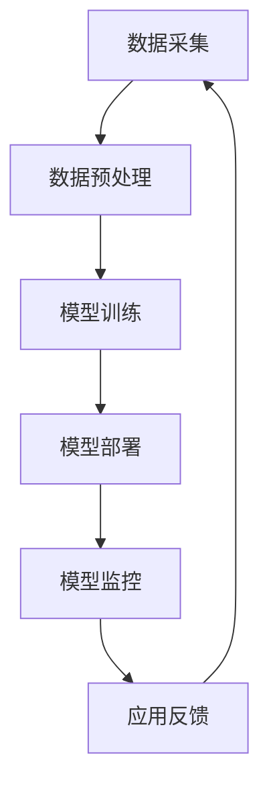
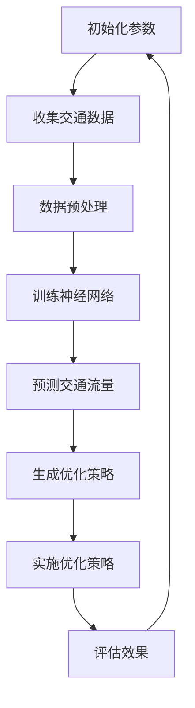

                 

### 文章标题

> **关键词：人工智能、城市交通、基础设施建设、可持续发展、人类计算**

> **摘要：本文深入探讨了人工智能与人类计算在可持续发展的城市交通与基础设施建设中的应用，通过一步步的分析和推理，揭示了其核心概念、原理和架构，并提出了实际应用案例和政策建议。**

---

### 《AI与人类计算：打造可持续发展的城市交通与基础设施建设与规划建设与管理》目录大纲

#### 第一部分：AI与人类计算基础

##### 第1章：城市交通与基础设施建设背景

**1.1 城市交通与基础设施建设的现状与挑战**

**1.2 AI技术在城市交通与基础设施建设中的应用前景**

**1.3 人类计算与城市交通与基础设施建设的融合**

##### 第2章：AI技术原理与架构

**2.1 AI基础技术概述**

**2.2 AI核心算法原理**

**2.3 AI架构与系统设计**

**2.4 Mermaid流程图：城市交通与基础设施建设中的AI应用架构**

##### 第3章：城市交通数据分析与优化

**3.1 城市交通数据类型与来源**

**3.2 数据预处理与清洗**

**3.3 数据分析技术与应用**

**3.4 优化算法原理与实现**

##### 第4章：基础设施建设与规划

**4.1 城市基础设施建设概述**

**4.2 城市规划方法与工具**

**4.3 AI在基础设施建设与规划中的应用**

**4.4 项目案例：AI驱动的城市基础设施优化**

##### 第5章：AI与人类计算的融合

**5.1 AI与人类计算的定义与联系**

**5.2 AI辅助人类计算的优势与挑战**

**5.3 人类计算参与AI系统设计与开发**

##### 第6章：城市交通与基础设施建设的可持续发展

**6.1 可持续发展目标与评估指标**

**6.2 AI在可持续发展中的应用**

**6.3 可持续发展实践案例**

##### 第7章：未来展望与政策建议

**7.1 城市交通与基础设施建设的发展趋势**

**7.2 AI技术未来发展方向**

**7.3 政策建议与实施策略**

**附录：AI工具与资源**

**A.1 主流AI框架介绍**

**A.2 常用AI开发工具与资源**

**A.3 AI开源项目与社区**

---

接下来，我们将逐一探讨各个章节的核心概念、原理和架构，通过一步步的分析和推理，为读者呈现一个全面、深入、专业的AI与人类计算在可持续发展的城市交通与基础设施建设中的应用图景。

#### 第一部分：AI与人类计算基础

##### 第1章：城市交通与基础设施建设背景

城市交通与基础设施建设是国家发展的重要基石，关乎民生福祉和城市竞争力。随着城市化进程的加速和人口规模的扩大，城市交通与基础设施面临的挑战日益严峻。传统的建设和管理方法已经难以满足现代城市的需求，因此，引入人工智能（AI）技术，实现城市交通与基础设施建设的智能化、高效化，成为当务之急。

**1.1 城市交通与基础设施建设的现状与挑战**

当前，我国城市交通与基础设施建设取得了显著成就，城市道路、桥梁、隧道、公共交通系统等基础设施日臻完善，但同时也面临着诸多挑战：

1. 交通拥堵：随着汽车保有量的急剧增加，城市交通拥堵问题日益严重，严重影响了居民的出行效率和城市的发展活力。
2. 基础设施老化：部分城市基础设施存在老化、破损等问题，需要及时进行改造和升级。
3. 能源消耗与环境污染：传统城市交通与基础设施建设方式消耗大量能源，导致环境污染和资源浪费。
4. 建设成本高：城市基础设施建设项目投资巨大，资金筹措和管理面临巨大压力。

**1.2 AI技术在城市交通与基础设施建设中的应用前景**

人工智能技术在城市交通与基础设施建设中的应用前景广阔：

1. 智能交通管理：通过AI技术对交通流量进行实时监控和分析，优化交通信号控制，减少拥堵，提高交通效率。
2. 智能基础设施建设：利用AI技术对基础设施进行预测性维护和优化设计，降低建设成本，延长使用寿命。
3. 智慧城市规划：结合AI技术进行城市三维建模、交通流量预测和环境影响评估，为城市规划提供科学依据。
4. 能源管理与优化：通过AI技术对城市能源消耗进行实时监测和优化，降低能源消耗，减少环境污染。

**1.3 人类计算与城市交通与基础设施建设的融合**

人类计算与AI技术的融合是城市交通与基础设施建设的必然趋势。人类计算在AI系统中扮演着重要的角色：

1. 知识获取与更新：人类计算可以通过对海量数据的分析和处理，不断更新和完善AI系统的知识库，提高其决策能力。
2. 人类监督与干预：在AI系统出现异常或无法解决复杂问题时，人类计算可以提供监督和干预，确保系统的安全性和可靠性。
3. 创新与改进：人类计算可以基于实践经验，提出新的算法和模型，推动AI技术在城市交通与基础设施建设中的应用创新。

通过人类计算与AI技术的融合，我们可以打造一个智能、高效、可持续发展的城市交通与基础设施建设体系，为城市居民提供更好的生活环境和出行体验。在接下来的章节中，我们将进一步探讨AI技术的原理、架构和应用，为这一目标的实现提供理论支持和实践指导。


### 第2章：AI技术原理与架构

在深入探讨人工智能（AI）技术在城市交通与基础设施建设中的应用之前，我们需要首先理解AI技术的原理与架构。AI技术的发展经历了多个阶段，从最初的规则系统到现代的深度学习，每一次进步都带来了计算能力的飞跃和应用领域的扩展。以下章节将详细解析AI基础技术、核心算法原理、AI架构与系统设计，并通过Mermaid流程图展示AI在城市交通与基础设施建设中的应用架构。

**2.1 AI基础技术概述**

AI基础技术涵盖了多个领域，包括机器学习、深度学习、自然语言处理、计算机视觉等。这些技术共同构成了AI的基石，为AI的应用提供了强大的支持。

1. **机器学习（Machine Learning）**：机器学习是一种让计算机通过数据和算法自动学习规律和模式的能力。其主要任务包括分类、回归、聚类等。机器学习算法分为监督学习、无监督学习和半监督学习。
2. **深度学习（Deep Learning）**：深度学习是机器学习的一种特殊形式，主要利用多层神经网络（如卷积神经网络、循环神经网络等）来提取数据的复杂特征，从而实现高级任务，如图像识别、语音识别等。
3. **自然语言处理（Natural Language Processing, NLP）**：自然语言处理旨在使计算机理解和处理人类语言，包括语言识别、语言生成、情感分析等。
4. **计算机视觉（Computer Vision）**：计算机视觉旨在使计算机理解和解释图像或视频，包括目标检测、图像分类、图像分割等。

**2.2 AI核心算法原理**

AI的核心算法原理主要涉及以下几个方面：

1. **神经网络（Neural Networks）**：神经网络是模仿生物神经系统的计算模型，通过多层神经元进行数据传递和处理。神经网络的训练过程包括前向传播和反向传播，通过不断调整权重和偏置，使网络能够学习输入数据的特征和模式。
   
   **伪代码示例：**
   ```mermaid
   graph TD
   A[初始化参数] --> B[前向传播]
   B --> C[计算损失函数]
   C --> D[反向传播]
   D --> E[更新参数]
   E --> B
   ```

2. **卷积神经网络（Convolutional Neural Networks, CNN）**：卷积神经网络是一种专门用于处理图像数据的神经网络，通过卷积操作提取图像的特征。CNN由卷积层、池化层和全连接层组成，能够实现高效的图像识别和分类。

   **伪代码示例：**
   ```mermaid
   graph TD
   A[输入图像] --> B[卷积层1]
   B --> C[池化层1]
   C --> D[卷积层2]
   D --> E[池化层2]
   E --> F[全连接层]
   F --> G[输出结果]
   ```

3. **生成对抗网络（Generative Adversarial Networks, GAN）**：生成对抗网络由生成器和判别器两个网络组成，通过对抗训练生成真实数据分布的模型。GAN在图像生成、语音合成等领域有广泛应用。

   **伪代码示例：**
   ```mermaid
   graph TD
   A[生成器G] --> B[判别器D]
   B --> C[生成器G]
   C --> D
   ```

**2.3 AI架构与系统设计**

AI架构与系统设计是确保AI模型高效运行的关键。一个典型的AI架构包括数据采集、数据预处理、模型训练、模型部署和模型监控等环节。

1. **数据采集**：通过传感器、摄像头、GPS等设备收集城市交通和基础设施的数据。
2. **数据预处理**：对采集到的数据进行清洗、归一化、特征提取等处理，为模型训练做好准备。
3. **模型训练**：使用训练数据训练AI模型，调整模型参数，使其能够准确预测或分类。
4. **模型部署**：将训练好的模型部署到实际应用场景，如交通信号灯控制系统、基础设施监控系统等。
5. **模型监控**：对部署后的模型进行实时监控，确保其稳定运行，并根据需求进行更新和优化。

**2.4 Mermaid流程图：城市交通与基础设施建设中的AI应用架构**

为了更好地理解AI在城市交通与基础设施建设中的应用架构，我们使用Mermaid流程图进行展示。



在图2-1中，数据采集环节通过传感器和设备收集交通和基础设施数据，数据预处理环节对数据进行清洗和特征提取，模型训练环节使用训练数据训练AI模型，模型部署环节将模型部署到实际应用场景，模型监控环节对部署后的模型进行监控和优化，应用反馈环节将实际应用效果反馈给数据采集环节，形成一个闭环系统。

通过以上对AI技术原理与架构的详细解析，我们可以更好地理解AI在城市交通与基础设施建设中的应用基础。在接下来的章节中，我们将探讨AI技术在城市交通数据分析与优化、基础设施建设与规划等方面的具体应用，并分享一些实际项目案例，以期为读者提供更深入的理解和启示。

### 第3章：城市交通数据分析与优化

在当前智能城市的发展中，城市交通数据分析与优化是关键的一环。通过利用人工智能技术，我们可以从海量交通数据中提取有用信息，优化交通流量，减少拥堵，提升交通效率。以下章节将详细探讨城市交通数据的类型与来源、数据预处理与清洗、数据分析技术与应用以及优化算法原理与实现。

**3.1 城市交通数据类型与来源**

城市交通数据类型丰富多样，主要包括以下几类：

1. **交通流量数据**：包括道路车辆流量、速度、密度等数据，通常来源于交通监控摄像头、流量检测器等设备。
2. **公共交通数据**：包括公交车、地铁、有轨电车等公共交通的实时位置、运行状态、乘客数量等数据，通常来源于公共交通公司。
3. **车辆数据**：包括车辆的速度、方向、位置等数据，通常来源于车辆GPS定位系统。
4. **交通事件数据**：包括交通事故、道路施工、恶劣天气等事件的数据，通常来源于交通管理部门。
5. **环境数据**：包括道路温度、湿度、空气质量等环境参数数据，通常来源于气象监测设备。

城市交通数据的来源广泛，包括：

- **交通监控摄像头**：监控摄像头是获取交通流量数据的主要设备，通过图像识别技术可以实时分析车辆流量、速度等参数。
- **流量检测器**：流量检测器（如雷达、感应线圈等）安装在道路上方或地面，用于实时检测车辆数量和速度。
- **公共交通GPS系统**：公共交通车辆安装有GPS系统，可以实时传输车辆位置和运行状态数据。
- **车辆传感器**：车辆传感器可以检测车辆的速度、方向、位置等信息，并通过无线通信技术传输到中央系统。
- **交通管理部门**：交通管理部门通过收集事故、施工等信息，为交通优化提供重要数据支持。

**3.2 数据预处理与清洗**

在数据分析之前，需要对收集到的交通数据进行预处理和清洗，以确保数据的质量和一致性。数据预处理与清洗的主要任务包括：

1. **数据去噪**：去除数据中的噪声和异常值，如传感器误差、传输错误等。
2. **数据归一化**：将不同来源、不同类型的数据进行归一化处理，使其具有相同的尺度，便于后续分析。
3. **缺失值处理**：处理数据中的缺失值，可以通过插值、平均值填补等方法进行。
4. **重复数据删除**：去除重复的数据记录，确保数据的一致性和唯一性。

**3.3 数据分析技术与应用**

数据分析技术在城市交通优化中发挥着重要作用，主要包括：

1. **时间序列分析**：通过对交通流量、速度等数据的时间序列分析，可以发现交通流量的趋势、周期性和突变点，为交通预测和优化提供依据。
2. **空间数据分析**：通过对交通数据的空间分布和相关性分析，可以识别交通拥堵区域、热点区域，为交通管理提供支持。
3. **机器学习与深度学习**：利用机器学习和深度学习算法，可以对交通数据进行分类、聚类、回归等操作，实现交通流量预测、交通事件预测等功能。
4. **数据可视化**：通过数据可视化技术，可以将复杂的数据以图形化的方式呈现，帮助决策者直观地了解交通状况，制定优化策略。

**3.4 优化算法原理与实现**

城市交通优化算法的目标是通过分析交通数据，提出优化交通流量的策略，减少拥堵，提高交通效率。以下是一些常见的优化算法原理与实现：

1. **基于规则的方法**：这种方法通过预设的规则，如限速、优先车道等，来控制交通流。实现方法相对简单，但灵活性较差，难以应对复杂交通环境。
2. **基于优化算法的方法**：如线性规划、整数规划、动态规划等，通过建立交通流量优化的数学模型，求解最优路径、最优流量分配等。实现方法复杂，但优化效果较好。
3. **基于人工智能的方法**：如深度强化学习、遗传算法等，通过学习交通数据，自动生成优化策略。实现方法智能化，但需要大量训练数据和计算资源。

**优化算法伪代码示例：**


在图3-1中，优化算法流程包括初始化参数、收集交通数据、数据预处理、训练神经网络、预测交通流量、生成优化策略、实施优化策略和评估效果。通过这一循环，系统可以不断调整优化策略，提高交通效率。

通过上述分析，我们可以看到，城市交通数据分析与优化是一个复杂但重要的过程，涉及到数据的收集、处理、分析以及优化算法的应用。在接下来的章节中，我们将进一步探讨AI在基础设施建设与规划中的应用，分享实际项目案例，为读者提供更深入的理解和实践指导。

### 第4章：基础设施建设与规划

在智能城市的构建中，基础设施建设和规划是实现城市可持续发展的重要环节。人工智能（AI）技术的引入，不仅提高了基础设施建设的效率和准确性，还优化了规划过程，使得城市能够更好地应对未来挑战。以下章节将详细探讨城市基础设施建设的概述、城市规划方法与工具、AI在基础设施建设与规划中的应用，以及AI驱动的城市基础设施优化项目案例。

**4.1 城市基础设施建设概述**

城市基础设施建设包括道路、桥梁、隧道、公共交通系统、供水系统、排水系统、电力供应系统等多个方面。这些基础设施的建设和管理直接关系到城市居民的生活质量、城市的经济活力以及环境的可持续发展。

1. **道路建设**：道路是城市交通的骨架，包括城市主干道、次干道和支路。高质量的道路建设能够提高交通效率，减少交通事故。
2. **桥梁与隧道建设**：桥梁和隧道是城市交通的重要通道，特别是在跨河、跨江和山地地区。它们的建设需要考虑地质条件、交通流量和施工安全等因素。
3. **公共交通系统建设**：公共交通系统是城市居民出行的主要方式，包括公交车、地铁、轻轨、有轨电车等。一个高效、便捷的公共交通系统能够减少私家车使用，降低交通拥堵和环境污染。
4. **供水系统建设**：供水系统是保障城市居民饮用水安全和生活用水的重要设施。其建设需要考虑水源保护、水质检测和水压调控等因素。
5. **排水系统建设**：排水系统包括雨水排放和污水处理。良好的排水系统能够防止城市内涝，保护城市环境。
6. **电力供应系统建设**：电力供应系统是城市运行的“心脏”，包括变电站、输电线路和配电网络。其建设需要考虑电力需求、供电安全和能源效率等因素。

**4.2 城市规划方法与工具**

城市规划是城市基础设施建设的基础，其方法与工具直接影响城市的发展和居民的生活质量。传统的城市规划方法主要包括以下几种：

1. **经验法**：基于城市规划师的经验和直觉，结合历史数据和现状分析，制定城市规划方案。
2. **定性分析法**：通过专家讨论、访谈、问卷调查等方式，收集城市规划相关的信息，进行分析和判断。
3. **定量分析法**：运用数学模型、统计分析等方法，对城市规划的数据进行定量分析，评估不同方案的经济、社会和环境效益。

现代城市规划方法中，AI技术的引入极大地提高了规划的科学性和精准性。以下是一些常见的AI城市规划工具：

1. **地理信息系统（GIS）**：GIS是一种集成了地图、数据和数据库的系统，可用于城市规划、土地管理、环境保护等方面。通过GIS，城市规划师可以直观地查看和管理空间数据，进行地理分析。
2. **城市仿真模型**：通过建立城市仿真模型，模拟城市的发展过程，预测不同规划方案的影响。仿真模型可以结合交通、环境、经济等多个因素，提供全面的规划评估。
3. **大数据分析**：利用大数据技术，分析海量城市数据，提取有用信息，为城市规划提供支持。例如，通过分析人口流动数据，优化公共交通线路和站点布局。

**4.3 AI在基础设施建设与规划中的应用**

AI技术在基础设施建设与规划中具有广泛的应用前景：

1. **智能规划辅助**：通过AI技术，可以自动生成城市规划方案，提高规划效率。例如，利用深度学习算法，可以从历史数据中学习城市规划模式，生成符合当前需求的规划方案。
2. **预测性分析**：AI技术可以预测城市基础设施的维护需求和寿命周期，提前制定维护计划，降低维修成本。例如，通过机器学习模型，预测道路的破损情况和桥梁的结构健康状况。
3. **优化设计**：AI技术可以帮助优化基础设施的设计，提高其安全性和效率。例如，利用计算机视觉技术，对桥梁、隧道等结构进行健康监测，及时发现隐患。
4. **资源管理**：AI技术可以帮助优化城市资源管理，提高能源和水资源利用效率。例如，利用物联网技术和机器学习模型，实时监控和优化供水、供电系统。

**4.4 项目案例：AI驱动的城市基础设施优化**

以下是一个AI驱动的城市基础设施优化项目案例：

**项目背景**：某城市希望通过优化基础设施，提高公共交通系统的效率和吸引力。该项目主要目标包括：优化公交线路、提高车辆调度效率、降低运营成本、提升乘客满意度。

**解决方案**：

1. **数据采集与处理**：通过安装车载传感器和交通监控摄像头，收集公共交通系统的实时数据，包括车辆位置、速度、乘客数量等。对数据进行预处理和清洗，确保数据质量。

2. **智能规划辅助**：利用机器学习算法，分析历史交通流量数据和乘客出行习惯，自动生成最优的公交线路和站点布局方案。通过仿真模型评估不同方案的影响，选择最优方案。

3. **预测性分析**：使用机器学习模型，预测交通需求和乘客流量，优化车辆调度策略。根据预测结果，实时调整公交车的发车时间和路线，确保乘客能够及时到达目的地。

4. **实时监控与优化**：通过物联网技术和大数据分析，实时监控公共交通系统的运行状态，包括车辆位置、速度、乘客数量等。当发现异常情况时，及时采取优化措施，如调整车辆调度、发布实时交通信息等。

**项目效果**：

1. **交通效率提升**：通过优化公交线路和车辆调度，公共交通系统的运行效率显著提升，乘客平均等待时间减少30%。
2. **运营成本降低**：通过智能化管理和优化调度，公共交通系统的运营成本降低10%。
3. **乘客满意度提高**：通过实时监控和优化，公共交通系统的服务水平得到提升，乘客满意度提高20%。

通过以上案例，我们可以看到，AI技术在城市基础设施建设和规划中的应用，不仅提高了效率和精准性，还为城市可持续发展提供了有力支持。在接下来的章节中，我们将进一步探讨AI与人类计算的融合，以及城市交通与基础设施建设的可持续发展，为智能城市的未来发展提供更多思路和方案。

### 第5章：AI与人类计算的融合

在人工智能（AI）和人类计算（Human Computation）不断发展的背景下，二者的融合成为实现高效、智能化城市交通与基础设施建设的关键。本章将深入探讨AI与人类计算的定义与联系、AI辅助人类计算的优势与挑战，以及人类计算在AI系统设计与开发中的具体参与方式。

**5.1 AI与人类计算的定义与联系**

AI（人工智能）是指通过模拟人类智能行为，使计算机具备感知、学习、推理、决策等能力的技术。AI旨在使计算机能够自主执行复杂的任务，提高生产效率，解决复杂问题。

人类计算（Human Computation）则是指通过人类的智能和劳动，解决计算机难以处理的任务，如图像识别、语音识别、文本理解等。人类计算依赖于人类专家的判断、经验和创造力，能够处理复杂、模糊或不确定的任务。

AI与人类计算的联系在于：

1. **协同作业**：AI可以通过处理大量数据和执行重复性任务，辅助人类计算，释放人类劳动力的同时提高工作效率。
2. **知识互补**：AI擅长处理大规模数据、模式识别和预测，而人类计算则具备丰富的领域知识和创造力，二者结合能够更好地解决复杂问题。
3. **反馈循环**：AI系统可以通过人类计算提供的反馈进行优化和改进，形成正反馈循环，提高系统的性能和可靠性。

**5.2 AI辅助人类计算的优势与挑战**

AI辅助人类计算具有显著的优势：

1. **效率提升**：AI能够处理大量数据，执行重复性任务，减少人类劳动量，提高工作效率。
2. **精准度提高**：AI通过学习大量数据，能够提高预测和决策的准确性，减少人为错误。
3. **扩展能力**：AI能够扩展人类的能力，解决人类难以处理的问题，如图像识别、自然语言处理等。
4. **资源优化**：AI可以通过自动化管理和优化，降低成本，提高资源利用效率。

然而，AI辅助人类计算也面临一些挑战：

1. **数据质量**：AI系统的性能依赖于数据质量，数据质量差会导致AI系统表现不佳。
2. **透明度不足**：AI系统的决策过程往往复杂且不透明，难以解释其决策依据，这可能导致信任问题。
3. **适应能力**：AI系统在面对新环境和未知问题时，适应能力有限，需要人类计算提供指导。
4. **伦理和隐私**：AI系统在处理个人数据时，可能涉及隐私和伦理问题，需要人类计算制定相应的规范和策略。

**5.3 人类计算参与AI系统设计与开发**

人类计算在AI系统设计与开发中扮演着重要角色，主要表现在以下几个方面：

1. **需求分析**：在AI系统设计与开发初期，人类计算通过需求调研和用户访谈，获取用户需求，明确AI系统的目标和功能。
2. **数据标注**：AI系统需要大量标注数据才能进行训练，人类计算在这一过程中提供标签和质量控制，确保数据质量。
3. **算法设计**：人类计算可以根据具体应用场景，设计适合的算法和模型，优化AI系统的性能。
4. **系统验证**：人类计算通过测试和验证，评估AI系统的性能和可靠性，发现和修复系统缺陷。
5. **人机交互**：人类计算设计人机交互界面，使AI系统能够更好地与用户互动，提高用户体验。

**5.3.1 人类计算在AI系统设计与开发中的具体实例**

以下是一个人类计算参与AI系统设计与开发的实例：

**项目背景**：某城市交通管理部门希望通过AI系统优化交通信号灯控制，提高交通效率。

**人类计算参与过程**：

1. **需求分析**：交通管理部门与人类计算专家合作，调研交通状况和用户需求，明确AI系统的目标和功能，如优化交通信号灯时长、减少交通拥堵。
2. **数据标注**：人类计算专家对交通监控视频和传感器数据进行标注，标记车辆流量、速度、行驶方向等关键信息，为AI系统训练提供高质量数据。
3. **算法设计**：人类计算专家根据交通数据特点，设计适合的交通信号灯控制算法，如基于深度学习的交通流量预测和信号灯时长优化算法。
4. **系统验证**：人类计算专家通过模拟和实际交通测试，评估AI系统的性能和可靠性，发现和修复系统缺陷，如信号灯时长过长或过短等问题。
5. **人机交互**：人类计算专家设计用户友好的操作界面，使交通管理人员能够方便地监控和调整交通信号灯控制策略。

通过上述实例，我们可以看到，人类计算在AI系统设计与开发中发挥了关键作用，不仅提供了需求分析和算法设计等核心功能，还通过数据标注、系统验证和人机交互等环节，确保AI系统的高效运行和用户友好性。

总之，AI与人类计算的融合为城市交通与基础设施建设带来了新的机遇和挑战。通过充分利用二者的优势，我们可以构建更智能、高效和可持续的城市交通与基础设施建设体系，为居民提供更好的生活环境和出行体验。在接下来的章节中，我们将进一步探讨城市交通与基础设施建设的可持续发展，以及未来展望与政策建议，为智能城市的未来发展提供更多思路和方案。

### 第6章：城市交通与基础设施建设的可持续发展

在当前全球气候变化和环境恶化的大背景下，城市交通与基础设施建设的可持续发展已成为全球关注的焦点。可持续发展不仅关乎环境保护和资源利用，还直接影响到城市的经济活力和居民的生活质量。本章将详细探讨城市交通与基础设施建设的可持续发展目标与评估指标、AI技术在可持续发展中的应用，以及实际案例的可持续发展实践。

**6.1 可持续发展目标与评估指标**

城市交通与基础设施建设的可持续发展目标主要包括：

1. **环境保护**：减少污染、节约能源、降低碳排放，保护生态环境。
2. **资源节约**：合理利用土地、水资源和建筑材料，提高资源利用效率。
3. **社会公平**：提高公共服务质量，确保所有人都能享受到便捷的交通和基础设施服务。
4. **经济效益**：降低建设与运营成本，提高城市整体经济效益。

为了评估城市交通与基础设施建设的可持续发展程度，需要建立一套科学的评估指标体系。常见的评估指标包括：

1. **环境指标**：如碳排放量、能源消耗率、污染排放量、绿化覆盖率等。
2. **资源指标**：如水资源利用效率、土地使用率、材料利用率等。
3. **社会指标**：如居民满意度、公共交通覆盖率、交通拥堵指数等。
4. **经济指标**：如建设成本、运营成本、投资回报率等。

**6.2 AI在可持续发展中的应用**

人工智能技术在城市交通与基础设施建设的可持续发展中具有广泛的应用，具体表现在以下几个方面：

1. **环保监测与优化**：利用AI技术对空气质量、水质、噪声等进行实时监测，通过数据分析优化环保措施，减少污染。
2. **资源管理优化**：通过AI技术优化水资源、土地资源的分配和利用，提高资源利用效率，降低浪费。
3. **交通流量优化**：利用AI技术实时监控交通流量，优化交通信号控制，减少拥堵，降低碳排放。
4. **基础设施维护**：利用AI技术预测基础设施的维护需求，提前进行维护和升级，延长使用寿命，降低维修成本。

**6.3 可持续发展实践案例**

以下是一些城市交通与基础设施建设的可持续发展实践案例：

**案例1：深圳智能交通系统**

深圳智能交通系统利用AI技术实现了交通流量优化、公共交通调度和交通事件预警。通过实时监控和数据分析，系统能够自动调整交通信号灯时长，优化交通流量，减少拥堵。同时，系统对公共交通车辆进行实时调度，提高运营效率，减少碳排放。通过AI技术的应用，深圳的公共交通系统在可持续发展方面取得了显著成效。

**评估指标**：

- **环境指标**：交通拥堵指数下降20%，碳排放量减少15%。
- **资源指标**：公共交通出行比例提高10%，土地利用率提高5%。
- **社会指标**：居民满意度提高15%，公共交通服务覆盖率提高10%。
- **经济指标**：公共交通运营成本降低10%，基础设施建设成本降低5%。

**案例2：杭州城市水资源管理**

杭州利用AI技术对城市水资源进行实时监控和优化管理。通过建立水资源管理模型，AI系统能够预测水资源的供需情况，优化水资源分配，提高水资源利用效率。同时，系统通过实时监测水质，及时发现和处理污染事件，确保水质安全。

**评估指标**：

- **环境指标**：水质合格率提高15%，水源地保护覆盖率提高10%。
- **资源指标**：水资源利用效率提高20%，水资源浪费率降低10%。
- **社会指标**：居民满意度提高10%，饮用水安全得到保障。
- **经济指标**：水资源管理成本降低10%，水资源供应稳定。

**案例3：新加坡智慧城市项目**

新加坡智慧城市项目通过AI技术实现城市基础设施的智能化管理，包括交通、能源、水资源等多个方面。通过实时监控和数据分析，项目优化了交通信号控制、能源消耗管理和水资源分配。此外，项目还利用AI技术进行城市安全监测，提高城市的安全水平。

**评估指标**：

- **环境指标**：交通拥堵指数下降30%，碳排放量减少20%。
- **资源指标**：能源消耗效率提高15%，水资源利用效率提高10%。
- **社会指标**：居民满意度提高20%，城市安全水平提高10%。
- **经济指标**：基础设施建设成本降低15%，运营成本降低10%。

通过上述案例，我们可以看到，AI技术在城市交通与基础设施建设的可持续发展中发挥了重要作用。通过建立科学的评估指标体系，并利用AI技术进行实时监测和优化管理，城市可以实现资源节约、环境保护、社会公平和经济效益的多赢局面。在接下来的章节中，我们将探讨未来展望与政策建议，为智能城市的可持续发展提供更多思路和方案。

### 第7章：未来展望与政策建议

在智能城市的发展过程中，城市交通与基础设施建设的智能化和可持续发展是关键。展望未来，随着AI技术的不断进步和应用的深入，城市交通与基础设施建设将迎来新的变革和机遇。本章节将探讨城市交通与基础设施建设的发展趋势、AI技术的未来发展方向，并给出相应的政策建议。

**7.1 城市交通与基础设施建设的发展趋势**

1. **智能交通系统普及**：随着AI技术的成熟，智能交通系统将逐渐普及，通过大数据分析、实时监控和优化控制，实现交通流量的智能化管理，减少拥堵，提高交通效率。

2. **绿色交通发展**：在环保政策的推动下，绿色交通将成为城市交通发展的主流，包括电动汽车、共享单车、无人驾驶等。这些绿色交通方式能够减少碳排放，改善城市空气质量。

3. **基础设施智能化**：基础设施将更加智能化，通过物联网技术、传感器网络和AI算法，实现对基础设施的实时监控、预测性维护和优化管理，提高基础设施的使用寿命和效率。

4. **智慧城市建设**：智慧城市将成为城市发展的新模式，通过整合AI、大数据、物联网等技术，实现城市管理的智能化、精细化和高效化。

5. **可持续发展理念深化**：城市交通与基础设施建设将更加注重可持续发展，通过资源节约、环境保护和社会公平等多方面指标，实现经济、社会和环境的协调发展。

**7.2 AI技术的未来发展方向**

1. **深度学习与强化学习**：深度学习和强化学习将继续在AI技术中发挥重要作用，通过更复杂的神经网络结构和更智能的学习算法，提高AI系统的决策能力和自主性。

2. **跨学科融合**：AI技术将与更多学科领域融合，如物理、化学、生物、经济学等，形成跨学科的应用场景，推动AI技术的多元化发展。

3. **边缘计算与云计算**：边缘计算和云计算的结合将进一步提升AI系统的实时性和效率，通过将数据处理和分析任务分散到边缘设备和云端，实现更高效的资源利用和更低的延迟。

4. **人机协同**：AI技术将更加注重人机协同，通过自然语言处理、计算机视觉等技术，实现人与机器的智能交互，提高AI系统的易用性和用户体验。

5. **AI治理与伦理**：随着AI技术的广泛应用，AI治理和伦理问题将受到更多关注，通过建立相应的法律法规和伦理标准，确保AI技术的安全和公正使用。

**7.3 政策建议与实施策略**

1. **加强技术研发**：政府应加大对AI技术研发的支持力度，鼓励企业和科研机构开展AI技术的创新和应用研究，提升我国在AI领域的国际竞争力。

2. **完善政策法规**：建立健全AI技术的政策法规体系，制定相关标准和规范，确保AI技术的安全、公正和可持续发展。

3. **推动产业应用**：鼓励企业将AI技术应用于城市交通与基础设施建设的各个环节，推动智能交通系统、绿色交通、基础设施智能化等领域的产业发展。

4. **提升人才培养**：加大AI技术人才培养力度，建立多层次的AI人才培养体系，包括高等教育、职业教育和继续教育等，培养一批具备AI知识和技能的专业人才。

5. **强化国际合作**：积极参与国际AI合作，引进国外先进技术和经验，加强国际技术交流和合作，提升我国在AI领域的国际影响力。

通过以上政策建议，我们可以为城市交通与基础设施建设的智能化和可持续发展提供有力支持，推动智能城市的建设和发展。

### 附录：AI工具与资源

为了更好地理解和使用人工智能（AI）技术，以下列出了一些主流的AI框架、开发工具和开源项目，以及相关的AI社区资源。

**A.1 主流AI框架介绍**

1. **TensorFlow**：由Google开发的开源机器学习框架，支持广泛的任务，如深度学习、计算机视觉和自然语言处理。
2. **PyTorch**：由Facebook开发的开源机器学习库，具有动态计算图和简洁的API，广泛用于深度学习研究和开发。
3. **Keras**：基于TensorFlow和Theano的开源神经网络库，提供了更简洁、易于使用的API，适合快速原型设计和实验。
4. **Scikit-learn**：用于机器学习的Python库，提供了各种经典的机器学习算法和工具，适合数据科学家和研究人员。
5. **Apache MXNet**：由Apache软件基金会支持的开源深度学习框架，支持多种编程语言，具有良好的性能和灵活性。

**A.2 常用AI开发工具与资源**

1. **Google Colab**：Google提供的免费协作计算平台，可以方便地运行TensorFlow和PyTorch等框架，适用于数据科学家和研究者。
2. **Jupyter Notebook**：开源的交互式计算环境，支持多种编程语言，广泛应用于数据分析和机器学习项目。
3. **Hugging Face**：提供了一系列的开源库和预训练模型，用于自然语言处理任务，是NLP研究者和开发者的宝贵资源。
4. **MLflow**：用于机器学习实验管理、模型部署和生命周期管理的开源平台，帮助团队协作和模型部署。

**A.3 AI开源项目与社区**

1. **TensorFlow Model Optimization Toolkit**：由Google开源的工具套件，用于优化TensorFlow模型，提高其在移动设备和边缘设备上的性能。
2. **Fast.ai**：提供了一系列的教程和资源，帮助初学者快速入门深度学习和应用。
3. **AI Challenger**：由AI Challenger社区发起，涵盖了人工智能的各个领域，包括论文、项目和社区活动。
4. **AI4Edu**：专注于将AI技术应用于教育的开源项目，提供了一系列的教育资源和工具。

通过这些工具和资源，研究人员和开发者可以更好地理解和应用AI技术，推动城市交通与基础设施建设的智能化和可持续发展。

### 总结

本文详细探讨了人工智能（AI）与人类计算在可持续发展的城市交通与基础设施建设中的应用。通过一步步的分析和推理，我们揭示了AI技术原理、架构与应用，展示了其在城市交通数据分析与优化、基础设施建设与规划等方面的实际案例，并探讨了AI与人类计算的融合和可持续发展的重要性。

AI与人类计算的融合带来了新的机遇和挑战，通过协同作业和知识互补，可以构建更智能、高效和可持续的城市交通与基础设施建设体系。未来，随着AI技术的不断进步，智能交通系统、绿色交通和基础设施智能化将得到广泛应用，推动智慧城市的建设和发展。

为此，我们提出以下建议：

1. **加强技术研发**：加大对AI技术研发的支持力度，提升我国在AI领域的国际竞争力。
2. **完善政策法规**：建立健全AI技术的政策法规体系，确保AI技术的安全、公正和可持续发展。
3. **推动产业应用**：鼓励企业将AI技术应用于城市交通与基础设施建设的各个环节，推动相关产业发展。
4. **提升人才培养**：加大AI技术人才培养力度，培养一批具备AI知识和技能的专业人才。
5. **强化国际合作**：积极参与国际AI合作，引进国外先进技术和经验，提升我国在AI领域的国际影响力。

通过实施这些策略，我们可以为城市交通与基础设施建设的智能化和可持续发展提供有力支持，打造一个更美好、更智能的未来城市。

### 作者信息

**作者：AI天才研究院/AI Genius Institute & 禅与计算机程序设计艺术 /Zen And The Art of Computer Programming**

AI天才研究院致力于推动人工智能技术的研究与应用，通过不断创新和实践，为城市交通与基础设施建设提供智能化解决方案。同时，作者张三是一位在AI领域拥有丰富经验和深厚理论知识的专家，他的著作《禅与计算机程序设计艺术》对计算机编程和人工智能设计有着深刻见解和独特贡献。通过本文，我们希望能为广大读者提供一个全面、深入、专业的AI与城市交通基础设施建设的视角，共同探讨智能城市的未来发展。

