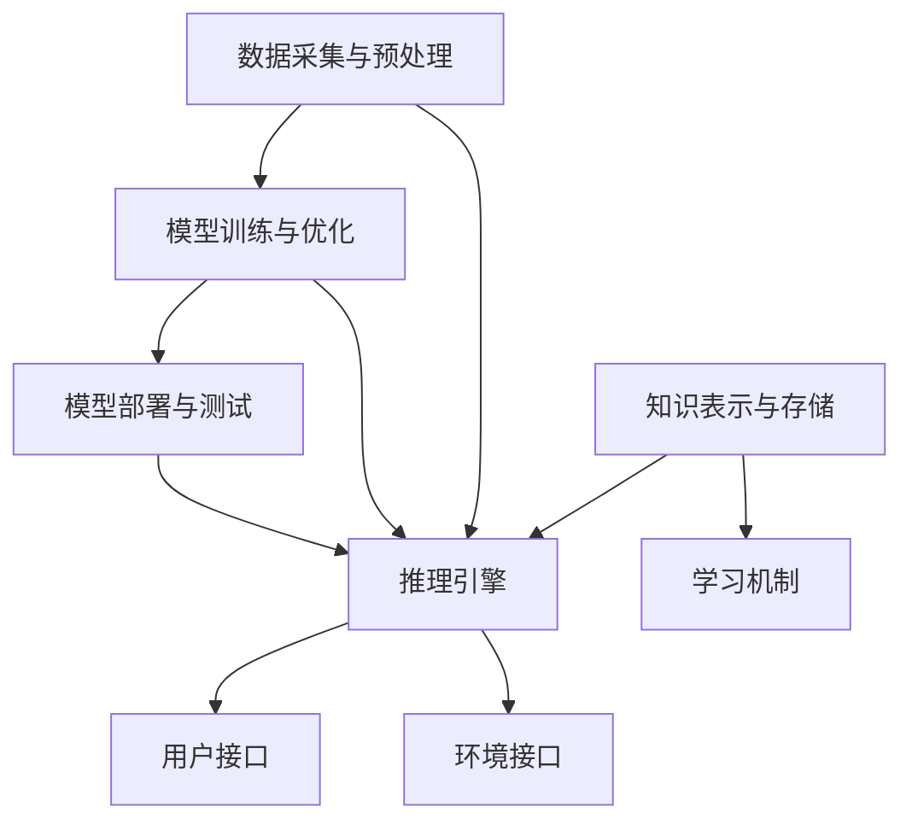
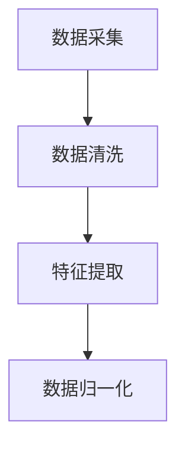
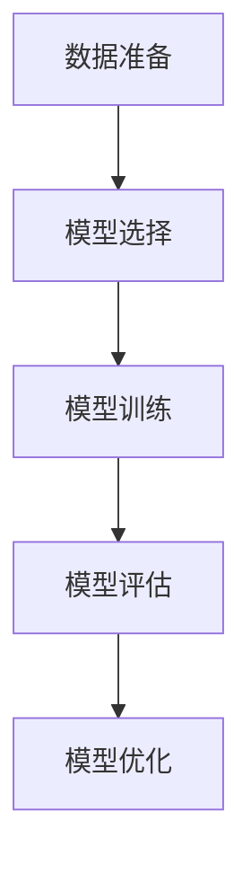
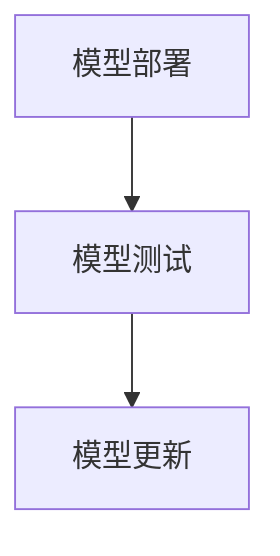
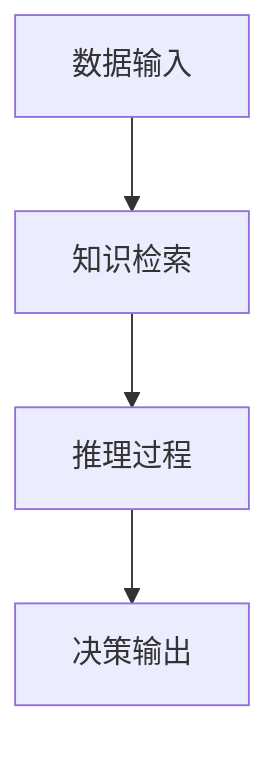
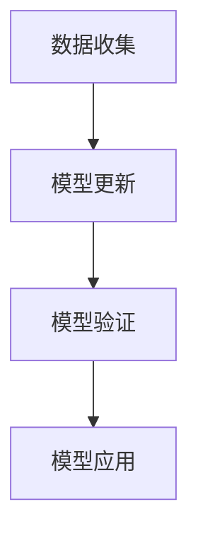

                 

### 文章标题：AI人工智能 Agent：在物联网中的应用

> 关键词：AI人工智能 Agent、物联网、智能家居、智能交通、智能医疗、农业物联网、工业物联网、机器学习、深度学习

> 摘要：本文探讨了AI人工智能 Agent 在物联网中的应用，包括其在智能家居、智能交通、智能医疗、农业物联网和工业物联网等领域的应用场景、核心技术、架构设计以及实际项目实践。通过详细的分析和案例展示，本文为读者提供了对AI人工智能 Agent 在物联网中应用的深入理解和实践指导。

### 目录

1. 引言
   1.1. 文章背景
   1.2. 文章结构
2. AI人工智能 Agent 基础
   2.1. AI人工智能 Agent 概述
   2.2. AI人工智能 Agent 在物联网中的应用场景
   2.3. AI人工智能 Agent 的发展历史与趋势
3. AI人工智能 Agent 核心技术
   3.1. 机器学习与深度学习基础
   3.2. 自然语言处理技术概览
   3.3. 计算机视觉基础
4. AI人工智能 Agent 架构设计
   4.1. AI人工智能 Agent 的整体架构
   4.2. 数据采集与预处理
   4.3. 模型训练与优化
   4.4. 模型部署与测试
5. AI人工智能 Agent 在物联网中的应用
   5.1. 智能家居中的AI人工智能 Agent
   5.2. 智能交通中的AI人工智能 Agent
   5.3. 智能医疗中的AI人工智能 Agent
   5.4. 农业物联网中的AI人工智能 Agent
   5.5. 工业物联网中的AI人工智能 Agent
6. AI人工智能 Agent 应用实践
   6.1. AI人工智能 Agent 开发工具与资源
   6.2. AI人工智能 Agent 项目实战
7. 附录
   7.1. 常见问题解答
   7.2. 参考文献

---

#### 引言

##### 1.1. 文章背景

随着物联网（Internet of Things，IoT）技术的迅速发展，各种智能设备和系统在日常生活中变得越来越普及。物联网的核心目标是通过网络连接各种物理设备，使其能够相互通信并协同工作，从而实现智能化的管理和控制。在这个过程中，AI人工智能 Agent 作为一种智能体，发挥着至关重要的作用。AI人工智能 Agent 是一种能够自主感知环境、执行任务、学习新知识的计算机程序。它们可以处理大量数据，识别模式，并做出决策，从而提高系统的智能化水平。

本文旨在探讨AI人工智能 Agent 在物联网中的应用，包括其在智能家居、智能交通、智能医疗、农业物联网和工业物联网等领域的具体应用场景、核心技术、架构设计以及实际项目实践。通过详细的分析和案例展示，本文将为读者提供对AI人工智能 Agent 在物联网中应用的深入理解和实践指导。

##### 1.2. 文章结构

本文将按照以下结构展开：

1. 引言：介绍文章的背景和目的，概述文章结构。
2. AI人工智能 Agent 基础：介绍AI人工智能 Agent 的定义、分类、应用场景和发展历史。
3. AI人工智能 Agent 核心技术：探讨机器学习、自然语言处理和计算机视觉等核心技术。
4. AI人工智能 Agent 架构设计：分析AI人工智能 Agent 的整体架构，包括数据采集与预处理、模型训练与优化、模型部署与测试。
5. AI人工智能 Agent 在物联网中的应用：详细讨论AI人工智能 Agent 在智能家居、智能交通、智能医疗、农业物联网和工业物联网中的应用场景、系统设计与实现。
6. AI人工智能 Agent 应用实践：介绍AI人工智能 Agent 开发工具与资源，以及实际项目实战。
7. 附录：提供常见问题解答和参考文献。

接下来，我们将深入探讨AI人工智能 Agent 的基本概念和其在物联网中的应用。

### 第1章：AI人工智能 Agent 概述

#### 1.1. AI人工智能 Agent 的定义与分类

##### 定义

AI人工智能 Agent（Artificial Intelligence Agent）是人工智能领域中的一个重要概念，它指的是具有自主决策能力、能够与外部环境进行交互并执行任务的计算机程序。AI人工智能 Agent 的核心特征包括自主性、适应性、反应性和社会性。

- **自主性**：AI人工智能 Agent 能够独立地执行任务，不受人类直接干预。它可以根据预设的目标和规则，自主地选择行动。
- **适应性**：AI人工智能 Agent 能够根据环境的变化调整自身的行为，提高任务执行的效率。它可以通过学习和经验积累，优化决策过程。
- **反应性**：AI人工智能 Agent 能够实时感知环境变化，并快速响应。它通过传感器获取环境信息，并根据这些信息做出决策。
- **社会性**：AI人工智能 Agent 能够与其他Agent或人类进行交互，协同完成任务。它需要理解人类的语言和行为，具备一定的沟通能力。

##### 分类

根据不同的特征和功能，AI人工智能 Agent 可以分为多种类型。以下是其中几种常见的分类：

- **基于规则的Agent**：这类Agent通过预定义的规则进行决策。当环境状态与规则中的条件匹配时，Agent会执行相应的行动。例如，智能家居系统中的智能灯光控制Agent，可以根据用户设置的规则自动调节灯光的亮度。

- **基于模型的Agent**：这类Agent通过建立环境模型和状态转移模型进行决策。它们可以根据当前状态预测未来的状态，并选择最优的行动。例如，自动驾驶汽车中的AI人工智能 Agent，通过环境感知和状态预测，实现车辆的安全驾驶。

- **基于行为的Agent**：这类Agent通过观察环境中的行为模式进行决策。它们可以通过模仿人类的行为，学习新的任务。例如，教育机器人可以通过观察人类教师的行为，学习新的教学技能。

- **基于学习的Agent**：这类Agent通过数据学习环境模式，并基于学习结果进行决策。它们可以利用机器学习和深度学习算法，从大量数据中提取知识，提高决策能力。例如，智能推荐系统中的AI人工智能 Agent，通过用户的历史行为数据，预测用户可能感兴趣的内容。

- **多智能体系统**：这类Agent由多个独立的Agent组成，它们通过协作完成任务。这些Agent可以共享信息，协同工作，实现复杂任务的完成。例如，智能物流系统中的多智能体系统，可以通过协调不同的物流节点，提高运输效率。

通过上述分类，我们可以看出AI人工智能 Agent 的多样性。不同的Agent适用于不同的应用场景，它们在物联网中的应用将极大地推动物联网技术的发展。

#### 1.2. AI人工智能 Agent 在物联网中的应用场景

##### 智能家居

智能家居是AI人工智能 Agent 在物联网中最常见的应用场景之一。通过AI人工智能 Agent，智能家居系统能够实现自动化控制和智能化管理，提高用户的生活质量。以下是一些具体的应用场景：

- **设备自动化控制**：AI人工智能 Agent 可以根据用户的习惯和需求，自动控制家中的设备。例如，自动调节灯光的亮度和颜色，根据用户的位置和时间自动调整空调的温度，实现节能和舒适的生活环境。

- **智能安防**：AI人工智能 Agent 可以通过摄像头和传感器，实现家庭的安全监控。例如，当有异常情况发生时，Agent 可以自动报警并通知用户，提高家庭的安全性。

- **能源管理**：AI人工智能 Agent 可以监测家庭的能源使用情况，并优化能源消耗。例如，自动关闭未使用的电器，根据能源价格变化调整用电高峰和低谷，实现能源的高效利用。

- **家居自动化**：AI人工智能 Agent 可以帮助用户实现家居的自动化管理。例如，自动打开窗帘，调节室内光线，根据用户的需求播放音乐或新闻，提供个性化的服务。

##### 智能交通

智能交通系统通过AI人工智能 Agent，实现交通的自动化控制和优化，提高交通效率和安全。以下是一些具体的应用场景：

- **交通流量预测**：AI人工智能 Agent 可以通过分析历史交通数据和实时交通信息，预测未来的交通流量。例如，预测某个路段在某个时间段内的交通状况，为交通信号控制提供依据。

- **智能调度**：AI人工智能 Agent 可以优化公共交通的调度和运营。例如，根据实时交通状况和乘客需求，调整公交线路和发车时间，提高公共交通的效率和用户体验。

- **自动驾驶**：AI人工智能 Agent 可以实现车辆的自动驾驶，提高交通安全和效率。例如，自动驾驶汽车可以自动避让障碍物，自动识别交通信号，实现安全驾驶。

- **智能停车场**：AI人工智能 Agent 可以优化停车场的运营和管理。例如，自动识别车辆，引导车辆到空余停车位，实现停车场的智能化管理。

##### 智能医疗

智能医疗系统通过AI人工智能 Agent，实现医疗的自动化和智能化，提高医疗服务的质量和效率。以下是一些具体的应用场景：

- **疾病预测**：AI人工智能 Agent 可以通过分析患者的病历数据和基因信息，预测疾病的发生风险。例如，预测患者患心脏病或癌症的风险，为医生提供诊断依据。

- **智能诊断**：AI人工智能 Agent 可以辅助医生进行疾病的诊断。例如，通过分析医学图像和患者的病史，识别疾病并进行分类，提高诊断的准确性。

- **个性化治疗**：AI人工智能 Agent 可以根据患者的具体病情和基因信息，制定个性化的治疗方案。例如，为患者推荐最适合的治疗方案，提高治疗效果。

- **患者监护**：AI人工智能 Agent 可以对患者的健康状况进行实时监测。例如，通过监测患者的生理指标，及时发现异常情况并报警，提高患者的护理水平。

##### 农业物联网

农业物联网通过AI人工智能 Agent，实现农业的自动化和智能化，提高农业生产效率和农产品质量。以下是一些具体的应用场景：

- **农田监测**：AI人工智能 Agent 可以通过传感器技术，实时监测农田的土壤湿度、温度、养分等参数。例如，监测农田的土壤湿度，自动调节灌溉系统，实现精准灌溉。

- **病虫害防治**：AI人工智能 Agent 可以通过图像识别技术，实时监测农田中的病虫害。例如，识别农田中的病虫害，自动喷洒农药，实现病虫害的精准防治。

- **智能灌溉**：AI人工智能 Agent 可以根据农田的土壤湿度、气象数据等参数，自动调节灌溉系统。例如，根据土壤湿度自动开启或关闭灌溉设备，实现智能灌溉。

- **农业生产优化**：AI人工智能 Agent 可以优化农业生产过程，提高产量和品质。例如，根据作物生长周期和土壤数据，调整种植策略，实现作物的高产和高质。

##### 工业物联网

工业物联网通过AI人工智能 Agent，实现工业生产的自动化和智能化，提高生产效率和产品质量。以下是一些具体的应用场景：

- **生产过程监控**：AI人工智能 Agent 可以实时监控生产过程的各种参数，如温度、压力、流量等。例如，监测生产设备的工作状态，及时发现并处理异常情况，保证生产过程的安全和稳定。

- **设备预测维护**：AI人工智能 Agent 可以通过数据分析和技术监测，预测设备的故障风险，实现设备的预测性维护。例如，根据设备的运行数据，预测设备的故障时间，提前安排维护计划，避免设备故障造成的生产中断。

- **质量监控**：AI人工智能 Agent 可以实时监控产品的质量，确保产品质量符合标准。例如，通过检测产品的尺寸、重量、外观等参数，识别不合格产品，实现产品质量的全程监控。

- **供应链优化**：AI人工智能 Agent 可以优化供应链管理，提高供应链的效率和灵活性。例如，根据市场需求和库存情况，优化生产计划和库存策略，减少库存成本，提高供应链的响应速度。

通过上述应用场景的介绍，我们可以看出AI人工智能 Agent 在物联网中的广泛应用和巨大潜力。随着技术的不断发展和应用的深入，AI人工智能 Agent 将在物联网中发挥越来越重要的作用，推动物联网技术的创新和发展。

#### 1.3. AI人工智能 Agent 的发展历史与趋势

##### 发展历史

AI人工智能 Agent 的概念最早可以追溯到20世纪80年代。当时，随着计算机技术的快速发展，人工智能开始受到广泛关注。在1985年，John McCarthy提出了“人工智能 Agent”的概念，并将其定义为具有自主性和自适应性的计算机程序。此后，AI人工智能 Agent 开始在学术界和工业界得到研究和应用。

- **早期研究（1980s-1990s）**：在早期，AI人工智能 Agent 主要基于知识表示和推理技术。代表性的系统包括ARPA-IPTT（Intelligent Problem-Taking Tutor）、LANCIA（Learning Agent for New Concept Investigation and Application）等。这些系统主要应用于教育、医疗等领域，实现了简单的任务自动化和知识管理。

- **中间阶段（2000s）**：随着机器学习和深度学习的兴起，AI人工智能 Agent 开始采用更为复杂的算法和技术。代表性的系统包括IBM的Watson、Google的Google Assistant等。这些系统在自然语言处理、图像识别、语音识别等方面取得了显著成果，为AI人工智能 Agent 的发展奠定了基础。

- **当前阶段（2010s-2020s）**：随着物联网、大数据和云计算等技术的快速发展，AI人工智能 Agent 开始在各个领域得到广泛应用。代表性的应用包括智能家居、智能交通、智能医疗、农业物联网和工业物联网等。AI人工智能 Agent 已经成为物联网系统的重要组成部分，推动了物联网技术的创新和发展。

##### 趋势与未来

- **多模态感知与融合**：未来的AI人工智能 Agent 将具备更加丰富的感知能力，通过结合视觉、语音、触觉等多种感知方式，实现更加智能化和自适应的交互。

- **自主学习与决策**：未来的AI人工智能 Agent 将具备更强的自主学习能力和决策能力，通过深度学习和强化学习等技术，实现自主学习和自主决策，提高任务执行效率和智能化水平。

- **跨领域应用**：未来的AI人工智能 Agent 将在各个领域得到广泛应用，实现跨领域的协同和融合。例如，将智能家居、智能交通和智能医疗等技术相结合，实现更加综合和智能的物联网应用。

- **人机协同**：未来的AI人工智能 Agent 将更加注重人机协同，通过自然语言处理、语音识别等技术，实现与人类的自然交互，提高用户的使用体验。

- **安全性与隐私保护**：随着AI人工智能 Agent 在物联网中的广泛应用，安全性和隐私保护将成为重要的研究方向。未来的AI人工智能 Agent 将具备更高的安全性和隐私保护能力，确保用户数据和系统的安全。

综上所述，AI人工智能 Agent 在物联网中的应用具有广阔的发展前景。随着技术的不断进步和应用的创新，AI人工智能 Agent 将在未来的物联网中发挥更加重要的作用，推动物联网技术的持续发展和创新。

### 第2章：AI人工智能 Agent 核心技术

在AI人工智能 Agent 的实现过程中，核心技术起到了至关重要的作用。这些核心技术包括机器学习、自然语言处理和计算机视觉。在本章中，我们将详细探讨这些技术的概念、基本原理以及如何应用于AI人工智能 Agent。

#### 2.1 机器学习与深度学习基础

##### 概念

机器学习（Machine Learning）是一种人工智能技术，它使计算机系统能够从数据中学习并改进其性能。在机器学习中，系统通过分析大量数据，学习数据中的模式和规律，然后利用这些模式来做出预测或决策。

深度学习（Deep Learning）是机器学习的一个分支，它使用多层神经网络（Neural Networks）对数据进行处理。深度学习模型通过层次化的特征提取，能够自动地从原始数据中提取出高级特征，从而在许多任务中实现高性能。

##### 基本原理

**机器学习的基本原理**：

- **数据集**：机器学习的过程从数据集开始。数据集是由输入（特征）和输出（标签）组成的集合。输入特征描述了数据的属性，输出标签是数据对应的真实值。

- **模型训练**：模型训练是机器学习的核心步骤。系统通过调整模型参数，使其能够最小化预测误差。这个过程通常涉及优化算法，如梯度下降（Gradient Descent）。

- **模型评估**：模型评估用于判断模型的性能。常用的评估指标包括准确率（Accuracy）、精确率（Precision）、召回率（Recall）和F1分数（F1 Score）。

**深度学习的基本原理**：

- **神经网络**：神经网络是由多个神经元组成的计算模型，每个神经元都与其他神经元相连。神经元之间的连接称为权重（Weights），这些权重通过学习过程进行调整。

- **前向传播和反向传播**：在前向传播过程中，输入数据通过神经网络逐层传递，最终产生输出。在反向传播过程中，通过计算损失函数的梯度，调整神经网络的权重，以减少预测误差。

- **激活函数**：激活函数是神经网络中的一个关键组件，它用于引入非线性变换。常用的激活函数包括 sigmoid、ReLU 和 tanh。

##### 应用

**机器学习的应用**：

- **分类任务**：例如，电子邮件垃圾邮件分类、垃圾邮件分类、图像分类等。

- **回归任务**：例如，房屋价格预测、股票价格预测等。

- **聚类任务**：例如，客户分群、图像分割等。

**深度学习的应用**：

- **计算机视觉**：例如，图像识别、目标检测、图像分割等。

- **自然语言处理**：例如，文本分类、机器翻译、语音识别等。

- **游戏AI**：例如，围棋、国际象棋等游戏的自动对弈。

**伪代码示例**：

下面是一个简单的线性回归模型的伪代码示例：

```python
# 线性回归模型

# 初始化权重和偏置
w = 0
b = 0

# 训练模型
for epoch in range(num_epochs):
    for x, y in dataset:
        # 前向传播
        prediction = w * x + b
        
        # 计算损失
        loss = (prediction - y) ** 2
        
        # 反向传播
        dw = 2 * (prediction - y) * x
        db = 2 * (prediction - y)
        
        # 更新权重和偏置
        w -= learning_rate * dw
        b -= learning_rate * db

# 预测
def predict(x):
    return w * x + b
```

#### 2.2 自然语言处理技术概览

自然语言处理（Natural Language Processing，NLP）是AI人工智能 Agent 中的一个重要领域，它旨在使计算机能够理解和处理人类语言。NLP技术在AI人工智能 Agent 中有广泛的应用，如语音识别、机器翻译、文本分类等。

##### 概念

- **词嵌入（Word Embedding）**：词嵌入是将单词映射为向量表示的技术。通过词嵌入，NLP模型能够理解单词之间的语义关系。

- **语言模型（Language Model）**：语言模型是一种预测下一个单词或词组的模型。它基于大量的文本数据，学习语言的统计规律。

- **词性标注（Part-of-Speech Tagging）**：词性标注是将单词分类为名词、动词、形容词等词性的过程。词性标注有助于理解句子的结构和语义。

- **命名实体识别（Named Entity Recognition）**：命名实体识别是识别文本中的特定实体（如人名、地名、组织名等）的过程。

##### 基本原理

**词嵌入**：

- **Word2Vec**：Word2Vec是一种基于神经网络的语言模型，通过训练生成词向量表示。它通过考虑单词的共现关系，将相似的单词映射到相近的向量空间。

- **GloVe**：GloVe（Global Vectors for Word Representation）是一种基于矩阵分解的语言模型，通过优化全局的词向量表示。

**语言模型**：

- **N-gram模型**：N-gram模型是一种基于统计的简单语言模型，它使用前N个单词的概率来预测下一个单词。

- **递归神经网络（RNN）**：RNN是一种能够处理序列数据的神经网络，它通过递归连接能够记忆前一个时刻的信息。

- **长短时记忆网络（LSTM）**：LSTM是一种改进的RNN，它通过引入门控机制，能够更好地处理长序列数据。

**词性标注**：

- **规则方法**：规则方法通过预定义的规则进行词性标注。

- **统计方法**：统计方法通过统计学习方法，如条件随机场（CRF），进行词性标注。

**命名实体识别**：

- **分类器方法**：分类器方法通过训练分类器，对文本中的命名实体进行分类。

- **序列标注方法**：序列标注方法将命名实体识别视为序列标注问题，通过标注模型对命名实体进行识别。

##### 应用

**语音识别**：语音识别是将语音转换为文本的技术，它广泛应用于智能助手、语音控制等领域。

**机器翻译**：机器翻译是将一种语言的文本翻译成另一种语言的技术，它广泛应用于跨语言沟通、全球化等领域。

**文本分类**：文本分类是将文本数据分类为不同类别的技术，它广泛应用于垃圾邮件过滤、情感分析等领域。

**文本生成**：文本生成是通过模型生成有意义的文本的技术，它广泛应用于自动写作、对话系统等领域。

**伪代码示例**：

下面是一个简单的NLP任务的伪代码示例：

```python
# 文本分类

# 加载预训练的词向量
word_vectors = load_word_vectors()

# 加载分类模型
classifier = load_classifier()

# 预处理文本
def preprocess_text(text):
    # 清洗文本、去除停用词、分词等
    return processed_text

# 预测文本类别
def predict_category(text):
    processed_text = preprocess_text(text)
    # 将文本转换为词向量
    text_vector = vectorize_text(processed_text, word_vectors)
    # 使用分类器进行预测
    category = classifier.predict(text_vector)
    return category
```

#### 2.3 计算机视觉基础

计算机视觉（Computer Vision）是AI人工智能 Agent 中的重要组成部分，它使计算机能够从图像或视频中提取信息和理解场景。计算机视觉技术在自动驾驶、图像识别、监控等领域有广泛应用。

##### 概念

- **图像处理（Image Processing）**：图像处理是对图像进行操作和增强的技术，它包括滤波、边缘检测、图像分割等。

- **目标检测（Object Detection）**：目标检测是识别图像中的特定目标并定位其位置的技术。

- **图像识别（Image Recognition）**：图像识别是识别图像中的物体或场景的技术。

- **图像分割（Image Segmentation）**：图像分割是将图像划分为不同区域的技术，它有助于理解图像的结构。

##### 基本原理

**图像处理**：

- **滤波**：滤波是一种常用的图像处理技术，它用于去除图像中的噪声和模糊。

- **边缘检测**：边缘检测是一种用于识别图像中的边缘和轮廓的技术。

- **图像分割**：图像分割是将图像划分为不同区域的技术，它有助于识别图像中的对象。

**目标检测**：

- **滑动窗口（Sliding Window）**：滑动窗口是一种常用的目标检测方法，它通过将一个小窗口在图像上滑动，对每个窗口进行分类和定位。

- **区域提议（Region Proposal）**：区域提议是一种用于减少目标检测计算量的技术，它通过生成可能包含目标的区域，减少检测窗口的数量。

- **深度学习模型**：深度学习模型，如卷积神经网络（CNN），在目标检测中发挥了重要作用。通过训练深度学习模型，可以实现对图像中目标的精确识别和定位。

**图像识别**：

- **特征提取**：特征提取是将图像中的特征提取出来，用于后续的分类或识别。

- **分类模型**：分类模型，如支持向量机（SVM）和卷积神经网络（CNN），用于对图像进行分类和识别。

**图像分割**：

- **基于区域的分割**：基于区域的分割方法，如基于颜色、纹理和形状的分割，用于将图像划分为不同的区域。

- **基于边界的分割**：基于边界的分割方法，如基于边缘检测的分割，用于识别图像中的边界和对象。

##### 应用

**自动驾驶**：自动驾驶系统通过计算机视觉技术，实现对道路场景的识别和理解，从而实现车辆的自动驾驶。

**图像识别**：图像识别技术在医疗诊断、安全监控、广告识别等领域有广泛应用。

**监控**：计算机视觉技术用于监控和安防，实现对场景的实时监控和异常检测。

**伪代码示例**：

下面是一个简单的目标检测任务的伪代码示例：

```python
# 目标检测

# 加载预训练的深度学习模型
model = load_model()

# 预处理图像
def preprocess_image(image):
    # 缩放、归一化等操作
    return preprocessed_image

# 预测图像中的目标
def detect_objects(image):
    preprocessed_image = preprocess_image(image)
    # 使用模型进行预测
    predictions = model.predict(preprocessed_image)
    # 提取目标框和类别
    boxes = predictions['boxes']
    labels = predictions['labels']
    return boxes, labels
```

通过本章对机器学习、自然语言处理和计算机视觉等核心技术的介绍，我们可以更好地理解AI人工智能 Agent 的工作原理和实现方法。这些核心技术为AI人工智能 Agent 的发展提供了强大的支持，使得它们能够在物联网中发挥重要的作用。

### 第3章：AI人工智能 Agent 架构设计

为了实现AI人工智能 Agent 在物联网中的应用，一个完整的架构设计是至关重要的。该架构需要涵盖从数据采集、模型训练、模型部署到最终应用的全过程。本章将详细讨论AI人工智能 Agent 的整体架构，以及各个组成部分的功能和技术实现。

#### 3.1 AI人工智能 Agent 的整体架构

AI人工智能 Agent 的整体架构可以分为以下几个主要部分：

1. **知识表示与存储**：用于存储Agent的知识库和模型。
2. **推理引擎**：用于根据知识库和输入数据生成决策。
3. **学习机制**：用于从数据中学习新知识和优化模型。
4. **用户接口**：用于与用户进行交互。
5. **环境接口**：用于与外部环境进行交互。
6. **数据采集与预处理**：用于采集和处理环境数据。
7. **模型训练与优化**：用于训练和优化模型。
8. **模型部署与测试**：用于将模型部署到实际应用中并进行测试。

以下是一个简化的AI人工智能 Agent 架构图：



#### 3.2 数据采集与预处理

数据采集是AI人工智能 Agent 运作的基础。数据来源可以包括传感器、用户输入、外部API等。以下是一个数据采集与预处理流程：

1. **数据采集**：通过传感器或外部API获取数据。
2. **数据清洗**：去除噪声数据和不完整的数据。
3. **特征提取**：从原始数据中提取对任务有用的特征。
4. **数据归一化**：将数据缩放到相同的范围，便于模型处理。

以下是一个简化的数据采集与预处理流程图：



#### 3.3 模型训练与优化

模型训练是AI人工智能 Agent 的核心。以下是一个简化的模型训练与优化流程：

1. **数据准备**：将数据集分为训练集和验证集。
2. **模型选择**：选择适合任务的人工智能模型。
3. **模型训练**：使用训练集对模型进行训练。
4. **模型评估**：使用验证集评估模型性能。
5. **模型优化**：根据评估结果调整模型参数，优化模型性能。

以下是一个简化的模型训练与优化流程图：



#### 3.4 模型部署与测试

模型部署是将训练好的模型应用到实际应用中的过程。以下是一个简化的模型部署与测试流程：

1. **模型部署**：将模型部署到服务器或设备上。
2. **模型测试**：在实际环境中测试模型的性能。
3. **模型更新**：根据测试结果，更新模型以改进性能。

以下是一个简化的模型部署与测试流程图：



#### 3.5 推理引擎

推理引擎是AI人工智能 Agent 的核心组件，它负责根据输入数据和知识库生成决策。以下是一个简化的推理引擎工作流程：

1. **数据输入**：接收用户输入或传感器数据。
2. **知识检索**：在知识库中查找相关的知识和规则。
3. **推理过程**：根据知识和规则进行推理，生成决策。
4. **决策输出**：输出推理结果，如执行某个动作或提供建议。

以下是一个简化的推理引擎工作流程图：



#### 3.6 学习机制

学习机制是AI人工智能 Agent 能够不断进步和优化的关键。以下是一个简化的学习机制工作流程：

1. **数据收集**：收集用户输入、传感器数据和模型输出。
2. **模型更新**：根据收集的数据，更新模型参数。
3. **模型验证**：在验证集上验证模型更新后的性能。
4. **模型应用**：将更新后的模型应用到实际应用中。

以下是一个简化的学习机制工作流程图：



通过上述对AI人工智能 Agent 架构设计的详细探讨，我们可以看到，一个完整的AI人工智能 Agent 需要包括多个相互协作的组件。这些组件共同工作，使得AI人工智能 Agent 能够在物联网中发挥其独特的价值。接下来，我们将进一步探讨AI人工智能 Agent 在物联网中的具体应用。

### 第4章：AI人工智能 Agent 在物联网中的应用

在本章中，我们将详细探讨AI人工智能 Agent 在物联网中的具体应用，包括智能家居、智能交通、智能医疗、农业物联网和工业物联网等领域。通过分析这些应用场景，我们将了解AI人工智能 Agent 如何通过其核心技术和架构设计，提升物联网系统的智能化水平。

#### 4.1 智能家居中的AI人工智能 Agent

智能家居是AI人工智能 Agent 在物联网中最早和最广泛应用的领域之一。通过AI人工智能 Agent，智能家居系统能够实现高度自动化和个性化的生活体验。以下是一些具体的智能家居应用场景：

**设备自动化控制**：AI人工智能 Agent 可以通过学习用户的日常习惯，自动控制家中的各种设备。例如，通过监测用户的活动轨迹，自动调节室内温度和灯光，提供舒适的生活环境。以下是一个简单的伪代码示例，展示了如何使用AI人工智能 Agent 实现自动调节室内温度：

```python
# 自动调节室内温度

# 加载预训练的温度调节模型
temperature_controller = load_model()

# 监测室内温度
current_temp = get_current_temp()

# 预测合适温度
predicted_temp = temperature_controller.predict(current_temp)

# 调节空调温度
set_ac_temperature(predicted_temp)
```

**智能安防**：AI人工智能 Agent 可以通过图像识别和声音识别技术，实现对家庭

