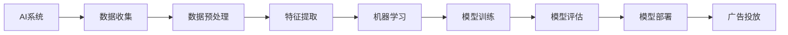

                 

# 《AI人工智能代理工作流 AI Agent WorkFlow：在广告细分市场中的应用》

> 关键词：人工智能代理，工作流，广告市场，精准投放，算法原理

> 摘要：本文旨在探讨人工智能代理工作流在广告细分市场中的应用。通过对AI代理工作流的基本原理、核心算法和数学模型的介绍，结合实际项目实战，详细阐述AI代理在广告精准投放、创意优化和受众分析等方面的应用，为广告行业的数字化转型提供技术支持和思路。

## 目录大纲

#### 第一部分：AI与AI代理工作流基础

**第1章: AI与人工智能代理概述**

- **1.1 AI的定义与历史**
  - AI的诞生与发展
  - AI的关键技术概述

- **1.2 人工智能代理的概念**
  - 人工智能代理的定义
  - 人工智能代理与AI的关系

- **1.3 人工智能代理工作流的基本原理**
  - 工作流模型介绍
  - 人工智能代理在广告中的应用

**第2章: 人工智能代理的核心算法原理**

- **2.1 数据预处理**
  - 数据清洗与归一化
  - 特征提取方法

- **2.2 机器学习算法基础**
  - 监督学习、无监督学习和强化学习
  - 常见算法简介与比较

- **2.3 人工智能代理的具体算法**
  - 强化学习算法在AI代理中的应用
  - 生成对抗网络（GAN）的应用

**第3章: 数学模型与数学公式**

- **3.1 强化学习数学模型**
  - Q-learning算法
  - Deep Q Network (DQN)

- **3.2 生成对抗网络（GAN）数学模型**
  - GAN的结构
  - GAN的训练过程

- **3.3 聚类分析与数学模型**
  - K-means算法
  - DBSCAN算法

**第4章: AI代理工作流的设计与实现**

- **4.1 AI代理工作流框架**
  - 工作流的设计原则
  - 工作流的实现流程

- **4.2 AI代理工作流的代码实现**
  - Python代码示例
  - 数据流与控制流

#### 第二部分：AI代理在广告细分市场中的应用

**第5章: 广告细分市场的现状与趋势**

- **5.1 广告市场的定义与分类**
  - 传统广告与数字广告
  - 广告细分市场的定义

- **5.2 广告市场的增长趋势**
  - 数字广告的市场规模
  - 广告技术的创新趋势

**第6章: AI代理在广告市场中的应用案例**

- **6.1 广告精准投放**
  - AI代理在广告投放策略中的应用
  - 广告投放效果评估方法

- **6.2 广告创意优化**
  - AI代理在广告创意生成中的应用
  - 广告创意评估与优化策略

- **6.3 广告受众分析**
  - AI代理在广告受众分析中的应用
  - 受众行为预测模型

**第7章: AI代理工作流在广告细分市场中的实战应用**

- **7.1 实战背景与需求分析**
  - 广告客户需求分析
  - 项目目标与挑战

- **7.2 系统设计与实现**
  - 数据收集与预处理
  - AI代理工作流的设计与实现

- **7.3 应用效果评估**
  - 广告效果评估指标
  - 实际应用效果分析

**第8章: 未来展望与挑战**

- **8.1 AI代理工作流的发展趋势**
  - 未来技术的展望
  - 行业应用的发展方向

- **8.2 面临的挑战与解决方案**
  - 数据隐私与安全
  - 技术更新与人才短缺

**附录**

- **附录 A: 开发环境与工具**
  - Python与相关库
  - 数据处理工具
  - 机器学习框架

---

**核心概念与联系 Mermaid 流程图：**



---

**核心算法原理讲解伪代码：**

**Q-learning算法伪代码：**

```python
initialize Q(s, a) for all states and actions
for episode = 1, in total number of episodes do:
    for step = 1, in total number of steps per episode do:
        observe state s
        choose action a from s using policy π
        observe reward r, next state s'
        update Q(s, a) using the following equation:
            Q(s, a) = Q(s, a) + α[r + γmax(Q(s', a')) - Q(s, a)]
        observe next state s'
        if done:
            break
    end for
end for
```

**生成对抗网络（GAN）训练过程伪代码：**

```python
initialize Generator G and Discriminator D
for epoch = 1, in total number of epochs do:
    for batch of real images x do:
        sample random noise z
        generate fake images G(z)
        compute loss for D on real images: D_loss_real = −E[D(x); x]
        compute loss for D on fake images: D_loss_fake = −E[D(G(z)); z]
        compute total loss for D: D_loss = D_loss_real + D_loss_fake
        update D with D_loss
        sample random noise z
        generate fake images G(z)
        compute loss for G: G_loss = E[D(G(z)); z]
        update G with G_loss
    end for
end for
```

---

**数学模型与数学公式：**

**强化学习Q-learning算法的更新公式：**

$$
Q(s, a) \leftarrow Q(s, a) + \alpha [r + \gamma \max_{a'} Q(s', a') - Q(s, a)]
$$

**生成对抗网络（GAN）的损失函数：**

$$
D(x) = -\log(D(x)), \quad G(z) = \log(1 - D(G(z)))
$$

---

**项目实战：**

**实战背景：**
某广告公司希望利用AI代理工作流实现广告的精准投放，提高广告效果。

**代码实现：**

```python
# 伪代码，具体实现需要根据实际框架和库进行调整

# 导入相关库
import numpy as np
import pandas as pd
from sklearn.model_selection import train_test_split
from sklearn.ensemble import RandomForestClassifier
from sklearn.metrics import accuracy_score

# 数据收集与预处理
data = pd.read_csv('ad_data.csv')
X = data.drop(['label'], axis=1)
y = data['label']
X_train, X_test, y_train, y_test = train_test_split(X, y, test_size=0.2, random_state=42)

# 特征提取与模型训练
model = RandomForestClassifier(n_estimators=100, random_state=42)
model.fit(X_train, y_train)

# 模型评估
predictions = model.predict(X_test)
accuracy = accuracy_score(y_test, predictions)
print(f"Model accuracy: {accuracy:.2f}")
```

---

**代码解读与分析：**
在本实战项目中，我们首先通过`pandas`库导入和处理广告数据。接着，使用`sklearn`库中的`train_test_split`函数将数据集分为训练集和测试集。然后，我们使用随机森林（RandomForestClassifier）模型进行训练，并使用测试集进行评估。最后，我们计算并输出模型的准确率。

---

**开发环境搭建：**
- Python环境：Python 3.8+
- 数据处理工具：pandas、numpy
- 机器学习框架：scikit-learn

---

**源代码详细实现和代码解读将在后续章节中进行详细阐述。**

