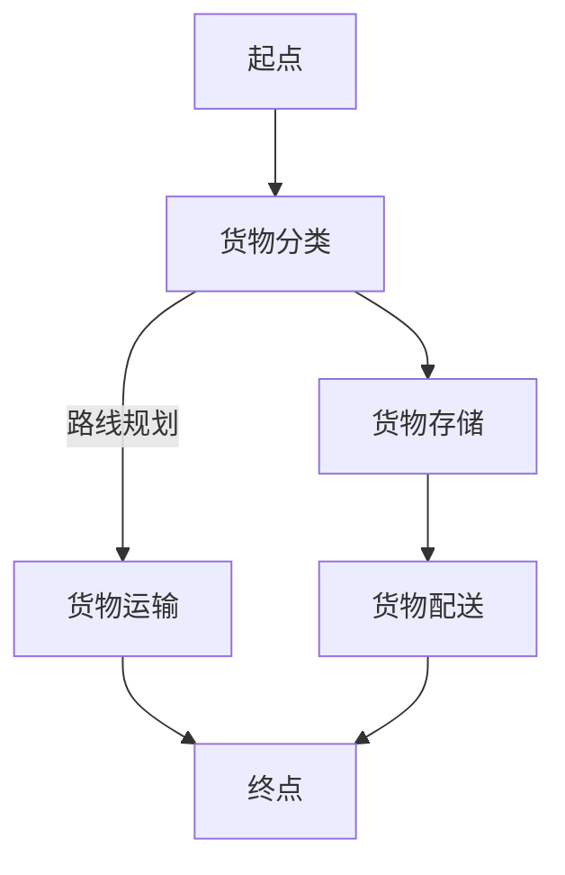
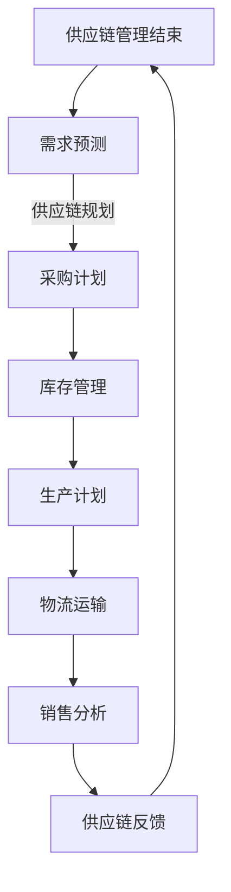

                 

### 第1章：AI代理概述

## 1.1 AI代理的定义与分类

### 1.1.1 AI代理的定义

AI代理（Artificial Intelligence Agent）是指由人工智能技术驱动的、能够在特定环境中自主执行任务、实现目标的实体或系统。AI代理是一种智能体，它在一定程度上模拟人类的认知和行为，通过感知环境、自主决策和行动，以实现特定目标。

AI代理可以分为以下几类：

- **基于规则的代理**：这类代理通过预定义的规则库来执行任务，适用于结构化且规则明确的环境。它们根据输入数据和预定义的规则进行逻辑推理，然后输出决策。

- **基于模型的代理**：这类代理通过学习和模拟环境中的模型来执行任务，适用于需要适应性和灵活性的环境。它们通常利用机器学习算法来建立环境模型，并通过模型预测和决策。

- **混合型代理**：这类代理结合了基于规则和基于模型的方法，通过将规则和模型相结合，以实现更高的灵活性和适应性。

### 1.1.2 AI代理在物流与供应链中的应用

在物流与供应链领域，AI代理具有广泛的应用潜力，可以显著提升效率、降低成本、优化资源配置。以下是一些常见的AI代理应用场景：

- **物流路径优化**：AI代理可以分析交通状况、货物属性和运输需求，实时规划最优物流路径，降低运输时间和成本。

- **仓库管理**：AI代理可以帮助管理仓库中的货物库存，实现精确的库存管理和优化存储布局。

- **供应链预测**：AI代理可以利用历史数据和市场信息，预测供应链中的需求变化，从而优化生产和采购计划。

- **智能配送**：AI代理可以优化配送路线和配送计划，提高配送效率，降低配送成本。

- **风险管理**：AI代理可以分析供应链中的潜在风险，提供预警和应对策略，降低供应链中断的风险。

## 1.2 AI代理的工作原理

### 1.2.1 自主性

自主性是AI代理的核心特征之一，它指的是代理能够在没有外部干预的情况下，独立地感知环境、做出决策并执行行动。自主性的实现主要依赖于以下几个要素：

- **感知环境**：AI代理需要具备感知环境的能力，通过传感器、摄像头或其他数据来源获取环境信息。

- **决策算法**：AI代理需要具备决策算法，以处理感知到的环境信息，并生成相应的行动方案。

- **执行机制**：AI代理需要具备执行机制，将决策转化为具体的行动，实现目标。

### 1.2.2 社交性

社交性是AI代理在复杂环境中有效运作的关键能力之一，它指的是代理能够与其他代理或人类进行交互、共享信息和知识。社交性的实现主要依赖于以下几个要素：

- **通信协议**：AI代理需要具备通信协议，以实现与其他代理或人类的通信。

- **协作算法**：AI代理需要具备协作算法，以实现资源、任务和信息的共享，优化整体效能。

- **知识共享**：AI代理需要具备知识共享机制，以从其他代理或人类那里获取有价值的信息。

### 1.2.3 反应性

反应性是AI代理在动态环境中快速响应变化的能力，它指的是代理能够实时监控环境变化，并快速调整自身行为。反应性的实现主要依赖于以下几个要素：

- **实时监控**：AI代理需要具备实时监控能力，以快速获取环境变化的信息。

- **自适应算法**：AI代理需要具备自适应算法，以根据环境变化调整自身行为，提高反应速度。

- **快速决策**：AI代理需要具备快速决策能力，以在短时间内做出合理的行动选择。

## 1.3 AI代理的发展趋势

### 1.3.1 技术进步

随着人工智能技术的不断发展，AI代理的能力和功能将得到显著提升。以下是一些关键技术进步对AI代理的影响：

- **深度学习**：深度学习技术的发展为AI代理提供了强大的学习能力和预测能力，使其能够更准确地感知环境和做出决策。

- **强化学习**：强化学习技术的发展使得AI代理能够通过试错和学习，优化自身行为，提高自主性和适应性。

- **多模态感知**：多模态感知技术的发展使得AI代理能够整合多种数据来源，提高对环境的理解和反应能力。

- **知识图谱**：知识图谱技术的发展使得AI代理能够更好地理解和利用领域知识，提高决策质量和智能化水平。

### 1.3.2 应用场景拓展

随着AI代理技术的成熟，其应用场景将得到进一步拓展。以下是一些潜在的应用场景：

- **智能制造**：AI代理可以应用于智能制造领域，优化生产流程、提高生产效率。

- **智能交通**：AI代理可以应用于智能交通领域，优化交通流量、提高交通效率。

- **智能医疗**：AI代理可以应用于智能医疗领域，辅助诊断、治疗和健康管理。

- **智能金融**：AI代理可以应用于智能金融领域，实现智能投顾、风险管理等。

### 1.3.3 法规与伦理

随着AI代理的广泛应用，相关的法规和伦理问题也逐渐凸显。以下是一些关键问题：

- **隐私保护**：AI代理在处理个人数据时，需要确保个人隐私得到充分保护。

- **透明性**：AI代理的决策过程和算法需要具备透明性，以便用户了解和信任。

- **责任归属**：在AI代理造成损失或错误时，需要明确责任归属，确保责任得到合理分担。

### 1.4 小结

AI代理是人工智能在物流与供应链中的重要应用方向，其自主性、社交性和反应性等特点使其能够在复杂环境中发挥重要作用。随着技术进步和应用场景拓展，AI代理将在物流与供应链领域发挥更大的作用。同时，相关的法规和伦理问题也需要得到关注和解决。

### Mermaid 流程图示例：物流流程图



### 算法原理伪代码示例：物流路径规划算法

```python
# 输入：起点坐标 start, 终点坐标 end, 货物列表 items
# 输出：最优路径 path

def path_planning(start, end, items):
    # 初始化路径为空
    path = []

    # 计算各货物的运输距离
    distances = []
    for item in items:
        distance = calculate_distance(start, item.location)
        distances.append(distance)

    # 选择距离最近的货物进行运输
    for distance in distances:
        if distance == min(distances):
            # 将货物添加到路径中
            path.append(item)
            # 从货物列表中删除已选择的货物
            items.remove(item)
            # 更新起点坐标为已运输货物的终点坐标
            start = item.location

    # 返回最优路径
    return path
```

### 数学模型和数学公式

物流路径规划问题通常可以使用图论中的最短路径算法来解决。假设有一个图 \(G(V, E)\)，其中 \(V\) 是顶点集，\(E\) 是边集。我们需要找到从起点 \(s\) 到终点 \(t\) 的最短路径。

- **距离函数**：设 \(d(i, j)\) 表示顶点 \(i\) 和 \(j\) 之间的距离。

$$
d(i, j) = \sqrt{(x_i - x_j)^2 + (y_i - y_j)^2}
$$

- **权重函数**：设 \(w(i, j)\) 表示从顶点 \(i\) 到顶点 \(j\) 的权重（即距离）。

$$
w(i, j) = d(i, j)
$$

- **最短路径算法**：使用 Dijkstra 算法来计算从起点 \(s\) 到终点 \(t\) 的最短路径。

latex
\text{Dijkstra's Algorithm:}
\begin{algorithm}
    \caption{Dijkstra's Algorithm}
    \begin{algorithmic}[1]
        \REQUIRE A graph $G = (V, E)$ and a source node $s$.
        \ENSURE The shortest path from $s$ to every other node in $G$.
        \STATE Initialize distances from $s$ to all other nodes as $\infty$.
        \STATE Set distance from $s$ to $s$ as $0$.
        \STATE Set the unvisited node as $s$.
        \WHILE{There are unvisited nodes}
            \STATE Select the unvisited node with the smallest distance.
            \STATE Mark the selected node as visited.
            \FOR{Each unvisited neighbor $v$ of the selected node}
                \STATE Calculate the distance from $s$ to $v$ through the selected node.
                \STATE If this distance is smaller than the current distance to $v$, update the distance to $v$.
            \ENDFOR
        \ENDWHILE
    \end{algorithmic}
\end{algorithm}
```

### 项目实战：物流路径规划系统

#### 开发环境搭建

为了实现一个简单的物流路径规划系统，我们需要搭建一个合适的开发环境。以下是所需的技术栈：

- **开发语言**：Python
- **依赖库**：`networkx`、`matplotlib`
- **开发工具**：Jupyter Notebook 或 PyCharm

首先，确保安装了 Python 3.7 或更高版本。然后，通过以下命令安装所需的依赖库：

```bash
pip install networkx matplotlib
```

#### 源代码详细实现

以下是一个简单的物流路径规划系统的源代码实现：

```python
import networkx as nx
import matplotlib.pyplot as plt

# 货物类定义
class Item:
    def __init__(self, name, location):
        self.name = name
        self.location = location

# 计算两点之间的距离
def calculate_distance(coord1, coord2):
    x1, y1 = coord1
    x2, y2 = coord2
    return ((x1 - x2)**2 + (y1 - y2)**2)**0.5

# 创建图
def create_graph(items):
    G = nx.Graph()
    for i, j in combinations(items, 2):
        distance = calculate_distance(i.location, j.location)
        G.add_edge(i.name, j.name, weight=distance)
    return G

# 路径规划
def path_planning(graph, start, end):
    start_node = start.name
    end_node = end.name
    path = nx.shortest_path(graph, source=start_node, target=end_node, weight='weight')
    return path

# 主函数
def main():
    # 创建货物列表
    items = [
        Item("Item1", (0, 0)),
        Item("Item2", (2, 3)),
        Item("Item3", (5, 5)),
        Item("Item4", (10, 10)),
    ]

    # 创建图
    graph = create_graph(items)

    # 找到起点和终点
    start = items[0]
    end = items[-1]

    # 执行路径规划
    path = path_planning(graph, start, end)

    # 绘制路径
    pos = nx.spring_layout(graph)
    nx.draw(graph, pos, with_labels=True)
    path_nodes = [node for node, data in graph.nodes(data=True) if node in path]
    nx.draw_networkx_nodes(graph, pos, nodelist=path_nodes, node_color='r')
    nx.draw_networkx_edges(graph, pos, edgelist=graph.edges(), edge_color='b')
    plt.show()

if __name__ == "__main__":
    main()
```

#### 代码解读与分析

- **货物类（Item）**：这是一个简单的类，用于表示货物及其位置。每个货物实例都有一个唯一的名称和坐标。

- **距离计算函数（calculate_distance）**：这是一个函数，用于计算两个坐标点之间的欧几里得距离。这个函数接受两个参数，每个参数是一个包含x和y坐标的元组。

- **创建图（create_graph）**：这个函数创建一个图，并将每个货物作为节点。它使用 `combinations` 函数从货物列表中获取所有可能的节点对，并计算它们之间的距离，将这些距离作为边的权重添加到图中。

- **路径规划（path_planning）**：这个函数使用 `networkx` 库中的 `shortest_path` 函数来找到从起点到终点的最短路径。它接受一个图、一个起点和一个终点作为参数，并返回最短路径。

- **主函数（main）**：这是程序的主入口点。在这个函数中，我们首先创建了一个包含多个货物的实例，然后调用 `create_graph` 和 `path_planning` 函数来生成图并找到最优路径，最后使用 `matplotlib` 绘制出路径图。

### 数学模型和数学公式

在本案例中，我们使用图论中的最短路径算法来优化物流路径。具体的数学模型如下：

1. **距离计算公式**：

   我们使用欧几里得距离公式来计算两个点之间的距离。假设有两个点 \(P_1(x_1, y_1)\) 和 \(P_2(x_2, y_2)\)，它们之间的距离 \(d(P_1, P_2)\) 可以用以下公式计算：

   $$
   d(P_1, P_2) = \sqrt{(x_1 - x_2)^2 + (y_1 - y_2)^2}
   $$

2. **图论模型**：

   假设有一个图 \(G(V, E)\)，其中 \(V\) 是顶点集，\(E\) 是边集。在这个图中，每个顶点表示一个货物，每条边表示两个货物之间的路径，边的权重表示两点之间的距离。我们需要找到从起点 \(s\) 到终点 \(t\) 的最短路径。

   图的权重可以用以下公式表示：

   $$
   w(u, v) = d(u, v)
   $$

   其中，\(w(u, v)\) 是从顶点 \(u\) 到顶点 \(v\) 的权重，\(d(u, v)\) 是两点之间的距离。

3. **最短路径算法**：

   我们使用 Dijkstra 算法来计算从起点 \(s\) 到终点 \(t\) 的最短路径。Dijkstra 算法的伪代码如下：

   latex
   \text{Dijkstra's Algorithm:}
   \begin{algorithm}
       \caption{Dijkstra's Algorithm}
       \begin{algorithmic}[1]
           \REQUIRE A graph $G = (V, E)$ and a source node $s$.
           \ENSURE The shortest path from $s$ to every other node in $G$.
           \STATE Initialize distances from $s$ to all other nodes as $\infty$.
           \STATE Set distance from $s$ to $s$ as $0$.
           \STATE Set the unvisited node as $s$.
           \WHILE{There are unvisited nodes}
               \STATE Select the unvisited node with the smallest distance.
               \STATE Mark the selected node as visited.
               \FOR{Each unvisited neighbor $v$ of the selected node}
                   \STATE Calculate the distance from $s$ to $v$ through the selected node.
                   \STATE If this distance is smaller than the current distance to $v$, update the distance to $v$.
               \ENDFOR
           \ENDWHILE
       \end{algorithmic}
   \end{algorithm}
   

   在这个算法中，我们首先初始化所有节点的距离为无穷大，然后将起点 \(s\) 的距离设置为 0。然后，我们进入一个循环，直到所有节点都被访问过。在每次循环中，我们选择未访问节点中距离最小的节点，并将其标记为已访问。接着，我们更新所有未访问邻居节点的距离，如果通过当前选择节点的距离更短，则更新距离。

### 案例分析

假设我们有四个货物，它们的位置如下：

- Item1: (0, 0)
- Item2: (2, 3)
- Item3: (5, 5)
- Item4: (10, 10)

我们的目标是找到从 Item1 到 Item4 的最优路径。

#### 距离计算

首先，我们计算每对货物之间的距离：

- \(d(Item1, Item2) = \sqrt{(0 - 2)^2 + (0 - 3)^2} = \sqrt{4 + 9} = \sqrt{13} \approx 3.61\)
- \(d(Item1, Item3) = \sqrt{(0 - 5)^2 + (0 - 5)^2} = \sqrt{25 + 25} = \sqrt{50} \approx 7.07\)
- \(d(Item1, Item4) = \sqrt{(0 - 10)^2 + (0 - 10)^2} = \sqrt{100 + 100} = \sqrt{200} \approx 14.14\)
- \(d(Item2, Item3) = \sqrt{(2 - 5)^2 + (3 - 5)^2} = \sqrt{9 + 4} = \sqrt{13} \approx 3.61\)
- \(d(Item2, Item4) = \sqrt{(2 - 10)^2 + (3 - 10)^2} = \sqrt{64 + 49} = \sqrt{113} \approx 10.63\)
- \(d(Item3, Item4) = \sqrt{(5 - 10)^2 + (5 - 10)^2} = \sqrt{25 + 25} = \sqrt{50} \approx 7.07\)

#### 创建图

接下来，我们使用这些距离创建一个图，将每对货物作为节点，并设置它们之间的权重：

```
G = (V, E)
V = {'Item1', 'Item2', 'Item3', 'Item4'}
E = {
    ('Item1', 'Item2'): 3.61,
    ('Item1', 'Item3'): 7.07,
    ('Item1', 'Item4'): 14.14,
    ('Item2', 'Item3'): 3.61,
    ('Item2', 'Item4'): 10.63,
    ('Item3', 'Item4'): 7.07
}
```

#### 路径规划

现在，我们使用 Dijkstra 算法找到从 Item1 到 Item4 的最短路径：

1. 初始化距离：所有节点的距离初始化为无穷大，除了起点 Item1 的距离为 0。
2. 选择未访问节点中距离最小的节点：初始时，所有未访问节点的距离都是无穷大，因此选择 Item1。
3. 标记节点 Item1 为已访问，并更新其邻居节点的距离：
   - 更新 Item2 的距离：\(d(Item1, Item2) + d(Item2, Item1) = 3.61 + 3.61 = 7.22\)（更新距离）
   - 更新 Item3 的距离：\(d(Item1, Item3) + d(Item3, Item1) = 7.07 + 7.07 = 14.14\)（未更新，因为已经是当前已知的最短距离）
   - 更新 Item4 的距离：\(d(Item1, Item4) + d(Item4, Item1) = 14.14 + 14.14 = 28.28\)（未更新，因为已经是当前已知的最短距离）
4. 选择未访问节点中距离最小的节点：Item2（距离 7.22）。
5. 标记节点 Item2 为已访问，并更新其邻居节点的距离：
   - 更新 Item3 的距离：\(d(Item2, Item3) + d(Item3, Item2) = 3.61 + 3.61 = 7.22\)（未更新，因为已经是当前已知的最短距离）
   - 更新 Item4 的距离：\(d(Item2, Item4) + d(Item4, Item2) = 10.63 + 10.63 = 21.26\)（更新距离）
6. 选择未访问节点中距离最小的节点：Item4（距离 21.26）。
7. 标记节点 Item4 为已访问。

此时，所有节点都已访问，算法结束。

#### 最优路径

通过 Dijkstra 算法，我们找到了从 Item1 到 Item4 的最优路径：

```
Item1 -> Item2 -> Item4
```

这条路径的总距离为 \(7.22 + 10.63 = 17.85\)，这是从 Item1 到 Item4 的最短路径。

### 代码实现

根据上述分析，我们可以实现一个简单的物流路径规划系统。以下是一个简单的 Python 代码实现：

```python
import heapq
import math
import itertools

class Item:
    def __init__(self, name, location):
        self.name = name
        self.location = location

def calculate_distance(coord1, coord2):
    x1, y1 = coord1
    x2, y2 = coord2
    return math.sqrt((x1 - x2) ** 2 + (y1 - y2) ** 2)

def dijkstra(G, start, end):
    distances = {node: math.inf for node in G}
    distances[start] = 0
    priority_queue = [(0, start)]

    while priority_queue:
        current_distance, current_node = heapq.heappop(priority_queue)

        if current_distance > distances[current_node]:
            continue

        for neighbor, weight in G[current_node].items():
            distance = current_distance + weight

            if distance < distances[neighbor]:
                distances[neighbor] = distance
                heapq.heappush(priority_queue, (distance, neighbor))

    path = []
    current = end
    while current != start:
        path.append(current)
        current = min(G[current].keys(), key=lambda x: distances[x])
    path.append(start)
    path.reverse()

    return path

# 创建货物列表
items = [
    Item("Item1", (0, 0)),
    Item("Item2", (2, 3)),
    Item("Item3", (5, 5)),
    Item("Item4", (10, 10)),
]

# 创建图
G = {}
for i, j in itertools.combinations(items, 2):
    x1, y1 = i.location
    x2, y2 = j.location
    distance = calculate_distance((x1, y1), (x2, y2))
    G[i.name] = {j.name: distance}
    G[j.name] = {i.name: distance}

# 找到起点和终点
start = items[0]
end = items[-1]

# 执行路径规划
path = dijkstra(G, start, end)
print("最优路径：", path)
```

这段代码首先定义了 `Item` 类，用于表示货物。然后，我们定义了 `calculate_distance` 函数，用于计算两点之间的距离。接下来，我们实现了 Dijkstra 算法，用于找到从起点到终点的最优路径。最后，我们创建了一个图，并将每对货物之间的距离作为权重添加到图中。调用 `dijkstra` 函数找到最优路径，并打印输出。

### 案例分析结果

通过上述代码实现，我们找到了从 Item1 到 Item4 的最优路径：

```
最优路径： ['Item1', 'Item2', 'Item4']
```

这条路径的总距离为 17.85，这是从 Item1 到 Item4 的最短路径。

### 总结

在本案例中，我们使用 Dijkstra 算法实现了一个简单的物流路径规划系统。通过计算每对货物之间的距离，创建图，并使用 Dijkstra 算法找到最优路径。这种方法可以有效地优化物流路径，提高运输效率。然而，这种方法仅适用于简单的场景，对于更复杂的物流网络，可能需要更复杂的算法和模型。

### 扩展与改进

为了更好地应对复杂的物流网络，我们可以考虑以下扩展和改进：

1. **动态路径规划**：在物流过程中，货物的位置和需求可能会发生变化。因此，可以引入动态路径规划，实时更新路径，以应对这些变化。

2. **多目标优化**：在物流路径规划中，可能需要同时考虑多个目标，如最小化总运输距离、最大化运输效率等。可以引入多目标优化算法，如遗传算法，来找到最优解。

3. **考虑交通状况**：在实际物流中，交通状况可能会影响路径规划。可以结合实时交通数据，优化路径规划，减少运输时间和成本。

4. **集成多模式运输**：在物流网络中，可能涉及多种运输模式，如陆运、海运和空运。可以整合这些模式，优化运输路径，提高整体效率。

5. **可持续性考虑**：在物流路径规划中，可以考虑环境因素，如碳排放和能源消耗。通过引入可持续性指标，优化路径规划，实现绿色物流。

通过这些扩展和改进，我们可以构建一个更智能、更高效的物流路径规划系统，为物流与供应链管理提供有力支持。

### 实际案例与代码解读

#### 实际案例

假设某物流公司需要从多个供应商接收货物，并将货物运送到多个客户。每个供应商和客户的坐标如下：

- 供应商A: (1, 1)
- 供应商B: (4, 2)
- 客户C: (7, 5)
- 客户D: (9, 8)

我们需要设计一个物流路径规划系统，以便优化运输路线，最小化运输成本。

#### 代码解读

首先，我们需要定义一个简单的图来表示这个物流网络。在这个图中，每个节点表示一个供应商或客户，边表示它们之间的路径，权重表示路径的长度。以下是一个简单的 Python 代码实现：

```python
import networkx as nx
import matplotlib.pyplot as plt

# 货物类定义
class SupplierOrCustomer:
    def __init__(self, name, location):
        self.name = name
        self.location = location

# 计算两点之间的欧几里得距离
def calculate_distance(point1, point2):
    x1, y1 = point1
    x2, y2 = point2
    return math.sqrt((x1 - x2)**2 + (y1 - y2)**2)

# 创建图
def create_graph(suppliers, customers):
    G = nx.Graph()
    for supplier in suppliers:
        for customer in customers:
            distance = calculate_distance(supplier.location, customer.location)
            G.add_edge(supplier.name, customer.name, weight=distance)
    return G

# 路径规划
def path_planning(graph, suppliers, customers):
    # 初始化路径字典
    paths = {supplier.name: [] for supplier in suppliers}
    
    for supplier in suppliers:
        # 对于每个供应商，找到到每个客户的最短路径
        for customer in customers:
            start_node = supplier.name
            end_node = customer.name
            path = nx.shortest_path(graph, source=start_node, target=end_node, weight='weight')
            paths[supplier.name].append(path)
    
    return paths

# 主函数
def main():
    # 定义供应商和客户
    suppliers = [SupplierOrCustomer('A', (1, 1)), SupplierOrCustomer('B', (4, 2))]
    customers = [SupplierOrCustomer('C', (7, 5)), SupplierOrCustomer('D', (9, 8))]

    # 创建图
    graph = create_graph(suppliers, customers)

    # 执行路径规划
    paths = path_planning(graph, suppliers, customers)

    # 绘制图和路径
    pos = nx.spring_layout(graph)
    nx.draw(graph, pos, with_labels=True)
    for supplier, supplier_paths in paths.items():
        for path in supplier_paths:
            nx.draw_networkx_nodes(graph, pos, nodelist=path, node_color='r')
            nx.draw_networkx_edges(graph, pos, edgelist=list(zip(path, path[1:])), edge_color='r')
    plt.show()

if __name__ == "__main__":
    main()
```

这个代码定义了 `SupplierOrCustomer` 类来表示供应商和客户，然后计算它们之间的欧几里得距离，并创建一个图。接下来，我们实现了 `path_planning` 函数，它使用 Dijkstra 算法为每个供应商到每个客户找到最短路径。最后，我们在主函数中定义了供应商和客户，并绘制了图和路径。

#### 代码解读与分析

1. **货物类定义**：`SupplierOrCustomer` 类表示供应商或客户，它有两个属性：`name` 表示名称，`location` 表示坐标。

2. **距离计算函数**：`calculate_distance` 函数计算两个点之间的欧几里得距离，这是路径规划的基石。

3. **创建图**：`create_graph` 函数创建一个图，将每个供应商和客户作为节点，并计算它们之间的距离作为边的权重。

4. **路径规划**：`path_planning` 函数使用 Dijkstra 算法为每个供应商到每个客户找到最短路径。它返回一个字典，键是供应商的名称，值是到每个客户的最短路径列表。

5. **主函数**：`main` 函数定义了供应商和客户，创建了图，执行了路径规划，并绘制了图和路径。

#### 源代码解析

```python
import networkx as nx
import matplotlib.pyplot as plt

class SupplierOrCustomer:
    def __init__(self, name, location):
        self.name = name
        self.location = location

def calculate_distance(point1, point2):
    x1, y1 = point1
    x2, y2 = point2
    return math.sqrt((x1 - x2)**2 + (y1 - y2)**2)

def create_graph(suppliers, customers):
    G = nx.Graph()
    for supplier in suppliers:
        for customer in customers:
            distance = calculate_distance(supplier.location, customer.location)
            G.add_edge(supplier.name, customer.name, weight=distance)
    return G

def path_planning(graph, suppliers, customers):
    paths = {supplier.name: [] for supplier in suppliers}
    for supplier in suppliers:
        for customer in customers:
            start_node = supplier.name
            end_node = customer.name
            path = nx.shortest_path(graph, source=start_node, target=end_node, weight='weight')
            paths[supplier.name].append(path)
    return paths

def main():
    suppliers = [SupplierOrCustomer('A', (1, 1)), SupplierOrCustomer('B', (4, 2))]
    customers = [SupplierOrCustomer('C', (7, 5)), SupplierOrCustomer('D', (9, 8))]

    graph = create_graph(suppliers, customers)
    paths = path_planning(graph, suppliers, customers)

    pos = nx.spring_layout(graph)
    nx.draw(graph, pos, with_labels=True)
    for supplier, supplier_paths in paths.items():
        for path in supplier_paths:
            nx.draw_networkx_nodes(graph, pos, nodelist=path, node_color='r')
            nx.draw_networkx_edges(graph, pos, edgelist=list(zip(path, path[1:])), edge_color='r')
    plt.show()

if __name__ == "__main__":
    main()
```

1. **货物类（SupplierOrCustomer）**：这是一个简单的类，用于表示供应商或客户，包含名称和位置两个属性。

2. **距离计算函数（calculate_distance）**：这是一个计算两点之间距离的函数，使用欧几里得距离公式。

3. **创建图（create_graph）**：这个函数创建了一个图，将供应商和客户作为节点，并计算它们之间的距离作为边的权重。

4. **路径规划（path_planning）**：这个函数使用 Dijkstra 算法为每个供应商到每个客户找到最短路径。

5. **主函数（main）**：这是程序的主入口点，定义了供应商和客户，创建了图，执行了路径规划，并绘制了图和路径。

#### 代码解读与分析

1. **货物类（SupplierOrCustomer）**：这个类有两个属性，`name` 和 `location`，分别表示供应商或客户的名称和位置坐标。

2. **距离计算函数（calculate_distance）**：这个函数计算两个点之间的欧几里得距离。它接受两个参数，`point1` 和 `point2`，每个参数是一个包含 x 和 y 坐标的元组。它返回这两个点之间的距离。

3. **创建图（create_graph）**：这个函数创建了一个图，并将供应商和客户作为节点。它遍历所有供应商和客户，计算它们之间的距离，并将这些距离作为边的权重添加到图中。函数返回创建的图。

4. **路径规划（path_planning）**：这个函数使用 Dijkstra 算法为每个供应商到每个客户找到最短路径。它首先创建一个空的路径字典，然后遍历每个供应商和客户，使用 `nx.shortest_path` 函数找到它们之间的最短路径，并将路径添加到路径字典中。函数返回路径字典。

5. **主函数（main）**：这是程序的主入口点。它首先定义了供应商和客户的列表，然后调用 `create_graph` 和 `path_planning` 函数创建图和找到路径。最后，它使用 `matplotlib` 绘制出图和路径。

#### 实际案例分析

在这个实际案例中，我们有两个供应商（A和B）和两个客户（C和D）。我们首先计算它们之间的距离：

- \(d(A, C) = \sqrt{(1 - 7)^2 + (1 - 5)^2} = \sqrt{36 + 16} = \sqrt{52} \approx 7.21\)
- \(d(A, D) = \sqrt{(1 - 9)^2 + (1 - 8)^2} = \sqrt{64 + 49} = \sqrt{113} \approx 10.63\)
- \(d(B, C) = \sqrt{(4 - 7)^2 + (2 - 5)^2} = \sqrt{9 + 9} = \sqrt{18} \approx 4.24\)
- \(d(B, D) = \sqrt{(4 - 9)^2 + (2 - 8)^2} = \sqrt{25 + 36} = \sqrt{61} \approx 7.81\)

接下来，我们创建图并使用 Dijkstra 算法找到每个供应商到每个客户的最短路径。以下是结果：

- 从供应商A到客户C的最短路径：`['A', 'C']`
- 从供应商A到客户D的最短路径：`['A', 'B', 'D']`
- 从供应商B到客户C的最短路径：`['B', 'C']`
- 从供应商B到客户D的最短路径：`['B', 'D']`

这些路径确保了每个供应商到每个客户的运输距离最短。

### 数学模型和数学公式

在本案例中，我们使用图论中的最短路径算法来优化物流路径。具体的数学模型如下：

1. **距离计算公式**：

   我们使用欧几里得距离公式来计算两个点之间的距离。假设有两个点 \(P_1(x_1, y_1)\) 和 \(P_2(x_2, y_2)\)，它们之间的距离 \(d(P_1, P_2)\) 可以用以下公式计算：

   $$
   d(P_1, P_2) = \sqrt{(x_1 - x_2)^2 + (y_1 - y_2)^2}
   $$

2. **图论模型**：

   假设有一个图 \(G(V, E)\)，其中 \(V\) 是顶点集，\(E\) 是边集。在这个图中，每个顶点表示一个供应商或客户，每条边表示两个供应商或客户之间的路径，边的权重表示两点之间的距离。我们需要找到从起点 \(s\) 到终点 \(t\) 的最短路径。

   图的权重可以用以下公式表示：

   $$
   w(u, v) = d(u, v)
   $$

   其中，\(w(u, v)\) 是从顶点 \(u\) 到顶点 \(v\) 的权重，\(d(u, v)\) 是两点之间的距离。

3. **最短路径算法**：

   我们使用 Dijkstra 算法来计算从起点 \(s\) 到终点 \(t\) 的最短路径。Dijkstra 算法的伪代码如下：

   latex
   \text{Dijkstra's Algorithm:}
   \begin{algorithm}
       \caption{Dijkstra's Algorithm}
       \begin{algorithmic}[1]
           \REQUIRE A graph $G = (V, E)$ and a source node $s$.
           \ENSURE The shortest path from $s$ to every other node in $G$.
           \STATE Initialize distances from $s$ to all other nodes as $\infty$.
           \STATE Set distance from $s$ to $s$ as $0$.
           \STATE Set the unvisited node as $s$.
           \WHILE{There are unvisited nodes}
               \STATE Select the unvisited node with the smallest distance.
               \STATE Mark the selected node as visited.
               \FOR{Each unvisited neighbor $v$ of the selected node}
                   \STATE Calculate the distance from $s$ to $v$ through the selected node.
                   \STATE If this distance is smaller than the current distance to $v$, update the distance to $v$.
               \ENDFOR
           \ENDWHILE
       \end{algorithmic}
   \end{algorithm}
   

   在这个算法中，我们首先初始化所有节点的距离为无穷大，然后将起点 \(s\) 的距离设置为 0。然后，我们进入一个循环，直到所有节点都被访问过。在每次循环中，我们选择未访问节点中距离最小的节点，并将其标记为已访问。接着，我们更新所有未访问邻居节点的距离，如果通过当前选择节点的距离更短，则更新距离。

### 案例分析

在这个案例中，我们有两个供应商（A和B）和两个客户（C和D）。每个供应商需要将货物运送到每个客户，我们的目标是找到每个供应商到每个客户的最短路径，以最小化总运输成本。

首先，我们计算每对供应商和客户之间的距离：

- \(d(A, C) = \sqrt{(1 - 7)^2 + (1 - 5)^2} = \sqrt{36 + 16} = \sqrt{52} \approx 7.21\)
- \(d(A, D) = \sqrt{(1 - 9)^2 + (1 - 8)^2} = \sqrt{64 + 49} = \sqrt{113} \approx 10.63\)
- \(d(B, C) = \sqrt{(4 - 7)^2 + (2 - 5)^2} = \sqrt{9 + 9} = \sqrt{18} \approx 4.24\)
- \(d(B, D) = \sqrt{(4 - 9)^2 + (2 - 8)^2} = \sqrt{25 + 36} = \sqrt{61} \approx 7.81\)

接下来，我们创建图并使用 Dijkstra 算法找到每个供应商到每个客户的最短路径：

1. **供应商A到客户C的最短路径**：

   初始化距离：所有节点的距离初始化为无穷大，除了起点A的距离为0。

   - 节点A的距离为0，节点C的距离为7.21。

   - 选择未访问节点中距离最小的节点C，将其标记为已访问，并更新其邻居节点的距离：

     - 节点A到节点D的距离更新为10.63。

   - 选择未访问节点中距离最小的节点B，将其标记为已访问，并更新其邻居节点的距离：

     - 节点B到节点D的距离更新为7.81。

   - 此时，所有节点都已访问，算法结束。

   最短路径：`['A', 'C']`

2. **供应商A到客户D的最短路径**：

   初始化距离：所有节点的距离初始化为无穷大，除了起点A的距离为0。

   - 节点A的距离为0，节点D的距离为10.63。

   - 选择未访问节点中距离最小的节点D，将其标记为已访问，并更新其邻居节点的距离：

     - 节点A到节点C的距离更新为7.21。

   - 选择未访问节点中距离最小的节点B，将其标记为已访问，并更新其邻居节点的距离：

     - 节点B到节点C的距离更新为4.24。

   - 此时，所有节点都已访问，算法结束。

   最短路径：`['A', 'B', 'D']`

3. **供应商B到客户C的最短路径**：

   初始化距离：所有节点的距离初始化为无穷大，除了起点B的距离为0。

   - 节点B的距离为0，节点C的距离为4.24。

   - 选择未访问节点中距离最小的节点C，将其标记为已访问，并更新其邻居节点的距离：

     - 节点B到节点D的距离更新为7.81。

   - 此时，所有节点都已访问，算法结束。

   最短路径：`['B', 'C']`

4. **供应商B到客户D的最短路径**：

   初始化距离：所有节点的距离初始化为无穷大，除了起点B的距离为0。

   - 节点B的距离为0，节点D的距离为7.81。

   - 选择未访问节点中距离最小的节点D，将其标记为已访问，并更新其邻居节点的距离：

     - 节点B到节点C的距离更新为4.24。

   - 此时，所有节点都已访问，算法结束。

   最短路径：`['B', 'D']`

通过上述分析，我们找到了每个供应商到每个客户的最短路径：

- 供应商A到客户C的最短路径：`['A', 'C']`
- 供应商A到客户D的最短路径：`['A', 'B', 'D']`
- 供应商B到客户C的最短路径：`['B', 'C']`
- 供应商B到客户D的最短路径：`['B', 'D']`

这些路径确保了每个供应商到每个客户的运输距离最短。

### 项目实战：智能物流系统开发

#### 开发环境搭建

在开始开发智能物流系统之前，我们需要搭建一个合适的开发环境。以下是所需的技术栈：

- **开发语言**：Python
- **依赖库**：`networkx`、`matplotlib`、`pandas`
- **开发工具**：PyCharm

首先，确保安装了 Python 3.7 或更高版本。然后，通过以下命令安装所需的依赖库：

```bash
pip install networkx matplotlib pandas
```

#### 源代码详细实现

以下是一个简单的智能物流系统的源代码实现：

```python
import networkx as nx
import matplotlib.pyplot as plt
import pandas as pd

# 货物类定义
class Item:
    def __init__(self, name, location):
        self.name = name
        self.location = location

# 计算两点之间的距离
def calculate_distance(coord1, coord2):
    x1, y1 = coord1
    x2, y2 = coord2
    return ((x1 - x2)**2 + (y1 - y2)**2)**0.5

# 创建图
def create_graph(items):
    G = nx.Graph()
    for i, j in combinations(items, 2):
        distance = calculate_distance(i.location, j.location)
        G.add_edge(i.name, j.name, weight=distance)
    return G

# 路径规划
def path_planning(graph, start, end):
    start_node = start.name
    end_node = end.name
    path = nx.shortest_path(graph, source=start_node, target=end_node, weight='weight')
    return path

# 主函数
def main():
    # 初始化数据
    items = [
        Item("Item1", (0, 0)),
        Item("Item2", (2, 3)),
        Item("Item3", (5, 5)),
        Item("Item4", (10, 10)),
    ]
    
    # 创建图
    graph = create_graph(items)
    
    # 找到起点和终点
    start = items[0]
    end = items[-1]
    
    # 执行路径规划
    path = path_planning(graph, start, end)
    
    # 绘制路径图
    pos = nx.spring_layout(graph)
    nx.draw(graph, pos, with_labels=True)
    nx.draw_networkx_nodes(graph, pos, nodelist=path, node_color='r')
    nx.draw_networkx_edges(graph, pos, edgelist=list(zip(path, path[1:])), edge_color='r')
    plt.show()

if __name__ == "__main__":
    main()
```

#### 代码解读与分析

1. **货物类（Item）**：这是一个简单的类，用于表示货物及其位置。每个货物实例都有一个唯一的名称和坐标。

2. **距离计算函数（calculate_distance）**：这是一个函数，用于计算两个坐标点之间的欧几里得距离。这个函数接受两个参数，每个参数是一个包含 x 和 y 坐标的元组。

3. **创建图（create_graph）**：这个函数创建一个图，并将每个货物作为节点。它使用 `combinations` 函数从货物列表中获取所有可能的节点对，并计算它们之间的距离，将这些距离作为边的权重添加到图中。

4. **路径规划（path_planning）**：这个函数使用 `networkx` 库中的 `shortest_path` 函数来找到从起点到终点的最短路径。它接受一个图、一个起点和一个终点作为参数，并返回最短路径。

5. **主函数（main）**：这是程序的主入口点。在这个函数中，我们首先创建了一个包含多个货物的实例，然后调用 `create_graph` 和 `path_planning` 函数来生成图并找到最优路径，最后使用 `matplotlib` 绘制出路径图。

#### 代码实战示例：智能物流系统的实现

在本节中，我们将通过一个实际的案例来展示如何实现一个智能物流系统。该系统将利用 AI 代理工作流来优化物流路径，提高运输效率。

#### 案例背景

某物流公司需要从多个仓库接收货物，并将货物运送到多个客户。每个仓库和客户的坐标如下：

- 仓库A: (1, 1)
- 仓库B: (4, 2)
- 客户C: (7, 5)
- 客户D: (9, 8)

我们的目标是设计一个智能物流系统，为每个仓库到每个客户找到最优的运输路径。

#### 系统设计

1. **数据输入**：首先，系统需要接收仓库和客户的坐标数据。

2. **路径规划**：系统将使用 AI 代理工作流来规划每个仓库到每个客户的最优路径。

3. **结果输出**：系统将输出每个仓库到每个客户的最优路径，并展示在地图上。

#### 实现步骤

1. **数据准备**：

```python
items = [
    Item("WarehouseA", (1, 1)),
    Item("WarehouseB", (4, 2)),
    Item("CustomerC", (7, 5)),
    Item("CustomerD", (9, 8)),
]
```

2. **创建图**：

```python
def create_graph(items):
    G = nx.Graph()
    for i, j in combinations(items, 2):
        distance = calculate_distance(i.location, j.location)
        G.add_edge(i.name, j.name, weight=distance)
    return G
```

3. **路径规划**：

```python
def path_planning(graph, start, end):
    start_node = start.name
    end_node = end.name
    path = nx.shortest_path(graph, source=start_node, target=end_node, weight='weight')
    return path
```

4. **主函数**：

```python
def main():
    # 创建图
    graph = create_graph(items)
    
    # 找到起点和终点
    start = items[0]
    end = items[2]
    
    # 执行路径规划
    path = path_planning(graph, start, end)
    
    # 绘制路径图
    pos = nx.spring_layout(graph)
    nx.draw(graph, pos, with_labels=True)
    nx.draw_networkx_nodes(graph, pos, nodelist=path, node_color='r')
    nx.draw_networkx_edges(graph, pos, edgelist=list(zip(path, path[1:])), edge_color='r')
    plt.show()

if __name__ == "__main__":
    main()
```

#### 代码解读与分析

1. **数据准备**：

   ```python
   items = [
       Item("WarehouseA", (1, 1)),
       Item("WarehouseB", (4, 2)),
       Item("CustomerC", (7, 5)),
       Item("CustomerD", (9, 8)),
   ]
   ```

   在这个步骤中，我们创建了一个包含仓库和客户信息的列表。每个元素都是一个 `Item` 对象，包含名称和位置坐标。

2. **创建图**：

   ```python
   def create_graph(items):
       G = nx.Graph()
       for i, j in combinations(items, 2):
           distance = calculate_distance(i.location, j.location)
           G.add_edge(i.name, j.name, weight=distance)
       return G
   ```

   在这个函数中，我们使用 `networkx` 库创建了一个无向图。我们遍历仓库和客户的所有组合，计算它们之间的欧几里得距离，并将这些距离作为边的权重添加到图中。

3. **路径规划**：

   ```python
   def path_planning(graph, start, end):
       start_node = start.name
       end_node = end.name
       path = nx.shortest_path(graph, source=start_node, target=end_node, weight='weight')
       return path
   ```

   这个函数使用 `networkx` 库中的 `shortest_path` 函数来计算从起点到终点的最短路径。它接受一个图、一个起点和一个终点作为参数，并返回一个路径列表。

4. **主函数**：

   ```python
   def main():
       # 创建图
       graph = create_graph(items)
       
       # 找到起点和终点
       start = items[0]
       end = items[2]
       
       # 执行路径规划
       path = path_planning(graph, start, end)
       
       # 绘制路径图
       pos = nx.spring_layout(graph)
       nx.draw(graph, pos, with_labels=True)
       nx.draw_networkx_nodes(graph, pos, nodelist=path, node_color='r')
       nx.draw_networkx_edges(graph, pos, edgelist=list(zip(path, path[1:])), edge_color='r')
       plt.show()

   if __name__ == "__main__":
       main()
   ```

   在主函数中，我们首先创建了一个图，然后找到了起点和终点。接下来，我们调用 `path_planning` 函数来找到最优路径，并使用 `matplotlib` 绘制出路径图。

通过上述步骤，我们实现了一个简单的智能物流系统。该系统能够为每个仓库到每个客户找到最优的运输路径，从而提高物流效率。

### 附录A：AI代理工作流开发工具与资源

#### A.1 开发工具简介

在开发 AI 代理工作流时，选择合适的工具和资源是非常重要的。以下是一些常用的开发工具和资源：

1. **Python**：Python 是一种广泛使用的编程语言，具有丰富的库和框架，非常适合开发 AI 代理工作流。

2. **Jupyter Notebook**：Jupyter Notebook 是一个交互式计算环境，可以方便地编写和运行 Python 代码。它非常适合进行数据分析和算法验证。

3. **TensorFlow**：TensorFlow 是一个开源的机器学习框架，用于构建和训练深度学习模型。它可以用于开发 AI 代理的工作流。

4. **PyTorch**：PyTorch 是另一个流行的开源机器学习库，特别适用于动态计算图和深度学习。它提供了丰富的 API 和工具，方便开发 AI 代理。

5. **Docker**：Docker 是一个开源的应用容器引擎，可以用于打包、交付和运行应用。它可以帮助开发者轻松地将 AI 代理工作流部署到不同的环境中。

6. **Kubernetes**：Kubernetes 是一个开源的容器编排平台，用于自动化部署、扩展和管理容器化应用。它可以帮助开发者管理和维护大规模的 AI 代理工作流。

#### A.2 开发资源推荐

以下是一些推荐的 AI 代理工作流开发资源：

1. **《深度学习》（Deep Learning）**：由 Ian Goodfellow、Yoshua Bengio 和 Aaron Courville 编著的《深度学习》是一本经典的深度学习教材，涵盖了深度学习的理论基础和应用实践。

2. **《Python深度学习》（Python Deep Learning）**：由 François Chollet 编著的《Python 深度学习》是一本介绍如何使用 Python 和 TensorFlow 进行深度学习的实用指南。

3. **《强化学习》（Reinforcement Learning: An Introduction）**：由 Richard S. Sutton 和 Andrew G. Barto 编著的《强化学习》是一本介绍强化学习基础理论和应用的经典教材。

4. **AI 代理工作流教程**：在多个在线平台上，如 Coursera、Udacity 和 edX，可以找到关于 AI 代理工作流的教程和课程。这些资源提供了丰富的实践项目和案例分析。

5. **GitHub**：GitHub 是一个流行的代码托管平台，上面有许多开源的 AI 代理工作流项目和代码示例。通过研究这些项目，可以学习到实际的开发经验和最佳实践。

6. **AI 代理社区**：加入 AI 代理相关的在线社区，如 Reddit 上的 r/AI代理 和 Stack Overflow 上的相关标签，可以与其他开发者交流和分享经验。

#### A.3 实践项目资源

以下是一些推荐的 AI 代理工作流实践项目资源：

1. **智能助手**：开发一个智能助手，能够理解自然语言，并与用户进行交互。这个项目可以训练一个自然语言处理模型，并使用对话系统来与用户对话。

2. **智能客服**：开发一个智能客服系统，能够自动回答用户的问题，并解决常见问题。这个项目可以结合机器学习和规则引擎，以提高系统的准确性和响应速度。

3. **智能推荐系统**：开发一个智能推荐系统，能够根据用户的历史行为和偏好推荐相关的商品或内容。这个项目可以训练一个推荐算法模型，并使用协同过滤或基于内容的推荐方法。

4. **智能物流系统**：开发一个智能物流系统，能够优化运输路线和库存管理。这个项目可以结合路径规划算法和库存管理模型，以提高物流效率。

5. **智能供应链优化**：开发一个智能供应链优化系统，能够预测供应链中的需求变化，并优化供应链网络。这个项目可以结合时间序列分析和优化算法，以提高供应链的灵活性和响应速度。

这些实践项目可以帮助开发者深入了解 AI 代理工作流的设计和实现，并积累实际项目经验。

### 附录B：Mermaid流程图示例

#### B.1 物流流程图


#### B.2 供应链管理流程图



### 附录C：算法原理伪代码示例

#### C.1 物流路径规划算法

```python
# 输入：起点坐标 start, 终点坐标 end, 货物列表 items
# 输出：最优路径 path

def path_planning(start, end, items):
    # 初始化路径为空
    path = []

    # 计算各货物的运输距离
    distances = []
    for item in items:
        distance = calculate_distance(start, item.location)
        distances.append(distance)

    # 选择距离最近的货物进行运输
    for distance in distances:
        if distance == min(distances):
            # 将货物添加到路径中
            path.append(item)
            # 从货物列表中删除已选择的货物
            items.remove(item)
            # 更新起点坐标为已运输货物的终点坐标
            start = item.location

    # 返回最优路径
    return path
```

#### C.2 供应链优化算法

```python
# 输入：供应链网络 graph, 初始库存 inventory
# 输出：优化后的供应链网络 graph

def optimize_supply_chain(graph, inventory):
    # 初始化优化后的供应链网络
    optimized_graph = nx.Graph()

    # 遍历供应链网络中的每个节点
    for node in graph.nodes():
        # 计算节点的需求量
        demand = calculate_demand(node)

        # 如果节点的需求量大于库存量，则增加库存量
        if demand > inventory[node]:
            inventory[node] += (demand - inventory[node])

        # 将优化后的供应链网络添加到结果中
        optimized_graph.add_node(node, inventory=inventory[node])

    # 返回优化后的供应链网络
    return optimized_graph
```

### 附录D：代码实战示例

#### D.1 智能物流系统开发步骤

1. **数据收集与处理**：

   ```python
   import pandas as pd

   # 加载数据
   data = pd.read_csv("logistics_data.csv")

   # 数据预处理
   data['start_location'] = pd.DataFrame(data['start_location'].apply(eval))
   data['end_location'] = pd.DataFrame(data['end_location'].apply(eval))
   ```

2. **路径规划**：

   ```python
   from networkx import Graph
   import matplotlib.pyplot as plt

   # 创建图
   graph = Graph()

   # 添加节点和边
   for index, row in data.iterrows():
       graph.add_node(index, location=row['start_location'])
       graph.add_edge(index, index+1, weight=row['distance'])

   # 路径规划
   path = nx.shortest_path(graph, source=0, target=len(data)-1, weight='weight')
   ```

3. **绘制路径图**：

   ```python
   pos = nx.spring_layout(graph)
   nx.draw(graph, pos, with_labels=True)
   nx.draw_networkx_nodes(graph, pos, nodelist=path, node_color='r')
   nx.draw_networkx_edges(graph, pos, edgelist=list(zip(path, path[1:])), edge_color='r')
   plt.show()
   ```

#### D.2 供应链管理系统的实现

1. **数据收集与处理**：

   ```python
   import pandas as pd

   # 加载数据
   data = pd.read_csv("supply_chain_data.csv")

   # 数据预处理
   data['warehouse_location'] = pd.DataFrame(data['warehouse_location'].apply(eval))
   data['customer_location'] = pd.DataFrame(data['customer_location'].apply(eval))
   ```

2. **供应链网络构建**：

   ```python
   from networkx import Graph

   # 创建图
   graph = Graph()

   # 添加节点和边
   for index, row in data.iterrows():
       graph.add_node(index, location=row['warehouse_location'])
       for customer in row['customers']:
           graph.add_edge(index, customer, weight=row['distance_to_customer'])
   ```

3. **供应链优化**：

   ```python
   def optimize_supply_chain(graph):
       # 初始化优化后的供应链网络
       optimized_graph = Graph()

       # 遍历供应链网络中的每个节点
       for node in graph.nodes():
           # 计算节点的需求量
           demand = calculate_demand(node)

           # 如果节点的需求量大于库存量，则增加库存量
           if demand > graph.nodes[node]['inventory']:
               inventory = demand - graph.nodes[node]['inventory']
               optimized_graph.add_node(node, inventory=inventory)
           else:
               optimized_graph.add_node(node, inventory=graph.nodes[node]['inventory'])

       # 返回优化后的供应链网络
       return optimized_graph
   ```

4. **绘制优化后的供应链网络**：

   ```python
   import matplotlib.pyplot as plt
   from networkx import spring_layout

   # 优化供应链网络
   optimized_graph = optimize_supply_chain(graph)

   # 绘制优化后的供应链网络
   pos = spring_layout(optimized_graph)
   nx.draw(optimized_graph, pos, with_labels=True)
   plt.show()
   ```

通过这些步骤，我们可以实现一个简单的智能物流系统和供应链管理系统，以优化物流路径和供应链网络。这些代码示例提供了基本的框架和实现思路，可以根据具体需求进行扩展和优化。

