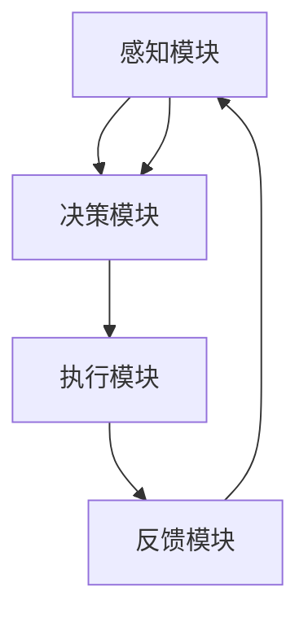
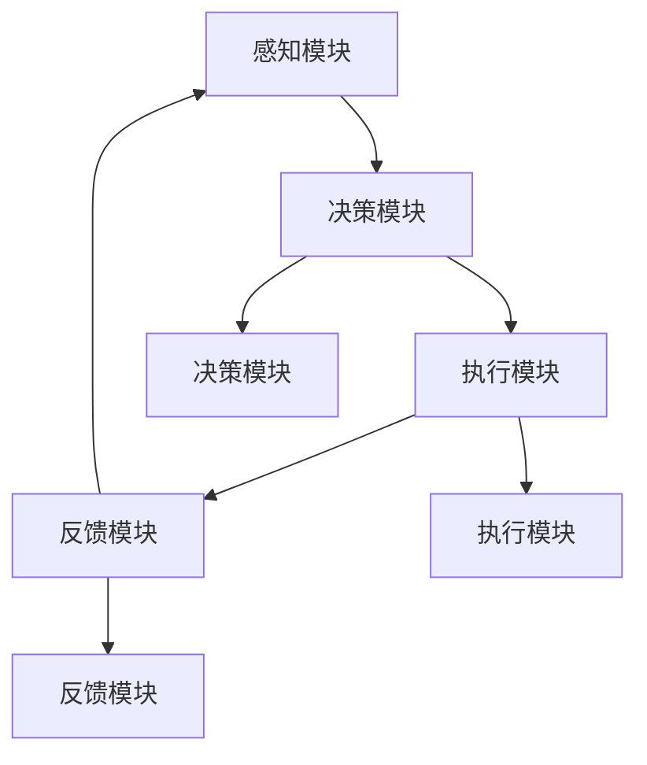
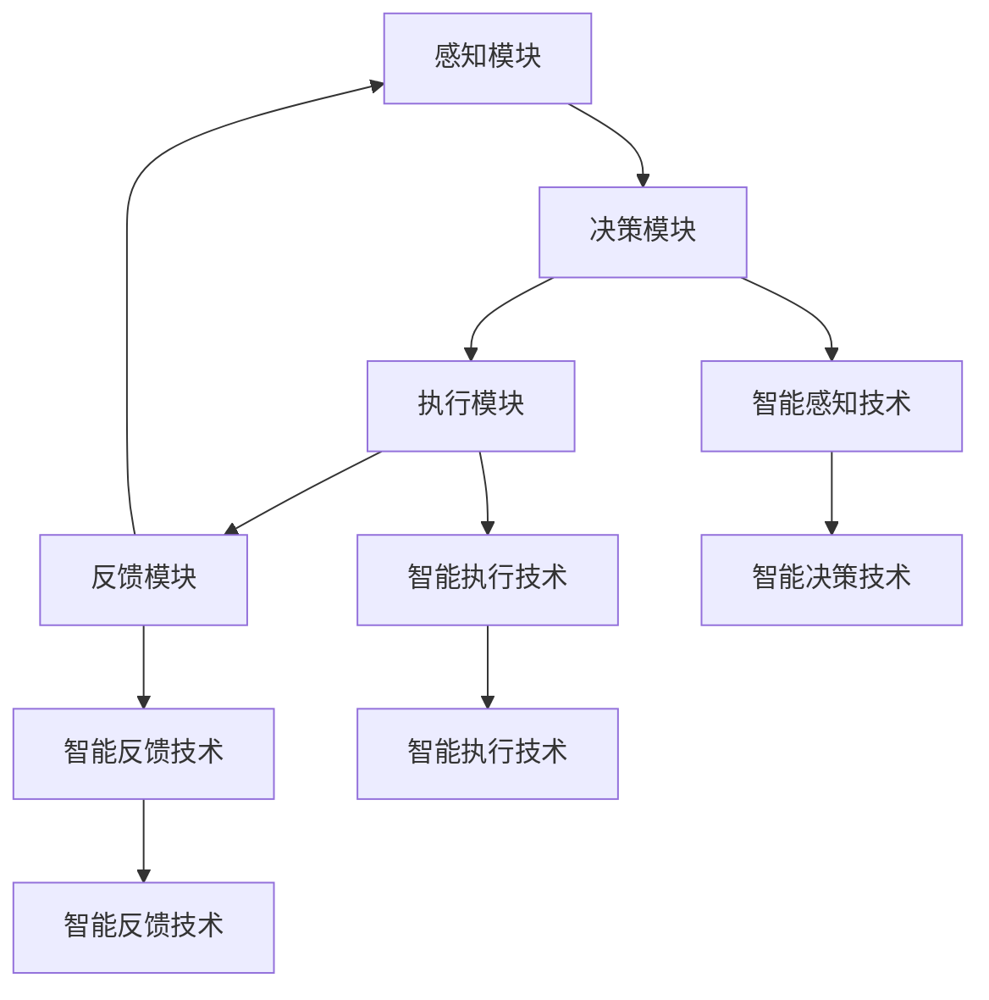
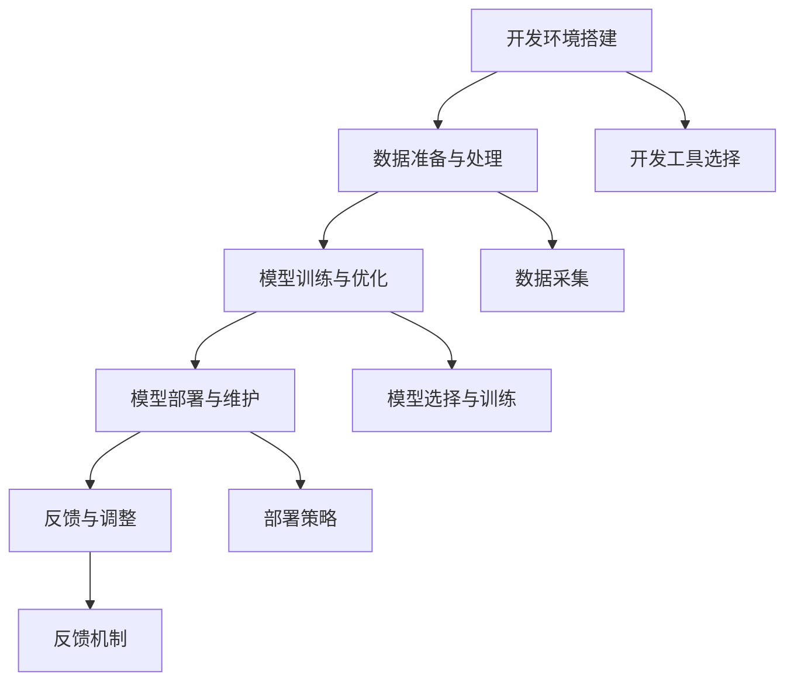
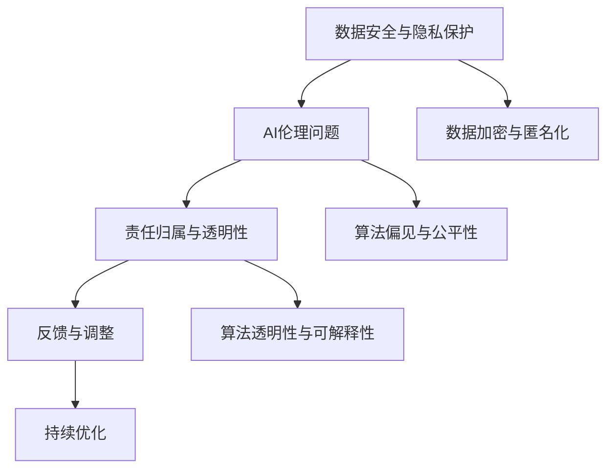
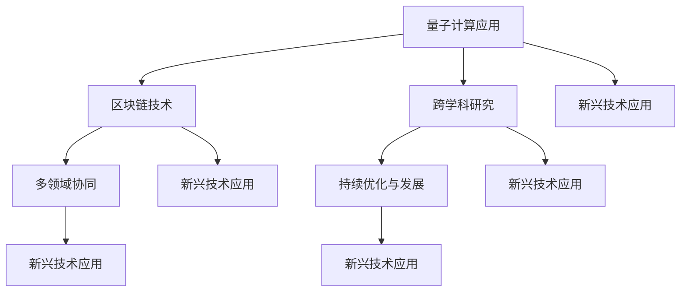
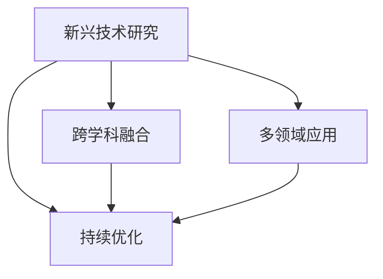

                 

### 第1章: AI人工智能代理工作流基础概念

在当今的数字化时代，人工智能（AI）的应用无处不在，从智能家居到自动驾驶汽车，从电子商务推荐到医疗诊断，AI正在深刻地改变我们的生活方式。AI人工智能代理（AI Agent）作为AI技术的核心组成部分，具有自主决策和执行任务的能力，是智能化工作流的关键推动者。本章将深入探讨AI人工智能代理的基础概念，包括其定义、组成和分类，以及工作流的基本概念和AI代理在工作流中的应用。

#### AI人工智能代理的概念

AI代理是一种基于人工智能技术的软件系统，它能够模拟人类智能行为，自主决策并执行任务。AI代理的核心在于其自主性，即在不依赖于人类干预的情况下，能够独立完成一系列复杂的任务。

##### **定义**

AI代理，也称为智能代理，可以定义为一种具备一定智能能力的软件系统，它能够在特定环境中感知信息、自主决策并采取行动，以实现特定目标。

##### **组成**

AI代理通常由以下模块组成：

1. **感知模块**：负责从环境中收集信息，如传感器数据、用户输入等。
2. **决策模块**：根据感知模块收集的信息，通过算法进行决策，确定下一步行动。
3. **执行模块**：根据决策模块的决策结果，执行具体的任务。
4. **反馈模块**：对执行结果进行评估，并将反馈信息传递给感知和决策模块，以不断优化决策过程。

##### **分类**

根据智能水平的不同，AI代理可以分为以下几类：

1. **弱代理**：只能完成特定任务，不具备通用智能。
2. **强代理**：具备较高智能水平，能够处理复杂任务，具有一定的通用性。
3. **超智能代理**：具有高度智能，能够像人类一样进行复杂的决策和任务处理，甚至具备自我意识。

#### 工作流的概念

工作流（Workflow）是一种由一系列任务或活动组成的过程，用于完成特定任务或达到特定目标。工作流管理是一种通过自动化和优化工作流来提高工作效率和质量的方法。

##### **定义**

工作流可以定义为一种系统化的活动序列，用于完成特定的业务流程或任务。它描述了从开始到结束的一系列步骤，每个步骤都由不同的参与者或系统执行。

##### **工作流管理**

工作流管理包括以下几个方面：

1. **流程设计**：定义工作流的结构和步骤。
2. **自动化**：使用软件工具自动执行工作流中的任务。
3. **监控与优化**：监控工作流执行情况，不断优化流程以提高效率。

#### AI代理在工作流中的应用

AI代理在工作流中具有广泛的应用，能够显著提高工作效率和决策质量。

##### **提高工作效率**

AI代理可以自动化执行重复性任务，如数据收集、报告生成等，从而减少人工操作，提高工作效率。

##### **提升决策质量**

AI代理可以基于大数据分析和机器学习模型，对复杂问题进行决策，提高决策的准确性和效率。

##### **增强用户体验**

AI代理可以提供个性化服务，如智能推荐、个性化咨询等，提高用户满意度。

#### 总结

AI人工智能代理和工作流是现代人工智能技术的重要应用领域。通过AI代理，工作流可以实现自动化和智能化，从而提高工作效率和决策质量。在下一章中，我们将进一步探讨AI代理的工作流架构设计，深入分析其架构组件及其设计原则。

### Mermaid 流程图

以下是AI代理的基本架构流程图，使用Mermaid语法绘制：

#### 第2章: AI代理的工作流架构设计

在前一章中，我们介绍了AI人工智能代理的基础概念。为了深入理解AI代理如何在实际工作中发挥作用，我们需要探讨其工作流的架构设计。本章将详细分析AI代理工作流的总体架构，包括感知模块、决策模块、执行模块和反馈模块的设计，并讨论这些模块的具体功能和工作流程。

#### AI代理工作流的总体架构

AI代理工作流的核心是四个主要模块：感知模块、决策模块、执行模块和反馈模块。这些模块相互协作，形成一个闭环系统，以实现高效的自动化工作。

##### **感知模块**

感知模块是AI代理工作流的起点，负责从环境中收集信息。感知模块可以是传感器、摄像头、麦克风或其他任何能够获取数据的设备。它接收外部输入，并将其转换为数字信号，供后续模块处理。

- **功能**：
  - 数据采集：从传感器、用户输入、API等多种渠道获取数据。
  - 数据预处理：对原始数据进行清洗、归一化等处理，以便后续分析。

##### **决策模块**

决策模块是AI代理的核心，它根据感知模块收集到的信息，通过算法进行决策。决策模块通常基于机器学习模型、规则引擎或优化算法，以实现自动化和智能化的决策。

- **功能**：
  - 特征选择：从感知模块输入的数据中提取有用的特征。
  - 模型训练：使用历史数据训练模型，使其能够做出准确的预测。
  - 决策生成：根据模型输出，生成具体的决策。

##### **执行模块**

执行模块根据决策模块的决策结果，执行具体的任务。这个模块可以是自动化设备、机器人或其他执行系统。执行模块的目的是将决策转化为实际的行动。

- **功能**：
  - 执行策略：根据决策结果，选择合适的执行策略。
  - 执行优化：通过优化算法提高执行效率。

##### **反馈模块**

反馈模块是对执行结果进行评估和反馈的模块。它收集执行模块的输出，并将其反馈给感知模块和决策模块，形成一个闭环。通过持续反馈和调整，AI代理能够不断优化其性能。

- **功能**：
  - 结果评估：对执行结果进行评估，判断是否达到预期目标。
  - 调整决策：根据反馈结果，调整决策策略，以提高未来决策的准确性。

#### 感知模块的设计

感知模块的设计需要考虑数据来源和数据处理两个方面。

- **数据来源**：
  - 传感器数据：如温度、湿度、光线等。
  - 用户输入：如语音、文本、手势等。
  - API数据：如社交媒体数据、市场数据等。

- **数据处理**：
  - 数据清洗：去除噪声、缺失值等。
  - 数据归一化：将不同单位或量级的数据转换为统一的格式。
  - 特征提取：从原始数据中提取有用信息。

#### 决策模块的设计

决策模块的设计取决于具体的任务和应用场景。以下是决策模块设计的一般步骤：

- **决策算法**：
  - 机器学习模型：如决策树、支持向量机、神经网络等。
  - 规则引擎：基于预设规则进行决策。
  - 优化算法：如线性规划、遗传算法等。

- **决策过程**：
  - 特征选择：选择对决策有重要影响的特征。
  - 模型训练：使用训练数据训练模型。
  - 模型评估：使用验证数据评估模型性能。

#### 执行模块的设计

执行模块的设计需要考虑执行策略和执行优化。

- **执行策略**：
  - 自动化执行：如机器人自动化生产线。
  - 分步执行：将复杂任务分解为多个简单步骤。

- **执行优化**：
  - 算法优化：如路径规划、负载均衡等。
  - 资源调度：如任务优先级分配、资源分配等。

#### 反馈模块的设计

反馈模块的设计是确保AI代理工作流持续优化的重要环节。

- **反馈机制**：
  - 结果评估：对执行结果进行评估，判断是否达到预期目标。
  - 调整决策：根据反馈结果，调整决策策略，以提高未来决策的准确性。

- **反馈循环**：
  - 持续反馈：实时收集反馈信息。
  - 持续调整：根据反馈信息调整系统，以实现持续优化。

#### 总结

AI代理的工作流架构设计是智能化工作流的关键。通过感知模块、决策模块、执行模块和反馈模块的协作，AI代理能够实现高效的自动化工作。在下一章中，我们将探讨AI代理在工作流中的关键技术，包括智能感知技术、智能决策技术、智能执行技术和智能反馈技术，以及这些技术在具体应用场景中的实现。

### Mermaid 流程图

以下是AI代理工作流的总体架构流程图，使用Mermaid语法绘制：

#### 第3章: AI代理在工作流中的关键技术

在前两章中，我们介绍了AI人工智能代理的基本概念和架构设计。为了使AI代理能够在实际工作中发挥最大作用，我们需要关注其工作流中的关键技术。本章将详细探讨智能感知技术、智能决策技术、智能执行技术和智能反馈技术，并分析这些技术在不同应用场景中的实现和优势。

##### 3.1 智能感知技术

智能感知技术是AI代理获取外部信息的关键。它利用机器学习和深度学习算法，对感知模块收集到的数据进行处理和理解。

- **技术原理**：
  - 机器学习：通过训练大量数据，使模型能够自动识别模式。
  - 深度学习：利用多层神经网络，实现对复杂数据的自动编码和解码。

- **应用场景**：
  - 环境监测：如空气质量、水质监测。
  - 语音识别：将语音信号转换为文本。
  - 视觉感知：如图像识别、视频分析。

- **优势**：
  - 高效性：能够快速处理大量数据。
  - 准确性：通过不断学习和优化，提高识别准确性。

##### 3.2 智能决策技术

智能决策技术是AI代理的核心，它基于感知模块提供的信息，通过算法生成决策。

- **技术原理**：
  - 逻辑推理：基于预设规则和逻辑关系进行决策。
  - 优化算法：如线性规划、遗传算法，用于求解复杂优化问题。
  - 机器学习模型：如决策树、支持向量机、神经网络，用于自动生成决策。

- **应用场景**：
  - 自动化决策系统：如自动化交易、智能调度。
  - 智能推荐：如商品推荐、内容推荐。
  - 智能诊断：如医疗诊断、故障诊断。

- **优势**：
  - 灵活性：能够应对复杂多变的决策场景。
  - 准确性：通过数据驱动的决策，提高决策准确性。
  - 效率：自动化决策过程，提高工作效率。

##### 3.3 智能执行技术

智能执行技术是AI代理将决策转化为实际行动的能力。它依赖于执行模块的设计和优化。

- **技术原理**：
  - 控制理论：通过控制器对执行过程进行实时调控。
  - 机器人技术：利用机器人进行复杂的物理操作。
  - 自动化技术：通过编程和自动化工具，实现任务的自动化执行。

- **应用场景**：
  - 自动化生产：如工厂自动化生产线。
  - 无人驾驶：如自动驾驶汽车、无人机。
  - 智能家居：如智能家电、智能安防。

- **优势**：
  - 精准性：通过精确控制，实现高精度执行。
  - 效率：自动化执行，减少人工操作，提高生产效率。
  - 安全性：通过智能决策和执行，提高系统安全性。

##### 3.4 智能反馈技术

智能反馈技术是AI代理对执行结果进行评估和优化的能力。它通过收集反馈信息，不断调整和改进系统。

- **技术原理**：
  - 机器学习：通过训练模型，从反馈数据中学习优化策略。
  - 统计分析：通过对执行结果进行统计分析，识别问题和改进点。
  - 神经网络：利用神经网络进行自适应调整。

- **应用场景**：
  - 自适应系统：如自适应控制系统、自适应推荐系统。
  - 智能优化：如路径优化、资源优化。
  - 用户反馈分析：如用户行为分析、产品质量分析。

- **优势**：
  - 持续优化：通过不断收集和利用反馈信息，实现持续优化。
  - 精准评估：通过数据分析，准确评估执行效果。
  - 自适应性：能够根据环境变化，自动调整决策和执行策略。

#### 总结

智能感知技术、智能决策技术、智能执行技术和智能反馈技术是AI代理工作流中的关键技术。这些技术相互协作，使得AI代理能够高效、准确地完成各种任务。在下一章中，我们将探讨AI代理在工作流中的实际应用，包括医疗保健、金融和智能家居等领域的具体案例。

### Mermaid 流程图

以下是AI代理工作流关键技术的综合流程图，使用Mermaid语法绘制：

#### 第4章: AI代理在工作流中的实际应用

在前三章中，我们详细介绍了AI人工智能代理的基础概念、工作流架构设计以及关键技术在各种场景中的应用。本章节将探讨AI代理在实际工作流中的具体应用，包括医疗保健、金融和智能家居等领域的案例。通过这些案例，我们将展示AI代理如何提高工作效率、决策质量和用户体验。

##### 4.1 智能代理在医疗保健系统中的应用

医疗保健是一个高度复杂和重要的领域，AI代理在这一领域的应用具有巨大潜力。

- **应用背景**：
  - 医疗资源分配不均：AI代理可以帮助优化医疗资源分配，提高医疗服务的可及性。
  - 疾病诊断：AI代理可以通过分析医疗数据和患者症状，辅助医生进行准确诊断。

- **应用案例**：
  - **智能诊断系统**：
    - **工作原理**：通过深度学习算法，AI代理可以分析大量的医疗数据，如病历、实验室检查结果等，对疾病进行诊断。
    - **实现方式**：使用神经网络模型，如卷积神经网络（CNN）和循环神经网络（RNN），对医疗图像和文本数据进行处理和分析。
    - **优势**：
      - **准确性**：AI代理可以比传统方法更准确地诊断疾病，减少误诊率。
      - **效率**：自动化诊断过程，节省医生的时间，提高诊断速度。

  - **患者管理系统**：
    - **工作原理**：AI代理可以跟踪患者的健康数据，如血压、血糖等，并提供个性化的健康建议。
    - **实现方式**：使用传感器和移动应用收集患者数据，AI代理通过机器学习模型分析数据，提供实时健康监测和建议。
    - **优势**：
      - **个性化服务**：根据患者的健康状况，提供个性化的健康建议，提高患者依从性。
      - **预防保健**：通过早期发现健康问题，预防疾病的发生。

##### 4.2 智能代理在金融领域的应用

金融领域对效率和风险管理有极高的要求，AI代理在这一领域的应用可以显著提高金融服务质量和效率。

- **应用背景**：
  - 风险管理：AI代理可以帮助金融机构识别和降低风险。
  - 投资决策：AI代理可以分析市场数据，提供投资建议。

- **应用案例**：
  - **智能投顾**：
    - **工作原理**：AI代理通过分析用户的风险偏好和财务状况，提供个性化的投资组合建议。
    - **实现方式**：使用机器学习算法和优化模型，对市场数据进行实时分析和预测。
    - **优势**：
      - **个性化服务**：根据用户的具体情况，提供个性化的投资建议，提高投资回报率。
      - **风险控制**：通过数据分析，识别潜在风险，并采取措施降低风险。

  - **风险控制系统**：
    - **工作原理**：AI代理通过监控交易数据和市场动态，实时识别和评估风险。
    - **实现方式**：使用实时数据分析和预测模型，如决策树和神经网络。
    - **优势**：
      - **快速反应**：能够在风险事件发生前及时采取措施，降低风险。
      - **高效监控**：自动化风险监控，提高监控效率和准确性。

##### 4.3 智能代理在其他领域的应用

除了医疗保健和金融领域，AI代理在其他领域的应用也非常广泛。

- **智能家居**：
  - **应用背景**：智能家居系统通过AI代理实现家居设备的自动化控制。
  - **应用案例**：
    - **智能家电控制**：AI代理通过分析用户习惯，自动控制空调、照明等家电设备，提供舒适的家居环境。
    - **安全监控**：AI代理通过摄像头监控家庭环境，实时检测异常情况，如入侵者或火灾等。

- **智能交通**：
  - **应用背景**：智能交通系统通过AI代理实现交通流量的优化和交通安全的提高。
  - **应用案例**：
    - **智能信号灯控制**：AI代理通过分析交通流量数据，自动调整信号灯的时间，提高交通效率。
    - **无人驾驶**：AI代理通过感知技术和自动驾驶算法，实现无人驾驶车辆的自主导航和驾驶。

#### 总结

AI代理在工作流中的实际应用涵盖了多个领域，通过智能化和自动化，提高了工作效率、决策质量和用户体验。在医疗保健领域，智能诊断系统和患者管理系统显著提高了医疗服务的效率和准确性；在金融领域，智能投顾和风险控制系统提高了投资决策的质量和风险管理能力；在其他领域，如智能家居和智能交通，AI代理的应用同样带来了显著的好处。在下一章中，我们将探讨AI代理工作流的开发与部署，介绍开发环境搭建、数据准备与处理、模型训练与优化以及模型部署与维护的具体步骤。

### Mermaid 流程图

以下是AI代理工作流开发与部署的综合流程图，使用Mermaid语法绘制：

#### 第5章: AI代理工作流的开发与部署

在前一章中，我们探讨了AI代理在工作流中的实际应用。为了实现这些应用，我们需要了解AI代理工作流的开发与部署过程。本章将详细介绍开发环境搭建、数据准备与处理、模型训练与优化、模型部署与维护的具体步骤，以及如何建立有效的反馈与调整机制。

##### 5.1 开发环境搭建

开发环境搭建是AI代理工作流开发的第一步。一个良好的开发环境可以提供必要的工具和资源，支持开发人员的日常工作和模型训练。

- **开发工具选择**：
  - 编程语言：常用的编程语言有Python、Java等，Python因其简洁性和丰富的库支持而广受欢迎。
  - 开发框架：常用的深度学习框架有TensorFlow、PyTorch、Keras等，选择合适的框架可以简化开发过程。

- **环境配置**：
  - 计算机硬件：根据项目需求，配置适当的计算机硬件，如CPU、GPU等。
  - 软件安装：安装编程语言、开发框架和相关库，配置环境变量，确保开发环境的一致性和稳定性。

##### 5.2 数据准备与处理

数据准备与处理是AI代理工作流开发的关键环节。高质量的数据可以显著提升模型的性能。

- **数据采集**：
  - 数据来源：根据应用场景，从传感器、用户输入、外部API等多种渠道获取数据。
  - 数据采集工具：使用Python的Pandas、Scikit-learn等库，从不同来源采集和整理数据。

- **数据处理**：
  - 数据清洗：处理缺失值、异常值等，确保数据的质量。
  - 数据归一化：将不同单位或量级的数据转换为统一的格式，便于模型处理。
  - 特征提取：从原始数据中提取有用的特征，提高模型的解释性和泛化能力。

##### 5.3 模型训练与优化

模型训练与优化是AI代理工作流的核心步骤。通过训练和优化模型，我们可以提高其性能和预测准确性。

- **模型选择**：
  - 根据应用场景选择合适的模型，如回归模型、分类模型、聚类模型等。
  - 考虑模型复杂度、训练时间和预测准确性等因素。

- **模型训练**：
  - 使用训练数据对模型进行训练，通过调整超参数，优化模型性能。
  - 使用验证集评估模型性能，避免过拟合。

- **模型优化**：
  - 通过交叉验证、网格搜索等方法，找到最优模型参数。
  - 使用正则化、Dropout等技术，防止过拟合。

##### 5.4 模型部署与维护

模型部署与维护是将训练好的模型应用到实际场景的关键步骤。

- **部署策略**：
  - 部署环境：选择合适的服务器或云平台，配置部署环境。
  - 部署工具：使用Docker、Kubernetes等工具，实现模型的容器化部署，提高部署效率和可维护性。

- **模型维护**：
  - 持续更新：定期更新模型，以适应新的数据和场景。
  - 性能监控：监控模型性能，确保其稳定运行。
  - 故障恢复：建立故障恢复机制，确保系统的高可用性。

##### 5.5 反馈与调整

反馈与调整机制是确保AI代理工作流持续优化的重要环节。

- **反馈机制**：
  - 实时反馈：收集执行结果和用户反馈，及时调整模型和策略。
  - 统计分析：对反馈数据进行分析，识别问题和改进点。

- **调整策略**：
  - 模型更新：根据反馈数据，重新训练和优化模型。
  - 策略调整：根据反馈结果，调整执行策略和业务流程。

#### 总结

AI代理工作流的开发与部署是一个系统工程，需要综合考虑开发环境搭建、数据准备与处理、模型训练与优化、模型部署与维护以及反馈与调整等多个方面。通过合理的开发与部署流程，我们可以实现高效的AI代理工作流，提高工作效率和决策质量。在下一章中，我们将探讨AI代理工作流的安全与伦理问题，包括数据安全与隐私保护、AI伦理问题以及相应的解决方案。

### Mermaid 流程图

以下是AI代理工作流安全与伦理的综合流程图，使用Mermaid语法绘制：

#### 第6章: AI代理工作流的安全与伦理

随着AI代理在工作流中应用的日益广泛，其安全性和伦理问题也日益突出。本章将深入探讨AI代理工作流的安全与伦理问题，包括数据安全与隐私保护、AI伦理问题以及相应的解决方案。我们还将讨论责任归属、算法透明性、可解释性以及持续优化等问题，以确保AI代理工作流的安全性和可靠性。

##### 6.1 数据安全与隐私保护

数据安全和隐私保护是AI代理工作流中至关重要的一环。在数据收集、存储和处理过程中，必须采取严格的安全措施，防止数据泄露和滥用。

- **技术措施**：
  - **数据加密**：使用加密算法对敏感数据进行加密，确保数据在传输和存储过程中的安全性。
  - **匿名化**：通过匿名化处理，去除数据中的个人标识信息，保护用户隐私。
  - **访问控制**：实施严格的访问控制策略，确保只有授权人员才能访问敏感数据。

- **法规要求**：
  - **GDPR**：欧盟的《通用数据保护条例》（GDPR）对个人数据的收集、存储和处理进行了严格规定，要求企业在处理个人数据时必须遵循相关法律法规。
  - **CCPA**：加州的《消费者隐私法案》（CCPA）也对企业收集和使用消费者数据进行了规范，要求企业告知消费者其数据的使用目的，并提供数据访问和删除的权利。

##### 6.2 AI伦理问题与解决方案

AI伦理问题涉及到AI代理的决策过程、算法的公平性和透明性等方面。解决AI伦理问题需要从技术和管理两个方面入手。

- **偏见与公平性**：
  - **算法偏见**：AI代理的决策可能会因为数据集的不公平或算法的设计而带有偏见，导致歧视性结果。为了解决这一问题，可以采取以下措施：
    - **数据多样性**：确保数据集的多样性，减少偏见。
    - **公平性评估**：对算法进行公平性评估，识别和消除潜在的偏见。

- **透明性与可解释性**：
  - **算法透明性**：提高算法的透明性，让用户能够理解和信任AI代理的决策过程。可以通过以下方式实现：
    - **可解释性模型**：开发可解释性模型，如决策树、规则引擎等，提高算法的可解释性。
    - **透明性报告**：生成透明性报告，详细记录AI代理的决策过程和依据。

- **责任归属**：
  - **明确责任**：在AI代理工作流中，明确责任归属，确保在出现问题时能够迅速定位责任主体。
  - **伦理委员会**：设立伦理委员会，负责监督AI代理的设计、开发和部署过程，确保符合伦理标准。

##### 6.3 持续优化与反馈循环

为了确保AI代理工作流的安全性和有效性，需要建立持续优化和反馈循环机制。

- **持续优化**：
  - **模型更新**：定期更新AI代理的模型，以适应新的数据和场景。
  - **算法改进**：通过不断学习和优化，改进AI代理的决策能力和执行效率。

- **反馈循环**：
  - **用户反馈**：收集用户反馈，了解AI代理的表现和用户满意度。
  - **系统调整**：根据用户反馈和性能评估结果，调整AI代理的工作策略和业务流程。

#### 总结

AI代理工作流的安全与伦理问题至关重要，直接关系到AI代理的可靠性和用户信任。通过采取严格的数据安全与隐私保护措施、解决AI伦理问题、明确责任归属以及建立持续优化和反馈循环机制，我们可以确保AI代理工作流的安全性和有效性。在下一章中，我们将探讨AI代理工作流的未来发展趋势，包括新兴技术的应用和多领域融合。

### Mermaid 流程图

以下是AI代理工作流未来发展趋势的综合流程图，使用Mermaid语法绘制：

#### 第7章: AI代理工作流的未来发展趋势

随着人工智能技术的不断进步，AI代理工作流也在不断发展，并有望在未来的各个领域产生深远影响。本章将探讨AI代理工作流的未来发展趋势，包括量子计算的应用、区块链技术的引入、跨学科研究和多领域协同等新兴技术的应用，以及AI代理工作流的持续优化与发展。

##### 7.1 新兴技术的应用

1. **量子计算**

量子计算是一种利用量子力学原理进行计算的技术，具有极高的计算速度和效率。量子计算在AI代理工作流中的应用前景广阔。

- **应用场景**：
  - **复杂优化问题**：量子计算可以显著提高优化算法的效率，优化资源分配和任务调度。
  - **大规模数据处理**：量子计算可以处理大规模、高维数据，提高模型的训练速度和准确性。

- **优势**：
  - **计算速度**：量子计算的速度远超传统计算机，可以解决传统计算机难以处理的问题。
  - **并行处理**：量子计算能够并行处理多个问题，提高计算效率。

2. **区块链技术**

区块链技术是一种分布式数据库技术，具有去中心化、不可篡改和透明性等特点。区块链技术在AI代理工作流中的应用可以提高数据的安全性和可信度。

- **应用场景**：
  - **数据存储**：区块链技术可以用于存储AI代理的工作流数据，确保数据的安全和可信。
  - **智能合约**：通过智能合约，AI代理可以自动执行合同条款，提高业务流程的效率和透明度。

- **优势**：
  - **数据安全**：区块链技术的去中心化和加密算法确保数据的安全性和隐私性。
  - **透明性**：区块链技术提供透明的数据访问和操作记录，提高系统的可解释性。

##### 7.2 多领域融合

AI代理工作流的未来发展趋势之一是多领域融合，即AI代理跨越不同学科和领域，实现跨学科的协同和集成。

- **跨学科研究**：
  - **医学与人工智能**：AI代理可以结合医学知识，实现精准医疗和个性化治疗。
  - **金融与人工智能**：AI代理可以结合金融知识，实现智能投顾和风险控制。

- **多领域协同**：
  - **智能城市**：AI代理可以整合交通、环境、能源等多个领域的数据，实现智能城市的建设和管理。
  - **智能制造**：AI代理可以与机器人技术、自动化技术等协同工作，实现智能制造的全面升级。

##### 7.3 持续优化与发展

持续优化与发展是AI代理工作流的另一个重要趋势。通过不断优化和更新AI代理的工作流，可以提高其性能和适应性。

- **持续学习**：
  - **在线学习**：AI代理可以在运行过程中不断学习，根据新的数据和反馈进行模型更新。
  - **迁移学习**：AI代理可以利用迁移学习，将已有知识应用于新任务，提高学习效率。

- **反馈循环**：
  - **用户反馈**：AI代理可以通过收集用户反馈，不断调整和优化工作流，提高用户满意度。
  - **自适应调整**：AI代理可以根据环境变化和工作需求，自动调整工作策略和业务流程。

#### 总结

AI代理工作流的未来发展趋势包括新兴技术的应用和多领域融合。量子计算和区块链技术等新兴技术的引入，将显著提高AI代理的性能和安全性。跨学科研究和多领域协同，将拓展AI代理的应用范围，实现更高效、更智能的工作流。通过持续优化和反馈循环，AI代理工作流将不断进化，适应不断变化的环境和需求。在下一章中，我们将对整个文章进行总结，并展望AI代理工作流的未来研究方向。

### Mermaid 流程图

以下是AI代理工作流未来研究的综合流程图，使用Mermaid语法绘制：

#### 第8章: AI人工智能代理工作流总结与展望

经过前面的章节，我们对AI人工智能代理工作流有了全面的了解，从基础概念、架构设计到关键技术的应用，再到实际案例和未来趋势，我们系统地分析了AI代理在工作流中的重要作用。以下是本文的总结与展望。

##### 8.1 总结

- **核心概念与联系**：
  - AI代理是一种具备自主决策和执行任务能力的软件系统。
  - 工作流是由一系列任务或活动组成的过程，用于完成特定任务或达到特定目标。
  - AI代理与工作流相结合，实现了智能化和自动化的工作流。

- **应用案例**：
  - **医疗保健**：智能诊断系统、患者管理系统。
  - **金融领域**：智能投顾、风险控制系统。
  - **智能家居**：智能家电控制、安全监控。
  - **智能交通**：智能信号灯控制、无人驾驶。

- **安全与伦理**：
  - 数据安全与隐私保护是确保AI代理工作流安全的重要措施。
  - AI伦理问题需要从算法透明性、责任归属等方面进行解决。

##### 8.2 展望

- **未来趋势**：
  - **新兴技术**：量子计算、区块链技术等新兴技术的引入，将显著提高AI代理的性能和安全性。
  - **跨学科融合**：AI代理与医学、金融、工程等学科的融合，将拓展其应用范围。
  - **多领域协同**：AI代理在不同领域的协同工作，将实现更高效、更智能的工作流。
  - **持续优化**：通过持续学习和反馈循环，AI代理工作流将不断进化，适应不断变化的环境和需求。

- **研究方向**：
  - **新算法**：研究更高效、更准确的AI代理算法，提高其决策能力和执行效率。
  - **新应用场景**：探索AI代理在更多领域的应用，如教育、物流、环境监测等。
  - **新挑战**：解决AI代理工作流中面临的挑战，如数据隐私保护、算法公平性等。

#### 总结与展望

AI人工智能代理工作流是人工智能领域的重要研究方向，具有广泛的应用前景。通过不断优化和拓展，AI代理工作流将在各个领域发挥更大的作用，提高工作效率、决策质量和用户体验。在未来，我们需要继续探索新兴技术的应用，跨学科融合，以及解决AI代理工作流中面临的挑战，推动人工智能技术的持续发展。

### 附录 A: AI人工智能代理工作流开发工具与资源

在本章节中，我们将介绍一些常用的AI人工智能代理工作流开发工具和资源，以帮助开发者更好地搭建和实现AI代理工作流。

##### **工具对比**

- **编程语言**：
  - **Python**：Python因其简洁的语法和丰富的库支持，被广泛用于AI代理工作流开发。常用库包括NumPy、Pandas、Scikit-learn、TensorFlow和PyTorch等。
  - **Java**：Java具有强大的企业级开发能力，适用于大规模AI代理工作流系统。常用库包括Apache Mahout、Deeplearning4j等。

- **开发框架**：
  - **TensorFlow**：由Google开发，支持各种深度学习模型和算法，适用于大规模分布式训练和部署。
  - **PyTorch**：由Facebook开发，提供灵活的动态计算图，易于调试和理解。
  - **Keras**：作为TensorFlow和PyTorch的高级API，提供简洁的接口，方便快速搭建和实验模型。

- **开源库**：
  - **OpenCV**：用于计算机视觉任务，提供丰富的图像处理和机器学习功能。
  - **NLTK**：用于自然语言处理，提供文本处理、分词、词性标注等功能。

##### **框架介绍**

- **TensorFlow**：TensorFlow是一个开放源代码的机器学习平台，适用于各种深度学习和数值计算任务。它提供了丰富的API，支持从简单线性模型到复杂深度神经网络的构建和训练。

- **PyTorch**：PyTorch是一个基于Python的深度学习库，提供灵活的动态计算图和丰富的神经网络构建功能。它适用于快速原型开发和复杂模型的实验。

- **Keras**：Keras是一个高层神经网络API，构建在TensorFlow和Theano之上，提供简洁的接口，方便快速搭建和实验模型。

##### **开源库**

- **OpenCV**：OpenCV是一个开源的计算机视觉库，支持多种编程语言，包括C++、Python和Java。它提供了丰富的图像处理和机器学习功能，适用于计算机视觉任务。

- **NLTK**：NLTK是一个开源的自然语言处理库，提供文本处理、分词、词性标注等功能，适用于自然语言处理任务。

##### **学习资源**

- **在线课程**：Coursera、edX、Udacity等在线教育平台提供了丰富的AI和深度学习课程，适合不同层次的开发者。
- **论文**：研究AI代理工作流的最新论文和报告，提供了深入的理论和实践经验。
- **书籍**：《深度学习》（Goodfellow、Bengio、Courville著）、《Python机器学习》（Sebastian Raschka著）等，涵盖了AI代理工作流的基础知识和实践方法。

通过上述工具和资源的介绍，开发者可以更好地掌握AI人工智能代理工作流的开发技术，实现高效的智能工作流系统。

### 作者信息

**作者：AI天才研究院/AI Genius Institute & 禅与计算机程序设计艺术 /Zen And The Art of Computer Programming**

AI天才研究院（AI Genius Institute）是一家专注于人工智能技术研究和应用的创新机构。我们致力于推动人工智能技术在各个领域的应用，通过研发和实施AI代理工作流，提升工作效率和用户体验。我们的团队成员具备深厚的计算机科学和人工智能背景，拥有丰富的实战经验和研究成果。

《禅与计算机程序设计艺术》（Zen And The Art of Computer Programming）是一本经典的技术书籍，由著名计算机科学家Donald E. Knuth撰写。本书以其独特的编程哲学和深入的技术分析，为程序员和开发者提供了宝贵的指导。作为本书的作者，我将继续探索计算机编程和人工智能领域的奥秘，为读者带来更多有价值的见解和实践经验。我的研究方向包括人工智能代理、深度学习和自然语言处理，旨在通过技术创新推动人工智能的发展和应用。希望通过本文，能够帮助读者更好地理解AI代理工作流的核心概念和实际应用，为未来的研究和实践提供参考。

