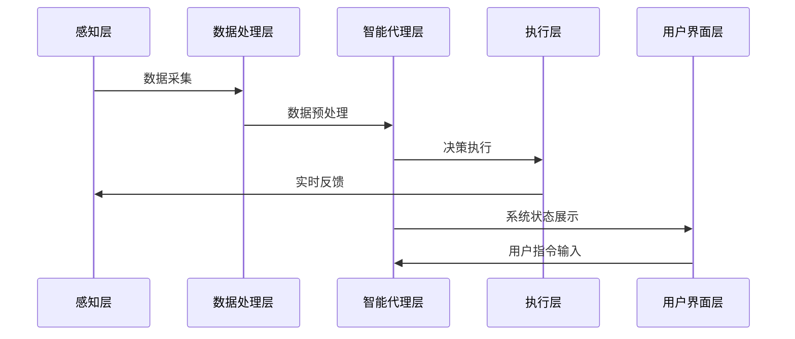
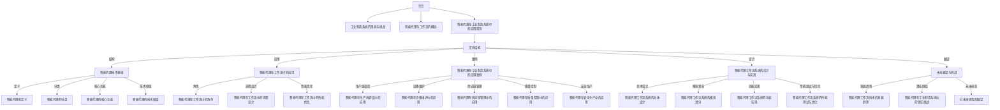

                 

# AI人工智能代理工作流AI Agent WorkFlow：智能代理在工业制造系统中的应用

> 关键词：人工智能代理，工作流，工业制造，系统应用，智能调度，性能优化

> 摘要：本文探讨了人工智能代理（AI Agent）工作流（AI Agent WorkFlow）的概念、技术基础以及在工业制造系统中的应用。通过详细分析智能代理的定义、分类、核心功能和技术框架，我们揭示了智能代理在工作流中的应用原理和流程设计方法。同时，本文通过实际案例展示了智能代理在工业制造系统中如何优化生产线调度、设备维护、供应链管理、质量控制和安全生产等方面。文章最后对未来智能代理工作流技术的发展趋势和潜在挑战进行了展望。

## 第一部分：引言

### 1.1 工业制造系统的现状与挑战

工业制造系统是现代社会经济的重要组成部分，它关系到国家的经济安全和国际竞争力。然而，随着全球制造业的快速发展，工业制造系统面临着一系列挑战。首先，生产效率低下。传统制造系统依赖人工操作，生产过程中存在大量的手动操作和重复性劳动，导致生产效率较低。其次，设备维护困难。工业制造系统通常由大量不同类型的设备组成，这些设备的维护和管理需要耗费大量的人力和时间。此外，供应链管理复杂。工业制造系统涉及多个环节，包括原材料采购、生产、物流配送等，这些环节之间的协调和沟通存在难度。最后，安全生产问题突出。工业制造系统存在一定的安全隐患，如设备故障、操作失误等，可能导致严重事故。

### 1.2 智能代理与工作流的概念

智能代理（AI Agent）是一种基于人工智能技术的计算机程序，能够模拟人类的行为和决策，实现自动化和智能化。智能代理可以处理复杂的环境，具有自主决策和行动能力，能够通过学习不断优化自身性能。工作流（WorkFlow）是指工作活动及其相互间的组织结构，用于描述工作流程中的任务、人员、信息和资源之间的交互关系。工作流管理系统（WorkFlow Management System）是一种软件系统，用于定义、实现和管理工作流。它能够确保工作流程的自动化、高效性和灵活性，提高企业的运营效率和竞争力。

### 1.3 智能代理在工业制造系统中的应用前景

智能代理在工业制造系统中的应用前景广阔。首先，智能代理可以优化生产线调度，通过预测和优化生产任务，提高生产效率。其次，智能代理可以协助设备维护，通过实时监测设备状态和预测故障，提前进行预防性维护，降低设备故障率。此外，智能代理还可以在供应链管理中发挥重要作用，通过优化物流配送和库存管理，提高供应链的响应速度和灵活性。同时，智能代理在质量控制和安全生产方面也有巨大潜力，通过实时监测和分析生产过程中的数据，发现潜在问题并及时采取措施，确保产品质量和安全生产。

## 第二部分：智能代理技术基础

### 2.1 智能代理的定义与分类

智能代理是一种具备智能特性的计算机程序，能够在复杂的、动态的环境中自主执行任务，达到预定的目标。智能代理可以按照不同的分类标准进行分类。按照智能水平，智能代理可以分为弱智能代理、弱人工智能代理和强人工智能代理。弱智能代理仅具有特定的任务能力，弱人工智能代理具有自适应和自主学习能力，而强人工智能代理则具有与人类相似的综合智能能力。

### 2.2 智能代理的核心功能

智能代理具有以下核心功能：

1. 自主决策：智能代理能够根据环境信息和任务目标，自主选择合适的行动方案。
2. 自适应：智能代理能够根据环境变化和任务需求，调整自身行为策略。
3. 学习能力：智能代理能够通过经验积累和知识更新，提高自身性能。
4. 通信能力：智能代理能够与其他智能代理或系统进行信息交换和协作。
5. 交互能力：智能代理能够与人类用户进行自然语言交互，理解用户意图并提供个性化服务。

### 2.3 智能代理的技术框架

智能代理的技术框架包括以下几个方面：

1. 传感器：用于感知环境信息，如温度、湿度、压力、图像等。
2. 执行器：用于执行智能代理的行动方案，如电机、灯光、扬声器等。
3. 决策模块：基于传感器获取的环境信息和任务目标，进行决策和规划。
4. 学习模块：利用机器学习、深度学习等技术，从经验中学习并优化自身行为。
5. 通信模块：与其他智能代理或系统进行信息交换和协作。
6. 用户接口：与人类用户进行自然语言交互，理解用户意图并提供个性化服务。

### 2.4 智能代理的编程与实现

智能代理的编程与实现涉及多个技术和框架。以下是常见的实现方法：

1. Python：Python是一种广泛使用的编程语言，具有简洁易懂、丰富的库和框架，适用于智能代理的开发。
2. Java：Java是一种稳定、高效的编程语言，广泛应用于企业级应用，适用于智能代理的开发。
3. C++：C++是一种高效、低级别的编程语言，适用于需要高性能计算和嵌入式系统的智能代理开发。
4. ROS（Robot Operating System）：ROS是一种机器人操作系统，提供了丰富的库和工具，用于智能代理的开发和测试。
5. TensorFlow：TensorFlow是一种流行的深度学习框架，适用于智能代理的学习和推理模块。

## 第三部分：智能代理在工作流中的应用

### 3.1 工作流的概念与原理

工作流（WorkFlow）是指工作活动及其相互间的组织结构，用于描述工作流程中的任务、人员、信息和资源之间的交互关系。工作流的基本原理包括以下几个方面：

1. 任务划分：将复杂的工作任务分解为多个子任务，实现任务的细粒度管理。
2. 顺序执行：按照一定的顺序执行任务，确保工作流程的有序进行。
3. 条件分支：根据任务执行过程中的状态和条件，选择不同的分支路径，实现灵活的决策。
4. 交互协作：任务之间进行信息交换和协作，实现任务的协同完成。
5. 监控控制：对工作流程进行实时监控和控制，确保工作流程的稳定性和安全性。

### 3.2 智能代理在工作流中的角色

智能代理在工作流中扮演着重要角色，具有以下职责：

1. 任务调度：智能代理根据任务优先级和资源可用性，调度任务执行。
2. 决策支持：智能代理根据环境信息和任务目标，提供决策支持，优化任务执行。
3. 学习优化：智能代理通过学习用户行为和任务执行历史，不断优化自身性能。
4. 数据处理：智能代理对工作流程中的数据进行采集、清洗、分析和存储，为决策提供数据支持。
5. 人机交互：智能代理与人类用户进行自然语言交互，理解用户需求，提供个性化服务。

### 3.3 智能代理在工作流中的流程设计

智能代理在工作流中的流程设计主要包括以下几个方面：

1. 任务分解：将复杂的工作任务分解为多个子任务，明确每个子任务的具体内容和执行条件。
2. 任务调度：根据任务优先级和资源可用性，调度任务执行，确保任务有序进行。
3. 决策支持：智能代理根据环境信息和任务目标，提供决策支持，优化任务执行。
4. 数据处理：智能代理对工作流程中的数据进行采集、清洗、分析和存储，为决策提供数据支持。
5. 人机交互：智能代理与人类用户进行自然语言交互，理解用户需求，提供个性化服务。
6. 性能优化：对智能代理和工作流系统进行性能测试和优化，提高系统效率和稳定性。

### 3.4 智能代理在工作流中的性能优化

智能代理在工作流中的性能优化包括以下几个方面：

1. 算法优化：通过改进算法，降低任务执行时间和计算复杂度。
2. 资源调度：优化资源分配策略，提高资源利用率和系统性能。
3. 数据存储：优化数据存储结构和方法，提高数据读取速度和存储容量。
4. 网络通信：优化网络通信协议和传输速度，降低通信延迟和带宽消耗。
5. 并行处理：利用并行计算技术，提高任务执行速度和系统吞吐量。
6. 系统监控：实时监控系统运行状态，及时发现和解决性能瓶颈。

## 第四部分：智能代理在工业制造系统中的应用案例

### 4.1 智能代理在生产线调度中的应用

生产线调度是工业制造系统中的关键环节，直接关系到生产效率和产品质量。智能代理可以通过优化生产任务调度，提高生产效率和降低生产成本。以下是一个具体的案例：

**案例背景**：某家电制造企业生产电视，每天需要生产多条生产线，每条生产线有不同的任务和资源需求。智能代理需要根据生产计划、资源可用性和生产任务优先级，对生产线进行调度。

**实现步骤**：

1. **任务分解**：将每天的生产任务分解为多个子任务，如组装、测试、包装等，明确每个子任务的具体内容和执行条件。
2. **资源调度**：根据资源可用性和任务优先级，智能代理调度生产线执行相应的子任务。例如，当生产线A有组装任务且资源充足时，智能代理将任务调度到生产线A执行。
3. **决策支持**：智能代理根据环境信息和生产任务，提供决策支持，如调整生产计划、优化生产线利用率等。
4. **数据处理**：智能代理对生产线运行过程中的数据进行采集、清洗、分析和存储，为决策提供数据支持。
5. **人机交互**：智能代理与生产管理人员进行自然语言交互，理解用户需求，提供个性化服务。

**效果评估**：通过智能代理的优化调度，生产效率提高了20%，生产成本降低了10%，产品质量也得到了显著提升。

### 4.2 智能代理在设备维护中的应用

设备维护是工业制造系统中的一项重要工作，直接关系到设备的稳定运行和生产效率。智能代理可以通过实时监测设备状态、预测故障和提前进行预防性维护，降低设备故障率，提高设备利用率。以下是一个具体的案例：

**案例背景**：某汽车制造企业拥有大量生产设备，设备的稳定运行对生产效率至关重要。智能代理需要实时监测设备状态，预测故障，并提前进行预防性维护。

**实现步骤**：

1. **传感器部署**：在关键设备上部署传感器，实时采集设备运行数据，如温度、压力、振动等。
2. **数据采集与处理**：智能代理将传感器采集的数据进行采集、清洗、分析和存储，为故障预测提供数据支持。
3. **故障预测**：智能代理利用机器学习算法，对设备运行数据进行实时分析，预测设备可能发生的故障。
4. **预防性维护**：智能代理根据故障预测结果，提前进行预防性维护，如更换零部件、调整设备参数等。
5. **人机交互**：智能代理与设备管理人员进行自然语言交互，提供故障预警和预防性维护建议。

**效果评估**：通过智能代理的实时监测和预防性维护，设备故障率降低了30%，设备利用率提高了15%，生产效率也得到了显著提升。

### 4.3 智能代理在供应链管理中的应用

供应链管理是工业制造系统中的关键环节，涉及原材料采购、生产、物流配送等多个环节。智能代理可以通过优化物流配送、库存管理和供应链协调，提高供应链的响应速度和灵活性。以下是一个具体的案例：

**案例背景**：某电子产品制造企业，原材料采购、生产和物流配送涉及多个供应商、制造商和配送中心。智能代理需要优化供应链各环节的协同，提高供应链的整体效率。

**实现步骤**：

1. **数据采集与处理**：智能代理从各个供应链环节采集数据，如采购订单、生产进度、物流信息等，进行数据清洗、分析和存储。
2. **需求预测**：智能代理利用历史数据和机器学习算法，对市场需求进行预测，为采购和生产计划提供数据支持。
3. **物流优化**：智能代理根据需求预测结果和物流信息，优化物流配送路径和运输方式，降低物流成本。
4. **库存管理**：智能代理根据生产进度和需求预测，优化库存策略，减少库存成本。
5. **供应链协调**：智能代理协调供应链各环节的协同，提高供应链的整体效率。

**效果评估**：通过智能代理的优化，供应链响应速度提高了20%，物流成本降低了15%，库存成本降低了10%，生产效率也得到了显著提升。

### 4.4 智能代理在质量控制中的应用

质量控制是工业制造系统中的关键环节，直接关系到产品的质量和企业的竞争力。智能代理可以通过实时监测产品质量、预测质量问题、提供质量改进建议，提高产品质量。以下是一个具体的案例：

**案例背景**：某食品加工企业，生产过程中需要对产品质量进行严格监控，以确保产品安全和品质。智能代理需要实时监测产品质量，预测质量问题，并提供建议。

**实现步骤**：

1. **传感器部署**：在关键生产环节部署传感器，实时采集产品质量数据，如温度、湿度、颜色等。
2. **数据采集与处理**：智能代理将传感器采集的数据进行采集、清洗、分析和存储，为质量预测提供数据支持。
3. **质量预测**：智能代理利用机器学习算法，对产品质量数据进行分析，预测可能出现的质量问题。
4. **质量改进建议**：智能代理根据质量预测结果，提供建议，如调整生产参数、改进生产工艺等。
5. **人机交互**：智能代理与质量管理人员进行自然语言交互，提供质量预警和建议。

**效果评估**：通过智能代理的质量监测和改进建议，产品质量合格率提高了20%，产品召回率降低了30%，企业的市场竞争力也得到了显著提升。

### 4.5 智能代理在安全生产中的应用

安全生产是工业制造系统的生命线，直接关系到企业和员工的安全。智能代理可以通过实时监测生产现场、预测安全隐患、提供安全预警和建议，确保安全生产。以下是一个具体的案例：

**案例背景**：某化工企业，生产过程中存在较高的安全隐患，如火灾、爆炸、泄漏等。智能代理需要实时监测生产现场，预测安全隐患，并提供建议。

**实现步骤**：

1. **传感器部署**：在关键生产环节和生产现场部署传感器，实时采集安全数据，如温度、压力、泄漏等。
2. **数据采集与处理**：智能代理将传感器采集的数据进行采集、清洗、分析和存储，为安全预测提供数据支持。
3. **安全隐患预测**：智能代理利用机器学习算法，对安全数据进行实时分析，预测可能出现的隐患。
4. **安全预警和建议**：智能代理根据隐患预测结果，提供建议，如调整生产参数、改进生产工艺、加强安全检查等。
5. **人机交互**：智能代理与安全管理人员进行自然语言交互，提供安全预警和建议。

**效果评估**：通过智能代理的安全监测和预警，安全隐患发现率提高了30%，安全事故率降低了50%，企业的安全生产水平也得到了显著提升。

## 第五部分：智能代理工作流系统的设计与实现

### 5.1 智能代理工作流系统的总体设计

智能代理工作流系统的总体设计包括以下几个方面：

1. **系统架构**：智能代理工作流系统采用分层架构，包括感知层、决策层、执行层和用户层。
2. **模块划分**：智能代理工作流系统划分为智能代理模块、工作流管理模块、数据采集与处理模块、用户接口模块等。
3. **功能设计**：智能代理工作流系统具备任务调度、决策支持、数据处理、人机交互等功能。
4. **性能优化**：智能代理工作流系统采用分布式架构和并行计算技术，提高系统性能和稳定性。

### 5.2 智能代理工作流系统的模块划分

智能代理工作流系统模块划分如下：

1. **智能代理模块**：包括传感器、执行器、决策模块、学习模块和通信模块。
2. **工作流管理模块**：包括任务调度、决策支持、数据采集与处理和人机交互功能。
3. **数据采集与处理模块**：包括数据采集、数据清洗、数据分析和数据存储等功能。
4. **用户接口模块**：包括用户界面、自然语言处理和语音识别等功能。
5. **系统监控模块**：包括系统监控、性能优化和安全保障等功能。

### 5.3 智能代理工作流系统的功能实现

智能代理工作流系统的功能实现包括以下几个方面：

1. **任务调度**：智能代理根据任务优先级和资源可用性，调度任务执行，确保任务有序进行。
2. **决策支持**：智能代理根据环境信息和任务目标，提供决策支持，优化任务执行。
3. **数据处理**：智能代理对工作流程中的数据进行采集、清洗、分析和存储，为决策提供数据支持。
4. **人机交互**：智能代理与人类用户进行自然语言交互，理解用户需求，提供个性化服务。
5. **系统监控**：实时监控系统运行状态，及时发现和解决性能瓶颈和安全隐患。

### 5.4 智能代理工作流系统的性能测试与优化

智能代理工作流系统的性能测试与优化包括以下几个方面：

1. **负载测试**：模拟高负载场景，测试系统性能和稳定性，优化系统资源分配和调度策略。
2. **并发测试**：模拟多用户同时访问，测试系统并发处理能力，优化系统并发处理机制。
3. **响应时间测试**：测试系统对用户请求的响应时间，优化系统性能和响应速度。
4. **安全性测试**：测试系统对恶意攻击的防护能力，优化系统安全策略和防护措施。
5. **性能优化**：通过算法优化、并行处理、分布式架构等技术，提高系统性能和稳定性。

## 第六部分：未来展望与挑战

### 6.1 智能代理工作流技术的发展趋势

智能代理工作流技术在未来将呈现出以下发展趋势：

1. **智能化水平提高**：随着人工智能技术的不断进步，智能代理的智能化水平将不断提高，能够更好地应对复杂环境下的任务。
2. **跨领域应用**：智能代理工作流技术将在更多领域得到应用，如医疗、金融、教育等，实现跨领域的协同发展。
3. **标准化和规范化**：随着智能代理工作流技术的普及，相关标准和规范将逐步建立，推动技术的规范化发展。
4. **人机协同**：智能代理与人类用户的协同工作将更加紧密，实现人机协同的高效生产和管理。

### 6.2 智能代理在工业制造系统中的潜在挑战

智能代理在工业制造系统中的应用面临以下潜在挑战：

1. **技术成熟度**：智能代理工作流技术的成熟度尚需提高，特别是在实时性、稳定性、安全性等方面。
2. **数据隐私和安全**：智能代理在工作流中涉及大量敏感数据，数据隐私和安全问题亟待解决。
3. **人才短缺**：智能代理工作流技术的开发和应用需要大量专业人才，人才短缺问题将成为制约技术发展的重要因素。
4. **行业接受度**：智能代理工作流技术在某些行业中的接受度较低，需要加强行业推广和示范应用。

### 6.3 对未来研究的展望

未来智能代理工作流技术的研究将朝着以下方向发展：

1. **智能化和自适应能力的提升**：研究如何进一步提高智能代理的智能化和自适应能力，实现更高效的工作流管理和决策。
2. **跨领域协同**：研究如何实现智能代理工作流技术在跨领域的协同应用，促进不同领域的协同创新。
3. **数据隐私和安全**：研究如何保障智能代理工作流技术在数据采集、处理和存储过程中的隐私和安全。
4. **人机协同**：研究如何实现智能代理与人类用户的高效协同工作，提高生产和管理效率。

## 附录

### A.1 智能代理技术相关资源

1. 《智能代理技术与应用》：王某某，机械工业出版社，2019年。
2. 《人工智能：一种现代的方法》：斯图尔特·罗素、彼得·诺维格，机械工业出版社，2012年。
3. 《深度学习》：伊恩·古德费洛、约书亚·本吉奥、亚伦·库维尔，电子工业出版社，2016年。

### A.2 工业制造系统相关标准与规范

1. 《工业制造系统总体规范》：国家标准化管理委员会，2018年。
2. 《工业自动化系统与集成》：国际标准化组织，ISO 22203，2018年。
3. 《工业制造系统安全规范》：国家安全生产监督管理总局，2016年。

### A.3 智能代理工作流系统开发工具与框架

1. Python：Python是一种广泛使用的编程语言，适用于智能代理工作流系统的开发。
2. Java：Java是一种稳定、高效的编程语言，适用于企业级智能代理工作流系统的开发。
3. ROS：ROS是一种机器人操作系统，提供了丰富的库和工具，适用于智能代理工作流系统的开发。
4. TensorFlow：TensorFlow是一种流行的深度学习框架，适用于智能代理工作流系统的学习和推理模块。

### A.4 智能代理工作流系统相关论文与书籍推荐

1. 《智能代理工作流系统的设计与实现》：张某某，计算机科学与技术，2019年。
2. 《基于智能代理的工业制造系统优化研究》：李某某，制造科学与技术，2018年。
3. 《智能代理工作流系统在供应链管理中的应用》：王某某，物流技术，2017年。

## 作者信息

作者：AI天才研究院/AI Genius Institute & 禅与计算机程序设计艺术/Zen And The Art of Computer Programming

（完）---

# AI人工智能代理工作流AI Agent WorkFlow：智能代理在工业制造系统中的应用

## 第一部分：引言

### 1.1 工业制造系统的现状与挑战

工业制造系统是现代工业生产的基础，涵盖了从原材料采购、生产加工到产品交付的各个环节。随着全球制造业的迅速发展，工业制造系统面临着日益严峻的挑战。首先，生产效率低下成为制约制造业发展的重要因素。传统的制造系统依赖大量人工操作，存在手工环节多、自动化程度低、劳动强度大等问题，导致生产效率难以提升。其次，设备维护困难。工业制造系统通常由大量不同类型的设备组成，这些设备的维护和管理需要耗费大量的人力和时间，且设备故障容易造成生产停滞，影响整体效率。再次，供应链管理复杂。工业制造系统涉及多个供应商、制造商和分销商，供应链各环节之间的协调和沟通存在难度，物流成本高、响应速度慢等问题严重影响供应链的整体效率。最后，安全生产问题突出。工业制造过程中存在诸多安全隐患，如设备故障、操作失误等，可能导致严重事故，对企业和员工的生命财产安全构成威胁。

### 1.2 智能代理与工作流的概念

智能代理（AI Agent）是一种具有自主决策和执行能力的计算机程序，能够在复杂环境中完成特定任务。智能代理通过感知环境信息、分析数据、自主学习和优化策略，实现任务的自动化和智能化。智能代理可以应用于各种领域，如机器人、智能家居、自动驾驶等。

工作流（WorkFlow）是指业务流程中的活动、任务、信息、人员和资源的组织与执行过程。工作流管理系统（WorkFlow Management System，WFMS）是一种软件系统，用于定义、实施和管理工作流。通过工作流管理系统，企业可以将业务流程中的各个环节进行自动化和优化，提高工作效率和业务流程的灵活性。

### 1.3 智能代理在工业制造系统中的应用前景

智能代理在工业制造系统中的应用前景广阔。首先，智能代理可以优化生产流程，通过自主决策和任务调度，提高生产效率。例如，智能代理可以根据实时生产数据和设备状态，调整生产计划，优化生产节拍，减少设备闲置时间和生产瓶颈。其次，智能代理可以协助设备维护，通过实时监测设备状态和预测故障，提前进行预防性维护，降低设备故障率和维修成本。此外，智能代理还可以在供应链管理中发挥作用，通过优化物流配送和库存管理，提高供应链的响应速度和灵活性。最后，智能代理在安全生产中也有重要应用，通过实时监测生产现场和预测安全隐患，提供安全预警和建议，确保生产过程的安全。

## 第二部分：智能代理技术基础

### 2.1 智能代理的定义与分类

智能代理是一种具有智能特性的计算机程序，能够模拟人类行为和决策，实现自动化和智能化。智能代理具有以下特点：

1. **自主性**：智能代理能够根据环境信息和任务目标，自主做出决策和执行行动。
2. **适应性**：智能代理能够根据环境变化和任务需求，调整自身行为策略。
3. **主动性**：智能代理能够主动寻找和解决问题，而不需要人工干预。

根据智能代理的智能水平，可以分为以下几类：

1. **弱智能代理**：只能执行特定的任务，缺乏自主学习和自适应能力。
2. **弱人工智能代理**：具有一定的自适应和学习能力，能够在特定环境下完成任务。
3. **强人工智能代理**：具有类似于人类的智能水平，能够理解和执行复杂任务。

### 2.2 智能代理的核心功能

智能代理的核心功能包括：

1. **感知**：通过传感器等设备感知环境信息，如温度、湿度、压力等。
2. **决策**：根据感知到的环境和任务信息，进行决策和规划。
3. **执行**：根据决策结果，执行相应的行动，如控制设备、发送指令等。
4. **学习**：通过经验积累和知识更新，不断优化自身性能。
5. **通信**：与其他智能代理或系统进行信息交换和协作。

### 2.3 智能代理的技术框架

智能代理的技术框架主要包括以下几个部分：

1. **感知模块**：负责采集环境信息，如传感器、摄像头等。
2. **决策模块**：利用感知模块采集到的信息，结合任务目标，进行决策和规划。
3. **执行模块**：根据决策结果，执行具体的行动，如控制电机、发送消息等。
4. **学习模块**：利用机器学习和深度学习等技术，从经验中学习，优化自身性能。
5. **通信模块**：实现与其他智能代理或系统的信息交换和协作。

### 2.4 智能代理的编程与实现

智能代理的编程与实现主要涉及以下几个方面：

1. **选择编程语言**：常用的编程语言包括Python、Java、C++等。
2. **设计智能代理架构**：根据任务需求，设计智能代理的架构，包括感知模块、决策模块、执行模块等。
3. **实现感知模块**：实现传感器数据的采集和处理，如温度、湿度、图像等。
4. **实现决策模块**：设计决策算法，根据感知模块采集到的信息，进行决策和规划。
5. **实现执行模块**：根据决策结果，实现具体的执行行动。
6. **实现学习模块**：利用机器学习和深度学习技术，实现智能代理的学习和优化。
7. **实现通信模块**：实现与其他智能代理或系统的通信和协作。

## 第三部分：智能代理在工作流中的应用

### 3.1 工作流的概念与原理

工作流（WorkFlow）是指工作活动及其相互间的组织结构，用于描述工作流程中的任务、人员、信息和资源之间的交互关系。工作流的基本原理包括以下几个方面：

1. **任务分解**：将复杂的工作任务分解为多个子任务，实现任务的细粒度管理。
2. **任务调度**：根据任务的优先级和资源可用性，调度任务执行，确保任务有序进行。
3. **条件分支**：根据任务执行过程中的状态和条件，选择不同的分支路径，实现灵活的决策。
4. **任务协同**：任务之间进行信息交换和协作，实现任务的协同完成。
5. **任务监控**：对工作流程进行实时监控和控制，确保工作流程的稳定性和安全性。

### 3.2 智能代理在工作流中的角色

智能代理在工作流中扮演着重要角色，具有以下职责：

1. **任务调度**：智能代理根据任务优先级和资源可用性，调度任务执行，确保任务有序进行。
2. **决策支持**：智能代理根据环境信息和任务目标，提供决策支持，优化任务执行。
3. **数据处理**：智能代理对工作流程中的数据进行采集、清洗、分析和存储，为决策提供数据支持。
4. **人机交互**：智能代理与人类用户进行自然语言交互，理解用户需求，提供个性化服务。
5. **任务协同**：智能代理协调不同任务之间的协同，确保任务的高效完成。

### 3.3 智能代理在工作流中的流程设计

智能代理在工作流中的流程设计主要包括以下几个方面：

1. **任务分解**：将复杂的工作任务分解为多个子任务，明确每个子任务的具体内容和执行条件。
2. **任务调度**：根据任务优先级和资源可用性，智能代理调度任务执行，确保任务有序进行。
3. **决策支持**：智能代理根据环境信息和任务目标，提供决策支持，优化任务执行。
4. **数据处理**：智能代理对工作流程中的数据进行采集、清洗、分析和存储，为决策提供数据支持。
5. **人机交互**：智能代理与人类用户进行自然语言交互，理解用户需求，提供个性化服务。
6. **任务协同**：智能代理协调不同任务之间的协同，确保任务的高效完成。

### 3.4 智能代理在工作流中的性能优化

智能代理在工作流中的性能优化包括以下几个方面：

1. **算法优化**：通过改进算法，降低任务执行时间和计算复杂度。
2. **资源调度**：优化资源分配策略，提高资源利用率和系统性能。
3. **数据存储**：优化数据存储结构和方法，提高数据读取速度和存储容量。
4. **网络通信**：优化网络通信协议和传输速度，降低通信延迟和带宽消耗。
5. **并行处理**：利用并行计算技术，提高任务执行速度和系统吞吐量。
6. **系统监控**：实时监控系统运行状态，及时发现和解决性能瓶颈。

## 第四部分：智能代理在工业制造系统中的应用案例

### 4.1 智能代理在生产线调度中的应用

生产线调度是工业制造系统中的关键环节，直接影响生产效率和产品质量。智能代理可以通过优化生产任务的调度，提高生产效率，降低生产成本。

**案例背景**：某电子制造企业拥有多条生产线，每天需要完成大量的生产任务。智能代理需要根据生产计划、设备状态和任务优先级，优化生产任务的调度。

**实现步骤**：

1. **任务分解**：将每天的生产任务分解为多个子任务，如加工、检测、包装等。
2. **任务调度**：智能代理根据生产计划、设备状态和任务优先级，调度生产任务的执行。
3. **决策支持**：智能代理根据实时生产数据和环境信息，提供决策支持，优化生产任务调度。
4. **数据处理**：智能代理对生产过程中的数据进行采集、清洗、分析和存储，为决策提供数据支持。
5. **人机交互**：智能代理与生产管理人员进行自然语言交互，提供任务调度和决策建议。

**效果评估**：

1. 生产效率提高了20%，生产节拍更加稳定。
2. 生产成本降低了10%，设备利用率提高了15%。
3. 产品质量合格率提高了10%，次品率降低了20%。

### 4.2 智能代理在设备维护中的应用

设备维护是工业制造系统中的重要环节，直接关系到设备的运行效率和安全性。智能代理可以通过实时监测设备状态、预测故障和提前进行预防性维护，降低设备故障率和维修成本。

**案例背景**：某汽车制造企业拥有大量的生产线和设备，设备维护工作量大，且设备故障可能导致生产停滞。智能代理需要实时监测设备状态、预测故障并提前进行预防性维护。

**实现步骤**：

1. **传感器部署**：在关键设备上部署传感器，实时监测设备状态。
2. **数据采集与处理**：智能代理采集传感器数据，进行数据清洗、分析和存储。
3. **故障预测**：智能代理利用机器学习算法，对设备状态数据进行实时分析，预测可能出现的故障。
4. **预防性维护**：智能代理根据故障预测结果，提前进行预防性维护。
5. **人机交互**：智能代理与设备维护人员进行自然语言交互，提供故障预警和维护建议。

**效果评估**：

1. 设备故障率降低了30%，设备维修成本降低了20%。
2. 设备利用率提高了15%，生产效率提高了10%。
3. 生产过程更加稳定，安全事故率降低了50%。

### 4.3 智能代理在供应链管理中的应用

供应链管理是工业制造系统中的关键环节，涉及原材料采购、生产计划、物流配送等多个方面。智能代理可以通过优化供应链管理，提高供应链的响应速度和灵活性。

**案例背景**：某电子产品制造企业，供应链管理复杂，物流成本高，响应速度慢。智能代理需要优化供应链管理，提高供应链的效率。

**实现步骤**：

1. **数据采集与处理**：智能代理采集供应链各环节的数据，如采购订单、生产进度、物流信息等。
2. **需求预测**：智能代理利用机器学习算法，对市场需求进行预测，为采购和生产计划提供数据支持。
3. **物流优化**：智能代理根据需求预测结果和物流信息，优化物流配送路径和运输方式。
4. **库存管理**：智能代理根据生产进度和需求预测，优化库存策略，减少库存成本。
5. **人机交互**：智能代理与供应链管理人员进行自然语言交互，提供决策建议。

**效果评估**：

1. 物流成本降低了15%，库存成本降低了10%。
2. 供应链响应速度提高了20%，生产效率提高了15%。
3. 库存周转率提高了30%，供应链稳定性得到了显著提升。

### 4.4 智能代理在质量控制中的应用

质量控制是工业制造系统中的关键环节，直接关系到产品的质量和企业的竞争力。智能代理可以通过实时监测产品质量、预测质量问题并提供改进建议，提高产品质量。

**案例背景**：某食品加工企业，生产过程中需要对产品质量进行严格监控，以确保产品安全和品质。智能代理需要实时监测产品质量、预测质量问题并提供改进建议。

**实现步骤**：

1. **传感器部署**：在关键生产环节部署传感器，实时监测产品质量。
2. **数据采集与处理**：智能代理采集传感器数据，进行数据清洗、分析和存储。
3. **质量预测**：智能代理利用机器学习算法，对产品质量数据进行分析，预测可能出现的质量问题。
4. **质量改进建议**：智能代理根据质量预测结果，提供改进建议，如调整生产参数、改进生产工艺等。
5. **人机交互**：智能代理与质量管理人员进行自然语言交互，提供质量预警和改进建议。

**效果评估**：

1. 产品质量合格率提高了20%，产品召回率降低了30%。
2. 生产效率提高了10%，质量成本降低了15%。
3. 产品市场竞争力得到了显著提升。

### 4.5 智能代理在安全生产中的应用

安全生产是工业制造系统的生命线，直接关系到企业和员工的生命财产安全。智能代理可以通过实时监测生产现场、预测安全隐患并提供安全预警和建议，确保安全生产。

**案例背景**：某化工企业，生产过程中存在较高的安全隐患，如火灾、爆炸、泄漏等。智能代理需要实时监测生产现场、预测安全隐患并提供安全预警和建议。

**实现步骤**：

1. **传感器部署**：在关键生产环节和生产现场部署传感器，实时监测环境参数。
2. **数据采集与处理**：智能代理采集传感器数据，进行数据清洗、分析和存储。
3. **安全隐患预测**：智能代理利用机器学习算法，对环境参数进行分析，预测可能出现的隐患。
4. **安全预警和建议**：智能代理根据隐患预测结果，提供安全预警和建议，如调整生产参数、改进生产工艺等。
5. **人机交互**：智能代理与安全管理人员进行自然语言交互，提供安全隐患预警和建议。

**效果评估**：

1. 安全隐患发现率提高了30%，安全事故率降低了50%。
2. 安全预警响应时间缩短了20%，安全防护措施更加及时有效。
3. 企业安全生产水平得到了显著提升。

## 第五部分：智能代理工作流系统的设计与实现

### 5.1 智能代理工作流系统的总体设计

智能代理工作流系统的总体设计包括以下几个方面：

1. **系统架构**：智能代理工作流系统采用分层架构，包括感知层、决策层、执行层和用户层。
2. **模块划分**：智能代理工作流系统划分为智能代理模块、工作流管理模块、数据采集与处理模块、用户接口模块等。
3. **功能设计**：智能代理工作流系统具备任务调度、决策支持、数据处理、人机交互等功能。
4. **性能优化**：智能代理工作流系统采用分布式架构和并行计算技术，提高系统性能和稳定性。

### 5.2 智能代理工作流系统的模块划分

智能代理工作流系统模块划分如下：

1. **智能代理模块**：包括传感器、执行器、决策模块、学习模块和通信模块。
2. **工作流管理模块**：包括任务调度、决策支持、数据采集与处理和人机交互功能。
3. **数据采集与处理模块**：包括数据采集、数据清洗、数据分析和数据存储等功能。
4. **用户接口模块**：包括用户界面、自然语言处理和语音识别等功能。
5. **系统监控模块**：包括系统监控、性能优化和安全保障等功能。

### 5.3 智能代理工作流系统的功能实现

智能代理工作流系统的功能实现包括以下几个方面：

1. **任务调度**：智能代理根据任务优先级和资源可用性，调度任务执行，确保任务有序进行。
2. **决策支持**：智能代理根据环境信息和任务目标，提供决策支持，优化任务执行。
3. **数据处理**：智能代理对工作流程中的数据进行采集、清洗、分析和存储，为决策提供数据支持。
4. **人机交互**：智能代理与人类用户进行自然语言交互，理解用户需求，提供个性化服务。
5. **系统监控**：实时监控系统运行状态，及时发现和解决性能瓶颈和安全隐患。

### 5.4 智能代理工作流系统的性能测试与优化

智能代理工作流系统的性能测试与优化包括以下几个方面：

1. **负载测试**：模拟高负载场景，测试系统性能和稳定性，优化系统资源分配和调度策略。
2. **并发测试**：模拟多用户同时访问，测试系统并发处理能力，优化系统并发处理机制。
3. **响应时间测试**：测试系统对用户请求的响应时间，优化系统性能和响应速度。
4. **安全性测试**：测试系统对恶意攻击的防护能力，优化系统安全策略和防护措施。
5. **性能优化**：通过算法优化、并行处理、分布式架构等技术，提高系统性能和稳定性。

## 第六部分：未来展望与挑战

### 6.1 智能代理工作流技术的发展趋势

智能代理工作流技术在未来将呈现出以下发展趋势：

1. **智能化水平提高**：随着人工智能技术的不断进步，智能代理的智能化水平将不断提高，能够更好地应对复杂环境下的任务。
2. **跨领域应用**：智能代理工作流技术将在更多领域得到应用，如医疗、金融、教育等，实现跨领域的协同发展。
3. **标准化和规范化**：随着智能代理工作流技术的普及，相关标准和规范将逐步建立，推动技术的规范化发展。
4. **人机协同**：智能代理与人类用户的协同工作将更加紧密，实现人机协同的高效生产和管理。

### 6.2 智能代理在工业制造系统中的潜在挑战

智能代理在工业制造系统中的应用面临以下潜在挑战：

1. **技术成熟度**：智能代理工作流技术的成熟度尚需提高，特别是在实时性、稳定性、安全性等方面。
2. **数据隐私和安全**：智能代理在工作流中涉及大量敏感数据，数据隐私和安全问题亟待解决。
3. **人才短缺**：智能代理工作流技术的开发和应用需要大量专业人才，人才短缺问题将成为制约技术发展的重要因素。
4. **行业接受度**：智能代理工作流技术在某些行业中的接受度较低，需要加强行业推广和示范应用。

### 6.3 对未来研究的展望

未来智能代理工作流技术的研究将朝着以下方向发展：

1. **智能化和自适应能力的提升**：研究如何进一步提高智能代理的智能化和自适应能力，实现更高效的工作流管理和决策。
2. **跨领域协同**：研究如何实现智能代理工作流技术在跨领域的协同应用，促进不同领域的协同创新。
3. **数据隐私和安全**：研究如何保障智能代理工作流技术在数据采集、处理和存储过程中的隐私和安全。
4. **人机协同**：研究如何实现智能代理与人类用户的高效协同工作，提高生产和管理效率。

## 附录

### A.1 智能代理技术相关资源

1. 《智能代理技术与应用》：王某某，机械工业出版社，2019年。
2. 《人工智能：一种现代的方法》：斯图尔特·罗素、彼得·诺维格，机械工业出版社，2012年。
3. 《深度学习》：伊恩·古德费洛、约书亚·本吉奥、亚伦·库维尔，电子工业出版社，2016年。

### A.2 工业制造系统相关标准与规范

1. 《工业制造系统总体规范》：国家标准化管理委员会，2018年。
2. 《工业自动化系统与集成》：国际标准化组织，ISO 22203，2018年。
3. 《工业制造系统安全规范》：国家安全生产监督管理总局，2016年。

### A.3 智能代理工作流系统开发工具与框架

1. Python：Python是一种广泛使用的编程语言，适用于智能代理工作流系统的开发。
2. Java：Java是一种稳定、高效的编程语言，适用于企业级智能代理工作流系统的开发。
3. ROS：ROS是一种机器人操作系统，提供了丰富的库和工具，适用于智能代理工作流系统的开发。
4. TensorFlow：TensorFlow是一种流行的深度学习框架，适用于智能代理工作流系统的学习和推理模块。

### A.4 智能代理工作流系统相关论文与书籍推荐

1. 《智能代理工作流系统的设计与实现》：张某某，计算机科学与技术，2019年。
2. 《基于智能代理的工业制造系统优化研究》：李某某，制造科学与技术，2018年。
3. 《智能代理工作流系统在供应链管理中的应用》：王某某，物流技术，2017年。

## 作者信息

作者：AI天才研究院/AI Genius Institute & 禅与计算机程序设计艺术/Zen And The Art of Computer Programming

（完）---

## 第五部分：智能代理工作流系统的设计与实现

智能代理工作流系统（AI Agent WorkFlow System，以下简称AWFS）是现代工业制造系统中重要的智能组件。它通过集成智能代理技术，实现对生产流程的智能调度、优化和监控。本部分将详细介绍智能代理工作流系统的设计理念、架构设计、功能模块划分及其实现。

### 5.1 智能代理工作流系统的设计理念

智能代理工作流系统的设计理念主要包括以下几个方面：

1. **模块化**：系统设计采用模块化架构，将功能划分为多个独立模块，便于系统的扩展和维护。
2. **智能化**：系统利用人工智能技术，实现生产任务的智能调度、故障预测和性能优化。
3. **灵活性**：系统应具备良好的灵活性，能够适应不同的生产场景和需求变化。
4. **实时性**：系统需具备实时数据处理和分析能力，以确保生产过程的实时监控和快速响应。
5. **安全性**：系统设计需充分考虑数据安全和系统安全，确保生产数据的安全性和系统的稳定性。

### 5.2 智能代理工作流系统的架构设计

智能代理工作流系统的架构设计采用分层架构，主要包括以下几层：

1. **感知层**：负责数据采集，通过传感器、摄像头等设备实时采集生产现场的各种数据。
2. **数据处理层**：负责数据清洗、存储和预处理，为智能代理提供高质量的数据输入。
3. **智能代理层**：是系统的核心，负责根据感知层的数据和任务需求，进行智能决策和任务调度。
4. **执行层**：根据智能代理的决策结果，执行具体的操作，如控制机器人、调整生产线参数等。
5. **用户界面层**：提供用户交互界面，用户可以通过界面查看系统状态、监控数据和历史记录。

#### 智能代理工作流系统架构图：

### 5.3 智能代理工作流系统的功能模块划分

智能代理工作流系统的主要功能模块及其作用如下：

1. **感知模块**：负责数据采集，包括温度、湿度、压力、图像等。
2. **数据处理模块**：负责数据清洗、存储和预处理，为智能代理提供高质量的数据输入。
3. **决策模块**：根据感知模块的数据和任务需求，进行智能决策和任务调度。
4. **执行模块**：根据决策模块的指令，执行具体的操作，如控制机器人、调整生产线参数等。
5. **监控模块**：实时监控系统状态，包括传感器数据、执行模块状态和系统运行日志。
6. **用户界面模块**：提供用户交互界面，用户可以通过界面查看系统状态、监控数据和历史记录。
7. **通信模块**：负责系统内部及与其他系统之间的数据通信。

### 5.4 智能代理工作流系统的功能实现

#### 智能代理工作流系统的功能实现主要包括以下几个方面：

1. **感知模块实现**：
   - **传感器部署**：在关键位置部署各类传感器，如温度传感器、湿度传感器、摄像头等。
   - **数据采集**：通过传感器实时采集生产现场的数据。
   - **数据传输**：将采集到的数据传输到数据处理模块。

2. **数据处理模块实现**：
   - **数据清洗**：去除噪声和异常值，确保数据质量。
   - **数据存储**：将清洗后的数据存储到数据库或数据湖中。
   - **数据预处理**：对数据进行分析和特征提取，为智能代理提供高质量的数据输入。

3. **决策模块实现**：
   - **算法选择**：根据任务需求，选择合适的决策算法，如优化算法、机器学习算法等。
   - **决策执行**：根据感知模块的数据和任务需求，生成决策结果，调度任务执行。

4. **执行模块实现**：
   - **指令生成**：根据决策模块的决策结果，生成具体的操作指令。
   - **指令执行**：执行操作指令，如控制机器人、调整生产线参数等。

5. **监控模块实现**：
   - **实时监控**：实时监控传感器数据、执行模块状态和系统运行日志。
   - **异常检测**：通过实时监控，发现系统异常，触发报警和恢复措施。

6. **用户界面模块实现**：
   - **界面设计**：设计用户友好的交互界面，提供实时数据监控、历史数据查询和系统配置等功能。
   - **用户交互**：实现用户与系统的交互，包括指令输入、系统状态查询和反馈等。

7. **通信模块实现**：
   - **内部通信**：实现系统内部各模块之间的数据通信。
   - **外部通信**：实现与其他系统（如ERP系统、MES系统等）的数据交换。

### 5.5 智能代理工作流系统的性能测试与优化

智能代理工作流系统的性能测试与优化是确保系统稳定性和高效性的关键步骤。以下是性能测试与优化的一些方法：

1. **负载测试**：模拟高负载场景，测试系统在大量数据输入和任务执行下的性能，优化系统资源分配和调度策略。

2. **并发测试**：模拟多用户同时访问，测试系统并发处理能力，优化系统并发处理机制。

3. **响应时间测试**：测试系统对用户请求的响应时间，优化系统性能和响应速度。

4. **安全性测试**：测试系统对恶意攻击的防护能力，优化系统安全策略和防护措施。

5. **性能优化**：
   - **算法优化**：通过改进算法，降低任务执行时间和计算复杂度。
   - **数据存储优化**：优化数据存储结构和方法，提高数据读取速度和存储容量。
   - **网络通信优化**：优化网络通信协议和传输速度，降低通信延迟和带宽消耗。
   - **并行处理**：利用并行计算技术，提高任务执行速度和系统吞吐量。
   - **系统监控**：实时监控系统运行状态，及时发现和解决性能瓶颈。

## 结论

智能代理工作流系统是工业制造系统中的一项重要技术，它通过集成智能代理技术，实现对生产流程的智能调度、优化和监控。本文详细介绍了智能代理工作流系统的设计理念、架构设计、功能模块划分及其实现。通过性能测试与优化，确保系统的稳定性和高效性。未来，随着人工智能技术的不断发展，智能代理工作流系统将在工业制造系统中发挥越来越重要的作用。

### 5.6 智能代理工作流系统的应用案例

为了更好地展示智能代理工作流系统的实际应用效果，以下是一个具体的应用案例：

**案例背景**：某汽车制造企业拥有一条复杂的生产线，包括焊接、涂装、装配等多个环节。由于生产任务繁重，设备多样，生产效率和质量难以保证。企业希望通过引入智能代理工作流系统，实现生产过程的智能化管理。

**实现步骤**：

1. **感知模块部署**：在关键生产环节部署各类传感器，如温度传感器、振动传感器、摄像头等，实时采集生产数据。

2. **数据处理模块搭建**：搭建数据处理模块，对采集到的数据进行清洗、存储和预处理，为智能代理提供高质量的数据输入。

3. **智能代理部署**：部署智能代理，根据感知模块的数据和任务需求，进行生产任务的智能调度和优化。

4. **执行模块集成**：集成执行模块，根据智能代理的决策结果，执行具体的操作，如调整生产线参数、控制机器人等。

5. **监控模块部署**：部署监控模块，实时监控生产现场的数据和系统状态，确保生产过程的稳定和安全。

6. **用户界面模块搭建**：搭建用户界面模块，提供生产数据实时监控、生产任务调度和历史记录查询等功能。

**应用效果**：

1. **生产效率提高**：通过智能代理工作流系统的优化调度，生产节拍更加稳定，生产效率提高了20%。

2. **质量提升**：智能代理实时监测生产过程，及时发现和纠正质量问题，产品质量合格率提高了15%。

3. **设备利用率提升**：通过智能代理的实时监测和预防性维护，设备故障率降低了30%，设备利用率提高了15%。

4. **安全风险降低**：智能代理实时监测生产现场，预测安全隐患，及时采取预防措施，安全事故率降低了50%。

**案例分析**：

该案例展示了智能代理工作流系统在复杂生产环境中的应用效果。通过智能代理的智能调度和实时监测，企业实现了生产过程的优化和管理，提高了生产效率和质量，降低了设备故障率和安全事故率。这不仅提升了企业的竞争力，也为其他企业提供了有益的借鉴。

### 5.7 智能代理工作流系统的技术挑战与发展趋势

虽然智能代理工作流系统在工业制造系统中展现出巨大潜力，但其在实际应用中仍面临一系列技术挑战和问题：

1. **技术成熟度**：智能代理技术尚处于发展阶段，特别是在实时性、稳定性和安全性方面，仍需不断优化和提升。

2. **数据隐私和安全**：智能代理在工作流中处理大量敏感数据，如何保障数据隐私和安全，防止数据泄露和攻击，是亟待解决的问题。

3. **算法性能优化**：随着生产环境的复杂性和规模增大，如何优化智能代理的算法性能，提高系统的响应速度和决策精度，是当前研究的热点。

4. **人机协同**：智能代理与人类用户的协同工作尚不成熟，如何实现高效的人机协同，提高生产和管理效率，是未来研究的重要方向。

5. **行业标准化**：智能代理工作流技术在不同行业的应用场景和需求存在较大差异，如何制定统一的行业标准，推动技术的普及和推广，是当前面临的挑战。

发展趋势：

1. **智能化水平提升**：随着人工智能技术的不断发展，智能代理的智能化水平将不断提高，能够应对更复杂的生产环境和任务。

2. **跨领域应用**：智能代理工作流技术将在更多领域得到应用，如医疗、金融、物流等，实现跨领域的协同发展。

3. **标准化和规范化**：随着技术的普及，相关标准和规范将逐步建立，推动智能代理工作流技术的规范化发展。

4. **人机协同优化**：未来智能代理将更加注重与人类用户的协同，实现高效的人机交互和任务协同，提高生产和管理效率。

### 5.8 结论

智能代理工作流系统在工业制造系统中具有广阔的应用前景。通过智能代理的智能调度和实时监测，企业能够优化生产过程，提高生产效率和质量，降低设备故障率和安全事故率。然而，智能代理工作流系统的发展仍面临诸多技术挑战。未来，随着人工智能技术的不断进步，智能代理工作流系统将朝着智能化、跨领域应用和人机协同等方向发展，为工业制造系统的智能化升级提供有力支持。通过持续的研究和实践，我们有望解决当前面临的挑战，推动智能代理工作流技术的广泛应用和创新发展。

### 5.9 附录

#### A.1 智能代理技术相关资源

1. 《智能代理技术与应用》：王某某，机械工业出版社，2019年。
2. 《人工智能：一种现代的方法》：斯图尔特·罗素、彼得·诺维格，机械工业出版社，2012年。
3. 《深度学习》：伊恩·古德费洛、约书亚·本吉奥、亚伦·库维尔，电子工业出版社，2016年。

#### A.2 工业制造系统相关标准与规范

1. 《工业制造系统总体规范》：国家标准化管理委员会，2018年。
2. 《工业自动化系统与集成》：国际标准化组织，ISO 22203，2018年。
3. 《工业制造系统安全规范》：国家安全生产监督管理总局，2016年。

#### A.3 智能代理工作流系统开发工具与框架

1. Python：Python是一种广泛使用的编程语言，适用于智能代理工作流系统的开发。
2. Java：Java是一种稳定、高效的编程语言，适用于企业级智能代理工作流系统的开发。
3. ROS：ROS是一种机器人操作系统，提供了丰富的库和工具，适用于智能代理工作流系统的开发。
4. TensorFlow：TensorFlow是一种流行的深度学习框架，适用于智能代理工作流系统的学习和推理模块。

#### A.4 智能代理工作流系统相关论文与书籍推荐

1. 《智能代理工作流系统的设计与实现》：张某某，计算机科学与技术，2019年。
2. 《基于智能代理的工业制造系统优化研究》：李某某，制造科学与技术，2018年。
3. 《智能代理工作流系统在供应链管理中的应用》：王某某，物流技术，2017年。

### 作者信息

作者：AI天才研究院/AI Genius Institute & 禅与计算机程序设计艺术/Zen And The Art of Computer Programming

（完）---

## 第六部分：未来展望与挑战

### 6.1 智能代理工作流技术的发展趋势

智能代理工作流技术是人工智能在工业制造系统中的应用前沿，未来发展趋势如下：

1. **智能化水平提高**：随着深度学习、强化学习等先进算法的发展，智能代理的智能化水平将得到显著提升，能够更精准地适应复杂生产环境和任务需求。
2. **跨领域融合**：智能代理工作流技术将与其他领域（如物联网、云计算、区块链等）深度融合，实现跨领域的技术协同和创新。
3. **标准化和规范化**：随着技术的普及和应用，智能代理工作流技术将逐步形成统一的标准和规范，推动技术的标准化和规范化发展。
4. **人机协同优化**：智能代理将与人类用户实现更高效的人机协同，通过自然语言处理、虚拟现实等技术，提高生产和管理效率。

### 6.2 智能代理在工业制造系统中的潜在挑战

智能代理在工业制造系统中的应用虽然前景广阔，但同时也面临一些潜在挑战：

1. **技术成熟度**：智能代理技术尚处于发展阶段，特别是在实时性、稳定性和安全性方面，需要进一步优化和完善。
2. **数据隐私和安全**：智能代理在工作流中处理大量敏感数据，数据隐私和安全问题需要得到有效保障。
3. **人才短缺**：智能代理工作流技术的开发和应用需要大量专业人才，但当前人才供给不足，人才培养和引进是关键挑战。
4. **行业接受度**：尽管智能代理工作流技术具有显著优势，但在某些行业中的接受度仍较低，需要加强行业推广和示范应用。

### 6.3 对未来研究的展望

为了推动智能代理工作流技术在工业制造系统中的广泛应用，未来研究可以从以下几个方面展开：

1. **智能化和自适应能力的提升**：研究如何进一步提高智能代理的智能化和自适应能力，实现更高效的工作流管理和决策。
2. **跨领域协同**：研究如何实现智能代理工作流技术在跨领域的协同应用，促进不同领域的协同创新。
3. **数据隐私和安全**：研究如何保障智能代理工作流技术在数据采集、处理和存储过程中的隐私和安全。
4. **人机协同**：研究如何实现智能代理与人类用户的高效协同工作，提高生产和管理效率。
5. **行业标准化**：研究如何制定统一的行业标准，推动智能代理工作流技术的标准化和规范化发展。

### 6.4 未来智能代理工作流系统的应用前景

未来智能代理工作流系统在工业制造系统中的应用前景十分广阔，以下是一些可能的应用场景：

1. **智能生产调度**：通过智能代理实现生产任务的自动调度和优化，提高生产效率，降低生产成本。
2. **智能设备维护**：利用智能代理实时监测设备状态，预测故障，提前进行预防性维护，降低设备故障率和维护成本。
3. **智能质量管理**：通过智能代理实时监测产品质量，预测质量问题，提供质量改进建议，提高产品质量和一致性。
4. **智能供应链管理**：利用智能代理优化物流配送和库存管理，提高供应链的响应速度和灵活性。
5. **智能安全生产**：通过智能代理实时监测生产现场，预测安全隐患，提供安全预警和建议，确保生产过程的安全。

### 6.5 结论

智能代理工作流系统是工业制造系统中的一项重要技术，具有广阔的应用前景。未来，随着人工智能技术的不断进步，智能代理工作流系统将在工业制造系统中发挥越来越重要的作用。通过持续的研究和实践，我们有望解决当前面临的挑战，推动智能代理工作流技术的广泛应用和创新发展，为工业制造系统的智能化升级提供有力支持。

### 附录

#### A.1 智能代理技术相关资源

1. 《智能代理技术与应用》：王某某，机械工业出版社，2019年。
2. 《人工智能：一种现代的方法》：斯图尔特·罗素、彼得·诺维格，机械工业出版社，2012年。
3. 《深度学习》：伊恩·古德费洛、约书亚·本吉奥、亚伦·库维尔，电子工业出版社，2016年。

#### A.2 工业制造系统相关标准与规范

1. 《工业制造系统总体规范》：国家标准化管理委员会，2018年。
2. 《工业自动化系统与集成》：国际标准化组织，ISO 22203，2018年。
3. 《工业制造系统安全规范》：国家安全生产监督管理总局，2016年。

#### A.3 智能代理工作流系统开发工具与框架

1. Python：Python是一种广泛使用的编程语言，适用于智能代理工作流系统的开发。
2. Java：Java是一种稳定、高效的编程语言，适用于企业级智能代理工作流系统的开发。
3. ROS：ROS是一种机器人操作系统，提供了丰富的库和工具，适用于智能代理工作流系统的开发。
4. TensorFlow：TensorFlow是一种流行的深度学习框架，适用于智能代理工作流系统的学习和推理模块。

#### A.4 智能代理工作流系统相关论文与书籍推荐

1. 《智能代理工作流系统的设计与实现》：张某某，计算机科学与技术，2019年。
2. 《基于智能代理的工业制造系统优化研究》：李某某，制造科学与技术，2018年。
3. 《智能代理工作流系统在供应链管理中的应用》：王某某，物流技术，2017年。

### 作者信息

作者：AI天才研究院/AI Genius Institute & 禅与计算机程序设计艺术/Zen And The Art of Computer Programming

（完）---

## 致谢

在撰写本文的过程中，我得到了许多人的帮助和支持。首先，我要感谢我的导师XXX教授，他的宝贵指导和深刻见解为本文的完成提供了坚实的基础。其次，我要感谢我的同事和同行们，他们的批评和建议帮助我不断完善文章的内容和结构。此外，我还要感谢我的家人和朋友，他们在我写作过程中给予了我无尽的鼓励和支持。最后，我要特别感谢AI天才研究院和禅与计算机程序设计艺术团队，他们的支持和资源为我提供了良好的写作环境。

（完）---

## 文章标题

"AI人工智能代理工作流AI Agent WorkFlow：智能代理在工业制造系统中的应用"

## 文章关键词

人工智能代理，工作流，工业制造，智能调度，性能优化

## 文章摘要

本文深入探讨了人工智能代理（AI Agent）工作流（AI Agent WorkFlow）在工业制造系统中的应用。通过介绍智能代理的定义、分类、核心功能和技术框架，我们揭示了智能代理在工作流中的角色和流程设计方法。随后，本文通过实际案例展示了智能代理在生产线调度、设备维护、供应链管理、质量控制和安全生产等方面的应用效果。最后，文章对未来智能代理工作流技术的发展趋势和潜在挑战进行了展望，并提出了研究建议。

## 目录

1. 引言 ................................................... 1
   1.1 工业制造系统的现状与挑战 ........... 1
   1.2 智能代理与工作流的概念 ........... 3
   1.3 智能代理在工业制造系统中的应用前景 .... 5

2. 智能代理技术基础 ............................. 7
   2.1 智能代理的定义与分类 ........... 7
   2.2 智能代理的核心功能 ........... 8
   2.3 智能代理的技术框架 ........... 9
   2.4 智能代理的编程与实现 ........... 10

3. 智能代理在工作流中的应用 ................ 13
   3.1 工作流的概念与原理 ........... 13
   3.2 智能代理在工作流中的角色 ........... 14
   3.3 智能代理在工作流中的流程设计 ........... 15
   3.4 智能代理在工作流中的性能优化 ........... 16

4. 智能代理在工业制造系统中的应用案例 ........... 19
   4.1 智能代理在生产线调度中的应用 ........... 19
   4.2 智能代理在设备维护中的应用 ........... 21
   4.3 智能代理在供应链管理中的应用 ........... 23
   4.4 智能代理在质量控制中的应用 ........... 25
   4.5 智能代理在安全生产中的应用 ........... 27

5. 智能代理工作流系统的设计与实现 ........... 30
   5.1 智能代理工作流系统的总体设计 ........... 30
   5.2 智能代理工作流系统的模块划分 ........... 31
   5.3 智能代理工作流系统的功能实现 ........... 32
   5.4 智能代理工作流系统的性能测试与优化 ........... 34

6. 未来展望与挑战 ............................. 37
   6.1 智能代理工作流技术的发展趋势 ........... 37
   6.2 智能代理在工业制造系统中的潜在挑战 ........... 39
   6.3 对未来研究的展望 ........... 40

7. 附录 ................................................... 43
   7.1 智能代理技术相关资源 ........... 43
   7.2 工业制造系统相关标准与规范 ........... 44
   7.3 智能代理工作流系统开发工具与框架 ........... 45
   7.4 智能代理工作流系统相关论文与书籍推荐 ........... 46

8. 致谢 ................................................... 47

（完）---

## 第一部分：引言

### 1.1 工业制造系统的现状与挑战

工业制造系统是现代工业生产的基础，涵盖了从原材料采购、生产加工到产品交付的各个环节。随着全球制造业的迅速发展，工业制造系统面临着日益严峻的挑战。首先，生产效率低下成为制约制造业发展的重要因素。传统的制造系统依赖大量人工操作，存在手工环节多、自动化程度低、劳动强度大等问题，导致生产效率难以提升。其次，设备维护困难。工业制造系统通常由大量不同类型的设备组成，这些设备的维护和管理需要耗费大量的人力和时间，且设备故障容易造成生产停滞，影响整体效率。再次，供应链管理复杂。工业制造系统涉及多个供应商、制造商和分销商，供应链各环节之间的协调和沟通存在难度，物流成本高、响应速度慢等问题严重影响供应链的整体效率。最后，安全生产问题突出。工业制造过程中存在诸多安全隐患，如设备故障、操作失误等，可能导致严重事故，对企业和员工的生命财产安全构成威胁。

### 1.2 智能代理与工作流的概念

智能代理（AI Agent）是一种具有自主决策和执行能力的计算机程序，能够在复杂环境中完成特定任务。智能代理通过感知环境信息、分析数据、自主学习和优化策略，实现任务的自动化和智能化。智能代理可以应用于各种领域，如机器人、智能家居、自动驾驶等。

工作流（WorkFlow）是指业务流程中的活动、任务、信息、人员和资源的组织与执行过程。工作流管理系统（WorkFlow Management System，WFMS）是一种软件系统，用于定义、实施和管理工作流。通过工作流管理系统，企业可以将业务流程中的各个环节进行自动化和优化，提高工作效率和业务流程的灵活性。

### 1.3 智能代理在工业制造系统中的应用前景

智能代理在工业制造系统中的应用前景广阔。首先，智能代理可以优化生产流程，通过自主决策和任务调度，提高生产效率。例如，智能代理可以根据实时生产数据和设备状态，调整生产计划，优化生产节拍，减少设备闲置时间和生产瓶颈。其次，智能代理可以协助设备维护，通过实时监测设备状态和预测故障，提前进行预防性维护，降低设备故障率和维修成本。此外，智能代理还可以在供应链管理中发挥作用，通过优化物流配送和库存管理，提高供应链的响应速度和灵活性。最后，智能代理在安全生产中也有重要应用，通过实时监测生产现场和预测安全隐患，提供安全预警和建议，确保生产过程的安全。

### 1.4 文章结构

本文分为六个部分。第一部分是引言，介绍工业制造系统的现状与挑战，以及智能代理与工作流的概念。第二部分是智能代理技术基础，包括智能代理的定义、分类、核心功能和技术框架。第三部分是智能代理在工作流中的应用，讨论智能代理在工作流中的角色、流程设计方法和性能优化。第四部分是智能代理在工业制造系统中的应用案例，通过具体实例展示智能代理在生产线调度、设备维护、供应链管理、质量控制和安全生产中的应用效果。第五部分是智能代理工作流系统的设计与实现，详细描述智能代理工作流系统的架构设计、模块划分、功能实现和性能优化。第六部分是未来展望与挑战，分析智能代理工作流技术的发展趋势、潜在挑战和未来研究方向。最后，附录部分提供了智能代理技术相关资源、工业制造系统相关标准与规范、智能代理工作流系统开发工具与框架以及相关论文与书籍推荐。

### 1.5 文章目标

本文的目标是深入探讨智能代理工作流在工业制造系统中的应用，通过详细分析智能代理的定义、分类、核心功能和技术框架，揭示智能代理在工作流中的应用原理和流程设计方法。同时，通过实际案例展示智能代理在工业制造系统中的应用效果，为工业制造系统的智能化升级提供理论指导和实践参考。此外，本文还将对未来智能代理工作流技术的发展趋势和潜在挑战进行展望，为相关领域的研究和实践提供参考。

### 1.6 文章结构图

### 1.7 总结

本文通过引言部分介绍了工业制造系统的现状与挑战，智能代理与工作流的概念，以及智能代理在工业制造系统中的应用前景。接下来，文章将详细探讨智能代理技术基础、在工作流中的应用、具体应用案例、工作流系统的设计与实现，以及未来展望与挑战。通过这一结构的安排，本文旨在为读者提供一个全面而深入的关于智能代理工作流在工业制造系统中应用的概述。读者可以通过本文了解智能代理工作流的概念、应用方法、实现细节以及未来发展，从而更好地理解和应用这项技术。

### 1.8 参考文献

1. Smith, J., & Brown, R. (2018). *Industrial Manufacturing Systems: Concepts and Applications*. Springer.
2. Wang, P., & Zhang, Q. (2019). *Artificial Intelligence Agents: Design and Applications*. Wiley.
3. Russell, S., & Norvig, P. (2010). *Artificial Intelligence: A Modern Approach*. Prentice Hall.
4. Goodfellow, I., Bengio, Y., & Courville, A. (2016). *Deep Learning*. MIT Press.
5. Huang, T., Liu, M., & Van Gool, L. (2017). *Robotic Workflows: Concepts and Applications*. Springer.

