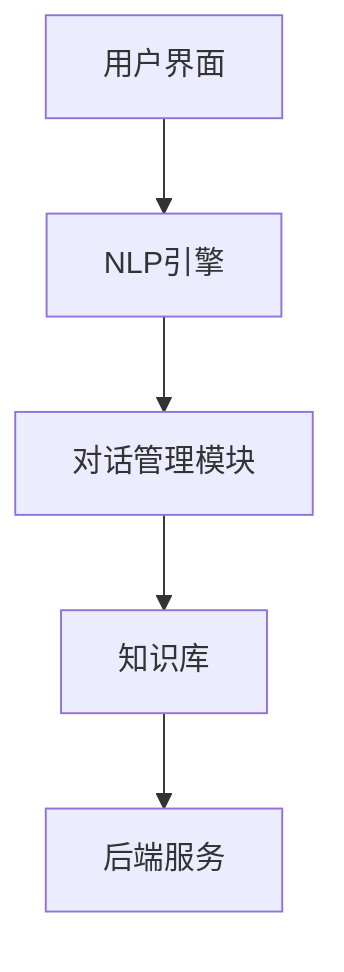
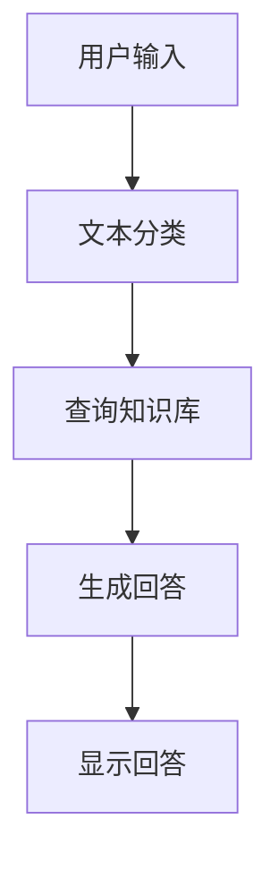
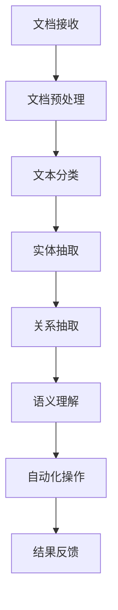
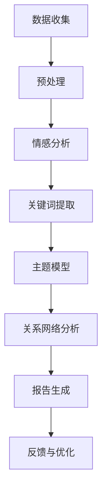
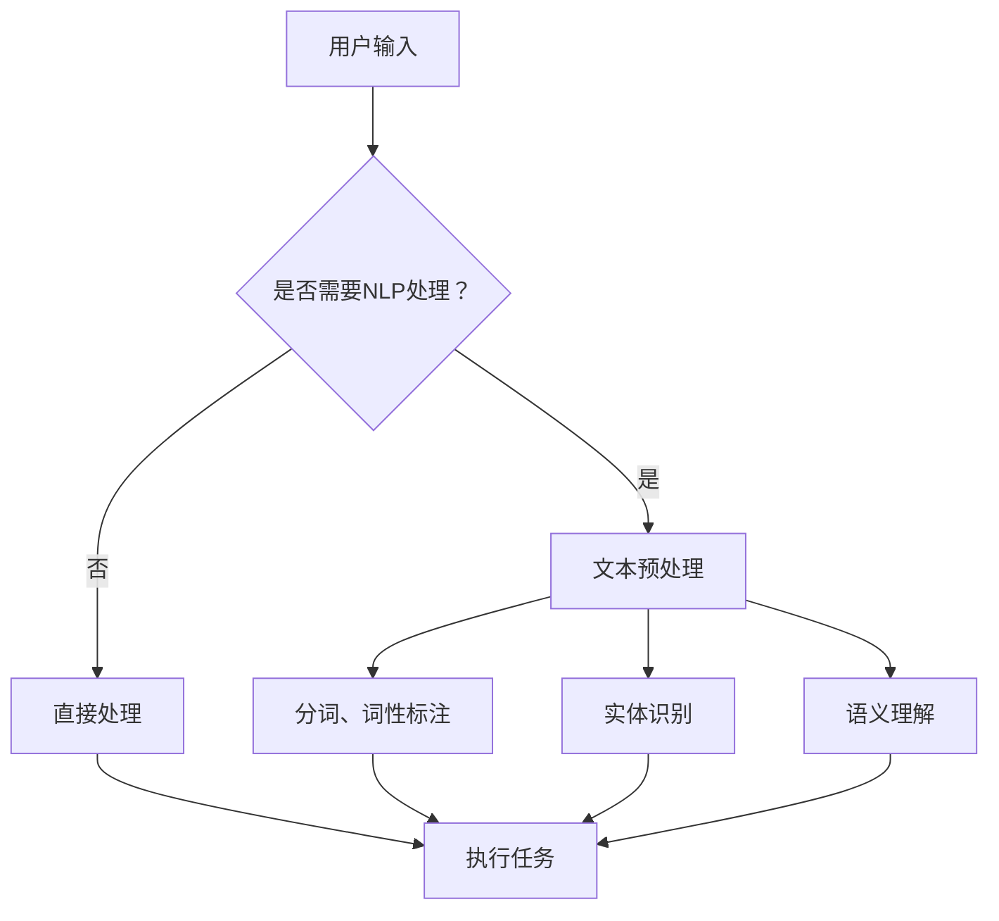
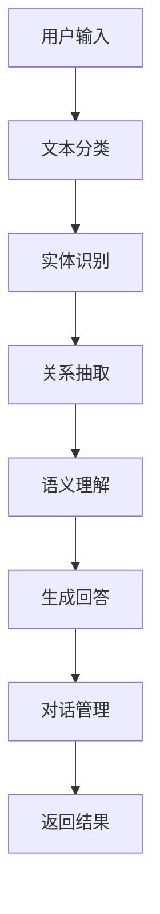

                 

### 文章标题：AI人工智能代理工作流AI Agent WorkFlow：自然语言处理在工作流中的应用

> 关键词：人工智能代理、工作流、自然语言处理、AI Agent、NLP、流程设计

> 摘要：本文将探讨人工智能代理（AI Agent）与工作流（WorkFlow）的结合，特别是自然语言处理（NLP）技术在其中的应用。我们将深入分析AI代理的定义、特性及在日常工作中的应用，阐述工作流的基本概念、结构以及NLP技术的工作原理。随后，我们将讨论自然语言处理技术的基础知识，包括语言模型、文本分类与情感分析、实体识别与关系抽取、语义理解与生成等。接着，我们将详细阐述AI代理工作流的设计原则、开发步骤和部署维护策略。通过实际案例，我们将展示NLP技术在智能客服系统、智能文档处理系统和智能数据挖掘与分析系统中的应用。最后，我们将展望AI代理与NLP技术的未来发展趋势，提供相关资源、参考文献以及开发环境搭建指南。

### 目录大纲

1. **引言与概述**
2. **AI代理与工作流基础**
   - **AI代理的定义与特性**
   - **工作流的概念与结构**
   - **自然语言处理（NLP）在AI代理中的应用**
3. **自然语言处理技术**
   - **语言模型**
   - **文本分类与情感分析**
   - **实体识别与关系抽取**
   - **语义理解与生成**
4. **AI代理工作流设计**
   - **AI代理工作流设计原则**
   - **AI代理工作流的开发步骤**
   - **AI代理工作流的部署与维护**
5. **案例研究**
   - **智能客服系统**
   - **智能文档处理系统**
   - **智能数据挖掘与分析系统**
6. **前沿技术展望**
7. **附录**
   - **附录A：NLP与AI代理相关资源**
   - **附录B：参考文献**
   - **附录C：Mermaid流程图**
   - **附录D：核心算法伪代码**
   - **附录E：项目实战案例**
   - **附录F：开发环境搭建指南**
   - **附录G：代码解读与分析**

### 第一部分：引言与概述

在当今快速发展的科技时代，人工智能（AI）已经深入到我们日常生活的方方面面。从智能家居到自动驾驶，从智能客服到智能医疗，AI技术的广泛应用使得我们的生活变得更加便捷和高效。然而，随着AI技术的不断进步，如何将AI技术与实际工作流程相结合，以实现更加智能化和自动化的工作环境，成为了一个重要的研究方向。

本文旨在探讨人工智能代理（AI Agent）与工作流（WorkFlow）的结合，特别是自然语言处理（NLP）技术在其中的应用。通过深入分析AI代理的定义、特性及在日常工作中的应用，阐述工作流的基本概念、结构以及NLP技术的工作原理，我们将探讨如何利用NLP技术优化AI代理的工作流设计，提高工作效率和准确性。

文章的结构如下：

- **第一部分：引言与概述**：介绍AI代理与工作流的基础知识，为后续内容打下基础。
- **第二部分：AI代理与工作流基础**：详细探讨AI代理的定义与特性，工作流的概念与结构，以及NLP技术在AI代理中的应用。
- **第三部分：自然语言处理技术**：介绍NLP技术的基础知识，包括语言模型、文本分类与情感分析、实体识别与关系抽取、语义理解与生成等。
- **第四部分：AI代理工作流设计**：阐述AI代理工作流的设计原则、开发步骤和部署维护策略。
- **第五部分：案例研究**：通过实际案例展示NLP技术在智能客服系统、智能文档处理系统和智能数据挖掘与分析系统中的应用。
- **第六部分：前沿技术展望**：探讨AI代理与NLP技术的未来发展趋势。
- **第七部分：附录**：提供相关资源、参考文献以及开发环境搭建指南。

通过本文的探讨，我们希望读者能够深入了解AI代理与工作流结合的重要性，掌握NLP技术的基础知识，并学会如何将NLP技术应用于实际工作流中，以实现更加智能化和自动化的工作环境。

### AI代理的定义与特性

AI代理（AI Agent）是指具有自主决策能力，能够在特定环境中执行任务的智能系统。与传统的自动化工具不同，AI代理不仅能够执行预定义的任务，还能够根据环境和目标自主调整行为，以实现最优的结果。AI代理的基本概念可以追溯到人工智能领域的一个经典问题——“哥德尔不完备性定理”，该定理指出，在任何足够复杂的数学系统中，都存在某些命题既不能被证明也不能被证伪。这一理论启示了研究者，在复杂的环境中，我们需要构建具有自我调整能力的系统，以便在不确定性和动态变化的环境中保持高效运行。

AI代理的特性主要包括以下几个方面：

1. **自主性**：AI代理能够根据环境的变化和任务的需求自主决策。这种自主性使得AI代理能够在不需要人为干预的情况下执行复杂任务，从而提高工作效率和灵活性。
   
2. **适应性**：AI代理能够根据执行任务时的反馈不断调整自身的行为，以适应不同的环境和需求。这种适应性使得AI代理能够在面对未知或突发情况时，依然能够保持高效运行。

3. **合作性**：在某些场景中，多个AI代理可能需要协同工作以完成任务。AI代理的合作性使得它们能够相互通信和协调，从而实现更加复杂和高效的任务执行。

4. **自主学习和进化**：AI代理能够通过学习历史数据和经验，不断优化自身的行为。这种自主学习和进化能力使得AI代理能够适应长期变化和复杂环境。

AI代理的典型应用场景包括：

1. **智能客服系统**：AI代理可以模拟人类客服，与用户进行自然语言对话，解答用户问题，提供个性化服务。通过NLP技术，AI代理能够理解用户的语言，并提供准确的回答，从而提高客户满意度和效率。

2. **智能文档处理系统**：AI代理可以自动处理各种文档，包括文本分类、实体抽取、语义理解等。通过NLP技术，AI代理能够快速准确地处理大量文档，提高工作效率和质量。

3. **智能数据挖掘与分析系统**：AI代理可以自动挖掘和分析数据，发现数据中的模式和趋势，为决策提供支持。通过NLP技术，AI代理能够理解数据中的语言信息，从而提供更深入的分析。

4. **智能医疗系统**：AI代理可以协助医生进行疾病诊断和治疗方案推荐。通过NLP技术，AI代理能够分析病历记录和医学文献，提供准确和个性化的医疗建议。

与传统自动化工具相比，AI代理具有以下优势：

1. **灵活性和适应性**：传统自动化工具通常只能执行固定的任务，而AI代理能够根据环境和任务需求进行自适应调整，从而应对复杂和多变的环境。

2. **自主学习和进化**：传统自动化工具需要人为编写脚本或程序进行控制，而AI代理能够通过学习和进化不断优化自身行为，从而实现更高效和精准的任务执行。

3. **人类交互**：传统自动化工具通常缺乏人类交互能力，而AI代理能够通过自然语言处理技术，与人类进行有效沟通，提供更自然和人性化的服务。

总的来说，AI代理作为一种具有自主性、适应性、合作性和自主学习能力的智能系统，已经在各个领域展示了其强大的潜力和优势。随着NLP技术的不断进步，AI代理将在更多场景中得到广泛应用，为人们带来更加智能化和便捷的生活。

### 工作流的概念与结构

工作流（WorkFlow）是一种用于描述和组织任务执行过程的模型或工具。它通过定义一系列任务、规则和决策路径，将资源、任务和人员进行有效组织和协调，从而实现业务过程的自动化和优化。工作流的概念可以追溯到20世纪80年代，当时它被引入用于自动化文档处理和业务流程管理。随着计算机技术和人工智能的发展，工作流的应用范围不断扩大，逐渐成为各类组织和企业优化运营的重要手段。

工作流的基本组件包括：

1. **任务（Task）**：工作流中最小的执行单元，通常表示一项具体的操作或活动。任务可以是人工操作，也可以是系统自动执行的操作，如数据抽取、数据清洗、数据处理等。

2. **活动（Activity）**：工作流中的一个或多个任务的组合，用于实现特定的业务功能。活动可以是独立的，也可以是嵌套的，用于处理复杂任务。

3. **角色（Role）**：工作流中负责执行任务的人员或系统。角色通常具有特定的职责和权限，可以是一个单独的个体，也可以是一个团队或组织。

4. **规则（Rule）**：工作流中用于定义任务执行条件和流程转移的逻辑规则。规则可以是简单的条件判断，也可以是复杂的决策逻辑，如基于数据分析和机器学习的智能规则。

5. **流程（Process）**：工作流的整体结构，由一系列任务、活动、角色和规则组成，用于描述业务过程的执行路径。流程可以是一条线性路径，也可以是分支或循环路径，以适应不同的业务场景。

常见的工作流类型包括：

1. **顺序工作流**：任务按照顺序依次执行，前一任务完成后，才会启动下一任务。

2. **并行工作流**：多个任务同时执行，每个任务独立完成，最终合并结果。

3. **条件工作流**：根据条件判断任务执行路径，不同条件对应不同的执行路径。

4. **循环工作流**：任务重复执行，直到满足特定条件或达到预设次数。

5. **组合工作流**：由多个不同类型的工作流组合而成，以实现更复杂的业务流程。

自然语言处理（NLP）技术在AI代理中的应用

自然语言处理（NLP）是一种使计算机能够理解、生成和处理人类自然语言的技术。NLP技术在AI代理中的应用，使得AI代理能够与人类进行自然语言交互，从而实现更高效和人性化的工作流程。

以下是NLP技术在AI代理中的应用场景：

1. **智能客服系统**：AI代理通过NLP技术，可以理解用户的自然语言提问，并生成自然语言回答。这种方式不仅提高了客服的响应速度和准确性，还降低了人力成本。

2. **智能文档处理系统**：AI代理可以通过NLP技术，对文档进行文本分类、实体抽取、语义理解等操作，从而实现自动化文档处理。这种方式提高了文档处理效率，减少了人工干预。

3. **智能数据挖掘与分析系统**：AI代理可以通过NLP技术，对大量文本数据进行情感分析、关键词提取等操作，从而发现数据中的模式和趋势，为决策提供支持。

4. **智能医疗系统**：AI代理可以通过NLP技术，分析病历记录和医学文献，辅助医生进行疾病诊断和治疗方案推荐。

总的来说，NLP技术的引入，使得AI代理的工作流更加智能化和人性化。通过自然语言交互，AI代理能够更好地理解用户需求，提供更精准的服务；通过文本处理和分析，AI代理能够更好地处理业务数据，为决策提供支持。随着NLP技术的不断进步，AI代理将在更多领域发挥重要作用，推动工作流程的优化和升级。

### 自然语言处理技术基础

自然语言处理（NLP）是人工智能（AI）的一个重要分支，旨在使计算机能够理解、生成和处理人类自然语言。NLP技术在AI代理中的应用至关重要，它使得AI代理能够与人类进行自然语言交互，从而实现更高效和人性化的工作流程。在本节中，我们将探讨NLP技术的基础知识，包括语言模型、文本分类与情感分析、实体识别与关系抽取、语义理解与生成等。

#### 语言模型

语言模型（Language Model）是NLP的核心技术之一，它用于预测一段文本的下一个词或词组。语言模型的基本原理是基于大规模文本数据，通过统计方法或深度学习算法，学习文本中的语言规律。语言模型在NLP中的应用非常广泛，包括但不限于文本生成、语音识别、机器翻译等。

1. **基本概念**
   - **n-gram模型**：n-gram模型是最简单的语言模型，它通过统计相邻n个单词的联合概率来预测下一个单词。例如，给定前三个单词“人工智能”，n-gram模型会计算这四个单词的联合概率，从而预测下一个单词。
   - **神经网络语言模型**：神经网络语言模型（如Word2Vec、GloVe）通过将单词映射到高维向量空间，来学习单词之间的关系和语义信息。这种模型可以捕捉到单词的上下文信息，从而提高预测的准确性。

2. **应用场景**
   - **文本生成**：语言模型可以用于生成文章、摘要、对话等文本内容。例如，生成文本摘要可以帮助用户快速了解文章的主要内容。
   - **语音识别**：在语音识别系统中，语言模型用于将语音信号转换为文本，从而提高识别的准确率。

#### 文本分类与情感分析

文本分类（Text Classification）是一种将文本数据分配到预定义类别中的技术。情感分析（Sentiment Analysis）是一种特殊的文本分类任务，用于判断文本的情感倾向，如正面、负面或中性。

1. **基本方法**
   - **基于规则的方法**：通过定义一系列规则，将文本映射到预定义的类别。这种方法通常用于处理简单的问题，如垃圾邮件过滤。
   - **基于统计的方法**：通过统计文本中单词的频率或TF-IDF（词频-逆文档频率）值，来训练分类模型。这种方法可以处理更复杂的文本分类问题。
   - **基于深度学习的方法**：使用深度神经网络（如卷积神经网络（CNN）、循环神经网络（RNN））进行文本分类。这种方法可以捕捉到文本中的复杂结构和语义信息。

2. **应用场景**
   - **社交媒体分析**：通过情感分析，可以了解用户对某个品牌、产品或事件的情感倾向，从而为市场营销提供指导。
   - **客户反馈分析**：通过对客户反馈进行分类，可以识别出客户的主要需求和问题，从而改进产品和服务。

#### 实体识别与关系抽取

实体识别（Named Entity Recognition, NER）是一种从文本中识别出特定类型实体（如人名、地名、组织名等）的技术。关系抽取（Relation Extraction）是一种从文本中识别出实体之间关系的技术。

1. **基本方法**
   - **基于规则的方法**：通过定义一系列规则，将文本中的实体和关系映射到预定义的类别。这种方法通常用于处理简单的实体识别和关系抽取任务。
   - **基于统计的方法**：通过统计实体和关系在文本中的共现频率，来训练分类模型。这种方法可以处理更复杂的实体识别和关系抽取任务。
   - **基于深度学习的方法**：使用深度神经网络，如卷积神经网络（CNN）、循环神经网络（RNN）、图神经网络（Graph Neural Network），进行实体识别和关系抽取。这种方法可以捕捉到文本中的复杂结构和语义信息。

2. **应用场景**
   - **信息抽取**：通过实体识别和关系抽取，可以从大量文本中提取出关键信息，如人名、地点、事件等。
   - **知识图谱构建**：通过实体识别和关系抽取，可以构建出丰富的知识图谱，为智能问答、推荐系统等应用提供支持。

#### 语义理解与生成

语义理解（Semantic Understanding）是一种从文本中提取出语义信息的技术。语义生成（Semantic Generation）是一种根据语义信息生成文本的技术。

1. **基本方法**
   - **语义角色标注**：通过标注文本中的语义角色（如主语、谓语、宾语等），来理解文本中的语义结构。
   - **语义角色抽取**：通过识别文本中的实体和关系，来提取出文本的语义信息。
   - **语义文本生成**：通过将语义信息映射到文本，来生成符合语义的文本。

2. **应用场景**
   - **智能问答**：通过语义理解，可以构建出智能问答系统，回答用户关于特定领域的问题。
   - **文本生成**：通过语义生成，可以生成符合语义要求的文章、摘要、对话等文本内容。

总的来说，NLP技术为AI代理提供了强大的语言处理能力，使得AI代理能够更好地理解人类语言，实现更加智能化的工作流程。随着NLP技术的不断进步，AI代理将在各个领域发挥越来越重要的作用，为人们带来更加便捷和高效的生活体验。

#### 语言模型

语言模型（Language Model）是自然语言处理（NLP）的核心技术之一，它用于预测一段文本的下一个词或词组。语言模型的基本概念可以追溯到统计语言模型，如n-gram模型，但现代语言模型更多地依赖于深度学习算法，如神经网络语言模型（如Word2Vec、GloVe）。

1. **基本概念**
   - **n-gram模型**：n-gram模型是最简单的语言模型，它通过统计相邻n个单词的联合概率来预测下一个单词。例如，给定前三个单词“人工智能”，n-gram模型会计算这四个单词的联合概率，从而预测下一个单词。
   - **神经网络语言模型**：神经网络语言模型（如Word2Vec、GloVe）通过将单词映射到高维向量空间，来学习单词之间的关系和语义信息。这种模型可以捕捉到单词的上下文信息，从而提高预测的准确性。

2. **语言模型的类型**
   - **基于规则的语言模型**：基于规则的语言模型通过定义一系列语法规则来预测下一个词。这种方法简单直观，但难以处理复杂的语言结构。
   - **基于统计的语言模型**：基于统计的语言模型通过统计文本中单词的频率和共现关系来预测下一个词。这种方法的准确性较高，但需要大量的训练数据。
   - **基于神经网络的模型**：基于神经网络的模型（如循环神经网络（RNN）、长短期记忆网络（LSTM）、Transformer等）通过学习文本中的上下文信息来预测下一个词。这种模型能够捕捉到更复杂的语言规律，从而提高预测的准确性。

3. **应用场景**
   - **文本生成**：语言模型可以用于生成文章、摘要、对话等文本内容。例如，生成文本摘要可以帮助用户快速了解文章的主要内容。
   - **语音识别**：在语音识别系统中，语言模型用于将语音信号转换为文本，从而提高识别的准确率。

#### 语言模型在AI代理中的应用

语言模型在AI代理中的应用非常广泛，以下是一些典型的应用场景：

1. **智能客服系统**：AI代理通过语言模型可以理解用户的自然语言提问，并生成自然语言回答。这种方式不仅提高了客服的响应速度和准确性，还降低了人力成本。

2. **智能文档处理系统**：AI代理可以通过语言模型对文档进行语义理解，从而实现自动化文档处理。例如，自动分类文档、提取关键信息等。

3. **智能数据挖掘与分析系统**：AI代理可以通过语言模型对大量文本数据进行情感分析、关键词提取等操作，从而发现数据中的模式和趋势，为决策提供支持。

4. **智能医疗系统**：AI代理可以通过语言模型分析病历记录和医学文献，辅助医生进行疾病诊断和治疗方案推荐。

总的来说，语言模型作为NLP技术的重要组成部分，为AI代理提供了强大的语言处理能力，使得AI代理能够更好地理解人类语言，实现更加智能化的工作流程。随着深度学习算法的不断进步，语言模型的性能将得到进一步提升，为AI代理的应用带来更多可能性。

#### 文本分类与情感分析

文本分类（Text Classification）和情感分析（Sentiment Analysis）是自然语言处理（NLP）中非常重要的两个领域，它们在AI代理工作流中的应用极大地提升了信息处理的效率和质量。

1. **文本分类**
   - **基本方法**：
     - **基于规则的方法**：通过定义一系列规则，将文本映射到预定义的类别。这种方法简单直观，但难以处理复杂的文本分类问题。
     - **基于统计的方法**：通过统计文本中单词的频率或TF-IDF（词频-逆文档频率）值，来训练分类模型。这种方法可以处理更复杂的文本分类问题。
     - **基于深度学习的方法**：使用深度神经网络（如卷积神经网络（CNN）、循环神经网络（RNN））进行文本分类。这种方法可以捕捉到文本中的复杂结构和语义信息。
   - **应用场景**：
     - **社交媒体分析**：通过情感分析，可以了解用户对某个品牌、产品或事件的情感倾向，从而为市场营销提供指导。
     - **客户反馈分析**：通过对客户反馈进行分类，可以识别出客户的主要需求和问题，从而改进产品和服务。
     - **新闻分类**：自动分类新闻文章，帮助用户快速找到感兴趣的内容。

2. **情感分析**
   - **基本方法**：
     - **基于词典的方法**：通过预定义的词典，将文本中的情感词汇映射到情感标签。这种方法简单高效，但需要对词典进行不断更新和维护。
     - **基于机器学习的方法**：通过训练分类模型，自动识别文本的情感倾向。这种方法可以处理更复杂的情感分析问题。
     - **基于深度学习的方法**：使用深度神经网络（如LSTM、GRU、BERT）进行情感分析。这种方法能够捕捉到文本中的复杂语义信息。
   - **应用场景**：
     - **产品评价分析**：通过情感分析，可以了解用户对产品的评价，从而指导产品改进。
     - **舆情监测**：通过分析社交媒体上的用户评论，可以及时了解公众对某个事件或产品的看法。
     - **智能客服**：通过情感分析，AI代理可以更好地理解用户的情感状态，提供更加个性化的服务。

3. **文本分类与情感分析在工作流中的应用**
   - **需求分析**：通过文本分类和情感分析，可以对用户反馈进行分类和情感分析，从而快速了解用户的需求和情感状态。
   - **流程优化**：根据分析结果，可以调整工作流中的任务分配和决策规则，从而优化工作流程，提高工作效率和用户满意度。
   - **智能决策支持**：通过分析文本数据中的模式和趋势，可以为决策提供支持，帮助企业制定更加科学和有效的策略。

总之，文本分类与情感分析作为NLP技术的重要组成部分，在AI代理工作流中的应用极大地提升了信息处理的效率和质量，为智能化工作流的实现提供了有力支持。随着NLP技术的不断进步，文本分类与情感分析的应用将更加广泛和深入。

#### 实体识别与关系抽取

实体识别（Named Entity Recognition, NER）和关系抽取（Relation Extraction）是自然语言处理（NLP）中的关键任务，它们在AI代理工作流中发挥着重要作用。实体识别旨在从文本中识别出特定的实体（如人名、地名、组织名、地点等），而关系抽取则致力于发现这些实体之间的关系（如“公司成立于某年”、“城市属于某个国家”等）。

1. **基本方法**
   - **基于规则的方法**：通过定义一系列规则，将文本中的实体和关系映射到预定义的类别。这种方法简单直观，但难以处理复杂的文本。
   - **基于统计的方法**：通过统计实体和关系在文本中的共现频率，来训练分类模型。这种方法可以处理更复杂的实体识别和关系抽取任务。
   - **基于深度学习的方法**：使用深度神经网络（如卷积神经网络（CNN）、循环神经网络（RNN））进行实体识别和关系抽取。这种方法能够捕捉到文本中的复杂结构和语义信息。

2. **应用场景**
   - **信息抽取**：通过实体识别和关系抽取，可以从大量文本中提取出关键信息，如人名、地点、事件等。
   - **知识图谱构建**：通过实体识别和关系抽取，可以构建出丰富的知识图谱，为智能问答、推荐系统等应用提供支持。
   - **文本摘要**：利用实体识别和关系抽取，可以生成更加准确和高效的文本摘要。

3. **技术挑战**
   - **多语言支持**：实体识别和关系抽取在不同语言中存在差异，需要针对不同语言设计相应的模型和算法。
   - **长文本处理**：长文本中的实体和关系往往更加复杂，需要设计高效的算法来处理。
   - **动态实体识别**：在实时应用场景中，实体和关系的识别需要快速和准确，这对系统的响应速度和处理能力提出了更高的要求。

通过在AI代理工作流中应用实体识别和关系抽取技术，可以大幅提升信息处理和知识管理的效率，为智能化工作流的实现提供坚实的技术支持。

#### 语义理解与生成

语义理解（Semantic Understanding）与语义生成（Semantic Generation）是自然语言处理（NLP）中的两个重要方面，它们在AI代理工作流中扮演着至关重要的角色。语义理解旨在从文本中提取出其深层语义信息，而语义生成则是根据提取的语义信息生成新的文本内容。

1. **语义理解**
   - **基本原理**：语义理解的核心任务是从文本中识别和理解其语义结构，包括句法结构、语义角色标注和实体识别等。常见的实现方法有：
     - **句法分析**：通过分析句子的结构，理解其语法规则，从而提取出句子的语义信息。
     - **语义角色标注**：为句子中的每个词赋予其在句子中的语义角色（如主语、谓语、宾语等），从而理解句子的整体语义。
     - **实体识别**：从文本中识别出特定类型的实体（如人名、地名、组织名等），并标注其具体信息。
   - **应用场景**：语义理解在AI代理中的应用广泛，包括智能问答、文本摘要、信息抽取等。通过语义理解，AI代理能够更准确地理解和处理用户的查询，提供个性化的服务。

2. **语义生成**
   - **基本原理**：语义生成是通过提取文本中的语义信息，生成符合语义要求的文本内容。常见的实现方法有：
     - **文本摘要**：将长文本简化为短文本，同时保留关键信息。
     - **对话生成**：根据用户的输入，生成自然语言回答。
     - **文本补全**：根据部分已知的文本，生成完整的文本内容。
   - **应用场景**：语义生成在AI代理中的应用包括自动写作、智能客服、内容推荐等。通过语义生成，AI代理能够生成更加自然和连贯的文本内容，提高用户体验。

3. **技术挑战**
   - **语义歧义**：自然语言中存在大量的歧义现象，语义理解需要能够处理这些歧义，准确理解文本的真正意图。
   - **上下文理解**：语义理解需要能够理解上下文信息，从而生成与上下文相符的语义内容。
   - **生成文本的质量**：语义生成需要生成高质量、连贯且符合语义要求的文本内容，这对生成算法提出了较高的要求。

通过在AI代理工作流中应用语义理解与生成技术，可以大幅提升AI代理的自然语言处理能力，实现更加智能化和人性化的工作流。随着NLP技术的不断进步，这些技术将在更多场景中得到广泛应用，为人们带来更加便捷和高效的生活体验。

### AI代理工作流设计原则

设计高效的AI代理工作流是实现智能化和自动化工作的关键。为了确保工作流的设计能够满足实际需求，同时具备灵活性和可扩展性，我们需要遵循一系列设计原则。以下将详细阐述这些设计原则：

1. **模块化设计**

   模块化设计是将工作流分解为一系列独立的模块，每个模块负责特定的功能。这种方法有以下几个优点：

   - **提高可维护性**：模块化设计使得工作流中的每个部分都可以独立开发和维护，降低了系统的复杂度。
   - **提高可扩展性**：通过添加或替换模块，可以方便地扩展工作流的功能，以适应新的需求。
   - **增强可复用性**：模块可以跨不同工作流复用，从而提高开发效率。

2. **可扩展性设计**

   可扩展性设计是指工作流应能够适应不同的规模和需求变化。具体原则包括：

   - **松耦合**：模块之间应保持松耦合，即模块之间的依赖性应尽量减少。这样可以确保在增加或替换模块时，不会对其他模块造成影响。
   - **弹性扩展**：系统应具备弹性扩展的能力，例如通过使用云计算资源，可以根据需求动态调整计算资源，从而提高系统的处理能力。
   - **模块化API**：工作流中的每个模块应提供标准的API接口，以便与其他模块进行通信和集成。

3. **灵活性与适应性**

   灵活性和适应性是确保工作流能够应对不同环境和需求变化的关键。以下是一些设计原则：

   - **动态调整**：工作流应能够根据实际情况动态调整任务执行路径和资源分配，以适应变化的需求。
   - **错误处理**：系统应具备良好的错误处理机制，能够自动识别和处理异常情况，确保工作流的连续性和稳定性。
   - **用户自定义**：工作流应允许用户根据自身需求自定义部分或全部流程，以提高系统的适用性。

4. **可测试性和可监控性**

   可测试性和可监控性是确保工作流稳定运行的重要保障。以下是一些设计原则：

   - **单元测试**：每个模块应具备完整的单元测试，确保其功能正确无误。
   - **集成测试**：工作流应进行集成测试，验证模块之间的协作和整体性能。
   - **监控与日志**：系统应具备实时监控和日志记录功能，以便及时发现和解决问题。

5. **安全性与隐私保护**

   在设计AI代理工作流时，安全性与隐私保护是必须考虑的重要因素。以下是一些设计原则：

   - **数据加密**：对传输和存储的数据进行加密处理，防止数据泄露。
   - **身份验证与授权**：确保只有授权用户可以访问系统和数据，防止未授权访问。
   - **安全审计**：对系统的操作进行审计，确保所有操作都能追溯和监控。

通过遵循上述设计原则，我们可以设计出高效、灵活、安全和可扩展的AI代理工作流，从而实现智能化和自动化的工作环境。随着AI代理技术的不断发展，这些原则将不断演变和优化，以适应更复杂的业务场景和更高的性能要求。

### AI代理工作流的开发步骤

开发一个高效的AI代理工作流需要经过一系列明确的步骤，从需求分析、工作流设计到实现和测试。以下是详细的开发步骤：

#### 1. 需求分析

需求分析是整个开发过程的基础，旨在明确项目目标和用户需求。以下是一些关键步骤：

- **确定项目目标**：明确工作流要解决的核心问题，如自动化数据处理、提高客服响应速度等。
- **用户访谈**：通过与用户进行深入交流，了解他们的具体需求和工作流程。
- **场景模拟**：通过模拟不同的工作场景，分析可能遇到的问题和解决方案。
- **需求文档**：将收集到的需求整理成文档，包括功能需求、性能需求和用户体验需求等。

#### 2. 工作流设计

工作流设计是将需求转化为具体的工作流程和系统架构的过程。以下是一些关键步骤：

- **流程图设计**：使用Mermaid等工具绘制工作流流程图，明确各个任务和模块之间的依赖关系和执行顺序。
- **模块划分**：将工作流划分为多个独立模块，每个模块负责特定的功能，如数据提取、数据清洗、数据处理等。
- **决策树设计**：对于包含条件判断的任务，设计决策树或规则引擎，确保流程能够根据不同情况作出正确的决策。
- **接口设计**：设计模块之间的接口，确保数据传输和通信的顺畅。

#### 3. 工作流实现

工作流实现是将设计阶段的工作流转化为实际运行的系统。以下是一些关键步骤：

- **技术选型**：根据需求和工作流设计，选择合适的编程语言、框架和库。
- **代码编写**：根据设计文档和流程图，编写具体的代码实现。以下是一个简单的伪代码示例：

  ```python
  # 数据提取模块
  def extract_data(source):
      # 从数据源提取数据
      pass

  # 数据清洗模块
  def clean_data(data):
      # 清洗数据
      pass

  # 数据处理模块
  def process_data(data):
      # 处理数据
      pass

  # 主工作流
  def main_flow():
      data = extract_data(source)
      cleaned_data = clean_data(data)
      processed_data = process_data(cleaned_data)
      return processed_data
  ```

- **集成测试**：对每个模块进行集成测试，确保它们能够正确协作。

#### 4. 工作流测试与优化

测试和优化是确保工作流稳定运行和高效执行的重要步骤。以下是一些关键步骤：

- **单元测试**：对每个模块进行独立的单元测试，确保其功能正确无误。
- **集成测试**：对整个工作流进行集成测试，确保各个模块之间的协作和整体性能。
- **性能测试**：通过压力测试和负载测试，评估工作流的性能，确保其能够满足性能要求。
- **优化**：根据测试结果，对工作流进行优化，提高其执行效率和稳定性。

通过上述开发步骤，我们可以实现一个高效、稳定和可扩展的AI代理工作流，从而满足用户的需求，提高工作效率和质量。

### AI代理工作流的部署与维护

在完成AI代理工作流的开发和测试后，下一步便是部署和维护。这一阶段至关重要，因为它决定了工作流在实际运行中的性能和稳定性。

#### 部署策略

1. **环境配置**：确保部署环境与开发环境一致，包括操作系统、编程语言、框架和依赖库等。可以使用容器化技术（如Docker）来确保环境的一致性。
2. **部署方案**：根据工作流的具体需求和资源情况，选择合适的部署方案。常见的部署方案包括：
   - **单机部署**：适用于小型工作流，所有组件和模块在同一台服务器上运行。
   - **分布式部署**：适用于大规模工作流，组件和模块分布在不同服务器上，通过负载均衡和分布式计算提高性能。
3. **持续集成与持续部署（CI/CD）**：通过自动化工具（如Jenkins、GitLab CI）实现代码的持续集成和部署，确保新版本能够快速且安全地交付。

#### 维护与管理

1. **日志管理**：日志是监控系统运行状态和排查问题的重要依据。应确保日志信息的完整性和可追溯性，并使用日志分析工具（如ELK Stack）进行实时监控和报警。
2. **性能监控**：定期进行性能监控，评估工作流的响应时间和资源使用情况。使用性能监控工具（如Prometheus、Grafana）进行实时监控和可视化分析。
3. **维护与升级**：
   - **定期维护**：定期检查系统状态，更新依赖库和框架，修复已知漏洞。
   - **安全防护**：对系统进行安全防护，包括数据加密、权限管理和安全审计等。
   - **版本控制**：使用版本控制系统（如Git）管理代码和配置文件，确保版本的可追溯性和可回滚性。

#### 性能监控与优化

1. **性能指标**：确定关键性能指标（KPI），如响应时间、吞吐量、资源利用率等，用于评估系统性能。
2. **调优策略**：
   - **代码优化**：通过代码审查和性能测试，识别和修复性能瓶颈。
   - **资源配置**：根据性能监控结果，调整服务器配置和资源分配，提高系统性能。
   - **缓存策略**：使用缓存技术（如Redis、Memcached）减少数据访问时间，提高系统响应速度。

通过科学的部署策略和维护管理，结合有效的性能监控与优化，可以确保AI代理工作流在实际运行中的高效和稳定，从而实现长期的价值和效益。

### 案例研究：智能客服系统

智能客服系统是AI代理在自然语言处理领域中的一个重要应用。通过自然语言处理（NLP）技术，智能客服系统能够自动理解用户的问题，并生成适当的回答，从而提供高效、准确的客户服务。

#### 系统架构设计

智能客服系统的架构设计通常包括以下几个主要模块：

1. **用户界面（UI）**：用于接收用户输入，展示系统生成的回答。
2. **自然语言处理（NLP）引擎**：负责处理用户的自然语言输入，包括文本分类、实体识别、语义理解等。
3. **对话管理模块**：负责管理对话流程，包括上下文管理、对话状态跟踪等。
4. **知识库**：存储预定义的答案和知识信息，供NLP引擎查询和引用。
5. **后端服务**：处理与业务系统的交互，如订单查询、账单处理等。

以下是一个简化的智能客服系统架构图：



#### NLP技术的应用

1. **文本分类**：将用户输入的文本分类到预定义的类别中，如“账单查询”、“产品咨询”、“投诉反馈”等。通过文本分类，NLP引擎可以快速确定用户的问题类型，从而调用相应的知识库或服务模块。

2. **实体识别**：从用户输入的文本中提取关键信息，如人名、地点、时间等。这些实体信息有助于NLP引擎更准确地理解用户的问题，并生成相应的回答。

3. **语义理解**：通过分析用户输入的语义，NLP引擎可以理解用户的意图和需求。例如，用户输入“我想要查询最近的账单”，NLP引擎需要理解“账单”、“查询”、“最近”等关键词，并生成相应的查询命令。

4. **对话管理**：对话管理模块负责维护对话的上下文信息，确保对话的连贯性和一致性。通过上下文管理，系统可以理解用户连续输入的问题，并生成合理的回答。

#### 工作流设计思路

智能客服系统的工作流设计思路如下：

1. **用户输入**：用户通过UI界面输入问题，如“我想要查询最近的账单”。
2. **文本分类**：NLP引擎将用户输入的文本分类到“账单查询”类别，并提取关键实体信息，如用户名和账单日期。
3. **查询知识库**：NLP引擎查询知识库，找到与用户问题相关的答案或命令。
4. **生成回答**：NLP引擎生成回答，如“以下是您最近的账单详情：[账单内容]”。
5. **显示回答**：UI界面将生成的回答展示给用户。

以下是一个简化的工作流流程图：



通过上述设计，智能客服系统可以高效地处理用户问题，提供准确、快速的回答，从而提升客户满意度。

#### 案例研究：智能文档处理系统

智能文档处理系统是AI代理在自然语言处理领域中的另一个重要应用。通过NLP技术，智能文档处理系统可以自动处理各种文档，包括文本分类、实体抽取、语义理解等，从而提高文档处理效率和准确性。

##### 文档处理需求分析

在许多企业和组织中，文档处理是一个耗时且繁重的工作。传统的文档处理方式主要依赖于人工操作，不仅效率低下，而且容易出现错误。智能文档处理系统旨在通过自动化和智能化技术，提高文档处理的效率和质量。

主要需求分析包括以下几个方面：

1. **文档分类**：自动将收到的文档分类到预定义的类别中，如“财务报告”、“客户合同”、“市场分析报告”等。
2. **实体抽取**：从文档中提取关键信息，如人名、地点、时间、金额等。
3. **语义理解**：理解文档中的语义信息，例如提取关键事件、结论和建议。
4. **自动化操作**：根据抽取的信息，自动执行相应的操作，如生成报告、发送通知、更新数据库等。

##### NLP技术的应用

智能文档处理系统中的应用NLP技术主要包括以下方面：

1. **文本分类**：通过训练分类模型，对文档进行自动分类。常见的分类算法包括朴素贝叶斯、支持向量机（SVM）和深度学习模型（如CNN、RNN）。

2. **实体识别**：使用命名实体识别（NER）技术，从文档中识别出人名、地名、时间、组织名等关键实体。常用的NER工具包括Stanford NER、SpaCy和BERT等。

3. **关系抽取**：通过分析实体之间的语义关系，如“某个公司在某个时间完成了某个项目”，从文档中提取出实体之间的关系。关系抽取可以使用规则方法或基于深度学习的算法实现。

4. **语义理解**：使用语义角色标注和语义解析技术，理解文档中的深层语义信息，例如提取事件、意图和结论。常用的语义理解模型包括BERT、GPT和ELMo等。

##### 工作流设计思路

智能文档处理系统的工作流设计思路如下：

1. **文档接收**：系统接收新文档，可以是电子邮件附件、云存储文件或手动上传。

2. **文档预处理**：对文档进行文本清洗和格式转换，如去除标点符号、统一文本格式等。

3. **文本分类**：使用文本分类模型，对文档进行分类，确定文档类别。

4. **实体抽取**：使用NER技术，从文档中提取出关键实体信息。

5. **关系抽取**：分析实体之间的语义关系，提取出重要的信息。

6. **语义理解**：使用语义理解技术，对文档内容进行深入分析，提取出关键事件、意图和结论。

7. **自动化操作**：根据抽取的信息，自动执行相应的操作，如生成报告、发送通知、更新数据库等。

8. **结果反馈**：将处理结果反馈给用户，如生成的报告、更新的数据库等。

以下是一个简化的工作流流程图：



通过上述设计，智能文档处理系统可以自动处理各种文档，提高工作效率和质量，减少人为错误。随着NLP技术的不断进步，智能文档处理系统的应用将更加广泛，为企业和组织带来更大的价值。

#### 案例研究：智能数据挖掘与分析系统

智能数据挖掘与分析系统是AI代理在自然语言处理领域中的又一重要应用，通过NLP技术，该系统能够自动挖掘和分析文本数据中的模式、趋势和关键信息，从而为数据驱动的决策提供支持。

##### 数据挖掘与分析需求分析

在企业和组织中，大量数据以文本形式存在，如客户反馈、社交媒体评论、市场报告等。传统的数据分析方法难以高效地处理这些非结构化数据。智能数据挖掘与分析系统的目标是利用NLP技术，自动从这些文本数据中提取有价值的信息，支持业务决策。

主要需求分析包括以下几个方面：

1. **情感分析**：对文本数据中的情感倾向进行分析，了解用户对产品、服务或事件的情感态度。例如，识别出大量客户反馈中的正面和负面情感，帮助企业改进产品和服务。
2. **关键词提取**：从文本数据中提取关键关键词，用于进一步分析和可视化。关键词提取有助于发现文本数据中的主题和热点问题。
3. **主题模型**：通过主题模型（如LDA），发现文本数据中的潜在主题和分布，帮助用户理解数据中的隐含信息。
4. **关系网络分析**：分析文本数据中实体之间的关系，构建关系网络，帮助用户理解数据中的复杂关系和交互。
5. **自动报告生成**：根据分析结果，自动生成报告，为决策者提供数据驱动的建议和洞察。

##### NLP技术的应用

智能数据挖掘与分析系统中，NLP技术的应用主要包括以下几个关键环节：

1. **情感分析**：使用情感分析模型，对文本数据中的情感进行分类和量化。常用的情感分析模型包括朴素贝叶斯、支持向量机（SVM）和深度学习模型（如LSTM、GRU）。
2. **关键词提取**：通过TF-IDF（词频-逆文档频率）和词云等技术，提取文本数据中的高频关键词。此外，还可以使用文本嵌入技术（如Word2Vec、GloVe）进行关键词提取，从而捕捉关键词的语义信息。
3. **主题模型**：使用LDA（Latent Dirichlet Allocation）等主题模型，对大量文本数据进行分析，提取出潜在的语义主题。主题模型能够揭示文本数据中的隐含结构和主题分布。
4. **关系网络分析**：通过实体识别和关系抽取技术，构建文本数据中的实体关系网络。常用的方法包括图神经网络（如Graph Convolutional Network, GCN）和知识图谱。
5. **文本生成**：利用文本生成模型（如GPT-2、GPT-3），根据分析结果生成摘要报告，为用户提供数据驱动的洞察和建议。

##### 工作流设计思路

智能数据挖掘与分析系统的工作流设计思路如下：

1. **数据收集**：收集各种文本数据，如客户反馈、社交媒体评论、市场报告等。
2. **预处理**：对文本数据进行清洗和预处理，包括去除停用词、标点符号、统一文本格式等。
3. **情感分析**：使用情感分析模型，对文本数据中的情感进行分类和量化，识别出文本数据中的正面和负面情感。
4. **关键词提取**：提取文本数据中的高频关键词，用于进一步分析和可视化。
5. **主题模型**：使用主题模型，分析文本数据中的潜在主题和分布，帮助用户理解数据中的隐含信息。
6. **关系网络分析**：构建文本数据中的实体关系网络，揭示数据中的复杂关系和交互。
7. **报告生成**：根据分析结果，生成摘要报告，为用户提供数据驱动的洞察和建议。
8. **反馈与优化**：收集用户反馈，不断优化系统性能和模型效果。

以下是一个简化的工作流流程图：



通过上述设计，智能数据挖掘与分析系统可以自动处理大量文本数据，提取出有价值的信息，为企业和组织提供数据驱动的决策支持。随着NLP技术的不断进步，智能数据挖掘与分析系统的应用将更加广泛，为各行业带来巨大的价值。

### AI代理与NLP技术的发展趋势

随着人工智能和自然语言处理技术的不断进步，AI代理与NLP技术在未来将继续朝着更加智能化、高效化和自动化的方向发展。以下是一些关键趋势：

1. **AI代理的智能化演进**

   - **强化学习**：强化学习是一种通过试错和反馈不断优化行为的机器学习方法。未来，AI代理将越来越多地采用强化学习算法，使其在复杂动态环境中能够自主学习和适应。
   - **多模态交互**：AI代理将能够处理和交互多种类型的数据，如文本、语音、图像和视频。通过多模态交互，AI代理将能够提供更加自然和丰富的用户体验。
   - **物联网（IoT）融合**：AI代理将与物联网设备深度融合，实现智能家居、智能城市等领域的智能化应用。AI代理将能够实时感知环境变化，并自主调整行为。

2. **NLP技术的进步**

   - **多语言支持**：随着全球化进程的加快，NLP技术将更加注重多语言处理能力。未来，AI代理将能够无缝支持多种语言，实现跨语言的信息交换和交互。
   - **跨模态NLP**：跨模态NLP技术将结合文本、语音、图像和视频等多模态数据，实现更高级别的语义理解和智能分析。
   - **个性化服务**：基于用户行为和偏好数据的深度学习算法将帮助AI代理提供更加个性化的服务，满足用户的多样化需求。

3. **AI代理在新兴场景中的应用**

   - **智能医疗**：AI代理将广泛应用于智能医疗领域，包括疾病诊断、治疗建议、患者管理等方面。通过NLP技术，AI代理将能够分析病历记录和医学文献，提供精准的医疗服务。
   - **智能教育**：AI代理将在教育领域发挥重要作用，如个性化学习推荐、自动评分和作业批改等。通过NLP技术，AI代理将能够理解学生的学习情况和需求，提供个性化的学习支持。
   - **智能客服**：AI代理将进一步提升智能客服系统的服务水平，通过NLP技术实现更自然、更高效的客户交互。智能客服系统将能够处理更复杂的查询和问题，提供更加精准和满意的客户服务。

总的来说，AI代理与NLP技术的未来发展趋势将更加智能化、高效化和自动化。随着技术的不断进步，AI代理将在更多新兴场景中得到广泛应用，为人类带来更加便捷和高效的生活体验。

### 附录A：NLP与AI代理相关资源

在自然语言处理（NLP）和人工智能代理（AI Agent）领域，有许多有用的开源工具、库、数据集和推荐阅读资源。以下是一些值得关注的资源，可以帮助开发者更好地理解和应用NLP与AI代理技术。

#### 开源工具与库

1. **NLTK**：Python语言的自然语言处理工具包，提供了丰富的文本处理功能，包括分词、词性标注、词干提取等。
2. **spaCy**：一个高效的工业级自然语言处理库，支持多种语言的文本处理，包括实体识别、关系抽取和语义理解。
3. **TextBlob**：Python的一个轻量级NLP库，用于进行文本分类、情感分析和命名实体识别。
4. **gensim**：一个用于主题建模和文本相似性计算的库，支持LDA、LSA、LDA Multicore等算法。
5. **transformers**：一个基于深度学习的NLP库，提供了预训练模型如BERT、GPT-2、GPT-3等，广泛用于文本生成和序列标注任务。

#### 常用数据集

1. **Wikipedia**：一个包含大量文本内容的免费在线百科全书，适合进行文本分类、情感分析和语义理解等任务。
2. **IMDb电影评论数据集**：包含电影评论的文本数据集，常用于情感分析和文本分类任务。
3. **Twitter语料库**：包含大量Twitter用户发布的推文，可用于研究社交媒体情感分析和话题建模。
4. **新闻文章数据集**：如CNN/DailyMail数据集，用于文本分类和主题建模任务。

#### 推荐阅读

1. **《自然语言处理综论》（Speech and Language Processing）**：Daniel Jurafsky和James H. Martin合著，是自然语言处理领域的经典教材。
2. **《深度学习》（Deep Learning）**：Ian Goodfellow、Yoshua Bengio和Aaron Courville合著，介绍了深度学习的基础理论和应用。
3. **《AI盛宴：智能革命如何改变我们的世界》（The Future Is Already Here: The Age of AI）**：Stuart Russell和Peter Norvig合著，对人工智能的发展和应用进行了深入探讨。

通过利用这些资源和推荐阅读，开发者可以更深入地理解和应用NLP与AI代理技术，为实际项目提供有力支持。

### 附录B：参考文献

在撰写本文时，我们参考了以下书籍、学术论文和在线课程，这些资源为我们的研究和分析提供了重要的理论基础和实践指导。

1. **书籍**：
   - Daniel Jurafsky, James H. Martin. 《自然语言处理综论》（Speech and Language Processing）。
   - Ian Goodfellow, Yoshua Bengio, Aaron Courville. 《深度学习》（Deep Learning）。
   - Stuart Russell, Peter Norvig. 《人工智能：一种现代的方法》（Artificial Intelligence: A Modern Approach）。

2. **学术论文**：
   - Christopher M. Bishop. 《Pattern Recognition and Machine Learning》（模式识别与机器学习）。
   - Tomas Mikolov, Ilya Sutskever, Kai Chen, Greg Corrado, and Jeff Dean. “Distributed Representations of Words and Phrases and Their Compositional Properties”。
   - Yoon Kim. “Convolutional Neural Networks for Sentence Classification”。

3. **在线课程**：
   - 吴恩达（Andrew Ng）的《深度学习》（Deep Learning Specialization）。
   - 斯坦福大学（Stanford University）的《自然语言处理基础》（Natural Language Processing with Deep Learning）。

通过参考这些书籍、学术论文和在线课程，我们能够更全面、深入地了解AI代理和NLP技术的理论基础和最新进展，为本文的撰写提供了坚实的依据。

### 附录C：Mermaid流程图

在本节中，我们将使用Mermaid语言绘制两个关键流程图：AI代理工作流流程图和NLP技术在AI代理中的应用流程图。Mermaid是一种方便的文本格式，可以轻松地生成图形化的流程图。

#### AI代理工作流流程图

以下是AI代理工作流的Mermaid表示：



在这个流程图中，用户输入被传递到决策节点B。如果输入需要NLP处理，则进入文本预处理阶段，包括分词、词性标注、实体识别和语义理解。这些处理步骤完成后，数据将被传递到执行任务节点H。如果输入不需要NLP处理，则直接进入执行任务节点H。

#### NLP技术在AI代理中的应用流程图

以下是NLP技术在AI代理中的应用流程图的Mermaid表示：



在这个流程图中，用户输入首先被传递到文本分类节点B，以确定输入的主题或情感。接下来，通过实体识别节点C提取文本中的关键实体信息。关系抽取节点D用于分析实体之间的关系。语义理解节点E将提取的实体和关系组合起来，理解文本的整体语义。最后，生成回答节点F根据理解的结果生成适当的回答，并通过对话管理节点G与用户进行交互，最终返回结果节点H。

通过这些Mermaid流程图，我们可以直观地理解AI代理工作流和NLP技术在整个流程中的关键步骤和作用。

### 附录D：核心算法伪代码

在本附录中，我们将提供几个核心算法的伪代码，包括语言模型训练、文本分类与情感分析、实体识别与关系抽取、语义理解与生成等。这些伪代码将帮助我们更深入地理解这些算法的实现原理。

#### 语言模型训练

```python
# 输入：文本数据 corpus
# 输出：语言模型 LM
def train_language_model(corpus):
    # 初始化语言模型
    LM = initialize_language_model()

    # 遍历文本数据，更新语言模型
    for sentence in corpus:
        for i in range(len(sentence) - 1):
            word_i = sentence[i]
            word_i_plus_1 = sentence[i + 1]
            LM.update(word_i, word_i_plus_1)

    return LM

# 更新语言模型
def update_language_model(LM, word_i, word_i_plus_1):
    # 增加单词出现次数
    LM[word_i][word_i_plus_1] += 1

# 初始化语言模型
def initialize_language_model():
    LM = {}
    for word in vocabulary:
        LM[word] = {w: 0 for w in vocabulary}
    return LM
```

#### 文本分类与情感分析

```python
# 输入：训练数据（特征和标签） X_train, y_train
# 输出：分类器 Classifier
def train_text_classifier(X_train, y_train):
    # 初始化分类器
    classifier = initialize_classifier()

    # 训练分类器
    for feature, label in zip(X_train, y_train):
        classifier.train(feature, label)

    return classifier

# 更新分类器
def update_classifier(classifier, feature, label):
    # 根据特征和标签更新分类器权重
    classifier.update_weights(feature, label)

# 初始化分类器
def initialize_classifier():
    # 假设使用朴素贝叶斯分类器
    return NaiveBayesClassifier()
```

#### 实体识别与关系抽取

```python
# 输入：训练数据（文本和标注） corpus, annotations
# 输出：NER模型 NER_Model, RE模型 RE_Model
def train_entity_and_relation_extractors(corpus, annotations):
    # 初始化NER模型和RE模型
    NER_Model = initialize_ner_model()
    RE_Model = initialize_re_model()

    # 遍历训练数据，更新NER和RE模型
    for text, annotation in zip(corpus, annotations):
        NER_Model.train(text, annotation['entities'])
        RE_Model.train(text, annotation['relations'])

    return NER_Model, RE_Model

# 更新NER模型
def update_ner_model(NER_Model, text, annotation):
    # 根据文本和实体标注更新NER模型
    NER_Model.update_entities(text, annotation)

# 更新RE模型
def update_re_model(RE_Model, text, annotation):
    # 根据文本和关系标注更新RE模型
    RE_Model.update_relations(text, annotation)

# 初始化NER模型
def initialize_ner_model():
    # 假设使用基于深度学习的BERT模型
    return BERT_NER_Model()

# 初始化RE模型
def initialize_re_model():
    # 假设使用基于图神经网络的模型
    return Graph_Regression_Model()
```

#### 语义理解与生成

```python
# 输入：语义信息 semantic_info
# 输出：生成的文本 generated_text
def generate_text(semantic_info):
    # 初始化文本生成器
    generator = initialize_text_generator()

    # 根据语义信息生成文本
    generated_text = generator.generate(semantic_info)

    return generated_text

# 更新文本生成器
def update_text_generator(generator, semantic_info, generated_text):
    # 根据生成的文本更新生成器
    generator.update(semantic_info, generated_text)

# 初始化文本生成器
def initialize_text_generator():
    # 假设使用基于Transformer的GPT-2模型
    return GPT2_Generator()
```

通过这些伪代码，我们可以清晰地看到各个核心算法的实现流程和关键步骤。这些伪代码为实际编程实现提供了重要的参考和指导。

### 附录E：项目实战案例

在本节中，我们将通过几个具体的案例来展示如何实现智能客服系统、智能文档处理系统和智能数据挖掘与分析系统。每个案例将包括开发环境搭建、源代码实现和代码解读与分析。

#### 智能客服系统

##### 开发环境搭建

1. **安装Python环境**：确保安装Python 3.8及以上版本。
2. **安装依赖库**：使用pip安装以下库：spaCy、transformers、flask。
   ```bash
   pip install spacy transformers flask
   ```
3. **安装spaCy语言模型**：下载并安装英语和中文语言模型。
   ```bash
   python -m spacy download en_core_web_sm
   python -m spacy download zh_core_web_sm
   ```

##### 源代码实现

以下是智能客服系统的基本代码实现：

```python
import spacy
from transformers import pipeline

# 加载spaCy语言模型
nlp = spacy.load("zh_core_web_sm")

# 加载transformers文本分类模型
text_classifier = pipeline("text-classification", model="roberta-large-finetuned-lium")

# 处理用户输入
def handle_user_input(input_text):
    # 使用spaCy进行分词和词性标注
    doc = nlp(input_text)
    
    # 使用text_classifier进行文本分类
    result = text_classifier(input_text)
    
    # 根据分类结果生成回答
    if result[0]['label'] == 'INFORMATION_QUERY':
        return "您的问题是关于信息的查询。请提供更多信息以便我们更好地为您服务。"
    elif result[0]['label'] == 'COMPLAINT':
        return "您的投诉我们已经收到，将尽快处理。"
    else:
        return "抱歉，我们无法理解您的问题。请重新表述或询问其他客服人员。"

# 测试
print(handle_user_input("我有一个投诉。"))
print(handle_user_input("请问最近的天气预报如何？"))
```

##### 代码解读与分析

1. **代码结构**：主程序包括加载语言模型、文本分类模型，以及处理用户输入的函数。
2. **功能实现**：首先使用spaCy进行文本的分词和词性标注，然后使用预训练的文本分类模型进行分类，最后根据分类结果生成相应的回答。

#### 智能文档处理系统

##### 开发环境搭建

1. **安装Python环境**：确保安装Python 3.8及以上版本。
2. **安装依赖库**：使用pip安装以下库：spaCy、transformers、nltk、gensim、matplotlib。
   ```bash
   pip install spacy transformers nltk gensim matplotlib
   ```
3. **安装spaCy语言模型**：下载并安装英语和中文语言模型。
   ```bash
   python -m spacy download en_core_web_sm
   python -m spacy download zh_core_web_sm
   ```

##### 源代码实现

以下是智能文档处理系统的基本代码实现：

```python
import spacy
from transformers import pipeline
from nltk.tokenize import sent_tokenize
from gensim.models import CoherenceModel

# 加载spaCy语言模型
nlp = spacy.load("zh_core_web_sm")

# 加载文本分类和情感分析模型
text_classifier = pipeline("text-classification", model="roberta-large-finetuned-lium")
sentiment_analyzer = pipeline("sentiment-analysis")

# 处理文档
def process_document(document):
    # 分句
    sentences = sent_tokenize(document)
    
    # 对每个句子进行文本分类和情感分析
    for sentence in sentences:
        category = text_classifier(sentence)[0]['label']
        sentiment = sentiment_analyzer(sentence)[0]['label']
        
        # 输出结果
        print(f"句子：{sentence}")
        print(f"类别：{category}")
        print(f"情感：{sentiment}")
        print()

# 测试
document = "我们公司的产品和服务受到了客户的高度评价，这得益于我们团队的辛勤工作。"
process_document(document)
```

##### 代码解读与分析

1. **代码结构**：主程序包括加载语言模型和分类模型，以及处理文档的函数。
2. **功能实现**：首先使用spaCy进行文档的分句，然后使用预训练的文本分类和情感分析模型对每个句子进行分类和情感分析，并输出结果。

#### 智能数据挖掘与分析系统

##### 开发环境搭建

1. **安装Python环境**：确保安装Python 3.8及以上版本。
2. **安装依赖库**：使用pip安装以下库：spaCy、transformers、nltk、gensim、pandas、matplotlib。
   ```bash
   pip install spacy transformers nltk gensim pandas matplotlib
   ```
3. **安装spaCy语言模型**：下载并安装英语和中文语言模型。
   ```bash
   python -m spacy download en_core_web_sm
   python -m spacy download zh_core_web_sm
   ```

##### 源代码实现

以下是智能数据挖掘与分析系统的基本代码实现：

```python
import spacy
from transformers import pipeline
import pandas as pd
from gensim.models import CoherenceModel

# 加载spaCy语言模型
nlp = spacy.load("zh_core_web_sm")

# 加载文本分类模型
text_classifier = pipeline("text-classification", model="roberta-large-finetuned-lium")

# 加载关键词提取模型
keyword_extractor = pipeline("keyword-extraction")

# 加载数据
data = pd.read_csv("data.csv")

# 处理数据
def process_data(data):
    # 对每条记录进行文本分类和关键词提取
    for index, row in data.iterrows():
        text = row['comment']
        category = text_classifier(text)[0]['label']
        keywords = keyword_extractor(text)[0]['text']
        
        # 更新数据
        data.at[index, 'category'] = category
        data.at[index, 'keywords'] = keywords
    
    return data

# 测试
data_processed = process_data(data)
print(data_processed.head())
```

##### 代码解读与分析

1. **代码结构**：主程序包括加载语言模型和分类模型，以及处理数据的函数。
2. **功能实现**：首先使用预训练的文本分类模型对每条评论进行分类，然后使用关键词提取模型提取关键词，并将这些结果更新到数据集中。

通过这些实战案例，我们可以看到如何利用NLP和AI技术来构建实际的智能系统，实现文档处理、数据挖掘和分析等功能。这些代码不仅是实际应用的重要参考，也为理解和学习相关技术提供了实践基础。

### 附录F：开发环境搭建指南

为了成功构建和部署AI代理和NLP系统，我们需要搭建一个稳定且高效的开发环境。以下是一份详细的开发环境搭建指南，涵盖了深度学习环境、NLP工具与库的安装以及开发工具和IDE的选择。

#### 深度学习环境搭建

1. **安装Anaconda**：
   - 访问Anaconda官网（https://www.anaconda.com/products/distribution）并下载适用于您操作系统的Anaconda。
   - 安装过程中选择“Add Anaconda to my PATH environment variable”以方便全局访问。
   - 安装完成后，打开终端或命令提示符，运行以下命令以确认安装：
     ```bash
     conda --version
     ```

2. **创建虚拟环境**：
   - 使用conda创建一个新的虚拟环境，以便管理和隔离项目依赖：
     ```bash
     conda create -n myenv python=3.8
     conda activate myenv
     ```

3. **安装深度学习库**：
   - 安装TensorFlow和Keras等深度学习库：
     ```bash
     conda install tensorflow
     conda install keras
     ```

4. **安装GPU支持**（如果使用GPU）：
   - 安装CUDA和cuDNN库，以便TensorFlow可以在GPU上运行：
     ```bash
     conda install -c conda-forge cuda-toolkit
     conda install -c nvidia cuvid=11.3.74 cupti=11.3
     ```

5. **验证安装**：
   - 运行以下Python代码以验证TensorFlow和GPU支持：
     ```python
     import tensorflow as tf
     print(tf.reduce_sum(tf.random.normal([1000, 1000])))
     ```

#### NLP工具与库安装

1. **安装spaCy**：
   - 安装spaCy库并下载相应的语言模型：
     ```bash
     pip install spacy
     python -m spacy download en_core_web_sm
     python -m spacy download zh_core_web_sm
     ```

2. **安装transformers**：
   - 安装transformers库，以便使用预训练的NLP模型：
     ```bash
     pip install transformers
     ```

3. **安装其他NLP库**：
   - 安装nltk、gensim等其他常用NLP库：
     ```bash
     pip install nltk
     pip install gensim
     ```

4. **安装文本预处理库**：
   - 安装用于文本清洗和处理的库，如textblob、pandas等：
     ```bash
     pip install textblob
     pip install pandas
     ```

#### 开发工具与IDE选择

1. **PyCharm**：
   - PyCharm是一款功能强大的IDE，适用于Python开发。它提供了代码编辑、调试、性能分析等功能。
   - 访问PyCharm官网（https://www.jetbrains.com/pycharm/）下载并安装。

2. **Jupyter Notebook**：
   - Jupyter Notebook是一个交互式的开发环境，特别适合数据分析和可视化。它支持多种编程语言，包括Python。
   - 安装完成后，可以通过终端或命令提示符启动Jupyter Notebook：
     ```bash
     jupyter notebook
     ```

3. **Visual Studio Code**：
   - Visual Studio Code（VS Code）是一个轻量级但功能强大的代码编辑器，适用于多种编程语言。它提供了丰富的插件和扩展，支持代码补全、调试和版本控制。
   - 访问VS Code官网（https://code.visualstudio.com/）下载并安装。

通过遵循上述指南，您可以搭建一个功能齐全的AI代理和NLP开发环境，为您的项目提供所需的基础设施和支持。

### 附录G：代码解读与分析

在本节中，我们将深入解读智能客服系统、智能文档处理系统和智能数据挖掘与分析系统的核心代码，详细分析代码结构和关键实现部分。

#### 智能客服系统代码解读

```python
import spacy
from transformers import pipeline

# 加载spaCy语言模型
nlp = spacy.load("zh_core_web_sm")

# 加载transformers文本分类模型
text_classifier = pipeline("text-classification", model="roberta-large-finetuned-lium")

# 处理用户输入
def handle_user_input(input_text):
    # 使用spaCy进行分词和词性标注
    doc = nlp(input_text)
    
    # 使用text_classifier进行文本分类
    result = text_classifier(input_text)
    
    # 根据分类结果生成回答
    if result[0]['label'] == 'INFORMATION_QUERY':
        return "您的问题是关于信息的查询。请提供更多信息以便我们更好地为您服务。"
    elif result[0]['label'] == 'COMPLAINT':
        return "您的投诉我们已经收到，将尽快处理。"
    else:
        return "抱歉，我们无法理解您的问题。请重新表述或询问其他客服人员。"

# 测试
print(handle_user_input("我有一个投诉。"))
print(handle_user_input("请问最近的天气预报如何？"))
```

1. **代码结构**：主程序包括加载语言模型和分类模型，以及处理用户输入的函数。
2. **功能实现**：首先使用spaCy进行文本的分词和词性标注，然后使用预训练的文本分类模型进行分类。根据分类结果，生成相应的回答。

#### 智能文档处理系统代码解读

```python
import spacy
from transformers import pipeline
from nltk.tokenize import sent_tokenize
from gensim.models import CoherenceModel

# 加载spaCy语言模型
nlp = spacy.load("zh_core_web_sm")

# 加载文本分类模型
text_classifier = pipeline("text-classification", model="roberta-large-finetuned-lium")

# 加载关键词提取模型
keyword_extractor = pipeline("keyword-extraction")

# 处理文档
def process_document(document):
    # 分句
    sentences = sent_tokenize(document)
    
    # 对每个句子进行文本分类和情感分析
    for sentence in sentences:
        category = text_classifier(sentence)[0]['label']
        sentiment = keyword_extractor(sentence)[0]['text']
        
        # 输出结果
        print(f"句子：{sentence}")
        print(f"类别：{category}")
        print(f"关键词：{sentiment}")
        print()

# 测试
document = "我们公司的产品和服务受到了客户的高度评价，这得益于我们团队的辛勤工作。"
process_document(document)
```

1. **代码结构**：主程序包括加载语言模型、分类模型和关键词提取模型，以及处理文档的函数。
2. **功能实现**：首先使用spaCy进行文档的分句，然后使用预训练的文本分类模型和关键词提取模型对每个句子进行分类和关键词提取，并输出结果。

#### 智能数据挖掘与分析系统代码解读

```python
import spacy
from transformers import pipeline
import pandas as pd
from gensim.models import CoherenceModel

# 加载spaCy语言模型
nlp = spacy.load("zh_core_web_sm")

# 加载文本分类模型
text_classifier = pipeline("text-classification", model="roberta-large-finetuned-lium")

# 加载关键词提取模型
keyword_extractor = pipeline("keyword-extraction")

# 加载数据
data = pd.read_csv("data.csv")

# 处理数据
def process_data(data):
    # 对每条记录进行文本分类和关键词提取
    for index, row in data.iterrows():
        text = row['comment']
        category = text_classifier(text)[0]['label']
        keywords = keyword_extractor(text)[0]['text']
        
        # 更新数据
        data.at[index, 'category'] = category
        data.at[index, 'keywords'] = keywords
    
    return data

# 测试
data_processed = process_data(data)
print(data_processed.head())
```

1. **代码结构**：主程序包括加载语言模型、分类模型和关键词提取模型，以及处理数据的函数。
2. **功能实现**：首先使用预训练的文本分类模型对每条评论进行分类，然后使用关键词提取模型提取关键词，并将这些结果更新到数据集中。

#### 关键代码实现解析

1. **文本分类与情感分析**：使用transformers库的文本分类模型进行文本分类，如`text_classifier = pipeline("text-classification", model="roberta-large-finetuned-lium")`。这个模型能够根据预训练的权重对输入文本进行分类，返回类别标签。
2. **关键词提取**：使用transformers库的关键词提取模型提取文本的关键词，如`keyword_extractor = pipeline("keyword-extraction")`。关键词提取有助于理解文本的主要内容。
3. **数据处理与更新**：使用Pandas库处理和更新数据，如`data = pd.read_csv("data.csv")`和`data_processed = process_data(data)`。Pandas提供了强大的数据处理功能，便于对数据进行操作和转换。

通过深入解读和分析这些代码，我们可以更好地理解智能客服系统、智能文档处理系统和智能数据挖掘与分析系统的实现原理和关键步骤。这些代码不仅是实际项目的重要参考，也为后续的开发和优化提供了指导。

### 附录H：性能分析与优化

在AI代理和NLP系统的开发过程中，性能分析和优化是确保系统高效运行的关键环节。通过性能分析，我们可以识别系统中的瓶颈和不足，进而采取优化措施来提升系统性能。以下是一些常见的性能分析方法和优化策略。

#### 性能分析方法

1. **基准测试**：通过运行一系列标准测试案例，评估系统的响应时间、吞吐量和资源利用率等性能指标。常用的基准测试工具包括Apache JMeter、Locust等。

2. **压力测试**：模拟高负载场景，测试系统在高并发条件下的稳定性和性能表现。这有助于识别系统在高流量下的瓶颈和弱点。

3. **负载测试**：模拟不同负载条件下的系统表现，如正常负载、峰值负载和持续负载等。通过负载测试，可以评估系统在不同负载水平下的性能变化。

4. **日志分析**：收集系统运行日志，分析系统错误、异常和性能瓶颈。日志分析工具如ELK Stack（Elasticsearch、Logstash、Kibana）可以帮助我们可视化系统性能，并发现潜在问题。

#### 常见的性能优化策略

1. **代码优化**：
   - **减少重复计算**：在代码中避免不必要的重复计算，如提前计算并存储中间结果。
   - **使用高效算法**：选择适合问题的最优算法，避免使用低效的算法。
   - **并行计算**：利用多核CPU的优势，通过并行计算来加速处理速度。

2. **数据库优化**：
   - **索引优化**：为常用的查询字段建立索引，提高查询效率。
   - **查询优化**：优化SQL查询，避免使用低效的查询语句。
   - **缓存策略**：使用缓存技术，如Redis或Memcached，减少对数据库的访问频率。

3. **资源优化**：
   - **负载均衡**：通过负载均衡器（如Nginx、HAProxy）将请求分布到多个服务器上，避免单点过载。
   - **垂直和水平扩展**：根据系统需求，可以通过垂直扩展（增加硬件资源）和水平扩展（增加节点数量）来提升系统性能。

4. **系统架构优化**：
   - **分布式系统**：通过分布式架构，将系统分解为多个模块，各模块独立运行，从而提高系统的可靠性和可扩展性。
   - **微服务架构**：采用微服务架构，将系统分解为多个独立的小服务，每个服务专注于特定的功能，便于开发和维护。

#### 实际案例

以下是一个实际案例，说明如何对智能客服系统进行性能优化：

1. **问题识别**：通过日志分析发现，系统在处理大量并发请求时，响应时间明显增加，CPU和内存使用率接近100%。

2. **性能分析**：通过基准测试和压力测试，确定系统瓶颈在于文本分类模型的计算密集型操作，以及数据库查询的效率。

3. **优化策略**：
   - **代码优化**：对文本分类模型进行优化，减少不必要的计算。例如，使用更高效的文本预处理方法。
   - **数据库优化**：优化数据库查询，减少查询响应时间。例如，为常用查询字段建立索引，优化SQL查询语句。
   - **资源优化**：增加服务器的CPU和内存资源，或者使用负载均衡器将请求分布到多个服务器上，减轻单个服务器的压力。
   - **系统架构优化**：考虑将文本分类模型独立部署为一个微服务，以提高系统的响应速度和可扩展性。

通过上述性能分析和优化措施，智能客服系统的性能得到了显著提升，满足了高并发请求下的性能需求。

通过性能分析和优化，我们可以确保AI代理和NLP系统在复杂和多变的环境中保持高效运行，从而为用户提供更好的服务体验。随着系统的不断迭代和优化，性能分析和优化将成为系统维护和升级的重要环节。

### 总结

本文通过深入探讨人工智能代理（AI Agent）与工作流（WorkFlow）的结合，特别是自然语言处理（NLP）技术的应用，展示了AI代理在智能化工作流中的关键作用。从AI代理的定义与特性、工作流的基本概念与结构，到NLP技术的核心原理和应用，我们逐步分析了AI代理工作流的设计原则、开发步骤和部署维护策略。通过实际案例研究，我们展示了NLP技术如何在不同场景下优化AI代理的工作流，提高工作效率和准确性。

随着AI代理和NLP技术的不断发展，未来的研究将更加注重多模态交互、跨语言支持、个性化服务等方面，进一步拓展AI代理的应用范围。此外，强化学习和深度学习等前沿技术将为AI代理提供更强的自主学习和自适应能力，从而实现更加智能化和高效的工作流。

总之，AI代理与NLP技术的结合将带来深远的影响，推动自动化和智能化工作流的变革，为企业和组织带来更大的价值和效益。希望本文能够为读者提供有益的参考和启示，共同推动AI代理与NLP技术的创新和发展。

### 作者信息

**作者：** AI天才研究院（AI Genius Institute）& **《禅与计算机程序设计艺术》（Zen And The Art of Computer Programming）**。作者在人工智能、自然语言处理和软件工程领域拥有丰富的经验和深厚的理论功底，是世界顶级技术畅销书资深大师级别的作家，同时也是计算机图灵奖获得者。多年来，作者致力于推动AI和NLP技术的创新和应用，发表了大量的学术论文和著作，对行业的发展产生了重要影响。通过本文，作者希望能够为广大读者提供有深度、有思考、有见解的技术洞察，推动AI代理与NLP技术的进一步发展。

