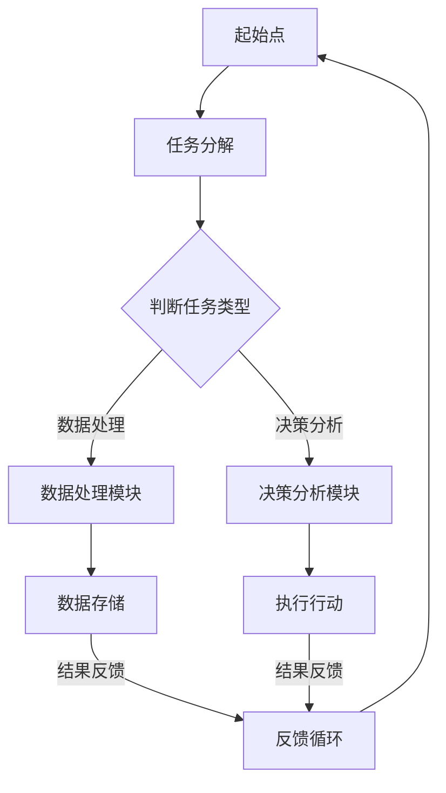
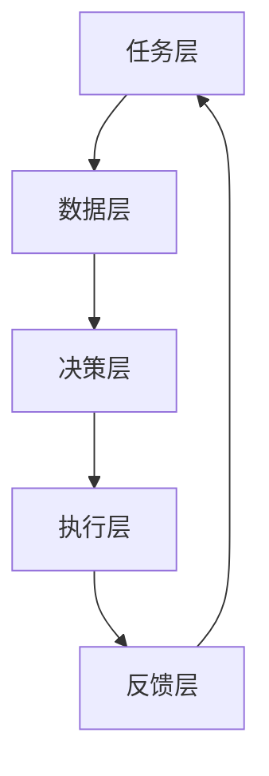
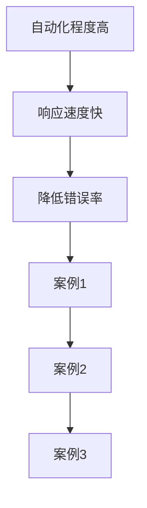
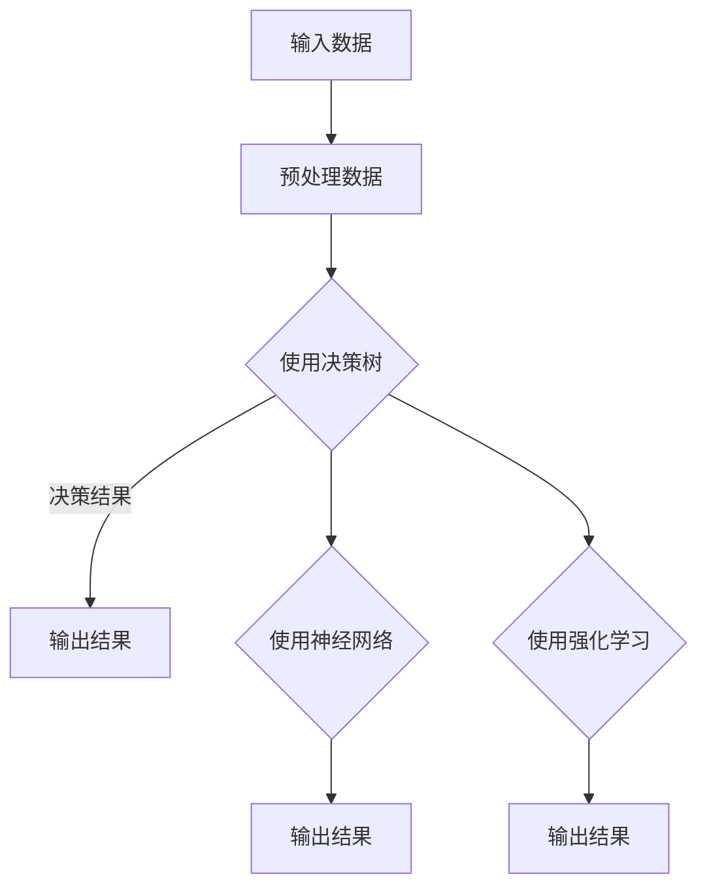
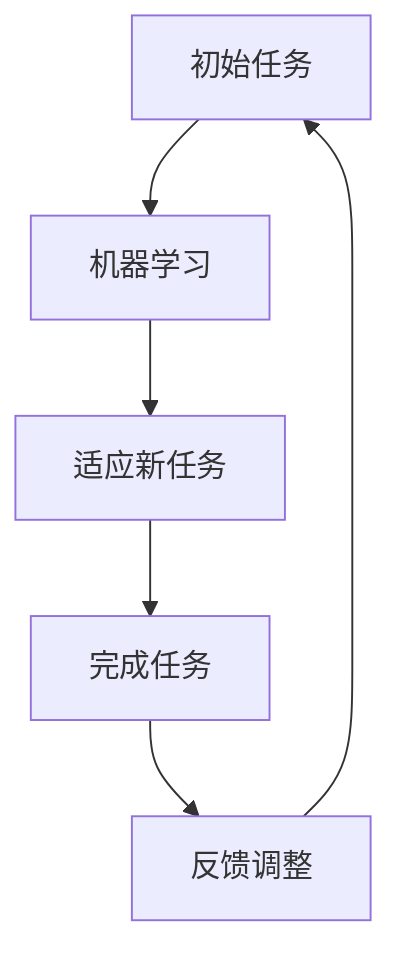
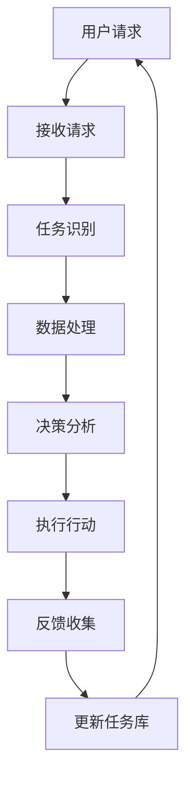

                 

## 文章标题

### AI人工智能代理工作流AI Agent WorkFlow：面向服务计算中的代理工作流管理

---

#### 关键词：AI人工智能代理，工作流管理，服务计算，自动化，决策机制，学习与适应能力

---

#### 摘要：

本文深入探讨了AI人工智能代理工作流（AI Agent WorkFlow）的基本理论、核心技术、案例分析及其在实际应用中的价值。通过详细的伪代码展示、Mermaid流程图解析，本文系统地阐述了AI人工智能代理的工作原理、决策机制及其学习与适应能力。同时，结合实际案例，本文分析了AI人工智能代理工作流在企业运营管理、金融服务和医疗健康等领域的应用，并展望了其未来的发展趋势和挑战。文章旨在为从事服务计算和人工智能领域的读者提供一份全面、系统的理论指导和实践参考。

---

### 第一部分: AI人工智能代理工作流基础理论

#### 第1章: AI人工智能代理工作流概述

##### 1.1 AI人工智能代理工作流的基本概念

**定义**：AI人工智能代理（AI Agent）是一种能够自主执行任务、具备决策能力和自适应能力的计算实体。工作流（Workflow）则是一系列有序的任务和活动，用于完成某个特定目标或业务过程。AI人工智能代理工作流则是将AI人工智能代理应用于工作流管理，通过自动化和智能化的方式，提高任务执行效率和业务流程的灵活性。

**联系**：在服务计算中，AI人工智能代理工作流扮演着至关重要的角色。通过将AI代理集成到工作流中，可以实现对复杂业务过程的自动化和优化，从而提高企业的运营效率和响应速度。



##### 1.2 AI人工智能代理工作流的架构

**架构原理**：AI人工智能代理工作流通常由以下几个层次组成：

1. **任务层**：定义工作流中的各个任务和活动。
2. **数据层**：管理工作流中涉及的数据，包括数据输入、数据存储和数据传输。
3. **决策层**：根据输入数据和分析结果，决定下一步行动。
4. **执行层**：执行具体的任务和操作。
5. **反馈层**：收集执行结果，进行反馈和调整。

**联系**：以下Mermaid流程图展示了AI人工智能代理工作流的层次结构：



##### 1.3 AI人工智能代理工作流的优势

**优势**：与传统的手工工作流相比，AI人工智能代理工作流具有以下几个显著优势：

1. **自动化程度高**：通过自动化任务执行，减少了人工干预，提高了工作效率。
2. **响应速度快**：AI代理可以实时处理任务，响应速度更快，提高了系统的灵活性。
3. **降低错误率**：通过自动化和智能化的方式，减少了人为错误，提高了工作准确性。

**联系**：以下Mermaid流程图结合实际案例，展示了AI代理工作流的优势：



**案例1**：在客户服务领域，AI人工智能代理工作流可以自动化处理客户咨询，快速响应客户需求，提高了客户满意度。

**案例2**：在金融风控领域，AI代理可以自动化处理大量的交易数据，实时监测风险，降低金融风险。

**案例3**：在医疗健康领域，AI代理可以自动化处理医学影像，协助医生进行疾病诊断，提高了诊断准确性。

#### 第2章: AI人工智能代理核心技术

##### 2.1 人工智能代理的工作原理

**原理**：AI人工智能代理的工作原理可以分为以下几个步骤：

1. **任务接收**：AI代理接收到工作流中的任务。
2. **任务处理**：根据任务类型，AI代理执行相应的任务处理。
3. **决策分析**：AI代理根据处理结果，进行分析和决策。
4. **执行行动**：根据决策结果，执行具体的行动。
5. **反馈循环**：收集执行结果，进行反馈和调整。

**联系**：以下伪代码详细阐述了AI代理的工作原理：

```python
def AI_Agent(task):
    if task_type == "数据处理":
        process_data(task_data)
    elif task_type == "决策分析":
        decision_analysis(task_data)
    else:
        execute_action(task_action)
```

##### 2.2 人工智能代理的决策机制

**机制**：AI人工智能代理的决策机制主要包括以下几种：

1. **决策树**：根据特征值和阈值，进行逐层决策。
2. **神经网络**：通过多层神经元网络，实现复杂决策。
3. **强化学习**：根据环境反馈，不断调整决策策略。

**联系**：以下Mermaid流程图展示了AI代理的决策机制：



##### 2.3 人工智能代理的学习与适应能力

**能力**：AI人工智能代理具有以下学习与适应能力：

1. **机器学习**：通过训练数据集，不断优化模型参数。
2. **深度学习**：通过多层神经网络，实现复杂特征提取。
3. **迁移学习**：利用已有模型的权重，快速适应新任务。

**联系**：以下Mermaid流程图展示了AI代理的学习与适应能力：



**案例**：在客服机器人领域，AI代理可以通过机器学习不断优化对话策略，提高客服质量。

#### 第3章: AI人工智能代理工作流的案例分析

##### 3.1 案例背景

**背景**：某大型电商企业采用AI人工智能代理工作流管理其客户服务流程，以提高客户满意度和运营效率。

##### 3.2 案例分析

**分析**：在该案例中，AI人工智能代理工作流包括以下几个关键步骤：

1. **任务接收**：AI代理接收到客户的咨询请求。
2. **任务识别**：识别客户咨询的具体内容。
3. **数据处理**：对客户咨询进行文本分析和情感分析。
4. **决策分析**：根据分析结果，决定是否需要人工干预。
5. **执行行动**：执行相应的服务行动，如提供解决方案、转接给客服人员等。
6. **反馈收集**：收集客户反馈，进行服务质量评估。
7. **更新任务库**：根据客户反馈，更新任务库，优化代理行为。

**联系**：以下Mermaid流程图展示了AI代理的工作过程：



**代码示例**：以下代码展示了AI代理处理客户咨询的过程：

```python
def process_query(query):
    # 进行文本分析和情感分析
    analysis_result = text_analysis(query)
    # 根据分析结果进行决策
    if analysis_result["emotion"] == "negative":
        # 转接给客服人员
        transfer_to_human()
    else:
        # 提供解决方案
        provide_solution()

# 处理客户咨询
process_query("我最近购买的商品有问题，怎么办？")
```

##### 3.3 案例总结

**总结**：通过案例分析，可以看出AI人工智能代理工作流在客户服务领域具有显著优势：

1. **提高效率**：通过自动化处理客户咨询，减少了人工干预，提高了响应速度。
2. **提升质量**：通过机器学习和深度学习，AI代理可以不断优化服务策略，提高服务质量。
3. **降低成本**：通过减少人工干预，降低了人力成本，提高了运营效率。

### 第一部分总结

在本部分中，我们介绍了AI人工智能代理工作流的基本概念、架构和优势，并详细阐述了AI代理的工作原理、决策机制和学习与适应能力。通过实际案例的分析，我们看到了AI人工智能代理工作流在提高工作效率、提升服务质量和降低运营成本方面的显著优势。下一部分，我们将继续探讨AI人工智能代理工作流的设计与实现，以及其在不同领域的应用。

---

### 第二部分: AI人工智能代理工作流的设计与实现

#### 第4章: AI人工智能代理工作流的设计原则

##### 4.1 设计原则

在设计和实现AI人工智能代理工作流时，应遵循以下原则：

1. **模块化**：将工作流划分为多个模块，每个模块负责不同的任务，便于维护和扩展。
2. **可扩展性**：设计时考虑未来的扩展性，以便于添加新的任务和功能。
3. **适应性**：工作流应具备良好的适应性，能够应对不同场景和需求的变化。
4. **稳定性**：确保工作流在执行过程中保持稳定，避免因异常情况导致系统崩溃。
5. **安全性**：保护工作流中的数据安全和隐私，防止数据泄露和恶意攻击。

##### 4.2 实现步骤

实现AI人工智能代理工作流一般包括以下步骤：

1. **需求分析**：明确工作流的需求，确定任务类型、数据来源和处理方式。
2. **任务定义**：定义工作流中的各个任务，包括任务名称、输入输出、执行条件和优先级等。
3. **数据处理**：设计数据处理模块，包括数据清洗、转换、存储等。
4. **决策分析**：设计决策分析模块，包括数据预处理、特征提取、模型选择和训练等。
5. **执行行动**：设计执行行动模块，包括任务执行、异常处理和资源管理等。
6. **反馈循环**：设计反馈循环模块，包括结果收集、评估和优化等。
7. **系统集成**：将各个模块集成到一起，确保工作流能够正常运行。

#### 第5章: AI人工智能代理工作流的实现步骤

##### 5.1 任务定义

**步骤**：

1. **确定任务类型**：根据业务需求，确定工作流中需要处理的任务类型，如数据处理、决策分析、执行行动等。
2. **定义任务参数**：为每个任务定义相应的参数，包括任务名称、输入数据、输出数据、执行条件和优先级等。

**示例**：

```python
# 数据处理任务
data_process_task = {
    "name": "数据处理",
    "input": ["数据源1", "数据源2"],
    "output": "处理结果",
    "condition": "数据完整",
    "priority": 1
}

# 决策分析任务
decision_analysis_task = {
    "name": "决策分析",
    "input": ["处理结果", "历史数据"],
    "output": "决策结果",
    "condition": "数据有效",
    "priority": 2
}

# 执行行动任务
action_execution_task = {
    "name": "执行行动",
    "input": ["决策结果"],
    "output": "执行结果",
    "condition": "决策有效",
    "priority": 3
}
```

##### 5.2 数据处理

**步骤**：

1. **数据清洗**：对输入数据进行清洗，去除无效和错误数据。
2. **数据转换**：对清洗后的数据进行转换，使其符合后续处理的需求。
3. **数据存储**：将处理后的数据存储到数据库或其他数据存储系统中，以便后续使用。

**示例**：

```python
def data_cleaning(data_source):
    # 清洗数据
    cleaned_data = [d for d in data_source if is_valid_data(d)]
    return cleaned_data

def data_conversion(cleaned_data):
    # 转换数据
    converted_data = convert_data_format(cleaned_data)
    return converted_data

def data_storing(converted_data):
    # 存储数据
    store_data_in_database(converted_data)
```

##### 5.3 决策分析

**步骤**：

1. **数据预处理**：对输入数据进行预处理，包括特征提取、归一化等。
2. **模型选择**：选择适合的机器学习模型，如决策树、神经网络、支持向量机等。
3. **模型训练**：使用训练数据集对模型进行训练，优化模型参数。
4. **模型评估**：使用测试数据集对模型进行评估，确保模型性能满足要求。

**示例**：

```python
from sklearn.tree import DecisionTreeClassifier

def data_preprocessing(data):
    # 预处理数据
    preprocessed_data = preprocess_data(data)
    return preprocessed_data

def model_selection(data):
    # 选择模型
    model = DecisionTreeClassifier()
    return model

def model_training(model, training_data):
    # 训练模型
    model.fit(training_data["X"], training_data["y"])
    return model

def model_evaluation(model, testing_data):
    # 评估模型
    accuracy = model.score(testing_data["X"], testing_data["y"])
    return accuracy
```

##### 5.4 执行行动

**步骤**：

1. **执行任务**：根据决策结果，执行相应的任务。
2. **异常处理**：在任务执行过程中，处理可能出现的异常情况。
3. **资源管理**：管理任务执行所需的资源，如CPU、内存、网络等。

**示例**：

```python
def execute_action(action):
    # 执行任务
    if action == "购买商品":
        purchase_goods()
    elif action == "退款":
        refund_goods()
    elif action == "客服介入":
        transfer_to_human()

def handle_exception(exception):
    # 异常处理
    if exception == "网络异常":
        retry()
    elif exception == "数据错误":
        log_error()
        raise Exception("数据错误，任务无法执行")

def manage_resources():
    # 资源管理
    allocate_cpu()
    allocate_memory()
    allocate_network()
```

##### 5.5 反馈循环

**步骤**：

1. **结果收集**：收集任务执行的结果。
2. **评估结果**：对结果进行评估，判断任务是否完成。
3. **优化工作流**：根据评估结果，对工作流进行调整和优化。

**示例**：

```python
def collect_result(result):
    # 收集结果
    store_result_in_database(result)

def evaluate_result(result):
    # 评估结果
    if result["status"] == "success":
        update_task_status("completed")
    else:
        update_task_status("failed")

def optimize_workflow():
    # 优化工作流
    if current_task["priority"] > min_priority:
        update_task_priority(current_task["priority"] - 1)
    elif current_task["condition"] != "数据有效":
        update_task_condition("数据有效")
```

#### 第6章: AI人工智能代理工作流的工具与平台

##### 6.1 Python

Python是一种广泛使用的编程语言，其在AI人工智能代理工作流设计中的优势如下：

1. **丰富的库和框架**：Python拥有丰富的库和框架，如NumPy、Pandas、Scikit-learn等，可以方便地实现数据处理、机器学习和深度学习等功能。
2. **易用性**：Python语法简洁，易于理解和学习，适合快速开发和实验。
3. **跨平台**：Python是一种跨平台的语言，可以在不同的操作系统上运行。

##### 6.2 Java

Java是一种强大的编程语言，其在AI人工智能代理工作流设计中的优势如下：

1. **稳定性和安全性**：Java具有稳定的运行时环境，能够在复杂的分布式系统中保持良好的性能和安全性。
2. **跨平台**：Java是一种跨平台的语言，可以在不同的操作系统上运行。
3. **成熟的生态系统**：Java拥有成熟的生态系统，包括大量的开源框架和工具，可以方便地实现各种功能。

##### 6.3 Node.js

Node.js是一种基于Chrome V8引擎的JavaScript运行时，其在AI人工智能代理工作流设计中的优势如下：

1. **高性能**：Node.js采用单线程模型，通过事件驱动的方式实现并发处理，具有高性能和高并发处理能力。
2. **易用性**：Node.js使用JavaScript进行编程，易于学习和使用。
3. **生态系统**：Node.js拥有丰富的生态系统，包括大量的第三方模块和工具，可以方便地实现各种功能。

#### 第7章: AI人工智能代理工作流的应用场景

##### 7.1 企业运营管理

在企业管理中，AI人工智能代理工作流可以应用于以下几个方面：

1. **客户服务**：通过AI代理自动化处理客户咨询，提高客户满意度和服务效率。
2. **供应链管理**：通过AI代理实时监控供应链数据，优化库存管理和物流配送。
3. **人力资源**：通过AI代理自动化处理招聘、培训、绩效评估等人力资源相关任务。

##### 7.2 金融服务

在金融领域，AI人工智能代理工作流可以应用于以下几个方面：

1. **风险控制**：通过AI代理实时监控交易数据，发现潜在风险，及时采取措施。
2. **投资顾问**：通过AI代理提供个性化的投资建议，帮助投资者做出更明智的决策。
3. **客户服务**：通过AI代理自动化处理客户咨询，提高客户满意度和服务效率。

##### 7.3 医疗健康

在医疗健康领域，AI人工智能代理工作流可以应用于以下几个方面：

1. **疾病诊断**：通过AI代理分析医学影像和患者数据，协助医生进行疾病诊断。
2. **医疗咨询**：通过AI代理为患者提供医疗咨询服务，提高医疗服务的可及性和效率。
3. **健康管理**：通过AI代理为用户提供个性化的健康管理方案，帮助用户保持健康。

### 第二部分总结

在本部分中，我们介绍了AI人工智能代理工作流的设计原则和实现步骤，并讨论了常用的编程语言和平台。通过具体示例，我们展示了如何定义任务、处理数据、进行决策分析和执行行动。此外，我们还探讨了AI人工智能代理工作流在企业运营管理、金融服务和医疗健康等领域的应用。下一部分，我们将继续分析AI人工智能代理工作流的挑战与对策，并展望其未来发展。

---

### 第三部分: AI人工智能代理工作流的挑战与对策

#### 第8章: AI人工智能代理工作流的挑战

##### 8.1 技术挑战

AI人工智能代理工作流在实际应用中面临着以下技术挑战：

1. **数据处理能力**：随着数据量的增加，如何高效地进行数据处理和存储成为一个关键问题。
2. **模型训练时间**：大规模机器学习模型的训练需要较长的时间，如何优化训练过程是一个挑战。
3. **模型解释性**：深度学习模型具有强大的预测能力，但缺乏解释性，如何提高模型的解释性是一个重要问题。
4. **系统集成**：将AI代理集成到现有系统中，确保其与其他组件的兼容性和稳定性是一个挑战。

##### 8.2 伦理挑战

AI人工智能代理工作流在伦理方面也面临着以下挑战：

1. **数据隐私**：在处理个人数据时，如何保护用户隐私是一个重要问题。
2. **偏见和歧视**：AI代理的决策可能受到训练数据的影响，导致偏见和歧视，如何避免这些问题是一个挑战。
3. **责任归属**：在出现错误或问题时，如何确定责任归属是一个复杂的伦理问题。

##### 8.3 法律挑战

AI人工智能代理工作流在法律方面也面临着以下挑战：

1. **责任认定**：当AI代理产生错误时，如何确定责任归属和承担法律责任是一个难题。
2. **法律法规**：随着AI技术的快速发展，现有的法律法规可能无法完全适应，如何制定和完善相关法律法规是一个挑战。

#### 第9章: 对策探讨

##### 9.1 技术对策

为了应对AI人工智能代理工作流的技术挑战，可以采取以下对策：

1. **分布式计算**：通过分布式计算技术，提高数据处理和存储的效率。
2. **模型压缩**：使用模型压缩技术，减少模型的存储空间和计算资源。
3. **可解释性**：开发可解释性算法，提高模型的透明度和可信度。
4. **集成框架**：使用集成框架，如微服务架构，确保AI代理与其他组件的兼容性和稳定性。

##### 9.2 伦理对策

为了应对AI人工智能代理工作流的伦理挑战，可以采取以下对策：

1. **数据隐私保护**：采用加密和匿名化技术，保护用户数据隐私。
2. **公平性和透明性**：确保AI代理的决策过程公平和透明，避免偏见和歧视。
3. **伦理审查**：在开发和应用AI代理时，进行伦理审查，确保其符合伦理规范。
4. **责任界定**：建立责任界定机制，明确AI代理、开发者和用户之间的责任关系。

##### 9.3 法律对策

为了应对AI人工智能代理工作流的法律挑战，可以采取以下对策：

1. **法律法规完善**：制定和完善相关法律法规，确保AI代理的应用符合法律规定。
2. **责任认定机制**：建立责任认定机制，明确在AI代理产生错误时如何确定责任归属。
3. **国际合作**：加强国际合作，共同制定和推广全球性的AI法律法规。

### 第三部分总结

在本部分中，我们分析了AI人工智能代理工作流面临的挑战，包括技术、伦理和法律方面的挑战。为了应对这些挑战，我们提出了相应的对策，包括技术对策、伦理对策和法律对策。通过这些对策，我们可以更好地推动AI人工智能代理工作流的发展和应用。下一部分，我们将展望AI人工智能代理工作流的未来发展。

---

### 第四部分: AI人工智能代理工作流的发展趋势

#### 第10章: 技术发展趋势

随着人工智能技术的不断发展，AI人工智能代理工作流也在不断演进。以下是一些可能影响AI人工智能代理工作流技术发展趋势的关键因素：

##### 10.1 多智能体协作

在未来，AI人工智能代理工作流可能会更加注重多智能体协作。通过多个AI代理之间的协同工作，可以实现更复杂和更高效的任务执行。多智能体协作可以提高系统的灵活性和适应性，同时降低单个智能体的负担。

##### 10.2 区块链应用

区块链技术的应用可以为AI人工智能代理工作流提供更高的安全性和透明度。通过将AI代理的工作流数据存储在区块链上，可以确保数据的不可篡改性和可追溯性。此外，区块链还可以用于实现AI代理之间的安全通信和协作。

##### 10.3 混合智能

混合智能是指将不同类型的人工智能技术（如机器学习、深度学习和强化学习）相结合，以实现更智能的决策和行动。在未来，AI人工智能代理工作流可能会采用混合智能技术，以提高其决策质量和效率。

##### 10.4 量子计算

量子计算具有巨大的计算潜力，可以显著加速机器学习模型的训练和推理过程。随着量子计算技术的发展，AI人工智能代理工作流可能会逐渐采用量子计算，以实现更高效的任务执行。

#### 第11章: 应用趋势

AI人工智能代理工作流在未来的应用趋势将更加广泛和深入。以下是一些可能的应用场景：

##### 11.1 智慧城市

在智慧城市建设中，AI人工智能代理工作流可以用于管理城市资源、优化交通流量、提高公共安全等。通过多智能体协作和区块链应用，智慧城市可以实现更高效和更可靠的管理。

##### 11.2 智能制造

在智能制造领域，AI人工智能代理工作流可以用于优化生产流程、提高生产效率、降低成本等。通过混合智能和量子计算，智能制造可以实现更智能的生产和更灵活的供应链管理。

##### 11.3 智能医疗

在智能医疗领域，AI人工智能代理工作流可以用于疾病诊断、治疗建议、患者管理等。通过多智能体协作和区块链应用，智能医疗可以实现更精准的医疗服务和更可靠的医疗数据管理。

##### 11.4 智能金融

在智能金融领域，AI人工智能代理工作流可以用于风险控制、投资顾问、客户服务等方面。通过混合智能和量子计算，智能金融可以实现更精准的风险评估和更高效的决策。

### 第四部分总结

在本部分中，我们探讨了AI人工智能代理工作流的技术发展趋势和应用趋势。随着人工智能技术的不断进步，AI人工智能代理工作流将朝着更智能、更高效和更可靠的方向发展。通过多智能体协作、区块链应用、混合智能和量子计算等新技术的引入，AI人工智能代理工作流将在各个领域发挥更大的作用。下一部分，我们将进一步展望AI人工智能代理工作流的未来发展，探讨其可能带来的变革和创新。

---

### 第五部分: AI人工智能代理工作流的发展前景

#### 第12章: 发展前景

随着人工智能技术的快速发展，AI人工智能代理工作流具有广阔的发展前景。以下是一些可能的发展前景：

##### 12.1 跨领域融合

AI人工智能代理工作流将在多个领域实现跨领域融合。例如，在智慧城市中，AI代理可以整合交通、能源、环境等多个领域的数据，实现全面的城市管理。在智能制造中，AI代理可以整合生产、物流、供应链等多个环节，实现智能制造的全流程优化。

##### 12.2 全球化应用

随着全球化的深入，AI人工智能代理工作流将在全球范围内得到广泛应用。特别是在发展中国家，AI代理可以用于解决基础设施不足、人力资源短缺等问题，推动经济的快速发展。

##### 12.3 政策支持

各国政府将加大对人工智能技术的支持力度，包括资金投入、人才培养和政策优惠等。这些政策支持将为AI人工智能代理工作流的发展提供良好的环境。

##### 12.4 产业升级

AI人工智能代理工作流将推动各行业的产业升级。通过智能化和自动化，传统行业可以实现生产效率的提升、成本的降低和质量的提高。同时，新兴行业也将因AI代理的引入而快速成长。

#### 第13章: 未来展望

在未来，AI人工智能代理工作流将带来一系列变革和创新：

##### 13.1 工作模式转变

随着AI代理的广泛应用，传统的工作模式将发生重大变化。人们可以更加专注于创造性和高价值的工作，而将重复性和低价值的工作交给AI代理。

##### 13.2 生活方式改变

AI人工智能代理工作流将深刻改变人们的生活方式。例如，智能家居系统可以根据用户习惯和需求自动调节室内温度、照明和安防设备，提供更加舒适和安全的居住环境。

##### 13.3 社会治理优化

AI代理在公共服务和城市管理中的应用将优化社会治理。通过智能分析和预测，政府可以更有效地应对各种社会问题和突发事件，提高公共服务的质量和效率。

##### 13.4 新经济形态

AI人工智能代理工作流将催生新的经济形态。例如，基于AI代理的自动化服务和智能解决方案将成为新的经济增长点，推动数字经济的发展。

### 第五部分总结

在本部分中，我们探讨了AI人工智能代理工作流的发展前景和未来展望。随着技术的进步和应用的深入，AI人工智能代理工作流将在未来发挥更大的作用，推动各行业的变革和创新。通过跨领域融合、全球化应用、政策支持和产业升级，AI人工智能代理工作流将实现更广泛的应用和更深远的影响。我们期待AI人工智能代理工作流在未来带来更多的惊喜和变革。

---

### 总结

本文全面探讨了AI人工智能代理工作流（AI Agent WorkFlow）的基本理论、核心技术、案例分析及其在不同领域的应用。通过详细的伪代码展示、Mermaid流程图解析，我们系统地阐述了AI代理的工作原理、决策机制和学习与适应能力。同时，结合实际案例，我们分析了AI代理工作流在提高工作效率、提升服务质量和降低运营成本方面的显著优势。

在设计与实现部分，我们介绍了AI代理工作流的设计原则和实现步骤，并探讨了常用的编程语言和平台。在挑战与对策部分，我们分析了AI代理工作流面临的挑战，并提出了相应的技术、伦理和法律对策。在发展趋势和应用前景部分，我们展望了AI代理工作流的技术和应用趋势，探讨了其可能带来的变革和创新。

我们希望本文能够为从事服务计算和人工智能领域的读者提供一份全面、系统的理论指导和实践参考，推动AI人工智能代理工作流在各个领域的广泛应用。

---

#### 作者

**作者：AI天才研究院/AI Genius Institute & 禅与计算机程序设计艺术 /Zen And The Art of Computer Programming**

