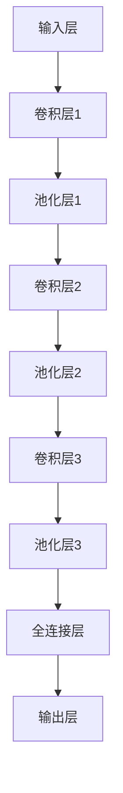
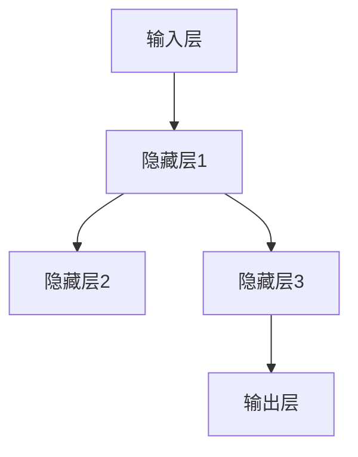

                 

### 文章标题：AI人工智能核心算法原理与代码实例讲解：特征工程

#### 关键词：AI人工智能、特征工程、神经网络、深度学习、代码实例

#### 摘要：

本文全面深入地探讨了人工智能领域中的核心算法原理，特别是特征工程。文章首先概述了人工智能的发展历程、基本概念和主要应用领域，为读者提供了一个宏观的视角。随后，文章详细介绍了特征工程的定义、重要性、方法和技术，并通过多个实例展示了如何在实际项目中应用这些方法。文章还深入讲解了神经网络、深度学习、机器学习、强化学习、自然语言处理和计算机视觉等核心算法的原理，并提供了详细的伪代码和数学模型讲解。最后，文章通过实战项目实例，展示了如何从开发环境搭建、数据集准备到模型设计、训练和优化，实现一个完整的AI项目。本文旨在帮助读者深入理解AI算法原理，掌握特征工程技术，并通过实例代码学习，提升实际项目开发能力。

### 第1章：AI人工智能概述

#### 1.1 AI发展历史与趋势

##### 1.1.1 从计算智能到认知智能

人工智能（Artificial Intelligence，简称AI）的概念最早可以追溯到20世纪50年代。当时，计算机科学家们开始思考如何使计算机具备人类智能的特性。最初的人工智能研究主要集中在逻辑推理和规则系统上，例如基于推理的专家系统和逻辑编程。这些早期的系统虽然在特定领域内表现出色，但普遍存在灵活性差、适应性弱的问题。

随着计算能力和算法的进步，人工智能的发展进入了一个新的阶段，即计算智能（Computation Intelligence）阶段。计算智能强调利用计算机模拟人类智能，包括机器学习、深度学习、数据挖掘、模糊逻辑等。这个阶段的代表成果包括神经网络、决策树、支持向量机等算法。

近年来，人工智能进一步发展，进入了一个新的阶段——认知智能（Cognitive Intelligence）阶段。认知智能不仅仅依赖于数据驱动的方法，还强调对人类认知过程的理解和模拟。这个阶段的代表成果包括强化学习、自然语言处理、计算机视觉等。

##### 1.1.2 人工智能的主要发展阶段

人工智能的发展可以分为以下几个主要阶段：

1. **符号人工智能**：这一阶段的人工智能主要通过规则系统、逻辑推理等方式工作。代表系统包括专家系统、知识表示和推理机。例如，Dendral是一个早期的专家系统，用于化学领域的推理。

2. **知识表示与推理**：这一阶段的人工智能研究集中在如何有效地表示和利用知识。知识表示涉及将现实世界中的概念、事实和关系转化为计算机可以处理的形式。推理则涉及从已知的事实中推导出新的结论。

3. **机器学习**：机器学习是人工智能的一个重要分支，通过训练模型来使计算机具备学习的能力。这一阶段的主要成果包括监督学习、无监督学习和强化学习。监督学习的代表算法包括决策树、支持向量机和神经网络。无监督学习的代表算法包括聚类和降维。强化学习的代表算法包括Q学习和深度强化学习。

4. **深度学习**：深度学习是机器学习的一个分支，通过构建多层神经网络来模拟人类大脑的学习过程。深度学习的代表算法包括卷积神经网络（CNN）、循环神经网络（RNN）和长短时记忆网络（LSTM）。

5. **认知智能**：认知智能阶段的人工智能强调对人类认知过程的理解和模拟。这一阶段的研究成果包括自然语言处理、计算机视觉和认知图谱等。

##### 1.1.3 人工智能的当前发展趋势

当前，人工智能正朝着以下几个方向发展：

1. **大数据与云计算**：随着数据量的爆炸式增长，大数据技术成为了人工智能发展的基石。云计算提供了强大的计算资源，使得大规模数据处理和深度学习模型训练成为可能。

2. **强化学习**：强化学习在游戏、自动驾驶和机器人等领域取得了显著的成果。深度强化学习（DRL）结合了深度学习和强化学习的优势，成为了人工智能研究的热点。

3. **自然语言处理**：自然语言处理（NLP）技术在语音识别、机器翻译、文本分类和情感分析等领域取得了重大突破。词嵌入技术和序列模型如RNN和LSTM在NLP中发挥了关键作用。

4. **计算机视觉**：计算机视觉技术在图像识别、目标检测和视频分析等领域取得了显著进展。深度学习，特别是卷积神经网络（CNN），在计算机视觉中发挥了重要作用。

5. **跨学科融合**：人工智能与其他领域的融合，如生物信息学、医疗保健、金融科技等，推动了人工智能在更广泛的应用场景中的发展。

##### 1.1.4 人工智能在未来的发展前景

人工智能在未来的发展前景广阔，可能会对人类社会产生深远的影响：

1. **自动化与机器人**：人工智能将进一步提升自动化和机器人技术的水平，改变生产方式和工作模式。

2. **智能助手与交互**：智能助手和交互系统将变得更加普及和智能，为人类提供更加便捷的日常生活和工作支持。

3. **医疗与健康**：人工智能在医疗领域的应用将大大提高诊断和治疗的效率，推动个性化医疗的发展。

4. **教育与培训**：人工智能将改变教育模式，提供更加个性化和智能化的学习体验。

5. **社会与经济**：人工智能有望解决许多社会和经济问题，如气候变化、能源危机和资源分配等。

总之，人工智能的发展不仅带来了技术进步，还将深刻改变人类社会的方方面面。人工智能的未来充满了无限可能。

#### 1.2 AI基本概念与架构

##### 1.2.1 什么是人工智能

人工智能（Artificial Intelligence，简称AI）是指通过计算机程序和算法模拟人类智能的过程。它涵盖了多个学科领域，包括计算机科学、数学、统计学、心理学和神经科学等。人工智能的目标是实现机器在某些任务上达到或超越人类智能水平。

人工智能的主要特征包括：

1. **学习与适应能力**：人工智能系统能够通过学习和适应不断变化的环境，提高任务完成的效率。

2. **感知与理解能力**：人工智能系统能够通过感知器（如摄像头、麦克风等）获取外部信息，并对其进行处理和理解。

3. **推理与决策能力**：人工智能系统能够基于已有的知识和信息进行推理和决策，解决复杂问题。

4. **自然语言处理能力**：人工智能系统能够理解和生成自然语言，进行文本分析、语音识别和机器翻译等任务。

##### 1.2.2 人工智能的三大流派

人工智能可以分为三大流派：符号主义、连接主义和进化主义。

1. **符号主义（Symbolic AI）**：符号主义是早期人工智能的主流学派，它强调通过符号逻辑和知识表示来模拟人类智能。符号主义方法依赖于明确的规则和逻辑推理，代表系统包括专家系统和逻辑编程。

2. **连接主义（Connectionism）**：连接主义方法通过模拟人脑神经元之间的连接和工作方式来实现智能。神经网络是连接主义方法的代表，它通过多层节点和连接来模拟人类大脑的信息处理过程。深度学习是连接主义的最新发展。

3. **进化主义（Evolutionary AI）**：进化主义方法借鉴生物进化的原理，通过遗传算法和进化策略来优化和进化智能系统。进化主义方法在优化和搜索问题中表现出色。

##### 1.2.3 人工智能的层次结构

人工智能的层次结构可以分为以下几个层次：

1. **感知层**：感知层负责接收和处理外部信息，如图像、声音和文本等。感知层包括计算机视觉、语音识别和自然语言处理等子领域。

2. **理解层**：理解层负责对感知层获取的信息进行分析和理解，如对象识别、语义理解和情感分析等。

3. **推理层**：推理层负责基于已有的知识和信息进行推理和决策，如逻辑推理、预测和规划等。

4. **执行层**：执行层负责将推理层的决策转化为实际动作，如机器人控制、自动驾驶和智能家居等。

每个层次都依赖于下面的层次，并为其提供输入。这种层次结构使得人工智能系统能够从简单任务逐步发展到复杂任务，从而实现更高层次的智能。

#### 1.3 AI的主要应用领域

##### 1.3.1 机器学习与数据挖掘

机器学习是人工智能的核心组成部分，它使计算机能够通过数据学习并做出预测或决策。数据挖掘则是一门从大量数据中提取有价值信息的技术。机器学习与数据挖掘在金融、医疗、电子商务、广告推荐等领域有广泛应用：

- **金融领域**：机器学习用于风险评估、欺诈检测、投资组合优化等。
- **医疗领域**：数据挖掘用于疾病预测、药物研发、医疗数据分析。
- **电子商务**：机器学习用于推荐系统、客户行为预测、市场细分。
- **广告推荐**：数据挖掘用于广告投放优化、用户兴趣分析。

##### 1.3.2 自然语言处理

自然语言处理（NLP）是人工智能的一个重要分支，它致力于使计算机能够理解和生成人类语言。NLP的应用领域包括：

- **语音识别**：将语音信号转换为文本。
- **机器翻译**：将一种语言的文本翻译成另一种语言。
- **情感分析**：分析文本中的情感倾向。
- **问答系统**：构建能够回答用户问题的智能系统。

##### 1.3.3 计算机视觉

计算机视觉是研究如何使计算机像人类一样理解和解释视觉信息的领域。计算机视觉的应用领域包括：

- **图像识别与分类**：对图像中的对象进行识别和分类。
- **目标检测与跟踪**：检测图像中的目标并跟踪其运动。
- **视频分析**：从视频中提取有价值的信息，如动作识别、事件检测。
- **人脸识别**：识别和验证人脸。

##### 1.3.4 强化学习

强化学习是一种通过试错学习并在特定环境中寻找最优策略的人工智能方法。强化学习在以下几个领域有广泛应用：

- **游戏**：如围棋、国际象棋等游戏的智能对手。
- **自动驾驶**：通过强化学习实现车辆的自主驾驶。
- **机器人控制**：通过强化学习使机器人能够在复杂环境中进行自主操作。
- **资源分配**：如电网调度、交通管理。

##### 1.3.5 其他应用领域

除了上述主要领域外，人工智能还应用于其他众多领域：

- **智能制造**：通过机器学习和计算机视觉实现生产线自动化。
- **智能家居**：通过语音识别、自然语言处理等技术实现家居设备的智能化。
- **智能城市**：通过数据挖掘和智能分析实现城市管理优化。
- **生物信息学**：通过人工智能技术加速生物医学研究。

这些应用领域展示了人工智能的广泛影响和巨大潜力。随着技术的不断进步，人工智能将继续深入到各个领域，为人类社会带来更多便利和创新。

#### 1.4 人工智能在未来的发展前景

##### 1.4.1 人工智能对人类社会的潜在影响

人工智能的发展将对人类社会产生深远的影响，体现在以下几个方面：

1. **经济变革**：人工智能将改变传统产业，提高生产效率，降低成本。同时，新兴的AI产业也将创造大量就业机会，推动经济结构升级。

2. **生活方式变化**：人工智能将使人们的生活更加便捷和智能化。智能家居、自动驾驶汽车和智能医疗等技术的普及，将提高生活质量。

3. **教育变革**：人工智能将改变教育模式，提供个性化的学习体验，帮助学生更好地掌握知识和技能。

4. **医疗进步**：人工智能在医疗领域的应用将提高诊断和治疗的准确性，加快新药研发，提升医疗服务的效率和质量。

##### 1.4.2 人工智能面临的挑战与机遇

尽管人工智能有着广阔的发展前景，但也面临着一系列挑战：

1. **技术挑战**：人工智能的发展依赖于计算能力、算法优化和大数据技术。如何进一步提高计算效率、优化算法和提升数据质量是当前的研究重点。

2. **数据隐私**：随着人工智能对大量数据的依赖，数据隐私问题日益突出。如何保护个人隐私、确保数据安全成为亟待解决的问题。

3. **伦理问题**：人工智能的应用涉及伦理问题，如算法偏见、自动化决策的公正性等。如何制定合理的伦理规范，确保人工智能的发展符合人类的价值观和道德标准，是一个重要议题。

然而，这些挑战也带来了新的机遇：

1. **技术创新**：人工智能的挑战催生了大量新技术的研究和应用，如深度学习、量子计算等。

2. **产业变革**：人工智能将推动各行业的创新和变革，为经济增长注入新动力。

3. **社会进步**：通过解决社会问题，如气候变化、能源危机和贫困等，人工智能有望推动社会进步。

##### 1.4.3 人工智能发展的长期趋势

展望未来，人工智能的发展将呈现以下几个长期趋势：

1. **智能化普及**：随着技术的进步，人工智能将更加普及，深入到社会的各个方面，提高生产效率和生活质量。

2. **跨学科融合**：人工智能将与生物、物理、化学等多个学科领域融合，产生新的交叉学科和研究方向。

3. **自主进化**：人工智能系统将具备自我学习和自我进化的能力，能够适应复杂多变的环境，实现更高层次的智能。

4. **伦理与法律完善**：随着人工智能的发展，伦理和法律问题将得到更多关注，相关规范和法规将不断完善。

总之，人工智能的发展前景广阔，将对人类社会产生深远的影响。面对挑战和机遇，我们需要积极应对，推动人工智能的健康、可持续发展，为人类社会带来更多福祉。

### 第2章：特征工程基础

#### 2.1 特征工程的定义与重要性

##### 2.1.1 什么是特征工程

特征工程（Feature Engineering）是数据预处理中的一个重要环节，它涉及从原始数据中提取或构建新的特征，以提升机器学习模型的性能和预测能力。特征工程不同于数据清洗，后者主要关注数据缺失、异常值和噪声的处理，而特征工程更侧重于利用数据的专业知识，提取对模型有用的信息。

##### 2.1.2 特征工程的重要性

特征工程在机器学习项目中扮演着至关重要的角色，其重要性体现在以下几个方面：

1. **提升模型性能**：通过有效的特征工程，可以显著提高模型的准确性和泛化能力。合适的特征能够捕捉数据中的关键信息，帮助模型更好地学习和预测。

2. **降低过拟合风险**：特征工程有助于减少模型对训练数据的依赖，降低过拟合的风险。通过选择和构造具有区分性的特征，模型在未见过的数据上也能保持良好的表现。

3. **提高数据处理效率**：特征工程可以简化数据处理的复杂性，提高模型的训练和预测速度。例如，通过降维技术，可以将高维数据映射到低维空间，减少计算量。

4. **增强解释性**：特征工程有助于提高模型的解释性。通过合理的特征选择和构造，可以使得模型更加直观易懂，便于后续的分析和验证。

##### 2.1.3 特征工程在不同类型的数据集中的应用

特征工程的应用因数据集的类型和特点而异。以下是几种常见数据集的特征工程方法：

1. **数值型数据集**：对于数值型数据，常见的特征工程方法包括：

   - **数据归一化**：通过将数据缩放到一个标准范围内，使得特征之间的尺度差异减小，有利于模型的训练。
   - **特征缩放**：如Z-Score缩放，将数据缩放到均值为0，标准差为1的标准化范围。
   - **特征提取**：通过统计方法提取新的特征，如平均值、中值、标准差等。
   - **降维**：通过主成分分析（PCA）等降维技术，减少数据维度，提高模型的计算效率。

2. **文本数据集**：文本数据集的特征工程主要涉及以下方面：

   - **分词**：将文本切分成单词或子词。
   - **词性标注**：对文本中的单词进行词性标注，区分名词、动词、形容词等。
   - **词嵌入**：将文本中的单词映射到高维向量空间，如Word2Vec、GloVe等。
   - **文本表示**：通过将文本转换为向量，如Bag-of-Words、TF-IDF等。

3. **图像数据集**：图像数据集的特征工程包括：

   - **图像预处理**：如灰度转换、边缘检测、图像增强等。
   - **特征提取**：通过卷积神经网络（CNN）等深度学习模型提取图像特征。
   - **目标检测与分割**：在图像中检测和定位目标区域。

4. **时间序列数据集**：时间序列数据集的特征工程包括：

   - **时间窗口**：将时间序列数据划分为固定长度的时间窗口。
   - **统计特征**：如均值、标准差、自相关函数等。
   - **特征融合**：结合多源数据特征，提高模型的预测能力。

通过合理地应用这些特征工程方法，可以有效提升机器学习模型的性能，为后续的模型训练和预测打下坚实的基础。

#### 2.2 特征提取与特征选择方法

##### 2.2.1 特征提取方法

特征提取是特征工程的重要环节，旨在从原始数据中提取出对模型训练有用的信息。以下是几种常见的特征提取方法：

1. **统计特征提取**：统计特征提取基于数据的统计性质，如平均值、中值、标准差、最大值、最小值等。这些特征可以提供数据的分布信息和数值范围，帮助模型捕捉数据的基本特性。

   ```mermaid
   graph TD
   A[统计特征] --> B[平均值]
   A --> C[中值]
   A --> D[标准差]
   A --> E[最大值]
   A --> F[最小值]
   ```

2. **视觉特征提取**：视觉特征提取主要用于图像数据集，常用的方法包括边缘检测、纹理分析、颜色特征提取等。这些特征可以描述图像的局部结构和内容。

   ```mermaid
   graph TD
   A[视觉特征提取] --> B[边缘检测]
   A --> C[纹理分析]
   A --> D[颜色特征]
   ```

3. **文本特征提取**：文本特征提取用于将文本数据转换为数值向量，常用的方法包括Bag-of-Words（词袋模型）、TF-IDF（词频-逆文档频率）和词嵌入（Word Embedding）等。这些特征可以描述文本的语义和词汇信息。

   ```mermaid
   graph TD
   A[文本特征提取] --> B[Bag-of-Words]
   A --> C[TF-IDF]
   A --> D[词嵌入]
   ```

##### 2.2.2 特征选择方法

特征选择是特征工程的另一个重要环节，旨在从大量特征中挑选出对模型训练最有用的特征。以下是几种常见的特征选择方法：

1. **过滤式特征选择**：过滤式特征选择通过计算每个特征的统计学指标（如相关性、信息增益等）来评估其重要性，从而选择出最好的特征。

   ```mermaid
   graph TD
   A[过滤式特征选择] --> B[相关性]
   A --> C[信息增益]
   A --> D[互信息]
   ```

2. **包裹式特征选择**：包裹式特征选择通过搜索整个特征空间，找出最优特征子集。常用的算法包括递归特征消除（RFE）、遗传算法（GA）等。

   ```mermaid
   graph TD
   A[包裹式特征选择] --> B[递归特征消除]
   A --> C[遗传算法]
   ```

3. **嵌入式特征选择**：嵌入式特征选择在模型训练过程中同时进行特征选择，常用的方法包括线性模型正则化（如Lasso、Ridge）和基于模型的特征选择方法（如随机森林、LassoLars）。

   ```mermaid
   graph TD
   A[嵌入式特征选择] --> B[Lasso]
   A --> C[Ridge]
   A --> D[随机森林]
   ```

通过合理地应用这些特征提取和特征选择方法，可以有效提升模型的性能，减少模型的过拟合风险，并提高模型的泛化能力。

#### 2.3 特征处理与数据预处理

##### 2.3.1 数据清洗

数据清洗是特征处理和数据预处理的重要步骤，旨在去除数据中的噪声和不准确信息，确保数据的质量和一致性。以下是几种常见的数据清洗方法：

1. **缺失值处理**：缺失值的处理方法包括删除缺失值、填充缺失值和插补法。删除缺失值适用于缺失值较多的数据，填充缺失值适用于缺失值较少的数据。

   ```mermaid
   graph TD
   A[缺失值处理] --> B[删除缺失值]
   A --> C[填充缺失值]
   A --> D[插补法]
   ```

2. **异常值处理**：异常值处理包括识别和修正异常值。常见的异常值处理方法包括阈值法、回归法和聚类法。

   ```mermaid
   graph TD
   A[异常值处理] --> B[阈值法]
   A --> C[回归法]
   A --> D[聚类法]
   ```

##### 2.3.2 数据归一化

数据归一化是特征处理的一种常用方法，通过将数据缩放到一个标准范围内，使得不同特征之间的尺度差异减小，有利于模型的训练。以下是几种常见的数据归一化方法：

1. **标准化**：标准化将数据缩放到均值为0，标准差为1的范围内。

   ```mermaid
   graph TD
   A[标准化] --> B[均值为0，标准差为1]
   ```

2. **归一化**：归一化将数据缩放到最小值为0，最大值为1的范围内。

   ```mermaid
   graph TD
   A[归一化] --> B[最小值为0，最大值为1]
   ```

3. **最小-最大缩放**：最小-最大缩放将数据缩放到指定的最小值和最大值之间。

   ```mermaid
   graph TD
   A[最小-最大缩放] --> B[指定最小值，指定最大值]
   ```

通过合理地应用这些数据清洗和归一化方法，可以有效提高数据的质量，减少模型的过拟合风险，并提高模型的泛化能力。

##### 2.3.3 数据标准化

数据标准化是特征处理和数据预处理的重要步骤，旨在将数据转换为相同尺度，以便进行有效的模型训练。以下是几种常见的数据标准化方法：

1. **Z-Score缩放**：Z-Score缩放将数据标准化为均值为0，标准差为1的标准正态分布。

   $$\text{z-score} = \frac{\text{x} - \text{mean}}{\text{std}}$$

2. **指数变换**：指数变换通过对数函数将数据转换为对数尺度。

   $$\text{log}(\text{x}) = \ln(\text{x})$$

3. **对数变换**：对数变换通过对数函数将数据转换为对数尺度。

   $$\text{log}(\text{x}) = \log_{10}(\text{x})$$

通过合理地应用这些数据标准化方法，可以有效提高数据的一致性，减少模型的过拟合风险，并提高模型的泛化能力。这些方法在不同类型的特征处理中发挥着重要作用，是特征工程中不可或缺的一部分。

#### 2.4 特征标准化与归一化技术

##### 2.4.1 特征标准化

特征标准化是一种常用的特征处理技术，通过将特征值缩放到一个标准范围内，使得不同特征之间的尺度差异减小，有利于模型的训练。特征标准化的数学原理如下：

$$
\text{z-score} = \frac{\text{x} - \text{mean}}{\text{std}}
$$

其中，\( \text{x} \) 是原始特征值，\( \text{mean} \) 是特征的平均值，\( \text{std} \) 是特征的标准差。

特征标准化的过程包括以下几个步骤：

1. **计算特征的平均值和标准差**：首先，我们需要计算每个特征的平均值和标准差。
2. **缩放特征值**：然后，将每个特征值按照上述公式进行缩放。

特征标准化的优点包括：

- **提高模型性能**：特征标准化可以减少特征之间的尺度差异，使得模型更容易学习和泛化。
- **减少过拟合风险**：特征标准化有助于降低模型对特定特征的依赖，减少过拟合的风险。
- **加速训练过程**：标准化后的数据可以加快模型的训练速度，因为计算过程更加稳定。

##### 2.4.2 归一化技术

归一化技术是另一种常用的特征处理方法，它通过将特征值缩放到一个固定的最小值和最大值之间，使得所有特征具有相同的尺度。常见的归一化方法包括最小-最大缩放和Z-Score缩放。

1. **最小-最大缩放**：最小-最大缩放将特征值缩放到一个指定的最小值和最大值之间。

$$
\text{x}_{\text{norm}} = \frac{\text{x} - \text{min}}{\text{max} - \text{min}}
$$

其中，\( \text{x} \) 是原始特征值，\( \text{min} \) 是特征的最小值，\( \text{max} \) 是特征的最大值。

最小-最大缩放的过程包括以下几个步骤：

- **计算特征的最小值和最大值**：首先，我们需要计算每个特征的最小值和最大值。
- **缩放特征值**：然后，将每个特征值按照上述公式进行缩放。

最小-最大缩放的优点包括：

- **简单易实现**：最小-最大缩放算法简单，易于实现和理解。
- **适用于范围限制的特征**：最小-最大缩放适用于需要限制特征范围的场景。

2. **Z-Score缩放**：Z-Score缩放将特征值标准化为均值为0，标准差为1的标准正态分布。

$$
\text{z-score} = \frac{\text{x} - \text{mean}}{\text{std}}
$$

Z-Score缩放的过程与特征标准化类似，也包括计算特征的平均值和标准差，并缩放特征值。

归一化技术的优点包括：

- **统一尺度**：归一化技术确保所有特征具有相同的尺度，使得模型更容易处理。
- **提高计算效率**：归一化后的数据可以减少计算复杂度，提高模型训练和预测的效率。

##### 2.4.3 特征标准化与归一化技术的比较

特征标准化与归一化技术虽然在目标上相似，但在具体实现和应用场景上有所区别：

- **计算目标**：特征标准化主要目标是将特征值缩放到标准正态分布，而归一化技术是将特征值缩放到一个指定的范围。
- **适用场景**：特征标准化适用于需要满足统计假设（如线性模型）的场景，而归一化技术更适用于需要统一特征尺度的场景。
- **稳定性**：特征标准化在处理异常值时可能会受到影响，而归一化技术对异常值较为敏感。

综上所述，特征标准化与归一化技术在特征处理和数据预处理中都有重要应用。根据具体需求和应用场景，选择合适的特征处理方法，可以有效提升模型的性能和预测能力。

### 第3章：神经网络与深度学习基础

#### 3.1 神经网络的基本结构

##### 3.1.1 神经元与神经网络

神经网络（Neural Networks）是模仿人脑神经元结构和功能的一种计算模型。每个神经元（或称为节点）是神经网络的基本单元，它接收输入信号，通过激活函数产生输出信号。神经元的结构通常包括以下部分：

1. **输入层**：输入层接收外部输入信号，这些信号通常与数据特征相对应。
2. **隐藏层**：隐藏层位于输入层和输出层之间，负责对输入信号进行处理和变换。隐藏层的数量和神经元数量可以根据问题复杂度进行调整。
3. **输出层**：输出层产生最终输出信号，这些信号通常与模型的预测结果或分类标签相对应。

神经元的工作原理如下：

1. **加权求和**：每个输入信号通过一个权重与对应的神经元相连。神经元将所有输入信号与相应权重相乘后进行求和。
2. **激活函数**：求和结果经过一个非线性激活函数（如Sigmoid、ReLU或Tanh函数）处理后，得到神经元的输出。

神经网络的层次结构可以分为：

1. **单层神经网络**：单层神经网络只有一个隐藏层，适用于简单的线性问题。
2. **多层神经网络**：多层神经网络包括多个隐藏层，能够处理更复杂的非线性问题。
3. **深度神经网络**：深度神经网络（Deep Neural Network，简称DNN）包含多个隐藏层，能够捕捉输入数据中的复杂模式和关系。

##### 3.1.2 神经网络的组成

神经网络由以下几个主要部分组成：

1. **输入层**：输入层接收原始数据，并将数据传递给隐藏层。
2. **隐藏层**：隐藏层对输入数据进行处理，通过多个神经元之间的相互连接和激活函数，产生新的特征表示。
3. **输出层**：输出层产生最终输出，可以是分类标签、预测值或其他形式的输出。

神经网络中的神经元连接方式可以是全连接（每个神经元都与其他所有神经元相连）或部分连接（只有部分神经元之间相连）。全连接神经网络能够捕捉输入数据中的复杂关系，但计算复杂度较高。部分连接神经网络则适用于简单问题，计算复杂度较低。

##### 3.1.3 神经网络的层次结构

神经网络的层次结构可以分为输入层、隐藏层和输出层。以下是每个层次的详细说明：

1. **输入层**：输入层接收原始数据，并将其传递给隐藏层。输入层中的神经元数量取决于数据特征的维度。
2. **隐藏层**：隐藏层位于输入层和输出层之间，负责对输入数据进行处理和变换。隐藏层的数量和神经元数量可以根据问题的复杂度进行调整。多个隐藏层可以捕捉输入数据中的更高层次的特征。
3. **输出层**：输出层产生最终输出，可以是分类标签、预测值或其他形式的输出。输出层中的神经元数量取决于输出类别的数量。

神经网络中的层次结构对模型性能有重要影响。增加隐藏层的数量可以提升模型的复杂度和表达能力，但也会增加计算复杂度和过拟合风险。适当设计隐藏层的数量和神经元数量，可以平衡模型的表达能力和泛化能力。

#### 3.2 前馈神经网络与反向传播算法

##### 3.2.1 前馈神经网络

前馈神经网络（Feedforward Neural Network，简称FNN）是一种典型的神经网络结构，其中数据从输入层流向输出层，没有循环或循环结构。前馈神经网络包括以下几个主要组成部分：

1. **输入层**：输入层接收外部输入信号，这些信号通常与数据特征相对应。
2. **隐藏层**：隐藏层位于输入层和输出层之间，负责对输入信号进行处理和变换。隐藏层可以有多个层次，每个层次的神经元都与前一个层次的神经元全连接。
3. **输出层**：输出层产生最终输出，可以是分类标签、预测值或其他形式的输出。输出层的神经元数量取决于输出类别的数量。

前馈神经网络的工作原理如下：

1. **前向传播**：在前向传播过程中，输入信号从输入层传递到隐藏层，然后逐层传递到输出层。在每个神经元中，输入信号与权重相乘后求和，并通过激活函数得到输出信号。
2. **输出计算**：输出层的输出信号经过激活函数处理后，得到最终输出。

前馈神经网络的优点包括：

- **简单易实现**：前馈神经网络结构简单，易于实现和理解。
- **高效性**：前馈神经网络适合处理大规模数据集，计算复杂度较低。
- **灵活性**：前馈神经网络可以通过调整隐藏层的数量和神经元数量，适应不同类型的问题。

##### 3.2.2 反向传播算法

反向传播算法（Backpropagation Algorithm）是训练前馈神经网络的核心算法。它通过不断调整网络中的权重和偏置，使得网络的输出接近目标输出。反向传播算法包括以下几个步骤：

1. **前向传播**：输入信号从输入层传递到隐藏层，然后逐层传递到输出层。在每个神经元中，输入信号与权重相乘后求和，并通过激活函数得到输出信号。

2. **计算误差**：计算输出层的实际输出与目标输出之间的误差。误差可以通过损失函数（如均方误差、交叉熵损失等）计算。

3. **反向传播**：将误差从输出层反向传递到隐藏层和输入层。在每个神经元中，计算误差对每个权重的偏导数，并根据偏导数调整权重和偏置。

4. **权重更新**：根据计算出的偏导数，更新网络中的权重和偏置，使得网络的输出误差逐渐减小。

反向传播算法的数学原理如下：

设神经网络中的输入为 \( \text{x} \)，输出为 \( \text{y} \)，权重为 \( \text{w} \)，偏置为 \( \text{b} \)，激活函数为 \( \text{f} \)。则前向传播过程可以表示为：

$$
\text{z} = \text{w} \cdot \text{x} + \text{b} \\
\text{a} = \text{f}(\text{z})
$$

其中，\( \text{z} \) 是中间值，\( \text{a} \) 是输出值。

在反向传播过程中，误差 \( \text{E} \) 可以通过损失函数计算：

$$
\text{E} = \frac{1}{2} \sum_{i} (\text{y}_{i} - \text{a}_{i})^2
$$

然后，计算误差对每个权重的偏导数：

$$
\frac{\partial \text{E}}{\partial \text{w}} = \text{a}_{i}(\text{y}_{i} - \text{a}_{i})
$$

根据偏导数，更新权重和偏置：

$$
\text{w}_{\text{new}} = \text{w}_{\text{old}} - \alpha \cdot \frac{\partial \text{E}}{\partial \text{w}} \\
\text{b}_{\text{new}} = \text{b}_{\text{old}} - \alpha \cdot \frac{\partial \text{E}}{\partial \text{b}}
$$

其中，\( \alpha \) 是学习率。

通过反复迭代反向传播算法，可以逐渐调整网络中的权重和偏置，使得网络的输出误差逐渐减小，从而提高模型的性能。

#### 3.3 卷积神经网络（CNN）

##### 3.3.1 CNN的基本结构

卷积神经网络（Convolutional Neural Network，简称CNN）是一种专为处理图像数据设计的深度学习模型。CNN的基本结构包括卷积层、池化层和全连接层。以下是这些层的详细说明：

1. **卷积层**：卷积层是CNN的核心部分，通过卷积操作提取图像的特征。卷积层中的每个神经元与输入图像的局部区域进行卷积运算，产生新的特征图。卷积层的参数包括卷积核大小、步长和填充方式。

2. **池化层**：池化层用于降低特征图的维度，减少参数数量，提高计算效率。常见的池化操作包括最大池化和平均池化。池化层可以捕获图像中的局部特征，同时减少计算复杂度。

3. **全连接层**：全连接层位于卷积层和池化层之后，将特征图展平为一维向量，然后与输出层中的神经元进行全连接运算。全连接层用于实现分类或回归任务。

CNN的基本结构可以表示为：



##### 3.3.2 CNN的工作原理

CNN的工作原理基于卷积操作和池化操作。以下是CNN的工作过程：

1. **卷积操作**：卷积操作通过卷积核（也称为滤波器）与输入图像进行卷积运算，提取图像中的特征。卷积操作可以表示为：

   $$
   \text{f}(\text{x}, \text{w}) = \sum_{i,j} \text{w}_{i,j} \cdot \text{x}_{i,j}
   $$

   其中，\( \text{f} \) 是卷积操作，\( \text{x} \) 是输入图像，\( \text{w} \) 是卷积核。卷积操作可以捕获图像中的局部特征，如边缘、纹理等。

2. **激活函数**：卷积操作后，通常使用非线性激活函数（如ReLU函数）增加网络的非线性能力。ReLU函数可以表示为：

   $$
   \text{ReLU}(\text{x}) = \max(0, \text{x})
   $$

3. **池化操作**：池化操作用于降低特征图的维度，减少参数数量，提高计算效率。最大池化操作可以表示为：

   $$
   \text{max}(\text{x}_{i,j}) = \max(\text{x}_{i-1,j}, \text{x}_{i,j-1}, \text{x}_{i-1,j-1})
   $$

   平均池化操作可以表示为：

   $$
   \text{avg}(\text{x}_{i,j}) = \frac{\text{x}_{i-1,j} + \text{x}_{i,j-1} + \text{x}_{i-1,j-1}}{3}
   $$

4. **卷积层堆叠**：通过堆叠多个卷积层和池化层，CNN可以逐渐提取图像中的更高层次特征。每个卷积层和池化层都增加了一个抽象层次，使得网络能够处理更复杂的任务。

5. **全连接层**：在卷积层和池化层之后，全连接层将特征图展平为一维向量，然后与输出层中的神经元进行全连接运算。全连接层用于实现分类或回归任务。

##### 3.3.3 卷积操作的数学原理

卷积操作是CNN的核心，其数学原理如下：

1. **单层卷积操作**：单层卷积操作通过卷积核与输入图像进行卷积运算，产生新的特征图。卷积操作可以表示为：

   $$
   \text{F}_{\text{i,j}} = \sum_{k=1}^{K} \sum_{l=1}^{L} \text{w}_{k,l} \cdot \text{I}_{i+k-1, j+l-1}
   $$

   其中，\( \text{F} \) 是卷积后的特征图，\( \text{I} \) 是输入图像，\( \text{w} \) 是卷积核，\( K \) 和 \( L \) 是卷积核的大小。

2. **多层卷积操作**：多层卷积操作通过多个卷积层堆叠，逐渐提取图像中的更高层次特征。多层卷积操作可以表示为：

   $$
   \text{F}_{\text{i,j}} = \sum_{k=1}^{K} \sum_{l=1}^{L} \text{w}_{k,l} \cdot \text{F}_{i+k-1, j+l-1}
   $$

   其中，\( \text{F} \) 是卷积后的特征图，\( \text{w} \) 是卷积核，\( K \) 和 \( L \) 是卷积核的大小。

通过卷积操作，CNN可以提取图像中的局部特征和全局特征，从而实现图像识别、分类和目标检测等任务。卷积操作的数学原理为CNN的设计和应用提供了坚实的理论基础。

##### 3.3.4 池化操作的数学原理

池化操作是卷积神经网络（CNN）中的一个重要组成部分，用于降低特征图的维度，减少参数数量，提高计算效率。常见的池化操作包括最大池化和平均池化。以下是这两种池化操作的数学原理：

1. **最大池化**：

   最大池化操作在特征图的每个局部区域中选择最大值，从而生成新的特征图。假设输入特征图 \( \text{I} \) 的大小为 \( \text{m} \times \text{n} \)，池化窗口大小为 \( \text{f} \times \text{g} \)，则输出特征图 \( \text{P} \) 可以表示为：

   $$
   \text{P}_{i,j} = \max(\text{I}_{i+k, j+l})
   $$

   其中，\( k = 0, 1, \ldots, f-1 \)，\( l = 0, 1, \ldots, g-1 \)。

   最大池化的数学原理可以表示为：

   $$
   \text{P} = \text{max}(\text{I})
   $$

   其中，\( \text{I} \) 是输入特征图，\( \text{P} \) 是输出特征图。

2. **平均池化**：

   平均池化操作在特征图的每个局部区域中选择平均值，从而生成新的特征图。假设输入特征图 \( \text{I} \) 的大小为 \( \text{m} \times \text{n} \)，池化窗口大小为 \( \text{f} \times \text{g} \)，则输出特征图 \( \text{P} \) 可以表示为：

   $$
   \text{P}_{i,j} = \frac{1}{\text{f} \times \text{g}} \sum_{k=0}^{f-1} \sum_{l=0}^{g-1} \text{I}_{i+k, j+l}
   $$

   其中，\( k = 0, 1, \ldots, f-1 \)，\( l = 0, 1, \ldots, g-1 \)。

   平均池化的数学原理可以表示为：

   $$
   \text{P} = \frac{1}{\text{f} \times \text{g}} \sum_{I}
   $$

   其中，\( \text{I} \) 是输入特征图，\( \text{P} \) 是输出特征图。

通过最大池化和平均池化操作，CNN可以有效地降低特征图的维度，减少参数数量，提高计算效率。同时，池化操作还可以帮助网络捕获图像中的局部特征和整体特征，提高网络的泛化能力。

#### 3.4 循环神经网络（RNN）与长短时记忆网络（LSTM）

##### 3.4.1 RNN的基本结构

循环神经网络（Recurrent Neural Network，简称RNN）是一种能够处理序列数据的神经网络。RNN的基本结构包括输入层、隐藏层和输出层。以下是这些层的详细说明：

1. **输入层**：输入层接收序列数据，每个时间步的输入可以是单个特征或一组特征。例如，对于时间序列数据，每个时间步的输入可以是时间点的数值；对于文本数据，每个时间步的输入可以是单词或子词的嵌入向量。

2. **隐藏层**：隐藏层是RNN的核心部分，它包含一个或多个循环单元。每个循环单元都包含一个或多个神经元，用于对输入数据进行处理和变换。隐藏层的神经元在时间步之间传递状态信息，使得网络能够捕捉序列中的长期依赖关系。

3. **输出层**：输出层产生最终输出，可以是单个值或一组值。对于分类任务，输出可以是概率分布；对于回归任务，输出可以是连续的数值。

RNN的基本结构可以表示为：



##### 3.4.2 RNN的工作原理

RNN的工作原理基于递归结构，即在当前时间步的输出依赖于前一个时间步的输出。以下是RNN的工作过程：

1. **前向传播**：在每个时间步，输入数据通过隐藏层进行传递，隐藏层的输出用于计算当前时间步的输出。

2. **状态传递**：隐藏层的输出作为状态信息传递给下一个时间步，使得网络能够保持长期依赖关系。

3. **输出计算**：最终输出层根据隐藏层的输出计算得到。

RNN的工作原理可以表示为：

$$
\text{h}_{t} = \text{f}(\text{h}_{t-1}, \text{x}_{t})
$$

$$
\text{y}_{t} = \text{g}(\text{h}_{t})
$$

其中，\( \text{h}_{t} \) 是隐藏状态，\( \text{x}_{t} \) 是当前时间步的输入，\( \text{y}_{t} \) 是输出，\( \text{f} \) 和 \( \text{g} \) 是激活函数。

RNN的优点包括：

- **处理序列数据**：RNN能够处理任意长度的序列数据，捕捉序列中的长期依赖关系。
- **递归结构**：RNN的递归结构使得网络能够将信息传递给未来的时间步。

##### 3.4.3 LSTM的工作原理

长短时记忆网络（Long Short-Term Memory，简称LSTM）是一种改进的循环神经网络，旨在解决传统RNN在处理长序列数据时遇到的梯度消失和梯度爆炸问题。LSTM通过引入门控机制，使得网络能够有效地学习长期依赖关系。

LSTM的基本结构包括输入门、遗忘门、输出门和细胞状态。以下是这些部分的详细说明：

1. **输入门**：输入门控制当前输入数据对细胞状态的影响。输入门通过一个 sigmoid 函数和两个加性交互层计算，其中一个是输入门向量，另一个是隐藏状态和输入的乘积。

2. **遗忘门**：遗忘门控制从细胞状态中遗忘的信息。遗忘门通过一个 sigmoid 函数和一个加性交互层计算，其中一个是遗忘门向量，另一个是隐藏状态和当前输入的乘积。

3. **输出门**：输出门控制细胞状态对最终输出的影响。输出门通过一个 sigmoid 函数和一个线性层计算，其中一个是输出门向量，另一个是隐藏状态。

4. **细胞状态**：细胞状态是LSTM的核心部分，用于存储和传递信息。细胞状态可以通过遗忘门和输入门进行调整。

LSTM的工作原理如下：

1. **前向传播**：在每个时间步，输入数据通过输入门、遗忘门和输出门与细胞状态和隐藏状态进行交互，计算新的细胞状态和隐藏状态。

2. **状态传递**：新的细胞状态和隐藏状态传递给下一个时间步，保持长期依赖关系。

3. **输出计算**：最终输出层根据隐藏状态计算得到。

LSTM的数学原理可以表示为：

$$
\text{i}_{t} = \text{sigmoid}(\text{W}_\text{i} \cdot [\text{h}_{t-1}, \text{x}_\text{t}] + \text{b}_\text{i}) \\
\text{f}_{t} = \text{sigmoid}(\text{W}_\text{f} \cdot [\text{h}_{t-1}, \text{x}_\text{t}] + \text{b}_\text{f}) \\
\text{g}_{t} = \text{tanh}(\text{W}_\text{g} \cdot [\text{h}_{t-1}, \text{x}_\text{t}] + \text{b}_\text{g}) \\
\text{C}_{t} = \text{f}_{t} \cdot \text{C}_{t-1} + \text{i}_{t} \cdot \text{g}_{t} \\
\text{o}_{t} = \text{sigmoid}(\text{W}_\text{o} \cdot [\text{h}_{t-1}, \text{C}_\text{t}] + \text{b}_\text{o}) \\
\text{h}_{t} = \text{o}_{t} \cdot \text{tanh}(\text{C}_\text{t})
$$

其中，\( \text{i}_{t} \)、\( \text{f}_{t} \)、\( \text{g}_{t} \)、\( \text{C}_{t} \) 和 \( \text{o}_{t} \) 分别是输入门、遗忘门、输入门、细胞状态和输出门在时间步 \( t \) 的值，\( \text{W}_\text{i} \)、\( \text{W}_\text{f} \)、\( \text{W}_\text{g} \)、\( \text{W}_\text{o} \) 是权重矩阵，\( \text{b}_\text{i} \)、\( \text{b}_\text{f} \)、\( \text{b}_\text{g} \)、\( \text{b}_\text{o} \) 是偏置项。

通过门控机制，LSTM能够有效地学习长期依赖关系，解决传统RNN在处理长序列数据时的梯度消失和梯度爆炸问题。LSTM在语音识别、自然语言处理、时间序列预测等领域取得了显著的成果。

##### 3.4.4 LSTM与普通RNN的比较

LSTM与普通RNN在处理序列数据时具有不同的性能和特点。以下是LSTM与普通RNN的比较：

1. **梯度消失和梯度爆炸问题**：

   - **普通RNN**：普通RNN在处理长序列数据时，容易发生梯度消失和梯度爆炸问题，导致网络难以学习长期依赖关系。

   - **LSTM**：LSTM通过引入门控机制，解决了普通RNN在处理长序列数据时的梯度消失和梯度爆炸问题，使得网络能够有效地学习长期依赖关系。

2. **计算复杂度**：

   - **普通RNN**：普通RNN的计算复杂度较低，适用于处理较短序列数据。

   - **LSTM**：LSTM的计算复杂度较高，适用于处理较长序列数据，但在较短的序列数据中可能存在计算冗余。

3. **参数数量**：

   - **普通RNN**：普通RNN的参数数量相对较少，便于训练和优化。

   - **LSTM**：LSTM的参数数量较多，需要更多的时间和计算资源进行训练和优化。

4. **模型性能**：

   - **普通RNN**：普通RNN在处理短序列数据时性能较好，但在处理长序列数据时存在局限。

   - **LSTM**：LSTM在处理长序列数据时性能显著优于普通RNN，能够更好地捕捉序列中的长期依赖关系。

综上所述，LSTM相较于普通RNN在处理长序列数据时具有明显优势，能够解决梯度消失和梯度爆炸问题，提高模型的性能和泛化能力。但在计算复杂度和参数数量方面，LSTM存在一定劣势。

### 第4章：机器学习与数据挖掘

#### 4.1 监督学习与无监督学习

##### 4.1.1 监督学习

监督学习（Supervised Learning）是一种机器学习方法，其目标是通过已标记的训练数据集学习出一个模型，然后使用这个模型对新数据进行预测或分类。监督学习分为两大类：回归和分类。

1. **回归**：回归任务旨在预测一个连续的输出值。常见的回归算法包括线性回归、多项式回归和神经网络回归等。

2. **分类**：分类任务旨在将输入数据分为多个类别。常见的分类算法包括逻辑回归、决策树、随机森林、支持向量机和神经网络等。

监督学习的优点包括：

- **明确的预测目标**：通过已标记的训练数据集，监督学习能够明确地学习出预测模型，适用于预测和分类问题。
- **泛化能力强**：通过训练模型，监督学习可以在未见过的数据上做出准确的预测或分类。
- **丰富的算法选择**：监督学习涵盖了多种算法，适用于不同类型的数据集和任务。

监督学习的缺点包括：

- **对标记数据的需求**：监督学习需要大量的已标记数据集进行训练，获取标记数据成本高，耗时。
- **易受过拟合影响**：如果训练数据集较小，模型容易过拟合，导致在未见过的数据上表现不佳。
- **对数据质量的要求高**：监督学习对数据质量有较高要求，如数据缺失、异常值等会影响模型的性能。

##### 4.1.2 无监督学习

无监督学习（Unsupervised Learning）是一种机器学习方法，其目标是在没有标记数据的条件下，通过学习数据的内在结构和模式来揭示数据的特点。无监督学习分为两大类：聚类和降维。

1. **聚类**：聚类任务旨在将相似的数据点分组，形成多个类别。常见的聚类算法包括K-means、层次聚类和DBSCAN等。

2. **降维**：降维任务旨在将高维数据映射到低维空间，减少数据的维度，同时保持数据的本质特性。常见的降维算法包括主成分分析（PCA）、线性判别分析（LDA）和自编码器等。

无监督学习的优点包括：

- **无需标记数据**：无监督学习不需要标记数据，适用于大规模未标记数据集。
- **发现数据分布**：无监督学习能够揭示数据的分布和模式，有助于理解数据。
- **降维与特征提取**：降维算法可以有效减少数据维度，提高模型训练和预测的效率。

无监督学习的缺点包括：

- **没有明确的预测目标**：无监督学习没有明确的预测目标，难以衡量模型性能。
- **依赖初始参数**：无监督学习算法通常需要初始参数，如聚类算法的簇数、降维算法的主成分数等，参数选择对结果有较大影响。
- **解释性差**：无监督学习模型往往缺乏明确的解释性，难以理解模型的内在机制。

#### 4.2 决策树与随机森林

##### 4.2.1 决策树

决策树（Decision Tree）是一种常见的监督学习算法，通过一系列规则对数据进行分类或回归。决策树由内部节点、分支和叶子节点组成。内部节点表示特征，分支表示特征的取值，叶子节点表示预测结果。

1. **分类决策树**：分类决策树用于分类任务，每个叶子节点表示一个类别的概率分布。

2. **回归决策树**：回归决策树用于回归任务，每个叶子节点表示一个连续的预测值。

决策树的工作原理如下：

- **特征选择**：决策树在每个节点选择一个最佳特征进行划分。最佳特征通常通过信息增益、基尼不纯度或分裂增益率等指标进行选择。

- **递归划分**：在每个节点，决策树根据最佳特征的取值，将数据划分为多个子集，并递归地对子集进行划分，直到满足停止条件（如最小叶节点大小、最大深度等）。

- **预测**：决策树从根节点开始，根据特征取值和分支，逐步向下到达叶子节点，得到最终的预测结果。

决策树的优点包括：

- **易于理解和解释**：决策树的规则简洁明了，便于理解和解释。
- **处理非线性数据**：决策树能够捕捉数据中的非线性关系，适用于各种类型的数据。
- **计算效率高**：决策树的计算复杂度较低，适合处理大规模数据集。

决策树的缺点包括：

- **过拟合风险**：决策树容易过拟合，特别是在树深度较大时，模型可能无法泛化到未见过的数据。
- **对噪声敏感**：决策树对噪声和异常值较为敏感，可能导致模型性能下降。
- **可解释性下降**：决策树深度较大时，模型的可解释性会降低，难以理解内部机制。

##### 4.2.2 随机森林

随机森林（Random Forest）是一种基于决策树的集成学习方法，通过构建多个决策树，并对每个树的预测结果进行投票或平均，得到最终的预测结果。随机森林在处理大规模数据集和复杂任务时表现出色。

随机森林的工作原理如下：

1. **特征选择**：随机森林在每个节点选择一部分特征进行划分，而不是全部特征。特征选择的目的是减少模型的计算复杂度和过拟合风险。

2. **决策树构建**：随机森林随机生成多个决策树，每个树使用不同的特征子集进行划分。决策树的构建过程与普通决策树类似。

3. **预测**：随机森林对每个决策树的预测结果进行投票或平均，得到最终的预测结果。

随机森林的优点包括：

- **强泛化能力**：随机森林通过集成多个决策树，可以减少过拟合风险，提高模型的泛化能力。
- **处理非线性数据**：随机森林能够捕捉数据中的非线性关系，适用于各种类型的数据。
- **高计算效率**：随机森林在处理大规模数据集时，具有较好的计算效率。

随机森林的缺点包括：

- **计算复杂度高**：随机森林需要构建多个决策树，计算复杂度较高，尤其在树深度较大时。
- **可解释性下降**：随机森林的集成性质使得其可解释性较差，难以理解每个决策树的作用。

#### 4.3 支持向量机（SVM）

##### 4.3.1 SVM的基本概念

支持向量机（Support Vector Machine，简称SVM）是一种常见的监督学习算法，用于分类和回归任务。SVM的核心思想是找到一个最优的超平面，使得分类边界最大化，同时保持对支持向量的最大化间隔。

SVM的基本概念包括：

1. **超平面**：超平面是数据空间中的一个直线或平面，用于将不同类别的数据点分开。

2. **支持向量**：支持向量是位于分类边界上的数据点，对分类边界有显著影响。

3. **间隔**：间隔是超平面到支持向量之间的垂直距离，最大间隔意味着分类边界具有最佳泛化能力。

SVM的分类算法包括线性SVM和核SVM。

- **线性SVM**：线性SVM用于处理线性可分的数据集，其决策边界是线性函数。线性SVM的数学模型可以表示为：

  $$
  \text{min} \ \frac{1}{2} \sum_{i=1}^{n} \ \text{w}^2
  $$

  $$
  \text{s.t.} \ \text{y}^{(i)} \ (\text{w}^T \text{x}^{(i)} + \text{b}) \geq 1
  $$

  其中，\( \text{w} \) 是权重向量，\( \text{b} \) 是偏置项，\( \text{x}^{(i)} \) 是第 \( i \) 个数据点，\( \text{y}^{(i)} \) 是第 \( i \) 个数据点的标签。

- **核SVM**：核SVM用于处理非线性可分的数据集，通过将数据映射到高维特征空间，找到最优超平面。核函数是实现数据映射的工具。常见的核函数包括线性核、多项式核和径向基函数（RBF）核等。

  线性核可以表示为：

  $$
  \text{K}(\text{x}, \text{x}') = \text{x}^T \text{x}'
  $$

  多项式核可以表示为：

  $$
  \text{K}(\text{x}, \text{x}') = (\gamma \text{x}^T \text{x}')^d
  $$

  RBF核可以表示为：

  $$
  \text{K}(\text{x}, \text{x}') = \exp(-\gamma \Vert \text{x} - \text{x}' \Vert^2)
  $$

  其中，\( \gamma \) 是核参数，\( d \) 是多项式核的指数。

##### 4.3.2 SVM的数学原理

SVM的数学原理包括优化目标和约束条件。

1. **优化目标**：SVM的目标是找到一个最优的超平面，使得分类边界最大化，同时保持对支持向量的最大化间隔。优化目标可以表示为：

   $$
   \text{min} \ \frac{1}{2} \sum_{i=1}^{n} \ \text{w}^2
   $$

   $$
   \text{s.t.} \ \text{y}^{(i)} \ (\text{w}^T \text{x}^{(i)} + \text{b}) \geq 1
   $$

   其中，\( \text{w} \) 是权重向量，\( \text{b} \) 是偏置项，\( \text{x}^{(i)} \) 是第 \( i \) 个数据点，\( \text{y}^{(i)} \) 是第 \( i \) 个数据点的标签。

2. **约束条件**：约束条件确保分类边界满足最大化间隔的要求。在硬间隔约束下，约束条件可以表示为：

   $$
   \text{y}^{(i)} (\text{w}^T \text{x}^{(i)} + \text{b}) \geq 1
   $$

   在软间隔约束下，约束条件可以表示为：

   $$
   \text{y}^{(i)} (\text{w}^T \text{x}^{(i)} + \text{b}) \geq 1 - \text{epsilon}
   $$

   其中，\( \text{epsilon} \) 是松弛变量，用于处理不可分数据。

通过求解上述优化目标和约束条件，可以找到最优的超平面和支持向量，从而实现数据的分类或回归。

##### 4.3.3 SVM的分类与回归

SVM可以应用于分类和回归任务，具体取决于数据类型和问题要求。

1. **分类**：在分类任务中，SVM通过找到一个最优的超平面，将不同类别的数据点分开。分类结果可以通过计算数据点到超平面的距离来确定。对于线性可分的数据集，线性SVM可以直接使用；对于非线性可分的数据集，核SVM通过将数据映射到高维特征空间来寻找最优超平面。

2. **回归**：在回归任务中，SVM通过找到一个最优的超平面，拟合数据点之间的关系。回归结果可以通过计算数据点到超平面的距离来确定。线性SVR可以使用线性SVM，核SVR可以使用核SVM。

SVM在处理分类和回归任务时具有以下优点：

- **强大的分类能力**：SVM通过最大化间隔，能够找到最佳的超平面，提高分类的准确性。
- **良好的泛化能力**：SVM能够处理线性和非线性数据，具有良好的泛化能力。
- **适用于多种数据类型**：SVM可以应用于分类和回归任务，适用于各种类型的数据。

#### 4.4 聚类算法与关联规则挖掘

##### 4.4.1 聚类算法

聚类算法（Clustering Algorithms）是一种无监督学习方法，旨在将相似的数据点划分为多个类别，形成多个簇。聚类算法分为基于距离的聚类、基于密度的聚类和基于网格的聚类。

1. **基于距离的聚类**：基于距离的聚类算法通过计算数据点之间的距离来确定簇。常见的算法包括K-means、层次聚类和DBSCAN等。

   - **K-means**：K-means是一种最简单的聚类算法，通过将数据点分配到最近的簇中心，逐步迭代优化簇中心，直到满足停止条件。
   - **层次聚类**：层次聚类通过自底向上或自顶向下的方式，将数据点逐步合并或分裂成簇，形成一棵聚类树。
   - **DBSCAN**：DBSCAN（Density-Based Spatial Clustering of Applications with Noise）是一种基于密度的聚类算法，通过计算数据点的邻域密度来确定簇。

2. **基于密度的聚类**：基于密度的聚类算法通过密度高斯分布来确定簇。常见的算法包括OPTICS和DensityPeak等。

   - **OPTICS**：OPTICS（Ordering Points To Identify the Clustering Structure）是一种基于密度的改进算法，通过计算点的邻域密度和核心点，确定聚类结构。
   - **DensityPeak**：DensityPeak通过计算点的密度和质心，确定聚类中心，形成多个簇。

3. **基于网格的聚类**：基于网格的聚类算法通过将空间划分为网格单元，计算每个单元的密度和簇，确定簇。常见的算法包括STING和CLIQUE等。

   - **STING**：STING（Statistical Information Grid-based Clustering）通过统计网格单元的密度和多样性，确定簇。
   - **CLIQUE**：CLIQUE通过计算网格单元的密度和连接性，确定簇。

聚类算法的优点包括：

- **无需标记数据**：聚类算法适用于未标记数据集，无需人工标注。
- **发现数据结构**：聚类算法能够揭示数据的内在结构和模式，有助于数据理解和分析。
- **适用于多种数据类型**：聚类算法适用于不同类型的数据集，如数值型、文本型和图像数据等。

聚类算法的缺点包括：

- **对初始参数敏感**：聚类算法通常需要初始参数，如簇数、邻域半径等，参数选择对结果有较大影响。
- **聚类质量评估困难**：聚类质量的评估标准不统一，难以准确评估聚类结果。

##### 4.4.2 关联规则挖掘

关联规则挖掘（Association Rule Learning，简称ARL）是一种数据挖掘技术，旨在发现数据集中的关联关系。关联规则挖掘通常用于市场篮子分析、推荐系统和网络挖掘等领域。

关联规则挖掘的基本概念包括：

1. **项集**：项集是数据集中的频繁出现的集合。例如，在一个超市的销售数据中，一个项集可以是包含“牛奶”和“面包”的集合。

2. **支持度**：支持度是项集在数据集中出现的频率。支持度通常通过最小支持度阈值来设定。

3. **置信度**：置信度是前提项集出现时，结论项集出现的概率。置信度通常通过最小置信度阈值来设定。

关联规则挖掘的过程包括以下步骤：

1. **发现频繁项集**：通过扫描数据集，找出支持度大于最小支持度阈值的频繁项集。

2. **生成关联规则**：从频繁项集中生成关联规则，规则的形式为 \( \text{A} \rightarrow \text{B} \)，其中 \( \text{A} \) 是前提项集，\( \text{B} \) 是结论项集。

3. **剪枝关联规则**：通过设定最小置信度阈值，剪枝掉不符合最小置信度阈值的关联规则。

常见的关联规则挖掘算法包括Apriori算法和FP-Growth算法。

- **Apriori算法**：Apriori算法通过逐层递归的方式，发现频繁项集并生成关联规则。Apriori算法的效率受到数据集大小和最小支持度阈值的影响。

- **FP-Growth算法**：FP-Growth算法通过构建FP树，将频繁项集压缩到树结构中，减少计算复杂度。FP-Growth算法在处理大规模数据集时表现出较高的效率。

关联规则挖掘的优点包括：

- **发现数据关联关系**：关联规则挖掘能够揭示数据集中的潜在关联关系，为决策提供支持。
- **适用于多种数据类型**：关联规则挖掘适用于不同类型的数据集，如交易数据、购物篮数据和文本数据等。

关联规则挖掘的缺点包括：

- **计算复杂度高**：特别是在处理大规模数据集时，关联规则挖掘的计算复杂度较高。
- **规则解释性有限**：关联规则挖掘生成的规则可能较为复杂，需要进一步分析和解释。

通过合理地应用聚类算法和关联规则挖掘，可以有效发现数据中的潜在结构和关联关系，为数据分析和决策提供有力支持。

### 第5章：强化学习原理与算法

#### 5.1 强化学习的定义与基本原理

##### 5.1.1 什么是强化学习

强化学习（Reinforcement Learning，简称RL）是一种通过试错和反馈机制来学习优化行为策略的机器学习方法。与传统的监督学习和无监督学习不同，强化学习通过与环境交互来获得反馈，并不断调整策略以最大化预期回报。

强化学习的主要目标是训练一个智能体（Agent），使其能够在给定的环境中采取最优行动，从而实现特定的目标。智能体在环境中执行动作，环境根据动作的结果给予智能体奖励或惩罚，智能体通过这些反馈来调整其行为策略。

##### 5.1.2 强化学习的基本元素

强化学习系统包括以下几个基本元素：

1. **状态（State）**：状态是智能体在环境中所处的状况，通常用一个向量来表示。状态是智能体决策的依据。

2. **动作（Action）**：动作是智能体在特定状态下可以采取的行动。动作的选择由智能体的策略决定。

3. **奖励（Reward）**：奖励是环境对智能体采取动作后的反馈信号，用于评估动作的好坏。奖励可以是正值，表示智能体取得了成功；也可以是负值，表示智能体犯了错误。

4. **策略（Policy）**：策略是智能体在给定状态下采取的动作映射。策略可以是确定性策略，即每个状态都对应一个唯一动作；也可以是概率性策略，即每个状态对应一个动作的概率分布。

5. **价值函数（Value Function）**：价值函数用于评估智能体在特定状态下采取特定动作的长期回报。价值函数可以分为状态价值函数和动作价值函数。状态价值函数表示在特定状态下采取任意动作的长期回报；动作价值函数表示在特定状态下采取特定动作的长期回报。

6. **模型（Model）**：模型是智能体对环境的理解和预测。在强化学习中，智能体通常通过观察状态和动作，学习环境的行为规律，从而更新模型。

##### 5.1.3 强化学习的基本原理

强化学习的基本原理是通过不断试错和反馈，优化智能体的策略，使其在环境中取得最佳表现。以下是强化学习的基本原理：

1. **试错学习**：智能体通过不断尝试不同的动作，来探索环境中的有效策略。在试错过程中，智能体会逐渐了解环境的性质，并不断调整策略。

2. **反馈机制**：环境通过奖励信号向智能体提供反馈，帮助智能体评估策略的好坏。奖励信号可以是立即的，也可以是延迟的，取决于环境的具体特性。

3. **策略优化**：智能体根据反馈信号，利用学习算法不断优化策略。常见的强化学习算法包括值函数方法（如Q学习、SARSA）和政策梯度方法（如PG、A3C）。

4. **探索与利用**：在强化学习中，智能体需要在探索（尝试新的动作）和利用（利用已知策略）之间做出平衡。探索有助于智能体发现新的策略，利用则确保智能体在已知策略下取得最大回报。

强化学习的基本原理可以表示为：

$$
\text{策略} = \text{argmax} \ \sum_{t} \ \gamma^t \ \sum_{s, a} \ \text{Q}(s, a)
$$

其中，\( \text{Q}(s, a) \) 是动作价值函数，\( \gamma \) 是折扣因子，用于平衡短期和长期奖励。

通过不断优化策略，强化学习能够使智能体在复杂环境中取得最佳表现，实现预期目标。

#### 5.2 Q学习算法

##### 5.2.1 Q学习算法的原理

Q学习算法（Q-Learning）是强化学习中最基本和常用的算法之一。Q学习算法通过学习状态-动作值函数（Q值），来评估每个状态-动作对的长期回报。Q学习算法的目标是找到最优策略，使得智能体在给定状态下采取最优动作，从而最大化总回报。

Q学习算法的原理可以简单描述为：

1. **初始化Q值**：首先，初始化所有状态-动作对的Q值。Q值可以通过随机初始化或使用经验初始化（如贪婪策略）。

2. **选择动作**：在给定状态下，智能体根据当前策略选择动作。策略可以是确定性策略（每个状态对应一个唯一动作）或概率性策略（每个状态对应一个动作的概率分布）。

3. **执行动作**：智能体在环境中执行所选动作，并接收奖励信号。

4. **更新Q值**：根据执行的动作和收到的奖励，更新状态-动作对的Q值。Q值的更新公式为：

$$
\text{Q}(s, a) \leftarrow \text{Q}(s, a) + \alpha \left[ \text{r} + \gamma \ \max_{a'} \ \text{Q}(s', a') - \text{Q}(s, a) \right]
$$

其中，\( \text{alpha} \) 是学习率，\( \text{r} \) 是奖励信号，\( \gamma \) 是折扣因子，\( \text{s} \) 是当前状态，\( \text{a} \) 是当前动作，\( \text{s'} \) 是下一状态，\( \text{a'} \) 是下一动作。

通过反复迭代更新Q值，Q学习算法能够逐渐找到最优策略，使智能体在给定状态下采取最优动作，从而最大化总回报。

##### 5.2.2 Q学习的实现

Q学习的实现包括以下几个关键步骤：

1. **初始化参数**：初始化Q值矩阵，学习率 \( \alpha \) 和折扣因子 \( \gamma \)。初始化Q值可以使用随机初始化或经验初始化。

2. **选择动作**：在给定状态下，根据当前策略选择动作。策略可以是确定性策略（如贪婪策略）或概率性策略（如ε-贪心策略）。

3. **执行动作**：在环境中执行所选动作，并接收奖励信号。

4. **更新Q值**：根据执行的动作和收到的奖励，更新Q值。更新公式如前所述。

以下是Q学习算法的伪代码：

```
初始化 Q(s, a)
while 未达到终止条件:
    选择动作 a 根据策略
    执行动作 a，接收奖励 r 和下一状态 s'
    更新 Q(s, a) 使用更新公式
    更新状态 s 为 s'
```

通过以上步骤，Q学习算法能够逐步优化策略，使智能体在复杂环境中取得最佳表现。

#### 5.3 SARSA算法

##### 5.3.1 SARSA算法的原理

SARSA（State-Action-Reward-State-Action，状态-动作-奖励-状态-动作）算法是一种基于值函数的强化学习算法，与Q学习算法类似。SARSA算法在每一步都使用当前状态和动作的Q值来更新下一状态和动作的Q值，从而优化策略。与Q学习算法不同的是，SARSA算法在更新Q值时同时考虑了当前状态-动作对和下一状态-动作对的Q值。

SARSA算法的原理可以简单描述为：

1. **初始化Q值**：初始化所有状态-动作对的Q值。Q值可以通过随机初始化或使用经验初始化。

2. **选择动作**：在给定状态下，根据当前策略选择动作。策略可以是确定性策略（每个状态对应一个唯一动作）或概率性策略（每个状态对应一个动作的概率分布）。

3. **执行动作**：在环境中执行所选动作，并接收奖励信号。

4. **更新Q值**：根据执行的动作和收到的奖励，同时更新当前状态-动作对和下一状态-动作对的Q值。更新公式为：

$$
\text{Q}(s, a) \leftarrow \text{Q}(s, a) + \alpha \left[ \text{r} + \gamma \ \text{Q}(s', a') - \text{Q}(s, a) \right]
$$

其中，\( \text{alpha} \) 是学习率，\( \text{r} \) 是奖励信号，\( \gamma \) 是折扣因子，\( \text{s} \) 是当前状态，\( \text{a} \) 是当前动作，\( \text{s'} \) 是下一状态，\( \text{a'} \) 是下一动作。

通过反复迭代更新Q值，SARSA算法能够逐步优化策略，使智能体在给定状态下采取最优动作，从而最大化总回报。

##### 5.3.2 SARSA的实现

SARSA算法的实现包括以下几个关键步骤：

1. **初始化参数**：初始化Q值矩阵，学习率 \( \alpha \) 和折扣因子 \( \gamma \)。初始化Q值可以使用随机初始化或经验初始化。

2. **选择动作**：在给定状态下，根据当前策略选择动作。策略可以是确定性策略（如贪婪策略）或概率性策略（如ε-贪心策略）。

3. **执行动作**：在环境中执行所选动作，并接收奖励信号。

4. **更新Q值**：根据执行的动作和收到的奖励，同时更新当前状态-动作对和下一状态-动作对的Q值。更新公式如前所述。

以下是SARSA算法的伪代码：

```
初始化 Q(s, a)
while 未达到终止条件:
    选择动作 a 根据策略
    执行动作 a，接收奖励 r 和下一状态 s'
    更新 Q(s, a) 使用更新公式
    更新状态 s 为 s'
    选择动作 a' 根据策略
```

通过以上步骤，SARSA算法能够逐步优化策略，使智能体在复杂环境中取得最佳表现。

#### 5.4 深度强化学习（DRL）

##### 5.4.1 深度强化学习的基本概念

深度强化学习（Deep Reinforcement Learning，简称DRL）是一种结合深度学习和强化学习的机器学习方法，旨在通过深度神经网络来表示状态和动作，从而提高强化学习算法的性能和适应性。DRL的核心思想是使用深度神经网络来近似值函数或策略函数，使得智能体能够在复杂的、高维的状态空间中学习最优策略。

DRL的基本概念包括：

1. **深度神经网络**：深度神经网络用于表示状态和动作，通过多层神经网络的结构，能够捕捉状态和动作之间的复杂关系。

2. **值函数**：值函数用于评估智能体在给定状态下的长期回报。DRL中通常使用深度神经网络来近似值函数，称为深度值函数网络（Deep Value Function Network）。

3. **策略函数**：策略函数用于选择在给定状态下最优动作。DRL中通常使用深度神经网络来近似策略函数，称为深度策略网络（Deep Policy Network）。

4. **经验回放**：经验回放（Experience Replay）是一种常用的技巧，用于减少样本波动和改善学习效果。经验回放通过存储和随机重放历史经验，使得智能体能够在多样化的数据上学习，提高学习稳定性。

5. **并行训练**：并行训练（Parallel Training）通过同时训练多个智能体，加速学习过程。在DRL中，并行训练可以显著提高训练效率，减少训练时间。

##### 5.4.2 DRL的主要算法

深度强化学习的主要算法包括：

1. **深度Q网络（DQN）**：深度Q网络（Deep Q-Network，简称DQN）是最早的深度强化学习算法之一。DQN使用深度神经网络来近似Q值函数，通过经验回放和目标网络，改善训练效果。DQN的更新公式为：

   $$
   \text{Q}(s, a) \leftarrow \text{Q}(s, a) + \alpha \left[ \text{r} + \gamma \ \text{max}_{a'} \ \text{Q}(s', a') - \text{Q}(s, a) \right]
   $$

2. **策略梯度（PG）**：策略梯度（Policy Gradient，简称PG）算法通过直接优化策略函数的梯度来更新策略。策略梯度的更新公式为：

   $$
   \nabla_{\theta} \ \text{J}(\theta) = \sum_{s, a} \ \nabla_{\pi(a|s)} \ \left[ \ \text{r} + \gamma \ \sum_{s', a'} \ \pi(a'|s') \ \text{Q}(s', a') - \ \text{J}(\theta) \right]
   $$

   其中，\( \theta \) 是策略网络的参数，\( \text{J}(\theta) \) 是策略损失函数。

3. **异步 Advantage Actor-Critic（A3C）**：异步 Advantage Actor-Critic（Asynchronous Advantage Actor-Critic，简称A3C）算法通过同时训练多个智能体，并

