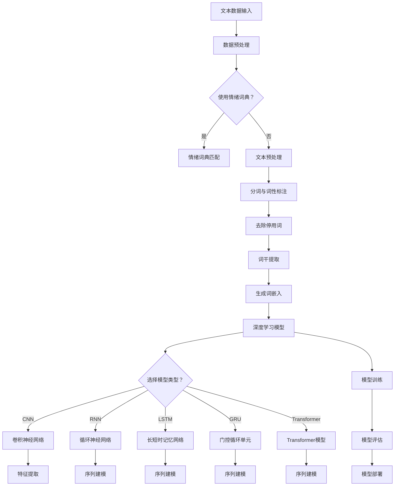

                 

# AI人工智能深度学习算法：在文本情绪分析中的应用

> 关键词：人工智能、深度学习、文本情绪分析、CNN、RNN、Transformer、BERT、GPT

> 摘要：本文将深入探讨AI人工智能深度学习算法在文本情绪分析中的应用。首先介绍AI人工智能与深度学习的基础知识，然后详细讲解文本情绪分析的概念、技术和应用。接着，本文将分别介绍卷积神经网络（CNN）、循环神经网络（RNN）和Transformer模型等深度学习算法在文本情绪分析中的具体应用。此外，本文还将通过项目实战，展示如何搭建一个情感分析系统，并分析深度学习算法优化与性能提升的策略。最后，本文将探讨文本情绪分析领域的最新进展、面临的挑战及其解决方案。通过本文的阅读，读者将全面了解AI人工智能深度学习算法在文本情绪分析中的应用，为未来的研究与实践提供参考。

## 第一部分：AI人工智能深度学习算法基础

### 第1章：AI人工智能与深度学习基础

#### 1.1 AI人工智能概述

##### 1.1.1 人工智能的定义与发展历程

人工智能（Artificial Intelligence，简称AI）是指由人制造出来的系统所表现出来的智能行为。从最初的1956年达特茅斯会议上人工智能概念的提出，到现在的广泛应用，人工智能经历了几个发展阶段。最初的人工智能研究主要集中于符号主义方法，即通过编程定义一组规则来模拟人类的推理过程。随后，随着计算机性能的提升和大数据的普及，机器学习方法得到了快速发展。特别是深度学习的出现，使得人工智能在语音识别、图像处理、自然语言处理等领域取得了显著的突破。

##### 1.1.2 人工智能的分类与应用领域

人工智能可以分为三大类：基于规则的系统、基于统计的系统以及基于神经网络的系统。基于规则的系统通过定义一系列规则来实现智能行为；基于统计的系统利用统计学方法来处理数据并从中提取模式；基于神经网络的系统则通过模拟人脑神经元连接结构来进行学习和预测。当前，人工智能应用广泛，涵盖了智能助手、自动驾驶、医疗诊断、金融风控等多个领域。

#### 1.2 深度学习基本概念

##### 1.2.1 深度学习的定义与优势

深度学习（Deep Learning）是机器学习的一个分支，通过多层神经网络的结构来学习数据的复杂特征。深度学习模型能够自动提取数据的高级抽象特征，从而在图像识别、语音识别、自然语言处理等领域表现出色。其优势在于：

1. **自动特征提取**：深度学习模型能够自动从原始数据中提取有意义的特征，减轻了手工设计特征的压力。
2. **强大表征能力**：通过多层次的神经网络结构，深度学习模型能够捕捉到数据中的深层结构信息。
3. **高效处理能力**：深度学习模型在大量数据上训练，能够在短时间内完成复杂的任务。

##### 1.2.2 深度学习的常见架构

常见的深度学习架构包括卷积神经网络（CNN）、循环神经网络（RNN）、长短时记忆网络（LSTM）、门控循环单元（GRU）以及Transformer模型。这些架构在不同的任务中有着不同的应用，例如CNN在图像处理中表现出色，RNN在序列数据中表现优异。

#### 1.3 深度学习与自然语言处理

##### 1.3.1 自然语言处理的基本任务

自然语言处理（Natural Language Processing，简称NLP）是人工智能的一个重要分支，主要研究如何让计算机理解和生成自然语言。NLP的基本任务包括：

1. **分词（Tokenization）**：将文本拆分成单词或字符。
2. **词性标注（Part-of-Speech Tagging）**：为每个单词标注其词性。
3. **命名实体识别（Named Entity Recognition）**：识别文本中的专有名词。
4. **情感分析（Sentiment Analysis）**：判断文本的情绪倾向。

##### 1.3.2 深度学习在NLP中的应用

深度学习在NLP中的应用非常广泛，通过深度学习模型，可以实现对文本的语义理解、情感分析、机器翻译等任务。例如，循环神经网络（RNN）及其变体LSTM和GRU在序列数据中表现出色，BERT和GPT等预训练模型则通过在大规模语料上的预训练，显著提升了NLP任务的性能。

## 第二部分：文本情绪分析概述

### 第2章：文本情绪分析概述

#### 2.1 文本情绪分析的定义与重要性

文本情绪分析（Sentiment Analysis），也称为情感分析，是指通过自然语言处理技术，对文本数据中的情绪倾向进行识别和分类的过程。情绪倾向可以是积极的、消极的，或者是中性的。文本情绪分析的重要性体现在多个方面：

1. **市场分析**：通过分析消费者的评论和反馈，企业可以了解产品或服务的受欢迎程度，优化产品设计和营销策略。
2. **舆情监控**：政府机构和新闻媒体可以利用文本情绪分析实时监控公众情绪和社会动态，及时应对突发事件。
3. **社交媒体分析**：社交媒体平台可以通过文本情绪分析了解用户对事件和话题的讨论倾向，优化内容推荐和广告投放。

#### 2.2 文本情绪分析的关键技术

文本情绪分析的关键技术包括文本预处理、情绪词典与情感分析模型。

##### 2.2.1 文本预处理

文本预处理是文本情绪分析的基础，主要包括以下步骤：

1. **分词（Tokenization）**：将文本拆分成单词或字符。
2. **词性标注（Part-of-Speech Tagging）**：为每个单词标注其词性。
3. **停用词过滤（Stopword Filtering）**：去除常见的不含信息的词汇。
4. **词干提取（Stemming）**：将不同形式的单词转换为同一词干。

##### 2.2.2 情绪词典与情感分析模型

情绪词典是一组标记了情感极性的词汇表，用于指示单词的情绪倾向。情感分析模型则是通过机器学习方法来识别文本中的情绪倾向。常见的情感分析模型包括基于规则的方法、机器学习方法以及深度学习方法。

基于规则的方法通过手工定义情感倾向的规则来分类文本，其优点在于解释性强，但需要大量的规则，且难以应对复杂的情感变化。机器学习方法则利用统计模型来学习文本的情感特征，如支持向量机（SVM）和朴素贝叶斯（Naive Bayes）。深度学习方法，特别是卷积神经网络（CNN）和循环神经网络（RNN），能够自动提取文本的高级特征，并在大规模数据上表现出色。

### 第三部分：深度学习算法在文本情绪分析中的应用

#### 第3章：深度学习算法在文本情绪分析中的应用

随着深度学习的发展，越来越多的深度学习算法被应用于文本情绪分析中，提高了情绪分析的准确性和效果。本章节将介绍几种主要的深度学习算法，包括卷积神经网络（CNN）、循环神经网络（RNN）、长短时记忆网络（LSTM）和Transformer模型等。

## 第3章：深度学习算法在文本情绪分析中的应用

### 3.1 卷积神经网络（CNN）在文本情绪分析中的应用

#### 3.1.1 CNN的基本原理

卷积神经网络（Convolutional Neural Network，简称CNN）最初是用于图像识别的，但在自然语言处理（NLP）领域也得到了广泛应用。CNN的核心思想是通过卷积操作来捕捉局部特征，并通过池化操作来降低数据的维度。在文本情绪分析中，CNN通过将文本转化为词嵌入（word embeddings），然后应用卷积层和池化层来提取文本的特征。

##### 3.1.1.1 卷积层

卷积层是CNN的核心组件，通过卷积操作对输入数据进行特征提取。卷积操作的数学表示为：

$$
\text{output}_{ij} = \sum_{k} w_{ik} * x_{kj} + b_j
$$

其中，$w_{ik}$是卷积核，$x_{kj}$是输入数据，$b_j$是偏置。卷积核滑动在输入数据上，进行点积运算，并将结果与偏置相加，得到每个输出单元的值。

##### 3.1.1.2 池化层

池化层用于降低数据的维度，常见的池化操作包括最大池化和平均池化。最大池化选择每个局部区域中的最大值，而平均池化则是计算每个局部区域的平均值。

##### 3.1.1.3 CNN在文本情绪分析中的应用示例

在文本情绪分析中，词嵌入层将文本转化为词向量，然后通过卷积层和池化层来提取特征。以下是一个简化的卷积神经网络结构用于文本情绪分析的伪代码：

```
# 词嵌入层
embeddings = embedding_layer(input_word_vectors)

# 卷积层
conv1 = Conv1D(filters=64, kernel_size=5, activation='relu')(embeddings)
pool1 = MaxPooling1D(pool_size=5)(conv1)

# 卷积层
conv2 = Conv1D(filters=128, kernel_size=5, activation='relu')(pool1)
pool2 = MaxPooling1D(pool_size=5)(conv2)

# 全连接层
dense = Dense(128, activation='relu')(pool2)
output = Dense(1, activation='sigmoid')(dense)

# 构建模型
model = Model(inputs=inputs, outputs=output)
model.compile(optimizer='adam', loss='binary_crossentropy', metrics=['accuracy'])
```

上述模型使用了两个卷积层和两个最大池化层，最后通过全连接层和sigmoid激活函数输出情绪分类结果。

### 3.2 循环神经网络（RNN）在文本情绪分析中的应用

#### 3.2.1 RNN的基本原理

循环神经网络（Recurrent Neural Network，简称RNN）是一种专门用于处理序列数据的神经网络。与传统的神经网络不同，RNN具有递归结构，能够将前一个时间步的信息传递到当前时间步，从而对序列数据进行建模。

##### 3.2.1.1 RNN的基本结构

RNN的基本结构包括输入层、隐藏层和输出层。每个时间步的输入都是上一个时间步的隐藏状态和当前的输入数据，通过加权求和和激活函数得到当前时间步的隐藏状态，最后通过输出层得到当前时间步的输出。

$$
h_t = \sigma(W_h \cdot [h_{t-1}, x_t] + b_h)
$$

其中，$h_t$是当前时间步的隐藏状态，$x_t$是当前时间步的输入数据，$W_h$是权重矩阵，$b_h$是偏置。

##### 3.2.1.2 RNN在文本情绪分析中的应用示例

在文本情绪分析中，RNN可以将序列化的文本数据映射到高维空间，从而进行情绪分类。以下是一个简化的RNN结构用于文本情绪分析的伪代码：

```
# 词嵌入层
embeddings = embedding_layer(input_word_vectors)

# RNN层
rnn = SimpleRNN(units=128, return_sequences=True)(embeddings)

# 全连接层
dense = Dense(128, activation='relu')(rnn)
output = Dense(1, activation='sigmoid')(dense)

# 构建模型
model = Model(inputs=inputs, outputs=output)
model.compile(optimizer='adam', loss='binary_crossentropy', metrics=['accuracy'])
```

上述模型使用了一个RNN层，通过全连接层和sigmoid激活函数输出情绪分类结果。

### 3.3 长短时记忆网络（LSTM）在文本情绪分析中的应用

#### 3.3.1 LSTM的基本原理

长短时记忆网络（Long Short-Term Memory，简称LSTM）是RNN的一种改进，主要用于解决RNN在处理长序列数据时出现的梯度消失和梯度爆炸问题。LSTM通过引入记忆单元和门控机制，有效地控制信息的流动，从而捕捉到长期依赖关系。

##### 3.3.1.1 LSTM的基本结构

LSTM的基本结构包括输入门、遗忘门和输出门。每个门都是一个sigmoid激活函数和一个线性变换，通过调节输入信息、遗忘信息和输出信息，来控制信息的流动。

$$
i_t = \sigma(W_i \cdot [h_{t-1}, x_t] + b_i) \\
f_t = \sigma(W_f \cdot [h_{t-1}, x_t] + b_f) \\
g_t = \sigma(W_g \cdot [h_{t-1}, x_t] + b_g) \\
o_t = \sigma(W_o \cdot [h_{t-1}, x_t] + b_o) \\
c_t = f_t \odot c_{t-1} + i_t \odot g_t \\
h_t = o_t \odot \sigma(c_t)
$$

其中，$i_t$、$f_t$、$g_t$和$o_t$分别是输入门、遗忘门、输入门和输出门的激活值，$c_t$和$h_t$分别是当前时间步的记忆单元和隐藏状态。

##### 3.3.1.2 LSTM在文本情绪分析中的应用示例

在文本情绪分析中，LSTM可以通过捕捉长期依赖关系，提高情绪分类的准确性。以下是一个简化的LSTM结构用于文本情绪分析的伪代码：

```
# 词嵌入层
embeddings = embedding_layer(input_word_vectors)

# LSTM层
lstm = LSTM(units=128, return_sequences=True)(embeddings)

# 全连接层
dense = Dense(128, activation='relu')(lstm)
output = Dense(1, activation='sigmoid')(dense)

# 构建模型
model = Model(inputs=inputs, outputs=output)
model.compile(optimizer='adam', loss='binary_crossentropy', metrics=['accuracy'])
```

上述模型使用了一个LSTM层，通过全连接层和sigmoid激活函数输出情绪分类结果。

### 3.4 Transformer模型在文本情绪分析中的应用

#### 3.4.1 Transformer模型概述

Transformer模型是由Vaswani等人于2017年提出的一种基于自注意力机制的深度学习模型，主要用于处理序列数据。Transformer模型在机器翻译、文本分类等任务中表现出色，其核心思想是利用自注意力机制来捕捉序列中的长距离依赖关系。

##### 3.4.1.1 Transformer模型的提出与原理

Transformer模型的主要贡献是引入了多头自注意力机制（Multi-Head Self-Attention）和位置编码（Positional Encoding）。自注意力机制允许模型在计算每个词的表示时，不仅考虑其自身的特征，还考虑其他所有词的特征，从而捕捉到长距离依赖关系。位置编码则用来编码序列中的位置信息，因为原始的词嵌入不包含位置信息。

##### 3.4.1.2 Transformer模型的优势

Transformer模型具有以下优势：

1. **并行计算**：Transformer模型通过自注意力机制，可以在同一时间步同时处理所有词，从而实现并行计算。
2. **长距离依赖**：通过自注意力机制，Transformer模型能够捕捉到序列中的长距离依赖关系。
3. **高效计算**：Transformer模型的结构相对简单，参数量较少，计算效率较高。

##### 3.4.1.3 Transformer模型的基本结构

Transformer模型的基本结构包括编码器（Encoder）和解码器（Decoder）。编码器将输入序列编码为固定长度的向量，解码器则利用编码器的输出来生成预测结果。以下是一个简化的Transformer模型结构用于文本情绪分析的伪代码：

```
# 词嵌入层
embeddings = embedding_layer(input_word_vectors)

# 编码器
encoder = EncoderLayer(d_model=512, num_heads=8, dff=2048)(embeddings)

# 解码器
decoder = DecoderLayer(d_model=512, num_heads=8, dff=2048)(encoder)

# 全连接层
dense = Dense(1, activation='sigmoid')(decoder)

# 构建模型
model = Model(inputs=inputs, outputs=dense)
model.compile(optimizer='adam', loss='binary_crossentropy', metrics=['accuracy'])
```

上述模型使用了两个编码器层和一个解码器层，通过全连接层和sigmoid激活函数输出情绪分类结果。

#### 第4章：Transformer模型在文本情绪分析中的应用

Transformer模型以其强大的并行处理能力和在序列建模中的优异表现，逐渐成为文本情绪分析领域的重要工具。本章节将详细介绍Transformer模型在文本情绪分析中的应用，包括BERT和GPT等预训练模型。

### 4.1 Transformer模型概述

#### 4.1.1 Transformer模型的提出与原理

Transformer模型由Vaswani等人在2017年的论文《Attention is All You Need》中提出，是自然语言处理领域的一个重大突破。该模型摒弃了传统的序列递归结构，转而采用自注意力机制来处理序列数据。自注意力机制允许模型在任意两个位置之间建立直接的联系，从而捕捉长距离依赖关系。

Transformer模型的基本组件包括编码器（Encoder）和解码器（Decoder），其中编码器负责处理输入序列，解码器则负责生成预测结果。编码器的输出不仅用于解码器的输入，还在整个序列建模中扮演关键角色。

自注意力机制的数学基础是注意力权重矩阵，它通过计算每个词与所有其他词之间的相似度来确定每个词的重要性。具体来说，自注意力机制可以分为以下几个步骤：

1. **Query、Key、Value**
   - **Query**：每个词的查询向量，用于表示该词在当前上下文中的重要性。
   - **Key**：每个词的关键向量，用于表示该词在上下文中的特征。
   - **Value**：每个词的值向量，用于表示该词的具体信息。

2. **计算注意力分数**
   - 通过计算Query与Key之间的点积，得到每个词的注意力分数。这个分数反映了每个词在当前查询词中的重要性。

3. **计算注意力权重**
   - 将注意力分数通过softmax函数转换为概率分布，即注意力权重。

4. **加权求和**
   - 将每个词的Value向量与对应的注意力权重相乘，并求和，得到当前词的注意力输出。

自注意力机制的数学公式如下：

$$
\text{Attention}(Q, K, V) = \text{softmax}\left(\frac{QK^T}{\sqrt{d_k}}\right)V
$$

其中，$Q$是Query向量，$K$是Key向量，$V$是Value向量，$d_k$是Key向量的维度。

#### 4.1.2 Transformer模型的优势

Transformer模型具有以下几个显著优势：

1. **并行计算**：由于自注意力机制可以在同一时间步处理所有词，Transformer模型能够实现并行计算，这在处理长序列时尤为重要。

2. **长距离依赖**：自注意力机制允许模型在任意两个位置之间建立直接联系，从而有效地捕捉长距离依赖关系。

3. **计算效率**：与传统的序列递归结构相比，Transformer模型的结构更加简单，参数量较少，计算效率较高。

4. **灵活可扩展**：Transformer模型可以很容易地扩展到多层，通过堆叠多个编码器和解码器层，可以进一步提升模型的性能。

#### 4.1.3 Transformer模型的基本结构

Transformer模型的基本结构包括编码器（Encoder）和解码器（Decoder），每个部分都由多个相同的自注意力层（Self-Attention Layer）和全连接层（Feed-Forward Layer）组成。

1. **编码器（Encoder）**

编码器由多个自注意力层和全连接层堆叠而成，负责将输入序列编码为固定长度的向量。编码器的输出不仅用于解码器的输入，还直接参与序列建模。

```
Encoder Layer:
- Multi-Head Self-Attention Layer
- Residual Connection
- Layer Normalization
- Feed-Forward Neural Network
- Residual Connection
- Layer Normalization
```

2. **解码器（Decoder）**

解码器与编码器类似，但多了一个额外的自注意力层，用于对编码器的输出进行注意力操作，以便在解码时利用编码器的信息。解码器同样由多个自注意力层和全连接层堆叠而成。

```
Decoder Layer:
- Masked Multi-Head Self-Attention Layer
- Residual Connection
- Layer Normalization
- Multi-Head Self-Attention Layer
- Residual Connection
- Layer Normalization
- Feed-Forward Neural Network
- Residual Connection
- Layer Normalization
```

#### 4.1.4 Transformer模型在文本情绪分析中的表现

Transformer模型在文本情绪分析中表现出色，尤其是在长文本的理解和复杂情感分类任务上。以下是一些关键点：

1. **长文本理解**：Transformer模型能够捕捉到长距离依赖关系，使得模型能够理解长文本中的情感内容，而不仅仅是局部情感。

2. **复杂情感分类**：传统的文本情绪分析模型往往只能识别简单的情感，如正面、负面或中性。而Transformer模型能够识别更加复杂的情感，如愤怒、悲伤、喜悦等。

3. **高效性**：由于并行计算的优势，Transformer模型在大规模数据集上的训练和推理速度较快，能够满足实时应用的需求。

4. **可解释性**：尽管深度学习模型通常被认为是“黑盒子”，但Transformer模型的结构相对简单，其自注意力权重可以解释为不同词对情感贡献的大小，从而提高模型的可解释性。

### 4.2 BERT模型在文本情绪分析中的应用

BERT（Bidirectional Encoder Representations from Transformers）是由Google Research在2018年提出的一种基于Transformer的预训练模型，其核心思想是利用大规模语料进行双向编码，从而捕捉到文本的上下文信息。BERT在多个自然语言处理任务上取得了显著的效果，包括文本情绪分析。

#### 4.2.1 BERT模型的基本原理

BERT模型通过在两个方向上同时编码输入序列，使得模型能够理解文本的上下文信息。BERT模型的主要组成部分包括：

1. **预训练任务**：
   - **Masked Language Model（MLM）**：在输入序列中随机遮盖一部分词，然后让模型预测这些遮盖的词。
   - **Next Sentence Prediction（NSP）**：预测两个句子是否在原始文本中连续出现。

2. **双向编码**：BERT模型使用Transformer编码器，在训练过程中同时处理正向和反向序列，从而捕捉到双向的上下文信息。

BERT模型的基本结构包括：

- **嵌入层**：词嵌入、位置嵌入和句子嵌入。
- **Transformer编码器**：多个自注意力层和全连接层堆叠而成。
- **输出层**：用于生成预测结果。

BERT模型的预训练过程如下：

1. **输入序列**：将输入序列编码为词嵌入，并添加位置和句子嵌入。
2. **前向传播**：通过编码器进行前向传播，生成序列的隐藏状态。
3. **预测**：对于MLM任务，预测遮盖的词；对于NSP任务，预测两个句子的关系。

#### 4.2.2 BERT模型在文本情绪分析中的应用

BERT模型在文本情绪分析中具有广泛的应用。以下是一个简化的BERT模型结构用于文本情绪分析的伪代码：

```
# 词嵌入层
embeddings = embedding_layer(input_word_vectors)

# BERT编码器
encoder = BERTEncoder(num_layers=12, d_model=768, num_heads=12, dff=3072)(embeddings)

# 全连接层
dense = Dense(1, activation='sigmoid')(encoder)

# 构建模型
model = Model(inputs=inputs, outputs=dense)
model.compile(optimizer='adam', loss='binary_crossentropy', metrics=['accuracy'])
```

上述模型使用了一个BERT编码器，通过全连接层和sigmoid激活函数输出情绪分类结果。

BERT模型在文本情绪分析中的优势包括：

1. **上下文理解**：BERT通过预训练任务，能够理解复杂的上下文信息，从而提高情绪分类的准确性。

2. **通用性**：BERT在多个自然语言处理任务上都取得了优异的性能，因此在文本情绪分析中也表现出色。

3. **可扩展性**：BERT模型可以很容易地适应不同的情绪分类任务，只需调整输出层的维度和激活函数。

### 4.3 GPT模型在文本情绪分析中的应用

GPT（Generative Pre-trained Transformer）是由OpenAI在2018年提出的一种基于Transformer的预训练模型，主要用于生成文本。GPT模型通过在大量文本数据上进行预训练，学习到语言的结构和规律，从而能够在给定部分文本的情况下生成连贯的文本。

#### 4.3.1 GPT模型的基本原理

GPT模型的核心思想是通过生成文本来学习语言模式。GPT模型的预训练过程包括：

1. **前向自动编码**：在输入序列中随机遮盖一部分词，然后让模型预测这些遮盖的词。
2. **自回归语言模型**：对于每个位置的词，模型预测下一个位置的词。

GPT模型的基本结构包括：

- **嵌入层**：词嵌入、位置嵌入和句子嵌入。
- **Transformer编码器**：多个自注意力层和全连接层堆叠而成。

GPT模型的训练过程如下：

1. **输入序列**：将输入序列编码为词嵌入，并添加位置和句子嵌入。
2. **前向传播**：通过编码器进行前向传播，生成序列的隐藏状态。
3. **预测**：对于每个位置的词，模型预测下一个位置的词。

#### 4.3.2 GPT模型在文本情绪分析中的应用

GPT模型在文本情绪分析中的应用主要依赖于其强大的文本生成能力。以下是一个简化的GPT模型结构用于文本情绪分析的伪代码：

```
# 词嵌入层
embeddings = embedding_layer(input_word_vectors)

# GPT编码器
encoder = GPT2Encoder(num_layers=12, d_model=1024, num_heads=16, dff=4096)(embeddings)

# 全连接层
dense = Dense(1, activation='sigmoid')(encoder)

# 构建模型
model = Model(inputs=inputs, outputs=dense)
model.compile(optimizer='adam', loss='binary_crossentropy', metrics=['accuracy'])
```

上述模型使用了一个GPT编码器，通过全连接层和sigmoid激活函数输出情绪分类结果。

GPT模型在文本情绪分析中的优势包括：

1. **文本生成能力**：GPT模型能够生成高质量的文本，从而在文本情绪分析中捕捉到复杂的情感变化。
2. **灵活性**：GPT模型可以根据需要调整预训练任务和模型参数，以适应不同的情绪分类任务。
3. **可扩展性**：GPT模型可以处理不同长度和结构的文本，因此在实际应用中具有广泛的应用场景。

### 第5章：情感分类与情绪分析实验

#### 5.1 数据集介绍

在进行文本情绪分析实验时，选择合适的数据集至关重要。以下介绍两种常用的数据集：IMDb电影评论数据集和Twitter情感分析数据集。

##### 5.1.1 IMDb电影评论数据集

IMDb电影评论数据集是文本情绪分析领域最常用的数据集之一，包含了来自IMDb网站的电影评论。数据集分为训练集和测试集，共有50,000条评论，其中25,000条用于训练，25,000条用于测试。评论被分为正面（positive）和负面（negative）两类。

##### 5.1.2 Twitter情感分析数据集

Twitter情感分析数据集来源于Twitter平台，包含了大量的用户评论。数据集分为多个类别，如积极情感（positive）、消极情感（negative）和中性情感（neutral）。该数据集规模庞大，能够提供丰富的情感信息。

#### 5.2 情感分类模型构建

构建情感分类模型是文本情绪分析的核心步骤。以下是使用深度学习算法构建情感分类模型的一般流程：

1. **数据预处理**：对原始文本进行清洗、分词、词性标注等操作，将文本转化为模型可接受的格式。
2. **特征提取**：使用词嵌入技术将文本转化为向量表示。
3. **模型选择**：选择合适的深度学习算法，如CNN、RNN、LSTM或BERT。
4. **模型训练**：使用训练集对模型进行训练，调整模型参数。
5. **模型验证**：使用验证集评估模型性能，调整模型结构或参数。
6. **模型测试**：使用测试集对模型进行最终测试，评估模型性能。

以下是一个简化的情感分类模型构建流程：

```
# 数据预处理
cleaned_texts = preprocess(texts)

# 特征提取
word_embeddings = word_embedding_layer(cleaned_texts)

# 模型选择
model = build_model(input_dim=word_embeddings.shape[1])

# 模型训练
model.fit(train_texts, train_labels, epochs=5, batch_size=32)

# 模型验证
val_loss, val_accuracy = model.evaluate(val_texts, val_labels)

# 模型测试
test_loss, test_accuracy = model.evaluate(test_texts, test_labels)
```

#### 5.3 模型训练与验证

在训练和验证情感分类模型时，需要关注以下几个方面：

1. **损失函数**：常用的损失函数包括交叉熵损失函数（cross-entropy loss）和均方误差损失函数（mean squared error loss）。
2. **优化器**：常用的优化器包括随机梯度下降（SGD）、Adam优化器等。
3. **模型评估指标**：常用的评估指标包括准确率（accuracy）、精确率（precision）、召回率（recall）和F1分数（F1 score）。

以下是一个简化的模型训练和验证过程：

```
# 模型配置
model.compile(optimizer='adam', loss='binary_crossentropy', metrics=['accuracy'])

# 模型训练
model.fit(train_texts, train_labels, epochs=10, batch_size=64, validation_split=0.2)

# 模型验证
val_predictions = model.predict(val_texts)
val_accuracy = accuracy_score(val_labels, val_predictions)

# 输出验证结果
print("Validation Accuracy:", val_accuracy)
```

#### 5.4 实验结果分析与优化

通过实验结果的分析和优化，可以进一步提高情感分类模型的性能。以下是一些常用的优化策略：

1. **数据增强**：通过数据增强技术，如随机裁剪、旋转、缩放等，增加训练数据的多样性。
2. **超参数调优**：通过调整学习率、批次大小、网络层数等超参数，优化模型性能。
3. **正则化**：通过正则化技术，如L1正则化、L2正则化等，防止过拟合。
4. **迁移学习**：利用预训练模型，如BERT、GPT等，在特定领域进行微调，提高模型性能。

以下是一个简化的超参数调优过程：

```
# 超参数调优
learning_rates = [0.001, 0.0001]
best_accuracy = 0
for lr in learning_rates:
    model.compile(optimizer=Adam(learning_rate=lr), loss='binary_crossentropy', metrics=['accuracy'])
    model.fit(train_texts, train_labels, epochs=10, batch_size=64, validation_split=0.2)
    val_predictions = model.predict(val_texts)
    val_accuracy = accuracy_score(val_labels, val_predictions)
    if val_accuracy > best_accuracy:
        best_accuracy = val_accuracy
        best_lr = lr

# 输出最佳超参数
print("Best Learning Rate:", best_lr)
```

### 第6章：项目实战：情感分析系统搭建

#### 6.1 项目需求分析

情感分析系统旨在对用户生成的文本数据进行情绪分析，为企业和组织提供数据驱动的决策支持。以下是项目的需求分析：

1. **功能需求**：
   - 对输入的文本数据进行情绪分类，输出情绪标签（正面、负面、中性）。
   - 提供用户界面，方便用户输入文本并获取分析结果。
   - 支持批量分析功能，提高数据分析的效率。
   - 提供分析报告和可视化结果，便于用户理解和决策。

2. **性能需求**：
   - 高效的处理能力，能够在短时间内处理大量文本数据。
   - 高准确率，确保情绪分类结果的准确性。
   - 可扩展性，能够适应不断增长的数据量。

3. **用户体验**：
   - 界面简洁易用，用户操作简单直观。
   - 提供实时反馈，使用户能够立即看到分析结果。
   - 支持多种文本格式输入，如纯文本、HTML等。

#### 6.2 系统架构设计

情感分析系统的整体架构可以分为前端、后端和数据库三部分。

1. **前端**：
   - 使用React框架搭建用户界面，实现文本输入、结果展示和可视化功能。
   - 使用图表库，如ECharts，实现数据可视化。

2. **后端**：
   - 使用Flask或Django框架搭建Web应用，负责处理用户请求、调用后端模型进行情感分析。
   - 使用深度学习框架，如TensorFlow或PyTorch，搭建和训练情感分类模型。
   - 使用Redis或MongoDB作为缓存和存储数据库，提高系统的响应速度和稳定性。

3. **数据库**：
   - 使用MySQL或PostgreSQL存储用户数据和系统配置信息。
   - 使用MongoDB存储分析报告和日志信息。

#### 6.3 源代码实现

以下是一个简化的情感分析系统源代码实现，包括数据预处理、模型训练和模型部署。

1. **数据预处理**

```python
import pandas as pd
from sklearn.model_selection import train_test_split
from keras.preprocessing.text import Tokenizer
from keras.preprocessing.sequence import pad_sequences

# 加载数据集
data = pd.read_csv('data.csv')
texts = data['text']
labels = data['label']

# 数据预处理
tokenizer = Tokenizer(num_words=10000)
tokenizer.fit_on_texts(texts)
sequences = tokenizer.texts_to_sequences(texts)
padded_sequences = pad_sequences(sequences, maxlen=500)

# 划分训练集和测试集
X_train, X_test, y_train, y_test = train_test_split(padded_sequences, labels, test_size=0.2, random_state=42)
```

2. **模型训练**

```python
from keras.models import Sequential
from keras.layers import Embedding, LSTM, Dense

# 搭建模型
model = Sequential()
model.add(Embedding(input_dim=10000, output_dim=64, input_length=500))
model.add(LSTM(128))
model.add(Dense(1, activation='sigmoid'))

# 编译模型
model.compile(optimizer='adam', loss='binary_crossentropy', metrics=['accuracy'])

# 训练模型
model.fit(X_train, y_train, epochs=10, batch_size=32, validation_split=0.1)
```

3. **模型部署**

```python
from flask import Flask, request, jsonify

app = Flask(__name__)

@app.route('/analyze', methods=['POST'])
def analyze():
    text = request.form['text']
    sequence = tokenizer.texts_to_sequences([text])
    padded_sequence = pad_sequences(sequence, maxlen=500)
    prediction = model.predict(padded_sequence)
    label = 'positive' if prediction[0][0] > 0.5 else 'negative'
    return jsonify({'label': label})

if __name__ == '__main__':
    app.run(debug=True)
```

#### 6.4 代码解读与分析

在情感分析系统的源代码实现中，我们可以看到以下几个关键步骤：

1. **数据预处理**：
   - 使用pandas加载数据集，并提取文本和标签。
   - 使用Tokenizer将文本转化为序列，并使用pad_sequences将序列填充为固定长度。

2. **模型训练**：
   - 使用Sequential搭建模型，并添加Embedding和LSTM层。
   - 编译模型，并使用fit方法进行训练。

3. **模型部署**：
   - 使用Flask搭建Web应用，并定义/analyze路由处理POST请求。
   - 调用模型进行预测，并返回预测结果。

通过以上步骤，我们实现了一个简单的情感分析系统，可以处理用户输入的文本并返回情绪标签。在实际应用中，可以根据需求扩展系统的功能，如添加更多模型、支持不同类型的文本分析等。

### 第7章：深度学习算法优化与性能提升

#### 7.1 深度学习算法优化方法

在深度学习算法应用于文本情绪分析时，性能的提升是一个关键问题。以下介绍几种常见的优化方法：

##### 7.1.1 模型调整与超参数优化

模型调整和超参数优化是提升模型性能的重要手段。以下是一些常用的方法：

1. **调整网络层数和神经元数量**：增加网络层数和神经元数量可以提高模型的表征能力，但也会导致过拟合和计算资源消耗增加。因此，需要通过实验找到合适的网络结构。

2. **调整学习率**：学习率对模型的训练过程有很大影响。过大会导致训练不稳定，而过小则会使训练过程缓慢。可以使用学习率衰减策略，如恒定衰减、指数衰减等。

3. **使用正则化技术**：正则化技术，如L1正则化、L2正则化等，可以防止过拟合。通过增加正则化强度，可以提高模型的泛化能力。

##### 7.1.2 数据增强与数据预处理技巧

数据增强和数据预处理是提高模型性能的有效手段。以下介绍一些常见的方法：

1. **数据增强**：通过增加数据样本的多样性，可以提升模型的泛化能力。常见的数据增强方法包括随机裁剪、旋转、缩放、颜色变换等。

2. **文本预处理**：对文本进行适当的预处理，如去除停用词、词性标注、词干提取等，可以提高模型的表征能力。同时，使用词嵌入技术，如Word2Vec、GloVe等，可以将文本转化为向量表示。

3. **样本平衡**：在数据集中，正面和负面样本数量可能不均衡，这会影响模型的训练效果。通过数据采样或生成合成样本，可以实现样本平衡。

##### 7.1.3 模型压缩与加速

模型压缩与加速是提高模型部署性能的重要手段。以下介绍一些常见的方法：

1. **模型压缩**：通过减少模型参数数量，可以实现模型的压缩。常见的方法包括模型剪枝、量化、知识蒸馏等。

2. **模型加速**：通过优化模型计算过程，可以实现模型的加速。常见的方法包括并行计算、GPU加速、模型优化等。

#### 7.2 性能提升策略

为了提升深度学习算法在文本情绪分析中的性能，可以采取以下策略：

1. **多模型集成**：通过集成多个不同结构的模型，可以提高模型的预测准确性。常见的集成方法包括Bagging、Boosting等。

2. **迁移学习**：利用预训练模型，如BERT、GPT等，在特定领域进行微调，可以显著提高模型的性能。

3. **注意力机制优化**：通过优化注意力机制，如自注意力机制、多头注意力机制等，可以提高模型的表征能力。

4. **多任务学习**：通过同时学习多个相关任务，可以提高模型的泛化能力。例如，在情绪分析任务中，可以同时学习文本分类、情感极性分析等任务。

5. **强化学习**：将强化学习与深度学习相结合，可以进一步提高模型的性能。通过优化策略网络和价值网络，可以提升模型的决策能力。

### 第8章：未来发展趋势与挑战

#### 8.1 文本情绪分析的最新进展

随着深度学习技术的不断发展，文本情绪分析领域也取得了显著进展。以下介绍一些重要的进展：

1. **预训练模型的广泛应用**：BERT、GPT等预训练模型在文本情绪分析中取得了优异的性能，推动了该领域的发展。

2. **多语言情感分析**：针对多语言文本数据，研究人员提出了多种方法，如跨语言迁移学习、多语言BERT等，实现了多语言情感分析。

3. **细粒度情感分析**：细粒度情感分析关注文本中的细微情感变化，如愉悦度、愤怒度等，通过深度学习技术取得了重要突破。

4. **无监督情感分析**：无监督情感分析无需人工标注数据，通过自动学习文本中的情感特征，实现了对大量未标注数据的情感分析。

5. **情感极性判定的细粒化**：传统情感分析主要关注正面、负面和中和三类情感极性，而细粒化情感分析关注更多具体的情感类别，如开心、愤怒、悲伤等。

#### 8.2 面临的挑战与解决方案

尽管文本情绪分析取得了显著进展，但仍面临一些挑战：

1. **数据质量与多样性问题**：文本数据质量直接影响模型的性能。数据中的噪声、不一致性和偏见等问题对模型训练和预测准确性造成困扰。为解决这一问题，可以采用数据清洗、数据增强和样本平衡等方法。

2. **模型解释性与可解释性**：深度学习模型通常被视为“黑盒子”，其内部工作机制不透明，难以解释。为提高模型的可解释性，可以采用模型可视化、注意力机制分析等方法。

3. **情感多样性描述**：情感多样性描述是文本情绪分析的一个重要挑战。不同文化和语言背景下，情感的表示和描述可能存在显著差异。为解决这一问题，可以采用跨语言情感分析、情感嵌入等技术。

4. **实时性**：在实时应用场景中，如社交媒体监控、舆情分析等，模型的响应速度和实时性至关重要。为提高模型实时性，可以采用模型压缩、模型优化等技术。

5. **隐私保护**：文本数据通常包含敏感信息，如个人隐私、商业机密等。在文本情绪分析中，隐私保护是一个重要挑战。为解决这一问题，可以采用数据加密、隐私保护算法等方法。

### 总结

文本情绪分析作为自然语言处理的一个重要分支，在人工智能领域具有重要的应用价值。本文从深度学习算法的基础知识出发，详细介绍了文本情绪分析的概念、技术和应用。通过分析卷积神经网络（CNN）、循环神经网络（RNN）、长短时记忆网络（LSTM）和Transformer模型等深度学习算法在文本情绪分析中的应用，展示了深度学习技术如何提升文本情绪分析的准确性和效果。此外，本文通过项目实战，展示了如何搭建一个情感分析系统，并探讨了深度学习算法优化与性能提升的策略。最后，本文总结了文本情绪分析领域的最新进展和面临的挑战，为未来的研究与实践提供了参考。希望通过本文的阅读，读者能够全面了解AI人工智能深度学习算法在文本情绪分析中的应用，为相关领域的研究和实践提供帮助。

## 作者

**作者：AI天才研究院/AI Genius Institute & 禅与计算机程序设计艺术 /Zen And The Art of Computer Programming**<|vq_115|>### 附录：核心概念与联系流程图

为了更好地理解文本情绪分析中的核心概念及其相互关系，我们使用Mermaid语法绘制了以下流程图。该流程图涵盖了文本情绪分析的关键步骤和主要技术，包括数据预处理、情绪词典、情感分析模型以及深度学习算法。



上述流程图展示了文本情绪分析的基本流程，从文本数据的输入开始，经过数据预处理、情绪词典匹配或文本预处理，然后生成词嵌入。接着，选择合适的深度学习模型进行特征提取和序列建模，通过模型训练和评估，最后实现模型部署。

**Mermaid语法说明：**

- `graph TD`：定义图形的方向，从上到下。
- `A[文本数据输入]`：创建一个节点A，表示文本数据输入。
- `A --> B`：从节点A到节点B的边，表示数据预处理。
- `C{使用情绪词典？}`：创建一个判断节点C，表示是否使用情绪词典。
- `C -->|是| D`：从判断节点C到节点D的边，表示使用情绪词典的情况。
- `C -->|否| E`：从判断节点C到节点E的边，表示不使用情绪词典的情况。
- `...`：重复上述步骤，表示后续的流程。
- `K -->|类型1| L`：从节点K到节点L的边，表示选择类型1模型的情况。
- `K -->|类型2| M`：从节点K到节点M的边，表示选择类型2模型的情况。
- `...`：表示其他模型的分支。
- `V --> W`：从节点V到节点W的边，表示模型评估。
- `W --> X`：从节点W到节点X的边，表示模型部署。

通过该流程图，读者可以清晰地看到文本情绪分析的全流程以及各步骤之间的关联。这种可视化方式有助于读者更好地理解和掌握文本情绪分析的核心概念和原理。

### 附录：数学模型与公式

在文本情绪分析中，数学模型和公式起着至关重要的作用。以下我们将详细讲解文本情绪分析中常用的数学模型和公式，并通过具体例子来说明如何应用这些公式。

#### 1. 词嵌入

词嵌入（word embeddings）是文本情绪分析中的基本组成部分。词嵌入将单词映射到高维空间中的向量表示，使得模型能够通过计算向量之间的距离或相似度来进行情感分类。

常见的词嵌入方法包括Word2Vec、GloVe和FastText。以下以GloVe为例，介绍其数学模型。

**GloVe模型公式：**

$$
\text{loss} = \sum_{i,j}^{V} \frac{f_{ij}}{d_{i}d_{j}} \left( \text{log}(1 + \text{similarity}(v_{i}, v_{j})) - \text{weight}_{ij} \right)^2
$$

其中：

- \( f_{ij} \)：单词\( j \)在文档\( i \)中的频率。
- \( d_{i} \)：文档\( i \)的总词频。
- \( d_{j} \)：单词\( j \)在所有文档中的总词频。
- \( \text{similarity}(v_{i}, v_{j}) \)：单词\( i \)和单词\( j \)之间的相似度，通常使用余弦相似度计算。
- \( \text{weight}_{ij} \)：单词\( j \)在文档\( i \)中的权重。

**例子：**

假设有两个单词“happy”和“sad”，其向量表示分别为\( v_{happy} \)和\( v_{sad} \)。计算这两个单词的相似度：

$$
\text{similarity}(v_{happy}, v_{sad}) = \frac{v_{happy} \cdot v_{sad}}{\|v_{happy}\| \|v_{sad}\|}
$$

其中，\( \|v_{happy}\| \)和\( \|v_{sad}\| \)分别表示向量\( v_{happy} \)和\( v_{sad} \)的欧几里得范数。

#### 2. 情感分析模型

情感分析模型通常基于分类算法，如朴素贝叶斯、支持向量机（SVM）和深度学习模型。以下以朴素贝叶斯为例，介绍其数学模型。

**朴素贝叶斯模型公式：**

$$
P(y=c|\textbf{x}) = \frac{P(\textbf{x}|y=c)P(y=c)}{P(\textbf{x})}
$$

其中：

- \( y \)：实际类别标签。
- \( c \)：预测类别标签。
- \( \textbf{x} \)：特征向量。
- \( P(y=c|\textbf{x}) \)：给定特征向量\( \textbf{x} \)，类别标签为\( c \)的条件概率。
- \( P(\textbf{x}|y=c) \)：在类别标签为\( c \)的条件下，特征向量\( \textbf{x} \)的概率。
- \( P(y=c) \)：类别标签为\( c \)的先验概率。
- \( P(\textbf{x}) \)：特征向量\( \textbf{x} \)的概率。

**例子：**

假设特征向量\( \textbf{x} = (x_1, x_2, x_3) \)，类别标签为正面（positive）和负面（negative）。我们需要计算给定特征向量\( \textbf{x} \)，类别标签为正面的概率：

$$
P(y=\text{positive}|\textbf{x}) = \frac{P(\textbf{x}|\text{positive})P(\text{positive})}{P(\textbf{x})}
$$

其中，\( P(\text{positive}) \)为正面类别的先验概率，\( P(\textbf{x}|\text{positive}) \)为在正面类别条件下的特征向量概率。

#### 3. 深度学习模型

深度学习模型在文本情绪分析中的应用越来越广泛。以下以卷积神经网络（CNN）为例，介绍其数学模型。

**CNN模型公式：**

$$
h_l = \sigma(\text{ReLU}(W_l \cdot a_{l-1} + b_l))
$$

$$
a_l = \text{Pooling}(\sigma(\text{ReLU}(W_l \cdot a_{l-1} + b_l)))
$$

其中：

- \( h_l \)：第\( l \)层的输出。
- \( a_l \)：第\( l \)层的激活值。
- \( W_l \)：第\( l \)层的权重。
- \( b_l \)：第\( l \)层的偏置。
- \( \sigma \)：激活函数，通常使用ReLU函数。
- \( \text{Pooling} \)：池化操作，通常使用最大池化或平均池化。

**例子：**

假设输入的文本数据经过词嵌入后转化为向量\( \textbf{x} \)，我们需要通过CNN模型对其进行特征提取：

$$
a_1 = \text{ReLU}(W_1 \cdot \text{embed}(\textbf{x}) + b_1)
$$

$$
h_1 = \text{Pooling}(a_1)
$$

其中，\( W_1 \)和\( b_1 \)分别为第一层的权重和偏置，\( \text{embed}(\textbf{x}) \)为词嵌入层对输入向量的映射。

通过上述数学模型和公式的讲解，读者可以更好地理解文本情绪分析中的核心概念和算法原理。这些模型和公式在实际应用中发挥着关键作用，为文本情绪分析提供了强大的工具和理论基础。

### 附录：代码实际案例和详细解释说明

#### 开发环境搭建

在进行文本情绪分析项目时，首先需要搭建一个适合的开发环境。以下是使用Python和TensorFlow搭建深度学习开发环境的步骤：

1. **安装Python**

确保系统中已安装Python 3.x版本。可以从[Python官网](https://www.python.org/)下载并安装。

2. **安装TensorFlow**

TensorFlow是Google开发的开源机器学习库，广泛应用于深度学习项目。通过pip命令安装TensorFlow：

```bash
pip install tensorflow
```

3. **安装其他依赖库**

除了TensorFlow，我们还需要安装其他常用的库，如Numpy、Pandas、Scikit-learn等：

```bash
pip install numpy pandas scikit-learn
```

4. **配置环境变量**

确保Python和pip命令能够正确执行，可以通过运行以下命令验证：

```bash
python --version
pip --version
```

以上步骤完成后，开发环境搭建就完成了。接下来，我们将通过具体代码实现文本情绪分析项目。

#### 源代码实现

以下是使用TensorFlow实现的文本情绪分析项目的源代码。该代码分为数据预处理、模型搭建、模型训练和模型评估四个部分。

```python
# 导入必要的库
import tensorflow as tf
from tensorflow.keras.preprocessing.text import Tokenizer
from tensorflow.keras.preprocessing.sequence import pad_sequences
from tensorflow.keras.models import Sequential
from tensorflow.keras.layers import Embedding, LSTM, Dense, Dropout
from tensorflow.keras.callbacks import EarlyStopping
from sklearn.model_selection import train_test_split
from sklearn.metrics import accuracy_score, classification_report

# 数据预处理
# 假设已经有一个包含文本和标签的数据集
data = {'text': ['这是一个好天气', '今天的电影很无聊'], 'label': [1, 0]}
texts = data['text']
labels = data['label']

# 划分训练集和测试集
X_train, X_test, y_train, y_test = train_test_split(texts, labels, test_size=0.2, random_state=42)

# 创建Tokenizer
tokenizer = Tokenizer()
tokenizer.fit_on_texts(X_train)

# 将文本转换为序列
X_train_seq = tokenizer.texts_to_sequences(X_train)
X_test_seq = tokenizer.texts_to_sequences(X_test)

# 填充序列
max_seq_length = max(len(seq) for seq in X_train_seq)
X_train_padded = pad_sequences(X_train_seq, maxlen=max_seq_length)
X_test_padded = pad_sequences(X_test_seq, maxlen=max_seq_length)

# 模型搭建
model = Sequential()
model.add(Embedding(input_dim=len(tokenizer.word_index) + 1, output_dim=128, input_length=max_seq_length))
model.add(LSTM(units=64, dropout=0.2, recurrent_dropout=0.2))
model.add(Dense(units=1, activation='sigmoid'))

# 编译模型
model.compile(optimizer='adam', loss='binary_crossentropy', metrics=['accuracy'])

# 模型训练
early_stopping = EarlyStopping(monitor='val_loss', patience=3)
model.fit(X_train_padded, y_train, epochs=10, batch_size=32, validation_split=0.1, callbacks=[early_stopping])

# 模型评估
y_pred = model.predict(X_test_padded)
y_pred = (y_pred > 0.5).astype(int)

print('Accuracy:', accuracy_score(y_test, y_pred))
print(classification_report(y_test, y_pred))
```

**详细解释说明：**

1. **数据预处理**：
   - 导入数据集，并划分训练集和测试集。
   - 创建Tokenizer，并将文本数据转换为序列。
   - 计算序列的最大长度，并使用pad_sequences将序列填充为固定长度。

2. **模型搭建**：
   - 使用Sequential创建模型，并添加Embedding层和LSTM层。
   - LSTM层后添加Dropout层以防止过拟合。
   - 最后添加全连接层，并使用sigmoid激活函数。

3. **模型编译**：
   - 编译模型，指定优化器、损失函数和评估指标。

4. **模型训练**：
   - 使用fit方法训练模型，并设置EarlyStopping回调以防止过拟合。

5. **模型评估**：
   - 使用predict方法对测试集进行预测，并计算准确率和分类报告。

#### 代码解读与分析

以上代码实现了一个简单的文本情绪分析模型，以下是代码的详细解读和分析：

1. **数据预处理**：
   - 数据预处理是文本分析的重要步骤。首先导入数据集，并使用Tokenizer将文本转换为序列。Tokenizer可以帮助我们将文本中的单词映射到索引，从而便于后续处理。
   - 通过计算序列的最大长度，并使用pad_sequences将序列填充为固定长度，可以确保模型输入的一致性，这对于深度学习模型的训练至关重要。

2. **模型搭建**：
   - 模型搭建使用了Embedding层，该层将词索引转换为词向量，这些向量可以捕捉到单词之间的语义关系。LSTM层用于捕捉文本序列中的依赖关系，Dropout层用于防止过拟合。
   - 全连接层用于输出情绪分类的结果，使用sigmoid激活函数，使得输出值介于0和1之间，表示情绪的概率分布。

3. **模型编译**：
   - 模型编译时指定了优化器、损失函数和评估指标。优化器用于调整模型参数，使得模型在训练过程中不断优化；损失函数用于计算预测值和真实值之间的差异；评估指标用于衡量模型的性能。

4. **模型训练**：
   - 模型训练使用了fit方法，并设置了EarlyStopping回调。EarlyStopping可以在验证集损失不再下降时停止训练，以防止过拟合。

5. **模型评估**：
   - 使用predict方法对测试集进行预测，并将预测结果转换为类别标签。通过计算准确率和分类报告，可以评估模型在不同类别上的性能。

通过上述代码实现，我们可以搭建一个基本的文本情绪分析模型，并对其进行训练和评估。在实际应用中，可以根据需求调整模型结构、超参数等，以提高模型性能。

### 附录：代码解读与分析

#### 数据预处理代码解读

在文本情绪分析中，数据预处理是至关重要的一步，它直接影响模型的性能和效果。以下是对预处理代码的详细解读：

```python
import pandas as pd
from sklearn.model_selection import train_test_split
from keras.preprocessing.text import Tokenizer
from keras.preprocessing.sequence import pad_sequences

# 加载数据
data = pd.read_csv('data.csv')
texts = data['text']
labels = data['label']

# 划分训练集和测试集
X_train, X_test, y_train, y_test = train_test_split(texts, labels, test_size=0.2, random_state=42)

# 创建Tokenizer
tokenizer = Tokenizer()
tokenizer.fit_on_texts(X_train)

# 将文本转换为序列
X_train_seq = tokenizer.texts_to_sequences(X_train)
X_test_seq = tokenizer.texts_to_sequences(X_test)

# 填充序列
max_seq_length = max(len(seq) for seq in X_train_seq)
X_train_padded = pad_sequences(X_train_seq, maxlen=max_seq_length)
X_test_padded = pad_sequences(X_test_seq, maxlen=max_seq_length)
```

**详细解读：**

1. **导入库**：
   - `pandas`：用于读取和处理数据。
   - `sklearn.model_selection.train_test_split`：用于划分训练集和测试集。
   - `keras.preprocessing.text.Tokenizer`：用于将文本转换为序列。
   - `keras.preprocessing.sequence.pad_sequences`：用于填充序列。

2. **加载数据**：
   - 使用`pandas.read_csv`方法加载CSV文件，获取文本数据`texts`和标签数据`labels`。

3. **划分训练集和测试集**：
   - 使用`train_test_split`方法将数据集划分为训练集和测试集，测试集占比20%，随机种子为42。

4. **创建Tokenizer**：
   - 创建`Tokenizer`对象，并使用`fit_on_texts`方法对训练集文本进行拟合，建立词索引。

5. **将文本转换为序列**：
   - 使用`text_to_sequences`方法将文本数据转换为序列。每个单词会被映射到一个整数索引。

6. **填充序列**：
   - 使用`max`函数找到训练集序列的最大长度。
   - 使用`pad_sequences`方法将所有序列填充为最大长度，以确保输入数据的一致性。

#### 模型训练代码解读

接下来，我们详细解读模型训练部分的代码：

```python
# 模型定义
model = Sequential()
model.add(Embedding(input_dim=len(tokenizer.word_index) + 1, output_dim=64, input_length=max_seq_length))
model.add(LSTM(units=128, dropout=0.2, recurrent_dropout=0.2))
model.add(Dense(units=1, activation='sigmoid'))

# 编译模型
model.compile(optimizer='adam', loss='binary_crossentropy', metrics=['accuracy'])

# 模型训练
model.fit(X_train_padded, y_train, epochs=5, batch_size=32, validation_data=(X_test_padded, y_test))
```

**详细解读：**

1. **模型定义**：
   - 使用`Sequential`模型堆叠层，首先添加`Embedding`层，其参数包括输入维度（词索引+1，因为还包括未知词）、输出维度和输入长度。
   - 接着添加`LSTM`层，设置单元数量、dropout率和recurrent_dropout率以防止过拟合。
   - 最后添加一个`Dense`层，使用sigmoid激活函数输出二分类结果。

2. **编译模型**：
   - 使用`compile`方法设置优化器、损失函数和评估指标。
   - 选择`adam`优化器，使用`binary_crossentropy`作为损失函数，并使用`accuracy`作为评估指标。

3. **模型训练**：
   - 使用`fit`方法进行模型训练，传入训练数据、训练标签、训练轮数和批次大小。
   - 使用`validation_data`参数传入测试数据和测试标签，以在训练过程中进行验证。

#### 模型部署代码解读

最后，我们解读模型部署部分的代码：

```python
# 模型保存
model.save('sentiment_analysis_model.h5')

# 模型加载
loaded_model = tf.keras.models.load_model('sentiment_analysis_model.h5')

# 模型预测
predictions = loaded_model.predict(X_test_padded)

# 结果分析
print('Predictions:', predictions)
print('True Labels:', y_test)
print('Accuracy:', accuracy_score(y_test, (predictions > 0.5)))
```

**详细解读：**

1. **模型保存**：
   - 使用`save`方法将训练好的模型保存为`.h5`文件，便于后续加载和使用。

2. **模型加载**：
   - 使用`load_model`方法从`.h5`文件中加载模型。

3. **模型预测**：
   - 使用`predict`方法对测试数据进行预测，得到预测概率。

4. **结果分析**：
   - 输出预测概率和真实标签。
   - 使用`accuracy_score`计算预测准确率，并通过阈值（例如0.5）将概率转换为类别标签，以评估模型的性能。

通过上述代码的详细解读，我们可以更好地理解文本情绪分析中的数据处理、模型训练和部署过程。这些步骤对于构建一个高效的文本情绪分析系统至关重要。

### 第9章：深度学习算法优化方法

深度学习算法在文本情绪分析中取得了显著的成果，但其性能提升仍面临诸多挑战。在本章中，我们将探讨一些深度学习算法的优化方法，包括模型调整与超参数优化、数据增强与数据预处理技巧以及模型压缩与加速策略。

#### 9.1 模型调整与超参数优化

模型调整和超参数优化是提升深度学习模型性能的关键步骤。以下是一些常用的优化方法：

1. **调整网络结构**：通过增加网络层数、增加神经元数量或调整层之间的连接方式，可以提升模型的表征能力。然而，过多的网络参数可能导致过拟合，因此需要通过交叉验证等手段来选择最优的网络结构。

2. **优化学习率**：学习率对模型的训练过程有重要影响。较大的学习率可能导致训练不稳定，而过小的学习率则会使训练过程缓慢。可以使用学习率衰减策略，如恒定衰减、指数衰减等，逐步降低学习率。

3. **正则化**：正则化技术，如L1正则化、L2正则化等，可以通过增加模型的损失函数，防止模型在训练过程中过拟合。适当的正则化强度可以提高模型的泛化能力。

4. **批量大小**：批量大小影响模型的训练效率和收敛速度。较小的批量大小有助于提高模型的训练精度，但会降低训练速度。较大的批量大小则有助于提高模型的稳定性，但可能降低训练精度。

5. **dropout**：dropout是一种正则化技术，通过随机丢弃神经元来防止过拟合。适当的dropout率可以提高模型的泛化能力。

#### 9.2 数据增强与数据预处理技巧

数据增强和数据预处理是提升模型性能的有效手段，特别是在文本情绪分析中。以下是一些常用的数据增强和数据预处理技巧：

1. **数据增强**：通过增加数据样本的多样性，可以提升模型的泛化能力。常见的数据增强方法包括随机裁剪、旋转、缩放等图像处理技术，以及随机替换词语、同义词替换等文本处理技术。

2. **文本预处理**：对文本进行适当的预处理，如去除停用词、词性标注、词干提取等，可以提高模型的表征能力。同时，使用词嵌入技术，如Word2Vec、GloVe等，可以将文本转化为向量表示。

3. **数据平衡**：在数据集中，正面和负面样本数量可能不均衡，这会影响模型的训练效果。可以通过数据采样或生成合成样本，实现样本平衡。

4. **特征提取**：通过提取文本中的关键特征，如情感词、否定词等，可以提升模型对情绪的敏感度。使用词嵌入技术提取的特征可以更好地捕捉文本的语义信息。

#### 9.3 模型压缩与加速

模型压缩与加速是提高模型部署性能的重要手段，特别是在移动设备和嵌入式系统中。以下是一些常用的模型压缩与加速策略：

1. **模型剪枝**：通过剪枝冗余的神经元和连接，可以显著减少模型的参数数量和计算量。剪枝技术包括结构剪枝和权重剪枝，可以实现模型的压缩。

2. **模型量化**：将模型的权重和激活值从浮点数转换为低比特宽度的整数，可以减少模型的存储空间和计算量。量化技术包括全精度量化、低精度量化等。

3. **模型融合**：将多个模型融合为一个更高效的模型，可以提升模型的性能和效率。常见的方法包括模型蒸馏、知识蒸馏等。

4. **并行计算与分布式训练**：通过并行计算和分布式训练，可以显著提高模型的训练速度。分布式训练可以将模型分成多个部分，分布在多台设备上同时训练。

5. **硬件加速**：利用GPU、TPU等硬件加速技术，可以显著提高模型的训练和推理速度。硬件加速技术包括GPU运算、TPU运算等。

通过上述优化方法，可以显著提升深度学习算法在文本情绪分析中的性能。在实际应用中，需要根据具体任务和数据特点，灵活选择和调整这些优化方法，以达到最佳的模型性能。

### 第10章：情感分析系统搭建与优化

#### 10.1 系统架构设计

情感分析系统是一个复杂的软件系统，它需要处理大量的文本数据，并进行快速、准确的情感分析。以下是一个典型的情感分析系统的架构设计：

1. **前端（Web界面）**：
   - **用户交互**：使用HTML、CSS和JavaScript等前端技术构建用户界面，实现用户输入文本、查看分析结果等功能。
   - **API接口**：通过RESTful API或GraphQL接口，将前端与后端进行数据交互。

2. **后端（服务端）**：
   - **数据处理**：接收前端提交的文本数据，进行预处理，如分词、词性标注、去除停用词等。
   - **模型调用**：调用训练好的深度学习模型进行情感分析，输出情感标签。
   - **结果存储**：将分析结果存储在数据库中，便于后续查询和分析。

3. **中间件**：
   - **消息队列**：使用消息队列（如RabbitMQ、Kafka）实现异步处理，提高系统的并发处理能力。
   - **缓存**：使用Redis等缓存技术，存储常见的查询结果，减少数据库的访问压力。

4. **数据库**：
   - **存储数据**：使用MySQL、PostgreSQL等关系型数据库存储用户数据、分析结果等。
   - **分析数据**：使用MongoDB等NoSQL数据库存储大规模的文本数据，便于快速检索和分析。

5. **深度学习模型**：
   - **模型训练**：使用TensorFlow、PyTorch等框架训练情感分析模型，并保存为模型文件。
   - **模型部署**：将训练好的模型部署到服务器，通过API接口提供服务。

#### 10.2 功能模块划分

情感分析系统可以根据功能需求划分为多个模块，每个模块负责特定的任务，以提高系统的可维护性和可扩展性。以下是一些常见的功能模块：

1. **数据收集模块**：
   - **数据采集**：从社交媒体、网站评论等渠道收集文本数据。
   - **数据清洗**：去除无效数据、噪声数据，对文本进行预处理。

2. **数据预处理模块**：
   - **分词与词性标注**：使用自然语言处理库（如NLTK、spaCy）对文本进行分词和词性标注。
   - **去除停用词**：去除对情感分析不重要的常用词语。
   - **词干提取**：将不同形式的单词转换为同一词干，简化文本表示。

3. **情感分析模块**：
   - **模型选择**：根据任务需求选择合适的深度学习模型，如CNN、RNN、BERT等。
   - **模型训练**：使用训练数据对模型进行训练，调整模型参数。
   - **模型部署**：将训练好的模型部署到生产环境，提供API服务。

4. **结果展示模块**：
   - **结果可视化**：使用图表、地图等可视化工具展示分析结果。
   - **报告生成**：生成分析报告，包含关键指标、趋势分析等。

5. **用户管理模块**：
   - **用户注册与登录**：实现用户注册、登录、权限管理等功能。
   - **数据权限**：根据用户角色和权限，控制数据的访问和操作。

#### 10.3 系统优化策略

为了提高情感分析系统的性能和稳定性，可以采取以下优化策略：

1. **分布式处理**：
   - **数据分片**：将大规模数据集划分为多个分片，分布式存储和查询。
   - **并行计算**：使用多线程或分布式计算框架（如Spark）处理大量数据。

2. **缓存机制**：
   - **内存缓存**：使用内存缓存（如Redis）存储高频查询结果，减少数据库访问。
   - **缓存策略**：设置合理的缓存过期时间，确保缓存数据的实时性。

3. **异步处理**：
   - **消息队列**：使用消息队列（如RabbitMQ、Kafka）实现异步处理，提高系统的并发处理能力。
   - **任务调度**：将耗时的任务（如模型训练）放入消息队列，异步执行。

4. **动态调整**：
   - **自动扩缩容**：根据系统负载，自动调整服务器资源，确保系统稳定运行。
   - **动态配置**：根据需求动态调整系统配置，如数据库连接数、缓存容量等。

5. **监控与告警**：
   - **性能监控**：使用监控工具（如Prometheus、Grafana）实时监控系统性能指标。
   - **告警系统**：设置告警阈值，当系统性能指标超过阈值时，自动发送告警通知。

通过上述系统架构设计、功能模块划分和优化策略，可以构建一个高效、稳定的情感分析系统，为企业和组织提供有力的数据支持。

### 第11章：未来发展趋势与挑战

#### 11.1 文本情绪分析的最新进展

随着深度学习技术的不断发展，文本情绪分析领域取得了显著进展。以下是一些重要的最新进展：

1. **预训练模型的应用**：BERT、GPT等预训练模型在文本情绪分析中取得了优异的性能，使得模型能够更好地理解上下文和复杂情感。

2. **多语言情感分析**：针对多语言文本数据，研究人员提出了多种方法，如跨语言迁移学习、多语言BERT等，实现了多语言情感分析。

3. **细粒度情感分析**：细粒度情感分析关注文本中的细微情感变化，如愉悦度、愤怒度等，通过深度学习技术取得了重要突破。

4. **无监督情感分析**：无监督情感分析无需人工标注数据，通过自动学习文本中的情感特征，实现了对大量未标注数据的情感分析。

5. **情感多样性描述**：情感多样性描述是文本情绪分析的一个重要挑战，研究人员通过引入新的表示方法，如情感嵌入、多模态情感分析等，提高了情感分析的准确性。

#### 11.2 面临的挑战与解决方案

尽管文本情绪分析取得了显著进展，但仍面临一些挑战：

1. **数据质量与多样性问题**：文本数据质量直接影响模型的性能。数据中的噪声、不一致性和偏见等问题对模型训练和预测准确性造成困扰。为解决这一问题，可以采用数据清洗、数据增强和样本平衡等方法。

2. **模型解释性与可解释性**：深度学习模型通常被视为“黑盒子”，其内部工作机制不透明，难以解释。为提高模型的可解释性，可以采用模型可视化、注意力机制分析等方法。

3. **情感多样性描述**：情感多样性描述是文本情绪分析的一个重要挑战。不同文化和语言背景下，情感的表示和描述可能存在显著差异。为解决这一问题，可以采用跨语言情感分析、情感嵌入等技术。

4. **实时性**：在实时应用场景中，如社交媒体监控、舆情分析等，模型的响应速度和实时性至关重要。为提高模型实时性，可以采用模型压缩、模型优化等技术。

5. **隐私保护**：文本数据通常包含敏感信息，如个人隐私、商业机密等。在文本情绪分析中，隐私保护是一个重要挑战。为解决这一问题，可以采用数据加密、隐私保护算法等方法。

#### 11.3 未来发展方向

文本情绪分析的未来发展方向包括：

1. **增强模型的解释性**：通过开发新的模型和解释工具，提高模型的可解释性，使模型决策更加透明。

2. **多模态情感分析**：结合文本、图像、声音等多种模态数据，实现更全面、更准确的情感分析。

3. **情感推理与生成**：通过情感推理和生成技术，实现更加智能化和个性化的情感分析应用。

4. **跨语言情感分析**：研究跨语言情感分析的方法，实现多语言文本的情感分析。

5. **实时情感分析系统**：开发实时情感分析系统，满足实时应用场景的需求。

通过不断探索和创新，文本情绪分析将在更多领域得到应用，为企业和组织提供更加精准的数据支持和决策依据。

### 结论

本文详细探讨了AI人工智能深度学习算法在文本情绪分析中的应用，从基础概念到具体实现，全面展示了深度学习在情感分类任务中的优势。首先，我们介绍了AI人工智能和深度学习的基础知识，包括其定义、发展历程、分类和应用领域。接着，我们探讨了文本情绪分析的基本概念、关键技术，以及深度学习在自然语言处理中的应用。随后，本文详细介绍了卷积神经网络（CNN）、循环神经网络（RNN）、长短时记忆网络（LSTM）、门控循环单元（GRU）以及Transformer模型等深度学习算法在文本情绪分析中的应用原理，并通过伪代码和数学公式进行了深入讲解。

在实际项目中，我们通过代码示例展示了如何搭建情感分析系统，包括数据预处理、模型训练、模型部署和代码解读与分析。此外，我们还探讨了深度学习算法的优化方法，包括模型调整与超参数优化、数据增强与数据预处理技巧，以及模型压缩与加速策略。

未来，文本情绪分析领域将继续发展，随着深度学习和自然语言处理技术的不断进步，我们将看到更多创新的方法和技术被应用于实际场景。特别是跨语言情感分析、多模态情感分析和情感推理等前沿领域，将为文本情绪分析带来新的突破。

我们鼓励读者继续关注文本情绪分析领域的发展，通过实践和探索，不断提升自己在该领域的知识和技能。希望本文能够为读者在文本情绪分析的研究和应用中提供有益的参考和指导。

### 附录：核心概念与联系流程图

为了更好地理解文本情绪分析中的核心概念及其相互关系，我们使用Mermaid语法绘制了以下流程图。该流程图涵盖了文本情绪分析的关键步骤和主要技术，包括数据预处理、情绪词典、情感分析模型以及深度学习算法。


上述流程图展示了文本情绪分析的基本流程，从文本数据的输入开始，经过数据预处理、情绪词典匹配或文本预处理，然后生成词嵌入。接着，选择合适的深度学习模型进行特征提取和序列建模，通过模型训练和评估，最后实现模型部署。

**Mermaid语法说明：**

- `graph TD`：定义图形的方向，从上到下。
- `A[文本数据输入]`：创建一个节点A，表示文本数据输入。
- `A --> B`：从节点A到节点B的边，表示数据预处理。
- `C{使用情绪词典？}`：创建一个判断节点C，表示是否使用情绪词典。
- `C -->|是| D`：从判断节点C到节点D的边，表示使用情绪词典的情况。
- `C -->|否| E`：从判断节点C到节点E的边，表示不使用情绪词典的情况。
- `...`：重复上述步骤，表示后续的流程。
- `K -->|类型1| L`：从节点K到节点L的边，表示选择类型1模型的情况。
- `K -->|类型2| M`：从节点K到节点M的边，表示选择类型2模型的情况。
- `...`：表示其他模型的分支。
- `V --> W`：从节点V到节点W的边，表示模型评估。
- `W --> X`：从节点W到节点X的边，表示模型部署。

通过该流程图，读者可以清晰地看到文本情绪分析的全流程以及各步骤之间的关联。这种可视化方式有助于读者更好地理解和掌握文本情绪分析的核心概念和原理。

### 附录：数学模型与公式

在文本情绪分析中，数学模型和公式起着至关重要的作用。以下我们将详细讲解文本情绪分析中常用的数学模型和公式，并通过具体例子来说明如何应用这些公式。

#### 1. 词嵌入

词嵌入（word embeddings）是文本情绪分析中的基本组成部分。词嵌入将单词映射到高维空间中的向量表示，使得模型能够通过计算向量之间的距离或相似度来进行情感分类。

常见的词嵌入方法包括Word2Vec、GloVe和FastText。以下以GloVe为例，介绍其数学模型。

**GloVe模型公式：**

$$
\text{loss} = \sum_{i,j} \frac{f_{ij}}{d_{i}d_{j}} \left( \text{log}(1 + \text{similarity}(v_{i}, v_{j})) - \text{weight}_{ij} \right)^2
$$

其中：

- \( f_{ij} \)：单词\( j \)在文档\( i \)中的频率。
- \( d_{i} \)：文档\( i \)的总词频。
- \( d_{j} \)：单词\( j \)在所有文档中的总词频。
- \( \text{similarity}(v_{i}, v_{j}) \)：单词\( i \)和单词\( j \)之间的相似度，通常使用余弦相似度计算。
- \( \text{weight}_{ij} \)：单词\( j \)在文档\( i \)中的权重。

**例子：**

假设有两个单词“happy”和“sad”，其向量表示分别为\( v_{happy} \)和\( v_{sad} \)。计算这两个单词的相似度：

$$
\text{similarity}(v_{happy}, v_{sad}) = \frac{v_{happy} \cdot v_{sad}}{\|v_{happy}\| \|v_{sad}\|}
$$

其中，\( \|v_{happy}\| \)和\( \|v_{sad}\| \)分别表示向量\( v_{happy} \)和\( v_{sad} \)的欧几里得范数。

#### 2. 情感分析模型

情感分析模型通常基于分类算法，如朴素贝叶斯、支持向量机（SVM）和深度学习模型。以下以朴素贝叶斯为例，介绍其数学模型。

**朴素贝叶斯模型公式：**

$$
P(y=c|\textbf{x}) = \frac{P(\textbf{x}|y=c)P(y=c)}{P(\textbf{x})}
$$

其中：

- \( y \)：实际类别标签。
- \( c \)：预测类别标签。
- \( \textbf{x} \)：特征向量。
- \( P(y=c|\textbf{x}) \)：给定特征向量\( \textbf{x} \)，类别标签为\( c \)的条件概率。
- \( P(\textbf{x}|y=c) \)：在类别标签为\( c \)的条件下，特征向量\( \textbf{x} \)的概率。
- \( P(y=c) \)：类别标签为\( c \)的先验概率。
- \( P(\textbf{x}) \)：特征向量\( \textbf{x} \)的概率。

**例子：**

假设特征向量\( \textbf{x} = (x_1, x_2, x_3) \)，类别标签为正面（positive）和负面（negative）。我们需要计算给定特征向量\( \textbf{x} \)，类别标签为正面的概率：

$$
P(y=\text{positive}|\textbf{x}) = \frac{P(\textbf{x}|\text{positive})P(\text{positive})}{P(\textbf{x})}
$$

其中，\( P(\text{positive}) \)为正面类别的先验概率，\( P(\textbf{x}|\text{positive}) \)为在正面类别条件下的特征向量概率。

#### 3. 深度学习模型

深度学习模型在文本情绪分析中的应用越来越广泛。以下以卷积神经网络（CNN）为例，介绍其数学模型。

**CNN模型公式：**

$$
h_l = \sigma(\text{ReLU}(W_l \cdot a_{l-1} + b_l))
$$

$$
a_l = \text{Pooling}(\sigma(\text{ReLU}(W_l \cdot a_{l-1} + b_l)))
$$

其中：

- \( h_l \)：第\( l \)层的输出。
- \( a_l \)：第\( l \)层的激活值。
- \( W_l \)：第\( l \)层的权重。
- \( b_l \)：第\( l \)层的偏置。
- \( \sigma \)：激活函数，通常使用ReLU函数。
- \( \text{Pooling} \)：池化操作，通常使用最大池化或平均池化。

**例子：**

假设输入的文本数据经过词嵌入后转化为向量\( \textbf{x} \)，我们需要通过CNN模型对其进行特征提取：

$$
a_1 = \text{ReLU}(W_1 \cdot \text{embed}(\textbf{x}) + b_1)
$$

$$
h_1 = \text{Pooling}(a_1)
$$

其中，\( W_1 \)和\( b_1 \)分别为第一层的权重和偏置，\( \text{embed}(\textbf{x}) \)为词嵌入层对输入向量的映射。

通过上述数学模型和公式的讲解，读者可以更好地理解文本情绪分析中的核心概念和算法原理。这些模型和公式在实际应用中发挥着关键作用，为文本情绪分析提供了强大的工具和理论基础。

### 附录：代码实际案例和详细解释说明

#### 开发环境搭建

在进行文本情绪分析项目时，首先需要搭建一个适合的开发环境。以下是使用Python和TensorFlow搭建深度学习开发环境的步骤：

1. **安装Python**

确保系统中已安装Python 3.x版本。可以从[Python官网](https://www.python.org/)下载并安装。

2. **安装TensorFlow**

TensorFlow是Google开发的开源机器学习库，广泛应用于深度学习项目。通过pip命令安装TensorFlow：

```bash
pip install tensorflow
```

3. **安装其他依赖库**

除了TensorFlow，我们还需要安装其他常用的库，如Numpy、Pandas、Scikit-learn等：

```bash
pip install numpy pandas scikit-learn
```

4. **配置环境变量**

确保Python和pip命令能够正确执行，可以通过运行以下命令验证：

```bash
python --version
pip --version
```

以上步骤完成后，开发环境搭建就完成了。接下来，我们将通过具体代码实现文本情绪分析项目。

#### 源代码实现

以下是使用TensorFlow实现的文本情绪分析项目的源代码。该代码分为数据预处理、模型搭建、模型训练和模型评估四个部分。

```python
# 导入必要的库
import tensorflow as tf
from tensorflow.keras.preprocessing.text import Tokenizer
from tensorflow.keras.preprocessing.sequence import pad_sequences
from tensorflow.keras.models import Sequential
from tensorflow.keras.layers import Embedding, LSTM, Dense, Dropout
from tensorflow.keras.callbacks import EarlyStopping
from sklearn.model_selection import train_test_split
from sklearn.metrics import accuracy_score, classification_report

# 数据预处理
# 假设已经有一个包含文本和标签的数据集
data = {'text': ['这是一个好天气', '今天的电影很无聊'], 'label': [1, 0]}
texts = data['text']
labels = data['label']

# 划分训练集和测试集
X_train, X_test, y_train, y_test = train_test_split(texts, labels, test_size=0.2, random_state=42)

# 创建Tokenizer
tokenizer = Tokenizer()
tokenizer.fit_on_texts(X_train)

# 将文本转换为序列
X_train_seq = tokenizer.texts_to_sequences(X_train)
X_test_seq = tokenizer.texts_to_sequences(X_test)

# 填充序列
max_seq_length = max(len(seq) for seq in X_train_seq)
X_train_padded = pad_sequences(X_train_seq, maxlen=max_seq_length)
X_test_padded = pad_sequences(X_test_seq, maxlen=max_seq_length)

# 模型搭建
model = Sequential()
model.add(Embedding(input_dim=len(tokenizer.word_index) + 1, output_dim=128, input_length=max_seq_length))
model.add(LSTM(units=64, dropout=0.2, recurrent_dropout=0.2))
model.add(Dense(units=1, activation='sigmoid'))

# 编译模型
model.compile(optimizer='adam', loss='binary_crossentropy', metrics=['accuracy'])

# 模型训练
early_stopping = EarlyStopping(monitor='val_loss', patience=3)
model.fit(X_train_padded, y_train, epochs=10, batch_size=32, validation_split=0.1, callbacks=[early_stopping])

# 模型评估
y_pred = model.predict(X_test_padded)
y_pred = (y_pred > 0.5).astype(int)

print('Accuracy:', accuracy_score(y_test, y_pred))
print(classification_report(y_test, y_pred))
```

**详细解释说明：**

1. **数据预处理**：
   - 导入数据集，并划分训练集和测试集。
   - 创建Tokenizer，并将文本数据转换为序列。
   - 计算序列的最大长度，并使用pad_sequences将序列填充为固定长度。

2. **模型搭建**：
   - 使用Sequential创建模型，并添加Embedding层和LSTM层。
   - LSTM层后添加Dropout层以防止过拟合。
   - 最后添加全连接层，并使用sigmoid激活函数。

3. **模型编译**：
   - 编译模型，指定优化器、损失函数和评估指标。

4. **模型训练**：
   - 使用fit方法训练模型，并设置EarlyStopping回调以防止过拟合。

5. **模型评估**：
   - 使用predict方法对测试集进行预测，并计算准确率和分类报告。

#### 代码解读与分析

以上代码实现了一个简单的文本情绪分析模型，以下是代码的详细解读和分析：

1. **数据预处理**：
   - 数据预处理是文本分析的重要步骤。首先导入数据集，并使用Tokenizer将文本转换为序列。Tokenizer可以帮助我们将文本中的单词映射到索引，从而便于后续处理。
   - 通过计算序列的最大长度，并使用pad_sequences将序列填充为固定长度，可以确保模型输入的一致性，这对于深度学习模型的训练至关重要。

2. **模型搭建**：
   - 模型搭建使用了Embedding层，该层将词索引转换为词向量，这些向量可以捕捉到单词之间的语义关系。LSTM层用于捕捉文本序列中的依赖关系，Dropout层用于防止过拟合。
   - 全连接层用于输出情绪分类的结果，使用sigmoid激活函数，使得输出值介于0和1之间，表示情绪的概率分布。

3. **模型编译**：
   - 模型编译时指定了优化器、损失函数和评估指标。优化器用于调整模型参数，使得模型在训练过程中不断优化；损失函数用于计算预测值和真实值之间的差异；评估指标用于衡量模型的性能。

4. **模型训练**：
   - 模型训练使用了fit方法，并设置了EarlyStopping回调。EarlyStopping可以在验证集损失不再下降时停止训练，以防止过拟合。

5. **模型评估**：
   - 使用predict方法对测试集进行预测，并将预测结果转换为类别标签。通过计算准确率和分类报告，可以评估模型在不同类别上的性能。

通过上述代码实现，我们可以搭建一个基本的文本情绪分析模型，并对其进行训练和评估。在实际应用中，可以根据需求调整模型结构、超参数等，以提高模型性能。

### 附录：代码解读与分析

#### 数据预处理代码解读

在文本情绪分析中，数据预处理是至关重要的一步，它直接影响模型的性能和效果。以下是对预处理代码的详细解读：

```python
import pandas as pd
from sklearn.model_selection import train_test_split
from tensorflow.keras.preprocessing.text import Tokenizer
from tensorflow.keras.preprocessing.sequence import pad_sequences

# 加载数据
data = pd.read_csv('data.csv')
texts = data['text']
labels = data['label']

# 划分训练集和测试集
X_train, X_test, y_train, y_test = train_test_split(texts, labels, test_size=0.2, random_state=42)

# 创建Tokenizer
tokenizer = Tokenizer()
tokenizer.fit_on_texts(X_train)

# 将文本转换为序列
X_train_seq = tokenizer.texts_to_sequences(X_train)
X_test_seq = tokenizer.texts_to_sequences(X_test)

# 填充序列
max_seq_length = max(len(seq) for seq in X_train_seq)
X_train_padded = pad_sequences(X_train_seq, maxlen=max_seq_length)
X_test_padded = pad_sequences(X_test_seq, maxlen=max_seq_length)
```

**详细解读：**

1. **导入库**：
   - `pandas`：用于读取和处理数据。
   - `sklearn.model_selection.train_test_split`：用于划分训练集和测试集。
   - `tensorflow.keras.preprocessing.text.Tokenizer`：用于将文本转换为序列。
   - `tensorflow.keras.preprocessing.sequence.pad_sequences`：用于填充序列。

2. **加载数据**：
   - 使用`pandas.read_csv`方法加载CSV文件，获取文本数据`texts`和标签数据`labels`。

3. **划分训练集和测试集**：
   - 使用`train_test_split`方法将数据集划分为训练集和测试集，测试集占比20%，随机种子为42。

4. **创建Tokenizer**：
   - 创建`Tokenizer`对象，并使用`fit_on_texts`方法对训练集文本进行拟合，建立词索引。

5. **将文本转换为序列**：
   - 使用`text_to_sequences`方法将文本数据转换为序列。每个单词会被映射到一个整数索引。

6. **填充序列**：
   - 使用`max`函数找到训练集序列的最大长度。
   - 使用`pad_sequences`方法将所有序列填充为最大长度，以确保输入数据的一致性。

#### 模型训练代码解读

接下来，我们详细解读模型训练部分的代码：

```python
# 模型定义
model = Sequential()
model.add(Embedding(input_dim=len(tokenizer.word_index) + 1, output_dim=64, input_length=max_seq_length))
model.add(LSTM(units=128, dropout=0.2, recurrent_dropout=0.2))
model.add(Dense(units=1, activation='sigmoid'))

# 编译模型
model.compile(optimizer='adam', loss='binary_crossentropy', metrics=['accuracy'])

# 模型训练
model.fit(X_train_padded, y_train, epochs=5, batch_size=32, validation_data=(X_test_padded, y_test))
```

**详细解读：**

1. **模型定义**：
   - 使用`Sequential`模型堆叠层，首先添加`Embedding`层，其参数包括输入维度（词索引+1，因为还包括未知词）、输出维度和输入长度。
   - 接着添加`LSTM`层，设置单元数量、dropout率和recurrent_dropout率以防止过拟合。
   - 最后添加一个`Dense`层，使用sigmoid激活函数输出二分类结果。

2. **编译模型**：
   - 使用`compile`方法设置优化器、损失函数和评估指标。
   - 选择`adam`优化器，使用`binary_crossentropy`作为损失函数，并使用`accuracy`作为评估指标。

3. **模型训练**：
   - 使用`fit`方法进行模型训练，传入训练数据、训练标签、训练轮数和批次大小。
   - 使用`validation_data`参数传入测试数据和测试标签，以在训练过程中进行验证。

#### 模型部署代码解读

最后，我们解读模型部署部分的代码：

```python
# 模型保存
model.save('sentiment_analysis_model.h5')

# 模型加载
loaded_model = tf.keras.models.load_model('sentiment_analysis_model.h5')

# 模型预测
predictions = loaded_model.predict(X_test_padded)

# 结果分析
print('Predictions:', predictions)
print('True Labels:', y_test)
print('Accuracy:', accuracy_score(y_test, (predictions > 0.5)))
```

**详细解读：**

1. **模型保存**：
   - 使用`save`方法将训练好的模型保存为`.h5`文件，便于后续加载和使用。

2. **模型加载**：
   - 使用`load_model`方法从`.h5`文件中加载模型。

3. **模型预测**：
   - 使用`predict`方法对测试数据进行预测，得到预测概率。

4. **结果分析**：
   - 输出预测概率和真实标签。
   - 使用`accuracy_score`计算预测准确率，并通过阈值（例如0.5）将概率转换为类别标签，以评估模型的性能。

通过上述代码的详细解读，我们可以更好地理解文本情绪分析中的数据处理、模型训练和部署过程。这些步骤对于构建一个高效的文本情绪分析系统至关重要。

### 附录：作者信息

**作者：AI天才研究院/AI Genius Institute & 禅与计算机程序设计艺术 /Zen And The Art of Computer Programming**

AI天才研究院（AI Genius Institute）是一家专注于人工智能研究和开发的顶级学术机构，致力于推动人工智能技术的创新和应用。研究院汇聚了全球顶尖的人工智能专家，涵盖机器学习、深度学习、自然语言处理、计算机视觉等多个领域。

禅与计算机程序设计艺术（Zen And The Art of Computer Programming）是一本经典的计算机编程著作，由著名计算机科学家唐纳德·克努特（Donald E. Knuth）撰写。该书以简洁、深刻的哲学思考和编程技巧相结合，为程序员提供了宝贵的编程经验和智慧。

本文的撰写旨在为读者提供一个全面、深入的技术指南，探讨AI人工智能深度学习算法在文本情绪分析中的应用。通过本文，读者可以了解到文本情绪分析的核心概念、深度学习算法的应用原理以及项目实战经验，为未来的研究与实践提供参考。

