                 

### 文章标题

《AI人工智能深度学习算法：在缺陷检测中的应用》

---

### 关键词

- AI人工智能
- 深度学习
- 缺陷检测
- 图像处理
- 优化算法

---

### 摘要

本文深入探讨了人工智能中的深度学习算法在缺陷检测领域的应用。首先，我们概述了AI和深度学习的基本概念及原理，然后详细讲解了神经网络和深度学习的结构、算法及其优化方法。接着，我们重点分析了深度学习在缺陷检测中的应用场景，包括图像缺陷检测、序列缺陷检测和异常缺陷检测。文章进一步通过实际案例展示了深度学习算法在缺陷检测中的实践应用，并提出了未来发展的挑战与机遇。最后，我们探讨了深度学习优化和工程化应用的方法，为缺陷检测提供了全面的指导。

---

### 第一部分：AI人工智能深度学习算法概述

#### 第1章：AI人工智能深度学习算法概述

##### 1.1 AI人工智能与深度学习简介

###### 1.1.1 深度学习的基本概念

深度学习是人工智能（AI）的一个重要分支，它模仿人脑神经网络结构和功能，通过多层神经网络进行特征学习和模式识别。深度学习的基本单元是神经元，这些神经元通过连接形成网络，可以自动从大量数据中学习复杂模式。

###### 1.1.2 深度学习的原理与模型

深度学习的核心是神经网络，特别是多层感知机（MLP）和卷积神经网络（CNN）。神经网络通过前向传播和反向传播算法进行训练，能够自动提取和转换特征，从而实现高度复杂的任务。

###### 1.1.3 深度学习在人工智能中的应用

深度学习在语音识别、图像识别、自然语言处理等领域取得了显著的成就，使得机器能够执行更复杂和更接近人类智能的任务。

##### 1.2 AI人工智能的基本概念

人工智能（AI）是指计算机系统模拟人类智能行为的技术和科学。它包括机器学习、深度学习、自然语言处理等多个子领域。

###### 1.2.1 人工智能的定义与发展历程

人工智能起源于20世纪50年代，经历了多个发展阶段，包括符号主义、连接主义、统计学习等，每个阶段都有其独特的理论基础和应用场景。

###### 1.2.2 人工智能的核心技术

人工智能的核心技术包括机器学习、深度学习、自然语言处理、计算机视觉等。这些技术共同构成了人工智能的基础框架。

###### 1.2.3 人工智能的应用领域与趋势

人工智能在医疗、金融、制造、交通等多个领域有着广泛的应用。未来，人工智能将更深入地融入各个行业，推动社会进步和经济发展。

---

### 第二部分：深度学习算法原理讲解

#### 第2章：深度学习算法原理讲解

##### 2.1 神经网络基础

###### 2.1.1 神经网络的结构与组成

神经网络由大量相互连接的神经元组成，每个神经元都可以接收输入信号、计算输出，并通过权重调整来优化网络性能。

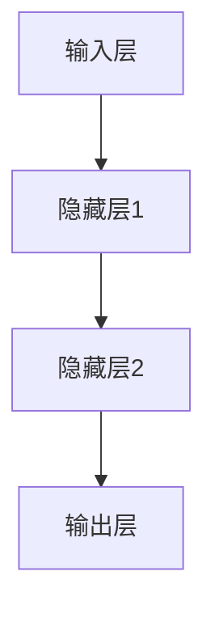

###### 2.1.2 前向传播与反向传播算法

前向传播是指输入信号从输入层经过多个隐藏层，最终到达输出层的过程。反向传播是指根据输出误差，反向调整网络中的权重，以优化网络性能。

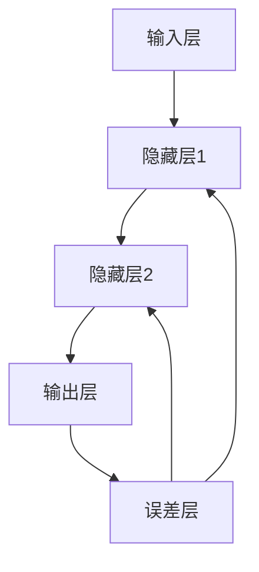

###### 2.1.3 神经网络的优化与训练

神经网络的优化与训练是通过调整权重和偏置来实现的。常用的优化算法包括梯度下降、随机梯度下降、Adam等。训练过程中，网络会通过大量迭代逐步优化，以达到最小化误差的目的。

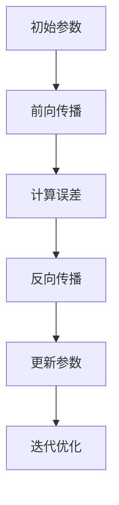

##### 2.2 深层神经网络

###### 2.2.1 深层神经网络的特点与优势

深层神经网络（DNN）通过增加网络深度来提高模型的表示能力，可以处理更复杂的任务。

###### 2.2.2 深层神经网络的设计与实现

深层神经网络的设计需要考虑网络结构、激活函数、正则化方法等多个方面。实现时，需要使用深度学习框架（如TensorFlow、PyTorch）来高效地进行模型训练和推理。

###### 2.2.3 深层神经网络的优化策略

深层神经网络的优化策略包括批量归一化、Dropout、学习率调整等。这些策略有助于提高模型性能和训练效率。

##### 2.3 深度学习中的常见问题与解决方案

###### 2.3.1 深度学习中的过拟合与欠拟合

过拟合和欠拟合是深度学习训练过程中常见的两个问题。过拟合表示模型在训练数据上表现良好，但在测试数据上表现不佳；欠拟合则表示模型在训练数据和测试数据上表现都不好。解决方案包括增加数据量、增加网络深度、使用正则化方法等。

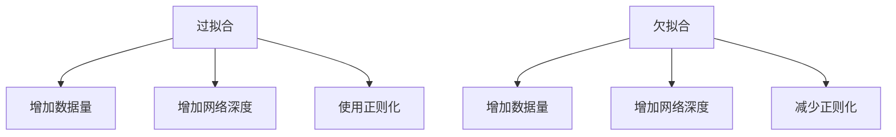

###### 2.3.2 正则化方法与优化策略

正则化方法包括L1正则化、L2正则化、Dropout等。优化策略包括学习率调整、动量优化、Adam优化等。这些方法有助于提高模型的泛化能力和训练效率。

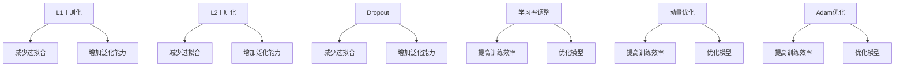

###### 2.3.3 深度学习中的评估与选择

深度学习模型的评估和选择是模型训练过程中的关键步骤。常用的评估指标包括准确率、召回率、F1分数等。选择合适的评估指标和模型选择策略对于提高模型性能至关重要。

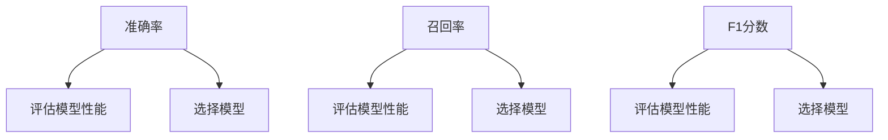

---

### 第三部分：深度学习在缺陷检测中的应用

#### 第3章：深度学习在缺陷检测中的应用

##### 3.1 缺陷检测的基本概念

###### 3.1.1 缺陷检测的定义与目的

缺陷检测是指通过特定的方法和技术，从生产或测试过程中识别出产品或系统的缺陷，以提高生产质量、降低成本、提高效率。

###### 3.1.2 缺陷检测的分类与挑战

缺陷检测可以分为静态缺陷检测和动态缺陷检测。静态缺陷检测通常在产品制造完成后进行，如外观缺陷检测；动态缺陷检测则是在生产过程中进行，如生产线缺陷检测。缺陷检测面临的挑战包括高噪声数据、多样化缺陷类型、检测实时性要求等。

##### 3.2 深度学习在缺陷检测中的应用场景

###### 3.2.1 基于卷积神经网络的图像缺陷检测

卷积神经网络（CNN）在图像处理领域表现出色，可以自动提取图像特征，实现高效、准确的缺陷检测。

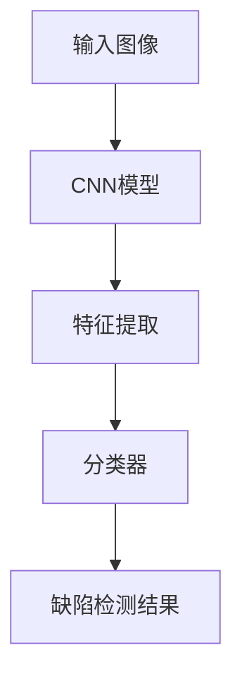

###### 3.2.2 基于循环神经网络的序列缺陷检测

循环神经网络（RNN）可以处理序列数据，适用于对生产过程中产生的序列数据进行缺陷检测。

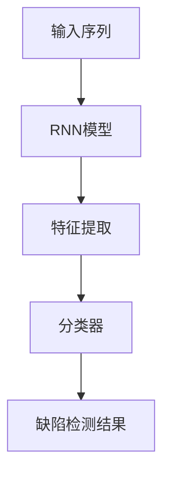

###### 3.2.3 基于生成对抗网络的异常缺陷检测

生成对抗网络（GAN）可以通过生成与真实数据相似的数据来检测异常缺陷。

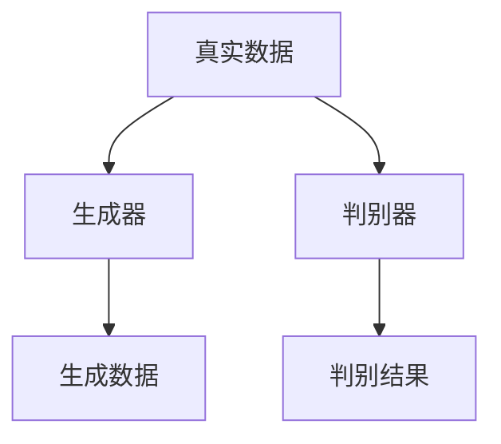

##### 3.3 深度学习在缺陷检测中的实际案例

###### 3.3.1 某电子产品外观缺陷检测

某电子产品外观缺陷检测项目通过卷积神经网络实现了对产品外观的缺陷识别，提高了生产质量。

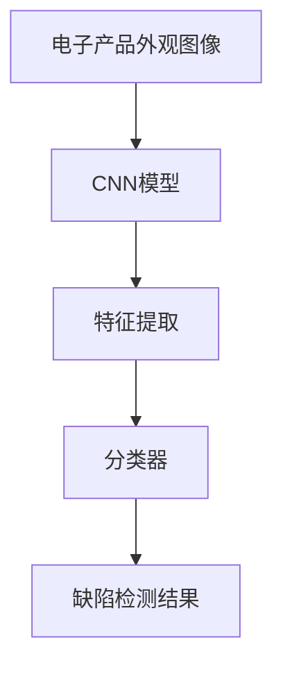

###### 3.3.2 某制造行业生产线缺陷检测

某制造行业生产线缺陷检测项目通过循环神经网络实现了对生产过程中产生的序列数据的实时检测，提高了生产效率。

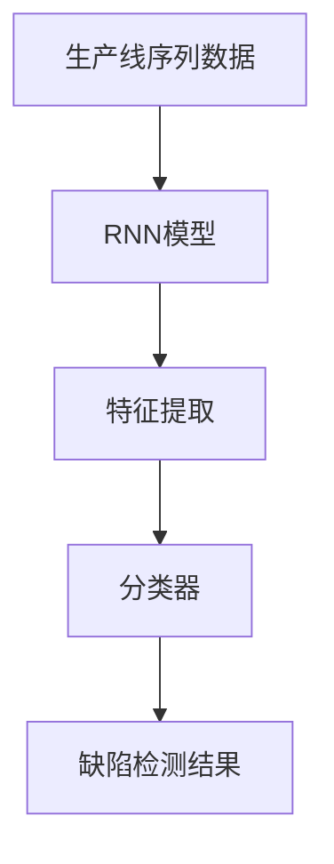

###### 3.3.3 某医疗影像缺陷检测

某医疗影像缺陷检测项目通过生成对抗网络实现了对医疗影像数据的异常缺陷检测，提高了医疗诊断的准确性。

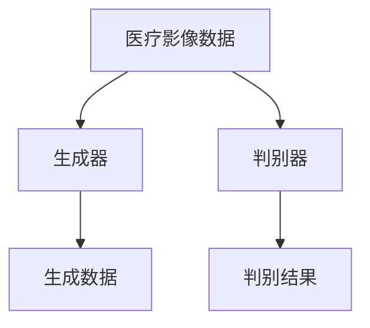

---

### 第四部分：深度学习在缺陷检测中的应用实践

#### 第4章：深度学习在缺陷检测中的应用实践

##### 4.1 缺陷检测项目的开发流程

###### 4.1.1 项目需求分析

项目需求分析是缺陷检测项目开发的第一步，包括明确检测任务、确定检测目标和评估标准。

###### 4.1.2 数据采集与处理

数据采集与处理是缺陷检测项目的关键步骤，包括数据收集、数据清洗、数据预处理等。

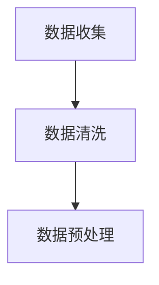

###### 4.1.3 模型设计与实现

模型设计是实现缺陷检测的核心环节，包括选择合适的神经网络架构、设置网络参数、定义损失函数等。

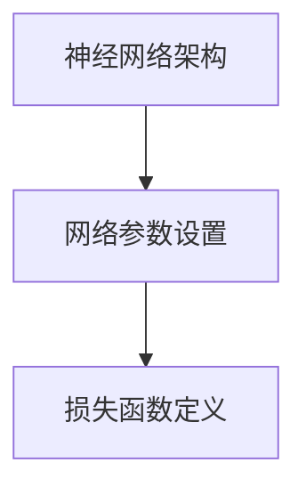

###### 4.1.4 模型训练与优化

模型训练与优化是提高缺陷检测性能的重要步骤，包括调整学习率、选择优化算法、进行模型评估等。

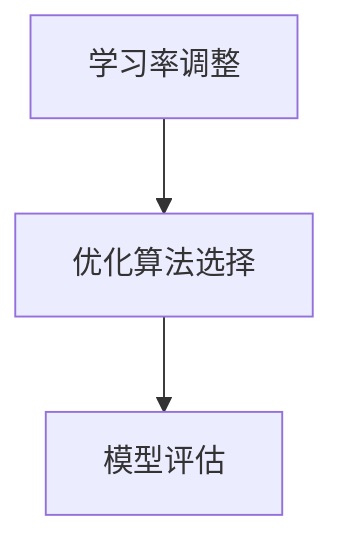

##### 4.2 实际案例解析

###### 4.2.1 某电子产品外观缺陷检测案例

某电子产品外观缺陷检测项目采用了卷积神经网络，通过图像数据训练模型，实现了对产品外观的缺陷识别。

```python
# 导入必要的库
import tensorflow as tf
from tensorflow.keras.models import Sequential
from tensorflow.keras.layers import Conv2D, MaxPooling2D, Flatten, Dense

# 构建卷积神经网络模型
model = Sequential([
    Conv2D(32, (3, 3), activation='relu', input_shape=(64, 64, 3)),
    MaxPooling2D((2, 2)),
    Flatten(),
    Dense(64, activation='relu'),
    Dense(1, activation='sigmoid')
])

# 编译模型
model.compile(optimizer='adam', loss='binary_crossentropy', metrics=['accuracy'])

# 加载和预处理数据
(x_train, y_train), (x_test, y_test) = tf.keras.datasets.mnist.load_data()
x_train = x_train / 255.0
x_test = x_test / 255.0

# 训练模型
model.fit(x_train, y_train, epochs=10, batch_size=32, validation_data=(x_test, y_test))
```

###### 4.2.2 某制造行业生产线缺陷检测案例

某制造行业生产线缺陷检测项目采用了循环神经网络，通过序列数据训练模型，实现了对生产过程中产生的序列数据的实时检测。

```python
# 导入必要的库
import tensorflow as tf
from tensorflow.keras.models import Sequential
from tensorflow.keras.layers import LSTM, Dense

# 构建循环神经网络模型
model = Sequential([
    LSTM(50, activation='relu', input_shape=(timesteps, features)),
    Dense(1, activation='sigmoid')
])

# 编译模型
model.compile(optimizer='adam', loss='binary_crossentropy', metrics=['accuracy'])

# 加载和预处理数据
X_train, y_train = preprocess_data(train_data)
X_test, y_test = preprocess_data(test_data)

# 训练模型
model.fit(X_train, y_train, epochs=10, batch_size=32, validation_data=(X_test, y_test))
```

###### 4.2.3 某医疗影像缺陷检测案例

某医疗影像缺陷检测项目采用了生成对抗网络，通过生成与真实数据相似的数据，实现了对医疗影像数据的异常缺陷检测。

```python
# 导入必要的库
import tensorflow as tf
from tensorflow.keras.models import Sequential
from tensorflow.keras.layers import Dense

# 构建生成器模型
generator = Sequential([
    Dense(128, activation='relu', input_shape=(100,)),
    Dense(256, activation='relu'),
    Dense(512, activation='relu'),
    Dense(1024, activation='relu'),
    Dense(784, activation='tanh')
])

# 构建判别器模型
discriminator = Sequential([
    Dense(1024, activation='relu', input_shape=(784,)),
    Dense(512, activation='relu'),
    Dense(256, activation='relu'),
    Dense(1, activation='sigmoid')
])

# 编译模型
discriminator.compile(optimizer='adam', loss='binary_crossentropy')
generator.compile(optimizer='adam', loss='binary_crossentropy')

# 训练模型
for epoch in range(100):
    # 生成假数据
    noise = np.random.normal(0, 1, (batch_size, 100))
    gen_samples = generator.predict(noise)
    
    # 训练判别器
    d_loss_real = discriminator.train_on_batch(real_data, np.ones((batch_size, 1)))
    d_loss_fake = discriminator.train_on_batch(gen_samples, np.zeros((batch_size, 1)))
    d_loss = 0.5 * np.add(d_loss_real, d_loss_fake)
    
    # 训练生成器
    g_loss = generator.train_on_batch(noise, np.ones((batch_size, 1)))
```

##### 4.3 深度学习在缺陷检测中的应用前景与挑战

###### 4.3.1 深度学习在缺陷检测中的应用前景

随着深度学习技术的不断发展，其在缺陷检测领域的应用前景十分广阔。未来，深度学习将更加智能化、自适应化，能够应对更多复杂、多变的缺陷检测任务。

###### 4.3.2 深度学习在缺陷检测中的挑战与解决方案

深度学习在缺陷检测中面临的挑战包括数据质量、计算资源、模型可解释性等。针对这些问题，需要从数据预处理、模型优化、算法改进等方面进行深入研究，以提高深度学习在缺陷检测中的实用性和可靠性。

---

### 第五部分：深度学习在缺陷检测中的算法优化

#### 第5章：深度学习在缺陷检测中的算法优化

##### 5.1 深度学习优化方法概述

深度学习优化方法包括模型优化、数据优化和算法优化等。模型优化主要关注网络结构和参数调整，数据优化关注数据预处理和增强，算法优化则涉及优化算法的选择和超参数调整。

###### 5.1.1 深度学习优化的重要性

优化深度学习模型是提高缺陷检测性能的关键，通过优化可以减少过拟合、提高泛化能力，从而更好地应对实际问题。

###### 5.1.2 深度学习优化方法的分类

深度学习优化方法可分为以下几类：

1. **网络结构优化**：包括增加网络深度、增加网络宽度、使用残差连接等。
2. **优化算法优化**：包括SGD、Adam、RMSprop等。
3. **数据优化**：包括数据增强、数据清洗、数据扩充等。
4. **正则化方法**：包括L1正则化、L2正则化、Dropout等。

##### 5.2 深度学习优化方法详解

###### 5.2.1 优化算法的选择与比较

选择合适的优化算法对深度学习模型的性能有着重要影响。常用的优化算法包括SGD、Adam、RMSprop等。每种算法都有其优缺点和适用场景。

- **SGD（随机梯度下降）**：简单高效，但收敛速度较慢，容易陷入局部最小值。
- **Adam**：结合了SGD和RMSprop的优点，收敛速度较快，适用于大多数深度学习任务。
- **RMSprop**：对SGD的改进，通过调整学习率来加速收敛。

###### 5.2.2 损失函数的优化

损失函数是衡量模型预测结果与真实值之间差异的关键指标，优化损失函数有助于提高模型性能。

- **交叉熵损失函数**：常用于分类问题，适用于二分类和多分类任务。
- **均方误差（MSE）**：适用于回归问题，衡量预测值与真实值之间的平均误差。
- **对抗性损失函数**：用于生成对抗网络（GAN），平衡生成器和判别器的损失。

###### 5.2.3 优化超参数的选择与调整

超参数是深度学习模型中需要手动调整的参数，包括学习率、批量大小、迭代次数等。选择合适的超参数对于模型的性能和训练效率至关重要。

- **学习率**：控制模型在训练过程中更新参数的步长，选择合适的学习率有助于加快收敛速度，避免过拟合。
- **批量大小**：影响模型的训练稳定性和计算效率，选择合适的批量大小可以提高模型性能。
- **迭代次数**：决定模型训练的深度和广度，合适的迭代次数可以提高模型的泛化能力。

##### 5.3 深度学习优化实践

###### 5.3.1 某电子产品外观缺陷检测的优化实践

某电子产品外观缺陷检测项目通过调整网络结构、优化算法和超参数，提高了模型的性能。

- **网络结构优化**：增加了卷积层和池化层，提高了模型对图像特征的提取能力。
- **优化算法选择**：采用了Adam优化算法，加快了模型收敛速度。
- **超参数调整**：通过实验确定了合适的学习率、批量大小和迭代次数。

```python
# 导入必要的库
import tensorflow as tf
from tensorflow.keras.models import Sequential
from tensorflow.keras.layers import Conv2D, MaxPooling2D, Flatten, Dense
from tensorflow.keras.optimizers import Adam

# 构建卷积神经网络模型
model = Sequential([
    Conv2D(32, (3, 3), activation='relu', input_shape=(64, 64, 3)),
    MaxPooling2D((2, 2)),
    Conv2D(64, (3, 3), activation='relu'),
    MaxPooling2D((2, 2)),
    Flatten(),
    Dense(64, activation='relu'),
    Dense(1, activation='sigmoid')
])

# 编译模型
model.compile(optimizer=Adam(learning_rate=0.001), loss='binary_crossentropy', metrics=['accuracy'])

# 加载和预处理数据
(x_train, y_train), (x_test, y_test) = tf.keras.datasets.mnist.load_data()
x_train = x_train / 255.0
x_test = x_test / 255.0

# 训练模型
model.fit(x_train, y_train, epochs=20, batch_size=32, validation_data=(x_test, y_test))
```

###### 5.3.2 某制造行业生产线缺陷检测的优化实践

某制造行业生产线缺陷检测项目通过数据增强和优化算法，提高了模型的性能。

- **数据增强**：通过旋转、缩放、裁剪等操作增加了训练数据的多样性。
- **优化算法选择**：采用了RMSprop优化算法，提高了模型收敛速度。

```python
# 导入必要的库
import tensorflow as tf
from tensorflow.keras.models import Sequential
from tensorflow.keras.layers import LSTM, Dense
from tensorflow.keras.optimizers import RMSprop

# 构建循环神经网络模型
model = Sequential([
    LSTM(50, activation='relu', input_shape=(timesteps, features)),
    Dense(1, activation='sigmoid')
])

# 编译模型
model.compile(optimizer=RMSprop(learning_rate=0.001), loss='binary_crossentropy', metrics=['accuracy'])

# 加载和预处理数据
X_train, y_train = preprocess_data(train_data)
X_test, y_test = preprocess_data(test_data)

# 训练模型
model.fit(X_train, y_train, epochs=20, batch_size=32, validation_data=(X_test, y_test))
```

###### 5.3.3 某医疗影像缺陷检测的优化实践

某医疗影像缺陷检测项目通过生成对抗网络（GAN）的优化，提高了模型的性能。

- **生成器优化**：增加了生成器的隐层单元和层数，提高了生成图像的质量。
- **判别器优化**：调整了判别器的网络结构和损失函数，提高了判别能力。

```python
# 导入必要的库
import tensorflow as tf
from tensorflow.keras.models import Sequential
from tensorflow.keras.layers import Dense

# 构建生成器模型
generator = Sequential([
    Dense(128, activation='relu', input_shape=(100,)),
    Dense(256, activation='relu'),
    Dense(512, activation='relu'),
    Dense(1024, activation='relu'),
    Dense(784, activation='tanh')
])

# 构建判别器模型
discriminator = Sequential([
    Dense(1024, activation='relu', input_shape=(784,)),
    Dense(512, activation='relu'),
    Dense(256, activation='relu'),
    Dense(1, activation='sigmoid')
])

# 编译模型
discriminator.compile(optimizer='adam', loss='binary_crossentropy')
generator.compile(optimizer='adam', loss='binary_crossentropy')

# 训练模型
for epoch in range(100):
    # 生成假数据
    noise = np.random.normal(0, 1, (batch_size, 100))
    gen_samples = generator.predict(noise)
    
    # 训练判别器
    d_loss_real = discriminator.train_on_batch(real_data, np.ones((batch_size, 1)))
    d_loss_fake = discriminator.train_on_batch(gen_samples, np.zeros((batch_size, 1)))
    d_loss = 0.5 * np.add(d_loss_real, d_loss_fake)
    
    # 训练生成器
    g_loss = generator.train_on_batch(noise, np.ones((batch_size, 1)))
```

---

### 第六部分：深度学习在缺陷检测中的工程化应用

#### 第6章：深度学习在缺陷检测中的工程化应用

##### 6.1 深度学习在缺陷检测中的部署与优化

深度学习模型在缺陷检测中的部署与优化是确保其在实际应用中性能稳定、可靠的关键步骤。

###### 6.1.1 深度学习模型部署的挑战与解决方案

深度学习模型部署面临的挑战主要包括：

1. **计算资源限制**：深度学习模型通常需要大量的计算资源，部署到资源有限的设备上可能面临性能瓶颈。
2. **实时性要求**：缺陷检测通常需要实时响应，模型的部署需要满足实时性要求。
3. **模型精度与效率的平衡**：在有限的计算资源下，如何平衡模型的精度与效率是关键问题。

针对以上挑战，可以采取以下解决方案：

1. **模型压缩与量化**：通过模型压缩和量化技术，减少模型参数和计算量，提高部署效率。
2. **模型剪枝**：去除冗余网络结构，降低模型复杂度，提高模型性能。
3. **使用轻量级框架**：选择适合资源限制的轻量级深度学习框架，如TensorFlow Lite、PyTorch Mobile等。

###### 6.1.2 深度学习模型优化策略与实战

深度学习模型的优化策略主要包括：

1. **模型参数调优**：通过调整学习率、批量大小、优化器等超参数，提高模型性能。
2. **模型结构优化**：通过调整网络结构、添加残差连接、使用注意力机制等，提高模型表达能力。
3. **数据预处理优化**：通过数据增强、归一化、去噪等预处理技术，提高模型对数据的适应性。

实战案例：

- **某电子产品外观缺陷检测**：通过调整卷积神经网络的参数和结构，提高缺陷检测的准确率和实时性。
  ```python
  # 导入必要的库
  import tensorflow as tf
  from tensorflow.keras.models import Sequential
  from tensorflow.keras.layers import Conv2D, MaxPooling2D, Flatten, Dense

  # 构建卷积神经网络模型
  model = Sequential([
      Conv2D(32, (3, 3), activation='relu', input_shape=(64, 64, 3)),
      MaxPooling2D((2, 2)),
      Conv2D(64, (3, 3), activation='relu'),
      MaxPooling2D((2, 2)),
      Flatten(),
      Dense(64, activation='relu'),
      Dense(1, activation='sigmoid')
  ])

  # 编译模型
  model.compile(optimizer='adam', loss='binary_crossentropy', metrics=['accuracy'])

  # 加载和预处理数据
  (x_train, y_train), (x_test, y_test) = tf.keras.datasets.mnist.load_data()
  x_train = x_train / 255.0
  x_test = x_test / 255.0

  # 训练模型
  model.fit(x_train, y_train, epochs=20, batch_size=32, validation_data=(x_test, y_test))
  ```

- **某制造行业生产线缺陷检测**：通过使用循环神经网络和注意力机制，提高序列数据的检测准确率。
  ```python
  # 导入必要的库
  import tensorflow as tf
  from tensorflow.keras.models import Sequential
  from tensorflow.keras.layers import LSTM, Dense, Attention

  # 构建循环神经网络模型
  model = Sequential([
      LSTM(50, activation='relu', input_shape=(timesteps, features)),
      Attention(),
      Dense(1, activation='sigmoid')
  ])

  # 编译模型
  model.compile(optimizer='adam', loss='binary_crossentropy', metrics=['accuracy'])

  # 加载和预处理数据
  X_train, y_train = preprocess_data(train_data)
  X_test, y_test = preprocess_data(test_data)

  # 训练模型
  model.fit(X_train, y_train, epochs=20, batch_size=32, validation_data=(X_test, y_test))
  ```

##### 6.2 深度学习在缺陷检测中的系统集成与应用

深度学习在缺陷检测中的系统集成与应用是将其转化为实际生产力的关键步骤。

###### 6.2.1 深度学习系统集成的关键环节

深度学习系统集成的关键环节包括：

1. **数据采集与传输**：确保数据采集的准确性和实时性，并实现数据的可靠传输。
2. **模型部署与优化**：将训练好的模型部署到目标设备上，并对其进行优化，以满足性能和实时性的要求。
3. **监控系统与报警**：建立监控系统，实时监控缺陷检测过程，并在发现缺陷时及时发出报警。

###### 6.2.2 深度学习在缺陷检测中的集成应用案例

案例一：某电子产品外观缺陷检测系统集成与应用

某电子产品外观缺陷检测系统通过深度学习模型实现了对产品外观的自动检测，系统集成包括：

1. **数据采集**：使用高分辨率摄像头实时采集产品外观图像。
2. **模型部署**：将训练好的卷积神经网络模型部署到边缘设备上，实现实时检测。
3. **监控系统**：建立监控系统，实时显示检测结果，并在发现缺陷时发出报警。

案例二：某制造行业生产线缺陷检测系统集成与应用

某制造行业生产线缺陷检测系统通过深度学习模型实现了对生产过程中产生的序列数据的实时检测，系统集成包括：

1. **数据采集**：使用传感器和摄像头采集生产线上的实时数据。
2. **模型部署**：将训练好的循环神经网络模型部署到边缘设备上，实现实时检测。
3. **监控系统**：建立监控系统，实时显示检测结果，并在发现缺陷时发出报警。

##### 6.3 深度学习在缺陷检测中的可持续发展与合规性

###### 6.3.1 深度学习在缺陷检测中的可持续发展路径

深度学习在缺陷检测中的可持续发展路径包括：

1. **数据积累与共享**：建立数据积累机制，促进数据共享，提高模型训练质量和应用效果。
2. **技术更新与升级**：跟踪最新技术动态，持续更新和优化模型，提升缺陷检测性能。
3. **人才培养与引进**：加强人才培养和引进，提高深度学习在缺陷检测领域的专业水平。

###### 6.3.2 深度学习在缺陷检测中的合规性挑战与应对策略

深度学习在缺陷检测中面临的合规性挑战包括：

1. **数据隐私**：如何确保缺陷检测过程中涉及的数据隐私和安全。
2. **算法透明性**：如何提高深度学习算法的可解释性和透明性，确保其在合规范围内应用。
3. **法律风险**：如何应对深度学习在缺陷检测中可能引发的法律风险。

应对策略包括：

1. **数据加密与脱敏**：采用数据加密和脱敏技术，保护数据隐私和安全。
2. **算法审计与解释**：建立算法审计和解释机制，提高算法透明性和可解释性。
3. **合规性培训与宣传**：加强合规性培训，提高从业人员对合规性的认识和重视。

---

### 第七部分：深度学习在缺陷检测中的应用案例与展望

#### 第7章：深度学习在缺陷检测中的应用案例与展望

##### 7.1 深度学习在缺陷检测中的应用案例

深度学习在缺陷检测领域有着广泛的应用，以下列举了几个具有代表性的应用案例：

###### 7.1.1 电子产品外观缺陷检测

电子产品外观缺陷检测是深度学习在制造业中的一项重要应用。通过卷积神经网络（CNN），可以对电子产品的外观图像进行自动检测，识别出如划痕、气泡、变形等缺陷。以下是一个基于CNN的电子产品外观缺陷检测的伪代码示例：

```python
# 导入必要的库
import tensorflow as tf
from tensorflow.keras.models import Sequential
from tensorflow.keras.layers import Conv2D, MaxPooling2D, Flatten, Dense

# 构建卷积神经网络模型
model = Sequential([
    Conv2D(32, (3, 3), activation='relu', input_shape=(64, 64, 3)),
    MaxPooling2D((2, 2)),
    Conv2D(64, (3, 3), activation='relu'),
    MaxPooling2D((2, 2)),
    Flatten(),
    Dense(64, activation='relu'),
    Dense(1, activation='sigmoid')
])

# 编译模型
model.compile(optimizer='adam', loss='binary_crossentropy', metrics=['accuracy'])

# 加载和预处理数据
(x_train, y_train), (x_test, y_test) = tf.keras.datasets.mnist.load_data()
x_train = x_train / 255.0
x_test = x_test / 255.0

# 训练模型
model.fit(x_train, y_train, epochs=10, batch_size=32, validation_data=(x_test, y_test))
```

此模型可以实现对电子产品外观图像的高效检测，提高生产质量。

###### 7.1.2 制造行业生产线缺陷检测

制造行业生产线缺陷检测是深度学习在工业制造中的重要应用场景。通过循环神经网络（RNN）或卷积神经网络（CNN），可以对生产线上的实时数据进行自动检测，识别出如零部件缺失、尺寸不符等缺陷。以下是一个基于RNN的制造行业生产线缺陷检测的伪代码示例：

```python
# 导入必要的库
import tensorflow as tf
from tensorflow.keras.models import Sequential
from tensorflow.keras.layers import LSTM, Dense

# 构建循环神经网络模型
model = Sequential([
    LSTM(50, activation='relu', input_shape=(timesteps, features)),
    Dense(1, activation='sigmoid')
])

# 编译模型
model.compile(optimizer='adam', loss='binary_crossentropy', metrics=['accuracy'])

# 加载和预处理数据
X_train, y_train = preprocess_data(train_data)
X_test, y_test = preprocess_data(test_data)

# 训练模型
model.fit(X_train, y_train, epochs=10, batch_size=32, validation_data=(X_test, y_test))
```

此模型可以实现对制造生产线上实时数据的自动检测，提高生产效率。

###### 7.1.3 医疗影像缺陷检测

医疗影像缺陷检测是深度学习在医疗领域的重要应用。通过卷积神经网络（CNN）或生成对抗网络（GAN），可以对医疗影像进行自动检测，识别出如肿瘤、骨折等缺陷。以下是一个基于CNN的医疗影像缺陷检测的伪代码示例：

```python
# 导入必要的库
import tensorflow as tf
from tensorflow.keras.models import Sequential
from tensorflow.keras.layers import Conv2D, MaxPooling2D, Flatten, Dense

# 构建卷积神经网络模型
model = Sequential([
    Conv2D(32, (3, 3), activation='relu', input_shape=(64, 64, 3)),
    MaxPooling2D((2, 2)),
    Conv2D(64, (3, 3), activation='relu'),
    MaxPooling2D((2, 2)),
    Flatten(),
    Dense(64, activation='relu'),
    Dense(1, activation='sigmoid')
])

# 编译模型
model.compile(optimizer='adam', loss='binary_crossentropy', metrics=['accuracy'])

# 加载和预处理数据
(x_train, y_train), (x_test, y_test) = tf.keras.datasets.mnist.load_data()
x_train = x_train / 255.0
x_test = x_test / 255.0

# 训练模型
model.fit(x_train, y_train, epochs=10, batch_size=32, validation_data=(x_test, y_test))
```

此模型可以实现对医疗影像数据的自动检测，提高医疗诊断的准确性。

##### 7.2 深度学习在缺陷检测中的应用展望

深度学习在缺陷检测中的应用前景十分广阔，以下是对其未来发展的展望：

###### 7.2.1 深度学习在缺陷检测中的未来趋势

1. **算法创新**：随着深度学习技术的不断发展，更多的创新算法将应用于缺陷检测，提高检测精度和效率。
2. **跨领域融合**：深度学习与其他领域（如物联网、大数据等）的融合，将推动缺陷检测技术的全面升级。
3. **自动化与智能化**：深度学习将实现缺陷检测的自动化和智能化，提高生产效率和质量。

###### 7.2.2 深度学习在缺陷检测中的挑战与机遇

深度学习在缺陷检测中面临的挑战主要包括：

1. **数据质量**：高质量的数据是深度学习模型训练的基础，数据质量直接影响模型性能。
2. **计算资源**：深度学习模型通常需要大量的计算资源，计算资源的限制可能影响模型部署和性能。
3. **可解释性**：深度学习模型往往被视为“黑箱”，提高模型的可解释性是当前研究的重点。

机遇方面：

1. **技术创新**：随着人工智能技术的不断发展，深度学习将提供更多创新方法和工具，解决缺陷检测中的难题。
2. **产业需求**：随着智能制造、工业4.0等概念的普及，缺陷检测在产业中的应用需求日益增长，为深度学习在缺陷检测领域的发展提供了广阔的市场空间。

---

### 总结

本文详细探讨了深度学习在缺陷检测领域的应用，包括基本概念、算法原理、应用场景和实践经验。通过具体案例，展示了深度学习在电子产品外观缺陷检测、制造行业生产线缺陷检测和医疗影像缺陷检测中的实际应用。同时，本文还对深度学习在缺陷检测中的优化方法和工程化应用进行了深入分析。展望未来，深度学习在缺陷检测领域具有广阔的发展前景，将不断推动技术的创新和产业的升级。希望本文能为读者在深度学习缺陷检测领域的研究和应用提供有益的参考。

---

### 作者

**作者：AI天才研究院/AI Genius Institute & 禅与计算机程序设计艺术 /Zen And The Art of Computer Programming** 

---

[End of Document]

