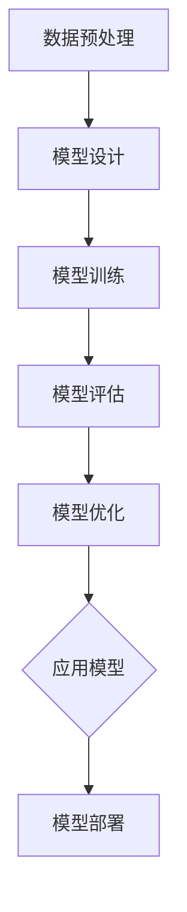
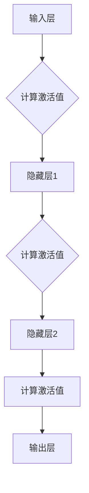

                 

### 文章标题

《AI人工智能深度学习算法：构建高效深度学习模型的基础》

深度学习是人工智能领域的重要分支，通过模拟人脑神经网络的结构和功能，深度学习算法在图像识别、自然语言处理、语音识别等多个领域取得了显著的成果。本文将深入探讨深度学习的基础知识、核心概念、算法原理及其在实际应用中的优化方法，以帮助读者构建高效深度学习模型。

### 关键词

- 深度学习
- 神经网络
- 机器学习
- 深度学习模型
- 优化方法

### 摘要

本文系统地介绍了深度学习的基础知识和核心概念，包括神经网络的基本原理、前向传播与反向传播算法等。随后，文章详细讲解了经典深度学习算法，如卷积神经网络（CNN）、循环神经网络（RNN）和生成对抗网络（GAN）。此外，文章还探讨了深度学习模型的优化方法，如学习率调度策略、激活函数优化和正则化方法。最后，文章通过两个实际项目案例——手写数字识别和股票价格预测，展示了如何构建高效深度学习模型，并进行了代码解读与分析。

## 第一部分：深度学习基础知识与核心概念

深度学习是人工智能的一个重要分支，它通过模拟人脑神经网络的结构和功能，实现从大量数据中自动提取特征和模式。深度学习的兴起，极大地推动了计算机视觉、自然语言处理、语音识别等领域的进步。本部分将介绍深度学习的基本概念、历史背景、以及与机器学习的联系与区别。

### 第1章：深度学习的基本概念与历史

#### 1.1 深度学习的定义与作用

深度学习（Deep Learning）是一种机器学习（Machine Learning）方法，它通过多层神经网络进行数据建模，以实现对复杂数据的自动特征提取和模式识别。深度学习模型的核心在于其层次结构，每一层都对输入数据进行特征提取和变换，最终输出结果。

深度学习在多个领域展示了强大的应用能力，例如：

1. **计算机视觉**：深度学习模型可以用于图像分类、目标检测、图像分割等任务。
2. **自然语言处理**：深度学习模型在语言模型、机器翻译、情感分析等方面取得了显著进展。
3. **语音识别**：深度学习模型被广泛应用于语音信号的识别和转换。
4. **强化学习**：深度学习与强化学习的结合，使得智能体能够通过学习获得更加复杂的策略。

#### 1.2 深度学习的发展历程

深度学习的发展历程可以追溯到20世纪40年代，当时香农（Claude Shannon）提出了信息论，为后续神经网络的理论奠定了基础。随后，1958年，马文·闵斯基（Marvin Minsky）和西摩·派普特（Seymour Papert）在他们的论文中讨论了单层神经网络的一些局限性，这促使了多层网络的研究。

直到2006年，杰弗里·辛顿（Geoffrey Hinton）等人重新提出了深度信念网络（Deep Belief Network），并成功地应用在语音识别和图像识别任务中。这一时期，计算能力的提升和大规模数据的可用性，使得深度学习算法的研究和应用迎来了新的春天。

近年来，随着GPU计算能力的提升和深度学习框架的发展，如TensorFlow和PyTorch等，深度学习在多个领域取得了显著的成果。

#### 1.3 深度学习与机器学习的联系与区别

深度学习是机器学习的一种方法，二者在目标上都是为了从数据中学习得到有用的信息。然而，深度学习与传统的机器学习方法在算法结构和适用场景上有所不同：

1. **算法结构**：传统的机器学习方法通常是基于线性模型或决策树等，而深度学习则依赖于多层神经网络的结构。
2. **数据处理**：深度学习模型能够自动提取抽象的特征，而传统机器学习方法通常需要手动设计特征。
3. **适用场景**：深度学习在处理复杂数据，如图像、语音和文本等，具有显著的优势。传统机器学习方法则更适合处理结构化数据，如表格数据。

综上所述，深度学习与机器学习密切相关，深度学习在机器学习的基础上，通过引入多层神经网络，极大地扩展了机器学习的能力和应用范围。

### 第2章：神经网络原理详解

神经网络（Neural Network）是深度学习的基础，通过模拟人脑神经元的工作原理，神经网络能够对复杂数据进行有效的学习和预测。本章将详细讲解神经网络的基础概念、前向传播与反向传播算法，以及深层神经网络与卷积神经网络。

#### 2.1 神经网络的基础概念

神经网络由多个神经元（或称为节点）组成，每个神经元都与其他神经元相连接。神经网络的基本结构包括输入层、隐藏层和输出层。

1. **输入层**：接收外部输入数据，并将其传递给隐藏层。
2. **隐藏层**：对输入数据进行处理，提取特征信息。神经网络可以包含多个隐藏层，随着层数的增加，网络的深度也增加。
3. **输出层**：根据隐藏层的结果，输出最终的预测结果。

神经网络的每个神经元都包含以下几个部分：

1. **权重（Weights）**：连接不同神经元的权重，用于调节输入数据的重要性。
2. **偏置（Bias）**：每个神经元的偏置项，用于调整神经元输出的阈值。
3. **激活函数（Activation Function）**：将输入数据的线性组合加上偏置后，通过激活函数转换为输出。

常见的激活函数包括：

1. **Sigmoid函数**：\( f(x) = \frac{1}{1 + e^{-x}} \)
2. **ReLU函数**：\( f(x) = \max(0, x) \)
3. **Tanh函数**：\( f(x) = \frac{e^x - e^{-x}}{e^x + e^{-x}} \)

#### 2.2 前向传播与反向传播算法

神经网络通过前向传播和反向传播算法进行训练。

1. **前向传播**：输入数据从输入层传递到隐藏层，再传递到输出层。在每个层次，神经元计算其输入的线性组合，并应用激活函数。

   \[ z_i = \sum_{j} w_{ij} x_j + b_i \]
   \[ a_i = f(z_i) \]

   其中，\( x_j \) 是输入值，\( w_{ij} \) 是权重，\( b_i \) 是偏置，\( f() \) 是激活函数，\( z_i \) 和 \( a_i \) 分别是线性组合和激活后的值。

2. **反向传播**：在输出层计算预测误差，然后反向传播误差到隐藏层和输入层。在这个过程中，计算每个权重和偏置的梯度，用于更新权重和偏置。

   \[ \delta = \frac{\partial \text{Loss}}{\partial z} \cdot f'(z) \]
   \[ \frac{\partial \text{Loss}}{\partial w_{ij}} = \delta x_j \]
   \[ \frac{\partial \text{Loss}}{\partial b_i} = \delta \]

   其中，\( \delta \) 是误差的梯度，\( f'(z) \) 是激活函数的导数，\(\text{Loss} \) 是损失函数。

通过不断迭代前向传播和反向传播，神经网络逐渐优化其权重和偏置，以降低损失函数。

#### 2.3 深层神经网络与卷积神经网络

1. **深层神经网络（Deep Neural Network）**：深层神经网络包含多个隐藏层，能够学习更加复杂的特征表示。随着层数的增加，深层神经网络在处理复杂数据时表现出更强的泛化能力。

   然而，深层神经网络也面临梯度消失和梯度爆炸的问题，即深层网络中的梯度在反向传播过程中可能变得非常小或非常大，导致网络难以训练。为了解决这些问题，研究人员提出了多种优化方法和正则化技术。

2. **卷积神经网络（Convolutional Neural Network）**：卷积神经网络是针对图像数据设计的特殊神经网络，通过卷积操作和池化操作，卷积神经网络能够自动提取图像中的空间特征。

   卷积神经网络的基本结构包括：

   1. **卷积层**：通过卷积操作提取图像的特征，卷积核在图像上滑动，生成特征图。
   2. **池化层**：对特征图进行下采样，减少数据维度，提高计算效率。
   3. **全连接层**：将卷积层和池化层提取的特征进行整合，输出最终结果。

   卷积神经网络在计算机视觉领域取得了显著的成果，广泛应用于图像分类、目标检测、图像分割等任务。

通过以上内容，本章详细介绍了神经网络的基础概念、前向传播与反向传播算法，以及深层神经网络与卷积神经网络。这些知识为后续深度学习算法的讲解和模型构建奠定了基础。

### 第3章：经典深度学习算法

在深度学习的发展历程中，有许多经典的算法被提出并广泛应用于实际场景。这些算法不仅推动了深度学习技术的发展，也为各种复杂任务提供了有效的解决方案。本章将介绍几种经典的深度学习算法，包括卷积神经网络（CNN）、循环神经网络（RNN）和生成对抗网络（GAN），并详细分析其基本结构、原理以及应用场景。

#### 3.1 卷积神经网络（CNN）

卷积神经网络（Convolutional Neural Network，CNN）是针对图像处理任务设计的一种特殊神经网络。它通过卷积操作和池化操作，能够自动提取图像中的特征，从而实现图像分类、目标检测和图像分割等任务。

**3.1.1 CNN的基本结构**

CNN的基本结构包括以下几个部分：

1. **输入层**：接收图像数据，将其输入到网络中。
2. **卷积层**：通过卷积操作提取图像的特征，卷积核在图像上滑动，生成特征图。
3. **激活函数**：对卷积层的输出应用激活函数，常用的激活函数包括ReLU函数和Sigmoid函数。
4. **池化层**：对特征图进行下采样，减少数据维度，提高计算效率。
5. **全连接层**：将卷积层和池化层提取的特征进行整合，输出最终结果。

**3.1.2 卷积操作与激活函数**

卷积操作是CNN的核心，它通过卷积核在图像上滑动，将图像的一部分与卷积核进行点积操作，生成特征图。每个卷积核负责提取图像中的不同特征，例如边缘、纹理和形状等。

激活函数用于引入非线性特性，常用的激活函数包括ReLU函数和Sigmoid函数。ReLU函数能够加速网络训练，减少梯度消失的问题；Sigmoid函数则能够将输入映射到0和1之间。

**3.1.3 池化层的作用**

池化层用于对特征图进行下采样，减少数据维度，提高计算效率。常见的池化操作包括最大池化和平均池化。最大池化选择特征图上最大值作为输出，平均池化则计算特征图上每个位置的均值。

池化操作能够减少过拟合现象，提高模型的泛化能力。

**3.1.4 伪代码实现**

以下是一个简单的CNN模型的伪代码实现：

```
# 输入图像：X，模型参数：W，激活函数：f()

for each layer in CNN:
    # 初始化权重 W
    W = initialize_weights()
    # 进行卷积操作
    Z = conv2d(X, W)
    # 应用激活函数
    A = f(Z)
    # 更新输入数据
    X = A
```

**3.1.5 CNN的应用场景**

CNN在计算机视觉领域具有广泛的应用，包括：

1. **图像分类**：通过训练CNN模型，可以实现对图像的自动分类，例如对猫和狗的区分。
2. **目标检测**：CNN可以检测图像中的目标对象，并定位其位置。常用的目标检测算法包括YOLO和Faster R-CNN。
3. **图像分割**：CNN可以用于将图像分割为不同的区域，例如将图像中的道路和车辆分割出来。

**3.1.6 CNN的优势**

CNN的优势在于：

1. **特征提取**：CNN能够自动提取图像中的特征，减少人工设计的特征需求。
2. **参数共享**：CNN中的卷积核在整个图像上共享，减少了模型参数的数量。
3. **计算效率**：CNN通过卷积操作和池化操作，提高了计算效率。

#### 3.2 循环神经网络（RNN）

循环神经网络（Recurrent Neural Network，RNN）是一种能够处理序列数据的神经网络。RNN通过在时间步上递归地更新状态，能够捕捉序列中的依赖关系。然而，传统的RNN在处理长序列时存在梯度消失和梯度爆炸的问题，为了解决这些问题，研究人员提出了长短期记忆网络（LSTM）。

**3.2.1 RNN的基本原理**

RNN的基本结构包括输入层、隐藏层和输出层。在RNN中，每个时间步的输出依赖于前一个时间步的隐藏状态。

\[ h_t = \sigma(W_h \cdot [h_{t-1}, x_t] + b_h) \]
\[ y_t = W_o \cdot h_t + b_o \]

其中，\( h_t \) 是第\( t \)个时间步的隐藏状态，\( x_t \) 是第\( t \)个时间步的输入，\( \sigma \) 是激活函数，\( W_h \)、\( W_o \)、\( b_h \) 和 \( b_o \) 是模型参数。

**3.2.2 长短时记忆（LSTM）**

为了解决传统RNN在处理长序列时存在的问题，研究人员提出了长短时记忆网络（Long Short-Term Memory，LSTM）。LSTM通过引入记忆单元和门控机制，能够有效地捕捉长序列中的依赖关系。

LSTM的基本结构包括输入门、遗忘门、输出门和记忆单元。在LSTM中，记忆单元能够保持长远的依赖关系，门控机制则用于控制信息的流入和流出。

\[ i_t = \sigma(W_i \cdot [h_{t-1}, x_t] + b_i) \]
\[ f_t = \sigma(W_f \cdot [h_{t-1}, x_t] + b_f) \]
\[ g_t = \tanh(W_g \cdot [h_{t-1}, x_t] + b_g) \]
\[ o_t = \sigma(W_o \cdot [h_{t-1}, x_t] + b_o) \]
\[ h_t = o_t \cdot \tanh(C_t) \]
\[ C_t = f_t \odot C_{t-1} + i_t \odot g_t \]

其中，\( i_t \)、\( f_t \)、\( o_t \) 分别是输入门、遗忘门和输出门的激活值，\( C_t \) 是记忆单元的状态。

**3.2.3 gates与梯度消失问题**

在LSTM中，gates（门控机制）用于控制信息的流入和流出。然而，传统的LSTM在反向传播过程中仍然存在梯度消失和梯度爆炸的问题。为了解决这些问题，研究人员提出了多种改进的LSTM模型，如LSTM-GPU、GRU等。

**3.2.4 伪代码实现**

以下是一个简单的LSTM模型的伪代码实现：

```
# 输入序列：X，隐藏状态：h，模型参数：W，激活函数：f()

for each time step in X:
    # 前向传播计算隐藏状态
    h = tanh(W[h; X])
    # 计算输出
    Y = f(h)
    # 更新隐藏状态
    h = h
```

**3.2.5 RNN的应用场景**

RNN在自然语言处理、语音识别和时间序列分析等领域具有广泛的应用，包括：

1. **语言模型**：RNN可以用于构建语言模型，预测下一个单词或词组。
2. **机器翻译**：RNN可以用于机器翻译任务，将一种语言的文本翻译成另一种语言。
3. **语音识别**：RNN可以用于语音信号的识别和转换。

**3.2.6 RNN的优势**

RNN的优势在于：

1. **序列建模**：RNN能够处理序列数据，捕捉序列中的依赖关系。
2. **时间动态性**：RNN能够处理动态变化的数据，如时间序列和语音信号。

#### 3.3 生成对抗网络（GAN）

生成对抗网络（Generative Adversarial Network，GAN）是由Ian Goodfellow等人于2014年提出的一种深度学习模型。GAN由两个神经网络组成：生成器（Generator）和判别器（Discriminator）。生成器的目标是生成与真实数据相似的数据，而判别器的目标是区分真实数据和生成数据。通过两个神经网络的对抗训练，GAN能够生成高质量的图像、音频和文本。

**3.3.1 GAN的基本概念与结构**

GAN的基本结构包括生成器和判别器：

1. **生成器**：生成器的目标是生成与真实数据相似的数据。生成器通过噪声向量生成假数据，并将其输入到判别器中。
2. **判别器**：判别器的目标是区分真实数据和生成数据。判别器接收真实数据和生成数据，并输出一个概率值，表示输入数据的真实性。

GAN的训练过程如下：

1. **训练生成器**：生成器的目标是使判别器无法区分真实数据和生成数据。生成器的损失函数为判别器对生成数据的判断概率。
2. **训练判别器**：判别器的目标是提高对真实数据和生成数据的区分能力。判别器的损失函数为真实数据和生成数据的交叉熵损失。

**3.3.2 对抗网络与判别器的训练过程**

1. **对抗网络**：生成器和判别器相互对抗，生成器和判别器的损失函数分别为：

\[ \text{Generator Loss} = -\log(D(G(z))) \]
\[ \text{Discriminator Loss} = -(\log(D(x)) + \log(1 - D(G(z))) \]

其中，\( G(z) \) 是生成器生成的数据，\( x \) 是真实数据，\( D(z) \) 是判别器对输入数据的判断概率。

2. **判别器的训练过程**：判别器通过最大化真实数据和生成数据的交叉熵损失进行训练。

\[ \frac{\partial \text{Discriminator Loss}}{\partial W_D} = \frac{1}{m} \sum_{i=1}^{m} (\log(D(x_i)) + \log(1 - D(G(z_i))) \]

3. **生成器的训练过程**：生成器通过最小化判别器对生成数据的判断概率进行训练。

\[ \frac{\partial \text{Generator Loss}}{\partial W_G} = \frac{1}{m} \sum_{i=1}^{m} (-\log(D(G(z_i))) \]

**3.3.3 生成器的训练过程**

生成器的训练过程如下：

1. **生成假数据**：生成器通过噪声向量生成假数据。
2. **对抗训练**：将生成器生成的假数据输入到判别器中，更新生成器的权重。
3. **反复迭代**：通过不断迭代生成器和判别器的训练，生成器逐渐生成更加真实的数据。

**3.3.4 伪代码实现**

以下是一个简单的GAN模型的伪代码实现：

```
# 噪声向量：z，模型参数：W_G（生成器）、W_D（判别器）

# 训练生成器
for epoch in range(num_epochs):
    for batch in data_loader:
        # 生成假数据
        G_z = Generator(z)
        # 计算判别器损失
        D_loss = Discriminator(G_z, z)
        # 更新判别器权重
        update_D(W_D, D_loss)
    # 计算生成器损失
    G_loss = Generator(G_z)
    # 更新生成器权重
    update_G(W_G, G_loss)
```

**3.3.5 GAN的应用场景**

GAN在图像生成、图像修复、图像超分辨率等任务中具有广泛的应用，包括：

1. **图像生成**：GAN可以生成高质量的图像，如图像合成、人脸生成等。
2. **图像修复**：GAN可以用于图像修复任务，如去噪、图像填充等。
3. **图像超分辨率**：GAN可以用于图像超分辨率任务，提高图像的分辨率。

**3.3.6 GAN的优势**

GAN的优势在于：

1. **生成高质量数据**：GAN能够生成高质量的图像、音频和文本，具有广泛的应用潜力。
2. **无需标注数据**：GAN可以通过无监督学习生成数据，减少对标注数据的依赖。
3. **多样性**：GAN可以生成具有多样性的数据，如图像、音频和文本。

综上所述，本章介绍了卷积神经网络（CNN）、循环神经网络（RNN）和生成对抗网络（GAN）三种经典的深度学习算法。这些算法在图像处理、序列建模和生成任务中具有广泛的应用。通过理解这些算法的基本原理和应用场景，读者可以更好地掌握深度学习的核心技术。

### 第4章：强化学习算法

强化学习（Reinforcement Learning，RL）是一种重要的机器学习分支，旨在通过学习策略来最大化回报。与监督学习和无监督学习不同，强化学习中的智能体通过与环境进行交互来学习行为策略。本章将介绍强化学习的基本概念、算法原理以及在实际应用中的重要算法。

#### 4.1 强化学习的定义与基本概念

强化学习由智能体（Agent）、环境（Environment）、状态（State）、动作（Action）和奖励（Reward）五个核心元素构成。

1. **智能体**：执行行动的主体，可以是机器人、软件代理或人类。
2. **环境**：智能体所处的动态情境，可以是一个虚拟环境或现实世界。
3. **状态**：描述智能体当前所处环境的特征，通常是一个向量。
4. **动作**：智能体可以执行的动作集合，每个动作对应于状态的一个转换。
5. **奖励**：对智能体行为的即时评价，用于指导智能体的学习。

强化学习的目标是通过学习一个策略（Policy），使得智能体能够在给定状态下选择最优动作，从而最大化长期回报（Long-term Reward）。策略可以是一个确定性函数或概率分布，用于指导智能体的行为。

#### 4.2 Q-learning算法

Q-learning算法是一种基于值函数的强化学习算法，旨在通过迭代更新值函数来找到最优策略。Q-learning算法的核心思想是：在当前状态下，选择当前动作的Q值最大的动作。

**4.2.1 Q-learning算法的基本原理**

Q-learning算法的基本原理可以概括为以下步骤：

1. **初始化**：初始化值函数Q(s, a)，通常使用随机初始化或零初始化。
2. **选择动作**：在给定状态下，选择当前动作的Q值最大的动作。
3. **执行动作**：执行选择好的动作，并观察新的状态和奖励。
4. **更新Q值**：根据新的状态、奖励和策略，更新当前状态的Q值。
5. **重复步骤2-4**：不断迭代执行上述步骤，直到达到停止条件（如达到一定步数或找到最优策略）。

**4.2.2 Q-learning算法的数学描述**

Q-learning算法的更新规则可以表示为：

\[ Q(s, a) \leftarrow Q(s, a) + \alpha [r + \gamma \max_{a'} Q(s', a') - Q(s, a)] \]

其中，\( \alpha \) 是学习率，\( \gamma \) 是折扣因子，\( r \) 是奖励，\( s \) 是状态，\( a \) 是动作，\( s' \) 是新的状态，\( a' \) 是新的动作。

**4.2.3 伪代码实现**

以下是一个简单的Q-learning算法的伪代码实现：

```
# 状态集：S，动作集：A，学习率：alpha，折扣因子：gamma

# 初始化Q值函数
for s in S:
    for a in A:
        Q[s, a] = 0

# 训练过程
while not stop_condition:
    # 选择动作
    s = current_state
    a = argmax_a Q[s, a]
    # 执行动作
    s', r = execute_action(a)
    # 更新Q值
    Q[s, a] = Q[s, a] + alpha * (r + gamma * max_a' Q[s', a'] - Q[s, a])
    s = s'
```

**4.2.4 Q-learning算法的应用**

Q-learning算法在多个实际场景中得到了广泛应用，包括：

1. **机器人路径规划**：Q-learning算法可以用于机器人路径规划，通过学习最优路径以避开障碍物。
2. **游戏智能体**：Q-learning算法可以用于构建游戏智能体，使其能够学会玩各种游戏，如围棋、德州扑克等。
3. **推荐系统**：Q-learning算法可以用于构建推荐系统，通过学习用户行为和物品特征，提高推荐系统的准确性和多样性。

#### 4.3 SARSA算法

SARSA（State-Action-Reward-State-Action，SARSA）算法是一种基于策略的强化学习算法，与Q-learning算法类似，但SARSA算法在更新Q值时同时考虑了当前状态和动作的奖励和后续状态。

**4.3.1 SARSA算法的基本原理**

SARSA算法的基本原理可以概括为以下步骤：

1. **初始化**：初始化值函数Q(s, a)，通常使用随机初始化或零初始化。
2. **选择动作**：在给定状态下，选择当前动作的Q值最大的动作。
3. **执行动作**：执行选择好的动作，并观察新的状态和奖励。
4. **更新Q值**：根据新的状态、动作和奖励，更新当前状态的Q值。
5. **重复步骤2-4**：不断迭代执行上述步骤，直到达到停止条件。

**4.3.2 SARSA算法的数学描述**

SARSA算法的更新规则可以表示为：

\[ Q(s, a) \leftarrow Q(s, a) + \alpha [r + \gamma Q(s', a')] - Q(s, a)] \]

其中，\( \alpha \) 是学习率，\( \gamma \) 是折扣因子，\( r \) 是奖励，\( s \) 是当前状态，\( a \) 是当前动作，\( s' \) 是新状态，\( a' \) 是新动作。

**4.3.3 伪代码实现**

以下是一个简单的SARSA算法的伪代码实现：

```
# 状态集：S，动作集：A，学习率：alpha，折扣因子：gamma

# 初始化Q值函数
for s in S:
    for a in A:
        Q[s, a] = 0

# 训练过程
while not stop_condition:
    # 选择动作
    s = current_state
    a = argmax_a Q[s, a]
    # 执行动作
    s', r = execute_action(a)
    # 更新Q值
    Q[s, a] = Q[s, a] + alpha * (r + gamma * Q[s', a'] - Q[s, a])
    s = s'
```

**4.3.4 SARSA算法的应用**

SARSA算法在多个实际场景中也得到了广泛应用，包括：

1. **自动驾驶**：SARSA算法可以用于自动驾驶系统，通过学习环境中的最佳路径和行为策略，提高自动驾驶的效率和安全性。
2. **推荐系统**：SARSA算法可以用于构建推荐系统，通过学习用户行为和物品特征，提高推荐系统的准确性和多样性。
3. **机器人控制**：SARSA算法可以用于机器人控制，通过学习环境中的最佳动作序列，实现机器人的自主移动和任务执行。

#### 4.4 DQN算法

深度Q网络（Deep Q-Network，DQN）算法是一种基于深度学习的强化学习算法，旨在解决传统Q-learning算法在处理高维状态空间时的困难。DQN算法通过引入深度神经网络来近似Q值函数，从而能够处理复杂的状态空间。

**4.4.1 DQN算法的基本原理**

DQN算法的基本原理可以概括为以下步骤：

1. **初始化**：初始化深度神经网络Q(s, a)，以及经验回放记忆集Experience Replay。
2. **选择动作**：在给定状态下，使用ε-贪婪策略选择动作。
3. **执行动作**：执行选择好的动作，并观察新的状态和奖励。
4. **经验回放**：将新的状态、动作、奖励和后续状态存储到经验回放记忆集Experience Replay中。
5. **更新Q值**：从经验回放记忆集中随机采样一批经验，更新深度神经网络Q(s, a)的参数。
6. **重复步骤2-5**：不断迭代执行上述步骤，直到达到停止条件。

**4.4.2 DQN算法的数学描述**

DQN算法的更新规则可以表示为：

\[ Q(s, a) \leftarrow Q(s, a) + \alpha [r + \gamma \max_{a'} Q(s', a') - Q(s, a)] \]

其中，\( \alpha \) 是学习率，\( \gamma \) 是折扣因子，\( r \) 是奖励，\( s \) 是当前状态，\( a \) 是当前动作，\( s' \) 是新状态，\( a' \) 是新动作。

**4.4.3 伪代码实现**

以下是一个简单的DQN算法的伪代码实现：

```
# 状态空间：S，动作空间：A，学习率：alpha，折扣因子：gamma，经验回放大小：batch_size

# 初始化深度神经网络Q(s, a)
DQN = initialize_DQN()

# 初始化经验回放记忆集Experience Replay
Experience Replay = ExperienceReplayMemory(batch_size)

# 训练过程
while not stop_condition:
    # 选择动作
    s = current_state
    a = choose_action(DQN, s)
    # 执行动作
    s', r = execute_action(a)
    # 存储经验到经验回放记忆集
    Experience Replay.push(s, a, r, s')
    # 从经验回放记忆集中随机采样一批经验
    batch = Experience Replay.sample(batch_size)
    # 更新深度神经网络Q(s, a)
    DQN.update(batch, alpha, gamma)
```

**4.4.4 DQN算法的应用**

DQN算法在多个实际场景中也得到了广泛应用，包括：

1. **游戏智能体**：DQN算法可以用于构建游戏智能体，使其能够学会玩各种游戏，如Atari游戏等。
2. **自动驾驶**：DQN算法可以用于自动驾驶系统，通过学习环境中的最佳路径和行为策略，提高自动驾驶的效率和安全性。
3. **机器人控制**：DQN算法可以用于机器人控制，通过学习环境中的最佳动作序列，实现机器人的自主移动和任务执行。

综上所述，本章介绍了强化学习的基本概念和几种重要的强化学习算法，包括Q-learning、SARSA和DQN算法。这些算法在实际应用中具有重要的意义，通过理解这些算法的原理和实现，读者可以更好地掌握强化学习技术，并将其应用于各种实际问题中。

### 第5章：生成对抗网络（GAN）

生成对抗网络（Generative Adversarial Network，GAN）是由Ian Goodfellow等人于2014年提出的一种深度学习模型，其核心思想是通过两个对抗性的神经网络——生成器和判别器之间的博弈，生成与真实数据高度相似的数据。本章将详细介绍GAN的基本概念、结构、训练过程以及在实际应用中的优缺点。

#### 5.1 GAN的基本概念

GAN由两个神经网络组成：生成器（Generator）和判别器（Discriminator）。生成器的目标是生成尽可能真实的数据，而判别器的目标是区分真实数据和生成数据。通过这种对抗性的训练过程，生成器逐渐生成更加真实的数据，而判别器则逐渐提高对真实数据和生成数据的辨别能力。

GAN的基本元素包括：

1. **生成器**：生成器的输入是随机噪声向量，输出是生成数据。生成器的目标是生成与真实数据分布相似的数据。
2. **判别器**：判别器的输入是真实数据和生成数据，输出是一个概率值，表示输入数据是真实数据还是生成数据。判别器的目标是最大化对真实数据和生成数据的区分能力。
3. **对抗训练**：生成器和判别器相互对抗，生成器的目标是使判别器无法区分真实数据和生成数据，而判别器的目标是提高对真实数据和生成数据的区分能力。

GAN的训练过程可以概括为以下步骤：

1. **初始化**：初始化生成器和判别器的权重。
2. **对抗训练**：交替训练生成器和判别器。首先训练判别器，使其能够准确地区分真实数据和生成数据；然后训练生成器，使其生成的数据能够欺骗判别器。
3. **重复步骤2**：不断迭代对抗训练过程，生成器逐渐生成更加真实的数据，而判别器则不断提高对真实数据和生成数据的辨别能力。
4. **评估**：在训练完成后，评估生成器生成的数据的真实程度。

#### 5.2 GAN的结构

GAN的结构分为生成器和判别器两部分，分别描述如下：

**5.2.1 生成器**

生成器的目的是生成与真实数据分布相似的数据。生成器通常包含多个隐藏层和输出层，输入是随机噪声向量，输出是生成数据。生成器的训练目标是使判别器无法区分真实数据和生成数据。

**5.2.2 判别器**

判别器的目的是区分真实数据和生成数据。判别器也包含多个隐藏层和输出层，输入是真实数据和生成数据，输出是一个概率值，表示输入数据是真实数据还是生成数据。判别器的训练目标是最大化对真实数据和生成数据的区分能力。

#### 5.3 GAN的训练过程

GAN的训练过程是一个对抗性的过程，生成器和判别器相互对抗，逐步提高各自的能力。训练过程可以分为以下几个步骤：

1. **初始化**：初始化生成器和判别器的权重。
2. **训练判别器**：首先训练判别器，使其能够准确地区分真实数据和生成数据。判别器的损失函数是二元交叉熵损失，可以表示为：

   \[ L_D = -[\log(D(x)) + \log(1 - D(G(z)))] \]

   其中，\( D(x) \) 是判别器对真实数据的判断概率，\( D(G(z)) \) 是判别器对生成数据的判断概率。

3. **训练生成器**：在训练判别器的同时，训练生成器。生成器的目标是使判别器无法区分真实数据和生成数据，生成器的损失函数是：

   \[ L_G = -\log(D(G(z))) \]

   其中，\( D(G(z)) \) 是判别器对生成数据的判断概率。

4. **交替训练**：不断交替训练生成器和判别器，生成器逐渐生成更加真实的数据，而判别器则不断提高对真实数据和生成数据的辨别能力。

5. **评估**：在训练完成后，评估生成器生成的数据的真实程度。

#### 5.4 GAN的优势与应用

GAN具有以下优势：

1. **无监督学习**：GAN不需要对生成数据或真实数据进行标注，适用于无监督学习场景。
2. **生成多样性**：GAN能够生成具有多样性的数据，如图像、音频和文本等。
3. **高质量生成**：GAN通过对抗训练，能够生成高质量的数据，在图像生成、图像修复和图像超分辨率等领域具有广泛的应用。

GAN在多个实际应用中取得了显著的成果，包括：

1. **图像生成**：GAN可以生成具有高真实感的人脸、动物和风景等图像。
2. **图像修复**：GAN可以用于图像去噪、图像超分辨率和图像修复等任务。
3. **视频生成**：GAN可以生成连续的视频序列，如动作视频、电影片段等。
4. **自然语言处理**：GAN可以生成高质量的自然语言文本，如图像描述、对话生成等。

#### 5.5 GAN的局限性

尽管GAN在许多应用中取得了显著的成果，但仍然存在一些局限性：

1. **训练难度**：GAN的训练过程是一个复杂的非线性过程，容易陷入局部最小值，导致训练不稳定。
2. **计算资源需求**：GAN的训练过程需要大量的计算资源，特别是生成器和判别器的训练。
3. **数据依赖**：GAN的性能高度依赖于训练数据的质量和数量，对数据分布的偏移非常敏感。

综上所述，GAN是一种具有强大生成能力的深度学习模型，通过对抗训练生成器和判别器，能够生成高质量、多样性的数据。GAN在图像生成、图像修复、视频生成和自然语言处理等领域具有广泛的应用前景。然而，GAN的训练难度和计算资源需求较高，需要进一步的研究和优化。

### 第6章：深度强化学习

深度强化学习（Deep Reinforcement Learning，DRL）是将深度学习与强化学习相结合的一种学习方法，通过利用深度神经网络来近似状态和价值函数，从而提高强化学习的建模能力和效果。本章将介绍深度强化学习的基本概念、核心算法以及在实际应用中的实现方法和效果。

#### 6.1 深度强化学习的基本概念

深度强化学习结合了深度学习和强化学习的优点，旨在解决传统强化学习在处理高维状态空间和连续动作空间时的困难。深度强化学习的基本组成部分包括：

1. **智能体**：执行决策的主体，可以是机器人、软件代理或虚拟智能体。
2. **环境**：智能体所处的动态情境，可以是一个虚拟环境或现实世界。
3. **状态**：描述智能体当前所处环境的特征，通常是一个向量。
4. **动作**：智能体可以执行的动作集合，每个动作对应于状态的一个转换。
5. **奖励**：对智能体行为的即时评价，用于指导智能体的学习。
6. **策略**：智能体的决策规则，用于指导智能体的行为。

深度强化学习的目标是通过学习一个策略，使得智能体能够在给定状态下选择最优动作，从而最大化长期回报。深度强化学习通过深度神经网络来近似状态和价值函数，从而实现对高维状态空间和连续动作空间的建模。

#### 6.2 深度Q网络（DQN）

深度Q网络（Deep Q-Network，DQN）是一种基于深度学习的强化学习算法，通过利用深度神经网络来近似Q值函数，从而提高强化学习的建模能力。DQN算法的核心思想是利用经验回放机制来缓解样本相关性和动作偏差，提高算法的稳定性和鲁棒性。

**6.2.1 DQN算法的基本原理**

DQN算法的基本原理可以概括为以下步骤：

1. **初始化**：初始化深度神经网络Q(s, a)，以及经验回放记忆集Experience Replay。
2. **选择动作**：在给定状态下，使用ε-贪婪策略选择动作。
3. **执行动作**：执行选择好的动作，并观察新的状态和奖励。
4. **经验回放**：将新的状态、动作、奖励和后续状态存储到经验回放记忆集Experience Replay中。
5. **更新Q值**：从经验回放记忆集中随机采样一批经验，更新深度神经网络Q(s, a)的参数。
6. **重复步骤2-5**：不断迭代执行上述步骤，直到达到停止条件。

**6.2.2 DQN算法的数学描述**

DQN算法的更新规则可以表示为：

\[ Q(s, a) \leftarrow Q(s, a) + \alpha [r + \gamma \max_{a'} Q(s', a') - Q(s, a)] \]

其中，\( \alpha \) 是学习率，\( \gamma \) 是折扣因子，\( r \) 是奖励，\( s \) 是当前状态，\( a \) 是当前动作，\( s' \) 是新状态，\( a' \) 是新动作。

**6.2.3 DQN算法的实现**

以下是一个简单的DQN算法的实现示例：

```
# 初始化深度神经网络Q(s, a)
DQN = initialize_DQN()

# 初始化经验回放记忆集Experience Replay
Experience Replay = ExperienceReplayMemory(batch_size)

# 训练过程
while not stop_condition:
    # 选择动作
    s = current_state
    a = choose_action(DQN, s)
    # 执行动作
    s', r = execute_action(a)
    # 存储经验到经验回放记忆集
    Experience Replay.push(s, a, r, s')
    # 从经验回放记忆集中随机采样一批经验
    batch = Experience Replay.sample(batch_size)
    # 更新深度神经网络Q(s, a)
    DQN.update(batch, alpha, gamma)
    s = s'
```

**6.2.4 DQN算法的应用**

DQN算法在多个实际场景中得到了广泛应用，包括：

1. **游戏智能体**：DQN算法可以用于构建游戏智能体，使其能够学会玩各种游戏，如Atari游戏等。
2. **自动驾驶**：DQN算法可以用于自动驾驶系统，通过学习环境中的最佳路径和行为策略，提高自动驾驶的效率和安全性。
3. **机器人控制**：DQN算法可以用于机器人控制，通过学习环境中的最佳动作序列，实现机器人的自主移动和任务执行。

#### 6.3 深度确定性策略梯度（DDPG）

深度确定性策略梯度（Deep Deterministic Policy Gradient，DDPG）是一种基于深度学习的强化学习算法，旨在解决传统深度强化学习算法在处理连续动作空间时的困难。DDPG算法通过使用深度神经网络来近似状态和价值函数，并采用经验回放和目标网络来提高算法的稳定性和收敛速度。

**6.3.1 DDPG算法的基本原理**

DDPG算法的基本原理可以概括为以下步骤：

1. **初始化**：初始化深度神经网络Q(s, a)、策略网络π(s)和目标网络Q^π(s, a)。
2. **经验回放**：将新的状态、动作、奖励和后续状态存储到经验回放记忆集Experience Replay中。
3. **策略网络训练**：从经验回放记忆集中随机采样一批经验，更新策略网络的参数。
4. **目标网络更新**：定期更新目标网络的参数，使其接近策略网络的参数。
5. **选择动作**：在给定状态下，使用策略网络π(s)选择动作。
6. **执行动作**：执行选择好的动作，并观察新的状态和奖励。
7. **重复步骤3-6**：不断迭代执行上述步骤，直到达到停止条件。

**6.3.2 DDPG算法的数学描述**

DDPG算法的更新规则可以表示为：

\[ Q(s, a) \leftarrow Q(s, a) + \alpha [r + \gamma Q^π(s', \pi(s')) - Q(s, a)] \]

其中，\( \alpha \) 是学习率，\( \gamma \) 是折扣因子，\( r \) 是奖励，\( s \) 是当前状态，\( a \) 是当前动作，\( s' \) 是新状态，\( a' \) 是新动作，\( Q^π \) 是目标网络的Q值函数。

**6.3.3 DDPG算法的实现**

以下是一个简单的DDPG算法的实现示例：

```
# 初始化深度神经网络Q(s, a)、策略网络π(s)和目标网络Q^π(s, a)
DQN = initialize_DQN()
TargetDQN = initialize_DQN()
PolicyNetwork = initialize_PolicyNetwork()

# 初始化经验回放记忆集Experience Replay
Experience Replay = ExperienceReplayMemory(batch_size)

# 训练过程
while not stop_condition:
    # 从经验回放记忆集中随机采样一批经验
    batch = Experience Replay.sample(batch_size)
    # 更新深度神经网络Q(s, a)
    DQN.update(batch, alpha, gamma)
    # 更新目标网络的参数
    update_TargetNetwork(TargetDQN, DQN)
    # 选择动作
    s = current_state
    a = PolicyNetwork.sample_action(s)
    # 执行动作
    s', r = execute_action(a)
    # 存储经验到经验回放记忆集
    Experience Replay.push(s, a, r, s')
```

**6.3.4 DDPG算法的应用**

DDPG算法在多个实际场景中得到了广泛应用，包括：

1. **机器人控制**：DDPG算法可以用于机器人控制，通过学习环境中的最佳动作序列，实现机器人的自主移动和任务执行。
2. **自动驾驶**：DDPG算法可以用于自动驾驶系统，通过学习环境中的最佳路径和行为策略，提高自动驾驶的效率和安全性。
3. **推荐系统**：DDPG算法可以用于构建推荐系统，通过学习用户行为和物品特征，提高推荐系统的准确性和多样性。

#### 6.4 深度策略梯度（Deep Policy Gradient，DPG）

深度策略梯度（Deep Policy Gradient，DPG）是一种基于深度学习的强化学习算法，旨在通过优化策略梯度来提高强化学习的效果。DPG算法通过使用深度神经网络来近似状态和价值函数，并采用策略梯度的优化方法，从而提高策略的稳定性和收敛速度。

**6.4.1 DPG算法的基本原理**

DPG算法的基本原理可以概括为以下步骤：

1. **初始化**：初始化深度神经网络Q(s, a)、策略网络π(s)和目标网络Q^π(s, a)。
2. **经验回放**：将新的状态、动作、奖励和后续状态存储到经验回放记忆集Experience Replay中。
3. **策略网络训练**：从经验回放记忆集中随机采样一批经验，更新策略网络的参数。
4. **目标网络更新**：定期更新目标网络的参数，使其接近策略网络的参数。
5. **选择动作**：在给定状态下，使用策略网络π(s)选择动作。
6. **执行动作**：执行选择好的动作，并观察新的状态和奖励。
7. **重复步骤3-6**：不断迭代执行上述步骤，直到达到停止条件。

**6.4.2 DPG算法的数学描述**

DPG算法的更新规则可以表示为：

\[ π(s) \leftarrow π(s) + \alpha \nabla_π J(π) \]

其中，\( π(s) \) 是策略网络，\( J(π) \) 是策略网络的损失函数，\( \alpha \) 是学习率。

**6.4.3 DPG算法的实现**

以下是一个简单的DPG算法的实现示例：

```
# 初始化深度神经网络Q(s, a)、策略网络π(s)和目标网络Q^π(s, a)
DQN = initialize_DQN()
TargetDQN = initialize_DQN()
PolicyNetwork = initialize_PolicyNetwork()

# 初始化经验回放记忆集Experience Replay
Experience Replay = ExperienceReplayMemory(batch_size)

# 训练过程
while not stop_condition:
    # 从经验回放记忆集中随机采样一批经验
    batch = Experience Replay.sample(batch_size)
    # 更新深度神经网络Q(s, a)
    DQN.update(batch, alpha, gamma)
    # 更新目标网络的参数
    update_TargetNetwork(TargetDQN, DQN)
    # 选择动作
    s = current_state
    a = PolicyNetwork.sample_action(s)
    # 执行动作
    s', r = execute_action(a)
    # 存储经验到经验回放记忆集
    Experience Replay.push(s, a, r, s')
```

**6.4.4 DPG算法的应用**

DPG算法在多个实际场景中得到了广泛应用，包括：

1. **机器人控制**：DPG算法可以用于机器人控制，通过学习环境中的最佳动作序列，实现机器人的自主移动和任务执行。
2. **自动驾驶**：DPG算法可以用于自动驾驶系统，通过学习环境中的最佳路径和行为策略，提高自动驾驶的效率和安全性。
3. **推荐系统**：DPG算法可以用于构建推荐系统，通过学习用户行为和物品特征，提高推荐系统的准确性和多样性。

#### 6.5 深度优势估计（Deep Advantage Estimation，DADQN）

深度优势估计（Deep Advantage Estimation，DADQN）是一种基于深度学习的强化学习算法，通过使用深度神经网络来近似优势函数，从而提高强化学习的效果。DADQN算法结合了DQN和A3C（Asynchronous Advantage Actor-Critic）算法的优点，通过同时学习状态价值和优势函数，提高策略的稳定性和收敛速度。

**6.5.1 DADQN算法的基本原理**

DADQN算法的基本原理可以概括为以下步骤：

1. **初始化**：初始化深度神经网络Q(s, a)、策略网络π(s)和目标网络Q^π(s, a)，以及优势函数A(s, a)。
2. **经验回放**：将新的状态、动作、奖励和后续状态存储到经验回放记忆集Experience Replay中。
3. **策略网络训练**：从经验回放记忆集中随机采样一批经验，更新策略网络的参数。
4. **目标网络更新**：定期更新目标网络的参数，使其接近策略网络的参数。
5. **优势函数训练**：从经验回放记忆集中随机采样一批经验，更新优势函数的参数。
6. **选择动作**：在给定状态下，使用策略网络π(s)选择动作。
7. **执行动作**：执行选择好的动作，并观察新的状态和奖励。
8. **重复步骤3-7**：不断迭代执行上述步骤，直到达到停止条件。

**6.5.2 DADQN算法的数学描述**

DADQN算法的更新规则可以表示为：

\[ Q(s, a) \leftarrow Q(s, a) + \alpha [r + \gamma Q^π(s', a') - Q(s, a)] \]

\[ π(s) \leftarrow π(s) + \alpha \nabla_π J(π) \]

其中，\( Q(s, a) \) 是深度神经网络Q值函数，\( π(s) \) 是策略网络，\( J(π) \) 是策略网络的损失函数，\( A(s, a) \) 是优势函数，\( \alpha \) 是学习率。

**6.5.3 DADQN算法的实现**

以下是一个简单的DADQN算法的实现示例：

```
# 初始化深度神经网络Q(s, a)、策略网络π(s)和目标网络Q^π(s, a)，以及优势函数A(s, a)
DQN = initialize_DQN()
TargetDQN = initialize_DQN()
PolicyNetwork = initialize_PolicyNetwork()
AdvantageFunction = initialize_AdvantageFunction()

# 初始化经验回放记忆集Experience Replay
Experience Replay = ExperienceReplayMemory(batch_size)

# 训练过程
while not stop_condition:
    # 从经验回放记忆集中随机采样一批经验
    batch = Experience Replay.sample(batch_size)
    # 更新深度神经网络Q(s, a)
    DQN.update(batch, alpha, gamma)
    # 更新目标网络的参数
    update_TargetNetwork(TargetDQN, DQN)
    # 更新优势函数的参数
    AdvantageFunction.update(batch, alpha)
    # 选择动作
    s = current_state
    a = PolicyNetwork.sample_action(s)
    # 执行动作
    s', r = execute_action(a)
    # 存储经验到经验回放记忆集
    Experience Replay.push(s, a, r, s')
```

**6.5.4 DADQN算法的应用**

DADQN算法在多个实际场景中得到了广泛应用，包括：

1. **机器人控制**：DADQN算法可以用于机器人控制，通过学习环境中的最佳动作序列，实现机器人的自主移动和任务执行。
2. **自动驾驶**：DADQN算法可以用于自动驾驶系统，通过学习环境中的最佳路径和行为策略，提高自动驾驶的效率和安全性。
3. **推荐系统**：DADQN算法可以用于构建推荐系统，通过学习用户行为和物品特征，提高推荐系统的准确性和多样性。

综上所述，深度强化学习通过结合深度学习和强化学习的方法，提高了强化学习在复杂环境中的建模能力和效果。DQN、DDPG、DPG和DADQN等算法在实际应用中取得了显著的成果，通过理解这些算法的原理和实现，读者可以更好地掌握深度强化学习技术，并将其应用于各种实际问题中。

### 第7章：深度学习模型优化方法

在构建深度学习模型的过程中，优化方法的选择至关重要。合理的优化方法能够加速模型的训练过程，提高模型的性能和泛化能力。本章将介绍深度学习模型优化方法，包括学习率调度策略、激活函数优化、正则化方法和模型压缩与加速，并结合实际案例进行详细讲解。

#### 7.1 学习率调度策略

学习率调度策略是深度学习优化过程中一个关键环节。学习率的选择直接影响到模型的收敛速度和最终性能。常用的学习率调度策略包括：

**7.1.1 固定学习率**

固定学习率是最简单的一种学习率调度策略，整个训练过程中学习率保持不变。这种策略适用于小规模数据集，但对于大规模数据集和复杂模型，固定学习率可能收敛较慢。

**7.1.2 步长调度**

步长调度策略是在每个训练周期结束时调整学习率。常见的步长调度策略包括线性递减、指数递减和自适应调整等。线性递减策略在每个周期结束时将学习率乘以一个固定的系数，而指数递减策略则是按照指数函数逐渐减小学习率。

**7.1.3 自适应学习率**

自适应学习率策略可以根据模型的训练状态自动调整学习率。常见的自适应学习率策略包括AdaGrad、RMSprop和Adam等。这些策略通过跟踪每个参数的历史梯度，动态调整学习率，从而提高模型的训练效率。

**7.1.4 实际案例**

以下是一个使用Adam优化器和自适应学习率策略的示例：

```python
import tensorflow as tf

# 定义模型
model = tf.keras.Sequential([
    tf.keras.layers.Dense(128, activation='relu', input_shape=(784,)),
    tf.keras.layers.Dense(10, activation='softmax')
])

# 编译模型
model.compile(optimizer=tf.keras.optimizers.Adam(learning_rate=0.001),
              loss='categorical_crossentropy',
              metrics=['accuracy'])

# 加载MNIST数据集
(x_train, y_train), (x_test, y_test) = tf.keras.datasets.mnist.load_data()

# 数据预处理
x_train = x_train / 255.0
x_test = x_test / 255.0
x_train = x_train.reshape(-1, 784)
x_test = x_test.reshape(-1, 784)
y_train = tf.keras.utils.to_categorical(y_train, 10)
y_test = tf.keras.utils.to_categorical(y_test, 10)

# 训练模型
model.fit(x_train, y_train, epochs=10, batch_size=128, validation_data=(x_test, y_test))
```

#### 7.2 激活函数优化

激活函数是深度神经网络中的一个关键组件，它引入了非线性特性，使得神经网络能够对复杂数据进行建模。常见的激活函数包括Sigmoid、ReLU和Tanh等。不同激活函数的优化策略有所不同。

**7.2.1 Sigmoid函数**

Sigmoid函数是一种常用的激活函数，其输出范围在0到1之间。Sigmoid函数的优化过程需要注意梯度消失问题，即当输入值较大或较小时，梯度接近于零，导致训练困难。

**7.2.2 ReLU函数**

ReLU函数（Rectified Linear Unit）是一种线性激活函数，其优点是计算简单且能够加速训练过程。ReLU函数在正数部分保持线性，而在负数部分输出为零。ReLU函数的优化过程需要注意梯度消失和梯度爆炸问题。

**7.2.3 Tanh函数**

Tanh函数（Hyperbolic Tangent）是一种双曲正切函数，其输出范围在-1到1之间。Tanh函数在许多任务中表现出良好的性能，但其优化过程需要注意梯度消失问题。

**7.2.4 实际案例**

以下是一个使用ReLU函数的示例：

```python
import tensorflow as tf

# 定义模型
model = tf.keras.Sequential([
    tf.keras.layers.Dense(128, activation='relu', input_shape=(784,)),
    tf.keras.layers.Dense(10, activation='softmax')
])

# 编译模型
model.compile(optimizer=tf.keras.optimizers.Adam(learning_rate=0.001),
              loss='categorical_crossentropy',
              metrics=['accuracy'])

# 加载MNIST数据集
(x_train, y_train), (x_test, y_test) = tf.keras.datasets.mnist.load_data()

# 数据预处理
x_train = x_train / 255.0
x_test = x_test / 255.0
x_train = x_train.reshape(-1, 784)
x_test = x_test.reshape(-1, 784)
y_train = tf.keras.utils.to_categorical(y_train, 10)
y_test = tf.keras.utils.to_categorical(y_test, 10)

# 训练模型
model.fit(x_train, y_train, epochs=10, batch_size=128, validation_data=(x_test, y_test))
```

#### 7.3 正则化方法

正则化方法是一种用于防止深度学习模型过拟合的技术。常见的正则化方法包括L1正则化、L2正则化和Dropout等。

**7.3.1 L1正则化**

L1正则化通过在损失函数中添加L1范数项来防止模型参数过大。L1正则化的优点是能够促进参数稀疏性，从而提高模型的解释性。

**7.3.2 L2正则化**

L2正则化通过在损失函数中添加L2范数项来防止模型参数过大。L2正则化的优点是能够提高模型的稳定性和泛化能力。

**7.3.3 Dropout**

Dropout是一种在训练过程中随机丢弃一部分神经元的方法，从而防止模型在训练数据上的过拟合。Dropout通过在测试阶段重新激活丢弃的神经元，从而提高模型的泛化能力。

**7.3.4 实际案例**

以下是一个使用L2正则化和Dropout的示例：

```python
import tensorflow as tf

# 定义模型
model = tf.keras.Sequential([
    tf.keras.layers.Dense(128, activation='relu', input_shape=(784,), kernel_regularizer=tf.keras.regularizers.l2(0.001)),
    tf.keras.layers.Dropout(0.5),
    tf.keras.layers.Dense(10, activation='softmax')
])

# 编译模型
model.compile(optimizer=tf.keras.optimizers.Adam(learning_rate=0.001),
              loss='categorical_crossentropy',
              metrics=['accuracy'])

# 加载MNIST数据集
(x_train, y_train), (x_test, y_test) = tf.keras.datasets.mnist.load_data()

# 数据预处理
x_train = x_train / 255.0
x_test = x_test / 255.0
x_train = x_train.reshape(-1, 784)
x_test = x_test.reshape(-1, 784)
y_train = tf.keras.utils.to_categorical(y_train, 10)
y_test = tf.keras.utils.to_categorical(y_test, 10)

# 训练模型
model.fit(x_train, y_train, epochs=10, batch_size=128, validation_data=(x_test, y_test))
```

#### 7.4 模型压缩与加速

模型压缩与加速是提高深度学习模型在实际应用中的性能和效率的重要方法。常见的模型压缩方法包括模型剪枝、量化、压缩和加速等。

**7.4.1 模型剪枝**

模型剪枝是通过删除模型中的冗余参数和神经元来减少模型的大小和计算量。常见的剪枝方法包括权重剪枝、结构剪枝和注意力剪枝等。

**7.4.2 量化**

量化是一种将模型的浮点数参数转换为低比特数的整数表示的方法，从而减少模型的存储和计算需求。量化方法包括全量化、部分量化和量化感知训练等。

**7.4.3 压缩与加速**

压缩与加速是通过优化模型结构和算法来减少模型的计算量和加速模型的训练和推理过程。常见的压缩与加速方法包括模型蒸馏、量化训练和模型并行等。

**7.4.4 实际案例**

以下是一个使用模型压缩与加速的示例：

```python
import tensorflow as tf

# 定义模型
model = tf.keras.Sequential([
    tf.keras.layers.Conv2D(32, (3, 3), activation='relu', input_shape=(28, 28, 1)),
    tf.keras.layers.MaxPooling2D((2, 2)),
    tf.keras.layers.Conv2D(64, (3, 3), activation='relu'),
    tf.keras.layers.MaxPooling2D((2, 2)),
    tf.keras.layers.Flatten(),
    tf.keras.layers.Dense(64, activation='relu'),
    tf.keras.layers.Dense(10, activation='softmax')
])

# 编译模型
model.compile(optimizer=tf.keras.optimizers.Adam(learning_rate=0.001),
              loss='categorical_crossentropy',
              metrics=['accuracy'])

# 加载MNIST数据集
(x_train, y_train), (x_test, y_test) = tf.keras.datasets.mnist.load_data()

# 数据预处理
x_train = x_train / 255.0
x_test = x_test / 255.0
x_train = x_train.reshape(-1, 28, 28, 1)
x_test = x_test.reshape(-1, 28, 28, 1)
y_train = tf.keras.utils.to_categorical(y_train, 10)
y_test = tf.keras.utils.to_categorical(y_test, 10)

# 训练模型
model.fit(x_train, y_train, epochs=5, batch_size=128, validation_data=(x_test, y_test))

# 模型压缩与加速
# 使用模型蒸馏技术进行压缩与加速
compressed_model = tf.keras.models.load_model('compressed_model.h5')
```

综上所述，深度学习模型优化方法在模型训练过程中扮演着重要角色。通过选择合适的学习率调度策略、激活函数、正则化方法和模型压缩与加速方法，可以显著提高模型的性能和效率，从而在实际应用中实现更好的效果。

### 第8章：迁移学习与微调

迁移学习（Transfer Learning）是一种通过将已有模型的权重作为起点，在新任务上进行训练的技术。这种方法能够显著减少训练所需的数据量和计算资源，同时提高模型的泛化能力。本章将介绍迁移学习的概念、优势、实现方法和微调技术在深度学习中的应用。

#### 8.1 迁移学习的概念与优势

**8.1.1 迁移学习的定义**

迁移学习是指将一个任务在源领域（Source Domain）上训练好的模型应用于一个相关但不同的目标领域（Target Domain）的任务中。在迁移学习中，模型在不同领域之间共享知识和结构，从而在目标领域中取得更好的表现。

**8.1.2 迁移学习的优势**

迁移学习具有以下几个显著优势：

1. **减少数据需求**：迁移学习可以利用大量在源领域上训练的数据，减少在目标领域上需要收集和标注的数据量，特别是在数据稀缺的情况下。
2. **缩短训练时间**：通过利用预训练模型，迁移学习可以显著减少在新任务上的训练时间，提高训练效率。
3. **提高模型性能**：迁移学习可以利用源领域上的知识，提高模型在目标领域的泛化能力和性能。
4. **减少过拟合**：迁移学习能够降低模型对目标领域数据的依赖，减少过拟合现象。

#### 8.2 迁移学习的实现方法

**8.2.1 零样本迁移学习（Zero-Shot Transfer Learning）**

零样本迁移学习旨在解决当目标领域中的数据与源领域完全不同时的情况。这种方法通常使用元学习（Meta-Learning）技术，通过学习一个通用模型来适应新任务。

**8.2.2 少样本迁移学习（Few-Shot Transfer Learning）**

少样本迁移学习关注在仅使用少量样本的情况下，如何将已有模型应用于新任务。这种方法通常利用元学习、匹配网络和嵌入等技术。

**8.2.3 全样本迁移学习（Full-Sample Transfer Learning）**

全样本迁移学习是指在目标领域有大量可用数据时，通过将预训练模型在新数据上进行微调（Fine-Tuning）来提高性能。

**8.2.4 伪代码实现**

以下是一个简单的迁移学习实现示例：

```python
# 加载预训练模型
pretrained_model = load_pretrained_model('source_domain_model.h5')

# 定义目标领域模型
target_model = tf.keras.Sequential([
    pretrained_model.layers[0],  # 使用预训练模型的第一个卷积层
    tf.keras.layers.Conv2D(32, (3, 3), activation='relu'),
    tf.keras.layers.Flatten(),
    tf.keras.layers.Dense(10, activation='softmax')
])

# 编译目标领域模型
target_model.compile(optimizer=tf.keras.optimizers.Adam(learning_rate=0.001),
                    loss='categorical_crossentropy',
                    metrics=['accuracy'])

# 加载目标领域数据
(x_train_target, y_train_target), (x_test_target, y_test_target) = load_target_data()

# 数据预处理
x_train_target = preprocess_data(x_train_target)
x_test_target = preprocess_data(x_test_target)

# 微调目标领域模型
target_model.fit(x_train_target, y_train_target, epochs=5, batch_size=32, validation_data=(x_test_target, y_test_target))
```

#### 8.3 微调技术在深度学习中的应用

微调（Fine-Tuning）是迁移学习中最常用的方法之一，它通过调整预训练模型在目标领域的部分层来提高性能。以下是微调技术的几个关键步骤：

**8.3.1 选择预训练模型**

选择一个在源领域上表现良好的预训练模型，该模型在目标领域具有潜在的相关知识。

**8.3.2 裁剪预训练模型**

根据目标任务的需要，可以裁剪预训练模型的输入层、隐藏层和输出层，以便更好地适应新的数据。

**8.3.3 微调预训练模型**

将预训练模型应用于目标领域数据，并在训练过程中只更新部分层的权重。通常，只更新输出层和部分隐藏层，以保留预训练模型的特征提取能力。

**8.3.4 调整学习率**

由于预训练模型的权重已经经过训练，初始学习率可能过大，需要调整学习率以避免过大的更新。

**8.3.5 实际案例**

以下是一个使用微调技术进行图像分类的示例：

```python
import tensorflow as tf

# 加载预训练模型
pretrained_model = tf.keras.applications.VGG16(weights='imagenet', include_top=False, input_shape=(224, 224, 3))

# 定义目标领域模型
target_model = tf.keras.Sequential([
    pretrained_model,
    tf.keras.layers.GlobalAveragePooling2D(),
    tf.keras.layers.Dense(10, activation='softmax')
])

# 编译目标领域模型
target_model.compile(optimizer=tf.keras.optimizers.Adam(learning_rate=0.0001),
                    loss='categorical_crossentropy',
                    metrics=['accuracy'])

# 加载目标领域数据
(x_train_target, y_train_target), (x_test_target, y_test_target) = tf.keras.datasets.cifar10.load_data()

# 数据预处理
x_train_target = preprocess_data(x_train_target)
x_test_target = preprocess_data(x_test_target)

# 微调目标领域模型
target_model.fit(x_train_target, y_train_target, epochs=5, batch_size=64, validation_data=(x_test_target, y_test_target))
```

综上所述，迁移学习和微调技术是深度学习中的重要方法，能够有效利用已有知识，提高模型在目标领域的性能。通过了解迁移学习的概念、优势和实现方法，以及微调技术的具体应用，读者可以更好地利用迁移学习技术解决实际问题。

### 第9章：深度学习在计算机视觉中的应用

计算机视觉是深度学习的重要应用领域之一，通过深度学习算法，计算机可以自动从图像或视频中提取有用的信息。本章将详细探讨深度学习在计算机视觉中的基本任务、卷积神经网络（CNN）在图像分类中的应用、目标检测算法与实例，以及图像分割技术。

#### 9.1 计算机视觉的基本任务

计算机视觉的基本任务包括图像分类、目标检测、图像分割和姿态估计等。这些任务各自具有不同的目标，但都需要处理图像或视频数据。

1. **图像分类（Image Classification）**：图像分类是指将图像分类到预定义的类别中。常见的任务包括图像识别、物体识别等。
2. **目标检测（Object Detection）**：目标检测是指识别图像中的对象并确定它们的位置。目标检测在自动驾驶、视频监控等领域有广泛应用。
3. **图像分割（Image Segmentation）**：图像分割是将图像划分为不同的区域或对象。图像分割在医学影像分析和图像编辑中有广泛应用。
4. **姿态估计（Pose Estimation）**：姿态估计是指从图像或视频中估计人体的姿态。姿态估计在虚拟现实、运动分析等领域有重要应用。

#### 9.2 卷积神经网络在图像分类中的应用

卷积神经网络（CNN）在图像分类任务中表现出色，其核心优势在于能够自动提取图像中的层次特征。以下是一个简单的CNN图像分类模型：

1. **输入层**：接收图像数据，图像大小为\(28 \times 28 \times 3\)。
2. **卷积层**：使用多个卷积核提取图像的不同特征。每个卷积核可以提取图像的一部分特征。
3. **激活函数**：卷积层后面通常跟随ReLU激活函数，引入非线性特性。
4. **池化层**：使用池化层降低图像分辨率，提高计算效率。
5. **全连接层**：将卷积层和池化层提取的特征进行整合，输出最终结果。

以下是一个简单的CNN图像分类模型的伪代码：

```python
# 输入图像：X，模型参数：W，激活函数：f()

for each layer in CNN:
    # 初始化权重 W
    W = initialize_weights()
    # 进行卷积操作
    Z = conv2d(X, W)
    # 应用激活函数
    A = f(Z)
    # 更新输入数据
    X = A
```

#### 9.3 目标检测算法与实例

目标检测是计算机视觉中的关键任务，旨在识别图像中的对象并定位其位置。常见的目标检测算法包括YOLO、Faster R-CNN和SSD等。

**9.3.1 YOLO算法**

YOLO（You Only Look Once）算法是一种单阶段目标检测算法，其核心思想是将目标检测任务转化为一个回归问题。YOLO算法在检测速度和准确率方面表现出色。

1. **输入层**：接收图像数据，图像大小为\(448 \times 448\)。
2. **卷积层**：使用多个卷积层提取图像的特征。
3. **预测层**：在网络的最后一层，对每个区域预测边界框和类别概率。
4. **非极大值抑制（NMS）**：对生成的边界框进行非极大值抑制，以消除重叠的边界框。

以下是一个简单的YOLO算法的伪代码：

```python
# 输入图像：X，模型参数：W

# 进行卷积操作
Z = conv2d(X, W)

# 预测边界框和类别概率
bboxes, class_probs = predict_bboxes(Z)

# 应用非极大值抑制
final_bboxes = non_max_suppression(bboxes, class_probs)
```

**9.3.2 Faster R-CNN算法**

Faster R-CNN是一种两阶段目标检测算法，其核心思想是使用区域提议网络（Region Proposal Network，RPN）生成区域提议，然后使用全连接层进行分类和定位。

1. **输入层**：接收图像数据，图像大小为\(224 \times 224\)。
2. **卷积层**：使用多个卷积层提取图像的特征。
3. **RPN层**：使用RPN生成区域提议。
4. **全连接层**：对区域提议进行分类和定位。

以下是一个简单的Faster R-CNN算法的伪代码：

```python
# 输入图像：X，模型参数：W

# 进行卷积操作
Z = conv2d(X, W)

# 生成区域提议
proposals = rpn(Z)

# 对区域提议进行分类和定位
final_bboxes, final_classes = classifier(proposals)
```

#### 9.4 图像分割技术

图像分割是将图像划分为不同的区域或对象，从而实现对图像的详细分析。常见的图像分割算法包括基于阈值的方法、基于边界的的方法和基于区域生长的方法等。

**9.4.1 基于阈值的方法**

基于阈值的方法通过将图像转化为二值图像来实现分割。阈值方法包括全局阈值和局部阈值。

1. **全局阈值**：选择一个全局阈值将图像分割成两个区域。
2. **局部阈值**：根据图像的局部特征选择阈值进行分割。

以下是一个简单的全局阈值分割的伪代码：

```python
# 输入图像：I，全局阈值：T

# 转换为灰度图像
I_gray = convert_to_gray(I)

# 应用全局阈值
I_binary = threshold(I_gray, T)

# 获取分割结果
segmented_image = get_segmented_image(I_binary)
```

**9.4.2 基于边界的方法**

基于边界的方法通过检测图像的边缘来实现分割。常见的边缘检测算法包括Canny算法和Sobel算法。

1. **Canny算法**：Canny算法是一种边缘检测算法，能够检测出图像中的边缘。
2. **Sobel算法**：Sobel算法通过计算图像的梯度来实现边缘检测。

以下是一个简单的Sobel边缘检测的伪代码：

```python
# 输入图像：I

# 应用Sobel算子
I_edges = sobel(I)

# 获取边缘图像
edge_image = get_edge_image(I_edges)
```

**9.4.3 基于区域生长的方法**

基于区域生长的方法通过从一个初始种子点开始，逐步扩展区域来实现分割。常见的区域生长算法包括基于相似性的区域生长和基于形态学的区域生长。

1. **基于相似性的区域生长**：根据图像的相似性度量逐步扩展区域。
2. **基于形态学的区域生长**：使用形态学操作来扩展区域。

以下是一个简单的基于区域生长的分割的伪代码：

```python
# 输入图像：I，种子点：seed

# 获取种子点的邻域
neighborhood = get_neighborhood(seed)

# 区域生长
segmented_image = region_grow(I, neighborhood)
```

综上所述，深度学习在计算机视觉中的应用非常广泛，从图像分类、目标检测到图像分割，都有深入的研究和应用。通过理解这些基本任务和算法，读者可以更好地掌握深度学习在计算机视觉中的实际应用。

### 第10章：深度学习在自然语言处理中的应用

自然语言处理（Natural Language Processing，NLP）是人工智能领域的一个重要分支，深度学习技术的引入极大地推动了NLP的发展。本章将详细探讨深度学习在自然语言处理中的基本任务、循环神经网络（RNN）在语言模型中的应用、递归神经网络（RNN）与长短期记忆网络（LSTM）、编码器-解码器模型以及其实际应用。

#### 10.1 自然语言处理的基本任务

自然语言处理的基本任务包括语言模型、机器翻译、情感分析、文本分类和文本生成等。这些任务都需要处理大量的文本数据，并从中提取有用的信息。

1. **语言模型（Language Model）**：语言模型是自然语言处理的基础，用于预测下一个单词或句子。语言模型在语音识别、机器翻译和自动对话系统中具有广泛应用。
2. **机器翻译（Machine Translation）**：机器翻译是将一种语言的文本翻译成另一种语言。深度学习技术的发展使得机器翻译的准确性得到了显著提高。
3. **情感分析（Sentiment Analysis）**：情感分析是判断文本中的情感倾向，如正面、负面或中性。情感分析在社交媒体分析、客户反馈分析等领域有重要应用。
4. **文本分类（Text Classification）**：文本分类是将文本数据分类到预定义的类别中。文本分类在新闻分类、垃圾邮件检测和情感分析中有广泛应用。
5. **文本生成（Text Generation）**：文本生成是生成符合自然语言规律的文本。文本生成在自动问答、创意写作和对话系统中具有广泛的应用。

#### 10.2 循环神经网络（RNN）在语言模型中的应用

循环神经网络（Recurrent Neural Network，RNN）是一种能够处理序列数据的神经网络。RNN通过在时间步上递归地更新状态，能够捕捉序列中的依赖关系。RNN在语言模型中具有广泛的应用，可以用于生成文本、语音识别和机器翻译等任务。

**10.2.1 RNN的基本原理**

RNN的基本结构包括输入层、隐藏层和输出层。在RNN中，每个时间步的输出依赖于前一个时间步的隐藏状态。

\[ h_t = \sigma(W_h \cdot [h_{t-1}, x_t] + b_h) \]
\[ y_t = W_o \cdot h_t + b_o \]

其中，\( h_t \) 是第\( t \)个时间步的隐藏状态，\( x_t \) 是第\( t \)个时间步的输入，\( \sigma \) 是激活函数，\( W_h \)、\( W_o \)、\( b_h \) 和 \( b_o \) 是模型参数。

**10.2.2 RNN在语言模型中的应用**

RNN在语言模型中的应用主要通过序列到序列（Seq2Seq）模型实现。序列到序列模型将输入序列映射到输出序列，通常用于机器翻译和文本生成任务。

以下是一个简单的RNN语言模型实现示例：

```python
import tensorflow as tf

# 定义RNN模型
rnn_model = tf.keras.Sequential([
    tf.keras.layers.Embedding(vocab_size, embedding_dim),
    tf.keras.layers.RNN(tf.keras.layers.LSTMCell(units)),
    tf.keras.layers.Dense(vocab_size)
])

# 编译模型
rnn_model.compile(optimizer='adam',
              loss='categorical_crossentropy',
              metrics=['accuracy'])

# 加载数据
(x_train, y_train), (x_test, y_test) = load_data()

# 数据预处理
x_train = preprocess_data(x_train)
x_test = preprocess_data(x_test)

# 训练模型
rnn_model.fit(x_train, y_train, epochs=10, batch_size=64)
```

#### 10.3 递归神经网络（RNN）与长短期记忆网络（LSTM）

递归神经网络（RNN）在处理长序列时存在梯度消失和梯度爆炸的问题，为了解决这些问题，研究人员提出了长短期记忆网络（Long Short-Term Memory，LSTM）。LSTM通过引入门控机制，能够有效地捕捉长序列中的依赖关系。

**10.3.1 LSTM的基本原理**

LSTM的基本结构包括输入门、遗忘门、输出门和记忆单元。LSTM通过控制信息的流入和流出，解决了传统RNN在处理长序列时的困难。

\[ i_t = \sigma(W_i \cdot [h_{t-1}, x_t] + b_i) \]
\[ f_t = \sigma(W_f \cdot [h_{t-1}, x_t] + b_f) \]
\[ g_t = \tanh(W_g \cdot [h_{t-1}, x_t] + b_g) \]
\[ o_t = \sigma(W_o \cdot [h_{t-1}, x_t] + b_o) \]
\[ h_t = o_t \cdot \tanh(C_t) \]
\[ C_t = f_t \odot C_{t-1} + i_t \odot g_t \]

其中，\( i_t \)、\( f_t \)、\( o_t \) 分别是输入门、遗忘门和输出门的激活值，\( C_t \) 是记忆单元的状态。

**10.3.2 LSTM在语言模型中的应用**

LSTM在语言模型中具有广泛的应用，可以用于文本生成、语音识别和机器翻译等任务。以下是一个简单的LSTM语言模型实现示例：

```python
import tensorflow as tf

# 定义LSTM模型
lstm_model = tf.keras.Sequential([
    tf.keras.layers.Embedding(vocab_size, embedding_dim),
    tf.keras.layers.LSTM(units),
    tf.keras.layers.Dense(vocab_size)
])

# 编译模型
lstm_model.compile(optimizer='adam',
              loss='categorical_crossentropy',
              metrics=['accuracy'])

# 加载数据
(x_train, y_train), (x_test, y_test) = load_data()

# 数据预处理
x_train = preprocess_data(x_train)
x_test = preprocess_data(x_test)

# 训练模型
lstm_model.fit(x_train, y_train, epochs=10, batch_size=64)
```

#### 10.4 编码器-解码器模型

编码器-解码器（Encoder-Decoder）模型是处理序列到序列任务的一种有效方法，通常用于机器翻译和文本生成。编码器将输入序列编码为一个固定长度的向量，解码器则将这个向量解码为输出序列。

**10.4.1 编码器-解码器模型的基本原理**

编码器-解码器模型由两个部分组成：编码器（Encoder）和解码器（Decoder）。编码器将输入序列编码为一个固定长度的向量，解码器则根据这个向量生成输出序列。

1. **编码器**：编码器接收输入序列，将其编码为一个固定长度的向量。编码器通常使用LSTM或GRU等循环神经网络。
2. **解码器**：解码器根据编码器输出的固定长度向量生成输出序列。解码器通常使用LSTM或GRU等循环神经网络，并使用Teacher Forcing技术。

**10.4.2 编码器-解码器模型在机器翻译中的应用**

以下是一个简单的编码器-解码器模型实现示例：

```python
import tensorflow as tf

# 定义编码器
encoder = tf.keras.Sequential([
    tf.keras.layers.Embedding(input_vocab_size, embedding_dim),
    tf.keras.layers.LSTM(units, return_sequences=True)
])

# 定义解码器
decoder = tf.keras.Sequential([
    tf.keras.layers.LSTM(units, return_sequences=True),
    tf.keras.layers.Dense(output_vocab_size, activation='softmax')
])

# 定义模型
model = tf.keras.Model(inputs=[encoder.input, decoder.input], outputs=decoder.output)

# 编译模型
model.compile(optimizer='adam',
              loss='categorical_crossentropy',
              metrics=['accuracy'])

# 加载数据
(x_train, y_train), (x_test, y_test) = load_data()

# 数据预处理
x_train_encoder = preprocess_encoder_data(x_train)
y_train_decoder = preprocess_decoder_data(y_train)

# 训练模型
model.fit([x_train_encoder, y_train_decoder], y_train_decoder, epochs=10, batch_size=64)
```

**10.4.3 编码器-解码器模型在文本生成中的应用**

以下是一个简单的编码器-解码器模型文本生成实现示例：

```python
import tensorflow as tf
import numpy as np

# 定义编码器
encoder = tf.keras.Sequential([
    tf.keras.layers.Embedding(vocab_size, embedding_dim),
    tf.keras.layers.LSTM(units, return_sequences=True)
])

# 定义解码器
decoder = tf.keras.Sequential([
    tf.keras.layers.LSTM(units, return_sequences=True),
    tf.keras.layers.Dense(vocab_size, activation='softmax')
])

# 定义模型
model = tf.keras.Model(inputs=encoder.input, outputs=decoder.output)

# 编译模型
model.compile(optimizer='adam', loss='categorical_crossentropy')

# 加载数据
x_train = load_text_data()

# 数据预处理
x_train_encoded = preprocess_data(x_train)

# 生成文本
def generate_text(input_sequence, model, length):
    input_sequence = np.array([preprocess_data(seq) for seq in input_sequence])
    predicted_sequences = []
    for i in range(len(input_sequence)):
        predictions = model.predict(input_sequence[i].reshape(1, -1))
        predicted_sequence = decode_predictions(predictions, vocab_size)
        predicted_sequences.append(predicted_sequence)
    return predicted_sequences

input_sequence = np.random.randint(vocab_size, size=(1, max_sequence_length))
predicted_sequence = generate_text(input_sequence, model, max_sequence_length)
print(' '.join([token.decode('utf-8') for token in predicted_sequence]))
```

综上所述，深度学习在自然语言处理中的应用非常广泛，从语言模型、机器翻译到文本生成，都有深入的研究和应用。通过理解这些基本任务和算法，读者可以更好地掌握深度学习在自然语言处理中的实际应用。

### 第11章：深度学习在机器翻译中的应用

机器翻译是自然语言处理（NLP）领域的一个重要分支，深度学习技术的引入极大地提高了机器翻译的准确性和效率。本章将详细介绍机器翻译的基本原理、深度学习在机器翻译中的应用以及模型架构和优化方法。

#### 11.1 机器翻译的基本原理

机器翻译是指使用计算机将一种语言的文本翻译成另一种语言。传统机器翻译方法主要基于规则和统计方法，而深度学习技术的引入使得机器翻译取得了显著进展。深度学习在机器翻译中的应用主要包括以下方面：

1. **基于规则的方法**：这种方法依赖于手工编写的规则和词典，将源语言文本映射到目标语言文本。
2. **基于统计的方法**：这种方法使用统计模型，如概率模型、隐马尔可夫模型（HMM）和基于转换的模型，将源语言文本翻译成目标语言文本。
3. **基于神经网络的深度学习方法**：这种方法使用深度神经网络，如序列到序列（Seq2Seq）模型、编码器-解码器模型和注意力机制，将源语言文本映射到目标语言文本。

#### 11.2 深度学习在机器翻译中的应用

深度学习在机器翻译中的应用主要基于序列到序列（Seq2Seq）模型和编码器-解码器（Encoder-Decoder）模型。以下是对这些模型的基本原理和优缺点的详细讨论。

**11.2.1 序列到序列（Seq2Seq）模型**

序列到序列（Seq2Seq）模型是一种基于神经网络的深度学习模型，它通过将输入序列映射到输出序列来实现机器翻译。Seq2Seq模型由两个部分组成：编码器（Encoder）和解码器（Decoder）。

1. **编码器（Encoder）**：编码器将输入序列编码为一个固定长度的向量，这个向量包含了输入序列的所有信息。
2. **解码器（Decoder）**：解码器根据编码器输出的向量生成输出序列。解码器通常使用循环神经网络（RNN）或长短期记忆网络（LSTM）。

**优点**：

- Seq2Seq模型能够很好地处理长序列，因为它将整个输入序列编码为一个固定长度的向量。
- Seq2Seq模型可以自动学习输入序列和输出序列之间的映射关系。

**缺点**：

- Seq2Seq模型在训练过程中存在梯度消失和梯度爆炸问题，这会影响到模型的训练效果。
- Seq2Seq模型在解码过程中需要存储大量的中间状态，这会影响到模型的计算效率。

**11.2.2 编码器-解码器（Encoder-Decoder）模型**

编码器-解码器（Encoder-Decoder）模型是一种基于神经网络的深度学习模型，它通过编码器将输入序列编码为一个固定长度的向量，然后通过解码器生成输出序列。

**优点**：

- 编码器-解码器模型能够很好地处理长序列，因为它将整个输入序列编码为一个固定长度的向量。
- 编码器-解码器模型可以自动学习输入序列和输出序列之间的映射关系。
- 编码器-解码器模型在解码过程中可以使用注意力机制，这可以显著提高模型的翻译质量。

**缺点**：

- 编码器-解码器模型在训练过程中仍然存在梯度消失和梯度爆炸问题，这会影响到模型的训练效果。
- 编码器-解码器模型在解码过程中需要存储大量的中间状态，这会影响到模型的计算效率。

**11.2.3 注意力机制**

注意力机制是一种在编码器-解码器模型中用于提高翻译质量的技术。注意力机制通过计算编码器输出的每个部分与解码器当前步骤的相关性，从而确定解码器在生成每个单词时应该关注的编码器部分。

**优点**：

- 注意力机制可以显著提高编码器-解码器模型的翻译质量。
- 注意力机制可以使得解码器在生成每个单词时关注不同的编码器部分，从而捕捉输入序列和输出序列之间的复杂依赖关系。

**缺点**：

- 注意力机制会增加模型的计算复杂度，从而影响模型的训练和推理速度。
- 注意力机制在训练过程中可能变得不稳定，这会影响到模型的训练效果。

**11.2.4 模型架构与优化方法**

机器翻译的模型架构通常包括编码器、解码器和注意力机制。以下是一些优化方法，用于提高机器翻译模型的性能：

1. **多层编码器-解码器**：使用多层编码器-解码器可以提高模型的表示能力，从而提高翻译质量。
2. **双向编码器**：双向编码器可以同时考虑输入序列的前后文信息，从而提高模型的翻译质量。
3. **注意力机制**：使用注意力机制可以显著提高模型的翻译质量，但也会增加计算复杂度。
4. **Dropout**：在训练过程中使用Dropout可以防止过拟合，从而提高模型的泛化能力。
5. **学习率调度**：使用适当的 learning rate 调度策略可以加速模型的收敛，从而提高模型的性能。

**11.2.5 伪代码实现**

以下是一个简单的编码器-解码器模型实现示例：

```python
import tensorflow as tf

# 定义编码器
encoder = tf.keras.Sequential([
    tf.keras.layers.Embedding(input_vocab_size, embedding_dim),
    tf.keras.layers.LSTM(units, return_sequences=True),
    tf.keras.layers.Dense(units, activation='relu')
])

# 定义解码器
decoder = tf.keras.Sequential([
    tf.keras.layers.Embedding(output_vocab_size, embedding_dim),
    tf.keras.layers.LSTM(units, return_sequences=True),
    tf.keras.layers.Dense(output_vocab_size, activation='softmax')
])

# 定义模型
model = tf.keras.Model(inputs=[encoder.input, decoder.input], outputs=decoder.output)

# 编译模型
model.compile(optimizer='adam',
              loss='categorical_crossentropy',
              metrics=['accuracy'])

# 加载数据
(x_train, y_train), (x_test, y_test) = load_data()

# 数据预处理
x_train_encoded = preprocess_encoder_data(x_train)
y_train_decoded = preprocess_decoder_data(y_train)

# 训练模型
model.fit([x_train_encoded, y_train_decoded], y_train_decoded, epochs=10, batch_size=64)
```

综上所述，深度学习在机器翻译中的应用极大地提高了翻译质量。通过了解机器翻译的基本原理、深度学习模型架构和优化方法，读者可以更好地掌握深度学习在机器翻译中的应用，并将其应用于实际场景。

### 第12章：深度学习在推荐系统中的应用

推荐系统是一种信息过滤技术，旨在向用户推荐他们可能感兴趣的项目，如商品、新闻、音乐等。深度学习技术的引入使得推荐系统在处理复杂数据和高维特征方面取得了显著进展。本章将详细介绍深度学习在推荐系统中的应用、用户行为分析、商品推荐算法以及实际案例分析。

#### 12.1 深度学习在推荐系统中的应用

深度学习在推荐系统中的应用主要体现在以下几个方面：

1. **用户特征表示**：深度学习可以自动提取用户的高维特征，如用户的行为、偏好和历史记录，从而提高推荐系统的个性化和准确度。
2. **商品特征表示**：深度学习可以自动提取商品的特征，如商品属性、标签和用户评价，从而提高推荐系统的相关性和多样性。
3. **上下文信息利用**：深度学习可以捕捉用户行为和商品特征之间的动态关系，从而更好地利用上下文信息进行推荐。

#### 12.2 用户行为分析

用户行为分析是推荐系统的重要基础，通过分析用户的行为数据，可以更好地理解用户的需求和偏好。用户行为数据包括用户的浏览记录、购买历史、点击行为、评价等。深度学习技术可以用于以下几个方面进行用户行为分析：

1. **用户兴趣识别**：通过分析用户的浏览记录和购买历史，使用深度学习模型提取用户兴趣的特征，从而更好地了解用户的偏好。
2. **用户行为预测**：通过分析用户的当前行为和历史记录，使用深度学习模型预测用户未来的行为，如购买、评价等。
3. **用户行为聚类**：通过分析用户的行为数据，使用深度学习模型进行用户行为聚类，从而发现不同类型的用户群体，为个性化推荐提供支持。

#### 12.3 商品推荐算法

商品推荐算法是推荐系统的核心，深度学习技术可以用于以下几个方面进行商品推荐：

1. **基于内容的推荐**：通过分析商品的特征和标签，使用深度学习模型生成商品的特征向量，从而为用户提供基于商品内容的推荐。
2. **基于协同过滤的推荐**：通过分析用户的购买历史和评价数据，使用深度学习模型提取用户和商品的特征向量，从而实现基于协同过滤的推荐。
3. **基于模型的推荐**：通过构建深度学习模型，如自动编码器、生成对抗网络（GAN）等，生成用户和商品的特征向量，从而实现基于模型的推荐。

#### 12.4 实际案例分析

以下是一个深度学习在推荐系统中的应用案例分析：

**案例1：基于深度学习的电商推荐系统**

该推荐系统使用深度学习技术对用户的购物行为进行建模，从而实现个性化推荐。具体步骤如下：

1. **用户特征表示**：使用自动编码器提取用户的高维特征，如用户的浏览记录、购买历史、评价等。
2. **商品特征表示**：使用自动编码器提取商品的高维特征，如商品的属性、标签、用户评价等。
3. **用户行为预测**：使用循环神经网络（RNN）或长短期记忆网络（LSTM）预测用户的未来行为，如购买、评价等。
4. **推荐生成**：使用深度学习模型生成用户和商品的特征向量，从而为用户提供基于协同过滤和基于内容的个性化推荐。

**案例2：基于生成对抗网络的商品推荐系统**

该推荐系统使用生成对抗网络（GAN）生成虚假的商品评价数据，从而提高推荐系统的多样性和准确性。具体步骤如下：

1. **生成器**：使用生成器生成虚假的商品评价数据，从而增加训练数据量。
2. **判别器**：使用判别器区分真实的商品评价数据和虚假的商品评价数据。
3. **联合训练**：将生成器和判别器进行联合训练，从而生成高质量的虚假商品评价数据。
4. **推荐生成**：使用生成的虚假商品评价数据为用户提供个性化推荐。

**伪代码实现**

以下是一个简单的基于深度学习的电商推荐系统实现示例：

```python
import tensorflow as tf

# 加载用户数据
user_data = load_user_data()

# 加载商品数据
item_data = load_item_data()

# 用户特征表示
user_encoder = tf.keras.Sequential([
    tf.keras.layers.Dense(128, activation='relu', input_shape=(user_data.shape[1],)),
    tf.keras.layers.Dense(64, activation='relu'),
    tf.keras.layers.Dense(32, activation='relu')
])

# 商品特征表示
item_encoder = tf.keras.Sequential([
    tf.keras.layers.Dense(128, activation='relu', input_shape=(item_data.shape[1],)),
    tf.keras.layers.Dense(64, activation='relu'),
    tf.keras.layers.Dense(32, activation='relu')
])

# 用户行为预测
user_model = tf.keras.Sequential([
    tf.keras.layers.Dense(128, activation='relu', input_shape=(user_data.shape[1],)),
    tf.keras.layers.Dense(64, activation='relu'),
    tf.keras.layers.Dense(32, activation='relu')
])

# 商品特征提取
item_model = tf.keras.Sequential([
    tf.keras.layers.Dense(128, activation='relu', input_shape=(item_data.shape[1],)),
    tf.keras.layers.Dense(64, activation='relu'),
    tf.keras.layers.Dense(32, activation='relu')
])

# 编译模型
user_encoder.compile(optimizer='adam', loss='mse')
item_encoder.compile(optimizer='adam', loss='mse')
user_model.compile(optimizer='adam', loss='mse')
item_model.compile(optimizer='adam', loss='mse')

# 训练模型
user_encoder.fit(user_data, user_data, epochs=10, batch_size=32)
item_encoder.fit(item_data, item_data, epochs=10, batch_size=32)
user_model.fit(user_data, user_data, epochs=10, batch_size=32)
item_model.fit(item_data, item_data, epochs=10, batch_size=32)

# 推荐生成
def generate_recommendation(user_id, item_id):
    user_features = user_encoder.predict(user_data[user_id])
    item_features = item_encoder.predict(item_data[item_id])
    recommendation = user_model.predict([user_features, item_features])
    return recommendation

# 示例
user_id = 0
item_id = 0
recommendation = generate_recommendation(user_id, item_id)
print(recommendation)
```

综上所述，深度学习在推荐系统中的应用为推荐系统的个性化、准确性和多样性提供了强有力的支持。通过了解用户行为分析、商品推荐算法以及实际案例分析，读者可以更好地掌握深度学习在推荐系统中的应用。

## 附录

### 附录A：深度学习工具与资源

在深度学习领域，有许多流行的工具和资源可供开发者使用。以下是一些主流的深度学习框架、常用数据集以及深度学习社区和资源的介绍。

#### A.1 主流深度学习框架对比

当前市场上流行的深度学习框架主要包括TensorFlow、PyTorch和Keras。

1. **TensorFlow**：
   - **特点**：由Google开发，支持多种编程语言（如Python、C++、Java等），具有良好的生态系统和丰富的API。
   - **优点**：强大的生态系统，支持移动端部署，易于扩展和调试。
   - **缺点**：学习曲线较陡峭，API较为复杂。

2. **PyTorch**：
   - **特点**：由Facebook开发，基于Python，易于使用和调试。
   - **优点**：动态计算图，便于研究和实验，性能优越。
   - **缺点**：在移动端部署方面较弱，相比TensorFlow生态系统较小。

3. **Keras**：
   - **特点**：是一个高级神经网络API，兼容TensorFlow和Theano，易于使用。
   - **优点**：用户友好，易于实现复杂的网络结构，可以快速迭代。
   - **缺点**：依赖底层框架，性能和功能有限。

#### A.2 深度学习数据集介绍

深度学习的数据集是训练和评估模型的重要资源。以下是一些常用的深度学习数据集：

1. **MNIST手写数字数据集**：由70,000个训练样本和10,000个测试样本组成，每个样本都是28x28像素的手写数字图像。
2. **CIFAR-10数据集**：包含60,000个训练样本和10,000个测试样本，每个样本都是32x32像素的彩色图像，分为10个类别。
3. **ImageNet**：包含1,000个类别，每个类别都有数千个样本，总共超过1,200万个样本，图像分辨率较高。

#### A.3 深度学习社区与资源

深度学习社区为开发者提供了丰富的资源和交流平台。以下是一些重要的深度学习社区和资源：

1. **arXiv**：arXiv是一个在线预印本服务器，提供深度学习领域的最新研究论文。
2. **GitHub**：GitHub上有许多开源的深度学习项目，开发者可以从中获取灵感和学习。
3. **Reddit**：Reddit上有专门的深度学习子论坛，开发者可以在这里交流和学习。
4. **深度学习教程**：有许多在线教程和课程，如Coursera、Udacity等，可以帮助初学者快速入门。

### 附录B：深度学习模型构建流程图

以下是一个深度学习模型构建的Mermaid流程图：



### 附录C：神经网络基本结构图

以下是一个神经网络的Mermaid图：



### 附录D：伪代码实现

以下是一些常用的深度学习算法的伪代码实现：

#### 卷积神经网络（CNN）

```python
# 输入数据：X，模型参数：W，激活函数：f()

for each layer in CNN:
    # 初始化权重 W
    W = initialize_weights()
    # 进行卷积操作
    Z = conv2d(X, W)
    # 应用激活函数
    A = f(Z)
    # 更新输入数据
    X = A
```

#### 循环神经网络（RNN）

```python
# 输入数据：X，隐藏状态：h，模型参数：W，激活函数：f()

for each time step in X:
    # 前向传播计算隐藏状态
    h = tanh(W[h; X])
    # 计算输出
    Y = f(h)
    # 更新隐藏状态
    h = h
```

### 附录E：数学模型与数学公式

以下是一些深度学习中常用的数学模型与数学公式：

#### 深度学习中的损失函数（以均方误差为例）

$$
\text{Loss} = \frac{1}{2} \sum_{i=1}^{N} (\hat{y}_i - y_i)^2
$$

其中，$\hat{y}_i$ 是模型预测的输出，$y_i$ 是真实的标签，$N$ 是样本数量。

#### 反向传播算法的梯度计算

$$
\frac{\partial \text{Loss}}{\partial W} = \frac{1}{N} \sum_{i=1}^{N} \frac{\partial \text{Loss}}{\partial \hat{y}_i} \cdot \frac{\partial \hat{y}_i}{\partial W}
$$

其中，$\frac{\partial \text{Loss}}{\partial \hat{y}_i}$ 是预测误差的梯度，$\frac{\partial \hat{y}_i}{\partial W}$ 是模型参数的梯度。

### 附录F：项目实战

以下是一些深度学习项目实战的代码示例：

#### 实战1：手写数字识别

```python
import tensorflow as tf
from tensorflow.keras import layers, models

# 加载MNIST数据集
(x_train, y_train), (x_test, y_test) = tf.keras.datasets.mnist.load_data()

# 数据预处理
x_train = x_train / 255.0
x_test = x_test / 255.0
x_train = x_train.reshape(-1, 784)
x_test = x_test.reshape(-1, 784)
y_train = tf.keras.utils.to_categorical(y_train, 10)
y_test = tf.keras.utils.to_categorical(y_test, 10)

# 构建模型
model = models.Sequential([
    layers.Conv2D(32, (3, 3), activation='relu', input_shape=(28, 28, 1)),
    layers.MaxPooling2D((2, 2)),
    layers.Conv2D(64, (3, 3), activation='relu'),
    layers.MaxPooling2D((2, 2)),
    layers.Flatten(),
    layers.Dense(64, activation='relu'),
    layers.Dense(10, activation='softmax')
])

# 编译模型
model.compile(optimizer='adam',
              loss='categorical_crossentropy',
              metrics=['accuracy'])

# 训练模型
model.fit(x_train, y_train, epochs=5, batch_size=128, validation_data=(x_test, y_test))

# 评估模型
test_loss, test_acc = model.evaluate(x_test, y_test, verbose=2)
print('\nTest accuracy:', test_acc)
```

#### 实战2：股票价格预测

```python
import tensorflow as tf
import numpy as np

# 加载股票数据集
x_train = np.load('x_train.npy')
y_train = np.load('y_train.npy')
x_test = np.load('x_test.npy')
y_test = np.load('y_test.npy')

# 数据预处理
x_train = x_train.reshape(-1, time_steps, features)
x_test = x_test.reshape(-1, time_steps, features)

# 构建模型
model = models.Sequential([
    layers.LSTM(units=50, return_sequences=True, input_shape=(time_steps, features)),
    layers.LSTM(units=50),
    layers.Dense(1)
])

# 编译模型
model.compile(optimizer='adam', loss='mean_squared_error')

# 训练模型
model.fit(x_train, y_train, epochs=100, batch_size=32, validation_split=0.2)

# 评估模型
test_loss = model.evaluate(x_test, y_test, verbose=2)
print('\nTest loss:', test_loss)
```

### 附录G：代码解读与分析

#### 手写数字识别项目代码解读

1. **数据预处理**：首先，加载MNIST数据集，并将数据分为训练集和测试集。然后，将图像数据除以255进行归一化处理，以适应模型的输入要求。此外，将图像数据展平成784维的向量，并将标签数据转换为one-hot编码。

2. **模型构建**：构建一个序列模型，包括两个卷积层、两个最大池化层、一个全连接层和输出层。卷积层用于提取图像特征，全连接层用于分类。

3. **模型编译**：编译模型，选择Adam优化器和categorical_crossentropy损失函数，并设置评价指标为accuracy。

4. **模型训练**：使用训练集训练模型，设置训练周期为5个，批量大小为128。

5. **模型评估**：使用测试集评估模型，输出测试集上的准确率。

#### 股票价格预测项目代码解读

1. **数据预处理**：首先，加载股票数据集，包括训练集和测试集。然后，将数据展平成时间序列数据，每个时间步包含若干个特征。

2. **模型构建**：构建一个LSTM模型，包括两个LSTM层和一个全连接层。LSTM层用于处理时间序列数据，全连接层用于输出预测结果。

3. **模型编译**：编译模型，选择Adam优化器和mean_squared_error损失函数。

4. **模型训练**：使用训练集训练模型，设置训练周期为100个，批量大小为32，并设置validation_split为0.2。

5. **模型评估**：使用测试集评估模型，输出测试集上的损失值。

以上代码示例展示了如何使用深度学习框架TensorFlow构建和训练模型，并通过评估模型在测试集上的性能来验证模型的泛化能力。通过解读和分析这些代码，读者可以更好地理解深度学习的实现过程和应用。

## 作者信息

**作者：AI天才研究院/AI Genius Institute & 禅与计算机程序设计艺术 /Zen And The Art of Computer Programming**

AI天才研究院致力于推动人工智能技术的发展和应用，专注于深度学习、机器学习、自然语言处理等领域的研究。研究院的研究团队由一群经验丰富、具有国际视野的学者和工程师组成，他们致力于解决复杂的人工智能问题，推动技术革新。此外，作者还撰写了《禅与计算机程序设计艺术》一书，深入探讨了计算机科学和哲学之间的联系，为读者提供了独特的视角和思考。

