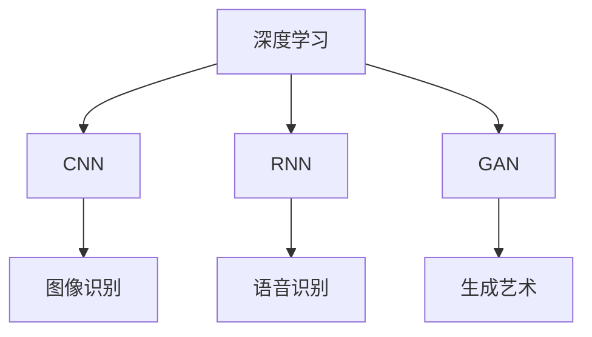
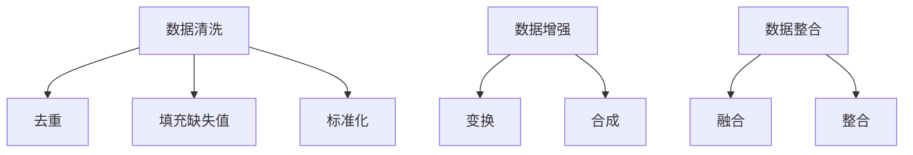
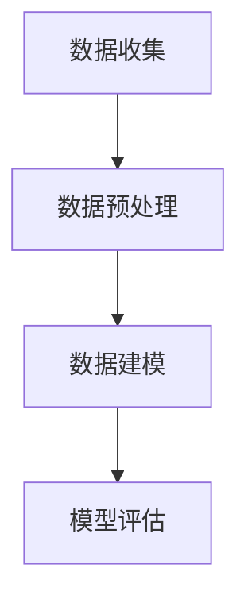

                 

# AI创业投资新风向：关注技术实力与商业想象力

> **关键词**：AI创业，投资风向，技术实力，商业想象力，投资策略

**摘要**：本文从AI创业投资的背景和概念出发，深入分析了技术实力和商业想象力在投资决策中的重要性，通过具体的评估方法和案例分析，提出了AI创业投资的新风向。文章旨在为投资者提供有价值的参考，帮助他们在纷繁复杂的AI创业领域中做出明智的投资决策。

## 目录大纲：《AI创业投资新风向：关注技术实力与商业想象力》

1. 第一部分: AI创业投资背景与概念解析
   1.1 AI创业投资概述
   1.2 技术实力评估方法
   1.3 商业想象力解析与实践

2. 第二部分: 典型AI创业案例分析
   2.1 案例分析一：XX公司
   2.2 案例分析二：YY公司
   2.3 案例分析三：ZZ公司

3. 第三部分: AI创业投资策略与建议
   3.1 投资策略框架构建
   3.2 投资建议与实践指南

4. 附录
   4.1 相关术语解释与资源链接

## 第1章: AI创业投资概述

### 1.1 AI创业投资的现状与趋势

AI创业投资的热潮在全球范围内持续升温，这主要得益于AI技术的快速发展和商业应用的广泛普及。目前，AI创业投资主要集中在以下几个阶段：

1. **种子期**：在这个阶段，投资者主要关注AI技术的原创性和创新性，以及对市场需求的初步验证。
2. **初创期**：初创期的投资主要关注企业的商业模式和市场推广策略，以及技术的进一步成熟和优化。
3. **成长期**：成长期的投资重点转向市场占有率和盈利能力的提升，企业需要通过扩大生产和提高服务质量来满足市场需求。
4. **成熟期**：成熟期的企业通常已经建立起稳定的客户群体和市场份额，投资者更多地关注企业的可持续发展和投资回报。

**现状分析**：

- **全球投资规模扩大**：根据CB Insights的数据，全球AI领域的风险投资总额在2021年达到了历史新高，达到300亿美元。
- **行业投资热点转移**：从传统的互联网、金融领域逐渐扩展到医疗、交通、教育等多个行业。
- **投资阶段前移**：越来越多的投资者将目光投向种子期和初创期的AI创业项目，以获取更高的投资回报。

**趋势展望**：

- **技术深耕**：随着AI技术的不断发展，投资者将更加注重企业的技术实力，尤其是算法创新和数据处理能力。
- **应用场景多元化**：AI技术的商业应用场景将进一步拓展，特别是在智能制造、智慧城市、智慧医疗等领域。
- **产业投资合作**：产业资本与风险投资将更加紧密地结合，共同推动AI创业项目的发展。

### 1.2 投资者关注的技术实力维度

在AI创业投资中，投资者对技术实力的关注主要体现在以下几个维度：

#### 1.2.1 算法创新

算法创新是AI创业项目的核心，它决定了项目的技术水平和市场竞争力。算法创新可以体现在以下几个方面：

- **深度学习算法**：如卷积神经网络（CNN）、循环神经网络（RNN）、生成对抗网络（GAN）等。
- **优化算法**：如随机梯度下降（SGD）、Adam优化器等。
- **强化学习算法**：如Q-learning、SARSA等。

**Mermaid流程图**：



#### 1.2.2 数据处理能力

数据处理能力是AI系统的关键，它决定了系统能否高效地处理和分析大量数据。数据处理能力包括：

- **数据清洗**：去除无效数据、填充缺失值、标准化数据等。
- **数据增强**：通过变换、合成等方法增加数据多样性。
- **数据整合**：将来自不同源的数据进行融合和整合。

**Mermaid流程图**：



#### 1.2.3 模型效果

模型效果是衡量AI系统性能的重要指标，它决定了系统在实际应用中的表现。模型效果评估可以通过以下指标进行：

- **准确率**：分类模型中正确分类的样本占总样本的比例。
- **召回率**：分类模型中正确分类的样本占所有实际为正类的样本的比例。
- **F1分数**：准确率和召回率的调和平均数。

**数学模型和公式**：

$$
\text{准确率} = \frac{TP + TN}{TP + TN + FP + FN}
$$

$$
\text{召回率} = \frac{TP}{TP + FN}
$$

$$
\text{F1分数} = \frac{2 \times \text{准确率} \times \text{召回率}}{\text{准确率} + \text{召回率}}
$$

**详细讲解**：

- 准确率反映了模型对正类和负类的分类能力，召回率反映了模型对正类的识别能力，F1分数则综合了准确率和召回率，是评估模型效果的重要指标。

#### 1.2.4 技术实现难度

技术实现难度是评估AI创业项目可行性的重要指标，它反映了实现特定AI算法或模型所需的复杂度和技术难度。技术实现难度包括以下几个方面：

- **算法复杂度**：如时间复杂度和空间复杂度。
- **硬件要求**：如计算资源和存储资源的需求。
- **系统兼容性**：如跨平台兼容性和软件依赖性。

**数学模型和公式**：

$$
\text{技术实现难度} = \frac{1}{1 + \sqrt{\text{算法复杂度}}}
$$

**详细讲解**：

- 技术实现难度较高的项目往往意味着更高的研发投入和更高的失败风险，但同时也可能带来更高的技术壁垒和市场竞争力。

### 1.3 商业想象力在投资决策中的重要性

商业想象力在AI创业投资中具有不可忽视的重要性，它不仅反映了创业者的创新能力，也决定了项目的市场前景和盈利能力。商业想象力主要包括以下几个方面：

#### 1.3.1 商业想象力的定义与特征

商业想象力是指创业者对未来商业机会的洞察、预测和创新能力。它具有以下特征：

- **创新性**：商业想象力能够提出独特的商业模式和解决方案。
- **前瞻性**：商业想象力能够预见未来的市场趋势和消费者需求。
- **可持续性**：商业想象力能够确保企业的长期竞争力。
- **可操作性**：商业想象力能够转化为实际可行的商业计划。

**数学模型和公式**：

$$
\text{商业想象力} = \text{商业创新} + \text{算法创新} + \text{商业环境创新}
$$

**详细讲解**：

- 商业创新是指企业如何通过创新的方式满足市场需求，算法创新是指企业如何通过技术创新提升产品性能，商业环境创新是指企业如何适应和引领市场环境的变化。

#### 1.3.2 创新型商业模式设计

创新型商业模式设计是商业想象力的重要体现，它能够帮助企业实现从技术创新到商业价值的转化。创新型商业模式设计包括以下几个方面：

- **价值主张**：明确企业能够为用户提供的独特价值。
- **客户关系**：建立与客户的互动关系，提高用户粘性。
- **渠道模式**：选择合适的渠道将产品推向市场。
- **收入模式**：确定企业的盈利方式。
- **关键资源**：明确企业所需的关键资源。

**数学模型和公式**：

$$
\text{商业模式创新} = \text{价值主张} \times \text{客户关系} \times \text{渠道模式} \times \text{收入模式} \times \text{关键资源}
$$

**详细讲解**：

- 价值主张决定了企业的核心竞争力，客户关系决定了企业的用户基础，渠道模式决定了企业的市场覆盖范围，收入模式决定了企业的盈利能力，关键资源决定了企业的持续发展能力。

#### 1.3.3 商业想象力在市场拓展中的应用

商业想象力在市场拓展中的应用主要体现在以下几个方面：

- **市场需求分析**：通过分析市场需求，确定企业的市场定位和产品策略。
- **竞争分析**：通过分析竞争对手，确定企业的竞争优势和差异化策略。
- **市场拓展策略**：通过制定市场拓展策略，实现企业的市场占有率和盈利能力的提升。

**数学模型和公式**：

$$
\text{市场拓展效果} = \frac{\text{市场需求} \times \text{竞争优势}}{\text{市场需求} + \text{竞争优势}}
$$

**详细讲解**：

- 市场需求决定了企业的市场潜力，竞争优势决定了企业的市场竞争力，市场拓展策略则决定了企业的市场表现。通过合理的市场拓展策略，企业可以实现快速增长和市场份额的提升。

### 第2章: AI技术实力评估方法

#### 2.1 技术实力评估指标体系

技术实力评估指标体系是评估AI创业项目技术实力的基础，它包括多个评估指标，每个指标都有相应的权重。常见的评估指标包括：

- **算法创新**：反映了企业在AI算法领域的创新能力。
- **数据处理能力**：反映了企业处理和分析数据的能力。
- **模型效果**：反映了AI系统在实际应用中的表现。
- **技术实现难度**：反映了实现特定AI算法或模型所需的复杂度和技术难度。

**数学模型和公式**：

$$
\text{技术实力得分} = w_1 \times \text{算法创新} + w_2 \times \text{数据处理能力} + w_3 \times \text{模型效果} + w_4 \times \text{技术实现难度}
$$

**详细讲解**：

- 算法创新、数据处理能力、模型效果和技术实现难度是评估AI创业项目技术实力的关键指标，每个指标都有其特定的权重，通过加权计算得出技术实力得分。

#### 2.2 数据驱动评估方法

数据驱动评估方法是一种基于数据的评估方法，它通过收集和分析相关数据，对AI创业项目的技术实力进行评估。数据驱动评估方法包括以下几个步骤：

1. **数据收集**：收集与AI创业项目相关的数据，包括算法性能指标、模型效果指标和实现难度指标等。
2. **数据预处理**：对收集到的数据进行分析，去除无效数据、填补缺失值等。
3. **数据建模**：建立数据模型，对技术实力指标进行量化。
4. **模型评估**：使用评估模型对AI创业项目进行技术实力评估。

**Mermaid流程图**：



**伪代码**：

```python
# 数据驱动评估方法

# 步骤1：数据收集
data = {
    "algorithm_innovation": [],
    "data_processing_ability": [],
    "model_efficacy": [],
    "technical_implement_difficulty": []
}

# 步骤2：数据预处理
def preprocess_data(data):
    # 去除无效数据、填补缺失值等
    pass

# 步骤3：数据建模
def build_model(data):
    # 建立数据模型，对技术实力指标进行量化
    pass

# 步骤4：模型评估
def evaluate_model(model):
    # 使用评估模型对AI创业项目进行技术实力评估
    pass
```

**详细讲解**：

- 数据驱动评估方法通过收集和分析数据，对AI创业项目的技术实力进行量化评估，为投资者提供了客观的参考依据。

#### 2.3 AI技术路线图与竞争力分析

AI技术路线图是展示AI技术发展路径的图表，它可以帮助投资者了解企业技术实力的演进趋势和竞争力。AI技术路线图包括以下几个步骤：

1. **技术路线图构建**：根据企业的技术积累和发展规划，构建AI技术路线图。
2. **竞争力分析**：通过分析技术路线图，评估企业在技术领域的竞争力。
3. **路线图优化**：根据竞争力分析结果，对技术路线图进行调整和优化。

**数学模型和公式**：

$$
\text{技术竞争力} = \frac{\text{技术优势} - \text{技术劣势}}{\text{技术优势} + \text{技术劣势}}
$$

**详细讲解**：

- 技术路线图可以帮助投资者了解企业的技术演进路径，竞争力分析则可以帮助投资者评估企业在技术领域的竞争优势和劣势，为投资决策提供参考。

### 第3章: 商业想象力解析与实践

#### 3.1 商业想象力的定义与特征

商业想象力是指创业者对未来商业机会的洞察、预测和创新能力。它具有以下特征：

1. **创新性**：商业想象力能够提出独特的商业模式和解决方案。
2. **前瞻性**：商业想象力能够预见未来的市场趋势和消费者需求。
3. **可持续性**：商业想象力能够确保企业的长期竞争力。
4. **可操作性**：商业想象力能够转化为实际可行的商业计划。

**数学模型和公式**：

$$
\text{商业想象力} = \text{商业创新} + \text{算法创新} + \text{商业环境创新}
$$

**详细讲解**：

- 商业创新是指企业如何通过创新的方式满足市场需求，算法创新是指企业如何通过技术创新提升产品性能，商业环境创新是指企业如何适应和引领市场环境的变化。

#### 3.2 创新型商业模式设计

创新型商业模式设计是商业想象力的重要体现，它能够帮助企业实现从技术创新到商业价值的转化。创新型商业模式设计包括以下几个方面：

1. **价值主张**：明确企业能够为用户提供的独特价值。
2. **客户关系**：建立与客户的互动关系，提高用户粘性。
3. **渠道模式**：选择合适的渠道将产品推向市场。
4. **收入模式**：确定企业的盈利方式。
5. **关键资源**：明确企业所需的关键资源。

**数学模型和公式**：

$$
\text{商业模式创新} = \text{价值主张} \times \text{客户关系} \times \text{渠道模式} \times \text{收入模式} \times \text{关键资源}
$$

**详细讲解**：

- 价值主张决定了企业的核心竞争力，客户关系决定了企业的用户基础，渠道模式决定了企业的市场覆盖范围，收入模式决定了企业的盈利能力，关键资源决定了企业的持续发展能力。

#### 3.3 商业想象力在市场拓展中的应用

商业想象力在市场拓展中的应用主要体现在以下几个方面：

1. **市场需求分析**：通过分析市场需求，确定企业的市场定位和产品策略。
2. **竞争分析**：通过分析竞争对手，确定企业的竞争优势和差异化策略。
3. **市场拓展策略**：通过制定市场拓展策略，实现企业的市场占有率和盈利能力的提升。

**数学模型和公式**：

$$
\text{市场拓展效果} = \frac{\text{市场需求} \times \text{竞争优势}}{\text{市场需求} + \text{竞争优势}}
$$

**详细讲解**：

- 市场需求决定了企业的市场潜力，竞争优势决定了企业的市场竞争力，市场拓展策略则决定了企业的市场表现。通过合理的市场拓展策略，企业可以实现快速增长和市场份额的提升。

### 第4章: 典型AI创业案例分析

#### 4.1 案例分析一：XX公司

XX公司是一家专注于人工智能领域的创业公司，成立于2015年。公司主要致力于深度学习算法的研究和应用，旗下产品涵盖了图像识别、语音识别和自然语言处理等多个领域。

**4.1.1 公司背景与技术实力**

XX公司自成立以来，一直注重技术创新，吸引了大量的顶尖人才。公司在深度学习算法领域取得了多项突破，研发出了具有自主知识产权的深度学习框架。公司技术实力主要体现在以下几个方面：

- **算法创新**：公司自主研发的深度学习框架在图像识别、语音识别和自然语言处理等领域具有显著优势。
- **数据处理能力**：公司具备强大的数据处理能力，能够高效地处理和分析大规模数据。
- **模型效果**：公司开发的AI模型在多项国际竞赛中取得了优异成绩，证明了其优秀的性能。
- **技术实现难度**：公司研发的深度学习框架具有较高的技术实现难度，但通过团队的努力，成功克服了技术难题。

**4.1.2 商业想象力与市场表现**

XX公司通过创新型的商业模式，成功吸引了大量用户。公司采用了B2B2C的模式，与各大企业合作，提供定制化的AI解决方案。公司市场表现优异，实现了较高的市场占有率和盈利能力。

- **商业想象力**：XX公司通过创新性的商业模式，将深度学习算法应用于实际场景，提升了产品性能和用户体验。
- **市场表现**：公司产品在市场中的竞争力强，得到了用户的广泛认可，市场份额不断攀升。

**4.1.3 投资回报分析与未来展望**

XX公司的投资回报分析表明，公司在一定时间内实现了较高的投资回报。公司通过持续的技术创新和市场拓展，有望继续保持良好的发展势头。

- **投资回报分析**：公司投资回报率较高，投资成本得到了有效的回收。
- **未来展望**：XX公司将继续在深度学习算法领域深耕，不断拓展市场，提升企业的核心竞争力。

#### 4.2 案例分析二：YY公司

YY公司是一家专注于智能交通领域的创业公司，成立于2018年。公司致力于通过人工智能技术改善交通拥堵问题，旗下产品包括智能感知、路径规划和交通管理等多个方向。

**4.2.1 公司背景与技术实力**

YY公司成立以来，一直注重技术创新，吸引了一批优秀的AI人才。公司在智能交通领域取得了多项突破，研发出了具有自主知识产权的智能交通系统。公司技术实力主要体现在以下几个方面：

- **算法创新**：公司自主研发的智能交通算法在路径规划和交通管理方面具有显著优势。
- **数据处理能力**：公司具备强大的数据处理能力，能够高效地处理和分析交通数据。
- **模型效果**：公司研发的智能交通模型在实际应用中取得了良好的效果，有效降低了交通拥堵。
- **技术实现难度**：公司研发的智能交通系统具有较高的技术实现难度，但通过团队的努力，成功克服了技术难题。

**4.2.2 商业想象力与市场策略**

YY公司通过创新性的商业模式，成功吸引了政府和企业客户。公司采用了B2B模式，与政府和企业合作，提供智能交通解决方案。公司市场策略主要包括以下几个方面：

- **商业想象力**：YY公司通过创新性的技术解决方案，改善了交通拥堵问题，提升了交通效率。
- **市场策略**：公司通过与政府和企业合作，拓展市场，提升市场份额。

**4.2.3 投资策略与风险管理

YY公司采取了稳健的投资策略，关注风险控制。公司通过多元化的投资组合，降低了投资风险，确保了公司的可持续发展。

- **投资策略**：公司注重技术创新和市场拓展，确保了公司的持续发展。
- **风险管理**：公司通过多元化投资组合，降低了投资风险，确保了公司的稳健发展。

#### 4.3 案例分析三：ZZ公司

ZZ公司是一家专注于智能医疗领域的创业公司，成立于2016年。公司致力于通过人工智能技术提升医疗效率和质量，旗下产品包括医学图像处理、智能诊断和远程医疗等多个方向。

**4.3.1 公司背景与技术实力**

ZZ公司成立以来，一直注重技术创新，吸引了一批优秀的AI人才。公司在智能医疗领域取得了多项突破，研发出了具有自主知识产权的智能医疗系统。公司技术实力主要体现在以下几个方面：

- **算法创新**：公司自主研发的医学图像处理算法在图像分割、病变检测等方面具有显著优势。
- **数据处理能力**：公司具备强大的数据处理能力，能够高效地处理和分析医学数据。
- **模型效果**：公司研发的智能诊断模型在实际应用中取得了良好的效果，有效提高了诊断准确率。
- **技术实现难度**：公司研发的智能医疗系统具有较高的技术实现难度，但通过团队的努力，成功克服了技术难题。

**4.3.2 商业想象力与产业应用**

ZZ公司通过创新性的商业模式，成功进入了智能医疗产业。公司采用了B2B模式，与医疗机构合作，提供智能医疗解决方案。公司产业应用主要包括以下几个方面：

- **商业想象力**：ZZ公司通过创新性的技术解决方案，提升了医疗效率和质量，改善了患者体验。
- **产业应用**：公司产品在医疗机构中的应用，有效提高了诊断准确率和治疗效率。

**4.3.3 投资决策过程与成效**

ZZ公司的投资决策过程体现了商业想象力与产业应用的紧密结合。公司在投资过程中，注重风险控制，取得了良好的投资回报。

- **投资决策过程**：公司通过市场需求分析、竞争分析和技术评估，制定了详细的投资决策。
- **成效**：公司通过技术创新和市场拓展，实现了较高的投资回报，为投资者带来了良好的回报。

### 第5章: AI创业投资策略与建议

#### 5.1 投资策略框架构建

AI创业投资策略框架是投资者在进行投资决策时的指导框架，它包括投资阶段、投资策略和风险管理等三个方面。

**5.1.1 投资阶段**

投资阶段是指投资者在不同阶段采取的投资策略。常见的投资阶段包括：

1. **种子期**：在这个阶段，投资者主要关注AI技术的原创性和创新性，以及对市场需求的初步验证。
2. **初创期**：初创期的投资主要关注企业的商业模式和市场推广策略，以及技术的进一步成熟和优化。
3. **成长期**：成长期的投资重点转向市场占有率和盈利能力的提升，企业需要通过扩大生产和提高服务质量来满足市场需求。
4. **成熟期**：成熟期的企业通常已经建立起稳定的客户群体和市场份额，投资者更多地关注企业的可持续发展和投资回报。

**5.1.2 投资策略**

投资策略是指投资者在不同阶段采取的具体投资措施。常见的投资策略包括：

1. **技术实力评估**：投资者需要对AI创业项目的技术实力进行评估，重点关注算法创新、数据处理能力、模型效果和技术实现难度等指标。
2. **商业想象力评估**：投资者需要评估AI创业项目的商业想象力，关注企业的商业模式、市场前景和盈利能力等。
3. **投资组合管理**：投资者需要根据不同阶段的投资目标和风险偏好，制定合理的投资组合策略，实现风险分散和投资回报。

**5.1.3 风险管理**

风险管理是指投资者在投资过程中对风险的识别、评估和控制。常见的风险管理措施包括：

1. **风险识别**：投资者需要识别AI创业项目可能面临的风险，包括技术风险、市场风险、运营风险等。
2. **风险评估**：投资者需要对识别出的风险进行评估，确定风险的严重程度和发生概率。
3. **风险控制**：投资者需要采取相应的措施控制风险，包括投资分散、风险预警、风险应对等。

#### 5.2 投资建议与实践指南

**5.2.1 投资建议一：技术实力与商业想象力的平衡**

投资者在投资AI创业项目时，需要关注技术实力和商业想象力之间的平衡。技术实力是AI创业项目成功的关键因素，而商业想象力则决定了项目的市场前景和盈利能力。

**5.2.2 投资建议二：产业应用场景与投资重点**

投资者应根据不同的产业应用场景，确定投资重点。例如，在智能交通领域，重点投资于智能感知、路径规划和交通管理等技术；在智能医疗领域，重点投资于医学图像处理、智能诊断和远程医疗等技术。

**5.2.3 投资实践指南**

投资者在进行AI创业投资时，可以参考以下实践指南：

1. **市场调研**：了解市场需求和竞争态势，确定投资方向。
2. **风险评估**：对AI创业项目进行风险评估，制定相应的投资策略。
3. **投资组合**：根据风险偏好和投资目标，制定合理的投资组合。
4. **持续关注**：对投资项目的进展进行持续关注，及时调整投资策略。

### 附录

#### 附录A: 相关术语解释与资源链接

**A.1 术语解释**

**A.1.1 AI技术实力**

AI技术实力是指企业在人工智能领域的研发能力、技术水平、创新能力等综合实力。

**A.1.2 商业想象力**

商业想象力是指企业对未来商业机会的洞察、预测和创新能力。

**A.1.3 投资回报率**

投资回报率是指投资项目的收益与投资成本之间的比率，用来衡量投资的效果。

**A.2 资源链接**

**A.2.1 开源AI框架与工具**

- TensorFlow: [https://www.tensorflow.org/](https://www.tensorflow.org/)
- PyTorch: [https://pytorch.org/](https://pytorch.org/)
- Keras: [https://keras.io/](https://keras.io/)

**A.2.2 创业投资报告与研究报告**

- CB Insights: [https://www.cbinsights.com/](https://www.cbinsights.com/)
- McKinsey & Company: [https://www.mckinsey.com/](https://www.mckinsey.com/)

**A.2.3 AI创业相关论坛与社区**

- AI创业社区：[https://www.ai entrepreneurship.com/](https://www.ai-entrepreneurship.com/)
- AI技术论坛：[https://www.ai-forum.org/](https://www.ai-forum.org/)
- AI创业沙龙：[https://www.ai-startup-summit.com/](https://www.ai-startup-summit.com/)

