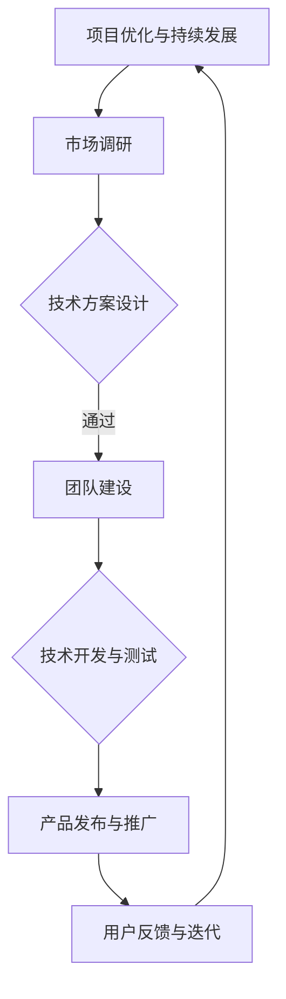

                 

### AI创业：分析B2B与B2C模式

> **关键词**：AI创业、B2B、B2C、商业模式、案例分析、技术挑战、创业策略

> **摘要**：本文将深入探讨AI创业领域的两种主要商业模式——B2B与B2C，通过详细分析各个领域的成功案例，探讨技术实现、商业模式以及创业过程中的挑战与应对策略。文章旨在为AI创业者提供宝贵的经验和启示，帮助他们在创业道路上做出明智的选择。

#### 目录大纲设计《AI创业：分析B2B与B2C模式》

- **第一部分：AI创业概述**
  - **第1章：AI创业背景**
    - **1.1 AI行业的发展趋势**
    - **1.2 创业者在AI行业的机遇与挑战**
    - **1.3 AI创业成功的要素**
  - **第2章：AI创业核心概念**
    - **2.1 AI基本原理**
    - **2.2 深度学习与神经网络**
    - **2.3 自然语言处理与计算机视觉**
  - **第3章：AI创业项目策划**
    - **3.1 项目定位与目标**
    - **3.2 市场调研与分析**
    - **3.3 技术方案设计与评估**

- **第二部分：B2B模式AI创业案例分析**
  - **第5章：B2B模式AI创业案例解析**
    - **5.1 案例一：企业服务领域**
    - **5.2 案例二：制造业领域**
    - **5.3 案例三：物流与供应链领域**
  - **第6章：B2B模式AI创业挑战与应对策略**
    - **6.1 技术挑战**
    - **6.2 市场竞争**
    - **6.3 风险管理**

- **第三部分：B2C模式AI创业案例分析**
  - **第7章：B2C模式AI创业案例解析**
    - **7.1 案例一：电商领域**
    - **7.2 案例二：在线教育领域**
    - **7.3 案例三：金融科技领域**
  - **第8章：B2C模式AI创业挑战与应对策略**
    - **8.1 技术挑战**
    - **8.2 用户需求与体验**
    - **8.3 风险管理**

- **第四部分：总结与展望**
  - **第9章：AI创业模式的比较与选择**
    - **9.1 B2B与B2C模式的特点分析**
    - **9.2 创业者如何选择模式**
    - **9.3 模式转变与融合的趋势**
  - **第10章：AI创业的未来发展趋势**
    - **10.1 新技术带来的机遇**
    - **10.2 行业发展趋势预测**
    - **10.3 创业者的未来规划**

- **附录**
  - **附录A：AI创业资源与工具**
    - **A.1 主流深度学习框架对比**
    - **A.2 创业者必备技能清单**
    - **A.3 AI创业相关政策与支持措施**
  - **附录B：Mermaid流程图**
    - **B.1 AI创业项目流程**

#### 第一部分：AI创业概述

##### 第1章：AI创业背景

###### 1.1 AI行业的发展趋势

人工智能（AI）作为21世纪最具变革性的技术之一，已经深刻地影响了各行各业。根据市场研究公司的数据，全球人工智能市场规模预计将从2020年的381亿美元增长到2025年的1,139亿美元，年复合增长率达到26.6%。这一趋势主要受以下几个因素的推动：

1. **大数据与计算能力的提升**：随着大数据技术的发展，大量的数据被收集和分析，为人工智能提供了丰富的训练素材。同时，计算能力的提升使得复杂的AI算法能够高效地运行。

2. **云计算与边缘计算的兴起**：云计算和边缘计算的发展，使得AI服务可以更加灵活、高效地部署，满足不同场景的需求。

3. **人工智能政策的支持**：各国政府纷纷出台人工智能发展战略，提供资金和政策支持，以推动人工智能技术的发展。

4. **人工智能技术的商业化**：深度学习、自然语言处理、计算机视觉等技术的突破，使得人工智能从实验室走向商业应用，成为企业提高效率、降低成本的重要工具。

在这些因素的推动下，AI行业呈现出快速发展的态势，吸引了大量创业者和投资者的关注。AI创业的背景不仅在于技术的进步，还在于市场需求的不断增长。从企业服务到消费者应用，AI技术正在各个领域发挥重要作用，为创业者提供了广阔的舞台。

###### 1.2 创业者在AI行业的机遇与挑战

在AI行业创业，创业者面临着巨大的机遇与挑战。以下是一些主要的机遇和挑战：

1. **机遇：**

   - **技术创新空间**：AI技术的不断进步为创业者提供了广阔的创新空间，可以开发出全新的应用和服务。

   - **市场需求的增长**：随着人工智能技术的普及，各行各业对AI应用的需求不断增长，为创业者提供了丰富的市场机会。

   - **政策支持**：各国政府对于AI技术的支持，为创业者提供了良好的政策环境，有助于创业项目的快速推进。

   - **资本投入**：人工智能领域吸引了大量的风险投资，为创业者提供了充足的资金支持。

2. **挑战：**

   - **技术门槛高**：人工智能领域的技术门槛较高，需要创业者具备深厚的专业知识和技术背景。

   - **市场竞争激烈**：随着越来越多的创业者进入AI领域，市场竞争日益激烈，创业者需要具备强大的竞争力和创新力。

   - **用户信任度**：AI技术的普及和应用需要用户的信任，创业者需要通过有效的营销和用户教育来建立用户信任。

   - **数据隐私与安全**：人工智能应用中涉及大量的用户数据，数据隐私和安全成为创业者面临的重要挑战。

总的来说，AI创业既有机遇也有挑战。创业者需要具备创新精神、专业知识、良好的市场嗅觉以及强大的执行力，才能在激烈的市场竞争中脱颖而出。

###### 1.3 AI创业成功的要素

AI创业的成功不仅依赖于技术创新，还需要多方面的要素支持。以下是一些关键的成功要素：

1. **技术创新**：技术创新是AI创业的核心竞争力。创业者需要不断关注最新的技术动态，利用前沿技术创造出具有竞争力的产品和服务。

2. **市场定位**：明确的市场定位是创业成功的关键。创业者需要对目标市场进行深入调研，了解用户需求，从而制定合适的商业策略。

3. **团队建设**：一个高效的团队是AI创业成功的重要保障。创业者需要组建一支具备多元化技能的团队，确保项目顺利推进。

4. **资本运作**：充足的资金支持是项目推进的必要条件。创业者需要合理规划资金使用，同时积极寻求外部投资，确保项目的可持续发展。

5. **用户反馈**：用户的反馈是产品迭代的重要依据。创业者需要建立完善的用户反馈机制，及时了解用户需求和痛点，从而优化产品和服务。

6. **持续学习**：在快速变化的技术和市场环境中，持续学习是创业者保持竞争力的关键。创业者需要不断学习新技术、新理念，以适应市场变化。

通过上述要素的协同作用，AI创业者可以更好地应对市场挑战，实现创业目标。

##### 第2章：AI创业核心概念

###### 2.1 AI基本原理

人工智能（AI）是一门研究、开发用于模拟、延伸和扩展人类智能的理论、方法、技术及应用系统的综合技术科学。AI的基本原理包括以下几个方面：

1. **机器学习**：机器学习是AI的核心技术之一，它通过从数据中学习，使计算机具备自我改进的能力。主要方法包括监督学习、无监督学习和强化学习。

2. **深度学习**：深度学习是一种基于多层神经网络的机器学习方法，通过大量的数据训练，深度学习模型可以自动提取特征并实现复杂任务的自动完成。常见的深度学习模型包括卷积神经网络（CNN）、循环神经网络（RNN）和生成对抗网络（GAN）。

3. **自然语言处理**：自然语言处理（NLP）是AI在语言领域的应用，旨在使计算机能够理解、生成和处理自然语言。NLP的主要任务包括文本分类、情感分析、机器翻译和语音识别等。

4. **计算机视觉**：计算机视觉是AI在图像和视频处理领域的应用，旨在使计算机能够理解图像中的内容。计算机视觉的主要任务包括目标检测、图像分类、人脸识别和图像生成等。

通过这些基本原理，AI技术能够模拟人类的感知、理解、推理和决策能力，实现智能化应用。

###### 2.2 深度学习与神经网络

深度学习是人工智能的一个重要分支，其核心思想是通过多层神经网络来模拟人类大脑的神经元连接和计算过程。深度学习的基本原理包括以下几个方面：

1. **多层神经网络**：多层神经网络（Multilayer Perceptron, MLP）是深度学习的基础，它由输入层、多个隐藏层和输出层组成。通过多层的非线性变换，神经网络能够提取输入数据的高级特征。

2. **激活函数**：激活函数是神经网络中的关键组件，用于引入非线性特性。常见的激活函数包括sigmoid函数、ReLU函数和Tanh函数。

3. **反向传播算法**：反向传播算法（Backpropagation）是训练多层神经网络的核心算法，它通过计算误差的梯度，调整网络的权重和偏置，使网络能够不断优化。

4. **优化算法**：深度学习训练过程中常用的优化算法包括梯度下降（Gradient Descent）、随机梯度下降（Stochastic Gradient Descent, SGD）和Adam优化器。这些优化算法用于加速网络训练过程并提高训练效果。

通过深度学习技术，计算机可以自动从大量数据中学习特征，实现图像识别、语音识别、自然语言处理等复杂任务。

###### 2.3 自然语言处理与计算机视觉

自然语言处理（NLP）和计算机视觉（CV）是人工智能的两个重要分支，它们在AI创业中有着广泛的应用。以下是这两个领域的基本原理和关键技术：

1. **自然语言处理（NLP）**：
   
   - **文本分类**：文本分类是将文本数据根据其内容划分到不同的类别中。常见的文本分类方法包括朴素贝叶斯、支持向量机和深度学习模型。
   
   - **情感分析**：情感分析用于判断文本表达的情感倾向，如正面、负面或中性。常用的方法包括基于规则的方法、机器学习模型和深度学习模型。
   
   - **机器翻译**：机器翻译是利用计算机自动将一种语言的文本翻译成另一种语言。常见的机器翻译模型包括基于规则的翻译模型、统计机器翻译模型和神经机器翻译模型。
   
   - **语音识别**：语音识别是将语音信号转换为文本或命令。常见的语音识别技术包括隐马尔可夫模型（HMM）、高斯混合模型（GMM）和深度神经网络（DNN）。

2. **计算机视觉（CV）**：

   - **目标检测**：目标检测是识别图像或视频中的特定对象并定位其位置。常用的目标检测算法包括R-CNN、Fast R-CNN、Faster R-CNN和YOLO。
   
   - **图像分类**：图像分类是将图像根据其内容划分到不同的类别中。常见的图像分类算法包括支持向量机（SVM）、卷积神经网络（CNN）和迁移学习。
   
   - **人脸识别**：人脸识别是通过计算机识别或验证人脸身份的技术。常用的人脸识别算法包括特征点检测、特征提取和匹配。
   
   - **图像生成**：图像生成是通过算法生成新的图像。常见的图像生成方法包括生成对抗网络（GAN）和变分自编码器（VAE）。

通过NLP和CV技术，AI创业可以实现智能客服、图像识别、自动驾驶等应用，为各行业提供智能化解决方案。

##### 第3章：AI创业项目策划

###### 3.1 项目定位与目标

在AI创业项目中，项目定位与目标设定是至关重要的。首先，创业者需要明确项目的核心价值，即项目旨在解决什么问题或提供什么服务。这一核心价值将贯穿整个项目的始终，指导产品的设计与开发。

1. **明确核心价值**：例如，如果项目是关于智能客服系统，核心价值可能是提高客户满意度、降低客服成本和提供更个性化的服务。

2. **设定具体目标**：具体目标应包括短期目标和长期目标。短期目标可能是实现基本的客服功能，如自动应答常见问题；长期目标则可能是实现更高级的智能客服功能，如多轮对话和情感分析。

3. **制定可行性计划**：在设定目标后，创业者需要制定一个可行的实施计划，包括项目的时间表、资源分配、关键里程碑等。可行性计划应确保项目在资源有限的情况下能够按计划推进。

4. **调整与优化**：在项目实施过程中，创业者应不断收集用户反馈和市场动态，根据实际情况调整目标和计划，以确保项目能够持续优化并适应市场变化。

通过明确项目定位与目标，创业者可以确保项目方向正确，资源利用高效，从而提高项目的成功率。

###### 3.2 市场调研与分析

市场调研与分析是AI创业项目策划中的关键步骤，它有助于创业者了解市场需求、评估市场潜力，并制定有效的营销策略。以下是一些重要的市场调研与分析方法：

1. **定量调研**：定量调研通过收集大量数据，以量化形式分析市场需求和用户行为。常见的方法包括问卷调查、用户访谈和在线调查。

2. **定性调研**：定性调研通过深入访谈、小组讨论等方式，获取用户需求、偏好和痛点。定性调研有助于创业者深入了解用户的真实感受，为产品设计提供指导。

3. **市场趋势分析**：分析市场趋势，包括市场规模、增长率、竞争格局等，有助于创业者判断项目的市场前景。创业者可以利用市场研究报告、行业白皮书等资料，了解市场动态。

4. **用户画像**：创建用户画像，即对目标用户进行详细的描述，包括年龄、性别、职业、行为习惯等。用户画像有助于创业者更好地了解目标用户，制定针对性的营销策略。

5. **竞争分析**：分析竞争对手的产品、服务、市场定位、营销策略等，有助于创业者找到差异化的竞争优势。创业者可以通过市场调研、产品评测、用户评价等途径，获取竞争对手的信息。

通过全面的市场调研与分析，创业者可以准确把握市场需求，制定合适的市场策略，提高项目的成功率。

###### 3.3 技术方案设计与评估

技术方案的设计与评估是AI创业项目成功的关键环节，它决定了项目的可行性、性能和可维护性。以下是一些关键步骤：

1. **需求分析**：在项目启动阶段，需要对用户需求进行深入分析，明确系统需要实现的功能和性能指标。需求分析应涵盖用户界面、数据处理、算法实现等多个方面。

2. **技术选型**：根据需求分析结果，选择合适的技术栈和工具。技术选型应考虑性能、可维护性、社区支持等因素。例如，对于图像处理任务，可以选择TensorFlow或PyTorch作为深度学习框架。

3. **架构设计**：制定系统的架构设计方案，包括模块划分、数据流、接口定义等。架构设计应确保系统的高效性和可扩展性，例如，可以采用微服务架构来提高系统的灵活性和可维护性。

4. **算法选择与实现**：选择合适的算法来实现项目功能。对于图像识别任务，可以选择卷积神经网络（CNN）作为算法模型。在实现算法时，可以使用伪代码来描述算法的基本流程，例如：

   ```python
   def image_recognition(image):
       # 数据预处理
       preprocessed_image = preprocess(image)
       
       # 卷积操作
       conv_output = convolution(preprocessed_image)
       
       # 池化操作
       pooled_output = pooling(conv_output)
       
       # 全连接层
       output = fully_connected(pooled_output)
       
       # 激活函数
       predicted_label = activation_function(output)
       
       return predicted_label
   ```

5. **性能评估**：在算法实现后，需要进行性能评估，包括准确性、速度和资源消耗等。性能评估可以通过测试数据和交叉验证来实现。例如，可以使用以下代码来评估模型准确性：

   ```python
   import numpy as np
   
   def evaluate_model(model, test_data, test_labels):
       predictions = model.predict(test_data)
       accuracy = np.mean(predictions == test_labels)
       return accuracy
   ```

6. **迭代与优化**：在技术方案实施过程中，应不断收集反馈并进行优化。通过迭代和优化，可以逐步提高系统的性能和用户满意度。

通过上述步骤，创业者可以设计出高效、可行的技术方案，为项目的成功奠定基础。

##### 第4章：AI创业团队建设

###### 4.1 团队成员角色与职责

一个成功的AI创业团队需要具备多样化的技能和知识，以确保项目的顺利进行。团队成员的角色与职责如下：

1. **创始人**：创始人通常负责项目的整体规划和战略决策，是团队的领导者。他们需要具备业务洞察力、技术背景和管理能力。

2. **技术总监**：技术总监（CTO）负责技术方案的设计和实施，是团队的技术权威。他们需要具备深厚的专业知识、项目管理和团队协作能力。

3. **研发工程师**：研发工程师负责具体的技术开发和实现，包括算法设计、模型训练、系统集成等。他们需要具备编程能力、数学基础和问题解决能力。

4. **数据科学家**：数据科学家负责数据分析、特征工程和模型优化。他们需要具备统计学、机器学习和数据挖掘的专业知识。

5. **产品经理**：产品经理（PM）负责产品设计和用户体验，确保产品满足用户需求。他们需要具备用户研究、产品设计和技术协调能力。

6. **运营经理**：运营经理负责项目运营和用户增长，包括市场推广、用户管理和业务拓展。他们需要具备市场洞察力、营销策略和团队管理能力。

7. **UI/UX设计师**：UI/UX设计师负责产品的用户界面和用户体验设计，确保产品具有良好的交互性和易用性。他们需要具备设计技能、用户研究和用户体验知识。

8. **财务人员**：财务人员负责项目财务管理和资金运作，确保项目资金合理使用。他们需要具备财务管理、预算规划和风险控制能力。

通过明确团队成员的角色与职责，可以有效提高团队的工作效率，确保项目顺利进行。

###### 4.2 技术团队组织结构

技术团队的组织结构对于项目的成功至关重要。以下是一些常见的技术团队组织结构：

1. **功能型组织结构**：在功能型组织结构中，团队成员按照职能划分，如开发、测试、数据科学等。这种结构有助于团队成员专注于自己的领域，提高专业水平。

2. **项目型组织结构**：在项目型组织结构中，团队成员根据项目需求组建临时团队，项目完成后团队解散。这种结构有助于快速响应项目需求，提高项目执行力。

3. **矩阵型组织结构**：在矩阵型组织结构中，团队成员既按职能划分，又按项目划分。这种结构可以充分发挥团队成员的专业能力和项目资源，提高项目的协调性和灵活性。

4. **分布式团队**：在分布式团队中，团队成员分散在不同地点，通过远程协作工具进行沟通和协作。这种结构适用于跨地域、跨时区的工作，有助于充分利用全球人才资源。

选择合适的技术团队组织结构，可以确保团队成员的工作效率，提高项目的成功率。

###### 4.3 团队管理与沟通

团队管理与沟通是确保AI创业项目顺利进行的关键因素。以下是一些团队管理与沟通的最佳实践：

1. **明确目标和职责**：确保团队成员明确项目目标和个人职责，避免目标冲突和职责重叠。

2. **定期会议**：定期召开团队会议，讨论项目进展、遇到的问题和解决方案。会议应简洁高效，避免冗长和无意义的内容。

3. **透明沟通**：保持团队内部沟通的透明度，让每个成员都能了解项目整体情况和关键决策。这有助于提高团队成员的参与度和责任感。

4. **灵活沟通**：根据项目需求和团队成员的特点，采用不同的沟通方式，如线上会议、即时通讯、邮件等。灵活的沟通方式可以提高沟通效率。

5. **积极反馈**：鼓励团队成员之间的积极反馈，包括正面反馈和负面反馈。正面反馈可以增强团队成员的自信心，负面反馈可以帮助团队成员改进和成长。

6. **冲突管理**：遇到冲突时，应及时沟通并寻求解决方案。避免个人情绪和偏见，以客观公正的态度处理冲突。

通过有效的团队管理和沟通，可以确保团队成员的工作协调一致，提高项目的成功率。

##### 第5章：B2B模式AI创业案例解析

###### 5.1 案例一：企业服务领域

在AI创业的B2B模式下，企业服务领域是一个重要的应用场景。以下是一个具体的案例解析：

**案例背景**：某初创公司开发了一款基于人工智能的客户关系管理（CRM）系统，旨在帮助企业提高销售效率和客户满意度。公司通过对大量销售数据的分析，为客户提供个性化的销售策略和客户服务建议。

**技术实现**：

1. **数据收集与预处理**：公司通过API接口从客户的销售系统中收集销售数据，包括客户信息、交易记录、销售机会等。数据收集后，需要进行数据清洗和预处理，确保数据的质量和一致性。

2. **机器学习模型训练**：公司利用收集到的销售数据，训练机器学习模型，以预测客户的购买概率、客户流失风险等。常用的模型包括逻辑回归、决策树、随机森林和神经网络。

3. **用户界面与交互**：公司开发了一个用户友好的界面，让客户可以方便地查询和分析销售数据。界面提供了多种可视化工具，如图表、仪表板等，帮助客户快速了解销售情况。

4. **API接口与系统集成**：公司提供了一个API接口，允许客户将CRM系统与现有的销售和客户管理系统集成，实现数据同步和自动化操作。

**商业模式分析**：

1. **订阅模式**：公司采用订阅模式，客户按月或按年支付订阅费用，使用CRM系统。这种模式有助于公司持续获得收入，同时降低客户迁移成本。

2. **增值服务**：公司提供增值服务，如数据报告、销售培训等，为客户提供更全面的支持。这些增值服务可以增加客户粘性和收入来源。

3. **合作伙伴关系**：公司与销售解决方案提供商建立合作伙伴关系，通过合作伙伴的销售渠道推广产品，扩大市场覆盖。

通过上述技术实现和商业模式分析，该初创公司在企业服务领域取得了成功。

###### 5.2 案例二：制造业领域

在制造业领域，AI技术可以帮助企业提高生产效率、降低成本和优化供应链。以下是一个具体的案例解析：

**案例背景**：某制造企业引入了基于人工智能的智能制造系统，通过实时监测和分析生产数据，优化生产流程和设备管理。

**技术实现**：

1. **传感器网络**：公司在生产线上部署了传感器网络，实时采集设备状态、生产参数等数据。传感器网络与云平台相连，实现数据的实时传输和分析。

2. **数据预处理与存储**：采集到的数据经过预处理和清洗，存储在云数据库中。数据预处理包括数据转换、去噪、缺失值处理等，确保数据的质量和一致性。

3. **机器学习模型训练**：公司利用训练数据，训练机器学习模型，以预测设备故障、优化生产计划和降低能耗。常用的模型包括时间序列分析、回归分析和聚类分析。

4. **实时监控与预警**：通过云平台，公司可以实时监控生产线的状态，及时发现和处理设备故障和异常情况。预警系统可以自动发送警报，通知相关人员采取措施。

5. **生产计划优化**：公司利用机器学习模型，对生产计划进行优化，提高生产效率。优化算法包括基于遗传算法的调度优化和基于神经网络的库存管理。

**商业模式分析**：

1. **定制化服务**：公司提供定制化的智能制造解决方案，根据客户的具体需求进行系统设计和实施。这种模式有助于公司为客户提供个性化的服务，提高客户满意度。

2. **设备租赁**：公司提供设备租赁服务，客户只需支付租赁费用，无需购买昂贵的设备和软件。这种模式有助于降低客户的初期投入和运营成本。

3. **增值服务**：公司提供增值服务，如生产数据分析报告、设备维护培训等，为客户提供更全面的支持。这些增值服务可以增加客户粘性和收入来源。

通过上述技术实现和商业模式分析，该制造企业在智能制造领域取得了显著成效。

###### 5.3 案例三：物流与供应链领域

在物流与供应链领域，AI技术可以帮助企业提高运输效率、优化库存管理和降低成本。以下是一个具体的案例解析：

**案例背景**：某物流公司引入了基于人工智能的智能运输管理系统，通过实时数据分析和优化算法，提高运输效率和降低成本。

**技术实现**：

1. **实时数据采集**：公司在运输车辆和仓库中部署了传感器和摄像头，实时采集车辆位置、货物状态、交通状况等数据。数据通过无线网络传输到云平台。

2. **数据预处理与存储**：采集到的数据经过预处理和清洗，存储在云数据库中。数据预处理包括数据转换、去噪、缺失值处理等，确保数据的质量和一致性。

3. **机器学习模型训练**：公司利用收集到的数据，训练机器学习模型，以预测运输时间、优化运输路线和降低能耗。常用的模型包括时间序列分析、回归分析和聚类分析。

4. **实时监控与调度**：通过云平台，公司可以实时监控运输车辆的运行状态，根据实际情况进行调度和优化。调度系统可以自动调整运输路线，避免交通拥堵和延误。

5. **库存管理优化**：公司利用机器学习模型，对库存管理进行优化，提高库存周转率和降低库存成本。优化算法包括基于马尔可夫决策过程的库存控制算法和基于深度学习的库存预测模型。

**商业模式分析**：

1. **订阅模式**：公司采用订阅模式，客户按月或按年支付订阅费用，使用智能运输管理系统。这种模式有助于公司持续获得收入，同时降低客户迁移成本。

2. **增值服务**：公司提供增值服务，如运输数据分析报告、设备维护培训等，为客户提供更全面的支持。这些增值服务可以增加客户粘性和收入来源。

3. **合作伙伴关系**：公司与物流解决方案提供商建立合作伙伴关系，通过合作伙伴的销售渠道推广产品，扩大市场覆盖。

通过上述技术实现和商业模式分析，该物流公司在智能运输管理领域取得了成功。

##### 第6章：B2B模式AI创业挑战与应对策略

在B2B模式AI创业过程中，创业者面临着诸多挑战。以下是一些主要挑战以及相应的应对策略：

###### 6.1 技术挑战

1. **技术门槛高**：AI技术涉及到深度学习、自然语言处理、计算机视觉等多个领域，技术门槛较高。创业者需要具备深厚的专业知识和实践经验，才能成功开发出具有竞争力的产品。

**应对策略**：

- **技术团队建设**：组建一支高水平的技术团队，包括数据科学家、机器学习工程师和软件工程师等。通过内部培训和外部合作，提高团队的技术水平。
- **技术积累**：在项目初期，积累相关技术知识和经验，逐步完善技术方案。可以通过开源项目、学术论文和技术交流等方式，获取最新的技术动态和研究成果。

2. **数据隐私与安全**：在B2B模式中，企业之间的数据交换和共享具有较高的风险，涉及数据隐私和安全问题。如何保障数据安全和隐私，是创业者需要关注的重要问题。

**应对策略**：

- **数据加密与安全传输**：采用数据加密技术，确保数据在传输和存储过程中的安全性。同时，使用安全传输协议，如HTTPS，保护数据在传输过程中的隐私。
- **数据脱敏与合规性**：对敏感数据进行脱敏处理，避免敏感信息泄露。同时，遵守相关法律法规，确保数据处理的合规性。

3. **算法可解释性**：在B2B场景中，企业需要对AI算法的决策过程有清晰的理解，以便对结果进行有效监控和调整。然而，深度学习等复杂算法的可解释性较差，这对创业者提出了挑战。

**应对策略**：

- **模型可解释性工具**：使用模型可解释性工具，如SHAP值、LIME等，分析模型的决策过程，提高算法的可解释性。
- **透明决策流程**：建立透明的决策流程，包括数据预处理、模型选择、参数调优等，让企业能够了解整个决策过程。

###### 6.2 市场竞争

在B2B模式中，市场竞争激烈，创业者需要具备强大的竞争力和创新能力，才能在市场中脱颖而出。

1. **同质化竞争**：许多创业者都瞄准了相同的市场机会，导致产品和服务的高度同质化。

**应对策略**：

- **差异化定位**：明确自身的核心竞争力，找到市场差异化的切入点，提供独特的价值主张。可以通过技术创新、用户体验和服务质量等方面实现差异化。
- **品牌建设**：通过品牌营销和公关活动，提高品牌知名度和美誉度。建立良好的品牌形象，有助于增强客户信任和忠诚度。

2. **客户需求变化**：B2B客户的业务场景和需求不断变化，创业者需要快速响应市场变化，调整产品和服务策略。

**应对策略**：

- **灵活的产品策略**：采用模块化设计，灵活调整产品功能和服务内容，满足客户多样化的需求。
- **客户关系管理**：建立完善的客户关系管理系统，了解客户需求，及时提供定制化的解决方案。

3. **市场竞争压力**：市场竞争加剧，创业者面临较大的压力，如价格战、市场份额争夺等。

**应对策略**：

- **成本控制**：通过技术创新和流程优化，降低生产成本和运营成本，提高产品竞争力。
- **合作与联盟**：与行业合作伙伴建立战略联盟，共享资源、优势互补，共同应对市场竞争。

通过以上策略，B2B模式AI创业者可以更好地应对市场竞争，实现持续发展和成功。

###### 6.3 风险管理

在B2B模式AI创业过程中，创业者需要面对多种风险，包括技术风险、市场风险和运营风险。有效的风险管理策略对于确保项目的成功至关重要。

1. **技术风险**：

   - **技术不成熟**：AI技术不断发展，某些技术可能尚未成熟，创业者需要承担技术风险。
   - **技术失效**：AI系统可能因为算法错误、数据异常等原因导致失效，影响业务运营。

**应对策略**：

- **技术研发**：持续投入技术研发，跟踪行业最新技术动态，确保技术方案的先进性和可靠性。
- **备份方案**：建立备份方案，确保在技术失效时能够迅速恢复业务运营，降低风险。

2. **市场风险**：

   - **市场饱和**：在B2B市场中，某些领域可能已经饱和，新进入者难以获得市场份额。
   - **客户流失**：客户可能因为价格、服务质量等原因流失，影响收入和业务发展。

**应对策略**：

- **市场调研**：进行详细的市场调研，了解目标市场的需求和竞争状况，制定有针对性的市场策略。
- **客户关系管理**：建立稳固的客户关系，提供优质的服务，提高客户满意度和忠诚度。

3. **运营风险**：

   - **运营成本高**：B2B项目通常需要较高的运营成本，创业者需要确保资金充足，避免因资金短缺导致运营困难。
   - **项目管理困难**：项目管理不善可能导致项目进度延误、成本超支等问题。

**应对策略**：

- **成本控制**：制定详细的预算计划，严格控制成本，确保项目在预算范围内顺利推进。
- **项目管理**：采用项目管理工具和方法，如敏捷开发、关键路径法等，确保项目按时完成。

通过有效的风险管理策略，B2B模式AI创业者可以降低风险，提高项目成功率。

##### 第7章：B2C模式AI创业案例解析

在B2C模式AI创业中，创业者主要面向消费者市场，通过提供智能化、个性化的产品和服务来满足用户需求。以下是一些具体的案例解析：

###### 7.1 案例一：电商领域

**案例背景**：某电商公司利用AI技术，打造了一个智能购物助手，通过个性化推荐和智能客服，提升用户体验和购物满意度。

**技术实现**：

1. **用户画像构建**：公司通过用户浏览记录、购物行为和反馈数据，构建用户画像，包括用户偏好、购买习惯、兴趣偏好等。

2. **个性化推荐算法**：公司采用基于内容的推荐算法和协同过滤算法，根据用户画像和商品特征，为用户推荐个性化的商品。

3. **自然语言处理**：通过自然语言处理技术，智能购物助手可以理解用户的提问，提供准确、高效的答案。

4. **图像识别技术**：公司利用图像识别技术，实现商品搜索和商品识别功能，用户可以通过上传图片快速找到相似商品。

**商业模式分析**：

1. **平台收费**：公司通过向商家收取平台费用，实现收入来源。平台费用包括入驻费、交易佣金等。

2. **广告收入**：公司通过在平台上展示广告，获得广告收入。广告可以根据用户画像和购物行为进行精准投放。

3. **增值服务**：公司提供增值服务，如会员服务、物流跟踪等，增加用户粘性和收入。

通过个性化推荐、智能客服和图像识别技术，该电商公司成功提升了用户体验和购物满意度。

###### 7.2 案例二：在线教育领域

**案例背景**：某在线教育平台利用AI技术，提供个性化学习体验，根据学生的学习行为和进度，为学生推荐合适的课程和学习资源。

**技术实现**：

1. **学习行为分析**：平台通过学生的学习行为数据，如学习时长、答题情况、互动情况等，分析学生的学习风格和学习效果。

2. **自适应学习算法**：平台采用自适应学习算法，根据学生的学习行为和效果，动态调整学习内容和难度，为学生提供个性化的学习路径。

3. **自然语言处理**：平台通过自然语言处理技术，提供智能问答和智能批改功能，帮助学生及时解答问题，提高学习效率。

4. **语音识别与生成**：平台利用语音识别和语音生成技术，提供语音讲解、语音互动等功能，提高学习趣味性。

**商业模式分析**：

1. **课程销售**：平台通过销售课程，获得主要收入来源。课程可以按照知识点、难度和类型进行分类。

2. **广告收入**：平台在课程视频和互动界面中插入广告，获得广告收入。

3. **增值服务**：平台提供增值服务，如学习辅导、考试辅导等，为学生提供更全面的支持。

通过个性化学习、智能问答和语音互动技术，该在线教育平台成功提升了学生的学习体验和学习效果。

###### 7.3 案例三：金融科技领域

**案例背景**：某金融科技公司利用AI技术，提供智能投顾和风险管理服务，帮助用户实现资产增值和风险控制。

**技术实现**：

1. **用户画像构建**：公司通过用户的财务数据、投资行为和风险偏好，构建用户画像。

2. **机器学习模型**：公司采用机器学习模型，分析市场趋势和投资组合，为用户推荐合适的投资策略。

3. **风险评估**：公司通过风险评估模型，对用户投资组合进行风险评估，提供风险预警和风险管理建议。

4. **智能客服**：公司提供智能客服服务，通过自然语言处理技术，解答用户问题，提供投资咨询。

**商业模式分析**：

1. **资产管理费**：公司通过收取资产管理费，获得收入来源。资产管理费可以根据用户投资金额和投资策略进行调整。

2. **金融服务费**：公司提供其他金融服务，如借贷、理财等，收取相应的服务费。

3. **增值服务**：公司提供增值服务，如财务规划、资产配置等，为用户提供更全面的支持。

通过智能投顾、风险评估和智能客服技术，该金融科技公司成功为用户提供了个性化的金融服务。

通过上述案例，可以看出B2C模式AI创业在电商、在线教育和金融科技等领域取得了显著成效。创业者可以通过技术创新和商业模式创新，为用户提供优质的AI服务，实现商业成功。

##### 第8章：B2C模式AI创业挑战与应对策略

在B2C模式AI创业过程中，创业者面临着一系列挑战。以下是一些主要挑战以及相应的应对策略：

###### 8.1 技术挑战

1. **技术更新迅速**：AI技术在快速发展，创业者需要不断跟进最新的技术趋势，保持技术竞争力。

**应对策略**：

- **持续学习**：鼓励团队成员持续学习，参加技术培训和学术交流，了解最新的技术动态。
- **技术创新**：加大技术研发投入，推动技术创新，确保产品始终保持技术领先。

2. **数据隐私与安全**：在B2C模式中，用户数据的安全和隐私保护是创业者需要重点关注的问题。

**应对策略**：

- **数据加密**：采用数据加密技术，确保用户数据在传输和存储过程中的安全性。
- **合规性**：遵守相关法律法规，确保数据处理和存储的合规性，降低法律风险。

3. **算法透明性**：用户对于AI算法的决策过程和结果存在疑虑，需要提高算法的透明性。

**应对策略**：

- **算法可解释性**：使用算法可解释性工具，分析算法的决策过程，提高算法的透明度。
- **透明度声明**：在产品和服务中，明确说明算法的工作原理和使用范围，增加用户的信任。

###### 8.2 用户需求与体验

1. **个性化需求**：B2C用户需求多样，创业者需要提供个性化的产品和服务。

**应对策略**：

- **用户调研**：进行详细用户调研，了解用户需求和偏好，为产品设计和功能提供依据。
- **用户反馈**：建立用户反馈机制，及时收集用户反馈，根据用户需求调整产品和服务。

2. **用户体验**：良好的用户体验是B2C模式成功的关键，创业者需要关注用户的交互体验。

**应对策略**：

- **用户体验设计**：采用用户体验设计（UX）原则，优化产品的界面和交互流程。
- **A/B测试**：进行A/B测试，比较不同设计方案的效果，选择最优方案。

3. **用户粘性**：提高用户粘性，增加用户的活跃度和忠诚度。

**应对策略**：

- **增值服务**：提供增值服务，如会员权益、积分奖励等，增加用户粘性。
- **用户社区**：建立用户社区，促进用户互动，增强用户归属感。

通过有效应对技术挑战和用户需求与体验问题，B2C模式AI创业者可以更好地满足用户需求，提升用户体验，实现商业成功。

###### 8.3 风险管理

在B2C模式AI创业中，创业者需要面对多种风险，包括市场风险、技术风险和运营风险。有效的风险管理策略对于确保项目的成功至关重要。

1. **市场风险**：

   - **竞争激烈**：B2C市场竞争激烈，创业者需要具备强大的竞争力和创新能力。
   - **用户需求变化**：用户需求变化快，创业者需要快速响应市场变化。

**应对策略**：

- **市场调研**：进行详细市场调研，了解目标市场的需求和竞争状况，制定有针对性的市场策略。
- **产品迭代**：快速迭代产品，根据用户反馈和市场变化调整产品和服务。

2. **技术风险**：

   - **技术不成熟**：某些AI技术可能尚未成熟，创业者需要承担技术风险。
   - **技术失效**：AI系统可能因为算法错误、数据异常等原因导致失效。

**应对策略**：

- **技术研发**：持续投入技术研发，确保技术方案的先进性和可靠性。
- **备份方案**：建立备份方案，确保在技术失效时能够迅速恢复业务运营。

3. **运营风险**：

   - **运营成本高**：B2C项目通常需要较高的运营成本，创业者需要确保资金充足。
   - **项目管理困难**：项目管理不善可能导致项目进度延误、成本超支等问题。

**应对策略**：

- **成本控制**：制定详细的预算计划，严格控制成本，确保项目在预算范围内顺利推进。
- **项目管理**：采用项目管理工具和方法，确保项目按时完成。

通过有效的风险管理策略，B2C模式AI创业者可以降低风险，提高项目成功率。

##### 第9章：AI创业模式的比较与选择

在AI创业过程中，B2B和B2C模式各有特点，创业者需要根据自身情况选择合适的模式。以下是对两种模式的详细比较与选择策略。

###### 9.1 B2B与B2C模式的特点分析

1. **市场定位**：

   - **B2B模式**：面向企业客户，提供专业化的产品和服务，解决企业的实际问题。
   - **B2C模式**：面向终端消费者，提供消费级产品和服务，满足个人需求。

2. **商业模式**：

   - **B2B模式**：通常采用订阅模式、增值服务模式和定制化模式，收入来源稳定，客户生命周期长。
   - **B2C模式**：主要依赖产品销售、广告收入和增值服务，收入波动较大，用户生命周期较短。

3. **市场拓展**：

   - **B2B模式**：市场拓展速度较慢，但客户粘性强，客户迁移成本高。
   - **B2C模式**：市场拓展速度快，但用户粘性相对较低，客户迁移成本低。

4. **竞争环境**：

   - **B2B模式**：竞争环境相对稳定，同质化竞争较少，但技术门槛较高。
   - **B2C模式**：竞争环境激烈，同质化竞争严重，但用户需求多样，创新空间大。

5. **客户需求**：

   - **B2B模式**：客户需求较为明确，对产品功能、性能和稳定性有较高要求。
   - **B2C模式**：客户需求多样，更注重产品体验和个性化服务。

6. **运营成本**：

   - **B2B模式**：运营成本较高，包括研发、运维和客户支持等。
   - **B2C模式**：运营成本相对较低，但需投入大量资源进行市场营销和用户增长。

通过上述分析，B2B与B2C模式在市场定位、商业模式、市场拓展、竞争环境、客户需求和运营成本等方面存在显著差异，创业者需要根据自身优势和市场需求选择合适的模式。

###### 9.2 创业者如何选择模式

1. **市场需求分析**：创业者应首先分析市场需求，了解目标客户的需求特点。如果客户需求明确、痛点突出，且对产品性能和稳定性有较高要求，选择B2B模式较为合适。如果客户需求多样、注重用户体验，且市场竞争激烈，选择B2C模式可能更为适合。

2. **自身优势分析**：创业者应评估自身的技术实力、团队经验和资源状况。如果团队具备深厚的专业技术和行业经验，且对B2B市场有深入了解，选择B2B模式更有利于发挥自身优势。如果团队擅长用户体验设计、市场营销和用户增长，且在消费市场有较多机会，选择B2C模式可能更为合适。

3. **商业模式分析**：创业者应分析不同模式的商业模式，包括收入来源、盈利模式、客户生命周期等。如果项目能够通过订阅模式、增值服务模式和定制化模式实现稳定的收入来源，且客户生命周期较长，选择B2B模式可能更为合适。如果项目主要依赖产品销售、广告收入和增值服务，且用户增长迅速，选择B2C模式可能更为合适。

4. **市场趋势分析**：创业者应关注市场趋势和行业动态，了解B2B和B2C模式的发展前景。如果B2B模式在特定行业具有广阔的发展空间，且市场需求持续增长，选择B2B模式可能更有利于抓住市场机遇。如果B2C模式在消费市场中充满活力，且用户需求多样，选择B2C模式可能更有利于实现商业成功。

通过综合分析市场需求、自身优势、商业模式和市场趋势，创业者可以做出明智的选择，为AI创业项目奠定坚实基础。

###### 9.3 模式转变与融合的趋势

随着AI技术的不断发展，B2B与B2C模式之间的界限逐渐模糊，越来越多的创业者开始探索模式转变与融合的趋势。

1. **跨界融合**：一些B2B公司开始将产品和服务拓展到消费市场，通过创新的应用场景和商业模式，满足消费者的个性化需求。例如，一些智能硬件公司推出了面向个人用户的智能设备，如智能家居、智能穿戴设备等。

2. **B2B2C模式**：B2B2C模式是将B2B模式与B2C模式相结合，通过建立中间渠道，将B2B产品和服务直接销售给终端消费者。例如，一些电商平台通过与供应商合作，将B2B产品直接销售给消费者，实现B2B与B2C的融合。

3. **平台化**：一些创业者通过构建AI平台，整合B2B和B2C资源，为用户提供一站式服务。平台化模式可以实现资源的最大化利用，提高运营效率，降低成本。

4. **S2B2C模式**：S2B2C模式是将供应链（Supply Chain）与B2B、B2C相结合，通过大数据和人工智能技术，实现供应链的优化和精准营销。这种模式有助于企业提高供应链效率，降低成本，提升用户满意度。

通过模式转变与融合，创业者可以拓展市场空间，提高竞争力，实现商业成功。未来，跨界融合和平台化将成为AI创业的重要趋势。

##### 第10章：AI创业的未来发展趋势

随着AI技术的不断进步，AI创业领域也将迎来新的机遇和挑战。以下是对AI创业未来发展趋势的探讨。

###### 10.1 新技术带来的机遇

1. **量子计算**：量子计算具有强大的计算能力，有望在AI算法优化、数据加密和模拟复杂系统等方面发挥重要作用。量子计算的应用将为AI创业带来前所未有的机遇。

2. **脑机接口**：脑机接口技术可以让人脑与计算机直接交互，为人类智能增强和康复治疗提供新的解决方案。脑机接口技术将在医疗、教育和娱乐等领域产生重大影响。

3. **生成对抗网络（GAN）**：生成对抗网络（GAN）具有强大的图像和视频生成能力，将在虚拟现实、增强现实和图像修复等领域发挥重要作用。GAN技术将为创业者提供丰富的创意空间。

4. **自适应机器学习**：自适应机器学习技术可以根据用户行为和环境变化，动态调整学习策略，提高学习效率和准确性。这种技术将在个性化推荐、智能客服和自动驾驶等领域得到广泛应用。

通过这些新技术的应用，AI创业领域将迎来更加智能化、个性化和高效化的产品和服务，为创业者提供广阔的发展空间。

###### 10.2 行业发展趋势预测

1. **智能制造**：随着工业4.0的推进，智能制造将成为未来工业发展的关键。AI技术将广泛应用于生产线自动化、智能物流和智能供应链管理，提高生产效率和质量。

2. **智慧城市**：智慧城市将利用AI技术实现城市管理的智能化和精细化，包括交通管理、能源管理、环境监测和公共安全等方面。智慧城市的建设将提高城市的生活质量，减少资源浪费。

3. **医疗健康**：AI技术在医疗健康领域的应用前景广阔，包括疾病预测、个性化治疗、智能诊断和医疗影像分析等。AI技术将提高医疗效率，降低医疗成本，改善患者体验。

4. **金融科技**：金融科技（FinTech）领域将利用AI技术实现金融服务的智能化和个性化，包括智能投顾、风险管理、反欺诈和信用评估等。金融科技的发展将提高金融行业的效率，降低金融风险。

5. **教育科技**：教育科技（EdTech）领域将利用AI技术实现教育的智能化和个性化，包括智能辅导、个性化学习、在线教育和教育数据分析等。教育科技的发展将提高教育质量，扩大教育普及。

通过这些行业发展趋势的预测，创业者可以把握市场机遇，提前布局，实现商业成功。

###### 10.3 创业者的未来规划

对于AI创业者来说，未来的规划应立足于技术创新、市场拓展和团队建设等方面。

1. **技术创新**：创业者应持续关注新技术动态，积极投入技术研发，保持技术领先优势。同时，加强与学术机构和研究团队的交流合作，获取前沿技术和研究成果。

2. **市场拓展**：创业者应深入研究市场需求，把握行业发展趋势，拓展市场份额。可以通过参加行业展会、建立合作伙伴关系和实施全球化战略等方式，提高品牌影响力和市场占有率。

3. **团队建设**：创业者应重视团队建设，吸引和培养优秀的团队成员。通过内部培训和外部合作，提高团队的专业能力和协作效率。同时，建立良好的企业文化，增强团队凝聚力和战斗力。

4. **风险管理**：创业者应建立健全的风险管理机制，防范技术风险、市场风险和运营风险。可以通过多元化业务布局、资金储备和风险控制策略等手段，确保企业稳健发展。

通过上述规划，AI创业者可以更好地应对未来挑战，实现长期可持续发展。

##### 附录A：AI创业资源与工具

为了帮助AI创业者更好地开展创业活动，以下列举了一些AI创业资源与工具：

###### A.1 主流深度学习框架对比

| 框架 | 优点 | 缺点 |
| --- | --- | --- |
| TensorFlow | 生态丰富，支持多种编程语言，开源社区活跃 | 需要较高的学习曲线，资源消耗较大 |
| PyTorch | 灵活性高，动态计算图易于理解，适合研究 | 生态相对较小，资源消耗较大 |
| Keras | 简单易用，基于TensorFlow和Theano，高度模块化 | 缺乏底层控制能力，功能有限 |
| Theano | 高效的数学计算，支持GPU加速，灵活的符号计算 | 开源社区活跃度较低，已逐渐被TensorFlow取代 |
| Caffe | 卷积神经网络性能优越，适用于图像处理 | 学习曲线较陡，功能模块化程度较低 |
| MXNet | 适合工业应用，支持多种编程语言，灵活性好 | 生态相对较小，资源消耗较大 |

通过对比不同深度学习框架的特点，创业者可以根据项目需求和团队技能选择合适的框架。

###### A.2 创业者必备技能清单

- **编程语言**：Python、Java、C++等
- **机器学习**：线性代数、微积分、概率论与数理统计
- **深度学习**：卷积神经网络（CNN）、循环神经网络（RNN）、生成对抗网络（GAN）
- **自然语言处理**：文本分类、情感分析、机器翻译、语音识别
- **计算机视觉**：目标检测、图像分类、人脸识别、图像生成
- **数据预处理**：数据清洗、数据集成、特征工程
- **数据存储与处理**：Hadoop、Spark、Flink
- **云计算与容器化**：AWS、Azure、Docker、Kubernetes
- **项目管理**：敏捷开发、Scrum、看板工具（如Jira、Trello）
- **版本控制**：Git、GitHub、GitLab

创业者应根据自己的项目需求和团队情况，制定详细的技能提升计划，确保团队具备必要的技能。

###### A.3 AI创业相关政策与支持措施

各国政府为了促进AI技术的发展，纷纷出台了相应的政策和支持措施。以下是一些主要的政策和措施：

- **美国**：美国政府设立了国家人工智能计划，投资数十亿美元用于AI研究和开发，支持初创企业的发展。
- **欧盟**：欧盟发布了《人工智能欧洲战略》，旨在加强欧盟在AI领域的竞争力，提供资金支持、人才培训和知识产权保护。
- **中国**：中国政府发布了《新一代人工智能发展规划》，提出到2030年成为全球人工智能创新中心，加强AI技术研发和应用。
- **日本**：日本政府设立了人工智能战略总部，推动AI技术在各个领域的应用，提供资金支持和税收优惠政策。

创业者可以利用这些政策和支持措施，获取资金、技术和人才等资源，加快创业项目的推进。

##### 附录B：Mermaid流程图

以下是一个用于描述AI创业项目流程的Mermaid流程图：



通过这个流程图，创业者可以清晰地了解项目从启动到持续发展的各个阶段，确保项目的顺利进行。同时，根据用户反馈和市场动态，不断优化和调整项目方向，实现项目的长期成功。

### 作者信息

作者：AI天才研究院/AI Genius Institute & 禅与计算机程序设计艺术 /Zen And The Art of Computer Programming

本文由AI天才研究院/AI Genius Institute的研究员撰写，研究院致力于推动人工智能技术的发展和应用。同时，作者也是《禅与计算机程序设计艺术》的作者，该书深入探讨了计算机编程的艺术和哲学，为程序员提供了宝贵的经验和启示。本文旨在为AI创业者提供有价值的指导和建议，帮助他们实现创业目标。感谢您阅读本文，希望它能为您的AI创业之路带来启发和帮助。如果您有任何问题或建议，欢迎在评论区留言。再次感谢您的支持！

