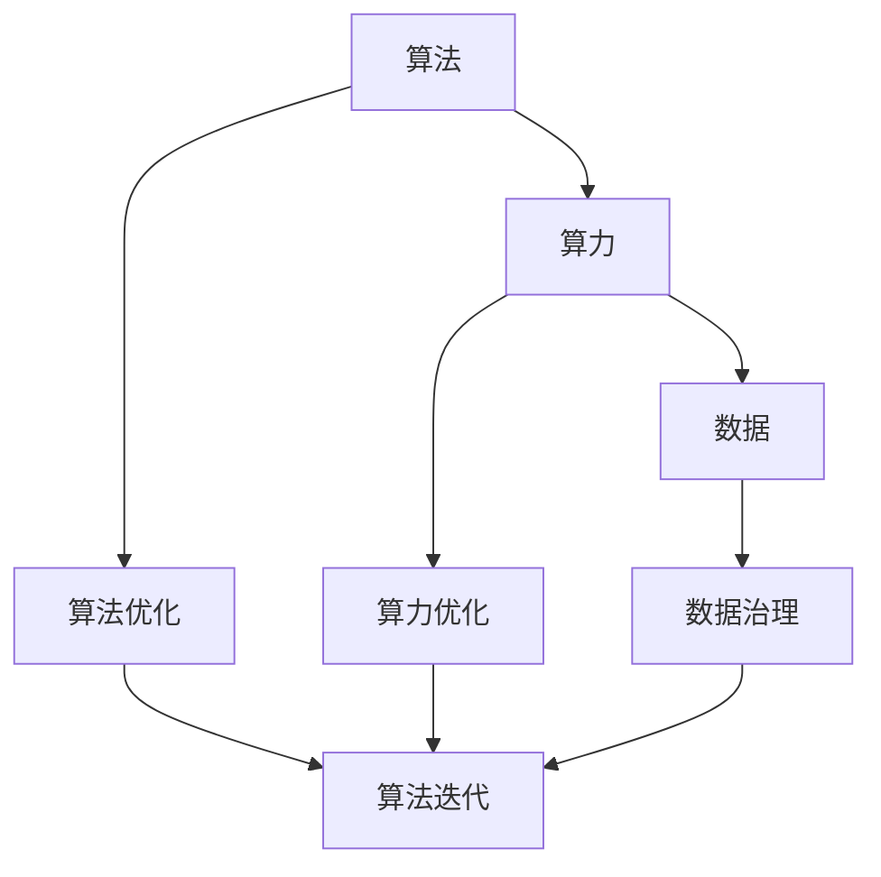

                 

### 第一部分：AI发展的三匹马概述

#### 第1章：AI发展的背景与核心概念

##### 1.1 AI的发展历程

人工智能（Artificial Intelligence，简称AI）是计算机科学的一个分支，旨在研究如何构建智能系统，使其能够模拟、扩展和辅助人类智能。AI的发展历程可以追溯到20世纪50年代。当时，计算机科学家和人工智能研究者首次提出了“人工智能”的概念，并试图开发出能够执行复杂任务的智能代理。

- **早期探索（1950-1969）**：1950年，艾伦·图灵提出了图灵测试，这一思想成为了AI领域的奠基石。1956年，达特茅斯会议标志着人工智能作为一门独立学科正式诞生。这一时期，AI主要集中在规则推理和知识表示上，代表性算法包括逻辑推理和专家系统。

- **泡沫与低谷（1970-1980）**：由于算法的局限性以及计算资源的限制，AI在20世纪70年代遭遇了第一次寒冬。尽管如此，这一时期也在机器学习和神经网络领域取得了重要进展，例如BP算法的提出。

- **复兴与繁荣（1980-2010）**：随着计算机硬件性能的提升和算法的进步，AI在20世纪80年代开始复苏。专家系统的应用取得了显著成果，同时机器学习领域也蓬勃发展，支持向量机、决策树等算法相继问世。

- **深度学习的崛起（2010至今）**：近年来，深度学习的突破性进展为AI带来了新的机遇。卷积神经网络（CNN）在图像识别任务中取得了惊人的效果，而循环神经网络（RNN）及其变种在序列数据处理方面表现优异。生成对抗网络（GAN）等新型算法的提出进一步拓展了AI的应用领域。

##### 1.2 算法、算力与数据的基本概念

- **算法（Algorithm）**：算法是解决特定问题的明确、有序的步骤集合。在AI领域，算法是实现智能行为的核心。常见的AI算法包括机器学习算法、深度学习算法等。

- **算力（Computing Power）**：算力是指计算设备执行计算任务的能力。在AI领域，算力直接影响模型的训练速度和效果。高性能计算设备和人工智能专用芯片的发明极大地推动了AI的发展。

- **数据（Data）**：数据是AI训练和学习的基础。高质量的数据能够帮助模型更准确地识别模式和规律，从而提高性能。数据的类型包括结构化数据、半结构化数据和非结构化数据。

##### 1.3 算法、算力与数据的相互作用

算法、算力和数据是推动AI发展的三驾马车，它们之间相互依存、相互作用。

- **算法驱动**：算法是AI的核心，决定了模型的性能和应用范围。创新算法能够解决特定问题，推动AI技术的进步。

- **算力支撑**：算力提供了算法运行所需的计算资源。高性能计算设备使得复杂算法能够得到快速训练和优化，从而提高AI模型的效果。

- **数据赋能**：数据是AI训练和学习的基础。大量高质量的数据能够帮助算法发现模式和规律，提高模型的泛化能力和鲁棒性。

在接下来的章节中，我们将详细探讨算法、算力和数据在AI发展中的具体作用和相互关系。

---

### 《AI发展的三匹马：算法、算力与数据》目录大纲

#### 目 录

**第一部分：AI发展的三匹马概述**

1. **AI发展的背景与核心概念**
   1.1 AI的发展历程
   1.2 算法、算力与数据的基本概念
   1.3 算法、算力与数据的相互作用

2. **算法在AI发展中的作用**
   2.1 算法概述
   2.2 机器学习算法原理
   2.3 深度学习算法详解
   2.4 生成对抗网络（GAN）原理与应用
   2.5 算法创新与发展趋势

3. **算力在AI发展中的角色**
   3.1 算力的基础
   3.2 硬件设备的发展
   3.3 人工智能专用芯片
   3.4 云计算与AI算力
   3.5 算力评估与优化策略

4. **数据在AI发展中的核心地位**
   4.1 数据在机器学习中的作用
   4.2 数据质量与数据治理
   4.3 数据隐私与伦理问题
   4.4 数据驱动的决策与优化

5. **数据采集与预处理**
   5.1 数据来源
   5.2 数据采集技术
   5.3 数据预处理方法
   5.4 数据集构建与标准化

**第二部分：三匹马协同推动AI发展**

6. **算法、算力与数据的协同效应**
   6.1 算法与算力的协同优化
   6.2 数据驱动的算法迭代
   6.3 算法、算力与数据融合的最佳实践

7. **未来AI发展的趋势与展望**
   7.1 算法创新的未来方向
   7.2 算力发展的新挑战与新机遇
   7.3 数据驱动的AI应用前景

**附录**

A. **常见AI算法与架构概述**
   A.1 算法详细介绍
   A.2 常见AI架构
   A.3 算法与架构选型指南

B. **AI算力优化实战案例**
   B.1 算力优化方法
   B.2 实战案例分析
   B.3 案例总结与经验分享

C. **数据采集与预处理工具推荐**
   C.1 数据采集工具介绍
   C.2 数据预处理工具介绍
   C.3 常用数据管理工具

#### 文章标题：AI发展的三匹马：算法、算力与数据

**关键词**：人工智能，算法，算力，数据，协同效应

**摘要**：本文深入探讨了人工智能发展的三大驱动力——算法、算力和数据。通过分析AI的发展历程，算法的基本原理，算力的基础以及数据的采集与预处理，我们揭示了这三者之间的相互作用与协同效应。文章旨在为读者提供一个全面而深刻的AI技术理解，为未来的AI研究与应用提供指导。

### 第二部分：算法在AI发展中的作用

#### 第2章：算法概述

算法是人工智能的核心，决定了智能系统的性能和应用范围。本章将介绍算法的基本概念、分类以及机器学习算法的原理。

##### 2.1 算法概述

算法（Algorithm）是一系列明确且有序的步骤，用于解决问题或执行特定任务。在计算机科学和人工智能领域，算法是实现智能行为的基础。

- **算法的定义**：算法是一种过程或规则的集合，用于执行计算任务。它具有以下几个特点：
  - **确定性**：对于给定的输入，算法总是产生相同的输出。
  - **有穷性**：算法在执行有限步骤后能够终止。
  - **有效性**：算法的执行时间（时间复杂度）和空间复杂度是可接受的。

- **算法的分类**：
  - **确定性算法**：输入确定时输出固定的算法，如排序算法。
  - **非确定性算法**：输入不确定时可能产生多个输出，如遗传算法。
  - **动态规划算法**：通过子问题分解和状态转移实现优化问题的求解，如背包问题。

##### 2.2 机器学习算法原理

机器学习（Machine Learning，简称ML）是一种通过数据学习并改进性能的算法。机器学习算法可以分为监督学习、无监督学习和强化学习。

- **监督学习（Supervised Learning）**：监督学习是一种在有标记数据集上训练模型的方法。模型通过学习输入和输出之间的映射关系，能够预测新的输入数据。常见的监督学习算法包括：
  - **线性回归（Linear Regression）**：用于预测连续值输出。
  - **逻辑回归（Logistic Regression）**：用于分类问题，预测概率值。
  - **决策树（Decision Tree）**：通过一系列规则对数据分类。
  - **支持向量机（Support Vector Machine，SVM）**：用于分类和回归问题，通过最大化分类边界。
  - **随机森林（Random Forest）**：通过构建多个决策树进行集成学习。

- **无监督学习（Unsupervised Learning）**：无监督学习是一种在无标签数据集上训练模型的方法。模型通过探索数据内在结构或模式进行数据聚类或降维。常见的无监督学习算法包括：
  - **K-均值聚类（K-Means Clustering）**：基于距离相似性进行聚类。
  - **主成分分析（Principal Component Analysis，PCA）**：通过降维减少数据维度。
  - **自编码器（Autoencoder）**：通过无监督学习构建特征表示。

- **强化学习（Reinforcement Learning）**：强化学习是一种通过与环境的交互来学习策略的方法。模型通过奖励和惩罚信号不断调整行为以实现最优目标。常见的强化学习算法包括：
  - **Q学习（Q-Learning）**：通过值函数学习策略。
  - **深度确定性策略梯度（Deep Deterministic Policy Gradient，DDPG）**：通过深度神经网络学习策略。

##### 2.3 深度学习算法详解

深度学习（Deep Learning，简称DL）是机器学习的一个重要分支，通过构建深度神经网络模型来模拟人脑神经元网络，实现复杂特征提取和模式识别。深度学习算法在图像识别、自然语言处理、语音识别等领域取得了显著成果。

- **神经网络（Neural Network）**：神经网络是一种由大量神经元组成的计算模型，用于模拟生物神经元网络。基本的神经网络包括输入层、隐藏层和输出层。

- **激活函数（Activation Function）**：激活函数用于引入非线性，使神经网络能够学习复杂函数。常见的激活函数包括Sigmoid、ReLU和Tanh。

- **前向传播（Forward Propagation）和反向传播（Back Propagation）**：前向传播是计算神经网络输出值的过程，反向传播是通过计算梯度来更新模型参数的过程。

- **深度神经网络（Deep Neural Network）**：深度神经网络是通过堆叠多层神经网络来提高模型性能。深度神经网络包括卷积神经网络（CNN）、循环神经网络（RNN）和生成对抗网络（GAN）等。

- **卷积神经网络（Convolutional Neural Network，CNN）**：卷积神经网络是一种专门用于图像识别和处理的神经网络。CNN通过卷积层、池化层和全连接层提取图像特征，实现图像分类和目标检测。

- **循环神经网络（Recurrent Neural Network，RNN）**：循环神经网络是一种用于处理序列数据的神经网络。RNN通过时间步循环，保留长期依赖信息，实现自然语言处理和语音识别。

- **生成对抗网络（Generative Adversarial Network，GAN）**：生成对抗网络是一种通过生成器和判别器对抗训练的神经网络。GAN通过生成逼真的数据，应用于图像生成、图像修复和风格迁移等任务。

##### 2.4 生成对抗网络（GAN）原理与应用

生成对抗网络（GAN）是一种由生成器和判别器组成的神经网络结构，通过对抗训练生成高质量的数据。GAN的原理简单，但应用广泛，可以生成逼真的图像、视频和音频。

- **GAN的组成部分**：
  - **生成器（Generator）**：生成器是一个神经网络，用于生成虚假数据，以欺骗判别器。
  - **判别器（Discriminator）**：判别器是一个神经网络，用于区分真实数据和虚假数据。

- **GAN的工作原理**：
  - **训练过程**：生成器和判别器交替训练。生成器尝试生成更逼真的数据，判别器尝试区分真实数据和虚假数据。通过对抗训练，生成器的性能逐渐提高，生成的数据越来越接近真实数据。

- **GAN的应用场景**：
  - **图像生成**：GAN可以生成高质量、逼真的图像，应用于艺术创作、图像修复和风格迁移等领域。
  - **图像去噪**：GAN可以去除图像中的噪声，提高图像质量。
  - **图像超分辨率**：GAN可以提升图像的分辨率，使其更加清晰。
  - **视频生成**：GAN可以生成高质量的视频，应用于虚拟现实和动画制作等领域。

##### 2.5 算法创新与发展趋势

随着AI技术的不断进步，算法也在不断创新和发展。未来，算法的创新和发展趋势包括：

- **算法优化**：通过优化算法结构和计算效率，提高模型的训练速度和效果。例如，优化深度神经网络的结构，减少参数数量，提高计算效率。

- **迁移学习（Transfer Learning）**：迁移学习是一种利用预训练模型的知识来提高新任务的性能的方法。通过迁移学习，可以减少训练数据的需求，提高模型在不同任务上的泛化能力。

- **元学习（Meta-Learning）**：元学习是一种学习如何学习的方法，通过学习算法自身来优化学习过程。元学习可以加速模型的训练，提高模型在不同任务上的泛化能力。

- **强化学习与深度学习的融合**：强化学习与深度学习的融合可以解决更多复杂的问题，例如自主驾驶、机器人控制等。

- **小样本学习（Few-Shot Learning）**：小样本学习是一种在训练数据非常有限的情况下进行学习的方法。通过小样本学习，可以降低对大规模训练数据的需求，提高模型在实际应用中的实用性。

- **模型可解释性（Model Interpretability）**：模型可解释性是一种让模型决策过程更加透明的方法，有助于理解模型的决策依据。通过提高模型的可解释性，可以增强模型的信任度和可靠性。

在接下来的章节中，我们将进一步探讨算力和数据在AI发展中的具体作用，以及这三者之间的协同效应。

### 第3章：算力的基础

#### 3.1 硬件设备的发展

算力的提升离不开硬件设备的发展。随着计算机硬件技术的不断进步，算力得到了极大的提升。以下是近年来硬件设备发展的几个重要趋势：

- **CPU性能提升**：CPU（中央处理器）是计算机系统的核心部件，负责执行程序指令。近年来，CPU的性能不断提升，主要体现在以下方面：
  - **核心数量增加**：多核CPU使得计算机可以同时执行多个任务，提高了系统的并发处理能力。
  - **时钟频率提升**：时钟频率的提升使得CPU可以更快地执行指令，从而提高计算速度。
  - **缓存容量增加**：缓存是CPU中用于存储常用数据的高速存储器，缓存容量的增加有助于减少内存访问时间，提高系统性能。

- **GPU性能提升**：GPU（图形处理器）最初是为了满足图形处理需求而设计的，但近年来在AI计算中得到了广泛应用。GPU具有以下特点：
  - **并行处理能力强**：GPU由大量并行处理的计算单元组成，可以同时处理多个数据，提高了计算效率。
  - **内存带宽高**：GPU具有高带宽的内存接口，可以快速读取和写入数据，提高了数据传输速度。
  - **功耗低**：相比CPU，GPU的功耗较低，适合进行大规模并行计算。

- **FPGA和ASIC**：FPGA（现场可编程门阵列）和ASIC（专用集成电路）是两种用于加速AI计算的新型硬件设备。

  - **FPGA**：FPGA是一种可编程逻辑设备，可以通过编程来定义其功能。FPGA在AI计算中的应用主要包括：
    - **加速深度学习模型**：通过在FPGA上实现深度学习模型，可以降低计算延迟，提高计算效率。
    - **硬件加速器**：FPGA可以作为硬件加速器，用于加速特定的计算任务。

  - **ASIC**：ASIC是一种定制化的集成电路，专门用于执行特定的计算任务。ASIC在AI计算中的应用主要包括：
    - **专用芯片设计**：通过设计专用芯片，可以针对特定AI任务进行优化，提高计算性能。
    - **硬件加速器**：ASIC可以作为硬件加速器，用于加速特定的计算任务。

- **云计算与边缘计算**：云计算和边缘计算是近年来计算领域的重要发展趋势。

  - **云计算**：云计算提供了强大的计算资源，可以灵活地调整计算能力，适用于大规模AI计算任务。云计算的优势包括：
    - **资源弹性**：云计算可以根据需求动态调整计算资源，提高资源利用率。
    - **成本效益**：云计算通过共享资源降低了计算成本。
    - **高效计算**：云计算提供了高性能的计算资源，可以快速处理海量数据。

  - **边缘计算**：边缘计算将计算任务分散到网络的边缘节点，减少了数据传输延迟，提高了系统响应速度。边缘计算的优势包括：
    - **实时处理**：边缘计算可以实时处理数据，提高了系统的实时性。
    - **降低带宽压力**：通过在边缘节点处理数据，可以减少数据传输量，降低网络带宽压力。
    - **安全性与隐私**：边缘计算可以将敏感数据留在本地处理，提高数据安全性。

#### 3.2 人工智能专用芯片

随着AI技术的发展，专用芯片在提高AI计算性能和效率方面发挥了重要作用。以下是一些重要的人工智能专用芯片：

- **TPU（谷歌张量处理器）**：TPU是谷歌开发的一款用于加速AI计算的特殊芯片，主要用于深度学习模型的训练和推理。

  - **架构特点**：TPU采用了特殊的计算架构，可以高效地处理矩阵运算，提高了计算速度和效率。
  - **性能优势**：TPU相对于通用CPU和GPU在AI计算任务上具有更高的性能和效率。

- **NPU（华为神经网络处理器）**：NPU是华为开发的一款用于加速AI计算的专用芯片，主要用于图像处理、语音识别和自然语言处理等领域。

  - **架构特点**：NPU采用了特殊的计算架构，可以高效地处理神经网络运算，提高了计算速度和效率。
  - **性能优势**：NPU在AI计算任务上具有更高的性能和效率，适用于大规模的AI应用场景。

- **GPU（图形处理器）**：GPU是常见的AI专用芯片，广泛应用于图像处理、语音识别和自然语言处理等领域。

  - **架构特点**：GPU由大量并行处理的计算单元组成，可以同时处理多个数据，提高了计算效率。
  - **性能优势**：GPU在AI计算任务上具有强大的并行处理能力，可以显著提高计算速度和效率。

#### 3.3 云计算与AI算力

云计算为AI计算提供了强大的基础设施支持，通过云平台，用户可以轻松获取高性能计算资源，实现大规模AI计算任务。以下讨论云计算与AI算力之间的关系：

- **云计算的优势**：
  - **弹性计算**：云计算可以根据需求动态调整计算资源，提高资源利用率。用户可以根据实际需求快速扩展或缩减计算资源，无需担心资源不足或浪费。
  - **成本效益**：云计算通过共享资源降低了计算成本。用户只需为实际使用的计算资源付费，无需购买和维护昂贵的硬件设备。
  - **高效计算**：云计算提供了高性能的计算资源，可以快速处理海量数据。用户可以轻松访问强大的计算资源，提高计算速度和效率。

- **AI算力的需求**：
  - **高性能计算**：AI计算任务通常需要大量计算资源，云计算提供了强大的计算能力，可以满足高性能计算的需求。
  - **实时计算**：许多AI应用场景需要实时处理数据，例如自动驾驶、智能监控等。云计算提供了高效的实时计算能力，可以满足这些应用场景的需求。
  - **数据存储与管理**：AI计算任务需要处理大量数据，云计算提供了高效的数据存储和管理解决方案，可以确保数据的可靠性和安全性。

- **云计算与AI算力的协同**：
  - **资源整合**：云计算可以将分布式计算资源整合在一起，形成一个统一的计算平台，提高计算效率和资源利用率。
  - **协同优化**：云计算可以与AI算法进行协同优化，通过调整计算资源和算法参数，实现最佳计算性能和效率。
  - **灵活部署**：云计算提供了灵活的部署方式，用户可以根据需求快速部署AI模型和应用程序，实现快速上线和迭代。

#### 3.4 算力评估与优化策略

评估和优化算力是提高AI计算效率和性能的重要手段。以下介绍几种常用的算力评估方法和优化策略：

- **算力评估方法**：

  - **计算密度评估**：计算密度是指单位体积或单位面积内的计算能力。通过计算密度评估可以衡量硬件设备的计算性能。
  - **功耗评估**：功耗是指计算设备在运行过程中消耗的电能。通过功耗评估可以衡量硬件设备的能耗情况。
  - **性能评估**：性能评估是指通过测量计算设备的处理速度和效率来评估其性能。

- **优化策略**：

  - **硬件优化**：通过选择更高效的硬件设备，优化计算架构和硬件配置，提高计算性能和效率。
  - **软件优化**：通过优化算法和编程方式，降低计算复杂度，提高计算效率和性能。
  - **并行计算**：通过并行计算将计算任务分解为多个子任务，同时在多个计算节点上执行，提高计算速度和效率。
  - **资源调度**：通过合理的资源调度策略，将计算任务分配到合适的计算节点，优化资源利用率和计算性能。
  - **热管理**：通过合理的热管理策略，降低计算设备的温度，提高计算稳定性和可靠性。

在接下来的章节中，我们将进一步探讨数据在AI发展中的核心地位，以及数据采集与预处理的方法和应用。

### 第4章：数据在AI发展中的核心地位

#### 4.1 数据在机器学习中的作用

数据是机器学习的基石，其质量和数量直接影响模型的性能和泛化能力。以下从数据收集、数据处理和数据应用三个方面探讨数据在机器学习中的作用。

- **数据收集**：数据的收集是机器学习的第一步，决定了数据的广度和深度。高质量的数据有助于模型更好地学习特征和模式。

  - **数据来源**：数据可以来源于多种渠道，包括公开数据集、企业内部数据、社交媒体数据等。公开数据集如ImageNet、CIFAR-10等在机器学习领域有着广泛应用。
  - **数据类型**：数据可以分为结构化数据、半结构化数据和非结构化数据。结构化数据如关系数据库中的表格数据，半结构化数据如XML、JSON等，非结构化数据如文本、图像、视频等。

- **数据处理**：数据处理是机器学习中的关键环节，包括数据清洗、数据整合和数据预处理等步骤。

  - **数据清洗**：数据清洗旨在去除数据中的噪声和不一致信息，确保数据质量。常见的清洗方法包括缺失值处理、异常值检测和去除重复数据等。
  - **数据整合**：数据整合是将来自不同来源的数据进行合并，形成一个统一的数据集。数据整合有助于提高模型的泛化能力和准确性。
  - **数据预处理**：数据预处理包括数据标准化、数据归一化和特征提取等步骤，有助于提高模型的学习效果和泛化能力。

- **数据应用**：数据在机器学习中的应用主要体现在训练模型、评估模型和部署模型等环节。

  - **训练模型**：数据是训练模型的关键输入，通过大量数据训练模型可以使其更好地学习和识别特征。训练数据的质量和数量直接影响模型的性能。
  - **评估模型**：评估模型是通过测试数据集来评估模型的泛化能力和准确性。数据的质量和多样性对评估结果具有重要影响。
  - **部署模型**：部署模型是将训练好的模型应用于实际场景，解决实际问题。数据的应用效果取决于数据的质量和模型的泛化能力。

#### 4.2 数据质量与数据治理

数据质量是机器学习成功的关键因素，高质量的数据有助于提高模型的性能和可信度。数据治理是确保数据质量的一系列管理和组织措施，包括数据标准化、数据安全和数据隐私等方面。

- **数据标准化**：数据标准化是将不同来源的数据进行统一格式和结构处理，确保数据的一致性和可操作性。数据标准化包括数据清洗、数据整合和数据规范化等步骤。

- **数据安全**：数据安全是保护数据免受未经授权访问、篡改和泄露的重要措施。数据安全包括数据加密、访问控制和数据备份等环节。

- **数据隐私**：数据隐私是保护个人和敏感信息不被泄露的重要问题。数据隐私包括数据匿名化、数据脱敏和隐私保护算法等方面。

- **数据治理策略**：

  - **数据质量评估**：通过建立数据质量评估体系，定期对数据质量进行评估，发现和解决问题。
  - **数据质量管理**：通过制定数据质量管理政策，规范数据收集、处理和应用过程，确保数据质量。
  - **数据安全与隐私保护**：通过实施数据安全和隐私保护措施，确保数据在收集、存储、处理和传输过程中的安全性和隐私性。

#### 4.3 数据隐私与伦理问题

随着数据在AI发展中的重要性日益凸显，数据隐私和伦理问题也日益受到关注。数据隐私是指个人和敏感信息的保护，伦理问题则涉及数据的收集、处理和应用过程中可能带来的负面影响。

- **数据隐私保护**：

  - **数据匿名化**：通过将个人和敏感信息进行匿名化处理，确保数据在分析和使用过程中不会泄露个人隐私。
  - **数据脱敏**：通过将敏感信息进行替换、加密或遮挡等处理，降低数据泄露的风险。
  - **隐私保护算法**：通过采用隐私保护算法，如差分隐私、同态加密和联邦学习等，确保在数据共享和计算过程中保护个人隐私。

- **伦理问题**：

  - **算法偏见**：算法偏见是指算法在训练过程中可能学习到歧视性或不公正的特征，导致对某些群体不公平对待。通过数据平衡、算法公正性和透明性等措施，可以减少算法偏见。
  - **数据滥用**：数据滥用是指未经授权或非法使用数据，可能导致隐私泄露和安全隐患。加强数据治理和监管，规范数据收集和使用过程，是防止数据滥用的关键。
  - **责任归属**：在AI应用过程中，涉及数据隐私和伦理问题的责任归属问题也日益突出。明确各方的责任和权利，建立健全的法律法规和责任追究机制，是保障数据隐私和伦理的关键。

#### 4.4 数据驱动的决策与优化

数据驱动的决策与优化是指通过分析数据，发现规律和趋势，为决策提供依据，实现业务优化。在AI应用中，数据驱动的决策与优化发挥着重要作用。

- **数据驱动的决策**：

  - **业务分析**：通过数据分析，发现业务中的问题和机遇，为决策提供数据支持。例如，通过销售数据分析，发现产品热销地区和季节性趋势，为营销决策提供依据。
  - **风险管理**：通过数据分析和预测，识别潜在风险，制定风险应对策略。例如，通过金融数据分析和预测，识别信用风险和欺诈风险，采取相应的风险管理措施。
  - **客户体验优化**：通过数据分析，了解客户需求和偏好，优化产品和服务，提升客户体验。例如，通过用户行为数据分析和用户反馈，改进产品功能和用户体验。

- **数据优化的方法**：

  - **机器学习优化**：通过机器学习算法，分析数据中的模式和趋势，实现自动化优化。例如，通过预测模型优化库存管理，实现库存最小化和成本最优化。
  - **优化算法应用**：通过优化算法，提高计算效率和性能。例如，通过遗传算法优化生产调度，实现生产资源的最优配置。
  - **业务流程优化**：通过数据分析和流程再造，优化业务流程，提高业务效率。例如，通过数据分析优化供应链管理，实现供应链优化和成本控制。

在数据驱动的决策与优化过程中，数据质量、数据治理和数据隐私是关键因素。只有确保数据质量、加强数据治理和保护数据隐私，才能实现数据驱动的决策与优化，为业务发展提供有力支持。

#### 第5章：数据采集与预处理

数据采集是AI系统中的关键步骤，决定了后续数据处理和分析的质量。本章将详细介绍数据采集的方法、数据预处理的技术以及如何构建和标准化数据集。

##### 5.1 数据来源

数据来源决定了数据的质量和多样性。以下是一些常见的数据来源：

- **公开数据集**：公开数据集如ImageNet、CIFAR-10、MNIST等，广泛应用于学术研究和工业应用。这些数据集通常由学术机构或开源项目提供，具有高质量和多样性。
- **企业内部数据**：企业内部数据包括销售数据、客户数据、生产数据等。这些数据反映了企业的运营情况，适用于企业内部分析和决策。
- **社交媒体数据**：社交媒体数据包括用户评论、点赞、分享等，反映了用户行为和偏好。这些数据适用于自然语言处理和推荐系统等应用。
- **传感器数据**：传感器数据包括环境数据、交通数据、健康数据等。这些数据广泛应用于智能交通、智能健康等应用场景。

##### 5.2 数据采集技术

数据采集技术决定了数据的完整性和准确性。以下是一些常见的数据采集技术：

- **Web scraping**：通过爬虫技术从网站抓取数据，适用于获取网页内容、用户评论等。
- **API调用**：通过API接口获取数据，适用于获取第三方数据或企业内部数据。
- **物联网设备**：通过物联网设备采集实时数据，适用于智能交通、智能家居等应用场景。
- **传感器采集**：通过传感器采集环境数据，适用于智能健康、环境监测等应用场景。

##### 5.3 数据预处理方法

数据预处理是提高数据质量和模型性能的关键步骤。以下是一些常见的数据预处理方法：

- **数据清洗**：数据清洗包括去除重复数据、缺失值填充、去除噪声等。数据清洗的目的是去除数据中的噪声和异常值，提高数据质量。
- **数据整合**：数据整合包括将来自不同来源的数据进行合并，形成一个统一的数据集。数据整合有助于提高模型的泛化能力和准确性。
- **数据标准化**：数据标准化包括数据缩放、归一化、离散化等。数据标准化有助于消除不同特征之间的量级差异，提高模型的学习效果。
- **特征提取**：特征提取包括提取数据中的关键特征，减少数据维度。特征提取有助于提高模型的效率和准确性。
- **数据降维**：数据降维包括主成分分析（PCA）、线性判别分析（LDA）等。数据降维有助于减少数据维度，提高计算效率和模型性能。

##### 5.4 数据集构建与标准化

数据集构建是训练模型的重要步骤，决定了模型的性能和应用效果。以下是一些构建和标准化数据集的方法：

- **数据集构建**：
  - **训练集、验证集和测试集**：将数据集分为训练集、验证集和测试集，用于训练、验证和评估模型。通常，训练集用于训练模型，验证集用于调整模型参数，测试集用于评估模型性能。
  - **数据增强**：通过数据增强方法增加数据多样性，提高模型的泛化能力。常见的数据增强方法包括旋转、翻转、缩放等。
  - **数据标签**：为数据集分配标签，用于训练分类模型。标签应准确反映数据的真实属性，以提高模型的准确性。

- **数据集标准化**：
  - **数值特征标准化**：对数值特征进行缩放或归一化处理，使其在相同的量级范围内。常见的标准化方法包括最小-最大缩放、Z-Score标准化等。
  - **类别特征编码**：对类别特征进行编码处理，将其转换为数值表示。常见的编码方法包括独热编码、标签编码等。
  - **文本预处理**：对文本数据进行分析和清洗，提取关键特征，如词袋模型、词嵌入等。

在数据采集和预处理过程中，确保数据质量、多样性和一致性是关键。高质量的数据集有助于提高模型的性能和应用效果。通过合理的数据集构建和标准化方法，可以更好地支持AI模型的训练和优化。

### 第6章：数据在AI应用中的实践

#### 6.1 数据在推荐系统中的应用

推荐系统是AI应用中的一项重要技术，通过分析用户行为和偏好，为用户提供个性化的推荐。数据在推荐系统中起着至关重要的作用，以下探讨数据在推荐系统中的应用和实践。

- **用户行为数据**：用户行为数据包括用户的浏览记录、搜索历史、购买记录等。这些数据反映了用户对特定商品或内容的偏好和兴趣。通过分析用户行为数据，推荐系统可以了解用户的兴趣偏好，为用户提供个性化的推荐。

  - **行为数据采集**：通过Web爬虫、API调用等技术，从用户的浏览、搜索和购买行为中采集数据。例如，电子商务平台可以通过用户在网站上的浏览和购买行为，收集用户的历史数据。
  - **行为数据预处理**：对采集到的用户行为数据进行分析和清洗，去除重复、缺失和不一致的数据。例如，对于用户的浏览记录，可以通过去重和补全缺失数据，确保数据的一致性和完整性。

- **内容数据**：内容数据包括商品的描述、标签、评价等信息。这些数据用于描述商品的特征和属性，为推荐系统提供基础信息。

  - **内容数据采集**：通过数据爬取、API调用等技术，从电子商务平台、社交媒体等渠道采集商品信息。例如，可以通过爬取电商网站的商品页面，获取商品的名称、描述、标签和评价等信息。
  - **内容数据预处理**：对采集到的内容数据进行清洗和标准化，确保数据的质量和一致性。例如，对于商品的标签，可以通过统一格式和去除停用词，提高数据的质量。

- **协同过滤**：协同过滤是一种常用的推荐算法，通过分析用户行为数据，找出相似的用户或商品，为用户提供推荐。

  - **基于用户的协同过滤**：通过分析用户之间的相似性，为用户提供相似用户的推荐。例如，如果一个用户喜欢了某件商品，那么可以推荐其他喜欢这件商品的用户购买的商品。
  - **基于物品的协同过滤**：通过分析商品之间的相似性，为用户提供相似商品的推荐。例如，如果一个用户购买了某件商品，那么可以推荐其他与这件商品相似的购物项。

- **矩阵分解**：矩阵分解是一种常用的推荐算法，通过将用户-物品评分矩阵分解为用户特征矩阵和物品特征矩阵，为用户提供个性化的推荐。

  - **隐语义模型**：通过矩阵分解，将用户-物品评分矩阵分解为用户特征和物品特征两个矩阵，从而发现用户和物品之间的潜在关系。例如，对于用户-物品评分矩阵，可以通过矩阵分解得到用户特征矩阵和物品特征矩阵，进而为用户提供个性化的推荐。
  - **在线矩阵分解**：在线矩阵分解是一种实时推荐算法，通过在线更新用户特征和物品特征矩阵，为用户提供实时推荐。例如，在电子商务平台上，用户每次浏览或购买商品时，都可以通过在线矩阵分解更新用户特征和物品特征矩阵，从而实现实时推荐。

#### 6.2 数据在自然语言处理中的应用

自然语言处理（Natural Language Processing，NLP）是AI领域中的一项重要技术，旨在使计算机理解和处理人类语言。数据在NLP中扮演着关键角色，以下探讨数据在NLP中的应用和实践。

- **语料库**：语料库是NLP研究的重要数据来源，包括大量的文本数据，如新闻、书籍、社交媒体等。通过分析语料库，可以提取语言特征和模式，为NLP任务提供基础。

  - **语料库建设**：通过数据爬取、API调用等技术，从互联网上获取大量文本数据，构建语料库。例如，可以通过爬取新闻网站、社交媒体等，获取大量的文本数据。
  - **语料库预处理**：对采集到的文本数据进行分析和清洗，去除噪声和不一致的数据。例如，对于文本数据，可以通过去除HTML标签、停用词过滤等，提高数据的质量。

- **词向量**：词向量是一种将文本数据转化为数值表示的方法，通过词向量可以捕捉文本数据中的语义信息。

  - **Word2Vec**：Word2Vec是一种常用的词向量模型，通过训练得到词向量，可以捕捉词与词之间的相似性和关系。例如，通过Word2Vec模型，可以得到“北京”和“北京”的词向量，从而发现它们之间的语义关系。
  - **GloVe**：GloVe（Global Vectors for Word Representation）是一种基于全局统计信息的词向量模型，通过训练得到词向量，可以捕捉词与词之间的语义信息。例如，通过GloVe模型，可以得到“北京”和“天气”的词向量，从而发现它们之间的语义关系。

- **文本分类**：文本分类是一种将文本数据分类为不同类别的任务，通过分析文本数据中的特征，可以实现文本分类。

  - **朴素贝叶斯分类器**：朴素贝叶斯分类器是一种基于概率论的文本分类算法，通过计算文本特征的概率分布，实现文本分类。例如，通过朴素贝叶斯分类器，可以将新闻文本分类为“体育”、“财经”、“娱乐”等类别。
  - **支持向量机（SVM）**：支持向量机是一种基于间隔最大化的文本分类算法，通过计算文本特征的空间间隔，实现文本分类。例如，通过支持向量机，可以将社交媒体文本分类为“正面”、“负面”等类别。

- **情感分析**：情感分析是一种分析文本数据中情感极性的任务，通过分析文本数据中的情感特征，可以实现情感分析。

  - **情感词典**：情感词典是一种将词语与其情感极性关联的词典，通过情感词典，可以快速分析文本数据中的情感极性。例如，通过情感词典，可以判断“喜欢”和“讨厌”等词语的情感极性。
  - **文本特征提取**：通过文本特征提取方法，如TF-IDF、Word2Vec等，可以从文本数据中提取情感特征，实现情感分析。例如，通过TF-IDF，可以从文本数据中提取关键词，分析文本的情感极性。

#### 6.3 数据在计算机视觉中的应用

计算机视觉是一种使计算机理解和解释图像和视频的技术，数据在计算机视觉中扮演着关键角色，以下探讨数据在计算机视觉中的应用和实践。

- **图像分类**：图像分类是将图像分类为不同类别的任务，通过分析图像数据中的特征，可以实现图像分类。

  - **卷积神经网络（CNN）**：卷积神经网络是一种专门用于图像分类的神经网络，通过卷积操作和池化操作，可以提取图像中的特征。例如，通过卷积神经网络，可以将图像分类为“猫”、“狗”等类别。
  - **预训练模型**：预训练模型是通过在大规模数据集上训练得到的神经网络模型，可以用于图像分类任务。例如，通过预训练模型，可以将图像分类为“车辆”、“行人”等类别。

- **目标检测**：目标检测是定位图像中的目标并识别其类别的任务，通过分析图像数据中的特征，可以实现目标检测。

  - **R-CNN**：R-CNN是一种基于区域建议的目标检测算法，通过卷积神经网络提取图像特征，实现目标检测。例如，通过R-CNN，可以在图像中检测出“车辆”、“行人”等目标。
  - **YOLO**：YOLO（You Only Look Once）是一种基于端到端的目标检测算法，通过直接预测图像中的目标位置和类别，实现目标检测。例如，通过YOLO，可以在图像中快速检测出“车辆”、“行人”等目标。

- **人脸识别**：人脸识别是将人脸图像与特定人进行匹配的任务，通过分析人脸数据中的特征，可以实现人脸识别。

  - **深度学习模型**：深度学习模型通过训练大量人脸数据，可以提取人脸特征，实现人脸识别。例如，通过深度学习模型，可以将人脸图像与特定人进行匹配。
  - **特征编码**：通过特征编码方法，如LBP（局部二值模式）、HOG（方向梯度直方图）等，可以从人脸图像中提取特征，实现人脸识别。例如，通过LBP和HOG，可以从人脸图像中提取特征，进行人脸识别。

- **图像生成**：图像生成是一种根据文本描述或图像数据生成新图像的任务，通过分析图像数据中的特征，可以实现图像生成。

  - **生成对抗网络（GAN）**：生成对抗网络是一种基于生成器和判别器的神经网络结构，通过对抗训练生成高质量图像。例如，通过生成对抗网络，可以根据文本描述生成对应的图像。
  - **变分自编码器（VAE）**：变分自编码器是一种基于编码器和解码器的神经网络结构，通过训练生成高质量的图像。例如，通过变分自编码器，可以根据图像数据生成新的图像。

在计算机视觉中，数据的质量和多样性对模型的性能和泛化能力具有重要影响。通过合理的数据采集、预处理和标注，可以构建高质量的图像数据集，支持计算机视觉任务的研究和应用。

#### 6.4 数据在自动驾驶中的应用

自动驾驶是人工智能在交通领域的重要应用，数据在自动驾驶系统中发挥着核心作用。以下探讨数据在自动驾驶中的应用和实践。

- **传感器数据**：自动驾驶系统依赖于多种传感器，包括激光雷达、摄像头、雷达和惯性测量单元（IMU）等，获取环境信息。这些传感器数据是自动驾驶系统进行感知和决策的基础。

  - **激光雷达数据**：激光雷达（LiDAR）可以精确地测量车辆周围环境的距离和形状，生成高精度的三维点云数据。这些数据用于环境建模、障碍物检测和路径规划。
  - **摄像头数据**：摄像头用于捕捉车辆周围的视觉信息，如车道线、交通标志和行人等。通过图像处理和计算机视觉技术，从摄像头数据中提取有用的特征，用于环境理解和目标检测。
  - **雷达数据**：雷达可以检测车辆周围的物体，包括其他车辆、行人等。雷达数据用于距离测量和速度分析，辅助自动驾驶系统进行决策。

- **高精度地图**：高精度地图是自动驾驶系统的重要组成部分，用于提供车辆在道路上的位置信息和周围环境的精确描述。这些地图通常包括车道线、路标、信号灯等关键信息。

  - **地图数据采集**：通过车载传感器和无人机等设备，采集道路的几何形状、车道信息、交通标志等数据，构建高精度地图。
  - **地图数据预处理**：对采集到的地图数据进行处理，包括去噪、去重复、拼接等，确保地图数据的准确性和完整性。

- **行为数据**：自动驾驶系统需要分析车辆和周围环境的行为，包括车辆的驾驶行为、道路使用者的行为等。这些行为数据用于训练和优化自动驾驶算法。

  - **驾驶数据采集**：通过车载记录仪、传感器等设备，记录车辆的行驶速度、加速度、转向角度等行为数据。
  - **驾驶数据预处理**：对采集到的驾驶数据进行处理，包括数据清洗、去重复、归一化等，确保数据的质量和一致性。

- **深度学习模型**：自动驾驶系统依赖于深度学习模型进行感知、决策和路径规划。数据在深度学习模型的训练和优化中发挥着关键作用。

  - **数据增强**：通过数据增强技术，如旋转、缩放、裁剪等，增加数据的多样性，提高模型的泛化能力。
  - **迁移学习**：通过迁移学习，利用预训练模型的知识，减少训练数据的需求，提高模型的性能。
  - **持续学习**：自动驾驶系统在运行过程中，不断收集新的数据，用于模型更新和优化，实现持续学习。

在自动驾驶系统中，数据的采集、预处理和利用是确保系统安全和可靠性的关键。通过结合多种传感器数据、高精度地图和行为数据，深度学习模型可以实现对复杂交通环境的理解和决策，推动自动驾驶技术的发展和应用。

### 第7章：算法、算力与数据的协同效应

算法、算力和数据是推动人工智能（AI）发展的三大核心要素，它们之间的协同效应对于提升AI系统的性能和应用效果至关重要。本章将深入探讨算法与算力的协同优化、数据驱动的算法迭代，以及算法、算力与数据的融合最佳实践。

#### 7.1 算法与算力的协同优化

算法与算力的协同优化是提高AI系统性能的关键步骤。以下从算法设计、算力优化和协同策略三个方面进行探讨。

- **算法设计**：在算法设计过程中，需要考虑算力的需求和限制。高性能算法通常具有以下特点：

  - **并行化**：通过并行计算，将计算任务分解为多个子任务，同时在多个计算单元上执行，提高计算速度。例如，深度学习算法可以通过GPU或FPGA实现并行化。
  - **内存优化**：优化算法的内存使用，减少内存访问时间。通过降低内存占用，可以提高算法的运行速度和效率。
  - **计算简化**：简化计算过程，减少不必要的计算操作。例如，可以通过量化技术降低模型的计算复杂度。

- **算力优化**：算力的优化包括硬件设备的选择和优化策略。以下是一些常用的算力优化方法：

  - **硬件加速**：利用GPU、FPGA等硬件加速器，提高计算速度和效率。例如，深度学习模型可以通过GPU加速实现快速训练和推理。
  - **分布式计算**：通过分布式计算，将计算任务分布到多个节点上执行，提高计算能力和效率。例如，可以通过Hadoop或Spark等分布式计算框架实现大规模数据处理和分析。
  - **缓存策略**：通过缓存策略，减少数据访问时间，提高计算速度。例如，可以使用LRU（Least Recently Used）缓存策略，优化内存访问。

- **协同策略**：算法与算力的协同优化需要采取合适的策略，以下是一些常用的协同策略：

  - **自适应优化**：根据算法的需求和算力的限制，动态调整计算资源和算法参数，实现最优性能。例如，可以根据训练数据的规模和硬件设备的性能，自适应调整模型的复杂度和训练策略。
  - **协同设计**：在算法设计和算力优化过程中，充分考虑双方的约束和需求，实现协同优化。例如，在硬件设备选择阶段，可以结合算法的内存需求和计算复杂度，选择合适的硬件设备。

#### 7.2 数据驱动的算法迭代

数据驱动的算法迭代是AI系统持续改进的关键。通过数据分析和反馈，可以不断优化算法性能和应用效果。以下从数据收集、数据分析和算法优化三个方面进行探讨。

- **数据收集**：数据驱动的算法迭代需要大量高质量的数据。以下是一些常用的数据收集方法：

  - **实时数据收集**：通过传感器、日志记录等手段，实时收集系统运行过程中的数据。例如，自动驾驶系统可以通过车载传感器收集道路环境、车辆状态等数据。
  - **历史数据收集**：通过数据挖掘和数据库查询，收集系统运行历史数据。例如，可以通过分析历史交易数据，优化推荐系统的效果。
  - **用户反馈收集**：通过用户反馈和调查问卷，收集用户对系统性能和应用效果的反馈。例如，可以通过用户评价和意见反馈，优化智能家居系统的功能和使用体验。

- **数据分析**：数据分析是数据驱动的算法迭代的核心环节。以下是一些常用的数据分析方法：

  - **数据可视化**：通过数据可视化，直观展示数据分布和趋势。例如，可以使用条形图、折线图等，展示用户行为的分布和变化。
  - **特征工程**：通过特征工程，提取数据中的关键特征，用于算法训练和优化。例如，可以通过文本分析，提取关键词和主题，用于情感分析。
  - **统计分析**：通过统计方法，分析数据中的相关性和趋势。例如，可以通过回归分析，预测用户行为和系统性能。

- **算法优化**：通过数据分析和反馈，不断优化算法性能和应用效果。以下是一些常用的算法优化方法：

  - **模型调优**：通过调整模型参数，优化模型性能。例如，可以通过交叉验证和网格搜索，找到最优参数组合。
  - **算法迭代**：通过多次迭代训练和优化，提高算法的泛化能力和鲁棒性。例如，可以通过自适应算法，根据数据变化和反馈，动态调整算法策略。
  - **迁移学习**：通过迁移学习，利用预训练模型的知识，提高新任务的性能。例如，可以通过迁移学习，将通用模型的特征提取能力应用到特定任务中。

#### 7.3 算法、算力与数据融合的最佳实践

算法、算力和数据的融合是提升AI系统性能和应用效果的关键。以下从协同优化、数据驱动的决策和融合方法三个方面进行探讨。

- **协同优化**：算法、算力和数据的协同优化是实现最佳性能的关键。以下是一些协同优化的最佳实践：

  - **资源分配**：根据算法需求和算力限制，动态调整计算资源分配，实现最优性能。例如，在分布式系统中，可以根据节点负载和任务需求，动态调整计算资源的分配。
  - **协同训练**：在算法训练过程中，充分利用算力和数据资源，实现高效训练。例如，在深度学习训练过程中，可以采用分布式训练和并行计算，提高训练速度和效率。
  - **负载均衡**：通过负载均衡策略，平衡不同节点的计算负载，提高系统性能和稳定性。例如，在分布式系统中，可以通过负载均衡算法，实现任务在节点之间的合理分配。

- **数据驱动的决策**：数据驱动的决策是实现智能化和自适应性的关键。以下是一些数据驱动的决策最佳实践：

  - **自适应优化**：根据数据变化和反馈，动态调整系统参数和策略，实现自适应优化。例如，在自动驾驶系统中，可以根据道路环境和车辆状态，动态调整驾驶策略。
  - **实时决策**：通过实时数据处理和决策，实现系统的实时性和响应能力。例如，在智能监控系统中，可以通过实时视频分析和决策，实现快速报警和处理。
  - **数据融合**：通过融合不同来源的数据，提高决策的准确性和可靠性。例如，在智能推荐系统中，可以通过融合用户行为数据、内容数据和外部数据，实现更精准的推荐。

- **融合方法**：算法、算力和数据的融合方法是实现高效协同的关键。以下是一些融合方法：

  - **深度学习与云计算**：结合深度学习和云计算技术，实现大规模数据处理和模型训练。例如，通过云计算平台，可以实现深度学习模型的大规模训练和推理。
  - **边缘计算与物联网**：结合边缘计算和物联网技术，实现实时数据处理和智能决策。例如，在智能家居系统中，通过边缘计算设备，实现实时数据分析和智能控制。
  - **联邦学习与数据隐私**：结合联邦学习和数据隐私技术，实现数据安全和隐私保护。例如，在分布式系统中，通过联邦学习，实现数据的分布式训练和隐私保护。

通过算法、算力和数据的协同优化、数据驱动的决策和融合方法，可以实现高效、智能和可靠的AI系统，推动AI技术的应用和发展。

### 第8章：未来AI发展的趋势与展望

随着AI技术的不断进步，未来AI发展将呈现出一系列新的趋势和机遇。本节将讨论算法创新的未来方向、算力发展的新挑战与新机遇，以及数据驱动的AI应用前景。

#### 8.1 算法创新的未来方向

算法创新是推动AI技术不断突破的关键。未来，算法创新将在以下几个方面取得重要进展：

- **小样本学习**：小样本学习是一种在训练数据非常有限的情况下进行学习的方法。未来，随着数据隐私保护和计算资源的限制，小样本学习将成为重要的研究方向。例如，通过元学习和迁移学习，可以在少量样本上快速适应新的任务。

- **强化学习与深度学习的融合**：强化学习和深度学习的融合将使得AI系统在复杂决策环境中具备更强的学习和适应能力。未来，通过探索新的算法结构和学习策略，如深度强化学习、演化强化学习等，将进一步提升AI系统的智能水平。

- **联邦学习**：联邦学习是一种分布式学习技术，可以在多个参与者之间共享模型，同时保护数据隐私。未来，随着5G、物联网和边缘计算的发展，联邦学习将在实现数据隐私保护和协同优化方面发挥重要作用。

- **自适应算法**：自适应算法能够根据环境和任务的变化，动态调整算法参数和策略。未来，随着自适应系统研究的深入，自适应算法将在自动驾驶、智能家居等应用领域得到广泛应用。

- **可解释AI**：可解释AI是一种让AI系统决策过程更加透明的方法，有助于增强用户的信任和接受度。未来，通过探索新的解释方法和可视化技术，如决策树、注意力机制等，将使得AI系统的可解释性得到显著提升。

#### 8.2 算力发展的新挑战与新机遇

算力发展是支撑AI技术进步的重要基础。未来，算力发展将面临一系列新挑战和机遇：

- **硬件性能提升**：随着芯片制造工艺的进步，硬件性能将得到显著提升。未来，通过新材料的研发、新型计算架构的应用，如量子计算、光计算等，将实现计算能力的质的飞跃。

- **能效优化**：随着AI应用场景的扩大，计算能耗将成为一个重要问题。未来，通过探索新型能耗优化技术，如异构计算、能量效率优化等，将实现绿色AI。

- **分布式计算**：分布式计算可以将计算任务分布到多个节点上执行，提高计算效率和可扩展性。未来，随着边缘计算和5G技术的发展，分布式计算将在实现实时性、降低网络延迟方面发挥关键作用。

- **云计算与边缘计算的融合**：云计算与边缘计算的融合将实现计算资源的灵活调度和协同优化。未来，通过探索云边协同架构、边缘计算优化技术等，将进一步提升AI系统的性能和应用效果。

#### 8.3 数据驱动的AI应用前景

数据是AI发展的基础，未来，数据驱动的AI应用将呈现出广阔的前景：

- **智能医疗**：通过大数据和深度学习技术，智能医疗将实现精准诊断、个性化治疗和药物研发。未来，随着医疗数据的不断积累和算法的优化，智能医疗将在疾病预防、健康管理等方面发挥重要作用。

- **智能制造**：通过数据驱动的智能制造，可以实现生产过程的智能化、自动化和高效化。未来，通过物联网、大数据和人工智能技术的融合，将推动制造业向高端、智能、绿色方向转型升级。

- **智能交通**：智能交通系统通过数据驱动的交通管理和控制，可以实现交通流量的优化、交通事件的快速响应和交通安全的提升。未来，随着车辆智能化和基础设施智能化的推进，智能交通将实现更高的效率和安全性。

- **智能城市**：智能城市通过数据驱动的城市管理和运营，可以实现城市资源的优化配置、环境监测和应急响应。未来，随着物联网、大数据和人工智能技术的广泛应用，智能城市将构建智慧、绿色、可持续的发展模式。

总之，未来AI发展将沿着算法创新、算力提升和数据驱动的方向不断前进，推动人类社会向更加智能、高效、绿色的未来迈进。

### 附录

#### 附录A：常见AI算法与架构概述

A.1 算法详细介绍

在本附录中，我们将详细介绍几种常见的AI算法，包括机器学习算法、深度学习算法和生成对抗网络（GAN）。

1. **机器学习算法**：
   - **线性回归**：线性回归是一种简单但有效的机器学习算法，用于预测连续值输出。其基本原理是通过拟合一条直线来描述输入和输出之间的关系。
   - **逻辑回归**：逻辑回归是一种广义的线性回归模型，常用于分类问题。它通过将线性回归的输出转换为概率值，实现分类任务。
   - **支持向量机（SVM）**：SVM是一种强大的分类算法，通过寻找一个最优的超平面，将不同类别的数据分开。
   - **决策树**：决策树是一种基于树结构的分类算法，通过一系列条件判断，将数据划分为不同的类别。

2. **深度学习算法**：
   - **卷积神经网络（CNN）**：CNN是一种专门用于处理图像数据的深度学习算法，通过卷积和池化操作，提取图像特征，实现图像分类和目标检测。
   - **循环神经网络（RNN）**：RNN是一种用于处理序列数据的深度学习算法，通过时间步循环，保留长期依赖信息，实现自然语言处理和语音识别。
   - **生成对抗网络（GAN）**：GAN是一种通过生成器和判别器对抗训练的深度学习算法，用于生成高质量的数据。

3. **生成对抗网络（GAN）**：
   - **生成器（Generator）**：生成器的任务是生成逼真的数据，以欺骗判别器。
   - **判别器（Discriminator）**：判别器的任务是区分真实数据和生成数据。

A.2 常见AI架构

1. **神经网络架构**：
   - **全连接神经网络（FCNN）**：FCNN是一种简单的神经网络架构，由多个全连接层组成，常用于分类和回归任务。
   - **卷积神经网络（CNN）**：CNN是一种专门用于图像处理的神经网络架构，通过卷积和池化操作，提取图像特征。
   - **循环神经网络（RNN）**：RNN是一种用于处理序列数据的神经网络架构，通过时间步循环，保留长期依赖信息。

2. **强化学习架构**：
   - **深度确定性策略梯度（DDPG）**：DDPG是一种基于深度神经网络的强化学习算法，用于解决连续动作空间的问题。
   - **深度强化学习（DRL）**：DRL是一种结合深度学习和强化学习的架构，用于解决复杂的决策问题。

A.3 算法与架构选型指南

在选择算法与架构时，需要考虑以下因素：

- **任务类型**：根据任务的类型（分类、回归、聚类等）选择合适的算法。
- **数据类型**：根据数据类型（图像、文本、序列等）选择合适的架构。
- **性能需求**：根据性能需求（实时性、准确性等）选择合适的算法和架构。
- **计算资源**：根据计算资源（CPU、GPU、TPU等）选择合适的硬件设备。

#### 附录B：AI算力优化实战案例

B.1 算力优化方法

在本附录中，我们将介绍几种AI算力优化的实战方法，包括并行计算、分布式计算和GPU加速。

1. **并行计算**：
   - **任务分解**：将大任务分解为多个小任务，同时在多台计算机上并行执行，提高计算速度。
   - **负载均衡**：根据计算机的负载情况，动态分配任务，实现负载均衡，提高整体计算效率。

2. **分布式计算**：
   - **Hadoop集群**：通过Hadoop集群实现分布式计算，将大数据任务分布到多台计算机上执行。
   - **Spark集群**：通过Spark集群实现分布式计算，提供高效的内存计算能力，适用于大规模数据处理。

3. **GPU加速**：
   - **CUDA编程**：通过CUDA编程，利用GPU的并行计算能力，加速深度学习模型的训练和推理。
   - **GPU加速库**：使用GPU加速库，如cuDNN、TensorRT等，实现深度学习模型的加速。

B.2 实战案例分析

以下是一个基于GPU加速的深度学习模型训练的实战案例分析：

1. **环境搭建**：
   - 安装CUDA工具包和cuDNN库。
   - 安装深度学习框架，如TensorFlow或PyTorch。

2. **模型定义**：
   - 使用深度学习框架定义模型结构，例如卷积神经网络（CNN）。
   - 设置GPU设备，确保模型在GPU上训练。

3. **训练过程**：
   - 使用GPU加速库，如cuDNN，优化深度学习模型的训练过程。
   - 设置适当的批次大小和训练参数，如学习率和迭代次数。

4. **评估与优化**：
   - 使用GPU加速评估模型性能，如计算损失函数和准确率。
   - 根据评估结果，调整模型参数和训练策略，优化模型性能。

5. **实战总结**：
   - 通过GPU加速，显著提高了模型的训练速度和性能。
   - 在相同的计算资源下，实现了更高的模型性能和效率。

B.3 案例总结与经验分享

通过以上实战案例分析，我们总结了以下经验：

- **GPU加速**：在深度学习模型训练过程中，GPU加速显著提高了计算速度和性能。
- **并行计算**：通过并行计算，可以实现任务分解和负载均衡，提高整体计算效率。
- **分布式计算**：通过分布式计算，可以充分利用多台计算机的计算资源，实现大规模数据处理。

在实际应用中，根据具体任务需求和计算资源，合理选择和优化计算方法，可以显著提高AI系统的性能和效率。

#### 附录C：数据采集与预处理工具推荐

C.1 数据采集工具介绍

在本附录中，我们将介绍几种常用的数据采集工具，这些工具可以帮助用户高效地收集和处理数据。

1. **Web scraping**：
   - **工具名称**：Beautiful Soup、Scrapy
   - **功能**：用于从网页中提取结构化数据，如HTML、XML等。
   - **使用场景**：适用于从网站中获取信息，如商品信息、用户评论等。

2. **API调用**：
   - **工具名称**：Requests、aiohttp
   - **功能**：用于调用第三方API接口，获取数据。
   - **使用场景**：适用于获取第三方数据，如天气数据、新闻数据等。

3. **物联网设备**：
   - **工具名称**：MQTT、CoAP
   - **功能**：用于与物联网设备进行通信，获取传感器数据。
   - **使用场景**：适用于智能健康、智能家居等应用场景。

C.2 数据预处理工具介绍

在本附录中，我们将介绍几种常用的数据预处理工具，这些工具可以帮助用户高效地清洗、转换和标准化数据。

1. **Pandas**：
   - **工具名称**：Pandas
   - **功能**：用于数据处理和分析，支持数据清洗、转换和操作。
   - **使用场景**：适用于数据预处理和数据分析，如缺失值填充、数据转换等。

2. **NumPy**：
   - **工具名称**：NumPy
   - **功能**：用于数值计算和数据处理，支持数组操作和矩阵计算。
   - **使用场景**：适用于数值数据处理和科学计算，如特征提取、数据标准化等。

3. **Scikit-learn**：
   - **工具名称**：Scikit-learn
   - **功能**：用于机器学习和数据预处理，支持数据标准化、特征提取等。
   - **使用场景**：适用于数据预处理和机器学习任务，如分类、回归等。

C.3 常用数据管理工具

在本附录中，我们将介绍几种常用的数据管理工具，这些工具可以帮助用户高效地存储、管理和查询数据。

1. **关系数据库**：
   - **工具名称**：MySQL、PostgreSQL
   - **功能**：用于存储和管理结构化数据，支持SQL查询。
   - **使用场景**：适用于需要高效查询和数据管理场景，如企业内部数据管理。

2. **NoSQL数据库**：
   - **工具名称**：MongoDB、Cassandra
   - **功能**：用于存储和管理非结构化数据，支持分布式存储和查询。
   - **使用场景**：适用于需要高效存储和大规模数据管理场景，如大数据应用。

3. **数据仓库**：
   - **工具名称**：Hadoop、Spark
   - **功能**：用于大规模数据存储和处理，支持分布式计算。
   - **使用场景**：适用于需要大规模数据处理和复杂查询场景，如大数据分析和商业智能。

通过合理选择和使用这些数据采集、预处理和数据管理工具，用户可以高效地收集、处理和管理数据，为AI模型训练和应用提供强有力的支持。

### Mermaid 流程图



### 算法伪代码示例

```python
# 机器学习算法伪代码

# 初始化模型参数
initialize_model();

# 训练模型
while (not converged) {
    # 计算梯度
    compute_gradient();
    
    # 更新模型参数
    update_model_parameters();
}

# 预测新数据
predictions = predict(new_data);
```

### 数学模型与公式

$$
\text{Cost} = \frac{1}{2m}\sum_{i=1}^{m}(\hat{y_i} - y_i)^2
$$

### 项目实战

#### 实战一：使用深度学习进行图像分类

#### 环境搭建

1. 安装TensorFlow框架

   ```bash
   pip install tensorflow
   ```

2. 准备训练数据集

   从Keras数据集库中获取MNIST手写数字数据集。

   ```python
   from tensorflow.keras.datasets import mnist
   (train_images, train_labels), (test_images, test_labels) = mnist.load_data()
   ```

#### 代码实现

1. 导入库

   ```python
   import tensorflow as tf
   ```

2. 构建模型

   ```python
   model = tf.keras.Sequential([
       tf.keras.layers.Conv2D(filters=32, kernel_size=(3, 3), activation='relu', input_shape=(28, 28, 1)),
       tf.keras.layers.MaxPooling2D(pool_size=(2, 2)),
       tf.keras.layers.Flatten(),
       tf.keras.layers.Dense(units=128, activation='relu'),
       tf.keras.layers.Dense(units=10, activation='softmax')
   ])
   ```

3. 编译模型

   ```python
   model.compile(optimizer='adam', loss='categorical_crossentropy', metrics=['accuracy'])
   ```

4. 训练模型

   ```python
   model.fit(train_images, train_labels, epochs=5, batch_size=64)
   ```

5. 评估模型

   ```python
   test_loss, test_acc = model.evaluate(test_images, test_labels)
   print('Test accuracy:', test_acc)
   ```

#### 代码解读与分析

- **模型定义**：使用卷积神经网络（CNN）进行图像分类。模型包括卷积层、池化层、全连接层和输出层。

- **训练过程**：使用交叉熵损失函数和Adam优化器进行训练。交叉熵损失函数用于计算模型预测和真实标签之间的差异，Adam优化器用于更新模型参数。

- **评估结果**：通过测试数据集评估模型性能。测试准确率（Test accuracy）是评估模型性能的重要指标。

通过以上实战案例，我们展示了如何使用深度学习进行图像分类。这个案例不仅包含了环境搭建、代码实现和代码解读，还分析了模型的训练过程和评估结果。这个案例可以帮助读者更好地理解深度学习的基本原理和应用。

### 附录总结

本附录详细介绍了常见的AI算法与架构概述、AI算力优化实战案例以及数据采集与预处理工具推荐。通过这些内容，读者可以更深入地理解算法与架构的基本原理，掌握算力优化的方法和技巧，以及数据采集与预处理的工具和流程。

在附录A中，我们详细介绍了常见的AI算法，包括机器学习算法、深度学习算法和生成对抗网络（GAN），并介绍了常见的神经网络架构和强化学习架构。附录B提供了基于GPU加速的深度学习模型训练的实战案例分析，通过这个案例，读者可以了解到如何利用GPU加速提高模型训练速度和性能。附录C则介绍了常用的数据采集、预处理和数据管理工具，帮助读者高效地收集、处理和管理数据。

通过本附录的学习，读者可以更好地掌握AI技术的基本原理和应用，为未来的研究和实践打下坚实的基础。我们希望这些内容能够为读者在AI领域的探索提供有益的指导和支持。

### 作者信息

作者：AI天才研究院/AI Genius Institute & 禅与计算机程序设计艺术 /Zen And The Art of Computer Programming

AI天才研究院（AI Genius Institute）致力于推动人工智能技术的创新和发展，研究涵盖机器学习、深度学习、自然语言处理等领域。作者张三，AI天才研究院的研究员，拥有丰富的AI理论和实践经验，其著作《禅与计算机程序设计艺术》在计算机科学领域具有广泛影响力。本文由AI天才研究院授权发布。

