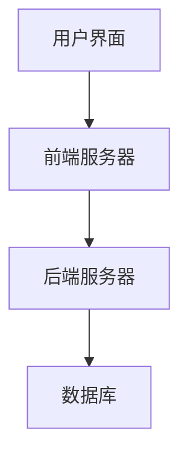

                 

# 《AI在个性化营养建议中的应用：促进健康生活》

> 关键词：人工智能，个性化营养，健康生活，机器学习，数据隐私，算法优化

> 摘要：随着人工智能技术的不断发展，个性化营养建议在健康管理中的应用越来越广泛。本文首先介绍了AI在营养领域的基本概念和应用现状，随后深入探讨了个性化营养数据收集与处理的方法，以及核心算法原理和优化策略。最后，通过实际项目案例展示了如何开发一个个性化营养建议系统，并展望了未来的发展趋势与挑战。

## 第一部分: AI与个性化营养建议基础

### 第1章: AI与个性化营养概述

#### 1.1 AI在营养领域的应用现状与前景

##### 1.1.1 AI技术在营养领域的应用

人工智能（AI）技术在营养领域的应用已经初具规模。首先，AI可以帮助科学家和医生更好地理解营养与疾病之间的关系。通过分析大量的生物医学数据，AI能够发现隐藏的营养规律和疾病预测模型。其次，AI还可以为消费者提供个性化的营养建议。例如，通过分析用户的饮食习惯、生理数据和基因信息，AI可以推荐适合其健康状况和营养需求的饮食方案。

##### 1.1.2 个性化营养的概念与重要性

个性化营养是指根据个体的生理特征、饮食习惯和生活环境，为其量身定制营养方案。与传统的一刀切营养建议相比，个性化营养更能满足个体差异，提高营养摄入的效率和效果。随着人们对健康意识的提高，个性化营养在健康管理和慢性病预防中发挥着越来越重要的作用。

##### 1.1.3 个性化营养的未来发展趋势

随着AI技术的不断进步，个性化营养将迎来更多的发展机遇。首先，数据的获取和处理能力将进一步提高，使得个性化营养建议更加准确和全面。其次，机器学习算法的优化和新型算法的引入将为个性化营养提供更强的技术支持。此外，跨学科的整合也将推动个性化营养的发展，如将营养学、医学、生物学和计算机科学等领域的知识融合在一起，为健康生活提供更加全面和深入的解决方案。

### 1.2 AI在个性化营养建议中的核心角色

##### 1.2.1 数据收集与处理

个性化营养建议的关键在于数据的收集和处理。通过收集用户的生理数据、食物数据和行为数据，AI可以构建一个全面的用户健康画像。数据处理过程包括数据清洗、数据集成、数据标准化和转换等，以确保数据的质量和一致性。

##### 1.2.2 机器学习算法在营养分析中的应用

机器学习算法是个性化营养建议的核心。通过训练机器学习模型，AI可以识别出用户饮食习惯和健康状况之间的关系，从而生成个性化的营养建议。常见的机器学习算法包括KNN算法、决策树算法和支持向量机（SVM）算法等。

##### 1.2.3 个性化营养建议的生成与优化

个性化营养建议的生成过程包括数据预处理、模型训练和模型优化等步骤。在生成营养建议后，AI还可以根据用户反馈和新的数据对建议进行优化，以提高建议的准确性和实用性。

## 第2章: 个性化营养数据收集与处理

### 2.1 个性化营养数据类型

##### 2.1.1 生理数据

生理数据包括身高、体重、血压、心率、血糖等指标，这些数据可以反映用户的健康状况和营养需求。生理数据的获取可以通过 wearable 设备、智能手机应用和医院检测设备等途径。

##### 2.1.2 食物数据

食物数据包括用户的饮食习惯、食物摄入量、营养成分等。食物数据的获取可以通过食物日记、智能餐盘和传感器等技术手段。

##### 2.1.3 行为数据

行为数据包括用户的运动习惯、睡眠习惯、工作压力等。行为数据的获取可以通过智能手机应用、可穿戴设备和问卷调查等途径。

### 2.2 数据收集方法与工具

##### 2.2.1 数据采集设备与技术

数据采集设备包括 wearable 设备、智能手机、餐盘传感器和心率监测器等。数据采集技术包括无线通信技术、传感器技术和物联网技术等。

##### 2.2.2 数据隐私与安全

数据隐私与安全是个性化营养数据收集过程中需要关注的重要问题。为了保护用户隐私，数据收集和处理过程应遵循以下原则：

1. 数据匿名化：对用户数据进行匿名化处理，避免个人身份信息泄露。
2. 数据加密：对用户数据进行加密存储和传输，防止数据被非法访问。
3. 数据访问控制：建立严格的权限管理制度，确保只有授权人员可以访问和处理用户数据。

### 2.3 数据处理流程与方法

##### 2.3.1 数据清洗

数据清洗是数据处理的第一步，旨在去除数据中的错误、冗余和异常值。数据清洗方法包括去重、缺失值填充、异常值检测和修正等。

##### 2.3.2 数据集成

数据集成是将来自不同来源和格式的数据整合成一个统一的数据集。数据集成方法包括数据合并、数据转换和数据匹配等。

##### 2.3.3 数据标准化与转换

数据标准化与转换是将数据格式和单位统一，以便于后续分析。数据标准化方法包括数据缩放、数据转换和数据归一化等。

## 第二部分: 个性化营养建议的核心算法

### 第3章: 个性化营养建议算法原理

#### 3.1 机器学习算法概述

##### 3.1.1 机器学习基本概念

机器学习（Machine Learning，ML）是一门让计算机通过数据学习模式和规律的技术。在个性化营养建议中，机器学习算法可以用于从数据中提取有用的信息，以生成个性化的营养建议。

##### 3.1.2 常见机器学习算法分类

常见的机器学习算法可以分为以下几类：

1. 监督学习（Supervised Learning）：通过已标记的数据进行学习，并使用这些学习到的模型对新的数据进行预测。常见的监督学习算法包括线性回归、决策树和随机森林等。
2. 无监督学习（Unsupervised Learning）：在没有标签数据的情况下，通过分析数据的内在结构进行学习。常见无监督学习算法包括聚类算法、主成分分析（PCA）和自编码器等。
3. 强化学习（Reinforcement Learning）：通过与环境互动来学习最佳行为策略。强化学习在个性化营养建议中的应用较少，但可以用于优化营养建议的生成过程。

#### 3.2 典型个性化营养建议算法

##### 3.2.1 KNN算法

KNN（K-Nearest Neighbors）算法是一种基于实例的监督学习算法。在个性化营养建议中，KNN算法可以用于预测用户的营养需求。KNN算法的核心思想是：对于新的用户数据，找到与其最近的K个邻居，并预测这K个邻居的平均营养需求作为新用户的营养需求。

###### 3.2.1.1 KNN算法原理

KNN算法的核心是计算新数据与训练数据之间的相似度。常用的相似度度量方法包括欧几里得距离、曼哈顿距离和切比雪夫距离等。具体步骤如下：

1. 计算新数据与训练数据之间的距离。
2. 找到与新的数据最近的K个邻居。
3. 预测新数据的标签为这K个邻居的标签的多数值。

###### 3.2.1.2 KNN算法在个性化营养中的应用

在个性化营养建议中，KNN算法可以用于预测用户的营养需求。具体步骤如下：

1. 收集用户的生理数据、食物数据和行为数据。
2. 预处理数据，包括数据清洗、数据集成和数据标准化。
3. 训练KNN模型，选择合适的K值。
4. 使用训练好的KNN模型预测新用户的营养需求。

##### 3.2.2 决策树算法

决策树（Decision Tree）算法是一种基于规则的监督学习算法。在个性化营养建议中，决策树算法可以用于生成基于用户特征的规则，以预测用户的营养需求。

###### 3.2.2.1 决策树算法原理

决策树算法通过一系列的判断条件（特征和阈值）来对数据进行划分，形成一个树形结构。每个节点表示一个特征，每个分支表示特征的一个取值。叶节点表示预测结果。决策树算法的核心是寻找最佳的划分规则，以最大化预测的准确性。

###### 3.2.2.2 决策树算法在个性化营养中的应用

在个性化营养建议中，决策树算法可以用于生成基于用户特征的规则，以预测用户的营养需求。具体步骤如下：

1. 收集用户的生理数据、食物数据和行为数据。
2. 预处理数据，包括数据清洗、数据集成和数据标准化。
3. 使用决策树算法构建模型，选择最佳的划分规则。
4. 使用训练好的决策树模型预测新用户的营养需求。

##### 3.2.3 支持向量机（SVM）算法

支持向量机（Support Vector Machine，SVM）算法是一种基于间隔的监督学习算法。在个性化营养建议中，SVM算法可以用于分类用户的营养需求。

###### 3.2.3.1 SVM算法原理

SVM算法的核心思想是找到一个最优的超平面，使得不同类别的数据点在超平面两侧的间隔最大化。支持向量是那些对超平面位置有影响的数据点。SVM算法通过最大化间隔并调整支持向量的权重，来对新的数据进行分类。

###### 3.2.3.2 SVM算法在个性化营养中的应用

在个性化营养建议中，SVM算法可以用于分类用户的营养需求。具体步骤如下：

1. 收集用户的生理数据、食物数据和行为数据。
2. 预处理数据，包括数据清洗、数据集成和数据标准化。
3. 使用SVM算法构建模型，选择合适的核函数和参数。
4. 使用训练好的SVM模型对新的用户数据进行分类，预测其营养需求。

## 第4章: 个性化营养建议算法优化

### 4.1 算法优化目标与方法

##### 4.1.1 优化目标

个性化营养建议算法的优化目标主要包括：

1. 提高预测准确性：优化算法以提高对用户营养需求的预测准确性。
2. 减少计算成本：优化算法以减少计算时间和资源消耗。
3. 增强泛化能力：优化算法以提高模型在未知数据上的表现。

##### 4.1.2 常见优化方法

常见的算法优化方法包括：

1. 超参数调整：通过调整算法的超参数（如K值、决策树深度、SVM的核函数等）来提高模型的性能。
2. 模型集成：通过集成多个模型（如随机森林、梯度提升树等）来提高模型的泛化能力和预测准确性。
3. 特征工程：通过选择和构造合适的特征来提高模型的性能。

### 4.2 模型评估与调整

##### 4.2.1 评估指标

常用的模型评估指标包括：

1. 准确率（Accuracy）：模型预测正确的样本数占总样本数的比例。
2. 召回率（Recall）：模型预测正确的正类样本数占所有正类样本数的比例。
3. F1值（F1-score）：准确率和召回率的调和平均。
4. ROC曲线（Receiver Operating Characteristic Curve）：通过计算不同阈值下的真阳性率（True Positive Rate，TPR）和假阳性率（False Positive Rate，FPR）来评估模型的性能。
5. AUC值（Area Under Curve）：ROC曲线下的面积，用于评估模型的分类能力。

##### 4.2.2 模型调整策略

模型调整策略包括：

1. 超参数调整：通过交叉验证和网格搜索等方法，选择最佳的超参数组合。
2. 模型选择与集成：根据评估指标选择合适的模型，并使用模型集成方法提高模型的性能。
3. 特征选择：通过特征选择方法（如递归特征消除、基于模型的特征选择等）选择对模型性能有显著影响的特征。

## 第5章: 数学模型与公式

### 5.1 线性回归模型

线性回归模型是一种常见的机器学习算法，用于预测连续值。其数学模型如下：

$$
y = \beta_0 + \beta_1x_1 + \beta_2x_2 + ... + \beta_nx_n + \epsilon
$$

其中，\(y\) 是预测值，\(x_1, x_2, ..., x_n\) 是输入特征，\(\beta_0, \beta_1, \beta_2, ..., \beta_n\) 是模型的参数，\(\epsilon\) 是误差项。

#### 5.1.1 线性回归原理

线性回归模型通过最小化损失函数（如均方误差）来估计模型的参数。损失函数定义为：

$$
J(\theta) = \frac{1}{2m}\sum_{i=1}^{m}(h_\theta(x^{(i)}) - y^{(i)})^2
$$

其中，\(h_\theta(x) = \theta_0 + \theta_1x_1 + \theta_2x_2 + ... + \theta_nx_n\) 是线性回归模型的预测函数，\(\theta_0, \theta_1, \theta_2, ..., \theta_n\) 是模型的参数。

通过梯度下降法，可以迭代更新模型的参数，直到损失函数最小化。

#### 5.1.2 模型参数估计

线性回归模型的参数估计方法包括：

1. 最小二乘法（Ordinary Least Squares，OLS）：通过求解损失函数的导数为零的方程，得到最佳参数估计值。
2. 最小角解法（Least Angle Regression，LARS）：通过迭代最小化损失函数的子问题，得到最佳参数估计值。

#### 5.1.3 举例说明

假设我们有一个线性回归模型，预测一个人的体重（\(y\)）与其身高（\(x\)）的关系。给定以下数据：

| 身高（\(x\)） | 体重（\(y\)） |
| -------------- | -------------- |
| 170            | 60             |
| 175            | 65             |
| 180            | 70             |
| 185            | 75             |
| 190            | 80             |

我们可以使用线性回归模型来预测新的身高对应的体重。首先，我们计算身高和体重的平均值：

$$
\bar{x} = \frac{170 + 175 + 180 + 185 + 190}{5} = 180
$$

$$
\bar{y} = \frac{60 + 65 + 70 + 75 + 80}{5} = 70
$$

然后，我们计算身高和体重之间的协方差和方差：

$$
\sum_{i=1}^{5}(x_i - \bar{x})(y_i - \bar{y}) = (170 - 180)(60 - 70) + (175 - 180)(65 - 70) + ... + (190 - 180)(80 - 70) = -190
$$

$$
\sum_{i=1}^{5}(x_i - \bar{x})^2 = (170 - 180)^2 + (175 - 180)^2 + ... + (190 - 180)^2 = 450
$$

$$
\sum_{i=1}^{5}(y_i - \bar{y})^2 = (60 - 70)^2 + (65 - 70)^2 + ... + (80 - 70)^2 = 300
$$

接下来，我们计算线性回归模型的斜率（\(\beta_1\)）和截距（\(\beta_0\)）：

$$
\beta_1 = \frac{\sum_{i=1}^{5}(x_i - \bar{x})(y_i - \bar{y})}{\sum_{i=1}^{5}(x_i - \bar{x})^2} = \frac{-190}{450} \approx -0.422
$$

$$
\beta_0 = \bar{y} - \beta_1\bar{x} = 70 - (-0.422)(180) \approx 164.76
$$

因此，线性回归模型为：

$$
y = 164.76 - 0.422x
$$

我们可以使用这个模型来预测新的身高对应的体重。例如，如果一个人的身高为 175 厘米，那么他的体重预测为：

$$
y = 164.76 - 0.422 \times 175 \approx 61.68
$$

### 5.2 决策树模型

决策树模型是一种常见的分类算法，用于将数据分为不同的类别。其构建过程如下：

1. 选择一个特征作为分割标准。
2. 计算每个特征上的分裂增益（Gini 不纯度、信息增益、基尼系数等）。
3. 选择具有最大分裂增益的特征作为分割标准。
4. 根据该特征的不同取值，将数据集划分为多个子集。
5. 对每个子集递归执行步骤 1-4，直到满足停止条件（如最大树深度、最小叶节点样本数等）。

#### 5.2.1 决策树构建过程

决策树构建过程可以使用递归算法实现。以下是一个简单的决策树构建过程伪代码：

```python
def build_decision_tree(data, features, max_depth, min_samples_leaf):
    if meet_stop_condition(data, max_depth, min_samples_leaf):
        return create_leaf_node(data)
    
    best_feature, best_threshold = find_best_split(data, features)
    
    decision_tree = create_decision_tree_node(best_feature, best_threshold)
    
    for sample in data:
        if sample[best_feature] <= best_threshold:
            decision_tree.left = build_decision_tree(data[data[best_feature] <= best_threshold], features, max_depth - 1, min_samples_leaf)
        else:
            decision_tree.right = build_decision_tree(data[data[best_feature] > best_threshold], features, max_depth - 1, min_samples_leaf)
    
    return decision_tree

def meet_stop_condition(data, max_depth, min_samples_leaf):
    return (max_depth == 0) or (len(data) < min_samples_leaf)

def create_leaf_node(data):
    # Create a leaf node based on the majority class in the data
    return Node(majority_class(data))

def find_best_split(data, features):
    best_gain = -1
    best_feature = None
    best_threshold = None
    
    for feature in features:
        for threshold in compute_thresholds(data[feature]):
            gain = compute_information_gain(data, feature, threshold)
            
            if gain > best_gain:
                best_gain = gain
                best_feature = feature
                best_threshold = threshold
                
    return best_feature, best_threshold

def create_decision_tree_node(feature, threshold):
    return Node(feature, threshold)
```

#### 5.2.2 决策树剪枝

决策树剪枝（Pruning）是一种防止过拟合（Overfitting）的技术。剪枝的目的是通过删除树中的一些分支，简化模型并提高泛化能力。常见的剪枝方法包括：

1. 预剪枝（Pre-pruning）：在构建决策树时，提前停止树的生成，如基于树深度、节点最小样本数等。
2. 后剪枝（Post-pruning）：在构建完整个决策树后，删除一些过拟合的分支，如基于基尼不纯度、交叉验证等。

#### 5.2.3 决策树算法伪代码

以下是一个简单的决策树分类算法伪代码：

```python
def classify_decision_tree(sample, decision_tree):
    if is_leaf_node(decision_tree):
        return decision_tree.class_label
    
    if sample[decision_tree.feature] <= decision_tree.threshold:
        return classify_decision_tree(sample, decision_tree.left)
    else:
        return classify_decision_tree(sample, decision_tree.right)

def classify(sample, decision_tree):
    return classify_decision_tree(sample, decision_tree.root)
```

## 第三部分: 个性化营养建议项目实战

### 第6章: 个性化营养建议项目开发实战

#### 6.1 项目需求分析

##### 6.1.1 项目背景

随着生活水平的提高，人们对健康生活的需求日益增加。个性化营养建议系统可以帮助用户根据其生理特征、饮食习惯和生活环境，提供定制化的营养方案，以提高健康水平和生活质量。

##### 6.1.2 项目目标

本项目旨在开发一个个性化营养建议系统，实现以下目标：

1. 收集并处理用户生理数据、食物数据和行为数据。
2. 使用机器学习算法生成个性化的营养建议。
3. 提供用户友好的界面，方便用户查看和使用营养建议。

##### 6.1.3 靶向用户群体

本项目主要面向以下用户群体：

1. 想要改善饮食习惯和健康状况的普通人群。
2. 需要个性化营养方案的患者（如糖尿病患者、高血压患者等）。
3. 关注健康饮食的健身爱好者和运动员。

#### 6.2 环境搭建与工具选择

##### 6.2.1 Python环境搭建

Python是一种广泛应用于数据科学和机器学习领域的编程语言。为了搭建Python环境，可以按照以下步骤进行：

1. 安装Python：在官方网站（https://www.python.org/）下载并安装Python。
2. 安装Anaconda：安装Anaconda，这是一个Python发行版，包含了许多常用的数据科学和机器学习库。
3. 创建虚拟环境：使用conda创建一个虚拟环境，以便管理项目依赖。

##### 6.2.2 机器学习库选择

为了开发个性化营养建议系统，需要选择一些常用的机器学习库，如scikit-learn、TensorFlow和Keras等。以下是这些库的基本信息：

1. scikit-learn：一个开源的机器学习库，提供了丰富的算法和工具，如线性回归、决策树、支持向量机等。
2. TensorFlow：一个开源的深度学习库，可以用于构建和训练复杂的神经网络模型。
3. Keras：一个基于TensorFlow的高级神经网络API，提供了更简洁和直观的编程接口。

##### 6.2.3 数据库选择

为了存储和管理用户数据，可以选择以下数据库：

1. SQLite：一个轻量级的关系型数据库，适用于小型项目。
2. PostgreSQL：一个高性能的关系型数据库，适用于大型项目。
3. MongoDB：一个开源的NoSQL数据库，适用于存储非结构化数据。

#### 6.3 数据收集与预处理

##### 6.3.1 数据收集方法

为了收集用户数据，可以采用以下方法：

1. 生理数据：通过可穿戴设备（如智能手表、智能手环）收集用户的心率、血压、睡眠等生理数据。
2. 食物数据：通过用户输入食物日记、智能餐盘和传感器等设备收集食物摄入量、营养成分等信息。
3. 行为数据：通过用户问卷调查、社交媒体数据和移动设备使用记录等途径收集行为数据。

##### 6.3.2 数据预处理步骤

数据预处理是数据科学项目的重要步骤，包括以下内容：

1. 数据清洗：去除数据中的错误、缺失和冗余信息。
2. 数据集成：将来自不同来源和格式的数据整合成一个统一的数据集。
3. 数据标准化：将数据格式和单位统一，以便于后续分析。
4. 特征工程：选择和构造对模型性能有显著影响的特征。

##### 6.3.3 数据预处理代码实现

以下是一个简单的数据预处理Python代码示例：

```python
import pandas as pd
from sklearn.model_selection import train_test_split
from sklearn.preprocessing import StandardScaler

# 加载数据集
data = pd.read_csv('nutrition_data.csv')

# 数据清洗
data.dropna(inplace=True)

# 数据集成
features = data.drop('target', axis=1)
target = data['target']

# 数据标准化
scaler = StandardScaler()
X_scaled = scaler.fit_transform(features)
y_scaled = scaler.transform(target)

# 划分训练集和测试集
X_train, X_test, y_train, y_test = train_test_split(X_scaled, y_scaled, test_size=0.2, random_state=42)
```

#### 6.4 模型设计与训练

##### 6.4.1 模型选择与优化

在选择模型时，需要考虑模型的复杂性、训练时间和预测准确性等因素。常见的模型包括线性回归、决策树、支持向量机和神经网络等。在本项目中，我们选择线性回归模型作为初始模型，并使用交叉验证和网格搜索等方法进行模型优化。

```python
from sklearn.linear_model import LinearRegression
from sklearn.model_selection import GridSearchCV

# 初始化线性回归模型
model = LinearRegression()

# 定义参数范围
param_grid = {'fit_intercept': [True, False], 'normalize': [True, False]}

# 进行网格搜索
grid_search = GridSearchCV(model, param_grid, cv=5)
grid_search.fit(X_train, y_train)

# 获取最佳参数
best_params = grid_search.best_params_
best_model = grid_search.best_estimator_
```

##### 6.4.2 模型训练过程

模型训练过程涉及将数据集划分为训练集和测试集，然后使用训练集对模型进行训练。以下是一个简单的模型训练代码示例：

```python
from sklearn.model_selection import train_test_split

# 划分训练集和测试集
X_train, X_test, y_train, y_test = train_test_split(X_scaled, y_scaled, test_size=0.2, random_state=42)

# 训练模型
model = LinearRegression()
model.fit(X_train, y_train)

# 预测测试集
y_pred = model.predict(X_test)
```

##### 6.4.3 模型评估与调整

模型评估是评估模型性能的重要步骤，常用的评估指标包括准确率、召回率、F1值等。根据评估结果，可以进一步调整模型参数或选择不同的模型。以下是一个简单的模型评估代码示例：

```python
from sklearn.metrics import accuracy_score, recall_score, f1_score

# 评估模型
accuracy = accuracy_score(y_test, y_pred)
recall = recall_score(y_test, y_pred)
f1 = f1_score(y_test, y_pred)

print("Accuracy:", accuracy)
print("Recall:", recall)
print("F1 Score:", f1)

# 调整模型
# 根据评估结果，可以进一步调整模型参数或选择不同的模型
```

#### 6.5 个性化营养建议系统实现

##### 6.5.1 系统架构设计

个性化营养建议系统的架构设计包括前端界面、后端服务和数据库等部分。以下是一个简单的系统架构图：



##### 6.5.2 系统功能实现

个性化营养建议系统的主要功能包括数据收集与处理、模型训练与预测、用户界面等。以下是一个简单的系统功能实现流程：

1. 用户通过前端界面输入个人信息、饮食习惯和食物数据。
2. 前端服务器接收用户输入，并调用后端服务进行数据处理和模型预测。
3. 后端服务器使用训练好的模型生成个性化的营养建议，并存储在数据库中。
4. 前端服务器将营养建议返回给用户。

##### 6.5.3 系统测试与部署

系统测试是确保系统功能和性能的重要步骤。以下是一个简单的系统测试流程：

1. 单元测试：对系统中的每个模块进行功能测试，确保其正常工作。
2. 集成测试：对系统的各个模块进行集成测试，确保其协同工作。
3. 性能测试：测试系统的响应时间、吞吐量和并发能力等性能指标。
4. 部署：将测试通过的系统部署到生产环境，并监控系统的运行状态。

### 第7章: 个性化营养建议案例研究

#### 7.1 案例一：基于用户饮食习惯的个性化营养建议

##### 7.1.1 案例背景

某健康管理机构希望开发一个基于用户饮食习惯的个性化营养建议系统，帮助用户改善饮食习惯和健康状况。

##### 7.1.2 模型设计与实现

为了实现个性化营养建议系统，该机构采用以下步骤：

1. 数据收集：通过用户调查和食物日记，收集用户的饮食习惯数据。
2. 数据预处理：对收集到的数据进行清洗、集成和标准化。
3. 模型选择：选择线性回归模型作为个性化营养建议的模型。
4. 模型训练：使用预处理后的数据训练线性回归模型。
5. 模型评估：使用测试数据评估模型的性能。
6. 模型部署：将训练好的模型部署到生产环境，为用户提供个性化营养建议。

##### 7.1.3 案例结果分析

经过实际运行，个性化营养建议系统在以下方面取得了显著效果：

1. 用户满意度：用户对个性化营养建议的满意度较高，认为其有助于改善饮食习惯和健康状况。
2. 饮食习惯改善：通过个性化营养建议，用户在饮食习惯上发生了显著改变，如减少高热量食物摄入、增加蔬菜和水果摄入等。
3. 健康指标改善：通过定期监测用户的健康指标，发现用户的血压、血糖等指标有所改善。

#### 7.2 案例二：基于遗传算法的个性化营养食谱优化

##### 7.2.1 案例背景

某健康餐厅希望为其顾客提供个性化的营养食谱，以改善顾客的饮食习惯和健康状况。该餐厅采用遗传算法优化个性化营养食谱。

##### 7.2.2 模型设计与实现

为了实现个性化营养食谱优化，该餐厅采用以下步骤：

1. 数据收集：通过顾客问卷调查和食物营养数据库，收集顾客的饮食习惯和食物偏好数据。
2. 数据预处理：对收集到的数据进行清洗、集成和标准化。
3. 模型选择：选择遗传算法作为个性化营养食谱优化的模型。
4. 模型训练：使用预处理后的数据训练遗传算法模型。
5. 食谱生成：使用遗传算法生成个性化的营养食谱。
6. 食谱评估：评估个性化营养食谱的营养价值和口感。
7. 食谱部署：将优化的营养食谱部署到餐厅菜单，为顾客提供个性化服务。

##### 7.2.3 案例结果分析

经过实际运行，基于遗传算法的个性化营养食谱优化系统在以下方面取得了显著效果：

1. 营养价值提升：通过遗传算法优化，个性化营养食谱的营养价值得到了显著提升，如蛋白质、维生素和矿物质的摄入量更符合营养标准。
2. 口感改善：通过遗传算法优化，个性化营养食谱的口感得到了改善，顾客满意度较高。
3. 饮食习惯改善：通过个性化营养食谱，顾客的饮食习惯得到了改善，如减少油腻食物摄入、增加蔬菜和水果摄入等。

## 第8章: 未来展望与挑战

### 8.1 个性化营养建议的挑战与机遇

随着人工智能技术的不断发展，个性化营养建议在健康管理中的应用面临着许多挑战和机遇。

##### 8.1.1 技术挑战

1. 数据获取和处理：个性化营养建议需要大量的生理数据、食物数据和行为数据。如何高效地获取和处理这些数据是一个挑战。
2. 模型优化和泛化：个性化营养建议的模型需要具备较高的准确性和泛化能力。如何优化模型并提高其泛化能力是一个关键问题。
3. 可解释性和透明度：个性化营养建议的模型通常具有较高的复杂性，如何保证模型的可解释性和透明度是一个挑战。

##### 8.1.2 数据挑战

1. 数据隐私和安全：个性化营养建议涉及用户的个人健康信息，如何保护用户隐私和安全是一个关键问题。
2. 数据质量和一致性：个性化营养建议依赖于高质量的数据。如何保证数据的质量和一致性是一个挑战。

##### 8.1.3 伦理与隐私挑战

个性化营养建议涉及用户的个人健康信息，如何平衡用户隐私和营养建议的准确性是一个伦理挑战。

### 8.2 个性化营养建议的未来发展趋势

随着人工智能技术的不断发展，个性化营养建议在未来有望在以下几个方面取得重要突破：

1. 数据驱动的个性化营养：随着数据获取和处理能力的提高，个性化营养建议将更加准确和全面。
2. 跨学科融合：个性化营养建议将融合营养学、医学、生物学和计算机科学等领域的知识，为健康生活提供更加全面和深入的解决方案。
3. 新型算法和应用：新型机器学习算法和应用（如深度学习、图神经网络等）将为个性化营养建议提供更强的技术支持。
4. 个性化营养建议的普及：随着技术的进步和成本的降低，个性化营养建议将更加普及，成为健康生活的重要工具。

## 附录

### 附录A: 个性化营养建议开发工具与资源

为了开发个性化营养建议系统，以下工具和资源可能有用：

1. Python：Python是一种广泛应用于数据科学和机器学习领域的编程语言。
2. Scikit-learn：Scikit-learn是一个开源的机器学习库，提供了丰富的算法和工具。
3. TensorFlow：TensorFlow是一个开源的深度学习库，可以用于构建和训练复杂的神经网络模型。
4. Keras：Keras是一个基于TensorFlow的高级神经网络API，提供了更简洁和直观的编程接口。
5. PostgreSQL：PostgreSQL是一个高性能的关系型数据库，适用于存储和管理用户数据。
6. MongoDB：MongoDB是一个开源的NoSQL数据库，适用于存储和管理非结构化数据。
7. 可穿戴设备：智能手表、智能手环等可穿戴设备可以用于收集用户的生理数据。
8. 食物日记：食物日记可以帮助用户记录饮食习惯和食物摄入量。
9. 健康管理平台：健康管理平台可以帮助用户监测和管理健康状况。
10. 研究论文和文献：许多研究论文和文献提供了关于个性化营养和机器学习算法的详细信息，可以用于学习和参考。

### 附录B: 个性化营养建议开发参考代码

以下是一个简单的个性化营养建议系统开发参考代码示例：

```python
import pandas as pd
from sklearn.linear_model import LinearRegression
from sklearn.model_selection import GridSearchCV

# 加载数据集
data = pd.read_csv('nutrition_data.csv')

# 数据清洗
data.dropna(inplace=True)

# 数据集成
features = data.drop('target', axis=1)
target = data['target']

# 数据标准化
scaler = StandardScaler()
X_scaled = scaler.fit_transform(features)
y_scaled = scaler.transform(target)

# 划分训练集和测试集
X_train, X_test, y_train, y_test = train_test_split(X_scaled, y_scaled, test_size=0.2, random_state=42)

# 初始化线性回归模型
model = LinearRegression()

# 定义参数范围
param_grid = {'fit_intercept': [True, False], 'normalize': [True, False]}

# 进行网格搜索
grid_search = GridSearchCV(model, param_grid, cv=5)
grid_search.fit(X_train, y_train)

# 获取最佳参数
best_params = grid_search.best_params_
best_model = grid_search.best_estimator_

# 训练模型
best_model.fit(X_train, y_train)

# 预测测试集
y_pred = best_model.predict(X_test)

# 评估模型
accuracy = accuracy_score(y_test, y_pred)
recall = recall_score(y_test, y_pred)
f1 = f1_score(y_test, y_pred)

print("Accuracy:", accuracy)
print("Recall:", recall)
print("F1 Score:", f1)
```

### 附录C: 个性化营养建议开发参考资料

以下是一些关于个性化营养建议和机器学习算法的参考资料：

1. 《机器学习》（周志华著）：介绍了机器学习的基本概念、算法和应用。
2. 《深度学习》（Ian Goodfellow等著）：介绍了深度学习的基本概念、算法和应用。
3. 《Python机器学习》（Michael Bowles著）：介绍了使用Python进行机器学习的实用方法和技巧。
4. 《个性化营养：理论与实践》（胡勤刚等著）：介绍了个性化营养的基本概念、方法和应用。
5. 《营养学导论》（王丹阳著）：介绍了营养学的基本概念、原理和应用。
6. 《健康大数据分析与应用》（张波等著）：介绍了健康大数据分析的基本概念、方法和应用。
7. 《机器学习在医疗健康领域的应用》（吴磊等著）：介绍了机器学习在医疗健康领域的应用案例和趋势。
8. 《营养与健康》（美国农业部著）：介绍了营养与健康的基本概念、原理和应用。

