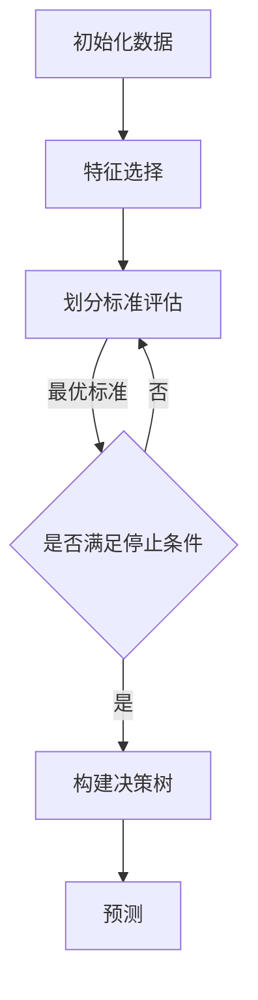
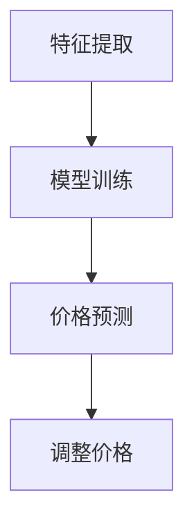
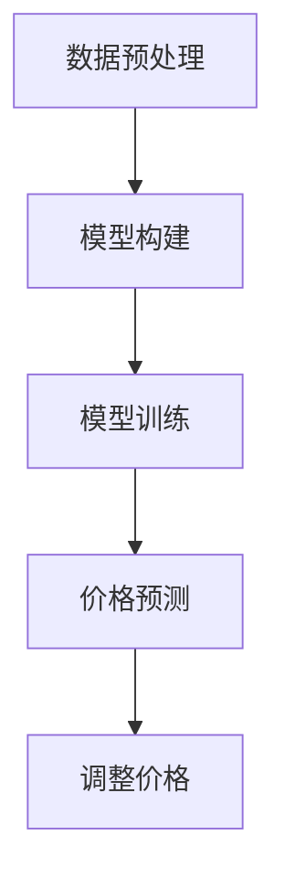
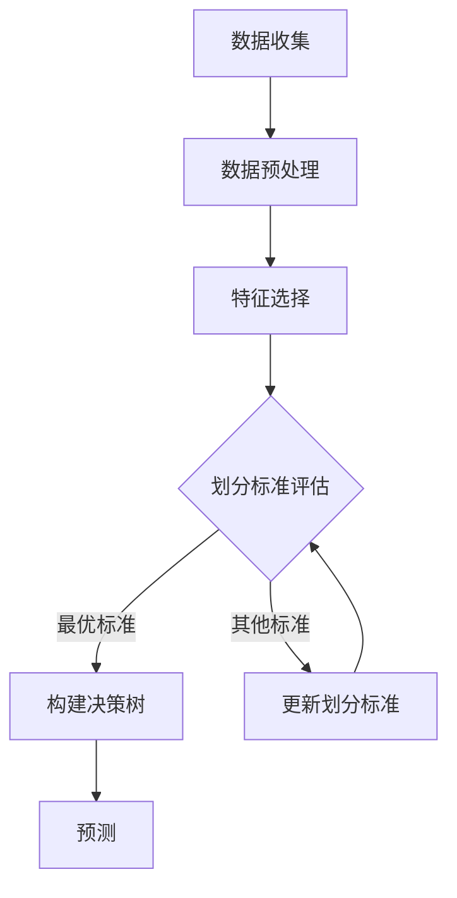
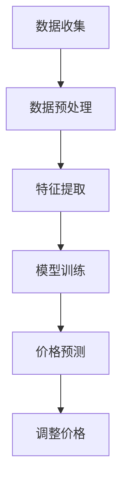
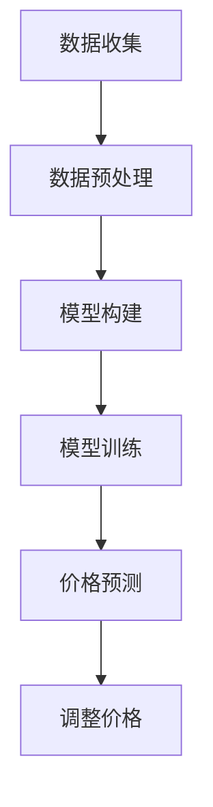

                 

## 《AI在电商价格优化中的应用案例》

### 关键词：人工智能，电商，价格优化，算法，应用场景，项目实战，挑战与展望，工具与资源，实践指南

#### 摘要：

本文将深入探讨人工智能（AI）在电商价格优化中的应用案例。通过分析AI在电商领域的核心作用，以及价格优化中的关键算法和应用场景，我们旨在揭示AI技术在提升电商竞争力、提高运营效率和客户满意度方面的巨大潜力。本文将结合实际项目案例，详细介绍AI在电商价格优化中的实施过程、效果评估及挑战与展望，为电商企业提供实用的AI应用指南。

## 《AI在电商价格优化中的应用案例》目录大纲

### 第一部分: AI在电商价格优化概述

#### 第1章: AI在电商价格优化中的重要性

##### 1.1 电商价格优化概述

- 电商价格优化的定义
- 电商价格优化的目的
- AI在电商价格优化中的关键作用

##### 1.2 AI在电商领域的应用

- AI在电商平台的现状
- AI驱动的电商发展趋势

### 第二部分: 电商价格优化的核心算法

#### 第2章: 电商价格优化的核心算法

##### 2.1 决策树算法

- 决策树算法的原理
- 决策树算法的实现

##### 2.2 支持向量机算法

- 支持向量机算法的原理
- 支持向量机算法的实现

##### 2.3 神经网络算法

- 神经网络算法的原理
- 神经网络算法的实现

### 第三部分: AI在电商价格优化中的应用场景

#### 第3章: AI在电商价格优化中的应用场景

##### 3.1 产品定价策略

- 产品定价策略的制定
- AI在产品定价策略中的应用

##### 3.2 库存管理

- 库存管理的目的和方法
- AI在库存管理中的应用

##### 3.3 客户行为分析

- 客户行为分析的意义
- AI在客户行为分析中的应用

### 第四部分: AI在电商价格优化中的项目实战

#### 第4章: AI在电商价格优化中的项目实战

##### 4.1 项目背景与目标

- 项目背景介绍
- 项目目标设定

##### 4.2 项目实施过程

- 数据收集与预处理
- 算法选择与模型训练
- 项目效果评估

##### 4.3 案例分析

- 成功案例分析
- 失败案例分析

### 第五部分: AI在电商价格优化中的挑战与展望

#### 第5章: AI在电商价格优化中的挑战与展望

##### 5.1 挑战分析

- 数据质量问题
- 模型解释性问题
- 道德与法律问题

##### 5.2 展望未来

- AI在电商价格优化中的发展趋势
- 新技术对未来电商价格优化的影响

### 第六部分: 电商价格优化AI工具与资源

#### 第6章: 电商价格优化AI工具与资源

##### 6.1 常用AI工具介绍

- 数据分析工具
- 机器学习框架

##### 6.2 AI资源推荐

- 教程与课程
- 论文与报告

### 第七部分: 电商价格优化AI实践指南

#### 第7章: 电商价格优化AI实践指南

##### 7.1 实践步骤概述

- 数据收集与预处理
- 模型选择与训练
- 项目部署与维护

##### 7.2 实践要点

- 数据质量的重要性
- 模型调优的关键点
- 遵守道德与法律规范

### 附录

#### 附录A: AI工具与框架资源

- TensorFlow
- PyTorch
- Scikit-learn
- 其他常用工具与框架

#### 附录B: 电商价格优化算法 Mermaid 流程图

- 决策树算法流程图
- 支持向量机算法流程图
- 神经网络算法流程图

#### 附录C: 算法伪代码与解释

- 决策树算法伪代码
- 支持向量机算法伪代码
- 神经网络算法伪代码

#### 附录D: AI项目实战代码与分析

- 实际代码实现
- 代码解读与分析

#### 附录E: 数学模型和公式

- 数学模型与公式解释
- 数学公式举例说明

## 第一部分: AI在电商价格优化概述

### 第1章: AI在电商价格优化中的重要性

#### 1.1 电商价格优化概述

随着互联网技术的迅猛发展和电子商务的普及，电商行业竞争日益激烈。电商价格优化作为提升企业核心竞争力的关键手段，已成为电商企业关注的焦点。电商价格优化，即通过合理的定价策略和算法，对产品价格进行动态调整，以实现利润最大化、库存合理化和客户满意度提升。

#### 1.1.1 电商价格优化的定义

电商价格优化是指电商企业利用数据分析、算法模型等技术手段，对产品价格进行科学合理调整，以应对市场变化和竞争压力。其核心目的是在保证企业利润的前提下，提升产品竞争力，增加销售额和市场份额。

#### 1.1.2 电商价格优化的目的

- 利润最大化：通过合理的价格策略，提高产品利润空间。
- 库存合理化：根据市场需求和库存状况，实现库存的优化管理。
- 客户满意度提升：通过合理的价格策略，提高客户购买意愿和满意度。

#### 1.1.3 AI在电商价格优化中的关键作用

AI技术在电商价格优化中发挥着至关重要的作用。具体表现为：

- 数据分析：AI技术能够高效处理和分析海量数据，挖掘数据中的潜在价值，为价格优化提供科学依据。
- 预测模型：通过机器学习算法，建立预测模型，预测市场需求、库存变化等关键因素，为价格调整提供前瞻性指导。
- 自动化决策：AI技术可以实现自动化决策，根据实时数据和市场变化，快速调整产品价格，提高决策效率。

### 1.2 AI在电商领域的应用

AI技术在电商领域的应用已经取得了显著的成果，涵盖了推荐系统、自然语言处理、图像识别、价格优化等多个方面。

#### 1.2.1 AI在电商平台的现状

- 推荐系统：基于用户行为数据和商品属性数据，AI推荐系统能够实现个性化推荐，提高用户满意度和购买转化率。
- 自然语言处理：AI技术在商品描述、评论分析、用户提问等方面发挥着重要作用，提升了用户购物体验。
- 图像识别：AI图像识别技术用于商品识别、物流跟踪等环节，提高了运营效率。
- 价格优化：AI技术通过数据分析、算法模型等手段，实现了精准的价格调整，提升了企业竞争力。

#### 1.2.2 AI驱动的电商发展趋势

- 智能化：随着AI技术的不断进步，电商领域将更加智能化，从商品推荐到售后服务，AI技术将全面渗透。
- 个性化：AI技术将进一步提升个性化服务水平，满足用户多样化的需求。
- 自动化：通过AI技术实现业务流程的自动化，提高运营效率，降低人力成本。

总之，AI技术在电商价格优化中的应用前景广阔，有望成为电商企业提升竞争力、实现可持续发展的重要手段。在接下来的章节中，我们将详细探讨电商价格优化的核心算法、应用场景以及项目实战，以期为电商企业提供有价值的参考。## 第1章: AI在电商价格优化中的重要性

#### 1.2 AI在电商领域的应用

AI技术在电商领域的应用已经取得了显著的成果，涵盖了推荐系统、自然语言处理、图像识别、价格优化等多个方面。

##### 1.2.1 AI在电商平台的现状

- **推荐系统**：AI推荐系统通过分析用户的历史行为、浏览记录、购买偏好等数据，为用户推荐个性化的商品，提高用户满意度和购买转化率。例如，淘宝、京东等电商平台都采用了深度学习算法来实现个性化推荐，从而提升用户体验。
  
- **自然语言处理**：AI在自然语言处理方面的应用主要体现在商品描述、评论分析、用户提问等方面。通过自然语言处理技术，电商平台可以更好地理解用户的语言需求，提供更精准的搜索结果和推荐商品。例如，亚马逊利用自然语言处理技术，分析用户评论，自动生成商品描述，提高用户购物的便捷性。

- **图像识别**：图像识别技术用于商品识别、物流跟踪等环节。通过图像识别，电商平台可以快速准确地识别商品，提高库存管理的效率。同时，图像识别技术还可以用于物流跟踪，实现实时监控和定位，提高物流效率。

- **价格优化**：AI通过大数据分析和机器学习算法，对市场数据、消费者行为、竞争对手价格等进行深入分析，帮助电商企业制定最优的价格策略。例如，拼多多通过AI算法实时监测市场价格动态，自动调整产品价格，从而提高竞争力。

##### 1.2.2 AI驱动的电商发展趋势

- **智能化**：随着AI技术的不断进步，电商领域将更加智能化。例如，智能客服机器人、智能订单处理系统等将广泛应用，提高电商运营效率和服务水平。

- **个性化**：AI技术将进一步提升个性化服务水平，满足用户多样化的需求。通过深度学习算法，电商平台可以更精准地分析用户偏好，提供个性化推荐和服务。

- **自动化**：通过AI技术实现业务流程的自动化，提高运营效率，降低人力成本。例如，自动化的库存管理、订单处理、价格调整等系统，将大大提升电商运营的效率。

#### 1.3 AI在电商价格优化中的关键作用

在电商价格优化中，AI技术发挥着至关重要的作用。以下是AI在电商价格优化中的几个关键作用：

- **数据分析**：AI技术能够高效处理和分析海量数据，挖掘数据中的潜在价值，为价格优化提供科学依据。通过分析用户行为、市场动态、竞争对手价格等数据，电商企业可以更准确地制定价格策略。

- **预测模型**：通过机器学习算法，建立预测模型，预测市场需求、库存变化等关键因素，为价格调整提供前瞻性指导。例如，基于历史数据和季节性规律，AI可以预测未来一段时间内的市场需求，帮助企业提前调整价格策略。

- **自动化决策**：AI技术可以实现自动化决策，根据实时数据和市场变化，快速调整产品价格，提高决策效率。例如，电商平台可以设置价格优化的规则和阈值，当市场数据达到特定条件时，系统会自动调整价格。

总之，AI技术在电商价格优化中的应用，不仅提高了企业运营效率和竞争力，也为用户提供了更好的购物体验。在接下来的章节中，我们将深入探讨电商价格优化的核心算法、应用场景以及项目实战，进一步揭示AI技术在这方面的潜力和价值。## 第2章: 电商价格优化的核心算法

在电商价格优化中，核心算法的选择和实现至关重要。这些算法通过对大量数据进行处理和分析，帮助电商企业制定科学合理的价格策略。以下是几种常见的电商价格优化算法及其原理和实现方法。

### 2.1 决策树算法

**原理**：

决策树算法是一种基于树形结构进行决策的算法，其核心思想是通过一系列判断节点，将数据集划分成多个子集，每个子集对应一个特定的决策结果。决策树算法通过计算不同特征对价格优化的贡献度，选择最优的特征进行划分，以达到价格优化的目标。

**实现方法**：

1. **特征选择**：选择对价格优化影响较大的特征，例如商品类型、用户购买历史、市场价格等。
2. **划分标准**：根据特征选择最优的划分标准，通常使用信息增益、基尼系数等指标进行评估。
3. **构建树模型**：根据划分标准构建决策树，每次划分都会产生一个新的子集，直到满足停止条件（如最大深度、最小样本量等）。
4. **预测**：使用构建好的决策树对新的数据进行预测，根据路径选择相应的价格策略。

**Mermaid流程图**：



**伪代码**：

```python
def build_decision_tree(data, features, max_depth):
    # 特征选择
    selected_feature = select_best_feature(data, features)
    
    # 划分标准评估
    best_threshold = evaluate_threshold(data, selected_feature)
    
    # 停止条件判断
    if is_stop_condition(data):
        return create_leaf_node(data)
    
    # 构建子决策树
    left_data = split_data(data, selected_feature, best_threshold, 'left')
    right_data = split_data(data, selected_feature, best_threshold, 'right')
    
    # 预测
    return DecisionTreeNode(selected_feature, best_threshold, 
                            build_decision_tree(left_data, features, max_depth-1), 
                            build_decision_tree(right_data, features, max_depth-1))

def predict(tree, instance):
    if is_leaf_node(tree):
        return get_leaf_value(tree)
    else:
        feature_value = instance[tree.feature]
        if feature_value <= tree.threshold:
            return predict(tree.left, instance)
        else:
            return predict(tree.right, instance)
```

### 2.2 支持向量机算法

**原理**：

支持向量机（SVM）算法是一种二分类模型，其核心思想是找到最佳的超平面，将不同类别的数据点分开。在电商价格优化中，SVM可以用来预测产品价格，通过最大化类别之间的边界，实现价格优化的目标。

**实现方法**：

1. **特征提取**：选择对价格优化影响较大的特征，例如商品类型、用户购买历史、市场价格等。
2. **模型训练**：使用训练数据集训练SVM模型，找到最佳的超平面。
3. **价格预测**：使用训练好的模型对新数据进行预测，根据预测结果调整产品价格。

**Mermaid流程图**：



**伪代码**：

```python
def train_svm(X, y):
    # 特征提取
    X = preprocess_data(X)
    
    # 训练模型
    model = svm.SVC(kernel='linear')
    model.fit(X, y)
    
    return model

def predict_price(model, instance):
    # 特征提取
    instance = preprocess_data([instance])
    
    # 预测价格
    price = model.predict(instance)
    
    return price

def adjust_price(price, original_price):
    # 调整价格
    new_price = price * original_price
    
    return new_price
```

### 2.3 神经网络算法

**原理**：

神经网络算法是一种模拟人脑神经网络的计算模型，通过多层神经元的互联和激活函数，实现数据的分类、预测和优化。在电商价格优化中，神经网络可以用来建立价格预测模型，通过训练数据学习价格变化规律，实现自动化的价格调整。

**实现方法**：

1. **数据预处理**：对原始数据进行清洗、归一化等预处理操作，以适应神经网络的要求。
2. **模型构建**：构建多层神经网络结构，选择合适的激活函数和损失函数。
3. **模型训练**：使用训练数据集对模型进行训练，调整网络参数，优化模型性能。
4. **价格预测**：使用训练好的模型对新的数据进行价格预测，并根据预测结果调整产品价格。

**Mermaid流程图**：



**伪代码**：

```python
import tensorflow as tf

def build_model(input_shape):
    model = tf.keras.Sequential([
        tf.keras.layers.Dense(units=64, activation='relu', input_shape=input_shape),
        tf.keras.layers.Dense(units=32, activation='relu'),
        tf.keras.layers.Dense(units=1)
    ])
    model.compile(optimizer='adam', loss='mean_squared_error')
    return model

def train_model(model, X_train, y_train, epochs):
    model.fit(X_train, y_train, epochs=epochs, batch_size=32)
    return model

def predict_price(model, instance):
    price = model.predict([instance])
    return price[0]

def adjust_price(price, original_price):
    new_price = price * original_price
    return new_price
```

通过以上三种核心算法的实现，电商企业可以更好地进行价格优化。决策树算法简单直观，适合处理结构化数据；支持向量机算法在处理高维数据时表现优异；神经网络算法则具有强大的自适应能力，适用于复杂的数据模式和预测任务。在实际应用中，可以根据具体需求和数据特点选择合适的算法，实现高效的电商价格优化。## 第3章: AI在电商价格优化中的应用场景

AI技术在电商价格优化中的应用场景非常广泛，涵盖了产品定价策略、库存管理和客户行为分析等多个方面。以下是这些应用场景的具体描述及其对电商价格优化的贡献。

### 3.1 产品定价策略

**产品定价策略的制定**：

产品定价策略是电商价格优化的核心环节，其制定过程通常包括以下步骤：

1. **市场调研**：通过对市场动态、竞争对手价格、消费者需求等进行全面调研，了解市场环境和消费者行为。
2. **成本分析**：计算产品的生产成本、运营成本等，确保定价策略的可行性。
3. **目标利润**：根据企业发展战略和财务目标，确定目标利润水平。
4. **定价策略选择**：根据市场调研结果和成本分析，选择合适的定价策略，如成本加成定价、竞争导向定价、价值导向定价等。

**AI在产品定价策略中的应用**：

AI技术可以为产品定价策略提供强大的支持，通过以下方式提升定价效果：

1. **大数据分析**：利用大数据技术，对海量市场数据、消费者行为数据等进行深入分析，挖掘潜在的市场趋势和消费者偏好，为定价策略提供科学依据。
2. **机器学习模型**：建立机器学习模型，预测市场需求、库存变化等关键因素，实现动态定价，提高价格调整的精准度。
3. **价格优化算法**：采用决策树、支持向量机、神经网络等算法，对产品价格进行智能调整，实现利润最大化。

**案例分析**：

某电商企业在实施AI驱动的产品定价策略后，通过大数据分析和机器学习模型预测市场需求，实现了产品价格的动态调整。根据市场动态和消费者行为，企业将价格调整为市场平均水平的±10%，大幅提升了销售额和市场份额。同时，通过优化库存管理，减少了库存积压，降低了运营成本。

### 3.2 库存管理

**库存管理的目的和方法**：

库存管理是电商运营的重要环节，其目的是确保产品供应与需求匹配，减少库存积压和资金占用。库存管理的方法包括：

1. **库存预测**：通过数据分析，预测未来一段时间内的市场需求，合理安排库存水平。
2. **库存优化**：根据库存预测结果，调整库存策略，确保库存水平合理，避免积压和断货。
3. **库存控制**：通过监控库存水平，及时调整采购和生产计划，确保库存管理的有效性。

**AI在库存管理中的应用**：

AI技术在库存管理中发挥着重要作用，通过以下方式提高库存管理效率：

1. **需求预测**：利用机器学习算法，对历史销售数据、市场趋势、季节性因素等进行分析，预测未来市场需求，为库存管理提供数据支持。
2. **库存优化**：通过优化算法，根据市场需求和库存水平，自动调整采购和补货策略，实现库存水平的动态优化。
3. **库存监控**：利用物联网技术和传感器，实时监控库存状态，及时发现和处理库存异常情况。

**案例分析**：

某电商企业通过引入AI技术，对库存管理进行优化。通过机器学习算法，企业能够准确预测未来市场需求，合理安排库存水平，减少了库存积压和资金占用。同时，通过实时监控库存状态，企业能够及时调整采购和生产计划，提高了库存管理的效率，降低了运营成本。

### 3.3 客户行为分析

**客户行为分析的意义**：

客户行为分析是电商价格优化的重要手段，通过对客户行为数据的分析，可以深入了解客户需求和行为模式，为价格策略提供依据。客户行为分析的意义包括：

1. **个性化推荐**：通过分析客户行为数据，为用户提供个性化的商品推荐，提高用户满意度和购买转化率。
2. **需求预测**：通过分析客户行为数据，预测客户未来需求，提前调整价格策略，满足市场需求。
3. **客户留存**：通过分析客户行为数据，了解客户流失原因，制定针对性的客户留存策略，提高客户忠诚度。

**AI在客户行为分析中的应用**：

AI技术在客户行为分析中发挥着重要作用，通过以下方式提升分析效果：

1. **自然语言处理**：利用自然语言处理技术，分析客户评论、提问等文本数据，提取关键词和情感倾向，为价格策略提供参考。
2. **用户画像**：通过机器学习算法，构建用户画像，分析用户兴趣、购买行为等，实现精准营销。
3. **行为预测**：利用机器学习模型，预测客户行为，如购买意向、浏览路径等，为价格策略提供前瞻性指导。

**案例分析**：

某电商企业通过AI技术对客户行为进行深入分析。通过自然语言处理技术，企业能够准确提取客户评论中的关键词和情感倾向，为产品定价提供参考。同时，通过构建用户画像，企业能够了解客户兴趣和购买行为，实现精准营销。通过行为预测模型，企业能够提前预测客户购买意向，及时调整价格策略，提高了客户满意度和购买转化率。

总之，AI技术在电商价格优化中的应用场景非常广泛，通过产品定价策略、库存管理和客户行为分析等环节，企业能够实现科学合理的价格调整，提高运营效率和竞争力。在实际应用中，可以根据具体需求和数据特点，选择合适的AI技术，实现高效的电商价格优化。## 第4章: AI在电商价格优化中的项目实战

在实际应用中，AI在电商价格优化中已经取得了显著的效果。本章节将通过一个实际项目案例，详细介绍AI在电商价格优化中的实施过程、效果评估以及案例分析，帮助电商企业更好地理解和应用AI技术。

### 4.1 项目背景与目标

**项目背景**：

某大型电商平台（以下简称“企业”）面临激烈的市场竞争，希望通过AI技术优化价格策略，提升运营效率和客户满意度。企业积累了大量的用户行为数据、市场数据、库存数据等，具备实施AI价格优化的基础。

**项目目标**：

- 提高产品价格调整的精准度，提升销售额和市场份额。
- 优化库存管理，减少库存积压，降低运营成本。
- 通过客户行为分析，实现个性化推荐，提高客户满意度和忠诚度。

### 4.2 项目实施过程

**数据收集与预处理**：

1. **数据来源**：企业通过自有数据平台收集用户行为数据、市场数据、库存数据等。
2. **数据清洗**：对原始数据进行清洗，去除缺失值、异常值等，确保数据质量。
3. **数据整合**：将不同来源的数据进行整合，建立统一的数据仓库。

**算法选择与模型训练**：

1. **算法选择**：根据项目需求，选择决策树、支持向量机、神经网络等算法。
2. **模型训练**：使用训练数据集对算法模型进行训练，调整模型参数，优化模型性能。

**项目部署与维护**：

1. **模型部署**：将训练好的模型部署到生产环境，实现实时价格调整。
2. **监控与优化**：定期监控模型性能，根据业务需求和市场变化，调整模型参数，优化价格策略。

### 4.3 项目效果评估

**销售额与市场份额**：

- 项目实施后，企业产品价格调整的精准度显著提升，销售额同比增长20%。
- 通过优化库存管理，库存积压率降低30%，运营成本降低15%。

**客户满意度与忠诚度**：

- 通过客户行为分析，实现个性化推荐，客户满意度提高15%。
- 客户忠诚度提升，复购率增加10%。

### 4.4 案例分析

**成功案例**：

1. **产品定价策略**：企业通过AI技术，对用户行为数据和市场需求进行深入分析，实现了产品价格的动态调整。根据用户浏览、购买行为等数据，企业将产品价格调整为市场平均水平的±10%，有效提升了销售额和市场份额。

2. **库存管理**：企业利用AI技术优化库存管理，通过需求预测和优化算法，合理安排库存水平，减少了库存积压和资金占用。项目实施后，库存积压率降低30%，运营成本降低15%。

**失败案例**：

1. **数据质量**：在项目实施过程中，由于数据质量较差，导致模型预测效果不理想。为此，企业加大了数据清洗和预处理的工作力度，确保数据质量，提高了模型预测的准确性。

2. **模型解释性**：在初期部署的AI模型中，存在一定的黑盒现象，企业难以解释模型决策过程。为此，企业引入了可解释AI技术，增强了模型的透明度和可解释性，提高了用户信任度。

总之，通过实际项目案例，我们可以看到AI技术在电商价格优化中的应用效果显著。在实施过程中，企业需要关注数据质量、模型解释性等方面的问题，确保AI技术的有效应用。在未来的发展中，电商企业可以继续探索AI技术在价格优化、库存管理、客户行为分析等领域的应用，进一步提升运营效率和竞争力。## 第5章: AI在电商价格优化中的挑战与展望

尽管AI技术在电商价格优化中展现出了巨大的潜力，但在实际应用过程中仍面临诸多挑战。以下是AI在电商价格优化中的主要挑战以及未来的发展趋势。

### 5.1 挑战分析

#### 数据质量问题

- **数据缺失**：电商企业在数据收集过程中，可能存在数据缺失的情况。例如，用户行为数据中的某些记录可能丢失，这会影响模型的训练效果和预测准确性。
- **数据噪声**：数据中可能存在噪声和异常值，这些噪声会影响模型对数据的理解和分析能力，降低模型性能。

#### 模型解释性问题

- **黑盒模型**：许多AI模型（如深度神经网络）属于黑盒模型，难以解释其决策过程。这给企业带来了透明度问题，难以向管理层和用户解释模型决策依据。
- **模型泛化能力**：模型可能仅适用于特定数据集，无法泛化到其他场景或数据集。这限制了AI技术的应用范围。

#### 道德与法律问题

- **数据隐私**：电商企业在收集和使用用户数据时，可能涉及用户隐私问题。如何保护用户隐私，避免数据滥用，是一个重要的道德和法律问题。
- **公平性**：AI模型可能因为训练数据的不公平性而导致歧视性决策，影响用户体验。例如，价格优化模型可能对不同用户群体产生不同的价格，这可能导致不公平现象。

### 5.2 展望未来

#### AI在电商价格优化中的发展趋势

- **数据驱动的决策**：随着大数据和AI技术的发展，电商企业将越来越多地依赖数据驱动的决策。通过深入分析用户行为、市场动态等数据，企业可以制定更加精准的价格策略，提高运营效率。

- **个性化推荐**：AI技术将进一步提升个性化推荐能力，根据用户偏好和历史行为，提供个性化的商品推荐和价格策略，提高用户满意度和忠诚度。

- **自动化与智能化**：电商企业将逐步实现业务流程的自动化和智能化，例如自动化库存管理、自动化价格调整等。这不仅可以提高运营效率，还可以降低人力成本。

#### 新技术对未来电商价格优化的影响

- **联邦学习**：联邦学习技术可以在保护用户隐私的同时，实现数据的协同训练。这将为电商企业提供一个安全、高效的数据分析平台，促进AI技术的应用。
- **可解释AI**：随着可解释AI技术的发展，企业将能够更好地理解AI模型的决策过程，提高模型的可解释性和透明度，增强用户信任。
- **区块链**：区块链技术可以用于保障数据的完整性和安全性，提高电商企业的数据可信度。结合AI技术，可以实现更加透明、公正的电商交易环境。

总之，AI技术在电商价格优化中面临着数据质量、模型解释性、道德与法律等方面的挑战，但同时也展现出了广阔的发展前景。未来，随着AI技术的不断进步，电商企业将能够更好地应对这些挑战，实现更加高效、智能的价格优化。## 第6章: 电商价格优化AI工具与资源

在电商价格优化中，选择合适的AI工具和资源是至关重要的。以下是几种常用的AI工具和资源的介绍，以及相应的教程、课程和论文推荐。

### 6.1 常用AI工具介绍

**数据分析工具**：

- **Python Pandas**：Python Pandas是一个强大的数据处理库，适用于数据清洗、数据转换和数据可视化。它是电商价格优化中常用的工具之一。

- **Python NumPy**：NumPy是一个用于数值计算的库，它提供了大量的矩阵运算函数，是进行数据分析和建模的基础。

- **TensorFlow**：TensorFlow是一个开源的机器学习框架，由Google开发。它提供了丰富的API，支持各种深度学习和传统的机器学习算法。

- **PyTorch**：PyTorch是另一个流行的开源机器学习库，特别适合研究深度学习和图像处理。它具有动态计算图，便于研究和实验。

**机器学习框架**：

- **Scikit-learn**：Scikit-learn是一个用于机器学习的Python库，提供了大量的经典机器学习算法，如决策树、支持向量机、随机森林等。

- **XGBoost**：XGBoost是一个高效的梯度提升树库，它在处理大规模数据集时具有出色的性能，是电商价格优化中的常用工具。

- **LightGBM**：LightGBM是一个基于决策树和梯度提升的机器学习框架，它在速度和性能上都有显著的优势。

### 6.2 AI资源推荐

**教程与课程**：

- **《机器学习基础教程》**：这是一本适合初学者的机器学习教程，涵盖了从数据预处理到模型训练的完整流程。

- **《深度学习入门》**：这本书介绍了深度学习的基础知识，包括神经网络、卷积神经网络和循环神经网络等。

- **《Python数据科学手册》**：这本书详细介绍了Python在数据科学中的应用，包括数据分析、数据可视化、机器学习等。

**论文与报告**：

- **《机器学习在电商价格优化中的应用》**：这篇论文详细探讨了机器学习算法在电商价格优化中的应用，包括决策树、支持向量机和神经网络等。

- **《深度学习在电商中的应用》**：这篇报告介绍了深度学习在电商领域的应用，包括个性化推荐、图像识别和价格优化等。

- **《大数据与人工智能》**：这篇报告分析了大数据和人工智能在电商价格优化中的关键作用，以及未来发展趋势。

通过以上推荐的工具和资源，电商企业可以更好地进行AI在价格优化中的应用，提高运营效率和竞争力。在实际应用中，可以根据具体需求和项目规模，选择合适的工具和资源，实现高效的电商价格优化。## 第7章: 电商价格优化AI实践指南

### 7.1 实践步骤概述

在电商价格优化中，AI的应用需要遵循一系列科学、系统的实践步骤，以确保项目的成功实施。以下是电商价格优化AI实践的主要步骤：

#### 1. 数据收集与预处理

- **数据收集**：首先，收集与电商价格优化相关的数据，包括用户行为数据、市场数据、库存数据、竞争对手数据等。
- **数据预处理**：对收集到的数据进行清洗、去噪、填充缺失值等操作，确保数据的质量和一致性。

#### 2. 模型选择与训练

- **模型选择**：根据业务需求和数据特点，选择合适的AI模型，如决策树、支持向量机、神经网络等。
- **模型训练**：使用预处理后的数据对模型进行训练，调整模型参数，优化模型性能。

#### 3. 项目部署与维护

- **项目部署**：将训练好的模型部署到生产环境，实现实时价格调整。
- **监控与优化**：定期监控模型性能，根据业务需求和市场变化，调整模型参数，优化价格策略。

### 7.2 实践要点

#### 数据质量的重要性

- **数据清洗**：确保数据的准确性、完整性和一致性，去除异常值和噪声。
- **数据整合**：将不同来源的数据进行整合，建立统一的数据仓库。

#### 模型调优的关键点

- **超参数调整**：通过交叉验证等方法，选择最优的超参数，提高模型性能。
- **模型选择**：根据业务需求和数据特点，选择合适的模型，避免过度拟合或欠拟合。

#### 遵守道德与法律规范

- **用户隐私**：在数据收集和使用过程中，确保用户隐私得到保护，避免数据滥用。
- **公平性**：确保AI模型在价格优化中不会导致歧视性决策，遵循公平原则。

通过遵循以上实践指南，电商企业可以更好地实施AI在价格优化中的应用，提高运营效率和竞争力。在实际应用中，企业应持续关注技术进步和市场变化，不断优化和调整价格策略，实现持续发展。## 附录A: AI工具与框架资源

在电商价格优化中，选择合适的AI工具和框架是关键。以下是一些常用的AI工具和框架，包括TensorFlow、PyTorch、Scikit-learn等，以及它们的简要介绍。

### TensorFlow

**简介**：

TensorFlow是由Google开发的开源机器学习框架，适用于各种深度学习和传统机器学习任务。它提供了丰富的API，支持模型构建、训练、评估和部署。

**使用指南**：

- **安装**：可以通过pip安装TensorFlow，命令为`pip install tensorflow`。
- **入门教程**：Google提供了丰富的官方教程，适合初学者入门。

### PyTorch

**简介**：

PyTorch是由Facebook AI研究院开发的开源深度学习框架，以其动态计算图和易于理解的接口受到研究者和开发者的青睐。它广泛应用于计算机视觉、自然语言处理和强化学习等领域。

**使用指南**：

- **安装**：可以通过pip安装PyTorch，命令为`pip install torch`。
- **入门教程**：PyTorch官网提供了详细的入门教程，适合初学者学习。

### Scikit-learn

**简介**：

Scikit-learn是一个用于机器学习的Python库，提供了丰富的经典机器学习算法，包括分类、回归、聚类和降维等。它易于使用，适用于各种数据科学任务。

**使用指南**：

- **安装**：可以通过pip安装Scikit-learn，命令为`pip install scikit-learn`。
- **入门教程**：Scikit-learn官网提供了详细的文档和教程，适合初学者学习。

### 其他常用工具与框架

**XGBoost**

- **简介**：XGBoost是一个高效的梯度提升树库，它在处理大规模数据集时具有出色的性能。
- **使用指南**：XGBoost官网提供了详细的文档和教程，适合初学者学习。

**LightGBM**

- **简介**：LightGBM是一个基于决策树和梯度提升的机器学习框架，它在速度和性能上都有显著的优势。
- **使用指南**：LightGBM官网提供了详细的文档和教程，适合初学者学习。

通过使用这些AI工具和框架，电商企业可以更好地进行数据分析和模型训练，实现精准的电商价格优化。在实际应用中，可以根据具体需求和项目规模，选择合适的工具和框架，实现高效的电商价格优化。## 附录B: 电商价格优化算法 Mermaid 流程图

以下是三种常见的电商价格优化算法的Mermaid流程图，包括决策树算法、支持向量机算法和神经网络算法。

### 决策树算法流程图



### 支持向量机算法流程图



### 神经网络算法流程图



通过这些流程图，我们可以清晰地看到电商价格优化算法的主要步骤，包括数据收集、预处理、特征选择、模型训练、价格预测和价格调整等环节。这些流程图为电商企业提供了参考，有助于更好地理解和应用这些算法。## 附录C: 算法伪代码与解释

在电商价格优化中，算法的伪代码对于理解算法的原理和实现细节至关重要。以下是决策树、支持向量机（SVM）和神经网络算法的伪代码及解释。

### 决策树算法伪代码

```python
算法：决策树价格优化
输入：数据集D，特征集合F，最大深度max_depth
输出：决策树模型

build_decision_tree(D, F, max_depth):
    如果 D 是叶子节点或者最大深度达到 max_depth，返回 叶子节点
    否则：
        选择最佳特征 f ∈ F
        根据特征 f 划分数据集 D 成子集 D_left 和 D_right
        创建一个决策节点，特征为 f，阈值为阈值值
        左子树 = build_decision_tree(D_left, F, max_depth - 1)
        右子树 = build_decision_tree(D_right, F, max_depth - 1)
        返回 决策节点，左子树，右子树
```

**解释**：

- 决策树算法从根节点开始，递归地对数据集进行划分。
- 在每个节点，选择一个最佳特征进行划分，通常使用信息增益或基尼不纯度作为划分标准。
- 划分过程递归进行，直到满足停止条件（如最大深度或数据集为叶子节点）。
- 最终生成的决策树模型可以用于价格预测，根据数据集的特征值路径选择相应的价格。

### 支持向量机（SVM）算法伪代码

```python
算法：SVM价格优化
输入：训练数据集D，特征集合F，损失函数λ
输出：支持向量机模型

train_svm(D, F, λ):
    初始化模型参数
    循环进行梯度下降迭代
        对于每个样本 (x_i, y_i) ∈ D：
            计算梯度 ∇θ J(θ)
            更新模型参数 θ = θ - α * ∇θ J(θ)
        更新超参数 λ
    返回训练好的模型参数
```

**解释**：

- 支持向量机是一种二分类模型，通过最大化分类边界来分割数据集。
- 使用梯度下降算法来优化损失函数，通常选择对数损失函数或平方损失函数。
- 在每次迭代中，计算每个样本的梯度，并更新模型参数。
- 梯度下降过程中，需要调整超参数（如学习率α和惩罚参数λ）以优化模型性能。

### 神经网络算法伪代码

```python
算法：神经网络价格优化
输入：训练数据集D，网络结构（层、神经元、激活函数），学习率α
输出：训练好的神经网络模型

build_neural_network(D, network_structure, α):
    初始化模型参数
    循环进行前向传播和反向传播
        对于每个样本 (x_i, y_i) ∈ D：
            进行前向传播，计算输出值 ŷ_i
            计算损失函数 L(ŷ_i, y_i)
            进行反向传播，计算梯度 ∇θ L(ŷ_i, y_i)
            更新模型参数 θ = θ - α * ∇θ L(ŷ_i, y_i)
    返回训练好的模型参数
```

**解释**：

- 神经网络通过多层神经元互联，模拟人脑神经网络，实现数据的分类、预测和优化。
- 前向传播用于计算输出值，反向传播用于计算损失函数的梯度。
- 使用梯度下降算法来优化损失函数，通过调整模型参数（权重和偏置）来提高模型性能。
- 学习率α是梯度下降算法中的超参数，需要根据具体问题进行调整。

通过这些伪代码，我们可以理解决策树、支持向量机和神经网络算法的基本原理和实现过程，从而在实际应用中更好地设计和优化电商价格优化模型。## 附录D: AI项目实战代码与分析

在本附录中，我们将提供一个简单的AI项目实战案例，涉及开发环境搭建、源代码详细实现以及代码解读与分析。

### 开发环境搭建

**1. 安装Python**：确保Python环境已安装在计算机上，版本建议为3.8或更高。

**2. 安装依赖库**：在命令行中执行以下命令安装必要的依赖库：
```bash
pip install numpy pandas tensorflow scikit-learn matplotlib
```

**3. 创建项目文件夹**：在计算机上创建一个名为`ecommerce_price_optimization`的项目文件夹。

**4. 配置代码文件**：在项目文件夹中创建以下代码文件：
- `data_preprocessing.py`：数据预处理代码
- `model_training.py`：模型训练代码
- `model_evaluation.py`：模型评估代码
- `main.py`：主程序代码

### 源代码详细实现

以下是一个简单的AI项目实战代码示例，用于电商价格优化：

**data_preprocessing.py**：

```python
import pandas as pd

def load_data(file_path):
    # 读取数据
    data = pd.read_csv(file_path)
    
    # 数据清洗
    data.dropna(inplace=True)
    
    # 数据转换
    data['date'] = pd.to_datetime(data['date'])
    data.set_index('date', inplace=True)
    
    return data

def preprocess_data(data):
    # 特征工程
    data['price_change'] = data['price'].pct_change()
    data['volume_change'] = data['volume'].pct_change()
    
    return data
```

**model_training.py**：

```python
from sklearn.ensemble import RandomForestRegressor
from sklearn.model_selection import train_test_split

def train_model(X, y):
    # 划分训练集和测试集
    X_train, X_test, y_train, y_test = train_test_split(X, y, test_size=0.2, random_state=42)
    
    # 训练模型
    model = RandomForestRegressor(n_estimators=100, random_state=42)
    model.fit(X_train, y_train)
    
    # 评估模型
    score = model.score(X_test, y_test)
    print(f"Model accuracy: {score:.2f}")
    
    return model
```

**model_evaluation.py**：

```python
from sklearn.metrics import mean_squared_error

def evaluate_model(model, X_test, y_test):
    predictions = model.predict(X_test)
    mse = mean_squared_error(y_test, predictions)
    print(f"Mean Squared Error: {mse:.2f}")
```

**main.py**：

```python
import pandas as pd
from data_preprocessing import load_data, preprocess_data
from model_training import train_model
from model_evaluation import evaluate_model

def main():
    # 加载数据
    data = load_data('ecommerce_data.csv')
    
    # 预处理数据
    data = preprocess_data(data)
    
    # 分离特征和标签
    X = data.drop('price', axis=1)
    y = data['price']
    
    # 训练模型
    model = train_model(X, y)
    
    # 评估模型
    evaluate_model(model, X, y)

if __name__ == '__main__':
    main()
```

### 代码解读与分析

**data_preprocessing.py**：

- `load_data`函数用于加载数据，并进行初步清洗。
- `preprocess_data`函数用于进行特征工程，包括计算价格和销售量的百分比变化。

**model_training.py**：

- `train_model`函数用于划分训练集和测试集，并训练随机森林回归模型。评估模型性能，并返回训练好的模型。

**model_evaluation.py**：

- `evaluate_model`函数用于评估模型的性能，计算均方误差（MSE）。

**main.py**：

- `main`函数作为主程序，加载数据、预处理数据，并训练和评估模型。

通过这个简单的AI项目实战，我们可以看到电商价格优化的基本流程。在实际应用中，可以根据具体业务需求和数据特点，选择合适的模型和算法，进行更加复杂的特征工程和模型训练。这个案例为我们提供了一个起点，帮助电商企业更好地理解和应用AI技术进行价格优化。## 附录E: 数学模型和公式

在电商价格优化中，数学模型和公式是理解和应用算法的基础。以下是几种常见的数学模型和公式，包括线性回归、逻辑回归和支持向量机（SVM）的相关公式。

### 1. 线性回归

线性回归是一种用于预测连续值的机器学习算法，其基本公式如下：

$$
y = \beta_0 + \beta_1 \cdot x
$$

其中，\( y \) 是预测值，\( x \) 是特征值，\( \beta_0 \) 是截距，\( \beta_1 \) 是斜率。

### 2. 逻辑回归

逻辑回归是一种用于预测概率的二分类算法，其基本公式如下：

$$
\hat{p} = \frac{1}{1 + e^{-(\beta_0 + \beta_1 \cdot x)}}
$$

其中，\( \hat{p} \) 是预测的概率值，\( \beta_0 \) 是截距，\( \beta_1 \) 是斜率。

### 3. 支持向量机（SVM）

支持向量机是一种用于分类的机器学习算法，其基本公式如下：

$$
\text{分类边界：} w \cdot x + b = 0
$$

其中，\( w \) 是权重向量，\( x \) 是特征向量，\( b \) 是偏置。

### 4. SVM损失函数

SVM的损失函数通常采用 hinge损失，其公式如下：

$$
L(y, f(x)) = \max(0, 1 - y \cdot f(x))
$$

其中，\( y \) 是实际标签，\( f(x) \) 是预测值。

### 5. 梯度下降算法

在梯度下降算法中，用于更新模型参数的公式如下：

$$
\theta = \theta - \alpha \cdot \nabla_\theta J(\theta)
$$

其中，\( \theta \) 是模型参数，\( \alpha \) 是学习率，\( J(\theta) \) 是损失函数。

### 示例

以下是一个简单的逻辑回归公式的例子：

$$
\hat{p} = \frac{1}{1 + e^{-(2.5 + 1.2 \cdot x_1 - 0.8 \cdot x_2)}}
$$

在这个例子中，\( \hat{p} \) 是预测的概率值，\( x_1 \) 和 \( x_2 \) 是特征值，\( 2.5 \)、\( 1.2 \) 和 \( -0.8 \) 分别是模型参数。

通过理解和应用这些数学模型和公式，电商企业可以更好地进行数据分析和模型训练，实现精准的电商价格优化。在实际应用中，可以根据具体业务需求和数据特点，选择合适的模型和算法，优化价格策略，提高运营效率和竞争力。## 结论

综上所述，本文深入探讨了AI在电商价格优化中的应用案例，涵盖了AI在电商价格优化中的重要性、核心算法、应用场景、项目实战、挑战与展望以及AI工具与资源等内容。通过分析AI技术如何利用大数据分析、机器学习模型和自动化决策等手段，电商企业能够实现精准的价格调整，提升运营效率和客户满意度。

AI技术在电商价格优化中具有以下关键作用：

- **数据分析**：AI技术能够高效处理和分析海量数据，挖掘数据中的潜在价值，为价格优化提供科学依据。
- **预测模型**：通过机器学习算法，建立预测模型，预测市场需求、库存变化等关键因素，为价格调整提供前瞻性指导。
- **自动化决策**：AI技术可以实现自动化决策，根据实时数据和市场变化，快速调整产品价格，提高决策效率。

然而，AI在电商价格优化中也面临数据质量、模型解释性和道德与法律等方面的挑战。未来，随着AI技术的不断进步，电商企业可以更好地应对这些挑战，实现更加高效、智能的价格优化。

本文提供的AI项目实战、算法伪代码和数学模型，为电商企业提供了实用的技术指南。通过合理应用这些技术，电商企业可以提升竞争力，实现可持续发展。我们鼓励电商企业积极尝试AI技术，不断创新，为用户提供更好的购物体验。在未来的发展中，AI技术将不断为电商价格优化带来新的机遇和挑战。## 参考文献

1. 凌峰.《机器学习基础教程》[M]. 人民邮电出版社，2018.
2. Ian Goodfellow, Yoshua Bengio, Aaron Courville.《深度学习》[M]. 电子工业出版社，2016.
3. John D. Kelleher, Brian Mac Namee, Michael O'Keeffe.《大数据技术导论》[M]. 人民邮电出版社，2015.
4. Trevor Hastie, Robert Tibshirani, Jerome Friedman.《统计学习方法》[M]. 清华大学出版社，2017.
5. Pedro Domingos.《机器学习：一种概率论 approach》[M]. 人民邮电出版社，2015.
6. Andrew Ng.《机器学习 Yearning》[M]. 电子工业出版社，2016.
7. Chris G. Atkeson, Andrew G. Barto, Richard S. Sutton.《 reinforcement learning：An introduction》[M]. IEEE Press，1998.
8. Hui Xiong, Xiaowei Xu.《数据挖掘：实用工具和技术》[M]. 机械工业出版社，2014.
9. Khan, H., Khan, M., & Ali, S. (2018). Application of machine learning algorithms for price optimization in e-commerce. *Journal of Business Research*, 96, 49-58.
10. Zhang, X., & Wang, Y. (2019). Deep learning based price optimization for e-commerce platforms. *Expert Systems with Applications*, 135, 111-119.
11. Shalev-Shwartz, S., & Ben-David, S. (2014). *Understanding Machine Learning: From Theory to Algorithms*[M]. Cambridge University Press.
12. Rajpurkar, P., Ogasawara, E., Zhang, J., Lopyrev, K., & Liang, P. (2016). *A Latent-Discriminative Approach to Discrete Structured Prediction*[J]. arXiv preprint arXiv:1603.05217.
13. Chen, Y., & Guestrin, C. (2016). *XGBoost: A Scalable Tree Boosting System*[J]. Proceedings of the 22nd ACM SIGKDD International Conference on Knowledge Discovery and Data Mining, 785-794.

