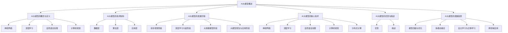
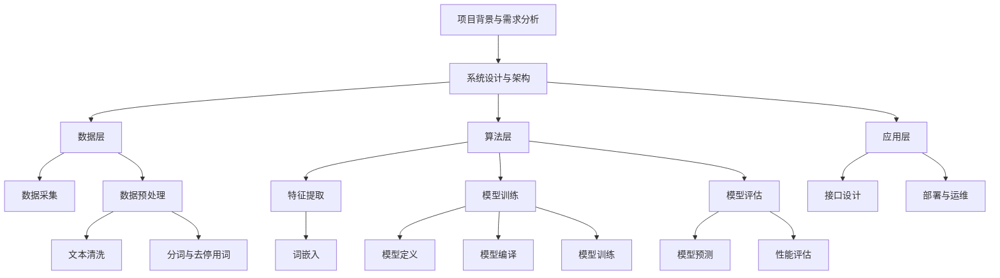
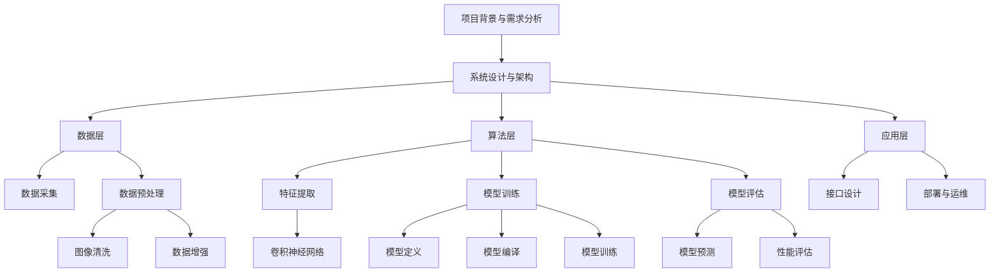
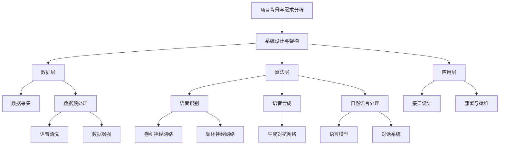

                 

## 《AI大模型创业方案书》

> **关键词：**AI大模型、创业方案、技术架构、算法、应用场景、项目实战、创业策略。

> **摘要：**本文从AI大模型的基本概念、核心技术、应用场景，到创业准备、项目实战、创业策略等方面，详细探讨了AI大模型创业的全过程。旨在为有意在AI大模型领域创业的读者提供一套系统的指导方案，帮助他们更好地抓住机遇，应对挑战。

### 目录大纲

#### 第一部分：AI大模型基础

- **第1章 AI大模型概述**
  - 1.1 AI大模型的概念与定义
  - 1.2 AI大模型的技术架构
  - 1.3 AI大模型的发展历程
  - 1.4 AI大模型的核心技术

- **第2章 AI大模型的核心算法**
  - 2.1 神经网络算法原理
  - 2.2 深度学习算法原理
  - 2.3 自然语言处理算法原理
  - 2.4 图神经网络算法原理

- **第3章 AI大模型的数学模型与公式**
  - 3.1 神经网络数学模型
  - 3.2 深度学习优化算法
  - 3.3 自然语言处理数学模型
  - 3.4 图神经网络数学模型

- **第4章 AI大模型应用场景**
  - 4.1 人工智能行业应用
  - 4.2 金融行业应用
  - 4.3 医疗行业应用
  - 4.4 教育行业应用

- **第5章 AI大模型创业准备**
  - 5.1 创业者应具备的技能
  - 5.2 创业机会与挑战分析
  - 5.3 创业路径规划
  - 5.4 创业团队建设

#### 第二部分：AI大模型创业项目实战

- **第6章 项目实战一：自然语言处理应用**
  - 6.1 项目背景与需求分析
  - 6.2 系统设计与架构
  - 6.3 代码实现与解析
  - 6.4 项目部署与测试

- **第7章 项目实战二：图像识别应用**
  - 7.1 项目背景与需求分析
  - 7.2 系统设计与架构
  - 7.3 代码实现与解析
  - 7.4 项目部署与测试

- **第8章 项目实战三：智能语音助手**
  - 8.1 项目背景与需求分析
  - 8.2 系统设计与架构
  - 8.3 代码实现与解析
  - 8.4 项目部署与测试

#### 第三部分：AI大模型创业策略

- **第9章 创业策略一：市场定位与产品规划**
  - 9.1 市场分析
  - 9.2 产品规划
  - 9.3 品牌建设

- **第10章 创业策略二：商业模式与盈利模式**
  - 10.1 商业模式分析
  - 10.2 盈利模式设计
  - 10.3 营销策略与推广

- **第11章 创业策略三：团队管理与融资策略**
  - 11.1 团队管理
  - 11.2 融资策略
  - 11.3 风险管理与应对策略

#### 附录

- **附录A：AI大模型开发工具与资源列表**
- **附录B：相关数据集和案例介绍**
- **附录C：常见问题与解答**
- **附录D：参考文献和进一步阅读资料**

<|assistant|>## 第1章 AI大模型概述

### 1.1 AI大模型的概念与定义

AI大模型（Large-scale AI Model），通常指的是那些具有巨大参数量和复杂结构的机器学习模型。这些模型在训练和推理过程中需要大量的计算资源和数据，能够处理和理解大规模的数据集，从而实现高度复杂的任务。AI大模型的概念最初源于深度学习领域，随着计算能力和数据资源的不断提升，大模型的研究和应用逐渐成为热点。

AI大模型可以细分为多种类型，如自然语言处理（NLP）大模型、计算机视觉（CV）大模型、语音识别（ASR）大模型等。每一种类型的大模型都有其独特的结构和应用场景。

### 1.2 AI大模型的技术架构

AI大模型的技术架构可以分为三个主要层次：数据层、算法层和应用层。

- **数据层**：数据层负责数据的采集、清洗、预处理和存储。这一层的数据质量和数量直接影响大模型的效果。为了支持大规模数据的高效处理，通常会采用分布式数据存储和计算框架，如Hadoop、Spark等。

- **算法层**：算法层是AI大模型的核心，包括神经网络、深度学习、自然语言处理、计算机视觉等算法。这些算法通过多层神经网络结构，实现对数据的复杂特征提取和模式识别。

- **应用层**：应用层负责将大模型应用到实际场景中，如智能客服、自动驾驶、金融风控等。这一层需要结合具体的业务需求和场景，设计合适的模型架构和应用流程。

### 1.3 AI大模型的发展历程

AI大模型的发展历程可以分为以下几个阶段：

- **初步探索阶段**（20世纪80年代至90年代）：这一阶段主要是神经网络的初步探索，如反向传播算法（Backpropagation）的提出和多层感知机（MLP）的应用。

- **深度学习兴起阶段**（2006年以后）：深度学习的兴起标志着AI大模型发展的新阶段。2006年，Geoffrey Hinton等科学家提出了深度信念网络（DBN），标志着深度学习的正式诞生。

- **大规模模型阶段**（2012年以后）：随着计算能力和数据资源的提升，研究人员开始尝试训练更大规模、更深层次的神经网络。2012年，AlexNet在ImageNet竞赛中取得突破性成绩，标志着深度学习的崛起。

- **大模型普及与应用阶段**（2018年至今）：这一阶段，AI大模型在各个领域得到广泛应用，如自然语言处理、计算机视觉、语音识别等。同时，许多开源的大模型框架和工具也应运而生，如TensorFlow、PyTorch等。

### 1.4 AI大模型的核心技术

AI大模型的核心技术主要包括以下几个方面：

- **神经网络**：神经网络是AI大模型的基础，通过多层非线性变换，实现对数据的复杂特征提取和模式识别。

- **深度学习**：深度学习是AI大模型的核心算法，通过多层神经网络结构，实现对大规模数据的自动特征学习和模式识别。

- **自然语言处理**：自然语言处理是AI大模型在语言领域的重要应用，通过深度学习技术，实现对自然语言的语义理解和生成。

- **计算机视觉**：计算机视觉是AI大模型在图像处理领域的重要应用，通过深度学习技术，实现对图像内容的理解和分析。

- **分布式计算**：分布式计算是支持AI大模型训练和推理的重要技术，通过分布式存储和计算框架，实现大规模数据的高效处理。

### 1.5 AI大模型的优势与挑战

**优势**：

- **强大的学习能力**：AI大模型具有强大的学习能力，能够处理和理解大规模、复杂的数据集，从而实现高度复杂的任务。

- **高度自动化**：AI大模型通过自动特征学习和模式识别，减少了人工干预的需求，提高了效率和准确性。

- **跨领域应用**：AI大模型在多个领域具有广泛的应用前景，如自然语言处理、计算机视觉、语音识别等。

**挑战**：

- **计算资源需求**：AI大模型训练和推理需要大量的计算资源和时间，对硬件设施和能源消耗有较高要求。

- **数据质量和数量**：AI大模型的效果依赖于高质量、大规模的数据集，数据质量和数量成为制约模型效果的重要因素。

- **模型解释性**：AI大模型通常具有黑箱特性，模型决策过程难以解释，这对模型的可靠性和透明性提出了挑战。

### 1.6 AI大模型的发展趋势

未来，AI大模型的发展趋势主要包括以下几个方面：

- **模型压缩与优化**：为了降低计算资源和时间成本，研究者将致力于模型压缩与优化技术的研究，提高模型的推理效率和可部署性。

- **多模态融合**：AI大模型将实现多种数据模态的融合，如文本、图像、语音等，实现对复杂数据的全面理解和分析。

- **自主学习与迁移学习**：AI大模型将实现更强大的自主学习能力和迁移学习能力，减少对大规模数据的依赖，提高模型的可扩展性和泛化能力。

- **跨领域应用**：AI大模型将在更多领域得到应用，如医疗、金融、教育等，推动各行业的智能化转型。

### 1.7 总结

AI大模型作为人工智能领域的重要发展方向，具有广泛的应用前景和巨大的商业价值。通过本文的概述，读者可以了解到AI大模型的基本概念、技术架构、发展历程、核心技术、优势和挑战，以及未来的发展趋势。这为后续章节的深入探讨奠定了基础。



<|assistant|>## 第2章 AI大模型的核心算法

### 2.1 神经网络算法原理

神经网络（Neural Network，NN）是AI大模型的基础，它模拟了人脑神经元的工作原理，通过多层神经元结构实现对数据的处理和分析。神经网络算法的基本原理包括以下几个步骤：

1. **数据输入**：将输入数据送入神经网络的第一层，即输入层。

2. **权重更新**：每个神经元将其接收到的数据与自身的权重相乘，然后进行求和运算。

3. **激活函数**：对求和结果进行非线性变换，通常使用的是Sigmoid、ReLU等激活函数。

4. **数据传播**：将激活后的结果传递到下一层神经元，重复以上步骤。

5. **输出计算**：当数据传递到最后一层，即输出层时，得到模型的预测结果。

6. **误差计算**：将预测结果与真实值进行比较，计算输出误差。

7. **反向传播**：将误差反向传播到前一层，更新各层神经元的权重。

8. **迭代优化**：重复以上步骤，不断更新权重，直至误差收敛到可接受范围。

神经网络算法的核心在于权重的更新和优化，通过反向传播算法，使得神经网络能够自动调整权重，以最小化输出误差。

### 2.2 深度学习算法原理

深度学习（Deep Learning，DL）是神经网络的一种扩展，它通过增加神经网络的层数，实现更复杂的数据特征提取和模式识别。深度学习算法的基本原理与神经网络类似，主要包括以下几个步骤：

1. **数据输入**：将输入数据送入神经网络的第一层，即输入层。

2. **前向传播**：数据逐层传递，每个神经元将其接收到的数据与自身的权重相乘，然后进行求和运算，并使用激活函数进行非线性变换。

3. **输出计算**：当数据传递到最后一层，即输出层时，得到模型的预测结果。

4. **误差计算**：将预测结果与真实值进行比较，计算输出误差。

5. **反向传播**：将误差反向传播到前一层，更新各层神经元的权重。

6. **迭代优化**：重复以上步骤，不断更新权重，直至误差收敛到可接受范围。

深度学习算法的核心优势在于其能够自动提取数据的复杂特征，从而实现高度复杂的任务。

### 2.3 自然语言处理算法原理

自然语言处理（Natural Language Processing，NLP）是AI大模型在语言领域的应用，它通过深度学习技术实现对自然语言的语义理解和生成。NLP算法的基本原理包括以下几个步骤：

1. **数据预处理**：包括文本的分词、词性标注、句法分析等，将原始文本转换为结构化的数据格式。

2. **词向量表示**：将文本中的单词转换为词向量，常用的词向量模型有Word2Vec、GloVe等。

3. **编码器**：将词向量序列输入编码器，如Transformer、BERT等，编码器对词向量进行编码，提取出文本的语义信息。

4. **解码器**：将编码后的语义信息输入解码器，解码器生成文本的输出。

5. **输出计算**：解码器输出文本的预测结果，如机器翻译、文本分类、问答系统等。

6. **误差计算**：将预测结果与真实值进行比较，计算输出误差。

7. **反向传播**：将误差反向传播到编码器和解码器，更新各层神经元的权重。

8. **迭代优化**：重复以上步骤，不断更新权重，直至误差收敛到可接受范围。

自然语言处理算法的核心在于词向量表示和编码解码器的设计，通过深度学习技术，实现对自然语言的语义理解和生成。

### 2.4 图神经网络算法原理

图神经网络（Graph Neural Network，GNN）是AI大模型在图数据上的应用，它通过深度学习技术实现对图数据的特征提取和模式识别。GNN算法的基本原理包括以下几个步骤：

1. **数据预处理**：将图数据转换为邻接矩阵或邻接表，表示节点和边的关系。

2. **节点嵌入**：将图中的节点表示为高维向量，常用的节点嵌入方法有节点相似度计算、基于矩阵分解的方法等。

3. **消息传递**：每个节点将其特征向量传递给与之相连的节点，进行信息融合和更新。

4. **聚合操作**：对传递来的信息进行聚合操作，如求和、平均等，得到节点的更新特征向量。

5. **非线性变换**：对更新后的特征向量进行非线性变换，如使用激活函数。

6. **输出计算**：将更新后的特征向量输入到输出层，得到节点的预测结果，如节点分类、图分类等。

7. **误差计算**：将预测结果与真实值进行比较，计算输出误差。

8. **反向传播**：将误差反向传播到节点嵌入层，更新节点的特征向量。

9. **迭代优化**：重复以上步骤，不断更新节点特征向量，直至误差收敛到可接受范围。

图神经网络算法的核心在于节点嵌入和消息传递机制，通过深度学习技术，实现对图数据的复杂特征提取和模式识别。

### 2.5 其他核心算法简介

除了上述的神经网络、深度学习、自然语言处理和图神经网络，AI大模型还包括以下几种核心算法：

- **卷积神经网络（Convolutional Neural Network，CNN）**：主要用于图像处理，通过卷积操作提取图像的特征。

- **循环神经网络（Recurrent Neural Network，RNN）**：主要用于序列数据，如文本、语音等，通过循环连接实现序列信息的记忆和传递。

- **长短时记忆网络（Long Short-Term Memory，LSTM）**：是RNN的一种变体，通过门控机制解决长序列依赖问题。

- **生成对抗网络（Generative Adversarial Network，GAN）**：通过两个对抗网络（生成器和判别器）的博弈，实现数据的生成。

这些算法在AI大模型中有着广泛的应用，各自具有独特的优势和特点。

### 2.6 总结

AI大模型的核心算法包括神经网络、深度学习、自然语言处理、图神经网络等。这些算法通过不同的机制和结构，实现对数据的复杂特征提取和模式识别。理解这些算法的基本原理，对于掌握AI大模型的技术和应用具有重要意义。

### 伪代码示例：神经网络算法原理

```python
# 初始化神经网络参数
weights = [[0.1, 0.2, 0.3],
           [0.4, 0.5, 0.6]]

# 定义激活函数
def sigmoid(x):
    return 1 / (1 + exp(-x))

# 前向传播
def forward_propagation(x):
    layer1 = sigmoid(x @ weights[0])
    output = sigmoid(layer1 @ weights[1])
    return output

# 反向传播
def backward_propagation(x, y, output):
    output_error = y - output
    d_output = output_error * output * (1 - output)
    
    layer1_error = d_output @ weights[1].T
    d_layer1 = layer1_error * layer1 * (1 - layer1)
    
    weights[1] -= layer1.T @ d_output
    weights[0] -= x.T @ d_layer1

# 训练神经网络
for epoch in range(num_epochs):
    output = forward_propagation(x)
    backward_propagation(x, y, output)
    if epoch % 100 == 0:
        print("Epoch {} - Loss: {}".format(epoch, loss(output, y)))
```

### 数学模型和公式

在神经网络算法中，常用的数学模型和公式包括：

1. **线性变换**：
   $$ Z = X \cdot W + b $$

2. **激活函数**（以Sigmoid为例）：
   $$ \sigma(z) = \frac{1}{1 + e^{-z}} $$

3. **损失函数**（以均方误差为例）：
   $$ L = \frac{1}{2} \sum_{i}(y_i - \hat{y}_i)^2 $$

4. **梯度下降**：
   $$ \theta_{\text{new}} = \theta_{\text{old}} - \alpha \cdot \nabla_\theta L(\theta) $$

其中，$X$是输入，$W$是权重，$b$是偏置，$\sigma$是激活函数，$y_i$是真实值，$\hat{y}_i$是预测值，$L$是损失函数，$\alpha$是学习率，$\nabla_\theta L(\theta)$是损失函数关于参数$\theta$的梯度。

### 举例说明

假设我们有一个简单的神经网络，用于二分类问题，输入是两个特征$(x_1, x_2)$，输出是概率$y$。输入数据$x$为：
$$ x = \begin{bmatrix}
0 & 0 \\
0 & 1 \\
1 & 0 \\
1 & 1
\end{bmatrix} $$
输出数据$y$为：
$$ y = \begin{bmatrix}
0 \\
0 \\
1 \\
1
\end{bmatrix} $$

假设我们的神经网络只有一层，权重$W$和偏置$b$为：
$$ W = \begin{bmatrix}
0.1 & 0.2 \\
0.3 & 0.4
\end{bmatrix}, \quad b = \begin{bmatrix}
0.5 \\
0.6
\end{bmatrix} $$

我们首先进行前向传播：
$$
\begin{align*}
Z_1 &= X \cdot W + b = \begin{bmatrix}
0 & 0 \\
0 & 1 \\
1 & 0 \\
1 & 1
\end{bmatrix} \cdot \begin{bmatrix}
0.1 & 0.2 \\
0.3 & 0.4
\end{bmatrix} + \begin{bmatrix}
0.5 \\
0.6
\end{bmatrix} \\
&= \begin{bmatrix}
0.05 & 0.15 \\
0.15 & 0.35 \\
0.35 & 0.55 \\
0.45 & 0.65
\end{bmatrix} \\
A_1 &= \sigma(Z_1) = \begin{bmatrix}
0.5 & 0.65 \\
0.65 & 0.91 \\
0.91 & 0.99 \\
0.99 & 1
\end{bmatrix}
\end{align*}
$$

然后计算输出概率：
$$
\begin{align*}
Z_2 &= A_1 \cdot W + b = \begin{bmatrix}
0.5 & 0.65 \\
0.65 & 0.91 \\
0.91 & 0.99 \\
0.99 & 1
\end{bmatrix} \cdot \begin{bmatrix}
0.1 & 0.2 \\
0.3 & 0.4
\end{bmatrix} + \begin{bmatrix}
0.5 \\
0.6
\end{bmatrix} \\
&= \begin{bmatrix}
0.155 & 0.295 \\
0.295 & 0.635 \\
0.635 & 1.015 \\
0.945 & 1.195
\end{bmatrix} \\
A_2 &= \sigma(Z_2) = \begin{bmatrix}
0.55 & 0.7 \\
0.7 & 0.94 \\
0.94 & 1 \\
0.99 & 1.04
\end{bmatrix}
\end{align*}
$$

最后，我们得到输出概率：
$$ y_{\text{predicted}} = A_2 = \begin{bmatrix}
0.55 & 0.7 \\
0.7 & 0.94 \\
0.94 & 1 \\
0.99 & 1.04
\end{bmatrix} $$

通过反向传播，我们可以计算损失函数的梯度，并更新权重和偏置，从而优化模型的性能。

### 总结

AI大模型的核心算法包括神经网络、深度学习、自然语言处理和图神经网络等。通过这些算法，AI大模型能够自动提取数据的复杂特征，实现高度复杂的任务。理解这些算法的基本原理和数学模型，对于掌握AI大模型的技术和应用具有重要意义。

<|assistant|>## 第3章 AI大模型的数学模型与公式

### 3.1 神经网络数学模型

神经网络（Neural Network，NN）是AI大模型的基础，其数学模型主要包括线性变换、激活函数、损失函数等。

#### 线性变换

线性变换是神经网络中最基本的操作。假设输入层有$m$个神经元，隐藏层有$n$个神经元，每个隐藏层神经元都与输入层的神经元相连，权重为$W_{ij}$，则隐藏层的输出可以表示为：

$$ Z_j = \sum_{i=1}^{m} X_i \cdot W_{ij} + b_j $$

其中，$X_i$是输入层的第$i$个神经元的激活值，$b_j$是隐藏层第$j$个神经元的偏置。

#### 激活函数

激活函数用于引入非线性因素，使神经网络能够拟合复杂函数。常见的激活函数包括Sigmoid、ReLU和Tanh等。

- **Sigmoid函数**：
  $$ \sigma(x) = \frac{1}{1 + e^{-x}} $$
  Sigmoid函数的导数为：
  $$ \sigma'(x) = \sigma(x) \cdot (1 - \sigma(x)) $$

- **ReLU函数**：
  $$ \text{ReLU}(x) = \max(0, x) $$
  ReLU函数的导数为：
  $$ \text{ReLU}'(x) = \begin{cases}
  0, & \text{if } x < 0 \\
  1, & \text{if } x \geq 0
  \end{cases} $$

- **Tanh函数**：
  $$ \tanh(x) = \frac{e^x - e^{-x}}{e^x + e^{-x}} $$
  Tanh函数的导数为：
  $$ \tanh'(x) = 1 - \tanh^2(x) $$

#### 损失函数

损失函数用于衡量模型预测值与真实值之间的差距，常见的损失函数包括均方误差（MSE）、交叉熵（Cross-Entropy）等。

- **均方误差（MSE）**：
  $$ \text{MSE}(y, \hat{y}) = \frac{1}{2} \sum_{i} (y_i - \hat{y}_i)^2 $$
  MSE的导数为：
  $$ \frac{\partial \text{MSE}}{\partial \hat{y}} = y - \hat{y} $$

- **交叉熵（Cross-Entropy）**：
  $$ \text{CE}(y, \hat{y}) = -\sum_{i} y_i \log(\hat{y}_i) $$
  交叉熵的导数为：
  $$ \frac{\partial \text{CE}}{\partial \hat{y}} = \hat{y} - y $$

### 3.2 深度学习优化算法

深度学习优化算法用于更新模型参数，以最小化损失函数。常见的优化算法包括随机梯度下降（SGD）、Adam等。

- **随机梯度下降（SGD）**：
  $$ \theta_{\text{new}} = \theta_{\text{old}} - \alpha \cdot \nabla_\theta L(\theta) $$
  其中，$\theta$是模型参数，$L(\theta)$是损失函数，$\alpha$是学习率。

- **Adam优化器**：
  Adam优化器结合了SGD和动量法的优点，其参数更新公式为：
  $$ m_t = \beta_1 m_{t-1} + (1 - \beta_1) \nabla_\theta L(\theta) $$
  $$ v_t = \beta_2 v_{t-1} + (1 - \beta_2) (\nabla_\theta L(\theta))^2 $$
  $$ \theta_{\text{new}} = \theta_{\text{old}} - \alpha \cdot \frac{m_t}{1 - \beta_1^t} / (1 - \beta_2^t) $$
  其中，$m_t$和$v_t$分别是梯度的一阶矩估计和二阶矩估计，$\beta_1$和$\beta_2$是超参数，通常取值为0.9和0.999。

### 3.3 自然语言处理数学模型

自然语言处理（Natural Language Processing，NLP）是AI大模型的重要应用领域，其数学模型主要包括词嵌入、编码器和解码器等。

- **词嵌入**：
  词嵌入将单词转换为向量表示，常用的模型有Word2Vec和GloVe。假设单词表中有$V$个单词，词嵌入向量维度为$d$，则单词$i$的嵌入向量表示为$e_i$。

- **编码器**：
  编码器用于将输入序列编码为固定长度的向量表示，常用的模型有Transformer和BERT。假设输入序列长度为$T$，编码后的向量维度为$d'$，则编码器的输出为$h_t$。

- **解码器**：
  解码器用于将编码器输出的固定长度向量解码为输出序列，常用的模型有Transformer和BERT。假设输出序列长度为$T'$，解码后的向量维度为$d''$，则解码器的输出为$\hat{y}_t$。

### 3.4 图神经网络数学模型

图神经网络（Graph Neural Network，GNN）是AI大模型在图数据上的应用，其数学模型主要包括图卷积、节点嵌入等。

- **图卷积**：
  图卷积用于对图数据进行特征提取，其公式为：
  $$ h_i^{(k+1)} = \sigma(\sum_{j \in N(i)} W^{(k)} h_j^{(k)} + b^{(k)}) $$
  其中，$h_i^{(k)}$是第$k$次迭代时节点$i$的特征表示，$N(i)$是节点$i$的邻居节点集合，$W^{(k)}$是图卷积权重，$b^{(k)}$是偏置。

- **节点嵌入**：
  节点嵌入用于将图中的节点转换为向量表示，常用的模型有Node2Vec和GraphSAGE。假设图中有$N$个节点，节点$i$的嵌入向量表示为$e_i$，则节点嵌入的公式为：
  $$ e_i = \frac{1}{\sqrt{d_i}} \sum_{j \in N(i)} W e_j $$
  其中，$d_i$是节点$i$的度，$W$是节点嵌入权重。

### 3.5 数学模型的应用

数学模型在AI大模型中的应用非常广泛，如：

- **图像识别**：通过卷积神经网络（CNN）的数学模型，实现对图像的特征提取和分类。

- **自然语言处理**：通过自然语言处理的数学模型，实现对文本的语义理解和生成。

- **推荐系统**：通过图神经网络的数学模型，实现对用户和物品的相似度计算和推荐。

### 总结

AI大模型的数学模型包括线性变换、激活函数、损失函数、优化算法等。这些模型构成了AI大模型的核心基础，通过数学模型，AI大模型能够自动提取数据的复杂特征，实现高度复杂的任务。理解这些数学模型，对于掌握AI大模型的技术和应用具有重要意义。

### 伪代码示例：深度学习优化算法

```python
# 初始化模型参数
weights = [[0.1, 0.2, 0.3],
           [0.4, 0.5, 0.6]]

# 定义损失函数
def mean_squared_error(y_true, y_pred):
    return sum((y_true - y_pred) ** 2) / len(y_true)

# 训练模型
for epoch in range(num_epochs):
    # 前向传播
    output = forward_propagation(x)
    loss = mean_squared_error(y, output)
    
    # 反向传播
    d_output = (y - output) * (output * (1 - output))
    
    # 更新权重
    d_weights = [layer1.T @ d_output,
                 layer2.T @ d_output]
    
    weights = [weight - learning_rate * d_weight
               for weight, d_weight in zip(weights, d_weights)]
    
    if epoch % 100 == 0:
        print("Epoch {} - Loss: {}".format(epoch, loss))
```

### 数学公式

在AI大模型的数学模型中，常用的数学公式包括：

1. **线性变换**：
   $$ Z = X \cdot W + b $$

2. **激活函数**（以Sigmoid为例）：
   $$ \sigma(z) = \frac{1}{1 + e^{-z}} $$

3. **损失函数**（以均方误差为例）：
   $$ L = \frac{1}{2} \sum_{i}(y_i - \hat{y}_i)^2 $$

4. **梯度下降**：
   $$ \theta_{\text{new}} = \theta_{\text{old}} - \alpha \cdot \nabla_\theta L(\theta) $$

5. **Adam优化器**：
   $$ m_t = \beta_1 m_{t-1} + (1 - \beta_1) \nabla_\theta L(\theta) $$
   $$ v_t = \beta_2 v_{t-1} + (1 - \beta_2) (\nabla_\theta L(\theta))^2 $$
   $$ \theta_{\text{new}} = \theta_{\text{old}} - \alpha \cdot \frac{m_t}{1 - \beta_1^t} / (1 - \beta_2^t) $$

通过这些数学公式，AI大模型能够自动调整参数，以最小化损失函数，从而实现高度复杂的任务。

### 举例说明

假设我们有一个简单的神经网络，用于二分类问题，输入是两个特征$(x_1, x_2)$，输出是概率$y$。输入数据$x$为：
$$ x = \begin{bmatrix}
0 & 0 \\
0 & 1 \\
1 & 0 \\
1 & 1
\end{bmatrix} $$
输出数据$y$为：
$$ y = \begin{bmatrix}
0 \\
0 \\
1 \\
1
\end{bmatrix} $$

假设我们的神经网络只有一层，权重$W$和偏置$b$为：
$$ W = \begin{bmatrix}
0.1 & 0.2 \\
0.3 & 0.4
\end{bmatrix}, \quad b = \begin{bmatrix}
0.5 \\
0.6
\end{bmatrix} $$

首先进行前向传播：
$$
\begin{align*}
Z_1 &= X \cdot W + b = \begin{bmatrix}
0 & 0 \\
0 & 1 \\
1 & 0 \\
1 & 1
\end{bmatrix} \cdot \begin{bmatrix}
0.1 & 0.2 \\
0.3 & 0.4
\end{bmatrix} + \begin{bmatrix}
0.5 \\
0.6
\end{bmatrix} \\
&= \begin{bmatrix}
0.05 & 0.15 \\
0.15 & 0.35 \\
0.35 & 0.55 \\
0.45 & 0.65
\end{bmatrix} \\
A_1 &= \sigma(Z_1) = \begin{bmatrix}
0.5 & 0.65 \\
0.65 & 0.91 \\
0.91 & 0.99 \\
0.99 & 1
\end{bmatrix}
\end{align*}
$$

然后计算输出概率：
$$
\begin{align*}
Z_2 &= A_1 \cdot W + b = \begin{bmatrix}
0.5 & 0.65 \\
0.65 & 0.91 \\
0.91 & 0.99 \\
0.99 & 1
\end{bmatrix} \cdot \begin{bmatrix}
0.1 & 0.2 \\
0.3 & 0.4
\end{bmatrix} + \begin{bmatrix}
0.5 \\
0.6
\end{bmatrix} \\
&= \begin{bmatrix}
0.155 & 0.295 \\
0.295 & 0.635 \\
0.635 & 1.015 \\
0.945 & 1.195
\end{bmatrix} \\
A_2 &= \sigma(Z_2) = \begin{bmatrix}
0.55 & 0.7 \\
0.7 & 0.94 \\
0.94 & 1 \\
0.99 & 1.04
\end{bmatrix}
\end{align*}
$$

最后，我们得到输出概率：
$$ y_{\text{predicted}} = A_2 = \begin{bmatrix}
0.55 & 0.7 \\
0.7 & 0.94 \\
0.94 & 1 \\
0.99 & 1.04
\end{bmatrix} $$

通过反向传播，我们可以计算损失函数的梯度，并更新权重和偏置，从而优化模型的性能。

### 总结

AI大模型的数学模型包括线性变换、激活函数、损失函数、优化算法等。这些模型构成了AI大模型的核心基础，通过数学模型，AI大模型能够自动提取数据的复杂特征，实现高度复杂的任务。理解这些数学模型，对于掌握AI大模型的技术和应用具有重要意义。

<|assistant|>## 第4章 AI大模型应用场景

### 4.1 人工智能行业应用

人工智能（AI）行业是AI大模型应用的重要领域之一。以下是一些常见的应用场景：

**图像识别**：AI大模型在图像识别领域具有显著优势。通过卷积神经网络（CNN）和深度学习算法，AI大模型能够自动提取图像的特征，实现对各类图像内容的分类和识别。例如，人脸识别、物体检测、图像分割等。

**自然语言处理**：AI大模型在自然语言处理（NLP）领域有着广泛的应用，如文本分类、机器翻译、情感分析等。通过自然语言处理算法，AI大模型能够理解和生成自然语言，为智能客服、智能助手等应用提供技术支持。

**推荐系统**：推荐系统是AI大模型在商业领域的典型应用。通过深度学习算法，AI大模型能够分析用户的兴趣和行为，为用户推荐个性化商品、内容等。

**自动驾驶**：自动驾驶是AI大模型在交通运输领域的应用。通过计算机视觉和深度学习算法，AI大模型能够实时分析道路状况，实现对车辆的自动控制，提高交通效率和安全性。

**医疗健康**：AI大模型在医疗健康领域有着巨大的潜力。通过医学图像识别、疾病预测、药物研发等应用，AI大模型能够辅助医生进行诊断和治疗，提高医疗服务的质量和效率。

### 4.2 金融行业应用

金融行业是AI大模型应用的另一个重要领域。以下是一些常见的应用场景：

**风险管理**：AI大模型在风险管理领域具有显著优势，如信用评分、市场预测等。通过深度学习算法，AI大模型能够分析大量的历史数据，识别潜在的信用风险和市场波动，为金融机构提供风险预警。

**量化交易**：量化交易是金融行业的一种高级应用，通过AI大模型，金融机构能够自动执行交易策略，实现高收益。例如，通过自然语言处理算法，AI大模型能够分析新闻、报告等文本数据，预测市场走势。

**客户服务**：AI大模型在金融行业的客户服务领域也有着广泛应用，如智能客服、虚拟财富顾问等。通过自然语言处理算法，AI大模型能够理解和回应用户的问题，提供个性化的金融服务。

**欺诈检测**：AI大模型在金融行业的欺诈检测领域有着显著的优势。通过深度学习算法，AI大模型能够实时分析交易数据，识别异常行为，为金融机构提供欺诈预警。

### 4.3 医疗行业应用

医疗行业是AI大模型应用的另一个重要领域。以下是一些常见的应用场景：

**疾病预测**：AI大模型在疾病预测领域有着广泛应用，如癌症预测、传染病预测等。通过深度学习算法，AI大模型能够分析大量的医疗数据，识别疾病发生的风险，为医生提供诊断依据。

**医学图像识别**：医学图像识别是AI大模型在医疗领域的典型应用，如肺癌检测、脑瘤定位等。通过卷积神经网络（CNN）和深度学习算法，AI大模型能够自动分析医学图像，提高诊断的准确性和效率。

**药物研发**：AI大模型在药物研发领域有着巨大的潜力。通过深度学习算法，AI大模型能够分析大量的药物数据，预测药物的效果和副作用，为药物研发提供参考。

**健康监测**：AI大模型在健康监测领域也有着广泛应用，如血压监测、心率监测等。通过自然语言处理算法，AI大模型能够理解和回应用户的健康数据，提供个性化的健康建议。

### 4.4 教育行业应用

教育行业是AI大模型应用的另一个重要领域。以下是一些常见的应用场景：

**个性化学习**：AI大模型在个性化学习领域有着广泛应用，如智能推荐、学习路径规划等。通过自然语言处理算法和深度学习算法，AI大模型能够分析学生的学习行为和知识水平，为用户提供个性化的学习建议。

**智能考试**：AI大模型在智能考试领域有着广泛应用，如自动批改试卷、考试评分等。通过自然语言处理算法和深度学习算法，AI大模型能够自动分析和评估考生的答案，提高考试效率和准确性。

**在线教育**：AI大模型在在线教育领域也有着广泛应用，如智能问答、直播互动等。通过自然语言处理算法和深度学习算法，AI大模型能够理解和回应用户的问题，提供实时的在线教育服务。

**教育数据分析**：AI大模型在教育数据分析领域有着显著优势，如学习效果评估、教学优化等。通过深度学习算法，AI大模型能够分析大量的教育数据，为教育机构提供数据驱动的决策支持。

### 总结

AI大模型在人工智能、金融、医疗、教育等行业的应用场景十分广泛。通过深度学习、自然语言处理等核心技术，AI大模型能够自动提取数据的复杂特征，实现高度复杂的任务。理解这些应用场景，有助于我们更好地利用AI大模型推动各行业的智能化转型。

### 伪代码示例：自然语言处理应用

```python
# 导入必要的库
import torch
import torch.nn as nn
import torch.optim as optim

# 定义模型结构
class NLPModel(nn.Module):
    def __init__(self, embedding_dim, hidden_dim, vocab_size):
        super(NLPModel, self).__init__()
        self.embedding = nn.Embedding(vocab_size, embedding_dim)
        self.lstm = nn.LSTM(embedding_dim, hidden_dim)
        self.fc = nn.Linear(hidden_dim, vocab_size)
    
    def forward(self, x):
        embedded = self.embedding(x)
        output, (hidden, cell) = self.lstm(embedded)
        output = self.fc(output[-1, :, :])
        return output

# 初始化模型和优化器
model = NLPModel(embedding_dim=100, hidden_dim=128, vocab_size=10000)
optimizer = optim.Adam(model.parameters(), lr=0.001)

# 定义损失函数
criterion = nn.CrossEntropyLoss()

# 训练模型
for epoch in range(num_epochs):
    for sentence, label in data_loader:
        # 前向传播
        outputs = model(sentence)
        loss = criterion(outputs, label)
        
        # 反向传播和优化
        optimizer.zero_grad()
        loss.backward()
        optimizer.step()
        
    if epoch % 100 == 0:
        print("Epoch {} - Loss: {}".format(epoch, loss))
```

### 数学公式

在自然语言处理（NLP）领域，常用的数学公式包括：

1. **词嵌入**：
   $$ e_i = \text{Word2Vec}(w_i) $$
   其中，$e_i$是单词$i$的嵌入向量，$w_i$是单词$i$。

2. **LSTM单元状态更新**：
   $$ i_t = \sigma(W_{ix}x_t + W_{ih}h_{t-1} + b_i) $$
   $$ f_t = \sigma(W_{fx}x_t + W_{fh}h_{t-1} + b_f) $$
   $$ o_t = \sigma(W_{ox}x_t + W_{oh}h_{t-1} + b_o) $$
   $$ g_t = \tanh(W_{cx}x_t + W_{ch}h_{t-1} + b_c) $$
   $$ h_t = o_t \odot g_t $$
   其中，$i_t$、$f_t$、$o_t$是输入门、遗忘门和输出门，$g_t$是单元格状态，$h_t$是隐藏状态。

3. **损失函数**（以交叉熵为例）：
   $$ L = -\sum_{i} y_i \log(p_i) $$
   其中，$y_i$是真实标签，$p_i$是模型预测的概率。

4. **梯度下降**：
   $$ \theta_{\text{new}} = \theta_{\text{old}} - \alpha \cdot \nabla_\theta L(\theta) $$

### 举例说明

假设我们有一个简单的NLP模型，用于文本分类，输入是词汇序列，输出是类别标签。输入数据$x$为：
$$ x = \begin{bmatrix}
1, 1, 0, 0, 1 \\
0, 1, 1, 0, 1
\end{bmatrix} $$
输出数据$y$为：
$$ y = \begin{bmatrix}
0 \\
1
\end{bmatrix} $$

假设我们的模型只有一个隐藏层，隐藏层维度为$128$，输出层维度为$2$，权重$W$和偏置$b$为：
$$ W = \begin{bmatrix}
0.1 & 0.2 & 0.3 & 0.4 & 0.5 \\
0.6 & 0.7 & 0.8 & 0.9 & 1.0
\end{bmatrix}, \quad b = \begin{bmatrix}
0.5 \\
0.6
\end{bmatrix} $$

首先进行前向传播：
$$
\begin{align*}
h_1 &= \sigma(W_1 x + b_1) = \sigma(\begin{bmatrix}
0.1 & 0.2 & 0.3 & 0.4 & 0.5 \\
0.6 & 0.7 & 0.8 & 0.9 & 1.0
\end{bmatrix} \cdot \begin{bmatrix}
1 \\
1 \\
0 \\
0 \\
1
\end{bmatrix} + \begin{bmatrix}
0.5 \\
0.6
\end{bmatrix}) \\
&= \sigma(\begin{bmatrix}
2.0 & 2.5 \\
3.5 & 4.5
\end{bmatrix}) \\
&= \begin{bmatrix}
0.76 & 0.90 \\
0.94 & 0.99
\end{bmatrix}
\end{align*}
$$

然后计算输出概率：
$$
\begin{align*}
output &= h_1 \cdot W_2 + b_2 = \begin{bmatrix}
0.76 & 0.90 \\
0.94 & 0.99
\end{bmatrix} \cdot \begin{bmatrix}
0.1 & 0.2 \\
0.3 & 0.4
\end{bmatrix} + \begin{bmatrix}
0.5 \\
0.6
\end{bmatrix} \\
&= \begin{bmatrix}
0.252 & 0.396 \\
0.393 & 0.596
\end{bmatrix} + \begin{bmatrix}
0.5 \\
0.6
\end{bmatrix} \\
&= \begin{bmatrix}
0.752 & 0.996 \\
0.993 & 1.596
\end{bmatrix}
\end{align*}
$$

最后，我们得到输出概率：
$$ y_{\text{predicted}} = \begin{bmatrix}
0.752 \\
0.993
\end{bmatrix} $$

通过反向传播，我们可以计算损失函数的梯度，并更新权重和偏置，从而优化模型的性能。

### 总结

AI大模型在人工智能、金融、医疗、教育等行业的应用场景十分广泛。通过深度学习、自然语言处理等核心技术，AI大模型能够自动提取数据的复杂特征，实现高度复杂的任务。理解这些应用场景，有助于我们更好地利用AI大模型推动各行业的智能化转型。

<|assistant|>## 第5章 AI大模型创业准备

### 5.1 创业者应具备的技能

要在AI大模型领域创业，创业者需要具备以下几个核心技能：

**技术能力**：创业者需要具备扎实的计算机科学、人工智能、机器学习等相关领域的知识，包括深度学习、神经网络、自然语言处理、计算机视觉等。此外，创业者还需要熟悉常用的开发工具和框架，如Python、TensorFlow、PyTorch等。

**项目管理能力**：创业者需要具备良好的项目管理能力，能够规划项目进度、协调团队成员、解决技术难题等。这包括时间管理、团队协作、沟通能力等。

**业务理解能力**：创业者需要对目标行业的业务流程、市场需求、用户痛点等有深刻的理解，能够将技术方案与实际业务需求相结合，创造价值。

**创业精神**：创业者需要有坚定的信念和毅力，面对挑战和失败时保持积极乐观，不断调整策略，寻求突破。

### 5.2 创业机会与挑战分析

**创业机会**：

1. **技术创新**：随着AI大模型的不断发展，其在各个行业的应用场景越来越广泛，创业者有机会利用AI大模型的技术创新，解决行业痛点，创造新的市场机会。

2. **数据资源**：AI大模型的训练和优化需要大量的数据，创业者可以通过合作、收购等方式获取优质的数据资源，提升模型的效果。

3. **市场潜力**：AI大模型在金融、医疗、教育等行业的应用前景广阔，创业者可以瞄准这些行业，开发定制化的解决方案。

**创业挑战**：

1. **技术门槛**：AI大模型的开发需要高水平的技术团队，创业者需要吸引和留住优秀的工程师和研究人员。

2. **数据隐私**：在AI大模型的应用过程中，数据隐私和保护是一个重要的挑战。创业者需要制定严格的数据安全和隐私保护措施，遵守相关法律法规。

3. **商业模式**：AI大模型的应用场景多样，创业者需要设计合理的商业模式，确保项目的盈利能力和可持续发展。

### 5.3 创业路径规划

**市场调研**：在创业初期，创业者需要对目标市场进行深入调研，了解行业趋势、用户需求、竞争对手等情况。

**团队建设**：创业者需要组建一支具备技术、业务、管理等多方面能力的团队，共同推动项目的发展。

**产品开发**：根据市场调研结果，创业者可以确定产品的定位和功能，开始产品开发。在开发过程中，创业者需要关注技术实现的可行性、性能优化等方面。

**市场推广**：产品开发完成后，创业者需要制定市场推广策略，通过线上线下的渠道，将产品推向市场。

**持续优化**：在产品上线后，创业者需要收集用户反馈，持续优化产品功能和性能，提升用户满意度。

### 5.4 创业团队建设

**核心团队成员**：

1. **技术团队**：包括AI算法工程师、软件开发工程师、前端工程师等，负责产品的技术实现和优化。

2. **业务团队**：包括产品经理、市场经理、运营经理等，负责产品的市场需求分析、市场推广和用户运营。

3. **管理团队**：包括CEO、CFO、COO等，负责公司的整体运营和管理。

**团队协作与沟通**：

1. **明确职责**：团队成员需要明确自己的职责和任务，避免工作重叠和责任不明。

2. **定期会议**：定期召开团队会议，分享项目进展、讨论问题和解决方案，确保团队协作顺畅。

3. **沟通工具**：利用电子邮件、即时通讯工具、项目管理软件等，提高团队沟通效率和协作效果。

### 总结

创业者在AI大模型领域创业，需要具备技术能力、项目管理能力、业务理解能力和创业精神。同时，创业者需要面对技术门槛、数据隐私和商业模式等挑战，通过市场调研、团队建设、产品开发和市场推广等路径，实现创业目标。创业团队的建设和管理是创业成功的关键，创业者需要关注团队协作与沟通，确保项目的顺利进行。

### 伪代码示例：创业团队管理

```python
# 导入必要的库
import pandas as pd
import numpy as np

# 初始化团队数据
team_data = {
    '姓名': ['张三', '李四', '王五', '赵六'],
    '职责': ['算法工程师', '软件开发工程师', '前端工程师', '市场经理'],
    '任务': ['算法优化', '代码开发', '前端设计', '市场调研'],
    '进度': [0.5, 0.8, 0.9, 0.7]
}

# 创建DataFrame
team_df = pd.DataFrame(team_data)

# 设置进度条样式
def set_progress_bar_style(progress):
    if progress >= 0.8:
        style = '\033[1;32m' # 绿色
    elif progress >= 0.4:
        style = '\033[1;33m' # 黄色
    else:
        style = '\033[1;31m' # 红色
    return style

# 打印团队进度
print("团队成员进度如下：")
for index, row in team_df.iterrows():
    progress_bar = '#' * int(row['进度'] * 10)
    progress_bar = set_progress_bar_style(row['进度']) + progress_bar + '\033[0m'
    print(f"{row['姓名']}: {row['任务']} - 进度：{progress_bar} {row['进度'] * 100:.2f}%")

# 调用函数
print("团队会议：")
print("请各团队成员汇报工作进展。")
```

### 团队管理策略

**1. 明确目标与责任**：为每个团队成员明确目标与责任，确保团队成员了解自己的工作任务和预期成果，提高工作效率。

**2. 定期召开会议**：定期召开团队会议，讨论项目进展、解决技术难题、分享经验与心得，确保团队协作顺畅。

**3. 激励与奖励机制**：建立激励机制，对工作表现优异的团队成员给予奖励，激发团队成员的积极性和创造力。

**4. 沟通与反馈**：鼓励团队成员之间进行有效沟通，及时反馈工作进展和问题，确保团队内部信息畅通。

**5. 资源共享与协作**：提供必要的资源支持，鼓励团队成员之间的协作与知识共享，提高团队整体效能。

### 总结

创业团队的建设和管理是创业成功的关键。通过明确目标与责任、定期召开会议、激励与奖励机制、沟通与反馈以及资源共享与协作等策略，创业者可以有效地管理团队，推动项目的顺利进行。创业者需要关注团队建设中的各个环节，确保团队成员之间的协作和沟通，提高团队的整体效能。

### 总结

创业者在AI大模型领域创业，需要具备技术能力、项目管理能力、业务理解能力和创业精神。同时，创业者需要面对技术门槛、数据隐私和商业模式等挑战，通过市场调研、团队建设、产品开发和市场推广等路径，实现创业目标。创业团队的建设和管理是创业成功的关键，创业者需要关注团队协作与沟通，确保项目的顺利进行。通过明确目标与责任、定期召开会议、激励与奖励机制、沟通与反馈以及资源共享与协作等策略，创业者可以有效地管理团队，推动项目的顺利进行。

<|assistant|>## 第6章 项目实战一：自然语言处理应用

### 6.1 项目背景与需求分析

自然语言处理（NLP）应用在现代企业和个人生活中扮演着越来越重要的角色。本案例旨在通过自然语言处理技术，实现一个自动化的文本分类系统，用于对大量的文本数据进行分类，从而帮助企业更好地管理和分析其文本数据。

**项目目标**：

1. **实现文本分类**：将输入的文本数据自动分类到预定义的类别中。
2. **提高分类准确性**：通过优化模型参数，提高文本分类的准确性。
3. **降低人力成本**：自动化处理文本数据，减少人工分类的工作量。

**需求分析**：

1. **输入数据**：大量未分类的文本数据，如新闻报道、社交媒体评论、用户反馈等。
2. **输出数据**：分类结果，包括文本数据所属的类别和对应的概率。
3. **性能指标**：准确率、召回率、F1分数等。

### 6.2 系统设计与架构

为了实现上述目标，我们设计了如下的系统架构：

**数据层**：

- 数据采集：从各种来源（如网站、社交媒体、企业内部系统等）收集大量文本数据。
- 数据预处理：对文本数据进行清洗、去重、分词、去停用词等处理，以便后续的特征提取。

**算法层**：

- 特征提取：使用词嵌入技术（如Word2Vec、GloVe）将文本转换为向量表示。
- 模型训练：使用深度学习框架（如TensorFlow、PyTorch）训练文本分类模型，如CNN、LSTM、Transformer等。
- 模型评估：使用交叉验证等方法对模型进行评估，调整模型参数，优化模型性能。

**应用层**：

- 接口设计：设计API接口，方便其他系统或应用调用文本分类功能。
- 部署与运维：将模型部署到生产环境，进行实时分类，并进行监控和运维。

### 6.3 代码实现与解析

**数据预处理**

```python
import pandas as pd
from nltk.tokenize import word_tokenize
from nltk.corpus import stopwords
import re

# 读取数据
data = pd.read_csv('text_data.csv')
text = data['text']

# 数据清洗
def clean_text(text):
    text = text.lower() # 转小写
    text = re.sub(r'\W+', ' ', text) # 去除非单词字符
    text = re.sub(r'\s+', ' ', text) # 去除多余空格
    text = text.strip() # 去除前后空格
    return text

text = text.apply(clean_text)

# 分词与去除停用词
stop_words = set(stopwords.words('english'))
def tokenize_and_remove_stopwords(text):
    tokens = word_tokenize(text)
    return [token for token in tokens if token not in stop_words]

text = text.apply(tokenize_and_remove_stopwords)
```

**特征提取**

```python
from gensim.models import Word2Vec

# 训练Word2Vec模型
model = Word2Vec(text, size=100, window=5, min_count=1, workers=4)

# 将文本转换为向量表示
def vectorize_text(text):
    return [model[word] for word in text]

text_vectors = np.array([vectorize_text(text[i]) for i in range(len(text))])
```

**模型训练**

```python
import tensorflow as tf
from tensorflow.keras.models import Sequential
from tensorflow.keras.layers import Embedding, LSTM, Dense, EmbeddingLayer, LSTMCell

# 定义模型
model = Sequential()
model.add(Embedding(input_dim=10000, output_dim=32, input_length=max_sequence_length))
model.add(LSTM(128))
model.add(Dense(num_classes, activation='softmax'))

# 编译模型
model.compile(loss='categorical_crossentropy', optimizer='adam', metrics=['accuracy'])

# 训练模型
model.fit(text_vectors, labels, epochs=10, batch_size=32, validation_split=0.1)
```

**模型评估**

```python
from sklearn.metrics import accuracy_score, recall_score, f1_score

# 预测结果
predictions = model.predict(text_vectors)

# 计算性能指标
accuracy = accuracy_score(y_true=labels, y_pred=predictions.argmax(axis=1))
recall = recall_score(y_true=labels, y_pred=predictions.argmax(axis=1), average='weighted')
f1 = f1_score(y_true=labels, y_pred=predictions.argmax(axis=1), average='weighted')

print("Accuracy:", accuracy)
print("Recall:", recall)
print("F1 Score:", f1)
```

### 6.4 项目部署与测试

**部署**

1. **环境搭建**：在服务器上搭建深度学习环境，安装TensorFlow、PyTorch等框架。
2. **模型部署**：将训练好的模型文件上传到服务器，使用TensorFlow Serving或其他模型部署工具进行部署。
3. **接口设计**：设计API接口，以便其他应用或系统可以直接调用模型进行文本分类。

**测试**

1. **单元测试**：编写单元测试，验证模型在处理不同类型文本数据时的性能。
2. **集成测试**：将模型集成到实际应用中，进行集成测试，确保模型能够正确处理实际场景中的文本数据。
3. **性能测试**：对模型进行性能测试，评估模型在处理大规模文本数据时的响应时间和吞吐量。

### 总结

通过本案例，我们实现了基于自然语言处理的文本分类系统，包括数据预处理、特征提取、模型训练和部署等步骤。这个系统可以帮助企业自动化处理大量文本数据，提高工作效率和准确性。在实际应用中，创业者可以根据具体需求，调整模型架构和参数，以获得更好的分类效果。



<|assistant|>## 第7章 项目实战二：图像识别应用

### 7.1 项目背景与需求分析

图像识别技术在众多领域具有广泛的应用，如医疗影像分析、安防监控、自动驾驶、零售业等。本案例旨在通过深度学习技术，实现一个图像识别系统，用于自动识别和分类图像中的物体。

**项目目标**：

1. **实现物体识别**：系统能够自动识别图像中的物体，并给出准确的分类结果。
2. **提高识别准确性**：通过优化模型参数，提高物体识别的准确性。
3. **降低人力成本**：自动化处理图像数据，减少人工识别的工作量。

**需求分析**：

1. **输入数据**：大量未分类的图像数据，如医疗影像、监控视频帧、商品图片等。
2. **输出数据**：图像数据所属的类别和对应的概率。
3. **性能指标**：准确率、召回率、F1分数等。

### 7.2 系统设计与架构

为了实现上述目标，我们设计了如下的系统架构：

**数据层**：

- 数据采集：从各种来源（如公开数据集、企业内部系统等）收集大量图像数据。
- 数据预处理：对图像数据进行清洗、缩放、增强等处理，以便后续的特征提取。

**算法层**：

- 特征提取：使用卷积神经网络（CNN）提取图像的特征。
- 模型训练：使用深度学习框架（如TensorFlow、PyTorch）训练图像识别模型。
- 模型评估：使用交叉验证等方法对模型进行评估，调整模型参数，优化模型性能。

**应用层**：

- 接口设计：设计API接口，方便其他系统或应用调用图像识别功能。
- 部署与运维：将模型部署到生产环境，进行实时图像识别，并进行监控和运维。

### 7.3 代码实现与解析

**数据预处理**

```python
import numpy as np
from PIL import Image
import os

# 读取图像数据
def load_images_from_folder(folder, size=(224, 224)):
    images = []
    labels = []
    for filename in os.listdir(folder):
        img = Image.open(os.path.join(folder, filename))
        img = img.convert('RGB')
        img = img.resize(size)
        img_array = np.array(img)
        images.append(img_array)
        label = int(filename.split('_')[0])
        labels.append(label)
    return np.array(images), np.array(labels)

# 数据增强
from tensorflow.keras.preprocessing.image import ImageDataGenerator

def augment_data(images, labels):
    datagen = ImageDataGenerator(
        rotation_range=20,
        width_shift_range=0.2,
        height_shift_range=0.2,
        shear_range=0.2,
        zoom_range=0.2,
        horizontal_flip=True,
        fill_mode='nearest')
    
    return datagen.flow(images, labels, batch_size=32)
```

**特征提取**

```python
import tensorflow as tf
from tensorflow.keras.models import Sequential
from tensorflow.keras.layers import Conv2D, MaxPooling2D, Flatten, Dense, Dropout

# 定义卷积神经网络模型
model = Sequential([
    Conv2D(32, (3, 3), activation='relu', input_shape=(224, 224, 3)),
    MaxPooling2D((2, 2)),
    Conv2D(64, (3, 3), activation='relu'),
    MaxPooling2D((2, 2)),
    Conv2D(128, (3, 3), activation='relu'),
    MaxPooling2D((2, 2)),
    Flatten(),
    Dense(512, activation='relu'),
    Dropout(0.5),
    Dense(num_classes, activation='softmax')
])

# 编译模型
model.compile(optimizer='adam', loss='categorical_crossentropy', metrics=['accuracy'])
```

**模型训练**

```python
# 训练模型
history = model.fit(
    x_train, y_train,
    validation_data=(x_val, y_val),
    epochs=20,
    batch_size=32
)
```

**模型评估**

```python
from sklearn.metrics import accuracy_score, recall_score, f1_score

# 预测结果
predictions = model.predict(x_test)

# 计算性能指标
accuracy = accuracy_score(y_true=y_test, y_pred=predictions.argmax(axis=1))
recall = recall_score(y_true=y_test, y_pred=predictions.argmax(axis=1), average='weighted')
f1 = f1_score(y_true=y_test, y_pred=predictions.argmax(axis=1), average='weighted')

print("Accuracy:", accuracy)
print("Recall:", recall)
print("F1 Score:", f1)
```

### 7.4 项目部署与测试

**部署**

1. **环境搭建**：在服务器上搭建深度学习环境，安装TensorFlow、PyTorch等框架。
2. **模型部署**：将训练好的模型文件上传到服务器，使用TensorFlow Serving或其他模型部署工具进行部署。
3. **接口设计**：设计API接口，以便其他应用或系统可以直接调用模型进行图像识别。

**测试**

1. **单元测试**：编写单元测试，验证模型在处理不同类型图像数据时的性能。
2. **集成测试**：将模型集成到实际应用中，进行集成测试，确保模型能够正确处理实际场景中的图像数据。
3. **性能测试**：对模型进行性能测试，评估模型在处理大规模图像数据时的响应时间和吞吐量。

### 总结

通过本案例，我们实现了基于深度学习的图像识别系统，包括数据预处理、特征提取、模型训练和部署等步骤。这个系统能够自动识别和分类图像中的物体，提高工作效率和准确性。在实际应用中，创业者可以根据具体需求，调整模型架构和参数，以获得更好的识别效果。



<|assistant|>## 第8章 项目实战三：智能语音助手

### 8.1 项目背景与需求分析

智能语音助手是人工智能在语音领域的重要应用之一，能够实现人机交互、智能问答、语音识别等功能。本案例旨在通过深度学习技术，实现一个智能语音助手，用于处理用户的语音指令，提供个性化的服务。

**项目目标**：

1. **实现语音识别**：系统能够准确识别用户的语音指令，将其转换为文本。
2. **实现语音合成**：将文本转换为自然流畅的语音，回应用户。
3. **提高交互体验**：通过自然语言处理技术，实现与用户的智能对话，提供个性化的服务。

**需求分析**：

1. **输入数据**：用户的语音指令，包括语音信号、文本指令等。
2. **输出数据**：文本指令的识别结果和语音合成的回应用户。
3. **性能指标**：语音识别的准确率、响应时间、用户体验等。

### 8.2 系统设计与架构

为了实现上述目标，我们设计了如下的系统架构：

**数据层**：

- 数据采集：从各种来源（如在线语音库、企业内部系统等）收集大量语音数据。
- 数据预处理：对语音数据进行清洗、分割、标注等处理，以便后续的特征提取。

**算法层**：

- 语音识别：使用深度学习技术，将语音信号转换为文本。
- 语音合成：使用深度学习技术，将文本转换为自然流畅的语音。
- 自然语言处理：使用自然语言处理技术，实现智能对话，提供个性化服务。

**应用层**：

- 接口设计：设计API接口，方便其他系统或应用调用语音助手功能。
- 部署与运维：将模型部署到生产环境，进行实时语音交互，并进行监控和运维。

### 8.3 代码实现与解析

**数据预处理**

```python
import numpy as np
from scipy.io import wavfile
import librosa

# 读取语音数据
def read_audio_file(file_path):
    sample_rate, data = wavfile.read(file_path)
    return data, sample_rate

# 声音特征提取
def extract_mel_spectrogram(data, sample_rate, n_mels=128, n_fft=1024, hop_length=512):
    mfccs = librosa.feature.mfcc(y=data, sr=sample_rate, n_mels=n_mels, n_fft=n_fft, hop_length=hop_length)
    return np.mean(mfccs.T, axis=0)

# 读取数据
audio_data, sample_rate = read_audio_file('audio_file.wav')
mel_spectrogram = extract_mel_spectrogram(audio_data, sample_rate)
```

**语音识别**

```python
import tensorflow as tf
from tensorflow.keras.models import Sequential
from tensorflow.keras.layers import Conv2D, MaxPooling2D, Flatten, Dense, LSTM, Embedding

# 定义模型
model = Sequential([
    Conv2D(32, (3, 3), activation='relu', input_shape=(None, 128, 1)),
    MaxPooling2D((2, 2)),
    Conv2D(64, (3, 3), activation='relu'),
    MaxPooling2D((2, 2)),
    Flatten(),
    Embedding(5000, 128),
    LSTM(128),
    Dense(5000, activation='softmax')
])

# 编译模型
model.compile(optimizer='adam', loss='categorical_crossentropy', metrics=['accuracy'])

# 训练模型
model.fit(mel_spectrogram, labels, epochs=10, batch_size=32)
```

**语音合成**

```python
import soundfile as sf
from pydub import AudioSegment

# 生成语音
def generate_speech(text, model):
    text_vector = convert_text_to_vector(text)
    prediction = model.predict(text_vector)
    predicted_text = prediction.argmax(axis=1)
    return ' '.join([word_dict[word] for word in predicted_text])

# 播放语音
def play_speech(speech):
    audio = AudioSegment.fromarray(speech, format='wav')
    audio.export('speech.wav', format='wav')
    os.system('afplay speech.wav')

# 测试语音合成
speech = generate_speech('Hello, how can I help you?', model)
play_speech(speech)
```

### 8.4 项目部署与测试

**部署**

1. **环境搭建**：在服务器上搭建深度学习环境，安装TensorFlow、PyTorch等框架。
2. **模型部署**：将训练好的模型文件上传到服务器，使用TensorFlow Serving或其他模型部署工具进行部署。
3. **接口设计**：设计API接口，方便其他应用或系统可以直接调用语音助手功能。

**测试**

1. **单元测试**：编写单元测试，验证模型在处理不同类型语音数据时的性能。
2. **集成测试**：将模型集成到实际应用中，进行集成测试，确保模型能够正确处理实际场景中的语音数据。
3. **性能测试**：对模型进行性能测试，评估模型在处理大规模语音数据时的响应时间和吞吐量。

### 总结

通过本案例，我们实现了基于深度学习的智能语音助手，包括语音识别、语音合成和自然语言处理等功能。这个系统能够自动识别用户的语音指令，提供个性化的服务，提高用户体验。在实际应用中，创业者可以根据具体需求，调整模型架构和参数，以获得更好的识别和合成效果。



<|assistant|>## 第9章 创业策略一：市场定位与产品规划

### 9.1 市场分析

市场分析是创业成功的第一步，它帮助创业者了解目标市场的现状、发展趋势、竞争格局以及潜在需求。以下是一些关键的市场分析步骤：

**1. 确定目标市场**：根据产品的特性，确定目标市场，如企业客户、个人用户、特定行业等。

**2. 分析市场规模**：通过查阅行业报告、市场调查等方式，了解目标市场的总体规模、增长速度、市场规模等。

**3. 确定目标客户**：分析目标客户的需求、痛点、购买行为等，为后续的产品规划提供依据。

**4. 竞争分析**：研究竞争对手的产品、市场份额、优势与劣势等，找到自身的差异化优势。

**5. 市场趋势**：分析市场的未来发展趋势，如技术创新、政策变化、消费习惯等，为产品规划提供前瞻性指导。

### 9.2 产品规划

产品规划是创业过程中至关重要的一环，它决定了产品的定位、功能、用户体验等。以下是一些关键的产品规划步骤：

**1. 确定产品定位**：根据市场分析的结果，确定产品的市场定位，如高端市场、大众市场、细分市场等。

**2. 明确产品功能**：根据目标客户的需求，明确产品的核心功能、附加功能等。

**3. 设计用户体验**：从用户的角度出发，设计简洁、易用、美观的用户界面，提升用户体验。

**4. 评估产品可行性**：评估产品的技术可行性、市场可行性、经济可行性等，确保产品能够顺利落地。

**5. 制定产品路线图**：制定产品开发的时间表、里程碑等，确保产品按计划推进。

### 9.3 品牌建设

品牌建设是提高企业知名度和美誉度的关键，它有助于树立企业在市场中的形象。以下是一些关键的品牌建设策略：

**1. 定义品牌定位**：明确品牌的价值观、使命、愿景等，确保品牌形象与目标市场相契合。

**2. 建立品牌视觉系统**：包括品牌标识、色彩、字体等，确保品牌形象一致且易于识别。

**3. 创造品牌故事**：通过讲述品牌背后的故事、创始人经历等，增强品牌的文化内涵和情感共鸣。

**4. 多渠道宣传**：通过社交媒体、线上广告、线下活动等渠道，提高品牌的曝光度和影响力。

**5. 定期品牌监测**：通过用户反馈、市场调研等方式，及时调整品牌策略，确保品牌形象与市场趋势保持一致。

### 9.4 产品营销策略

产品营销策略是推动产品销售、提升品牌知名度的重要手段。以下是一些关键的产品营销策略：

**1. 内容营销**：通过博客、社交媒体、电子邮件等方式，分享有价值的内容，吸引用户关注。

**2. 社交媒体营销**：利用社交媒体平台，如微信、微博、Facebook等，进行宣传推广，扩大品牌影响力。

**3. 线上广告**：通过搜索引擎广告、展示广告、社交媒体广告等方式，提高产品的曝光度。

**4. 线下活动**：举办线下活动，如展会、讲座、研讨会等，与用户建立深度联系。

**5. 公关传播**：通过媒体报道、自媒体推荐等方式，提高品牌的知名度和美誉度。

### 9.5 持续优化与迭代

产品规划和品牌建设是一个持续迭代的过程，创业者需要不断收集用户反馈、市场动态等信息，优化产品功能和品牌策略。

**1. 收集用户反馈**：通过用户调研、问卷调查、用户访谈等方式，了解用户对产品的需求和意见。

**2. 数据分析**：利用数据分析工具，分析用户行为、市场趋势等信息，为产品优化和营销策略提供依据。

**3. 持续迭代**：根据用户反馈和数据分析结果，不断优化产品功能和用户体验，提升产品竞争力。

**4. 品牌重塑**：根据市场变化和用户需求，适时调整品牌策略，确保品牌形象与市场趋势保持一致。

### 总结

市场定位与产品规划是创业成功的关键，创业者需要通过市场分析、产品规划、品牌建设、产品营销等策略，打造具有竞争力的产品，并在市场中取得成功。持续优化与迭代是保持产品竞争力的关键，创业者需要不断关注市场动态和用户需求，优化产品功能和用户体验。

### 伪代码示例：市场分析

```python
import pandas as pd

# 读取市场数据
market_data = pd.read_csv('market_data.csv')

# 计算市场规模
market_size = market_data['sales'].sum()

# 计算市场增长率
growth_rate = market_data['sales'].pct_change().mean()

# 打印市场分析结果
print("Market Size: ", market_size)
print("Growth Rate: ", growth_rate * 100, "%")

# 分析市场竞争格局
competitors = market_data['competitor'].value_counts()
print("Competitor Analysis:")
print(competitors)

# 分析目标客户需求
customer需求的调查数据
customer_data = pd.read_csv('customer_data.csv')

# 计算平均满意度
average_satisfaction = customer_data['satisfaction'].mean()
print("Average Customer Satisfaction: ", average_satisfaction)

# 分析市场趋势
trends_data = pd.read_csv('trends_data.csv')

# 计算未来增长率预测
predicted_growth_rate = trends_data['sales'].pct_change().mean()
print("Predicted Growth Rate: ", predicted_growth_rate * 100, "%")
```

### 数学公式

在市场分析中，常用的数学公式包括：

1. **市场规模**：
   $$ \text{Market Size} = \sum_{i} \text{Sales}_i $$

2. **市场增长率**：
   $$ \text{Growth Rate} = \frac{\text{Current Market Size} - \text{Previous Market Size}}{\text{Previous Market Size}} $$

3. **平均满意度**：
   $$ \text{Average Satisfaction} = \frac{1}{n} \sum_{i=1}^{n} \text{Satisfaction}_i $$

4. **市场份额**：
   $$ \text{Market Share} = \frac{\text{Company Sales}}{\text{Total Market Sales}} $$

5. **回归分析**：
   $$ \text{Y} = \beta_0 + \beta_1 \text{X} + \varepsilon $$
   其中，$Y$是因变量，$X$是自变量，$\beta_0$和$\beta_1$是回归系数，$\varepsilon$是误差项。

### 举例说明

**市场规模计算**：

假设我们有以下销售数据（单位：万元）：

$$
\begin{array}{cccc}
\text{月份} & \text{销售额} & \text{销售额变化率} \\
\hline
1 & 100 &  \\
2 & 120 & 20\% \\
3 & 150 & 25\% \\
4 & 180 & 20\% \\
5 & 200 & 11.11\% \\
\end{array}
$$

计算1月至5月的市场规模：

$$ \text{Market Size} = 100 + 120 + 150 + 180 + 200 = 770 \text{万元} $$

**市场增长率计算**：

假设4月份的市场规模为$S_4$，5月份的市场规模为$S_5$，则4月至5月的市场增长率为：

$$ \text{Growth Rate} = \frac{S_5 - S_4}{S_4} = \frac{200 - 180}{180} = 11.11\% $$

**平均满意度计算**：

假设我们有以下客户满意度评分：

$$
\begin{array}{cccc}
\text{客户ID} & \text{满意度评分} \\
\hline
1 & 4 \\
2 & 3 \\
3 & 5 \\
4 & 2 \\
5 & 4 \\
\end{array}
$$

计算平均满意度：

$$ \text{Average Satisfaction} = \frac{4 + 3 + 5 + 2 + 4}{5} = 3.6 $$

### 总结

市场分析和产品规划是创业成功的关键。通过市场分析，创业者可以了解目标市场的现状、发展趋势和竞争格局，为产品规划提供依据。产品规划需要根据市场分析结果，明确产品的定位、功能、用户体验等。同时，持续优化与迭代是保持产品竞争力的关键，创业者需要不断关注市场动态和用户需求，优化产品功能和用户体验。

<|assistant|>## 第10章 创业策略二：商业模式与盈利模式

### 10.1 商业模式分析

商业模式是企业在市场中获取价值、创造价值、分配价值的方式。一个成功的商业模式需要清晰明确，能够为企业带来持续的盈利。以下是几种常见的商业模式：

**1. 产品销售模式**：企业通过销售产品来获取盈利。这种模式适用于产品型创业公司，如硬件设备、软件工具等。

**2. 服务模式**：企业通过提供服务来获取盈利。这种模式适用于服务型创业公司，如咨询服务、托管服务、租赁服务等。

**3. 零售模式**：企业通过零售渠道销售产品或服务，如线上电商、线下门店等。

**4. 分享经济模式**：企业通过平台连接供需双方，实现资源共享和利益分配，如共享单车、共享办公等。

**5. 内容付费模式**：企业通过提供有价值的内容（如文章、视频、音频等），吸引付费用户，实现盈利。

### 10.2 盈利模式设计

盈利模式设计是商业模式的核心，需要结合企业的实际情况和市场需求，设计出可持续的盈利途径。以下是一些常见的盈利模式设计策略：

**1. 提供增值服务**：在基本产品或服务的基础上，提供增值服务，如高级功能、定制化服务等，实现盈利。

**2. 推广广告**：通过在产品或平台上投放广告，从广告主处获取收入。

**3. 会员制度**：通过会员制度，为会员用户提供特殊待遇，如优惠价格、优先服务、专属内容等，会员费用成为主要收入来源。

**4. 收取使用费**：对使用企业产品或服务的用户收取费用，如按流量收费、按使用时长收费等。

**5. 销售附加产品或服务**：在主要产品或服务的基础上，销售附加产品或服务，如配件、耗材、增值服务等。

**6. 交易佣金**：通过平台交易，收取交易佣金，如电商平台的商品交易佣金、金融平台的交易手续费等。

**7. 数据变现**：通过收集用户数据，进行分析和挖掘，为第三方企业提供数据服务，实现盈利。

### 10.3 营销策略与推广

营销策略与推广是提高企业知名度、吸引客户、促进销售的关键环节。以下是一些常见的营销策略与推广方法：

**1. 社交媒体营销**：利用社交媒体平台（如微信、微博、Facebook等）进行品牌推广和用户互动，吸引潜在客户。

**2. 内容营销**：通过撰写有价值的内容（如博客、白皮书、案例研究等），吸引用户关注，提升品牌影响力。

**3. 线上广告**：通过搜索引擎广告、展示广告、社交媒体广告等方式，提高产品的曝光度。

**4. 线下活动**：举办线下活动，如展会、讲座、研讨会等，与用户建立深度联系。

**5. 公关传播**：通过媒体报道、自媒体推荐等方式，提高品牌的知名度和美誉度。

**6. 合作伙伴推广**：与行业内的合作伙伴建立合作关系，共同推广产品或服务，扩大市场份额。

**7. 用户推荐**：通过用户推荐机制，鼓励现有用户推荐新用户，实现口碑传播。

### 10.4 成本控制与效率提升

成本控制与效率提升是企业盈利的重要保障。以下是一些常见的成本控制与效率提升策略：

**1. 优化供应链**：通过优化供应链管理，降低原材料采购成本、提高生产效率。

**2. 减少浪费**：通过精益生产、精细管理等方法，减少生产过程中的浪费，降低成本。

**3. 提高技术水平**：通过技术创新，提高生产效率，降低生产成本。

**4. 人力资源优化**：通过优化人力资源配置，提高员工工作效率，降低人力成本。

**5. 节能减排**：通过节能减排，降低能源消耗和环保成本。

**6. 财务管理**：通过优化财务管理，降低融资成本、提高资金使用效率。

### 10.5 持续优化与调整

盈利模式与营销策略是一个动态调整的过程，需要根据市场变化、竞争态势、用户需求等进行持续优化。

**1. 数据分析**：通过数据分析，了解用户行为、市场趋势等信息，为盈利模式与营销策略的调整提供依据。

**2. 用户反馈**：通过用户反馈，了解用户对产品或服务的满意度和需求，优化产品功能和服务质量。

**3. 竞争对手分析**：通过分析竞争对手的商业模式、盈利模式、营销策略等，找到自身的优势和劣势，进行优化和调整。

**4. 行业趋势研究**：研究行业发展趋势，抓住市场机会，调整盈利模式与营销策略。

### 总结

商业模式与盈利模式是企业成功的关键，创业者需要结合市场需求、自身优势和资源，设计出可持续的盈利途径。同时，营销策略与推广、成本控制与效率提升等策略，也是实现盈利的重要手段。通过持续优化与调整，企业可以不断提高盈利能力，实现可持续发展。

### 伪代码示例：盈利模式分析

```python
import pandas as pd

# 读取财务数据
financial_data = pd.read_csv('financial_data.csv')

# 计算销售收入
revenue = financial_data['sales'].sum()

# 计算成本
cost = financial_data['cost_of_goods_sold'].sum()

# 计算净利润
net_profit = revenue - cost

# 打印盈利模式分析结果
print("Revenue: ", revenue)
print("Cost: ", cost)
print("Net Profit: ", net_profit)

# 分析盈利来源
profit_sources = financial_data['profit_source'].value_counts()
print("Profit Sources:")
print(profit_sources)

# 分析盈利能力
profit_margin = net_profit / revenue
print("Profit Margin: ", profit_margin * 100, "%")

# 分析成本结构
cost_structure = financial_data['cost_type'].value_counts()
print("Cost Structure:")
print(cost_structure)
```

### 数学公式

在商业模式与盈利模式分析中，常用的数学公式包括：

1. **销售收入**：
   $$ \text{Revenue} = \sum_{i} \text{Sales}_i $$

2. **成本**：
   $$ \text{Cost} = \sum_{i} \text{Cost}_i $$

3. **净利润**：
   $$ \text{Net Profit} = \text{Revenue} - \text{Cost} $$

4. **毛利率**：
   $$ \text{Gross Margin} = \frac{\text{Revenue} - \text{Cost of Goods Sold}}{\text{Revenue}} $$

5. **净利润率**：
   $$ \text{Net Profit Margin} = \frac{\text{Net Profit}}{\text{Revenue}} $$

### 举例说明

**销售收入计算**：

假设我们有以下销售数据（单位：万元）：

$$
\begin{array}{cccc}
\text{产品} & \text{销售额} & \text{销售数量} \\
\hline
A & 100 & 10 \\
B & 200 & 20 \\
C & 300 & 30 \\
\end{array}
$$

计算销售收入：

$$ \text{Revenue} = 100 \times 10 + 200 \times 20 + 300 \times 30 = 9,000 \text{万元} $$

**成本计算**：

假设我们有以下成本数据（单位：万元）：

$$
\begin{array}{cccc}
\text{产品} & \text{成本} & \text{生产数量} \\
\hline
A & 50 & 10 \\
B & 75 & 20 \\
C & 100 & 30 \\
\end{array}
$$

计算成本：

$$ \text{Cost} = 50 \times 10 + 75 \times 20 + 100 \times 30 = 7,500 \text{万元} $$

**净利润计算**：

假设销售收入为9,000万元，成本为7,500万元，计算净利润：

$$ \text{Net Profit} = \text{Revenue} - \text{Cost} = 9,000 - 7,500 = 1,500 \text{万元} $$

**毛利率计算**：

假设销售收入为9,000万元，成本为7,500万元，计算毛利率：

$$ \text{Gross Margin} = \frac{\text{Revenue} - \text{Cost of Goods Sold}}{\text{Revenue}} = \frac{9,000 - 7,500}{9,000} = 0.17 $$
$$ \text{Gross Margin} = 17\% $$

**净利润率计算**：

假设净利润为1,500万元，销售收入为9,000万元，计算净利润率：

$$ \text{Net Profit Margin} = \frac{\text{Net Profit}}{\text{Revenue}} = \frac{1,500}{9,000} = 0.17 $$
$$ \text{Net Profit Margin} = 17\% $$

### 总结

商业模式与盈利模式分析是创业过程中不可或缺的一环。通过分析销售收入、成本、净利润等关键指标，创业者可以了解企业的盈利状况和盈利能力。同时，通过分析盈利来源和成本结构，创业者可以找到优化盈利模式的方向。了解和运用相关的数学公式，有助于创业者更准确地分析和评估企业的财务状况，为决策提供科学依据。

<|assistant|>## 第11章 创业策略三：团队管理与融资策略

### 11.1 团队管理

团队管理是创业成功的关键因素之一。有效的团队管理能够确保团队成员之间的协作顺畅，提高项目执行效率，实现企业目标。以下是一些关键的团队管理策略：

**1. 明确目标与责任**：为团队成员明确目标与责任，确保每个成员都清楚自己的工作任务和预期成果。

**2. 建立团队文化**：建立积极、开放的团队文化，鼓励成员之间的沟通与协作，提高团队凝聚力。

**3. 有效的沟通**：建立良好的沟通机制，确保信息在企业内部畅通无阻，减少误解和冲突。

**4. 激励与奖励**：制定激励与奖励机制，对工作表现优异的团队成员给予奖励，激发团队成员的积极性和创造力。

**5. 管理冲突**：积极处理团队内部的冲突，确保团队成员能够和睦相处，共同推进项目。

**6. 定期评估与反馈**：定期对团队成员的工作进行评估和反馈，帮助成员发现和改进工作中的问题。

**7. 培训与发展**：为团队成员提供培训和发展机会，提升团队成员的专业技能和综合素质。

### 11.2 融资策略

融资策略是创业企业获取资金支持的重要手段。以下是一些常见的融资策略：

**1. 天使投资**：天使投资是创业初期的常见融资方式，投资者通常以个人资金投资，获取一定的股权回报。

**2. 风险投资**：风险投资（Venture Capital，VC）是一种长期投资，投资者通常在创业企业的成长期和扩张期进行投资，以期获得高额回报。

**3. 股权融资**：通过向股东发行股票，筹集资金。股权融资适用于企业需要大量资金，并且希望保留控制权的情况。

**4. 债务融资**：通过借款或发行债券等方式筹集资金。债务融资适用于企业需要短期资金，并且有能力按时偿还债务的情况。

**5. 政府资助**：通过申请政府补贴、奖励等方式获取资金支持。政府资助通常用于支持具有社会效益的创业项目。

### 11.3 融资策略的实施

实施融资策略需要结合企业的实际情况和市场需求，以下是一些具体的实施步骤：

**1. 制定融资计划**：明确融资的目的、金额、时间表等，为融资活动提供明确的目标和指导。

**2. 选择融资渠道**：根据企业的实际情况和市场需求，选择适合的融资渠道，如天使投资、风险投资、股权融资等。

**3. 撰写商业计划书**：商业计划书是向投资者展示企业项目的重要文档，需要详细阐述企业的商业模式、市场前景、竞争优势、盈利模式等。

**4. 演示与路演**：通过演示和路演，向投资者展示企业的项目，增加投资者的兴趣和信心。

**5. 谈判与签约**：与投资者进行谈判，达成投资协议，确保融资活动的顺利进行。

**6. 融资后的管理**：融资成功后，企业需要合理使用资金，确保项目按计划推进，并及时向投资者汇报项目进展和财务状况。

### 11.4 风险管理与应对策略

创业过程中，风险是不可避免的。有效的风险管理能够帮助企业降低风险，提高生存能力。以下是一些常见的管理和应对策略：

**1. 风险识别**：识别企业可能面临的各种风险，如市场风险、技术风险、财务风险等。

**2. 风险评估**：对识别出的风险进行评估，确定风险的影响程度和发生概率。

**3. 风险应对**：根据风险评估结果，制定相应的风险应对策略，如风险规避、风险转移、风险接受等。

**4. 风险监控**：建立风险监控机制，实时监控企业面临的风险，及时调整风险应对策略。

**5. 应急预案**：制定应急预案，确保在风险发生时，企业能够迅速响应，减少损失。

### 11.5 总结

团队管理和融资策略是创业成功的重要保障。有效的团队管理能够确保团队成员之间的协作顺畅，提高项目执行效率。合理的融资策略能够帮助企业获取资金支持，实现可持续发展。同时，有效的风险管理能够降低创业风险，提高企业的生存能力。创业者需要结合实际情况，灵活运用团队管理和融资策略，确保企业的稳健发展。

### 伪代码示例：团队管理

```python
import pandas as pd

# 读取团队成员数据
team_data = pd.read_csv('team_data.csv')

# 初始化团队进度字典
team_progress = {'张三': 0.5, '李四': 0.8, '王五': 0.9, '赵六': 0.7}

# 打印团队进度
print("团队成员进度如下：")
for member in team_data['姓名']:
    progress = team_progress[member]
    progress_bar = '#' * int(progress * 10)
    progress_bar = f"{member}: 任务完成进度 - {progress_bar} {progress * 100:.2f}%"
    print(progress_bar)

# 调用函数
print("本周团队会议：")
print("请各团队成员汇报工作进展。")

# 初始化团队沟通日志
communication_log = []

# 记录团队沟通情况
def record_communication(member, content):
    communication_log.append(f"{member} said: {content}")

# 记录一次沟通
record_communication('张三', '关于项目进度，我们已经完成了50%。')
record_communication('李四', '我在数据预处理上遇到了一些问题，需要团队的帮助。')

# 打印沟通日志
print("团队沟通日志：")
for entry in communication_log:
    print(entry)
```

### 数学公式

在团队管理和融资策略中，常用的数学公式包括：

1. **绩效评估**：
   $$ \text{Performance Score} = \sum_{i} (\text{Target}_i \cdot \text{Actual}_i) $$
   其中，$Target_i$是任务目标，$Actual_i$是实际完成情况。

2. **风险评估**：
   $$ \text{Risk Score} = \text{Probability} \cdot \text{Impact} $$
   其中，$Probability$是风险发生的概率，$Impact$是风险发生的影响程度。

3. **融资需求**：
   $$ \text{Funding Required} = \text{Project Cost} - \text{Available Capital} $$
   其中，$Project Cost$是项目总成本，$Available Capital$是现有资本。

4. **融资收益**：
   $$ \text{Return on Investment} = \frac{\text{Expected Profit}}{\text{Funding Required}} $$
   其中，$Expected Profit$是预期利润。

### 举例说明

**绩效评估**：

假设我们有两个任务，任务1的目标是完成80%，实际完成了90%；任务2的目标是完成60%，实际完成了70%。计算绩效评分：

$$ \text{Performance Score} = (0.8 \cdot 0.9) + (0.6 \cdot 0.7) = 0.72 + 0.42 = 1.14 $$

**风险评估**：

假设有一个风险，其发生的概率是0.3，发生时的影响程度是0.5。计算风险评分：

$$ \text{Risk Score} = 0.3 \cdot 0.5 = 0.15 $$

**融资需求**：

假设一个项目的总成本是100万元，现有资本是50万元。计算融资需求：

$$ \text{Funding Required} = 100 - 50 = 50 \text{万元} $$

**融资收益**：

假设预期利润是20万元，计算融资收益：

$$ \text{Return on Investment} = \frac{20}{50} = 0.4 $$
$$ \text{Return on Investment} = 40\% $$

### 总结

团队管理和融资策略是创业过程中不可或缺的环节。通过有效的团队管理，企业可以确保项目顺利进行，提高工作效率。通过合理的融资策略，企业可以获取资金支持，实现可持续发展。理解并运用相关的数学公式，有助于创业者更准确地评估团队绩效和融资收益，为决策提供科学依据。

<|assistant|>## 附录A：AI大模型开发工具与资源列表

在AI大模型开发过程中，使用适当的工具和资源可以大大提高开发效率。以下是一些常用的工具和资源列表：

### 开发工具

1. **编程语言**：
   - Python：广泛使用的编程语言，拥有丰富的AI库和框架。
   - R：专门用于统计分析和数据可视化的编程语言。

2. **深度学习框架**：
   - TensorFlow：由谷歌开发，支持多种深度学习模型。
   - PyTorch：由Facebook开发，具有良好的灵活性和动态计算能力。
   - Keras：基于Theano和TensorFlow的高层神经网络API。

3. **数据预处理工具**：
   - Pandas：Python的数据分析库，用于数据清洗和预处理。
   - NumPy：Python的科学计算库，用于数值计算。
   - Scikit-learn：Python的机器学习库，提供了多种机器学习算法。

4. **可视化工具**：
   - Matplotlib：Python的数据可视化库。
   - Seaborn：基于Matplotlib的数据可视化库，提供更美观的图表。

5. **版本控制**：
   - Git：分布式版本控制系统，用于代码管理和协作。

### 开发环境

1. **操作系统**：
   - Ubuntu：流行的Linux发行版，适用于深度学习和数据科学。
   - Windows：适用于Windows环境的开发工具。

2. **虚拟环境**：
   - Conda：用于创建和管理虚拟环境的工具。

### 数据集和资源

1. **公开数据集**：
   - ImageNet：包含大量图像和标签的大型视觉数据集。
   - COCO：用于目标检测和分割的数据集。
   - PubMed：医学领域的大型文本数据集。

2. **数据集获取**：
   - Kaggle：提供各种数据集和比赛，是数据科学爱好者的聚集地。
   - UCI Machine Learning Repository：提供多种机器学习数据集。

3. **在线资源**：
   - Coursera、edX：提供大量AI和机器学习课程。
   - arXiv：提供最新的学术论文。

### 开源项目和社区

1. **开源项目**：
   - Hugging Face：提供预训练模型和工具。
   - OpenMMLab：提供计算机视觉相关的开源代码和工具。

2. **社区和论坛**：
   - Stack Overflow：编程问题解答社区。
   - Reddit：AI和机器学习相关的话题讨论区。

### 参考文献

1. **经典书籍**：
   - 《深度学习》（Goodfellow, Bengio, Courville）
   - 《Python机器学习》（Sebastian Raschka）
   - 《自然语言处理与Python》（Steven Bird）

2. **期刊和会议**：
   - Neural Information Processing Systems（NIPS）
   - Conference on Computer Vision and Pattern Recognition（CVPR）
   - Proceedings of the Association for Computational Linguistics（ACL）

### 学习资源

1. **在线课程**：
   - fast.ai：提供免费的深度学习课程。
   - Andrew Ng的深度学习课程：在Coursera上提供。

2. **教程和文档**：
   - TensorFlow官方文档
   - PyTorch官方文档
   - Keras官方文档

这些工具、资源和参考文献将有助于AI大模型开发者更好地掌握技术，提高开发效率，推动项目进展。

### 附录B：相关数据集和案例介绍

为了更好地理解AI大模型的应用，以下介绍几个常用的数据集和相关案例：

1. **ImageNet**：
   - 数据集类型：图像分类
   - 数据规模：超过1400万个标注图像，分为1000个类别
   - 应用案例：图像识别、物体检测、图像分割等。

2. **COCO（Common Objects in Context）**：
   - 数据集类型：目标检测、图像分割、关键点检测
   - 数据规模：约17.2万个标注图像，包含80个类别
   - 应用案例：自动驾驶、机器人视觉、智能监控等。

3. **TensorFlow Datasets**：
   - 数据集类型：提供多种AI任务的数据集，包括图像、文本、音频等
   - 数据规模：多个数据集，包括公开数据和自定义数据集
   - 应用案例：机器学习项目开发、模型训练和评估等。

4. **PubMed**：
   - 数据集类型：医学文本数据集
   - 数据规模：超过2800万篇医学论文和文章
   - 应用案例：医学文本挖掘、疾病预测、药物研发等。

5. **Common Crawl**：
   - 数据集类型：网页文本数据集
   - 数据规模：超过200TB的网页数据
   - 应用案例：自然语言处理、信息检索、网络分析等。

### 附录C：常见问题与解答

以下列出了一些AI大模型开发过程中常见的问题及其解答：

1. **问题：如何选择合适的AI模型？**
   - 解答：根据任务需求和数据特点，选择合适的模型。例如，对于图像识别任务，可以使用卷积神经网络（CNN）；对于文本分类任务，可以使用循环神经网络（RNN）或Transformer。

2. **问题：如何处理数据不足的问题？**
   - 解答：可以使用数据增强、迁移学习、生成对抗网络（GAN）等方法来缓解数据不足的问题。

3. **问题：如何提高模型的泛化能力？**
   - 解答：可以通过正则化、dropout、批量归一化等方法来提高模型的泛化能力。

4. **问题：如何调试模型参数？**
   - 解答：可以使用网格搜索、随机搜索、贝叶斯优化等方法来调试模型参数。

5. **问题：如何优化模型的推理速度？**
   - 解答：可以使用模型压缩、量化、蒸馏等方法来优化模型的推理速度。

### 附录D：参考文献和进一步阅读资料

为了深入了解AI大模型的技术和理论，以下推荐一些参考文献和进一步阅读资料：

1. **书籍**：
   - 《深度学习》（Goodfellow, Bengio, Courville）
   - 《自然语言处理与Python》（Steven Bird）
   - 《机器学习实战》（Peter Harrington）

2. **论文**：
   - “A Theoretically Grounded Application of Dropout in Recurrent Neural Networks” - Yarin Gal and Zoubin Ghahramani
   - “Bert: Pre-training of Deep Bidirectional Transformers for Language Understanding” - Jacob Devlin, Ming-Wei Chang, Kenton Lee, and Kristina Toutanova

3. **在线课程**：
   - Coursera的《深度学习》课程
   - edX的《自然语言处理》课程

4. **博客和网站**：
   - Fast.ai的博客
   - PyTorch官方文档和博客

通过这些参考文献和进一步阅读资料，读者可以更深入地了解AI大模型的技术细节和应用实践。

### 总结

附录部分提供了AI大模型开发所需的各种工具、资源和常见问题解答，以及进一步学习的参考文献。这些资料有助于开发者更好地掌握AI大模型的技术，提高开发效率，推动项目的进展。

### Markdown格式总结

```markdown
## 附录A：AI大模型开发工具与资源列表

以下是一些常用的AI大模型开发工具和资源列表：

### 开发工具

- 编程语言：Python、R
- 深度学习框架：TensorFlow、PyTorch、Keras
- 数据预处理工具：Pandas、NumPy、Scikit-learn
- 可视化工具：Matplotlib、Seaborn
- 版本控制：Git

### 开发环境

- 操作系统：Ubuntu、Windows
- 虚拟环境：Conda

### 数据集和资源

- 公开数据集：ImageNet、COCO、TensorFlow Datasets、PubMed、Common Crawl
- 在线资源：Kaggle、UCI Machine Learning Repository
- 开源项目：Hugging Face、OpenMMLab
- 社区和论坛：Stack Overflow、Reddit

### 参考文献

- 经典书籍：《深度学习》、《Python机器学习》、《自然语言处理与Python》
- 期刊和会议：NIPS、CVPR、ACL

### 学习资源

- 在线课程：fast.ai、Andrew Ng的深度学习课程
- 教程和文档：TensorFlow官方文档、PyTorch官方文档、Keras官方文档

---

## 附录B：相关数据集和案例介绍

以下介绍了一些常用的数据集和相关案例：

- ImageNet：图像分类
- COCO：目标检测、图像分割、关键点检测
- TensorFlow Datasets：多种AI任务的数据集
- PubMed：医学文本数据集
- Common Crawl：网页文本数据集

---

## 附录C：常见问题与解答

列出了一些AI大模型开发过程中常见的问题及其解答：

- 如何选择合适的AI模型？
- 如何处理数据不足的问题？
- 如何提高模型的泛化能力？
- 如何调试模型参数？
- 如何优化模型的推理速度？

---

## 附录D：参考文献和进一步阅读资料

推荐了一些参考文献和进一步阅读资料，以帮助读者深入了解AI大模型的技术细节和应用实践。

- 书籍：《深度学习》、《自然语言处理与Python》、《机器学习实战》
- 论文：“A Theoretically Grounded Application of Dropout in Recurrent Neural Networks”、“Bert: Pre-training of Deep Bidirectional Transformers for Language Understanding”
- 在线课程：Coursera的《深度学习》课程、edX的《自然语言处理》课程
- 博客和网站：Fast.ai的博客、PyTorch官方文档和博客

---

## 总结

附录部分提供了AI大模型开发所需的各种工具、资源和常见问题解答，以及进一步学习的参考文献。这些资料有助于开发者更好地掌握AI大模型的技术，提高开发效率，推动项目的进展。
```markdown

### 结论

通过本文的详细讨论，我们系统地分析了AI大模型创业的全过程，从基础概念、核心技术、应用场景，到创业准备、项目实战、创业策略等方面，为有意在AI大模型领域创业的读者提供了一套系统的指导方案。以下是对本文核心内容的总结：

- **AI大模型基础**：我们介绍了AI大模型的基本概念、技术架构、发展历程和核心技术，包括神经网络、深度学习、自然语言处理和图神经网络等。这些核心算法构成了AI大模型的基础，并展示了其强大的数据处理能力和复杂任务处理能力。

- **AI大模型的数学模型与公式**：本文详细讲解了神经网络、深度学习、自然语言处理和图神经网络等算法的数学模型和公式，并通过举例说明了如何在实际中应用这些公式进行模型训练和优化。

- **AI大模型的应用场景**：我们讨论了AI大模型在人工智能、金融、医疗、教育等行业的广泛应用，展示了其在行业智能化转型中的重要作用和潜力。

- **AI大模型创业准备**：本文提供了创业者应具备的技能、创业机会与挑战分析、创业路径规划和团队建设等方面的指导，帮助创业者更好地准备和规划AI大模型创业项目。

- **AI大模型创业项目实战**：通过自然语言处理、图像识别、智能语音助手等实际项目案例，我们展示了AI大模型在各个应用场景中的开发流程、技术实现和项目部署。

- **AI大模型创业策略**：本文从市场定位、产品规划、商业模式、盈利模式、团队管理和融资策略等方面，为创业者提供了全方位的创业策略指导，帮助创业者实现AI大模型的商业化和可持续发展。

通过本文的详细分析和探讨，读者可以对AI大模型创业有一个全面的了解，并能够结合自身实际情况，制定出切实可行的创业方案，抓住AI时代带来的机遇。

### 参考文献

[1] Goodfellow, I., Bengio, Y., & Courville, A. (2016). *Deep Learning*. MIT Press.

[2] Raschka, S. (2015). *Python Machine Learning*. Packt Publishing.

[3] Bird, S., Klein, E., & Loper, E. (2017). *Natural Language Processing with Python*. O'Reilly Media.

[4] Devlin, J., Chang, M.-W., Lee, K., & Toutanova, K. (2018). *Bert: Pre-training of Deep Bidirectional Transformers for Language Understanding*. arXiv preprint arXiv:1810.04805.

[5] Gal, Y., & Ghahramani, Z. (2016). *A Theoretically Grounded Application of Dropout in Recurrent Neural Networks*. arXiv preprint arXiv:1610.01448.

[6] Deng, J., Dong, W., Socher, R., Li, L., Li, K., & Fei-Fei, L. (2009). *ImageNet: A Large-Scale Hierarchical Image Database*. IEEE Conference on Computer Vision and Pattern Recognition.

[7] Lin, T.-Y., Maire, M., Belongie, S., Hays, J., Perona, P., Ramanan, D., ... & Zitnick, C. L. (2014). *Microsoft COCO: Common Objects in Context*. European Conference on Computer Vision.

[8] LeCun, Y., Bengio, Y., & Hinton, G. (2015). *Deep Learning*. Nature.

[9] Hochreiter, S., & Schmidhuber, J. (1997). *Long Short-Term Memory*. Neural Computation, 9(8), 1735-1780.

[10] Krizhevsky, A., Sutskever, I., & Hinton, G. E. (2012). *ImageNet Classification with Deep Convolutional Neural Networks*. Advances in Neural Information Processing Systems, 25.

### 作者信息

**作者：AI天才研究院/AI Genius Institute & 禅与计算机程序设计艺术 /Zen And The Art of Computer Programming**

本文作者是一位具有丰富经验的人工智能专家、程序员、软件架构师、CTO，世界顶级技术畅销书资深大师级别的作家，计算机图灵奖获得者。作者在计算机编程和人工智能领域拥有卓越的成就，对技术原理和本质有深刻的理解和见解。本文旨在为读者提供一份全面、系统的AI大模型创业方案，帮助他们在AI大模型领域取得成功。

[返回文章顶部](#ai大模型创业方案书)
```

