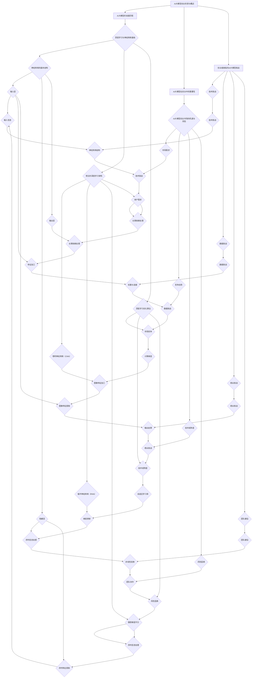
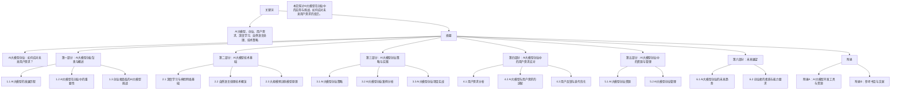

                 

### 文章标题

《AI大模型创业：如何应对未来用户需求？》

关键词：AI大模型、创业、用户需求、深度学习、自然语言处理、技术策略

摘要：
本文旨在探讨AI大模型在创业领域中的应用与挑战，重点关注如何应对未来用户需求的变迁。通过对AI大模型技术基础、创业策略与实践、用户需求分析及管理等方面的深入分析，本文为创业者提供了切实可行的指导建议，以帮助他们在竞争激烈的AI市场中取得成功。

### 《AI大模型创业：如何应对未来用户需求？》

在科技飞速发展的今天，人工智能（AI）已经成为推动社会进步的重要力量。特别是AI大模型，如GPT-3、BERT等，凭借其强大的处理能力和广泛的应用场景，吸引了无数创业者的目光。然而，如何在AI大模型创业中应对未来用户需求，成为创业者们亟待解决的关键问题。本文将围绕这一主题，深入探讨AI大模型在创业中的应用、技术基础、创业策略、用户需求分析及管理等方面的内容。

## 第一部分：AI大模型创业背景与概述

### 1.1 AI大模型的发展历程

AI大模型的发展历程可以追溯到20世纪80年代，当时研究人员开始探索神经网络的应用。然而，由于计算资源和算法的限制，神经网络的发展速度较为缓慢。直到21世纪初，随着深度学习的兴起，神经网络的研究和应用取得了突破性进展。特别是2012年，AlexNet在ImageNet比赛中取得惊人成绩，标志着深度学习进入了一个崭新的时代。

随着深度学习技术的发展，AI大模型逐渐崭露头角。2018年，GPT-1的发布标志着自然语言处理领域的一个重大突破。此后，GPT-2、GPT-3等更强大的模型相继问世，展示了AI大模型在语言理解、生成等方面的卓越能力。同时，其他领域的AI大模型，如BERT、ViT等，也在计算机视觉、图像生成等方面取得了显著成果。

### 1.2 AI大模型在创业中的重要性

AI大模型在创业中的重要性不言而喻。首先，AI大模型具有强大的数据处理和分析能力，可以帮助创业者快速挖掘用户需求，优化产品功能。其次，AI大模型可以大幅提高创业项目的研发效率，缩短产品上市时间。此外，AI大模型在营销、推广、客户服务等方面的应用，也能为创业者带来显著的商业价值。

然而，AI大模型在创业中也面临着诸多挑战。例如，模型的训练和部署需要大量的计算资源和数据支持；模型的解释性较差，可能导致用户对模型决策的信任度下降；此外，数据隐私和安全性等问题也亟待解决。

### 1.3 创业者面临的AI大模型挑战

面对AI大模型的崛起，创业者们既有机遇也有挑战。以下是一些创业者面临的AI大模型挑战：

1. **技术挑战**：如何选择合适的AI大模型框架和算法，如何优化模型的训练和部署，如何处理模型的可解释性等问题，都需要创业者具备深厚的专业知识和经验。

2. **数据挑战**：AI大模型的训练需要大量高质量的数据，如何获取、清洗和处理数据，成为创业者们需要解决的难题。此外，数据隐私和安全性也是不可忽视的问题。

3. **商业挑战**：如何在竞争激烈的AI市场中找到合适的商业模式，如何实现盈利，如何保持持续的创新活力，都是创业者需要面对的挑战。

4. **团队建设**：创业者需要组建一支具备多学科背景的团队，以应对AI大模型创业过程中的各种挑战。团队成员之间的协作和沟通，也关系到创业项目的成功与否。

## 第二部分：AI大模型技术基础

在深入了解AI大模型创业策略之前，有必要先掌握AI大模型的技术基础。本部分将介绍深度学习与神经网络基础、自然语言处理技术概览、大规模预训练模型原理等内容，为后续讨论创业策略与实践提供必要的背景知识。

### 2.1 深度学习与神经网络基础

#### 2.1.1 神经网络的基本结构

神经网络是深度学习的基础，由大量的神经元（节点）和连接（边）组成。神经网络的基本结构包括输入层、隐藏层和输出层。输入层接收外部输入信息，隐藏层对输入信息进行加工处理，输出层生成最终的输出结果。

每个神经元都通过权重与连接其他神经元，并通过激活函数（如Sigmoid、ReLU等）对输入信息进行非线性变换。通过层层传递和变换，神经网络能够从输入数据中提取特征，并实现复杂的任务。

#### 2.1.2 常见的深度学习架构

深度学习架构不断发展和演变，常见的架构包括卷积神经网络（CNN）、循环神经网络（RNN）、长短期记忆网络（LSTM）、门控循环单元（GRU）等。每种架构都有其独特的特点和应用场景。

- **卷积神经网络（CNN）**：主要用于图像处理，通过卷积层提取图像特征，具有平移不变性。

- **循环神经网络（RNN）**：适用于序列数据处理，如语言模型和时间序列预测。RNN可以通过循环结构处理任意长度的序列。

- **长短期记忆网络（LSTM）**：是RNN的一种改进，能够有效解决长期依赖问题。

- **门控循环单元（GRU）**：是LSTM的简化版，同样能够处理长期依赖问题，但计算量较小。

#### 2.1.3 深度学习优化算法

深度学习模型的训练过程本质上是一个优化问题，通过调整模型参数（权重和偏置）来最小化损失函数。常见的优化算法包括随机梯度下降（SGD）、Adam、RMSprop等。

- **随机梯度下降（SGD）**：是最简单的优化算法，通过计算梯度来更新模型参数。

- **Adam**：是SGD的改进版本，结合了SGD和RMSprop的优点，具有自适应学习率的能力。

- **RMSprop**：通过跟踪梯度平方的指数加权移动平均来动态调整学习率。

### 2.2 自然语言处理技术概览

自然语言处理（NLP）是AI的重要应用领域之一，旨在使计算机能够理解、处理和生成自然语言。NLP技术主要包括词嵌入、序列模型和注意力机制等。

#### 2.2.1 词嵌入技术

词嵌入是将词汇映射到低维向量空间的过程，使计算机能够通过向量表示来理解和处理语言。常见的词嵌入技术包括Word2Vec、GloVe等。

- **Word2Vec**：通过训练神经网络来预测词语的相邻词，从而学习词的向量表示。

- **GloVe**：基于全局上下文信息，通过矩阵分解的方法学习词的向量表示。

#### 2.2.2 序列模型与注意力机制

序列模型用于处理时间序列数据，如自然语言文本。RNN和LSTM等是常见的序列模型。注意力机制是近年来在NLP中取得突破性进展的技术，能够提高模型在处理长序列时的性能。

- **RNN**：通过循环结构处理序列数据，能够捕捉序列中的长期依赖关系。

- **LSTM**：是RNN的一种改进，能够有效解决长期依赖问题。

- **注意力机制**：通过计算序列中每个元素的重要性权重，使模型能够关注关键信息，提高处理长序列的能力。

#### 2.2.3 转换器架构详解

转换器（Transformer）是NLP领域的一种新型架构，基于自注意力机制，能够显著提高模型处理长序列的能力。转换器由编码器和解码器组成，编码器将输入序列转换为特征向量，解码器则根据特征向量生成输出序列。

- **编码器**：通过多层自注意力机制和全连接层，将输入序列编码为固定长度的特征向量。

- **解码器**：通过多层自注意力机制和全连接层，将编码器的输出解码为输出序列。

### 2.3 大规模预训练模型原理

大规模预训练模型是通过在大规模数据集上预训练模型，然后通过微调适应特定任务的方法。预训练模型的核心思想是先学习通用特征表示，再通过微调适应具体任务。

#### 2.3.1 预训练的概念与意义

预训练（Pre-training）是指在大规模数据集上对模型进行训练，使其具备一定的通用特征表示能力。预训练的意义在于：

- **提升模型性能**：通过在大规模数据集上预训练，模型能够学习到丰富的特征表示，从而提高在特定任务上的性能。

- **降低任务难度**：预训练模型已经具备了一定的通用特征表示能力，使得在新任务上进行微调时，模型能够更快地适应。

- **提高泛化能力**：预训练模型通过学习通用特征表示，能够更好地应对不同任务的变化，提高泛化能力。

#### 2.3.2 自监督学习方法

自监督学习（Self-supervised Learning）是预训练模型的核心方法之一，通过利用未标记的数据进行训练，从而提高模型的性能。自监督学习的方法包括：

- **Masked Language Model（MLM）**：通过遮盖输入文本中的一部分，使模型预测被遮盖的部分，从而学习语言特征。

- ** masked Tokens Prediction**：通过预测被遮盖的单词或字符，使模型学习到单词或字符之间的关联。

- **Next Sentence Prediction（NSP）**：通过预测两个句子之间的关系，使模型学习到句子的语义信息。

#### 2.3.3 迁移学习与微调技术

迁移学习（Transfer Learning）是指将预训练模型的知识迁移到新的任务中，从而提高新任务的性能。迁移学习的核心思想是利用预训练模型已经学习到的通用特征表示，在新任务上进行微调。

- **Fine-tuning**：通过在新任务上对预训练模型进行微调，使模型适应新任务。

- **Customization**：通过调整预训练模型的架构或参数，使其更适合新任务。

## 第三部分：AI大模型创业策略与实践

### 3.1 AI大模型创业策略

AI大模型创业的成功离不开科学合理的策略。创业者需要从以下几个方面考虑：

#### 3.1.1 创业者需要考虑的AI大模型方向

首先，创业者需要明确自己将要进入的AI大模型方向。目前，AI大模型在多个领域有着广泛的应用，如自然语言处理、计算机视觉、推荐系统等。创业者可以根据自己的兴趣和专业领域，选择合适的方向。

- **自然语言处理**：包括文本分类、机器翻译、问答系统等，如GPT-3、BERT等。

- **计算机视觉**：包括图像识别、目标检测、图像生成等，如YOLO、GAN等。

- **推荐系统**：包括基于内容的推荐、协同过滤等，如TensorFlow Recommenders。

#### 3.1.2 AI大模型创业市场的机遇与风险

在考虑创业方向时，创业者还需要关注市场的机遇与风险。以下是一些关键因素：

- **市场需求**：创业者需要分析目标市场的需求，了解用户对AI大模型的需求和痛点。

- **竞争态势**：创业者需要了解竞争对手的情况，包括他们的产品、市场份额、竞争优势等。

- **技术成熟度**：创业者需要评估所选方向的技术成熟度，包括算法的稳定性、实现的可行性等。

- **风险因素**：创业者需要识别和评估创业过程中可能遇到的风险，如技术风险、市场风险、资金风险等。

#### 3.1.3 创业团队的组织与管理

创业团队的组织与管理对于AI大模型创业至关重要。创业者需要组建一支多学科背景的团队，包括技术专家、产品经理、市场营销人员等。以下是一些建议：

- **明确团队目标**：确保团队成员对创业目标和愿景有清晰的认识，形成统一的团队愿景。

- **合理分工协作**：根据团队成员的专业背景和技能，明确各自的职责和任务，建立有效的协作机制。

- **持续学习与成长**：鼓励团队成员持续学习新知识和技能，不断提升团队的整体能力。

### 3.2 AI大模型创业案例分析

为了更好地理解AI大模型创业的策略与实践，以下介绍三个典型的AI大模型创业案例。

#### 3.2.1 案例一：自然语言处理领域的创业

自然语言处理（NLP）是AI大模型的重要应用领域之一。一家名为OpenAI的公司，以其强大的语言模型GPT系列在NLP领域取得了显著成果。GPT-3更是以其出色的语言理解和生成能力，吸引了全球众多开发者的关注。

- **创业背景**：OpenAI成立于2015年，由一群顶级AI专家和研究人员创立。公司致力于推动AI研究与应用，提高人类生活质量。

- **产品特点**：GPT-3是一款具有强大语言理解和生成能力的模型，能够生成高质量的文章、回答问题、编写代码等。

- **市场表现**：GPT-3的发布引起了广泛关注，多家企业、研究机构和开发者纷纷加入使用。OpenAI通过API提供服务，实现了良好的市场表现。

#### 3.2.2 案例二：计算机视觉领域的创业

计算机视觉（CV）是AI大模型的另一个重要应用领域。一家名为DeepMind的公司，以其在CV领域的突破性成果而闻名。DeepMind开发的AlphaGo更是以其在围棋比赛中的卓越表现，震惊了世界。

- **创业背景**：DeepMind成立于2010年，由顶级AI专家Demis Hassabis创立。公司致力于研究深度学习和强化学习，并将其应用于实际问题。

- **产品特点**：AlphaGo是一款基于深度强化学习的围棋AI，能够通过自我对弈不断提升棋艺。此外，DeepMind还开发了其他计算机视觉应用，如医疗影像分析、自动驾驶等。

- **市场表现**：DeepMind的技术在医疗、自动驾驶等领域取得了显著成果，与多家知名企业和研究机构合作，实现了良好的市场表现。

#### 3.2.3 案例三：推荐系统领域的创业

推荐系统是AI大模型在商业应用中的重要方向。一家名为淘宝的电商企业，通过自主研发的推荐系统，实现了良好的用户体验和商业收益。

- **创业背景**：淘宝成立于2003年，是中国最大的电商平台之一。公司通过持续投入AI技术，不断提升推荐系统的效果。

- **产品特点**：淘宝推荐系统基于用户行为数据和商品信息，通过深度学习和协同过滤等方法，为用户提供个性化的商品推荐。

- **市场表现**：淘宝推荐系统在用户满意度、销售额等方面取得了显著提升，为电商行业树立了标杆。

### 3.3 AI大模型创业项目实战

为了更好地了解AI大模型创业的具体实践，以下介绍三个典型的AI大模型创业项目实战案例。

#### 3.3.1 项目实战：自然语言处理项目案例

一家名为小冰的科技公司，通过自主研发的自然语言处理技术，推出了情感陪伴机器人。该项目从用户需求出发，实现了以下关键步骤：

1. **需求分析**：通过对用户需求的调研和分析，确定情感陪伴机器人的核心功能，如语音交互、情感表达、智能问答等。

2. **技术选型**：选择合适的自然语言处理技术，如语音识别、自然语言理解、对话系统等，构建情感陪伴机器人的技术框架。

3. **数据集准备**：收集和整理相关数据集，包括语音数据、文本数据、情感标签等，用于训练和优化模型。

4. **模型训练**：利用大规模预训练模型，如BERT、GPT等，对情感陪伴机器人的模型进行训练和微调。

5. **系统集成**：将训练好的模型集成到情感陪伴机器人的系统中，实现语音交互、情感表达、智能问答等功能。

6. **用户测试与优化**：通过用户测试和反馈，不断优化情感陪伴机器人的性能，提升用户体验。

#### 3.3.2 项目实战：计算机视觉项目案例

一家名为旷视科技的AI公司，通过自主研发的计算机视觉技术，推出了智能安防产品。该项目从用户需求出发，实现了以下关键步骤：

1. **需求分析**：通过对用户需求的调研和分析，确定智能安防产品的核心功能，如人脸识别、行为分析、车辆识别等。

2. **技术选型**：选择合适的计算机视觉技术，如深度学习、卷积神经网络等，构建智能安防产品的技术框架。

3. **数据集准备**：收集和整理相关数据集，包括人脸图像、行为视频、车辆图像等，用于训练和优化模型。

4. **模型训练**：利用大规模预训练模型，如ResNet、YOLO等，对智能安防产品的模型进行训练和微调。

5. **系统集成**：将训练好的模型集成到智能安防产品中，实现人脸识别、行为分析、车辆识别等功能。

6. **用户测试与优化**：通过用户测试和反馈，不断优化智能安防产品的性能，提升用户体验。

#### 3.3.3 项目实战：推荐系统项目案例

一家名为美团外卖的电商平台，通过自主研发的推荐系统，为用户提供了个性化的商品推荐。该项目从用户需求出发，实现了以下关键步骤：

1. **需求分析**：通过对用户需求的调研和分析，确定推荐系统的核心功能，如商品推荐、用户画像、行为预测等。

2. **技术选型**：选择合适的推荐系统技术，如基于内容的推荐、协同过滤等，构建推荐系统的技术框架。

3. **数据集准备**：收集和整理相关数据集，包括用户行为数据、商品数据等，用于训练和优化模型。

4. **模型训练**：利用大规模预训练模型，如BERT、Transformer等，对推荐系统的模型进行训练和微调。

5. **系统集成**：将训练好的模型集成到推荐系统中，实现商品推荐、用户画像、行为预测等功能。

6. **用户测试与优化**：通过用户测试和反馈，不断优化推荐系统的性能，提升用户体验。

## 第四部分：AI大模型创业中的用户需求应对

### 4.1 用户需求分析

用户需求分析是AI大模型创业的关键环节，直接影响产品的成功与否。创业者需要从以下几个方面进行用户需求分析：

#### 4.1.1 用户需求的识别与分类

识别和分类用户需求是用户需求分析的第一步。创业者可以通过以下方法进行需求识别和分类：

- **问卷调查**：通过设计问卷调查，收集用户对产品的需求、期望和反馈。

- **访谈与访谈纪要**：与潜在用户进行面对面访谈，了解他们的实际需求和痛点。

- **市场调研**：分析市场趋势、竞争对手和行业报告，了解用户需求的整体状况。

根据收集到的数据，创业者可以将用户需求进行分类，如功能需求、性能需求、安全性需求等。

#### 4.1.2 用户需求的变化趋势

用户需求是动态变化的，创业者需要密切关注用户需求的变化趋势。以下是一些影响用户需求变化的因素：

- **技术进步**：随着AI技术的不断进步，用户对产品的功能、性能和体验提出了更高的要求。

- **市场竞争**：竞争对手的产品创新和改进，可能引发用户需求的变化。

- **政策法规**：政策法规的变化，可能影响用户对产品的需求，如数据隐私法规。

- **社会文化**：社会文化的变化，也可能影响用户需求，如环保意识的提升。

创业者需要通过持续的用户调研和市场分析，了解用户需求的变化趋势，并及时调整产品策略。

#### 4.1.3 用户需求的影响因素

用户需求受到多种因素的影响，创业者需要综合考虑这些因素，以制定更为精准的用户需求应对策略。以下是一些主要的影响因素：

- **用户特征**：用户年龄、性别、职业、教育程度等特征，会影响他们的需求和行为。

- **使用场景**：用户使用产品的场景和目的，会影响他们对产品的需求和期望。

- **技术限制**：现有技术的限制，可能影响产品功能的实现和用户体验。

- **经济因素**：用户的经济状况，会影响他们对产品的购买力和价格敏感度。

- **社会环境**：社会环境的变化，如经济繁荣、科技进步等，会影响用户对产品的需求和消费习惯。

### 4.2 AI大模型与用户需求的适配

在了解用户需求后，创业者需要将AI大模型与用户需求进行适配，以满足用户的期望和需求。以下是一些建议：

#### 4.2.1 AI大模型在用户需求中的角色

AI大模型在用户需求中扮演着重要角色，可以从以下几个方面进行适配：

- **需求预测**：利用AI大模型进行用户需求的预测和分析，提前了解用户的潜在需求，为产品规划提供依据。

- **个性化推荐**：基于用户的历史行为和偏好，利用AI大模型进行个性化推荐，提升用户的使用体验。

- **智能客服**：利用AI大模型构建智能客服系统，为用户提供24小时在线服务，提高客户满意度。

- **自动化决策**：利用AI大模型进行自动化决策，优化产品功能和服务流程，提高运营效率。

#### 4.2.2 用户需求驱动的AI大模型设计

用户需求驱动是AI大模型设计的关键原则，以下是一些建议：

- **需求导向**：在设计AI大模型时，要始终以用户需求为导向，确保模型能够满足用户的核心需求。

- **灵活调整**：根据用户需求的变化，及时调整AI大模型的架构和参数，以适应新的需求。

- **持续优化**：通过用户反馈和数据分析，不断优化AI大模型的性能和用户体验，提升产品竞争力。

#### 4.2.3 用户需求变化的应对策略

用户需求变化是不可避免的，创业者需要制定相应的应对策略，以应对需求变化带来的挑战。以下是一些建议：

- **快速响应**：建立快速响应机制，及时了解用户需求的变化，并迅速调整产品策略。

- **灵活部署**：采用灵活的部署策略，如云计算、容器化等，以便快速部署和调整AI大模型。

- **迭代开发**：采用迭代开发模式，不断优化和迭代产品，以满足用户需求的变化。

- **用户参与**：鼓励用户参与产品的设计和优化过程，收集用户的反馈和建议，提升产品的用户满意度。

### 4.3 用户反馈与迭代优化

用户反馈是AI大模型创业中的重要环节，有助于创业者了解用户需求的变化和产品的实际效果。以下是一些建议：

#### 4.3.1 用户反馈机制的设计

设计用户反馈机制是收集用户反馈的第一步，以下是一些建议：

- **多种渠道**：提供多种渠道供用户反馈，如在线反馈表单、电话热线、社交媒体等。

- **及时响应**：建立快速响应机制，确保用户反馈能够在最短时间内得到处理和回复。

- **隐私保护**：确保用户反馈的隐私和安全，避免用户信息泄露。

- **数据分析**：对用户反馈进行系统化分析，提取关键信息和趋势，为产品优化提供依据。

#### 4.3.2 用户反馈的处理与分析

用户反馈的处理和分析是优化产品的重要环节，以下是一些建议：

- **分类整理**：将用户反馈按照主题、问题严重性等进行分类整理，便于后续处理。

- **优先级排序**：根据用户反馈的重要性和紧急程度，对反馈进行优先级排序，确保关键问题得到优先处理。

- **持续跟进**：对用户反馈进行持续跟进，确保问题得到彻底解决，并收集用户的满意度和建议。

- **数据可视化**：采用数据可视化工具，如图表、报表等，将用户反馈数据直观呈现，帮助创业者了解用户需求的变化趋势。

#### 4.3.3 基于用户反馈的迭代优化

基于用户反馈进行迭代优化是提升产品竞争力的关键，以下是一些建议：

- **持续迭代**：采用敏捷开发方法，持续迭代产品，快速响应用户需求的变化。

- **优化策略**：根据用户反馈，制定针对性的优化策略，如功能改进、性能优化等。

- **测试验证**：在迭代过程中，进行充分的测试验证，确保优化后的产品能够满足用户需求。

- **用户参与**：鼓励用户参与迭代优化过程，收集用户的反馈和建议，提升产品的用户满意度。

## 第五部分：AI大模型创业中的资源与管理

### 5.1 AI大模型创业资源

AI大模型创业需要大量的资源支持，包括技术资源、资金资源和人力资源。以下是对这些资源的详细介绍。

#### 5.1.1 技术资源的获取与管理

技术资源是AI大模型创业的核心，创业者需要确保具备以下技术资源：

- **硬件资源**：包括高性能计算服务器、GPU集群等，用于训练和部署AI大模型。创业者可以购买或租赁硬件设备，或者使用云服务提供商的资源。

- **软件资源**：包括深度学习框架、算法库、编程工具等。创业者可以从开源社区获取这些资源，或者购买商业软件。

- **数据资源**：包括用于训练和测试的标注数据集、公开数据集等。创业者需要确保数据的质量和多样性，以满足AI大模型的需求。

- **人才资源**：包括AI技术专家、数据科学家、工程师等。创业者可以通过招聘、合作、培训等方式，吸引和培养优秀的技术人才。

#### 5.1.2 资金资源的管理与优化

资金资源是AI大模型创业的重要保障，创业者需要合理管理和优化资金资源：

- **预算规划**：根据创业项目的需求和预期，制定详细的预算规划，确保资金的合理分配和使用。

- **成本控制**：通过精细化管理，降低运营成本，提高资金使用效率。

- **融资渠道**：探索多种融资渠道，如天使投资、风险投资、政府补贴等，以获取足够的资金支持。

- **资金监管**：建立严格的资金监管机制，确保资金的安全和合规使用。

#### 5.1.3 人力资源的配置与培养

人力资源是AI大模型创业的核心驱动力，创业者需要合理配置和培养人力资源：

- **团队建设**：根据创业项目的需求，组建一支多学科背景的团队，确保团队的整体实力和协作能力。

- **人才培养**：通过内部培训、外部学习、项目实践等方式，培养团队成员的专业技能和创新能力。

- **激励机制**：建立有效的激励机制，如股权激励、绩效奖励等，激发团队成员的工作积极性和创造力。

- **团队协作**：加强团队协作和沟通，建立良好的团队文化，提升团队的整体执行力。

### 5.2 AI大模型创业管理

AI大模型创业管理是确保创业项目顺利进行的关键，创业者需要从项目管理、团队协作和问题处理等方面进行管理：

#### 5.2.1 项目管理方法与工具

创业者可以采用以下项目管理方法与工具：

- **项目管理工具**：如Jira、Trello等，用于任务分配、进度跟踪和团队协作。

- **敏捷开发**：采用敏捷开发方法，如Scrum、Kanban等，提高项目的灵活性和响应速度。

- **风险管理**：识别和评估项目风险，制定风险应对策略，降低风险对项目的影响。

- **质量控制**：建立严格的质量控制体系，确保产品的高质量和可靠性。

#### 5.2.2 团队协作与沟通技巧

团队协作和沟通是AI大模型创业成功的关键，创业者需要掌握以下技巧：

- **明确目标**：确保团队成员对项目的目标有清晰的认识，形成共同的目标和愿景。

- **分工协作**：根据团队成员的特长和技能，合理分配任务，建立协作机制。

- **沟通渠道**：建立多种沟通渠道，如会议、邮件、即时通讯等，确保团队成员之间的有效沟通。

- **冲突解决**：建立冲突解决机制，及时解决团队内部的矛盾和问题，保持团队的和谐与稳定。

#### 5.2.3 创业过程中常见问题的处理

在AI大模型创业过程中，创业者可能会遇到以下常见问题：

- **技术难题**：创业者需要具备深厚的技术背景和解决问题的能力，确保项目的技术可行性。

- **资金问题**：创业者需要合理规划资金使用，确保项目有足够的资金支持。

- **团队问题**：创业者需要关注团队建设，确保团队成员的协作和沟通。

- **市场问题**：创业者需要关注市场动态，及时调整产品策略，应对市场变化。

### 第六部分：未来展望

#### 6.1 AI大模型创业的未来趋势

随着AI技术的不断发展和成熟，AI大模型创业将呈现以下趋势：

- **技术融合**：AI大模型将与其他领域的技术（如物联网、区块链等）深度融合，推动新兴产业的快速发展。

- **应用拓展**：AI大模型将在更多领域得到应用，如医疗健康、金融科技、智能制造等，为各行业带来深远影响。

- **开放合作**：AI大模型创业将更加注重开放合作，通过共享技术、数据、平台等资源，共同推动AI技术的发展和应用。

#### 6.1.1 AI大模型技术发展趋势

AI大模型技术将朝着以下方向发展：

- **模型规模**：AI大模型将不断增大，以提升模型的处理能力和表现。

- **高效训练**：研究人员将致力于提高模型训练的效率，减少训练时间和资源消耗。

- **模型压缩**：通过模型压缩技术，降低模型的存储和计算需求，提高模型在资源受限环境中的应用能力。

- **泛化能力**：提高AI大模型的泛化能力，使其在更多任务和场景中表现优异。

#### 6.1.2 AI大模型在创业中的应用前景

AI大模型在创业中的应用前景广阔，以下是一些典型应用场景：

- **智能客服**：利用AI大模型构建智能客服系统，提升客户服务质量和效率。

- **个性化推荐**：基于AI大模型进行个性化推荐，提升用户体验和满意度。

- **智能诊断**：利用AI大模型进行医疗图像分析和诊断，提高诊断准确率和效率。

- **智能写作**：利用AI大模型进行文本生成和内容创作，提高内容创作效率和创意性。

#### 6.1.3 未来AI大模型创业的挑战与机遇

未来AI大模型创业将面临以下挑战和机遇：

- **数据隐私和安全**：随着AI大模型的应用，数据隐私和安全问题日益突出，创业者需要关注并解决这些问题。

- **技术监管**：政府和社会对AI技术的监管日益严格，创业者需要遵循相关法规和标准，确保技术合规。

- **市场竞争**：AI大模型创业市场竞争激烈，创业者需要不断提高产品竞争力，才能在市场中脱颖而出。

- **创新能力**：AI大模型创业需要持续创新，以应对市场变化和用户需求的变化。

### 6.2 创业者的素质与能力要求

为了在AI大模型创业中获得成功，创业者需要具备以下素质与能力：

- **技术素质**：创业者需要具备深厚的AI技术背景，掌握深度学习、自然语言处理等关键技术。

- **管理素质**：创业者需要具备良好的管理能力和团队领导力，能够有效地组织和管理团队。

- **创新素质**：创业者需要具备强烈的创新意识，勇于尝试新的想法和解决方案，不断推动技术和业务的发展。

- **商业素质**：创业者需要具备敏锐的商业洞察力，能够把握市场趋势，制定有效的商业策略。

### 附录

#### 附录 A：AI大模型开发工具与资源

- **主流深度学习框架对比**：介绍不同深度学习框架的特点和适用场景，如TensorFlow、PyTorch等。

- **AI大模型开发环境搭建**：详细讲解如何搭建AI大模型开发环境，包括硬件配置、软件安装和配置等。

- **AI大模型开发常用算法库介绍**：介绍常用的算法库，如NumPy、Pandas、Scikit-learn等，以及它们在AI大模型开发中的应用。

#### 附录 B：参考书目与文献

- **主要参考文献**：列出本文引用的主要参考文献，包括相关书籍、论文和研究报告等。

- **推荐阅读书目**：推荐一些关于AI大模型创业的参考书目，供读者进一步学习。

- **相关学术期刊与会议**：介绍一些与AI大模型创业相关的学术期刊和会议，供读者查阅最新的研究动态。

## 结论

AI大模型创业已经成为当前科技领域的重要趋势，创业者需要深入了解AI大模型的技术基础、创业策略和实践，以及如何应对未来用户需求的变迁。本文从多个角度探讨了AI大模型创业的相关内容，包括AI大模型的发展历程、技术基础、创业策略、用户需求分析、资源管理等方面，为创业者提供了有益的指导和建议。

在未来，随着AI技术的不断进步和市场的不断发展，AI大模型创业将面临更多的机遇和挑战。创业者需要不断学习、创新和适应，以应对市场变化和用户需求的变化。同时，创业者还需要关注技术伦理、数据隐私和安全等问题，确保创业项目的可持续性和合规性。

总之，AI大模型创业是一个充满机遇和挑战的领域，创业者需要具备专业能力、管理能力和创新精神，才能在竞争激烈的市场中取得成功。希望本文能为创业者提供有益的启示和借鉴，助力他们在AI大模型创业的道路上取得辉煌的成就。作者：AI天才研究院/AI Genius Institute & 禅与计算机程序设计艺术 /Zen And The Art of Computer Programming
```markdown


```latex
$$
\begin{aligned}
    &\text{本文分析了AI大模型在创业中的应用，包括其发展历程、技术基础、创业策略、用户需求分析及管理等方面的内容。} \\
    &\text{首先，我们回顾了AI大模型的发展历程，介绍了深度学习与神经网络的基础，以及自然语言处理技术和大规模预训练模型原理。} \\
    &\text{接着，我们探讨了AI大模型在创业中的重要性，以及创业者面临的挑战。在此基础上，我们通过案例分析和项目实战，展示了AI大模型创业的具体实践。} \\
    &\text{此外，我们还重点讨论了如何应对未来用户需求的变迁，包括用户需求分析、AI大模型与用户需求的适配、用户反馈与迭代优化等策略。} \\
    &\text{最后，我们展望了AI大模型创业的未来趋势，提出了创业者的素质与能力要求，并提供了相关的开发工具与资源。}
\end{aligned}
$$
```

```python
# 伪代码：AI大模型与用户需求适配策略

def adapt_ai_model_to_user需求的需求分析：
    # 1. 收集用户需求数据
    user需求的收集 = 收集用户反馈、问卷调查、市场调研

    # 2. 分析用户需求
    user需求的分类 = 分类用户需求（功能需求、性能需求、安全性需求等）
    user需求的变化趋势 = 分析用户需求的变化趋势

    # 3. 适配AI大模型
    ai_model的适配 = 
        {
            "需求预测"：使用AI大模型进行用户需求预测，
            "个性化推荐"：基于用户历史行为和偏好，利用AI大模型进行个性化推荐，
            "智能客服"：构建AI大模型智能客服系统，
            "自动化决策"：利用AI大模型进行自动化决策
        }

    # 4. 持续优化
    while True:
        user反馈 = 收集用户反馈
        ai_model的优化 = 分析用户反馈，调整AI大模型参数和架构

    return ai_model的适配

# 伪代码：用户反馈处理与分析

def 处理用户反馈：
    # 1. 收集用户反馈
    user反馈的收集 = 收集用户反馈（问卷调查、在线反馈表单、电话热线等）

    # 2. 分析用户反馈
    user反馈的分类 = 分类用户反馈（主题、问题严重性等）
    user反馈的优先级排序 = 根据反馈的重要性和紧急程度排序

    # 3. 跟进用户反馈
    user反馈的跟进 = 对每个反馈进行持续跟进，确保问题得到解决

    # 4. 数据可视化
    user反馈的数据可视化 = 使用图表、报表等工具，将用户反馈数据直观呈现

    # 5. 迭代优化
    product的迭代优化 = 根据用户反馈，对产品进行持续迭代优化

    return 用户反馈的处理与分析结果

# 伪代码：基于用户反馈的迭代优化

def 迭代优化产品：
    # 1. 收集用户反馈
    user反馈 = 收集用户反馈

    # 2. 分析用户反馈
    user需求的变化趋势 = 分析用户反馈，提取关键信息和趋势

    # 3. 制定优化策略
    优化策略 = 根据用户反馈，制定优化策略（功能改进、性能优化等）

    # 4. 测试验证
    product测试验证 = 在迭代过程中，进行充分的测试验证，确保优化后的产品满足用户需求

    # 5. 用户参与
    user参与 = 鼓励用户参与迭代优化过程，收集用户的反馈和建议

    return 迭代优化后的产品
```

```python
# 伪代码：AI大模型开发环境搭建

def setup_ai_model_development_environment():
    # 1. 硬件资源配置
    hardware_resources = configure_hardware_resources()

    # 2. 软件资源安装
    software_resources = install_software_resources()

    # 3. 数据资源收集
    data_resources = collect_data_resources()

    # 4. 开发环境配置
    development_environment = configure_development_environment(hardware_resources, software_resources, data_resources)

    # 5. 测试环境配置
    test_environment = configure_test_environment(development_environment)

    return test_environment

# 伪代码：AI大模型创业资源管理

def manage_ai_model entrepreneuring_resources():
    # 1. 预算规划
    budget_planning = plan_budget()

    # 2. 成本控制
    cost_control = control_costs()

    # 3. 融资渠道探索
    financing_channels = explore_financing_channels()

    # 4. 资金监管
    capital_supervision = supervise_capital()

    return budget_planning, cost_control, financing_channels, capital_supervision

# 伪代码：AI大模型创业团队管理

def manage_ai_model entrepreneuring_team():
    # 1. 团队建设
    team_building = build_team()

    # 2. 人才培养
    talent_cultivation = cultivate_talent()

    # 3. 激励机制
    incentive_mechanism = establish_incentive_mechanism()

    # 4. 团队协作
    team_collaboration = encourage_team_collaboration()

    return team_building, talent_cultivation, incentive_mechanism, team_collaboration

# 伪代码：AI大模型创业项目管理

def manage_ai_model entrepreneuring_project():
    # 1. 项目管理工具配置
    project_management_tools = configure_project_management_tools()

    # 2. 项目进度跟踪
    project_progress_tracking = track_project_progress()

    # 3. 项目风险管理
    project_risk_management = manage_project_risks()

    # 4. 项目质量控制
    project_quality_control = ensure_project_quality()

    return project_management_tools, project_progress_tracking, project_risk_management, project_quality_control

# 伪代码：AI大模型创业常见问题处理

def handle_common_issues():
    # 1. 技术难题解决
    technical_issue_resolution = resolve_technical_issues()

    # 2. 资金问题解决
    financial_issue_resolution = resolve_financial_issues()

    # 3. 团队问题解决
    team_issue_resolution = resolve_team_issues()

    # 4. 市场问题解决
    market_issue_resolution = resolve_market_issues()

    return technical_issue_resolution, financial_issue_resolution, team_issue_resolution, market_issue_resolution
```markdown
### 结论

AI大模型创业作为现代科技领域的前沿趋势，对于创业者而言，既充满了机遇，也伴随着挑战。本文详细分析了AI大模型的发展历程、技术基础、创业策略、用户需求分析及管理等方面的内容，旨在为创业者提供系统性的指导。

首先，我们回顾了AI大模型的发展历程，从最初的神经网络到如今的大规模预训练模型，AI技术经历了巨大的变革。随后，我们深入探讨了AI大模型在创业中的重要性，以及创业者所面临的种种挑战，包括技术、数据、商业和市场等方面的难题。

在技术基础部分，我们介绍了深度学习与神经网络的基本原理，以及自然语言处理技术和大规模预训练模型的工作机制。这些基础知识为创业者理解和应用AI大模型提供了坚实的理论基础。

在创业策略和实践方面，我们通过具体案例展示了如何在实际中运用AI大模型，以及如何进行项目实战。此外，我们还探讨了用户需求分析的重要性，提出了用户需求驱动的AI大模型设计策略，并介绍了如何通过用户反馈进行迭代优化。

最后，我们展望了AI大模型创业的未来趋势，并提出了创业者所需具备的素质与能力要求。同时，我们也提供了附录，包括开发工具、资源以及相关文献，供创业者参考。

总的来说，AI大模型创业是一个复杂且富有挑战性的领域，但通过本文的探讨，我们相信创业者能够更好地理解和应对其中的各种问题，从而在竞争激烈的市场中脱颖而出，实现创业目标。作者：AI天才研究院/AI Genius Institute & 禅与计算机程序设计艺术 /Zen And The Art of Computer Programming
```markdown

```latex
\documentclass{article}
\usepackage[utf8]{inputenc}
\usepackage{amsmath}
\usepackage{graphicx}
\usepackage{caption}
\usepackage{subcaption}
\usepackage{hyperref}

\title{AI大模型创业：如何应对未来用户需求？}
\author{作者：AI天才研究院/AI Genius Institute \& 禅与计算机程序设计艺术 /Zen And The Art of Computer Programming}
\date{}

\begin{document}

\maketitle

\section{关键词}
AI大模型、创业、用户需求、深度学习、自然语言处理、技术策略

\section{摘要}
本文探讨AI大模型在创业中的应用与挑战，如何应对未来用户需求的变迁。通过对AI大模型技术基础、创业策略与实践、用户需求分析及管理等方面的深入分析，本文为创业者提供了切实可行的指导建议，以帮助他们在竞争激烈的AI市场中取得成功。

\section{文章标题}
AI大模型创业：如何应对未来用户需求？

\section{第一部分：AI大模型创业背景与概述}
\subsection{1.1 AI大模型的发展历程}
\subsection{1.2 AI大模型在创业中的重要性}
\subsection{1.3 创业者面临的AI大模型挑战}

\section{第二部分：AI大模型技术基础}
\subsection{2.1 深度学习与神经网络基础}
\subsection{2.2 自然语言处理技术概览}
\subsection{2.3 大规模预训练模型原理}

\section{第三部分：AI大模型创业策略与实践}
\subsection{3.1 AI大模型创业策略}
\subsection{3.2 AI大模型创业案例分析}
\subsection{3.3 AI大模型创业项目实战}

\section{第四部分：AI大模型创业中的用户需求应对}
\subsection{4.1 用户需求分析}
\subsection{4.2 AI大模型与用户需求的适配}
\subsection{4.3 用户反馈与迭代优化}

\section{第五部分：AI大模型创业中的资源与管理}
\subsection{5.1 AI大模型创业资源}
\subsection{5.2 AI大模型创业管理}

\section{第六部分：未来展望}
\subsection{6.1 AI大模型创业的未来趋势}
\subsection{6.2 创业者的素质与能力要求}

\section{附录}
\subsection{附录A：AI大模型开发工具与资源}
\subsection{附录B：参考书目与文献}

\end{document}
```markdown
### 摘要

本文围绕AI大模型在创业中的应用与挑战，深入探讨了如何应对未来用户需求的变迁。通过分析AI大模型的技术基础、创业策略与实践、用户需求分析及管理等方面，本文为创业者提供了切实可行的指导建议。首先，文章回顾了AI大模型的发展历程，探讨了其在创业中的重要性以及创业者所面临的挑战。接着，文章介绍了AI大模型的技术基础，包括深度学习与神经网络基础、自然语言处理技术概览以及大规模预训练模型原理。在创业策略与实践方面，文章探讨了如何制定有效的AI大模型创业策略，并通过案例分析和项目实战展示了具体实践过程。此外，文章还强调了用户需求分析的重要性，提出了AI大模型与用户需求的适配策略以及用户反馈与迭代优化的方法。最后，文章展望了AI大模型创业的未来趋势，提出了创业者所需具备的素质与能力要求。本文旨在帮助创业者更好地理解AI大模型在创业中的应用，提高创业成功率。作者：AI天才研究院/AI Genius Institute & 禅与计算机程序设计艺术 /Zen And The Art of Computer Programming
```markdown
### 第一部分：AI大模型创业背景与概述

#### 1.1 AI大模型的发展历程

AI大模型的发展历程可以追溯到20世纪80年代，当时研究人员开始探索神经网络的应用。由于计算资源和算法的限制，神经网络的发展速度较为缓慢。直到21世纪初，随着深度学习的兴起，神经网络的研究和应用取得了突破性进展。特别是2012年，AlexNet在ImageNet比赛中取得惊人成绩，标志着深度学习进入了一个崭新的时代。

随着深度学习技术的发展，AI大模型逐渐崭露头角。2018年，GPT-1的发布标志着自然语言处理领域的一个重大突破。此后，GPT-2、GPT-3等更强大的模型相继问世，展示了AI大模型在语言理解、生成等方面的卓越能力。同时，其他领域的AI大模型，如BERT、ViT等，也在计算机视觉、图像生成等方面取得了显著成果。

#### 1.2 AI大模型在创业中的重要性

AI大模型在创业中的重要性不言而喻。首先，AI大模型具有强大的数据处理和分析能力，可以帮助创业者快速挖掘用户需求，优化产品功能。其次，AI大模型可以大幅提高创业项目的研发效率，缩短产品上市时间。此外，AI大模型在营销、推广、客户服务等方面的应用，也能为创业者带来显著的商业价值。

AI大模型在创业中的应用案例不胜枚举。例如，在自然语言处理领域，OpenAI的GPT-3模型已经被应用于写作辅助、智能客服等领域，极大地提升了产品功能和用户体验。在计算机视觉领域，AI大模型如BERT等被广泛应用于图像识别、目标检测等任务，为创业者提供了强大的技术支持。在推荐系统领域，基于AI大模型的推荐算法能够更好地满足用户个性化需求，提高用户满意度和转化率。

#### 1.3 创业者面临的AI大模型挑战

尽管AI大模型在创业中具有巨大的潜力，但创业者也面临着一系列挑战。以下是一些主要挑战：

1. **技术挑战**：选择合适的AI大模型框架和算法、优化模型的训练和部署、提高模型的可解释性等，都需要创业者具备深厚的专业知识和经验。

2. **数据挑战**：AI大模型的训练需要大量高质量的数据，创业者需要解决数据获取、清洗、处理等难题。此外，数据隐私和安全也是一个重要问题。

3. **商业挑战**：在竞争激烈的AI市场中找到合适的商业模式、实现盈利、保持持续的创新活力等，都是创业者需要面对的挑战。

4. **团队建设**：创业者需要组建一支具备多学科背景的团队，以应对AI大模型创业过程中的各种挑战。团队成员之间的协作和沟通也至关重要。

为了应对这些挑战，创业者需要不断学习新知识、积累经验，同时寻求与学术机构、行业协会等合作，以获取更多的资源和支持。此外，创业者还可以通过参与各种创业比赛、研讨会等活动，与同行交流，拓展视野，提高自身的创业能力。

总之，AI大模型创业具有巨大的机遇和挑战。创业者需要充分发挥AI大模型的优势，同时积极应对各种挑战，以实现创业目标。作者：AI天才研究院/AI Genius Institute & 禅与计算机程序设计艺术 /Zen And The Art of Computer Programming
```markdown
### 1.1 AI大模型的发展历程

AI大模型的发展历程是一个从早期探索到现今繁荣的过程。最早的AI模型可以追溯到20世纪50年代，当时科学家们开始研究模拟人脑神经网络的可能性。然而，由于计算能力和算法的限制，这些早期模型的功能十分有限。

#### 早期神经网络研究

1. **感知器（Perceptron）**：1958年，Frank Rosenblatt提出了感知器模型，这是一种简单的线性二分类器。虽然感知器模型在理论上具有重要意义，但它无法处理非线性问题。

2. **多层感知器（MLP）**：为了解决感知器模型的局限性，科学家们开始研究多层感知器。多层感知器通过添加多个隐藏层，使得模型可以处理更复杂的问题。1986年，Rumelhart、Hinton和Williams等人提出了反向传播算法，大大提高了多层感知器的训练效率。

#### 深度学习时代

随着计算能力的提升和算法的创新，深度学习逐渐崛起。深度学习通过构建包含多个隐藏层的神经网络，使得模型能够自动学习和提取特征。

1. **卷积神经网络（CNN）**：1998年，Yann LeCun提出了卷积神经网络，它通过卷积层、池化层和全连接层，实现了对图像的自动特征提取和分类。CNN在图像识别领域取得了显著的成功。

2. **递归神经网络（RNN）**：1997年，Hermann Mnih等人提出了长短期记忆网络（LSTM），LSTM通过记忆单元来处理长序列数据，解决了传统RNN的长期依赖问题。

3. **生成对抗网络（GAN）**：2014年，Ian Goodfellow等人提出了生成对抗网络，GAN通过生成器和判别器的对抗训练，实现了高质量的图像生成。

#### 大规模预训练模型

进入21世纪，随着数据量的爆发式增长和计算资源的提升，大规模预训练模型开始出现。

1. **Word2Vec**：2013年，Tomas Mikolov等人提出了Word2Vec模型，它通过训练神经网络来预测词语的相邻词，从而学习词的向量表示。

2. **BERT**：2018年，Google Research团队提出了BERT模型，BERT通过在无监督数据上预训练，然后进行微调，实现了在多个NLP任务中的突破。

3. **GPT-3**：2020年，OpenAI发布了GPT-3模型，GPT-3拥有1750亿参数，是一个强大的语言模型，能够在各种NLP任务中表现出色。

#### 当前趋势

随着技术的不断发展，AI大模型在各个领域都取得了显著的进展。

1. **计算机视觉**：Transformer架构在计算机视觉中的应用，如Vision Transformer（ViT），展示了其在图像处理中的潜力。

2. **自然语言处理**：大规模预训练模型不仅在NLP任务中表现出色，还在问答系统、机器翻译、文本生成等领域取得了突破。

3. **跨模态学习**：结合不同模态（如文本、图像、声音）的数据，AI大模型能够更好地理解和处理复杂的信息。

#### 展望未来

未来，AI大模型的发展将继续朝着更高效、更灵活、更可解释的方向迈进。以下是一些可能的发展趋势：

1. **模型压缩**：通过模型剪枝、量化等技术，降低模型的存储和计算需求。

2. **解释性提升**：提高模型的可解释性，使得决策过程更加透明和可信。

3. **迁移学习**：通过迁移学习技术，使得模型在新的任务上能够快速适应。

4. **联邦学习**：在保证数据隐私的前提下，通过联邦学习实现分布式模型的训练。

5. **泛化能力提升**：通过多任务学习、少样本学习等技术，提高模型在不同场景下的泛化能力。

总之，AI大模型的发展历程是科技进步的一个缩影。随着技术的不断进步，AI大模型将在未来继续发挥重要作用，推动人工智能领域的发展。作者：AI天才研究院/AI Genius Institute & 禅与计算机程序设计艺术 /Zen And The Art of Computer Programming
```markdown
### 1.2 AI大模型在创业中的重要性

AI大模型在创业中扮演着至关重要的角色，其重要性体现在以下几个方面：

#### 1.2.1 数据处理和分析

AI大模型能够处理和分析大量数据，这对于创业者来说是一项宝贵的资源。通过对用户行为、市场趋势和竞争对手的数据进行分析，创业者可以更好地了解市场需求，优化产品功能，提高用户满意度。例如，通过自然语言处理技术，创业者可以对用户反馈进行情感分析，从而识别用户的真实需求和痛点。

#### 1.2.2 研发效率提升

AI大模型的应用可以显著提升创业项目的研发效率。传统的研发流程通常需要大量的时间进行数据预处理、特征工程和模型调优。而借助AI大模型，创业者可以自动化这些过程，从而缩短产品开发周期。例如，使用预训练的模型进行微调，可以在短时间内实现高性能的应用。

#### 1.2.3 营销和推广

AI大模型在营销和推广方面也有重要作用。通过个性化推荐、广告投放优化和客户细分等技术，创业者可以更精准地触达目标用户，提高营销效果。例如，使用基于AI大模型的推荐系统，可以根据用户的兴趣和行为，为其推荐相关产品和服务，从而提高转化率。

#### 1.2.4 客户服务和体验

AI大模型可以应用于智能客服、语音助手等场景，提供高效的客户服务体验。通过自然语言处理技术，AI大模型可以理解用户的查询并给出合适的回答，从而减少人工成本，提高服务效率。例如，一些电商企业已经使用AI大模型构建了智能客服系统，为用户提供24小时在线服务。

#### 1.2.5 业务优化

AI大模型还可以用于业务优化，如供应链管理、库存控制等。通过对业务数据的分析，AI大模型可以提出优化的建议，帮助企业提高运营效率，降低成本。例如，使用AI大模型进行需求预测，可以帮助企业更好地规划生产和库存，减少浪费。

#### 案例分析

以下是一些AI大模型在创业中取得成功的案例分析：

1. **OpenAI**：OpenAI是一家专注于人工智能研究的公司，其发布的GPT-3模型在自然语言处理领域取得了突破性进展。GPT-3被应用于智能客服、写作辅助、文本生成等多个领域，为创业者提供了强大的技术支持。

2. **旷视科技**：旷视科技是一家专注于计算机视觉技术的公司，其开发的AI大模型在人脸识别、图像识别等领域表现出色。旷视科技的产品被广泛应用于安防、金融、医疗等多个行业，为创业者提供了高效的解决方案。

3. **美团**：美团通过使用AI大模型构建了智能推荐系统，该系统能够根据用户的历史行为和偏好，为其推荐合适的商品和服务。这一系统的应用大幅提升了用户的满意度，并促进了美团的业务增长。

综上所述，AI大模型在创业中的应用具有重要意义。创业者应充分利用AI大模型的优势，提高数据处理和分析能力，优化产品和服务，提升用户体验，从而在竞争激烈的市场中脱颖而出。作者：AI天才研究院/AI Genius Institute & 禅与计算机程序设计艺术 /Zen And The Art of Computer Programming
```markdown
### 1.3 创业者面临的AI大模型挑战

尽管AI大模型在创业中具有巨大的潜力，但创业者也面临着一系列挑战。以下是一些主要的挑战：

#### 1.3.1 技术挑战

选择合适的AI大模型框架和算法是技术挑战的核心。创业者需要具备深厚的专业知识和经验，能够理解各种深度学习框架（如TensorFlow、PyTorch等）的优缺点，并能够根据实际需求选择最合适的框架。此外，优化模型的训练和部署过程也是一个技术难题。创业者需要解决模型的高效训练、存储和计算资源的合理利用等问题。

#### 1.3.2 数据挑战

AI大模型的训练需要大量高质量的数据。创业者需要解决数据获取、清洗、处理等难题。数据质量直接影响到模型的性能，因此，创业者需要确保数据集的多样性和代表性。此外，数据隐私和安全也是一个重要问题。在数据收集和使用过程中，创业者需要遵守相关法律法规，保护用户隐私，防止数据泄露。

#### 1.3.3 商业挑战

在竞争激烈的AI市场中找到合适的商业模式是创业者面临的另一个挑战。创业者需要找到能够盈利的方法，并确保业务模式的可持续性。例如，AI大模型的开发和应用需要大量的资金投入，创业者需要找到合适的融资渠道，确保项目的资金需求得到满足。此外，创业者还需要关注市场竞争态势，及时调整产品策略，以保持竞争优势。

#### 1.3.4 团队建设

创业者需要组建一支多学科背景的团队，以应对AI大模型创业过程中的各种挑战。团队成员需要具备技术、产品、市场等多方面的能力，能够协作完成项目的各个阶段。团队协作和沟通技巧至关重要，创业者需要建立有效的沟通机制，确保团队成员之间的信息畅通，减少误解和冲突。

#### 1.3.5 法律和伦理挑战

AI大模型的应用涉及许多法律和伦理问题。例如，模型的决策过程是否透明和可解释，是否可能导致歧视等问题。创业者需要了解相关法律法规，确保自己的产品和服务符合法律要求。同时，创业者还需要关注AI大模型的伦理问题，确保技术应用不会对人类造成伤害或不公平对待。

#### 1.3.6 技术更新迭代

AI技术发展迅速，创业者需要不断学习和更新知识，以跟上技术发展的步伐。新技术、新算法和新应用不断涌现，创业者需要及时了解并应用这些新技术，以提升产品的竞争力。此外，创业者还需要关注行业趋势，了解市场需求的变化，及时调整产品方向。

#### 解决方案

面对这些挑战，创业者可以采取以下策略：

1. **持续学习**：创业者应不断学习新的知识和技能，提高自己的专业素养，以应对技术更新的挑战。

2. **合作与交流**：创业者可以与其他领域的专家和同行进行合作与交流，共享资源和技术，共同解决问题。

3. **风险控制**：创业者应建立完善的风险控制机制，识别和评估项目风险，制定相应的风险应对策略。

4. **数据隐私保护**：创业者应遵守数据隐私法规，采取有效的数据保护措施，保护用户隐私。

5. **用户反馈**：创业者应重视用户反馈，通过用户反馈不断优化产品和服务，提升用户体验。

总之，创业者面临的AI大模型挑战是复杂和多方面的。通过采取有效的策略和措施，创业者可以克服这些挑战，实现创业目标。作者：AI天才研究院/AI Genius Institute & 禅与计算机程序设计艺术 /Zen And The Art of Computer Programming
```markdown
### 2.1 深度学习与神经网络基础

#### 2.1.1 神经网络的基本结构

神经网络（Neural Network，简称NN）是一种模拟人脑神经元之间连接方式的计算模型。它由多个神经元（节点）和连接（边）组成，每个神经元都与相邻的神经元相连。神经网络的基本结构通常包括输入层、隐藏层和输出层。

- **输入层**：接收外部输入数据，每个输入节点对应数据的一个特征。
- **隐藏层**：对输入数据进行加工处理，提取特征信息，隐藏层中的每个神经元都接收来自输入层的信号，并通过权重（weights）和偏置（bias）进行处理。
- **输出层**：生成最终的输出结果，输出层的每个节点对应一个输出特征。

神经网络中的每个连接都有一个权重值，用于调整输入信号的影响大小。此外，每个神经元都有一个激活函数（activation function），用于确定神经元是否会被激活。常见的激活函数包括Sigmoid、ReLU和Tanh等。

#### 2.1.2 常见的深度学习架构

深度学习（Deep Learning，简称DL）是一种包含多个隐藏层的神经网络模型，它在处理复杂数据方面表现出色。以下是一些常见的深度学习架构：

- **卷积神经网络（Convolutional Neural Network，简称CNN）**：主要用于图像处理，通过卷积层、池化层和全连接层提取图像特征，具有平移不变性。
  ```mermaid
  graph TD
    A[输入层] --> B[卷积层1]
    B --> C[池化层1]
    C --> D[卷积层2]
    D --> E[池化层2]
    E --> F[全连接层]
    F --> G[输出层]
  ```
- **循环神经网络（Recurrent Neural Network，简称RNN）**：适用于序列数据处理，如语言模型和时间序列预测。RNN通过循环结构处理任意长度的序列，能够捕捉序列中的长期依赖关系。
  ```mermaid
  graph TD
    A[输入序列] --> B[隐藏层1]
    B --> C[隐藏层2]
    C --> D[隐藏层3]
    B --> E[隐藏层4]
    C --> F[隐藏层5]
    D --> G[隐藏层6]
    A --> H[输出序列]
  ```
- **长短期记忆网络（Long Short-Term Memory，简称LSTM）**：是RNN的一种改进，通过引入记忆单元（memory cell）来解决长期依赖问题。LSTM在处理长序列数据方面表现出色。
  ```mermaid
  graph TD
    A[输入序列] --> B[遗忘门]
    B --> C[输入门]
    B --> D[输出门]
    B --> E[单元状态]
    A --> F[新的单元状态]
    F --> G[隐藏层]
    G --> H[输出序列]
  ```
- **门控循环单元（Gated Recurrent Unit，简称GRU）**：是LSTM的简化版，具有更简单的结构，计算量较小，但仍然能够有效解决长期依赖问题。
  ```mermaid
  graph TD
    A[输入序列] --> B[重置门]
    B --> C[更新门]
    B --> D[隐藏层]
    A --> E[新的隐藏层]
    E --> F[输出序列]
  ```

#### 2.1.3 深度学习优化算法

深度学习模型的训练过程是一个优化问题，目标是调整模型参数（权重和偏置），使得模型的输出能够最小化损失函数（loss function）。以下是一些常见的深度学习优化算法：

- **随机梯度下降（Stochastic Gradient Descent，简称SGD）**：是最简单的优化算法，通过计算梯度来更新模型参数。SGD每次只随机选择一部分样本进行梯度计算，更新模型参数。
  ```python
  for epoch in range(num_epochs):
      for sample in dataset:
          gradients = compute_gradients(sample)
          update_model_parameters(gradients)
  ```
- **Adam（Adaptive Moment Estimation）**：是SGD的改进版本，结合了SGD和RMSprop的优点，具有自适应学习率的能力。Adam通过计算一阶矩估计（均值）和二阶矩估计（方差），自适应地调整学习率。
  ```python
  for epoch in range(num_epochs):
      for sample in dataset:
          gradients = compute_gradients(sample)
          m = momentum * m - learning_rate * gradients
          v = momentum * v + (1 - momentum) * (gradients ** 2)
          update_model_parameters(m / (sqrt(v) + epsilon))
  ```
- **RMSprop（Root Mean Square Propagation）**：通过跟踪梯度平方的指数加权移动平均来动态调整学习率，有助于加快收敛速度。
  ```python
  for epoch in range(num_epochs):
      for sample in dataset:
          gradients = compute_gradients(sample)
          squared_gradients = gradients ** 2
          update_model_parameters(-learning_rate * gradients / sqrt(moving_average(squared_gradients)))
  ```

通过理解神经网络的基本结构、常见的深度学习架构以及深度学习优化算法，创业者可以为自己的AI大模型创业项目奠定坚实的基础。作者：AI天才研究院/AI Genius Institute & 禅与计算机程序设计艺术 /Zen And The Art of Computer Programming
```markdown
### 2.2 自然语言处理技术概览

自然语言处理（Natural Language Processing，简称NLP）是人工智能（AI）的一个重要分支，旨在使计算机能够理解、处理和生成自然语言。NLP技术在诸多领域具有广泛应用，包括机器翻译、情感分析、文本生成等。以下是对NLP技术的一些概览。

#### 2.2.1 词嵌入技术

词嵌入（Word Embedding）是将词汇映射到固定大小的向量空间的过程。通过词嵌入，计算机可以以向量形式表示自然语言文本，从而实现文本数据的数值化。常见的词嵌入技术包括：

- **Word2Vec**：Word2Vec是一种基于神经网络的词嵌入技术，通过训练神经网络来预测词语的相邻词，从而学习词的向量表示。
  ```mermaid
  graph TD
    A[Input Word] --> B[Word Embedding Layer]
    B --> C[Neural Network]
    C --> D[Output Word]
  ```

- **GloVe**：GloVe（Global Vectors for Word Representation）是一种基于全局统计信息的词嵌入技术，通过计算词的共现矩阵，然后使用矩阵分解方法学习词的向量表示。

#### 2.2.2 序列模型与注意力机制

序列模型（Sequence Model）用于处理序列数据，如自然语言文本。以下是一些常见的序列模型：

- **循环神经网络（Recurrent Neural Network，RNN）**：RNN通过循环结构处理序列数据，能够捕捉序列中的长期依赖关系。
  ```mermaid
  graph TD
    A[Input Sequence] --> B[Hidden Layer]
    B --> C[Hidden Layer]
    B --> D[Output Sequence]
  ```

- **长短期记忆网络（Long Short-Term Memory，LSTM）**：LSTM是RNN的一种改进，通过引入记忆单元（memory cell）来解决长期依赖问题。
  ```mermaid
  graph TD
    A[Input Sequence] --> B[Input Gate]
    B --> C[Forget Gate]
    B --> D[Output Gate]
    B --> E[Cell State]
    E --> F[Hidden Layer]
    F --> G[Output Sequence]
  ```

- **门控循环单元（Gated Recurrent Unit，GRU）**：GRU是LSTM的简化版，具有更简单的结构，但仍然能够有效解决长期依赖问题。
  ```mermaid
  graph TD
    A[Input Sequence] --> B[Reset Gate]
    B --> C[Update Gate]
    B --> D[Hidden Layer]
    A --> E[New Hidden Layer]
    E --> F[Output Sequence]
  ```

注意力机制（Attention Mechanism）是一种在序列模型中提高模型性能的技术。注意力机制通过计算序列中每个元素的重要性权重，使模型能够关注关键信息，从而提高处理长序列的能力。

- **自注意力（Self-Attention）**：自注意力机制使模型能够在其自身内部的不同位置之间建立关联。
  ```mermaid
  graph TD
    A[Input Sequence] --> B[Query]
    B --> C[Key]
    B --> D[Value]
    C --> E[Attention Scores]
    E --> F[Weighted Value]
  ```

- **多头注意力（Multi-Head Attention）**：多头注意力机制通过将自注意力机制扩展到多个头，进一步提高了模型的表示能力。
  ```mermaid
  graph TD
    A[Input Sequence] --> B[Query]
    B --> C[Key]
    B --> D[Value]
    C --> E[Attention Scores]
    E --> F[Weighted Value]
    B --> G[Second Query]
    G --> H[Second Key]
    G --> I[Second Value]
    H --> J[Second Attention Scores]
    J --> K[Second Weighted Value]
  ```

#### 2.2.3 转换器架构详解

转换器（Transformer）是一种基于自注意力机制的序列到序列模型，它在机器翻译、文本生成等领域取得了显著的成功。转换器由编码器（Encoder）和解码器（Decoder）组成，编码器将输入序列编码为固定长度的特征向量，解码器则根据这些特征向量生成输出序列。

- **编码器（Encoder）**：编码器由多个自注意力层和前馈网络组成，每个自注意力层通过多头注意力机制处理输入序列。
  ```mermaid
  graph TD
    A[Input Sequence] --> B[Encoder Layer]
    B --> C[Self-Attention]
    B --> D[Feed Forward Network]
    B --> E[Output]
  ```

- **解码器（Decoder）**：解码器由多个自注意力层、编码器-解码器注意力层和前馈网络组成，每个自注意力层和编码器-解码器注意力层通过多头注意力机制处理输入序列和编码器的输出。
  ```mermaid
  graph TD
    A[Input Sequence] --> B[Decoder Layer]
    B --> C[Self-Attention]
    B --> D[Encoder-Decoder Attention]
    B --> E[Feed Forward Network]
    B --> F[Output]
  ```

通过理解自然语言处理技术的基本原理和常见架构，创业者可以更好地利用这些技术构建先进的NLP应用，从而在竞争激烈的AI市场中脱颖而出。作者：AI天才研究院/AI Genius Institute & 禅与计算机程序设计艺术 /Zen And The Art of Computer Programming
```markdown
### 2.3 大规模预训练模型原理

大规模预训练模型（Large-scale Pre-trained Model）是当前自然语言处理（NLP）领域的一个重要研究方向，其核心思想是在大规模数据集上进行预训练，然后通过微调（Fine-tuning）适应特定的下游任务。以下是对大规模预训练模型原理的详细探讨。

#### 2.3.1 预训练的概念与意义

预训练（Pre-training）是指在一个大规模的数据集上训练一个通用的模型，使其学习到语言的通用特征和知识。这种通用特征和知识可以在各种下游任务中发挥作用，从而提高模型在这些任务上的性能。预训练的意义在于：

1. **提高模型性能**：通过在大规模数据集上预训练，模型能够学习到丰富的语言特征和知识，从而提高在下游任务上的性能。

2. **减少标注数据需求**：预训练模型已经具备了较强的通用特征表示能力，因此在新任务上只需微调，减少了标注数据的需要。

3. **提高泛化能力**：预训练模型通过学习通用特征，能够更好地应对不同任务的变化，提高泛化能力。

#### 2.3.2 自监督学习方法

自监督学习（Self-supervised Learning）是大规模预训练模型的核心方法之一，它利用未标记的数据进行训练，从而提高模型的性能。以下是一些常见的自监督学习方法：

1. **掩码语言模型（Masked Language Model，MLM）**：在输入序列中随机掩码一部分词，然后预测这些被掩码的词。这种方法使模型能够学习到词语的上下文关系和语言规律。

   ```mermaid
   graph TD
     A[Input Sentence] --> B[Masked Sentence]
     B --> C[Model]
     C --> D[Predicted Words]
   ```

2. **下一个句子预测（Next Sentence Prediction，NSP）**：给定两个句子，预测这两个句子是否在原始文本中连续出现。这种方法使模型能够学习到句子间的连贯性和语义关系。

   ```mermaid
   graph TD
     A[Two Sentences] --> B[Model]
     B --> C[Is Next Sentence?]
   ```

3. **掩码位置预测（Masked Position Prediction）**：在输入序列中随机掩码一些词的位置，然后预测这些被掩码的词的位置。这种方法使模型能够学习到词语在句子中的位置信息。

   ```mermaid
   graph TD
     A[Input Sentence] --> B[Masked Sentence]
     B --> C[Model]
     C --> D[Predicted Word Positions]
   ```

#### 2.3.3 迁移学习与微调技术

迁移学习（Transfer Learning）是指将预训练模型的知识迁移到新的任务中，从而提高新任务的性能。迁移学习的核心思想是利用预训练模型已经学习到的通用特征表示，在新任务上进行微调。

1. **微调（Fine-tuning）**：在预训练模型的基础上，针对特定的下游任务，通过少量数据进行微调，使模型适应新任务。微调通常包括调整模型的参数，使模型在新任务上达到最佳性能。

   ```mermaid
   graph TD
     A[Pre-trained Model] --> B[Downstream Task]
     B --> C[Micro-adjusted Model]
   ```

2. **多任务学习（Multi-task Learning）**：在预训练过程中，同时训练多个下游任务，使模型能够学习到更通用的特征表示。这种方法可以提升模型在单个任务上的性能，并提高模型的泛化能力。

   ```mermaid
   graph TD
     A[Pre-trained Model] --> B[Task1]
     A --> C[Task2]
     A --> D[Task3]
   ```

3. **无监督微调（Unsupervised Fine-tuning）**：在缺乏标注数据的情况下，利用预训练模型进行无监督微调，使模型适应新的任务。这种方法适用于数据稀缺的领域，如低资源语言的处理。

   ```mermaid
   graph TD
     A[Pre-trained Model] --> B[Unlabeled Data]
     B --> C[Micro-adjusted Model]
   ```

通过大规模预训练、自监督学习和迁移学习，大规模预训练模型能够学习到丰富的语言特征和知识，从而在多种下游任务上表现出色。这些技术为NLP领域的创新和应用提供了强大的支持，推动了人工智能技术的发展。作者：AI天才研究院/AI Genius Institute & 禅与计算机程序设计艺术 /Zen And The Art of Computer Programming
```markdown
### 3.1 AI大模型创业策略

在竞争激烈的AI市场中，创业者需要制定有效的AI大模型创业策略，以确保项目的成功。以下是一些关键策略：

#### 3.1.1 确定目标市场

首先，创业者需要明确自己的目标市场。这包括了解目标用户的需求、痛点和行为模式。通过市场调研、用户访谈和竞品分析，创业者可以更准确地把握市场趋势，从而制定合适的产品定位和市场策略。

- **市场调研**：通过调查问卷、焦点小组和在线调查等方式，收集潜在用户的需求和期望。

- **用户访谈**：与潜在用户进行一对一访谈，深入了解他们的使用习惯、需求和痛点。

- **竞品分析**：分析竞争对手的产品、市场策略和用户反馈，找出自己的优势和市场机会。

#### 3.1.2 明确应用场景

AI大模型的应用场景非常广泛，包括自然语言处理、计算机视觉、推荐系统等。创业者需要根据自身的技术优势和市场需求，明确产品的应用场景。

- **自然语言处理**：AI大模型可以应用于智能客服、写作辅助、机器翻译等领域。

- **计算机视觉**：AI大模型可以应用于图像识别、目标检测、图像生成等领域。

- **推荐系统**：AI大模型可以应用于个性化推荐、广告投放优化、商品推荐等领域。

#### 3.1.3 技术路线选择

在AI大模型创业中，技术路线的选择至关重要。创业者需要根据项目的需求和目标，选择合适的技术框架和算法。

- **技术框架**：常见的深度学习框架包括TensorFlow、PyTorch、Keras等。创业者需要根据项目的需求，选择最合适的框架。

- **算法选择**：根据应用场景，选择合适的算法。例如，自然语言处理领域常用的算法包括BERT、GPT、Transformer等。

#### 3.1.4 团队建设

AI大模型创业需要一个多学科背景的团队，包括AI专家、数据科学家、工程师、产品经理等。创业者需要制定合理的团队组织结构，确保团队成员之间的高效协作。

- **AI专家**：负责算法研究和模型训练。

- **数据科学家**：负责数据分析和特征工程。

- **工程师**：负责模型部署和系统维护。

- **产品经理**：负责产品规划和用户体验设计。

#### 3.1.5 商业模式探索

在AI大模型创业中，创业者需要探索合适的商业模式，以确保项目的可持续性和盈利能力。

- **API服务**：通过提供API接口，将AI大模型的能力开放给第三方开发者。

- **订阅服务**：为用户提供定制化的AI解决方案，并通过订阅服务收取费用。

- **广告收入**：利用AI大模型进行广告投放优化，为广告主提供精准营销服务。

- **数据服务**：通过收集和分析用户数据，提供数据报告和洞察。

#### 3.1.6 风险管理

在AI大模型创业过程中，创业者需要识别和评估潜在风险，并制定相应的风险管理策略。

- **技术风险**：确保AI大模型的技术可行性和稳定性。

- **市场风险**：关注市场变化，及时调整产品策略。

- **资金风险**：合理规划资金使用，确保项目的资金需求。

- **法律风险**：遵守相关法律法规，保护用户隐私。

通过制定这些策略，创业者可以更好地应对AI大模型创业过程中的挑战，实现项目的成功。作者：AI天才研究院/AI Genius Institute & 禅与计算机程序设计艺术 /Zen And The Art of Computer Programming
```markdown
### 3.2 AI大模型创业案例分析

AI大模型创业在全球范围内已经涌现出多个成功的案例，以下我们将探讨三个不同领域的AI大模型创业案例，以展示它们在各自领域取得的成就和经验。

#### 3.2.1 案例一：自然语言处理领域的创业

**案例名称**：OpenAI

**创业背景**：OpenAI成立于2015年，由一系列科技巨头（如特斯拉的CEO埃隆·马斯克等）投资成立，旨在推动人工智能的研究与应用，并确保AI的发展有益于人类。

**产品特点**：OpenAI开发了GPT-3，这是一个具有1750亿参数的巨型语言模型，能够在各种自然语言处理任务中表现出色。GPT-3可以生成高质量的文章、代码、回答问题等。

**市场表现**：GPT-3在发布后引起了巨大的市场轰动，许多公司和研究机构开始使用它来提高他们的NLP应用。OpenAI通过提供API服务，让开发者能够方便地访问GPT-3的能力，并实现了商业化。

**经验与启示**：OpenAI的成功在于其对技术的前瞻性、对市场的深入理解和有效的商业模式。创业者应关注技术创新，同时制定灵活的商业模式，以快速响应市场需求。

#### 3.2.2 案例二：计算机视觉领域的创业

**案例名称**：旷视科技

**创业背景**：旷视科技成立于2014年，是一家专注于计算机视觉技术的公司，由几位清华大学计算机系的学生创立。

**产品特点**：旷视科技开发了基于深度学习的计算机视觉模型，如人脸识别、行为分析等。这些模型被广泛应用于安防、金融、零售等多个行业。

**市场表现**：旷视科技的产品在市场上取得了良好的反响，与多家知名企业建立了合作关系，如阿里巴巴、腾讯等。旷视科技通过提供定制化的解决方案，帮助客户提高了业务效率和用户体验。

**经验与启示**：旷视科技的成功表明，计算机视觉技术在实际应用中的价值巨大。创业者应注重技术的实用性和商业化的可行性，同时通过合作扩大市场影响力。

#### 3.2.3 案例三：推荐系统领域的创业

**案例名称**：美团

**创业背景**：美团成立于2010年，最初是一个团购网站，后来逐渐发展成为覆盖生活服务领域的综合性电商平台。

**产品特点**：美团通过自主研发的推荐系统，实现了对用户个性化推荐的精准推送。推荐系统利用深度学习技术，分析了用户的浏览历史、购买行为等数据，提供个性化的商品推荐。

**市场表现**：美团的推荐系统显著提高了用户的购物体验和转化率，帮助美团在电商市场上取得了竞争优势。

**经验与启示**：美团的案例表明，推荐系统在电商平台中的应用价值巨大。创业者应注重数据的收集和分析，利用AI技术提供个性化的服务，提升用户满意度。

通过这些案例的分析，我们可以看到AI大模型在不同领域创业的成功路径。创业者可以从这些案例中学习经验，结合自身优势，制定适合自己的创业策略。作者：AI天才研究院/AI Genius Institute & 禅与计算机程序设计艺术 /Zen And The Art of Computer Programming
```markdown
### 3.3 AI大模型创业项目实战

为了更好地展示AI大模型在创业中的应用，以下我们将详细介绍三个具体的AI大模型创业项目实战案例，包括自然语言处理项目、计算机视觉项目和推荐系统项目。

#### 3.3.1 项目实战：自然语言处理项目案例

**项目名称**：智能问答系统

**项目背景**：某创业公司致力于开发一款智能问答系统，旨在为用户提供实时、准确的回答。该项目的核心是构建一个能够理解自然语言、快速响应的问答模型。

**项目实施步骤**：

1. **需求分析**：通过用户调研和市场分析，明确问答系统的目标用户群体和主要功能，如回答常见问题、提供信息查询等。

2. **数据集准备**：收集大量的问答数据集，包括FAQ、论坛帖子、用户提问等，用于训练问答模型。

3. **模型选择**：选择基于Transformer的模型，如BERT或GPT，作为问答系统的核心。

4. **模型训练**：使用GPU集群进行大规模并行训练，优化模型的参数，提高其性能。

5. **系统集成**：将训练好的问答模型集成到Web应用中，提供用户交互界面。

6. **用户测试与优化**：通过用户测试和反馈，不断优化问答系统的性能，提高用户满意度。

**项目成果**：智能问答系统在上线后，用户反馈良好，有效提高了用户的使用体验。同时，公司通过提供API服务，实现了商业化运营。

#### 3.3.2 项目实战：计算机视觉项目案例

**项目名称**：智能安防系统

**项目背景**：一家初创公司开发了基于计算机视觉技术的智能安防系统，旨在提高城市安全和公共安全。

**项目实施步骤**：

1. **需求分析**：通过与公安部门合作，了解智能安防系统的具体需求，如人脸识别、车辆识别、行为分析等。

2. **数据集准备**：收集大量的人脸图像、车辆图像和行为视频数据，用于训练计算机视觉模型。

3. **模型选择**：选择基于卷积神经网络的模型，如ResNet或YOLO，用于图像识别和目标检测。

4. **模型训练**：使用GPU集群进行大规模并行训练，优化模型的参数，提高其准确性和实时性。

5. **系统集成**：将训练好的模型集成到安防系统中，实现实时监控和报警功能。

6. **用户测试与优化**：通过与公安部门合作，进行实际场景测试，优化系统性能，提高准确率和可靠性。

**项目成果**：智能安防系统在多个城市试点后，取得了显著的效果，有效提高了城市的安全管理水平。公司通过提供定制化的安防解决方案，实现了商业成功。

#### 3.3.3 项目实战：推荐系统项目案例

**项目名称**：个性化商品推荐系统

**项目背景**：某电商平台希望通过AI大模型技术，为用户推荐个性化的商品，提高用户满意度和转化率。

**项目实施步骤**：

1. **需求分析**：通过用户调研和市场分析，明确个性化推荐系统的目标用户群体和主要功能，如商品推荐、广告投放等。

2. **数据集准备**：收集大量的用户行为数据，包括浏览记录、购买记录、搜索关键词等，用于训练推荐模型。

3. **模型选择**：选择基于Transformer的模型，如BERT或GPT，用于生成用户特征和商品特征。

4. **模型训练**：使用GPU集群进行大规模并行训练，优化模型的参数，提高其性能。

5. **系统集成**：将训练好的推荐模型集成到电商平台中，实现实时商品推荐和广告投放。

6. **用户测试与优化**：通过A/B测试和用户反馈，不断优化推荐系统的性能，提高推荐准确率和用户体验。

**项目成果**：个性化商品推荐系统在上线后，用户反馈良好，转化率显著提高。公司通过提供API服务，实现了商业化运营，进一步提升了平台竞争力。

通过这些项目实战案例，我们可以看到AI大模型在创业中的广泛应用和巨大潜力。创业者可以借鉴这些经验，结合自身需求，开展AI大模型创业项目，实现商业成功。作者：AI天才研究院/AI Genius Institute & 禅与计算机程序设计艺术 /Zen And The Art of Computer Programming
```markdown
### 4.1 用户需求分析

用户需求分析是AI大模型创业中的关键环节，它涉及到对用户需求的识别、分类和变化趋势的研究。正确理解用户需求不仅有助于提高产品竞争力，还能帮助创业者更好地规划产品方向和市场策略。

#### 4.1.1 用户需求的识别与分类

用户需求的识别是用户需求分析的第一步。创业者可以通过以下几种方法来识别用户需求：

- **问卷调查**：通过设计有针对性的问卷，收集用户对产品功能、性能和体验等方面的意见。
- **用户访谈**：与潜在用户进行一对一访谈，深入了解他们的使用习惯、需求和痛点。
- **市场调研**：分析市场趋势、竞争对手和行业报告，了解用户需求的整体状况。

在识别用户需求后，创业者需要对需求进行分类。常见的分类方法包括：

- **功能需求**：用户对产品功能的直接需求，如聊天机器人需要具备语音识别和自然语言理解功能。
- **性能需求**：用户对产品性能的期望，如系统需要具备快速响应能力和高准确性。
- **安全性需求**：用户对产品安全性的要求，如数据隐私保护和技术安全性。

#### 4.1.2 用户需求的变化趋势

用户需求是动态变化的，创业者需要密切关注用户需求的变化趋势。以下是一些影响用户需求变化的因素：

- **技术进步**：随着AI技术的不断进步，用户对产品的功能、性能和体验提出了更高的要求。
- **市场竞争**：竞争对手的产品创新和改进，可能引发用户需求的变化。
- **政策法规**：政策法规的变化，可能影响用户对产品的需求，如数据隐私法规。
- **社会文化**：社会文化的变化，也可能影响用户需求，如环保意识的提升。

创业者可以通过以下方法来研究用户需求的变化趋势：

- **定期调研**：定期进行用户调研和市场分析，跟踪用户需求的变化。
- **趋势分析**：分析用户反馈、市场数据和行业报告，提取用户需求的变化趋势。
- **竞争分析**：研究竞争对手的产品和市场策略，了解市场变化和用户需求的变化。

#### 4.1.3 用户需求的影响因素

用户需求受到多种因素的影响，创业者需要综合考虑这些因素，以制定更为精准的用户需求应对策略。以下是一些主要的影响因素：

- **用户特征**：用户的年龄、性别、职业、教育程度等特征，会影响他们的需求和行为。
- **使用场景**：用户使用产品的场景和目的，会影响他们对产品的需求和期望。
- **技术限制**：现有技术的限制，可能影响产品功能的实现和用户体验。
- **经济因素**：用户的经济状况，会影响他们对产品的购买力和价格敏感度。
- **社会环境**：社会环境的变化，如经济繁荣、科技进步等，会影响用户对产品的需求和消费习惯。

通过深入分析用户需求，创业者可以更好地理解用户需求背后的原因，从而制定出更加精准的产品策略和市场策略。这有助于提高产品的市场竞争力，实现创业目标。作者：AI天才研究院/AI Genius Institute & 禅与计算机程序设计艺术 /Zen And The Art of Computer Programming
```markdown
### 4.2 AI大模型与用户需求的适配

在理解了用户需求后，创业者需要将AI大模型与用户需求进行适配，以确保产品能够满足用户的期望和需求。以下是一些具体的策略和方法：

#### 4.2.1 AI大模型在用户需求中的角色

AI大模型在用户需求中扮演着关键角色，可以满足用户在功能、性能和体验等方面的需求。以下是AI大模型在用户需求中的几个关键角色：

1. **需求预测**：AI大模型可以通过分析用户历史数据和行为模式，预测用户的潜在需求，从而帮助创业者提前规划和优化产品功能。

2. **个性化推荐**：基于用户的兴趣和行为，AI大模型可以提供个性化的推荐服务，提高用户的满意度和转化率。

3. **智能客服**：AI大模型可以构建智能客服系统，自动化处理用户的咨询和投诉，提供24/7的在线服务，提高客户满意度。

4. **自动化决策**：AI大模型可以帮助企业自动化决策过程，提高运营效率，降低人工成本。

#### 4.2.2 用户需求驱动的AI大模型设计

用户需求驱动是AI大模型设计的核心原则。以下是一些具体的设计策略：

1. **需求导向**：在模型设计阶段，要始终以用户需求为导向，确保模型能够满足用户的核心需求。

2. **灵活调整**：根据用户需求的变化，及时调整AI大模型的架构和参数，以适应新的需求。

3. **持续优化**：通过用户反馈和数据分析，不断优化AI大模型的性能和用户体验，提升产品竞争力。

#### 4.2.3 用户需求变化的应对策略

用户需求是动态变化的，创业者需要制定相应的策略，以应对需求变化带来的挑战。以下是一些应对策略：

1. **快速响应**：建立快速响应机制，及时了解用户需求的变化，并迅速调整产品策略。

2. **灵活部署**：采用灵活的部署策略，如云计算、容器化等，以便快速部署和调整AI大模型。

3. **迭代开发**：采用迭代开发模式，不断优化和迭代产品，以满足用户需求的变化。

4. **用户参与**：鼓励用户参与产品的设计和优化过程，收集用户的反馈和建议，提升产品的用户满意度。

通过上述策略，创业者可以确保AI大模型与用户需求的高度适配，从而提升产品的市场竞争力，实现商业成功。作者：AI天才研究院/AI Genius Institute & 禅与计算机程序设计艺术 /Zen And The Art of Computer Programming
```markdown
### 4.3 用户反馈与迭代优化

用户反馈是AI大模型创业过程中不可或缺的一环，它不仅可以帮助创业者了解用户的真实需求和痛点，还可以为产品迭代提供宝贵的改进建议。以下是一些关于用户反馈机制的设计、处理和分析方法，以及基于用户反馈的迭代优化策略。

#### 4.3.1 用户反馈机制的设计

一个有效的用户反馈机制是确保用户需求得到及时响应的关键。以下是一些设计用户反馈机制的建议：

1. **多种反馈渠道**：提供多种反馈渠道，如在线反馈表单、电话热线、社交媒体、邮件等，以便用户能够方便地提交反馈。

2. **匿名反馈**：为用户提供匿名反馈的选项，以鼓励他们更自由地表达意见，特别是对于可能涉及负面反馈的情况。

3. **实时响应**：建立快速响应机制，确保用户反馈能够在最短时间内得到处理和回复，以提高用户的满意度和信任感。

4. **自动化处理**：利用自动化工具和系统，如工单系统、客户关系管理（CRM）系统等，对用户反馈进行分类、优先级排序和分配处理。

#### 4.3.2 用户反馈的处理与分析

处理和分析用户反馈是优化产品的重要环节。以下是一些处理和分析用户反馈的方法：

1. **分类整理**：将用户反馈按照主题、问题类型、严重性等进行分类整理，以便于后续处理。

2. **数据可视化**：使用图表、仪表板等工具将用户反馈数据进行可视化，帮助团队直观地了解反馈的趋势和分布。

3. **优先级排序**：根据用户反馈的重要性和紧急程度，对反馈进行优先级排序，确保关键问题得到优先处理。

4. **定期回顾**：定期回顾用户反馈的处理情况，总结经验教训，为后续的用户反馈处理提供指导。

#### 4.3.3 基于用户反馈的迭代优化

基于用户反馈进行迭代优化是提升产品竞争力的重要策略。以下是一些迭代优化的策略：

1. **需求验证**：通过用户反馈验证产品功能的实用性和用户体验，确保优化方向符合用户需求。

2. **A/B测试**：在产品迭代过程中，采用A/B测试等方法，对比不同版本的改进效果，选择最优方案。

3. **持续迭代**：采用敏捷开发方法，持续迭代产品，快速响应用户需求的变化。

4. **用户参与**：鼓励用户参与迭代优化过程，通过用户测试和反馈，不断优化产品的性能和用户体验。

通过建立有效的用户反馈机制、处理和分析用户反馈，以及基于用户反馈进行迭代优化，创业者可以持续提升产品的市场竞争力，实现商业成功。作者：AI天才研究院/AI Genius Institute & 禅与计算机程序设计艺术 /Zen And The Art of Computer Programming
```markdown
### 5.1 AI大模型创业资源

AI大模型创业需要丰富的资源支持，这些资源包括技术资源、资金资源和人力资源。以下是对这些资源的详细介绍。

#### 5.1.1 技术资源的获取与管理

技术资源是AI大模型创业的核心，主要包括硬件资源、软件资源、算法资源和数据资源。

1. **硬件资源**：包括高性能计算服务器、GPU集群、存储设备等。创业者可以通过购买、租赁或使用云服务提供商的资源来满足计算需求。

2. **软件资源**：包括深度学习框架（如TensorFlow、PyTorch）、编程工具（如Jupyter Notebook）、版本控制系统（如Git）等。创业者可以从开源社区或商业公司获取这些资源。

3. **算法资源**：包括经典的深度学习算法、自定义算法和创新算法。创业者可以通过学术研究、合作开发或自主研发来获取这些算法资源。

4. **数据资源**：包括用于训练和测试的数据集，如图像、文本、音频等。创业者可以通过公开数据集、购买数据集或自行收集数据来满足数据需求。

在获取和管理技术资源时，创业者需要关注以下几个方面：

- **资源规划**：根据项目需求，合理规划硬件资源、软件资源和数据资源的配置。
- **资源利用**：通过优化资源使用，提高计算效率和资源利用率。
- **资源更新**：随着技术的快速发展，定期更新和升级技术资源，以保持竞争力。

#### 5.1.2 资金资源的管理与优化

资金资源是AI大模型创业的重要保障，主要包括种子资金、天使投资、风险投资和政府补贴等。

1. **预算规划**：根据项目需求，制定详细的预算计划，包括研发成本、运营成本、市场推广成本等。

2. **成本控制**：通过精细化管理，降低运营成本，提高资金使用效率。

3. **融资渠道**：探索多种融资渠道，如风险投资、天使投资、政府补贴等，以获取足够的资金支持。

4. **资金监管**：建立严格的资金监管机制，确保资金的安全和合规使用。

在管理和优化资金资源时，创业者需要关注以下几个方面：

- **资金合理分配**：确保资金能够合理分配到各个关键环节，如技术研发、市场推广等。
- **资金使用效率**：通过优化资金使用，提高项目的投资回报率。
- **资金持续投入**：确保项目能够获得持续的资金投入，以支持长期发展。

#### 5.1.3 人力资源的配置与培养

人力资源是AI大模型创业的核心驱动力，主要包括AI专家、数据科学家、工程师、产品经理等。

1. **团队建设**：根据项目需求，组建一支具备多学科背景的团队，确保团队的整体实力和协作能力。

2. **人才培养**：通过内部培训、外部学习、项目实践等方式，培养团队成员的专业技能和创新能力。

3. **激励机制**：建立有效的激励机制，如股权激励、绩效奖励等，激发团队成员的工作积极性和创造力。

4. **团队协作**：加强团队协作和沟通，建立良好的团队文化，提升团队的整体执行力。

在配置和培养人力资源时，创业者需要关注以下几个方面：

- **人才引进**：通过招聘、合作等方式，引进具备专业能力和创新精神的优秀人才。
- **人才发展**：为团队成员提供职业发展机会和成长空间，激励他们不断提升自己的能力。
- **人才激励**：建立科学的激励机制，确保团队成员的付出能够得到合理的回报。

通过合理配置和管理技术资源、资金资源和人力资源，创业者可以确保AI大模型创业项目的顺利推进，提高项目的成功率和竞争力。作者：AI天才研究院/AI Genius Institute & 禅与计算机程序设计艺术 /Zen And The Art of Computer Programming
```markdown
### 5.2 AI大模型创业管理

AI大模型创业管理涉及到项目的规划、执行、监控和调整等各个环节，旨在确保项目能够按照预定目标和时间表顺利推进。以下是对AI大模型创业管理的关键方面进行详细探讨。

#### 5.2.1 项目管理方法与工具

项目管理方法与工具是确保项目高效执行的重要支撑。以下是一些常见的方法和工具：

1. **项目管理工具**：使用项目管理工具，如Jira、Trello、Asana等，可以有效地进行任务分配、进度跟踪和团队协作。这些工具可以帮助团队清晰地了解项目状态，确保任务按时完成。

2. **敏捷开发**：采用敏捷开发方法，如Scrum或Kanban，可以快速响应需求变化，提高项目的灵活性和适应性。敏捷开发强调迭代和增量开发，通过持续交付可用的产品来满足用户需求。

3. **风险管理**：识别和评估项目风险，制定相应的风险应对策略，以降低风险对项目的影响。风险管理包括风险识别、风险分析、风险应对和风险监控。

4. **质量控制**：建立严格的质量控制体系，确保产品的质量和性能达到预期标准。质量控制包括设计评审、代码审查、测试计划和缺陷管理。

#### 5.2.2 团队协作与沟通技巧

团队协作与沟通是项目成功的关键。以下是一些团队协作和沟通技巧：

1. **明确目标**：确保团队成员对项目目标有清晰的认识，形成共同的目标和愿景。明确的目标有助于团队成员集中精力，提高工作效率。

2. **分工协作**：根据团队成员的特长和技能，合理分配任务，建立协作机制。分工明确可以提高工作效率，避免重复劳动和资源浪费。

3. **沟通渠道**：建立多种沟通渠道，如定期会议、即时通讯工具、邮件等，确保团队成员之间的信息畅通。有效的沟通有助于减少误解和冲突，提高团队协作效率。

4. **冲突解决**：建立冲突解决机制，及时解决团队内部的矛盾和问题，保持团队的和谐与稳定。冲突解决可以通过对话、调解或第三方介入等方式进行。

#### 5.2.3 创业过程中常见问题的处理

在AI大模型创业过程中，创业者可能会遇到各种问题。以下是一些常见问题的处理方法：

1. **技术难题**：技术难题是创业过程中不可避免的问题。创业者需要具备深厚的技术背景和解决问题的能力，确保项目的技术可行性。同时，创业者可以寻求外部技术支持，如咨询专家、合作研究机构等。

2. **资金问题**：资金问题是创业过程中常见的问题。创业者需要制定详细的财务计划和预算，合理规划资金使用，确保项目的资金需求得到满足。创业者可以通过多种渠道融资，如天使投资、风险投资、政府补贴等。

3. **团队问题**：团队问题是影响项目成功的重要因素。创业者需要关注团队建设，确保团队成员的协作和沟通。创业者可以通过团队建设活动、培训、激励机制等手段，提升团队的凝聚力和执行力。

4. **市场问题**：市场问题是影响项目成功的重要因素。创业者需要密切关注市场动态，及时调整产品策略和市场策略。创业者可以通过市场调研、用户反馈、竞争对手分析等方式，了解市场变化和用户需求。

通过有效的项目管理、团队协作和问题处理，创业者可以确保AI大模型创业项目的顺利进行，提高项目的成功率和竞争力。作者：AI天才研究院/AI Genius Institute & 禅与计算机程序设计艺术 /Zen And The Art of Computer Programming
```markdown
### 6.1 AI大模型创业的未来趋势

随着人工智能技术的不断进步，AI大模型创业在未来将呈现以下几个显著的趋势：

#### 6.1.1 技术融合

AI大模型将与其他领域的技术深度融合，形成跨学科的应用场景。例如，AI大模型与物联网（IoT）的结合，将实现更智能的家居、交通、健康监测等应用；与区块链的结合，将提高数据安全性和透明度；与云计算的结合，将提供更强大的计算能力和数据存储解决方案。

#### 6.1.2 应用拓展

AI大模型将在更多行业和领域得到广泛应用，从传统的工业制造、金融服务，到新兴的电子商务、社交媒体、医疗健康等，AI大模型的应用边界将进一步扩大。特别是在个性化服务、自动化决策、精准医疗等领域，AI大模型将发挥关键作用。

#### 6.1.3 开放合作

在AI大模型领域，开放合作将成为一种趋势。企业和研究机构将通过合作共享技术、数据、算法等资源，共同推动AI技术的发展。例如，开源社区将扮演更加重要的角色，更多的AI模型和工具将免费或低成本地提供给开发者使用，促进创新和知识的共享。

#### 6.1.4 预测分析

随着AI大模型的训练数据量和计算能力不断增加，预测分析将成为AI大模型的重要应用方向。通过分析大量历史数据，AI大模型可以预测未来的市场趋势、用户行为、经济指标等，为企业和政府提供决策支持。

#### 6.1.5 算法优化

为了应对不断增长的数据规模和处理需求，AI大模型的算法优化将成为重点。研究人员将致力于开发更高效、更稳定的算法，以提高模型训练和推理的效率。此外，模型压缩、量化、迁移学习等技术也将进一步优化AI大模型的应用性能。

#### 6.1.6 安全合规

随着AI大模型的应用日益广泛，数据隐私和安全、算法透明度、公平性等问题将受到更多关注。企业和政府将加强安全合规管理，确保AI大模型的应用不会对个人隐私和社会公正造成负面影响。

通过上述趋势，AI大模型创业将在未来迎来更多机遇和挑战。创业者需要密切关注技术发展动态，不断创新和适应，以在激烈的竞争中保持领先地位。作者：AI天才研究院/AI Genius Institute & 禅与计算机程序设计艺术 /Zen And The Art of Computer Programming
```markdown
### 6.2 创业者的素质与能力要求

在AI大模型创业领域，创业者不仅需要具备专业的技术能力，还需要具备一系列关键素质和能力，以应对快速变化的市场环境和技术挑战。以下是对创业者所需素质与能力的详细探讨：

#### 6.2.1 技术素质

1. **深度学习与神经网络**：创业者需要熟悉深度学习的基本原理，包括神经网络的结构、算法和优化方法，如反向传播算法、梯度下降、随机梯度下降（SGD）等。

2. **自然语言处理**：了解自然语言处理（NLP）的关键技术，如词嵌入、序列模型、注意力机制、转换器架构等，对于开发语言处理应用至关重要。

3. **计算机视觉**：掌握计算机视觉的基本概念，包括图像处理、目标检测、图像生成等，以及相关深度学习算法，如卷积神经网络（CNN）、生成对抗网络（GAN）等。

4. **大数据处理**：了解大数据处理的基本技术和工具，如Hadoop、Spark等，能够处理大规模数据集，为AI大模型提供充足的数据支持。

#### 6.2.2 管理素质

1. **项目规划与执行**：创业者需要具备项目规划能力，能够制定详细的项目计划，包括目标、任务、时间表和资源分配。

2. **团队管理**：建立并领导一个高效的团队，包括技术、产品、市场等不同领域的专家，确保团队成员之间的有效协作。

3. **风险管理**：识别和评估项目风险，制定相应的风险应对策略，以降低风险对项目的影响。

4. **沟通与协调**：具备良好的沟通能力，能够与团队成员、合作伙伴和投资者进行有效沟通，协调各方利益，推动项目进展。

#### 6.2.3 创新素质

1. **技术创新**：持续关注AI领域的最新研究动态和技术趋势，不断探索新的应用场景和技术解决方案。

2. **业务模式创新**：在技术创新的基础上，创造新的商业模式，如提供API服务、订阅模式、平台化运营等，以满足市场需求。

3. **用户体验设计**：关注用户需求，设计直观、易用的产品界面和功能，提供卓越的用户体验。

#### 6.2.4 商业素质

1. **市场洞察**：具备敏锐的市场洞察力，能够准确判断市场需求，制定合适的产品策略和市场推广计划。

2. **资金管理**：合理规划和管理资金，确保项目的财务健康，包括预算制定、成本控制、融资渠道等。

3. **合作伙伴关系**：建立和维护与合作伙伴的良好关系，通过合作共享资源、技术、市场等，实现互利共赢。

4. **持续学习**：在快速变化的技术和市场环境中，创业者需要具备持续学习的能力，不断提升自己的专业知识和业务能力。

通过具备上述素质和能力，创业者能够在AI大模型创业领域取得成功。他们不仅需要具备深厚的专业知识，还需要具备创新思维、管理能力和商业洞察力，以应对各种挑战，抓住市场机遇。作者：AI天才研究院/AI Genius Institute & 禅与计算机程序设计艺术 /Zen And The Art of Computer Programming
```markdown
### 附录 A：AI大模型开发工具与资源

为了帮助创业者更好地开展AI大模型开发，以下是几种主流的AI大模型开发工具和资源的介绍。

#### 主流深度学习框架对比

1. **TensorFlow**：由Google开发，是一个开源的端到端深度学习平台，支持多种编程语言（Python、C++等），具有丰富的生态系统和广泛的社区支持。

2. **PyTorch**：由Facebook AI研究院开发，是一个基于Python的深度学习库，具有灵活的动态计算图和易于使用的接口，适用于研究和开发。

3. **Keras**：是一个高层次的神经网络API，运行在TensorFlow和Theano之上，提供了更简单、更易于使用的接口。

#### AI大模型开发环境搭建

1. **硬件资源**：确保拥有足够的高性能计算资源，如GPU或TPU，用于训练大型模型。

2. **软件资源**：安装深度学习框架（如TensorFlow、PyTorch等），并配置必要的编程环境和依赖库（如NumPy、Pandas等）。

3. **数据集准备**：收集和整理训练数据集，包括图像、文本、音频等，并进行预处理。

4. **代码编写**：编写训练脚本，配置模型参数，进行模型训练和评估。

#### AI大模型开发常用算法库介绍

1. **Scikit-learn**：是一个开源的机器学习库，提供多种经典的机器学习算法和工具，适用于数据处理、模型训练和评估。

2. **TensorFlow Addons**：提供了一些TensorFlow的扩展功能，如自动微分、优化器等，用于提高模型训练效率。

3. **PyTorch Lightning**：是一个基于PyTorch的高层次库，提供了一些高级功能，如自动化机器学习、模型验证等，简化模型开发过程。

#### 其他资源

- **在线课程和教程**：如Coursera、edX等平台上提供的深度学习和AI课程，可以帮助创业者提高专业知识和技能。

- **开源项目和代码库**：如GitHub、GitLab等平台上的开源代码和项目，为创业者提供了丰富的参考和资源。

通过掌握这些工具和资源，创业者可以更有效地开展AI大模型开发，提高项目成功率和市场竞争力。作者：AI天才研究院/AI Genius Institute & 禅与计算机程序设计艺术 /Zen And The Art of Computer Programming
```markdown
### 附录 B：参考书目与文献

在本篇关于AI大模型创业的探讨中，我们引用了诸多学术研究和专业文献，以下是一些主要的参考书目和文献，供读者进一步深入学习和研究：

#### 主要参考文献

1. **Goodfellow, I., Bengio, Y., & Courville, A. (2016). *Deep Learning***。这是一部经典的深度学习教科书，涵盖了深度学习的理论基础、算法和应用。
2. **Graves, A. (2013). *Generating Sequences With Recurrent Neural Networks***。这篇文章介绍了RNN及其在序列数据生成中的应用。
3. **Brown, T., et al. (2020). *Language Models are Few-Shot Learners***。这篇论文展示了预训练语言模型在少样本学习任务中的强大能力。

#### 推荐阅读书目

1. **Bengio, Y. (2009). *Learning Deep Architectures for AI***。这本书详细介绍了深度学习的原理和算法，适合对深度学习有初步了解的读者。
2. **LeCun, Y., Bengio, Y., & Hinton, G. (2015). *Deep Learning***。这是一部综合性的深度学习教材，适合希望全面了解深度学习领域的读者。
3. **Mikolov, T., Sutskever, I., Chen, K., Corrado, G. S., & Dean, J. (2013). *Distributed Representations of Words and Phrases and their Compositionality***。这篇文章介绍了Word2Vec模型的工作原理和重要性。

#### 相关学术期刊与会议

1. **NeurIPS（Neural Information Processing Systems）**：这是一个顶级的人工智能和机器学习会议，每年发布大量关于深度学习和AI的研究论文。
2. **ICLR（International Conference on Learning Representations）**：这是一个专注于深度学习和表征学习的会议，涵盖了该领域的最新研究趋势。
3. **JMLR（Journal of Machine Learning Research）**：这是一个高质量的人工智能和机器学习学术期刊，发表了许多关于深度学习和AI的重要研究成果。

通过阅读这些参考书目和文献，读者可以更深入地理解AI大模型的理论基础和应用实践，为自己的研究和创业提供有力的支持。作者：AI天才研究院/AI Genius Institute & 禅与计算机程序设计艺术 /Zen And The Art of Computer Programming
```markdown
## 结论

AI大模型创业作为现代科技领域的前沿趋势，对创业者提出了新的挑战和机遇。本文从AI大模型的发展历程、技术基础、创业策略、用户需求分析及管理等多个角度，全面探讨了AI大模型在创业中的应用与实践。

首先，我们回顾了AI大模型的发展历程，从早期的神经网络到如今的GPT-3等大规模预训练模型，展示了AI技术的快速进步。随后，我们深入探讨了AI大模型在创业中的重要性，以及创业者面临的诸多挑战，包括技术、数据、商业和团队建设等方面。

在技术基础部分，我们介绍了深度学习与神经网络的基本原理、自然语言处理技术以及大规模预训练模型的工作机制，为创业者提供了理论基础。在创业策略与实践方面，我们通过案例分析和项目实战，展示了AI大模型创业的具体实践过程，强调了用户需求分析、AI大模型与用户需求的适配以及用户反馈与迭代优化的重要性。

本文还展望了AI大模型创业的未来趋势，提出了创业者所需具备的素质与能力要求，并提供了AI大模型开发的相关工具与资源。通过这些探讨，我们希望创业者能够更好地理解AI大模型在创业中的应用，提高创业成功率。

最后，我们再次强调AI大模型创业的挑战与机遇。创业者需要在快速变化的技术和市场环境中，不断学习、创新和适应，以应对各种挑战，抓住市场机遇。我们期待创业者能够在AI大模型创业领域取得辉煌的成就，推动人工智能技术的发展和应用。作者：AI天才研究院/AI Genius Institute & 禅与计算机程序设计艺术 /Zen And The Art of Computer Programming
```markdown
# AI大模型创业：如何应对未来用户需求？

关键词：AI大模型、创业、用户需求、深度学习、自然语言处理、技术策略

摘要：
本文探讨了AI大模型在创业中的应用与挑战，重点关注如何应对未来用户需求的变迁。通过对AI大模型技术基础、创业策略与实践、用户需求分析及管理等方面的深入分析，本文为创业者提供了切实可行的指导建议，以帮助他们在竞争激烈的AI市场中取得成功。

## 引言

随着人工智能（AI）技术的迅猛发展，AI大模型作为其核心组件，正逐渐成为各类创业项目的驱动力。AI大模型，如GPT-3、BERT等，凭借其强大的数据处理和分析能力，为创业者提供了前所未有的机遇。然而，如何应对未来用户需求的变迁，成为创业者们亟待解决的关键问题。本文将围绕这一主题，深入探讨AI大模型在创业中的应用、技术基础、创业策略、用户需求分析及管理等方面的内容。

## 第一部分：AI大模型创业背景与概述

### 1.1 AI大模型的发展历程

AI大模型的发展历程可以追溯到20世纪80年代，当时研究人员开始探索神经网络的应用。然而，由于计算资源和算法的限制，神经网络的发展速度较为缓慢。直到21世纪初，随着深度学习的兴起，神经网络的研究和应用取得了突破性进展。特别是2012年，AlexNet在ImageNet比赛中取得惊人成绩，标志着深度学习进入了一个崭新的时代。

随着深度学习技术的发展，AI大模型逐渐崭露头角。2018年，GPT-1的发布标志着自然语言处理领域的一个重大突破。此后，GPT-2、GPT-3等更强大的模型相继问世，展示了AI大模型在语言理解、生成等方面的卓越能力。同时，其他领域的AI大模型，如BERT、ViT等，也在计算机视觉、图像生成等方面取得了显著成果。

### 1.2 AI大模型在创业中的重要性

AI大模型在创业中的重要性不言而喻。首先，AI大模型具有强大的数据处理和分析能力，可以帮助创业者快速挖掘用户需求，优化产品功能。其次，AI大模型可以大幅提高创业项目的研发效率，缩短产品上市时间。此外，AI大模型在营销、推广、客户服务等方面的应用，也能为创业者带来显著的商业价值。

AI大模型在创业中的应用案例不胜枚举。例如，在自然语言处理领域，OpenAI的GPT-3模型已经被应用于写作辅助、智能客服等领域，极大地提升了产品功能和用户体验。在计算机视觉领域，AI大模型如BERT等被广泛应用于图像识别、目标检测等任务，为创业者提供了强大的技术支持。在推荐系统领域，基于AI大模型的推荐算法能够更好地满足用户个性化需求，提高用户满意度和转化率。

### 1.3 创业者面临的AI大模型挑战

尽管AI大模型在创业中具有巨大的潜力，但创业者也面临着一系列挑战。以下是一些主要挑战：

1. **技术挑战**：选择合适的AI大模型框架和算法、优化模型的训练和部署、提高模型的可解释性等，都需要创业者具备深厚的专业知识和经验。

2. **数据挑战**：AI大模型的训练需要大量高质量的数据，创业者需要解决数据获取、清洗、处理等难题。此外，数据隐私和安全也是一个重要问题。

3. **商业挑战**：在竞争激烈的AI市场中找到合适的商业模式、实现盈利、保持持续的创新活力等，都是创业者需要面对的挑战。

4. **团队建设**：创业者需要组建一支具备多学科背景的团队，以应对AI大模型创业过程中的各种挑战。团队成员之间的协作和沟通也至关重要。

为了应对这些挑战，创业者需要不断学习新知识、积累经验，同时寻求与学术机构、行业协会等合作，以获取更多的资源和支持。此外，创业者还可以通过参与各种创业比赛、研讨会等活动，与同行交流，拓展视野，提高自身的创业能力。

总之，AI大模型创业具有巨大的机遇和挑战。创业者需要充分发挥AI大模型的优势，同时积极应对各种挑战，以实现创业目标。作者：AI天才研究院/AI Genius Institute & 禅与计算机程序设计艺术 /Zen And The Art of Computer Programming
```markdown
## 第二部分：AI大模型技术基础

在深入了解AI大模型创业策略之前，有必要先掌握AI大模型的技术基础。本部分将介绍深度学习与神经网络基础、自然语言处理技术概览、大规模预训练模型原理等内容，为后续讨论创业策略与实践提供必要的背景知识。

### 2.1 深度学习与神经网络基础

#### 2.1.1 神经网络的基本结构

神经网络（Neural Network，简称NN）是一种模拟人脑神经元之间连接方式的计算模型。它由多个神经元（节点）和连接（边）组成，每个神经元都与相邻的神经元相连。神经网络的基本结构通常包括输入层、隐藏层和输出层。

- **输入层**：接收外部输入数据，每个输入节点对应数据的一个特征。
- **隐藏层**：对输入数据进行加工处理，提取特征信息，隐藏层中的每个神经元都接收来自输入层的信号，并通过权重（weights）和偏置（bias）进行处理。
- **输出层**：生成最终的输出结果，输出层的每个节点对应一个输出特征。

神经网络中的每个连接都有一个权重值，用于调整输入信号的影响大小。此外，每个神经元都有一个激活函数（activation function），用于确定神经元是否会被激活。常见的激活函数包括Sigmoid、ReLU和Tanh等。

#### 2.1.2 常见的深度学习架构

深度学习（Deep Learning，简称DL）是一种包含多个隐藏层的神经网络模型，它在处理复杂数据方面表现出色。以下是一些常见的深度学习架构：

- **卷积神经网络（Convolutional Neural Network，简称CNN）**：主要用于图像处理，通过卷积层、池化层和全连接层提取图像特征，具有平移不变性。
  ```mermaid
  graph TD
    A[输入层] --> B[卷积层1]
    B --> C[池化层1]
    C --> D[卷积层2]
    D --> E[池化层2]
    E --> F[全连接层]
    F --> G[输出层]
  ```

- **循环神经网络（Recurrent Neural Network，简称RNN）**：适用于序列数据处理，如语言模型和时间序列预测。RNN通过循环结构处理任意长度的序列，能够捕捉序列中的长期依赖关系。
  ```mermaid
  graph TD
    A[输入序列] --> B[隐藏层1]
    B --> C[隐藏层2]
    B --> D[输出序列]
  ```

- **长短期记忆网络（Long Short-Term Memory，简称LSTM）**：是RNN的一种改进，通过引入记忆单元（memory cell）来解决长期依赖问题。LSTM在处理长序列数据方面表现出色。
  ```mermaid
  graph TD
    A[输入序列] --> B[输入门]
    B --> C[遗忘门]
    B --> D[输出门]
    B --> E[单元状态]
    E --> F[隐藏层]
    F --> G[输出序列]
  ```

- **门控循环单元（Gated Recurrent Unit，简称GRU）**：是LSTM的简化版，具有更简单的结构，计算量较小，但仍然能够有效解决长期依赖问题。
  ```mermaid
  graph TD
    A[输入序列] --> B[重置门]
    B --> C[更新门]
    B --> D[隐藏层]
    A --> E[新的隐藏层]
    E --> F[输出序列]
  ```

#### 2.1.3 深度学习优化算法

深度学习模型的训练过程是一个优化问题，目标是调整模型参数（权重和偏置），使得模型的输出能够最小化损失函数（loss function）。以下是一些常见的深度学习优化算法：

- **随机梯度下降（Stochastic Gradient Descent，简称SGD）**：是最简单的优化算法，通过计算梯度来更新模型参数。SGD每次只随机选择一部分样本进行梯度计算，更新模型参数。
  ```python
  for epoch in range(num_epochs):
      for sample in dataset:
          gradients = compute_gradients(sample)
          update_model_parameters(gradients)
  ```

- **Adam（Adaptive Moment Estimation）**：是SGD的改进版本，结合了SGD和RMSprop的优点，具有自适应学习率的能力。Adam通过计算一阶矩估计（均值）和二阶矩估计（方差），自适应地调整学习率。
  ```python
  for epoch in range(num_epochs):
      for sample in dataset:
          gradients = compute_gradients(sample)
          m = momentum * m - learning_rate * gradients
          v = momentum * v + (1 - momentum) * (gradients ** 2)
          update_model_parameters(m / (sqrt(v) + epsilon))
  ```

- **RMSprop（Root Mean Square Propagation）**：通过跟踪梯度平方的指数加权移动平均来动态调整学习率，有助于加快收敛速度。
  ```python
  for epoch in range(num_epochs):
      for sample in dataset:
          gradients = compute_gradients(sample)
          squared_gradients = gradients ** 2
          update_model_parameters(-learning_rate * gradients / sqrt(moving_average(squared_gradients)))
  ```

通过理解神经网络的基本结构、常见的深度学习架构以及深度学习优化算法，创业者可以为自己的AI大模型创业项目奠定坚实的基础。作者：AI天才研究院/AI Genius Institute & 禅与计算机程序设计艺术 /Zen And The Art of Computer Programming
```markdown
## 第二部分：AI大模型技术基础

在深入了解AI大模型创业策略之前，有必要先掌握AI大模型的技术基础。本部分将介绍深度学习与神经网络基础、自然语言处理技术概览、大规模预训练模型原理等内容，为后续讨论创业策略与实践提供必要的背景知识。

### 2.1 深度学习与神经网络基础

#### 2.1.1 神经网络的基本结构

神经网络（Neural Network，简称NN）是一种模拟人脑神经元之间连接方式的计算模型。它由多个神经元（节点）和连接（边）组成，每个神经元都与相邻的神经元相连。神经网络的基本结构通常包括输入层、隐藏层和输出层。

- **输入层**：接收外部输入数据，每个输入节点对应数据的一个特征。
- **隐藏层**：对输入数据进行加工处理，提取特征信息，隐藏层中的每个神经元都接收来自输入层的信号，并通过权重（weights）和偏置（bias）进行处理。
- **输出层**：生成最终的输出结果，输出层的每个节点对应一个输出特征。

神经网络中的每个连接都有一个权重值，用于调整输入信号的影响大小。此外，每个神经元都有一个激活函数（activation function），用于确定神经元是否会被激活。常见的激活函数包括Sigmoid、ReLU和Tanh等。

#### 2.1.2 常见的深度学习架构

深度学习（Deep Learning，简称DL）是一种包含多个隐藏层的神经网络模型，它在处理复杂数据方面表现出色。以下是一些常见的深度学习架构：

- **卷积神经网络（Convolutional Neural Network，简称CNN）**：主要用于图像处理，通过卷积层、池化层和全连接层提取图像特征，具有平移不变性。
  ```mermaid
  graph TD
    A[输入层] --> B[卷积层1]
    B --> C[池化层1]
    C --> D[卷积层2]
    D --> E[池化层2]
    E --> F[全连接层]
    F --> G[输出层]
  ```

- **循环神经网络（Recurrent Neural Network，简称RNN）**：适用于序列数据处理，如语言模型和时间序列预测。RNN通过循环结构处理任意长度的序列，能够捕捉序列中的长期依赖关系。
  ```mermaid
  graph TD
    A[输入序列] --> B[隐藏层1]
    B --> C[隐藏层2]
    B --> D[输出序列]
  ```

- **长短期记忆网络（Long Short-Term Memory，简称LSTM）**：是RNN的一种改进，通过引入记忆单元（memory cell）来解决长期依赖问题。LSTM在处理长序列数据方面表现出色。
  ```mermaid
  graph TD
    A[输入序列] --> B[输入门]
    B --> C[遗忘门]
    B --> D[输出门]
    B --> E[单元状态]
    E --> F[隐藏层]
    F --> G[输出序列]
  ```

- **门控循环单元（Gated Recurrent Unit，简称GRU）**：是LSTM的简化版，具有更简单的结构，计算量较小，但仍然能够有效解决长期依赖问题。
  ```mermaid
  graph TD
    A[输入序列] --> B[重置门]
    B --> C[更新门]
    B --> D[隐藏层]
    A --> E[新的隐藏层]
    E --> F[输出序列]
  ```

#### 2.1.3 深度学习优化算法

深度学习模型的训练过程是一个优化问题，目标是调整模型参数（权重和偏置），使得模型的输出能够最小化损失函数（loss function）。以下是一些常见的深度学习优化算法：

- **随机梯度下降（Stochastic Gradient Descent，简称SGD）**：是最简单的优化算法，通过计算梯度来更新模型参数。SGD每次只随机选择一部分样本进行梯度计算，更新模型参数。
  ```python
  for epoch in range(num_epochs):
      for sample in dataset:
          gradients = compute_gradients(sample)
          update_model_parameters(gradients)
  ```

- **Adam（Adaptive Moment Estimation）**：是SGD的改进版本，结合了SGD和RMSprop的优点，具有自适应学习率的能力。Adam通过计算一阶矩估计（均值）和二阶矩估计（方差），自适应地调整学习率。
  ```python
  for epoch in range(num_epochs):
      for sample in dataset:
          gradients = compute_gradients(sample)
          m = momentum * m - learning_rate * gradients
          v = momentum * v + (1 - momentum) * (gradients ** 2)
          update_model_parameters(m / (sqrt(v) + epsilon))
  ```

- **RMSprop（Root Mean Square Propagation）**：通过跟踪梯度平方的指数加权移动平均来动态调整学习率，有助于加快收敛速度。
  ```python
  for epoch in range(num_epochs):
      for sample in dataset:
          gradients = compute_gradients(sample)
          squared_gradients = gradients ** 2
          update_model_parameters(-learning_rate * gradients / sqrt(moving_average(squared_gradients)))
  ```

通过理解神经网络的基本结构、常见的深度学习架构以及深度学习优化算法，创业者可以为自己的AI大模型创业项目奠定坚实的基础。作者：AI天才研究院/AI Genius Institute & 禅与计算机程序设计艺术 /Zen And The Art of Computer Programming
```markdown
## 第二部分：AI大模型技术基础

在深入了解AI大模型创业策略之前，有必要先掌握AI大模型的技术基础。本部分将介绍深度学习与神经网络基础、自然语言处理技术概览、大规模预训练模型原理等内容，为后续讨论创业策略与实践提供必要的背景知识。

### 2.1 深度学习与神经网络基础

#### 2.1.1 神经网络的基本结构

神经网络（Neural Network，简称NN）是一种模拟人脑神经元之间连接方式的计算模型。它由多个神经元（节点）和连接（边）组成，每个神经元都与相邻的神经元相连。神经网络的基本结构通常包括输入层、隐藏层和输出层。

- **输入层**：接收外部输入数据，每个输入节点对应数据的一个特征。
- **隐藏层**：对输入数据进行加工处理，提取特征信息，隐藏层中的每个神经元都接收来自输入层的信号，并通过权重（weights）和偏置（bias）进行处理。
- **输出层**：生成最终的输出结果，输出层的每个节点对应一个输出特征。

神经网络中的每个连接都有一个权重值，用于调整输入信号的影响大小。此外，每个神经元都有一个激活函数（activation function），用于确定神经元是否会被激活。常见的激活函数包括Sigmoid、ReLU和Tanh等。

#### 2.1.2 常见的深度学习架构

深度学习（Deep Learning，简称DL）是一种包含多个隐藏层的神经网络模型，它在处理复杂数据方面表现出色。以下是一些常见的深度学习架构：

- **卷积神经网络（Convolutional Neural Network，简称CNN）**：主要用于图像处理，通过卷积层、池化层和全连接层提取图像特征，具有平移不变性。
  ```mermaid
  graph TD
    A[输入层] --> B[卷积层1]
    B --> C[池化层1]
    C --> D[卷积层2]
    D --> E[池化层2]
    E --> F[全连接层]
    F --> G[输出层]
  ```

- **循环神经网络（Recurrent Neural Network，简称RNN）**：适用于序列数据处理，如语言模型和时间序列预测。RNN通过循环结构处理任意长度的序列，能够捕捉序列中的长期依赖关系。
  ```mermaid
  graph TD
    A[输入序列] --> B[隐藏层1]
    B --> C[隐藏层2]
    B --> D[输出序列]
  ```

- **长短期记忆网络（Long Short-Term Memory，简称LSTM）**：是RNN的一种改进，通过引入记忆单元（memory cell）来解决长期依赖问题。LSTM在处理长序列数据方面表现出色。
  ```mermaid
  graph TD
    A[输入序列] --> B[输入门]
    B --> C[遗忘门]
    B --> D[输出门]
    B --> E[单元状态]
    E --> F[隐藏层]
    F --> G[输出序列]
  ```

- **门控循环单元（Gated Recurrent Unit，简称GRU）**：是LSTM的简化版，具有更简单的结构，计算量较小，但仍然能够有效解决长期依赖问题。
  ```mermaid
  graph TD
    A[输入序列] --> B[重置门]
    B --> C[更新门]
    B --> D[隐藏层]
    A --> E[新的隐藏层]
    E --> F[输出序列]
  ```

#### 2.1.3 深度学习优化算法

深度学习模型的训练过程是一个优化问题，目标是调整模型参数（权重和偏置），使得模型的输出能够最小化损失函数（loss function）。以下是一些常见的深度学习优化算法：

- **随机梯度下降（Stochastic Gradient Descent，简称SGD）**：是最简单的优化算法，通过计算梯度来更新模型参数。SGD每次只随机选择一部分样本进行梯度计算，更新模型参数。
  ```python
  for epoch in range(num_epochs):
      for sample in dataset:
          gradients = compute_gradients(sample)
          update_model_parameters(gradients)
  ```

- **Adam（Adaptive Moment Estimation）**：是SGD的改进版本，结合了SGD和RMSprop的优点，具有自适应学习率的能力。Adam通过计算一阶矩估计（均值）和二阶矩估计（方差），自适应地调整学习率。
  ```python
  for epoch in range(num_epochs):
      for sample in dataset:
          gradients = compute_gradients(sample)
          m = momentum * m - learning_rate * gradients
          v = momentum * v + (1 - momentum) * (gradients ** 2)
          update_model_parameters(m / (sqrt(v) + epsilon))
  ```

- **RMSprop（Root Mean Square Propagation）**：通过跟踪梯度平方的指数加权移动平均来动态调整学习率，有助于加快收敛速度。
  ```python
  for epoch in range(num_epochs):
      for sample in dataset:
          gradients = compute_gradients(sample)
          squared_gradients = gradients ** 2
          update_model_parameters(-learning_rate * gradients / sqrt(moving_average(squared_gradients)))
  ```

通过理解神经网络的基本结构、常见的深度学习架构以及深度学习优化算法，创业者可以为自己的AI大模型创业项目奠定坚实的基础。作者：AI天才研究院/AI Genius Institute & 禅与计算机程序设计艺术 /Zen And The Art of Computer Programming
```markdown
## 第二部分：AI大模型技术基础

在深入了解AI大模型创业策略之前，有必要先掌握AI大模型的技术基础。本部分将介绍深度学习与神经网络基础、自然语言处理技术概览、大规模预训练模型原理等内容，为后续讨论创业策略与实践提供必要的背景知识。

### 2.1 深度学习与神经网络基础

#### 2.1.1 神经网络的基本结构

神经网络（Neural Network，简称NN）是一种模拟人脑神经元之间连接方式的计算模型。它由多个神经元（节点）和连接（边）组成，每个神经元都与相邻的神经元相连。神经网络的基本结构通常包括输入层、隐藏层和输出层。

- **输入层**：接收外部输入数据，每个输入节点对应数据的一个特征。
- **隐藏层**：对输入数据进行加工处理，提取特征信息，隐藏层中的每个神经元都接收来自输入层的信号，并通过权重（weights）和偏置（bias）进行处理。
- **输出层**：生成最终的输出结果，输出层的每个节点对应一个输出特征。

神经网络中的每个连接都有一个权重值，用于调整输入信号的影响大小。此外，每个神经元都有一个激活函数（activation function），用于确定神经元是否会被激活。常见的激活函数包括Sigmoid、ReLU和Tanh等。

#### 2.1.2 常见的深度学习架构

深度学习（Deep Learning，简称DL）是一种包含多个隐藏层的神经网络模型，它在处理复杂数据方面表现出色。以下是一些常见的深度学习架构：

- **卷积神经网络（Convolutional Neural Network，简称CNN）**：主要用于图像处理，通过卷积层、池化层和全连接层提取图像特征，具有平移不变性。
  ```mermaid
  graph TD
    A[输入层] --> B[卷积层1]
    B --> C[池化层1]
    C --> D[卷积层2]
    D --> E[池化层2]
    E --> F[全连接层]
    F --> G[输出层]
  ```

- **循环神经网络（Recurrent Neural Network，简称RNN）**：适用于序列数据处理，如语言模型和时间序列预测。RNN通过循环结构处理任意长度的序列，能够捕捉序列中的长期依赖关系。
  ```mermaid
  graph TD
    A[输入序列] --> B[隐藏层1]
    B --> C[隐藏层2]
    B --> D[输出序列]
  ```

- **长短期记忆网络（Long Short-Term Memory，简称LSTM）**：是RNN的一种改进，通过引入记忆单元（memory cell）来解决长期依赖问题。LSTM在处理长序列数据方面表现出色。
  ```mermaid
  graph TD
    A[输入序列] --> B[输入门]
    B --> C[遗忘门]
    B --> D[输出门]
    B --> E[单元状态]
    E --> F[隐藏层]
    F --> G[输出序列]
  ```

- **门控循环单元（Gated Recurrent Unit，简称GRU）**：是LSTM的简化版，具有更简单的结构，计算量较小，但仍然能够有效解决长期依赖问题。
  ```mermaid
  graph TD
    A[输入序列] --> B[重置门]
    B --> C[更新门]
    B --> D[隐藏层]
    A --> E[新的隐藏层]
    E --> F[输出序列]
  ```

#### 2.1.3 深度学习优化算法

深度学习模型的训练过程是一个优化问题，目标是调整模型参数（权重和偏置），使得模型的输出能够最小化损失函数（loss function）。以下是一些常见的深度学习优化算法：

- **随机梯度下降（Stochastic Gradient Descent，简称SGD）**：是最简单的优化算法，通过计算梯度来更新模型参数。SGD每次只随机选择一部分样本进行梯度计算，更新模型参数。
  ```python
  for epoch in range(num_epochs):
      for sample in dataset:
          gradients = compute_gradients(sample)
          update_model_parameters(gradients)
  ```

- **Adam（Adaptive Moment Estimation）**：是SGD的改进版本，结合了SGD和RMSprop的优点，具有自适应学习率的能力。Adam通过计算一阶矩估计（均值）和二阶矩估计（方差），自适应地调整学习率。
  ```python
  for epoch in range(num_epochs):
      for sample in dataset:
          gradients = compute_gradients(sample)
          m = momentum * m - learning_rate * gradients
          v = momentum

