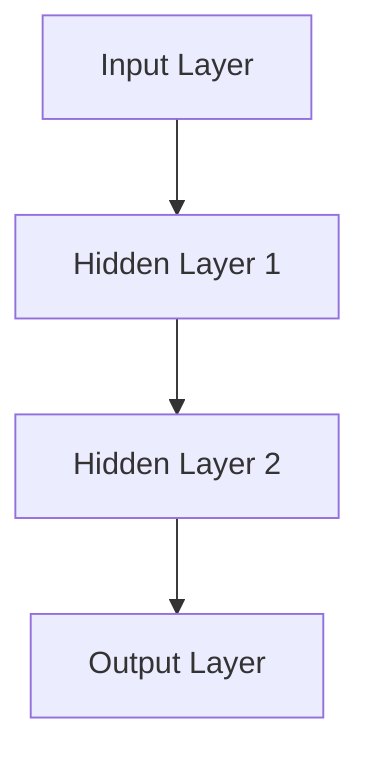

                 

### 第一部分: AI大模型基础

#### 第1章: AI大模型概述

在当今快速发展的技术时代，人工智能（AI）大模型成为了研究者和企业关注的焦点。AI大模型是一种具有复杂结构、强大计算能力和广泛适用性的深度学习模型，它通常由数十亿到千亿个参数组成。这种模型的出现，极大地推动了自然语言处理、计算机视觉、语音识别等领域的进步。

##### 1.1.1 AI大模型的定义

AI大模型，顾名思义，是指具有大规模参数和复杂结构的深度学习模型。它通过自动学习大量数据中的模式和规律，来执行各种复杂的任务。例如，自然语言处理中的语言模型、图像识别中的卷积神经网络（CNN）、语音识别中的循环神经网络（RNN）等，都是AI大模型的典型应用。

在定义AI大模型时，我们可以从以下几个维度来理解：

- **大规模参数**：这是AI大模型最显著的特征之一。传统模型可能只有几千或几万个参数，而AI大模型则可以包含数十亿到千亿个参数。例如，GPT-3模型的参数数量就超过了1750亿。
  
- **复杂结构**：AI大模型的层次结构通常非常复杂，包含多个隐藏层和多种类型的神经元。这种复杂的结构使得模型能够处理更加复杂的任务，同时也增加了模型的计算量和存储需求。

- **强大计算能力**：AI大模型通常需要强大的计算能力来支持其训练和推理。这要求我们使用高性能的GPU或TPU等硬件设备。

- **广泛适用性**：AI大模型不仅适用于特定的领域或任务，还能够在多个领域和任务中发挥作用。例如，GPT-3模型不仅在自然语言处理中表现出色，还可以应用于机器翻译、问答系统等多个领域。

##### 1.1.2 AI大模型的核心特点

AI大模型具有以下几个核心特点：

- **大规模参数**：AI大模型通常由数十亿到千亿个参数组成。这些参数通过学习大量数据中的模式和规律，使得模型能够执行复杂的任务。例如，BERT模型的参数数量就超过了3.4亿。

- **高效计算**：AI大模型通常需要高效的计算能力来支持其训练和推理。这要求我们使用GPU、TPU等高性能计算设备。例如，Google的TPU就专门为AI大模型的训练和推理而设计。

- **跨领域应用**：AI大模型具有广泛的适用性，不仅适用于自然语言处理、计算机视觉等领域，还可以应用于语音识别、机器翻译等多个领域。例如，GPT-3模型不仅在自然语言处理中表现出色，还可以用于机器翻译、问答系统等多个领域。

##### 1.1.3 AI大模型与传统AI的区别

传统AI模型与AI大模型之间存在显著的差异：

- **传统AI模型**：传统AI模型通常较小，参数数量较少，适用于特定的领域或任务。例如，简单的决策树、支持向量机等。

- **AI大模型**：AI大模型则具有大规模参数和复杂结构，适用于多个领域和任务。它们通过自动学习大量数据中的模式和规律，来执行复杂的任务。

综上所述，AI大模型具有大规模参数、高效计算和广泛适用性等核心特点，与传统AI模型相比，具有更高的计算能力和更广泛的适用性。

##### 1.1.4 AI大模型的技术基础

AI大模型的技术基础涵盖了深度学习、自然语言处理、预训练等多个领域。下面我们将简要介绍这些技术基础。

- **深度学习基础**：深度学习是AI大模型的核心技术之一。它通过多层神经网络来模拟人脑的神经元连接方式，从而实现复杂的数据处理任务。深度学习的基础包括神经网络、前馈神经网络、反向传播算法等。

- **自然语言处理基础**：自然语言处理是AI大模型的重要应用领域之一。它涉及文本处理、词嵌入、序列模型等。词嵌入是将词语映射到高维空间的技术，可以帮助模型更好地理解词语的含义。序列模型则用于处理时间序列数据，如文本、语音等。

- **大规模预训练模型**：大规模预训练模型是AI大模型的重要发展方向之一。它通过在大规模语料上进行无监督学习，来提高模型的性能和泛化能力。BERT、GPT-3等都是大规模预训练模型的代表。

##### 1.1.5 AI大模型在企业中的应用

AI大模型在企业中的应用日益广泛，以下是一些应用案例：

- **客户服务**：利用AI大模型构建智能客服系统，可以大大提高客户服务效率和满意度。例如，GPT-3模型可以用于生成个性化的客服响应。

- **自然语言处理**：AI大模型可以应用于文本分析、情感分析等领域，帮助企业更好地理解客户需求和市场趋势。

- **推荐系统**：AI大模型可以用于构建智能推荐系统，提高产品的推荐精度和用户满意度。

- **图像识别**：AI大模型可以应用于图像识别领域，如人脸识别、物体检测等，帮助企业提高自动化生产效率。

##### 1.1.6 AI大模型的挑战和未来发展方向

尽管AI大模型在多个领域取得了显著的成果，但仍然面临一些挑战：

- **计算资源**：AI大模型通常需要大量的计算资源，对硬件设备的要求较高。

- **数据隐私**：AI大模型在训练过程中需要大量数据，如何保护用户隐私是一个重要问题。

- **算法公平性**：AI大模型在处理数据时可能会产生偏见，如何确保算法的公平性是一个挑战。

未来，AI大模型的发展方向将包括：

- **高效计算**：通过硬件和软件的优化，提高AI大模型的计算效率。

- **数据隐私保护**：采用隐私保护技术，确保用户数据的安全。

- **算法公平性**：通过算法优化，减少算法偏见，提高算法的公平性。

综上所述，AI大模型作为一种强大的技术工具，正在不断推动人工智能的发展。在未来，我们期待AI大模型能够在更多的领域发挥重要作用，为人类带来更多的便利。  

#### 第2章: AI大模型技术基础

在了解了AI大模型的基本概念和应用之后，接下来我们将深入探讨AI大模型的技术基础，包括深度学习基础、自然语言处理基础和大规模预训练模型等。这些技术基础是构建AI大模型的核心，也是理解AI大模型工作原理的关键。

##### 2.1 深度学习基础

深度学习是AI大模型的核心技术，它通过多层神经网络来模拟人脑的神经元连接方式，从而实现复杂的数据处理任务。下面我们将简要介绍深度学习的基础概念，包括神经网络、前馈神经网络和反向传播算法。

###### 2.1.1 神经网络原理

神经网络（Neural Network，NN）是深度学习的基础。它由多个层次组成，包括输入层、隐藏层和输出层。每个层次由多个神经元（Node）组成，神经元之间通过权重（Weight）连接。

神经元的计算过程可以表示为：

$$
\text{Output} = \text{activation}(\sum_{i=1}^{n} \text{Weight}_i \cdot \text{Input}_i + \text{Bias})
$$

其中，$n$表示输入神经元的数量，$\text{Input}_i$表示第$i$个输入，$\text{Weight}_i$表示第$i$个输入的权重，$\text{Bias}$表示偏置，$\text{activation}$函数是激活函数，用于引入非线性变换。

下面是一个简单的神经网络Mermaid图：



###### 2.1.2 前馈神经网络

前馈神经网络（Feedforward Neural Network，FNN）是一种最简单的神经网络结构，其信息传递方向是从输入层到输出层，中间不发生循环。前馈神经网络通过多层隐藏层对输入数据进行特征提取和变换，最终输出结果。

前馈神经网络的计算过程可以分为两个阶段：

1. **前向传播（Forward Propagation）**：输入数据从输入层传递到输出层，每个神经元根据其权重和偏置进行计算，并传递给下一层。

2. **反向传播（Backpropagation）**：根据输出层的误差，反向传播误差到输入层，通过调整权重和偏置来优化网络。

下面是一个前馈神经网络的伪代码实现：

```python
class NeuralNetwork(nn.Module):
    def __init__(self):
        super(NeuralNetwork, self).__init__()
        self.fc1 = nn.Linear(in_features=784, out_features=128)
        self.fc2 = nn.Linear(in_features=128, out_features=128)
        self.fc3 = nn.Linear(in_features=128, out_features=10)
    
    def forward(self, x):
        x = F.relu(self.fc1(x))
        x = F.relu(self.fc2(x))
        x = self.fc3(x)
        return x
```

###### 2.1.3 反向传播算法

反向传播算法是深度学习训练的核心算法，它通过计算输出层误差，反向传播误差到输入层，以调整网络权重和偏置。

反向传播算法的基本步骤如下：

1. **前向传播**：计算输入层到输出层的梯度。

2. **计算误差**：计算输出层误差。

3. **反向传播**：计算输入层到输出层的误差梯度。

4. **更新权重和偏置**：使用梯度下降等优化算法，更新网络权重和偏置。

下面是一个反向传播算法的伪代码实现：

```python
def backward_propagation(model, inputs, targets):
    # 前向传播
    outputs = model(inputs)
    
    # 计算误差
    error = outputs - targets
    
    # 反向传播
    doutputs = error
    
    # 更新权重和偏置
    for layer in model.layers:
        layer.update_weights(doutputs)
```

##### 2.2 自然语言处理基础

自然语言处理（Natural Language Processing，NLP）是AI大模型的重要应用领域之一。NLP涉及文本处理、词嵌入、序列模型等。下面我们将简要介绍这些基础概念。

###### 2.2.1 词嵌入

词嵌入（Word Embedding）是将词语映射到高维空间的技术，使得模型能够更好地理解词语的含义。词嵌入通常通过矩阵乘法实现，例如：

$$
\text{embeddings} = \text{embedding\_matrix} \cdot \text{input\_vector}
$$

其中，$\text{embeddings}$表示词嵌入结果，$\text{embedding\_matrix}$表示词嵌入矩阵，$\text{input\_vector}$表示输入向量。

下面是一个词嵌入的伪代码实现：

```python
class WordEmbedding(nn.Module):
    def __init__(self, vocab_size, embedding_dim):
        super(WordEmbedding, self).__init__()
        self.embedding_matrix = nn.Parameter(torch.randn(vocab_size, embedding_dim))
    
    def forward(self, inputs):
        return torch.mm(inputs, self.embedding_matrix)
```

###### 2.2.2 序列模型

序列模型（Sequence Model）用于处理时间序列数据，如文本、语音等。常见的序列模型包括循环神经网络（Recurrent Neural Network，RNN）和长短时记忆网络（Long Short-Term Memory，LSTM）。

RNN是一种基于序列数据的神经网络，其计算过程可以表示为：

$$
\text{Output}_{t} = \text{activation}\left(\sum_{i=1}^{n} \text{Weight}_{i} \cdot \text{Input}_{t-i} + \text{Bias}\right)
$$

其中，$t$表示当前时间步，$n$表示历史时间步数。

下面是一个简单的RNN模型伪代码实现：

```python
class RNN(nn.Module):
    def __init__(self, input_dim, hidden_dim, output_dim):
        super(RNN, self).__init__()
        self.hidden_dim = hidden_dim
        self.rnn = nn.RNN(input_dim, hidden_dim, batch_first=True)
        self.fc = nn.Linear(hidden_dim, output_dim)
    
    def forward(self, inputs):
        hidden = inputs[:, -1, :]
        output, hidden = self.rnn(inputs, hidden)
        output = self.fc(output)
        return output
```

LSTM是一种改进的RNN模型，它能够更好地处理长序列数据。LSTM通过引入门控机制（Gate），实现了对信息的记忆和遗忘。

下面是一个简单的LSTM模型伪代码实现：

```python
class LSTM(nn.Module):
    def __init__(self, input_dim, hidden_dim, output_dim):
        super(LSTM, self).__init__()
        self.hidden_dim = hidden_dim
        self.lstm = nn.LSTM(input_dim, hidden_dim, batch_first=True)
        self.fc = nn.Linear(hidden_dim, output_dim)
    
    def forward(self, inputs):
        hidden = inputs[:, -1, :]
        output, hidden = self.lstm(inputs, hidden)
        output = self.fc(output)
        return output
```

##### 2.3 大规模预训练模型

大规模预训练模型（Massive Pre-trained Model）是当前NLP领域的热点研究方向之一。预训练模型通过在大规模语料上进行无监督学习，来提高模型的性能和泛化能力。常见的预训练模型包括BERT、GPT等。

BERT（Bidirectional Encoder Representations from Transformers）是一种双向编码器表征模型，它通过在大量无标签文本上进行预训练，来学习词语和句子的表示。

BERT的预训练过程可以分为两个阶段：

1. ** masked Language Model (MLM)**：在文本中随机遮挡一些词语，然后使用BERT模型预测这些词语。

2. **Next Sentence Prediction (NSP)**：预测两个句子是否是连续的。

下面是BERT的预训练伪代码实现：

```python
from transformers import BertModel, BertTokenizer

model = BertModel.from_pretrained('bert-base-uncased')
tokenizer = BertTokenizer.from_pretrained('bert-base-uncased')

def pretrain(model, tokenizer, corpus, num_epochs=3):
    for epoch in range(num_epochs):
        for text in corpus:
            inputs = tokenizer.encode(text, return_tensors='pt')
            masked_inputs = inputs.clone()
            masked_inputs[masked_inputs == tokenizer.pad_token_id] = tokenizer.mask_token_id
            
            masked_inputs, labels = masked_inputs[:, :-1], inputs[:, 1:]
            outputs = model(masked_inputs)
            loss = F.cross_entropy(outputs.logits, labels)
            
            optimizer.zero_grad()
            loss.backward()
            optimizer.step()
```

GPT（Generative Pre-trained Transformer）是一种生成式预训练模型，它通过在大量文本上进行预训练，来学习语言的生成规律。

GPT的预训练过程可以分为两个阶段：

1. **Predictive Text Generation (PTG)**：预测文本中的下一个词。

2. **Reconstruction Loss (RL)**：通过生成文本和原始文本之间的相似度来优化模型。

下面是GPT的预训练伪代码实现：

```python
from transformers import Gpt2Model, Gpt2Tokenizer

model = Gpt2Model.from_pretrained('gpt2')
tokenizer = Gpt2Tokenizer.from_pretrained('gpt2')

def pretrain(model, tokenizer, corpus, num_epochs=3):
    for epoch in range(num_epochs):
        for text in corpus:
            inputs = tokenizer.encode(text, return_tensors='pt')
            outputs = model.generate(inputs, max_length=50, num_return_sequences=1)
            
            reconstructed_text = tokenizer.decode(outputs[0], skip_special_tokens=True)
            reconstruction_loss = F.mse_loss(inputs, outputs)
            
            optimizer.zero_grad()
            reconstruction_loss.backward()
            optimizer.step()
```

综上所述，深度学习基础、自然语言处理基础和大规模预训练模型是构建AI大模型的核心技术。通过这些技术，我们可以构建出具有强大计算能力和广泛适用性的AI大模型，从而推动人工智能的发展。

#### 第3章: AI大模型在企业中的应用

随着AI大模型技术的不断成熟，其在企业中的应用场景也越来越广泛。AI大模型在企业中的应用不仅提高了业务效率，还带来了创新性的解决方案。本章节将探讨AI大模型在企业中的战略规划、应用案例和开发流程，帮助读者理解如何将AI大模型技术融入企业运营中，实现商业价值。

##### 3.1 企业AI战略规划

企业AI战略规划是企业利用AI大模型技术实现业务目标的关键步骤。有效的AI战略规划应包括以下几个方面：

1. **明确业务目标**：企业首先需要明确自身的业务目标，例如提高生产效率、优化供应链管理、提升客户满意度等。

2. **选择合适的AI大模型**：根据业务需求，选择适合的AI大模型。例如，对于自然语言处理任务，可以选择预训练的BERT或GPT模型；对于图像识别任务，可以选择ResNet或VGG等深度学习模型。

3. **数据准备和预处理**：AI大模型训练需要大量的高质量数据。企业需要收集和整理相关数据，并进行预处理，如数据清洗、数据增强等，以提高模型的训练效果。

4. **评估和优化**：在模型训练过程中，企业需要定期评估模型性能，并通过调整模型参数、改进训练算法等方式进行优化。

5. **部署和运维**：将训练好的AI大模型部署到生产环境中，并提供持续的运维支持，以确保模型稳定运行。

##### 3.2 AI大模型应用案例

AI大模型在企业中的应用案例非常丰富，以下是几个典型的应用案例：

###### 3.2.1 智能客服系统

智能客服系统是企业服务客户的重要工具。通过AI大模型，尤其是预训练的语言模型，如GPT-3，可以构建出能够与用户进行自然对话的智能客服系统。以下是一个使用GPT-3构建智能客服系统的案例：

- **概述**：使用GPT-3模型构建一个能够自动回复用户问题的智能客服系统。

- **代码实现**：

```python
from transformers import GPT2LMHeadModel, GPT2Tokenizer

model = GPT2LMHeadModel.from_pretrained('gpt2')
tokenizer = GPT2Tokenizer.from_pretrained('gpt2')

def generate_response(prompt):
    input_ids = tokenizer.encode(prompt, return_tensors='pt')
    outputs = model.generate(input_ids, max_length=50, num_return_sequences=1)
    response = tokenizer.decode(outputs[0], skip_special_tokens=True)
    return response

# 示例
user_query = "你好，我想咨询一下关于退货的问题。"
bot_response = generate_response(user_query)
print(bot_response)
```

该代码首先加载预训练的GPT-3模型和Tokenizer，然后定义一个函数`generate_response`，用于生成对用户查询的自动回复。在实际应用中，可以将用户查询传递到该函数，获得智能客服系统的自动回复。

###### 3.2.2 智能推荐系统

智能推荐系统是提升用户体验的重要手段。AI大模型，如基于BERT的推荐模型，可以用于分析用户行为和偏好，提供个性化的推荐。以下是一个基于BERT的推荐系统案例：

- **概述**：使用BERT模型构建一个基于用户历史行为的商品推荐系统。

- **代码实现**：

```python
from transformers import BertModel, BertTokenizer

model = BertModel.from_pretrained('bert-base-uncased')
tokenizer = BertTokenizer.from_pretrained('bert-base-uncased')

def generate_recommendations(user_history, items, top_n=5):
    user_embeddings = []
    item_embeddings = []

    for item in items:
        input_ids = tokenizer.encode(item, return_tensors='pt')
        with torch.no_grad():
            outputs = model(input_ids)
        item_embeddings.append(outputs.last_hidden_state.mean(dim=1))

    for history in user_history:
        input_ids = tokenizer.encode(history, return_tensors='pt')
        with torch.no_grad():
            outputs = model(input_ids)
        user_embeddings.append(outputs.last_hidden_state.mean(dim=1))

    user_similarity = torch.nn.functional.cosine_similarity(torch.stack(user_embeddings), torch.stack(item_embeddings), dim=1)
    top_indices = torch.topk(user_similarity, k=top_n)[1]

    return [items[i] for i in top_indices]

# 示例
user_history = ["iPhone 13", "MacBook Air", "Apple Watch Series 7"]
items = ["iPhone 13", "MacBook Pro", "iPad Pro", "Apple Watch Series 7"]
recommendations = generate_recommendations(user_history, items)
print(recommendations)
```

该代码首先加载预训练的BERT模型和Tokenizer，然后定义一个函数`generate_recommendations`，用于生成基于用户历史的商品推荐。在实际应用中，可以将用户历史和行为数据传递到该函数，获得个性化的商品推荐。

###### 3.2.3 自动驾驶系统

自动驾驶系统是AI大模型在交通运输领域的应用典范。通过AI大模型，尤其是深度学习模型，可以实现对车辆环境的感知、决策和控制。以下是一个自动驾驶系统的案例：

- **概述**：使用深度学习模型构建一个自动驾驶系统，实现车辆自动导航和避障。

- **代码实现**：

```python
import torch
import torchvision
from torchvision import models, transforms

model = models.resnet50(pretrained=True)
preprocess = transforms.Compose([
    transforms.Resize(224),
    transforms.ToTensor(),
])

def drive autonoumously(image):
    image = preprocess(image)
    image = torch.tensor(image)
    with torch.no_grad():
        output = model(image.unsqueeze(0))
    _, predicted = torch.max(output, 1)
    
    if predicted.item() == 1:
        return "Turn right"
    elif predicted.item() == 2:
        return "Go straight"
    else:
        return "Turn left"

# 示例
# 读取图像并自动驾驶
image = torchvision.transforms.ToPILImage()(image)
bot_response = drive_autonomously(image)
print(bot_response)
```

该代码首先加载预训练的ResNet-50模型，然后定义一个函数`drive_autonomously`，用于根据输入图像进行自动驾驶决策。在实际应用中，可以将摄像头捕获的图像传递到该函数，获取自动驾驶系统的导航指令。

##### 3.3 AI大模型开发流程

开发AI大模型是一个复杂的过程，涉及数据收集、模型选择、训练、评估和部署等多个环节。以下是AI大模型开发的流程：

1. **数据收集**：收集与业务相关的数据，包括用户数据、市场数据、业务流程数据等。

2. **数据预处理**：对收集到的数据进行分析和清洗，以去除噪声和异常值，并转换为适合模型训练的格式。

3. **模型选择**：根据业务需求选择合适的模型，可以是预训练的模型，也可以是自定义的模型。

4. **模型训练**：使用预处理后的数据对模型进行训练，通过迭代优化模型参数。

5. **模型评估**：在验证集和测试集上评估模型性能，确保模型具有较好的泛化能力。

6. **模型部署**：将训练好的模型部署到生产环境中，提供实时服务。

7. **持续优化**：根据业务反馈和模型性能，持续优化模型，提升模型效果。

##### 3.4 AI大模型的优势和挑战

AI大模型在企业中的应用具有显著的优势，但也面临一定的挑战：

- **优势**：
  - **强大的计算能力**：AI大模型具有强大的计算能力，可以处理复杂的业务问题。
  - **广泛适用性**：AI大模型适用于多种业务场景，可以帮助企业提升运营效率。
  - **自动化和智能化**：AI大模型可以实现业务的自动化和智能化，减少人工干预。

- **挑战**：
  - **数据隐私**：大规模数据处理可能涉及用户隐私，如何保护用户隐私是一个重要问题。
  - **计算资源**：训练和部署AI大模型需要大量的计算资源，对硬件设备的要求较高。
  - **模型解释性**：AI大模型通常具有较低的解释性，如何解释模型决策结果是一个挑战。

综上所述，AI大模型在企业中的应用具有广阔的前景，但同时也需要企业应对数据隐私、计算资源和技术解释性等挑战。通过合理的规划和持续优化，企业可以充分发挥AI大模型的优势，实现业务创新和增长。

#### 第4章: AI大模型创业策略

随着人工智能技术的快速发展，AI大模型创业成为了许多创业者和企业家的热门选择。AI大模型在自然语言处理、图像识别、推荐系统等领域展示了巨大的潜力，但如何应对未来竞争对手，确保创业项目的成功，是每个创业者都必须认真思考的问题。本章将探讨AI大模型创业策略，包括市场分析、产品开发、商业模式设计等方面。

##### 4.1 市场分析

在进行AI大模型创业之前，深入的市场分析是至关重要的。市场分析包括对目标市场的需求、竞争对手和潜在用户的了解。以下是市场分析的关键步骤：

1. **目标市场定位**：明确目标市场的需求和痛点。例如，自然语言处理领域可能关注的是提高客服效率、改善用户交互体验；图像识别领域可能关注的是提高自动化生产线的效率、降低人工成本。

2. **竞争对手分析**：分析现有竞争对手的产品、市场份额、优势与劣势。了解竞争对手的产品特性、市场策略和技术路线，有助于找到差异化竞争点。

3. **潜在用户调研**：通过问卷调查、访谈等方式了解潜在用户的实际需求和期望。了解用户的具体需求可以帮助企业更好地设计产品，提高用户满意度。

4. **市场规模评估**：评估目标市场的规模和增长潜力。通过市场规模评估，可以判断AI大模型创业的可行性。

##### 4.2 产品开发

AI大模型创业的核心在于产品开发。产品开发需要遵循以下步骤：

1. **需求分析**：根据市场调研结果，明确产品的核心功能和需求。

2. **技术选型**：选择合适的AI大模型和框架。例如，对于自然语言处理，可以选择BERT、GPT等预训练模型；对于图像识别，可以选择ResNet、VGG等深度学习模型。

3. **原型设计**：设计产品原型，包括用户界面、功能模块等。原型设计应该充分考虑用户体验，确保产品易于使用和操作。

4. **模型训练与优化**：使用大量数据进行模型训练，通过多次迭代优化模型性能。模型训练和优化是AI大模型产品的关键，直接影响产品的质量和效果。

5. **测试与迭代**：在原型设计完成后，进行产品测试，收集用户反馈，根据反馈进行产品迭代和改进。

##### 4.3 商业模式设计

商业模式设计是AI大模型创业成功的关键环节。以下是几种常见的商业模式设计：

1. **订阅模式**：用户按月或按年订阅服务，享受AI大模型提供的各种功能。

2. **付费使用模式**：用户根据实际使用量支付费用，例如按使用时长或数据量计费。

3. **定制服务模式**：根据客户需求提供定制化的解决方案，收费较高，但利润空间大。

4. **平台模式**：搭建一个开放的AI大模型平台，吸引第三方开发者和企业入驻，通过平台收费和广告收入获得收益。

在商业模式设计中，需要考虑以下因素：

- **目标用户群体**：根据目标用户的特点设计合适的商业模式。

- **成本结构**：了解产品的开发和运营成本，确保商业模式具有可持续性。

- **盈利模式**：明确产品的盈利渠道，确保企业能够持续盈利。

##### 4.4 技术创新与优化

技术创新与优化是AI大模型创业的核心竞争力。以下是一些关键技术策略：

1. **模型优化**：通过改进模型结构、优化算法等方式提高模型性能。

2. **数据增强**：使用数据增强技术，提高模型的泛化能力，减少对特定数据的依赖。

3. **跨领域应用**：探索AI大模型在不同领域的应用，实现技术的多元化。

4. **持续学习**：通过持续学习，不断提高模型的能力和适应性。

##### 4.5 市场差异化

在竞争激烈的市场中，市场差异化是确保企业成功的关键。以下是实现市场差异化的几种策略：

1. **产品差异化**：通过独特的产品特性或功能，与竞争对手区分开来。

2. **用户体验**：提供卓越的用户体验，包括界面设计、操作流程等，提高用户满意度。

3. **技术创新**：持续进行技术创新，保持技术领先地位。

4. **品牌建设**：通过品牌营销和公关活动，提升品牌知名度和影响力。

##### 4.6 法律与伦理问题

在AI大模型创业过程中，法律和伦理问题不可忽视。以下是一些关键点：

1. **数据隐私**：确保用户数据的安全和隐私，遵守相关法律法规。

2. **算法透明性**：提高算法的透明度，确保用户了解AI大模型的工作原理和决策过程。

3. **公平性**：确保AI大模型的应用不会产生歧视或不公平现象。

4. **合规性**：确保产品和服务符合相关法律法规的要求。

##### 4.7 创业者建议

对于AI大模型创业者，以下是一些建议：

1. **持续学习**：保持对最新技术和市场动态的关注，不断学习和提升自己的技术能力和业务水平。

2. **团队合作**：组建一支优秀的团队，包括技术人才、业务人才和市场营销人才。

3. **创新思维**：鼓励创新思维，勇于尝试新的技术路线和市场策略。

4. **风险管理**：充分评估创业风险，制定有效的风险控制措施。

5. **持续优化**：在产品开发过程中，不断优化产品和服务，提高用户体验和满意度。

通过市场分析、产品开发、商业模式设计、技术创新和市场差异化等多方面的策略，AI大模型创业者可以更好地应对未来竞争对手，实现创业项目的成功。

### 第5章: 应对未来竞争对手

在AI大模型领域，竞争日益激烈，创业者们需要制定有效的策略来应对未来的竞争对手。本章将探讨如何在竞争环境中分析竞争对手、通过技术创新和优化提高自身竞争力、以及如何实现市场差异化。

#### 5.1 竞争环境分析

要应对未来竞争对手，首先需要对竞争环境进行深入分析。以下是一些关键步骤：

1. **市场定位**：明确自己在市场中的定位，了解竞争对手的市场份额和产品特点。

2. **技术分析**：分析竞争对手的技术路线和模型性能，找出他们的优势与劣势。

3. **用户需求**：了解目标用户的需求，确保产品能够满足用户的期望。

4. **市场趋势**：跟踪市场的发展趋势，预测未来可能出现的新技术和新需求。

5. **商业模式**：分析竞争对手的商业模式，了解他们的盈利方式。

通过这些分析，创业者可以明确自身的优势和劣势，从而制定针对性的策略。

#### 5.2 技术创新与优化

技术创新是AI大模型创业的核心竞争力。以下是一些技术创新和优化的策略：

1. **模型优化**：通过改进模型结构、优化算法和增加数据集等方法提高模型性能。

2. **计算效率**：优化计算流程，提高模型的训练和推理速度，降低计算资源消耗。

3. **自动化和自动化**：利用自动化工具和流程，提高开发效率和运维能力。

4. **跨领域应用**：探索AI大模型在不同领域的应用，实现技术的多元化。

5. **持续学习**：通过持续学习，不断提高模型的能力和适应性。

通过技术创新和优化，创业者可以在性能和效率上超越竞争对手，获得竞争优势。

#### 5.3 市场差异化

市场差异化是确保企业成功的关键。以下是一些实现市场差异化的策略：

1. **产品差异化**：通过独特的产品特性或功能，与竞争对手区分开来。

2. **用户体验**：提供卓越的用户体验，包括界面设计、操作流程等，提高用户满意度。

3. **技术创新**：持续进行技术创新，保持技术领先地位。

4. **品牌建设**：通过品牌营销和公关活动，提升品牌知名度和影响力。

5. **合作伙伴关系**：与行业内的领先企业建立合作伙伴关系，共同推动技术的发展。

通过市场差异化，创业者可以在市场中脱颖而出，吸引更多的用户和客户。

#### 5.4 应对竞争策略

在明确了竞争环境和自身优势后，创业者需要制定具体的应对策略：

1. **防御策略**：通过提高产品质量和服务，增强用户忠诚度，防止竞争对手侵蚀市场份额。

2. **进攻策略**：通过创新和推广，抢占市场份额，扩大用户基础。

3. **合作策略**：与行业内的领先企业合作，共同开发新技术和市场。

4. **反击策略**：在竞争对手出现问题时，及时反击，抓住市场机遇。

通过这些策略，创业者可以有效地应对竞争，确保企业在市场中立于不败之地。

#### 5.5 法律与伦理问题

在竞争过程中，法律和伦理问题同样重要。以下是一些需要注意的法律和伦理问题：

1. **数据隐私**：确保用户数据的安全和隐私，遵守相关法律法规。

2. **算法透明性**：提高算法的透明度，确保用户了解AI大模型的工作原理和决策过程。

3. **公平性**：确保AI大模型的应用不会产生歧视或不公平现象。

4. **合规性**：确保产品和服务符合相关法律法规的要求。

通过遵守法律和伦理标准，创业者可以树立良好的企业形象，赢得用户的信任和支持。

#### 5.6 未来发展趋势

最后，创业者需要关注未来发展趋势，以便提前布局和应对：

1. **技术趋势**：关注AI领域的最新技术趋势，提前布局。

2. **市场趋势**：跟踪市场需求的变化，调整产品策略。

3. **行业趋势**：了解行业的发展趋势，把握市场机遇。

通过关注未来发展趋势，创业者可以保持竞争力，持续引领市场。

总之，应对未来竞争对手需要创业者从竞争环境分析、技术创新与优化、市场差异化、法律与伦理等多个方面进行全面布局。通过制定和实施有效的策略，创业者可以确保企业在激烈的市场竞争中立于不败之地。

### 第6章: 法律与伦理问题

在AI大模型的应用和推广过程中，法律和伦理问题不容忽视。这些问题的处理不仅关系到企业的合规性，还直接影响到用户对AI技术的信任和接受度。本章将探讨数据隐私保护、伦理道德问题和法律合规等方面的关键问题。

#### 6.1 数据隐私保护

数据隐私保护是AI大模型面临的首要法律和伦理问题。随着AI技术的发展，大量个人数据被收集、存储和使用，这些数据的泄露或滥用可能会对用户造成严重的后果。以下是一些关键措施：

1. **数据匿名化**：在数据收集和处理过程中，采取数据匿名化措施，确保用户隐私不被泄露。

2. **数据加密**：对敏感数据进行加密存储，防止未经授权的访问。

3. **访问控制**：制定严格的访问控制策略，确保只有授权人员才能访问和处理数据。

4. **用户同意**：在收集和使用数据前，确保用户知情并同意其数据被用于特定目的。

5. **数据安全审计**：定期进行数据安全审计，确保数据安全措施得到有效执行。

6. **合规性检查**：遵守相关数据保护法律法规，如《通用数据保护条例》（GDPR）和《加州消费者隐私法案》（CCPA）。

#### 6.2 伦理道德问题

AI大模型的广泛应用也引发了一系列伦理道德问题，这些问题需要从多个角度进行深入讨论：

1. **算法偏见**：AI大模型在处理数据时可能会产生偏见，导致歧视或不公平现象。为了防止这种情况，需要定期对模型进行审查和调整，确保算法的公平性。

2. **透明度和可解释性**：用户需要了解AI大模型的工作原理和决策过程，以提高透明度和可解释性。这可以通过开发可解释的人工智能技术来实现。

3. **隐私与公共利益**：在保护个人隐私的同时，也需要考虑公共利益。例如，在公共安全领域，AI大模型的应用可能需要收集和处理大量敏感数据。

4. **人类监督**：尽管AI大模型在处理大量数据时表现出色，但在关键决策中仍然需要人类监督，以确保决策的合理性和道德性。

5. **责任归属**：在AI大模型引发的纠纷中，如何确定责任归属是一个复杂的问题。需要制定明确的法律法规，明确AI模型的开发者和使用者责任。

#### 6.3 法律合规

法律合规是AI大模型应用和推广的基石。以下是一些关键的法律合规问题：

1. **数据保护法规**：遵守《通用数据保护条例》（GDPR）、《加州消费者隐私法案》（CCPA）等数据保护法律法规，确保数据收集、存储和处理合法合规。

2. **隐私政策**：在产品和服务中明确用户的隐私权利，提供详细的隐私政策，让用户了解其数据如何被使用。

3. **知识产权保护**：确保AI大模型技术不会侵犯他人的知识产权，包括专利、版权和商标等。

4. **产品责任**：在产品责任方面，明确AI大模型可能产生的风险和责任，制定相应的风险控制和责任承担机制。

5. **行业法规**：遵守特定行业的法律法规，如医疗、金融和交通运输等领域的特定法规。

#### 6.4 综合措施

为了有效应对AI大模型的法律和伦理问题，需要采取综合措施，包括：

1. **法律合规培训**：对员工进行法律合规培训，提高员工的合规意识和能力。

2. **伦理委员会**：设立独立的伦理委员会，负责审查和监督AI大模型的应用和推广，确保伦理问题得到妥善处理。

3. **持续监测和评估**：定期对AI大模型进行监测和评估，确保其符合法律和伦理要求。

4. **用户反馈机制**：建立用户反馈机制，及时响应用户的投诉和意见，不断改进产品和服务。

通过上述措施，企业可以更好地应对AI大模型的法律和伦理问题，确保AI技术的健康、可持续发展。

### 第7章: 总结与展望

#### 7.1 成功案例分析

在AI大模型创业领域，已有很多成功案例。以下是几个具有代表性的案例：

1. **OpenAI**：作为全球领先的AI研究机构，OpenAI在自然语言处理领域取得了显著成果。其预训练模型GPT-3不仅性能卓越，还广泛应用于多个行业，成为AI大模型创业的标杆。

2. **DeepMind**：DeepMind在深度学习和强化学习领域取得了突破性进展，其AI系统在围棋、电子竞技等比赛中表现出色。DeepMind的成功展示了AI大模型在游戏和娱乐领域的巨大潜力。

3. **TensorFlow**：Google的TensorFlow框架为AI大模型开发者提供了强大的工具和资源，使其在计算机视觉、自然语言处理等领域广泛应用。TensorFlow的成功案例展示了AI大模型创业的实用性和普及性。

4. **AI2**：AI2（Alphabet Inc.）的AI研究项目在机器学习和数据科学领域取得了显著成果。其开发的AI大模型在医疗、金融等领域展示了强大的应用潜力，成为AI大模型创业的典范。

#### 7.2 未来发展趋势

展望未来，AI大模型创业将继续呈现以下发展趋势：

1. **技术创新**：随着深度学习和人工智能技术的不断发展，AI大模型的性能和效率将不断提高，为更多行业和应用场景提供支持。

2. **跨领域应用**：AI大模型将在更多领域得到应用，如医疗、金融、教育、制造业等。跨领域应用将推动AI大模型技术的普及和商业化。

3. **商业模式创新**：AI大模型创业的商业模式将不断演进，从传统的产品销售到订阅服务、平台合作等多种模式，以满足不同用户的需求。

4. **数据隐私和安全**：随着用户对数据隐私和安全的关注增加，AI大模型创业将更加重视数据保护和用户隐私，确保技术的可持续发展。

5. **法律和伦理规范**：AI大模型创业将在法律和伦理规范的指导下发展，确保技术的合法性和道德性，增强用户信任。

#### 7.3 创业者建议

对于AI大模型创业者，以下是一些建议：

1. **技术积累**：不断学习和积累AI大模型相关技术，提高自身在领域内的竞争力。

2. **市场需求**：关注市场需求，了解用户需求，确保产品能够满足用户需求。

3. **团队建设**：组建一支技术过硬、业务敏锐的团队，共同推进项目发展。

4. **商业模式创新**：积极探索多种商业模式，找到最适合自身项目的盈利模式。

5. **合规性**：严格遵守法律和伦理规范，确保企业的合法性和道德性。

6. **持续优化**：不断优化产品和服务，提高用户体验和满意度。

7. **合作与交流**：积极参与行业交流与合作，借鉴他人经验，推动自身发展。

通过以上建议，创业者可以更好地应对市场挑战，实现AI大模型创业的成功。

### 附录

#### 附录 A: AI大模型开发资源

1. **主流深度学习框架**：
   - **TensorFlow**：Google开发的深度学习框架，广泛应用于AI大模型开发。
   - **PyTorch**：Facebook开发的深度学习框架，具有灵活的动态计算图功能。
   - **JAX**：Google开发的自动微分库，支持TensorFlow和PyTorch等框架。
   - **其他框架**：如Keras、Theano、MXNet等，也提供了丰富的深度学习工具。

2. **开源代码和模型库**：
   - **Hugging Face**：提供了丰富的预训练模型和工具，如BERT、GPT等。
   - **Model Zoo**：包含多种预训练模型和应用案例，供开发者参考。

3. **学习资源和教程**：
   - **Coursera**：提供多门深度学习和人工智能课程，适合初学者和专业人士。
   - **Udacity**：提供一系列AI和机器学习课程，包括深度学习实践。
   - **吴恩达深度学习专项课程**：深入讲解深度学习和神经网络原理。

#### 附录 B: AI大模型应用案例

1. **智能客服系统**：
   - **概述**：利用GPT-3模型构建的智能客服系统，可实现自动回复用户问题，提高客服效率。
   - **实现细节**：使用GPT-3预训练模型，通过自然语言处理技术实现自动回复。

2. **智能推荐系统**：
   - **概述**：基于AI大模型的推荐系统，可根据用户行为和偏好推荐相关商品或内容。
   - **实现细节**：使用基于BERT的推荐模型，分析用户历史行为和内容特征，实现个性化推荐。

3. **自动驾驶系统**：
   - **概述**：利用深度学习模型构建的自动驾驶系统，可实现车辆自主导航和避障。
   - **实现细节**：使用基于CNN和RNN的深度学习模型，对环境进行感知和决策。

#### 附录 C: AI大模型研究论文

1. **BERT：Pre-training of Deep Bidirectional Transformers for Language Understanding**：由Google AI团队发表的论文，介绍了BERT模型的预训练方法和应用效果。

2. **Generative Pre-trained Transformer**：由OpenAI发表的论文，介绍了GPT模型的预训练方法和生成式应用。

3. **Transformers: State-of-the-Art Natural Language Processing**：由Vaswani等人发表的论文，详细介绍了Transformer模型的结构和工作原理。

这些资源和案例为AI大模型开发者提供了丰富的参考和学习资源，有助于深入了解AI大模型的技术和应用。

## 作者信息

作者：AI天才研究院（AI Genius Institute）/《禅与计算机程序设计艺术》（Zen And The Art of Computer Programming）

