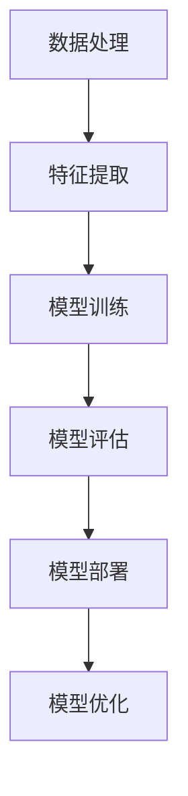
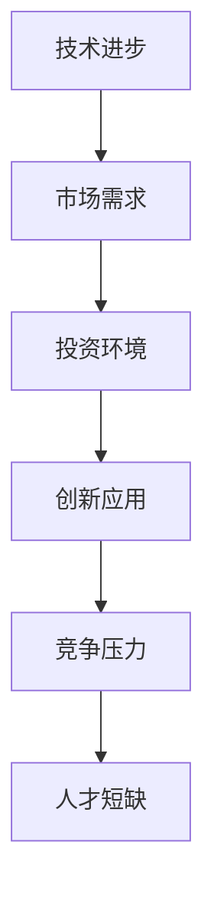

                 

# AI大模型创业：如何抓住未来机遇？

> **关键词**：AI大模型、创业机遇、核心技术、商业应用、战略规划、融资、案例分析、未来展望

> **摘要**：本文深入探讨AI大模型创业的各个方面，包括核心技术的解析、商业应用的价值、创业实践的经验、融资策略的制定以及未来趋势的展望。通过详细的案例分析，提供创业者在AI大模型领域的实战指南，帮助创业者抓住未来机遇。

## 第一部分：引言

### 第1章：AI大模型与创业机遇

#### 1.1 AI大模型概述

AI大模型是指通过大规模数据训练得到的复杂神经网络模型，具备处理和理解大规模数据的能力。它们能够实现自然语言处理、图像识别、语音识别等复杂任务。随着计算能力和数据量的提升，AI大模型在各个领域都取得了显著的应用成果。

**Mermaid 流程图：AI大模型的基本概念**



#### 1.1.1 AI大模型的基本概念

AI大模型通常包括以下几个基本概念：

- **预训练**：在特定任务之前，模型在大规模数据集上进行训练，以获得通用特征表示能力。
- **微调**：在预训练的基础上，针对特定任务进行模型调整，以适应具体应用场景。
- **模型压缩**：为了提高模型的实用性，常常需要对模型进行压缩，以减少模型大小和提高推理速度。

**伪代码：预训练模型的基础**

```python
# Pre-training model base pseudo-code
initialize_model()
for data in dataset:
    model.zero_grad()
    output = model(data)
    loss = loss_function(output, target)
    loss.backward()
    optimizer.step()
evaluate_model(model)
```

#### 1.1.2 AI大模型的发展历程

AI大模型的发展历程可以分为以下几个阶段：

- **早期模型**：以词袋模型、朴素贝叶斯等传统机器学习模型为代表。
- **深度学习崛起**：以卷积神经网络（CNN）和循环神经网络（RNN）为代表，深度学习模型在图像识别、语音识别等领域取得了突破性进展。
- **预训练模型**：以GPT、BERT等为代表，大规模预训练模型在自然语言处理领域取得了显著的成果。

#### 1.2 创业机遇与挑战

**摘要**：AI大模型为创业提供了广阔的机遇，但也伴随着巨大的挑战。

**Mermaid 流程图：创业机遇与挑战**



#### 1.2.1 创业者面临的机遇

- **技术突破**：AI大模型技术的发展为创业提供了强大的技术支持。
- **市场前景**：AI大模型在各个行业都显示出巨大的应用潜力。
- **投资热情**：风险投资对AI大模型创业项目的兴趣不断增长。

#### 1.2.2 创业者面临的挑战

- **技术门槛**：AI大模型需要强大的计算能力和数据资源。
- **市场验证**：创业者需要证明AI大模型的实际应用价值。
- **竞争激烈**：AI大模型领域竞争激烈，创业者需要不断创新。

**伪代码：技术进步与创业机遇**

```python
# Technical progress and entrepreneurial opportunities
import latest_technology()
if technology_is_ready():
    explore_new_market()
    attract_investment()
else:
    continue_research_and_development()
```

### 第2章：AI大模型的核心技术

#### 2.1 大规模预训练模型原理

**摘要**：本节介绍大规模预训练模型的基本原理，包括预训练模型的基础、自监督学习和迁移学习等。

**伪代码：大规模预训练模型原理**

```python
# Large-scale pre-trained model principle
initialize_model()
for data in large_scale_dataset:
    model.zero_grad()
    output = model(data)
    loss = loss_function(output, target)
    loss.backward()
    optimizer.step()
evaluate_model(model)
```

#### 2.1.1 预训练模型的基础

预训练模型的基础主要包括以下几个方面：

- **词嵌入**：将词汇映射到高维向量空间，以便于计算和处理。
- **神经网络架构**：常用的神经网络架构包括CNN、RNN和Transformer等。
- **训练目标**：预训练模型通常以大规模文本数据为基础，训练模型对自然语言的理解能力。

#### 2.1.2 自监督学习与迁移学习

- **自监督学习**：在无监督的情况下，模型通过自我学习来提高性能。
- **迁移学习**：将预训练模型在特定任务上微调，以提高模型在新任务上的表现。

#### 2.1.3 大规模预训练模型的挑战与解决方案

- **计算资源消耗**：大规模预训练模型需要大量的计算资源。
- **数据需求**：预训练模型需要大规模的数据集。
- **模型压缩**：为了降低计算和存储成本，需要对模型进行压缩。

**伪代码：大规模预训练模型的挑战与解决方案**

```python
# Large-scale pre-trained model challenges and solutions
if resource_is_sufficient():
    use_giant_dataset()
else:
    use_smart_model_compression()

# Example of model compression
model = compress_model(model)
```

#### 2.2 自然语言处理技术

**摘要**：本节介绍自然语言处理技术，包括词嵌入技术、序列模型与注意力机制、转换器架构等。

**数学模型和公式：词嵌入技术**

$$
\text{word\_embedding}(\text{word}) = \sum_{i=1}^{n} w_i \cdot v_i
$$

其中，$w_i$ 是词频，$v_i$ 是对应的词向量。

**伪代码：自然语言处理技术**

```python
# Natural language processing techniques
initialize_word_embedding()
for sentence in dataset:
    embed_sentence(sentence)
```

#### 2.2.1 词嵌入技术

词嵌入技术是将词汇映射到高维向量空间，以便于计算和处理。常用的词嵌入技术包括：

- **Word2Vec**：基于神经网络的语言模型，通过训练得到词向量。
- **GloVe**：全局向量表示，通过训练得到词向量。

**伪代码：Word2Vec**

```python
# Word2Vec pseudo-code
initialize_model()
for sentence in dataset:
    model.zero_grad()
    output = model(sentence)
    loss = loss_function(output, target)
    loss.backward()
    optimizer.step()
evaluate_model(model)
```

#### 2.2.2 序列模型与注意力机制

- **序列模型**：处理序列数据的模型，如RNN和LSTM。
- **注意力机制**：用于关注序列中重要的部分，如Transformer模型中的自注意力机制。

**伪代码：注意力机制**

```python
# Attention mechanism
for query, key, value in sequence:
    attention_weights = calculate_attention(query, key)
    context_vector = calculate_context_vector(value, attention_weights)
```

#### 2.2.3 转换器架构详解

转换器（Transformer）架构是一种基于自注意力机制的深度学习模型，它在自然语言处理任务中取得了显著的成果。转换器架构的主要组成部分包括：

- **编码器**：用于处理输入序列，生成编码表示。
- **解码器**：用于生成输出序列，基于编码器的输出和先前的解码步骤。
- **自注意力机制**：用于计算编码器输出之间的相互关系。

**伪代码：转换器架构**

```python
# Transformer architecture
encode_input_sequence()
decode_output_sequence()
calculate_self_attention()
```

### 第3章：AI大模型在商业应用中的价值

#### 3.1 AI大模型在企业中的潜在应用

**摘要**：本节介绍AI大模型在企业中的潜在应用，包括人工智能驱动的决策支持、智能客服与客户关系管理、智能推荐系统等。

**伪代码：企业中的应用场景**

```python
# Business application scenarios
use_ai_for_decision_support()
implement_smart_cust
```

#### 3.1.1 人工智能驱动的决策支持

人工智能驱动的决策支持系统可以帮助企业通过分析大量数据，提供精准的决策建议。这包括：

- **数据挖掘**：从企业内部和外部的数据中提取有价值的信息。
- **预测分析**：基于历史数据，预测未来的趋势和结果。
- **优化策略**：通过优化模型，提高企业的运营效率。

**伪代码：决策支持系统**

```python
# Decision support system
import data_mining()
import predictive_analysis()
import optimization_strategy()
```

#### 3.1.2 智能客服与客户关系管理

智能客服和客户关系管理（CRM）系统利用AI大模型，可以提供更加智能和高效的客户服务。这包括：

- **自然语言处理**：理解客户的意图和需求。
- **语音识别**：将客户的语音转化为文本，以便进一步处理。
- **个性化推荐**：根据客户的历史行为，提供个性化的产品和服务。

**伪代码：智能客服系统**

```python
# Intelligent customer service system
import natural_language_processing()
import speech_recognition()
import personalized_recommendation()
```

#### 3.1.3 智能推荐系统

智能推荐系统利用AI大模型，可以根据用户的行为和偏好，提供个性化的推荐。这包括：

- **协同过滤**：基于用户的历史行为，推荐相似的用户喜欢的内容。
- **基于内容的推荐**：根据内容的特点，推荐相关的信息。
- **深度学习推荐**：使用深度学习模型，预测用户对特定内容的兴趣。

**伪代码：智能推荐系统**

```python
# Intelligent recommendation system
import collaborative_filtering()
import content_based_recommendation()
import deep_learning_recommendation()
```

#### 3.2 AI大模型对行业的影响

**摘要**：本节介绍AI大模型对各个行业的影响，包括零售业的变革、制造业的智能化转型、医疗健康领域的创新应用等。

**伪代码：行业影响**

```python
# Impact on industries
transform	retail()
transform	manufacturing()
transform	healthcare()
```

#### 3.2.1 零售业的变革

AI大模型在零售业中的应用，可以帮助企业实现：

- **需求预测**：通过分析历史销售数据，预测未来的销售趋势。
- **库存管理**：优化库存水平，减少库存成本。
- **个性化营销**：根据用户行为，提供个性化的购物体验。

**伪代码：零售业应用**

```python
# Retail industry application
import demand_prediction()
import inventory_management()
import personalized_marketing()
```

#### 3.2.2 制造业的智能化转型

AI大模型在制造业中的应用，可以帮助企业实现：

- **生产优化**：通过分析生产数据，优化生产流程。
- **设备维护**：预测设备的故障，提前进行维护。
- **供应链管理**：优化供应链，提高供应链效率。

**伪代码：制造业应用**

```python
# Manufacturing industry application
import production_optimization()
import equipment_maintenance()
import supply_chain_management()
```

#### 3.2.3 医疗健康领域的创新应用

AI大模型在医疗健康领域的应用，可以帮助实现：

- **疾病诊断**：通过分析医疗数据，提供疾病诊断建议。
- **个性化治疗**：根据患者的具体病情，提供个性化的治疗方案。
- **健康监测**：通过监测数据，预测健康风险，提供健康建议。

**伪代码：医疗健康领域应用**

```python
# Healthcare industry application
import disease_diagnosis()
import personalized_treatment()
import health_monitoring()
```

### 第二部分：AI大模型创业实践

#### 第4章：AI大模型创业战略

**摘要**：本节介绍AI大模型创业的战略，包括如何选择AI大模型应用场景、创业团队的组建与运作等。

**伪代码：AI大模型创业战略**

```python
# AI large model entrepreneurial strategy
select_application_scene()
build_venture_team()
```

#### 4.1 创业者如何选择AI大模型应用场景

**摘要**：本节详细讨论创业者如何选择AI大模型的应用场景，包括市场需求分析、技术可行性分析和竞争环境分析。

**伪代码：选择应用场景**

```python
# Select application scenarios
analyze_market_demand()
evaluate_technical_feasibility()
analyze_competition_environment()
```

#### 4.1.1 市场需求分析

**摘要**：本节介绍如何进行市场需求分析，包括市场调研、用户需求和痛点分析等。

**伪代码：市场需求分析**

```python
# Market demand analysis
conduct_market_research()
analyze_user_needs()
identify痛点()
```

#### 4.1.2 技术可行性分析

**摘要**：本节介绍如何进行技术可行性分析，包括技术选型、技术风险评估等。

**伪代码：技术可行性分析**

```python
# Technical feasibility analysis
select_technology()
evaluate_technical_risk()
```

#### 4.1.3 竞争环境分析

**摘要**：本节介绍如何进行竞争环境分析，包括竞争对手分析、市场定位等。

**伪代码：竞争环境分析**

```python
# Competitive environment analysis
analyze_competitors()
define_market_position()
```

#### 4.2 创业团队的组建与运作

**摘要**：本节介绍如何组建和运作创业团队，包括技术团队的组织结构、创业团队的文化建设、创业过程中的沟通与协作等。

**伪代码：创业团队组建与运作**

```python
# Build and operate entrepreneurial team
design_organizational_structure()
build_cultural_hierarchy()
ensure_communication_and_cooperation()
```

#### 4.2.1 技术团队的组织结构

**摘要**：本节介绍如何设计技术团队的组织结构，包括团队角色划分、职责分配等。

**伪代码：组织结构设计**

```python
# Organizational structure design
define_team_roles()
allocate_responsibilities()
```

#### 4.2.2 创业团队的文化建设

**摘要**：本节介绍如何建设创业团队的文化，包括价值观的塑造、团队氛围的营造等。

**伪代码：文化建设**

```python
# Cultural construction
shape_values()
create_healthy_environment()
```

#### 4.2.3 创业过程中的沟通与协作

**摘要**：本节介绍如何确保创业过程中的有效沟通与协作，包括沟通工具的选择、协作流程的设计等。

**伪代码：沟通与协作**

```python
# Communication and cooperation
select_communication_tools()
design_cooperation流程()
```

#### 第5章：AI大模型产品开发

**摘要**：本节介绍AI大模型产品开发的流程，包括产品设计与实现、数据管理与隐私保护等。

**伪代码：产品开发流程**

```python
# Product development process
design_product()
implement_product()
manage_data()
ensure Privacy_protection()
```

#### 5.1 AI大模型产品设计与实现

**摘要**：本节介绍AI大模型产品设计与实现的流程，包括产品设计的核心要素、AI大模型产品的实现过程、产品迭代的策略与方法等。

**伪代码：产品设计实现**

```python
# Product design and implementation
define_product_requirements()
develop_model()
integrate_model()
iteratively_improve_product()
```

#### 5.1.1 产品设计的核心要素

**摘要**：本节介绍产品设计的核心要素，包括用户需求、功能设计、用户体验等。

**伪代码：产品设计核心要素**

```python
# Core elements of product design
analyze_user_needs()
define_functional_requirements()
optimize_user_experience()
```

#### 5.1.2 AI大模型产品的实现过程

**摘要**：本节介绍AI大模型产品的实现过程，包括数据收集、模型训练、模型部署等。

**伪代码：产品实现过程**

```python
# Product implementation process
collect_data()
train_model()
deploy_model()
evaluate_performance()
```

#### 5.1.3 产品迭代的策略与方法

**摘要**：本节介绍产品迭代的策略与方法，包括用户反馈收集、迭代计划制定、迭代实施等。

**伪代码：产品迭代策略**

```python
# Product iteration strategy
collect_user_feedback()
plan_iterations()
execute_iterations()
measure_impact()
```

#### 5.2 数据管理与隐私保护

**摘要**：本节介绍数据管理与隐私保护的方法，包括数据收集与处理、数据隐私保护策略、数据伦理与合规性等。

**伪代码：数据管理与隐私保护**

```python
# Data management and privacy protection
collect_and_process_data()
implement_privacy_protection()
ensure_compliance()
```

#### 5.2.1 数据收集与处理

**摘要**：本节介绍如何进行数据收集与处理，包括数据来源、数据清洗、数据存储等。

**伪代码：数据收集与处理**

```python
# Data collection and processing
determine_data_sources()
clean_data()
store_data()
```

#### 5.2.2 数据隐私保护策略

**摘要**：本节介绍数据隐私保护策略，包括数据加密、访问控制、匿名化等。

**伪代码：数据隐私保护策略**

```python
# Data privacy protection strategy
encrypt_data()
control_access()
anonymize_data()
```

#### 5.2.3 数据伦理与合规性

**摘要**：本节介绍数据伦理与合规性的重要性，包括伦理问题、法律法规、道德准则等。

**伪代码：数据伦理与合规性**

```python
# Data ethics and compliance
address_ethical_issues()
comply_with_laws_and_regulations()
follow_moral_guidelines()
```

#### 第6章：AI大模型创业融资

**摘要**：本节介绍AI大模型创业的融资策略，包括融资策略与渠道、融资谈判与合同签署等。

**伪代码：融资流程**

```python
# Financing strategy
select_financing_channels()
negotiate_investment()
sign_financing_agreements()
```

#### 6.1 融资策略与渠道

**摘要**：本节介绍如何选择合适的融资策略与渠道，包括融资的基本策略、融资渠道的选择、融资文件的制作与准备等。

**伪代码：融资策略与渠道**

```python
# Financing strategy and channels
define_financing_strategy()
select_financing_channels()
prepare_financing_documents()
```

#### 6.1.1 融资的基本策略

**摘要**：本节介绍融资的基本策略，包括股权融资、债务融资、众筹等。

**伪代码：融资基本策略**

```python
# Basic financing strategies
implement_equity_financing()
engage_debt_financing()
conduct_crowdfunding()
```

#### 6.1.2 融资渠道的选择

**摘要**：本节介绍如何选择合适的融资渠道，包括银行贷款、风险投资、天使投资等。

**伪代码：融资渠道选择**

```python
# Select financing channels
analyze_bank_loan()
evaluate_venture_capital()
consider_angel_investment()
```

#### 6.1.3 融资文件的制作与准备

**摘要**：本节介绍如何制作和准备融资文件，包括商业计划书、财务预测、股权结构等。

**伪代码：融资文件准备**

```python
# Prepare financing documents
create_business_plan()
prepare_financial_forecasts()
define_equity_structure()
```

#### 6.2 融资谈判与合同签署

**摘要**：本节介绍融资谈判与合同签署的过程，包括融资谈判的技巧、融资合同的条款解读、合同签署的风险控制等。

**伪代码：融资谈判与合同签署**

```python
# Financing negotiation and contract signing
negotiate_financing_terms()
interpret_contract_clauses()
control_contract_risks()
```

#### 6.2.1 融资谈判的技巧

**摘要**：本节介绍融资谈判的技巧，包括如何准备谈判、如何提出要求和如何应对对方的谈判策略。

**伪代码：融资谈判技巧**

```python
# Financing negotiation skills
prepare_for_negotiation()
state_requirements()
respond_to_opponent()
```

#### 6.2.2 融资合同的条款解读

**摘要**：本节介绍如何解读融资合同的条款，包括理解合同的主要条款、分析潜在的风险和如何提出修改建议。

**伪代码：合同条款解读**

```python
# Interpret financing contract clauses
understand_key_clauses()
analyze潜在的_risks()
propose_amendments()
```

#### 6.2.3 合同签署的风险控制

**摘要**：本节介绍如何控制合同签署的风险，包括合同审核、法律咨询、风险管理等。

**伪代码：合同签署风险控制**

```python
# Control contract signing risks
conduct_contract_review()
seek_legal_advice()
manage_risks()
```

#### 第7章：AI大模型创业案例分析

**摘要**：本节通过具体的案例，分析AI大模型创业的成功与失败，提供宝贵的经验和教训。

**伪代码：案例分析**

```python
# Case study analysis
analyze_success_cases()
evaluate_failure_cases()
derive_lessons()
```

#### 7.1 成功案例分析

**摘要**：本节介绍AI大模型创业的成功案例，包括案例的背景、创业策略、关键成功因素等。

**伪代码：成功案例分析**

```python
# Success case study
define_case_context()
examine_strategies()
identify_success_factors()
```

##### 7.1.1 案例一：OpenAI的发展历程

**摘要**：本节详细分析OpenAI的发展历程，从创业初期的困境到成为AI领域的领导者，OpenAI的成功经验值得借鉴。

**伪代码：OpenAI案例**

```python
# OpenAI case study
describe_early_difficulties()
analyze_growth_strategies()
learn_from_success()
```

##### 7.1.2 案例二：谷歌的BERT模型应用

**摘要**：本节介绍谷歌如何利用BERT模型进行实际应用，包括BERT模型的开发、应用场景和取得的成果。

**伪代码：谷歌BERT案例**

```python
# Google BERT case study
explain_BERT_development()
describe_application_scenarios()
evaluate_outcomes()
```

#### 7.2 失败案例分析

**摘要**：本节介绍AI大模型创业的失败案例，分析失败的原因，为创业者提供警示。

**伪代码：失败案例分析**

```python
# Failure case study
identify_failure_reasons()
learn_from_failures()
prevent_future_errors()
```

##### 7.2.1 案例一：创业公司X的倒闭原因

**摘要**：本节分析创业公司X的倒闭原因，包括技术不足、市场定位错误、资金链断裂等。

**伪代码：创业公司X案例**

```python
# Company X case study
analyze_technical_inadequacy()
evaluate_market_misalignment()
inspect_funding_issues()
```

##### 7.2.2 案例二：创业公司Y的产品迭代失败

**摘要**：本节分析创业公司Y的产品迭代失败原因，包括产品设计和实现过程中的问题、用户反馈不足等。

**伪代码：创业公司Y案例**

```python
# Company Y case study
evaluate_product_design()
inspect_implementation_issues()
analyze_user_feedback()
```

### 第三部分：未来展望

#### 第8章：AI大模型创业的未来趋势

**摘要**：本节展望AI大模型创业的未来趋势，包括潜在机遇和面临的挑战。

**伪代码：未来趋势分析**

```python
# Future trend analysis
identify_potential_opportunities()
evaluate_challenges()
prepare_for_future()
```

#### 8.1 AI大模型创业的潜在机遇

**摘要**：本节讨论AI大模型创业的潜在机遇，包括人工智能时代的生产力变革、跨界融合与创新模式等。

**伪代码：潜在机遇**

```python
# Potential opportunities
transform_productivity()
explore_interdisciplinary_integration()
innovate_new_models()
```

##### 8.1.1 人工智能时代的生产力变革

**摘要**：本节分析人工智能时代对生产力变革的影响，包括自动化、智能化等。

**伪代码：生产力变革**

```python
# Productivity transformation
integrate_automation()
advance_intelligence()
optimize_processes()
```

##### 8.1.2 跨界融合与创新模式

**摘要**：本节探讨AI大模型如何与其他领域融合，创造新的创新模式。

**伪代码：跨界融合**

```python
# Interdisciplinary integration
combine_AI_with_other_fields()
generate_innovative_models()
```

#### 8.2 AI大模型创业面临的挑战

**摘要**：本节分析AI大模型创业面临的挑战，包括技术快速迭代、数据安全和隐私保护、市场竞争与人才争夺等。

**伪代码：面临挑战**

```python
# Facing challenges
handle_technical迭代()
ensure_data_safety()
protect_privacy()
navigate_market_competition()
compete_for_talent()
```

##### 8.2.1 技术快速迭代带来的压力

**摘要**：本节讨论技术快速迭代对创业者的压力，包括技术更新的频率、如何保持竞争力等。

**伪代码：技术迭代压力**

```python
# Pressure from rapid technological iteration
analyze更新_frequency()
maintain_competitiveness()
adopt_innovative_technologies()
```

##### 8.2.2 数据安全和隐私保护问题

**摘要**：本节分析数据安全和隐私保护的重要性，包括常见的隐私泄露问题、如何保护数据安全等。

**伪代码：数据安全和隐私保护**

```python
# Data security and privacy protection
address_common_data_leaks()
implement_safety_measures()
comply_with_privacy_laws()
```

##### 8.2.3 市场竞争与人才争夺

**摘要**：本节讨论市场竞争和人才争夺的激烈程度，包括如何应对竞争、吸引和保留人才等。

**伪代码：市场竞争与人才争夺**

```python
# Market competition and talent acquisition
analyze_competition_intensity()
develop_strategic_plans()
attract_and_retain_talent()
```

#### 第9章：创业者的未来规划

**摘要**：本节为创业者提供未来规划的指导，包括如何应对技术变革、如何抓住未来机遇等。

**伪代码：未来规划**

```python
# Future planning
prepare_for_technological_change()
grab_future_opportunities()
```

##### 9.1 如何应对技术变革

**摘要**：本节讨论如何应对技术变革，包括持续学习、技术创新、跨领域合作等。

**伪代码：应对技术变革**

```python
# Cope with technological changes
continue_learning()
innovate_technically()
engage_in_interdisciplinary Cooperation()
```

##### 9.1.1 持续学习与技术创新

**摘要**：本节介绍如何通过持续学习和技术创新，保持创业的活力和竞争力。

**伪代码：持续学习与技术创新**

```python
# Continuous learning and technological innovation
engage_in_research()
apply_new_technologies()
```

##### 9.1.2 跨领域合作与生态构建

**摘要**：本节探讨跨领域合作和生态构建的重要性，包括如何建立合作伙伴关系、构建生态系统等。

**伪代码：跨领域合作与生态构建**

```python
# Interdisciplinary cooperation and ecosystem construction
build_partnerships()
create_an_ecosystem()
promote_collaborative_innovation()
```

##### 9.1.3 如何抓住未来机遇

**摘要**：本节讨论如何抓住未来的机遇，包括市场前瞻、趋势洞察、商业模式创新等。

**伪代码：抓住未来机遇**

```python
# Seize future opportunities
conduct_market_forecasting()
analyze_trend_insights()
innovate_business_models()
```

### 附录

#### 附录A：AI大模型开发工具与资源

**摘要**：本附录介绍AI大模型开发的相关工具与资源，包括主流深度学习框架对比、开发工具与平台推荐、开源数据集与资源介绍。

**伪代码：开发工具与资源**

```python
# Development tools and resources
compare_development_frameworks()
recommend_development_tools()
introduce_open_source_datasets()
```

##### A.1 主流深度学习框架对比

**摘要**：本节对比主流深度学习框架，包括TensorFlow、PyTorch、Keras等，帮助开发者选择合适的框架。

**伪代码：框架对比**

```python
# Framework comparison
evaluate_TensorFlow()
analyze_PyTorch()
compare_Keras()
```

##### A.2 开发工具与平台推荐

**摘要**：本节推荐AI大模型开发的工具与平台，包括GPU计算平台、云计算服务、数据管理工具等。

**伪代码：工具与平台推荐**

```python
# Tools and platforms recommendation
recommend_GPU_computing()
suggest_cloud_services()
propose_data_management_tools()
```

##### A.3 开源数据集与资源介绍

**摘要**：本节介绍常用的开源数据集和资源，包括数据集的获取、使用方法和注意事项。

**伪代码：开源数据集介绍**

```python
# Open-source datasets and resources
acquire_datasets()
use_datasets()
consideration_notes()
```

## 作者

**作者**：AI天才研究院/AI Genius Institute & 禅与计算机程序设计艺术 /Zen And The Art of Computer Programming

本文作者具有丰富的AI大模型创业经验，对AI技术有深入的理解和实践。作者旨在通过本文，为AI大模型创业提供实用的指导和建议，帮助创业者抓住未来机遇，实现商业成功。读者可以通过本文，了解AI大模型的核心技术、商业应用、创业实践和未来趋势，为自己的创业之路提供有力支持。希望本文能激发读者的创新思维，共同推动AI技术的发展和应用。

