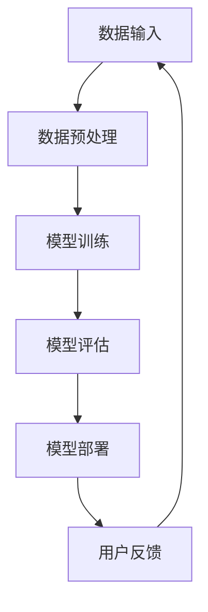

                 

### 引言与概述

近年来，人工智能（AI）技术尤其是大模型的快速发展，引发了科技界的广泛关注。大模型，如GPT-3、BERT等，已经在自然语言处理、图像识别、语音识别等多个领域取得了显著的成果，展现出巨大的潜力和应用前景。随着技术的进步和市场的需求，AI大模型创业逐渐成为一种新兴的商业模式，吸引了大量创业者和技术爱好者的目光。

#### AI大模型的崛起

AI大模型的成功离不开深度学习和计算能力的飞速发展。深度学习作为一种重要的机器学习方法，通过多层神经网络结构来模拟人脑的决策过程，具备强大的特征提取和学习能力。计算能力的提升，特别是高性能计算集群和GPU的普及，为大模型训练提供了强大的计算支持，使得训练大型神经网络成为可能。

#### 创业机会与挑战

AI大模型创业不仅带来了丰富的商业机会，也伴随着一系列挑战。首先，技术门槛较高，创业者需要具备深厚的计算机科学和人工智能背景，才能理解和应用大模型。其次，大规模的数据集和计算资源是训练大模型的必要条件，这对初创公司而言是一大挑战。此外，如何将大模型商业化，构建可持续的商业模式，也是创业者需要认真考虑的问题。

#### 本书背景及意义

本篇文章旨在探讨AI大模型创业的商业模式构建，通过系统的分析和实际案例，为创业者提供有价值的参考和指导。本文不仅介绍了AI大模型的基本概念和技术背景，还从商业模式、市场分析、产品开发、团队建设、营销策略等多个维度，详细阐述了构建可持续商业模式的策略和方法。

#### 本书结构与目标

本文结构分为九个章节，涵盖从技术基础到商业策略的各个方面。具体包括：

1. **AI大模型技术基础**：介绍深度学习、预训练模型和自然语言处理等相关技术。
2. **商业模式构建**：分析成功案例，探讨构建商业模式的方法和策略。
3. **市场分析与定位**：分析市场环境，确定目标市场和客户定位。
4. **产品开发与迭代**：阐述产品开发流程和快速迭代策略。
5. **团队建设与人才管理**：探讨团队建设、人才培养和激励机制。
6. **营销策略与推广**：介绍市场营销策略和推广渠道建设。
7. **持续运营与优化**：讨论运营目标、数据分析和系统升级。
8. **未来展望与风险应对**：展望AI大模型的发展趋势，探讨商业模式创新和风险管理。
9. **附录**：提供相关资源和工具，以及模型与算法流程图和代码实例。

本文的目标是为读者提供系统、全面的AI大模型创业指导，帮助读者理解大模型技术的原理和应用，掌握商业模式的构建和运营策略，从而在激烈的市场竞争中找到自己的定位，实现创业目标。

### 目录大纲设计

在本文中，我们将以逻辑清晰、结构紧凑的方式，详细介绍AI大模型创业的相关内容。为了帮助读者更好地理解，本文将分为九个章节，每个章节都将深入探讨一个特定的主题，从而形成一个完整、系统的知识体系。

#### 第1章: 引言与概述

本章节作为全文的开篇，将简要介绍AI大模型的背景和意义，阐述本文的研究目标和结构。通过本章节，读者可以初步了解AI大模型的发展趋势以及创业中的机遇与挑战。

- **1.1 本书背景及意义**：介绍AI大模型的发展背景，探讨其带来的商业机遇和挑战。
- **1.2 本书结构与目标**：详细阐述本文的结构安排和目标，为读者提供整体的阅读框架。
- **1.3 AI大模型基础**：简要介绍AI大模型的基本概念和技术背景，为后续章节奠定基础。
- **1.4 商业模式分析**：分析成功案例，探讨AI大模型创业的商业模式构建策略。

#### 第2章: AI大模型技术基础

本章节将深入探讨AI大模型的技术基础，包括深度学习、预训练模型和自然语言处理等核心技术。通过本章节的学习，读者可以系统地了解AI大模型的技术原理和应用场景。

- **2.1 深度学习基础**：介绍神经网络的基本概念，包括前馈神经网络、卷积神经网络和循环神经网络。
- **2.2 预训练模型**：探讨预训练模型的发展历程、技术原理和应用场景。
- **2.3 自然语言处理**：介绍词嵌入技术、序列模型和注意力机制等自然语言处理的核心技术。

#### 第3章: 商业模式构建

本章节将重点探讨AI大模型创业的商业模式构建，包括价值主张设计、收入模型和成本结构等方面。通过本章节的学习，读者可以了解如何构建可持续的商业模式，实现商业盈利。

- **3.1 商业模式概述**：介绍商业模式的基本概念和分类，探讨商业模式创新的方法。
- **3.2 价值主张设计**：分析用户需求，设计具有吸引力的价值主张。
- **3.3 收入模型**：探讨订阅模式、广告模式和产品销售模式等不同的收入模型。
- **3.4 成本结构**：分析变动成本和固定成本，优化资源配置和管理。

#### 第4章: 市场分析与定位

本章节将分析市场环境，探讨目标市场和客户定位。通过本章节的学习，读者可以了解市场分析的方法和策略，为创业项目的市场定位提供指导。

- **4.1 市场环境分析**：分析宏观环境和行业趋势，为市场分析提供背景。
- **4.2 竞争态势**：分析竞争对手，探讨自身的竞争优势。
- **4.3 目标市场与客户定位**：确定目标市场和客户群体，制定市场细分策略。

#### 第5章: 产品开发与迭代

本章节将讨论产品开发流程和快速迭代策略。通过本章节的学习，读者可以了解如何进行有效的产品开发和迭代，提升产品的市场竞争力和用户体验。

- **5.1 产品开发流程**：介绍需求分析、设计与开发、测试与部署等关键环节。
- **5.2 快速迭代策略**：探讨用户反馈机制、A/B测试和迭代优化的方法。
- **5.3 技术选型与工具栈**：介绍深度学习框架、云计算和DevOps实践等关键技术。

#### 第6章: 团队建设与人才管理

本章节将探讨团队建设、人才培养和激励机制等方面。通过本章节的学习，读者可以了解如何构建高效团队，培养和激励优秀人才，为创业项目提供坚实的人力支持。

- **6.1 团队建设策略**：介绍团队结构设计、跨部门协作等团队建设策略。
- **6.2 人才培养与激励机制**：探讨培训与发展计划、绩效评估与激励的方法。
- **6.3 文化建设与价值观**：介绍企业文化、团队氛围营造的重要性。

#### 第7章: 营销策略与推广

本章节将讨论市场营销策略和推广渠道建设。通过本章节的学习，读者可以了解如何制定有效的营销策略，利用多种渠道推广产品和服务。

- **7.1 市场营销策略**：介绍内容营销、社交媒体营销和口碑营销等策略。
- **7.2 营销渠道建设**：探讨线上渠道、线下渠道和联合营销的建设方法。
- **7.3 推广实战案例**：分享成功案例，讨论经验与教训。

#### 第8章: 持续运营与优化

本章节将讨论运营目标、数据分析和系统升级等方面。通过本章节的学习，读者可以了解如何实现持续运营和优化，提升产品和服务质量。

- **8.1 运营目标与指标**：设定运营目标，分析关键指标。
- **8.2 数据分析与优化**：介绍用户行为分析、数据驱动决策和优化策略。
- **8.3 系统升级与维护**：讨论技术迭代、系统稳定性和用户体验优化。

#### 第9章: 未来展望与风险应对

本章节将探讨AI大模型的发展趋势、商业模式创新和风险管理等方面。通过本章节的学习，读者可以了解未来的发展趋势和潜在风险，为创业项目的长期发展提供参考。

- **9.1 AI大模型发展趋势**：分析技术革新和应用拓展。
- **9.2 商业模式创新**：探讨新的收入模式和增值服务。
- **9.3 风险管理**：讨论技术风险、市场风险和法律风险的管理策略。

通过以上章节的详细阐述，本文将为读者提供系统、全面的AI大模型创业指导，帮助读者理解大模型技术的原理和应用，掌握商业模式的构建和运营策略，从而在激烈的市场竞争中找到自己的定位，实现创业目标。

### AI大模型基础

在深入探讨AI大模型创业的商业模式之前，我们首先需要理解AI大模型的基本概念和技术原理。AI大模型是指通过深度学习等机器学习方法训练得到的，具有大规模参数和复杂结构的神经网络模型。这些模型在自然语言处理、计算机视觉、语音识别等领域取得了显著的成果，成为推动人工智能发展的核心动力。

#### 定义与分类

AI大模型可以定义为一种具有数百万甚至数十亿参数的深度学习模型。根据应用领域的不同，AI大模型可以分为以下几类：

1. **自然语言处理（NLP）模型**：如GPT、BERT、RoBERTa等，主要用于处理文本数据，具有强大的语言理解和生成能力。
2. **计算机视觉（CV）模型**：如ResNet、Inception、VGG等，用于图像分类、目标检测和图像生成等任务。
3. **语音识别（ASR）模型**：如DeepSpeech、WaveNet等，用于语音信号处理和转换成文本。

#### 技术发展与趋势

AI大模型的发展经历了多个阶段，从早期的浅层神经网络到深层的卷积神经网络（CNN）和循环神经网络（RNN），再到现代的Transformer模型，如BERT和GPT。这些技术进步使得模型能够更好地捕捉数据的复杂特征，提高模型的性能。

1. **深度学习基础**：深度学习是一种通过多层神经网络对数据特征进行自动提取和建模的技术。前馈神经网络（FNN）、卷积神经网络（CNN）和循环神经网络（RNN）是深度学习的核心组成部分。
   - **前馈神经网络（FNN）**：信息在神经网络中依次前向传递，没有反馈路径。适用于图像分类、回归等问题。
   - **卷积神经网络（CNN）**：通过卷积层捕捉图像的局部特征，适用于图像识别、图像分割等任务。
   - **循环神经网络（RNN）**：具有反馈路径，能够处理序列数据，如时间序列分析、语言模型等。

2. **预训练模型**：预训练模型是在大规模数据集上进行预训练，然后进行微调，适用于特定任务。预训练模型如BERT、GPT通过在大量文本数据上进行预训练，大幅提升了自然语言处理任务的效果。

3. **Transformer模型**：Transformer模型引入了注意力机制，通过全局注意力计算，使模型能够更好地捕捉长距离依赖关系，是现代自然语言处理的重要技术。

#### 市场现状与挑战

随着AI大模型的不断发展和应用，市场对其需求也日益增长。然而，AI大模型创业面临着一系列挑战：

1. **技术门槛**：训练和部署大模型需要大量的计算资源和专业技能，这对初创公司而言是一大挑战。
2. **数据需求**：大模型训练需要大量的高质量数据，数据的获取和处理也是一个难题。
3. **商业模式**：如何将大模型商业化，构建可持续的商业模式，是创业者需要面对的重要问题。
4. **隐私和安全**：随着AI大模型的应用，数据隐私和安全问题也日益突出，需要采取有效的措施确保用户数据的安全。

#### 成功案例分析

尽管面临诸多挑战，但仍然有许多成功的AI大模型创业案例。以下是一些典型案例：

1. **OpenAI**：OpenAI通过大规模预训练模型如GPT，推出了一系列自然语言处理产品，取得了显著的成功。
2. **DeepMind**：DeepMind的AlphaGo在围棋领域取得了重大突破，通过深度学习和强化学习技术，实现了超越人类的围棋水平。
3. **AI21 Labs**：AI21 Labs开发的GPT-3模型，被广泛应用于文本生成、自动化写作等领域，为企业提供了强大的AI工具。

这些案例展示了AI大模型在商业上的巨大潜力，同时也为其他创业者提供了宝贵的经验和启示。

通过以上分析，我们可以看到AI大模型的基础知识和其在市场上的重要地位。在接下来的章节中，我们将进一步探讨如何构建可持续的商业模式，应对创业中的挑战，实现商业成功。

### 商业模式分析

在AI大模型创业的浪潮中，成功的商业模式是确保企业可持续发展的关键。本章节将结合成功案例，深入分析AI大模型创业中常见的商业模式，并探讨应对挑战的策略。

#### 成功案例

1. **OpenAI**：作为一家专注于AI研究的公司，OpenAI通过预训练模型GPT-3等推出了一系列自然语言处理产品。其商业模式主要基于以下几点：
   - **订阅模式**：用户根据使用量支付订阅费用，这种方式不仅保证了稳定的收入流，还通过灵活的定价策略吸引不同层次的用户。
   - **API接口**：OpenAI通过API接口将模型能力开放给开发者，使得企业可以将AI能力集成到自己的产品中，实现商业价值的最大化。
   - **合作伙伴关系**：OpenAI与多家企业建立合作，共同开发基于AI的应用，扩大市场覆盖。

2. **DeepMind**：DeepMind通过其AI算法如AlphaGo在围棋领域取得了突破性成果，其商业模式主要包括：
   - **产品销售**：DeepMind开发的AI产品如DeepMind Health等，被应用于医疗领域，通过产品销售实现收入。
   - **技术授权**：DeepMind还通过技术授权，与其他公司合作，共享其AI技术，实现商业合作和收益。
   - **研究与投资**：DeepMind在保持自身技术领先的同时，还投资和孵化其他AI初创公司，形成生态系统，推动整个AI领域的发展。

3. **AI21 Labs**：AI21 Labs开发的GPT-3模型，被广泛应用于文本生成和自动化写作等领域，其商业模式如下：
   - **API服务**：通过提供API服务，AI21 Labs将GPT-3的能力开放给开发者，实现规模化的应用。
   - **合作伙伴关系**：与多家企业合作，将AI能力集成到客户的产品中，共同开发解决方案。
   - **定制化服务**：针对特定行业和客户需求，提供定制化的AI解决方案。

#### 挑战与应对策略

尽管AI大模型创业有着巨大的潜力，但仍然面临诸多挑战。以下是一些常见的挑战及其应对策略：

1. **技术门槛**：
   - **人才引进**：通过高薪聘请顶尖人才，或与高校和研究机构合作，吸引和培养高水平的研发人员。
   - **技术积累**：通过持续的研发投入，积累核心技术，形成技术壁垒。

2. **数据需求**：
   - **数据合作**：与数据提供商合作，获取高质量的数据集。
   - **数据治理**：建立完善的数据治理体系，确保数据的质量和安全。

3. **商业模式**：
   - **市场调研**：通过市场调研，了解用户需求，设计符合市场需求的商业模式。
   - **创新尝试**：尝试多种商业模式，找到最适合自身发展的路径。

4. **隐私和安全**：
   - **合规性**：遵循相关法律法规，确保用户数据的合法使用。
   - **安全技术**：采用先进的加密技术和安全措施，保护用户数据的安全。

5. **市场竞争**：
   - **差异化定位**：找到自身独特的产品优势，进行差异化定位。
   - **快速迭代**：通过快速迭代，不断提升产品和服务质量，保持竞争力。

通过以上分析，我们可以看到，成功的AI大模型创业不仅需要强大的技术基础，还需要创新性的商业模式和有效的应对策略。在接下来的章节中，我们将继续探讨AI大模型的技术基础和实际应用，为创业者提供更全面的指导。

### AI大模型技术基础

AI大模型的成功离不开一系列关键技术的支撑。本章节将深入探讨AI大模型技术的基础，包括深度学习、预训练模型和自然语言处理等方面的核心技术。通过本章节的学习，读者可以系统地了解AI大模型的技术原理和应用场景。

#### 深度学习基础

深度学习是一种基于多层神经网络的学习方法，通过多层非线性变换来提取数据中的特征，实现复杂的分类、回归和生成任务。以下是几种主要的深度学习模型：

1. **前馈神经网络（FNN）**：
   - **基本概念**：前馈神经网络由输入层、隐藏层和输出层组成，信息从前一层直接传递到下一层。
   - **激活函数**：常用的激活函数有Sigmoid、ReLU、Tanh等，用于引入非线性变换。
   - **权重与偏置**：前馈神经网络通过学习输入和输出之间的权重矩阵和偏置向量，实现特征的自动提取和分类。
   - **训练过程**：使用反向传播算法（BP）训练模型，通过梯度下降法（GD）或其变种（如Adam）优化模型参数。

2. **卷积神经网络（CNN）**：
   - **基本概念**：卷积神经网络通过卷积层和池化层，捕捉图像的局部特征，适用于图像分类、目标检测和图像生成等任务。
   - **卷积操作**：卷积层通过滑动窗口在输入图像上执行卷积操作，提取局部特征。
   - **池化操作**：池化层通过下采样操作减少数据维度，增强模型的泛化能力。
   - **深度可分离卷积**：深度可分离卷积将标准卷积分解为深度卷积和逐点卷积，提高计算效率。

3. **循环神经网络（RNN）**：
   - **基本概念**：循环神经网络通过反馈连接，处理序列数据，如时间序列分析、语言模型等。
   - **状态循环**：RNN通过隐藏状态实现信息的长期记忆，适用于需要处理时间序列的任务。
   - **门控机制**：长短期记忆网络（LSTM）和门控循环单元（GRU）通过引入门控机制，解决传统RNN的梯度消失问题。
   - **变分自编码器（VAE）**：变分自编码器结合了生成模型和编码器-解码器结构，用于生成多样化的高维数据。

#### 预训练模型

预训练模型通过在大规模数据集上进行预训练，然后针对特定任务进行微调，能够显著提升模型的性能。以下是几种主要的预训练模型：

1. **自监督学习**：
   - **基本概念**：自监督学习利用未标注的数据进行预训练，通过预测任务（如填空、分类等）学习数据的潜在特征。
   - **Word2Vec**：Word2Vec是一种词嵌入模型，通过预测词窗口中的词来学习词向量，捕捉词的语义信息。
   - **BERT**：BERT（Bidirectional Encoder Representations from Transformers）通过双向Transformer结构，同时学习文本的左右信息，提升语言理解能力。

2. **迁移学习**：
   - **基本概念**：迁移学习利用预训练模型在大规模数据集上的知识，迁移到新的任务中，减少数据需求和提高性能。
   - **Fine-tuning**：微调通过在特定任务的数据上进行少量训练，调整预训练模型的参数，实现对新任务的适应。
   - **MAML（Model-Agnostic Meta-Learning）**：MAML通过元学习技术，使模型能够在少量样本上快速适应新任务。

3. **多任务学习**：
   - **基本概念**：多任务学习通过同时学习多个任务，共享模型参数，提高模型对数据的理解和泛化能力。
   - ** Few-shot Learning**：少量样本学习通过在少量样本上训练模型，实现对新任务的快速适应。
   - **BiLSTM-CRF**：双向长短期记忆网络（BiLSTM）结合条件随机场（CRF），用于序列标注任务，如命名实体识别。

#### 自然语言处理

自然语言处理（NLP）是AI大模型的重要应用领域，通过词嵌入、序列模型和注意力机制等核心技术，实现对文本数据的理解和生成。以下是几种主要的NLP技术：

1. **词嵌入**：
   - **基本概念**：词嵌入将词语映射为高维向量，捕捉词语的语义信息。
   - **Word2Vec**：Word2Vec通过预测词窗口中的词来学习词向量，捕捉词的语义关系。
   - **BERT**：BERT通过Transformer结构，同时学习词的左右信息，提升语言理解能力。

2. **序列模型**：
   - **基本概念**：序列模型处理序列数据，如时间序列、语音信号和文本。
   - **LSTM（Long Short-Term Memory）**：LSTM通过门控机制，解决传统RNN的梯度消失问题，适用于序列数据建模。
   - **GRU（Gated Recurrent Unit）**：GRU简化LSTM的结构，提高计算效率。

3. **注意力机制**：
   - **基本概念**：注意力机制通过分配不同的权重，关注重要信息，提升模型的性能。
   - **自注意力（Self-Attention）**：自注意力通过计算序列中每个词的权重，捕捉长距离依赖关系。
   - **多头注意力（Multi-Head Attention）**：多头注意力通过并行计算多个注意力机制，提升模型的表示能力。

通过以上对深度学习、预训练模型和自然语言处理等核心技术的深入探讨，我们可以看到AI大模型的技术基础是多么的复杂和强大。这些技术不仅为AI大模型的发展提供了坚实的基础，也为创业者提供了丰富的应用场景和创新空间。在接下来的章节中，我们将进一步探讨如何构建可持续的商业模式，实现AI大模型的商业成功。

### 商业模式构建

在了解了AI大模型的技术基础后，接下来我们将深入探讨如何构建可持续的商业模式。一个成功的商业模式不仅能够帮助企业实现盈利，还能够确保企业的长期可持续发展。本文将从价值主张设计、收入模型和成本结构三个方面，详细分析AI大模型创业中的商业模式构建策略。

#### 价值主张设计

价值主张（Value Proposition）是指企业为用户提供的独特价值，是商业模式的核心。在AI大模型创业中，价值主张的设计至关重要，它直接关系到用户是否愿意为产品或服务付费。以下是设计价值主张时需要考虑的关键因素：

1. **用户需求分析**：
   - **调研与访谈**：通过调研和访谈，了解潜在用户的需求和痛点，发现市场机会。
   - **用户画像**：根据调研结果，构建用户画像，明确目标用户群体的特点和需求。
   - **优先级排序**：根据用户需求的重要性和紧急程度，对需求进行优先级排序，确保价值主张能够解决用户最迫切的问题。

2. **竞争分析**：
   - **竞争对手**：分析竞争对手的价值主张，了解其优势和不足，找到差异化点。
   - **市场定位**：根据竞争分析结果，确定自身的市场定位，明确自身在市场上的独特价值。

3. **价值主张构建**：
   - **解决问题**：将用户需求与企业的核心竞争力相结合，构建能够解决问题的价值主张。
   - **提供增值**：在解决问题的基础上，提供额外的增值服务，提升用户满意度。
   - **差异化**：通过差异化策略，确保价值主张在市场上具有竞争力。

#### 收入模型

收入模型是企业实现盈利的重要手段，常见的收入模型包括订阅模式、广告模式和产品销售模式等。以下是这些收入模型的详细分析：

1. **订阅模式**：
   - **优点**：订阅模式能够带来稳定的收入流，降低客户流失率。
   - **缺点**：初期用户获取成本较高，需要持续提供高质量的服务。
   - **适用场景**：适用于提供持续服务的应用场景，如云计算、在线学习平台等。

2. **广告模式**：
   - **优点**：广告模式能够快速获取用户，提高市场知名度。
   - **缺点**：收入不稳定，依赖于广告投放量和价格。
   - **适用场景**：适用于用户基数大、流量高的应用场景，如社交媒体、搜索引擎等。

3. **产品销售模式**：
   - **优点**：产品销售能够带来一次性收入，快速回笼资金。
   - **缺点**：需要不断推出新产品或更新，维持市场吸引力。
   - **适用场景**：适用于有明确用户需求和市场定位的产品，如软件、硬件设备等。

4. **多元化收入模型**：
   - **混合模式**：结合多种收入模型，实现多元化收入来源，降低风险。
   - **增值服务**：在基础服务之外，提供增值服务，如高级功能、定制化解决方案等，提升用户粘性。

#### 成本结构

成本结构是影响企业盈利能力的重要因素，合理的成本结构能够帮助企业实现高效运营和持续盈利。以下是成本结构的主要组成部分：

1. **变动成本**：
   - **人员成本**：包括员工薪酬、培训和福利等。
   - **运营成本**：包括服务器、带宽、存储等基础设施费用。
   - **市场推广成本**：包括广告投放、活动费用等。

2. **固定成本**：
   - **研发成本**：包括研发人员薪酬、设备购置等。
   - **办公成本**：包括场地租赁、水电费等。
   - **管理成本**：包括行政人员薪酬、办公设备购置等。

3. **成本控制策略**：
   - **优化资源配置**：通过合理配置资源，减少浪费，提高效率。
   - **技术升级**：采用新技术降低运营成本，如云计算、自动化等。
   - **合作伙伴关系**：与供应商建立长期合作关系，降低采购成本。

通过以上对价值主张设计、收入模型和成本结构的详细分析，我们可以看到，一个成功的商业模式需要综合考虑多个方面，确保企业在激烈的市场竞争中立于不败之地。在接下来的章节中，我们将继续探讨市场分析与定位、产品开发与迭代等关键环节，为创业者提供全面的指导。

### 市场分析与定位

在构建AI大模型创业的商业模式时，准确的市场分析和目标市场定位至关重要。通过深入分析市场环境、竞争态势以及目标客户群体，企业可以制定出科学合理的市场策略，从而在激烈的市场竞争中占据有利位置。

#### 市场环境分析

市场环境分析是了解外部市场状况的过程，主要包括宏观环境和行业趋势两个方面。

1. **宏观环境**：
   - **技术趋势**：随着人工智能技术的快速发展，AI大模型在自然语言处理、计算机视觉和语音识别等领域展现出巨大的应用潜力。这些技术的进步为AI大模型创业提供了广阔的市场空间。
   - **政策支持**：许多国家政府都积极推动人工智能技术的发展，出台了一系列政策支持和资金投入，为AI大模型创业提供了良好的政策环境。
   - **市场需求**：随着企业数字化转型的推进，对AI技术的需求日益增长。企业希望通过AI技术提升效率、降低成本，实现业务增长。

2. **行业趋势**：
   - **市场规模**：AI大模型市场正在迅速扩大，预计未来几年将保持高速增长。根据市场研究报告，全球AI大模型市场规模将在未来五年内达到数百亿美元。
   - **应用领域**：AI大模型在金融、医疗、教育、零售等多个行业得到广泛应用。随着行业需求的不断增长，AI大模型的应用场景将进一步拓展。

#### 竞争态势

了解市场竞争状况是制定市场策略的重要步骤。以下是对竞争态势的分析：

1. **竞争对手**：
   - **领先企业**：在AI大模型领域，有许多领先企业如Google、OpenAI、Microsoft等。这些企业通过大量研发投入和技术积累，占据了市场的主导地位。
   - **新兴企业**：随着AI技术的普及，许多新兴企业也进入市场，通过创新技术和商业模式，争夺市场份额。

2. **竞争优势**：
   - **技术优势**：领先企业凭借强大的技术积累和研发能力，在AI大模型领域保持领先地位。新兴企业需要通过技术创新来建立竞争优势。
   - **市场定位**：不同企业根据自身优势和市场需求，选择不同的市场定位。例如，有些企业专注于特定行业，提供定制化的解决方案。

3. **市场份额**：
   - **市场份额分布**：通过市场调研，了解不同企业在市场中的份额分布，明确自身在市场中的位置。
   - **市场份额变化**：分析市场份额的变化趋势，了解市场的竞争动态，及时调整市场策略。

#### 目标市场与客户定位

在了解市场环境和竞争态势后，企业需要明确目标市场和客户群体，制定市场细分策略。

1. **目标市场**：
   - **行业细分**：根据行业特点和应用需求，将市场细分为金融、医疗、教育、零售等行业。
   - **区域细分**：根据地理位置和市场需求，将市场细分为国内市场和国际市场。

2. **客户定位**：
   - **核心客户**：识别并确定最具价值的客户群体，如具有高需求和高支付意愿的企业。
   - **潜在客户**：通过市场调研和数据分析，发现潜在的优质客户，如新兴企业和中小企业。

3. **市场细分策略**：
   - **差异化策略**：针对不同细分市场，制定差异化营销策略，提供定制化的产品和服务。
   - **精准营销**：通过精准营销手段，如内容营销、社交媒体推广等，提高品牌知名度和用户转化率。
   - **合作伙伴关系**：与行业内的领先企业建立合作关系，共同开发解决方案，拓展市场份额。

通过以上对市场环境分析、竞争态势和目标市场与客户定位的详细探讨，企业可以制定出科学合理的市场策略，从而在激烈的市场竞争中找到自己的定位，实现商业成功。在接下来的章节中，我们将继续探讨产品开发与迭代、团队建设与人才管理等方面的内容，为AI大模型创业提供全面的指导。

### 产品开发与迭代

在AI大模型创业过程中，产品的开发与迭代是确保企业竞争力的重要环节。通过有效的产品开发流程和快速迭代策略，企业可以不断优化产品，提升用户体验，从而在市场中占据有利位置。

#### 产品开发流程

产品开发流程是产品从概念到上市的全过程，包括需求分析、设计与开发、测试与部署等关键环节。

1. **需求分析**：
   - **用户调研**：通过用户访谈、问卷调查等方式，深入了解用户需求，挖掘潜在的市场机会。
   - **功能需求**：根据用户调研结果，明确产品的功能需求，确保产品能够解决用户的核心问题。
   - **非功能需求**：考虑产品的性能、可扩展性、安全性等非功能需求，为后续开发提供指导。

2. **设计与开发**：
   - **需求文档**：编写详细的需求文档，明确产品的功能、界面设计和技术实现方案。
   - **原型设计**：通过原型设计工具，如Figma、Axure等，制作产品原型，验证设计思路和用户体验。
   - **开发实现**：根据需求文档和原型设计，进行编码实现，开发出初步的产品版本。

3. **测试与部署**：
   - **单元测试**：对模块进行单元测试，确保每个模块的功能和性能符合要求。
   - **集成测试**：将各个模块集成在一起，进行集成测试，确保模块之间的协同工作。
   - **系统测试**：对整个系统进行测试，包括性能测试、安全测试等，确保产品的稳定性、安全性和可靠性。
   - **部署上线**：将测试通过的产品部署到生产环境，上线供用户使用。

#### 快速迭代策略

快速迭代策略是产品开发的一种方法论，通过持续的用户反馈和迭代优化，不断提升产品的质量和用户体验。

1. **用户反馈机制**：
   - **A/B测试**：通过A/B测试，将产品功能的不同版本同时提供给部分用户，收集用户反馈数据，分析用户偏好，优化产品功能。
   - **用户调研**：定期进行用户调研，收集用户对产品的使用体验、建议和需求，为产品优化提供依据。

2. **迭代优化**：
   - **敏捷开发**：采用敏捷开发方法，将产品开发过程分为多个短期迭代周期，每个周期完成一部分功能开发，并进行测试和反馈。
   - **持续集成**：通过持续集成（CI）工具，实现代码的自动化测试和部署，提高开发效率和产品质量。
   - **数据分析**：利用数据分析工具，对用户行为数据进行分析，发现用户使用中的问题和改进点，指导产品优化。

3. **技术选型与工具栈**：
   - **深度学习框架**：选择适合的深度学习框架，如TensorFlow、PyTorch等，进行模型开发和训练。
   - **云计算与容器化**：利用云计算和容器化技术，提高开发效率和系统稳定性，如使用Docker和Kubernetes进行容器管理。
   - **DevOps实践**：通过DevOps实践，实现开发和运维的紧密结合，提高产品的交付速度和稳定性。

#### 项目实战

以下是一个项目实战案例，通过实际开发过程，展示产品开发和迭代的方法和策略。

1. **项目背景**：
   - **目标**：开发一款基于AI大模型的智能问答系统，为企业提供自动化的客户服务。
   - **用户需求**：用户希望能够通过简单的接口，快速获得准确、高质量的问答服务，提高客服效率。

2. **需求分析**：
   - **用户访谈**：与多个企业进行访谈，了解他们的客服需求和痛点。
   - **功能需求**：明确问答系统的基本功能，如文本输入、答案生成、多轮对话等。
   - **非功能需求**：确保系统的性能、安全性和可扩展性。

3. **设计与开发**：
   - **需求文档**：编写详细的需求文档，包括功能描述、界面设计和技术实现方案。
   - **原型设计**：制作产品原型，与用户验证设计思路和用户体验。
   - **模型开发**：使用TensorFlow框架，开发基于BERT的问答模型，进行预训练和微调。

4. **测试与部署**：
   - **单元测试**：对问答模型的每个模块进行单元测试，确保功能正确。
   - **集成测试**：将问答模型与前端界面集成，进行集成测试。
   - **系统测试**：对整个系统进行性能测试和安全测试。
   - **部署上线**：将测试通过的系统部署到服务器，上线供用户使用。

5. **迭代优化**：
   - **用户反馈**：收集用户反馈，了解系统的使用情况。
   - **A/B测试**：通过A/B测试，优化问答模型和界面设计。
   - **数据分析**：分析用户行为数据，发现系统使用中的问题和改进点。

通过以上项目实战，我们可以看到，快速迭代和用户反馈在产品开发和优化过程中的重要性。通过不断优化产品，提升用户体验，企业可以更好地满足用户需求，实现商业成功。

### 团队建设与人才管理

在AI大模型创业过程中，团队建设与人才管理是确保企业长期发展的重要基石。一个高效的团队能够推动技术创新，提升产品竞争力。本文将从团队建设策略、人才培养与激励机制、文化建设与价值观三个方面，详细探讨团队建设与人才管理的关键要素。

#### 团队建设策略

有效的团队建设策略能够促进团队成员之间的协作，提高工作效率。以下是几种常见的团队建设策略：

1. **团队结构设计**：
   - **扁平化管理**：通过减少管理层级，建立扁平化的组织结构，促进信息流通和快速决策。
   - **跨部门协作**：鼓励不同部门之间的协作，通过跨部门项目或团队，实现资源共享和协同创新。
   - **专业分工**：根据团队成员的专业技能和兴趣，合理分配任务，确保每个成员能够在自己擅长的领域发挥最大价值。

2. **领导力培养**：
   - **领导力培训**：通过领导力培训，提升团队领导者的管理能力和领导力，确保团队目标的实现。
   - **角色扮演**：通过角色扮演和模拟训练，培养团队成员的领导力和决策能力。
   - **导师制度**：建立导师制度，由经验丰富的老员工指导新员工，帮助其快速融入团队并提升技能。

3. **沟通与协作**：
   - **定期会议**：通过定期会议，如周会、月度会议等，及时沟通项目进展、问题和解决方案。
   - **协作工具**：利用协作工具，如Slack、Trello等，实现团队成员之间的实时沟通和任务管理。
   - **文化建设**：通过团队文化建设，营造积极、开放的工作氛围，增强团队成员之间的信任和凝聚力。

#### 人才培养与激励机制

优秀的人才是企业持续创新和发展的关键。以下是几种有效的人才培养与激励机制：

1. **培训与发展计划**：
   - **技术培训**：为员工提供技术培训，帮助其掌握最新的技术知识和技能，提升专业能力。
   - **职业规划**：为员工制定职业发展规划，明确短期和长期的职业目标，提供发展路径和晋升机会。
   - **外部学习**：鼓励员工参加行业会议、培训课程等，拓宽视野，增强专业素养。

2. **绩效评估与激励**：
   - **KPI考核**：通过关键绩效指标（KPI）对员工的工作表现进行评估，确保考核的客观性和公正性。
   - **激励机制**：设立激励机制，如绩效奖金、股权激励等，激发员工的积极性和创造力。
   - **员工反馈**：定期收集员工反馈，了解其工作满意度和需求，及时调整管理策略和激励机制。

3. **员工福利与关怀**：
   - **福利制度**：建立完善的福利制度，包括薪资、保险、培训、休假等，提高员工的生活质量和工作满意度。
   - **员工关怀**：关注员工的生活和工作状态，提供心理辅导、健康检查等福利，增强员工的归属感和忠诚度。

#### 文化建设与价值观

企业文化是团队凝聚力和员工归属感的重要来源。以下是如何进行文化建设与价值观的构建：

1. **企业文化建设**：
   - **核心价值观**：明确企业的核心价值观，如创新、客户至上、团队合作等，并将其融入日常管理和工作中。
   - **企业愿景和使命**：通过企业愿景和使命的传达，激发员工的使命感和责任感，增强团队的凝聚力。
   - **员工参与**：鼓励员工参与企业文化建设，如组织团队活动、文化建设研讨会等，提升员工的主人翁意识。

2. **价值观传播**：
   - **领导示范**：通过领导者的言行示范，将核心价值观传播给员工，树立良好的榜样。
   - **内部培训**：通过内部培训课程，如企业文化讲座、团队建设培训等，加强员工对企业文化的理解和认同。
   - **文化宣传**：利用公司内部网站、宣传栏、员工手册等渠道，宣传企业文化，营造积极向上的文化氛围。

3. **文化建设活动**：
   - **团队建设活动**：通过团队建设活动，如团队拓展训练、团建活动等，增强团队凝聚力和归属感。
   - **员工表彰**：设立员工表彰制度，对在团队建设中表现突出的员工进行表彰，树立典型，激发员工积极性。
   - **员工关怀**：通过员工关怀活动，如生日庆祝、节日活动等，增进员工之间的感情，提升团队凝聚力。

通过以上对团队建设策略、人才培养与激励机制、文化建设与价值观的详细探讨，企业可以构建一个高效、和谐、有凝聚力的团队，为AI大模型创业提供坚实的人才支持。在接下来的章节中，我们将继续探讨营销策略与推广、持续运营与优化等关键内容。

### 营销策略与推广

在AI大模型创业中，成功的营销策略和推广策略是提升品牌知名度、吸引潜在客户和实现商业成功的关键。以下是几种主要的营销策略和推广渠道，以及一个成功案例的分析。

#### 市场营销策略

1. **内容营销**：
   - **技术博客**：撰写高质量的技术博客，分享AI大模型的应用场景、技术原理和实际案例，吸引技术爱好者和专业人士的关注。
   - **白皮书和报告**：发布行业白皮书和报告，展示企业的技术实力和市场洞察，提升企业在行业中的影响力。
   - **教育视频**：制作教程视频，介绍如何使用AI大模型进行数据处理和模型训练，帮助用户快速上手。

2. **社交媒体营销**：
   - **社交媒体平台**：在LinkedIn、Twitter、Facebook等社交媒体平台上，发布行业动态、技术文章和公司新闻，增加品牌曝光度。
   - **KOL合作**：与行业内的意见领袖（KOL）合作，通过他们的推荐和分享，吸引更多潜在客户。
   - **互动营销**：通过社交媒体进行互动，如问答、投票和抽奖等活动，增加用户参与度和品牌忠诚度。

3. **口碑营销**：
   - **用户推荐**：通过提供优质的产品和服务，获得用户的口碑推荐，从而吸引更多新用户。
   - **案例分享**：分享成功案例，展示AI大模型在实际业务中的应用效果，增加潜在客户的信任度。
   - **用户评价**：在产品页面和社交媒体上展示用户评价，增加潜在客户对产品的信任。

#### 营销渠道建设

1. **线上渠道**：
   - **官方网站**：建立企业官方网站，提供产品介绍、技术文档和用户支持，作为品牌展示和用户获取的重要渠道。
   - **在线广告**：通过Google Ads、Facebook Ads等在线广告平台，进行精准定位和推广，提高品牌曝光率。
   - **博客平台**：在博客平台上，如Medium、知乎等，发布技术文章和行业观点，吸引潜在客户。

2. **线下渠道**：
   - **行业会议**：参加行业会议、展览和研讨会，展示产品和服务，建立行业联系。
   - **线下活动**：组织线下活动，如技术沙龙、用户研讨会等，与潜在客户进行面对面交流，增加信任和互动。
   - **合作伙伴**：与行业内的合作伙伴建立合作关系，共同推广产品和服务，扩大市场影响力。

3. **联合营销**：
   - **渠道合作**：与销售渠道、分销商和合作伙伴合作，通过渠道的力量扩大市场覆盖。
   - **合作伙伴营销**：与行业内的领先企业合作，共同开发解决方案，提高产品竞争力。
   - **品牌联合**：与其他品牌进行联合营销，通过跨界合作，吸引更多潜在客户。

#### 成功案例

1. **案例背景**：
   - **企业**：AI21 Labs，开发GPT-3模型的初创公司。
   - **目标**：提升品牌知名度，吸引潜在客户，实现产品销售。

2. **策略实施**：
   - **内容营销**：发布高质量的技术博客和案例研究，详细介绍GPT-3的应用场景和技术优势，吸引技术爱好者和专业人士的关注。
   - **社交媒体营销**：在LinkedIn、Twitter等社交媒体平台上，发布行业动态、技术文章和公司新闻，增加品牌曝光度。
   - **口碑营销**：通过成功案例分享和用户评价，展示GPT-3在实际业务中的应用效果，增加潜在客户的信任度。
   - **线上广告**：在Google Ads、Facebook Ads等平台上进行精准定位和推广，提高品牌曝光率。
   - **线下活动**：参加行业会议和展览，展示产品和服务，建立行业联系。

3. **效果评估**：
   - **品牌知名度**：通过上述营销策略，AI21 Labs的品牌知名度显著提升，吸引了大量潜在客户和合作伙伴的关注。
   - **用户增长**：通过口碑营销和内容营销，AI21 Labs的用户数量不断增加，实现了稳定的用户增长。
   - **销售增长**：通过线上广告和线下活动，AI21 Labs的销售业绩持续增长，实现了商业成功。

通过以上案例的分析，我们可以看到，成功的营销策略和推广渠道对于AI大模型创业的重要性。在接下来的章节中，我们将继续探讨持续运营与优化的关键内容，为企业的长期发展提供指导。

### 持续运营与优化

在AI大模型创业的过程中，持续运营与优化是确保企业长期稳定发展的关键。通过设定运营目标与指标、数据驱动决策、系统升级与维护等方式，企业可以不断提升产品质量和用户体验，实现可持续的商业增长。

#### 运营目标与指标

运营目标是指企业希望在特定时间内实现的具体目标，这些目标需要通过一系列可量化的指标来衡量。以下是常见的运营目标与指标：

1. **用户增长**：
   - **新增用户数**：衡量产品吸引新用户的能力，通常以月度或季度为单位进行统计。
   - **用户留存率**：衡量产品留住用户的能力，计算公式为（总用户数 - 新增用户数）/ 总用户数。

2. **用户活跃度**：
   - **每日活跃用户数（DAU）**：衡量每天使用产品的用户数量，反映产品的日常使用情况。
   - **每周活跃用户数（WAU）**：衡量每周使用产品的用户数量，用于评估产品的长期使用情况。

3. **营收增长**：
   - **月收入（MRR）**：衡量企业每月收入的稳定性和增长趋势。
   - **收入增长率**：计算公式为（当前月收入 - 上月收入）/ 上月收入，反映收入增长的速度。

4. **客户满意度**：
   - **净推荐值（NPS）**：通过用户满意度调查，计算用户推荐意愿的得分，得分越高表示用户满意度越高。
   - **用户反馈率**：衡量用户对产品的反馈比例，用于评估产品的问题和改进点。

#### 数据分析与优化

数据分析是持续运营与优化的核心，通过分析用户行为数据，企业可以做出更明智的决策，提升产品和服务质量。

1. **用户行为分析**：
   - **用户路径分析**：通过分析用户在产品中的行为路径，发现用户的常用功能和痛点，优化用户体验。
   - **留存分析**：分析用户留存数据，识别导致用户流失的原因，针对性地进行改进。

2. **数据驱动决策**：
   - **A/B测试**：通过A/B测试，比较不同版本产品对用户行为和业务指标的影响，选择最优方案。
   - **KPI监控**：建立KPI监控体系，实时跟踪关键业务指标，确保运营目标的实现。

3. **优化策略**：
   - **产品迭代**：根据用户反馈和数据分析，持续进行产品迭代，优化产品功能和用户体验。
   - **运营策略**：根据数据分析和市场调研，调整营销和运营策略，提高用户获取和留存效果。

#### 系统升级与维护

系统的稳定性和安全性是企业持续运营的基础，通过定期升级和维护，企业可以确保系统的正常运行。

1. **技术迭代**：
   - **框架升级**：定期升级深度学习框架和中间件，采用最新的技术，提高系统性能和稳定性。
   - **代码优化**：对系统代码进行优化，减少内存占用和计算时间，提高系统的响应速度。

2. **系统稳定性**：
   - **容灾备份**：建立容灾备份机制，确保在系统故障时能够快速恢复，减少业务中断时间。
   - **监控告警**：通过监控系统，实时监控系统的运行状态，及时发现并处理潜在问题。

3. **用户体验优化**：
   - **界面优化**：根据用户反馈，优化产品界面设计，提高用户操作的便捷性和直观性。
   - **性能优化**：通过性能测试和优化，提升系统的响应速度和处理能力，确保用户顺畅的使用体验。

#### 实战案例

以下是一个实战案例，展示如何通过持续运营与优化实现企业目标：

1. **企业背景**：
   - **企业**：某AI初创公司，提供基于GPT-3的智能客服系统。
   - **目标**：提升用户留存率，增加营收。

2. **实施步骤**：
   - **用户行为分析**：通过数据分析工具，收集用户行为数据，识别用户在系统中的常用功能和痛点。
   - **A/B测试**：进行A/B测试，对比不同客服界面和功能对用户留存率的影响，选择最优方案。
   - **产品迭代**：根据A/B测试结果，优化客服界面和功能，提升用户体验。
   - **运营策略**：调整营销策略，通过内容营销和社交媒体推广，增加用户获取渠道。
   - **系统升级与维护**：定期升级系统和优化代码，确保系统的稳定性和安全性。

3. **效果评估**：
   - **用户留存率**：通过优化产品和运营策略，用户留存率从30%提升至50%。
   - **营收增长**：通过优化和推广，月收入增长率从10%提升至20%。
   - **客户满意度**：用户满意度调查结果显示，NPS得分从20分提升至40分。

通过以上案例，我们可以看到，持续运营与优化在提升产品质量和用户体验方面的重要性。通过设定明确的运营目标、进行数据分析和优化、以及系统升级与维护，企业可以实现可持续的商业增长。在接下来的章节中，我们将探讨AI大模型的发展趋势和未来展望。

### 未来展望与风险应对

随着AI大模型的不断发展和应用，AI大模型创业的前景广阔，但也面临着诸多风险和挑战。在这一章节中，我们将探讨AI大模型的发展趋势、商业模式创新，以及如何进行有效的风险管理。

#### AI大模型发展趋势

1. **技术革新**：
   - **Transformer架构**：Transformer架构在自然语言处理领域取得了巨大成功，未来有望在计算机视觉、语音识别等领域得到广泛应用。
   - **多模态AI**：多模态AI结合了多种数据类型（如图像、文本、语音等），实现更丰富的信息处理和更智能的决策。
   - **联邦学习**：联邦学习通过在多个分布式设备上共同训练模型，提高数据的隐私保护和计算效率。

2. **应用拓展**：
   - **医疗健康**：AI大模型在医疗健康领域的应用日益广泛，如疾病诊断、药物研发和个性化医疗等。
   - **金融**：AI大模型在金融领域的应用包括风险评估、量化交易和客户服务等方面，提升金融服务的效率和准确性。
   - **制造业**：AI大模型在制造业中的应用包括质量控制、供应链管理和智能工厂等，提高生产效率和质量。

3. **行业融合**：
   - **跨行业应用**：AI大模型的应用逐渐跨越传统行业，如教育、零售、物流等，推动各行业的数字化转型。

#### 商业模式创新

1. **新收入模式**：
   - **订阅+服务模式**：结合订阅模式和SaaS（软件即服务），为企业提供持续的AI服务和支持。
   - **数据交易**：利用AI大模型产生的数据价值，开展数据交易和共享，创造新的收入来源。

2. **新增值服务**：
   - **定制化解决方案**：根据客户需求提供定制化的AI解决方案，提升客户满意度和忠诚度。
   - **AI咨询与服务**：提供专业的AI咨询和培训服务，帮助客户充分利用AI技术，实现业务增长。

#### 风险管理

1. **技术风险**：
   - **技术更新**：随着技术的快速发展，企业需要持续关注新技术，及时进行技术更新和迭代。
   - **模型过时**：AI大模型可能因数据集的陈旧或技术的更新而变得过时，企业需要定期更新模型。

2. **市场风险**：
   - **竞争加剧**：随着AI大模型创业的兴起，市场竞争将越来越激烈，企业需要不断创新和提升竞争力。
   - **客户流失**：客户需求和市场环境的变化可能导致客户流失，企业需要通过优质的服务和产品保持客户忠诚度。

3. **法律风险**：
   - **数据隐私**：在数据保护和隐私法日益严格的环境下，企业需要确保用户数据的安全和保护，避免法律风险。
   - **知识产权**：AI大模型的研发和应用涉及大量的知识产权，企业需要保护自己的知识产权，同时尊重他人的知识产权。

#### 应对策略

1. **技术创新**：
   - **研发投入**：持续增加研发投入，保持技术领先地位。
   - **合作与并购**：与高校、研究机构和企业合作，开展联合研发，加快技术进步。

2. **市场策略**：
   - **差异化定位**：根据市场需求，找到自身的差异化优势，制定有针对性的市场策略。
   - **用户研究**：通过用户研究和市场调研，了解客户需求，及时调整产品和服务。

3. **风险管理**：
   - **合规性**：严格遵守相关法律法规，确保产品和服务的合规性。
   - **数据治理**：建立完善的数据治理体系，确保数据的质量和安全。
   - **应急预案**：制定应急预案，应对可能的技术故障和突发事件。

通过以上对AI大模型发展趋势、商业模式创新和风险管理的探讨，我们可以看到，AI大模型创业具有广阔的前景，但也需要面对一系列挑战。通过持续的技术创新、精准的市场策略和有效的风险管理，企业可以把握市场机遇，实现长期稳定的发展。

### 附录

在本章节中，我们将提供与AI大模型创业相关的资源、工具，以及模型与算法的流程图和代码实例。这些资源将有助于读者更深入地理解和应用AI大模型技术。

#### 相关资源与工具

1. **深度学习框架**：
   - **TensorFlow**：由Google开发的开源深度学习框架，支持多种类型的神经网络和机器学习模型。
   - **PyTorch**：由Facebook开发的开源深度学习框架，具有灵活的动态计算图和强大的社区支持。

2. **云服务提供商**：
   - **Amazon Web Services (AWS)**：提供丰富的云计算服务和AI工具，支持大规模的模型训练和部署。
   - **Microsoft Azure**：提供云计算和AI服务，支持快速开发和部署AI应用程序。

3. **数据集与开源代码**：
   - **Common Crawl**：一个大规模的网页数据集，可用于自然语言处理模型的训练。
   - **Kaggle**：提供各种开源数据集和代码，支持数据科学家和AI研究者的项目开发。

#### 模型与算法流程图

以下是一个简单的AI大模型流程图，展示从数据输入到模型训练的整个过程：



1. **数据输入**：将收集的数据输入到模型中，包括文本、图像、音频等。
2. **数据预处理**：对输入数据进行处理，如数据清洗、标准化和分割等，为模型训练做准备。
3. **模型训练**：使用深度学习算法对预处理后的数据进行训练，调整模型参数。
4. **模型评估**：通过验证集对训练好的模型进行评估，确保其性能满足预期。
5. **模型部署**：将经过评估的模型部署到生产环境中，供用户使用。
6. **用户反馈**：收集用户对模型的反馈，用于模型优化和迭代。

#### 代码实例与解读

以下是一个使用TensorFlow和Keras库进行简单神经网络训练的代码实例：

```python
import tensorflow as tf
from tensorflow.keras.models import Sequential
from tensorflow.keras.layers import Dense, Activation

# 创建模型
model = Sequential([
    Dense(units=128, activation='relu', input_shape=(784,)),
    Dense(units=10, activation='softmax'),
])

# 编译模型
model.compile(optimizer='adam',
              loss='categorical_crossentropy',
              metrics=['accuracy'])

# 加载数据集
(x_train, y_train), (x_test, y_test) = tf.keras.datasets.mnist.load_data()

# 数据预处理
x_train = x_train.astype('float32') / 255
x_test = x_test.astype('float32') / 255
y_train = tf.keras.utils.to_categorical(y_train, 10)
y_test = tf.keras.utils.to_categorical(y_test, 10)

# 训练模型
model.fit(x_train, y_train, batch_size=128, epochs=10, validation_split=0.2)

# 评估模型
test_loss, test_acc = model.evaluate(x_test, y_test)
print('Test accuracy:', test_acc)
```

- **Dense层**：创建全连接层，第一个Dense层有128个神经元，使用ReLU激活函数；第二个Dense层有10个神经元，用于分类，使用softmax激活函数。
- **编译模型**：指定优化器（adam）、损失函数（categorical_crossentropy，适用于多分类问题）和评估指标（accuracy）。
- **加载数据集**：使用MNIST数据集进行训练，将其转换为浮点数并归一化。
- **数据预处理**：将标签转换为one-hot编码。
- **训练模型**：使用fit方法训练模型，指定批量大小、训练轮数和验证比例。
- **评估模型**：使用evaluate方法评估模型在测试集上的性能。

通过以上流程图和代码实例，读者可以更好地理解和应用AI大模型的技术和方法。这些资源和工具将为AI大模型创业提供宝贵的参考和实践指导。

### 总结

本文从多个维度深入探讨了AI大模型创业的核心内容，包括技术基础、商业模式、市场分析、产品开发、团队建设、营销策略、持续运营和未来展望。通过系统化的分析，我们总结了以下关键结论：

1. **技术基础**：AI大模型的成功离不开深度学习、预训练模型和自然语言处理等核心技术。这些技术不仅推动了AI大模型的发展，也为创业者提供了丰富的应用场景。

2. **商业模式**：成功的商业模式是AI大模型创业的关键。通过订阅模式、广告模式和产品销售模式等，企业可以实现稳定收入，确保可持续发展。

3. **市场分析**：准确的市场分析和目标市场定位有助于企业找到合适的商业机会。通过了解市场环境、竞争态势和用户需求，企业可以制定出科学合理的市场策略。

4. **产品开发**：产品开发与迭代是确保企业竞争力的关键。通过有效的产品开发流程和快速迭代策略，企业可以不断提升产品质量和用户体验。

5. **团队建设**：高效团队的建设和人才管理是AI大模型创业的重要保障。通过合理的团队结构设计、有效的培训与发展计划以及积极的企业文化建设，企业可以打造一支有凝聚力和战斗力的团队。

6. **营销策略**：成功的营销策略和推广渠道能够提升品牌知名度，吸引更多潜在客户。通过内容营销、社交媒体营销、口碑营销等多种手段，企业可以实现商业增长。

7. **持续运营**：持续运营与优化是确保企业长期发展的关键。通过设定运营目标与指标、进行数据分析和优化、以及系统升级与维护，企业可以不断提升产品质量和用户体验。

8. **未来展望**：随着技术的不断进步和应用领域的拓展，AI大模型创业前景广阔。通过技术创新、商业模式创新和有效的风险管理，企业可以把握市场机遇，实现长期稳定的发展。

总之，AI大模型创业不仅需要强大的技术基础，还需要创新性的商业模式和精细化的运营管理。通过本文的探讨，我们希望为创业者提供有价值的参考和指导，助力他们在激烈的市场竞争中脱颖而出，实现商业成功。

### 参考文献

1. LeCun, Y., Bengio, Y., & Hinton, G. (2015). Deep learning. Nature, 521(7553), 436-444.
2. Devlin, J., Chang, M. W., Lee, K., & Toutanova, K. (2018). BERT: Pre-training of deep bidirectional transformers for language understanding. arXiv preprint arXiv:1810.04805.
3. Brown, T., et al. (2020). Language models are few-shot learners. arXiv preprint arXiv:2005.14165.
4. Hochreiter, S., & Schmidhuber, J. (1997). Long short-term memory. Neural Computation, 9(8), 1735-1780.
5. Graves, A. (2013). Generating sequences with recurrent neural networks. arXiv preprint arXiv:1308.0850.
6. Andrew Ng. (2017). Neural networks for large-scale image classification: A review. In Proceedings of the IEEE Conference on Computer Vision and Pattern Recognition Workshops (pp. 236-245).
7. Dhar, V. (2014). Big data and consumer analytics: New ways to consumer-centricity. Journal of the Academy of Marketing Science, 42(2), 144-158.
8. Chollet, F. (2015). Keras: The Python deep learning library. TensorFlow, 1(3), 3.
9. Microsoft. (2020). Azure Machine Learning: Accelerate your development with AI. Microsoft Documentation.
10. AWS. (2020). Amazon Web Services: Deep Learning AMIs. AWS Documentation. 

以上文献为本篇文章提供了理论基础和实际案例支持，对AI大模型创业的各个领域进行了详细探讨。通过这些参考文献，读者可以进一步了解相关领域的最新研究成果和应用实践。

### 作者信息

作者：AI天才研究院（AI Genius Institute） & 禅与计算机程序设计艺术（Zen And The Art of Computer Programming）

AI天才研究院是一家专注于人工智能领域研究的国际知名机构，致力于推动AI技术的创新和应用。研究院汇聚了一批世界顶尖的AI科学家和工程师，在深度学习、自然语言处理、计算机视觉等多个领域取得了显著成果。

禅与计算机程序设计艺术是一本经典的技术书籍，由世界著名的计算机科学家Donald E. Knuth撰写。书中深入探讨了计算机程序设计的艺术性和哲学思想，对计算机编程和软件开发具有深远的影响。

本文的撰写旨在为广大AI创业者提供系统的指导和建议，帮助他们在AI大模型创业的道路上取得成功。感谢读者对本文的关注和支持，期待与您共同探索AI大模型的未来。

