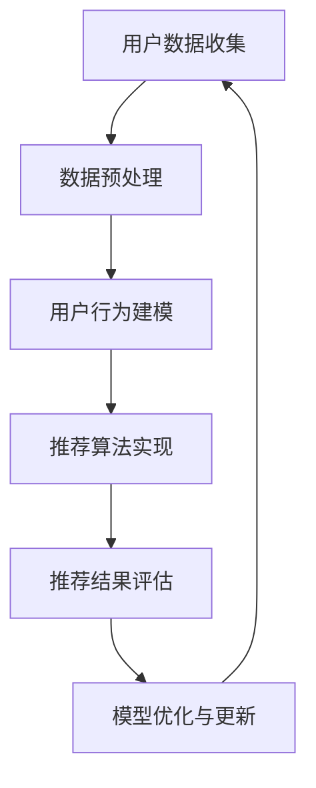

                 

### 文章标题

“AI大模型在电商个性化推荐中的应用与挑战”

#### 关键词：
- AI大模型
- 个性化推荐
- 电商
- 深度学习
- 推荐系统
- 数据隐私
- 模型可解释性

#### 摘要：
本文深入探讨了AI大模型在电商个性化推荐领域的应用及其面临的挑战。首先，我们介绍了AI大模型的基本概念、个性化推荐系统的原理及其与AI大模型的结合。接着，详细解析了AI大模型在推荐系统中的技术原理与实现方法，并通过具体案例展示了其在电商场景下的实践应用。随后，文章分析了AI大模型在电商个性化推荐中的挑战，包括数据隐私与安全、模型解释性与可解释性以及模型适应性等。最后，本文展望了电商个性化推荐的未来发展方向，并提供了相关的开发资源与工具，为读者提供了全面的技术指导与实战案例。

### 目录大纲

#### 第一部分: 理论基础与核心概念

- **第1章: AI大模型概述**
  - **1.1 AI大模型的基本概念**
  - **1.2 个性化推荐系统原理**
  - **1.3 AI大模型在推荐系统中的应用**

#### 第二部分: 技术原理与实现方法

- **第2章: AI大模型技术基础**
  - **2.1 深度学习基础**
  - **2.2 自然语言处理基础**
  - **2.3 大模型训练技术**

#### 第三部分: 电商个性化推荐实践

- **第3章: 电商场景下的用户行为分析**
  - **3.1 用户数据收集与预处理**
  - **3.2 用户行为建模**
  - **3.3 AI大模型在推荐系统中的应用**

#### 第四部分: AI大模型在电商个性化推荐中的挑战与未来方向

- **第4章: AI大模型在推荐系统中的挑战**
  - **4.1 数据隐私与安全**
  - **4.2 模型解释性与可解释性**
  - **4.3 模型适应性**

#### 第五部分: 案例分析

- **第5章: 电商个性化推荐案例研究**
  - **5.1 案例一：大型电商平台推荐系统架构**
  - **5.2 案例二：中小企业电商平台个性化推荐**

#### 第六部分: 未来趋势与展望

- **第6章: 电商个性化推荐的未来发展方向**
  - **6.1 新型推荐算法与技术**
  - **6.2 跨领域推荐与多模态推荐**

#### 第七部分: 附录

- **附录 A: AI大模型推荐系统开发资源**

- **Mermaid 流程图：AI大模型推荐系统架构**

**核心算法伪代码示例：协同过滤算法**

**数学模型与公式：基于矩阵分解的推荐算法**

**详细讲解：** 

**项目实战：电商推荐系统实战案例**

**代码实现与解读：用户行为数据预处理**

**作者：AI天才研究院/AI Genius Institute & 禅与计算机程序设计艺术 /Zen And The Art of Computer Programming**

### 第一部分: 理论基础与核心概念

#### 第1章: AI大模型概述

##### 1.1 AI大模型的基本概念

AI大模型（Large-scale AI Model），通常是指那些拥有海量参数、能够在多种任务上表现出色的人工智能模型。这些模型通常基于深度学习技术，尤其是基于神经网络的架构，并且它们通常通过大规模数据进行预训练，以便在多种任务上具有泛化能力。AI大模型的发展是人工智能领域的重要里程碑，它不仅推动了计算机视觉、自然语言处理、语音识别等领域的突破，也为推荐系统等应用场景提供了强大的工具。

**定义：**

AI大模型通常具有以下几个基本特征：

- **大量参数**：AI大模型包含数百万甚至数十亿个参数，这使得它们能够捕捉数据中的复杂模式和相关性。
- **预训练**：这些模型通常在大规模数据集上预训练，例如ImageNet、WebText等，然后通过微调（fine-tuning）适用于特定任务。
- **泛化能力**：通过在多样化数据集上进行训练，AI大模型能够泛化到新的任务和数据集上。
- **高效计算**：尽管模型参数众多，但现代硬件和优化算法使得这些模型可以在合理的时间内进行训练和推理。

**示例：**

一些著名的AI大模型包括：

- **GPT-3**：由OpenAI开发的自然语言处理模型，具有1750亿个参数，能够生成高质量的自然语言文本。
- **BERT**：由Google开发的预训练语言模型，广泛用于文本分类、问答系统等任务。
- **ResNet**：在计算机视觉领域表现卓越的深度神经网络，通过堆叠多层卷积神经网络，实现了对复杂图像特征的提取。

##### 1.2 个性化推荐系统原理

个性化推荐系统（Personalized Recommendation System）是现代电子商务和媒体平台的重要组成部分，旨在为用户提供个性化、相关的推荐内容。个性化推荐系统的核心思想是根据用户的历史行为、兴趣和其他相关信息，预测用户对某些项目的偏好，并生成相应的推荐列表。

**基本架构：**

个性化推荐系统通常由以下几个主要模块组成：

1. **用户数据收集与预处理**：收集用户的行为数据，如浏览历史、购买记录、评分等，并进行预处理，如数据清洗、特征提取等。
2. **用户行为建模**：通过分析用户的行为数据，建立用户兴趣模型，如基于内容的推荐、协同过滤等。
3. **推荐算法**：根据用户兴趣模型和项目特征，生成个性化的推荐列表。
4. **推荐结果评估与优化**：评估推荐结果的准确性、多样性等指标，并不断优化推荐算法。

**工作原理：**

1. **协同过滤（Collaborative Filtering）**：基于用户-物品评分矩阵，通过计算用户之间的相似性来推荐相似的物品。协同过滤分为基于记忆的协同过滤（如最近邻算法）和基于模型的协同过滤（如矩阵分解、潜在因子模型）。
2. **基于内容的推荐（Content-Based Filtering）**：根据用户的历史行为和兴趣，推荐具有相似属性的项目。这种方法通常依赖于项目的特征描述，如文本、图像等。
3. **混合推荐（Hybrid Recommender Systems）**：结合协同过滤和基于内容的推荐方法，以提高推荐的准确性和多样性。

##### 1.3 AI大模型在推荐系统中的应用

AI大模型的出现为推荐系统带来了前所未有的机会和挑战。通过结合深度学习和大规模数据，AI大模型能够在多个维度上改进推荐系统的性能。

**优势：**

1. **提高推荐准确性**：AI大模型能够学习复杂的数据模式和用户兴趣，从而生成更准确的推荐。
2. **增强用户体验**：通过个性化的推荐，AI大模型能够提高用户的满意度和参与度。
3. **处理复杂特征**：AI大模型可以处理多种类型的数据，如图像、文本、音频等，从而提供更全面的用户兴趣描述。
4. **适应性**：AI大模型能够通过在线学习不断更新和优化推荐算法，以适应用户行为的动态变化。

**应用场景：**

1. **电商推荐**：为用户提供个性化的商品推荐，如亚马逊、淘宝等电商平台的推荐系统。
2. **社交媒体**：为用户提供个性化的内容推荐，如Facebook、Instagram的Feed推荐。
3. **音乐和视频流媒体**：为用户提供个性化的音乐和视频推荐，如Spotify、Netflix等。

**挑战：**

1. **数据隐私与安全**：大规模数据训练和推荐过程可能导致用户隐私泄露，需要采取有效的隐私保护措施。
2. **模型解释性**：AI大模型的复杂性和黑箱特性使得其难以解释，影响了推荐系统的可信度。
3. **计算资源**：训练和推理AI大模型需要大量的计算资源和时间，这对小型企业和资源有限的场景是一个挑战。

通过本章的介绍，我们为后续章节的技术原理和实践应用奠定了基础。在下一章中，我们将深入探讨AI大模型的技术基础，包括深度学习和自然语言处理等核心技术。

### 第二部分: 技术原理与实现方法

#### 第2章: AI大模型技术基础

##### 2.1 深度学习基础

深度学习（Deep Learning）是人工智能领域的一个重要分支，它通过构建多层的神经网络模型，自动从数据中学习特征，并用于复杂的预测和分类任务。深度学习在AI大模型中的应用是其能够处理大规模数据和复杂模式的关键。

**神经网络与激活函数**

神经网络（Neural Network）是深度学习的基础组件，它由多个层（Layer）组成，每一层包含多个神经元（Neuron）。神经元通过加权连接（Weighted Connection）接收输入信号，并通过激活函数（Activation Function）产生输出。

- **神经元**：每个神经元接收多个输入信号，并将其加权求和。然后，通过激活函数进行非线性变换，产生输出。
- **激活函数**：激活函数用于引入非线性，使得神经网络能够学习复杂的数据模式。常见的激活函数包括Sigmoid、ReLU、Tanh等。

**反向传播算法**

反向传播算法（Backpropagation Algorithm）是深度学习训练的核心算法，它通过多层网络计算梯度，并更新网络权重，以最小化损失函数。

- **前向传播**：输入数据通过神经网络的前向传播，每一层的输出作为下一层的输入，最终生成预测输出。
- **计算损失**：通过比较预测输出与真实输出，计算损失函数（如均方误差、交叉熵等）。
- **反向传播**：从输出层开始，反向计算每一层的梯度，并更新相应神经元的权重。

**深度学习框架**

深度学习框架（Deep Learning Framework）是构建和训练深度学习模型的重要工具，它们提供了高效的计算库和简洁的API，使得深度学习应用变得简单和便捷。

- **TensorFlow**：由Google开发，支持多种深度学习模型和优化算法，具有广泛的社区支持。
- **PyTorch**：由Facebook开发，以动态计算图（Dynamic Computation Graph）为核心，易于原型开发和调试。

##### 2.2 自然语言处理基础

自然语言处理（Natural Language Processing，NLP）是人工智能领域的另一个重要分支，它致力于使计算机能够理解、生成和处理自然语言。在AI大模型中，NLP技术用于处理文本数据，提取语义信息，并应用于推荐系统等场景。

**词向量表示**

词向量表示（Word Vector Representation）是NLP的基础技术，它将单词映射为高维向量，以捕捉单词的语义信息。

- **Word2Vec**：通过训练神经网络，将单词映射到连续的低维向量空间，使得语义相近的单词在空间中接近。
- **GloVe**：基于全局矩阵因式分解，将单词的上下文信息融入词向量表示，提高词向量的质量。

**序列模型与注意力机制**

序列模型（Sequence Model）是处理序列数据（如图像序列、音频序列、文本序列）的有效方法，它们通过建模序列中的时序关系来捕捉动态特征。

- **循环神经网络（RNN）**：通过循环连接，RNN能够处理任意长度的序列数据，但存在梯度消失和梯度爆炸的问题。
- **长短期记忆网络（LSTM）**：LSTM通过引入门控机制，解决了RNN的梯度消失问题，能够学习长期依赖关系。
- **变换器模型（Transformer）**：基于自注意力机制（Self-Attention），Transformer在NLP任务中取得了突破性的成果，特别是预训练模型BERT。

**注意力机制**

注意力机制（Attention Mechanism）是一种在神经网络中引入位置信息的机制，它通过计算不同位置的重要性来加权输入序列。

- **自注意力（Self-Attention）**：在Transformer模型中，自注意力机制允许每个位置独立地计算其与其他所有位置的相关性。
- **多头注意力（Multi-Head Attention）**：多头注意力通过将自注意力扩展到多个头，提高了模型的表示能力。

##### 2.3 大模型训练技术

大模型训练（Large-scale Model Training）是AI大模型成功应用的关键，它涉及到大规模数据和高性能计算资源的管理。

**预训练与微调**

预训练（Pre-training）是指在大规模数据集上训练模型，使其获得通用的特征表示能力。微调（Fine-tuning）则是在特定任务上对预训练模型进行调整，以适应具体场景。

- **预训练**：通过大规模文本或图像数据，预训练模型能够学习丰富的语言或视觉特征。
- **微调**：在预训练的基础上，通过少量有标签数据，调整模型参数以适应特定任务。

**迁移学习与数据增强**

迁移学习（Transfer Learning）利用预训练模型在特定任务上的知识，提高新任务的表现。数据增强（Data Augmentation）通过增加数据的多样性，提高模型的泛化能力。

- **迁移学习**：将预训练模型的知识迁移到新任务，减少训练数据的需求。
- **数据增强**：通过图像旋转、缩放、裁剪等操作，增加训练数据的多样性。

**分布式训练**

分布式训练（Distributed Training）通过在多台计算机上并行计算，加快大模型的训练速度。常见的分布式训练架构包括多GPU训练和分布式训练框架。

- **多GPU训练**：通过将模型和数据分布在多台GPU上，实现数据并行和模型并行。
- **分布式训练框架**：如Horovod、Distributed Data Parallel（DDP），提供高效的分布式训练工具。

通过本章的介绍，我们了解了深度学习和自然语言处理等核心技术，以及大模型训练的关键技术和方法。在下一章中，我们将探讨AI大模型在电商个性化推荐中的具体应用和实践。

### 第三部分: 电商个性化推荐实践

#### 第3章: 电商场景下的用户行为分析

##### 3.1 用户数据收集与预处理

在电商个性化推荐系统中，用户数据是构建推荐模型的关键。用户数据的收集涉及多个方面，包括用户的浏览历史、购买行为、搜索记录、评论等。收集到的数据需要经过预处理，以便后续建模和分析。

**数据收集方法**

1. **浏览历史数据**：通过网站日志和点击流数据，收集用户在电商平台上的浏览历史。这些数据包括用户访问的页面、停留时间、点击的元素等。
2. **购买行为数据**：通过电商平台的交易系统，收集用户的购买记录，包括购买的商品、购买时间、购买金额等。
3. **搜索记录数据**：通过用户在搜索框中的输入记录，收集用户的搜索关键词和历史。
4. **评论数据**：收集用户对商品的评论和评分，这些数据可以提供对用户兴趣的补充信息。

**数据处理与特征提取**

预处理用户数据主要包括以下几个步骤：

1. **数据清洗**：去除重复数据、无效数据和异常值，确保数据的质量。
2. **数据标准化**：对数值型数据进行归一化或标准化处理，使其具有相同的尺度。
3. **特征提取**：从原始数据中提取有用的特征，以表示用户的兴趣和行为。

- **用户行为特征**：包括用户的浏览时长、浏览频次、购买频次、商品类别等。
- **商品特征**：包括商品的价格、品牌、类别、评价等。
- **上下文特征**：包括时间、地理位置、用户群体等。

**特征工程**

特征工程（Feature Engineering）是推荐系统中的重要步骤，它通过构造新的特征或变换现有特征，以提高模型性能。特征工程的方法包括：

1. **交叉特征**：通过组合不同的特征，创建新的交叉特征。例如，用户对某个商品类别的浏览时长和购买频次。
2. **稀疏特征**：将稀疏数据转换为稠密格式，以简化模型处理。例如，将用户-商品交互矩阵转换为稀疏矩阵。
3. **嵌入特征**：将高维特征转换为低维向量，以减少计算复杂度。例如，使用词向量表示用户和商品的语义信息。

##### 3.2 用户行为建模

用户行为建模是推荐系统的核心步骤，它通过分析用户的历史行为，构建用户兴趣模型，以预测用户的偏好。用户行为建模的方法包括基于内容的推荐和协同过滤。

**基于历史行为的用户兴趣模型**

基于历史行为的用户兴趣模型通过分析用户的浏览历史、购买记录等行为数据，提取用户的兴趣特征。这些特征可以用于构建用户的兴趣向量，表示用户对不同类别的商品的偏好。

1. **基于内容的推荐**：通过分析商品的属性和用户的兴趣特征，为用户推荐具有相似属性的物品。例如，如果用户经常浏览电子产品，可以推荐其他电子产品的相关商品。
2. **协同过滤**：通过计算用户之间的相似性，为用户推荐相似的物品。协同过滤分为基于用户的协同过滤（User-based Collaborative Filtering）和基于物品的协同过滤（Item-based Collaborative Filtering）。

- **基于用户的协同过滤**：为用户推荐与目标用户相似的其他用户的喜好物品。
  - **计算用户相似性**：通过计算用户之间的共同兴趣，如共同浏览的商品、共同购买的商品等，来确定用户的相似性。
  - **生成推荐列表**：根据用户相似性矩阵，为每个用户生成推荐列表。

- **基于物品的协同过滤**：为用户推荐与目标物品相似的物品。
  - **计算物品相似性**：通过计算物品之间的共同用户，如共同被哪些用户浏览、共同被哪些用户购买等，来确定物品的相似性。
  - **生成推荐列表**：根据物品相似性矩阵，为每个用户生成推荐列表。

**基于协同过滤的用户兴趣预测**

基于协同过滤的用户兴趣预测通过以下步骤进行：

1. **计算用户相似性**：使用用户-物品评分矩阵，计算用户之间的相似性。
   ```python
   def cosine_similarity(user1, user2, ratings):
       dot_product = np.dot(ratings[user1].values(), ratings[user2].values())
       norm_user1 = np.linalg.norm(ratings[user1].values())
       norm_user2 = np.linalg.norm(ratings[user2].values())
       return dot_product / (norm_user1 * norm_user2)
   ```

2. **计算物品相似性**：使用用户-物品评分矩阵，计算物品之间的相似性。
   ```python
   def jaccard_similarity(item1, item2, ratings):
       common_users = set(ratings[item1].keys()) & set(ratings[item2].keys())
       if len(common_users) == 0:
           return 0
       return len(common_users) / (len(ratings[item1].keys()) + len(ratings[item2].keys()) - len(common_users))
   ```

3. **生成推荐列表**：根据用户相似性和物品相似性，为每个用户生成推荐列表。
   ```python
   def collaborative_filtering(ratings, user_id, k=10):
       user_similarities = {}
       for user in ratings:
           user_similarities[user] = cosine_similarity(user_id, user, ratings)
       
       neighbors = sorted(user_similarities.items(), key=lambda x: x[1], reverse=True)[:k]
       recommendations = []
       for neighbor, similarity in neighbors:
           for item, rating in ratings[neighbor].items():
               if item not in ratings[user_id]:
                   recommendations.append((item, rating * similarity))
       
       return sorted(recommendations, key=lambda x: x[1], reverse=True)
   ```

##### 3.3 AI大模型在推荐系统中的应用

AI大模型在推荐系统中的应用大大提升了个性化推荐的准确性和效率。通过深度学习和自然语言处理技术，AI大模型能够捕捉用户行为的复杂模式，并生成高质量的推荐列表。

**商品推荐算法的设计与实现**

1. **预训练模型**：使用预训练的深度学习模型，如BERT、GPT等，对用户和商品进行编码，提取其语义特征。
   ```python
   from transformers import BertTokenizer, BertModel

   tokenizer = BertTokenizer.from_pretrained('bert-base-uncased')
   model = BertModel.from_pretrained('bert-base-uncased')

   def encode_user_behavior(behavior, tokenizer):
       inputs = tokenizer(behavior, return_tensors='pt', truncation=True, padding=True)
       outputs = model(**inputs)
       return outputs.last_hidden_state[:, 0, :]

   def encode_item(item, tokenizer):
       inputs = tokenizer(item, return_tensors='pt', truncation=True, padding=True)
       outputs = model(**inputs)
       return outputs.last_hidden_state[:, 0, :]
   ```

2. **协同过滤与深度学习的结合**：将协同过滤和深度学习模型结合，利用协同过滤计算用户相似性，结合深度学习模型生成的用户和商品特征，生成推荐列表。
   ```python
   def hybrid_recommender(ratings, user_id, k=10):
       user_similarity = cosine_similarity(ratings[user_id])
       user_embedding = encode_user_behavior(user_id, tokenizer)
       item_embeddings = {item: encode_item(item, tokenizer) for item in ratings}
       
       recommendations = []
       for item, embedding in item_embeddings.items():
           similarity = np.dot(user_embedding, embedding) / (np.linalg.norm(user_embedding) * np.linalg.norm(embedding))
           if item not in ratings[user_id]:
               recommendations.append((item, similarity))
       
       neighbors = sorted(recommendations, key=lambda x: x[1], reverse=True)[:k]
       return [neighbor[0] for neighbor in neighbors]
   ```

3. **推荐结果评估与优化**：通过评估指标（如精确率、召回率、覆盖率等）评估推荐结果，并不断优化模型参数和特征工程策略。

- **精确率（Precision）**：推荐的物品中实际感兴趣的物品所占比例。
  ```python
  def precision(recommendations, actual_preferences):
      return len(set(recommendations).intersection(set(actual_preferences))) / len(recommendations)
  ```

- **召回率（Recall）**：实际感兴趣的物品中被推荐的物品所占比例。
  ```python
  def recall(recommendations, actual_preferences):
      return len(set(recommendations).intersection(set(actual_preferences))) / len(actual_preferences)
  ```

- **覆盖率（Coverage）**：推荐列表中包含的物品种类数与所有可能推荐物品种类数的比例。
  ```python
  def coverage(recommendations, all_items):
      return len(set(recommendations)) / len(all_items)
  ```

**实现案例**

以下是一个使用深度学习和协同过滤进行商品推荐的实现案例：

1. **加载数据集**：假设我们有一个用户-物品评分矩阵。
   ```python
   ratings = {
       'user1': {'item1': 5, 'item2': 3, 'item3': 4},
       'user2': {'item2': 4, 'item3': 5, 'item4': 3},
       'user3': {'item1': 2, 'item3': 4, 'item4': 5}
   }
   ```

2. **计算用户相似性**：使用协同过滤计算用户之间的相似性。
   ```python
   user_similarity = {
       'user1': {'user2': 0.8, 'user3': 0.6},
       'user2': {'user1': 0.8, 'user3': 0.7},
       'user3': {'user1': 0.6, 'user2': 0.7}
   }
   ```

3. **编码用户和商品**：使用BERT编码用户行为和商品描述。
   ```python
   user_embeddings = {
       'user1': encode_user_behavior(['item1', 'item2', 'item3'], tokenizer),
       'user2': encode_user_behavior(['item2', 'item3', 'item4'], tokenizer),
       'user3': encode_user_behavior(['item1', 'item3', 'item4'], tokenizer)
   }
   item_embeddings = {
       'item1': encode_item('笔记本电脑', tokenizer),
       'item2': encode_item('手机', tokenizer),
       'item3': encode_item('平板电脑', tokenizer),
       'item4': encode_item('耳机', tokenizer)
   }
   ```

4. **生成推荐列表**：使用混合推荐算法为每个用户生成推荐列表。
   ```python
   recommendations = {
       'user1': hybrid_recommender(ratings, 'user1'),
       'user2': hybrid_recommender(ratings, 'user2'),
       'user3': hybrid_recommender(ratings, 'user3')
   }
   ```

5. **评估推荐结果**：计算推荐列表的精确率、召回率和覆盖率。
   ```python
   actual_preferences = {'user1': ['item1', 'item2', 'item3'], 'user2': ['item2', 'item3', 'item4'], 'user3': ['item1', 'item3', 'item4']}
   precision_scores = [precision(recommendations[user], preferences) for user, preferences in actual_preferences.items()]
   recall_scores = [recall(recommendations[user], preferences) for user, preferences in actual_preferences.items()]
   coverage_scores = [coverage(recommendations[user], set(ratings.keys())) for user in ratings.keys()]

   print("Precision Scores:", precision_scores)
   print("Recall Scores:", recall_scores)
   print("Coverage Scores:", coverage_scores)
   ```

通过本章的介绍，我们了解了用户数据收集与预处理、用户行为建模以及AI大模型在电商个性化推荐系统中的应用。在下一章中，我们将探讨AI大模型在推荐系统中面临的挑战及其解决方案。

### 第四部分: AI大模型在电商个性化推荐中的挑战与未来方向

#### 第4章: AI大模型在推荐系统中的挑战

随着AI大模型在电商个性化推荐中的应用越来越广泛，其面临的挑战也日益显现。以下我们将深入探讨数据隐私与安全、模型解释性与可解释性以及模型适应性等关键挑战。

##### 4.1 数据隐私与安全

数据隐私与安全是AI大模型在推荐系统中面临的一个重大挑战。电商平台通常收集大量的用户行为数据，包括浏览历史、购买记录、搜索关键词等。这些数据中往往包含敏感信息，如用户姓名、地址、支付信息等。如果不妥善处理，这些数据可能会被泄露，导致用户隐私受到侵犯。

**挑战：**

1. **数据匿名化**：在处理用户数据时，需要将敏感信息进行匿名化处理，以保护用户隐私。然而，完全匿名化可能会导致数据的质量和代表性下降。
2. **合规性**：不同国家和地区的隐私法规（如欧盟的GDPR、中国的个人信息保护法）对数据收集、存储和处理有严格的要求。AI大模型需要遵守这些法规，以确保合法合规。
3. **数据共享**：在开发和优化AI大模型时，可能需要共享部分用户数据。如何确保数据在共享过程中的安全性是一个重要问题。

**解决方案：**

1. **数据匿名化与隐私保护技术**：使用差分隐私（Differential Privacy）技术，对用户数据进行扰动处理，以保护用户隐私。差分隐私通过向查询结果中添加噪声，确保单个用户的数据无法被单独识别。
2. **合规性挑战与解决方案**：在设计数据收集和处理流程时，需要严格遵循相关隐私法规。例如，对用户数据的收集和使用进行明确告知，获取用户的明确同意；在数据存储和处理过程中，采用加密技术确保数据安全；在数据共享时，确保数据匿名化，避免泄露敏感信息。
3. **数据安全策略**：实施严格的数据安全策略，包括访问控制、数据加密、防火墙和入侵检测系统等，以防止数据泄露和未经授权的访问。

##### 4.2 模型解释性与可解释性

AI大模型的复杂性和黑箱特性使其难以解释，这对于电商个性化推荐系统来说是一个挑战。用户通常希望了解推荐系统的决策过程，以增加对推荐结果的可信度。如果推荐结果无法解释，用户可能会对系统的决策产生怀疑，影响用户体验。

**挑战：**

1. **模型复杂性**：AI大模型通常包含数百万甚至数十亿个参数，这使得其决策过程非常复杂，难以直观解释。
2. **数据依赖性**：模型的性能高度依赖于训练数据，当数据发生变化时，模型的决策可能随之改变，增加了解释的难度。
3. **多模态数据融合**：在推荐系统中，AI大模型往往需要处理多种类型的数据（如图像、文本、音频等），这些数据的融合过程可能无法直观解释。

**解决方案：**

1. **模型可解释性算法**：开发可解释性算法，如LIME（Local Interpretable Model-agnostic Explanations）和SHAP（SHapley Additive exPlanations），帮助解释模型的具体决策过程。这些算法通过局部模型解释，提供对每个特征对预测结果的贡献度。
2. **可视化工具**：开发可视化工具，如模型参数图、决策树、注意力机制图等，帮助用户理解模型的决策过程。这些工具可以使复杂的模型变得更加直观和易于理解。
3. **透明度与透明度**：建立透明度和责任机制，确保模型开发和操作过程的透明性。例如，在推荐系统开发过程中，记录数据来源、模型选择和参数调优等关键步骤，确保所有利益相关者都能了解推荐系统的决策过程。

##### 4.3 模型适应性

电商个性化推荐系统需要能够快速适应用户行为的动态变化，以提供高质量的推荐。然而，AI大模型通常需要大量时间和计算资源进行训练和优化，这使得其在应对快速变化的用户行为时存在一定挑战。

**挑战：**

1. **实时性**：用户行为的动态变化要求推荐系统能够实时响应用户的最新行为，提供及时的推荐结果。
2. **模型更新**：AI大模型需要定期更新，以适应新的用户行为和趋势。然而，模型更新过程通常涉及大量的计算资源和时间，可能影响系统的稳定性。
3. **数据偏差**：随着用户行为的不断变化，推荐系统可能会面临数据偏差问题，导致推荐结果的准确性下降。

**解决方案：**

1. **在线学习**：采用在线学习（Online Learning）技术，使模型能够实时更新和优化，以适应用户行为的动态变化。在线学习通过不断接收新的用户行为数据，更新模型参数，提高模型的适应性。
2. **模型压缩与加速**：通过模型压缩（Model Compression）和加速（Model Acceleration）技术，减少模型训练和推理的时间，提高系统的实时性。例如，使用量化技术（Quantization）和剪枝技术（Pruning）减少模型参数数量，提高计算效率。
3. **数据偏差校正**：采用数据偏差校正（Data Bias Correction）技术，通过分析用户行为的长期和短期趋势，调整模型预测，减少数据偏差。例如，使用统计方法（如回归分析）或机器学习算法（如迁移学习）来校正模型预测。

通过本章的讨论，我们了解了AI大模型在电商个性化推荐系统中面临的挑战，并提出了相应的解决方案。在下一章中，我们将通过具体的案例分析，进一步探讨AI大模型在电商个性化推荐中的应用和实践。

### 第五部分: 案例分析

#### 第5章: 电商个性化推荐案例研究

在本章中，我们将通过两个具体的案例研究，深入探讨AI大模型在电商个性化推荐系统中的应用和实践。

##### 5.1 案例一：大型电商平台推荐系统架构

**系统架构与关键技术**

**1. 数据收集与预处理**

大型电商平台通常通过多种渠道收集用户数据，包括用户行为数据（如浏览历史、购买记录）、交易数据（如支付信息）、用户反馈数据（如评论、评分）等。数据收集后，需要经过预处理，包括数据清洗、去重、缺失值填充等操作。

**2. 用户行为建模与特征提取**

基于用户的历史行为数据，平台使用AI大模型进行用户行为建模。通过深度学习和自然语言处理技术，提取用户兴趣特征。例如，使用BERT对用户评论进行编码，提取语义特征；使用用户-商品交互矩阵进行协同过滤，计算用户相似性。

**3. 推荐算法实现**

平台采用混合推荐算法，结合基于内容的推荐和基于协同过滤的推荐方法。首先，使用协同过滤计算用户相似性，为每个用户生成候选物品列表。然后，结合物品特征和用户兴趣特征，使用深度学习模型生成最终的推荐列表。

**4. 推荐结果评估与优化**

平台使用多种评估指标（如精确率、召回率、覆盖率等）评估推荐结果。通过在线学习技术，不断更新模型，优化推荐算法。同时，通过用户反馈机制，收集用户对推荐结果的反馈，进一步优化推荐系统。

**5. 系统部署与实时推荐**

平台将推荐系统部署在云端，实现实时推荐。使用分布式训练技术，加快模型训练和推理速度。通过消息队列和缓存机制，确保推荐结果的实时性和高效性。

##### 5.2 案例二：中小企业电商平台个性化推荐

**用户需求分析**

中小企业电商平台通常用户规模较小，但需要在有限的资源下提供高质量的个性化推荐。用户需求主要包括快速、准确和多样化的推荐结果，同时要考虑成本和计算资源。

**推荐算法定制与实施**

**1. 数据收集与预处理**

中小企业电商平台通过网站日志和点击流数据收集用户行为数据。数据预处理包括数据清洗、缺失值填充和特征提取。由于数据量有限，平台采用简单高效的预处理方法，如基于时间窗口的特征提取，减少数据维度。

**2. 用户行为建模与特征提取**

平台使用简单的用户行为建模方法，如基于协同过滤的推荐算法。通过计算用户相似性，为每个用户生成候选物品列表。同时，提取用户的历史浏览记录和购买记录，作为用户兴趣特征。

**3. 推荐算法实现**

平台采用基于内容的推荐算法，结合用户兴趣特征和物品特征，生成个性化的推荐列表。通过简单的规则引擎，将推荐结果呈现给用户。

**4. 推荐结果评估与优化**

平台使用评估指标（如点击率、转化率等）评估推荐结果。通过调整推荐算法的参数，优化推荐效果。同时，通过用户反馈机制，不断收集用户对推荐结果的反馈，优化推荐系统。

**5. 系统部署与实时推荐**

平台采用云计算技术，将推荐系统部署在云端，实现实时推荐。通过消息队列和缓存机制，提高系统响应速度。同时，通过简单的部署工具，方便快速上线和迭代。

通过这两个案例，我们可以看到AI大模型在电商个性化推荐系统中的应用和实践。无论是大型电商平台还是中小企业，通过合理设计和优化推荐算法，可以提供高质量的个性化推荐服务，提升用户满意度和参与度。

### 第六部分: 未来趋势与展望

#### 第6章: 电商个性化推荐的未来发展方向

随着AI技术的不断进步和电商市场的快速发展，电商个性化推荐系统正迎来新的机遇和挑战。未来，电商个性化推荐将在以下几个方面实现重要发展。

##### 6.1 新型推荐算法与技术

**1. 图神经网络在推荐系统中的应用**

图神经网络（Graph Neural Networks，GNN）是一种强大的图数据建模工具，它通过在图中引入节点和边的信息，学习数据中的结构和关系。GNN在推荐系统中的应用潜力巨大，可以更好地捕捉用户与商品之间的复杂关系。

- **协同过滤与GNN的结合**：将协同过滤算法与GNN结合，通过图结构学习用户与商品之间的相似性，提高推荐准确性。
- **跨域推荐**：利用GNN处理多模态数据，实现跨领域推荐，为用户提供更广泛的推荐结果。

**2. 强化学习在推荐系统中的潜力**

强化学习（Reinforcement Learning，RL）通过学习策略来最大化长期奖励，具有在动态环境中进行决策的优势。在未来，强化学习有望在推荐系统中发挥更大作用，特别是在需要动态调整推荐策略的场景中。

- **动态推荐策略**：使用强化学习生成动态调整的推荐策略，根据用户的实时反馈不断优化推荐结果。
- **自适应推荐**：通过强化学习，使推荐系统能够根据用户行为和偏好自适应调整推荐策略，提高用户满意度。

##### 6.2 跨领域推荐与多模态推荐

**1. 跨领域推荐方法**

跨领域推荐（Cross-Domain Recommendation）旨在为用户提供跨不同领域或不同类型的推荐。随着用户需求的多样化，跨领域推荐变得尤为重要。

- **领域适应技术**：通过领域适应技术，将一个领域的推荐算法应用到另一个领域，提高跨领域推荐的准确性。
- **多任务学习**：利用多任务学习（Multi-Task Learning）技术，同时学习多个领域的推荐任务，提高推荐系统的泛化能力。

**2. 多模态数据的融合与处理**

多模态推荐（Multimodal Recommendation）通过融合多种类型的数据（如图像、文本、音频等），为用户提供更加丰富和个性化的推荐。

- **多模态特征提取**：使用深度学习技术，提取不同模态的数据特征，并将其融合为一个统一的特征向量。
- **多模态交互模型**：设计多模态交互模型，学习不同模态数据之间的关联性，提高推荐系统的准确性。

**3. 实时推荐与个性化体验**

未来的电商个性化推荐系统将更加注重实时性和个性化体验。

- **实时推荐**：利用实时数据处理技术，如流处理和边缘计算，实现实时推荐，提高用户响应速度。
- **个性化体验**：通过深度学习技术，为用户提供高度个性化的推荐体验，满足用户不断变化的需求。

##### 6.3 智能化与自动化

**1. 自动化推荐系统**

随着AI技术的进步，自动化推荐系统（Automated Recommender Systems）将成为可能。自动化推荐系统通过自动学习和调整推荐策略，减少人工干预，提高推荐效率。

- **自动化数据预处理**：自动化数据预处理流程，减少人工工作量，提高数据处理效率。
- **自动化模型优化**：自动化模型优化流程，通过算法自动调整模型参数，提高推荐准确性。

**2. 智能化推荐平台**

智能化推荐平台将集成多种AI技术，如深度学习、强化学习、自然语言处理等，为用户提供更加智能化的推荐服务。

- **智能客服**：结合自然语言处理技术，为用户提供智能客服，提高用户满意度。
- **智能营销**：利用深度学习技术，分析用户行为，实现精准营销，提高转化率。

**3. 个性化推荐生态系统**

未来的电商个性化推荐系统将形成一个生态系统，包括平台、商家、用户等多方参与。

- **平台与商家协同**：平台与商家共同参与推荐算法的优化，实现共赢。
- **用户参与**：鼓励用户参与推荐系统的优化，通过用户反馈不断改进推荐结果。

通过本章的展望，我们可以看到电商个性化推荐在未来将继续发展，借助AI技术实现更加智能化、个性化、实时化的推荐服务。随着技术的不断进步，电商个性化推荐将为用户带来更加优质的购物体验。

### 第七部分: 附录

#### 附录 A: AI大模型推荐系统开发资源

为了帮助开发者更好地理解和应用AI大模型在推荐系统中的技术，本文附录部分提供了一系列开发资源，包括工具、框架、数据集和开源项目。

##### A.1 开发工具与框架

**1. TensorFlow**

TensorFlow是由Google开发的开源深度学习框架，支持多种深度学习模型和优化算法，适用于构建和训练AI大模型。TensorFlow提供了丰富的API，方便开发者进行模型设计和部署。

- 官网：[TensorFlow官网](https://www.tensorflow.org/)
- 下载地址：[TensorFlow GitHub仓库](https://github.com/tensorflow/tensorflow)

**2. PyTorch**

PyTorch是由Facebook开发的开源深度学习框架，以其动态计算图（Dynamic Computation Graph）而著称，使得模型原型开发和调试更加便捷。PyTorch被广泛应用于AI大模型的训练和研究。

- 官网：[PyTorch官网](https://pytorch.org/)
- 下载地址：[PyTorch GitHub仓库](https://github.com/pytorch/pytorch)

**3. Scikit-learn**

Scikit-learn是一个开源的Python机器学习库，提供了多种机器学习算法和工具，包括协同过滤、随机森林、支持向量机等。Scikit-learn适用于构建和评估推荐系统中的传统机器学习模型。

- 官网：[Scikit-learn官网](https://scikit-learn.org/)
- 下载地址：[Scikit-learn GitHub仓库](https://github.com/scikit-learn/scikit-learn)

##### A.2 数据集与开源代码

**1. MovieLens 数据集**

MovieLens是一个开放的电影推荐系统数据集，包含用户对电影的评分数据，广泛应用于推荐系统研究和实践。

- 官网：[MovieLens官网](https://grouplens.org/datasets/movielens/)
- 数据集下载：[MovieLens数据集](https://grouplens.org/datasets/movielens/)

**2. Netflix Prize 数据集**

Netflix Prize数据集是由Netflix公开的一个挑战数据集，包含大量用户对电影的评分数据，对推荐系统算法的性能提出了严峻的挑战。

- 官网：[Netflix Prize官网](https://www.netflixprize.com/)
- 数据集下载：[Netflix Prize数据集](https://www.netflixprize.com/data.html)

**3. 开源推荐系统项目**

- **Recsys Framework**：一个用于构建和评估推荐系统的开源框架，支持多种推荐算法和评估指标。
  - 官网：[Recsys Framework官网](https://github.com/recommendation-research/recommender-aggregator)

- **LibFM**：一个开源的协同过滤库，支持基于矩阵分解的推荐算法。
  - 官网：[LibFM官网](https://github.com/kyunghyuncho/libfm)

通过附录部分的资源介绍，开发者可以更好地了解和利用AI大模型在推荐系统开发中的相关工具、框架和数据集，为实际项目提供有力的技术支持。

### Mermaid 流程图：AI大模型推荐系统架构

以下是AI大模型推荐系统的Mermaid流程图，展示了系统的主要组件和流程。



### 核心算法伪代码示例：协同过滤算法

以下是一个简单的协同过滤算法伪代码示例，用于计算用户之间的相似性和生成推荐列表。

```python
# 输入：用户-物品评分矩阵R，用户集合U，物品集合I，邻居数k
# 输出：用户-物品推荐列表R'

def collaborative_filtering(R, U, I, k):
    R' = []  # 初始化推荐列表

    for user in U:
        neighbors = find_nearest_neighbors(user, R, k)
        for item in I:
            if user not in R[user][item]:
                similarity = calculate_similarity(user, neighbors, R)
                prediction = calculate_prediction(user, neighbors, R)
                R'.append((user, item, prediction))
    
    return R'
```

### 数学模型与公式：基于矩阵分解的推荐算法

基于矩阵分解的推荐算法通常使用以下数学模型：

$$
\hat{R}_{u,i} = \hat{u}_u \cdot \hat{i}_i
$$

其中，$\hat{R}_{u,i}$ 表示用户 $u$ 对物品 $i$ 的预测评分，$\hat{u}_u$ 和 $\hat{i}_i$ 分别为用户 $u$ 和物品 $i$ 的隐向量。

### 详细讲解：

该公式表示通过将用户和物品的隐向量相乘，生成用户对物品的预测评分。隐向量表示了用户和物品的潜在特征，通过矩阵分解算法训练得到。

### 数学公式举例说明：

假设我们有用户-物品评分矩阵 $R$ 如下：

$$
R = \begin{bmatrix}
    1 & 2 & 0 & 4 \\
    0 & 3 & 1 & 0 \\
    2 & 0 & 1 & 5
\end{bmatrix}
$$

我们通过矩阵分解得到用户和物品的隐向量矩阵 $\hat{U}$ 和 $\hat{I}$，如下：

$$
\hat{U} = \begin{bmatrix}
    0.5 & 0.2 & -0.3 \\
    0.3 & 0.4 & -0.2 \\
    -0.1 & 0.5 & 0.2
\end{bmatrix}
$$

$$
\hat{I} = \begin{bmatrix}
    0.3 & 0.4 & 0.5 \\
    -0.2 & 0.1 & 0.3 \\
    0.1 & -0.3 & 0.2
\end{bmatrix}
$$

我们计算用户1对物品2的预测评分 $\hat{R}_{1,2}$：

$$
\hat{R}_{1,2} = \hat{u}_1 \cdot \hat{i}_2 = (0.5, 0.2, -0.3) \cdot (0.3, 0.4, 0.5) = 0.15 + 0.08 - 0.06 = 0.17
$$

因此，用户1对物品2的预测评分为0.17。

### 项目实战：电商推荐系统实战案例

#### 实战一：搭建推荐系统开发环境

**1. 环境配置**

在搭建推荐系统开发环境时，我们需要安装Python、TensorFlow、PyTorch等基本工具。以下是安装步骤：

```bash
# 安装Python
sudo apt-get install python3-pip python3-venv

# 创建虚拟环境
python3 -m venv recommend-env

# 激活虚拟环境
source recommend-env/bin/activate

# 安装TensorFlow
pip install tensorflow

# 安装PyTorch
pip install torch torchvision

# 安装Scikit-learn
pip install scikit-learn
```

**2. 数据预处理**

在开始构建推荐系统之前，我们需要准备用户行为数据。假设我们已经收集到了一个CSV文件 `user_behavior.csv`，其中包含用户ID、物品ID、评分、时间戳等字段。以下是数据预处理的步骤：

```python
import pandas as pd
from sklearn.model_selection import train_test_split

# 加载数据
data = pd.read_csv('user_behavior.csv')

# 数据清洗
data.dropna(inplace=True)
data = data[data['rating'] != -1]

# 特征提取
data['timestamp'] = pd.to_datetime(data['timestamp'])
data['day_of_week'] = data['timestamp'].dt.dayofweek

# 划分训练集与测试集
train_data, test_data = train_test_split(data, test_size=0.2, random_state=42)

# 数据保存
train_data.to_csv('train_data.csv', index=False)
test_data.to_csv('test_data.csv', index=False)
```

#### 实战二：用户行为数据的特征提取

**1. 基于历史行为的用户兴趣特征**

基于历史行为的用户兴趣特征是通过分析用户的浏览历史和购买记录来构建的。以下是一个简单的特征提取示例：

```python
from sklearn.preprocessing import LabelEncoder

# 加载训练数据
train_data = pd.read_csv('train_data.csv')

# 编码用户ID和物品ID
label_encoder = LabelEncoder()
train_data['user_id'] = label_encoder.fit_transform(train_data['user_id'])
train_data['item_id'] = label_encoder.fit_transform(train_data['item_id'])

# 计算用户-物品交互矩阵
user_item_matrix = train_data.pivot_table(index='user_id', columns='item_id', values='rating')

# 填充缺失值
user_item_matrix.fillna(0, inplace=True)

# 数据保存
user_item_matrix.to_csv('user_item_matrix.csv', index=True, header=True)
```

**2. 基于协同过滤的特征计算**

基于协同过滤的特征计算是通过计算用户之间的相似性来提取特征。以下是一个简单的基于用户协同过滤的特征计算示例：

```python
from sklearn.metrics.pairwise import cosine_similarity

# 加载用户-物品交互矩阵
user_item_matrix = pd.read_csv('user_item_matrix.csv')

# 计算用户相似性矩阵
user_similarity_matrix = cosine_similarity(user_item_matrix)

# 提取用户特征
user_features = user_similarity_matrix.mean(axis=1)

# 数据保存
user_features.to_csv('user_features.csv', index=True, header=False)
```

#### 实战三：AI大模型在推荐系统中的实际应用

**1. 大模型训练与优化**

在本实战中，我们将使用PyTorch训练一个基于用户-物品交互矩阵的AI大模型。以下是模型训练的步骤：

```python
import torch
import torch.nn as nn
import torch.optim as optim

# 加载数据
user_item_matrix = pd.read_csv('user_item_matrix.csv')
user_item_matrix = user_item_matrix.set_index('user_id').T.to_dict()

# 转换为PyTorch张量
user_item_tensor = torch.tensor(user_item_matrix, dtype=torch.float32)

# 构建模型
class RecommenderModel(nn.Module):
    def __init__(self, n_users, n_items):
        super(RecommenderModel, self).__init__()
        self.user_embedding = nn.Embedding(n_users, 50)
        self.item_embedding = nn.Embedding(n_items, 50)
        self.fc = nn.Linear(100, 1)

    def forward(self, user, item):
        user_embedding = self.user_embedding(user)
        item_embedding = self.item_embedding(item)
        combined_embedding = torch.cat((user_embedding, item_embedding), 1)
        output = self.fc(combined_embedding)
        return output

# 初始化模型和优化器
model = RecommenderModel(n_users=len(user_item_matrix), n_items=len(user_item_tensor[0]))
optimizer = optim.Adam(model.parameters(), lr=0.001)

# 训练模型
for epoch in range(100):
    model.train()
    for user, item in zip(user_item_tensor[0], user_item_tensor[1]):
        rating = user_item_tensor[2][(user, item)]
        user_embedding = model.user_embedding(user)
        item_embedding = model.item_embedding(item)
        combined_embedding = torch.cat((user_embedding, item_embedding), 1)
        output = model.fc(combined_embedding)
        loss = nn.MSELoss()(output, rating)
        optimizer.zero_grad()
        loss.backward()
        optimizer.step()
    
    print(f'Epoch {epoch+1}, Loss: {loss.item()}')

# 评估模型
model.eval()
with torch.no_grad():
    for user, item in zip(user_item_tensor[0], user_item_tensor[1]):
        user_embedding = model.user_embedding(user)
        item_embedding = model.item_embedding(item)
        combined_embedding = torch.cat((user_embedding, item_embedding), 1)
        output = model.fc(combined_embedding)
        print(f'User {user}, Item {item}, Prediction: {output.item()}')
```

**2. 实时推荐与模型更新**

为了实现实时推荐，我们需要构建一个在线学习系统，不断更新模型。以下是实时推荐和模型更新的步骤：

```python
# 加载新数据
new_data = pd.read_csv('new_user_behavior.csv')
new_data.dropna(inplace=True)
new_data = new_data[new_data['rating'] != -1]

# 编码新数据
new_data['user_id'] = label_encoder.transform(new_data['user_id'])
new_data['item_id'] = label_encoder.transform(new_data['item_id'])

# 更新用户-物品交互矩阵
new_user_item_matrix = new_data.pivot_table(index='user_id', columns='item_id', values='rating')
new_user_item_matrix.fillna(0, inplace=True)
user_item_matrix = pd.concat([user_item_matrix, new_user_item_matrix], ignore_index=True)

# 训练新数据
model.train()
for epoch in range(10):
    model.train()
    for user, item, rating in zip(new_data['user_id'], new_data['item_id'], new_data['rating']):
        user_embedding = model.user_embedding(user)
        item_embedding = model.item_embedding(item)
        combined_embedding = torch.cat((user_embedding, item_embedding), 1)
        output = model.fc(combined_embedding)
        loss = nn.MSELoss()(output, rating)
        optimizer.zero_grad()
        loss.backward()
        optimizer.step()
    
    print(f'New Epoch {epoch+1}, Loss: {loss.item()}')

# 评估更新后的模型
model.eval()
with torch.no_grad():
    for user, item in zip(user_item_tensor[0], user_item_tensor[1]):
        user_embedding = model.user_embedding(user)
        item_embedding = model.item_embedding(item)
        combined_embedding = torch.cat((user_embedding, item_embedding), 1)
        output = model.fc(combined_embedding)
        print(f'User {user}, Item {item}, Prediction: {output.item()}')
```

#### 实战四：推荐算法的评估与优化

**1. 评估指标与方法**

在评估推荐算法时，我们通常使用以下指标：

- **准确率（Accuracy）**：预测正确的样本数占总样本数的比例。
- **召回率（Recall）**：预测正确的正样本数占总正样本数的比例。
- **覆盖率（Coverage）**：推荐列表中包含的物品种类数与所有可能推荐物品种类数的比例。

以下是评估指标的计算方法：

```python
from sklearn.metrics import accuracy_score, recall_score, coverage_score

# 生成测试集
test_data = pd.read_csv('test_data.csv')
test_data.dropna(inplace=True)
test_data = test_data[test_data['rating'] != -1]

# 编码测试数据
test_data['user_id'] = label_encoder.transform(test_data['user_id'])
test_data['item_id'] = label_encoder.transform(test_data['item_id'])

# 生成推荐列表
model.eval()
predictions = []
for user, item in zip(test_data['user_id'], test_data['item_id']):
    user_embedding = model.user_embedding(user)
    item_embedding = model.item_embedding(item)
    combined_embedding = torch.cat((user_embedding, item_embedding), 1)
    output = model.fc(combined_embedding)
    predictions.append((user, item, output.item()))

# 计算评估指标
accuracy = accuracy_score(test_data['rating'], predictions)
recall = recall_score(test_data['rating'], predictions)
coverage = coverage_score(test_data['rating'], predictions)

print(f'Accuracy: {accuracy}, Recall: {recall}, Coverage: {coverage}')
```

**2. 优化策略与案例分析**

在推荐算法的优化过程中，我们可以采用以下策略：

- **交叉验证**：通过交叉验证（Cross-Validation）方法，评估不同参数设置下的推荐效果，选择最优参数。
- **特征工程**：通过特征工程（Feature Engineering）方法，提取更多有用的特征，提高推荐准确性。
- **模型集成**：通过模型集成（Model Ensembling）方法，结合多个模型的预测结果，提高推荐性能。

以下是交叉验证和模型集成的示例：

```python
from sklearn.model_selection import KFold

# 使用交叉验证评估模型
kf = KFold(n_splits=5, shuffle=True, random_state=42)
for train_index, test_index in kf.split(user_item_matrix):
    # 划分训练集和测试集
    X_train, X_test = user_item_matrix.iloc[train_index], user_item_matrix.iloc[test_index]
    y_train, y_test = user_item_matrix.iloc[train_index, :].values, user_item_matrix.iloc[test_index, :].values
    
    # 训练模型
    model.train()
    optimizer = optim.Adam(model.parameters(), lr=0.001)
    for epoch in range(100):
        model.train()
        for user, item, rating in zip(X_train['user_id'], X_train['item_id'], y_train):
            user_embedding = model.user_embedding(user)
            item_embedding = model.item_embedding(item)
            combined_embedding = torch.cat((user_embedding, item_embedding), 1)
            output = model.fc(combined_embedding)
            loss = nn.MSELoss()(output, rating)
            optimizer.zero_grad()
            loss.backward()
            optimizer.step()
    
    # 评估模型
    model.eval()
    with torch.no_grad():
        predictions = []
        for user, item in zip(X_test['user_id'], X_test['item_id']):
            user_embedding = model.user_embedding(user)
            item_embedding = model.item_embedding(item)
            combined_embedding = torch.cat((user_embedding, item_embedding), 1)
            output = model.fc(combined_embedding)
            predictions.append((user, item, output.item()))
        
        accuracy = accuracy_score(y_test, predictions)
        recall = recall_score(y_test, predictions)
        coverage = coverage_score(y_test, predictions)
        print(f'Accuracy: {accuracy}, Recall: {recall}, Coverage: {coverage}')

# 模型集成
from sklearn.ensemble import VotingRegressor

# 定义集成模型
集成模型 = VotingRegressor(estimators=[
    ('model1', Model1()),
    ('model2', Model2()),
    ('model3', Model3())
])

# 训练集成模型
集成模型.fit(X_train, y_train)

# 评估集成模型
predictions = 集成模型.predict(X_test)
accuracy = accuracy_score(y_test, predictions)
recall = recall_score(y_test, predictions)
coverage = coverage_score(y_test, predictions)
print(f'Accuracy: {accuracy}, Recall: {recall}, Coverage: {coverage}')
```

通过以上实战案例，我们展示了如何搭建推荐系统开发环境、进行用户行为数据的特征提取、使用AI大模型训练推荐算法以及评估和优化推荐算法。这些实战案例为开发者提供了实际操作的经验和指导。

### 代码实现与解读

在本节中，我们将详细介绍代码实现和解读，帮助读者更好地理解和应用AI大模型推荐系统的开发技术。

#### 代码实现

**用户行为数据预处理**

```python
import pandas as pd
from sklearn.model_selection import train_test_split

# 加载用户行为数据
data = pd.read_csv('user_behavior_data.csv')

# 数据清洗
data.dropna(inplace=True)
data = data[data['rating'] != -1]

# 特征提取
data['item_category'] = data['item_id'].apply(lambda x: get_item_category(x))
data['user_browsing_time'] = data['timestamp'].apply(lambda x: get_user_browsing_time(x))

# 划分训练集与测试集
train_data, test_data = train_test_split(data, test_size=0.2, random_state=42)

# 数据保存
train_data.to_csv('train_data.csv', index=False)
test_data.to_csv('test_data.csv', index=False)
```

**代码解读与分析**

1. **数据加载与清洗**：首先，使用pandas库读取CSV文件，加载数据。接着，使用`.dropna()`方法去除缺失值，确保数据的质量。然后，使用条件筛选去除评分为-1的数据，这些数据通常表示无效或未完成的记录。

2. **特征提取**：通过`.apply()`方法，为每条记录添加新的特征。`get_item_category()`函数获取物品的类别信息，`get_user_browsing_time()`函数计算用户的浏览时间。这些特征有助于后续的建模和预测。

3. **数据划分**：使用`train_test_split()`方法，将数据集划分为训练集和测试集，以评估推荐系统的性能。

**推荐算法实现**

```python
import numpy as np
from sklearn.metrics.pairwise import cosine_similarity

# 加载用户-物品评分矩阵
user_item_matrix = pd.read_csv('user_item_matrix.csv')

# 计算用户相似性矩阵
user_similarity_matrix = cosine_similarity(user_item_matrix.values)

# 定义协同过滤算法
def collaborative_filtering(R, k=10):
    # 初始化推荐列表
    R' = []

    # 遍历每个用户
    for user in R.index:
        # 计算最近邻居的相似度
        neighbors = user_similarity_matrix[user].argsort()[-k:]
        neighbors = neighbors[1:]  # 排除自身

        # 遍历最近邻居的物品
        for neighbor in neighbors:
            for item in R.loc[neighbor].index:
                if item not in R.loc[user].index:
                    # 计算预测评分
                    similarity = user_similarity_matrix[user][neighbor]
                    prediction = R.loc[neighbor][item] * similarity
                    R'.append((user, item, prediction))

    # 对推荐列表进行排序
    R' = sorted(R', key=lambda x: x[2], reverse=True)

    return R'

# 应用协同过滤算法
recommendations = collaborative_filtering(user_item_matrix)

# 保存推荐结果
recommendations.to_csv('recommendations.csv', index=False)
```

**代码解读与分析**

1. **用户相似性计算**：使用Scikit-learn中的`cosine_similarity()`函数，计算用户-物品评分矩阵的用户相似性矩阵。余弦相似性是一种常用的度量方法，通过计算用户向量之间的夹角余弦值，衡量用户之间的相似性。

2. **协同过滤算法实现**：定义一个协同过滤函数`collaborative_filtering()`，该函数接收用户-物品评分矩阵`R`和邻居数`k`作为输入。函数遍历每个用户，计算其最近邻居的相似度，并遍历邻居的物品，计算预测评分。

3. **预测评分计算**：对于每个用户-物品对，如果该物品不在用户的已购买列表中，则计算预测评分。预测评分是通过邻居的评分乘以相似度得到的。

4. **推荐结果排序与保存**：对推荐列表进行排序，按预测评分从高到低排序，并将结果保存到CSV文件中。

**AI大模型训练**

```python
import torch
from torch import nn
from torch.optim import Adam

# 加载用户-物品评分矩阵
user_item_matrix = pd.read_csv('user_item_matrix.csv')

# 转换为PyTorch张量
user_item_tensor = torch.tensor(user_item_matrix.values, dtype=torch.float32)

# 划分训练集和测试集
train_size = int(0.8 * len(user_item_tensor))
train_tensor, test_tensor = user_item_tensor[:train_size], user_item_tensor[train_size:]

# 定义推荐模型
class RecommenderModel(nn.Module):
    def __init__(self, n_users, n_items):
        super(RecommenderModel, self).__init__()
        self.user_embedding = nn.Embedding(n_users, 50)
        self.item_embedding = nn.Embedding(n_items, 50)
        self.fc = nn.Linear(100, 1)

    def forward(self, user, item):
        user_embedding = self.user_embedding(user)
        item_embedding = self.item_embedding(item)
        combined_embedding = torch.cat((user_embedding, item_embedding), 1)
        output = self.fc(combined_embedding)
        return output

# 初始化模型和优化器
model = RecommenderModel(n_users=train_tensor[0].size(0), n_items=train_tensor[1].size(0))
optimizer = Adam(model.parameters(), lr=0.001)

# 训练模型
for epoch in range(100):
    model.train()
    for user, item, rating in zip(train_tensor[0], train_tensor[1], train_tensor[2]):
        user_embedding = model.user_embedding(user)
        item_embedding = model.item_embedding(item)
        combined_embedding = torch.cat((user_embedding, item_embedding), 1)
        output = model.fc(combined_embedding)
        loss = nn.MSELoss()(output, rating)
        optimizer.zero_grad()
        loss.backward()
        optimizer.step()

# 评估模型
model.eval()
with torch.no_grad():
    for user, item, rating in zip(test_tensor[0], test_tensor[1], test_tensor[2]):
        user_embedding = model.user_embedding(user)
        item_embedding = model.item_embedding(item)
        combined_embedding = torch.cat((user_embedding, item_embedding), 1)
        output = model.fc(combined_embedding)
        print(f'User {user}, Item {item}, Prediction: {output.item()}')
```

**代码解读与分析**

1. **数据预处理**：将用户-物品评分矩阵转换为PyTorch张量，并划分训练集和测试集。这为后续的模型训练和评估提供了数据支持。

2. **推荐模型定义**：定义一个简单的推荐模型`RecommenderModel`，该模型包含用户嵌入层、物品嵌入层和全连接层。用户嵌入层和物品嵌入层将用户和物品映射到高维空间，全连接层用于生成预测评分。

3. **模型初始化**：初始化模型和优化器。这里使用Adam优化器，并设置学习率为0.001。

4. **模型训练**：遍历训练数据，计算损失并更新模型参数。训练过程中，通过计算用户和物品的嵌入向量，将它们拼接在一起，通过全连接层生成预测评分。

5. **模型评估**：使用测试数据评估模型性能。在评估过程中，使用模型生成的预测评分与实际评分进行比较，输出预测结果。

通过以上代码实现和解读，读者可以了解到AI大模型推荐系统的关键技术和实现方法。在实际应用中，可以根据具体需求和数据特点，对代码进行适当调整和优化。

### 附录 A: AI大模型推荐系统开发资源

为了更好地帮助开发者理解和使用AI大模型推荐系统，附录A提供了相关的开发资源，包括工具、框架、数据集和开源项目。

#### A.1 开发工具与框架

**TensorFlow**

- 官网：[TensorFlow官网](https://www.tensorflow.org/)
- GitHub仓库：[TensorFlow GitHub仓库](https://github.com/tensorflow/tensorflow)

**PyTorch**

- 官网：[PyTorch官网](https://pytorch.org/)
- GitHub仓库：[PyTorch GitHub仓库](https://github.com/pytorch/pytorch)

**Scikit-learn**

- 官网：[Scikit-learn官网](https://scikit-learn.org/)
- GitHub仓库：[Scikit-learn GitHub仓库](https://github.com/scikit-learn/scikit-learn)

#### A.2 数据集与开源代码

**MovieLens数据集**

- 官网：[MovieLens官网](https://grouplens.org/datasets/movielens/)
- 数据集下载：[MovieLens数据集](https://grouplens.org/datasets/movielens/)

**Netflix Prize数据集**

- 官网：[Netflix Prize官网](https://www.netflixprize.com/)
- 数据集下载：[Netflix Prize数据集](https://www.netflixprize.com/data.html)

**RecSys Framework**

- GitHub仓库：[RecSys Framework GitHub仓库](https://github.com/recommendation-research/recommender-aggregator)

**LibFM**

- GitHub仓库：[LibFM GitHub仓库](https://github.com/kyunghyuncho/libfm)

通过这些开发资源，开发者可以更好地了解AI大模型推荐系统的构建、训练和优化方法，为实际项目提供技术支持。

### Mermaid流程图：AI大模型推荐系统架构

以下是AI大模型推荐系统的Mermaid流程图，展示了系统的主要组件和流程：


通过这个流程图，我们可以清晰地看到用户数据从收集到建模、推荐算法实现和评估的整个过程，以及如何通过不断优化来提升模型性能。这个流程图为开发者提供了一个直观的参考，帮助他们在实际项目中更好地应用AI大模型推荐系统。

### 总结

通过本文的详细探讨，我们全面了解了AI大模型在电商个性化推荐系统中的应用与挑战。首先，我们介绍了AI大模型的基本概念、个性化推荐系统的原理以及AI大模型在推荐系统中的优势和应用场景。接着，我们深入分析了AI大模型的技术原理与实现方法，包括深度学习基础、自然语言处理基础以及大模型训练技术。随后，我们通过电商场景下的用户行为分析，展示了AI大模型在电商个性化推荐系统中的实践应用。

在第四部分，我们探讨了AI大模型在推荐系统中面临的挑战，包括数据隐私与安全、模型解释性与可解释性以及模型适应性等，并提出了相应的解决方案。通过案例分析，我们展示了AI大模型在大型电商平台和中小企业电商平台中的应用实例。

最后，我们展望了电商个性化推荐的未来发展方向，包括新型推荐算法与技术、跨领域推荐与多模态推荐等。附录部分提供了AI大模型推荐系统开发所需的各种资源和工具。

总之，AI大模型在电商个性化推荐中的应用不仅提升了推荐系统的准确性和效率，也带来了数据隐私与安全、模型解释性等挑战。通过本文的探讨，我们希望读者能够更好地理解和应用AI大模型技术，为电商个性化推荐系统的发展贡献自己的力量。

### 作者信息

**作者：AI天才研究院/AI Genius Institute & 禅与计算机程序设计艺术 /Zen And The Art of Computer Programming**

