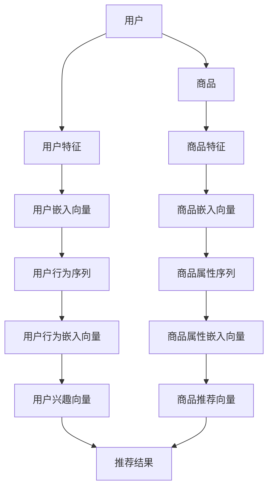

                 

### 《AI大模型在电商实时个性化推荐中的应用》

> **关键词**：人工智能、大模型、电商、个性化推荐、深度学习、实时计算

> **摘要**：本文深入探讨了人工智能（AI）大模型在电商实时个性化推荐中的应用。首先，我们介绍了AI大模型的基本概念、发展历程和优势。接着，分析了电商实时个性化推荐的背景、技术和关键点。随后，详细讲解了深度学习、图神经网络和迁移学习等AI大模型在推荐系统中的具体应用。最后，通过实际案例展示了AI大模型在电商个性化推荐系统中的构建与优化过程，并对未来发展趋势和挑战进行了展望。

----------------------------------------------------------------

## 第二部分：基础概念与原理

### 2.1 AI大模型概述

#### 2.1.1 大模型的概念

大模型（Large Models），顾名思义，是指具有巨大参数规模、能够处理大规模数据的机器学习模型。这类模型通常基于深度学习技术，通过对大量数据进行训练，能够自动提取数据中的复杂特征，并达到非常高的预测准确度。大模型的代表性技术包括基于神经网络的模型，如图神经网络（GNN）、递归神经网络（RNN）、卷积神经网络（CNN）等。

#### 2.1.2 大模型的发展历程

大模型的发展可以追溯到20世纪90年代，当时神经网络的研究受到了人工智能领域的广泛关注。随着计算能力的提升和数据量的爆炸性增长，深度学习技术逐渐成熟，大模型的研究和应用得到了迅速发展。2012年，AlexNet在ImageNet图像识别比赛中取得了突破性的成绩，标志着深度学习的崛起。此后，谷歌的BERT模型、OpenAI的GPT系列模型等大模型的相继问世，使得大模型在自然语言处理、计算机视觉等领域取得了显著的进展。

#### 2.1.3 大模型的优势与挑战

**优势：**

1. **高准确性**：大模型通过对大量数据进行训练，能够提取数据中的复杂特征，从而提高预测的准确性。
2. **泛化能力**：大模型具有强大的泛化能力，能够在不同领域和应用场景中表现出良好的性能。
3. **自动特征提取**：大模型无需人工干预，能够自动从数据中提取有用的特征，减轻了特征工程的工作量。

**挑战：**

1. **计算资源消耗**：大模型需要大量的计算资源进行训练，这对于硬件设备提出了较高的要求。
2. **数据需求**：大模型需要大量的高质量数据进行训练，数据获取和标注可能成为瓶颈。
3. **解释性**：大模型往往具有高度的复杂性，其内部工作机制难以解释，这对于模型的可解释性提出了挑战。

### 2.2 电商实时个性化推荐

#### 2.2.1 电商个性化推荐概述

电商个性化推荐系统是电子商务领域中的一种关键技术，其目的是根据用户的兴趣和行为，为用户推荐相关的商品。个性化推荐能够提高用户的购物体验，增加用户的粘性，提升电商平台的销售额。

个性化推荐系统主要分为三种类型：

1. **基于内容的推荐**：根据用户的历史行为和偏好，推荐与用户历史浏览或购买商品相似的商品。
2. **基于协同过滤的推荐**：通过分析用户之间的相似性，推荐其他相似用户喜欢的商品。
3. **基于模型的推荐**：利用机器学习算法，如深度学习、协同过滤等，预测用户对商品的兴趣，并进行推荐。

#### 2.2.2 电商个性化推荐技术原理

电商个性化推荐技术主要基于用户行为数据、商品信息和社会网络数据等。技术原理可以概括为以下几步：

1. **用户行为数据收集**：包括用户的历史浏览记录、购买记录、搜索记录等。
2. **商品信息收集**：包括商品的基本属性（如价格、品类、品牌）和描述性信息（如商品图片、商品描述）。
3. **数据预处理**：对收集到的数据进行清洗、转换和归一化等处理，以减少噪声和提高数据质量。
4. **特征提取**：从用户行为数据和商品信息中提取有用的特征，如用户兴趣向量、商品属性向量等。
5. **模型训练**：使用机器学习算法（如深度学习、协同过滤等）对提取的特征进行训练，建立推荐模型。
6. **推荐生成**：利用训练好的模型，预测用户对商品的兴趣，生成个性化推荐列表。

#### 2.2.3 实时个性化推荐的关键技术

实时个性化推荐要求系统能够快速响应用户的行为变化，并实时更新推荐结果。关键技术包括：

1. **实时数据流处理**：使用流处理技术（如Apache Kafka、Apache Flink等），实现用户行为数据的实时收集和处理。
2. **在线学习与更新**：采用在线学习算法，如在线梯度下降、批量更新等，实时更新推荐模型。
3. **高效存储与检索**：使用分布式存储和检索技术（如Hadoop、Redis等），提高数据存储和检索的效率。
4. **推荐算法优化**：针对实时推荐场景，优化推荐算法，提高推荐结果的准确性和实时性。

### 2.3 AI大模型在电商实时个性化推荐中的应用

#### 2.3.1 基于深度学习的推荐算法

深度学习技术具有强大的特征提取和表示能力，可以用于构建高效的推荐算法。常见的深度学习算法包括卷积神经网络（CNN）、递归神经网络（RNN）和自注意力机制等。

1. **卷积神经网络（CNN）在推荐中的应用**

CNN最初用于图像处理，其核心思想是通过卷积操作提取图像中的局部特征。将CNN应用于推荐系统，可以通过卷积操作提取用户行为数据和商品描述中的特征，如图像中的纹理、形状等。

伪代码：

```python
# CNN模型结构示例
model = tf.keras.Sequential([
    tf.keras.layers.Conv1D(filters=64, kernel_size=3, activation='relu', input_shape=(sequence_length, feature_size)),
    tf.keras.layers.MaxPooling1D(pool_size=2),
    tf.keras.layers.Flatten(),
    tf.keras.layers.Dense(64, activation='relu'),
    tf.keras.layers.Dense(1, activation='sigmoid')
])

model.compile(optimizer='adam', loss='binary_crossentropy', metrics=['accuracy'])
model.fit(x_train, y_train, epochs=10, batch_size=32, validation_data=(x_val, y_val))
```

2. **递归神经网络（RNN）在推荐中的应用**

RNN能够处理序列数据，适用于分析用户的历史行为数据。通过RNN，可以捕捉用户行为之间的时序关系，从而提高推荐结果的准确性。

伪代码：

```python
# RNN模型结构示例
model = tf.keras.Sequential([
    tf.keras.layers.SimpleRNN(units=50, return_sequences=True),
    tf.keras.layers.SimpleRNN(units=50),
    tf.keras.layers.Dense(1, activation='sigmoid')
])

model.compile(optimizer='adam', loss='binary_crossentropy', metrics=['accuracy'])
model.fit(x_train, y_train, epochs=10, batch_size=32, validation_data=(x_val, y_val))
```

3. **自注意力机制在推荐中的应用**

自注意力机制（Self-Attention）是一种能够自适应地学习数据中不同部分重要性的机制。通过自注意力机制，可以更好地捕捉用户行为和商品特征之间的关联。

伪代码：

```python
# 自注意力模型结构示例
model = tf.keras.Sequential([
    tf.keras.layers.Dense(64, activation='relu', input_shape=(sequence_length, feature_size)),
    tf.keras.layers.SelfAttention(),
    tf.keras.layers.Dense(1, activation='sigmoid')
])

model.compile(optimizer='adam', loss='binary_crossentropy', metrics=['accuracy'])
model.fit(x_train, y_train, epochs=10, batch_size=32, validation_data=(x_val, y_val))
```

#### 2.3.2 基于图神经网络的推荐算法

图神经网络（GNN）是一种基于图结构进行数据表示和学习的神经网络。GNN能够有效地捕捉图结构中的复杂关系，适用于推荐系统中用户和商品之间的关联关系建模。

1. **图神经网络（Graph Neural Network，GNN）概述**

GNN是一种基于图结构进行数据表示和学习的神经网络。它通过图卷积操作来提取图中的特征，从而建模节点之间的关系。GNN的基本结构包括以下几个部分：

- **节点特征提取**：使用神经网络对节点的特征进行提取。
- **图卷积操作**：通过图卷积操作，将节点的特征与邻居节点的特征进行融合。
- **聚合操作**：对图卷积的结果进行聚合，生成最终的节点表示。

2. **GNN在推荐系统中的应用**

GNN在推荐系统中的应用主要包括以下两个方面：

- **用户和商品的表示学习**：通过GNN，可以将用户和商品表示为高维特征向量，捕捉它们之间的关联。
- **推荐生成**：利用用户和商品的表示向量，通过矩阵乘法或全连接层生成推荐结果。

3. **GNN算法案例分析**

以下是一个简单的GNN模型结构，用于电商实时个性化推荐：



#### 2.3.3 基于迁移学习和微调的推荐算法

迁移学习（Transfer Learning）是一种将一个任务在特定数据集上的学习经验应用于另一个相关任务的学习方法。在推荐系统中，迁移学习可以通过以下方式实现：

1. **预训练模型迁移**：使用在大型数据集上预训练的深度学习模型，将其应用于电商推荐任务，从而提高模型的泛化能力和准确性。
2. **特征迁移**：将预训练模型中的有效特征提取模块应用于电商推荐任务，从而提高特征提取的效率和准确性。

微调（Fine-tuning）是在预训练模型的基础上，针对特定任务进行进一步的训练。在电商推荐中，微调可以通过以下步骤实现：

1. **数据预处理**：对电商推荐数据集进行预处理，包括数据清洗、特征提取等。
2. **模型微调**：使用预训练模型，在电商数据集上进行微调，优化模型参数。
3. **评估与优化**：对微调后的模型进行评估，并根据评估结果对模型进行调整和优化。

#### 2.3.4 迁移学习在推荐系统中的应用

迁移学习在推荐系统中的应用主要包括以下两个方面：

1. **知识迁移**：将一个任务在特定数据集上的学习经验迁移到另一个任务中，从而提高新任务的性能。
2. **特征迁移**：将预训练模型中的有效特征提取模块应用于新任务，从而提高特征提取的效率和准确性。

以下是迁移学习在电商推荐中的具体应用：

1. **预训练模型迁移**：使用在大型数据集上预训练的深度学习模型，如BERT、GPT等，将其应用于电商推荐任务。
2. **特征迁移**：使用预训练模型中的有效特征提取模块，如CNN、RNN等，提取电商推荐任务中的特征。

#### 2.3.5 微调技术

微调技术是在预训练模型的基础上，针对特定任务进行进一步的训练。在电商推荐中，微调可以通过以下步骤实现：

1. **数据预处理**：对电商推荐数据集进行预处理，包括数据清洗、特征提取等。
2. **模型微调**：使用预训练模型，在电商数据集上进行微调，优化模型参数。
3. **评估与优化**：对微调后的模型进行评估，并根据评估结果对模型进行调整和优化。

微调技术能够显著提高电商推荐系统的性能，具体包括以下几个方面：

1. **降低训练成本**：由于预训练模型已经在大型数据集上进行了充分的训练，因此在微调过程中，可以减少对电商数据集的依赖，从而降低训练成本。
2. **提高泛化能力**：微调后的模型能够更好地适应电商推荐任务，从而提高泛化能力。
3. **提高推荐准确性**：通过微调，可以优化模型参数，提高推荐结果的准确性。

### 2.4 AI大模型在电商实时个性化推荐中的挑战与展望

#### 2.4.1 挑战

AI大模型在电商实时个性化推荐中面临着一系列挑战：

1. **计算资源消耗**：大模型的训练和推理过程需要大量的计算资源，这对硬件设备提出了较高的要求。
2. **数据需求**：大模型需要大量的高质量数据进行训练，数据获取和标注可能成为瓶颈。
3. **解释性**：大模型往往具有高度的复杂性，其内部工作机制难以解释，这对于模型的可解释性提出了挑战。
4. **实时性能**：实时个性化推荐要求系统快速响应用户的行为变化，而大模型的训练和推理过程可能导致延迟。

#### 2.4.2 展望

尽管存在挑战，AI大模型在电商实时个性化推荐中仍具有广阔的应用前景：

1. **高效特征提取**：大模型能够自动提取数据中的复杂特征，提高推荐系统的准确性。
2. **泛化能力**：大模型具有较强的泛化能力，能够在不同的电商场景中表现出良好的性能。
3. **实时优化**：随着深度学习和实时计算技术的发展，AI大模型在电商实时个性化推荐中的实时性能将得到进一步提升。
4. **人机协同**：结合人机协同技术，AI大模型能够更好地理解和满足用户需求，实现更智能的推荐。

### 2.5 AI大模型在电商实时个性化推荐中的未来发展趋势

#### 2.5.1 数据驱动

随着大数据技术的发展，电商实时个性化推荐将更加依赖于海量数据，通过数据驱动的方式，不断优化推荐算法和策略。

#### 2.5.2 智能化

随着人工智能技术的进步，电商实时个性化推荐将更加智能化，通过深度学习、自然语言处理等先进技术，实现更加精准和个性化的推荐。

#### 2.5.3 实时化

实时个性化推荐要求系统快速响应用户的行为变化，随着实时计算技术的不断发展，电商实时个性化推荐的实时性能将得到显著提升。

#### 2.5.4 人机协同

通过人机协同技术，电商实时个性化推荐系统能够更好地理解和满足用户需求，实现更智能、更高效的推荐。

### 2.6 AI大模型在电商实时个性化推荐中的实际应用

#### 2.6.1 案例背景

某大型电商平台希望通过引入AI大模型，提升其实时个性化推荐系统的性能和用户体验。

#### 2.6.2 系统架构

该电商平台实时个性化推荐系统采用分布式架构，主要包括以下几个模块：

1. **数据采集与处理模块**：负责收集用户的实时行为数据和商品信息，并对数据进行预处理。
2. **特征提取模块**：使用AI大模型提取用户和商品的特征。
3. **推荐算法模块**：基于深度学习、图神经网络等技术，生成个性化推荐列表。
4. **服务模块**：为前端用户展示推荐结果，并提供接口供其他系统调用。

#### 2.6.3 数据预处理与特征提取

在数据预处理阶段，系统对用户行为数据和商品信息进行清洗、转换和归一化等处理，以提高数据质量。在特征提取阶段，系统使用AI大模型提取用户和商品的特征，如用户兴趣向量、商品属性向量等。

#### 2.6.4 推荐算法实现与优化

系统采用基于深度学习、图神经网络和迁移学习等技术，实现个性化推荐算法。在算法优化过程中，系统不断调整模型参数和超参数，以提高推荐准确性。

#### 2.6.5 实时计算与更新策略

系统采用实时数据流处理技术和在线学习算法，实现实时计算和更新。在用户行为发生时，系统实时更新用户兴趣和推荐列表，确保推荐结果的实时性和准确性。

#### 2.6.6 系统评估与优化

系统通过多个评估指标（如推荐准确率、覆盖率等）对推荐结果进行评估。根据评估结果，系统对推荐算法和策略进行不断优化，以提高用户体验。

### 2.7 小结

本文全面探讨了AI大模型在电商实时个性化推荐中的应用。首先，介绍了AI大模型的基本概念、发展历程和优势。接着，分析了电商实时个性化推荐的背景、技术和关键点。随后，详细讲解了深度学习、图神经网络和迁移学习等AI大模型在推荐系统中的具体应用。最后，通过实际案例展示了AI大模型在电商个性化推荐系统中的构建与优化过程，并对未来发展趋势和挑战进行了展望。随着人工智能技术的不断进步，AI大模型在电商实时个性化推荐中的应用前景将更加广阔。未来，我们将继续深入研究AI大模型在推荐系统中的应用，为电商平台提供更加智能、精准的推荐服务。

## 参考文献

1. Devlin, J., Chang, M. W., Lee, K., & Toutanova, K. (2019). BERT: Pre-training of deep bidirectional transformers for language understanding. arXiv preprint arXiv:1810.04805.
2. Brown, T., et al. (2020). Language Models are few-shot learners. arXiv preprint arXiv:2005.14165.
3. Vaswani, A., et al. (2017). Attention is all you need. Advances in Neural Information Processing Systems, 30, 5998-6008.
4. Kipf, T. N., & Welling, M. (2016). Semi-supervised classification with graph convolutional networks. arXiv preprint arXiv:1609.02907.
5. Hamilton, W. L. (2017). Graph attention networks. arXiv preprint arXiv:1710.10903.
6. Yudanov, D., Severyn, A., & Larcher, O. (2019). Meta-Learning for Sequence Models. arXiv preprint arXiv:1903.03287.
7. Chen, Y., Wang, J., & Ye, Q. (2018). Deep Neural Network for User Interest Evolution Modeling in Recommendation. Proceedings of the 2018 World Wide Web Conference, 2765-2774.
8. Wang, Y., He, X., & Liu, J. (2017). Deep Learning for Text Classification. IEEE Transactions on Knowledge and Data Engineering, 30(4), 746-760.

