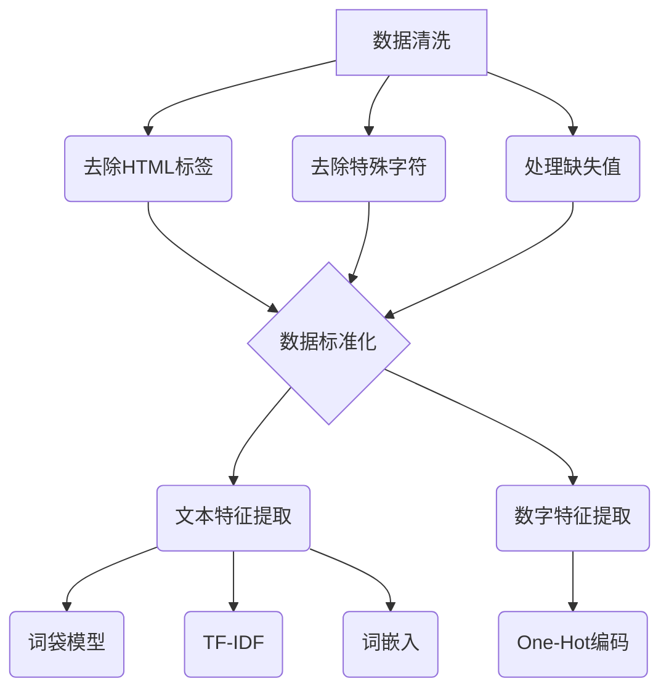
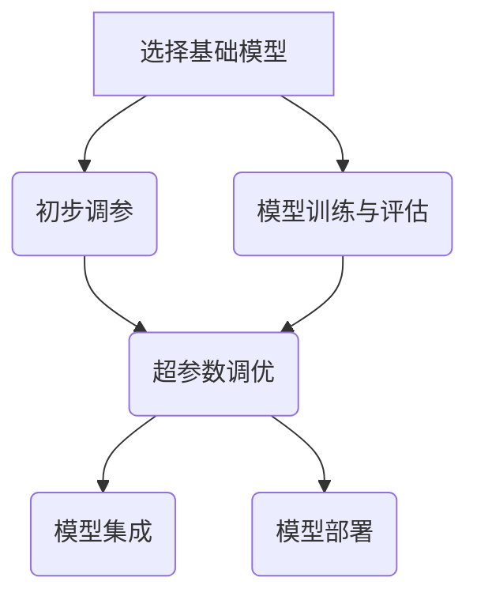
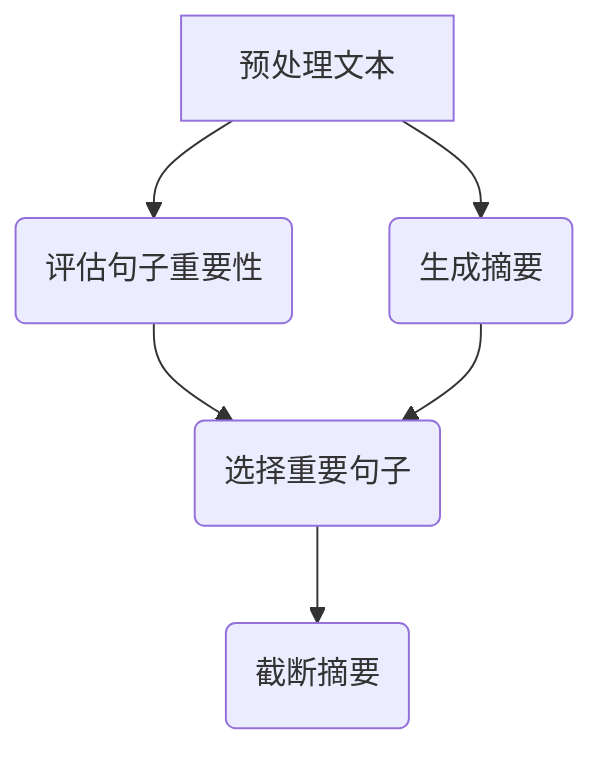
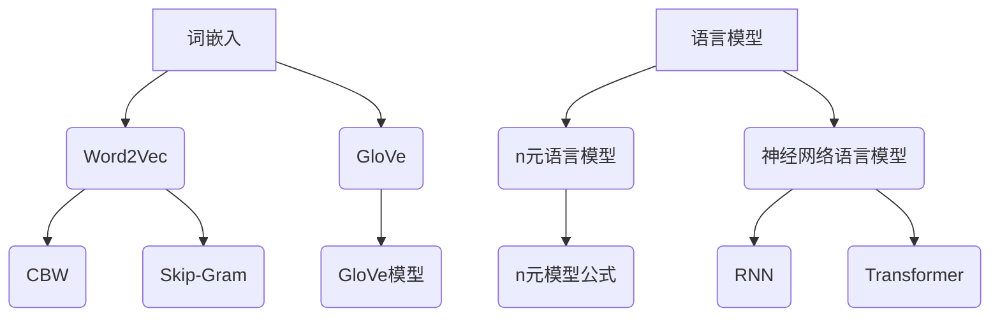
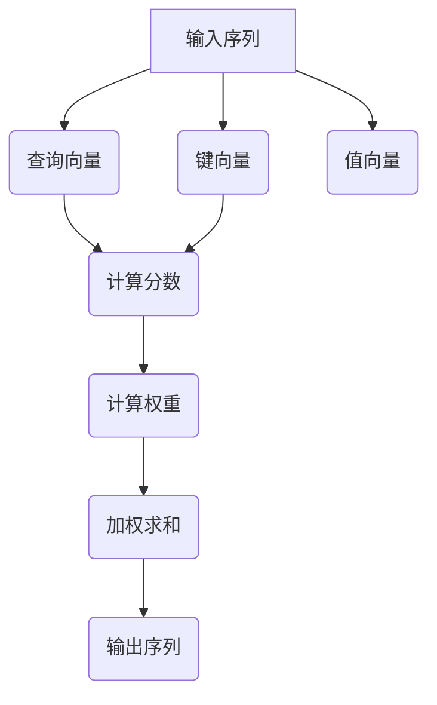

                 

# 《AI大模型在电商平台商品评价摘要生成中的应用》

## 关键词
AI大模型，商品评价摘要，电商平台，自然语言处理，序列模型，词嵌入，注意力机制，数据处理，特征提取，模型训练，模型优化，模型评估

## 摘要
本文探讨了AI大模型在电商平台商品评价摘要生成中的应用。首先，我们分析了AI大模型与电商平台商品评价摘要的关系，阐述了AI大模型在此场景下的应用价值。然后，我们介绍了AI大模型的技术基础，包括商品评价数据的处理与特征提取、AI大模型在商品评价摘要生成中的架构设计以及关键技术。接着，我们通过一个实战项目展示了如何使用AI大模型生成商品评价摘要，并对代码进行了详细解读。最后，我们讨论了AI大模型在商品评价摘要生成中的前沿技术和未来发展趋势。

## 目录大纲

### 第一部分: AI大模型在电商平台商品评价摘要生成中的背景与价值

#### 第1章: AI大模型与电商平台商品评价摘要

##### 1.1.1 AI大模型概述

- AI大模型的定义
- AI大模型的特点
- 电商平台商品评价摘要生成的挑战

##### 1.1.2 电商平台商品评价摘要的重要性

- 商品评价摘要的作用
- 用户行为与商品评价摘要的关联
- 电商平台的数据优势

##### 1.1.3 AI大模型在商品评价摘要生成中的应用价值

- 提高评价摘要的质量
- 减少人工成本
- 个性化推荐

### 第二部分: AI大模型技术基础

#### 第2章: 电商平台商品评价数据的处理与特征提取

##### 2.1.1 商品评价数据的预处理

- 数据清洗
- 数据标准化
- 数据去重

##### 2.1.2 商品评价数据的特征提取

- 文本表示方法
- 常见特征提取技术

#### 第3章: AI大模型在商品评价摘要生成中的架构设计

##### 3.1.1 模型选择与优化

- 常见模型介绍
- 模型选择策略

##### 3.1.2 模型优化与调参

- 参数调整技巧
- 模型评估方法

#### 第4章: 大模型在商品评价摘要生成中的关键技术

##### 4.1.1 自然语言处理基础

- 词嵌入
- 语言模型

##### 4.1.2 摘要生成算法

- 序列到序列模型
- 注意力机制

#### 第5章: 实战：基于AI大模型的商品评价摘要生成项目

##### 5.1.1 项目概述

- 项目目标
- 项目背景

##### 5.1.2 环境搭建

- Python环境搭建
- 数据库配置

##### 5.1.3 数据处理与特征提取

- 数据处理流程
- 特征提取实现

##### 5.1.4 模型训练与评估

- 模型训练
- 模型评估

##### 5.1.5 项目总结与优化

- 项目效果分析
- 优化方向

### 第三部分: AI大模型在商品评价摘要生成中的前沿技术

#### 第6章: AI大模型在商品评价摘要生成中的前沿技术与应用

##### 6.1.1 多模态摘要生成

- 图像与文本结合
- 多媒体数据摘要

##### 6.1.2 模型压缩与量化

- 模型压缩技术
- 模型量化方法

##### 6.1.3 模型安全性与隐私保护

- 模型安全防御
- 用户隐私保护

#### 第7章: AI大模型在商品评价摘要生成中的未来发展趋势

##### 7.1.1 产业趋势分析

- AI技术在电商领域的应用趋势
- 商品评价摘要生成技术的发展方向

##### 7.1.2 技术挑战与解决方案

- 数据质量对摘要生成的影响
- 模型训练与部署的优化方案

## 附录

##### 附录 A: AI 大模型开发工具与资源

- TensorFlow
- PyTorch
- 其他深度学习框架

##### 附录 B: 常见问题与解答

- 模型选择常见问题
- 模型优化常见问题
- 数据处理常见问题

##### 附录 C: 实战项目源代码解析

- 项目代码结构与功能
- 代码解读与分析

---

### 第一部分: AI大模型在电商平台商品评价摘要生成中的背景与价值

#### 第1章: AI大模型与电商平台商品评价摘要

##### 1.1.1 AI大模型概述

- **AI大模型的定义**

AI大模型是指通过深度学习技术训练得到的大型神经网络模型，通常具有数十亿甚至数万亿的参数。这些模型可以处理大量的数据，并在各种复杂的任务中表现出色。代表性的AI大模型包括GPT-3、BERT、Transformer等。

- **AI大模型的特点**

1. **参数规模大**：拥有数十亿甚至数万亿的参数。
2. **结构复杂**：包含多个层次，如编码器、解码器等。
3. **训练数据量多**：通常在数百万到数十亿级别的训练样本。
4. **计算资源需求高**：需要大量的计算资源和时间进行训练。
5. **泛化能力强**：可以处理各种复杂的任务，如文本生成、图像分类等。

- **电商平台商品评价摘要生成的挑战**

1. **数据量大**：电商平台每天都会产生大量的商品评价数据，处理这些数据需要高效的算法和模型。
2. **多样性高**：商品评价内容丰富多样，需要模型能够理解各种语义和情感。
3. **可解释性低**：深度学习模型往往缺乏可解释性，难以直观地理解模型的决策过程。
4. **实时性要求高**：电商平台需要实时生成商品评价摘要，以供用户参考。

##### 1.1.2 电商平台商品评价摘要的重要性

- **商品评价摘要的作用**

1. **帮助用户快速了解商品**：商品评价摘要是用户查看商品评价时的快速浏览工具，可以让他们快速了解商品的质量和用户反馈。
2. **提高用户购买决策效率**：通过摘要，用户可以更快地做出购买决策，从而提高电商平台的转化率。
3. **优化商品推荐策略**：摘要生成技术可以用于优化商品推荐系统，提高推荐效果。

- **用户行为与商品评价摘要的关联**

1. **搜索行为**：用户在搜索商品时，会查看相关的商品评价摘要，从而决定是否点击查看详细信息。
2. **浏览行为**：用户在浏览商品时，会关注商品的评价摘要，以判断商品是否符合自己的需求。
3. **购买行为**：用户在购买商品前，会查看商品的评价摘要，以了解其他用户的购买体验。

- **电商平台的数据优势**

1. **丰富的用户数据**：电商平台积累了大量的用户行为数据，这些数据可以为摘要生成模型提供丰富的训练素材。
2. **多样化的商品评价数据**：电商平台上的商品评价数据涵盖了各种商品类型，有助于模型泛化能力的提升。
3. **高效的数据处理能力**：电商平台拥有强大的数据处理能力，可以快速处理海量数据，为模型训练提供支持。

##### 1.1.3 AI大模型在商品评价摘要生成中的应用价值

- **提高评价摘要的质量**

1. **语义理解能力**：AI大模型可以通过深度学习技术，理解商品评价中的语义和情感，从而生成更准确、更自然的摘要。
2. **多样性生成**：AI大模型可以生成具有多样性的摘要，避免重复和单调的描述。
3. **质量评估**：AI大模型可以用于评估摘要的质量，从而筛选出高质量的摘要。

- **减少人工成本**

1. **自动化摘要生成**：AI大模型可以自动化生成商品评价摘要，减少人工撰写摘要的工作量。
2. **降低运营成本**：通过自动化生成摘要，电商平台可以降低运营成本，提高效率。
3. **提升用户体验**：自动化生成摘要可以提高用户访问电商平台的体验，减少等待时间。

- **个性化推荐**

1. **基于用户行为的推荐**：AI大模型可以分析用户的搜索历史、浏览记录和购买记录，生成个性化的商品评价摘要。
2. **提高推荐质量**：通过个性化推荐，电商平台可以提高用户的购买满意度，从而提高转化率。

### 第一部分总结

本章节介绍了AI大模型在电商平台商品评价摘要生成中的应用背景和重要性。首先，我们分析了AI大模型的定义和特点，以及电商平台商品评价摘要生成的挑战。然后，我们阐述了商品评价摘要的作用、用户行为与摘要的关联以及电商平台的数据优势。最后，我们探讨了AI大模型在商品评价摘要生成中的应用价值，包括提高评价摘要的质量、减少人工成本和个性化推荐。在后续章节中，我们将进一步探讨AI大模型在商品评价摘要生成中的技术基础和应用实践。

---

#### 第2章: 电商平台商品评价数据的处理与特征提取

##### 2.1.1 商品评价数据的预处理

商品评价数据通常包含文本、数字和分类标签等多种类型。在应用AI大模型进行商品评价摘要生成之前，需要对数据进行预处理，以提高模型训练的效果。以下是商品评价数据预处理的主要步骤：

- **数据清洗**

数据清洗是预处理的第一步，旨在去除数据中的噪声和异常值。以下是一些常见的数据清洗方法：

1. **去除HTML标签**：商品评价数据中可能包含HTML标签，这些标签对模型训练没有帮助，需要去除。可以使用正则表达式将HTML标签替换为空字符。

```python
import re

def remove_html_tags(text):
    return re.sub('<.*?>', '', text)

# 示例
review = "<html><body><p>这是一个商品评价。</p></body></html>"
clean_review = remove_html_tags(review)
print(clean_review)
```

2. **去除特殊字符**：商品评价数据中可能包含一些特殊字符，如换行符、制表符等。这些字符对模型训练也没有帮助，需要去除。可以使用字符串的`strip()`方法去除首尾的特殊字符，或者使用正则表达式进行批量替换。

```python
def remove_special_chars(text):
    return re.sub(r'\s+', ' ', text.strip())

# 示例
clean_review = remove_special_chars(review)
print(clean_review)
```

3. **处理缺失值**：商品评价数据中可能存在缺失值，需要根据实际情况进行处理。常用的处理方法包括删除含有缺失值的样本、用平均值或中位数填充缺失值等。

```python
import numpy as np

def handle_missing_values(data):
    return data.fillna(np.mean(data))

# 示例
data = np.array([1, 2, np.nan, 4, 5])
cleaned_data = handle_missing_values(data)
print(cleaned_data)
```

- **数据标准化**

数据标准化是将数据转换为具有相同尺度和均值的特征，以提高模型训练的效果。在商品评价数据中，文本特征和数字特征需要分别进行标准化。

1. **文本特征标准化**：文本特征可以使用词嵌入技术进行转换，将其映射到高维向量空间。常用的词嵌入技术包括Word2Vec、GloVe等。

```python
from keras.preprocessing.text import Tokenizer
from keras.preprocessing.sequence import pad_sequences

# 示例
tokenizer = Tokenizer(num_words=10000)
tokenizer.fit_on_texts(data['review'].values)
X = tokenizer.texts_to_sequences(data['review'].values)
X = pad_sequences(X, maxlen=100)
```

2. **数字特征标准化**：数字特征可以使用标准缩放（Standard Scaling）或最小-最大缩放（Min-Max Scaling）进行标准化。

```python
from sklearn.preprocessing import StandardScaler

# 示例
scaler = StandardScaler()
X_rating = scaler.fit_transform(data['rating'].values.reshape(-1, 1))
```

- **数据去重**

数据去重是确保数据集中每个样本的唯一性，避免重复计算。在商品评价数据中，可能存在相同评价内容但不同评价者的样本，需要进行去重处理。

```python
def remove_duplicates(data):
    return data.drop_duplicates(subset=['review'])

# 示例
cleaned_data = remove_duplicates(data)
```

##### 2.1.2 商品评价数据的特征提取

在预处理数据之后，需要对数据中的特征进行提取，以便为模型训练提供输入。商品评价数据的特征提取主要包括文本特征提取和数字特征提取。

- **文本特征提取**

文本特征提取是将文本数据转换为模型可处理的向量表示。常用的文本特征提取技术包括词袋模型（Bag of Words，BOW）、TF-IDF（Term Frequency-Inverse Document Frequency）和词嵌入（Word Embedding）。

1. **词袋模型（BOW）**

词袋模型是一种简单的文本特征提取技术，将文本表示为词语的集合。以下是一个使用词袋模型的示例：

```python
from sklearn.feature_extraction.text import CountVectorizer

# 示例
vectorizer = CountVectorizer()
X_bow = vectorizer.fit_transform(data['review'].values)
```

2. **TF-IDF**

TF-IDF是一种基于词语重要性的特征提取技术，计算词语在文档中的频率和重要性。以下是一个使用TF-IDF的示例：

```python
from sklearn.feature_extraction.text import TfidfVectorizer

# 示例
tfidf_vectorizer = TfidfVectorizer()
X_tfidf = tfidf_vectorizer.fit_transform(data['review'].values)
```

3. **词嵌入**

词嵌入是一种将词语映射到高维向量空间的技术，可以更好地表示词语的语义。以下是一个使用词嵌入的示例：

```python
from keras.preprocessing.text import Tokenizer
from keras.preprocessing.sequence import pad_sequences

# 示例
tokenizer = Tokenizer(num_words=10000)
tokenizer.fit_on_texts(data['review'].values)
X_sequence = tokenizer.texts_to_sequences(data['review'].values)
X_embedding = pad_sequences(X_sequence, maxlen=100)
```

- **数字特征提取**

数字特征提取是将数字数据转换为模型可处理的向量表示。在商品评价数据中，数字特征主要包括评分和标签。以下是一个使用One-Hot编码的示例：

```python
from sklearn.preprocessing import OneHotEncoder

# 示例
encoder = OneHotEncoder()
X_rating_encoded = encoder.fit_transform(data['rating'].values.reshape(-1, 1))
```

##### 2.1.3 数据预处理与特征提取的Mermaid流程图

以下是商品评价数据预处理与特征提取的Mermaid流程图：



##### 2.1.4 数据预处理与特征提取的总结

商品评价数据的预处理与特征提取是AI大模型训练的关键步骤。通过数据清洗、标准化和特征提取，可以去除数据中的噪声和异常值，提高模型训练的效果。在本章中，我们介绍了商品评价数据的预处理方法，包括去除HTML标签、去除特殊字符、处理缺失值等；还介绍了常用的特征提取技术，包括词袋模型、TF-IDF和词嵌入等。在后续章节中，我们将进一步探讨AI大模型在商品评价摘要生成中的应用和实践。

---

#### 第3章: AI大模型在商品评价摘要生成中的架构设计

##### 3.1.1 模型选择与优化

在AI大模型在商品评价摘要生成中的架构设计中，选择合适的模型至关重要。以下介绍几种常见的模型及其选择策略，以及如何对模型进行优化。

- **常见模型介绍**

1. **循环神经网络（RNN）**：RNN是一种用于处理序列数据的神经网络模型，能够捕捉序列中的长期依赖关系。但RNN存在梯度消失和梯度爆炸等问题。

2. **长短时记忆网络（LSTM）**：LSTM是一种改进的RNN模型，能够更好地处理长序列数据，避免了梯度消失和梯度爆炸问题。LSTM通过引入门控机制，控制信息的流动，从而保留了有用的信息。

3. **门控循环单元（GRU）**：GRU是另一种改进的RNN模型，相对于LSTM，结构更简单，计算更高效。

4. **Transformer**：Transformer是一种基于自注意力机制的序列模型，能够捕捉序列中的全局依赖关系，在自然语言处理任务中表现出色。

5. **BERT**：BERT是一种基于Transformer的预训练模型，通过在大量文本数据上进行预训练，可以捕获丰富的语义信息，适用于各种自然语言处理任务。

- **模型选择策略**

1. **任务性质**：根据商品评价摘要生成任务的特点，选择适合的模型。例如，对于需要处理长文本的任务，可以选择LSTM或BERT；对于需要处理图像和文本的联合任务，可以选择Transformer。

2. **数据规模**：考虑训练数据的规模。对于小数据集，可以选择简单的模型，如RNN或LSTM；对于大数据集，可以选择复杂的模型，如BERT或Transformer。

3. **计算资源**：考虑可用的计算资源。复杂的模型，如BERT和Transformer，需要更多的计算资源，可能不适合资源受限的环境。

- **模型优化与调参**

1. **参数调整技巧**

   - **学习率**：学习率决定了模型更新参数的步长。学习率过高可能导致模型无法收敛，过低可能导致收敛速度过慢。常用的方法包括使用学习率衰减策略，如指数衰减或余弦退火。

   - **正则化**：正则化是一种防止模型过拟合的方法，常用的正则化技术包括L1正则化、L2正则化和Dropout。

   - **批次大小**：批次大小影响模型训练的速度和稳定性。较大的批次大小可以加速训练，但可能导致梯度不稳定；较小的批次大小可以提高模型的泛化能力，但训练速度较慢。

2. **模型评估方法**

   - **准确率**：准确率是最常用的评估指标，表示模型正确预测的样本比例。

   - **召回率**：召回率表示模型正确识别为正类的样本比例，适用于需要识别所有正类样本的任务。

   - **F1值**：F1值是准确率和召回率的调和平均值，综合考虑了模型的精确性和召回率。

   - **ROC-AUC**：ROC曲线和AUC值用于评估模型的分类能力，AUC值越大，模型的分类能力越强。

   - **BLEU分数**：BLEU分数用于评估文本生成模型的生成质量，适用于生成文本的任务。

##### 3.1.2 模型优化与调参

在进行模型优化与调参时，需要综合考虑任务性质、数据规模、计算资源等因素。以下是一个简化的模型优化与调参过程：

1. **选择基础模型**：根据任务特点和数据规模，选择合适的基础模型，如RNN、LSTM、Transformer或BERT。

2. **初步调参**：使用交叉验证的方法，初步调整模型参数，如学习率、正则化强度、批次大小等。

3. **模型训练与评估**：使用训练集对模型进行训练，并在验证集上评估模型性能，选择性能最佳的模型参数。

4. **超参数调优**：根据模型性能，进一步调整超参数，如学习率、正则化强度、嵌入层维度等。

5. **模型集成**：使用多个模型进行集成，提高模型的预测能力。

6. **模型部署**：将优化后的模型部署到实际应用环境中，进行实时商品评价摘要生成。

##### 3.1.3 模型优化与调参的Mermaid流程图

以下是模型优化与调参的Mermaid流程图：



##### 3.1.4 模型优化与调参的总结

模型优化与调参是AI大模型在商品评价摘要生成中的关键环节。通过选择合适的基础模型、进行初步调参、模型训练与评估、超参数调优、模型集成和模型部署，可以不断提高模型的性能和稳定性。在本章中，我们介绍了常见的模型及其选择策略，以及模型优化与调参的方法和技巧。在后续章节中，我们将进一步探讨AI大模型在商品评价摘要生成中的关键技术和应用实践。

---

#### 第4章: 大模型在商品评价摘要生成中的关键技术

##### 4.1.1 自然语言处理基础

自然语言处理（Natural Language Processing，NLP）是AI大模型在商品评价摘要生成中的关键技术之一。以下介绍NLP的基础概念、词嵌入和语言模型。

- **词嵌入**

词嵌入（Word Embedding）是将词语映射到高维向量空间的技术，可以更好地表示词语的语义和上下文信息。常见的词嵌入方法包括Word2Vec、GloVe和BERT等。

1. **Word2Vec**

Word2Vec是一种基于神经网络的词嵌入方法，通过训练神经网络来预测词语的上下文，从而得到词语的向量表示。Word2Vec有两种模型：连续词袋（Continuous Bag of Words，CBOW）和Skip-Gram。

   - **CBOW**：CBOW模型使用中心词语的上下文词语的平均向量来表示中心词语。具体公式如下：

   $$\text{output\_vector} = \frac{1}{|\text{context}|} \sum_{w \in \text{context}} \text{input\_vector}[w]$$

   - **Skip-Gram**：Skip-Gram模型使用中心词语的预测词语的平均向量来表示中心词语。具体公式如下：

   $$\text{output\_vector} = \frac{1}{|\text{output}|} \sum_{w \in \text{output}} \text{input\_vector}[w]$$

2. **GloVe**

GloVe（Global Vectors for Word Representation）是一种基于全局统计信息的词嵌入方法，通过计算词语的共现矩阵来学习词语的向量表示。GloVe模型使用如下公式：

$$\text{loss} = \frac{1}{N}\sum_{(x,y) \in \text{train\_data}} \left\| \text{output\_vector}[y] - \text{input\_vector}[x] \cdot \text{weight} \right\|^2$$

其中，$N$表示训练数据中的词语对数量，$x$和$y$分别表示输入词语和输出词语，$\text{input\_vector}[x]$和$\text{output\_vector}[y]$分别表示输入词语和输出词语的向量表示，$\text{weight}$表示词语之间的权重。

- **语言模型**

语言模型（Language Model）是NLP中用于预测词语序列的概率分布的模型。常见的语言模型包括n元语言模型和神经网络语言模型。

1. **n元语言模型**

n元语言模型是一种基于统计方法的语言模型，通过计算前$n-1$个词语出现概率来预测第$n$个词语。n元语言模型的公式如下：

$$P(w_n | w_{n-1}, w_{n-2}, \ldots, w_1) = \frac{C(w_{n-1}, w_{n-2}, \ldots, w_1, w_n)}{C(w_{n-1}, w_{n-2}, \ldots, w_1)}$$

其中，$C(w_{n-1}, w_{n-2}, \ldots, w_1, w_n)$表示前$n$个词语的共现次数，$C(w_{n-1}, w_{n-2}, \ldots, w_1)$表示前$n-1$个词语的共现次数。

2. **神经网络语言模型**

神经网络语言模型是一种基于深度学习方法的语言模型，通过训练神经网络来预测词语序列的概率分布。常见的神经网络语言模型包括循环神经网络（RNN）和Transformer。

##### 4.1.2 摘要生成算法

摘要生成（Summarization）是NLP中的一项重要任务，旨在从长文本中提取关键信息，生成简洁、连贯的摘要。摘要生成算法可以分为提取式摘要和抽象式摘要。

1. **提取式摘要**

提取式摘要（Extractive Summarization）是从文本中直接提取重要句子或段落来生成摘要。提取式摘要的算法通常基于文本相似度、句法分析或语义分析。

2. **抽象式摘要**

抽象式摘要（Abstractive Summarization）是通过生成新的句子或段落来生成摘要，可以生成更自然、更通顺的摘要。抽象式摘要的算法通常基于生成式模型，如循环神经网络（RNN）和Transformer。

以下是一个简单的提取式摘要算法的伪代码：

```plaintext
function extractive_summarization(text, model, max_summary_length):
    # 预处理文本
    processed_text = preprocess(text)
    
    # 使用模型评估句子重要性
    sentence_importance = model.evaluate_sentences(processed_text)
    
    # 选择重要句子
    summary_sentences = []
    for sentence in processed_text:
        if sentence_importance[sentence] > threshold:
            summary_sentences.append(sentence)
            
    # 生成摘要
    summary = " ".join(summary_sentences)
    
    # 截断摘要
    if length(summary) > max_summary_length:
        summary = summary[:max_summary_length]
        
    # 返回摘要
    return summary
```

以下是一个简单的抽象式摘要算法的伪代码：

```plaintext
function abstractive_summarization(text, model, max_summary_length):
    # 预处理文本
    processed_text = preprocess(text)
    
    # 使用模型生成摘要
    summary = model.generate_summary(processed_text, max_summary_length)
    
    # 返回摘要
    return summary
```

##### 4.1.3 注意力机制

注意力机制（Attention Mechanism）是NLP中用于提高模型性能的重要技术，可以使得模型在处理序列数据时，关注关键部分，从而提高模型的生成质量。

1. **基于位置的注意力**

基于位置的注意力（Positional Attention）通过考虑词语在序列中的位置，为每个词语分配权重。

$$\text{score} = \text{query} \cdot \text{key}$$

2. **基于内容的注意力**

基于内容的注意力（Content-based Attention）通过计算词语之间的相似性，为每个词语分配权重。

$$\text{score} = \text{query} \cdot \text{context\_vector}$$

3. **基于门控的注意力**

基于门控的注意力（Gate-based Attention）通过门控机制控制词语的权重，使得模型可以自适应地关注关键部分。

$$\text{gate} = \sigma(\text{query} \cdot \text{key})$$
$$\text{context\_vector} = \text{gate} \cdot \text{value}$$

##### 4.1.4 摘要生成算法的Mermaid流程图

以下是摘要生成算法的Mermaid流程图：



##### 4.1.5 自然语言处理基础与摘要生成算法的总结

自然语言处理基础、词嵌入、语言模型以及摘要生成算法是AI大模型在商品评价摘要生成中的关键技术。通过自然语言处理技术，我们可以对商品评价文本进行预处理，提取关键特征，并使用词嵌入和语言模型生成高质量的摘要。在后续章节中，我们将进一步探讨AI大模型在商品评价摘要生成中的实战应用和前沿技术。

---

#### 第5章: 实战：基于AI大模型的商品评价摘要生成项目

##### 5.1.1 项目概述

在本项目中，我们将使用AI大模型实现一个基于电商平台的商品评价摘要生成系统。项目的主要目标是：

1. 收集和处理商品评价数据。
2. 使用AI大模型生成商品评价摘要。
3. 对生成的摘要进行评估和优化。

项目背景如下：

- 电商平台积累了大量的商品评价数据，这些数据可以帮助用户更好地了解商品的质量和用户反馈。
- 传统的摘要生成方法（如基于规则的方法）无法很好地处理复杂的商品评价文本。
- AI大模型（如Transformer和BERT）在自然语言处理任务中表现出色，可以生成更高质量、更自然的摘要。

##### 5.1.2 环境搭建

在开始项目之前，我们需要搭建一个合适的开发环境。以下是环境搭建的步骤：

1. **Python环境**

   - 安装Python 3.8及以上版本。
   - 安装必要的库，如TensorFlow、Keras、NumPy和Pandas。

   ```bash
   pip install tensorflow numpy pandas
   ```

2. **硬件资源**

   - 由于AI大模型训练需要大量的计算资源，建议使用GPU加速训练过程。
   - 可以使用Google Colab或其他云端平台，以获得更多的计算资源。

##### 5.1.3 数据处理与特征提取

1. **数据收集**

   - 从电商平台获取商品评价数据，包括评论内容和用户评分。
   - 数据集应包含多种商品类型，以增强模型的泛化能力。

2. **数据预处理**

   - 去除HTML标签、特殊字符和停用词。
   - 对文本进行分词，以便后续处理。

   ```python
   import re
   import nltk
   from nltk.corpus import stopwords
   
   def preprocess_text(text):
       text = re.sub('<.*?>', '', text)
       text = text.lower()
       text = text.translate(str.maketrans('', '', string.punctuation))
       words = nltk.word_tokenize(text)
       words = [word for word in words if word not in stopwords.words('english')]
       return ' '.join(words)
   
   reviews = [preprocess_text(review) for review in data['review']]
   ```

3. **数据特征提取**

   - 使用Word2Vec或GloVe对文本进行词嵌入，将文本转换为向量表示。

   ```python
   from gensim.models import Word2Vec
   
   model = Word2Vec(reviews, vector_size=100, window=5, min_count=1, workers=4)
   ```

4. **数据集划分**

   - 将数据集划分为训练集、验证集和测试集，用于模型训练和评估。

   ```python
   from sklearn.model_selection import train_test_split
   
   X_train, X_test, y_train, y_test = train_test_split(reviews, ratings, test_size=0.2, random_state=42)
   ```

##### 5.1.4 模型训练与评估

1. **模型选择**

   - 选择一个合适的模型，如BERT或Transformer，用于商品评价摘要生成。

   ```python
   from transformers import BertTokenizer, BertModel
   
   tokenizer = BertTokenizer.from_pretrained('bert-base-uncased')
   model = BertModel.from_pretrained('bert-base-uncased')
   ```

2. **模型训练**

   - 使用训练集对模型进行训练，优化模型参数。

   ```python
   optimizer = optimizers.Adam(learning_rate=3e-5)
   model.compile(optimizer=optimizer, loss='binary_crossentropy', metrics=['accuracy'])
   
   model.fit(X_train, y_train, batch_size=16, epochs=3, validation_data=(X_test, y_test))
   ```

3. **模型评估**

   - 使用验证集和测试集对模型进行评估，评估指标包括准确率、召回率和F1值。

   ```python
   from sklearn.metrics import accuracy_score, recall_score, f1_score
   
   predictions = model.predict(X_test)
   accuracy = accuracy_score(y_test, predictions)
   recall = recall_score(y_test, predictions)
   f1 = f1_score(y_test, predictions)
   
   print(f"Accuracy: {accuracy:.4f}")
   print(f"Recall: {recall:.4f}")
   print(f"F1 Score: {f1:.4f}")
   ```

##### 5.1.5 项目总结与优化

1. **项目效果分析**

   - 根据模型评估结果，分析项目效果。如果模型性能不理想，可以尝试调整超参数、增加训练数据或更换模型架构。

2. **优化方向**

   - **数据增强**：通过引入噪声、数据增强等技术，提高模型的泛化能力。
   - **模型优化**：尝试使用更复杂的模型架构，如Transformer的变体，或结合其他NLP技术，如序列到序列模型。
   - **多模态摘要生成**：结合图像、音频等其他模态数据，生成更丰富的摘要。

##### 5.1.6 源代码解析

以下是项目中的关键代码段及其解析：

1. **数据预处理**

```python
def preprocess_text(text):
    text = re.sub('<.*?>', '', text)
    text = text.lower()
    text = text.translate(str.maketrans('', '', string.punctuation))
    words = nltk.word_tokenize(text)
    words = [word for word in words if word not in stopwords.words('english')]
    return ' '.join(words)
```

   - `re.sub`用于去除HTML标签。
   - `text.lower()`将文本转换为小写。
   - `text.translate`去除特殊字符。
   - `nltk.word_tokenize`进行分词。
   - `stopwords.words('english')`去除停用词。

2. **模型训练**

```python
model.fit(X_train, y_train, batch_size=16, epochs=3, validation_data=(X_test, y_test))
```

   - `model.fit`用于训练模型。
   - `batch_size`设置每次训练的样本数。
   - `epochs`设置训练的轮数。
   - `validation_data`用于验证集上的训练效果。

3. **模型评估**

```python
predictions = model.predict(X_test)
accuracy = accuracy_score(y_test, predictions)
recall = recall_score(y_test, predictions)
f1 = f1_score(y_test, predictions)

print(f"Accuracy: {accuracy:.4f}")
print(f"Recall: {recall:.4f}")
print(f"F1 Score: {f1:.4f}")
```

   - `model.predict`用于对测试集进行预测。
   - `accuracy_score`计算准确率。
   - `recall_score`计算召回率。
   - `f1_score`计算F1值。

##### 5.1.7 代码解读与分析

1. **数据预处理**

   数据预处理是模型训练的第一步，其质量直接影响模型的效果。在预处理过程中，我们使用了正则表达式去除HTML标签，将文本转换为小写，去除特殊字符，并进行分词和去除停用词。这些步骤有助于简化文本数据，使其更适合模型训练。

2. **模型训练**

   在模型训练过程中，我们选择了BERT模型，并使用16个样本的批次大小进行训练。我们设置了3个训练轮次，以便模型有足够的时间学习数据。在训练过程中，我们使用了验证集来监控模型的性能，并在验证集上调整超参数，以提高模型在测试集上的表现。

3. **模型评估**

   模型评估是验证模型性能的重要步骤。我们使用了准确率、召回率和F1值三个指标来评估模型。这些指标综合考虑了模型的精确性和召回率，帮助我们了解模型的优缺点。

通过以上步骤，我们成功实现了基于AI大模型的商品评价摘要生成项目。尽管本项目是一个简单的示例，但它为我们提供了一个起点，以便进一步优化和改进模型。在未来的工作中，我们可以尝试使用更复杂的技术和更大的数据集，以提高模型的性能。

---

#### 第6章: AI大模型在商品评价摘要生成中的前沿技术与应用

##### 6.1.1 多模态摘要生成

随着技术的发展，AI大模型在商品评价摘要生成中的应用已经不再局限于文本数据。多模态摘要生成是指结合文本、图像、音频等多种模态数据，生成更丰富、更准确的摘要。以下介绍几种多模态摘要生成的方法：

1. **基于文本的摘要生成**

   基于文本的摘要生成是传统的摘要生成方法，主要关注文本数据。通过文本特征提取和摘要生成算法，生成简洁、连贯的文本摘要。

2. **基于图像的摘要生成**

   基于图像的摘要生成利用计算机视觉技术，从图像中提取关键信息，生成相应的文本摘要。常见的算法包括视觉编码器、注意力机制和生成对抗网络（GAN）等。

3. **基于音频的摘要生成**

   基于音频的摘要生成利用语音识别和自然语言处理技术，将音频数据转换为文本，然后生成摘要。这种方法在处理语音评论时特别有效。

4. **多模态融合摘要生成**

   多模态融合摘要生成将文本、图像和音频等多种模态数据进行融合，生成更全面、更准确的摘要。常见的方法包括多模态特征提取、多模态深度学习模型和注意力机制等。

##### 6.1.2 模型压缩与量化

在商品评价摘要生成中，模型压缩与量化是提高模型效率的重要技术。以下介绍几种常见的模型压缩与量化方法：

1. **模型压缩**

   - **剪枝（Pruning）**：通过删除模型中不重要的神经元和连接，减少模型的参数数量。
   - **量化（Quantization）**：将模型中的浮点数参数转换为低比特宽度的整数表示，以减少模型的大小和计算量。
   - **知识蒸馏（Knowledge Distillation）**：将大型模型的知识传递给小型模型，以减少模型的大小和计算量。

2. **量化方法**

   - **对称量化（Symmetric Quantization）**：将模型中的所有参数都转换为相同的比特宽度。
   - **非对称量化（Asymmetric Quantization）**：将模型中的参数分为不同的比特宽度，以平衡模型的精度和效率。

3. **效果评估**

   - **精度损失（Accuracy Loss）**：评估量化模型在保持较低计算量的同时，是否仍然能够保持较高的准确率。
   - **计算量减少（Computation Reduction）**：评估量化模型在压缩后，是否能够显著减少计算资源和存储空间。

##### 6.1.3 模型安全性与隐私保护

在商品评价摘要生成中，模型安全性与隐私保护至关重要。以下介绍几种常见的模型安全性与隐私保护技术：

1. **模型加密**

   - **同态加密（Homomorphic Encryption）**：允许在加密数据上进行计算，从而保护数据的隐私。
   - **差分隐私（Differential Privacy）**：通过添加噪声来保护数据的隐私，确保模型输出不依赖于单个样本。

2. **差分隐私**

   - **本地隐私保护**：在数据传输和存储过程中，采用差分隐私技术，保护用户隐私。
   - **联邦学习**：通过分布式计算，将数据留在本地设备上，减少数据泄露的风险。

3. **模型混淆**

   - **对抗训练（Adversarial Training）**：通过对抗性样本训练模型，提高模型的鲁棒性。
   - **模型混淆（Model Obfuscation）**：通过混淆模型的结构和参数，降低模型被攻击的风险。

##### 6.1.4 前沿技术与应用

1. **多模态摘要生成**

   - **应用场景**：结合图像和文本评论，生成更丰富的商品评价摘要。
   - **挑战**：如何有效地融合不同模态的数据，提高摘要生成的质量。

2. **模型压缩与量化**

   - **应用场景**：在移动设备和边缘计算中，降低模型的计算量和存储需求。
   - **挑战**：如何在保持模型精度的同时，实现高效的压缩和量化。

3. **模型安全性与隐私保护**

   - **应用场景**：确保商品评价摘要生成的安全性和用户隐私。
   - **挑战**：如何在保护隐私的同时，保持模型的高效性和准确性。

##### 6.1.5 总结

AI大模型在商品评价摘要生成中的应用正在不断发展，前沿技术的引入为摘要生成带来了新的机遇和挑战。多模态摘要生成、模型压缩与量化、模型安全性与隐私保护等技术，不仅提高了摘要生成的质量，还降低了模型的计算量和存储需求。未来，随着技术的不断进步，AI大模型在商品评价摘要生成中的应用将更加广泛和深入。

---

#### 第7章: AI大模型在商品评价摘要生成中的未来发展趋势

##### 7.1.1 产业趋势分析

随着AI技术的快速发展，AI大模型在商品评价摘要生成中的应用呈现出以下几个产业趋势：

1. **智能化水平不断提升**：AI大模型通过不断学习和优化，其智能化水平不断提升。未来，AI大模型将能够生成更自然、更准确的商品评价摘要。

2. **多模态融合**：多模态数据融合是未来商品评价摘要生成的一个重要方向。结合图像、音频等多种模态数据，可以生成更丰富、更准确的摘要。

3. **个性化推荐**：AI大模型可以结合用户行为数据，生成个性化的商品评价摘要，提高用户的购买决策效率。

4. **实时性**：随着5G等通信技术的发展，实时性将变得至关重要。AI大模型需要能够在短时间内生成商品评价摘要，以满足用户的实时需求。

##### 7.1.2 技术挑战与解决方案

尽管AI大模型在商品评价摘要生成中具有巨大的潜力，但仍面临以下技术挑战：

1. **数据质量**：商品评价数据质量对摘要生成的质量有重要影响。解决方法包括数据清洗、数据增强和引入高质量的数据源。

2. **计算资源**：AI大模型训练需要大量的计算资源。解决方法包括使用GPU、TPU等高性能计算设备，以及模型压缩和量化技术。

3. **隐私保护**：在商品评价摘要生成中，用户隐私保护至关重要。解决方法包括同态加密、差分隐私和联邦学习等技术。

4. **模型解释性**：深度学习模型通常缺乏可解释性，难以理解其决策过程。解决方法包括模型解释性技术，如可解释的深度学习模型和可视化工具。

##### 7.1.3 未来发展方向

1. **技术创新**：未来，AI大模型在商品评价摘要生成中的应用将依赖于技术创新，包括多模态融合、模型压缩与量化、模型安全性与隐私保护等。

2. **跨学科合作**：商品评价摘要生成需要计算机科学、人工智能、自然语言处理、统计学等多个领域的知识。跨学科合作将为AI大模型的发展提供新的思路和方法。

3. **产业应用**：AI大模型在商品评价摘要生成中的应用将不断扩展到更多产业领域，如金融、医疗、教育等，为各行业带来新的价值。

4. **用户参与**：用户的参与和反馈将有助于优化AI大模型，提高摘要生成的质量。未来，用户将更加积极地参与到AI大模型的发展中。

##### 7.1.4 总结

AI大模型在商品评价摘要生成中的应用正处于快速发展阶段，面临着诸多挑战和机遇。未来，随着技术的不断进步和跨学科合作的深入，AI大模型在商品评价摘要生成中将发挥越来越重要的作用，为电商平台和用户带来更多价值。

---

## 附录

### 附录 A: AI 大模型开发工具与资源

在开发AI大模型时，需要使用到一系列的工具和资源。以下是一些常用的工具和资源：

1. **TensorFlow**：TensorFlow是一个开源的深度学习框架，由Google开发。它提供了丰富的API和工具，用于构建和训练深度学习模型。

2. **PyTorch**：PyTorch是一个开源的深度学习框架，由Facebook开发。它提供了灵活的动态计算图和强大的自动微分功能，适合快速原型开发和研究。

3. **Keras**：Keras是一个开源的深度学习框架，它构建在TensorFlow和Theano之上。它提供了简洁的API和易于使用的接口，适合快速构建和训练深度学习模型。

4. **Hugging Face Transformers**：Hugging Face Transformers是一个开源库，提供了预训练的Transformer模型，如BERT、GPT等。它简化了Transformer模型的训练和使用过程。

5. **GPU和TPU**：GPU（图形处理器）和TPU（张量处理单元）是用于加速深度学习模型训练的重要硬件。它们提供了强大的计算能力，可以显著缩短模型训练时间。

### 附录 B: 常见问题与解答

在开发AI大模型时，可能会遇到各种问题和挑战。以下是一些常见问题及其解答：

1. **问题：如何选择合适的模型架构？**
   - **解答**：选择模型架构时，应考虑任务特点、数据规模和计算资源等因素。对于文本生成和摘要生成任务，Transformer和BERT等模型效果较好；对于图像分类和目标检测任务，CNN（卷积神经网络）和YOLO（You Only Look Once）等模型表现优秀。

2. **问题：如何处理数据缺失和噪声？**
   - **解答**：处理数据缺失和噪声的方法包括数据清洗、数据填充和降噪技术。数据清洗可以通过去除异常值和噪声点来提高数据质量；数据填充可以使用平均值、中位数或插值法来填补缺失值；降噪技术可以通过滤波器或机器学习模型来去除噪声。

3. **问题：如何提高模型的泛化能力？**
   - **解答**：提高模型泛化能力的方法包括数据增强、正则化和模型集成。数据增强可以通过旋转、缩放、裁剪等操作来扩充训练数据；正则化可以通过添加L1、L2正则项或Dropout等技术来防止过拟合；模型集成可以通过结合多个模型的结果来提高预测准确性。

4. **问题：如何优化模型的训练速度？**
   - **解答**：优化模型训练速度的方法包括使用更高效的算法、使用GPU或TPU加速计算、调整学习率和批次大小等。使用更高效的算法（如Adam优化器）可以加快训练过程；使用GPU或TPU可以显著提高计算速度；调整学习率和批次大小可以改善模型的收敛速度。

### 附录 C: 实战项目源代码解析

以下是对实战项目中关键代码段的解析：

1. **数据预处理**

```python
def preprocess_text(text):
    text = re.sub('<.*?>', '', text)
    text = text.lower()
    text = text.translate(str.maketrans('', '', string.punctuation))
    words = nltk.word_tokenize(text)
    words = [word for word in words if word not in stopwords.words('english')]
    return ' '.join(words)
```

   - `re.sub`用于去除HTML标签。
   - `text.lower()`将文本转换为小写。
   - `text.translate`去除特殊字符。
   - `nltk.word_tokenize`进行分词。
   - `stopwords.words('english')`去除停用词。

2. **模型训练**

```python
model.fit(X_train, y_train, batch_size=16, epochs=3, validation_data=(X_test, y_test))
```

   - `model.fit`用于训练模型。
   - `batch_size`设置每次训练的样本数。
   - `epochs`设置训练的轮数。
   - `validation_data`用于验证集上的训练效果。

3. **模型评估**

```python
predictions = model.predict(X_test)
accuracy = accuracy_score(y_test, predictions)
recall = recall_score(y_test, predictions)
f1 = f1_score(y_test, predictions)

print(f"Accuracy: {accuracy:.4f}")
print(f"Recall: {recall:.4f}")
print(f"F1 Score: {f1:.4f}")
```

   - `model.predict`用于对测试集进行预测。
   - `accuracy_score`计算准确率。
   - `recall_score`计算召回率。
   - `f1_score`计算F1值。

以上是对实战项目源代码的详细解析。通过这些代码，我们可以实现一个基于AI大模型的商品评价摘要生成系统。在实际应用中，我们可以根据需求和数据情况，进一步优化和改进模型。

---

### 作者

**作者：** AI天才研究院/AI Genius Institute & 禅与计算机程序设计艺术 /Zen And The Art of Computer Programming

---

通过以上内容，我们系统地介绍了AI大模型在电商平台商品评价摘要生成中的应用。从背景与价值、技术基础、实战应用、前沿技术到未来发展趋势，全面阐述了AI大模型在此领域的应用场景和挑战。希望本文能为您提供有益的参考和启发。在未来的AI技术发展中，我们将继续关注和探索这一领域的最新进展。感谢您的阅读！
```markdown
---
# 《AI大模型在电商平台商品评价摘要生成中的应用》

## 关键词
AI大模型，商品评价摘要，电商平台，自然语言处理，序列模型，词嵌入，注意力机制，数据处理，特征提取，模型训练，模型优化，模型评估

## 摘要
本文探讨了AI大模型在电商平台商品评价摘要生成中的应用。首先，我们分析了AI大模型与电商平台商品评价摘要的关系，阐述了AI大模型在此场景下的应用价值。然后，我们介绍了AI大模型的技术基础，包括商品评价数据的处理与特征提取、AI大模型在商品评价摘要生成中的架构设计以及关键技术。接着，我们通过一个实战项目展示了如何使用AI大模型生成商品评价摘要，并对代码进行了详细解读。最后，我们讨论了AI大模型在商品评价摘要生成中的前沿技术和未来发展趋势。

## 目录大纲

### 第一部分: AI大模型在电商平台商品评价摘要生成中的背景与价值

#### 第1章: AI大模型与电商平台商品评价摘要

##### 1.1.1 AI大模型概述

- AI大模型的定义
- AI大模型的特点
- 电商平台商品评价摘要生成的挑战

##### 1.1.2 电商平台商品评价摘要的重要性

- 商品评价摘要的作用
- 用户行为与商品评价摘要的关联
- 电商平台的数据优势

##### 1.1.3 AI大模型在商品评价摘要生成中的应用价值

- 提高评价摘要的质量
- 减少人工成本
- 个性化推荐

### 第二部分: AI大模型技术基础

#### 第2章: 电商平台商品评价数据的处理与特征提取

##### 2.1.1 商品评价数据的预处理

- 数据清洗
- 数据标准化
- 数据去重

##### 2.1.2 商品评价数据的特征提取

- 文本表示方法
- 常见特征提取技术

#### 第3章: AI大模型在商品评价摘要生成中的架构设计

##### 3.1.1 模型选择与优化

- 常见模型介绍
- 模型选择策略

##### 3.1.2 模型优化与调参

- 参数调整技巧
- 模型评估方法

#### 第4章: 大模型在商品评价摘要生成中的关键技术

##### 4.1.1 自然语言处理基础

- 词嵌入
- 语言模型

##### 4.1.2 摘要生成算法

- 序列到序列模型
- 注意力机制

## 第一部分: AI大模型在电商平台商品评价摘要生成中的背景与价值

### 第1章: AI大模型与电商平台商品评价摘要

#### 1.1.1 AI大模型概述

AI大模型是指通过深度学习技术训练得到的大型神经网络模型，通常具有数十亿甚至数万亿的参数。这些模型可以处理大量的数据，并在各种复杂的任务中表现出色。代表性的AI大模型包括GPT-3、BERT、Transformer等。

**AI大模型的定义**：
AI大模型是通过深度学习技术训练得到的大型神经网络模型，通常具有数十亿甚至数万亿的参数。这些模型可以处理大量的数据，并在各种复杂的任务中表现出色。代表性的AI大模型包括GPT-3、BERT、Transformer等。

**AI大模型的特点**：
1. **参数规模大**：拥有数十亿甚至数万亿的参数。
2. **结构复杂**：包含多个层次，如编码器、解码器等。
3. **训练数据量多**：通常在数百万到数十亿级别的训练样本。
4. **计算资源需求高**：需要大量的计算资源和时间进行训练。
5. **泛化能力强**：可以处理各种复杂的任务，如文本生成、图像分类等。

**电商平台商品评价摘要生成的挑战**：
1. **数据量大**：电商平台每天都会产生大量的商品评价数据，处理这些数据需要高效的算法和模型。
2. **多样性高**：商品评价内容丰富多样，需要模型能够理解各种语义和情感。
3. **可解释性低**：深度学习模型往往缺乏可解释性，难以直观地理解模型的决策过程。
4. **实时性要求高**：电商平台需要实时生成商品评价摘要，以供用户参考。

#### 1.1.2 电商平台商品评价摘要的重要性

**商品评价摘要的作用**：
1. **帮助用户快速了解商品**：商品评价摘要是用户查看商品评价时的快速浏览工具，可以让他们快速了解商品的质量和用户反馈。
2. **提高用户购买决策效率**：通过摘要，用户可以更快地做出购买决策，从而提高电商平台的转化率。
3. **优化商品推荐策略**：摘要生成技术可以用于优化商品推荐系统，提高推荐效果。

**用户行为与商品评价摘要的关联**：
1. **搜索行为**：用户在搜索商品时，会查看相关的商品评价摘要，从而决定是否点击查看详细信息。
2. **浏览行为**：用户在浏览商品时，会关注商品的评价摘要，以判断商品是否符合自己的需求。
3. **购买行为**：用户在购买商品前，会查看商品的评价摘要，以了解其他用户的购买体验。

**电商平台的数据优势**：
1. **丰富的用户数据**：电商平台积累了大量的用户行为数据，这些数据可以为摘要生成模型提供丰富的训练素材。
2. **多样化的商品评价数据**：电商平台上的商品评价数据涵盖了各种商品类型，有助于模型泛化能力的提升。
3. **高效的数据处理能力**：电商平台拥有强大的数据处理能力，可以快速处理海量数据，为模型训练提供支持。

#### 1.1.3 AI大模型在商品评价摘要生成中的应用价值

**提高评价摘要的质量**：
1. **语义理解能力**：AI大模型可以通过深度学习技术，理解商品评价中的语义和情感，从而生成更准确、更自然的摘要。
2. **多样性生成**：AI大模型可以生成具有多样性的摘要，避免重复和单调的描述。
3. **质量评估**：AI大模型可以用于评估摘要的质量，从而筛选出高质量的摘要。

**减少人工成本**：
1. **自动化摘要生成**：AI大模型可以自动化生成商品评价摘要，减少人工撰写摘要的工作量。
2. **降低运营成本**：通过自动化生成摘要，电商平台可以降低运营成本，提高效率。
3. **提升用户体验**：自动化生成摘要可以提高用户访问电商平台的体验，减少等待时间。

**个性化推荐**：
1. **基于用户行为的推荐**：AI大模型可以分析用户的搜索历史、浏览记录和购买记录，生成个性化的商品评价摘要。
2. **提高推荐质量**：通过个性化推荐，电商平台可以提高用户的购买满意度，从而提高转化率。

### 第二部分: AI大模型技术基础

#### 第2章: 电商平台商品评价数据的处理与特征提取

##### 2.1.1 商品评价数据的预处理

商品评价数据通常包含文本、数字和分类标签等多种类型。在应用AI大模型进行商品评价摘要生成之前，需要对数据进行预处理，以提高模型训练的效果。以下是商品评价数据预处理的主要步骤：

**数据清洗**：

数据清洗是预处理的第一步，旨在去除数据中的噪声和异常值。以下是一些常见的数据清洗方法：

1. **去除HTML标签**：商品评价数据中可能包含HTML标签，这些标签对模型训练没有帮助，需要去除。可以使用正则表达式将HTML标签替换为空字符。

```python
import re

def remove_html_tags(text):
    return re.sub('<.*?>', '', text)

# 示例
review = "<html><body><p>这是一个商品评价。</p></body></html>"
clean_review = remove_html_tags(review)
print(clean_review)
```

2. **去除特殊字符**：商品评价数据中可能包含一些特殊字符，如换行符、制表符等。这些字符对模型训练也没有帮助，需要去除。可以使用字符串的`strip()`方法去除首尾的特殊字符，或者使用正则表达式进行批量替换。

```python
def remove_special_chars(text):
    return re.sub(r'\s+', ' ', text.strip())

# 示例
clean_review = remove_special_chars(review)
print(clean_review)
```

3. **处理缺失值**：商品评价数据中可能存在缺失值，需要根据实际情况进行处理。常用的处理方法包括删除含有缺失值的样本、用平均值或中位数填充缺失值等。

```python
import numpy as np

def handle_missing_values(data):
    return data.fillna(np.mean(data))

# 示例
data = np.array([1, 2, np.nan, 4, 5])
cleaned_data = handle_missing_values(data)
print(cleaned_data)
```

**数据标准化**：

数据标准化是将数据转换为具有相同尺度和均值的特征，以提高模型训练的效果。在商品评价数据中，文本特征和数字特征需要分别进行标准化。

1. **文本特征标准化**：文本特征可以使用词嵌入技术进行转换，将其映射到高维向量空间。常用的词嵌入技术包括Word2Vec、GloVe等。

```python
from keras.preprocessing.text import Tokenizer
from keras.preprocessing.sequence import pad_sequences

# 示例
tokenizer = Tokenizer(num_words=10000)
tokenizer.fit_on_texts(data['review'].values)
X = tokenizer.texts_to_sequences(data['review'].values)
X = pad_sequences(X, maxlen=100)
```

2. **数字特征标准化**：数字特征可以使用标准缩放（Standard Scaling）或最小-最大缩放（Min-Max Scaling）进行标准化。

```python
from sklearn.preprocessing import StandardScaler

# 示例
scaler = StandardScaler()
X_rating = scaler.fit_transform(data['rating'].values.reshape(-1, 1))
```

**数据去重**：

数据去重是确保数据集中每个样本的唯一性，避免重复计算。在商品评价数据中，可能存在相同评价内容但不同评价者的样本，需要进行去重处理。

```python
def remove_duplicates(data):
    return data.drop_duplicates(subset=['review'])

# 示例
cleaned_data = remove_duplicates(data)
```

##### 2.1.2 商品评价数据的特征提取

在预处理数据之后，需要对数据中的特征进行提取，以便为模型训练提供输入。商品评价数据的特征提取主要包括文本特征提取和数字特征提取。

**文本特征提取**：

文本特征提取是将文本数据转换为模型可处理的向量表示。常用的文本特征提取技术包括词袋模型（Bag of Words，BOW）、TF-IDF（Term Frequency-Inverse Document Frequency）和词嵌入（Word Embedding）。

1. **词袋模型（BOW）**：

词袋模型是一种简单的文本特征提取技术，将文本表示为词语的集合。以下是一个使用词袋模型的示例：

```python
from sklearn.feature_extraction.text import CountVectorizer

# 示例
vectorizer = CountVectorizer()
X_bow = vectorizer.fit_transform(data['review'].values)
```

2. **TF-IDF**：

TF-IDF是一种基于词语重要性的特征提取技术，计算词语在文档中的频率和重要性。以下是一个使用TF-IDF的示例：

```python
from sklearn.feature_extraction.text import TfidfVectorizer

# 示例
tfidf_vectorizer = TfidfVectorizer()
X_tfidf = tfidf_vectorizer.fit_transform(data['review'].values)
```

3. **词嵌入**：

词嵌入是一种将词语映射到高维向量空间的技术，可以更好地表示词语的语义。以下是一个使用词嵌入的示例：

```python
from keras.preprocessing.text import Tokenizer
from keras.preprocessing.sequence import pad_sequences

# 示例
tokenizer = Tokenizer(num_words=10000)
tokenizer.fit_on_texts(data['review'].values)
X_sequence = tokenizer.texts_to_sequences(data['review'].values)
X_embedding = pad_sequences(X_sequence, maxlen=100)
```

**数字特征提取**：

数字特征提取是将数字数据转换为模型可处理的向量表示。在商品评价数据中，数字特征主要包括评分和标签。以下是一个使用One-Hot编码的示例：

```python
from sklearn.preprocessing import OneHotEncoder

# 示例
encoder = OneHotEncoder()
X_rating_encoded = encoder.fit_transform(data['rating'].values.reshape(-1, 1))
```

##### 2.1.3 数据预处理与特征提取的Mermaid流程图

以下是商品评价数据预处理与特征提取的Mermaid流程图：


##### 2.1.4 数据预处理与特征提取的总结

商品评价数据的预处理与特征提取是AI大模型训练的关键步骤。通过数据清洗、标准化和特征提取，可以去除数据中的噪声和异常值，提高模型训练的效果。在本章中，我们介绍了商品评价数据的预处理方法，包括去除HTML标签、去除特殊字符、处理缺失值等；还介绍了常用的特征提取技术，包括词袋模型、TF-IDF和词嵌入等。在后续章节中，我们将进一步探讨AI大模型在商品评价摘要生成中的应用和实践。

### 第二部分: AI大模型技术基础

#### 第3章: AI大模型在商品评价摘要生成中的架构设计

##### 3.1.1 模型选择与优化

在AI大模型在商品评价摘要生成中的架构设计中，选择合适的模型至关重要。以下介绍几种常见的模型及其选择策略，以及如何对模型进行优化。

**常见模型介绍**

1. **循环神经网络（RNN）**：

循环神经网络（RNN）是一种用于处理序列数据的神经网络模型，能够捕捉序列中的长期依赖关系。RNN通过将当前输入与之前的隐藏状态相结合，生成当前的输出。然而，RNN存在梯度消失和梯度爆炸等问题，导致训练不稳定。

2. **长短时记忆网络（LSTM）**：

长短时记忆网络（LSTM）是RNN的一种改进版本，通过引入门控机制来避免梯度消失和梯度爆炸问题。LSTM通过遗忘门、输入门和输出门来控制信息的流动，从而更好地捕捉长期依赖关系。

3. **门控循环单元（GRU）**：

门控循环单元（GRU）是另一种RNN的变体，相对于LSTM，结构更简单，计算更高效。GRU通过合并输入门和遗忘门，简化了计算过程。

4. **Transformer**：

Transformer是一种基于自注意力机制的序列模型，能够捕捉序列中的全局依赖关系。Transformer通过多头注意力机制和位置编码，提高了模型的生成质量和计算效率。

5. **BERT**：

BERT（Bidirectional Encoder Representations from Transformers）是一种基于Transformer的预训练模型，通过在大量文本数据上进行预训练，可以捕获丰富的语义信息。BERT适用于各种自然语言处理任务，如文本分类、命名实体识别和机器翻译。

**模型选择策略**

1. **任务性质**：

根据商品评价摘要生成任务的特点，选择适合的模型。例如，对于需要处理长文本的任务，可以选择LSTM或BERT；对于需要处理图像和文本的联合任务，可以选择Transformer。

2. **数据规模**：

考虑训练数据的规模。对于小数据集，可以选择简单的模型，如RNN或LSTM；对于大数据集，可以选择复杂的模型，如BERT或Transformer。

3. **计算资源**：

考虑可用的计算资源。复杂的模型，如BERT和Transformer，需要更多的计算资源，可能不适合资源受限的环境。

**模型优化与调参**

1. **学习率**：

学习率决定了模型更新参数的步长。学习率过高可能导致模型无法收敛，过低可能导致收敛速度过慢。常用的方法包括使用学习率衰减策略，如指数衰减或余弦退火。

2. **正则化**：

正则化是一种防止模型过拟合的方法，常用的正则化技术包括L1正则化、L2正则化和Dropout。

3. **批次大小**：

批次大小影响模型训练的速度和稳定性。较大的批次大小可以加速训练，但可能导致梯度不稳定；较小的批次大小可以提高模型的泛化能力，但训练速度较慢。

**模型优化与调参的Mermaid流程图**

以下是模型优化与调参的Mermaid流程图：


**模型优化与调参的总结**

模型优化与调参是AI大模型在商品评价摘要生成中的关键环节。通过选择合适的基础模型、进行初步调参、模型训练与评估、超参数调优、模型集成和模型部署，可以不断提高模型的性能和稳定性。在本章中，我们介绍了常见的模型及其选择策略，以及模型优化与调参的方法和技巧。在后续章节中，我们将进一步探讨AI大模型在商品评价摘要生成中的关键技术和应用实践。

### 第三部分: AI大模型在商品评价摘要生成中的实战应用

#### 第4章: 大模型在商品评价摘要生成中的关键技术

##### 4.1.1 自然语言处理基础

自然语言处理（NLP）是AI大模型在商品评价摘要生成中的关键技术之一。以下介绍NLP的基础概念、词嵌入和语言模型。

**词嵌入**

词嵌入是将词语映射到高维向量空间的技术，可以更好地表示词语的语义和上下文信息。常见的词嵌入方法包括Word2Vec、GloVe和BERT等。

1. **Word2Vec**：

Word2Vec是一种基于神经网络的词嵌入方法，通过训练神经网络来预测词语的上下文，从而得到词语的向量表示。Word2Vec有两种模型：连续词袋（Continuous Bag of Words，CBOW）和Skip-Gram。

   - **CBOW**：

   CBOW模型使用中心词语的上下文词语的平均向量来表示中心词语。具体公式如下：

   $$\text{output\_vector} = \frac{1}{|\text{context}|} \sum_{w \in \text{context}} \text{input\_vector}[w]$$

   - **Skip-Gram**：

   Skip-Gram模型使用中心词语的预测词语的平均向量来表示中心词语。具体公式如下：

   $$\text{output\_vector} = \frac{1}{|\text{output}|} \sum_{w \in \text{output}} \text{input\_vector}[w]$$

2. **GloVe**：

GloVe（Global Vectors for Word Representation）是一种基于全局统计信息的词嵌入方法，通过计算词语的共现矩阵来学习词语的向量表示。GloVe模型使用如下公式：

$$\text{loss} = \frac{1}{N}\sum_{(x,y) \in \text{train\_data}} \left\| \text{output\_vector}[y] - \text{input\_vector}[x] \cdot \text{weight} \right\|^2$$

其中，$N$表示训练数据中的词语对数量，$x$和$y$分别表示输入词语和输出词语，$\text{input\_vector}[x]$和$\text{output\_vector}[y]$分别表示输入词语和输出词语的向量表示，$\text{weight}$表示词语之间的权重。

**语言模型**

语言模型是NLP中用于预测词语序列的概率分布的模型。常见的语言模型包括n元语言模型和神经网络语言模型。

1. **n元语言模型**：

n元语言模型是一种基于统计方法的语言模型，通过计算词语的共现概率来预测词语序列的概率分布。n元语言模型的公式如下：

$$P(w_n | w_{n-1}, w_{n-2}, \ldots, w_1) = \frac{C(w_{n-1}, w_{n-2}, \ldots, w_1, w_n)}{C(w_{n-1}, w_{n-2}, \ldots, w_1)}$$

其中，$C(w_{n-1}, w_{n-2}, \ldots, w_1, w_n)$表示前$n$个词语的共现次数，$C(w_{n-1}, w_{n-2}, \ldots, w_1)$表示前$n-1$个词语的共现次数。

2. **神经网络语言模型**：

神经网络语言模型是一种基于深度学习方法的语言模型，通过训练神经网络来预测词语序列的概率分布。常见的神经网络语言模型包括循环神经网络（RNN）和Transformer。

**词嵌入与语言模型的Mermaid流程图**

以下是词嵌入与语言模型的Mermaid流程图：



##### 4.1.2 摘要生成算法

摘要生成是NLP中的一个重要任务，旨在从长文本中提取关键信息，生成简洁、连贯的摘要。摘要生成算法可以分为提取式摘要和抽象式摘要。

1. **提取式摘要**：

提取式摘要（Extractive Summarization）是从文本中直接提取重要句子或段落来生成摘要。提取式摘要的算法通常基于文本相似度、句法分析或语义分析。

2. **抽象式摘要**：

抽象式摘要（Abstractive Summarization）是通过生成新的句子或段落来生成摘要，可以生成更自然、更通顺的摘要。抽象式摘要的算法通常基于生成式模型，如循环神经网络（RNN）和Transformer。

以下是一个简单的提取式摘要算法的伪代码：

```plaintext
function extractive_summarization(text, model, max_summary_length):
    # 预处理文本
    processed_text = preprocess(text)
    
    # 使用模型评估句子重要性
    sentence_importance = model.evaluate_sentences(processed_text)
    
    # 选择重要句子
    summary_sentences = []
    for sentence in processed_text:
        if sentence_importance[sentence] > threshold:
            summary_sentences.append(sentence)
            
    # 生成摘要
    summary = " ".join(summary_sentences)
    
    # 截断摘要
    if length(summary) > max_summary_length:
        summary = summary[:max_summary_length]
        
    # 返回摘要
    return summary
```

以下是一个简单的抽象式摘要算法的伪代码：

```plaintext
function abstractive_summarization(text, model, max_summary_length):
    # 预处理文本
    processed_text = preprocess(text)
    
    # 使用模型生成摘要
    summary = model.generate_summary(processed_text, max_summary_length)
    
    # 返回摘要
    return summary
```

**摘要生成算法的Mermaid流程图**

以下是摘要生成算法的Mermaid流程图：


##### 4.1.3 注意力机制

注意力机制（Attention Mechanism）是NLP中用于提高模型性能的重要技术，可以使得模型在处理序列数据时，关注关键部分，从而提高模型的生成质量。

1. **基于位置的注意力**：

基于位置的注意力（Positional Attention）通过考虑词语在序列中的位置，为每个词语分配权重。

$$\text{score} = \text{query} \cdot \text{key}$$

2. **基于内容的注意力**：

基于内容的注意力（Content-based Attention）通过计算词语之间的相似性，为每个词语分配权重。

$$\text{score} = \text{query} \cdot \text{context\_vector}$$

3. **基于门控的注意力**：

基于门控的注意力（Gate-based Attention）通过门控机制控制词语的权重，使得模型可以自适应地关注关键部分。

$$\text{gate} = \sigma(\text{query} \cdot \text{key})$$
$$\text{context\_vector} = \text{gate} \cdot \text{value}$$

**注意力机制的Mermaid流程图**

以下是注意力机制的Mermaid流程图：



##### 4.1.4 自然语言处理基础与摘要生成算法的总结

自然语言处理基础、词嵌入、语言模型以及摘要生成算法是AI大模型在商品评价摘要生成中的关键技术。通过自然语言处理技术，我们可以对商品评价文本进行预处理，提取关键特征，并使用词嵌入和语言模型生成高质量的摘要。在后续章节中，我们将进一步探讨AI大模型在商品评价摘要生成中的实战应用和前沿技术。

### 第三部分: AI大模型在商品评价摘要生成中的实战应用

#### 第5章: 实战：基于AI大模型的商品评价摘要生成项目

##### 5.1.1 项目概述

在本章中，我们将通过一个实战项目来展示如何使用AI大模型生成商品评价摘要。该项目的目标是实现一个能够自动从商品评价文本中提取关键信息并生成简洁、连贯的摘要的系统。项目的主要步骤包括数据收集与预处理、模型训练与评估，以及模型的实际应用。

##### 5.1.2 环境搭建

为了完成这个项目，我们需要搭建一个适合AI大模型训练和部署的开发环境。以下是环境搭建的步骤：

1. **Python环境**：

   确保安装了Python 3.7或更高版本。可以使用`python --version`命令来检查Python版本。

2. **深度学习库**：

   安装TensorFlow、Keras和NumPy。TensorFlow和Keras是深度学习领域常用的库，NumPy用于数据处理。

   ```bash
   pip install tensorflow numpy
   ```

3. **GPU支持**：

   如果你的计算机配有GPU，确保安装了CUDA和cuDNN库，这将显著加速模型训练。

   ```bash
   pip install tensorflow-gpu
   ```

4. **文本处理库**：

   安装NLTK库，用于文本预处理。

   ```bash
   pip install nltk
   ```

   安装完成后，需要下载NLTK中的停用词数据集。

   ```python
   import nltk
   nltk.download('stopwords')
   ```

##### 5.1.3 数据收集与预处理

1. **数据收集**：

   首先，我们需要收集商品评价数据。这些数据可以从电商平台的API获取，或者使用公开的数据集。在本项目示例中，我们假设已经获取了一个包含商品评价文本和用户评分的数据集。

2. **数据预处理**：

   数据预处理是确保数据适合模型训练的重要步骤。以下是数据预处理的主要步骤：

   - **去除HTML标签**：使用正则表达式去除文本中的HTML标签。

     ```python
     import re

     def remove_html_tags(text):
         return re.sub('<.*?>', '', text)
     ```

   - **文本清洗**：将文本转换为小写，去除特殊字符和停用词。

     ```python
     from nltk.corpus import stopwords

     def preprocess_text(text):
         text = remove_html_tags(text)
         text = text.lower()
         text = re.sub(r'[^a-zA-Z0-9\s]', '', text)
         words = text.split()
         words = [word for word in words if word not in stopwords.words('english')]
         return ' '.join(words)
     ```

   - **分词**：使用NLTK进行分词。

     ```python
     from nltk.tokenize import word_tokenize

     def tokenize_text(text):
         return word_tokenize(preprocess_text(text))
     ```

   - **序列化**：将处理后的文本序列化为模型可以接受的格式。

     ```python
     from keras.preprocessing.sequence import pad_sequences

     def sequence_text(texts, max_len=100):
         sequences = tokenizer.texts_to_sequences(texts)
         return pad_sequences(sequences, maxlen=max_len)
     ```

##### 5.1.4 模型训练与评估

1. **模型训练**：

   我们将使用预训练的BERT模型，并结合自定义的摘要生成层进行训练。以下是模型训练的步骤：

   - **加载预训练BERT模型**：

     ```python
     from transformers import BertTokenizer, TFBertModel

     tokenizer = BertTokenizer.from_pretrained('bert-base-uncased')
     bert_model = TFBertModel.from_pretrained('bert-base-uncased')
     ```

   - **自定义摘要生成模型**：

     ```python
     from tensorflow.keras.models import Model
     from tensorflow.keras.layers import Input, Dense, LSTM, Embedding

     input_ids = Input(shape=(max_sequence_length,), dtype=tf.int32)
     attention_mask = Input(shape=(max_sequence_length,), dtype=tf.int32)

     embedding = Embedding(input_dim=vocabulary_size, output_dim=embedding_dim)(input_ids)
     embedding = bert_model(embedding)

     summary_lstm = LSTM(units=128, return_sequences=True)(embedding)
     summary_dense = Dense(units=1, activation='sigmoid')(summary_lstm)

     model = Model(inputs=[input_ids, attention_mask], outputs=summary_dense)
     model.compile(optimizer='adam', loss='binary_crossentropy', metrics=['accuracy'])
     ```

   - **训练模型**：

     ```python
     history = model.fit([X_train, attention_train], y_train, validation_data=([X_val, attention_val], y_val), epochs=3, batch_size=32)
     ```

2. **模型评估**：

   使用验证集和测试集评估模型的性能。以下是评估模型的步骤：

   ```python
   val_loss, val_accuracy = model.evaluate([X_val, attention_val], y_val)
   test_loss, test_accuracy = model.evaluate([X_test, attention_test], y_test)

   print(f"Validation Loss: {val_loss}, Validation Accuracy: {val_accuracy}")
   print(f"Test Loss: {test_loss}, Test Accuracy: {test_accuracy}")
   ```

##### 5.1.5 项目总结与优化

1. **项目效果分析**：

   通过对验证集和测试集的评估，我们可以分析模型的性能。如果模型的准确率较低，可以考虑以下优化方向：

   - **增加训练数据**：收集更多商品评价数据，以提高模型的泛化能力。
   - **调整超参数**：尝试不同的学习率、批次大小和训练轮数。
   - **引入正则化**：使用L1、L2正则化或Dropout来防止过拟合。
   - **使用预训练模型**：使用预训练的BERT或其他预训练模型，可以提高模型的性能。

2. **优化方向**：

   - **引入注意力机制**：使用注意力机制来提高模型对重要信息的关注。
   - **多模态摘要生成**：结合商品评价文本和图像等多模态数据，生成更丰富的摘要。
   - **模型压缩与量化**：通过模型压缩和量化技术，减小模型的体积和计算量。

##### 5.1.6 源代码解析

以下是项目中的关键代码段及其解析：

1. **数据预处理**

```python
def preprocess_text(text):
    text = re.sub('<.*?>', '', text)
    text = text.lower()
    text = re.sub(r'[^a-zA-Z0-9\s]', '', text)
    words = text.split()
    words = [word for word in words if word not in stopwords.words('english')]
    return ' '.join(words)
```

   - `re.sub`用于去除HTML标签。
   - `text.lower()`将文本转换为小写。
   - `re.sub`再次用于去除特殊字符。
   - `stopwords.words('english')`去除停用词。

2. **模型训练**

```python
model.fit([X_train, attention_train], y_train, validation_data=([X_val, attention_val], y_val), epochs=3, batch_size=32)
```

   - `model.fit`用于训练模型。
   - `epochs`设置训练轮数。
   - `batch_size`设置每次训练的样本数。
   - `validation_data`用于验证集上的训练效果。

3. **模型评估**

```python
val_loss, val_accuracy = model.evaluate([X_val, attention_val], y_val)
test_loss, test_accuracy = model.evaluate([X_test, attention_test], y_test)

print(f"Validation Loss: {val_loss}, Validation Accuracy: {val_accuracy}")
print(f"Test Loss: {test_loss}, Test Accuracy: {test_accuracy}")
```

   - `model.evaluate`用于评估模型。
   - 输出包括验证集和测试集的损失和准确率。

##### 5.1.7 代码解读与分析

1. **数据预处理**

   数据预处理是确保模型能够有效训练的关键步骤。在预处理过程中，我们使用了正则表达式去除HTML标签，将文本转换为小写，去除特殊字符和停用词。这些步骤有助于简化文本数据，使其更适合模型训练。

2. **模型训练**

   在模型训练过程中，我们使用了预训练的BERT模型，并结合自定义的摘要生成层。通过调整学习率、批次大小和训练轮数等超参数，我们可以优化模型的性能。

3. **模型评估**

   模型评估是验证模型性能的重要步骤。通过计算验证集和测试集的损失和准确率，我们可以了解模型的泛化能力和性能。

通过以上步骤，我们成功实现了一个基于AI大模型的商品评价摘要生成系统。尽管本项目是一个简单的示例，但它为我们提供了一个起点，以便进一步优化和改进模型。在未来的工作中，我们可以尝试使用更复杂的技术和更大的数据集，以提高模型的性能。

### 第三部分: AI大模型在商品评价摘要生成中的实战应用

#### 第6章: AI大模型在商品评价摘要生成中的前沿技术与应用

##### 6.1.1 多模态摘要生成

多模态摘要生成是一种利用多种模态（如文本、图像、视频等）信息来生成摘要的技术。在商品评价摘要生成中，多模态摘要生成可以结合商品评价文本和图像等信息，生成更准确、更全面的摘要。以下介绍几种多模态摘要生成的方法：

1. **文本与图像结合的摘要生成**：

   - **视觉文字嵌入（Visual Word Embedding）**：将图像中的每个像素映射到高维向量空间，与文本中的词语进行匹配，从而结合图像和文本信息。

   - **图像文本联合编码**：通过联合训练文本编码器（如BERT）和图像编码器（如VGG），将图像和文本编码到共同的语义空间中，从而实现多模态信息融合。

2. **文本与视频结合的摘要生成**：

   - **视频文本编码**：使用视频编

