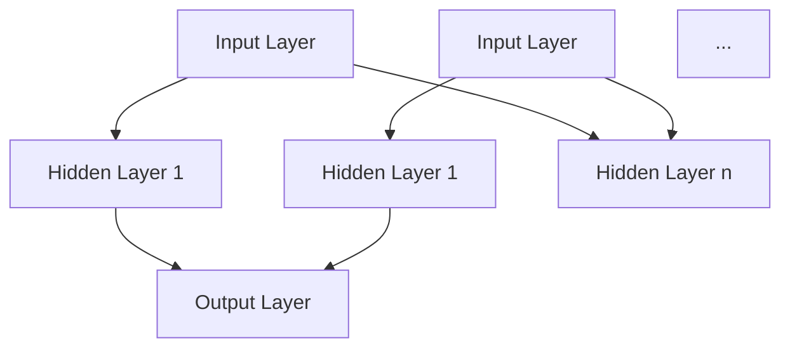
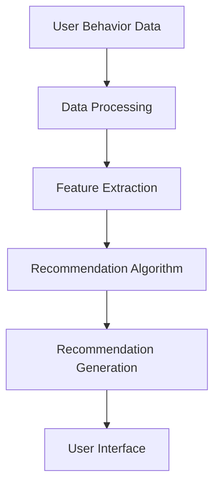
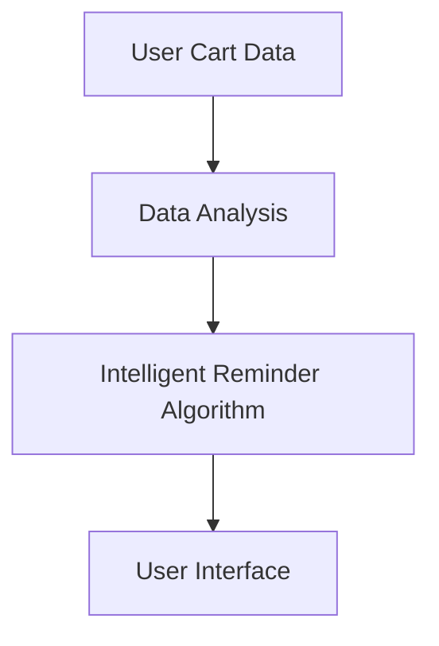

                 

## AI大模型在电商平台用户意图理解中的应用

### 关键词：AI大模型、用户意图理解、电商平台、自然语言处理、深度学习、算法设计、案例研究

### 摘要：

本文旨在探讨AI大模型在电商平台用户意图理解中的应用，从基础概念、技术原理到实际应用案例，进行全面而深入的剖析。首先，我们介绍了AI大模型的基本概念和核心算法，以及用户意图理解在电商平台中的重要性。接着，分析了电商平台用户意图理解的需求和挑战，并详细讲解了深度学习和自然语言处理在大模型中的应用。随后，通过实际案例展示了AI大模型在用户意图识别和个性化推荐中的应用实践，并探讨了模型优化和评估的方法。最后，对AI大模型在用户意图理解领域的未来发展趋势和挑战进行了展望，为读者提供了全面的技术视角和实际应用指导。

## 目录

### 第一部分：AI大模型基础与用户意图理解

1. AI大模型概述
2. 电商平台用户意图理解的需求分析
3. AI大模型技术基础

### 第二部分：电商平台用户意图理解的应用实践

4. 用户意图识别模型构建
5. 用户意图理解应用案例
6. 用户意图理解的优化与评估

### 第三部分：未来发展趋势与挑战

7. 未来发展趋势
8. 技术挑战与解决方案
9. 用户体验与隐私保护

### 附录

10. 实践资源与工具

## AI大模型概述

### 1.1 AI大模型的基本概念与历史发展

AI大模型（Large-scale Artificial Intelligence Models）是指那些具有巨大参数量、广泛数据集支撑，并能够处理复杂任务的深度学习模型。这些模型能够通过学习大量的数据来捕捉语言的深层语义和结构，从而在各种任务中表现出色。

**大模型的定义：** 通常，大模型指的是拥有超过数十亿个参数的深度学习模型。这些模型在训练过程中需要大量的计算资源和时间，但它们能够在诸如文本生成、机器翻译、图像识别等多种任务中达到或超过人类水平的表现。

**大模型的历史演变：** 从最初的简单神经网络到深度学习，再到当前的AI大模型，技术的发展经历了几个阶段。20世纪80年代末到90年代，由于计算资源和数据集的限制，神经网络的研究进展缓慢。随着硬件技术的进步和互联网的发展，深度学习在21世纪初迎来了快速发展。近年来，得益于GPU和TPU等高性能计算设备的普及，AI大模型的研究和应用得到了极大的推动。

**大模型的发展趋势：** 未来，AI大模型的发展趋势将主要集中在以下几个方面：

1. **模型规模扩大：** 随着计算资源的不断增加，AI大模型的规模将越来越大，参数量将达到数万亿级别。
2. **多模态融合：** AI大模型将不仅仅局限于文本或图像，还将能够处理多种模态的数据，实现跨领域的融合。
3. **可解释性和可控性：** 为了提高AI大模型的可解释性和可控性，研究者将致力于开发更加透明的模型架构和解释方法。
4. **自适应性和迁移能力：** AI大模型将具备更强的自适应性和迁移能力，能够快速适应新任务和数据。

### 1.2 AI大模型的核心算法原理

**神经网络基础：** 神经网络是AI大模型的基础，它由多层神经元组成，通过前向传播和反向传播算法来学习数据。以下是神经网络前向传播算法的伪代码：

```pseudo
forward_pass(inputs):
    for layer in layers:
        z = weights * inputs + bias
        a = activation(z)
        inputs = a
    return outputs
```

**循环神经网络（RNN）：** RNN是一种能够处理序列数据的神经网络，它通过记忆状态来捕捉序列中的长期依赖关系。以下是RNN的基本架构：

```pseudo
for t in range(sequence_length):
    hidden_state = weights * [input_t, hidden_state_previous]
    output_t = activation(hidden_state)
    hidden_state_previous = hidden_state
```

**长短期记忆网络（LSTM）：** LSTM是RNN的一种改进，它通过引入门控机制来避免梯度消失问题，从而能够学习长期依赖关系。以下是LSTM的基本架构：

```pseudo
for t in range(sequence_length):
    input_gate = sigmoid(weights * [input_t, hidden_state])
    forget_gate = sigmoid(weights * [input_t, hidden_state])
    output_gate = sigmoid(weights * [input_t, hidden_state])
    cell_state = tanh(weights * [input_t, cell_state])
    new_cell_state = forget_gate * old_cell_state + input_gate * cell_state
    hidden_state = output_gate * tanh(new_cell_state)
```

**生成对抗网络（GAN）：** GAN是一种通过对抗训练生成数据的模型，它由生成器和判别器组成，生成器和判别器相互对抗，最终生成逼真的数据。以下是GAN的基本架构：

```pseudo
for epoch in range(num_epochs):
    for real_data in real_data_batch:
       判别器.train(real_data)
    for generated_data in generated_data_batch:
       判别器.train(generated_data)
    判别器.update_weights()
    生成器.update_weights()
```

### 1.3 用户意图理解的重要性

用户意图理解是AI大模型在电商平台中应用的核心之一。它不仅能够提升用户体验，还能够优化营销策略和提升客户服务质量。

**用户体验的提升：** 通过准确理解用户的意图，电商平台可以提供更加个性化的推荐和服务，从而提高用户的满意度和粘性。

**营销策略的优化：** 用户意图理解可以帮助电商企业更精准地投放广告和推广活动，提高营销效果和转化率。

**客户服务效率的提升：** 通过自动化的用户意图识别，电商平台可以快速响应客户需求，提升客户服务效率。

### 1.4 AI大模型在电商平台用户意图理解中的应用

AI大模型在电商平台用户意图理解中的应用主要体现在以下几个方面：

**用户意图识别：** 通过深度学习和自然语言处理技术，AI大模型能够准确识别用户在搜索、浏览、评论等行为中的意图，从而提供个性化的推荐和服务。

**个性化推荐系统：** AI大模型可以根据用户的历史行为和意图，为其推荐最相关、最感兴趣的商品和内容。

**智能客服：** AI大模型可以自动识别用户的咨询意图，提供智能化的回答和解决方案，提升客户服务效率。

**购物车智能提醒：** 通过分析用户的购物车数据和意图，AI大模型可以提前提醒用户可能感兴趣的商品，促进购买决策。

## 电商平台用户意图理解的需求分析

### 2.1 电商平台用户行为分析

电商平台用户行为分析是理解用户意图的重要基础。通过对用户在平台上的浏览、搜索、购买和评价等行为进行深入分析，可以揭示用户的需求和偏好，从而为个性化推荐和服务提供支持。

**用户浏览行为分析：** 用户浏览行为分析包括用户在平台上的页面浏览路径、停留时间、点击行为等。通过分析用户浏览行为，可以了解用户的兴趣点和浏览习惯，为个性化推荐提供依据。

**用户购买行为分析：** 用户购买行为分析包括用户的购买频率、购买金额、购买品类等。通过分析购买行为，可以了解用户的消费习惯和偏好，从而优化商品推荐和营销策略。

**用户评价行为分析：** 用户评价行为分析包括用户对商品的评分、评论内容和情感倾向等。通过分析用户评价，可以了解用户对商品的真实反馈和满意度，从而优化商品质量和客户服务。

### 2.2 用户意图的识别与分类

用户意图识别是将用户的语言和行为转化为可操作的意图标签的过程。在电商平台中，用户意图识别通常包括以下分类：

**搜索意图：** 用户在搜索框中输入的关键词可以反映其搜索意图。通过对关键词的分析和语义理解，可以识别用户的搜索意图，如“购买意图”、“询问意图”和“浏览意图”。

**浏览意图：** 用户在平台上的浏览行为可以揭示其浏览意图。通过分析用户的浏览路径和停留时间，可以识别用户的浏览意图，如“产品浏览”、“分类浏览”和“比较浏览”。

**购买意图：** 用户在购物车中的商品和购买记录可以反映其购买意图。通过对购物车数据和购买行为的分析，可以识别用户的购买意图，如“计划购买”、“考虑购买”和“已购买”。

**评价意图：** 用户对商品的评分和评论可以反映其评价意图。通过分析用户的评价内容和情感倾向，可以识别用户的评价意图，如“正面评价”、“中立评价”和“负面评价”。

### 2.3 用户意图理解的技术挑战

用户意图理解是一项复杂的任务，面临以下技术挑战：

**数据质量与多样性：** 电商平台用户行为数据往往存在噪声和多样性，如用户输入的关键词可能包含错别字、方言等，这给意图识别带来了困难。

**模型复杂性与可解释性：** 用户意图识别模型通常具有很高的复杂度，为了提高准确率，模型可能需要大量的参数和层。然而，高复杂度的模型往往难以解释，导致决策过程不透明。

**模型适应性：** 电商平台用户行为数据随时在变化，模型需要具备较强的适应性，能够快速适应新任务和数据。

**实时性：** 在实际应用中，用户意图识别需要具备实时性，能够快速响应用户的行为和需求。

**数据隐私保护：** 用户行为数据可能包含敏感信息，如个人身份、购买记录等，数据隐私保护是用户意图理解技术的重要考虑因素。

## AI大模型技术基础

### 3.1 深度学习与神经网络基础

深度学习是构建AI大模型的基础，而神经网络则是深度学习的核心组成部分。以下将介绍深度学习和神经网络的基础知识，包括神经网络的结构、激活函数、损失函数和优化算法。

**神经网络的结构：** 神经网络由多个层次组成，包括输入层、隐藏层和输出层。输入层接收外部输入数据，隐藏层通过前向传播计算中间层特征，输出层生成最终的预测结果。每一层由多个神经元组成，神经元之间通过权重连接。以下是神经网络的基本结构：



**激活函数：** 激活函数是神经元输出前的非线性变换，常用的激活函数包括Sigmoid函数、ReLU函数和Tanh函数。Sigmoid函数将输入值映射到(0,1)区间，ReLU函数在输入为正时返回输入值，在输入为负时返回0，Tanh函数将输入值映射到(-1,1)区间。

```latex
\text{Sigmoid}(x) = \frac{1}{1 + e^{-x}}
\text{ReLU}(x) = \max(0, x)
\text{Tanh}(x) = \frac{e^x - e^{-x}}{e^x + e^{-x}}
```

**损失函数：** 损失函数用于衡量模型预测结果与真实结果之间的差距，常用的损失函数包括均方误差（MSE）和交叉熵损失（Cross-Entropy Loss）。MSE用于回归任务，计算预测值与真实值之间差的平方的平均值；交叉熵损失用于分类任务，计算预测概率分布与真实分布之间的交叉熵。

```latex
MSE(y, \hat{y}) = \frac{1}{m} \sum_{i=1}^{m} (y_i - \hat{y}_i)^2
Cross-Entropy Loss(y, \hat{y}) = -\sum_{i=1}^{m} y_i \log(\hat{y}_i)
```

**优化算法：** 优化算法用于最小化损失函数，常用的优化算法包括随机梯度下降（SGD）、动量优化（Momentum）和Adam优化。SGD通过随机梯度更新模型参数；动量优化通过引入前一次梯度的方向来加速收敛；Adam优化结合了SGD和动量优化的优点，并引入了自适应学习率。

```latex
\text{SGD}\: \theta = \theta - \alpha \nabla_\theta J(\theta)
\text{Momentum}\: v = \gamma v + (1 - \gamma) \nabla_\theta J(\theta)
\theta = \theta - \alpha v
\text{Adam}\: m = \frac{1 - \beta_1}{1 - \beta_1 t} \sum_{t=1}^{t} \Delta \theta_t
v = \frac{1 - \beta_2}{1 - \beta_2 t} \sum_{t=1}^{t} (\Delta \theta_t)^2
\theta = \theta - \alpha \frac{m}{\sqrt{v} + \epsilon}
```

### 3.2 自然语言处理技术概览

自然语言处理（Natural Language Processing，NLP）是AI大模型中不可或缺的一部分，它涉及到文本数据的预处理、语义理解、语言生成等方面。以下将介绍NLP的核心技术，包括词嵌入、序列模型和注意力机制。

**词嵌入：** 词嵌入是将单词映射为高维向量的技术，常用的词嵌入模型包括Word2Vec、GloVe和FastText。Word2Vec通过计算单词在上下文中的相似性来生成词向量；GloVe通过矩阵分解来学习词向量；FastText通过多级分类来生成词向量。

**序列模型：** 序列模型是处理序列数据的神经网络模型，包括循环神经网络（RNN）和长短期记忆网络（LSTM）。RNN通过引入隐藏状态来捕捉序列中的长期依赖关系；LSTM通过引入门控机制来避免梯度消失问题。

**注意力机制：** 注意力机制是处理序列数据的一种重要技术，它通过动态调整不同位置的特征权重来提高模型的表示能力。注意力机制广泛应用于机器翻译、文本分类和推荐系统等领域。

### 3.3 大规模预训练模型原理

大规模预训练模型（Pre-Trained Large Models）是当前NLP领域的热点研究方向，它通过在大规模数据集上进行预训练，然后再进行特定任务的微调（Fine-Tuning），从而实现高精度的语义理解和生成。以下将介绍大规模预训练模型的基本原理，包括预训练的概念、自监督学习方法、迁移学习和微调技术。

**预训练的概念：** 预训练是指在大量无标签数据上训练模型，使其掌握通用的语言表示能力。预训练模型通常采用深度学习算法，如BERT、GPT和RoBERTa，这些模型在预训练阶段学习到丰富的语言特征。

**自监督学习方法：** 自监督学习是一种无需人工标注数据的学习方法，它通过利用数据本身的内在结构来学习。在NLP领域，自监督学习方法包括掩码语言模型（Masked Language Model，MLM）和下一个句子预测（Next Sentence Prediction，NSP）。MLM通过随机掩码输入文本的一部分，让模型预测掩码的单词；NSP通过预测下一个句子来学习句间关系。

**迁移学习：** 迁移学习是一种利用预训练模型在特定任务上的表现来提升新任务性能的方法。通过迁移学习，预训练模型可以将在大规模数据集上学到的通用语言知识应用到新任务中，从而减少对新数据的标注需求和训练时间。

**微调技术：** 微调是在预训练模型的基础上，针对特定任务进行少量数据的有监督训练。微调的目的是将预训练模型的通用语言表示能力与特定任务的特征结合起来，从而提高模型的性能。常用的微调方法包括全连接层添加和微调预训练模型的参数。

## 用户意图识别模型构建

### 4.1 数据收集与预处理

用户意图识别模型的构建始于数据的收集与预处理。数据的质量和多样性直接影响模型的效果，因此这一步骤至关重要。

**数据来源：** 用户意图理解的数据可以从多个渠道收集，包括用户搜索历史、浏览记录、点击行为、购物车数据、购买记录、评论内容和社交媒体互动等。这些数据可以来自于电商平台内部的数据仓库，也可以通过API从第三方数据源获取。

**数据收集方法：** 数据的收集方法通常包括Web爬虫、API调用、日志分析和用户调查等。Web爬虫可以自动获取电商平台的公开数据，API调用可以获取第三方数据源的数据，日志分析可以记录用户在平台上的行为轨迹，用户调查可以收集用户的反馈和意图标签。

**数据预处理技术：** 数据预处理是数据清洗和特征工程的过程，主要包括以下步骤：

1. **数据清洗：** 去除重复、缺失和噪声数据，对数据进行规范化处理。例如，去除用户输入中的特殊字符、统一编码格式等。
2. **数据格式化：** 将不同来源的数据统一格式，以便后续处理。例如，将文本数据转换为统一的JSON格式，将数值数据标准化等。
3. **特征工程：** 从原始数据中提取对用户意图识别有用的特征。例如，从搜索历史中提取关键词，从浏览记录中提取浏览路径，从评论内容中提取情感倾向等。

```python
# 示例：数据清洗与格式化代码
import pandas as pd
import re

# 读取原始数据
data = pd.read_csv('raw_data.csv')

# 去除特殊字符
data['text'] = data['text'].apply(lambda x: re.sub(r'\W+', ' ', x))

# 分词与去除停用词
from nltk.tokenize import word_tokenize
from nltk.corpus import stopwords
stop_words = set(stopwords.words('english'))
words = word_tokenize(data['text'])
filtered_words = [word for word in words if word not in stop_words]

# 构建特征向量
from sklearn.feature_extraction.text import CountVectorizer
vectorizer = CountVectorizer(tokenizer=lambda x: ' '.join(filtered_words))
X = vectorizer.fit_transform(data['text'])

# 保存预处理后的数据
X.toarray().tofile('processed_data.npy')
```

### 4.2 用户意图识别模型设计

用户意图识别模型的设计是构建高效意图识别系统的重要环节。以下将介绍用户意图识别模型的基本结构、训练策略和评估方法。

**模型结构设计：** 用户意图识别模型通常采用深度学习架构，包括输入层、隐藏层和输出层。输入层接收用户行为数据（如搜索关键词、浏览记录、购物车数据等），隐藏层通过神经网络提取特征，输出层生成用户意图的预测结果。

以下是用户意图识别模型的基本结构：


**模型训练策略：** 模型训练是用户意图识别模型构建的核心步骤。常用的训练策略包括以下内容：

1. **数据增强：** 通过引入数据增强技术（如随机遮蔽、数据扩充等）来增加模型的泛化能力。
2. **批量归一化：** 通过批量归一化（Batch Normalization）来加速模型训练和减少梯度消失问题。
3. **学习率调整：** 通过动态调整学习率（如学习率衰减、余弦退火等）来优化模型收敛速度和性能。
4. **正则化：** 通过引入正则化技术（如L1正则化、L2正则化等）来防止模型过拟合。

**模型评估方法：** 模型评估是验证模型性能的重要环节。常用的评估指标包括准确率（Accuracy）、精确率（Precision）、召回率（Recall）和F1值（F1 Score）。以下是评估指标的计算公式：

```latex
Accuracy = \frac{TP + TN}{TP + TN + FP + FN}
Precision = \frac{TP}{TP + FP}
Recall = \frac{TP}{TP + FN}
F1 Score = 2 \cdot \frac{Precision \cdot Recall}{Precision + Recall}
```

### 4.3 模型训练与评估

模型训练与评估是用户意图识别模型构建的最后一个关键步骤。以下将介绍模型训练的过程、评估指标的实现和模型优化策略。

**模型训练过程：** 模型训练的过程包括以下步骤：

1. **初始化模型参数：** 初始化模型的权重和偏置，常用的初始化方法包括随机初始化、高斯初始化和Xavier初始化。
2. **前向传播：** 计算输入数据通过模型的输出结果，前向传播的过程可以表示为：
   $$\hat{y} = f(\theta^T x)$$
   其中，$\hat{y}$为模型输出，$f$为激活函数，$\theta$为模型参数，$x$为输入数据。
3. **计算损失：** 计算模型输出与真实标签之间的损失，常用的损失函数包括均方误差（MSE）和交叉熵损失（Cross-Entropy Loss）。
4. **反向传播：** 通过反向传播算法计算模型参数的梯度，更新模型参数，优化模型性能。反向传播的过程可以表示为：
   $$\Delta \theta = \alpha \nabla_\theta J(\theta)$$
   其中，$\Delta \theta$为参数梯度，$\alpha$为学习率，$J(\theta)$为损失函数。
5. **迭代优化：** 通过迭代优化过程，不断更新模型参数，直至达到收敛条件。

**评估指标实现：** 评估指标是实现模型性能评估的关键。以下为常见评估指标的实现方法：

```python
from sklearn.metrics import accuracy_score, precision_score, recall_score, f1_score

# 准确率
accuracy = accuracy_score(y_true, y_pred)

# 精确率
precision = precision_score(y_true, y_pred)

# 召回率
recall = recall_score(y_true, y_pred)

# F1值
f1 = f1_score(y_true, y_pred)
```

**模型优化策略：** 模型优化策略旨在提高模型的性能和泛化能力。以下为常见的优化策略：

1. **学习率调整：** 动态调整学习率，如学习率衰减、余弦退火等。
2. **批量大小调整：** 调整批量大小，以优化训练效率和收敛速度。
3. **正则化：** 引入L1正则化、L2正则化等，以减少模型过拟合。
4. **数据增强：** 引入数据增强技术，如随机遮蔽、数据扩充等，以提高模型泛化能力。
5. **交叉验证：** 使用交叉验证方法，如K折交叉验证，以评估模型在不同数据集上的性能。

## 用户意图理解应用案例

### 5.1 案例一：个性化推荐系统

个性化推荐系统是用户意图理解的重要应用之一，它通过分析用户的历史行为和意图，为用户推荐最相关、最感兴趣的商品和内容。以下将介绍个性化推荐系统的架构、用户行为数据的处理以及推荐算法的实现与优化。

**推荐系统架构：** 个性化推荐系统通常采用基于内容的推荐、协同过滤和混合推荐等方法。以下为推荐系统的一般架构：



**用户行为数据的处理：** 用户行为数据包括用户的搜索记录、浏览记录、购买记录和评价记录等。数据处理主要包括以下步骤：

1. **数据清洗：** 去除重复、缺失和噪声数据，统一数据格式。
2. **数据格式化：** 将不同类型的数据转换为统一的格式，如将文本数据转换为词向量。
3. **特征提取：** 从用户行为数据中提取对推荐任务有用的特征，如关键词、浏览路径、购买品类等。

```python
# 示例：数据清洗与格式化代码
import pandas as pd
from sklearn.feature_extraction.text import TfidfVectorizer

# 读取原始数据
data = pd.read_csv('user_behavior.csv')

# 数据清洗
data.drop_duplicates(inplace=True)
data.fillna('Unknown', inplace=True)

# 数据格式化
vectorizer = TfidfVectorizer()
X = vectorizer.fit_transform(data['text'])

# 保存预处理后的数据
X.toarray().tofile('processed_data.npy')
```

**推荐算法的实现与优化：** 推荐算法的实现与优化是推荐系统开发的关键。以下为常见的推荐算法及其优化方法：

1. **基于内容的推荐：** 通过计算用户历史行为中的关键词和特征与商品的特征相似度来推荐商品。优化方法包括词嵌入、特征提取和相似度计算优化。
2. **协同过滤：** 通过计算用户与用户之间的相似度或商品与商品之间的相似度来推荐商品。优化方法包括矩阵分解、邻域大小调整和推荐结果多样性优化。
3. **混合推荐：** 结合基于内容和协同过滤的优点，为用户推荐更准确的商品。优化方法包括特征融合、算法融合和推荐结果优化。

```python
from surprise import SVD, Dataset, Reader
from surprise.model_selection import cross_validate

# 读取预处理后的数据
data = pd.read_csv('processed_data.csv')

# 构建数据集
reader = Reader(rating_scale=(1, 5))
data['rating'] = data['rating'].map({1: 1, 2: 2, 3: 3, 4: 4, 5: 5})
data.set_index(['user_id', 'item_id'], inplace=True)
trainset = Dataset.load_from_df(data[['user_id', 'item_id', 'rating']], reader)

# 使用SVD算法进行推荐
svd = SVD()
cross_validate(svd, trainset, measures=['RMSE', 'MAE'], cv=5)
```

### 5.2 案例二：购物车智能提醒

购物车智能提醒是另一种用户意图理解的应用，它通过分析用户的购物车数据和行为，为用户提供智能化的购买建议和提醒。以下将介绍购物车智能提醒系统的架构、购物车数据的分析以及智能提醒算法的设计与实现。

**购物车智能提醒系统架构：** 购物车智能提醒系统通常包括数据收集、数据分析、智能提醒和用户界面等部分。以下为购物车智能提醒系统的一般架构：



**购物车数据的分析：** 购物车数据包括用户的购物车记录、商品信息、购买时间等。数据分析主要包括以下步骤：

1. **数据清洗：** 去除重复、缺失和噪声数据，统一数据格式。
2. **数据格式化：** 将不同类型的数据转换为统一的格式，如将文本数据转换为词向量。
3. **特征提取：** 从购物车数据中提取对智能提醒任务有用的特征，如商品品类、购买时间间隔、购买频率等。

```python
# 示例：数据清洗与格式化代码
import pandas as pd
from sklearn.feature_extraction.text import TfidfVectorizer

# 读取原始数据
data = pd.read_csv('user_cart_data.csv')

# 数据清洗
data.drop_duplicates(inplace=True)
data.fillna('Unknown', inplace=True)

# 数据格式化
vectorizer = TfidfVectorizer()
X = vectorizer.fit_transform(data['text'])

# 保存预处理后的数据
X.toarray().tofile('processed_cart_data.npy')
```

**智能提醒算法的设计与实现：** 智能提醒算法的设计与实现是购物车智能提醒系统的核心。以下为常见的智能提醒算法及其设计思路：

1. **基于历史购买记录的提醒：** 通过分析用户的购买历史记录，为用户推荐可能感兴趣的商品。优化方法包括聚类分析和时间序列分析。
2. **基于协同过滤的提醒：** 通过计算用户与用户之间的相似度，为用户推荐其他用户购买过的商品。优化方法包括矩阵分解和邻域大小调整。
3. **基于关联规则的提醒：** 通过分析商品之间的关联关系，为用户推荐相关的商品。优化方法包括频繁项集挖掘和关联规则生成。

```python
from mlxtend.frequent_patterns import apriori
from mlxtend.frequent_patterns import association_rules

# 读取预处理后的数据
data = pd.read_csv('processed_cart_data.csv')

# 构建频繁项集
frequent_itemsets = apriori(data, min_support=0.05, use_colnames=True)

# 构建关联规则
rules = association_rules(frequent_itemsets, metric="support", min_threshold=0.1)
rules.head()
```

## 用户意图理解的优化与评估

### 6.1 模型优化方法

在用户意图理解的应用中，模型的性能直接影响到用户体验和业务效果。因此，模型优化成为关键的一步。以下将介绍几种常见的模型优化方法，包括模型调参、模型压缩和模型解释性提升。

**模型调参：** 模型调参是通过调整模型的超参数来优化模型性能的过程。常用的调参方法包括：

1. **网格搜索（Grid Search）：** 通过遍历所有可能的超参数组合，找到最优的超参数组合。这种方法虽然全面，但计算成本较高。
2. **随机搜索（Random Search）：** 从所有可能的超参数组合中随机选择一部分进行搜索，通过迭代优化找到最优的超参数组合。这种方法比网格搜索计算成本更低，但搜索效率更高。
3. **贝叶斯优化（Bayesian Optimization）：** 利用贝叶斯统计模型来优化超参数，通过历史数据来预测新的超参数组合的性能，选择最优的超参数组合进行迭代优化。这种方法具有更高的搜索效率和更好的性能。

```python
from sklearn.model_selection import GridSearchCV
from sklearn.ensemble import RandomForestClassifier

# 定义模型参数
param_grid = {'n_estimators': [100, 200, 300], 'max_depth': [10, 20, 30]}

# 创建模型
model = RandomForestClassifier()

# 进行网格搜索
grid_search = GridSearchCV(model, param_grid, cv=5)
grid_search.fit(X_train, y_train)

# 获取最优超参数
best_params = grid_search.best_params_
best_params
```

**模型压缩：** 模型压缩是通过减少模型参数和计算量来优化模型性能的过程。常用的模型压缩方法包括：

1. **权重剪枝（Weight Pruning）：** 通过删除模型中的冗余权重来减小模型大小。这种方法可以通过梯度信息来识别和删除不重要的权重。
2. **量化（Quantization）：** 通过将模型中的浮点数权重转换为低比特精度来减小模型大小。这种方法可以提高模型的计算效率，但可能会降低模型的精度。
3. **模型剪枝（Model Pruning）：** 通过删除模型中的神经元或层来减小模型大小。这种方法可以通过训练误差来识别和删除不重要的神经元或层。

```python
from keras.utils import CustomObjectScope
from keras.models import load_model
from keras import backend as K

# 加载模型
model = load_model('model.h5')

# 进入自定义模式
with CustomObjectScope({'KerasTensor': K.layout('tf')}):

    # 压缩模型
    compressed_model = model
    compressed_model.save('compressed_model.h5')
```

**模型解释性提升：** 模型解释性提升是通过提高模型的透明度和可解释性来优化模型的过程。常用的模型解释性提升方法包括：

1. **特征重要性：** 通过计算模型中每个特征的权重来评估特征的重要性，从而提高模型的解释性。
2. **决策树可视化：** 通过可视化决策树的结构来提高模型的解释性，用户可以直观地理解模型的决策过程。
3. **LIME（Local Interpretable Model-agnostic Explanations）：** 通过在局部范围内生成模型的可解释性解释，帮助用户理解模型的决策过程。

```python
from sklearn.inspection import permutation_importance

# 计算特征重要性
result = permutation_importance(model, X_test, y_test, n_repeats=10, random_state=0)

# 获取特征重要性
feature_importances = result.importances_mean
feature_importances
```

### 6.2 模型评估指标

在用户意图理解的应用中，模型的评估指标是衡量模型性能的重要工具。以下将介绍几种常见的模型评估指标，包括准确率、召回率、F1值和交叉验证。

**准确率（Accuracy）：** 准确率是指模型预测正确的样本数量与总样本数量的比例。它是衡量分类模型性能的常用指标。

```python
from sklearn.metrics import accuracy_score

# 预测结果
y_pred = model.predict(X_test)

# 计算准确率
accuracy = accuracy_score(y_test, y_pred)
accuracy
```

**召回率（Recall）：** 召回率是指模型预测为正类的样本中实际为正类的样本比例。它是衡量分类模型检测能力的重要指标。

```python
from sklearn.metrics import recall_score

# 计算召回率
recall = recall_score(y_test, y_pred)
recall
```

**F1值（F1 Score）：** F1值是精确率和召回率的调和平均值，它同时考虑了模型的精确率和召回率。它是衡量分类模型性能的综合指标。

```python
from sklearn.metrics import f1_score

# 计算F1值
f1 = f1_score(y_test, y_pred)
f1
```

**交叉验证（Cross Validation）：** 交叉验证是一种评估模型性能的方法，通过将数据集划分为多个子集，每次使用其中一个子集作为验证集，其余子集作为训练集，从而评估模型的泛化能力。

```python
from sklearn.model_selection import cross_val_score

# 计算交叉验证得分
scores = cross_val_score(model, X, y, cv=5)
scores.mean()
```

### 6.3 实际业务效果的评估

在实际业务中，模型的效果不仅取决于模型的性能指标，还需要考虑业务目标和其他实际因素。以下将介绍实际业务效果的评估方法和注意事项。

**评估方法：**

1. **业务指标：** 根据业务目标，设置相应的业务指标，如点击率、转化率、留存率等。通过这些指标来评估模型对业务的影响。
2. **A/B测试：** 通过将用户随机分配到控制组和实验组，比较两组用户在业务指标上的差异，从而评估模型的效果。
3. **用户反馈：** 收集用户的反馈和意见，了解模型在实际应用中的效果和改进方向。

**注意事项：**

1. **指标选择：** 选择合适的业务指标来评估模型效果，避免过度依赖单一指标。
2. **数据质量：** 数据质量直接影响模型的性能和效果，因此需要对数据进行严格清洗和预处理。
3. **模型稳定性：** 模型在不同数据集上的性能可能存在差异，因此需要评估模型的稳定性和泛化能力。

## 未来发展趋势与挑战

### 7.1 用户意图理解的未来发展方向

用户意图理解在未来的发展趋势将主要体现在以下几个方面：

**模型规模扩大：** 随着计算资源和数据集的不断增长，AI大模型的规模将不断扩大，从而提高模型在用户意图理解任务中的性能。

**多模态融合：** 未来的用户意图理解将不仅仅局限于文本数据，还将融合图像、语音、视频等多种模态的数据，实现更全面、更精准的用户意图识别。

**个性化和自适应：** 随着用户需求的多样化，用户意图理解模型将更加注重个性化推荐和自适应调整，以提供更加个性化的服务。

**实时性和动态性：** 未来的用户意图理解模型将具备更高的实时性和动态性，能够快速响应用户的需求变化，提供即时的个性化服务。

**跨领域应用：** 用户意图理解技术将不仅应用于电商平台，还将扩展到金融、医疗、教育等领域，实现跨领域的应用和创新。

### 7.2 技术挑战与解决方案

尽管用户意图理解技术取得了显著的进展，但仍然面临以下技术挑战：

**模型复杂性与可解释性：** 随着模型规模的扩大，模型的复杂度将增加，而高复杂度的模型往往难以解释。因此，如何在保持模型性能的同时提高其可解释性，是未来的一个重要研究方向。

**数据多样性与质量：** 用户意图理解模型的训练依赖于大量的数据，而数据的多样性和质量直接影响模型的性能。如何有效收集、标注和处理高质量的数据，是技术挑战之一。

**实时性与资源消耗：** 实时性是用户意图理解的重要要求，但实时性往往伴随着较高的计算资源消耗。如何在保证实时性的同时优化资源消耗，是一个需要解决的难题。

**隐私保护与伦理：** 用户意图理解涉及到大量个人隐私数据，如何保护用户隐私、遵守伦理规范，是技术挑战之一。

针对上述挑战，以下是一些可能的解决方案：

**模型压缩与加速：** 通过模型压缩和加速技术，降低模型的计算复杂度，提高模型在实时应用中的性能。

**联邦学习与差分隐私：** 通过联邦学习和差分隐私技术，实现分布式训练和隐私保护，提高数据多样性和质量。

**动态模型调整：** 通过动态模型调整技术，实现模型对用户需求的实时响应，提高模型的实时性和动态性。

**伦理与法规遵守：** 通过建立伦理委员会和制定相关法规，确保用户意图理解技术的合规性和伦理性。

### 7.3 用户体验与隐私保护

用户体验和隐私保护是用户意图理解技术的关键方面。以下将讨论如何提升用户体验和确保隐私保护。

**提升用户体验：**

1. **个性化推荐：** 通过精准的用户意图理解，提供个性化的推荐和服务，提升用户满意度和使用体验。
2. **实时互动：** 通过实时响应用户的需求，提供即时的个性化服务，增强用户的互动体验。
3. **易用性设计：** 设计简洁、直观的用户界面，使用户能够轻松理解和使用用户意图理解技术。

**隐私保护：**

1. **数据加密：** 对用户数据进行加密处理，确保数据在传输和存储过程中的安全性。
2. **匿名化处理：** 通过匿名化处理，将用户数据中的个人身份信息去除，降低隐私泄露的风险。
3. **权限管理：** 通过权限管理，确保只有授权的人员可以访问用户数据，防止数据滥用。
4. **用户透明度：** 提高用户对数据收集、使用和隐私保护的透明度，增强用户的信任感。

## 附录：实践资源与工具

### A.1 主流深度学习框架对比

在选择深度学习框架时，开发者通常会在TensorFlow、PyTorch和Keras之间进行选择。以下是对这三个主流框架的简要对比：

**TensorFlow：** 由Google开发，具有强大的生态系统和丰富的API，支持多种深度学习任务。TensorFlow提供了丰富的工具和资源，适用于研究和生产环境。

**PyTorch：** 由Facebook开发，具有动态计算图，易于调试和理解。PyTorch的动态计算图使其在研究和开发阶段非常受欢迎，但其在生产环境中的部署可能不如TensorFlow成熟。

**Keras：** 是一个高层API，可以与TensorFlow和Theano结合使用，提供了简洁的接口，易于快速实现深度学习模型。

### A.2 开发环境搭建与配置

搭建深度学习开发环境需要安装以下软件和依赖包：

1. **操作系统：** Ubuntu 18.04或更高版本。
2. **Python：** Python 3.7或更高版本。
3. **深度学习框架：** TensorFlow、PyTorch或Keras。
4. **依赖包：** NumPy、Pandas、Scikit-learn、Matplotlib等。

安装步骤如下：

```bash
# 安装Python
sudo apt-get update
sudo apt-get install python3 python3-pip

# 安装深度学习框架
pip3 install tensorflow
# 或
pip3 install torch torchvision
# 或
pip3 install keras

# 安装其他依赖包
pip3 install numpy pandas scikit-learn matplotlib
```

### A.3 学习资源与参考文献

以下是一些学习深度学习和用户意图理解的资源：

1. **书籍：**
   - 《深度学习》（Deep Learning）by Ian Goodfellow, Yoshua Bengio, Aaron Courville
   - 《自然语言处理综合教程》（Speech and Language Processing）by Daniel Jurafsky, James H. Martin
   - 《Python深度学习》（Deep Learning with Python）by François Chollet

2. **论文：**
   - BERT: Pre-training of Deep Bidirectional Transformers for Language Understanding, by Jacob Devlin, Ming-Wei Chang, Kenton Lee, and Kristina Toutanova
   - GPT-3: Language Models are few-shot learners, by Tom B. Brown, Benjamin Mann, Nick Ryder, Melanie Subbiah, Jared Kaplan, Prafulla Dhariwal, Arvind Neelakantan, Pranav Shyam, Girish Sastry, Amanda Askell, Sandhini Agarwal, Ariel Herbert-Voss, Gretchen Krueger, Tom Henighan, Rewon Child, Aditya Ramesh, Daniel M. Ziegler, Jeffrey Wu, Clemens Winter, Christopher Hesse, Mark Chen, Eric Sigler, Mateusz Litwin, Scott Gray, Benjamin Chess, Jack Clark, Christopher Berner, Sam McCandlish, Alec Radford, Ilya Sutskever, Dario Amodei, and OSF Team

3. **开源代码：**
   - Hugging Face Transformers：https://github.com/huggingface/transformers
   - TensorFlow Models：https://github.com/tensorflow/models
   - PyTorch Examples：https://github.com/pytorch/examples

4. **在线课程：**
   - Coursera：https://www.coursera.org
   - edX：https://www.edx.org
   - Udacity：https://www.udacity.com

通过这些资源，开发者可以深入学习和实践深度学习技术，为电商平台用户提供更加智能和个性化的服务。

