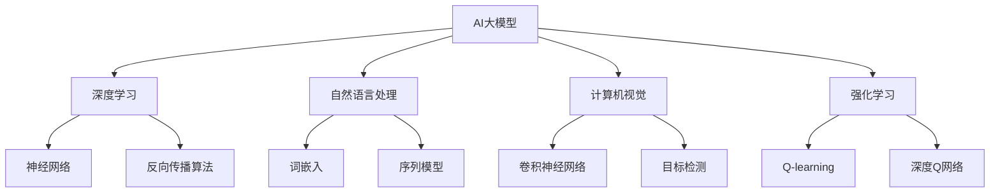

                 

### 第1章：AI大模型概述与核心概念

#### 1.1 AI大模型的概念解析

AI大模型，顾名思义，是指那些规模巨大、参数数量庞大的机器学习模型。这类模型通过对海量数据的学习，能够捕捉到复杂的模式，从而实现高度复杂的任务。这些模型通常采用深度学习技术，如神经网络、生成对抗网络（GAN）和变分自编码器（VAE）等。AI大模型的研究和应用已经成为当前人工智能领域的重要热点。

从技术上讲，AI大模型的特点主要体现在以下几个方面：

1. **参数数量巨大**：这些模型往往拥有数亿甚至数十亿的参数，这使得它们能够处理和存储大量的信息。
2. **数据需求量大**：由于参数众多，AI大模型需要大量的训练数据来保证模型的准确性和泛化能力。
3. **计算资源消耗大**：训练和优化AI大模型需要大量的计算资源，特别是GPU和TPU等高性能计算设备。
4. **学习能力强**：AI大模型通过学习海量数据，能够发现和捕捉到数据中的复杂模式和规律，从而实现高精度的预测和分类。

AI大模型的应用场景广泛，包括但不限于以下领域：

- 自然语言处理：如语言翻译、文本生成、情感分析等。
- 计算机视觉：如图像识别、目标检测、图像生成等。
- 语音识别：如语音到文字转换、语音合成等。
- 游戏AI：如智能游戏对手、虚拟角色生成等。

#### 1.2 AI大模型的架构与组成

AI大模型的架构通常由以下几个关键组件组成：

1. **输入层**：接收外部输入数据，如文本、图像、声音等。
2. **隐藏层**：负责数据的处理和变换，包含多个层次，每一层都能够对输入数据进行特征提取和变换。
3. **输出层**：产生最终输出，如分类结果、预测值、生成结果等。

以下是一个典型的深度神经网络架构示意图：

```
                输入层            隐藏层            输出层
                |                 |                 |
        [输入] -> [隐藏] -> [输出]
```

在具体实现中，AI大模型可能还包括以下组件：

- **激活函数**：如ReLU、Sigmoid、Tanh等，用于引入非线性特性，提高模型的拟合能力。
- **池化层**：用于图像等数据的多尺度特征提取，如Max Pooling、Average Pooling等。
- **正则化层**：如Dropout、权重正则化等，用于防止过拟合。
- **连接权重和偏置**：连接各个层的节点，初始化时通常采用随机化策略。

#### 1.3 AI大模型的发展历程

AI大模型的发展历程可以追溯到深度学习的兴起。以下是AI大模型发展的几个关键里程碑：

1. **2006年**：Hinton等人提出了深度信念网络（DBN），标志着深度学习理论的初步形成。
2. **2012年**：Hinton团队在ImageNet图像识别挑战中，使用了深度卷积神经网络（CNN）取得了惊人的成绩，深度学习开始受到广泛关注。
3. **2014年**：谷歌提出了生成对抗网络（GAN），为AI大模型的研究开辟了新的方向。
4. **2016年**：谷歌的Transformer模型在自然语言处理领域取得了突破性进展，标志着注意力机制和变换器模型的崛起。
5. **2018年**：OpenAI的GPT-2模型展示了强大的语言生成能力，引发了对大模型安全性和伦理性的讨论。

近年来，随着计算能力的提升和数据的爆发式增长，AI大模型的研究和应用取得了显著的进展。例如，GPT-3、BERT、GPT-Neo等模型的提出，使得AI在自然语言处理、计算机视觉、语音识别等领域的表现达到了前所未有的高度。

#### 1.4 AI大模型的应用场景

AI大模型的应用场景广泛，涵盖了多个领域和任务。以下是几个典型的应用场景：

1. **自然语言处理**：
   - 语言翻译：如谷歌翻译、百度翻译等。
   - 文本生成：如新闻报道生成、对话系统等。
   - 情感分析：如社交媒体情感分析、客户反馈分析等。

2. **计算机视觉**：
   - 图像识别：如人脸识别、车牌识别等。
   - 目标检测：如自动驾驶、无人机监控等。
   - 图像生成：如艺术创作、虚拟现实等。

3. **语音识别**：
   - 语音到文字转换：如语音助手、实时字幕等。
   - 语音合成：如语音助手、天气预报等。

4. **游戏AI**：
   - 智能游戏对手：如星际争霸2的AI对手。
   - 虚拟角色生成：如虚拟主播、虚拟形象等。

5. **医疗健康**：
   - 疾病诊断：如癌症诊断、心脏病诊断等。
   - 药物发现：如新药研发、药物筛选等。

6. **金融科技**：
   - 风险评估：如信用评分、投资策略等。
   - 量化交易：如高频交易、市场预测等。

7. **制造业**：
   - 质量检测：如生产线自动化检测、缺陷识别等。
   - 生产规划：如供应链优化、生产调度等。

AI大模型在这些领域的应用，不仅提升了效率和准确性，还带来了全新的商业模式和创新机遇。随着技术的不断进步，AI大模型的应用场景将更加广泛，有望推动人工智能产业的持续发展。

---

**【结论】** 本章对AI大模型的核心概念、架构组成、发展历程以及应用场景进行了详细的阐述。通过本章的学习，读者可以初步了解AI大模型的基础知识和实际应用，为后续章节的深入学习打下坚实的基础。

### 第2章：AI大模型的技术基础

#### 2.1 深度学习技术概览

深度学习是AI大模型的核心技术，其理论基础源于神经网络。与传统的机器学习方法相比，深度学习通过多层非线性变换，能够自动提取数据中的高级特征，从而实现复杂的任务。

**深度学习的核心组件包括：**

- **神经网络**：作为深度学习的基石，神经网络由多个层级组成，每个层级负责对输入数据进行处理和变换。
- **激活函数**：如ReLU、Sigmoid、Tanh等，用于引入非线性特性，使神经网络能够拟合复杂的函数。
- **损失函数**：用于衡量模型预测值与真实值之间的差距，常用的损失函数包括均方误差（MSE）、交叉熵损失等。
- **优化算法**：如梯度下降、随机梯度下降、Adam等，用于调整模型参数，使损失函数最小。

**深度学习的发展历程**：

- **1986年**：Rumelhart、Hinton和Williams提出了反向传播算法（Backpropagation），使神经网络训练成为可能。
- **1990年代**：由于计算资源限制，深度学习的研究逐渐停滞。
- **2006年**：Hinton提出了深度信念网络（DBN），重新点燃了深度学习的研究热情。
- **2012年**：Alex Krizhevsky等人在ImageNet竞赛中使用深度卷积神经网络（CNN）取得了突破性成果，深度学习开始兴起。
- **2014年**：Ian Goodfellow等人提出了生成对抗网络（GAN），为深度学习开辟了新的研究方向。

**深度学习的应用领域**：

- **计算机视觉**：如图像识别、目标检测、图像生成等。
- **自然语言处理**：如语言翻译、文本生成、情感分析等。
- **语音识别**：如语音到文字转换、语音合成等。
- **强化学习**：如游戏AI、自动驾驶等。

#### 2.2 自然语言处理（NLP）技术

自然语言处理是AI大模型的重要应用领域之一，其主要目标是使计算机能够理解和处理人类语言。NLP技术涉及语音识别、文本分析、语义理解等多个方面。

**NLP的核心技术包括：**

- **词嵌入**：将词汇映射到低维向量空间，使计算机能够处理和计算词汇之间的关系。
- **词性标注**：对文本中的词汇进行词性分类，如名词、动词、形容词等。
- **句法分析**：分析文本的句法结构，理解句子的组成和语法规则。
- **语义理解**：从文本中提取语义信息，理解文本的含义和意图。

**NLP的常用模型**：

- **循环神经网络（RNN）**：能够处理序列数据，适用于文本分类、语言模型等任务。
- **长短期记忆网络（LSTM）**：是RNN的一种改进，能够更好地捕捉长期依赖关系。
- **变换器模型（Transformer）**：通过自注意力机制实现并行计算，在自然语言处理任务中取得了显著成果。
- **预训练+微调**：预训练模型（如BERT、GPT）在大规模语料上进行预训练，然后通过微调适应特定任务。

**NLP的应用领域**：

- **机器翻译**：如谷歌翻译、百度翻译等。
- **对话系统**：如聊天机器人、语音助手等。
- **文本分类**：如新闻分类、情感分析等。
- **文本生成**：如文章写作、摘要生成等。

#### 2.3 计算机视觉（CV）技术

计算机视觉是AI大模型的另一个重要应用领域，其主要目标是使计算机能够像人类一样理解和解释视觉信息。

**计算机视觉的核心技术包括：**

- **图像识别**：识别图像中的物体、场景等。
- **目标检测**：定位图像中的目标物体，并标注其位置。
- **图像分割**：将图像划分为不同的区域，用于图像理解和处理。
- **图像生成**：生成新的图像，如艺术创作、虚拟现实等。

**计算机视觉的常用模型**：

- **卷积神经网络（CNN）**：通过卷积层提取图像特征，是计算机视觉领域最常用的模型之一。
- **生成对抗网络（GAN）**：通过对抗性训练生成新的图像，适用于图像修复、艺术创作等任务。
- **变分自编码器（VAE）**：通过概率模型生成新的图像，适用于图像超分辨率、去噪等任务。
- **卷积变换器（Convolutional Transformer）**：结合卷积神经网络和变换器模型的优势，适用于复杂的视觉任务。

**计算机视觉的应用领域**：

- **自动驾驶**：如自动驾驶汽车、无人机等。
- **人脸识别**：如安防监控、手机解锁等。
- **医疗影像分析**：如疾病诊断、肿瘤检测等。
- **零售行业**：如商品识别、顾客行为分析等。

#### 2.4 强化学习（RL）技术

强化学习是AI大模型的另一种重要技术，其主要目标是使智能体在环境中通过不断学习和探索，实现最优策略。

**强化学习的核心概念包括：**

- **状态（State）**：描述智能体当前所处的环境状态。
- **动作（Action）**：智能体在当前状态下可以选择的操作。
- **奖励（Reward）**：智能体执行动作后获得的即时奖励，用于评估动作的好坏。
- **策略（Policy）**：智能体在给定状态下选择动作的策略。

**强化学习的常用算法**：

- **Q学习（Q-Learning）**：通过学习Q值（状态-动作值函数），选择最优动作。
- **深度Q网络（DQN）**：结合深度学习和Q学习，适用于复杂的强化学习任务。
- **策略梯度方法**：直接优化策略函数，如REINFORCE、PPO等。
- **Actor-Critic方法**：结合策略优化和价值函数学习，如A3C、DDPG等。

**强化学习的应用领域**：

- **游戏AI**：如星际争霸2的AI对手、棋类游戏等。
- **自动驾驶**：如自动驾驶车辆的路径规划、行为预测等。
- **机器人控制**：如机器人运动规划、抓取等。
- **资源管理**：如数据中心能源管理、交通流量优化等。

#### 2.5 AI大模型的技术整合

随着AI大模型技术的发展，各个领域的技术逐渐融合，形成了更为强大的AI系统。

- **跨领域融合**：如将自然语言处理与计算机视觉技术结合，实现图像字幕生成、视频分析等。
- **多模态学习**：同时处理文本、图像、语音等多模态数据，实现更为综合的任务。
- **联邦学习**：在分布式环境下训练AI大模型，保护用户隐私，提高模型的泛化能力。

**未来展望**：

随着技术的不断进步和应用的深入，AI大模型将在更多领域发挥重要作用。同时，AI大模型的安全性和伦理性问题也将成为研究的重点。通过不断的技术创新和实践探索，AI大模型有望为人类带来更多的福祉。

---

**【结论】** 本章对AI大模型的技术基础进行了全面的概述，包括深度学习、自然语言处理、计算机视觉和强化学习等领域。通过本章的学习，读者可以了解AI大模型的核心技术及其应用，为后续章节的深入学习打下坚实的基础。

### 第3章：AI大模型的数学原理

#### 3.1 神经网络与反向传播算法

神经网络是AI大模型的核心组成部分，其基本原理是通过多层非线性变换，从输入数据中提取特征并生成输出。神经网络的核心在于其数学原理，主要包括前向传播、反向传播和激活函数。

**前向传播**

前向传播是神经网络处理输入数据的过程。输入数据首先经过输入层，然后逐层传递到隐藏层，最后到达输出层。在每一层中，输入数据与该层的权重矩阵相乘，再加上偏置项，然后通过激活函数进行非线性变换。

前向传播的数学表达式如下：

$$
z_l = \sum_{j} w_{lj} * a_{j}^{l-1} + b_l
$$

$$
a_l = \sigma(z_l)
$$

其中，$z_l$表示第$l$层的净输入，$w_{lj}$表示第$l$层中从第$j$个节点到第$l$层的权重，$b_l$表示第$l$层的偏置项，$\sigma(z_l)$表示激活函数，$a_l$表示第$l$层的激活输出。

常见的激活函数包括：

- **Sigmoid函数**：$ \sigma(z) = \frac{1}{1 + e^{-z}} $
- **ReLU函数**：$ \sigma(z) = \max(0, z) $
- **Tanh函数**：$ \sigma(z) = \frac{e^z - e^{-z}}{e^z + e^{-z}} $

**反向传播**

反向传播是神经网络训练的核心步骤，用于更新网络的权重和偏置，使模型能够更好地拟合训练数据。反向传播通过计算输出层到输入层的梯度，逐步更新各层的参数。

反向传播的数学表达式如下：

$$
\frac{dL}{dw_{ij}^{l}} = a_{i}^{l} \cdot \frac{da_{j}^{l}}{dz_{j}^{l}} = a_{i}^{l} \cdot \sigma'(z_{j}^{l})
$$

$$
\frac{dB_l}{dz_{j}^{l}} = 1
$$

$$
\frac{dz_{j}^{l}}{dw_{ij}^{l}} = a_{j}^{l-1}
$$

其中，$L$表示损失函数，$dL/dw_{ij}^{l}$表示权重$w_{ij}^{l}$的梯度，$\sigma'(z_{j}^{l})$表示激活函数的导数，$a_{i}^{l}$和$a_{j}^{l-1}$分别表示第$l$层和第$l-1$层的激活输出。

**优化算法**

在反向传播的基础上，常用的优化算法包括：

- **梯度下降**：通过计算损失函数关于参数的梯度，更新参数以最小化损失函数。
  $$ \theta = \theta - \alpha \cdot \nabla_{\theta} J(\theta) $$
  其中，$\theta$表示参数，$\alpha$表示学习率，$J(\theta)$表示损失函数。

- **随机梯度下降（SGD）**：对每个训练样本单独计算梯度，更新参数。
- **批量梯度下降（BGD）**：对整个训练集计算梯度，更新参数。
- **动量优化**：在梯度下降的基础上加入动量项，以减少震荡，加速收敛。
  $$ \theta = \theta - \alpha \cdot (\nabla_{\theta} J(\theta) + \beta \cdot \theta_{prev}) $$
  其中，$\theta_{prev}$表示前一次更新的参数。

- **Adam优化器**：结合SGD和动量优化，自适应调整学习率。
  $$ \theta = \theta - \alpha \cdot \left(\frac{m}{1 - \beta_1^t} + \frac{v}{1 - \beta_2^t}\right) $$
  其中，$m$和$v$分别表示一阶和二阶矩估计，$\beta_1$和$\beta_2$分别表示一阶和二阶矩的衰减率。

#### 3.2 损失函数与优化算法

损失函数是评估模型预测结果与真实值之间差距的函数。选择合适的损失函数对于模型的训练和性能至关重要。

**常见损失函数**

- **均方误差（MSE）**：
  $$ L = \frac{1}{2} \sum_{i=1}^{n} (\hat{y}_i - y_i)^2 $$
  适用于回归问题。

- **交叉熵损失（Cross Entropy Loss）**：
  $$ L = -\sum_{i=1}^{n} y_i \cdot \log(\hat{y}_i) $$
  适用于分类问题。

- **Huber损失**：
  $$ L = \begin{cases}
  \frac{1}{2} (y_i - \hat{y}_i)^2 & \text{if } |\hat{y}_i - y_i| \leq \delta \\
  \delta (|\hat{y}_i - y_i| - \frac{1}{2}\delta) & \text{otherwise}
  \end{cases} $$
  结合了MSE和L1损失的优势，对异常值具有鲁棒性。

**优化算法**

- **梯度下降（Gradient Descent）**：
  $$ \theta = \theta - \alpha \cdot \nabla_{\theta} J(\theta) $$
  其中，$\alpha$为学习率，$\nabla_{\theta} J(\theta)$为损失函数关于参数的梯度。

- **随机梯度下降（SGD）**：
  $$ \theta = \theta - \alpha \cdot \nabla_{\theta} J(\theta_i) $$
  其中，$\theta_i$为第$i$个样本的参数。

- **批量梯度下降（BGD）**：
  $$ \theta = \theta - \alpha \cdot \nabla_{\theta} J(\theta) $$
  其中，$\theta$为整个训练集的参数。

- **动量（Momentum）**：
  $$ \theta = \theta - \alpha \cdot (\nabla_{\theta} J(\theta) + \beta \cdot \theta_{prev}) $$
  其中，$\beta$为动量因子。

- **Adam优化器**：
  $$ \theta = \theta - \alpha \cdot \left(\frac{m}{1 - \beta_1^t} + \frac{v}{1 - \beta_2^t}\right) $$
  其中，$m$和$v$分别表示一阶和二阶矩估计，$\beta_1$和$\beta_2$分别表示一阶和二阶矩的衰减率。

#### 3.3 生成对抗网络（GAN）

生成对抗网络（GAN）是由Ian Goodfellow等人于2014年提出的一种新型生成模型。GAN由两个相互对抗的神经网络组成：生成器（Generator）和判别器（Discriminator）。

**生成器和判别器的目标**

- **生成器**：生成逼真的数据，以欺骗判别器。
  $$ G(z) = x $$
  其中，$z$是随机噪声，$x$是生成的数据。

- **判别器**：判断输入数据是真实数据还是生成器生成的数据。
  $$ D(x) = 1 $$
  $$ D(G(z)) = 0 $$

**训练过程**

GAN的训练过程可以看作是一个博弈过程，生成器和判别器的目标是不断优化自身，以达到最佳平衡。

1. **生成器更新**：
   $$ G(z) \leftarrow G(z) + \alpha \cdot \nabla_G D(G(z)) $$
   其中，$\nabla_G D(G(z))$是判别器对生成器的梯度。

2. **判别器更新**：
   $$ D(x), D(G(z)) \leftarrow D(x), D(G(z)) + \beta \cdot \nabla_D D(x), D(G(z)) $$

**挑战**

GAN在实际应用中面临一些挑战，如模式崩塌（Mode Collapse）和梯度消失/爆炸等。

1. **模式崩塌**：生成器仅生成特定类型的数据，而忽略其他类型的数据。
2. **梯度消失/爆炸**：在训练过程中，梯度可能变得非常小或非常大，导致训练不稳定。

**解决方案**

- **深度卷积生成对抗网络（DCGAN）**：通过深度卷积神经网络改进GAN，提高生成质量和稳定性。
- **改进的GAN训练技巧**：如梯度惩罚、谱归一化等，以解决梯度消失/爆炸问题。

#### 3.4 自编码器与变分自编码器（VAE）

自编码器（Autoencoder）是一种无监督学习模型，用于学习数据的压缩表示。自编码器包含两个主要部分：编码器（Encoder）和解码器（Decoder）。

**自编码器的工作原理**

1. **编码器**：将输入数据压缩为一个低维隐层表示。
   $$ z = \sigma(W_z \cdot x + b_z) $$

2. **解码器**：将隐层表示解码回原始数据。
   $$ x' = \sigma(W_x \cdot z + b_x) $$

**变分自编码器（VAE）**

VAE是对传统自编码器的一种改进，通过引入概率模型，使生成过程更具灵活性。

1. **编码器**：输出一个均值$\mu$和一个对数方差$\log\sigma^2$。
   $$ z = \mu + \sigma \cdot \epsilon $$
   其中，$\epsilon$是噪声变量，$\mu$和$\log\sigma^2$是编码器输出的均值和对数方差。

2. **解码器**：使用均值$\mu$作为输入。
   $$ x' = \sigma(W_x \cdot \mu + b_x) $$

**VAE的损失函数**

VAE的损失函数包括两部分：重建损失和KL散度损失。

1. **重建损失**：衡量生成数据与原始数据之间的差距。
   $$ L_{reconstruction} = \frac{1}{n} \sum_{i=1}^{n} \sum_{j=1}^{d} (\sigma_j(x_j') - x_j)^2 $$

2. **KL散度损失**：衡量编码器输出的均值和对数方差与先验分布之间的差距。
   $$ L_{KL} = \frac{1}{n} \sum_{i=1}^{n} \sum_{j=1}^{d} \log\sigma^2_j - \frac{1}{2} \sum_{j=1}^{d} (\mu_j^2 + \sigma_j^2 - 1) $$

**VAE的优势**

- **更好的泛化能力**：通过引入概率模型，VAE能够更好地捕捉数据的分布特性。
- **更好的生成质量**：VAE通过引入KL散度损失，减少了生成器的模式崩塌问题。

---

**【结论】** 本章详细介绍了AI大模型的数学原理，包括神经网络与反向传播算法、损失函数与优化算法、生成对抗网络（GAN）、自编码器与变分自编码器（VAE）。这些数学原理是理解AI大模型的基础，为后续章节的深入学习提供了必要的理论基础。

### 第4章：AI大模型应用领域探索

#### 4.1 人工智能与医疗

人工智能在医疗领域的应用已经取得了显著进展，AI大模型在这一领域发挥着至关重要的作用。以下是AI大模型在医疗领域的几个主要应用：

**1. 疾病诊断与预测**

AI大模型通过学习大量的医学影像数据和病例资料，能够自动识别和诊断各种疾病。例如，AI大模型可以分析X光、CT、MRI等影像数据，准确检测出肺癌、乳腺癌等恶性肿瘤。此外，AI大模型还可以预测疾病的发病风险，为医生提供更有针对性的预防建议。

**2. 药物发现与研发**

药物发现是医疗领域中的一个关键环节，其过程复杂且耗时长。AI大模型通过学习大量的化合物和基因数据，能够快速筛选出有潜力的药物候选分子，加速新药的发现和研发过程。例如，AI大模型可以预测化合物的生物活性、毒性以及与目标蛋白的结合能力，从而提高药物筛选的准确性和效率。

**3. 医疗影像分析**

医疗影像分析是AI大模型在医疗领域的一个重要应用方向。通过深度学习技术，AI大模型可以自动识别和标注医学影像中的病变区域，如肿瘤、骨折等。这不仅减轻了医生的工作负担，提高了诊断的准确性和效率，还为后续的治疗提供了重要依据。

**4. 医疗健康监测与管理**

AI大模型还可以应用于医疗健康监测与管理，如智能健康监护系统、慢性病管理平台等。这些系统能够实时监测患者的生命体征，如心率、血压、血糖等，并根据数据分析预测患者的健康状态，为医生提供及时的诊疗建议。

**5. 临床决策支持**

AI大模型在临床决策支持中也发挥着重要作用。通过分析大量的临床数据和文献，AI大模型可以为医生提供个性化的治疗方案和决策支持。例如，AI大模型可以分析患者的病史、检查报告、药物过敏史等信息，为医生提供最佳的治疗方案和药物选择。

**总结**

AI大模型在医疗领域的应用，不仅提高了诊断的准确性和效率，还推动了新药研发和个性化医疗的发展。随着AI技术的不断进步，AI大模型在医疗领域的应用前景将更加广阔，有望为人类健康带来更多的福祉。

#### 4.2 人工智能与金融

人工智能在金融领域的应用日益广泛，AI大模型为金融行业带来了革命性的变化。以下是AI大模型在金融领域的几个主要应用：

**1. 风险评估与信用评分**

AI大模型在风险评估和信用评分中发挥着重要作用。通过学习海量的历史数据和金融信息，AI大模型能够预测客户的信用风险，为金融机构提供准确的信用评估。例如，银行可以使用AI大模型来评估借款人的还款能力，从而降低贷款违约风险。

**2. 量化交易与市场预测**

AI大模型在量化交易和市场预测中也具有显著优势。通过分析大量的历史交易数据和宏观经济指标，AI大模型可以预测市场走势，帮助投资者进行有效的投资决策。例如，量化交易基金可以使用AI大模型进行高频交易，获取稳定收益。

**3. 财务报表分析**

AI大模型可以通过自然语言处理技术，自动分析和解读财务报表，提取关键信息。这不仅提高了财务报表分析的效率和准确性，还为金融机构提供了更加全面的财务数据支持。例如，AI大模型可以分析公司的财务状况，预测其未来的盈利能力和风险。

**4. 信用风险管理**

AI大模型在信用风险管理中具有强大的能力。通过分析客户的历史交易行为、信用记录、社会关系等数据，AI大模型可以识别潜在的不良贷款客户，为金融机构提供信用风险管理建议。例如，银行可以使用AI大模型来识别高风险贷款客户，从而降低不良贷款率。

**5. 个性化金融服务**

AI大模型还可以为金融机构提供个性化金融服务，如个性化投资组合推荐、理财产品推荐等。通过分析客户的历史数据和行为偏好，AI大模型可以为每个客户提供最适合的投资和理财建议，提高客户满意度。

**总结**

AI大模型在金融领域的应用，不仅提高了金融服务的效率和质量，还为金融机构带来了新的商业模式和盈利点。随着AI技术的不断进步，AI大模型在金融领域的应用前景将更加广阔，有望推动金融行业的数字化转型。

#### 4.3 人工智能与教育

人工智能在教育领域的应用正在日益普及，AI大模型为教育行业带来了诸多变革。以下是AI大模型在教育领域的几个主要应用：

**1. 个性化学习**

AI大模型可以通过分析学生的学习行为和成绩数据，为学生提供个性化的学习建议和资源。例如，AI大模型可以推荐适合学生的课程、练习题和阅读材料，帮助学生在自己的节奏上高效学习。

**2. 自动批改与评估**

AI大模型在自动批改和评估学生作业方面具有显著优势。通过自然语言处理和计算机视觉技术，AI大模型可以自动识别和评估学生的答案，提供即时反馈和评分。这不仅减轻了教师的工作负担，还提高了作业评估的准确性和效率。

**3. 教学辅助工具**

AI大模型可以为教师提供智能化的教学辅助工具，如智能问答系统、自动生成教学计划等。这些工具可以帮助教师更好地理解和掌握学生的需求，优化教学过程，提高教学效果。

**4. 学习数据分析**

AI大模型可以通过分析学生的学习行为数据，为教师提供详细的学习分析报告。这些报告可以帮助教师了解学生的学习进度、强项和弱点，从而制定更有针对性的教学策略。

**5. 教育资源推荐**

AI大模型可以根据学生的学习兴趣和学习目标，智能推荐相关的教育资源和课程。例如，AI大模型可以为学习英语的学生推荐适合的听力练习、阅读材料和视频教程，帮助学生更高效地学习。

**总结**

AI大模型在教育领域的应用，不仅提高了教学效率和质量，还为教育行业带来了新的发展机遇。随着AI技术的不断进步，AI大模型在教育领域的应用前景将更加广阔，有望推动教育的全面智能化发展。

#### 4.4 人工智能与制造业

人工智能在制造业领域的应用日益深入，AI大模型为制造业带来了革命性的变化。以下是AI大模型在制造业领域的几个主要应用：

**1. 质量检测**

AI大模型可以通过计算机视觉技术，对生产过程中的产品进行实时质量检测。例如，AI大模型可以分析产品的外观、尺寸和材质等参数，自动识别和标记缺陷产品，从而提高产品的质量和生产效率。

**2. 生产规划与调度**

AI大模型可以根据生产数据和历史记录，智能规划生产任务和调度生产资源。例如，AI大模型可以分析生产线的负荷情况、库存水平和工作效率，制定最优的生产计划，提高生产效率。

**3. 能耗管理**

AI大模型可以通过分析生产数据和能耗数据，智能优化能源消耗。例如，AI大模型可以预测生产过程中的能源需求，调整生产设备的运行参数，从而实现节能减排。

**4. 设备故障预测**

AI大模型可以通过对设备运行数据进行实时监控和分析，预测设备的故障风险。例如，AI大模型可以分析设备的振动、温度和压力等参数，提前识别设备潜在故障，从而减少设备故障率和停机时间。

**5. 智能供应链管理**

AI大模型可以通过分析供应链数据，智能优化供应链管理和物流调度。例如，AI大模型可以预测供应链中的库存水平、运输需求和物流瓶颈，制定最优的供应链管理策略，提高供应链的效率和灵活性。

**总结**

AI大模型在制造业领域的应用，不仅提高了生产效率和产品质量，还为制造业带来了新的发展机遇。随着AI技术的不断进步，AI大模型在制造业领域的应用前景将更加广阔，有望推动制造业的智能化升级。

---

**【结论】** 本章详细探讨了AI大模型在医疗、金融、教育和制造业等领域的应用。通过这些案例，我们可以看到AI大模型在提升行业效率、优化决策和提高服务质量方面具有巨大的潜力。随着AI技术的不断进步，AI大模型在各个领域的应用将更加深入和广泛，为行业带来更多的创新和变革。

### 第5章：AI大模型开发实践

#### 5.1 开发环境与工具准备

在开始AI大模型的开发之前，我们需要准备一个合适的环境和工具。以下是开发AI大模型所需的常用环境和工具：

**1. 操作系统**

- **Linux**：Linux系统是AI大模型开发的常用操作系统，因其高性能、稳定性和丰富的开源库而受到青睐。
- **Windows**：Windows系统也有一定的市场，特别是对于一些商业应用。
- **macOS**：macOS因其与苹果硬件的良好兼容性，也在AI大模型开发中得到广泛应用。

**2. 编程语言**

- **Python**：Python是AI大模型开发的首选编程语言，其简洁易读的语法和丰富的开源库使其在AI领域具有极高的应用价值。
- **C++**：C++具有高效的性能和丰富的底层操作能力，适用于需要高性能计算的AI大模型开发。
- **R**：R语言在统计分析和数据可视化方面有较强的优势，适用于需要进行数据分析和可视化处理的AI大模型开发。

**3. 开发工具**

- **集成开发环境（IDE）**：如PyCharm、Visual Studio Code等，提供代码编辑、调试、自动化测试等功能。
- **命令行工具**：如Git、pip等，用于代码版本控制和包管理。
- **Jupyter Notebook**：Jupyter Notebook是一种交互式开发环境，适用于快速原型设计和数据探索。

**4. 计算资源**

- **GPU**：GPU（如NVIDIA GPU）在深度学习模型训练中具有显著性能优势，是AI大模型开发的必备资源。
- **TPU**：TPU（Tensor Processing Unit）是谷歌开发的专用处理器，适用于大规模深度学习模型的训练。
- **云计算平台**：如Google Cloud、AWS、Azure等，提供弹性的计算资源和高效的分布式训练能力。

**5. 机器学习框架**

- **TensorFlow**：TensorFlow是谷歌开发的开源机器学习框架，适用于各种深度学习模型的开发。
- **PyTorch**：PyTorch是Facebook开发的开源机器学习框架，具有灵活的动态图计算能力。
- **Keras**：Keras是一个高层次的神经网络API，可以与TensorFlow和Theano等框架结合使用，提供简洁的模型开发接口。

**6. 数据处理工具**

- **NumPy**：NumPy是Python的科学计算库，提供高效的数组操作和数学函数。
- **Pandas**：Pandas是Python的数据分析库，提供数据结构（如DataFrame）和数据操作功能。
- **Scikit-learn**：Scikit-learn是Python的机器学习库，提供各种机器学习算法和工具。

通过准备这些开发环境和工具，我们可以为AI大模型开发提供一个高效、稳定和可扩展的基础。接下来，我们将详细讨论数据预处理、模型训练和调优等关键环节。

---

**【结论】** 本章介绍了AI大模型开发所需的开发环境与工具。通过选择合适的操作系统、编程语言、开发工具和计算资源，我们可以为AI大模型开发搭建一个高效、稳定和可扩展的平台。接下来，我们将进一步探讨数据预处理、模型训练和调优等关键环节，以实现AI大模型的实际应用。

#### 5.2 数据预处理与数据增强

在AI大模型开发过程中，数据预处理和数据增强是至关重要的一步。良好的数据预处理和数据增强可以显著提升模型的性能和泛化能力。以下是数据预处理和数据增强的常见方法和步骤：

**数据预处理**

**1. 数据清洗**

数据清洗是数据预处理的首要步骤，旨在去除数据中的噪声、缺失值和异常值。常见的数据清洗方法包括：

- **缺失值处理**：对于缺失值，可以选择填充、删除或插值等方法。例如，使用均值、中位数或插值法填充缺失值，或删除含有缺失值的数据记录。
- **异常值处理**：通过统计学方法或可视化工具，识别并处理数据中的异常值。例如，使用箱线图识别异常值，然后进行删除或调整。
- **数据转换**：将数据转换为适合模型训练的形式。例如，对于分类数据，可以将类别标签转换为独热编码（One-Hot Encoding）。

**2. 数据标准化**

数据标准化是将数据缩放到一个统一的尺度，以消除不同特征之间的量纲差异。常见的数据标准化方法包括：

- **Z-Score标准化**：将数据减去均值后除以标准差，使其服从标准正态分布。
- **Min-Max标准化**：将数据缩放到[0, 1]的范围内。
- **Robust Z-Score标准化**：使用基于四分位距的标准化方法，对异常值具有更好的鲁棒性。

**3. 特征提取**

特征提取是从原始数据中提取有意义的特征，以减少数据维度和模型复杂度。常见的方法包括：

- **主成分分析（PCA）**：通过正交变换将高维数据投影到低维空间，保留数据的主要特征。
- **线性判别分析（LDA）**：用于分类问题，将数据投影到能够最大化类别之间差异的低维空间。
- **自动编码器（Autoencoder）**：通过训练自动编码器，提取数据中的有效特征。

**数据增强**

数据增强是通过生成新的数据样本来扩充训练集，提高模型的泛化能力。常见的数据增强方法包括：

**1. 数据变换**

- **旋转、翻转和裁剪**：对图像数据，可以通过旋转、水平翻转、垂直翻转或随机裁剪生成新的数据样本。
- **缩放和剪切**：对图像数据，可以通过随机缩放和剪切生成新的数据样本。
- **噪声添加**：通过添加噪声（如高斯噪声、椒盐噪声）生成新的数据样本。

**2. 合成数据**

- **GAN生成**：通过生成对抗网络（GAN）生成新的图像数据。
- **数据合成**：使用已有数据生成新的合成数据，例如，通过生成对抗网络生成新的人脸图像。

**3. 数据扩充**

- **重复抽样**：通过重复现有的训练样本生成新的数据样本。
- **倍增技术**：通过改变训练样本的某些特征，如颜色、纹理等，生成新的数据样本。

**总结**

数据预处理和数据增强是AI大模型开发中不可或缺的步骤，它们能够显著提高模型的性能和泛化能力。通过合理的数据清洗、标准化、特征提取和数据增强方法，我们可以为AI大模型提供高质量的数据支持，从而实现更准确的预测和更好的模型表现。

---

**【结论】** 本章详细介绍了AI大模型开发中的数据预处理和数据增强方法。通过数据清洗、标准化、特征提取和数据增强，我们可以为AI大模型提供高质量的数据支持，从而提高模型的性能和泛化能力。接下来，我们将进一步探讨模型训练和调优等关键环节。

#### 5.3 模型训练与调优

在AI大模型开发中，模型训练和调优是至关重要的环节。正确的训练方法和有效的调优策略可以显著提高模型的性能和泛化能力。以下是AI大模型训练与调优的关键步骤和方法：

**模型训练**

**1. 训练策略**

- **批量训练**：在批量训练中，每个训练步骤使用整个训练集进行更新。批量训练能够更好地收敛，但计算成本较高。
- **随机梯度下降（SGD）**：随机梯度下降是一种在每次训练步骤中只更新一小部分样本的优化方法。SGD计算成本较低，但收敛速度可能较慢。
- **小批量训练**：小批量训练是一种折中方案，每个训练步骤使用一部分样本进行更新，通常选择32到256个样本。

**2. 梯度下降方法**

- **标准梯度下降**：通过计算损失函数关于模型参数的梯度，更新模型参数。
  $$ \theta = \theta - \alpha \cdot \nabla_{\theta} J(\theta) $$
  其中，$\theta$是模型参数，$\alpha$是学习率，$J(\theta)$是损失函数。

- **动量优化**：在标准梯度下降的基础上引入动量项，以减少震荡，加速收敛。
  $$ \theta = \theta - \alpha \cdot (\nabla_{\theta} J(\theta) + \beta \cdot \theta_{prev}) $$
  其中，$\beta$是动量因子，$\theta_{prev}$是前一次更新的参数。

- **Adam优化器**：Adam优化器结合SGD和动量优化，自适应调整学习率，提高收敛速度和稳定性。
  $$ \theta = \theta - \alpha \cdot \left(\frac{m}{1 - \beta_1^t} + \frac{v}{1 - \beta_2^t}\right) $$
  其中，$m$和$v$分别表示一阶和二阶矩估计，$\beta_1$和$\beta_2$分别表示一阶和二阶矩的衰减率。

**3. 训练监控**

在模型训练过程中，需要监控训练过程和性能，以调整训练策略和参数。常见的监控指标包括：

- **损失函数值**：用于评估模型在训练过程中的性能。
- **准确率**：用于分类任务，表示模型预测正确的样本比例。
- **F1分数**：用于评估模型的精确度和召回率，是二者的加权平均。

**模型调优**

**1. 超参数调优**

超参数是模型训练过程中需要手动设置的参数，如学习率、批量大小、正则化参数等。调优超参数可以显著影响模型的性能。常见的调优方法包括：

- **网格搜索**：在预设的参数范围内，逐一尝试所有可能的参数组合，选择最优参数组合。
- **贝叶斯优化**：通过贝叶斯统计模型，自动选择下一组参数进行尝试，优化搜索过程。

**2. 正则化**

正则化是一种防止模型过拟合的方法，通过惩罚模型的复杂度，降低模型的方差。常见的方法包括：

- **L1正则化**：在损失函数中添加L1范数惩罚。
  $$ J(\theta) = \frac{1}{2} \sum_{i=1}^{n} (\hat{y}_i - y_i)^2 + \lambda ||\theta||_1 $$
  其中，$\lambda$是正则化参数。

- **L2正则化**：在损失函数中添加L2范数惩罚。
  $$ J(\theta) = \frac{1}{2} \sum_{i=1}^{n} (\hat{y}_i - y_i)^2 + \lambda ||\theta||_2^2 $$

- **Dropout**：在训练过程中随机丢弃一部分神经元，减少模型过拟合。

**3. 批量归一化**

批量归一化是一种在训练过程中对每批数据应用归一化方法，以加速模型训练和提高性能。批量归一化的步骤包括：

- **前向传播**：计算每个神经元的均值和标准差。
- **归一化**：使用均值和标准差对神经元进行归一化。
- **反向传播**：更新模型参数，同时计算均值和标准差的变化。

**总结**

模型训练和调优是AI大模型开发的关键步骤，通过合理的训练策略、优化方法和调优技巧，可以显著提高模型的性能和泛化能力。在实际应用中，需要根据具体任务和数据特点，灵活选择和调整训练策略和参数，以实现最佳模型性能。

---

**【结论】** 本章详细介绍了AI大模型训练与调优的方法和技巧。通过合理的训练策略、优化方法和调优技巧，我们可以实现高效的模型训练和性能提升。接下来，我们将进一步探讨AI大模型在跨行业应用中的跨界融合，以及面临的挑战和解决方案。

### 第6章：AI大模型在跨行业应用

#### 6.1 跨界融合的概念与趋势

在当今快速发展的科技时代，AI大模型在跨行业中的应用正成为一种新的趋势。跨界融合指的是将不同行业的技术、数据和资源整合，实现协同效应，从而推动行业创新和变革。AI大模型作为人工智能的核心技术，其跨界应用具有以下几个显著特点：

**1. 资源整合**

跨界融合将不同行业的数据、技术和资源整合起来，形成强大的数据集和算法能力，从而提升整体解决方案的效率和质量。例如，医疗数据与金融数据相结合，可以用于开发更准确的疾病预测模型和风险管理工具。

**2. 技术融合**

不同行业的技术融合，使得AI大模型能够发挥更大的作用。例如，计算机视觉技术可以应用于制造业的质量检测，自然语言处理技术可以应用于客服系统，从而实现更智能化的服务体验。

**3. 商业模式创新**

跨界融合带来了新的商业模式和创新机会。例如，AI大模型可以应用于农业领域，通过大数据分析和智能预测，实现精准农业，提高农业生产效率和作物产量。这种创新不仅推动了农业产业的发展，也为相关行业带来了新的市场机会。

#### 6.2 人工智能与传统行业的结合案例

以下是一些典型的AI大模型与传统行业结合的案例，展示了跨界融合的实际应用和成果：

**1. 医疗与健康**

AI大模型在医疗领域的应用已经取得了显著进展。例如，IBM Watson Health利用AI大模型分析海量医学文献和病例数据，为医生提供诊断建议和治疗方案。同时，AI大模型还可以用于疾病预测和健康监测，帮助医疗机构提高诊断准确率和医疗效率。

**2. 制造业**

制造业是AI大模型应用的另一个重要领域。例如，西门子利用AI大模型优化生产过程，实现智能制造。通过AI大模型分析生产数据，可以预测设备故障、优化生产计划和提升产品质量，从而提高生产效率和降低成本。

**3. 零售业**

零售业正在通过AI大模型实现数字化转型。例如，亚马逊使用AI大模型分析消费者行为数据，提供个性化的购物建议和推荐系统。这种个性化服务不仅提高了客户满意度，还显著提升了销售额和客户忠诚度。

**4. 金融业**

金融业也在积极拥抱AI大模型。例如，摩根大通使用AI大模型分析金融数据，实现智能投顾和自动化交易。通过AI大模型，金融机构可以更准确地评估风险、预测市场走势，并为客户提供个性化的金融服务。

**5. 农业**

农业是另一个受益于AI大模型的领域。通过AI大模型分析气象数据、土壤数据和作物生长数据，可以实现精准农业，提高作物产量和农业生产效率。例如，John Deere公司利用AI大模型优化农业机械作业，实现精准施肥和灌溉。

#### 6.3 跨界融合中的挑战与解决方案

尽管AI大模型在跨行业应用中展示了巨大的潜力，但在实际应用过程中也面临一些挑战。以下是跨界融合中的主要挑战及其解决方案：

**1. 数据隐私与安全**

跨行业应用通常涉及大量敏感数据，如医疗记录、金融交易数据等。数据隐私和安全是跨界融合中面临的主要挑战。解决方案包括：

- **数据加密**：对敏感数据进行加密，确保数据在传输和存储过程中的安全性。
- **隐私保护技术**：采用差分隐私、联邦学习等技术，保护数据隐私，同时保持模型的性能。

**2. 技术融合与兼容性**

不同行业的技术和标准可能存在差异，导致AI大模型在不同行业应用中的兼容性和融合性挑战。解决方案包括：

- **标准化接口**：制定统一的技术接口和协议，确保不同行业的技术和系统能够相互兼容和集成。
- **跨行业合作**：加强跨行业合作，促进技术交流和标准化进程。

**3. 模型解释性与可解释性**

AI大模型在复杂场景中的表现往往非常出色，但其决策过程和结果可能缺乏解释性。这对某些行业（如医疗、金融）的决策过程提出了挑战。解决方案包括：

- **可解释性模型**：开发可解释的AI模型，使决策过程和结果更加透明和可解释。
- **决策可视化**：通过可视化技术展示模型的决策过程和结果，帮助用户更好地理解模型的行为。

**4. 数据质量和一致性**

跨行业应用通常涉及多个数据源和数据类型，数据质量和一致性是关键挑战。解决方案包括：

- **数据质量管理**：建立完善的数据质量管理机制，确保数据的质量和一致性。
- **数据治理**：制定数据治理策略，规范数据的使用和管理，确保数据的一致性和可靠性。

**总结**

AI大模型在跨行业应用中展示了巨大的潜力，通过资源整合、技术融合和商业模式创新，推动了行业的创新和变革。然而，跨界融合也面临一些挑战，需要通过技术手段和合作机制来解决。随着AI技术的不断进步，AI大模型在跨行业应用中的前景将更加广阔，为行业带来更多的创新和机遇。

### 第7章：AI大模型的未来发展趋势

#### 7.1 AI大模型的技术趋势

随着AI技术的不断进步，AI大模型在多个方面展现出显著的技术趋势。以下是AI大模型未来可能面临的几个关键技术趋势：

**1. 模型压缩与优化**

在AI大模型的应用中，模型的压缩与优化是一个重要研究方向。通过模型压缩，可以将大规模的AI模型转化为更加紧凑的模型，从而提高计算效率，降低存储成本。常见的模型压缩方法包括剪枝（Pruning）、量化（Quantization）和蒸馏（Distillation）等。

- **剪枝**：通过删除冗余的神经元和连接，减少模型的参数数量。
- **量化**：将模型的浮点参数转换为较低的精度表示，如整数或二进制。
- **蒸馏**：将知识从大型教师模型传递到小型学生模型，从而保留其性能。

**2. 联邦学习**

联邦学习（Federal Learning）是一种在分布式环境下训练AI大模型的方法，通过保护用户数据隐私，提高模型的泛化能力。联邦学习在涉及敏感数据的场景中具有显著优势，如医疗、金融和物联网等。

**3. 多模态学习**

多模态学习是指同时处理文本、图像、语音等多模态数据的AI大模型。通过整合不同模态的信息，多模态学习可以提升模型的泛化能力和鲁棒性，有望在自动驾驶、智能客服和医疗诊断等领域发挥重要作用。

**4. 元学习**

元学习（Meta-Learning）是一种使AI模型能够快速适应新任务的方法。通过元学习，模型可以在短时间内从新任务中学习，从而提高其适应性和灵活性。元学习的研究方向包括模型蒸馏、模型复用和在线学习等。

**5. 零样本学习**

零样本学习（Zero-Shot Learning）是一种使AI模型能够处理未见过的类别的技术。通过学习类别的语义表示，零样本学习可以识别和分类新的类别，即使在训练数据中没有直接出现。零样本学习在数据稀缺的场景中具有广泛的应用潜力。

#### 7.2 AI大模型在社会治理中的应用

AI大模型在社会治理中的应用日益广泛，通过数据分析和智能决策，为社会治理提供了新的手段和工具。以下是AI大模型在社会治理中的一些潜在应用：

**1. 公共安全**

AI大模型可以用于公共安全的预测和监控。通过分析社会媒体数据、交通数据和其他相关数据，AI大模型可以识别潜在的威胁和风险，帮助政府部门及时采取措施，保障公共安全。

**2. 疫情防控**

在疫情防控中，AI大模型可以用于疫情预测、传播路径追踪和资源调配。通过分析疫情数据、人口流动数据和医疗资源数据，AI大模型可以提供精准的疫情预测和有效的防控策略，提高疫情防控的效率。

**3. 城市管理**

AI大模型可以用于城市管理的各个方面，如交通流量优化、环境监测和公共安全监控等。通过整合多源数据，AI大模型可以提供智能化的城市管理方案，提高城市运行的效率和安全性。

**4. 社会治理**

AI大模型可以用于社会治理的决策支持，如社会问题分析、公共政策制定和社会资源调配等。通过分析大数据，AI大模型可以提供科学的决策依据，帮助政府更好地治理社会问题。

**总结**

AI大模型在社会治理中的应用，不仅提高了决策的准确性和效率，还为社会治理带来了新的思路和方法。随着AI技术的不断进步，AI大模型在社会治理中的应用前景将更加广阔，有望为社会发展带来更多的福祉。

#### 7.3 AI大模型在元宇宙中的应用

元宇宙（Metaverse）是一个虚拟的三维世界，融合了虚拟现实（VR）、增强现实（AR）、社交媒体和人工智能等新兴技术。AI大模型在元宇宙中的应用前景广阔，以下是几个关键应用方向：

**1. 虚拟角色生成**

AI大模型可以用于生成虚拟角色的外观和行为，为元宇宙中的用户创造独特的虚拟形象。通过深度学习技术和图像生成模型，如生成对抗网络（GAN），AI大模型可以生成逼真的虚拟角色，提高用户体验。

**2. 虚拟场景构建**

AI大模型可以用于构建元宇宙中的虚拟场景，如城市、公园、商场等。通过多模态学习和场景生成模型，AI大模型可以整合多种数据源，如地理信息、图像和文本，生成丰富的虚拟场景，为用户提供沉浸式的体验。

**3. 智能交互**

AI大模型可以用于元宇宙中的智能交互，如语音助手、智能客服等。通过自然语言处理（NLP）技术和语音识别技术，AI大模型可以理解用户的语音指令，提供个性化的服务和交互体验。

**4. 虚拟经济**

AI大模型可以用于元宇宙中的虚拟经济管理，如虚拟货币交易、游戏币管理等。通过区块链技术和AI大模型，元宇宙可以构建一个去中心化的虚拟经济体系，提高交易的安全性和效率。

**总结**

AI大模型在元宇宙中的应用，不仅为元宇宙提供了丰富的内容和服务，还为虚拟经济和社会治理带来了新的机遇。随着元宇宙技术的不断进步，AI大模型在元宇宙中的应用前景将更加广阔，有望推动元宇宙的持续发展和创新。

#### 7.4 AI大模型与边缘计算的融合

边缘计算（Edge Computing）是一种将数据处理和计算任务从云端转移到网络边缘的技术，旨在提高计算效率、减少延迟和降低网络负载。AI大模型与边缘计算的融合，为边缘计算提供了强大的计算能力，以下是几个关键应用方向：

**1. 边缘智能**

通过在边缘设备上部署AI大模型，可以实现边缘智能。边缘设备（如智能手机、物联网设备）可以实时处理和分析数据，实现本地决策和智能响应，从而减少对云端服务的依赖，提高系统的响应速度和效率。

**2. 实时监控与预测**

AI大模型在边缘计算中的应用，可以用于实时监控和预测。例如，在工业自动化领域，AI大模型可以实时分析设备数据，预测设备故障和优化生产流程，提高生产效率和设备利用率。

**3. 安全防护**

AI大模型可以用于边缘计算的安全防护，如入侵检测、恶意软件识别等。通过在边缘设备上部署AI大模型，可以实时监测网络流量和设备行为，快速识别和响应潜在的安全威胁，提高系统的安全性。

**4. 资源优化**

AI大模型可以用于优化边缘计算资源，如网络带宽、计算资源和存储资源。通过分析边缘设备的工作负载和资源需求，AI大模型可以动态调整资源分配，提高系统的资源利用率和运行效率。

**总结**

AI大模型与边缘计算的融合，为边缘计算提供了强大的计算能力和智能化解决方案。随着边缘计算技术的不断进步，AI大模型在边缘计算中的应用前景将更加广阔，有望推动边缘计算的持续发展和创新。

### 附录：常用深度学习框架与工具对比

在AI大模型开发中，选择合适的深度学习框架和工具至关重要。以下是一些常用的深度学习框架和工具的对比，以帮助开发者做出合适的选择。

#### TensorFlow

- **优点**：
  - 开源：由谷歌开源，拥有庞大的社区和资源。
  - 生态丰富：支持多种神经网络架构，如CNN、RNN、Transformer等。
  - 框架成熟：经过多年发展，框架稳定且功能强大。

- **缺点**：
  - 编程复杂度较高：对于初学者来说，学习曲线较陡。
  - 计算效率：在大型模型训练中，计算效率相对较低。

#### PyTorch

- **优点**：
  - 动态图计算：具有灵活的动态图计算能力，易于调试。
  - 编程简洁：提供了自动求导机制，简化了编程过程。
  - 社区支持：拥有庞大的社区和丰富的教程。

- **缺点**：
  - 生态不如TensorFlow丰富：部分开源库和工具支持较少。
  - 性能：在大型模型训练中，性能相对较低。

#### Keras

- **优点**：
  - 高层次API：简化了深度学习模型的构建和训练过程。
  - 易于上手：适合初学者快速入门深度学习。
  - 可扩展性：可以与TensorFlow和Theano等框架结合使用。

- **缺点**：
  - 功能有限：仅提供了一些基本的深度学习功能。
  - 性能：在大规模模型训练中，性能相对较低。

#### MXNet

- **优点**：
  - 生态良好：支持多种编程语言，如Python、R、Julia等。
  - 计算效率：在大型模型训练中，具有较好的计算性能。
  - 模型部署：支持多种部署平台，如iOS、Android、Web等。

- **缺点**：
  - 社区支持：相对较小，资源相对较少。
  - 编程复杂度：相比其他框架，编程复杂度较高。

#### MindSpore

- **优点**：
  - 开源：由华为开源，支持多种硬件平台，如CPU、GPU、Ascend等。
  - 轻量化：支持模型压缩和量化，适用于移动端和边缘设备。
  - 跨平台：支持多种编程语言，如Python、Java等。

- **缺点**：
  - 生态相对较新：开源时间相对较短，社区资源较少。
  - 编程复杂度：相比其他框架，编程复杂度较高。

### 核心概念与联系 Mermaid 流程图



### 核心算法原理讲解（伪代码）

#### 神经网络与反向传播算法

```python
# 伪代码：前向传播
def forward_pass(input_data, weights, biases):
    layer_outputs = []
    for layer in neural_network_layers:
        z = np.dot(input_data, weights) + biases
        layer_outputs.append(z)
        input_data = activation_function(z)
    return layer_outputs

# 伪代码：反向传播
def backward_pass(loss, layer_outputs, weights, biases):
    dweights = []
    dbiases = []
    for backward_layer in reversed(neural_network_layers):
        dz = backward_layer.dactivation_function(layer_outputs[-1])
        dweights.append(np.dot(dz, layer_outputs[-2]))
        dbiases.append(dz)
        layer_outputs.pop()
    return dweights, dbiases
```

### 数学模型和数学公式（详细讲解 & 举例说明）

#### 损失函数与优化算法

$$
\text{损失函数} = \frac{1}{2} \sum_{i=1}^{n} (\hat{y}_i - y_i)^2
$$

$$
\text{梯度下降} = \alpha \cdot \nabla_{\theta} J(\theta)
$$

举例说明：

假设我们有以下简单的线性回归模型：

$$
y = \theta_0 + \theta_1 \cdot x
$$

损失函数为均方误差：

$$
J(\theta_0, \theta_1) = \frac{1}{2m} \sum_{i=1}^{m} (\hat{y}_i - y_i)^2
$$

其中，$m$ 是样本数量，$\hat{y}_i$ 是预测值，$y_i$ 是真实值。

优化算法（梯度下降）：

$$
\theta_0 := \theta_0 - \alpha \cdot \frac{\partial J}{\partial \theta_0}
$$

$$
\theta_1 := \theta_1 - \alpha \cdot \frac{\partial J}{\partial \theta_1}
$$

$$
\frac{\partial J}{\partial \theta_0} = \frac{1}{m} \sum_{i=1}^{m} (\hat{y}_i - y_i)
$$

$$
\frac{\partial J}{\partial \theta_1} = \frac{1}{m} \sum_{i=1}^{m} (\hat{y}_i - y_i) \cdot x_i
$$

### 项目实战

#### 代码实际案例：使用TensorFlow搭建简单的线性回归模型

```python
import tensorflow as tf

# 模型参数
theta_0 = tf.Variable(0.0, name='theta_0')
theta_1 = tf.Variable(0.0, name='theta_1')

# 输入特征和标签
x = tf.placeholder(tf.float32, shape=[None])
y = tf.placeholder(tf.float32, shape=[None])

# 线性回归模型
y_pred = theta_0 + theta_1 * x

# 损失函数
loss = tf.reduce_mean(tf.square(y - y_pred))

# 优化器
optimizer = tf.train.GradientDescentOptimizer(learning_rate=0.001)
train_op = optimizer.minimize(loss)

# 训练数据
x_train = [1, 2, 3, 4]
y_train = [2, 4, 6, 8]

# 训练模型
with tf.Session() as sess:
    sess.run(tf.global_variables_initializer())
    for step in range(1000):
        sess.run(train_op, feed_dict={x: x_train, y: y_train})
        if step % 100 == 0:
            print(f"Step {step}: Loss {sess.run(loss, feed_dict={x: x_train, y: y_train})}")

    # 输出训练后的参数
    print(f"Final theta_0: {sess.run(theta_0)}, Final theta_1: {sess.run(theta_1)}")
```

### 代码解读与分析

在上面的代码中，我们使用TensorFlow搭建了一个简单的线性回归模型。首先定义了模型参数`theta_0`和`theta_1`，然后通过一个输入特征`x`和一个标签`y`来构建线性回归模型`y_pred`。接下来，定义了损失函数`loss`，使用均方误差（MSE）来衡量预测值与真实值之间的差距。

优化器使用的是梯度下降（GradientDescentOptimizer），通过不断更新参数`theta_0`和`theta_1`来最小化损失函数。为了训练模型，我们提供了一个训练数据集`x_train`和`y_train`。

在训练过程中，每100步输出一次损失值，并在训练结束后输出最终的参数值。

这个简单的案例展示了如何使用TensorFlow进行线性回归模型的搭建和训练，同时也提供了代码的解读和分析。通过这个案例，读者可以了解TensorFlow的基本用法以及线性回归模型的实现过程。在此基础上，可以进一步学习如何使用TensorFlow搭建更复杂的模型，并进行模型训练和优化。

---

**【结论】** 本章详细探讨了AI大模型的未来发展趋势，包括技术趋势、社会治理应用、元宇宙应用和边缘计算应用。同时，介绍了常用深度学习框架和工具的对比，以及核心算法原理、项目实战和代码解读。这些内容为读者提供了一个全面的AI大模型应用和开发视角，有助于深入理解和应用AI大模型技术。

### 作者信息

**作者：AI天才研究院/AI Genius Institute & 禅与计算机程序设计艺术 /Zen And The Art of Computer Programming**

---

**【文章标题】**

AI大模型应用的跨界融合新趋势

**【关键词】**

AI大模型、跨界融合、深度学习、自然语言处理、计算机视觉、强化学习、社会治理、元宇宙、边缘计算

**【摘要】**

本文从AI大模型的基础概念、技术基础、应用领域、开发实践、跨界融合以及未来发展趋势等多个方面，详细探讨了AI大模型在当今科技领域的广泛应用和创新发展。通过对医疗、金融、教育、制造业等行业的深入分析，本文展示了AI大模型在这些领域的实际应用案例和成果。同时，本文也探讨了AI大模型在未来技术趋势、社会治理、元宇宙和边缘计算等方面的应用前景。通过本文的阅读，读者可以全面了解AI大模型的技术原理、应用场景和发展趋势，为深入研究和实践AI大模型技术提供有益的参考。

