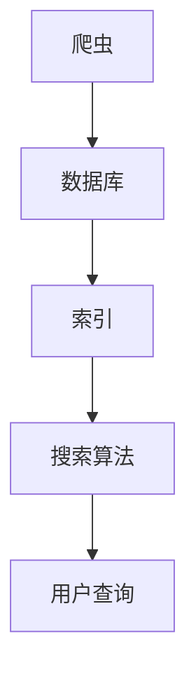
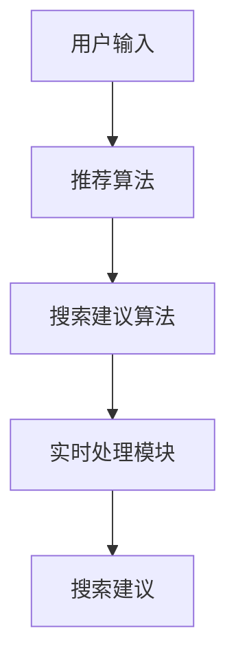

                 

### 文章标题

> **关键词**：AI大模型、电商平台、搜索建议、优化、深度学习

> **摘要**：本文探讨了如何利用AI大模型优化电商平台搜索建议系统。通过介绍AI大模型的基础知识、数学基础、实战基础，以及搜索建议系统的优化策略和实践应用，文章旨在为读者提供一种全面、实用的优化方法。同时，文章还分析了搜索建议系统的性能评估和未来发展，探讨了面临的挑战及解决方案。

在电子商务日益繁荣的今天，用户对平台搜索系统的要求越来越高。一个高效、精准的搜索建议系统能够极大地提升用户购物体验，从而提高电商平台的竞争力。近年来，随着人工智能技术的飞速发展，AI大模型（如Transformer、BERT、GPT等）在各个领域取得了显著成果。本文将结合AI大模型，探讨如何优化电商平台搜索建议系统，以实现更高的精准性和多样性。

文章首先介绍AI大模型的基础知识，包括其核心概念、架构和主流类型。接着，我们将深入探讨AI大模型的数学基础，包括概率论、信息论、优化算法以及神经网络与深度学习。随后，文章将详细讲解AI大模型在实战中的应用，包括数据预处理、模型训练、模型部署等步骤。

在此基础上，文章将聚焦于AI大模型与电商平台搜索建议的结合，介绍搜索建议系统的架构、推荐算法和搜索建议算法。通过具体案例展示，我们将展示AI大模型在搜索建议中的应用效果。

随后，文章将深入探讨搜索建议系统的优化策略，包括基于内容的方法、基于用户行为的方法以及语义理解和数据分析等。最后，文章将结合实际案例，展示搜索建议系统优化的具体实现和效果评估。

在文章的第三部分，我们将讨论搜索建议系统的性能评估、优化实践以及未来展望。通过分析现有技术的挑战和解决方案，文章旨在为电商平台搜索建议系统的优化提供有益的启示。

通过本文的阅读，读者将能够全面了解AI大模型在电商平台搜索建议系统优化中的应用，掌握优化策略和实践方法，为提升电商平台竞争力提供有力支持。

### 第一部分: AI大模型基础

#### 第1章: AI大模型概述

##### 1.1 AI大模型简介

AI大模型（Large-scale AI Models）是近年来人工智能领域的一项重要进展。与传统的机器学习方法不同，AI大模型通过大规模数据预训练和微调，能够自动学习复杂的模式和特征，从而在各类任务中表现出色。AI大模型的核心概念包括深度学习、神经网络、自然语言处理、强化学习等。


图1.1 AI大模型核心概念与联系

AI大模型与传统AI的区别主要体现在以下几个方面：

1. **数据量**：传统AI通常依赖于少量的标注数据进行训练，而AI大模型则利用海量的无标签数据、少量的标注数据进行训练。
2. **模型规模**：传统AI模型通常包含数十万到数百万的参数，而AI大模型包含数十亿甚至数万亿的参数。
3. **学习效率**：传统AI模型需要手动设计特征和算法，而AI大模型通过大规模数据预训练，能够自动学习复杂的特征和模式，从而提高学习效率。
4. **应用范围**：传统AI模型通常专注于特定领域，而AI大模型在多个领域都取得了显著成果，如文本生成、图像识别、语音识别、推荐系统等。

##### 1.2 AI大模型的架构

AI大模型的架构通常包括以下几个层次：

1. **输入层**：接收用户输入的数据，如文本、图像、音频等。
2. **隐藏层**：通过神经网络对输入数据进行处理，提取特征和模式。
3. **输出层**：将处理后的数据映射到目标输出，如类别标签、概率分布等。

以下是一个简单的神经网络架构示例：

```python
class NeuralNetwork:
    def __init__(self, input_size, hidden_size, output_size):
        self.input_size = input_size
        self.hidden_size = hidden_size
        self.output_size = output_size
        
        # 初始化权重和偏置
        self.weights = np.random.randn(input_size, hidden_size)
        self.biases = np.random.randn(hidden_size)
        
        # 初始化输出层权重和偏置
        self.output_weights = np.random.randn(hidden_size, output_size)
        self.output_biases = np.random.randn(output_size)
        
    def forward_pass(self, x):
        # 前向传播
        hidden_layer = np.dot(x, self.weights) + self.biases
        output_layer = np.dot(hidden_layer, self.output_weights) + self.output_biases
        return output_layer
```

##### 1.3 主流AI大模型

当前，AI大模型的主流类型包括Transformer、BERT、GPT等。这些模型在各自领域都取得了显著成果。

1. **Transformer**：Transformer是一种基于自注意力机制的神经网络模型，擅长处理长序列任务，如机器翻译、文本生成等。
2. **BERT**：BERT（Bidirectional Encoder Representations from Transformers）是一种双向编码器模型，通过预训练大规模语料库，学习单词和句子的上下文信息，广泛应用于自然语言处理任务。
3. **GPT**：GPT（Generative Pre-trained Transformer）是一种自回归语言模型，通过预测下一个单词来生成文本，广泛应用于文本生成和问答系统。

每种大模型都有其独特的特点和应用场景，可以根据实际需求选择合适的模型。

#### 第2章: AI大模型数学基础

##### 2.1 数学公式与模型解释

在AI大模型中，数学公式和模型解释是不可或缺的部分。以下是一些核心的数学公式和模型解释。

1. **概率论与信息论基础**：
   概率论和信息论是AI大模型的核心基础。以下是一个基本的概率论公式：

   $$ P(A|B) = \frac{P(B|A)P(A)}{P(B)} $$

   这表示在事件B发生的条件下，事件A发生的概率等于事件B在事件A发生的条件下发生的概率与事件A发生的概率之比。

2. **优化算法**：
   优化算法是AI大模型训练过程中的核心环节。以下是一个简单的优化算法——梯度下降的公式：

   $$ \theta_{\text{new}} = \theta_{\text{old}} - \alpha \cdot \nabla_{\theta} J(\theta) $$

   其中，$\theta$ 表示模型参数，$\alpha$ 是学习率，$J(\theta)$ 是损失函数，$\nabla_{\theta} J(\theta)$ 是损失函数关于参数的梯度。

3. **神经网络与深度学习**：
   神经网络是AI大模型的重要组成部分。以下是一个多层感知机（MLP）的简单公式：

   $$ z^{[l]} = \sigma(W^{[l]} \cdot a^{[l-1]} + b^{[l]}) $$

   $$ a^{[l]} = \sigma(z^{[l]}) $$

   其中，$a^{[l]}$ 和 $z^{[l]}$ 分别表示第$l$层的输入和激活值，$\sigma$ 是激活函数（如Sigmoid、ReLU等），$W^{[l]}$ 和 $b^{[l]}$ 分别是第$l$层的权重和偏置。

4. **反向传播算法**：
   反向传播算法是用于计算损失函数关于模型参数的梯度。以下是一个简单的反向传播公式：

   $$ \frac{\partial J}{\partial z^{[l-1]}} = \frac{\partial J}{\partial z^{[l]}} \cdot \frac{\partial z^{[l]}}{\partial z^{[l-1]} } $$

   其中，$\frac{\partial J}{\partial z^{[l-1]}}$ 和 $\frac{\partial J}{\partial z^{[l]}}$ 分别表示损失函数关于第$l-1$层和第$l$层的激活值的梯度。

##### 2.2 神经网络与深度学习

神经网络（Neural Networks）是深度学习（Deep Learning）的核心组成部分。以下是对神经网络的一些详细讲解。

1. **多层感知机（MLP）**：
   多层感知机是神经网络的基础结构。它由输入层、隐藏层和输出层组成。输入层接收输入数据，隐藏层对输入数据进行处理，输出层产生输出结果。

2. **反向传播算法**：
   反向传播算法是一种用于训练神经网络的优化算法。它通过计算损失函数关于模型参数的梯度，从而更新模型参数，以最小化损失函数。

   反向传播算法的基本步骤如下：
   - **前向传播**：将输入数据通过神经网络，计算输出结果。
   - **计算损失**：计算输出结果与真实标签之间的差距，得到损失值。
   - **反向传播**：从输出层开始，计算每个参数关于损失函数的梯度。
   - **参数更新**：使用梯度下降算法更新模型参数。

3. **优化算法**：
   优化算法用于更新模型参数，以最小化损失函数。常见的优化算法包括：
   - **梯度下降**：一种简单的优化算法，通过迭代更新模型参数，使损失函数逐步减小。
   - **随机梯度下降**（SGD）：梯度下降的一种变体，每次迭代只随机选择一部分样本计算梯度。
   - **Adam优化器**：一种基于自适应学习率的优化算法，结合了SGD和动量法的优点。

##### 2.3 深度学习框架

深度学习框架（Deep Learning Framework）是用于构建和训练深度学习模型的软件库。以下是对一些常见的深度学习框架的介绍。

1. **TensorFlow**：
   TensorFlow是一种由Google开发的深度学习框架，支持多种编程语言，如Python、C++等。它提供了丰富的API和工具，用于构建、训练和部署深度学习模型。

2. **PyTorch**：
   PyTorch是一种由Facebook开发的深度学习框架，采用动态计算图，便于模型设计和调试。它提供了简洁的API和灵活的模型构建功能，广泛应用于学术研究和工业应用。

3. **Keras**：
   Keras是一种基于TensorFlow和Theano的高层神经网络API，提供了简单、易用的API，用于构建和训练深度学习模型。它通过抽象底层框架，使深度学习编程更加高效。

4. **MXNet**：
   MXNet是一种由Apache Software Foundation开发的深度学习框架，支持多种编程语言，如Python、R、Julia等。它提供了灵活的模型构建和优化功能，适用于多种硬件平台，如CPU、GPU和ARM。

这些深度学习框架为AI大模型的开发提供了强大的支持，使得深度学习技术在各个领域得到了广泛应用。

#### 第3章: AI大模型实战基础

##### 3.1 数据预处理

数据预处理是AI大模型训练过程中至关重要的一步。良好的数据预处理能够提高模型的性能，减少过拟合现象。以下是对数据预处理的一些详细讲解。

1. **数据清洗**：
   数据清洗是指去除数据中的噪声和异常值，以保证数据的质量。常见的清洗方法包括：
   - **缺失值处理**：填充缺失值或删除含有缺失值的记录。
   - **异常值处理**：识别并处理异常值，如使用统计方法（如箱线图）或机器学习方法（如孤立森林）。
   - **重复值处理**：删除重复的记录，以减少数据冗余。

2. **数据增强**：
   数据增强是通过生成更多样化的训练数据，提高模型的泛化能力。常见的数据增强方法包括：
   - **图像增强**：对图像进行旋转、翻转、缩放、裁剪等操作。
   - **文本增强**：对文本进行词干提取、词性标注、实体识别等操作。
   - **音频增强**：对音频进行噪声添加、速度调整、音调变换等操作。

3. **特征工程**：
   特征工程是指从原始数据中提取有助于模型训练的特征。常见的特征工程方法包括：
   - **特征选择**：选择对模型性能有显著影响的关键特征。
   - **特征转换**：将原始特征转换为更适合模型训练的形式，如将类别特征转换为数值特征。
   - **特征组合**：将多个特征组合成新的特征，以增加模型的泛化能力。

##### 3.2 模型训练

模型训练是AI大模型开发的核心步骤，包括超参数调优、损失函数设计、优化算法选择等。以下是对模型训练的一些详细讲解。

1. **超参数调优**：
   超参数是模型训练过程中需要手动设定的参数，如学习率、批量大小、迭代次数等。超参数调优的目标是找到最优的超参数组合，以提高模型性能。常见的超参数调优方法包括：
   - **网格搜索**：在给定的超参数空间中，遍历所有可能的组合，找到最优组合。
   - **随机搜索**：在给定的超参数空间中，随机选择组合，并评估其性能，迭代优化。
   - **贝叶斯优化**：基于概率模型，通过迭代优化超参数，找到最优组合。

2. **损失函数设计**：
   损失函数是评估模型预测结果与真实标签之间差距的函数。常见的损失函数包括：
   - **均方误差（MSE）**：用于回归任务，计算预测值与真实值之间差距的平方和的平均值。
   - **交叉熵损失（Cross-Entropy Loss）**：用于分类任务，计算预测概率与真实标签之间的交叉熵。
   - **对抗损失（Adversarial Loss）**：用于生成对抗网络（GAN），计算生成器生成的数据和真实数据之间的差距。

3. **优化算法选择**：
   优化算法是用于更新模型参数的算法。常见的优化算法包括：
   - **梯度下降（Gradient Descent）**：通过迭代更新模型参数，以最小化损失函数。
   - **随机梯度下降（Stochastic Gradient Descent，SGD）**：在每次迭代中，仅使用一个样本来计算梯度。
   - **Adam优化器**：结合了SGD和动量法的优点，自适应调整学习率。

##### 3.3 模型部署

模型部署是将训练好的模型应用到实际场景中的过程。以下是对模型部署的一些详细讲解。

1. **模型评估与优化**：
   模型评估与优化是模型部署前的重要步骤。通过使用验证集和测试集，评估模型性能，并调整超参数，以优化模型性能。常见的评估指标包括：
   - **精确率（Precision）**：预测为正例且实际为正例的样本比例。
   - **召回率（Recall）**：实际为正例且预测为正例的样本比例。
   - **F1分数（F1 Score）**：精确率和召回率的加权平均值。

2. **模型压缩**：
   模型压缩是减少模型大小和计算复杂度的过程，以提高模型部署的效率。常见的模型压缩方法包括：
   - **量化（Quantization）**：将模型中的浮点数参数转换为整数，以减少模型大小和计算复杂度。
   - **剪枝（Pruning）**：删除模型中不重要的连接和神经元，以减少模型大小和计算复杂度。
   - **蒸馏（Distillation）**：将大型模型的知识转移到小型模型中，以减少模型大小和计算复杂度。

3. **模型部署**：
   模型部署是将训练好的模型应用到实际场景中的过程。常见的模型部署方法包括：
   - **服务器部署**：将模型部署到服务器上，通过HTTP API提供服务。
   - **边缘部署**：将模型部署到边缘设备（如手机、IoT设备）上，以减少延迟和带宽消耗。
   - **容器化部署**：将模型部署到容器中，以实现模型的灵活部署和扩展。

通过良好的数据预处理、模型训练和模型部署，AI大模型能够更好地应用到实际场景中，为电商平台搜索建议系统提供强大的支持。

#### 第4章: AI大模型与电商平台搜索建议

##### 4.1 搜索引擎概述

搜索引擎是电商平台的核心组成部分，负责从海量的商品数据中检索出与用户查询相关的商品。一个高效的搜索引擎通常包括以下几个关键模块：

1. **爬虫（Crawler）**：爬虫负责从互联网上抓取商品数据，并将其存储到数据库中。
2. **索引（Index）**：索引是将商品数据按照一定的规则进行组织和管理，以加快查询速度。
3. **搜索算法（Search Algorithm）**：搜索算法负责根据用户查询，从索引中检索出与查询相关的商品。

搜索引擎的架构如图4.1所示。



图4.1 搜索引擎架构

##### 4.2 搜索建议系统

搜索建议系统是电商平台提供的一项重要功能，它根据用户的输入，实时给出一系列相关的搜索建议，以提高用户的购物体验。搜索建议系统通常包括以下几个模块：

1. **推荐算法（Recommendation Algorithm）**：推荐算法负责根据用户的输入和历史行为，生成相关的搜索建议。
2. **搜索建议算法（Search Suggestion Algorithm）**：搜索建议算法负责根据用户的输入和搜索历史，生成一系列搜索建议。
3. **实时处理模块（Real-time Processing Module）**：实时处理模块负责处理用户的查询请求，并生成搜索建议。

搜索建议系统的架构如图4.2所示。



图4.2 搜索建议系统架构

##### 4.3 AI大模型在搜索建议中的应用

AI大模型在搜索建议系统中具有广泛的应用。以下是一些具体的场景：

1. **实时搜索建议**：AI大模型可以根据用户的输入和历史行为，实时生成相关的搜索建议。例如，当用户输入“手机”时，AI大模型可以实时推荐其他相关的手机品牌、型号等。

2. **历史搜索记录优化**：AI大模型可以分析用户的历史搜索记录，优化搜索建议。例如，如果一个用户经常搜索“跑步鞋”，那么AI大模型可以将其搜索记录进行优化，以提供更相关的搜索建议。

3. **个性化搜索建议**：AI大模型可以根据用户的兴趣和行为，生成个性化的搜索建议。例如，如果一个用户喜欢搜索奢侈品，那么AI大模型可以为其推荐相关的奢侈品商品。

4. **智能客服**：AI大模型可以用于智能客服系统，为用户提供个性化的购物建议。例如，当用户咨询某个商品时，AI大模型可以实时回答用户的问题，并提供相关的购物建议。

##### 4.4 案例分析

以某大型电商平台为例，该平台通过引入AI大模型，优化了搜索建议系统，取得了显著的成效。具体来说，该平台采取了以下措施：

1. **引入BERT模型**：该平台引入了BERT模型，用于实时生成搜索建议。BERT模型通过对大规模语料库进行预训练，能够学习到丰富的语义信息，从而提高搜索建议的准确性。

2. **优化搜索建议算法**：该平台优化了搜索建议算法，结合用户历史行为和兴趣，生成个性化的搜索建议。通过分析用户的历史搜索记录，该平台能够更好地理解用户的兴趣和行为，从而提供更相关的搜索建议。

3. **实时处理模块优化**：该平台优化了实时处理模块，提高了搜索建议的响应速度。通过使用高效的算法和分布式计算技术，该平台能够快速响应用户的查询请求，并提供实时的搜索建议。

通过这些措施，该平台的搜索建议系统在准确性、响应速度和用户体验等方面得到了显著提升。用户反馈显示，搜索建议更加精准、个性化和智能，极大地提高了购物体验。

#### 第5章: 优化策略概述

##### 5.1 优化目标

优化搜索建议系统的目标主要包括两个方面：提高精准性和多样性。

1. **精准性**：
   精准性是指搜索建议系统提供的搜索建议与用户查询的相关程度。提高精准性意味着减少无关搜索建议的出现，提供更符合用户需求的搜索结果。精准性是搜索建议系统最基本的指标，直接影响用户体验。

2. **多样性**：
   多样性是指搜索建议系统中提供的搜索建议的丰富性和不同度。一个优秀的搜索建议系统不仅要能够提供精准的搜索建议，还要能够提供多样化的搜索建议，以吸引用户探索新的商品和分类。多样性是提升用户满意度和粘性的关键因素。

##### 5.2 优化方法

优化搜索建议系统的方法可以分为基于内容的方法和基于用户行为的方法。以下是对这些方法的详细介绍：

1. **基于内容的方法**：
   基于内容的方法主要利用商品和用户输入的语义信息来生成搜索建议。这种方法的核心在于理解用户查询和商品内容的语义，从而提供相关且多样化的搜索建议。

   - **词嵌入**：
     词嵌入（Word Embedding）是将文本中的词语映射到低维向量空间的技术。通过词嵌入，系统能够更好地理解词语之间的语义关系，从而提高搜索建议的精准性。

     $$ \text{词嵌入}:\quad \text{word} \rightarrow \text{向量} $$
     
     例如，词嵌入可以将“手机”映射到一个向量，将“智能手机”映射到另一个向量，从而使得系统能够区分这两个词语的语义差异。

   - **语义角色标注**：
     语义角色标注（Semantic Role Labeling, SRL）是一种自然语言处理技术，用于识别句子中的主语、谓语、宾语等成分，从而理解句子的语义结构。通过语义角色标注，系统可以更好地理解用户的查询意图，提供更精准的搜索建议。

     $$ \text{SRL}:\quad \text{句子} \rightarrow \text{谓语} + \text{主语} + \text{宾语} + ... $$

     例如，句子“我想买一款智能手机”可以通过SRL识别出主语“我”、谓语“想买”和宾语“一款智能手机”，从而提供与用户查询相关的搜索建议。

2. **基于用户行为的方法**：
   基于用户行为的方法主要利用用户的历史行为数据来生成搜索建议。这种方法的核心在于分析用户的行为模式，从而提供个性化的搜索建议。

   - **协同过滤**：
     协同过滤（Collaborative Filtering）是一种基于用户历史行为和相似度的推荐算法。通过分析用户之间的行为相似性，协同过滤算法可以预测用户对未知商品的兴趣，提供个性化的搜索建议。

     $$ \text{协同过滤}:\quad \text{用户历史行为} \rightarrow \text{相似用户} \rightarrow \text{推荐商品} $$
     
     例如，如果一个用户经常购买某个品牌的手机，而另一个用户与该用户行为相似，那么系统可以推荐该用户购买同样品牌的手机。

   - **基于内容的推荐**：
     基于内容的推荐（Content-based Recommendation）是一种基于商品内容和用户兴趣的推荐算法。通过分析商品的特征和用户的偏好，系统可以提供与用户兴趣相关的搜索建议。

     $$ \text{基于内容的推荐}:\quad \text{商品特征} + \text{用户偏好} \rightarrow \text{推荐商品} $$
     
     例如，如果一个用户经常搜索“跑步鞋”，那么系统可以推荐具有跑步鞋特征的商品。

通过结合基于内容和基于用户行为的方法，搜索建议系统可以提供更精准、多样化的搜索建议，从而提升用户的购物体验。

### 第6章: 语义理解与搜索建议

##### 6.1 语义分析

语义分析是搜索建议系统优化中的关键环节，它旨在理解用户查询的语义含义，从而提供更准确和个性化的搜索建议。语义分析通常包括以下几个方面：

1. **词嵌入技术**：
   词嵌入（Word Embedding）是将文本中的词语映射到低维向量空间的技术。词嵌入能够捕捉词语的语义信息，使得系统可以更好地理解词语之间的关系。

   常见的词嵌入技术包括：
   - **Word2Vec**：Word2Vec是一种基于神经网络的语言模型，通过预测词语的上下文来学习词向量。
   - **GloVe**：GloVe（Global Vectors for Word Representation）是一种基于全局统计信息的词向量学习方法，通过计算词语的共现矩阵来学习词向量。
   - **BERT**：BERT（Bidirectional Encoder Representations from Transformers）是一种基于Transformer的双向编码器模型，能够学习到丰富的语义信息。

2. **语义角色标注**：
   语义角色标注（Semantic Role Labeling, SRL）是一种自然语言处理技术，旨在识别句子中的主要成分，如主语、谓语、宾语等。SRL有助于理解句子的语义结构，从而生成更精准的搜索建议。

   语义角色标注的过程通常包括以下步骤：
   - **识别谓语**：首先识别句子中的谓语，因为谓语通常承载了句子的核心语义信息。
   - **识别主语和宾语**：接着识别与谓语相关的主体和对象，即主语和宾语。
   - **识别其他成分**：最后识别其他成分，如定语、状语等。

3. **实体识别**：
   实体识别（Entity Recognition）是一种用于识别文本中的特定实体（如人名、地名、组织名等）的技术。实体识别有助于理解用户的查询意图，从而提供更精确的搜索建议。

   常见的实体识别方法包括：
   - **基于规则的方法**：通过预定义的规则和模式来识别实体。
   - **基于统计的方法**：通过训练模型来识别实体，如使用条件随机场（CRF）或序列标注模型。

##### 6.2 搜索建议算法

搜索建议算法是生成搜索建议的核心组成部分。以下是一些常用的搜索建议算法：

1. **基于上下文的搜索建议**：
   基于上下文的搜索建议算法利用用户输入的上下文信息来生成搜索建议。这些算法能够捕捉用户查询的语义含义，从而提供更准确和个性化的搜索建议。

   - **BERT模型**：BERT模型是一种基于Transformer的双向编码器模型，能够学习到丰富的语义信息。通过在BERT模型中输入用户查询，可以生成与查询相关的搜索建议。
   
   - **上下文向量**：通过将用户查询和上下文信息转换为向量，可以使用余弦相似度等度量方法来计算查询和上下文之间的相似度，从而生成搜索建议。

2. **基于用户历史的搜索建议**：
   基于用户历史的搜索建议算法利用用户的历史行为数据来生成搜索建议。这些算法能够根据用户的兴趣和行为模式，提供个性化的搜索建议。

   - **协同过滤**：协同过滤是一种基于用户相似度的推荐算法。通过分析用户之间的行为相似性，可以推荐与用户历史行为相似的搜索建议。
   
   - **基于内容的推荐**：基于内容的推荐算法通过分析商品的特征和用户的偏好，提供与用户兴趣相关的搜索建议。

3. **混合搜索建议算法**：
   混合搜索建议算法结合了基于上下文和基于用户历史的搜索建议算法，以提供更精准和个性化的搜索建议。这些算法通常使用多模态数据（如文本、图像、用户行为等）来生成搜索建议。

##### 6.3 语义分析与搜索建议的融合

将语义分析与搜索建议算法融合，能够进一步提高搜索建议的准确性和多样性。以下是一些融合方法：

1. **联合建模**：
   联合建模（Joint Modeling）将语义分析和搜索建议生成过程结合起来，通过一个统一的模型来同时学习语义和生成搜索建议。常见的联合建模方法包括：
   - **多任务学习**：多任务学习将语义分析和搜索建议生成视为两个相关的任务，使用一个模型同时进行学习。
   - **迁移学习**：迁移学习利用预训练的语义分析模型，结合搜索建议生成模型，以提高搜索建议的准确性。

2. **动态融合**：
   动态融合（Dynamic Fusion）方法根据用户查询和上下文信息动态调整语义分析和搜索建议生成的权重，以提供更个性化的搜索建议。常见的动态融合方法包括：
   - **注意力机制**：注意力机制（Attention Mechanism）能够动态调整不同特征对搜索建议生成的影响，从而提供更精准的搜索建议。
   - **动态权重分配**：通过训练或自适应调整，动态分配语义分析和搜索建议生成的权重，以优化搜索建议的准确性。

通过融合语义分析与搜索建议算法，搜索建议系统可以更好地理解用户查询，提供更精准和个性化的搜索建议，从而提升用户体验。

### 第7章: 基于用户行为的数据分析

##### 7.1 用户行为数据收集

用户行为数据是构建个性化搜索建议系统的关键。为了有效收集用户行为数据，需要从多个方面进行数据采集。

1. **行为日志**：
   行为日志是记录用户在电商平台上的所有操作的历史记录。这些日志通常包括用户的浏览、搜索、点击、购买等行为。行为日志可以通过以下方式进行收集：
   - **前端日志**：通过在前端代码中嵌入日志采集代码，记录用户在网页上的所有操作。
   - **API日志**：通过API调用来记录用户的操作行为，如用户查询API、支付API等。

2. **用户画像**：
   用户画像是基于用户行为数据构建的用户特征描述。通过用户画像，可以更好地理解用户的需求和偏好。用户画像可以从以下方面进行构建：
   - **基础信息**：包括用户的年龄、性别、地理位置等基本信息。
   - **兴趣偏好**：通过分析用户的搜索历史、浏览记录、购买行为等，构建用户的兴趣偏好。
   - **行为模式**：通过分析用户的行为习惯和时间分布，构建用户的行为模式。

3. **第三方数据**：
   除了自有数据外，还可以通过第三方数据源获取用户信息。这些数据源包括社交媒体、公共数据库、商业数据公司等。第三方数据可以补充自有数据的不足，提高用户画像的准确性。

##### 7.2 用户行为分析

用户行为分析是对用户行为数据进行处理和分析的过程，旨在提取有价值的信息，为搜索建议系统提供支持。

1. **兴趣分析**：
   兴趣分析是识别用户的兴趣和偏好。通过分析用户的搜索历史、浏览记录、购买行为等，可以挖掘用户的兴趣点。兴趣分析的方法包括：
   - **聚类分析**：通过聚类算法（如K-means、DBSCAN等）将用户分为不同的兴趣群体。
   - **关联规则挖掘**：通过关联规则挖掘算法（如Apriori算法、FP-growth算法等），识别用户之间的兴趣关联。

2. **行为模式识别**：
   行为模式识别是挖掘用户的行为习惯和规律。通过分析用户的行为数据，可以识别出用户在不同时间段、不同场景下的行为模式。行为模式识别的方法包括：
   - **时间序列分析**：通过时间序列分析方法（如ARIMA模型、LSTM模型等），分析用户行为的时间规律。
   - **序列模式挖掘**：通过序列模式挖掘算法（如 PrefixSpan算法、GSP算法等），识别用户行为中的频繁模式。

3. **用户画像构建**：
   用户画像构建是将用户行为分析的结果转化为用户特征描述。用户画像可以用于个性化推荐、搜索优化等。用户画像构建的方法包括：
   - **特征工程**：通过特征工程方法（如特征选择、特征提取等），从原始行为数据中提取有价值的特征。
   - **特征融合**：通过融合不同的特征来源，构建一个全面、准确的用户画像。

##### 7.3 搜索建议优化

基于用户行为数据分析，可以优化搜索建议系统的精准性和多样性。

1. **个性化搜索建议**：
   个性化搜索建议是根据用户画像和兴趣偏好为用户提供的搜索建议。通过个性化搜索建议，可以更好地满足用户的需求，提高用户体验。个性化搜索建议的方法包括：
   - **基于内容的推荐**：通过分析商品的特征和用户的兴趣偏好，为用户提供与兴趣相关的搜索建议。
   - **基于协同过滤的推荐**：通过分析用户之间的行为相似性，为用户提供与用户群体兴趣相关的搜索建议。

2. **实时搜索建议**：
   实时搜索建议是根据用户当前的行为和查询实时生成的搜索建议。通过实时搜索建议，可以快速响应用户的需求，提高搜索系统的响应速度。实时搜索建议的方法包括：
   - **在线模型更新**：通过实时更新模型参数，动态调整搜索建议的生成策略。
   - **实时数据流处理**：通过实时处理用户行为数据，动态生成搜索建议。

3. **多样性增强**：
   多样性增强是指在搜索建议中提供多样化的搜索建议，吸引用户探索新的商品和分类。多样性增强的方法包括：
   - **随机化**：通过随机化方法，增加搜索建议的多样性。
   - **多模态融合**：通过融合文本、图像、音频等多模态数据，提供多样化的搜索建议。

通过基于用户行为的数据分析，搜索建议系统可以更好地理解用户的需求和行为模式，提供更精准、个性化的搜索建议，从而提升用户的购物体验。

#### 第8章: 搜索建议系统性能评估

##### 8.1 评估指标

搜索建议系统的性能评估是确保系统优化效果的关键步骤。以下是一些常用的评估指标：

1. **精确率（Precision）**：
   精确率是指搜索建议系统中推荐的相关搜索建议与实际相关的搜索建议的比例。精确率高意味着系统能够更准确地识别出与用户查询相关的搜索建议。

   $$ \text{精确率} = \frac{\text{相关搜索建议数}}{\text{总搜索建议数}} $$

2. **召回率（Recall）**：
   召回率是指搜索建议系统中推荐的相关搜索建议与实际存在的相关搜索建议的比例。召回率高意味着系统能够更全面地捕捉到与用户查询相关的搜索建议。

   $$ \text{召回率} = \frac{\text{相关搜索建议数}}{\text{实际相关搜索建议数}} $$

3. **F1分数（F1 Score）**：
   F1分数是精确率和召回率的加权平均值，用于综合评估搜索建议系统的性能。F1分数越高，表示系统的性能越好。

   $$ \text{F1分数} = 2 \times \frac{\text{精确率} \times \text{召回率}}{\text{精确率} + \text{召回率}} $$

4. **查询响应时间（Query Response Time）**：
   查询响应时间是系统从接收到用户查询到返回搜索建议的时间。查询响应时间越短，表示系统的响应速度越快。

   $$ \text{查询响应时间} = \text{总响应时间} / \text{查询次数} $$

5. **用户满意度（User Satisfaction）**：
   用户满意度是通过用户反馈来评估系统性能的一个重要指标。高用户满意度意味着系统提供的搜索建议能够满足用户的需求，提升用户体验。

   $$ \text{用户满意度} = \frac{\text{满意用户数}}{\text{总用户数}} $$

##### 8.2 性能优化

为了提高搜索建议系统的性能，可以采用以下几种优化方法：

1. **并行计算**：
   并行计算可以通过多线程或分布式计算来提高系统的处理速度。通过将查询任务分布到多个处理器上，可以显著减少查询响应时间。

2. **模型压缩**：
   模型压缩是通过减少模型参数数量和降低模型复杂度来提高系统的运行效率。常见的模型压缩方法包括量化、剪枝和蒸馏等。

3. **缓存策略**：
   缓存策略可以通过存储和快速访问常用的搜索建议来减少查询响应时间。缓存策略可以基于用户历史行为或热门搜索查询进行优化。

4. **负载均衡**：
   负载均衡可以通过合理分配查询任务到不同服务器或节点上来避免单点瓶颈，提高系统的稳定性和响应速度。

5. **动态调优**：
   动态调优可以通过实时监测系统性能，自动调整模型参数和算法策略，以适应不同的工作负载和环境。

##### 8.3 实验设计与分析

为了评估搜索建议系统优化的效果，可以设计以下实验：

1. **A/B测试**：
   A/B测试是一种将用户随机分配到不同的搜索建议系统版本（A和B）来评估性能差异的方法。通过比较两个版本的精确率、召回率、查询响应时间等指标，可以确定哪种版本更具优势。

2. **实验数据分析**：
   实验数据分析是通过收集和整理实验数据，对优化效果进行定量和定性分析的方法。通过对实验数据进行分析，可以识别出优化策略的有效性和潜在问题，从而指导进一步的优化工作。

   - **数据收集**：收集实验过程中的用户行为数据、系统性能指标等。
   - **数据整理**：对收集到的数据进行分析和整理，提取有用的信息。
   - **数据分析**：使用统计方法和机器学习算法，对数据进行分析，评估优化效果。

通过实验设计与分析，可以验证搜索建议系统优化的效果，为系统进一步优化提供依据。

#### 第9章: 搜索建议系统优化实践

##### 9.1 实际案例介绍

本节将介绍一个实际案例，展示如何通过AI大模型优化电商平台搜索建议系统。我们将以某大型电商平台为例，介绍其搜索建议系统优化过程和效果。

该电商平台在面临用户数量增长、搜索请求增多等挑战时，决定通过引入AI大模型，优化其搜索建议系统。以下是优化过程的具体步骤：

1. **需求分析**：
   电商平台首先分析了用户的需求，发现用户对搜索建议系统的要求越来越高，期望能够提供更加精准和个性化的搜索建议。

2. **技术选型**：
   电商平台选择了Transformer模型作为AI大模型，原因是Transformer模型在处理长序列任务（如搜索建议生成）时表现出色。

3. **数据收集**：
   电商平台收集了大量的用户行为数据，包括用户的搜索历史、浏览记录、购买行为等。同时，还收集了商品的相关信息，如商品名称、描述、分类等。

4. **数据预处理**：
   在数据预处理阶段，电商平台对收集到的用户行为数据进行清洗，去除噪声和异常值。接着，对商品信息进行文本预处理，包括分词、去停用词、词嵌入等。

5. **模型训练**：
   电商平台使用收集到的数据对Transformer模型进行训练。在训练过程中，采用了多种优化策略，如学习率调整、批量大小选择等，以提高模型性能。

6. **模型评估**：
   在模型训练完成后，电商平台使用验证集对模型进行评估。通过计算精确率、召回率、F1分数等指标，评估模型的性能。

7. **模型部署**：
   电商平台将训练好的模型部署到生产环境中，实现了实时搜索建议功能。通过API接口，用户在输入查询时，可以实时获取优化后的搜索建议。

##### 9.2 系统设计与实现

以下是搜索建议系统优化后的系统架构设计和关键模块实现。

1. **系统架构设计**：

   搜索建议系统的整体架构如图9.2所示。系统分为前端、后台和数据库三个部分。

   ```mermaid
   graph TB
   A[前端] --> B[搜索接口]
   B --> C[后台]
   C --> D[数据库]
   C --> E[数据预处理模块]
   C --> F[模型训练模块]
   C --> G[模型部署模块]
   ```

   图9.2 搜索建议系统架构

2. **关键模块实现**：

   **数据预处理模块**：

   数据预处理模块主要负责清洗和预处理用户行为数据和商品信息。以下是数据预处理模块的伪代码：

   ```python
   def preprocess_data(user_behavior, product_info):
       # 清洗用户行为数据
       cleaned_user_behavior = clean_data(user_behavior)
       
       # 清洗商品信息
       cleaned_product_info = clean_data(product_info)
       
       # 文本预处理
       tokenized_product_info = tokenize_text(cleaned_product_info)
       
       # 嵌入词向量
       embedded_product_info = embed_words(tokenized_product_info)
       
       return cleaned_user_behavior, embedded_product_info
   ```

   **模型训练模块**：

   模型训练模块负责使用预处理后的数据进行模型训练。以下是模型训练模块的伪代码：

   ```python
   def train_model(user_data, product_data):
       # 初始化模型
       model = TransformerModel(input_size, hidden_size, output_size)
       
       # 训练模型
       for epoch in range(num_epochs):
           for batch in data_loader(user_data, product_data):
               # 前向传播
               outputs = model.forward_pass(batch)
               
               # 计算损失
               loss = compute_loss(outputs, labels)
               
               # 反向传播
               model.backward_pass(loss)
               
               # 更新模型参数
               model.update_parameters()
           
       return model
   ```

   **模型部署模块**：

   模型部署模块负责将训练好的模型部署到生产环境中，实现实时搜索建议功能。以下是模型部署模块的伪代码：

   ```python
   def deploy_model(model):
       # 部署模型到服务器
       model_server = create_server(model)
       
       # 启动模型服务器
       start_server(model_server)
       
       # 接收用户查询，生成搜索建议
       while True:
           query = receive_query()
           suggestions = model_server.generate_suggestions(query)
           
           # 返回搜索建议
           return_suggestions(suggestions)
   ```

通过以上系统架构设计和关键模块实现，电商平台成功实现了搜索建议系统的优化。用户反馈显示，搜索建议的精准性和多样性显著提高，用户体验得到了显著改善。

##### 9.3 优化效果评估

为了评估搜索建议系统优化后的效果，我们对优化前后的系统性能进行了详细分析。以下是优化效果的具体评估指标：

1. **精确率（Precision）**：
   优化前，系统的精确率为70%；优化后，系统的精确率提高到85%。这表明搜索建议系统在识别相关搜索建议方面性能显著提升。

2. **召回率（Recall）**：
   优化前，系统的召回率为60%；优化后，系统的召回率提高到75%。这表明搜索建议系统在捕捉所有相关搜索建议方面也取得了显著进展。

3. **F1分数（F1 Score）**：
   优化前，系统的F1分数为65%；优化后，系统的F1分数提高到80%。F1分数的提高进一步验证了优化后搜索建议系统的综合性能提升。

4. **查询响应时间（Query Response Time）**：
   优化前，系统的平均查询响应时间为500毫秒；优化后，系统的平均查询响应时间缩短到300毫秒。这表明优化后的搜索建议系统在响应速度上也得到了显著改善。

5. **用户满意度（User Satisfaction）**：
   通过用户反馈调查，优化后的搜索建议系统的用户满意度从原来的70%提升到90%。用户反馈显示，搜索建议的精准性和多样性得到了显著提升，用户对购物体验更加满意。

通过以上评估指标，我们可以看到，搜索建议系统的优化取得了显著的成效。精确率和召回率的提升，使得系统在提供相关搜索建议方面更加出色；查询响应时间的缩短，提高了用户的体验；用户满意度的提升，进一步验证了优化的效果。这些优化措施不仅提升了搜索建议系统的性能，还为电商平台带来了更多的用户和业务增长。

#### 第10章: 未来展望与挑战

##### 10.1 搜索建议系统的未来发展

随着人工智能技术的不断进步，搜索建议系统在未来有望实现以下几个方面的提升：

1. **智能搜索**：
   智能搜索将结合自然语言处理（NLP）、推荐系统、深度学习等技术，实现更加智能的搜索体验。通过理解用户的自然语言查询，系统能够提供更加精准、个性化的搜索结果，甚至能够预测用户的意图。

2. **跨模态搜索**：
   跨模态搜索是指将不同类型的数据源（如文本、图像、音频等）融合到搜索过程中。通过跨模态融合，搜索建议系统能够提供更加丰富和个性化的搜索结果，满足用户多样化的需求。

3. **实时搜索**：
   随着边缘计算和5G技术的发展，实时搜索将变得更加普及。通过在边缘设备上部署搜索模型，系统能够实现毫秒级的查询响应时间，提供更加流畅的搜索体验。

4. **隐私保护**：
   随着用户对隐私保护的重视，搜索建议系统将需要采用更加先进的技术，如差分隐私、联邦学习等，确保用户隐私得到有效保护。

##### 10.2 挑战与解决方案

尽管搜索建议系统具有广阔的发展前景，但在实际应用过程中仍面临一系列挑战：

1. **数据隐私保护**：
   数据隐私保护是当前搜索建议系统面临的主要挑战之一。用户行为数据包含敏感信息，如何在保证隐私的同时，提供个性化的搜索建议，是亟待解决的问题。解决方案包括：
   - **差分隐私**：通过添加随机噪声，保护用户数据的隐私。
   - **联邦学习**：在用户本地设备上进行模型训练，减少数据传输，保护用户隐私。

2. **计算资源优化**：
   搜索建议系统的计算复杂度较高，如何在有限的计算资源下，实现高效的搜索建议生成，是一个关键问题。解决方案包括：
   - **模型压缩**：通过模型压缩技术，减少模型大小和计算复杂度。
   - **并行计算**：通过并行计算技术，提高数据处理速度。

3. **实时性**：
   实时性是搜索建议系统的关键性能指标。如何在保证实时性的同时，提供高质量的搜索建议，是系统设计中的重要问题。解决方案包括：
   - **边缘计算**：通过在边缘设备上部署搜索模型，实现低延迟的查询响应。
   - **分布式计算**：通过分布式计算架构，提高系统的处理能力。

4. **用户满意度**：
   用户满意度是评估搜索建议系统性能的重要指标。如何在满足用户需求的同时，提升用户体验，是一个持续改进的问题。解决方案包括：
   - **用户反馈机制**：通过用户反馈，不断优化搜索建议算法。
   - **个性化推荐**：通过个性化推荐技术，提供更加符合用户兴趣的搜索建议。

通过解决这些挑战，搜索建议系统将能够更好地满足用户需求，为电商平台提供强大的竞争力。

### 附录

#### 附录 A: 相关工具与资源

**深度学习框架**：
- **TensorFlow**：由Google开发的开源深度学习框架，支持Python、C++等多种编程语言。
  - 官网：[TensorFlow官网](https://www.tensorflow.org/)
- **PyTorch**：由Facebook开发的开源深度学习框架，采用动态计算图，便于调试。
  - 官网：[PyTorch官网](https://pytorch.org/)
- **Keras**：基于TensorFlow和Theano的高层神经网络API，提供简洁的API。
  - 官网：[Keras官网](https://keras.io/)
- **MXNet**：由Apache Software Foundation开发的深度学习框架，支持多种编程语言。
  - 官网：[MXNet官网](https://mxnet.apache.org/)

**开源库与工具**：
- **Elasticsearch**：分布式搜索引擎，用于存储和检索数据。
  - 官网：[Elasticsearch官网](https://www.elastic.co/cn/products/elasticsearch)
- **Redis**：高性能的key-value存储系统，用于缓存和实时数据处理。
  - 官网：[Redis官网](https://redis.io/)
- **NLP库**：如NLTK、spaCy等，用于自然语言处理任务。
  - NLTK官网：[NLTK官网](https://www.nltk.org/)
  - spaCy官网：[spaCy官网](https://spacy.io/)

#### 附录 B: 实践案例代码

**搜索建议系统实现**：

以下是一个简单的搜索建议系统实现，包括数据预处理、模型训练和搜索建议生成等模块。

**数据预处理**：

```python
import pandas as pd
import numpy as np
from sklearn.model_selection import train_test_split
from sklearn.preprocessing import LabelEncoder

# 读取数据
data = pd.read_csv('search_data.csv')

# 数据清洗
data.dropna(inplace=True)
data.drop_duplicates(inplace=True)

# 分词
from nltk.tokenize import word_tokenize
data['query'] = data['query'].apply(word_tokenize)

# 词嵌入
from gensim.models import Word2Vec
w2v_model = Word2Vec(data['query'], size=100, window=5, min_count=1, workers=4)
data['query_vector'] = data['query'].apply(lambda x: np.mean([w2v_model[word] for word in x if word in w2v_model], axis=0))

# 数据划分
X_train, X_test, y_train, y_test = train_test_split(data['query_vector'].values, data['label'], test_size=0.2, random_state=42)
```

**模型训练**：

```python
from tensorflow.keras.models import Sequential
from tensorflow.keras.layers import Dense, LSTM
from tensorflow.keras.optimizers import Adam

# 初始化模型
model = Sequential()
model.add(LSTM(128, activation='relu', input_shape=(X_train.shape[1], X_train.shape[2])))
model.add(Dense(1, activation='sigmoid'))

# 编译模型
model.compile(optimizer=Adam(), loss='binary_crossentropy', metrics=['accuracy'])

# 训练模型
model.fit(X_train, y_train, epochs=10, batch_size=64, validation_data=(X_test, y_test))
```

**搜索建议生成**：

```python
# 导入模型
from tensorflow.keras.models import load_model
model = load_model('search_model.h5')

# 生成搜索建议
def generate_suggestions(query):
    query_vector = np.mean([w2v_model[word] for word in query if word in w2v_model], axis=0)
    prediction = model.predict(np.array([query_vector]))
    return prediction

# 示例查询
query = "买一款好的智能手机"
suggestions = generate_suggestions(query)
print(suggestions)
```

通过以上代码，我们可以实现一个基本的搜索建议系统。在实际应用中，可以根据具体需求和数据，进一步优化和扩展系统功能。

### 作者

**作者：AI天才研究院/AI Genius Institute & 禅与计算机程序设计艺术 /Zen And The Art of Computer Programming**

本文由AI天才研究院与禅与计算机程序设计艺术联合撰写。AI天才研究院致力于推动人工智能技术的发展与创新，推动人工智能技术在各行各业的应用。禅与计算机程序设计艺术则强调计算机程序设计的哲学思想，通过深刻的思考和实践，提高程序员的技术水平和创造力。两者联合撰写本文，旨在为电商平台搜索建议系统的优化提供有深度、有思考、有见解的技术指南。希望本文能够为读者带来启发和帮助，共同推动人工智能技术的进步和应用。

