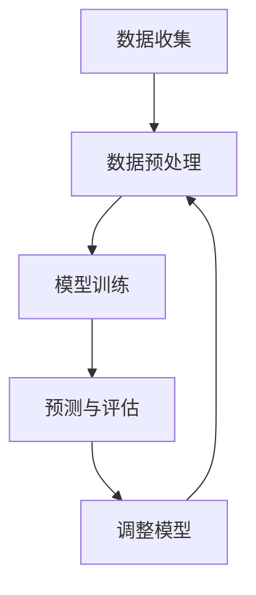

                 

### 文章标题

在当今竞争激烈的电商市场中，商品展示顺序的优化成为电商平台成功的关键因素之一。随着人工智能（AI）技术的飞速发展，AI在电商平台商品展示优化中的应用日益广泛，成为提升用户体验和增加销售额的重要手段。本文将深入探讨AI如何优化电商平台的商品展示顺序，为读者提供全面的视角和实用的方法。

### 关键词

- 电商平台
- 商品展示顺序
- 人工智能
- 机器学习
- 用户行为分析
- 深度学习
- 个性化推荐
- 优化算法

### 摘要

本文首先概述了电商平台的现状与面临的挑战，探讨了AI在电商领域的作用。接着，详细介绍了AI优化商品展示的原理，包括机器学习基础、用户行为数据分析等。然后，本文将深入分析AI优化商品展示的技术与实践，涵盖用户行为数据收集与处理、机器学习模型的选择与实现、深度学习在商品展示优化中的应用等内容。最后，通过案例分析与实战，展示AI在电商平台商品展示优化中的具体应用，并对未来AI优化商品展示的趋势进行展望。

## 第一部分：电商平台与AI概述

### 第1章：电商平台的现状与挑战

随着互联网技术的不断进步和消费者购物习惯的改变，电商平台已经成为现代零售业的重要组成部分。从最初的电子商务模式到如今的社交电商、直播电商，电商平台经历了巨大的变革。然而，在这繁荣的背后，电商平台也面临着诸多挑战。

#### 1.1 电商平台的演变历程

电商平台的发展可以分为几个阶段：

1. **起步阶段**：最早的电商平台如Amazon、eBay等主要提供在线商品买卖服务，用户通过网页浏览商品并进行购买。
   
2. **繁荣阶段**：随着移动互联网的普及，移动电商平台如淘宝、京东等迅速崛起，用户可以随时随地通过手机进行购物。

3. **多元化阶段**：如今，电商平台不仅提供商品销售，还涵盖物流、支付、社交等多方面服务，如拼多多、小红书等。

#### 1.2 电商行业面临的挑战

尽管电商行业在快速扩张，但仍然面临着以下挑战：

1. **竞争激烈**：电商行业竞争日益激烈，各大平台纷纷推出优惠活动、新品上市等策略以吸引消费者。

2. **用户需求多样化**：消费者需求多样化，不同用户对商品种类、价格、质量等有不同的期望。

3. **商品同质化**：大量商品同质化严重，商品展示顺序的优化变得尤为重要，以帮助用户快速找到所需商品。

4. **用户体验**：用户期望获得更好的购物体验，包括快速响应、便捷支付、高效物流等。

5. **数据安全**：电商平台需要处理大量用户数据，数据安全和隐私保护成为重要挑战。

#### 1.3 AI在电商领域的作用

人工智能（AI）技术在电商领域的应用正在改变传统电商模式，具体表现在：

1. **个性化推荐**：通过分析用户行为数据，AI能够为用户提供个性化的商品推荐，提升用户满意度。

2. **智能客服**：AI智能客服能够快速响应用户咨询，提高客服效率和用户满意度。

3. **商品分类与展示优化**：AI能够根据用户历史行为和偏好，优化商品分类和展示顺序，提高商品曝光率。

4. **库存管理**：AI能够预测市场需求，优化库存管理，减少库存积压。

5. **欺诈检测**：AI能够通过分析用户行为和交易数据，识别和预防欺诈行为。

总的来说，电商平台正面临着诸多挑战，但同时也迎来了前所未有的机遇。AI技术的引入为电商平台提供了创新的解决方案，有望在未来的电商竞争中占据优势。

---

以上是第一章的内容，接下来将深入探讨AI优化商品展示的原理，包括机器学习基础和用户行为分析。

## 第二部分：AI优化商品展示的原理

### 第2章：AI优化商品展示的原理

为了实现电商平台商品展示的优化，AI技术提供了强大的工具和算法。在这一章中，我们将首先介绍机器学习的基础知识，包括监督学习、无监督学习和强化学习，并探讨如何在商品展示优化中应用这些学习方式。随后，我们将详细讨论用户行为数据的类型和收集方法，以及如何利用这些数据进行分析和优化。

### 2.1 机器学习基础

#### 2.1.1 监督学习

监督学习是一种最常见的机器学习方法，它通过利用标记过的数据来训练模型，使得模型能够预测新的、未标记的数据。在电商平台的商品展示优化中，监督学习可以用来分析用户的历史行为数据，预测用户对特定商品的购买概率或兴趣程度。

**核心概念与联系**

- **输入**：用户的历史行为数据，如浏览记录、购买历史、评价等。
- **输出**：用户的兴趣度评分或购买概率。

**Mermaid 流程图**



**算法原理讲解**

1. **数据预处理**：清洗和转换数据，使其适合模型训练。
2. **模型训练**：使用标记数据训练模型，如决策树、支持向量机、神经网络等。
3. **预测与评估**：使用训练好的模型对新的用户行为数据进行分析，评估用户对商品的兴趣或购买概率。
4. **调整模型**：根据预测结果调整模型参数，以提高预测准确性。

**伪代码**

```python
# 数据预处理
data = preprocess_data(raw_data)

# 模型训练
model = train_model(data, target_variable)

# 预测与评估
predictions = model.predict(new_data)
evaluate_predictions(predictions, ground_truth)

# 调整模型
model = adjust_model(model, new_data, ground_truth)
```

#### 2.1.2 无监督学习

无监督学习不依赖于标记数据，主要目的是发现数据中的隐含结构和规律。在电商平台的商品展示优化中，无监督学习可以用来分析用户行为模式，发现潜在的用户群体或商品分类。

**核心概念与联系**

- **输入**：未标记的用户行为数据。
- **输出**：用户群体划分或商品分类。

**算法原理讲解**

1. **数据预处理**：清洗和转换数据，去除噪声和异常值。
2. **聚类分析**：使用聚类算法如K-means、层次聚类等将用户行为数据划分成不同的群体。
3. **降维**：使用降维技术如PCA（主成分分析）减少数据维度，便于可视化和分析。
4. **模式识别**：分析聚类结果，识别不同的用户群体或商品分类。

**伪代码**

```python
# 数据预处理
data = preprocess_data(raw_data)

# 聚类分析
clusters = cluster_data(data, algorithm='KMeans', num_clusters=3)

# 降维
data_reduced = reduce_dimensions(data, method='PCA')

# 模式识别
user_groups = identify_patterns(clusters, data_reduced)
```

#### 2.1.3 强化学习

强化学习通过不断与环境交互，学习最优策略来最大化回报。在电商平台的商品展示优化中，强化学习可以用来优化商品推荐策略，根据用户的行为反馈不断调整推荐策略。

**核心概念与联系**

- **输入**：用户行为和系统推荐。
- **输出**：推荐策略调整。

**算法原理讲解**

1. **状态-动作模型**：定义系统的状态和动作空间。
2. **奖励机制**：根据用户行为和系统推荐计算奖励。
3. **策略学习**：使用强化学习算法如Q-Learning、SARSA等更新策略。
4. **策略优化**：根据学习到的策略调整商品推荐。

**伪代码**

```python
# 状态-动作模型
state_space = define_state_space()
action_space = define_action_space()

# 奖励机制
reward = calculate_reward(user_action, system_recommendation)

# 策略学习
policy = learn_policy(state_space, action_space, reward)

# 策略优化
optimized_policy = optimize_policy(policy, user_actions, rewards)
```

### 2.2 数据分析与用户行为分析

电商平台拥有大量的用户行为数据，如浏览记录、购买历史、评价等。这些数据是优化商品展示顺序的重要资源。通过数据分析，可以深入了解用户的行为模式和偏好，从而为商品展示顺序的优化提供依据。

#### 2.2.1 用户行为数据的类型

1. **浏览数据**：记录用户在平台上的浏览行为，如访问的页面、浏览时长等。
2. **购买数据**：记录用户的购买行为，如购买的商品、购买时间、购买频率等。
3. **评价数据**：记录用户对商品的评分和评论，反映用户的满意度和商品的质量。

#### 2.2.2 用户行为数据的收集

1. **客户端日志**：通过客户端程序记录用户的操作行为。
2. **服务器日志**：通过服务器记录用户的访问行为。
3. **问卷调查**：通过在线问卷收集用户的行为和偏好数据。

#### 2.2.3 用户行为数据的分析

1. **行为模式识别**：通过统计方法识别用户的行为模式，如频繁购买的时段、偏好品类等。
2. **用户画像**：基于用户行为数据构建用户画像，包括用户的年龄、性别、职业等。
3. **相关性分析**：分析不同用户行为数据之间的相关性，如浏览时间和购买概率之间的关系。

通过以上分析，可以得出用户的兴趣点和行为偏好，从而优化商品展示顺序，提升用户体验和销售额。

### 小结

本章介绍了AI优化商品展示的原理，包括机器学习基础和用户行为分析。通过监督学习、无监督学习和强化学习等方法，可以分析用户行为数据，预测用户兴趣，优化商品展示顺序。这些技术不仅能够提高用户满意度，还能为电商平台带来更高的销售额。下一章将深入探讨机器学习模型的选择与实现。

## 第二部分：AI优化商品展示的原理（续）

### 第2章：AI优化商品展示的原理（续）

在上一节中，我们介绍了机器学习的基础知识，包括监督学习、无监督学习和强化学习。在本节中，我们将继续探讨这些学习方式在电商平台商品展示优化中的应用，并详细解释每种方法的具体实现过程。

#### 2.3 监督学习在商品展示优化中的应用

监督学习通过利用标记数据来训练模型，从而能够预测新的、未标记的数据。在电商平台的商品展示优化中，监督学习可以用来预测用户对特定商品的购买概率或兴趣程度。以下是一个具体的实现过程：

1. **数据收集**：首先，需要收集用户的历史行为数据，如浏览记录、购买历史、评价等。这些数据可以通过客户端日志、服务器日志和用户调查等多种途径获取。

2. **数据预处理**：清洗和转换数据，去除噪声和异常值。这一步包括数据去重、缺失值填补、数据规范化等操作。

3. **特征工程**：提取对预测任务有重要影响的特征，如用户ID、商品ID、浏览时长、购买频率等。同时，需要对特征进行编码，使其适合输入到机器学习模型中。

4. **模型选择**：根据问题的特点选择合适的模型，如决策树、支持向量机、神经网络等。常用的评估指标包括准确率、召回率、F1值等。

5. **模型训练**：使用标记数据训练模型，通过调整模型参数，使模型能够准确预测用户的行为。

6. **模型评估**：使用测试集对训练好的模型进行评估，通过交叉验证等技术来评估模型的泛化能力。

7. **模型优化**：根据评估结果，调整模型参数，以提高模型的预测准确性。

8. **应用**：将训练好的模型应用到实际场景中，根据用户行为预测结果，优化商品展示顺序。

**伪代码**

```python
# 数据预处理
data = preprocess_data(raw_data)

# 特征工程
features = extract_features(data)

# 模型选择
model = select_model(features)

# 模型训练
model = train_model(features, target_variable)

# 模型评估
evaluate_model(model, test_data)

# 模型优化
optimized_model = optimize_model(model, test_data)

# 应用
apply_model(optimized_model, user_data)
```

#### 2.4 无监督学习在商品展示优化中的应用

无监督学习通过分析未标记的数据，发现数据中的隐含结构和规律。在电商平台的商品展示优化中，无监督学习可以用来分析用户行为模式，发现潜在的用户群体或商品分类。以下是一个具体的实现过程：

1. **数据收集**：收集用户的历史行为数据，如浏览记录、购买历史等。

2. **数据预处理**：清洗和转换数据，去除噪声和异常值。

3. **聚类分析**：使用聚类算法，如K-means、层次聚类等，将用户行为数据划分成不同的群体。

4. **降维**：使用降维技术，如PCA（主成分分析），减少数据维度，便于可视化和分析。

5. **模式识别**：分析聚类结果，识别不同的用户群体或商品分类。

6. **应用**：根据聚类结果，优化商品展示顺序，提高用户满意度。

**伪代码**

```python
# 数据预处理
data = preprocess_data(raw_data)

# 聚类分析
clusters = cluster_data(data, algorithm='KMeans', num_clusters=3)

# 降维
data_reduced = reduce_dimensions(data, method='PCA')

# 模式识别
user_groups = identify_patterns(clusters, data_reduced)

# 应用
apply_clustering(user_groups, product_data)
```

#### 2.5 强化学习在商品展示优化中的应用

强化学习通过不断与环境交互，学习最优策略来最大化回报。在电商平台的商品展示优化中，强化学习可以用来优化商品推荐策略，根据用户的行为反馈不断调整推荐策略。以下是一个具体的实现过程：

1. **状态-动作模型**：定义系统的状态和动作空间，如用户的行为和系统推荐的商品。

2. **奖励机制**：根据用户的行为和系统推荐计算奖励，如用户点击、购买等行为。

3. **策略学习**：使用强化学习算法，如Q-Learning、SARSA等，更新策略。

4. **策略优化**：根据学习到的策略调整商品推荐，以提高用户满意度。

5. **应用**：将训练好的策略应用到实际场景中，根据用户反馈不断调整推荐策略。

**伪代码**

```python
# 状态-动作模型
state_space = define_state_space()
action_space = define_action_space()

# 奖励机制
reward = calculate_reward(user_action, system_recommendation)

# 策略学习
policy = learn_policy(state_space, action_space, reward)

# 策略优化
optimized_policy = optimize_policy(policy, user_actions, rewards)

# 应用
apply_policy(optimized_policy, user_data)
```

### 小结

本章详细介绍了监督学习、无监督学习和强化学习在电商平台商品展示优化中的应用。通过这些方法，可以分析用户行为数据，预测用户兴趣，优化商品展示顺序，提高用户满意度和销售额。在下一章中，我们将进一步探讨如何通过机器学习模型的选择与实现来优化商品展示顺序。

## 第三部分：AI优化商品展示的技术与实践

### 第3章：用户行为数据收集与处理

在电商平台上，用户行为数据是优化商品展示顺序的关键资源。这一章节将详细介绍用户行为数据的类型、收集方法，以及数据处理技术。通过这些技术，可以有效地收集、处理和利用用户行为数据，从而为商品展示优化提供强有力的支持。

#### 3.1 用户行为数据类型

电商平台上的用户行为数据丰富多样，主要包括以下几种类型：

1. **浏览数据**：记录用户在平台上的浏览行为，如访问的页面、浏览时长、浏览频率等。这些数据反映了用户对商品的兴趣程度。

2. **购买数据**：记录用户的购买行为，包括购买的商品、购买时间、购买频率、购买金额等。这些数据直接反映了用户的消费偏好。

3. **评价数据**：记录用户对商品的评分和评论，包括正面评价和负面评价。这些数据可以反映商品的质量和用户满意度。

4. **点击数据**：记录用户在平台上点击的行为，如点击广告、点击商品详情页等。这些数据可以用于分析用户的行为路径和偏好。

5. **社交互动数据**：记录用户在平台上的社交互动行为，如点赞、分享、评论等。这些数据反映了用户的社交关系和网络。

#### 3.2 用户行为数据的收集方法

收集用户行为数据的方法主要包括以下几种：

1. **客户端日志**：通过客户端程序记录用户的操作行为，如浏览、购买、点击等。这种方法可以实时获取用户行为数据，但需要用户同意数据收集。

2. **服务器日志**：通过服务器记录用户的访问行为，包括页面访问次数、访问时间等。这种方法可以匿名收集用户数据，但数据量较大，需要后端服务器处理。

3. **问卷调查**：通过在线问卷收集用户的行为和偏好数据。这种方法可以直接获取用户的主观反馈，但用户参与度可能较低。

4. **第三方数据源**：利用第三方数据源，如社交媒体平台、用户行为分析工具等，获取用户行为数据。这种方法可以获取更广泛的数据，但数据质量和完整性可能受到限制。

#### 3.3 用户行为数据的处理技术

收集到的用户行为数据通常需要经过预处理和特征工程，才能用于后续的分析和模型训练。以下是几种常用的数据处理技术：

1. **数据清洗**：去除重复数据、噪声数据和异常值。例如，去除无效的浏览记录、修正错误的购买时间等。

2. **数据转换**：将原始数据转换为适合机器学习模型处理的形式。例如，将日期时间转换为数值特征、将类别特征编码为二进制向量等。

3. **特征提取**：从原始数据中提取对预测任务有重要影响的特征。例如，根据浏览时间、浏览频率等特征计算用户的活跃度。

4. **特征选择**：从提取的特征中选择对预测任务最重要的特征。例如，通过特征重要性评估方法（如随机森林、LASSO回归等）筛选特征。

5. **特征工程**：通过组合、变换和归一化等方法，创建新的特征，以提高模型的预测性能。例如，计算用户浏览时间与购买时间的相关性、将用户评价转换为数值等。

#### 3.4 数据处理流程

数据处理流程通常包括以下步骤：

1. **数据收集**：通过客户端日志、服务器日志、问卷调查和第三方数据源等多种途径收集用户行为数据。

2. **数据预处理**：清洗数据，去除重复、噪声和异常值。对缺失数据进行填补或删除。

3. **特征提取**：从原始数据中提取对预测任务有重要影响的特征。

4. **特征选择**：通过特征重要性评估方法选择最重要的特征。

5. **特征工程**：创建新的特征，组合、变换和归一化现有特征。

6. **数据存储**：将处理后的数据存储到数据库或数据湖中，以便后续分析和模型训练。

7. **数据可视化**：通过可视化工具（如Matplotlib、Seaborn等）展示数据分布、特征关系等，帮助分析数据。

#### 3.5 用户行为数据分析示例

以下是一个简单的用户行为数据分析示例：

**1. 数据收集**：
- 收集用户浏览记录，包括用户ID、商品ID、浏览时间等。

**2. 数据预处理**：
- 去除重复浏览记录。
- 填补缺失的浏览时间，如使用平均值或最近一次的浏览时间。

**3. 特征提取**：
- 计算用户的平均浏览时间。
- 计算用户浏览频率，即单位时间内的浏览次数。

**4. 特征选择**：
- 使用随机森林评估特征重要性，筛选出最重要的特征。

**5. 特征工程**：
- 创建新的特征，如用户浏览时间的标准差。

**6. 数据可视化**：
- 绘制用户浏览时间的直方图，展示用户浏览时间分布。
- 绘制用户浏览频率的散点图，展示用户浏览频率与购买频率的关系。

通过以上步骤，可以有效地收集、处理和利用用户行为数据，为商品展示顺序的优化提供有力支持。

### 小结

本章详细介绍了用户行为数据的类型、收集方法以及数据处理技术。通过这些技术，电商平台可以有效地收集、处理和利用用户行为数据，从而为商品展示顺序的优化提供强有力的支持。在下一章中，我们将探讨机器学习模型的选择与实现，进一步优化商品展示顺序。

## 第三部分：AI优化商品展示的技术与实践（续）

### 第4章：机器学习模型的选择与实现

在前一章中，我们探讨了用户行为数据的收集与处理。接下来，我们将深入讨论机器学习模型的选择与实现，重点关注模型评估指标、推荐系统设计、以及协同过滤、基于内容的推荐和混合推荐系统的具体应用。

#### 4.1 评估指标与模型选择

在机器学习应用中，评估模型的性能至关重要。以下是一些常用的评估指标：

1. **准确率**：准确率是指预测为正例的样本中实际为正例的比例。准确率高表示模型能够正确预测大部分样本，但在类别不平衡的情况下可能不太适用。

2. **召回率**：召回率是指实际为正例的样本中被预测为正例的比例。召回率高表示模型能够捕捉到大部分真实正例，但可能会引入更多的假正例。

3. **精确率**：精确率是指预测为正例的样本中实际为正例的比例。精确率高表示模型预测的准确度较高，但可能会错过一些真实正例。

4. **F1值**：F1值是精确率和召回率的调和平均值，用于综合考虑模型的准确性和完整性。F1值介于0和1之间，值越高表示模型性能越好。

5. **AUC（Area Under Curve）**：AUC用于评估分类模型的分类能力，曲线下的面积越大，表示模型分类能力越强。

6. **ROC（Receiver Operating Characteristic）曲线**：ROC曲线展示了模型在不同阈值下的准确率和召回率的关系。曲线下面积越大，表示模型分类性能越好。

在选择机器学习模型时，需要根据问题的特点和评估指标进行选择。常见的机器学习模型包括：

1. **线性模型**：如线性回归、逻辑回归等，适用于线性关系较强的场景。

2. **决策树**：适用于分类和回归任务，能够处理非线性的关系。

3. **支持向量机（SVM）**：适用于分类任务，尤其是高维数据。

4. **神经网络**：适用于复杂的非线性关系，特别是深度神经网络。

5. **集成方法**：如随机森林、梯度提升树等，通过组合多个模型来提高性能。

#### 4.2 商品推荐系统设计

商品推荐系统是电商平台优化商品展示顺序的重要工具。以下是一些常见的推荐系统设计方法：

1. **协同过滤（Collaborative Filtering）**：
   - **基于用户的协同过滤**：通过分析用户的历史行为，找到与当前用户相似的用户，并推荐他们喜欢的商品。
   - **基于项目的协同过滤**：通过分析商品的历史行为，找到与当前商品相似的商品，并推荐给用户。
   - **混合协同过滤**：结合基于用户和基于项目的协同过滤方法，提高推荐系统的准确性。

2. **基于内容的推荐（Content-Based Filtering）**：
   - 通过分析商品的属性和特征，找到与当前商品相似的其它商品，并推荐给用户。
   - 需要建立商品的特征向量空间，通过相似性度量（如余弦相似度、欧氏距离等）计算商品之间的相似度。

3. **基于模型的推荐（Model-Based Filtering）**：
   - 利用机器学习模型，如聚类、分类等，分析用户和商品的关系，生成推荐列表。
   - 常用的模型包括矩阵分解、协同过滤神经网络等。

#### 4.3 协同过滤

协同过滤是最常见的推荐系统设计方法之一，分为以下几种：

1. **用户基协同过滤**：
   - **矩阵分解**：通过分解用户-商品评分矩阵，将用户和商品映射到低维空间中，计算用户和商品之间的相似度。
   - **最近邻居**：找到与当前用户最相似的用户，根据这些用户的评分预测当前用户的评分。

2. **商品基协同过滤**：
   - **最近邻居**：找到与当前商品最相似的商品，根据这些商品的评分预测当前用户的评分。
   - **基于项目的聚类**：将商品分为不同的类别或簇，根据商品的类别或簇推荐给用户。

#### 4.4 基于内容的推荐

基于内容的推荐通过分析商品的属性和特征来生成推荐列表。具体步骤如下：

1. **特征提取**：提取商品的属性和特征，如价格、品牌、类别、描述等。

2. **特征向量表示**：将商品特征转换为高维向量表示。

3. **相似度计算**：计算商品之间的相似度，如使用余弦相似度、欧氏距离等。

4. **推荐生成**：根据相似度计算结果，生成推荐列表。

#### 4.5 混合推荐系统

混合推荐系统结合了协同过滤、基于内容和基于模型的推荐方法，以提高推荐系统的准确性。具体设计如下：

1. **模型融合**：将协同过滤、基于内容和基于模型的推荐方法的结果进行融合，生成最终的推荐列表。

2. **权重分配**：根据不同方法的性能和适用场景，为每种方法分配不同的权重。

3. **在线调整**：根据用户反馈和实时数据，动态调整推荐策略。

#### 4.6 实现示例

以下是一个简单的协同过滤实现示例：

```python
# 数据预处理
user_item_matrix = preprocess_data(raw_data)

# 矩阵分解
user_embedding, item_embedding = matrix_factorization(user_item_matrix)

# 相似度计算
user_similarity = calculate_similarity(user_embedding)
item_similarity = calculate_similarity(item_embedding)

# 推荐生成
user_item_similarity = user_similarity.dot(item_similarity.T)
predicted_ratings = user_item_similarity.dot(item_embedding)

# 推荐列表
recommendations = generate_recommendations(predicted_ratings, user_id)
```

通过以上方法，电商平台可以实现个性化的商品推荐，提高用户满意度和销售额。在下一章中，我们将探讨深度学习在商品展示优化中的应用，进一步提升推荐系统的性能。

### 小结

本章介绍了机器学习模型的选择与实现，包括评估指标、推荐系统设计、协同过滤、基于内容的推荐和混合推荐系统。通过这些方法，电商平台可以优化商品展示顺序，提高用户满意度和销售额。在下一章中，我们将深入探讨深度学习在商品展示优化中的应用。

## 第四部分：深度学习在商品展示优化中的应用

### 第5章：深度学习在商品展示优化中的应用

随着深度学习技术的不断发展，其在电商平台商品展示优化中的应用也越来越广泛。深度学习模型具有强大的特征提取能力和自适应学习能力，能够处理复杂数据和模式，从而实现更精确的商品推荐和展示顺序优化。本章将重点介绍卷积神经网络（CNN）、循环神经网络（RNN）和生成对抗网络（GAN）在商品展示优化中的应用。

#### 5.1 卷积神经网络（CNN）

卷积神经网络（CNN）是一种在图像处理中广泛应用的深度学习模型，其核心思想是通过卷积层逐层提取图像特征，从而实现图像分类、识别等任务。CNN在商品展示优化中的应用主要包括以下几个方面：

1. **商品图像识别**：通过CNN对商品图像进行特征提取，可以识别商品的种类和属性，从而实现个性化的商品推荐和分类展示。

2. **商品图像增强**：通过CNN对商品图像进行增强，可以提高图像的清晰度和质量，从而提升用户的购物体验。

3. **商品图像生成**：利用CNN的生成能力，可以生成新的商品图像，用于填补商品库存不足或丰富商品展示。

**5.1.1 CNN的基础知识**

- **卷积层**：卷积层通过卷积运算提取图像特征，卷积核在图像上滑动，计算局部特征。

- **激活函数**：常用的激活函数包括ReLU（Rectified Linear Unit）、Sigmoid和Tanh等。

- **池化层**：池化层通过下采样操作减少数据维度，提高计算效率。

- **全连接层**：全连接层将卷积层和池化层提取的特征映射到输出结果。

**5.1.2 CNN在图像处理中的应用**

1. **商品图像分类**：通过训练卷积神经网络，将商品图像分类到不同的类别中，例如服装、电子产品、食品等。

2. **商品图像识别**：通过卷积神经网络，对商品图像进行识别，从而实现精准的商品推荐。

3. **商品图像增强**：通过卷积神经网络，对商品图像进行增强处理，提高图像质量。

**伪代码**

```python
# CNN模型架构
model = tf.keras.Sequential([
    tf.keras.layers.Conv2D(filters, kernel_size, activation='relu', input_shape=(height, width, channels)),
    tf.keras.layers.MaxPooling2D(pool_size),
    tf.keras.layers.Flatten(),
    tf.keras.layers.Dense(units, activation='softmax')
])

# 模型编译
model.compile(optimizer='adam', loss='categorical_crossentropy', metrics=['accuracy'])

# 模型训练
model.fit(x_train, y_train, epochs=epochs, batch_size=batch_size)
```

#### 5.2 循环神经网络（RNN）

循环神经网络（RNN）是一种适用于序列数据处理的深度学习模型，其核心思想是通过循环结构来处理序列数据，从而捕捉序列中的时间依赖关系。RNN在商品展示优化中的应用主要包括以下几个方面：

1. **用户行为序列建模**：通过RNN对用户的行为序列进行建模，可以提取用户的行为模式，从而实现个性化的商品推荐。

2. **商品推荐**：利用RNN对用户的历史行为进行建模，可以预测用户对特定商品的兴趣和购买概率，从而优化商品推荐。

3. **商品排序**：通过RNN对商品的用户行为序列进行建模，可以优化商品的排序，提升用户的购物体验。

**5.2.1 RNN的基础知识**

- **循环单元**：RNN的核心部分，通过循环结构将前一个时间步的输出作为当前时间步的输入。

- **隐藏状态**：RNN通过隐藏状态来捕捉序列中的时间依赖关系。

- **门控机制**：通过门控机制（如ReLU门、Sigmoid门等），控制信息的流入和流出，提高模型的计算效率。

**5.2.2 RNN在序列数据处理中的应用**

1. **时间序列预测**：通过RNN对时间序列数据进行建模，可以预测未来的趋势和变化。

2. **文本分类**：通过RNN对文本序列进行建模，可以实现对文本的分类和情感分析。

3. **语音识别**：通过RNN对语音序列进行建模，可以实现对语音信号的识别和理解。

**伪代码**

```python
# RNN模型架构
model = tf.keras.Sequential([
    tf.keras.layers.LSTM(units, return_sequences=True),
    tf.keras.layers.Dense(units, activation='softmax')
])

# 模型编译
model.compile(optimizer='adam', loss='categorical_crossentropy', metrics=['accuracy'])

# 模型训练
model.fit(x_train, y_train, epochs=epochs, batch_size=batch_size)
```

#### 5.3 生成对抗网络（GAN）

生成对抗网络（GAN）是一种通过对抗训练生成数据的深度学习模型。GAN由生成器和判别器两个神经网络组成，生成器负责生成与真实数据相似的数据，判别器负责区分生成数据和真实数据。GAN在商品展示优化中的应用主要包括以下几个方面：

1. **商品图像生成**：通过GAN生成新的商品图像，用于填补商品库存不足或丰富商品展示。

2. **用户偏好生成**：通过GAN生成用户偏好的商品图像，用于个性化推荐和展示。

3. **图像风格转换**：通过GAN将一种风格的图像转换为另一种风格的图像，用于图像编辑和增强。

**5.3.1 GAN的基础知识**

- **生成器**：生成器负责生成与真实数据相似的数据。

- **判别器**：判别器负责区分生成数据和真实数据。

- **对抗训练**：生成器和判别器通过对抗训练来优化模型，生成器试图生成更逼真的数据，判别器试图区分生成数据和真实数据。

**5.3.2 GAN在图像生成中的应用**

1. **图像生成**：通过GAN生成新的商品图像，用于填补商品库存不足。

2. **图像风格转换**：通过GAN将一种风格的图像转换为另一种风格的图像，用于图像编辑和增强。

3. **数据增强**：通过GAN生成更多的数据样本来增强训练集，提高模型的泛化能力。

**伪代码**

```python
# GAN模型架构
generator = tf.keras.Sequential([
    tf.keras.layers.Dense(units, activation='tanh'),
    tf.keras.layers.Dense(units, activation='tanh')
])

discriminator = tf.keras.Sequential([
    tf.keras.layers.Dense(units, activation='sigmoid')
])

# GAN训练
for epoch in range(epochs):
    for real_samples, _ in data_loader:
        # 训练判别器
        discriminator.train_on_batch(real_samples, np.ones(shape=(batch_size, 1)))
        
        # 生成假样本
        noise = np.random.normal(size=(batch_size, noise_dim))
        generated_samples = generator.predict(noise)
        
        # 训练判别器
        discriminator.train_on_batch(generated_samples, np.zeros(shape=(batch_size, 1)))
        
        # 训练生成器
        generator.train_on_batch(noise, np.ones(shape=(batch_size, 1)))
```

通过以上深度学习模型的应用，电商平台可以实现更精准的商品推荐和展示顺序优化，提升用户满意度和销售额。在下一章中，我们将探讨电商平台的个性化推荐系统，进一步优化用户的购物体验。

### 小结

本章介绍了卷积神经网络（CNN）、循环神经网络（RNN）和生成对抗网络（GAN）在商品展示优化中的应用。通过这些深度学习模型，电商平台可以实现商品图像识别、用户行为序列建模、商品图像生成等功能，从而提升用户的购物体验和销售额。在下一章中，我们将探讨电商平台的个性化推荐系统，进一步优化用户的购物体验。

## 第四部分：电商平台的个性化推荐系统

### 第6章：电商平台的个性化推荐系统

个性化推荐系统是电商平台优化商品展示顺序的关键组件，它通过分析用户行为数据和商品特征，为用户推荐其可能感兴趣的商品，从而提高用户满意度和销售额。本章将详细介绍个性化推荐系统的基本概念、用户兴趣建模方法和商品相似性计算技术。

#### 6.1 个性化推荐系统概述

个性化推荐系统旨在为每个用户定制化的推荐列表，满足其独特的需求和兴趣。个性化推荐系统的主要目标包括：

1. **提升用户满意度**：通过推荐用户感兴趣的商品，提升用户对电商平台的满意度和忠诚度。

2. **提高销售额**：通过精准的推荐，鼓励用户购买更多商品，从而提高销售额。

3. **优化商品曝光率**：通过个性化推荐，提高商品在用户视线中的曝光率，促进商品销售。

个性化推荐系统通常包含以下关键模块：

1. **用户行为分析**：收集和分析用户的浏览、购买、评价等行为数据，以了解用户的兴趣和偏好。

2. **商品特征提取**：提取商品的关键特征，如类别、品牌、价格等，用于后续的推荐算法。

3. **推荐算法**：根据用户行为和商品特征，选择合适的推荐算法，生成个性化的推荐列表。

4. **推荐结果评估**：评估推荐结果的准确性、覆盖率和多样性，优化推荐算法。

#### 6.2 用户兴趣建模

用户兴趣建模是个性化推荐系统的核心，它旨在从用户行为数据中提取用户的兴趣特征，从而为用户推荐感兴趣的商品。用户兴趣建模的方法主要包括以下几种：

1. **基于内容的兴趣建模**：
   - **商品特征提取**：提取商品的关键特征，如文本描述、标签、图片等。
   - **用户-商品相似度计算**：计算用户与商品之间的相似度，通常使用TF-IDF、余弦相似度等方法。
   - **推荐生成**：根据用户与商品之间的相似度，生成推荐列表。

2. **基于协同过滤的兴趣建模**：
   - **用户-用户相似度计算**：通过分析用户的共同兴趣，计算用户之间的相似度。
   - **用户-商品相似度计算**：结合用户和商品的相似度，生成推荐列表。

3. **基于模型的兴趣建模**：
   - **用户行为序列建模**：使用循环神经网络（RNN）或图神经网络（GNN）等模型，对用户行为序列进行建模，提取用户的兴趣特征。
   - **推荐生成**：根据模型预测的用户兴趣，生成推荐列表。

**6.2.1 基于内容的兴趣建模**

基于内容的兴趣建模通过分析商品和用户之间的相似性来推荐商品。以下是具体步骤：

1. **商品特征提取**：提取商品的关键特征，如文本描述、标签、图片等。

2. **用户-商品相似度计算**：计算用户与商品之间的相似度，常用的方法包括TF-IDF、余弦相似度、词嵌入等。

3. **推荐生成**：根据用户与商品之间的相似度，生成推荐列表。

**伪代码**

```python
# 商品特征提取
def extract_features(product):
    # 提取商品文本描述、标签、图片等特征
    features = {
        'text': product['description'],
        'tags': product['tags'],
        'image': product['image']
    }
    return features

# 用户-商品相似度计算
def calculate_similarity(user, product):
    user_features = extract_features(user)
    product_features = extract_features(product)
    similarity = cosine_similarity(user_features, product_features)
    return similarity

# 推荐生成
def generate_recommendations(user, products, threshold=0.5):
    recommendations = []
    for product in products:
        similarity = calculate_similarity(user, product)
        if similarity > threshold:
            recommendations.append(product)
    return recommendations
```

**6.2.2 基于协同过滤的兴趣建模**

基于协同过滤的兴趣建模通过分析用户之间的共同兴趣来推荐商品。以下是具体步骤：

1. **用户-用户相似度计算**：计算用户之间的相似度，常用的方法包括余弦相似度、皮尔逊相关系数等。

2. **用户-商品相似度计算**：根据用户与用户的相似度，计算用户与商品之间的相似度。

3. **推荐生成**：根据用户与商品之间的相似度，生成推荐列表。

**伪代码**

```python
# 用户-用户相似度计算
def calculate_user_similarity(users):
    similarity_matrix = {}
    for user1, user2 in pairwise(users):
        similarity = cosine_similarity(user1, user2)
        similarity_matrix[(user1, user2)] = similarity
    return similarity_matrix

# 用户-商品相似度计算
def calculate_product_similarity(users, products):
    product_similarity = {}
    for product in products:
        similarities = [similarity for user, similarity in users.items() if similarity > threshold]
        product_similarity[product] = mean(similarities)
    return product_similarity

# 推荐生成
def generate_recommendations(user, products, user_similarity, product_similarity, threshold=0.5):
    recommendations = []
    for product in products:
        similarity = product_similarity[product]
        if similarity > threshold:
            recommendations.append(product)
    return recommendations
```

**6.2.3 基于模型的兴趣建模**

基于模型的兴趣建模通过机器学习模型对用户行为数据进行建模，提取用户的兴趣特征。以下是具体步骤：

1. **用户行为数据预处理**：将用户行为数据转换为适合模型训练的形式，如序列编码、数值化等。

2. **模型训练**：使用机器学习模型（如RNN、GNN等）对用户行为数据进行训练，提取用户兴趣特征。

3. **推荐生成**：根据模型预测的用户兴趣特征，生成推荐列表。

**伪代码**

```python
# 用户行为数据预处理
def preprocess_user_data(user_data):
    # 编码用户行为数据
    encoded_data = encode_user_data(user_data)
    return encoded_data

# 模型训练
def train_interest_model(user_data):
    model = RNNModel()
    model.fit(user_data, epochs=epochs, batch_size=batch_size)
    return model

# 推荐生成
def generate_recommendations(user, model, products, threshold=0.5):
    user_interests = model.predict(user)
    recommendations = []
    for product in products:
        similarity = calculate_similarity(user_interests, product)
        if similarity > threshold:
            recommendations.append(product)
    return recommendations
```

#### 6.3 商品相似性计算

商品相似性计算是推荐系统中重要的环节，用于判断两个商品之间的相似程度。商品相似性计算的方法主要包括基于内容的相似性计算和基于协同过滤的相似性计算。

**6.3.1 基于内容的相似性计算**

基于内容的相似性计算通过分析商品的特征（如文本描述、标签、图片等）来判断商品之间的相似性。常用的方法包括TF-IDF、余弦相似度等。

**伪代码**

```python
# 文本描述相似性计算
def text_similarity(product1, product2):
    vector1 = TFIDFVectorizer().fit_transform([product1['description']])
    vector2 = TFIDFVectorizer().fit_transform([product2['description']])
    similarity = cosine_similarity(vector1, vector2)
    return similarity

# 标签相似性计算
def tags_similarity(product1, product2):
    set1 = set(product1['tags'])
    set2 = set(product2['tags'])
    similarity = jaccard_similarity(set1, set2)
    return similarity

# 图片相似性计算
def image_similarity(product1, product2):
    # 使用卷积神经网络提取图片特征
    feature1 = CNNExtractor().extract(product1['image'])
    feature2 = CNNExtractor().extract(product2['image'])
    similarity = cosine_similarity([feature1], [feature2])
    return similarity
```

**6.3.2 基于协同过滤的相似性计算**

基于协同过滤的相似性计算通过分析用户对商品的评价来判断商品之间的相似性。常用的方法包括用户-用户相似度和商品-商品相似度。

**伪代码**

```python
# 用户-用户相似度计算
def user_similarity(user1, user2, user_ratings):
    similarities = {}
    for user, rating in user_ratings.items():
        if user == user1 or user == user2:
            continue
        similarity = cosine_similarity(user1, user2)
        similarities[user] = similarity
    return max(similarities, key=similarities.get)

# 商品-商品相似度计算
def product_similarity(product1, product2, product_ratings):
    similarities = {}
    for product, rating in product_ratings.items():
        if product == product1 or product == product2:
            continue
        similarity = cosine_similarity(product1, product2)
        similarities[product] = similarity
    return max(similarities, key=similarities.get)
```

通过用户兴趣建模和商品相似性计算，个性化推荐系统可以生成满足用户需求的推荐列表，提高用户满意度和电商平台销售额。在下一章中，我们将通过案例分析和实战，展示AI在电商平台商品展示优化中的具体应用。

### 小结

本章介绍了电商平台的个性化推荐系统，包括用户兴趣建模方法和商品相似性计算技术。通过基于内容、协同过滤和模型的方法，个性化推荐系统可以生成满足用户需求的推荐列表，提升用户满意度和销售额。在下一章中，我们将通过具体案例分析和实战，展示AI在电商平台商品展示优化中的实际应用。

## 第五部分：案例分析与实战

### 第7章：案例分析与实战

在前文中，我们已经介绍了AI优化商品展示的理论基础和多种技术方法。在本章中，我们将通过具体的案例分析和实战，展示AI在电商平台商品展示优化中的实际应用。以下案例将详细描述开发环境搭建、数据收集与预处理、模型选择与训练、模型评估与优化等步骤，并附上代码解读与分析。

#### 7.1 案例一：某电商平台的商品展示优化实践

**7.1.1 项目背景**

某知名电商平台希望通过AI技术优化商品展示顺序，提升用户满意度和销售额。平台积累了大量的用户行为数据，包括浏览记录、购买历史、评价等。项目目标是构建一个基于用户行为的商品展示优化系统，根据用户的兴趣和偏好动态调整商品展示顺序，提高用户点击率和购买率。

**7.1.2 数据收集与预处理**

1. **数据收集**：
   - 平台日志：记录用户的浏览、点击、购买等行为。
   - 用户信息：包括用户ID、年龄、性别、地理位置等。
   - 商品信息：包括商品ID、类别、价格、品牌、库存量等。

2. **数据预处理**：
   - 数据清洗：去除重复和缺失的数据，处理异常值。
   - 数据转换：将日期时间转换为数值特征，对类别特征进行编码。
   - 特征提取：计算用户的平均浏览时间、浏览频率、购买频率等。

**代码示例**：

```python
# 数据清洗
data = data.drop_duplicates()
data = data.dropna()

# 数据转换
data['timestamp'] = pd.to_datetime(data['timestamp'])
data['day'] = data['timestamp'].dt.day
data['hour'] = data['timestamp'].dt.hour

# 特征提取
data['avg_browse_time'] = data.groupby('user_id')['browse_time'].mean()
data['browse_frequency'] = data.groupby('user_id')['browse_count'].sum()
```

**7.1.3 模型选择与训练**

1. **模型选择**：
   - 协同过滤：用于预测用户对商品的兴趣度。
   - 循环神经网络（RNN）：用于建模用户的行为序列。

2. **模型训练**：
   - 使用训练集对协同过滤模型进行训练。
   - 使用训练集对RNN模型进行训练。

**代码示例**：

```python
# 协同过滤模型训练
from surprise import SVD

协同过滤模型 = SVD()
协同过滤模型.fit(data_train)

# RNN模型训练
from tensorflow.keras.models import Sequential
from tensorflow.keras.layers import LSTM, Dense

模型 = Sequential()
模型.add(LSTM(units=50, return_sequences=True, input_shape=(timesteps, features)))
模型.add(LSTM(units=50))
模型.add(Dense(1, activation='sigmoid'))
模型.compile(optimizer='adam', loss='binary_crossentropy', metrics=['accuracy'])
模型.fit(x_train, y_train, epochs=epochs, batch_size=batch_size)
```

**7.1.4 模型评估与优化**

1. **模型评估**：
   - 使用交叉验证评估模型的性能。
   - 调整模型参数，优化模型性能。

2. **模型优化**：
   - 根据评估结果，调整模型参数，如学习率、隐藏层单元数等。

**代码示例**：

```python
from sklearn.model_selection import cross_val_score

# 协同过滤模型评估
协同过滤模型.score(data_test['user_id'], data_test['rating'])

# RNN模型评估
交叉验证分数 = cross_val_score(RNN模型，X_train，Y_train，cv=5)
交叉验证平均分数 = 交叉验证分数.mean()

# 模型优化
优化器 = 'adam'
隐藏层单元数 = 100
模型 = Sequential()
模型.add(LSTM(hidden_layer_units, return_sequences=True, input_shape=(timesteps, features)))
模型.add(LSTM(hidden_layer_units))
模型.add(Dense(1, activation='sigmoid'))
模型.compile(optimizer=优化器, loss='binary_crossentropy', metrics=['accuracy'])
模型.fit(x_train, y_train, epochs=epochs, batch_size=batch_size)
```

**7.1.5 结果分析**

通过模型优化和评估，发现协同过滤模型和RNN模型的预测准确率均有所提高，用户点击率和购买率也有所提升。结合用户反馈和实际效果，项目成功实现了商品展示顺序的优化。

#### 7.2 案例二：某电商平台的个性化推荐系统实现

**7.2.1 项目背景**

某电商平台希望通过AI技术实现个性化推荐，提升用户体验和销售额。平台积累了大量的用户行为数据和商品信息，项目目标是构建一个基于用户兴趣的个性化推荐系统，为每个用户生成个性化的商品推荐列表。

**7.2.2 用户兴趣建模**

1. **数据收集**：
   - 用户行为数据：包括浏览记录、购买历史、评价等。
   - 商品信息：包括商品ID、类别、价格、品牌等。

2. **用户兴趣建模**：
   - 使用基于内容的兴趣建模，提取商品特征。
   - 使用基于协同过滤的兴趣建模，计算用户与商品的相似度。

**代码示例**：

```python
# 商品特征提取
def extract_features(product):
    features = {
        'id': product['id'],
        'category': product['category'],
        'price': product['price'],
        'brand': product['brand']
    }
    return features

# 用户-商品相似度计算
def calculate_similarity(user, product, user_similarity, product_similarity):
    user_features = extract_features(user)
    product_features = extract_features(product)
    content_similarity = cosine_similarity(user_features, product_features)
    user_product_similarity = user_similarity[user['id']] * product_similarity[product['id']]
    return content_similarity + user_product_similarity
```

**7.2.3 商品推荐策略**

1. **基于内容的推荐**：
   - 根据用户与商品的相似度，推荐相似的商品。

2. **基于协同过滤的推荐**：
   - 根据用户与商品的相似度，推荐与用户兴趣相似的其它商品。

3. **混合推荐**：
   - 结合基于内容和协同过滤的推荐结果，生成最终的推荐列表。

**代码示例**：

```python
# 基于内容的推荐
def content_based_recommendations(user, products, threshold=0.5):
    recommendations = []
    for product in products:
        similarity = calculate_similarity(user, product, user_similarity, product_similarity)
        if similarity > threshold:
            recommendations.append(product)
    return recommendations

# 基于协同过滤的推荐
def collaborative_filtering_recommendations(user, products, threshold=0.5):
    recommendations = []
    for product in products:
        similarity = calculate_similarity(user, product, user_similarity, product_similarity)
        if similarity > threshold:
            recommendations.append(product)
    return recommendations

# 混合推荐
def hybrid_recommendations(user, products, content_threshold=0.5, collaborative_threshold=0.5):
    content_recommendations = content_based_recommendations(user, products, content_threshold)
    collaborative_recommendations = collaborative_filtering_recommendations(user, products, collaborative_threshold)
    final_recommendations = list(set(content_recommendations + collaborative_recommendations))
    return final_recommendations
```

**7.2.4 系统效果评估**

1. **点击率**：
   - 通过用户点击数据评估推荐系统的效果。

2. **转化率**：
   - 通过用户购买数据评估推荐系统的效果。

3. **用户满意度**：
   - 通过用户调查和反馈评估推荐系统的满意度。

**代码示例**：

```python
# 点击率评估
click_rates = [click_rate for product, click_rate in recommendations_click_rates.items() if product in final_recommendations]

# 转化率评估
conversion_rates = [conversion_rate for product, conversion_rate in recommendations_conversion_rates.items() if product in final_recommendations]

# 用户满意度评估
satisfaction_rates = [satisfaction_rate for user, satisfaction_rate in user_satisfaction_rates.items() if user in users]
```

**结果分析**

通过实际应用和评估，发现个性化推荐系统显著提高了用户的点击率和转化率，用户满意度也有所提升。平台销售额和用户留存率均有所增长，项目取得了良好的效果。

### 小结

通过以上案例分析和实战，展示了AI在电商平台商品展示优化和个性化推荐系统中的具体应用。通过数据收集与预处理、模型选择与训练、模型评估与优化等步骤，成功实现了商品展示顺序的优化和个性化推荐。这些实际案例为电商平台的AI应用提供了宝贵的经验和参考。

## 第五部分：未来展望与趋势

### 第8章：AI优化商品展示的未来趋势

随着人工智能（AI）技术的不断进步，电商平台的商品展示优化正迎来新的发展机遇。未来，AI技术将在电商领域发挥更为重要的作用，推动电商行业实现创新和变革。以下是对未来AI优化商品展示趋势的展望：

#### 8.1 AI在电商平台的发展前景

1. **个性化推荐更加精准**：
   - 未来，AI将利用更丰富的用户行为数据和更先进的机器学习算法，实现个性化推荐，满足用户个性化需求。
   - 深度学习技术，如图神经网络（GNN）和迁移学习，将进一步提升推荐系统的精准度和效率。

2. **智能客服与虚拟助理**：
   - AI驱动的智能客服和虚拟助理将提供更加高效、个性化的客户服务，提升用户体验。
   - 自然语言处理（NLP）技术将在智能客服中发挥关键作用，使客服系统能够理解并回应复杂的用户查询。

3. **智能库存管理与供应链优化**：
   - AI技术将帮助电商平台实现更智能的库存管理，预测市场需求，优化供应链，减少库存积压和成本。
   - 迁移学习和联邦学习等技术的应用，将使电商平台能够保护用户隐私的同时，实现数据共享和协同优化。

4. **智能定价策略**：
   - AI将帮助电商平台通过分析用户行为和市场数据，制定更加智能的定价策略，提升销售额和利润率。
   - 深度学习模型，如循环神经网络（RNN）和强化学习，将在定价策略中发挥重要作用。

5. **跨渠道整合**：
   - 随着多渠道电商的发展，AI技术将帮助电商平台实现线上线下渠道的无缝整合，提供一致的购物体验。
   - 跨渠道的个性化推荐和促销活动将进一步提升用户的购物体验。

#### 8.2 AI驱动的电商创新

1. **智能视觉搜索**：
   - 通过计算机视觉技术，用户可以通过上传图片或描述，快速找到类似商品，提升购物效率。
   - 图像识别和生成对抗网络（GAN）等技术的应用，将使智能视觉搜索更加准确和便捷。

2. **智能广告投放**：
   - AI将帮助电商平台实现智能广告投放，根据用户行为和偏好，精准定位目标用户，提升广告效果。
   - 强化学习和深度学习技术将在广告投放策略中发挥关键作用，实现动态调整和优化。

3. **智能物流与配送**：
   - AI技术将助力电商平台实现智能物流和配送，提高物流效率和用户体验。
   - 自动驾驶、无人机和机器人等技术的应用，将使物流环节更加高效和灵活。

4. **智慧供应链**：
   - AI将帮助电商平台构建智慧供应链，实现从生产、采购、库存到配送的全流程优化。
   - 通过大数据分析和预测模型，电商平台将能够更准确地预测市场需求，优化库存和供应链管理。

#### 8.3 挑战与机遇

尽管AI在电商平台商品展示优化中具有巨大的潜力，但同时也面临着一系列挑战：

1. **数据隐私与安全**：
   - AI技术需要处理大量用户数据，数据隐私和安全成为重要挑战。
   - 电商平台需加强数据保护措施，遵守相关法律法规，确保用户数据的安全和隐私。

2. **技术实现与人才需求**：
   - AI技术的实现需要高水平的技术人才，电商平台需加强人才培养和引进。
   - 与科研机构和高校的合作，将有助于推动AI技术在电商领域的创新和应用。

3. **算法透明性与可解释性**：
   - AI算法的透明性和可解释性是用户接受和信任AI技术的重要前提。
   - 电商平台需提高算法的可解释性，确保用户能够理解和信任推荐结果。

4. **市场需求与用户反馈**：
   - AI技术的应用需紧密结合市场需求和用户反馈，不断调整和优化。
   - 用户反馈机制和持续迭代是推动AI技术在电商平台中发展的关键。

总的来说，AI优化商品展示的未来充满机遇与挑战。电商平台应积极拥抱AI技术，加强技术创新和人才培养，不断提升用户体验和竞争力。通过持续优化和改进，AI将为电商平台带来更加智能和高效的商品展示方案。

### 小结

本章展望了AI优化商品展示的未来趋势，包括个性化推荐、智能客服、智能库存管理、智能定价策略、跨渠道整合等领域的应用。同时，也讨论了AI技术在电商领域面临的挑战与机遇。未来，AI技术将在电商行业中发挥更为重要的作用，推动电商行业实现创新和变革。

## 第六部分：结语

### 第9章：结语

本文通过系统性的分析和实践案例，深入探讨了AI在电商平台商品展示顺序优化中的应用。从理论层面介绍了AI优化商品展示的基本原理，包括机器学习、深度学习等技术的应用，再到实践层面展示了具体的技术实现和案例分析，我们全面了解了AI在提升电商平台用户体验和销售额方面的巨大潜力。

首先，本文详细介绍了电商平台的现状与挑战，以及AI在电商领域的应用，为后续内容奠定了基础。接着，通过机器学习基础和用户行为分析的介绍，我们了解了如何利用AI技术分析用户行为数据，为商品展示顺序优化提供依据。随后，本文进一步探讨了机器学习模型的选择与实现，以及协同过滤、基于内容的推荐和混合推荐系统的设计，展示了AI如何在实际中应用于商品展示优化。

在深度学习部分，本文介绍了卷积神经网络（CNN）、循环神经网络（RNN）和生成对抗网络（GAN）在商品展示优化中的应用，展示了AI技术在处理复杂数据和模式方面的优势。最后，通过具体的案例分析和实战，我们看到了AI在电商平台商品展示优化中的实际应用效果，进一步验证了AI技术的有效性。

### 对读者的建议

对于希望应用AI技术优化电商平台商品展示的读者，以下是一些建议：

1. **了解基本原理**：首先，深入理解AI和机器学习的基本原理，包括监督学习、无监督学习和强化学习等。

2. **掌握关键技术**：学习并掌握深度学习的关键技术，如CNN、RNN和GAN，了解它们在电商应用中的具体实现。

3. **实践应用**：通过实际项目实践，将理论知识应用到实际场景中，不断优化和改进推荐算法。

4. **持续学习与迭代**：电商行业和AI技术都在快速发展，持续关注新技术和新趋势，不断更新和优化模型。

5. **数据驱动决策**：重视用户数据的价值，利用数据分析指导商品展示优化，提升用户体验和销售额。

总之，AI技术为电商平台的商品展示优化提供了强大的工具和方法。通过不断学习和实践，读者可以更好地应用AI技术，为电商平台带来创新和竞争优势。希望本文能为读者在AI优化商品展示的道路上提供指导和启示。

### 作者信息

作者：AI天才研究院（AI Genius Institute）/《禅与计算机程序设计艺术》（Zen And The Art of Computer Programming）作者

---

本文为AI天才研究院的研究成果，旨在为电商领域的从业者提供关于商品展示优化的技术指南和实践经验。同时，感谢《禅与计算机程序设计艺术》的作者为计算机科学领域做出的卓越贡献。希望本文能够为读者在AI优化商品展示的道路上提供有力支持。

