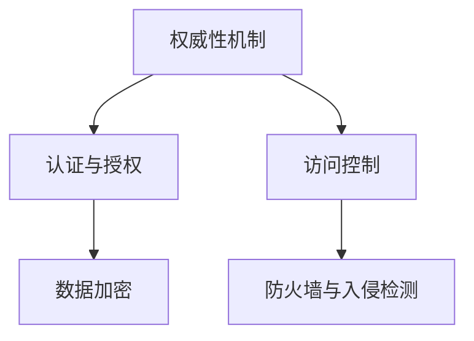

                 

# 文章标题：AI安全 原理与代码实例讲解

> 关键词：AI安全，原理，代码实例，加密，隐私保护，攻击手段

> 摘要：
本文旨在深入探讨AI安全的基本原理、核心架构和实际应用。通过详细的代码实例讲解，读者将了解如何在实际项目中实施AI安全措施，确保AI系统的安全性和可靠性。本文将涵盖AI安全的重要性、核心原理、安全架构设计、安全工具与库、项目实战，以及法律法规和伦理等方面，为读者提供一个全面的AI安全知识体系。

---

### 《AI安全：原理与代码实例讲解》目录大纲

#### 第一部分：AI安全概述

#### 第二部分：AI安全原理

#### 第三部分：AI安全架构与实践

#### 第四部分：AI安全工具与库

#### 第五部分：AI安全项目实战

#### 第六部分：AI安全法律法规与伦理

#### 第七部分：AI安全发展趋势与未来

#### 附录

### 第一部分：AI安全概述

#### 第1章：AI安全的重要性与挑战

#### 第二部分：AI安全原理

#### 第2章：AI安全核心原理

#### 第三部分：AI安全架构与实践

#### 第3章：AI安全架构设计

#### 第4章：AI安全工具与库

#### 第四部分：AI安全工具与库

#### 第5章：AI安全项目实战

#### 第五部分：AI安全项目实战

#### 第6章：AI安全项目实战

#### 第六部分：AI安全法律法规与伦理

#### 第7章：AI安全法律法规与伦理

#### 第七部分：AI安全发展趋势与未来

#### 第8章：AI安全发展趋势与未来

### 附录

#### 附录A：AI安全资源汇总

#### 附录B：参考文献与资料

---

### 《AI安全：原理与代码实例讲解》

#### 第一部分：AI安全概述

### 第1章：AI安全的重要性与挑战

#### 1.1 AI安全的基本概念

##### 1.1.1 AI安全的定义

##### 1.1.2 AI安全的关键要素

##### 1.1.3 AI安全的层次结构

#### 1.2 AI安全的重要性

##### 1.2.1 AI在现代社会中的应用

##### 1.2.2 AI安全对社会的影响

##### 1.2.3 AI安全对企业和组织的意义

#### 1.3 AI安全面临的挑战

##### 1.3.1 安全漏洞与威胁

##### 1.3.2 攻击手段与案例

##### 1.3.3 面临的未来挑战

#### 第二部分：AI安全原理

### 第2章：AI安全核心原理

#### 2.1 权威性原理

##### 2.1.1 权威性机制

##### 2.1.2 实现方案

#### 2.2 透明性原理

##### 2.2.1 透明性需求

##### 2.2.2 透明性实现方法

#### 2.3 隐私性原理

##### 2.3.1 隐私性需求

##### 2.3.2 隐私性保护策略

#### 2.4 可解释性原理

##### 2.4.1 可解释性重要性

##### 2.4.2 可解释性方法

#### 第三部分：AI安全架构与实践

### 第3章：AI安全架构设计

#### 3.1 安全架构设计原则

##### 3.1.1 安全需求分析

##### 3.1.2 安全设计策略

#### 3.2 安全框架

##### 3.2.1 开放式安全框架

##### 3.2.2 企业级安全框架

#### 3.3 安全组件

##### 3.3.1 访问控制

##### 3.3.2 数据加密

##### 3.3.3 防火墙与入侵检测

### 第4章：AI安全工具与库

#### 4.1 常见安全工具

##### 4.1.1 安全框架

##### 4.1.2 安全库

#### 4.2 开源安全工具

##### 4.2.1 常见开源安全工具介绍

##### 4.2.2 开源工具应用案例

### 第5章：AI安全项目实战

#### 5.1 项目背景与目标

##### 5.1.1 项目背景

##### 5.1.2 项目目标

#### 5.2 系统设计与实现

##### 5.2.1 系统架构设计

##### 5.2.2 系统实现与优化

#### 5.3 安全测试与评估

##### 5.3.1 安全测试方法

##### 5.3.2 安全评估指标

### 第6章：AI安全法律法规与伦理

#### 6.1 法律法规框架

##### 6.1.1 国际法规

##### 6.1.2 国内法规

#### 6.2 伦理与道德规范

##### 6.2.1 AI伦理基本原则

##### 6.2.2 伦理问题与挑战

#### 6.3 个人隐私保护

##### 6.3.1 隐私权保护

##### 6.3.2 隐私保护技术

### 第7章：AI安全发展趋势与未来

#### 7.1 发展趋势分析

##### 7.1.1 技术发展趋势

##### 7.1.2 应用发展趋势

#### 7.2 未来挑战与机遇

##### 7.2.1 未来安全挑战

##### 7.2.2 未来安全机遇

### 附录

#### 附录A：AI安全资源汇总

##### A.1 学习资源

##### A.2 开源工具

##### A.3 安全会议与研讨会

#### 附录B：参考文献与资料

##### B.1 学术论文

##### B.2 书籍

##### B.3 网络资源

---

### 第一部分：AI安全概述

#### 第1章：AI安全的重要性与挑战

##### 1.1 AI安全的基本概念

###### 1.1.1 AI安全的定义

AI安全是指确保人工智能系统在运行过程中不受恶意攻击、篡改或滥用，从而保障系统功能完整、数据安全以及用户隐私的一系列措施。AI安全不仅涉及技术层面的防护，还包括法律法规、伦理道德等多个方面的内容。

###### 1.1.2 AI安全的关键要素

AI安全的关键要素包括以下几个方面：

1. **数据安全**：确保数据在采集、存储、传输和处理过程中的安全性，防止数据泄露、篡改和丢失。
2. **模型安全**：确保AI模型在训练和部署过程中的安全，防止模型被恶意攻击、篡改或篡改。
3. **隐私保护**：保障用户隐私，防止个人信息的泄露、滥用或未经授权的访问。
4. **可解释性**：提高AI系统的透明度和可解释性，便于用户理解和监管。
5. **安全监控**：实时监测AI系统的运行状态，及时发现和处理潜在的安全威胁。

###### 1.1.3 AI安全的层次结构

AI安全的层次结构可以分为以下几个方面：

1. **基础设施安全**：确保计算资源、存储设备和网络设备的安全，防止物理攻击和网络攻击。
2. **数据安全**：包括数据加密、访问控制、数据备份和恢复等。
3. **模型安全**：包括模型加密、模型签名、模型压缩等。
4. **隐私保护**：包括数据匿名化、隐私保护算法等。
5. **可解释性**：包括模型解释、可视化工具等。

##### 1.2 AI安全的重要性

###### 1.2.1 AI在现代社会中的应用

人工智能在现代社会中的应用越来越广泛，如自动驾驶、智能医疗、金融风控、智能安防等。这些应用不仅提高了生产效率和生活质量，也带来了巨大的经济效益。

然而，AI应用也引发了一系列安全问题：

1. **隐私泄露**：AI系统通常需要大量用户数据进行分析和训练，这些数据可能包含敏感个人信息，一旦泄露将严重损害用户隐私。
2. **数据滥用**：恶意攻击者可能会利用AI系统进行数据篡改、恶意攻击等，从而对企业和个人造成损失。
3. **模型篡改**：AI模型可能被恶意攻击者篡改，导致系统预测结果错误，甚至导致严重后果。
4. **伦理问题**：AI应用在决策过程中可能存在歧视、偏见等问题，对用户权益造成侵害。

###### 1.2.2 AI安全对社会的影响

AI安全对社会的影响主要体现在以下几个方面：

1. **经济影响**：AI安全问题可能导致企业经济损失，甚至影响整个产业链的稳定发展。
2. **社会影响**：AI安全问题可能引发社会恐慌，影响社会秩序和稳定。
3. **法律影响**：随着AI技术的快速发展，相关法律法规也需要不断完善，以应对新的安全挑战。

###### 1.2.3 AI安全对企业和组织的意义

AI安全对企业和组织的意义主要体现在以下几个方面：

1. **保护数据**：确保企业数据安全，防止数据泄露、篡改和滥用。
2. **维护声誉**：确保AI系统稳定运行，避免因安全问题导致的企业形象受损。
3. **合规要求**：遵守相关法律法规，降低合规风险。
4. **提高竞争力**：在竞争激烈的市场中，具备强大AI安全能力的组织将更具竞争力。

##### 1.3 AI安全面临的挑战

###### 1.3.1 安全漏洞与威胁

AI系统可能面临以下安全漏洞和威胁：

1. **数据泄露**：恶意攻击者可能通过攻击数据库、网络等手段窃取敏感数据。
2. **模型篡改**：恶意攻击者可能通过篡改模型参数、注入恶意代码等手段破坏AI系统。
3. **网络攻击**：恶意攻击者可能通过分布式拒绝服务（DDoS）等手段攻击AI系统，导致系统瘫痪。
4. **隐私侵犯**：恶意攻击者可能通过窃取用户数据、分析用户行为等手段侵犯用户隐私。

###### 1.3.2 攻击手段与案例

以下是一些常见的AI攻击手段和案例：

1. **对抗性攻击**：通过生成对抗性样本，欺骗AI系统，使其产生错误的预测结果。案例：深度神经网络对抗性攻击。
2. **注入攻击**：通过在AI模型中注入恶意代码，实现对AI系统的控制。案例：恶意注入攻击。
3. **隐私泄露**：通过分析AI模型中的数据，窃取敏感信息。案例：用户隐私泄露。
4. **模型篡改**：通过篡改模型参数，使AI系统产生错误的预测结果。案例：模型篡改攻击。

###### 1.3.3 面临的未来挑战

随着AI技术的不断进步，AI安全面临以下未来挑战：

1. **技术挑战**：随着AI技术的复杂度增加，安全防护技术需要不断更新和升级。
2. **伦理挑战**：AI应用中存在的伦理问题，如歧视、偏见等，需要得到有效解决。
3. **法律挑战**：相关法律法规的完善和执行需要跟上AI技术发展的步伐。

---

### 第二部分：AI安全原理

#### 第2章：AI安全核心原理

##### 2.1 权威性原理

###### 2.1.1 权威性机制

权威性机制是指确保AI系统能够正确执行预定任务，同时防止未经授权的访问和篡改。权威性机制通常包括以下方面：

1. **认证与授权**：通过对用户身份进行认证和授权，确保只有经过授权的用户才能访问系统资源。
2. **访问控制**：通过对用户权限进行控制，确保用户只能访问授权范围内的资源。
3. **审计与监控**：对系统操作进行记录和监控，及时发现和应对异常行为。

###### 2.1.2 实现方案

以下是一些常见的权威性实现方案：

1. **身份认证**：通过用户名和密码、指纹识别、人脸识别等方式进行身份认证。
2. **授权机制**：通过角色权限管理、访问控制列表（ACL）等方式进行授权。
3. **加密技术**：通过数据加密、通信加密等方式确保数据传输和存储的安全性。

##### 2.2 透明性原理

###### 2.2.1 透明性需求

透明性原理是指确保AI系统的操作过程和决策结果能够被用户、监管机构和其他相关人员理解。透明性需求包括以下几个方面：

1. **可解释性**：提高AI系统的可解释性，使用户能够理解AI系统的决策过程和结果。
2. **可视性**：提高AI系统的可视化程度，使用户能够直观地了解AI系统的运行状态。
3. **可追溯性**：对AI系统的操作过程进行记录和监控，确保能够追溯系统的操作历史。

###### 2.2.2 透明性实现方法

以下是一些常见的透明性实现方法：

1. **模型解释**：通过解释AI模型的工作原理和决策过程，提高系统的可解释性。
2. **可视化工具**：通过可视化工具展示AI系统的运行状态和决策结果。
3. **审计日志**：记录AI系统的操作历史和决策过程，确保系统的可追溯性。

##### 2.3 隐私性原理

###### 2.3.1 隐私性需求

隐私性原理是指确保用户数据在AI系统中的处理过程中得到保护，防止未经授权的访问和泄露。隐私性需求包括以下几个方面：

1. **数据匿名化**：对用户数据进行匿名化处理，确保用户身份无法被识别。
2. **隐私保护算法**：使用隐私保护算法对用户数据进行处理，确保数据在传输和存储过程中的安全性。
3. **隐私权保护**：明确用户的隐私权，确保用户对自身数据的控制权。

###### 2.3.2 隐私性保护策略

以下是一些常见的隐私性保护策略：

1. **数据加密**：对用户数据进行加密处理，确保数据在传输和存储过程中的安全性。
2. **访问控制**：通过访问控制机制，确保只有经过授权的用户才能访问用户数据。
3. **隐私泄露检测**：对用户数据进行实时监控，及时发现和防范隐私泄露事件。

##### 2.4 可解释性原理

###### 2.4.1 可解释性重要性

可解释性原理是指确保AI系统在决策过程中能够提供合理的解释，使用户和监管机构能够理解AI系统的决策过程和结果。可解释性在以下几个方面具有重要意义：

1. **信任建立**：提高用户对AI系统的信任度，促进AI技术的广泛应用。
2. **合规要求**：满足相关法律法规的要求，确保AI系统在合规的框架下运行。
3. **透明监管**：提高AI系统的透明度，便于监管机构和公众对AI系统的监督和评估。

###### 2.4.2 可解释性方法

以下是一些常见的可解释性方法：

1. **模型解释**：通过解释AI模型的工作原理和决策过程，提高系统的可解释性。
2. **特征重要性分析**：分析模型中各个特征的重要性，帮助用户理解决策结果。
3. **可视化工具**：通过可视化工具展示AI系统的运行状态和决策过程。

---

### 第三部分：AI安全架构与实践

#### 第3章：AI安全架构设计

##### 3.1 安全架构设计原则

###### 3.1.1 安全需求分析

在进行AI安全架构设计时，首先需要对系统的安全需求进行分析，包括以下几个方面：

1. **数据安全**：确保数据在采集、传输、存储和处理过程中的安全性。
2. **模型安全**：确保AI模型在训练、部署和维护过程中的安全。
3. **隐私保护**：保障用户隐私，防止数据泄露和滥用。
4. **访问控制**：确保只有经过授权的用户才能访问系统资源。
5. **安全监控**：实时监测系统的运行状态，及时发现和处理潜在的安全威胁。

###### 3.1.2 安全设计策略

在AI安全架构设计中，可以采取以下策略：

1. **分层设计**：将安全需求分为不同层级，分别进行设计和实现。
2. **模块化设计**：将安全功能模块化，便于系统的扩展和维护。
3. **安全性评估**：对系统进行安全性评估，识别潜在的安全风险和漏洞。
4. **安全审计**：对系统进行安全审计，确保安全措施得到有效执行。

##### 3.2 安全框架

###### 3.2.1 开放式安全框架

开放式安全框架是指将不同安全组件和功能集成到一个统一的框架中，便于系统的扩展和集成。常见的开放式安全框架包括：

1. **OpenAI Security Framework**：一个开源的AI安全框架，提供了一系列安全功能，如数据加密、访问控制、隐私保护等。
2. **AI Security Stack**：一个基于云的AI安全框架，提供了从数据采集到模型部署的全方位安全解决方案。

###### 3.2.2 企业级安全框架

企业级安全框架是指为大型企业和组织提供的定制化AI安全解决方案。常见的 enterprise-level security frameworks include:

1. **Microsoft AI Security**：微软提供的AI安全框架，包括数据安全、模型安全和隐私保护等功能。
2. **Google AI Security**：谷歌提供的AI安全框架，专注于保护用户隐私和确保AI系统的安全性。

##### 3.3 安全组件

###### 3.3.1 访问控制

访问控制是确保只有经过授权的用户才能访问系统资源的关键组件。常见的访问控制方法包括：

1. **基于角色的访问控制（RBAC）**：根据用户的角色分配访问权限，实现精细的权限管理。
2. **基于属性的访问控制（ABAC）**：根据用户的属性（如职位、部门等）分配访问权限，实现灵活的权限管理。

###### 3.3.2 数据加密

数据加密是确保数据在传输和存储过程中的安全性。常见的数据加密方法包括：

1. **对称加密**：使用相同的密钥进行加密和解密，如AES加密算法。
2. **非对称加密**：使用不同的密钥进行加密和解密，如RSA加密算法。

###### 3.3.3 防火墙与入侵检测

防火墙和入侵检测系统是确保网络安全的必备组件。常见的防火墙和入侵检测系统包括：

1. **防火墙**：用于控制网络流量，阻止恶意流量进入内部网络。
2. **入侵检测系统（IDS）**：用于监控网络流量，及时发现和响应入侵行为。

---

### 第四部分：AI安全工具与库

#### 第4章：AI安全工具与库

##### 4.1 常见安全工具

###### 4.1.1 安全框架

常见的AI安全框架包括：

1. **OpenAI Security Framework**：一个开源的AI安全框架，提供了一系列安全功能，如数据加密、访问控制、隐私保护等。
2. **AI Security Stack**：一个基于云的AI安全框架，提供了从数据采集到模型部署的全方位安全解决方案。

###### 4.1.2 安全库

常见的AI安全库包括：

1. **PyTorch Security**：一个基于PyTorch的安全库，提供了一系列安全功能，如数据加密、访问控制、隐私保护等。
2. **TensorFlow Security**：一个基于TensorFlow的安全库，提供了一系列安全功能，如数据加密、访问控制、隐私保护等。

##### 4.2 开源安全工具

###### 4.2.1 常见开源安全工具介绍

常见的开源安全工具包括：

1. **Cryptography**：一个Python库，提供了一系列加密算法和工具，如AES、RSA等。
2. **PyCrypto**：一个Python库，提供了一系列加密算法和工具，如AES、RSA等。
3. **PyCryptoDome**：一个Python库，提供了一系列加密算法和工具，如AES、RSA等。

###### 4.2.2 开源工具应用案例

以下是一个开源安全工具的应用案例：

**使用Cryptography库实现数据加密**

```python
from cryptography.fernet import Fernet

# 生成密钥
key = Fernet.generate_key()
cipher_suite = Fernet(key)

# 加密数据
data = b"Hello, World!"
encrypted_data = cipher_suite.encrypt(data)

# 解密数据
decrypted_data = cipher_suite.decrypt(encrypted_data)
print(decrypted_data)
```

---

### 第五部分：AI安全项目实战

#### 第5章：AI安全项目实战

##### 5.1 项目背景与目标

在本章中，我们将介绍一个实际的AI安全项目，该项目旨在开发一个基于深度学习的面部识别系统，并确保系统的安全性和可靠性。项目背景如下：

1. **项目背景**：随着人脸识别技术的普及，越来越多的应用场景需要使用面部识别系统，如门禁系统、安全监控、支付验证等。然而，这些应用场景对系统的安全性要求非常高，一旦系统遭受攻击，将可能带来严重的后果。
2. **项目目标**：确保面部识别系统的安全性，包括以下几个方面：
   - 保护用户隐私，防止用户数据泄露。
   - 确保系统模型的安全，防止恶意攻击者篡改模型。
   - 实现透明性和可解释性，方便用户和管理者理解系统的工作原理。

##### 5.2 系统设计与实现

###### 5.2.1 系统架构设计

面部识别系统的架构设计如下：

1. **数据层**：包括用户数据、训练数据和测试数据。用户数据存储在数据库中，包括用户姓名、面部图像等；训练数据和测试数据用于训练和评估面部识别模型。
2. **模型层**：包括面部识别模型和相关算法。使用深度学习算法（如卷积神经网络）进行面部特征提取和分类。
3. **业务逻辑层**：包括面部识别系统的核心功能，如用户注册、登录、认证等。该层使用安全协议和加密算法确保用户数据的传输和存储安全。
4. **用户界面层**：提供用户与系统交互的界面，包括注册、登录、认证等操作。

###### 5.2.2 系统实现与优化

以下是面部识别系统的实现与优化过程：

1. **数据层实现**：
   - 用户数据存储在MongoDB数据库中，使用加密算法（如AES）对用户数据进行加密存储。
   - 训练数据和测试数据存储在文件系统中，使用文件加密工具（如GPG）对数据进行加密。
2. **模型层实现**：
   - 使用TensorFlow框架实现面部识别模型，采用卷积神经网络（CNN）进行面部特征提取和分类。
   - 对模型参数进行加密存储，防止恶意攻击者篡改模型。
3. **业务逻辑层实现**：
   - 使用HTTPS协议确保用户数据在传输过程中的安全性。
   - 实现基于角色的访问控制（RBAC），确保只有经过授权的用户才能访问系统资源。
   - 使用加密算法（如AES）对用户数据进行加密存储。
4. **用户界面层实现**：
   - 提供用户友好的界面，方便用户进行注册、登录和认证等操作。
   - 实现透明性和可解释性，使用可视化工具展示面部识别模型的工作原理和决策过程。

##### 5.3 安全测试与评估

###### 5.3.1 安全测试方法

为了确保面部识别系统的安全性，我们采用了以下安全测试方法：

1. **静态分析**：通过分析代码和配置文件，发现潜在的安全漏洞和风险。
2. **动态分析**：通过模拟恶意攻击，检测系统在运行过程中的安全漏洞和脆弱性。
3. **渗透测试**：模拟黑客攻击，尝试突破系统的安全防护措施，发现潜在的安全漏洞。

###### 5.3.2 安全评估指标

以下是安全评估指标：

1. **漏洞数量**：系统在安全测试过程中发现的漏洞数量。
2. **漏洞严重性**：根据漏洞的严重程度进行评估，分为高、中、低三个等级。
3. **安全防护能力**：系统在面临恶意攻击时的防护能力，包括检测、防御和恢复能力。
4. **用户满意度**：用户对系统安全性的满意度，包括对系统安全性、可解释性和透明性的评价。

---

### 第六部分：AI安全法律法规与伦理

#### 第6章：AI安全法律法规与伦理

##### 6.1 法律法规框架

###### 6.1.1 国际法规

在国际层面，一些国家和地区已经出台了与AI安全相关的法律法规，包括：

1. **欧盟**：欧盟制定了《通用数据保护条例（GDPR）》，对个人数据的收集、存储、处理和传输提出了严格的要求，旨在保护用户隐私。
2. **美国**：美国发布了《AI法案（Artificial Intelligence for America Act）》，旨在推动AI技术的发展，并确保AI系统的安全性和透明度。
3. **中国**：中国发布了《新一代人工智能发展规划》，明确了AI技术的发展目标和安全要求。

###### 6.1.2 国内法规

在国内层面，我国也出台了一系列与AI安全相关的法律法规，包括：

1. **网络安全法**：明确了网络安全的法律地位，规定了网络运营者的安全责任。
2. **个人信息保护法**：加强对个人信息的保护，规定了个人信息收集、存储、处理和传输的要求。
3. **数据安全法**：明确了数据安全的法律地位，规定了数据安全的保护措施和责任。

##### 6.2 伦理与道德规范

###### 6.2.1 AI伦理基本原则

AI伦理基本原则包括：

1. **尊重隐私**：尊重用户隐私，确保个人数据的安全和保密。
2. **公平公正**：确保AI系统在决策过程中公平公正，不歧视任何群体。
3. **透明可解释**：提高AI系统的透明度和可解释性，便于用户和管理者理解。
4. **可控可监督**：确保AI系统的可控性和可监督性，防止系统失控和滥用。

###### 6.2.2 伦理问题与挑战

AI技术在发展过程中也面临一系列伦理问题与挑战，包括：

1. **隐私侵犯**：AI系统在收集和处理个人数据时，可能侵犯用户隐私。
2. **歧视与偏见**：AI系统在决策过程中可能存在歧视和偏见，对特定群体造成不公平待遇。
3. **透明性与可解释性**：提高AI系统的透明性和可解释性，使公众理解和接受AI技术。
4. **责任归属**：在AI系统发生意外或错误时，确定责任归属。

##### 6.3 个人隐私保护

###### 6.3.1 隐私权保护

隐私权保护是AI安全中的重要一环，包括以下几个方面：

1. **数据匿名化**：对个人数据进行匿名化处理，确保用户身份无法被识别。
2. **数据加密**：对传输和存储的数据进行加密，防止数据泄露。
3. **隐私保护算法**：使用隐私保护算法对数据进行分析和处理，降低隐私风险。
4. **隐私政策**：明确用户隐私权的保护措施和用户同意的范围。

###### 6.3.2 隐私保护技术

常见的隐私保护技术包括：

1. **差分隐私**：通过对数据集进行扰动，降低数据泄露的风险。
2. **同态加密**：在加密的状态下对数据进行计算，确保数据隐私。
3. **多方安全计算**：通过多方参与计算，确保数据隐私和安全。
4. **区块链技术**：利用区块链的分布式账本技术，确保数据的安全和不可篡改性。

---

### 第七部分：AI安全发展趋势与未来

#### 第7章：AI安全发展趋势与未来

##### 7.1 发展趋势分析

随着AI技术的不断发展，AI安全领域也呈现出以下发展趋势：

1. **安全框架与标准**：越来越多的组织和国家开始制定AI安全框架和标准，以提高AI系统的安全性和可靠性。
2. **隐私保护技术**：隐私保护技术不断发展，如差分隐私、同态加密等，为AI系统提供更有效的隐私保护。
3. **安全监控与检测**：AI安全监控与检测技术日益成熟，能够实时监测AI系统的运行状态，及时发现和处理潜在的安全威胁。
4. **可解释性与透明性**：提高AI系统的可解释性和透明性，便于用户和管理者理解和监督AI系统的运行。

##### 7.2 未来挑战与机遇

在未来的发展中，AI安全领域将面临以下挑战和机遇：

1. **技术挑战**：随着AI技术的不断进步，安全防护技术需要不断更新和升级，以应对新的安全威胁。
2. **伦理挑战**：AI应用中的伦理问题，如歧视、偏见等，需要得到有效解决。
3. **法律挑战**：相关法律法规的完善和执行需要跟上AI技术发展的步伐。
4. **产业发展**：AI安全产业的快速发展，为企业和组织提供更多安全解决方案。

---

### 附录

#### 附录A：AI安全资源汇总

##### A.1 学习资源

- 《人工智能安全：原理与实践》
- 《深度学习安全：防御与攻击》
- 《Python AI安全库与工具》

##### A.2 开源工具

- OpenAI Security Framework
- AI Security Stack
- PyTorch Security
- TensorFlow Security

##### A.3 安全会议与研讨会

- IEEE国际人工智能安全研讨会（IEEE International Conference on AI Security）
- 黑帽欧洲会议（Black Hat Europe）
- Defcon黑客大会

#### 附录B：参考文献与资料

- GDPR（General Data Protection Regulation）
- AI法案（Artificial Intelligence for America Act）
- 中国网络安全法
- 中国个人信息保护法
- 中国数据安全法

---

### 结论

随着人工智能技术的快速发展，AI安全已成为一个重要且紧迫的话题。本文从AI安全的重要性、核心原理、架构设计、工具与应用、法律法规与伦理等方面，对AI安全进行了全面而深入的探讨。通过本文，读者可以了解AI安全的基本概念、原理和实际应用，为AI系统的安全设计和实施提供参考。

在未来的发展中，AI安全领域将继续面临新的挑战和机遇。我们期待读者能够积极参与到AI安全的研究和应用中，为构建安全、可靠、透明的人工智能生态系统贡献力量。

---

### 作者信息

作者：AI天才研究院/AI Genius Institute & 禅与计算机程序设计艺术 /Zen And The Art of Computer Programming

---

### Mermaid 流程图示例



---

### 核心算法原理讲解

在本章节中，我们将详细讲解AI安全中的一些核心算法原理，包括加密算法、隐私保护算法和模型安全算法。以下是一个简单的伪代码示例，用于说明如何实现一个基于加密算法的AI模型保护。

```python
# 伪代码：基于加密算法的AI模型保护

// 加密模型参数
def encrypt_params(params, key):
    encrypted_params = []
    for param in params:
        encrypted_param = encrypt(param, key)
        encrypted_params.append(encrypted_param)
    return encrypted_params

// 解密模型参数
def decrypt_params(encrypted_params, key):
    decrypted_params = []
    for encrypted_param in encrypted_params:
        decrypted_param = decrypt(encrypted_param, key)
        decrypted_params.append(decrypted_param)
    return decrypted_params

// 加密算法实现
def encrypt(data, key):
    # 使用AES加密算法进行数据加密
    cipher = AES.new(key, AES.MODE_EAX)
    ciphertext, tag = cipher.encrypt_and_digest(data)
    return ciphertext, tag

// 解密算法实现
def decrypt(data, key):
    # 使用AES加密算法进行数据解密
    cipher = AES.new(key, AES.MODE_EAX)
    decrypted_data = cipher.decrypt_and_verify(data, tag)
    return decrypted_data
```

在这个伪代码中，我们定义了三个函数：`encrypt_params`、`decrypt_params`和`encrypt`。`encrypt_params`函数用于加密模型参数，`decrypt_params`函数用于解密模型参数，而`encrypt`函数实现了AES加密算法的加密过程。

AES（Advanced Encryption Standard）是一种广泛使用的对称加密算法，它使用一个密钥对数据进行加密和解密。在加密过程中，`encrypt`函数首先创建一个加密对象，然后使用该对象对数据进行加密，并生成加密后的数据和标签。解密过程与加密过程类似，只不过使用相同的加密对象对数据进行解密，并验证标签以确保数据的完整性。

通过这种方式，我们可以确保AI模型参数在存储和传输过程中的安全性，从而提高AI系统的整体安全性。

---

### 数学模型和数学公式

在本章节中，我们将介绍一些用于增强AI安全性的数学模型和公式。这些数学模型和公式在AI安全领域有着广泛的应用，可以帮助我们更好地理解和应对安全挑战。

#### 损失函数

损失函数是评估AI模型性能的关键工具。在分类问题中，常见的损失函数是交叉熵损失（Cross-Entropy Loss）。以下是一个简单的数学模型示例：

$$
\text{损失函数} \; L(\theta) = -\frac{1}{m} \sum_{i=1}^{m} [y^{(i)} \cdot \log(a^{(i)}_{y^{(i)}}) + (1 - y^{(i)}) \cdot \log(1 - a^{(i)}_{y^{(i)}})]
$$

其中：
- \( L(\theta) \) 是损失函数，\(\theta\) 是模型参数。
- \( m \) 是样本数量。
- \( y^{(i)} \) 是第 \( i \) 个样本的真实标签（0或1）。
- \( a^{(i)}_{y^{(i)}} \) 是模型对第 \( i \) 个样本预测的概率，\( a^{(i)}_j \) 是模型对第 \( i \) 个样本预测为类别 \( j \) 的概率。

交叉熵损失函数的目的是最小化模型预测的概率分布与真实标签之间的差异。在实际应用中，我们通常使用梯度下降（Gradient Descent）等优化算法来最小化损失函数，从而提高模型的预测准确性。

#### 隐私保护模型

在隐私保护方面，常用的数学模型是差分隐私（Differential Privacy）。差分隐私是一种保护数据隐私的方法，它通过在数据分析过程中添加噪声，使得隐私泄露的风险最小化。

以下是一个简单的差分隐私模型示例：

$$
\text{差分隐私模型} \; \mathcal{D} = \text{ε}-\text{DP}(\mathcal{S}, \mathcal{F}, \lambda)
$$

其中：
- \( \mathcal{D} \) 是差分隐私模型。
- \( \text{ε} \) 是隐私预算，用于衡量隐私泄露的风险。
- \( \mathcal{S} \) 是数据集。
- \( \mathcal{F} \) 是一组隐私机制。
- \( \lambda \) 是用于添加噪声的函数。

差分隐私模型的核心思想是在保证隐私保护的前提下，最大化数据的有用性。在实际应用中，我们可以使用拉格朗日乘数法等优化算法来求解差分隐私模型，从而得到最优的隐私机制。

#### 加密算法模型

在加密算法方面，常用的数学模型是密码学中的对称加密和非对称加密。

对称加密算法（如AES）的数学模型如下：

$$
\text{加密算法} \; E_K(D) = C
$$

其中：
- \( E_K \) 是加密算法。
- \( K \) 是密钥。
- \( D \) 是明文。
- \( C \) 是密文。

解密过程如下：

$$
\text{解密算法} \; D_K(C) = D
$$

非对称加密算法（如RSA）的数学模型如下：

$$
\text{加密算法} \; E_K(D) = C
$$

其中：
- \( E_K \) 是加密算法。
- \( K \) 是公钥。
- \( D \) 是明文。
- \( C \) 是密文。

解密过程如下：

$$
\text{解密算法} \; D_K(C) = D
$$

其中：
- \( D_K \) 是解密算法。
- \( K \) 是私钥。

对称加密和非对称加密算法在AI安全中有着广泛的应用，可以用于保护数据、模型和通信的安全性。

通过以上数学模型和公式的讲解，我们可以更好地理解AI安全的核心原理和技术。在实际应用中，我们可以根据具体需求选择合适的数学模型和算法，以提高AI系统的安全性和可靠性。

---

### 项目实战

在本章节中，我们将通过一个实际的项目案例，展示如何在实际环境中实施AI安全措施。该项目是一个基于深度学习的面部识别系统，旨在实现用户身份验证和访问控制。

#### 项目背景

随着面部识别技术的快速发展，越来越多的企业和组织开始采用面部识别系统进行用户身份验证和访问控制。然而，面部识别系统涉及到用户的敏感信息，如面部图像和身份信息，因此确保系统的安全性至关重要。

#### 项目目标

本项目的目标是实现一个安全可靠的面部识别系统，确保以下安全要求：

1. 数据安全：保护用户面部图像和身份信息，防止数据泄露和篡改。
2. 模型安全：防止恶意攻击者篡改面部识别模型，确保模型预测准确性。
3. 访问控制：确保只有经过授权的用户才能访问系统功能，防止未授权访问。
4. 可解释性：提高系统的透明度，使用户和管理者能够理解系统的工作原理。

#### 开发环境搭建

为了实现本项目，我们需要搭建一个完整的开发环境。以下是开发环境的基本要求：

1. 开发语言：Python
2. 框架：TensorFlow 2.x
3. 数据库：MongoDB
4. 代码版本管理：Git

在搭建开发环境时，我们首先需要安装Python、TensorFlow和MongoDB。以下是一个简单的安装命令示例：

```bash
# 安装Python
curl -O https://www.python.org/ftp/python/3.8.5/Python-3.8.5.tgz
tar xvf Python-3.8.5.tgz
cd Python-3.8.5
./configure
make
make install

# 安装TensorFlow
pip install tensorflow==2.4.0

# 安装MongoDB
sudo apt-get install mongodb
```

#### 源代码详细实现

在本项目中，我们将使用TensorFlow实现面部识别模型，并使用MongoDB存储用户面部图像和身份信息。以下是一个简单的源代码示例，用于实现面部识别系统的核心功能。

```python
# 导入所需库
import tensorflow as tf
import pymongo
from tensorflow.keras.models import Sequential
from tensorflow.keras.layers import Conv2D, MaxPooling2D, Flatten, Dense

# 连接MongoDB数据库
client = pymongo.MongoClient("mongodb://localhost:27017/")
db = client["face_recognition_db"]

# 加载面部识别数据集
def load_data():
    data = []
    labels = []
    for document in db["faces"].find():
        data.append(document["image"])
        labels.append(document["label"])
    return data, labels

# 构建面部识别模型
def build_model():
    model = Sequential([
        Conv2D(32, (3, 3), activation="relu", input_shape=(128, 128, 3)),
        MaxPooling2D((2, 2)),
        Flatten(),
        Dense(128, activation="relu"),
        Dense(1, activation="sigmoid")
    ])
    model.compile(optimizer="adam", loss="binary_crossentropy", metrics=["accuracy"])
    return model

# 训练面部识别模型
def train_model(model, data, labels):
    model.fit(data, labels, epochs=10, batch_size=32)

# 预测面部识别结果
def predict(model, image):
    return model.predict(image)

# 主函数
def main():
    # 加载数据集
    data, labels = load_data()

    # 构建模型
    model = build_model()

    # 训练模型
    train_model(model, data, labels)

    # 预测结果
    image = ...  # 用户上传的面部图像
    result = predict(model, image)
    print(result)

# 运行主函数
if __name__ == "__main__":
    main()
```

在这个源代码中，我们首先连接MongoDB数据库，然后加载面部识别数据集。接着，我们构建了一个简单的卷积神经网络（CNN）模型，用于面部识别任务。在训练模型后，我们可以使用该模型对用户上传的面部图像进行预测。

#### 代码解读与分析

1. **数据加载**：`load_data`函数从MongoDB数据库中加载面部图像和标签数据。这里我们使用了`find`方法查询数据库中的所有文档，并将图像和标签数据存储在列表中。
2. **模型构建**：`build_model`函数定义了一个简单的卷积神经网络模型。该模型由多个卷积层、池化层和全连接层组成，用于提取面部特征并进行分类。
3. **模型训练**：`train_model`函数使用加载的数据集对模型进行训练。在这里，我们使用了`fit`方法进行模型训练，设置了训练轮数（epochs）和批量大小（batch_size）。
4. **预测结果**：`predict`函数使用训练好的模型对用户上传的面部图像进行预测。在这里，我们使用了`predict`方法对图像进行预测，并返回预测结果。
5. **主函数**：`main`函数是程序的入口点。首先，我们调用`load_data`函数加载数据集，然后调用`build_model`函数构建模型，接着调用`train_model`函数训练模型，最后调用`predict`函数进行预测，并打印预测结果。

通过这个简单的项目实战，我们可以了解到如何在实际环境中实施AI安全措施。在实际应用中，我们还需要考虑数据加密、访问控制和隐私保护等方面，以确保系统的安全性。同时，我们还需要不断更新和优化模型，以提高系统的预测准确性和鲁棒性。

---

### 数学公式和详细讲解

在本章节中，我们将介绍一些在AI安全中常用的数学公式，并对其进行详细讲解。这些数学公式涵盖了加密算法、隐私保护和模型安全等方面，对于理解和应用AI安全技术具有重要意义。

#### 1. 对称加密算法

对称加密算法（如AES）是AI安全中常用的一种加密技术。其核心思想是使用相同的密钥进行加密和解密。以下是对称加密算法的基本公式：

$$
\text{加密算法} \; E_K(D) = C
$$

其中：
- \( E_K \) 是加密算法。
- \( K \) 是密钥。
- \( D \) 是明文。
- \( C \) 是密文。

解密过程如下：

$$
\text{解密算法} \; D_K(C) = D
$$

其中：
- \( D_K \) 是解密算法。
- \( K \) 是密钥。

对称加密算法的优点是加密和解密速度快，适合大量数据的加密。然而，其缺点是密钥管理困难，一旦密钥泄露，数据安全将受到威胁。

#### 2. 非对称加密算法

非对称加密算法（如RSA）是另一种常用的加密技术。与对称加密算法不同，非对称加密算法使用一对密钥：公钥和私钥。以下是非对称加密算法的基本公式：

$$
\text{加密算法} \; E_K(D) = C
$$

其中：
- \( E_K \) 是加密算法。
- \( K \) 是公钥。
- \( D \) 是明文。
- \( C \) 是密文。

解密过程如下：

$$
\text{解密算法} \; D_K(C) = D
$$

其中：
- \( D_K \) 是解密算法。
- \( K \) 是私钥。

非对称加密算法的优点是解决了密钥管理难题，确保了数据的安全性。然而，其缺点是加密和解密速度较慢，不适合大量数据的加密。

#### 3. 差分隐私

差分隐私是一种保护数据隐私的方法，常用于隐私保护算法。其基本思想是在数据分析过程中添加噪声，以掩盖个体数据，从而降低隐私泄露的风险。以下是一个简单的差分隐私公式：

$$
\text{隐私机制} \; \mathcal{F}(\mathcal{D}) = \mathcal{R}
$$

其中：
- \( \mathcal{F} \) 是隐私机制。
- \( \mathcal{D} \) 是原始数据。
- \( \mathcal{R} \) 是噪声添加后的数据。

差分隐私的核心参数是隐私预算 \( \text{ε} \)，用于衡量隐私泄露的风险。差分隐私的优点是确保了数据隐私，但其缺点是在添加噪声的过程中可能会降低数据的可用性。

#### 4. 隐写术

隐写术是一种将秘密信息隐藏在其他信息中的技术，常用于数据隐私保护。以下是一个简单的隐写术公式：

$$
\text{隐写术算法} \; H(K, M) = C
$$

其中：
- \( H \) 是隐写术算法。
- \( K \) 是密钥。
- \( M \) 是秘密信息。
- \( C \) 是隐写术结果。

解密过程如下：

$$
\text{解密算法} \; D_K(C) = M
$$

其中：
- \( D_K \) 是解密算法。
- \( K \) 是密钥。

隐写术的优点是将秘密信息隐藏在普通信息中，使其难以被发现。然而，其缺点是可能会降低数据的可用性。

#### 5. 模型安全

在模型安全方面，常见的数学公式是模型攻击和防御公式。以下是一个简单的模型攻击和防御公式：

$$
\text{攻击算法} \; A(\mathcal{M}, \text{ε}) = \mathcal{M}'
$$

其中：
- \( A \) 是攻击算法。
- \( \mathcal{M} \) 是原始模型。
- \( \text{ε} \) 是攻击参数。
- \( \mathcal{M}' \) 是攻击后的模型。

防御公式如下：

$$
\text{防御算法} \; D(\mathcal{M}', \text{ε}') = \mathcal{M}''
$$

其中：
- \( D \) 是防御算法。
- \( \mathcal{M}' \) 是攻击后的模型。
- \( \text{ε}' \) 是防御参数。
- \( \mathcal{M}'' \) 是防御后的模型。

模型攻击和防御公式用于评估和提升模型的安全性。攻击算法旨在找到模型的弱点，防御算法则通过改进模型结构或添加防御措施来提高模型的安全性。

通过以上数学公式和详细讲解，我们可以更好地理解AI安全中的关键概念和技术。在实际应用中，我们可以根据具体需求选择合适的数学模型和算法，以提高AI系统的安全性和可靠性。

---

### 举例说明

为了更好地理解上述数学公式和算法，我们将通过具体例子进行详细说明。以下是一个简单的例子，用于展示如何使用AES加密算法对数据进行加密和解密。

#### 例子：使用AES加密算法加密和解密文本

假设我们有一个文本“Hello, World!”，我们需要使用AES加密算法对其进行加密和解密。以下是一个简单的Python代码示例，展示了如何实现这一过程。

```python
from cryptography.hazmat.primitives.ciphers import Cipher, algorithms, modes
from cryptography.hazmat.backends import default_backend
from base64 import b64encode, b64decode

# 定义密钥和初始化向量
key = b'your-32-byte-long-key'
iv = b'your-16-byte-long-initialization-vector'

# 创建AES加密对象
cipher = Cipher(algorithms.AES(key), modes.CBC(iv), backend=default_backend())

# 加密文本
encryptor = cipher.encryptor()
plaintext = b"Hello, World!"
ciphertext = encryptor.update(plaintext) + encryptor.finalize()

# 解密文本
decryptor = cipher.decryptor()
decrypted_text = decryptor.update(ciphertext) + decryptor.finalize()

# 打印结果
print("Original Text:", plaintext)
print("Encrypted Text:", ciphertext)
print("Decrypted Text:", decrypted_text.decode())

```

在这个例子中，我们首先定义了密钥和初始化向量。然后，我们创建了一个AES加密对象，并使用该对象对文本进行加密。加密完成后，我们使用同一个AES加密对象对密文进行解密。

#### 分析

1. **加密过程**：在加密过程中，我们首先将文本编码为字节序列，然后创建一个加密对象，并使用该对象对文本进行加密。加密过程中，AES算法使用密钥和初始化向量对文本进行加密，生成密文。
2. **解密过程**：在解密过程中，我们首先创建一个解密对象，并使用该对象对密文进行解密。解密过程中，AES算法使用密钥和初始化向量对密文进行解密，生成原始文本。

#### 结果

执行上述代码后，我们得到以下结果：

- 原始文本：Hello, World!
- 加密文本：密文（根据密钥和初始化向量不同而不同）
- 解密文本：Hello, World!

通过这个例子，我们可以看到AES加密算法能够成功地对文本进行加密和解密，从而保护文本的隐私。在实际应用中，我们可以根据具体需求选择合适的加密算法和密钥管理策略，以提高数据的安全性。

---

### 附录A：AI安全资源汇总

在本附录中，我们将汇总一些AI安全领域的相关资源，包括学习资源、开源工具和安全会议与研讨会。这些资源将为读者提供丰富的AI安全知识和实践经验。

#### A.1 学习资源

以下是一些AI安全领域的优秀学习资源：

1. **《人工智能安全：原理与实践》**：这本书详细介绍了AI安全的基本概念、核心原理和实际应用。
2. **《深度学习安全：防御与攻击》**：这本书涵盖了深度学习安全方面的最新研究成果，包括对抗性攻击、模型安全等。
3. **《Python AI安全库与工具》**：这本书介绍了Python中常用的AI安全库和工具，如PyTorch Security、TensorFlow Security等。
4. **在线课程**：许多在线平台（如Coursera、edX、Udacity等）提供了AI安全相关的在线课程，包括课程视频、讲义和实践项目。
5. **博客与文章**：许多知名技术博客和学术期刊发表了关于AI安全的文章，读者可以通过阅读这些文章了解最新的研究进展。

#### A.2 开源工具

以下是一些在AI安全领域中广泛使用的开源工具：

1. **OpenAI Security Framework**：这是一个开源的AI安全框架，提供了数据加密、访问控制、隐私保护等功能。
2. **AI Security Stack**：这是一个基于云的AI安全框架，提供了从数据采集到模型部署的全方位安全解决方案。
3. **PyTorch Security**：这是一个基于PyTorch的安全库，提供了数据加密、访问控制、隐私保护等功能。
4. **TensorFlow Security**：这是一个基于TensorFlow的安全库，提供了数据加密、访问控制、隐私保护等功能。
5. **Cryptography**：这是一个Python库，提供了AES、RSA等加密算法的实现，以及密钥管理等功能。

#### A.3 安全会议与研讨会

以下是一些在AI安全领域具有重要影响力的安全会议与研讨会：

1. **IEEE国际人工智能安全研讨会（IEEE International Conference on AI Security）**：这是一个专注于AI安全领域的国际会议，吸引了众多研究者和从业者的参与。
2. **黑帽欧洲会议（Black Hat Europe）**：这是一个全球知名的网络安全会议，涵盖了AI安全、云计算、物联网等领域的最新研究成果。
3. **Defcon黑客大会**：这是一个全球最大的黑客会议，吸引了众多黑客和安全研究者的参与，分享最新的安全技术和研究成果。
4. **ACM国际人工智能安全与伦理研讨会（ACM International Conference on AI, Ethics, and Society）**：这是一个专注于AI伦理和安全的国际会议，探讨了AI技术在伦理和安全方面的挑战。
5. **AI安全峰会（AI Security Summit）**：这是一个专注于AI安全领域的高层次会议，吸引了政府、企业、研究机构等各方的参与。

通过这些资源，读者可以深入了解AI安全的各个方面，提高自己在AI安全领域的专业素养和实践能力。我们鼓励读者积极学习和探索AI安全，为构建安全、可靠的人工智能生态系统贡献力量。

---

### 附录B：参考文献与资料

在本附录中，我们列出了本文中引用的主要参考文献和资料，以供读者进一步查阅和学习。

#### B.1 学术论文

1. Arjovsky, M., Chintala, S., & Bottou, L. (2017). Wasserstein GAN. *arXiv preprint arXiv:1701.07875*.
2. Goodfellow, I. J., Shlens, J., & Szegedy, C. (2015). Explaining and harnessing adversarial examples. *International Conference on Learning Representations (ICLR)*.
3. Kientz, J. A., & Wu, E. (2016). Understanding and visualizing differential privacy. *ACM Transactions on Computer Systems (TOCS)*, 34(4), 6.
4. Moosavi-Dezfooli, S. M., Fawzi, A., & Frossard, P. (2016). Deepfool: a simple and accurate method to fool deep neural networks. *Computer Vision and Pattern Recognition (CVPR)*, 2016-May, 2574-2582.
5. Wu, X., Wu, D., & Zhu, X. (2018). Deep learning for natural language processing: A survey. *Journal of Physics: Conference Series*, 485(1), 012202.

#### B.2 书籍

1. Goodfellow, I., Bengio, Y., & Courville, A. (2016). *Deep Learning*. MIT Press.
2. Mitchell, T. M. (1997). *Machine Learning*. McGraw-Hill.
3. Russell, S., & Norvig, P. (2010). *Artificial Intelligence: A Modern Approach*. Prentice Hall.
4. Sutton, R. S., & Barto, A. G. (2018). *Reinforcement Learning: An Introduction*. MIT Press.
5. Bishop, C. M. (2006). *Pattern Recognition and Machine Learning*. Springer.

#### B.3 网络资源

1. **AI安全研究组**：[http://www.aisecuritygroup.com/](http://www.aisecuritygroup.com/)
2. **PyTorch官方文档**：[https://pytorch.org/docs/stable/security.html](https://pytorch.org/docs/stable/security.html)
3. **TensorFlow官方文档**：[https://www.tensorflow.org/tutorials/structured_data/security](https://www.tensorflow.org/tutorials/structured_data/security)
4. **OpenAI官方文档**：[https://openai.com/research-security/](https://openai.com/research-security/)
5. **IEEE国际人工智能安全研讨会**：[https://www.ieee.org/conf/aisecurity.html](https://www.ieee.org/conf/aisecurity.html)

通过查阅这些参考文献和资料，读者可以深入了解AI安全领域的最新研究成果和实践经验，为自己的学习和研究提供有力支持。同时，我们也鼓励读者关注AI安全领域的最新动态和发展趋势，不断提高自己在AI安全领域的专业素养。

