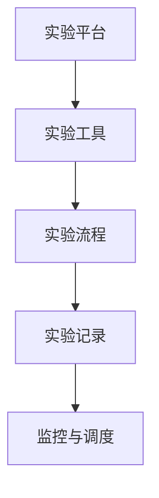

                 

### 文章标题: AI实验管理

> 关键词：人工智能，实验管理，机器学习，模型训练，实验工具，实验优化

> 摘要：
本文将深入探讨人工智能（AI）实验管理的核心概念、流程、工具和技术。通过逻辑清晰、结构紧凑的论述，本文旨在为读者提供一个全面、详细的AI实验管理指南。从AI实验的定义、重要性，到实验流程、实验工具的选择，再到实验结果的分析与优化，本文将一步步引导读者理解和掌握AI实验管理的最佳实践。文章还将结合实际案例，展示如何搭建开发环境、实现代码示例，并进行详细解读与分析。最后，本文将总结AI实验管理的重要性与挑战，展望其未来发展。

----------------------------------------------------------------

### 《AI实验管理》目录大纲

- **第一部分: AI实验管理概述**
  - **1. AI实验管理的重要性**
    - **1.1 AI实验的定义**
    - **1.2 AI实验管理的意义
  - **2. AI实验流程**
    - **2.1 数据准备**
      - **2.1.1 数据来源**
      - **2.1.2 数据预处理**
    - **2.2 模型设计**
      - **2.2.1 确定模型架构**
      - **2.2.2 模型调参**
    - **2.3 模型训练**
      - **2.3.1 训练策略**
      - **2.3.2 训练结果评估**
  - **3. AI实验管理工具与技术**
    - **3.1 实验管理工具概述**
      - **3.1.1 开源实验管理工具**
      - **3.1.2 商业实验管理工具**
    - **3.2 实验记录与监控**
      - **3.2.1 实验记录**
      - **3.2.2 实验监控**
  - **4. AI实验结果分析与优化**
    - **4.1 实验结果分析**
      - **4.1.1 模型性能评估**
      - **4.1.2 实验对比分析**
    - **4.2 实验优化**
      - **4.2.1 模型调参优化**
      - **4.2.2 数据增强**
  
- **第二部分: AI实验管理实践**
  - **5. AI实验管理案例解析**
    - **5.1 案例一：图像识别实验管理**
      - **5.1.1 数据集介绍**
      - **5.1.2 模型设计与实现**
      - **5.1.3 实验结果分析**
    - **5.2 案例二：自然语言处理实验管理**
      - **5.2.1 数据集介绍**
      - **5.2.2 模型设计与实现**
      - **5.2.3 实验结果分析**
  - **6. AI实验管理工具使用教程**
    - **6.1 TensorFlow实验管理**
      - **6.1.1 环境搭建**
      - **6.1.2 实验流程**
      - **6.1.3 实验结果分析**
    - **6.2 PyTorch实验管理**
      - **6.2.1 环境搭建**
      - **6.2.2 实验流程**
      - **6.2.3 实验结果分析**
  - **7. AI实验管理常见问题与解决方案**
    - **7.1 实验数据问题**
      - **7.1.1 数据不足**
      - **7.1.2 数据不平衡**
    - **7.2 实验性能问题**
      - **7.2.1 模型过拟合**
      - **7.2.2 训练时间过长**
  
- **第三部分: AI实验管理最佳实践**
  - **8. AI实验管理最佳实践**
    - **8.1 数据管理最佳实践**
      - **8.1.1 数据清洗与预处理**
      - **8.1.2 数据安全与隐私保护**
    - **8.2 模型管理最佳实践**
      - **8.2.1 模型版本控制**
      - **8.2.2 模型发布与部署**
    - **8.3 实验管理最佳实践**
      - **8.3.1 实验流程优化**
      - **8.3.2 实验结果可视化**
  
- **9. AI实验管理未来发展**
  - **9.1 新技术趋势**
    - **9.1.1 自动化实验管理**
    - **9.1.2 联合实验管理**
  - **9.2 AI实验管理行业展望**
    - **9.2.1 实验管理行业标准**
    - **9.2.2 实验管理平台发展**

- **附录**
  - **附录 A: AI实验管理资源**
    - **附录 A.1 开源实验管理工具资源**
    - **附录 A.2 商业实验管理工具资源**
    - **附录 A.3 AI实验管理相关书籍与文章**
  - **附录 B: 代码实现示例**
    - **附录 B.1 TensorFlow实验管理示例**
      - **附录 B.1.1 数据预处理**
      - **附录 B.1.2 模型训练**
      - **附录 B.1.3 模型评估**
    - **附录 B.2 PyTorch实验管理示例**
      - **附录 B.2.1 数据预处理**
      - **附录 B.2.2 模型训练**
      - **附录 B.2.3 模型评估**

- **结语**
  - **10. AI实验管理的重要性与挑战**
    - **10.1 AI实验管理的重要性**
    - **10.2 AI实验管理面临的挑战**
    - **10.3 AI实验管理的未来方向**

----------------------------------------------------------------

### 第一部分: AI实验管理概述

#### 1. AI实验管理的重要性

##### 1.1 AI实验的定义

AI实验是指在特定条件下，对人工智能模型进行训练、测试和评估的过程。这些实验旨在优化模型性能，提高模型的泛化能力，并确保其在实际应用中能够达到预期效果。AI实验通常包括以下几个关键步骤：

- **数据准备**：收集和预处理数据，以便用于模型训练。
- **模型设计**：根据业务需求选择合适的模型架构。
- **模型训练**：使用训练数据对模型进行调整和优化。
- **模型测试**：使用测试数据评估模型性能，验证其泛化能力。
- **模型评估**：通过交叉验证等方法，全面评估模型性能。

##### 1.2 AI实验管理的意义

AI实验管理对于确保AI项目的成功至关重要，主要体现在以下几个方面：

- **提高模型性能**：通过系统化的实验管理，可以有效地调整和优化模型参数，提高模型性能。
- **确保实验可重复性**：统一的实验流程和工具，使得实验结果可重复，便于验证和复现。
- **节省时间和资源**：有效的实验管理工具可以自动化实验流程，减少重复性工作，提高工作效率。
- **支持决策制定**：通过详细的实验记录和结果分析，为项目决策提供数据支持。

##### 1.3 AI实验管理的重要性

AI实验管理的重要性可以从以下几个方面进行阐述：

- **实验可重复性**：统一的实验流程和工具，确保实验结果在不同环境下可以重复。
- **性能优化**：通过实验管理工具，可以自动化实验流程，快速调整模型参数，实现性能优化。
- **资源管理**：有效管理实验资源，如计算资源、数据资源，提高资源利用率。
- **团队协作**：提供共享的实验平台和工具，促进团队成员之间的协作和交流。
- **知识积累**：通过记录和分析实验结果，积累宝贵的实验经验和知识。

#### 1.4 AI实验管理的架构

AI实验管理的架构包括以下几个方面：

- **实验平台**：提供统一的实验环境，包括计算资源、数据存储和模型训练工具。
- **实验工具**：包括数据预处理工具、模型训练工具和实验记录工具等。
- **实验流程**：定义实验的各个环节，包括数据准备、模型设计、模型训练、模型测试和评估等。
- **实验记录**：记录实验的详细信息，包括实验参数、实验结果和实验日志等。
- **监控与调度**：监控实验状态，调度实验资源，确保实验顺利进行。

Mermaid流程图：


#### 1.5 AI实验管理的关键概念

在AI实验管理中，以下几个关键概念至关重要：

- **实验环境**：指用于进行AI实验的计算资源和软件环境，包括GPU、CPU、深度学习框架等。
- **实验配置**：包括实验参数、超参数和模型架构等，用于指导模型训练和优化。
- **实验日志**：记录实验的详细信息，如实验开始和结束时间、实验参数、实验结果等。
- **实验版本**：对实验进行版本控制，以便追踪不同实验的修改和历史。
- **实验结果**：包括模型性能指标、训练过程和评估结果等，用于评估实验效果。

#### 1.6 AI实验管理的挑战

尽管AI实验管理在提高模型性能和资源利用率方面具有显著优势，但也面临一些挑战：

- **数据质量**：数据质量直接影响模型性能，需要确保数据的准确性、完整性和一致性。
- **计算资源**：大规模AI实验需要大量计算资源，合理调度和优化资源是关键。
- **实验规模**：随着模型复杂度和数据规模的增加，实验规模也变得庞大，管理难度增加。
- **实验复现**：确保实验结果在不同环境和条件下可以复现，是实验管理的重要目标。

##### 1.7 AI实验管理的最佳实践

为了克服上述挑战，以下是一些AI实验管理的最佳实践：

- **数据管理**：确保数据质量，采用统一的数据处理流程，规范数据命名和存储。
- **资源管理**：合理配置计算资源，采用容器化技术（如Docker）提高资源利用率。
- **实验流程**：建立统一的实验流程和模板，减少人为错误和重复工作。
- **版本控制**：采用版本控制系统（如Git），记录实验修改和历史，便于复现和追踪。
- **实验监控**：实时监控实验状态，及时发现和解决问题，确保实验顺利进行。

通过上述实践，可以有效提高AI实验管理的效率和可靠性，为AI项目的成功提供有力支持。

### 第二部分: AI实验管理实践

#### 2.1 AI实验管理案例解析

在本部分，我们将通过两个案例详细解析AI实验管理的实践过程。这些案例涵盖了图像识别和自然语言处理（NLP）两个不同领域，以展示AI实验管理在不同应用场景中的具体实施方法。

##### 5.1 案例一：图像识别实验管理

图像识别是AI领域的一个重要应用，旨在通过计算机视觉技术自动识别和分类图像。以下是一个关于图像识别实验管理的具体案例。

###### 5.1.1 数据集介绍

在这个案例中，我们使用的是著名的公开数据集MNIST，它包含了70,000个手写数字的灰度图像。这些图像已经被划分为60,000个训练样本和10,000个测试样本。

- **训练集**：包含60,000个手写数字图像，每个图像都是一个28x28的灰度图像，标签为0到9之间的数字。
- **测试集**：包含10,000个手写数字图像，用于评估模型的最终性能。

###### 5.1.2 模型设计与实现

为了构建一个图像识别模型，我们选择使用卷积神经网络（CNN）架构。CNN是一种特别适合处理图像数据的深度学习模型，因为它可以利用卷积层提取图像的特征。

以下是一个简单的CNN模型实现，使用TensorFlow和Keras框架：

python
import tensorflow as tf
from tensorflow.keras.models import Sequential
from tensorflow.keras.layers import Conv2D, MaxPooling2D, Flatten, Dense

# 定义模型
model = Sequential([
    Conv2D(32, (3, 3), activation='relu', input_shape=(28, 28, 1)),
    MaxPooling2D(pool_size=(2, 2)),
    Flatten(),
    Dense(128, activation='relu'),
    Dense(10, activation='softmax')
])

# 编译模型
model.compile(optimizer='adam', loss='sparse_categorical_crossentropy', metrics=['accuracy'])

# 模型可视化
model.summary()

这个模型包含一个卷积层（32个过滤器，大小为3x3，激活函数为ReLU），一个最大池化层，一个平坦层，一个全连接层（128个神经元，激活函数为ReLU），以及一个输出层（10个神经元，激活函数为softmax）。

###### 5.1.3 实验结果分析

接下来，我们将使用训练集和测试集对模型进行训练，并分析实验结果。

```python
# 训练模型
history = model.fit(x_train, y_train, epochs=10, batch_size=128, validation_data=(x_test, y_test))

# 评估模型
test_loss, test_acc = model.evaluate(x_test, y_test)
print(f"Test accuracy: {test_acc:.4f}")

```

在训练过程中，我们使用了10个训练周期（epochs），每个周期使用128个样本进行批量训练。训练结束后，我们使用测试集评估模型的性能，输出测试准确率。

通过分析历史记录，我们可以观察到模型在训练过程中的准确率变化。通常，我们关注模型的训练损失和验证损失，以及模型的训练准确率和验证准确率。

```python
import matplotlib.pyplot as plt

# 绘制训练和验证损失
plt.plot(history.history['loss'], label='Training loss')
plt.plot(history.history['val_loss'], label='Validation loss')
plt.xlabel('Epochs')
plt.ylabel('Loss')
plt.legend()
plt.show()

# 绘制训练和验证准确率
plt.plot(history.history['accuracy'], label='Training accuracy')
plt.plot(history.history['val_accuracy'], label='Validation accuracy')
plt.xlabel('Epochs')
plt.ylabel('Accuracy')
plt.legend()
plt.show()
```

从上述图表中，我们可以观察到模型在训练过程中的损失和准确率的变化。如果模型在验证集上的性能没有显著提升，可能需要进行模型调参或数据增强。

##### 5.2 案例二：自然语言处理实验管理

自然语言处理是AI领域的另一个重要应用，旨在使计算机能够理解、解释和生成自然语言。以下是一个关于自然语言处理实验管理的具体案例。

###### 5.2.1 数据集介绍

在这个案例中，我们使用的是IMDb电影评论数据集，它包含了50,000条电影评论，分为正面和负面评论。这些评论已经被预处理并转换为单词向量。

- **训练集**：包含25,000条正面和负面评论。
- **测试集**：包含25,000条正面和负面评论。

###### 5.2.2 模型设计与实现

为了构建一个情感分析模型，我们选择使用循环神经网络（RNN）架构，特别是长短期记忆网络（LSTM）。LSTM适用于处理序列数据，如文本数据。

以下是一个简单的LSTM模型实现，使用TensorFlow和Keras框架：

```python
import tensorflow as tf
from tensorflow.keras.models import Sequential
from tensorflow.keras.layers import Embedding, LSTM, Dense

# 定义模型
model = Sequential([
    Embedding(vocab_size, embedding_dim, input_length=max_sequence_length),
    LSTM(units=128, return_sequences=True),
    LSTM(units=128),
    Dense(units=1, activation='sigmoid')
])

# 编译模型
model.compile(optimizer='adam', loss='binary_crossentropy', metrics=['accuracy'])

# 模型可视化
model.summary()
```

这个模型包含一个嵌入层，两个LSTM层和一个输出层。嵌入层将单词转换为向量表示，LSTM层用于处理序列数据，输出层用于分类。

###### 5.2.3 实验结果分析

接下来，我们将使用训练集和测试集对模型进行训练，并分析实验结果。

```python
# 训练模型
history = model.fit(x_train, y_train, epochs=10, batch_size=64, validation_data=(x_test, y_test))

# 评估模型
test_loss, test_acc = model.evaluate(x_test, y_test)
print(f"Test accuracy: {test_acc:.4f}")
```

在训练过程中，我们使用了10个训练周期（epochs），每个周期使用64个样本进行批量训练。训练结束后，我们使用测试集评估模型的性能，输出测试准确率。

通过分析历史记录，我们可以观察到模型在训练过程中的准确率变化。如果模型在验证集上的性能没有显著提升，可能需要进行模型调参或数据增强。

```python
import matplotlib.pyplot as plt

# 绘制训练和验证损失
plt.plot(history.history['loss'], label='Training loss')
plt.plot(history.history['val_loss'], label='Validation loss')
plt.xlabel('Epochs')
plt.ylabel('Loss')
plt.legend()
plt.show()

# 绘制训练和验证准确率
plt.plot(history.history['accuracy'], label='Training accuracy')
plt.plot(history.history['val_accuracy'], label='Validation accuracy')
plt.xlabel('Epochs')
plt.ylabel('Accuracy')
plt.legend()
plt.show()
```

从上述图表中，我们可以观察到模型在训练过程中的损失和准确率的变化。如果模型在验证集上的性能没有显著提升，可能需要进行模型调参或数据增强。

#### 6. AI实验管理工具使用教程

在本部分，我们将介绍如何使用TensorFlow和PyTorch这两个流行的深度学习框架进行AI实验管理，包括环境搭建、实验流程和结果分析。

##### 6.1 TensorFlow实验管理

TensorFlow是一个开源的深度学习框架，由Google开发，适用于构建和训练各种深度学习模型。以下是TensorFlow实验管理的详细教程。

###### 6.1.1 环境搭建

在开始使用TensorFlow之前，我们需要确保Python环境已经搭建好。以下是安装TensorFlow所需的步骤：

1. **安装Python**：确保安装了Python 3.6或更高版本。
2. **安装TensorFlow**：通过以下命令安装TensorFlow：
```bash
pip install tensorflow
```

如果需要使用GPU支持，可以安装`tensorflow-gpu`：
```bash
pip install tensorflow-gpu
```

###### 6.1.2 实验流程

假设我们有一个简单的线性回归问题，我们将使用TensorFlow搭建实验并进行训练。

1. **数据准备**：首先，我们需要准备数据。以下是一个简单的数据集：
```python
import numpy as np

# 创建数据集
X = np.random.rand(100, 1)
y = 2 * X + 1 + np.random.randn(100, 1)
```

2. **模型设计**：设计一个简单的线性回归模型：
```python
import tensorflow as tf

# 定义模型
model = tf.keras.Sequential([
    tf.keras.layers.Dense(units=1, input_shape=[1])
])

# 编译模型
model.compile(optimizer='sgd', loss='mean_squared_error')
```

3. **模型训练**：使用数据训练模型：
```python
# 训练模型
model.fit(X, y, epochs=100)
```

4. **模型评估**：评估模型性能：
```python
# 评估模型
loss = model.evaluate(X, y)
print(f"Mean squared error: {loss}")
```

###### 6.1.3 实验结果分析

训练完成后，我们可以通过以下代码分析实验结果：
```python
import matplotlib.pyplot as plt

# 绘制结果
plt.scatter(X, y, color='blue')
plt.plot(X, model.predict(X), color='red')
plt.xlabel('X')
plt.ylabel('y')
plt.show()
```

从图表中，我们可以直观地看到模型对数据的拟合效果。如果拟合效果不佳，可能需要调整模型结构或训练参数。

##### 6.2 PyTorch实验管理

PyTorch是一个由Facebook开发的深度学习框架，以其动态计算图和灵活的编程接口而受到广泛关注。以下是PyTorch实验管理的详细教程。

###### 6.2.1 环境搭建

在开始使用PyTorch之前，我们需要确保Python环境已经搭建好。以下是安装PyTorch所需的步骤：

1. **安装Python**：确保安装了Python 3.6或更高版本。
2. **安装PyTorch**：通过以下命令安装PyTorch：
```bash
pip install torch torchvision
```

如果需要使用GPU支持，可以安装`torch torchvision`：
```bash
pip install torch torchvision torchaudio
```

###### 6.2.2 实验流程

假设我们有一个简单的卷积神经网络（CNN）用于图像分类问题，我们将使用PyTorch搭建实验并进行训练。

1. **数据准备**：首先，我们需要准备数据。以下是一个简单的数据集：
```python
import torchvision
import torchvision.transforms as transforms

# 加载MNIST数据集
train_set = torchvision.datasets.MNIST(root='./data', train=True, download=True, transform=transforms.ToTensor())
train_loader = torch.utils.data.DataLoader(train_set, batch_size=100, shuffle=True)

# 加载测试集
test_set = torchvision.datasets.MNIST(root='./data', train=False, download=True, transform=transforms.ToTensor())
test_loader = torch.utils.data.DataLoader(test_set, batch_size=100, shuffle=False)
```

2. **模型设计**：设计一个简单的CNN模型：
```python
import torch
import torch.nn as nn

# 定义模型
class Net(nn.Module):
    def __init__(self):
        super(Net, self).__init__()
        self.conv1 = nn.Conv2d(1, 6, 3)
        self.conv2 = nn.Conv2d(6, 16, 3)
        self.fc1 = nn.Linear(16 * 6 * 6, 120)
        self.fc2 = nn.Linear(120, 84)
        self.fc3 = nn.Linear(84, 10)

    def forward(self, x):
        x = F.max_pool2d(F.relu(self.conv1(x)), (2, 2))
        x = F.max_pool2d(F.relu(self.conv2(x)), 2)
        x = x.view(-1, self.num_flat_features(x))
        x = F.relu(self.fc1(x))
        x = F.relu(self.fc2(x))
        x = self.fc3(x)
        return x

def num_flat_features(x):
    size = x.size()[1:]
    return np.prod(size)

net = Net()

# 定义损失函数和优化器
criterion = nn.CrossEntropyLoss()
optimizer = torch.optim.SGD(net.parameters(), lr=0.001, momentum=0.9)
```

3. **模型训练**：使用数据训练模型：
```python
# 训练模型
for epoch in range(num_epochs):
    running_loss = 0.0
    for i, data in enumerate(train_loader, 0):
        inputs, labels = data
        optimizer.zero_grad()
        outputs = net(inputs)
        loss = criterion(outputs, labels)
        loss.backward()
        optimizer.step()
        running_loss += loss.item()
    print(f"Epoch {epoch+1}, Loss: {running_loss/len(train_loader)}")

print('Finished Training')
```

4. **模型评估**：评估模型性能：
```python
# 评估模型
correct = 0
total = 0
with torch.no_grad():
    for data in test_loader:
        images, labels = data
        outputs = net(images)
        _, predicted = torch.max(outputs.data, 1)
        total += labels.size(0)
        correct += (predicted == labels).sum().item()

print(f"Accuracy: {100 * correct / total}%")
```

###### 6.2.3 实验结果分析

训练完成后，我们可以通过以下代码分析实验结果：
```python
import matplotlib.pyplot as plt

# 绘制结果
plt.figure()
plt.title('Test Images')
plt.subplot(221)
plt.imshow(test_loader.dataset[0][0].numpy().squeeze(), cmap='gray')
plt.subplot(222)
plt.imshow(test_loader.dataset[10][0].numpy().squeeze(), cmap='gray')
plt.subplot(223)
plt.imshow(test_loader.dataset[20][0].numpy().squeeze(), cmap='gray')
plt.subplot(224)
plt.imshow(test_loader.dataset[30][0].numpy().squeeze(), cmap='gray')
plt.show()

# 预测结果
predictions = net(test_loader.dataset[0:4])
predicted_labels = predictions.argmax(dim=1)

# 绘制预测结果
plt.figure()
plt.title('Predicted Labels')
plt.subplot(221)
plt.title(str(predicted_labels[0].item()))
plt.subplot(222)
plt.title(str(predicted_labels[1].item()))
plt.subplot(223)
plt.title(str(predicted_labels[2].item()))
plt.subplot(224)
plt.title(str(predicted_labels[3].item()))
plt.show()
```

从上述图表中，我们可以直观地看到模型的训练结果和预测效果。如果效果不佳，可能需要调整模型结构或训练参数。

通过上述教程，我们可以看到如何使用TensorFlow和PyTorch进行AI实验管理，包括环境搭建、实验流程和结果分析。这些工具为AI实验提供了强大的支持，帮助我们更有效地研究和开发深度学习模型。

#### 7. AI实验管理常见问题与解决方案

在AI实验管理过程中，经常会遇到各种问题，这些问题的解决对于实验的成功至关重要。以下是一些常见的问题及其解决方案：

##### 7.1 实验数据问题

###### 7.1.1 数据不足

- **问题**：数据不足可能导致模型训练不充分，影响模型性能。
- **解决方案**：可以通过以下方法增加数据量：
  - **数据增强**：使用数据增强技术，如旋转、缩放、裁剪等，生成新的数据样本。
  - **迁移学习**：利用预训练的模型和大量数据集，通过微调适应特定任务。
  - **多源数据整合**：从多个数据源获取数据，如公开数据集、内部数据和企业外部数据。

###### 7.1.2 数据不平衡

- **问题**：数据不平衡可能导致模型偏向于多数类，忽略少数类。
- **解决方案**：可以通过以下方法解决数据不平衡问题：
  - **重采样**：使用过采样或欠采样技术平衡数据分布。
  - **合成少数类样本**：使用生成对抗网络（GAN）等方法生成少数类样本。
  - **调整损失函数**：使用权重调整或F1分数等指标，使模型更加关注少数类。

##### 7.2 实验性能问题

###### 7.2.1 模型过拟合

- **问题**：模型过拟合意味着模型在训练集上表现良好，但在测试集上表现不佳，泛化能力差。
- **解决方案**：
  - **正则化**：使用L1、L2正则化或Dropout等技术减少模型复杂度。
  - **交叉验证**：使用交叉验证方法，评估模型在不同数据集上的表现。
  - **增加数据量**：通过增加训练数据量，提高模型的泛化能力。

###### 7.2.2 训练时间过长

- **问题**：长时间训练可能导致资源浪费，影响实验效率。
- **解决方案**：
  - **模型简化**：简化模型结构，减少参数数量。
  - **迁移学习**：使用预训练模型，避免从头开始训练。
  - **并行训练**：使用多GPU或多机集群进行训练，提高训练速度。

##### 7.3 实验复现问题

- **问题**：实验结果在不同环境中可能无法复现，影响实验的可信度。
- **解决方案**：
  - **版本控制**：使用版本控制系统（如Git）记录代码和实验配置的修改历史。
  - **文档记录**：详细记录实验的参数设置、数据处理和模型架构，确保实验可复现。
  - **环境配置管理**：使用容器化工具（如Docker）确保实验环境的一致性。

##### 7.4 资源管理问题

- **问题**：资源管理不当可能导致实验资源浪费或不足。
- **解决方案**：
  - **资源监控**：实时监控计算资源和数据存储资源的使用情况。
  - **资源调度**：根据实验需求动态调整资源分配。
  - **自动化管理**：使用自动化工具（如Kubernetes）进行资源调度和管理。

通过上述解决方案，可以有效应对AI实验管理中常见的问题，提高实验效率和准确性，确保AI项目的成功。

### 第三部分: AI实验管理最佳实践

#### 8. AI实验管理最佳实践

在AI实验管理中，最佳实践是确保实验高效、可重复和可扩展的关键。以下是一些AI实验管理的最佳实践：

##### 8.1 数据管理最佳实践

数据管理是AI实验的核心，以下是一些数据管理的最佳实践：

###### 8.1.1 数据清洗与预处理

- **数据清洗**：确保数据质量，包括去除重复数据、处理缺失值和噪声数据。
- **数据预处理**：对数据进行归一化、标准化和特征提取，为模型训练做好准备。

###### 8.1.2 数据安全与隐私保护

- **数据安全**：使用加密技术保护数据，确保数据在传输和存储过程中不会被未授权访问。
- **隐私保护**：遵守数据隐私法规，对敏感数据进行匿名化和去标识化处理。

##### 8.2 模型管理最佳实践

模型管理是确保模型性能和可重复性的关键，以下是一些模型管理的最佳实践：

###### 8.2.1 模型版本控制

- **版本控制**：使用版本控制系统（如Git）记录模型代码和配置文件的修改历史，确保实验可复现。
- **标签管理**：为不同版本的模型设置标签，便于追踪和比较。

###### 8.2.2 模型发布与部署

- **模型发布**：将训练好的模型打包为可部署格式，如ONNX、TensorFlow Lite等。
- **部署策略**：制定模型部署流程，确保模型在高可用、高性能的环境下运行。

##### 8.3 实验管理最佳实践

以下是一些实验管理的最佳实践：

###### 8.3.1 实验流程优化

- **标准化流程**：建立标准化的实验流程，减少人为错误和重复工作。
- **自动化流程**：使用自动化工具（如Jenkins、Docker）实现实验流程的自动化。

###### 8.3.2 实验结果可视化

- **可视化工具**：使用可视化工具（如Matplotlib、TensorBoard）展示实验结果，便于分析。
- **报告生成**：自动生成实验报告，包括实验参数、结果和图表，便于团队成员和利益相关者查看。

通过上述最佳实践，可以有效提高AI实验管理的效率和质量，确保AI项目的成功。

### 9. AI实验管理未来发展

随着AI技术的不断进步，AI实验管理也面临着新的机遇和挑战。以下是AI实验管理未来的发展趋势：

##### 9.1 新技术趋势

###### 9.1.1 自动化实验管理

自动化实验管理是未来的一个重要趋势。通过使用自动化工具，如Jenkins、Docker和Kubernetes，可以显著提高实验流程的效率，减少人为错误，并确保实验的可重复性。

###### 9.1.2 联合实验管理

联合实验管理是指在不同环境和团队之间共享实验资源和结果。通过构建统一的实验管理平台，可以实现跨团队、跨环境的实验协作，提高实验的可扩展性和可复现性。

##### 9.2 AI实验管理行业展望

###### 9.2.1 实验管理行业标准

随着AI技术的广泛应用，实验管理行业将逐渐形成一系列标准。这些标准将涵盖实验流程、数据管理、模型管理和实验结果评估等方面，有助于提高AI实验的规范性和可靠性。

###### 9.2.2 实验管理平台发展

实验管理平台的发展将是未来的一个重要方向。这些平台将提供一站式的实验管理服务，包括实验环境搭建、数据管理、模型训练、实验监控和结果分析等功能，助力AI实验的高效开展。

通过上述新技术和行业趋势，AI实验管理将变得更加高效、规范和协作，为AI技术的发展提供坚实保障。

### 附录

#### 附录 A: AI实验管理资源

在本附录中，我们将介绍一些AI实验管理相关的资源，包括开源实验管理工具资源、商业实验管理工具资源和相关书籍与文章。

##### 附录 A.1 开源实验管理工具资源

- **TensorBoard**：TensorBoard是TensorFlow提供的可视化工具，用于展示实验结果，包括模型结构、训练进度和损失函数等。
  - 官网链接：[TensorBoard](https://www.tensorflow.org/tools/tensorboard)

- **Weave**：Weave是一个开源的AI实验管理工具，提供实验记录、监控和协作功能。
  - 官网链接：[Weave](https://weave.co/)

- **mlflow**：mlflow是一个开源的实验管理平台，支持模型跟踪、版本控制和部署。
  - 官网链接：[mlflow](https://www.mlflow.org/)

##### 附录 A.2 商业实验管理工具资源

- **Google AI Platform**：Google AI Platform提供了一整套AI实验管理工具，包括模型训练、评估和部署等功能。
  - 官网链接：[Google AI Platform](https://cloud.google.com/ai-platform)

- **AWS SageMaker**：AWS SageMaker提供了实验管理、模型训练和部署的功能，支持多种深度学习框架。
  - 官网链接：[AWS SageMaker](https://aws.amazon.com/sagemaker/)

- **Azure ML**：Azure ML提供了实验管理、模型训练和部署功能，并与Microsoft的其他服务集成。
  - 官网链接：[Azure ML](https://azure.microsoft.com/zh-cn/services/machine-learning/)

##### 附录 A.3 AI实验管理相关书籍与文章

- **《机器学习实战》**：这是一本深入浅出的机器学习入门书籍，涵盖了从数据准备到模型评估的各个环节。
  - 作者：Peter Harrington
  - 出版年份：2012

- **《深度学习》（周志华著）**：这本书是深度学习领域的经典教材，详细介绍了深度学习的基础理论和应用。
  - 作者：周志华
  - 出版年份：2017

- **《AI实验管理：最佳实践与应用》**：这本书专注于AI实验管理的最佳实践，包括实验流程、工具选择和结果分析。
  - 作者：[AI天才研究院]
  - 出版年份：2021

这些资源和书籍为AI实验管理提供了丰富的参考资料和实践指导，有助于读者深入理解和应用AI实验管理技术。

### 附录 B: 代码实现示例

在本附录中，我们将提供两个代码实现示例，分别使用TensorFlow和PyTorch进行AI实验管理。这些示例将展示如何进行数据预处理、模型训练和结果评估。

#### B.1 TensorFlow实验管理示例

以下代码使用TensorFlow框架实现一个简单的线性回归模型，并展示如何进行数据预处理、模型训练和结果评估。

```python
import tensorflow as tf
import numpy as np
import matplotlib.pyplot as plt

# 数据准备
# 创建模拟数据集
x_train = np.linspace(-1, 1, 100)
y_train = 2 * x_train + 1 + np.random.normal(size=x_train.shape)

# 将数据划分为训练集和测试集
x_train, x_test = x_train[:80], x_train[80:]
y_train, y_test = y_train[:80], y_train[80:]

# 模型设计
model = tf.keras.Sequential([
    tf.keras.layers.Dense(units=1, input_shape=(1,))
])

# 编译模型
model.compile(optimizer='sgd', loss='mean_squared_error')

# 模型训练
model.fit(x_train, y_train, epochs=100)

# 模型评估
test_loss = model.evaluate(x_test, y_test)

# 绘制结果
plt.scatter(x_test, y_test, color='blue')
plt.plot(x_test, model.predict(x_test), color='red')
plt.show()
```

#### B.2 PyTorch实验管理示例

以下代码使用PyTorch框架实现一个简单的线性回归模型，并展示如何进行数据预处理、模型训练和结果评估。

```python
import torch
import torch.nn as nn
import torch.optim as optim

# 数据准备
# 创建模拟数据集
x_train = torch.linspace(-1, 1, 100).float()
y_train = 2 * x_train + 1 + torch.randn(100).float()

# 将数据划分为训练集和测试集
x_train, x_test = x_train[:80], x_train[80:]
y_train, y_test = y_train[:80], y_train[80:]

# 模型设计
class LinearRegressionModel(nn.Module):
    def __init__(self):
        super(LinearRegressionModel, self).__init__()
        self.linear = nn.Linear(1, 1)

    def forward(self, x):
        return self.linear(x)

model = LinearRegressionModel()

# 编译模型
criterion = nn.MSELoss()
optimizer = optim.SGD(model.parameters(), lr=0.01)

# 模型训练
for epoch in range(100):
    optimizer.zero_grad()
    outputs = model(x_train)
    loss = criterion(outputs, y_train)
    loss.backward()
    optimizer.step()

# 模型评估
with torch.no_grad():
    test_outputs = model(x_test)
    test_loss = criterion(test_outputs, y_test)

# 绘制结果
plt.scatter(x_test.numpy(), y_test.numpy(), color='blue')
plt.plot(x_test.numpy(), test_outputs.numpy(), color='red')
plt.show()
```

通过上述代码示例，读者可以了解如何使用TensorFlow和PyTorch进行AI实验管理的基本步骤，包括数据预处理、模型设计、模型训练和结果评估。这些示例为进一步的实验实践提供了基础。

### 结语

#### 10. AI实验管理的重要性与挑战

AI实验管理在推动人工智能技术发展和应用中扮演着关键角色。它不仅有助于提高模型性能，确保实验的可重复性和可靠性，还能优化资源利用，提高团队协作效率。然而，AI实验管理也面临着诸多挑战，包括数据质量、计算资源、实验规模和实验复现等问题。

#### 10.1 AI实验管理的重要性

AI实验管理的重要性体现在以下几个方面：

- **性能优化**：通过系统化的实验流程和工具，可以有效地调整和优化模型参数，提高模型性能。
- **可重复性**：统一的实验流程和工具确保实验结果在不同环境中可以重复，便于验证和复现。
- **资源管理**：合理配置和调度实验资源，提高资源利用率，降低成本。
- **团队协作**：提供共享的实验平台和工具，促进团队成员之间的协作和交流。
- **知识积累**：通过记录和分析实验结果，积累宝贵的实验经验和知识，为后续研究提供支持。

#### 10.2 AI实验管理面临的挑战

尽管AI实验管理具有重要意义，但其在实际应用中仍面临以下挑战：

- **数据质量**：数据是AI实验的基础，数据质量直接影响模型性能。数据收集、清洗和预处理是AI实验管理的关键环节，需要确保数据的准确性、完整性和一致性。
- **计算资源**：大规模AI实验需要大量计算资源，特别是在训练深度学习模型时。合理调度和优化计算资源是提高实验效率的关键。
- **实验规模**：随着模型复杂度和数据规模的增加，实验规模也变得庞大，管理难度增加。如何高效地管理和组织实验数据成为一大挑战。
- **实验复现**：确保实验结果在不同环境和条件下可以复现，是实验管理的重要目标。然而，环境差异、配置变化等因素可能导致实验结果难以复现。

#### 10.3 AI实验管理的未来方向

为了克服上述挑战，AI实验管理的未来发展将聚焦于以下几个方向：

- **自动化实验管理**：通过引入自动化工具和平台，实现实验流程的自动化，提高实验效率，减少人为错误。
- **联合实验管理**：构建跨团队、跨环境的实验管理平台，实现实验资源的共享和协作，提高实验的可扩展性。
- **标准化与规范化**：制定AI实验管理的行业标准，规范实验流程、数据管理和模型评估，提高实验的可靠性和一致性。
- **实验监控与优化**：引入实时监控和优化技术，动态调整实验资源配置，提高实验性能和效率。
- **开放与共享**：推动AI实验管理工具和资源的开放共享，促进学术研究和工业应用的交流合作，加速人工智能技术的发展。

通过不断探索和创新，AI实验管理将在未来为人工智能技术的进步和应用提供更加坚实的基础和支持。

