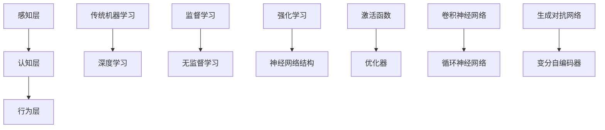

                 

# AI技术栈的全面解析

## 关键词

- **人工智能技术栈**
- **深度学习**
- **机器学习**
- **自然语言处理**
- **计算机视觉**
- **强化学习**

## 摘要

本文旨在全面解析AI技术栈，涵盖从基础概念到应用实践的各个方面。我们将详细探讨AI技术的历史发展、核心算法、自然语言处理、计算机视觉、强化学习，以及AI伦理与社会责任。此外，文章还将介绍AI技术栈的开发与优化策略，并通过实际项目案例展示AI技术的应用。通过这篇文章，读者将获得对AI技术栈的全面理解和深入洞察。

## 目录大纲

### 第一部分：AI技术概述与理论基础

1. AI技术基本概念与历史发展
   1.1 AI基本概念
   1.2 AI技术的重要性与影响
   1.3 AI技术的未来趋势

2. AI核心算法与模型
   2.1 传统机器学习算法
   2.2 深度学习基本概念
   2.3 常见深度学习模型

3. 自然语言处理
   3.1 语言模型与文本分析
   3.2 问答系统与对话生成
   3.3 语音识别与自然语言生成

4. 计算机视觉
   4.1 图像处理基础
   4.2 目标检测与识别
   4.3 3D重建与姿态估计

5. 强化学习应用
   5.1 强化学习基本理论
   5.2 强化学习在游戏中的应用
   5.3 强化学习在其他领域的应用

6. AI伦理与社会责任
   6.1 AI伦理问题
   6.2 AI社会责任
   6.3 法律法规与政策

7. AI技术栈的开发与优化
   7.1 AI技术栈构建
   7.2 模型优化与压缩
   7.3 实时性优化

8. AI项目实战
   8.1 项目规划与设计
   8.2 数据收集与预处理
   8.3 模型开发与训练
   8.4 项目部署与维护

### 附录

- 附录A：常用AI工具与库
- 附录B：参考文献

### 第一部分：AI技术概述与理论基础

## 1. AI技术基本概念与历史发展

### 1.1 AI基本概念

人工智能（Artificial Intelligence，简称AI）是指通过计算机程序实现的智能行为，旨在使计算机系统具备人类智能的特性，如学习、推理、解决问题、理解自然语言等。AI可以分为弱AI和强AI。弱AI指的是在特定领域内表现出智能行为的系统，如语音识别、图像识别等；强AI则是指具有全面智能能力的系统，能够超越人类在各个领域的表现。

### 1.2 AI发展历程

AI的发展可以分为以下几个阶段：

- **早期探索阶段（1940s-1950s）**：以图灵测试的提出和逻辑理论机的研制为代表，标志着人工智能概念的诞生。
- **第一次AI繁荣期（1956-1974）**：以达特茅斯会议的召开为起点，AI开始受到广泛关注。然而，由于算法和计算资源的限制，这一时期的AI研究很快陷入低谷。
- **第二次AI繁荣期（1980-1987）**：专家系统的出现带来了AI的第二次繁荣。专家系统是一种模拟人类专家决策能力的计算机程序，能够处理复杂的问题。
- **AI衰退期（1987-1993）**：由于专家系统的局限性以及计算资源的限制，AI研究再次陷入低谷。
- **AI复兴期（1993-2012）**：机器学习特别是深度学习的出现，使得AI研究重新焕发生机。深度学习通过模拟人脑的神经网络结构，实现了在图像识别、语音识别等领域的突破。
- **AI全盛期（2012至今）**：深度学习在计算机视觉、自然语言处理等领域的成功应用，使得AI技术逐渐渗透到各个行业。

### 1.3 AI技术的层次结构

AI技术可以按照功能分为以下几个层次：

- **感知层**：包括图像识别、语音识别、自然语言处理等，主要实现对外部信息的感知和理解。
- **认知层**：包括知识表示、推理、规划等，主要实现信息的处理和决策。
- **行为层**：包括机器人控制、自动化系统等，主要实现对外部环境的响应和行动。

### 1.4 AI技术的重要性与影响

AI技术的重要性体现在以下几个方面：

- **技术进步**：AI技术的进步推动了计算机科学的不断发展，为其他领域提供了强大的技术支持。
- **社会影响**：AI技术在医疗、金融、教育、交通等领域的应用，提高了行业效率，改善了人们的生活质量。
- **经济贡献**：AI技术已经成为推动经济增长的重要力量，为各行各业带来了新的商业模式和机遇。

### 1.5 AI技术的未来趋势

AI技术的未来趋势可以从以下几个方面来展望：

- **智能化**：随着算法和计算能力的提升，AI系统将越来越智能化，能够更好地模拟人类智能行为。
- **泛在化**：AI技术将逐渐渗透到各个领域，实现全面智能化。
- **自主化**：未来的AI系统将具备更强的自主决策能力，能够在复杂环境中自主运行。
- **伦理化**：随着AI技术的应用越来越广泛，AI伦理问题将越来越受到重视，需要建立相应的法律法规和道德准则。

## 2. AI核心算法与模型

### 2.1 传统机器学习算法

传统机器学习算法主要包括以下几种：

- **监督学习**：通过已标记的训练数据学习特征和标签之间的映射关系，实现对未知数据的分类或回归。
  - **线性回归**：通过最小二乘法找到最佳拟合直线，用于预测连续值。
  - **逻辑回归**：通过最大似然估计找到最佳拟合曲线，用于预测概率。
- **无监督学习**：在未标记的数据中寻找结构和模式，用于降维、聚类等。
  - **K-均值聚类**：通过迭代优化目标函数，将数据划分为K个簇。
  - **主成分分析（PCA）**：通过线性变换将高维数据映射到低维空间，保留主要信息。
- **强化学习**：通过与环境交互，学习最优策略以最大化累积奖励。
  - **Q-学习**：通过更新Q值表，找到最优动作序列。
  - **策略梯度**：通过优化策略参数，找到最优策略。

### 2.2 深度学习基本概念

深度学习是一种基于多层神经网络的学习方法，其核心思想是通过多层非线性变换提取特征。

- **神经网络结构**：神经网络由输入层、隐藏层和输出层组成，各层神经元之间通过权重连接。
- **激活函数**：用于引入非线性特性，常见的有sigmoid、ReLU、Tanh等。
- **优化器**：用于调整网络权重，常见的有梯度下降、Adam、RMSProp等。

### 2.3 常见深度学习模型

深度学习模型在计算机视觉、自然语言处理等领域取得了显著成果。以下是一些常见的深度学习模型：

- **卷积神经网络（CNN）**：通过卷积层提取图像特征，适用于图像分类、目标检测等。
- **循环神经网络（RNN）**：通过循环结构处理序列数据，适用于文本分类、机器翻译等。
- **生成对抗网络（GAN）**：通过对抗训练生成逼真的数据，适用于图像生成、风格迁移等。
- **变分自编码器（VAE）**：通过概率模型编码和解码数据，适用于数据生成和降维。

### 2.4 核心概念与联系

#### Mermaid流程图



### 2.5 核心算法原理讲解

#### 监督学习算法

- **线性回归伪代码**：

```python
def linear_regression(x, y):
    # 初始化权重
    w = np.random.randn(1)
    
    # 梯度下降
    for i in range(num_iterations):
        # 前向传播
        z = x * w
        
        # 反向传播
        dw = -(2/m) * (z - y)
        
        # 更新权重
        w -= learning_rate * dw
        
    return w
```

#### 深度学习模型

- **卷积神经网络伪代码**：

```python
class ConvolutionalNeuralNetwork:
    def __init__(self):
        # 初始化网络结构
        self.layers = []

    def add_layer(self, layer):
        # 添加层
        self.layers.append(layer)

    def forward_pass(self, x):
        # 前向传播
        for layer in self.layers:
            x = layer.forward(x)
        return x

    def backward_pass(self, x, y):
        # 反向传播
        for layer in reversed(self.layers):
            x = layer.backward(x, y)
        return x
```

### 2.6 数学模型和公式

- **线性回归公式**：

$$
y = \beta_0 + \beta_1x
$$

- **卷积神经网络公式**：

$$
\mathbf{h}^{(l)} = \sigma\left( \mathbf{W}^{(l)} \mathbf{h}^{(l-1)} + \mathbf{b}^{(l)} \right)
$$

### 2.7 项目实战

#### 开发环境搭建

- **Python环境**：安装Python 3.8及以上版本。
- **库和框架**：安装TensorFlow、NumPy、Matplotlib等库。

```bash
pip install tensorflow numpy matplotlib
```

#### 源代码实现

```python
import tensorflow as tf
import numpy as np

# 定义线性回归模型
model = tf.keras.Sequential([
    tf.keras.layers.Dense(units=1, input_shape=[1])
])

# 编译模型
model.compile(optimizer='sgd', loss='mean_squared_error')

# 训练模型
x_train = np.array([1, 2, 3, 4, 5])
y_train = np.array([1, 2, 2.5, 3.5, 4])

model.fit(x_train, y_train, epochs=100)

# 测试模型
x_test = np.array([6])
y_pred = model.predict(x_test)

print("预测结果：", y_pred)
```

#### 代码解读与分析

- **模型定义**：使用`tf.keras.Sequential`创建一个序列模型，添加一个全连接层。
- **编译模型**：设置优化器和损失函数。
- **训练模型**：使用训练数据训练模型。
- **测试模型**：使用测试数据预测结果。

### 第二部分：自然语言处理

自然语言处理（Natural Language Processing，NLP）是人工智能的重要分支，致力于使计算机能够理解、生成和处理人类自然语言。NLP在信息检索、机器翻译、情感分析、问答系统等领域具有广泛应用。

#### 3.1 语言模型与文本分析

语言模型是NLP的核心组成部分，用于预测自然语言中的下一个单词或字符。常用的语言模型包括：

- **n-gram模型**：基于单词或字符的前n个历史序列来预测下一个单词或字符。
- **神经网络语言模型**：通过神经网络结构对大规模语料库进行建模，如双向长短期记忆网络（BiLSTM）。

文本分析包括文本预处理、词嵌入、语义分析等步骤。

- **文本预处理**：去除标点符号、停用词、进行词形还原等。
- **词嵌入**：将单词映射到高维空间，常用的词嵌入技术有Word2Vec、GloVe等。
- **语义分析**：通过对文本进行深度分析，提取出文本的含义和情感。

#### 3.2 问答系统与对话生成

问答系统旨在使计算机能够回答用户的问题。问答系统可以分为基于规则的方法和基于机器学习的方法。

- **基于规则的方法**：通过预定义的规则和模板来匹配用户问题和答案。
- **基于机器学习的方法**：通过训练模型从大规模数据中学习问题的答案。

对话生成是NLP的另一个重要应用，旨在生成自然流畅的对话。对话生成可以分为基于模板的方法和基于生成模型的方法。

- **基于模板的方法**：通过预定义的模板和参数来生成对话。
- **基于生成模型的方法**：通过生成模型如循环神经网络（RNN）、生成对抗网络（GAN）等生成对话。

#### 3.3 语音识别与自然语言生成

语音识别是将语音信号转换为文本的技术，涉及语音信号处理、声学模型和语言模型。

- **语音信号处理**：对语音信号进行预处理，如去噪、增强、分帧等。
- **声学模型**：用于建模语音信号中的声学特征，如隐马尔可夫模型（HMM）、深度神经网络（DNN）。
- **语言模型**：用于建模语音信号中的语言结构，如n-gram模型、神经网络语言模型。

自然语言生成（Natural Language Generation，NLG）是计算机生成自然语言的过程，广泛应用于自动问答、机器翻译、文本摘要等。

- **文本摘要**：通过提取关键信息生成简洁的文本摘要。
- **对话系统**：通过生成自然流畅的对话与用户交互。

### 第三部分：计算机视觉

计算机视觉是人工智能的另一个重要分支，旨在使计算机能够理解和处理图像和视频。计算机视觉在图像识别、目标检测、人脸识别、自动驾驶等领域具有广泛应用。

#### 4.1 图像处理基础

图像处理是计算机视觉的基础，涉及图像数据结构、图像增强、图像降质等。

- **图像数据结构**：图像由像素点组成，像素点的颜色信息通常以RGB（红、绿、蓝）格式表示。
- **图像增强**：通过调整图像的对比度、亮度、色彩等，提高图像的质量和清晰度。
- **图像降质**：通过添加噪声、模糊、压缩等操作，模拟不同的图像质量。

#### 4.2 目标检测与识别

目标检测是计算机视觉的核心任务之一，旨在从图像中识别出目标并定位其位置。常用的目标检测算法有：

- **R-CNN**：通过选择性搜索（Selective Search）生成候选区域，然后使用分类器进行目标检测。
- **Fast R-CNN**：简化了R-CNN的结构，通过共享卷积特征减少计算量。
- **Faster R-CNN**：引入了区域建议网络（Region Proposal Network，RPN），进一步提高了检测速度。

目标识别是计算机视觉的另一个重要任务，旨在从图像中识别出特定目标。常用的目标识别算法有：

- **SVM**：支持向量机（Support Vector Machine）是一种常用的分类算法，可以用于目标识别。
- **CNN**：卷积神经网络（Convolutional Neural Network）可以通过学习图像的特征来识别目标。

#### 4.3 3D重建与姿态估计

3D重建是将二维图像转换为三维模型的过程，广泛应用于虚拟现实、增强现实和机器人视觉等领域。常用的3D重建算法有：

- **结构光扫描**：通过结构光投影和图像采集，重建物体的三维模型。
- **多视图立体重建**：通过多个视角的图像，利用几何关系和匹配算法重建物体的三维模型。

姿态估计是计算机视觉的另一个重要任务，旨在估计物体或人体的三维姿态。常用的姿态估计算法有：

- **深度学习**：通过训练深度神经网络，估计物体的三维姿态。
- **光流法**：通过分析图像序列中的像素运动，估计物体的三维姿态。

### 第四部分：强化学习应用

强化学习是一种机器学习范式，旨在通过与环境交互，学习最优策略以实现目标。强化学习在游戏、推荐系统、无人驾驶等领域具有广泛应用。

#### 5.1 强化学习基本理论

强化学习的基本概念包括：

- **状态（State）**：系统当前所处的状态。
- **动作（Action）**：系统可以执行的操作。
- **奖励（Reward）**：系统执行动作后获得的奖励，用于指导学习过程。
- **策略（Policy）**：系统执行动作的规则，策略选择基于当前状态和奖励。
- **价值函数（Value Function）**：表示系统在特定状态下的最优奖励期望。

强化学习的主要算法包括：

- **Q-学习**：通过更新Q值表，找到最优动作序列。
- **策略梯度**：通过优化策略参数，找到最优策略。

#### 5.2 强化学习在游戏中的应用

强化学习在游戏中的应用非常广泛，如：

- **Atari游戏**：通过强化学习算法，计算机可以学会玩各种Atari游戏。
- **棋类游戏**：通过强化学习算法，计算机可以学会下围棋、国际象棋等棋类游戏。

#### 5.3 强化学习在其他领域的应用

强化学习在其他领域的应用包括：

- **推荐系统**：通过强化学习算法，系统可以根据用户的行为和偏好推荐相应的物品。
- **无人驾驶**：通过强化学习算法，自动驾驶系统可以学会在复杂环境中做出最优决策。

### 第五部分：AI伦理与社会责任

AI伦理问题是一个备受关注的话题，涉及到隐私、数据安全、偏见与歧视、透明性与可解释性等方面。

- **隐私与数据安全**：AI系统需要处理大量敏感数据，如个人身份信息、健康记录等，确保数据的安全和隐私至关重要。
- **偏见与歧视**：AI系统在训练过程中可能受到数据偏差的影响，导致算法在决策过程中出现偏见和歧视。
- **透明性与可解释性**：AI系统需要具备透明性和可解释性，使得用户可以理解系统的决策过程和依据。

AI社会责任包括：

- **可持续发展**：AI技术应当促进可持续发展，减少资源浪费，提高生产效率。
- **社会责任与可持续发展**：企业和社会应当承担起AI技术的社会责任，确保AI技术的公平、公正和可持续发展。

法律法规与政策对于AI的发展至关重要，不同国家和地区有不同的法规和政策。以下是一些国际和地区法规：

- **欧盟**：欧盟制定了《通用数据保护条例》（GDPR），旨在保护个人数据隐私。
- **美国**：美国出台了《加州消费者隐私法》（CCPA），保护消费者数据隐私。
- **中国**：中国发布了《新一代人工智能发展规划》，明确了人工智能发展的目标和路径。

### 第六部分：AI技术栈的开发与优化

AI技术栈的开发与优化包括工具与平台选择、数据处理与模型训练等方面。

#### 6.1 AI技术栈构建

AI技术栈构建需要考虑以下几个方面：

- **框架与库**：选择合适的深度学习框架和库，如TensorFlow、PyTorch等。
- **数据处理**：选择合适的数据预处理工具和库，如NumPy、Pandas等。
- **模型训练**：选择合适的模型训练工具和库，如TensorFlow Extended（TFX）等。

#### 6.2 模型优化与压缩

模型优化与压缩包括以下几个方面：

- **模型压缩**：通过剪枝、量化等技术减小模型大小，提高模型效率。
- **分布式训练**：通过分布式训练加速模型训练，提高训练效率。

#### 6.3 实时性优化

实时性优化包括以下几个方面：

- **计算效率优化**：通过优化算法和数据结构，提高计算效率。
- **实时数据处理**：通过实时数据处理技术，实现实时决策和响应。

### 第七部分：AI项目实战

AI项目实战包括项目规划与设计、数据收集与预处理、模型开发与训练、项目部署与维护等方面。

#### 7.1 项目规划与设计

项目规划与设计包括以下几个方面：

- **需求分析**：明确项目目标和需求，制定项目计划。
- **技术方案**：选择合适的技术方案，包括算法、框架、工具等。
- **风险评估**：评估项目风险，制定相应的风险管理策略。

#### 7.2 数据收集与预处理

数据收集与预处理包括以下几个方面：

- **数据源选择**：选择合适的数据源，确保数据的质量和完整性。
- **数据预处理**：对数据进行清洗、去重、格式转换等操作，确保数据的有效性和一致性。

#### 7.3 模型开发与训练

模型开发与训练包括以下几个方面：

- **模型选择**：根据项目需求选择合适的模型，如卷积神经网络（CNN）、循环神经网络（RNN）等。
- **模型训练**：使用训练数据训练模型，调整模型参数，优化模型性能。

#### 7.4 项目部署与维护

项目部署与维护包括以下几个方面：

- **模型部署**：将训练好的模型部署到生产环境中，实现实时决策和响应。
- **系统维护**：定期对系统进行维护和升级，确保系统的稳定运行。

### 附录

#### 附录A：常用AI工具与库

- **Python机器学习库**：
  - **Scikit-learn**：用于机器学习算法的实现和评估。
  - **TensorFlow**：用于深度学习模型的训练和部署。
  - **PyTorch**：用于深度学习模型的训练和部署。

- **人工智能开发框架**：
  - **TensorFlow Extended（TFX）**：用于构建、训练和部署机器学习模型。
  - **PyTorch Lightning**：用于简化PyTorch模型的训练和评估。
  - **Hugging Face Transformers**：用于预训练和微调大规模语言模型。

- **计算机视觉工具**：
  - **OpenCV**：用于图像处理和计算机视觉。
  - **MATLAB**：用于数据分析和可视化。
  - **PyTorch Video**：用于视频处理和计算机视觉。

#### 附录B：参考文献

- **《人工智能：一种现代的方法》**：Stuart Russell & Peter Norvig著，2016年版。
- **《深度学习》（Goodfellow et al.）**：Ian Goodfellow、Yoshua Bengio & Aaron Courville著，2016年版。
- **《自然语言处理综述》**：Daniel Jurafsky & James H. Martin著，2019年版。
- **《计算机视觉：算法与应用》**：Richard Szeliski著，2010年版。
- **《强化学习：原理与实例》**：Richard S. Sutton & Andrew G. Barto著，2018年版。
- **《AI伦理问题》**：Autonomous Systems Committee of the Royal Society著，2019年版。

### 总结

本文全面解析了AI技术栈，涵盖了AI技术概述、核心算法与模型、自然语言处理、计算机视觉、强化学习、AI伦理与社会责任、AI技术栈的开发与优化以及AI项目实战。通过本文的阅读，读者可以对AI技术栈有一个全面深入的了解，为今后的AI研究和应用提供有力支持。作者信息如下：

- 作者：AI天才研究院/AI Genius Institute & 禅与计算机程序设计艺术/Zen And The Art of Computer Programming

