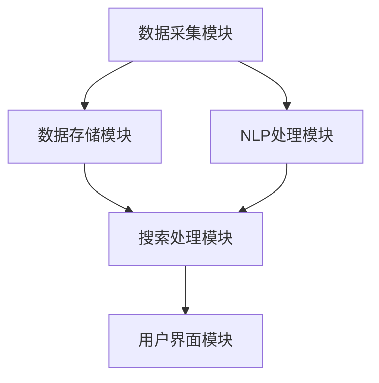

                 

### 第1章：AI搜索引擎的基本概念

#### 1.1 AI搜索引擎的定义与发展

**AI搜索引擎的定义**

AI搜索引擎，顾名思义，是结合了人工智能（Artificial Intelligence, AI）技术的搜索引擎。它不仅继承了传统搜索引擎的基本功能，如信息检索和索引，还通过AI技术，特别是机器学习、自然语言处理（Natural Language Processing, NLP）、深度学习等，实现了更高级别的搜索功能。AI搜索引擎的核心在于能够理解用户的查询意图，提供更加精准和个性化的搜索结果。

AI搜索引擎的发展历程可以分为几个阶段：

1. **早期阶段（1990s-2000s）**：
   - 这个阶段以关键词匹配和简单的自然语言处理技术为主。
   - 代表技术有PageRank（由Google创始人Larry Page和Sergey Brin发明的一种网页排序算法）。

2. **成熟阶段（2010s）**：
   - AI技术的飞速发展为搜索引擎带来了新的可能。
   - 机器学习和深度学习技术的应用使得搜索引擎能够更好地理解用户的查询意图。
   - Google引入了Bing搜素引擎则开始使用深度学习模型进行语义理解。

3. **现阶段（2020s至今）**：
   - 当前，AI搜索引擎正逐渐走向智能化，实现更高级别的交互和个性化推荐。
   - 代表技术包括BERT（一种深度学习模型，用于理解自然语言的语义）和Transformers。

**AI搜索引擎与传统搜索引擎的比较**

传统搜索引擎主要依赖关键词匹配和索引技术，存在以下局限性：

- **缺乏语义理解**：难以处理复杂的语义查询。
- **结果相关性差**：搜索结果往往与用户意图不符。

相比之下，AI搜索引擎具有以下优势：

- **语义理解**：通过AI技术，特别是自然语言处理技术，能够更好地理解用户的查询意图。
- **个性化推荐**：根据用户的兴趣和行为，提供个性化的搜索结果。
- **实时学习**：能够根据用户的反馈和行为进行实时学习和优化，提高搜索质量。

**AI搜索引擎的主要功能与特点**

AI搜索引擎的主要功能包括：

- **检索**：通过AI技术，从海量数据中快速检索出与用户查询相关的信息。
- **推荐**：根据用户的浏览历史和偏好，推荐相关的信息或内容。
- **个性化**：根据用户的兴趣和行为，提供个性化的搜索结果。

其主要特点包括：

- **语义理解**：通过深度学习和自然语言处理技术，实现更加精准的语义理解。
- **实时学习**：通过机器学习技术，不断优化搜索算法，提高搜索质量。
- **个性化推荐**：通过用户行为分析和偏好挖掘，实现个性化的推荐。

#### 1.2 AI搜索引擎的架构与组成

**1.2.1 搜索引擎的基本架构**

一个典型的AI搜索引擎由以下几个核心组成部分构成：

1. **数据层**：包括索引数据库和存储系统，用于存储和索引互联网上的信息。
2. **索引层**：使用AI算法对数据层中的信息进行索引，以便快速检索。
3. **查询处理层**：接收用户的查询请求，处理查询并进行相关性计算。
4. **搜索结果层**：根据查询处理层的计算结果，生成并展示搜索结果。

**1.2.2 AI引擎的核心模块**

AI引擎是AI搜索引擎的核心，主要包括以下几个模块：

1. **语言模型**：用于理解和生成自然语言，是实现语义理解的基础。
2. **实体识别与链接**：用于识别文本中的实体（如人名、地名、组织名等），并将其链接到相应的知识库中。
3. **文本分类与情感分析**：用于对文本进行分类和情感分析，帮助搜索引擎理解用户查询的意图。

**1.2.3 用户交互界面设计**

用户交互界面（User Interface, UI）是用户与AI搜索引擎交互的窗口，设计原则包括：

- **简洁性**：界面设计应简洁明了，避免复杂和冗余。
- **一致性**：界面元素应保持一致，使用户能够快速理解和使用。
- **交互性**：提供丰富的交互方式，如搜索框、推荐栏、过滤器等，以增强用户体验。

**总结**

AI搜索引擎通过集成AI技术，实现了传统搜索引擎难以达到的语义理解、个性化推荐和实时学习等功能。随着AI技术的不断发展，AI搜索引擎在未来的应用前景将更加广阔。本章对AI搜索引擎的基本概念、架构与组成进行了概述，为后续章节的深入探讨奠定了基础。

---

# 第2章：AI搜索引擎的架构与组成

## 2.1 搜索引擎的基本架构

一个典型的AI搜索引擎的基本架构可以分为以下几个关键部分，每个部分在搜索引擎的功能实现中扮演着不可或缺的角色：

### 数据层

**数据层**是搜索引擎的基础，负责存储和索引互联网上的信息。其核心功能包括：

- **信息采集**：通过爬虫技术，从互联网上抓取网页、文章等数据。
- **数据存储**：将采集到的信息存储到数据库或分布式存储系统中，通常使用NoSQL数据库，如MongoDB或Elasticsearch，以支持海量数据的存储和快速检索。
- **数据预处理**：对采集到的数据进行清洗、去重、格式化等处理，以便于后续的索引和检索。

### 索引层

**索引层**是搜索引擎的核心部分，负责将存储在数据层中的信息进行索引，以便于快速检索。主要功能包括：

- **索引生成**：使用AI算法（如TF-IDF、LSI、LDA等）对文档进行特征提取和索引生成。
- **索引优化**：定期对索引进行优化，以提高搜索效率和准确性。
- **索引更新**：实时更新索引，以反映互联网上数据的最新变化。

### 查询处理层

**查询处理层**是用户与搜索引擎交互的桥梁，负责处理用户的查询请求并返回搜索结果。其主要功能包括：

- **查询理解**：利用自然语言处理技术，如词性标注、依存句法分析、语义角色标注等，理解用户的查询意图。
- **查询扩展**：通过对用户的原始查询进行扩展，增加相关的关键词，以提高搜索结果的准确性。
- **查询优化**：使用机器学习算法（如协同过滤、矩阵分解等），优化查询处理过程，提高搜索效率。

### 搜索结果层

**搜索结果层**负责生成并展示搜索结果，其主要功能包括：

- **结果生成**：根据查询处理层的计算结果，生成搜索结果列表。
- **结果排序**：使用排序算法（如PageRank、LSI等），根据文档的相关性对搜索结果进行排序。
- **结果展示**：将排序后的搜索结果以用户友好的方式展示在用户界面上。

## 2.2 AI引擎的核心模块

AI引擎是AI搜索引擎的核心组成部分，它负责实现搜索引擎的智能功能，主要包括以下几个关键模块：

### 语言模型

**语言模型**是AI引擎的基础，用于理解和生成自然语言。其主要功能包括：

- **词向量表示**：将文本中的词语转换为向量表示，以便于计算和建模。
- **语言理解**：通过深度学习模型（如RNN、LSTM、GRU等），理解文本的语义和上下文关系。
- **语言生成**：根据输入的查询或文本，生成相关的回答或文本。

### 实体识别与链接

**实体识别与链接**模块负责识别文本中的实体（如人名、地名、组织名等），并将其链接到相应的知识库中。其主要功能包括：

- **命名实体识别（Named Entity Recognition, NER）**：使用机器学习算法，从文本中识别出实体。
- **实体链接（Knowledge Base Linking）**：将识别出的实体与知识库中的实体进行匹配和链接，以便于知识推理和语义理解。

### 文本分类与情感分析

**文本分类与情感分析**模块用于对文本进行分类和情感分析，帮助搜索引擎理解用户查询的意图。其主要功能包括：

- **文本分类**：使用机器学习算法（如SVM、Naive Bayes、Random Forest等），对文本进行分类，以便于筛选和过滤。
- **情感分析**：通过情感分析算法，判断文本的情感倾向，如正面、负面或中性。

## 2.3 用户交互界面设计

**用户交互界面设计**是搜索引擎用户体验的重要组成部分，其设计原则包括：

- **简洁性**：界面设计应简洁明了，避免复杂和冗余，以提高用户的使用效率。
- **一致性**：界面元素应保持一致，使用户能够快速理解和使用。
- **交互性**：提供丰富的交互方式，如搜索框、推荐栏、过滤器等，以增强用户体验。

**总结**

AI搜索引擎的架构与组成是一个复杂且精细的系统，涵盖了数据采集、存储、索引、查询处理、搜索结果展示等多个方面。AI引擎的核心模块，如语言模型、实体识别与链接、文本分类与情感分析，使得搜索引擎能够实现更高级别的语义理解和个性化推荐。用户交互界面设计则直接影响到用户体验，是搜索引擎成功的关键因素之一。本章对AI搜索引擎的架构与组成进行了详细阐述，为后续章节的技术探讨奠定了基础。

---

# 第3章：自然语言处理基础

## 3.1 语言模型与词向量

语言模型是自然语言处理（NLP）的核心组成部分，用于理解和生成自然语言。在本节中，我们将探讨语言模型的构建方法和词向量的表示。

### 3.1.1 语言模型的定义与分类

**语言模型**是一种概率模型，用于预测给定输入序列下下一个单词或字符的概率。根据模型的形式，语言模型可以分为以下几种：

1. **N-gram模型**：
   - **定义**：N-gram模型是一种基于统计的简单语言模型，它通过计算相邻N个单词同时出现的频率来预测下一个单词。
   - **公式**：
     $$ P(w_n | w_{n-1}, w_{n-2}, ..., w_1) = \frac{C(w_{n-1}, w_{n-2}, ..., w_1, w_n)}{C(w_{n-1}, w_{n-2}, ..., w_1)} $$
   - **伪代码**：
     ```python
     def n_gram_probability(phrase, n):
         count = count_n_gram(phrase, n)
         total = count_n_gram(phrase, n-1)
         return count / total
     ```

2. **神经网络模型**：
   - **定义**：神经网络模型，尤其是深度学习模型，如循环神经网络（RNN）、长短期记忆网络（LSTM）和变换器（Transformer），通过学习输入序列的特征，预测下一个单词。
   - **公式**：
     $$ P(w_n | w_{n-1}, w_{n-2}, ..., w_1) = \sigma(W_1 \cdot [w_{n-1}, w_{n-2}, ..., w_1] + b_1) \cdot W_2 \cdot [w_{n-1}, w_{n-2}, ..., w_1] + b_2 $$
   - **伪代码**：
     ```python
     def neural_network_probability(input_sequence):
         hidden_state = neural_network(input_sequence)
         output = softmax(hidden_state)
         return output[-1]
     ```

3. **深度神经网络模型**：
   - **定义**：深度神经网络模型（DNN）通过多层神经元网络来学习输入数据的特征，通常用于文本分类、情感分析等任务。
   - **公式**：
     $$ f(x) = \sigma(W \cdot x + b) $$
   - **伪代码**：
     ```python
     def deep_neural_network(input_vector):
         hidden_layer = linear_transform(input_vector, weights, bias)
         output = softmax(hidden_layer)
         return output
     ```

### 3.1.2 词向量的定义与构建

词向量是一种将文本中的词语转换为向量表示的方法，便于在机器学习模型中进行处理。词向量的构建方法主要有以下几种：

1. **基于统计的方法**：
   - **TF-IDF**：
     - **定义**：TF-IDF是一种基于词语频率（TF）和文档频率（IDF）的统计方法，用于衡量一个词语对于文档的重要程度。
     - **公式**：
       $$ TF-IDF(t, d) = TF(t, d) \cdot IDF(t, d) $$
       $$ IDF(t, d) = \log_2(\frac{N}{df(t)}) $$
     - **伪代码**：
       ```python
       def compute_tfidf(document, corpus):
           tf = compute_tf(document)
           idf = compute_idf(tf, corpus)
           return tf * idf
       ```

2. **基于神经网络的词向量模型**：
   - **Word2Vec**：
     - **定义**：Word2Vec是一种基于神经网络的词向量模型，通过训练神经网络来学习词语的向量表示。
     - **公式**：
       $$ E = \sum_{i=1}^{V} w_i \cdot v_{w_i} $$
       $$ \frac{\partial E}{\partial v_{w}} = -\sum_{i=1}^{V} w_i $$
     - **伪代码**：
       ```python
       def word2vec(training_data):
           for sentence in training_data:
               for word in sentence:
                   update_vector(word, context_words)
           return word_vectors
       ```

3. **基于深度学习的词向量模型**：
   - **GloVe**：
     - **定义**：GloVe（Global Vectors for Word Representation）是一种基于全局上下文的词向量模型，通过优化全局损失函数来学习词向量。
     - **公式**：
       $$ f(w, c) = \frac{exp(-\frac{||v_w + \sum_{c \in c(w)} v_c||^2}{2f^2})}{1 + \sum_{c \in c(w)} exp(-\frac{||v_w + v_c||^2}{2f^2})} $$
       $$ \frac{\partial L}{\partial v_w} = -\sum_{c \in c(w)} f(w, c) \cdot (w - c) $$
     - **伪代码**：
       ```python
       def glove(training_data, f):
           for sentence in training_data:
               for word in sentence:
                   update_vector(word, context_words, f)
           return word_vectors
       ```

### 3.1.3 词向量的应用

词向量在自然语言处理中有广泛的应用，包括：

- **文本分类**：通过计算文本的词向量表示，并使用机器学习算法（如SVM、Naive Bayes等）进行分类。
- **情感分析**：通过词向量表示，判断文本的情感倾向（如正面、负面或中性）。
- **机器翻译**：通过词向量表示，实现源语言和目标语言之间的词对应关系，从而进行机器翻译。

**总结**

语言模型与词向量是自然语言处理的基础，通过构建和训练语言模型，可以更好地理解自然语言，而词向量表示则为机器学习模型提供了有效的输入。在本节中，我们介绍了N-gram模型、神经网络模型和深度神经网络模型的构建方法，以及TF-IDF、Word2Vec和GloVe等词向量模型的构建方法。这些方法为AI搜索引擎在语义理解和搜索结果生成中发挥了重要作用。

---

## 3.2 命名实体识别与实体链接

### 3.2.1 命名实体识别（NER）

命名实体识别（Named Entity Recognition，NER）是自然语言处理（NLP）中的一项重要任务，旨在从文本中识别出具有特定意义的实体。这些实体包括人名、地名、组织名、时间、地点等。NER在信息提取、知识图谱构建和搜索引擎中有着广泛的应用。

**NER的任务**：给定一段文本，将其中的命名实体标注出来。例如，从文本 "Apple Inc. is going to open a new store in New York City." 中识别出 "Apple Inc." 和 "New York City" 是实体。

**NER的方法**：

1. **规则方法**：
   - **定义**：基于预定义的规则，如正则表达式，对文本进行实体识别。
   - **优点**：实现简单，易于理解。
   - **缺点**：覆盖面有限，难以处理复杂的命名实体。

2. **统计方法**：
   - **定义**：基于统计模型，如条件概率模型，利用已标注的语料库进行训练。
   - **优点**：能够自动学习命名实体的特征。
   - **缺点**：依赖大量标注数据，对未见过的实体识别效果较差。

3. **深度学习方法**：
   - **定义**：使用深度学习模型（如卷积神经网络、循环神经网络、长短期记忆网络等）进行实体识别。
   - **优点**：能够自动提取复杂的特征，识别效果较好。
   - **缺点**：训练时间较长，对计算资源要求较高。

**NER的流程**：

1. **文本预处理**：包括分词、去除停用词、词干提取等。
2. **特征提取**：提取文本中的特征，如词频、词性、依存关系等。
3. **模型训练**：使用已标注的语料库，训练命名实体识别模型。
4. **实体识别**：对新的文本进行命名实体识别，生成实体标注结果。

### 3.2.2 实体链接（Knowledge Base Linking）

实体链接（Knowledge Base Linking，简称KBL）是NLP中另一个重要任务，旨在将文本中识别出的命名实体与知识库中的实体进行匹配和链接。通过实体链接，可以建立实体与实体之间的关联，为后续的知识推理和搜索提供支持。

**KBL的任务**：给定一段文本中的命名实体，将其与知识库中的实体进行匹配和链接。例如，将文本中的 "Apple Inc." 链接到知识库中对应的公司实体。

**KBL的方法**：

1. **基于规则的方法**：
   - **定义**：基于预定义的规则，如命名实体与知识库实体之间的对应关系。
   - **优点**：实现简单，能够快速进行实体链接。
   - **缺点**：覆盖面有限，难以处理复杂的实体关系。

2. **基于统计的方法**：
   - **定义**：基于统计模型，如序列标注模型，利用已标注的语料库进行训练。
   - **优点**：能够自动学习实体链接的特征。
   - **缺点**：依赖大量标注数据，对未见过的实体链接效果较差。

3. **基于深度学习方法**：
   - **定义**：使用深度学习模型（如卷积神经网络、循环神经网络、长短期记忆网络等）进行实体链接。
   - **优点**：能够自动提取复杂的特征，链接效果较好。
   - **缺点**：训练时间较长，对计算资源要求较高。

**KBL的流程**：

1. **文本预处理**：包括分词、命名实体识别等。
2. **特征提取**：提取文本中的特征，如词向量、命名实体特征等。
3. **模型训练**：使用已标注的语料库，训练实体链接模型。
4. **实体链接**：对新的文本进行命名实体识别和实体链接，生成实体链接结果。

### 3.2.3 NER与KBL的结合

NER和KBL是NLP中紧密相关的任务，NER的结果可以作为KBL的输入，而KBL的结果可以丰富NER的知识库，提高NER的准确性。在实际应用中，通常会结合NER和KBL的结果，对文本进行更全面的语义理解。

**应用场景**：

- **搜索引擎**：通过NER和KBL，可以更好地理解用户的查询意图，提供更准确的搜索结果。
- **信息提取**：通过NER和KBL，可以从大量文本中快速提取出关键信息，如人名、地点、事件等。
- **知识图谱构建**：通过NER和KBL，可以将文本中的实体与知识库中的实体进行关联，构建出完整的知识图谱。

**总结**

命名实体识别与实体链接是NLP中的关键任务，通过识别文本中的命名实体和将其实体链接到知识库中，可以实现对文本的深入理解和应用。在本节中，我们介绍了NER和KBL的定义、方法、流程以及它们在实际应用中的重要性。

---

## 3.3 文本分类与情感分析

### 3.3.1 文本分类

文本分类（Text Classification）是一种常用的自然语言处理任务，旨在将文本数据根据其内容划分为不同的类别。文本分类在搜索引擎、舆情分析、邮件过滤等领域有着广泛的应用。

**分类任务**：给定一段文本，判断它属于哪个预定义的类别。例如，将社交媒体上的评论分类为正面、负面或中性。

**分类方法**：

1. **基于规则的方法**：
   - **定义**：通过预定义的规则进行文本分类，通常使用正则表达式或关键词匹配。
   - **优点**：实现简单，易于理解。
   - **缺点**：覆盖面有限，难以处理复杂的文本。

2. **基于统计的方法**：
   - **定义**：基于统计模型进行文本分类，通常使用词汇频率（TF）、文档频率（DF）等特征。
   - **优点**：能够自动学习文本特征。
   - **缺点**：依赖大量标注数据，对未见过的类别识别效果较差。

3. **基于深度学习方法**：
   - **定义**：使用深度学习模型（如卷积神经网络、循环神经网络、长短期记忆网络等）进行文本分类。
   - **优点**：能够自动提取复杂的特征，分类效果较好。
   - **缺点**：训练时间较长，对计算资源要求较高。

**分类流程**：

1. **数据预处理**：包括文本清洗、分词、去除停用词、词干提取等。
2. **特征提取**：提取文本中的特征，如词向量、TF-IDF等。
3. **模型训练**：使用已标注的语料库，训练文本分类模型。
4. **分类**：对新的文本进行分类，生成分类结果。

### 3.3.2 情感分析

情感分析（Sentiment Analysis），也称为意见挖掘，是一种分析文本中情感倾向的任务。情感分析通常用于社交媒体监控、客户反馈分析、市场调研等领域。

**情感分析任务**：判断一段文本的情感倾向，如正面、负面或中性。例如，分析用户对某个产品的评论，判断其是否满意。

**情感分析方法**：

1. **基于规则的方法**：
   - **定义**：通过预定义的规则进行情感分析，通常使用情感词典或情感标签。
   - **优点**：实现简单，易于理解。
   - **缺点**：覆盖面有限，难以处理复杂的情感表达。

2. **基于统计的方法**：
   - **定义**：基于统计模型进行情感分析，通常使用文本特征（如词频、TF-IDF）和情感词典。
   - **优点**：能够自动学习文本特征。
   - **缺点**：依赖大量标注数据，对未见过的情感表达识别效果较差。

3. **基于深度学习方法**：
   - **定义**：使用深度学习模型（如卷积神经网络、循环神经网络、长短期记忆网络等）进行情感分析。
   - **优点**：能够自动提取复杂的情感特征，分析效果较好。
   - **缺点**：训练时间较长，对计算资源要求较高。

**情感分析流程**：

1. **数据预处理**：包括文本清洗、分词、去除停用词、词干提取等。
2. **特征提取**：提取文本中的特征，如词向量、情感词典等。
3. **模型训练**：使用已标注的语料库，训练情感分析模型。
4. **情感分析**：对新的文本进行情感分析，生成情感倾向结果。

### 3.3.3 文本分类与情感分析的结合

文本分类和情感分析是NLP中的两个互补任务，通过结合这两种方法，可以实现对文本的更全面的分析。

**应用场景**：

- **搜索引擎**：通过文本分类，可以将搜索结果按照类别进行组织，提高用户的查找效率；通过情感分析，可以判断用户对搜索结果的满意度，从而优化搜索体验。
- **舆情分析**：通过文本分类，可以快速识别出不同类别的舆情信息；通过情感分析，可以判断公众对某一事件或产品的态度，为决策提供支持。
- **客户反馈分析**：通过文本分类，可以将客户反馈按照主题进行分类；通过情感分析，可以判断客户反馈的情感倾向，为产品改进提供依据。

**总结**

文本分类和情感分析是自然语言处理中的重要任务，通过这两种方法，可以实现对文本内容的深入理解和分析。在本节中，我们介绍了文本分类和情感分析的定义、方法、流程以及它们在实际应用中的重要性。结合文本分类和情感分析，AI搜索引擎可以更好地满足用户的搜索需求，提供更个性化的搜索结果。

---

## 3.4 语言模型在搜索中的应用

语言模型在AI搜索引擎中扮演着至关重要的角色，它不仅帮助我们理解用户的查询意图，还能优化搜索结果的相关性和用户体验。在本节中，我们将探讨语言模型在搜索中的应用，包括查询扩展、结果排序和用户反馈学习等方面。

### 3.4.1 查询扩展

查询扩展（Query Expansion）是提高搜索结果相关性的重要手段。通过查询扩展，我们可以将用户的原始查询扩展为更加丰富和精确的查询，从而提高搜索结果的准确性。语言模型在查询扩展中有着广泛的应用。

1. **基于词义扩展**：
   - **定义**：通过语言模型理解用户查询的词义，将原始查询中的关键词扩展为相关的同义词或上下位词。
   - **方法**：可以使用词向量模型（如Word2Vec、GloVe）或词性标注模型（如LSTM、BERT）进行词义扩展。
   - **伪代码**：
     ```python
     def query_expansion(input_query, language_model):
         expanded_query = []
         for word in input_query:
             synonyms = language_model.get_synonyms(word)
             for synonym in synonyms:
                 expanded_query.append(synonym)
         return expanded_query
     ```

2. **基于上下文扩展**：
   - **定义**：通过语言模型理解查询的上下文，将原始查询扩展为包含上下文信息的查询。
   - **方法**：可以使用基于上下文的模型（如BERT、GPT）进行上下文扩展。
   - **伪代码**：
     ```python
     def context_expansion(input_query, context_model):
         expanded_query = context_model.expand_context(input_query)
         return expanded_query
     ```

### 3.4.2 结果排序

结果排序（Ranking）是搜索引擎的核心功能之一，它决定了用户在搜索结果页面看到的内容的顺序。语言模型在结果排序中发挥着关键作用，可以帮助我们根据查询意图和文本内容对搜索结果进行精确排序。

1. **基于相关性排序**：
   - **定义**：根据查询和文档之间的相关性对搜索结果进行排序。
   - **方法**：可以使用语言模型计算查询和文档之间的相似度，并根据相似度进行排序。
   - **公式**：
     $$ score(d, q) = \sum_{w \in d} sim(w, q) $$
     其中，$ sim(w, q) $ 表示单词 $ w $ 和查询 $ q $ 之间的相似度。

2. **基于机器学习排序**：
   - **定义**：使用机器学习模型（如线性回归、决策树、SVM等）对搜索结果进行排序。
   - **方法**：通过训练数据学习查询和文档之间的排序特征，并对新的搜索结果进行排序。
   - **伪代码**：
     ```python
     def rank_documents(documents, ranking_model):
         scores = ranking_model.predict(documents)
         ranked_documents = sorted(documents, key=lambda x: scores[x], reverse=True)
         return ranked_documents
     ```

### 3.4.3 用户反馈学习

用户反馈学习（User Feedback Learning）是提高搜索引擎用户体验的重要手段。通过收集和分析用户在使用搜索引擎过程中的反馈，我们可以不断优化搜索算法和结果排序，提高用户的满意度。

1. **基于用户点击行为**：
   - **定义**：通过分析用户的点击行为，了解用户对搜索结果的偏好。
   - **方法**：可以使用机器学习算法（如协同过滤、矩阵分解等）从用户点击行为中学习用户偏好。
   - **伪代码**：
     ```python
     def learn_user_preferences(click_data, learning_model):
         preferences = learning_model.learn_from_clicks(click_data)
         return preferences
     ```

2. **基于用户满意度调查**：
   - **定义**：通过用户满意度调查，了解用户对搜索结果的满意度。
   - **方法**：可以使用回归模型或分类模型分析用户满意度，并根据满意度调整搜索结果排序。
   - **伪代码**：
     ```python
     def adjust_ranking(ranking_model, satisfaction_data):
         new_ranking = ranking_model.adjust_for_satisfaction(satisfaction_data)
         return new_ranking
     ```

### 3.4.4 实例分析

下面通过一个实例来说明语言模型在搜索中的应用。

**实例**：假设用户输入查询 "apple store location"，我们的搜索引擎需要返回与该查询相关的商店位置信息。

1. **查询扩展**：
   - 原始查询："apple store location"
   - 扩展查询："apple store location new york" 或 "iphone store location"

2. **结果排序**：
   - 使用语言模型计算查询和文档的相似度，并根据相似度排序。
   - 排名前几的搜索结果可能包括 "Apple Store - New York City" 和 "iPhone Store - New York City"。

3. **用户反馈学习**：
   - 如果用户点击了 "Apple Store - New York City"，我们可以将这个商店标记为用户感兴趣的地标。
   - 在未来的查询中，当用户输入 "apple store location" 时，我们可能会更倾向于将 "Apple Store - New York City" 排在前面。

**总结**

语言模型在AI搜索引擎中的应用非常广泛，从查询扩展、结果排序到用户反馈学习，都离不开语言模型的支持。通过语言模型，我们可以更好地理解用户的查询意图，提高搜索结果的相关性和用户体验。在本节中，我们介绍了语言模型在搜索中的应用方法，包括查询扩展、结果排序和用户反馈学习。这些方法共同构成了AI搜索引擎的核心技术，使得搜索引擎能够满足用户的多样化需求。

---

## 第4章：AI搜索引擎的搜索算法

### 4.1 搜索算法的基本原理

搜索算法是AI搜索引擎的核心技术，负责处理用户的查询请求，并从海量的数据中检索出相关的信息。搜索算法的基本原理可以分为以下几个关键步骤：

1. **查询处理**：接收用户的查询请求，对其进行预处理，如分词、去除停用词、词干提取等，以便更好地理解查询意图。

2. **查询扩展**：根据查询意图，将原始查询扩展为更丰富的查询，以提高搜索结果的准确性。这通常涉及词义扩展、上下文扩展等技术。

3. **文档检索**：利用索引结构，从存储系统中快速检索出与查询相关的文档。

4. **结果排序**：根据查询和文档的相关性，对检索结果进行排序，以便用户能够快速找到最相关的信息。

5. **结果展示**：将排序后的搜索结果以用户友好的方式展示在界面上。

### 4.2 搜索引擎的排序算法

搜索引擎的排序算法是决定搜索结果质量的关键因素。排序算法的目标是根据查询和文档的相关性，对搜索结果进行合理排序，使用户能够快速找到所需信息。以下是一些常见的排序算法：

1. **基于频率的排序算法**：
   - **定义**：根据文档中关键词的出现频率进行排序。
   - **优点**：实现简单，易于理解。
   - **缺点**：难以处理复杂的语义关系。

2. **基于概率的排序算法**：
   - **定义**：使用概率模型计算查询和文档之间的相关性，并根据相关性进行排序。
   - **优点**：能够处理复杂的语义关系。
   - **缺点**：计算复杂度较高。

3. **基于机器学习的排序算法**：
   - **定义**：使用机器学习模型（如线性回归、决策树、支持向量机等）对查询和文档进行排序。
   - **优点**：能够自动学习查询和文档的特征，排序效果较好。
   - **缺点**：训练时间较长，对计算资源要求较高。

4. **基于图论的排序算法**：
   - **定义**：使用图论模型（如PageRank、HITS等）对查询和文档进行排序。
   - **优点**：能够利用图结构中的链接关系，提高排序效果。
   - **缺点**：计算复杂度较高。

### 4.3 相关性计算与查询扩展

相关性计算是搜索排序算法的核心，用于评估查询和文档之间的相似度。以下是一些常见的相关性计算方法：

1. **TF-IDF**：
   - **定义**：通过计算文档中关键词的频率（TF）和文档集合中的频率（IDF），评估关键词的重要程度。
   - **公式**：
     $$ TF(t, d) = \frac{tf(t, d)}{N} $$
     $$ IDF(t, D) = \log_2(\frac{N}{df(t)}) $$
     $$ score(d, q) = \sum_{t \in q} IDF(t, D) \cdot TF(t, d) $$

2. **向量空间模型**：
   - **定义**：将查询和文档表示为向量，计算向量之间的相似度。
   - **公式**：
     $$ \vec{d} = (d_1, d_2, ..., d_n) $$
     $$ \vec{q} = (q_1, q_2, ..., q_n) $$
     $$ score(d, q) = \vec{d} \cdot \vec{q} = \sum_{i=1}^{n} d_i \cdot q_i $$

3. **基于机器学习的相似度计算**：
   - **定义**：使用机器学习模型（如SVM、线性回归等）计算查询和文档之间的相似度。
   - **公式**：
     $$ score(d, q) = \sum_{i=1}^{n} w_i \cdot (d_i - q_i) $$
     其中，$ w_i $ 为模型学习到的权重。

### 4.4 查询扩展方法

查询扩展是提高搜索结果相关性的重要手段。以下是一些常见的查询扩展方法：

1. **基于词义扩展**：
   - **定义**：通过语言模型理解查询的词义，将原始查询扩展为相关的同义词或上下位词。
   - **方法**：可以使用词向量模型（如Word2Vec、GloVe）或词性标注模型（如LSTM、BERT）进行词义扩展。

2. **基于上下文扩展**：
   - **定义**：通过语言模型理解查询的上下文，将原始查询扩展为包含上下文信息的查询。
   - **方法**：可以使用基于上下文的模型（如BERT、GPT）进行上下文扩展。

3. **基于历史查询扩展**：
   - **定义**：根据用户的历史查询记录，自动扩展当前查询。
   - **方法**：可以使用协同过滤、矩阵分解等技术，从用户的历史查询记录中学习查询模式。

### 4.5 实时搜索结果优化

实时搜索结果优化是提高搜索引擎用户体验的重要手段。以下是一些常见的实时搜索结果优化方法：

1. **实时反馈机制**：
   - **定义**：根据用户的实时操作（如点击、滚动等）调整搜索结果排序。
   - **方法**：可以使用机器学习模型（如决策树、SVM等）从用户的实时操作中学习用户的偏好。

2. **动态查询扩展**：
   - **定义**：根据用户的实时查询，动态调整查询扩展策略。
   - **方法**：可以使用基于上下文的模型（如BERT、GPT）实时扩展查询。

3. **个性化搜索**：
   - **定义**：根据用户的历史行为和兴趣，为用户推荐个性化的搜索结果。
   - **方法**：可以使用协同过滤、矩阵分解等技术，从用户的历史行为中学习用户的兴趣。

### 4.6 搜索结果的多样性与丰富性

搜索结果的多样性与丰富性是提高搜索引擎用户体验的重要因素。以下是一些提高搜索结果多样性和丰富性的方法：

1. **结果多样性**：
   - **定义**：提供多样化的搜索结果，以满足用户的多样化需求。
   - **方法**：可以使用聚类、分类等技术，将搜索结果分为不同的类别，提高结果的多样性。

2. **结果丰富性**：
   - **定义**：提供丰富的搜索结果信息，如摘要、图片、视频等。
   - **方法**：可以使用信息抽取、实体识别等技术，从原始文档中提取相关信息，丰富搜索结果。

### 4.7 实例分析

下面通过一个实例来说明搜索算法在AI搜索引擎中的应用。

**实例**：假设用户输入查询 "apple"，我们的搜索引擎需要返回与苹果相关的信息。

1. **查询处理**：
   - 原始查询："apple"
   - 处理后的查询："苹果"

2. **查询扩展**：
   - 扩展查询："苹果手机" 或 "苹果公司"

3. **文档检索**：
   - 检索相关文档，如 "苹果手机发布会" 和 "苹果公司概况"

4. **结果排序**：
   - 根据查询和文档的相关性，对检索结果进行排序，如 "苹果手机发布会" 排在前面。

5. **结果展示**：
   - 将排序后的搜索结果以用户友好的方式展示在界面上，包括摘要、图片和视频等。

**总结**

搜索算法是AI搜索引擎的核心技术，涉及查询处理、查询扩展、结果排序等多个方面。通过合理的搜索算法，可以大大提高搜索结果的相关性和用户体验。在本节中，我们介绍了搜索算法的基本原理、排序算法、相关性计算方法以及查询扩展方法。这些技术共同构成了AI搜索引擎的核心，使得搜索引擎能够满足用户的多样化需求。

---

## 4.6 机器学习与深度学习在搜索引擎中的应用

### 4.6.1 机器学习算法在搜索引擎中的应用

机器学习算法在搜索引擎中的应用主要集中在对搜索结果的排序和推荐方面。以下是几种常见的机器学习算法及其在搜索引擎中的应用：

1. **线性回归**：
   - **定义**：一种简单而有效的预测算法，通过建立输入特征和输出目标之间的线性关系进行预测。
   - **应用**：用于预测文档的相关性得分，从而优化搜索结果的排序。

2. **逻辑回归**：
   - **定义**：一种分类算法，用于将数据分类为不同的类别。
   - **应用**：用于分类用户查询，如判断查询是否属于特定类别（如新闻、购物等），从而调整搜索结果的排序。

3. **支持向量机（SVM）**：
   - **定义**：一种分类和回归算法，通过找到一个最优的超平面来分离数据。
   - **应用**：用于预测文档的相关性得分，并根据得分对搜索结果进行排序。

4. **决策树**：
   - **定义**：一种基于特征的树形结构算法，用于分类和回归。
   - **应用**：用于对搜索结果进行分类，如将结果分为新闻、产品、论坛等不同类别。

5. **随机森林**：
   - **定义**：一种基于决策树的集成学习方法，通过构建多个决策树，并取平均预测结果。
   - **应用**：用于提高搜索结果的排序准确性，通过集成多个决策树的预测结果，减少过拟合。

6. **朴素贝叶斯**：
   - **定义**：一种基于贝叶斯定理的概率分类算法，通过计算每个类别的条件概率进行分类。
   - **应用**：用于文本分类，如对用户查询进行分类，以便提供更精确的搜索结果。

### 4.6.2 深度学习模型在搜索引擎中的应用

深度学习模型在搜索引擎中的应用越来越广泛，尤其是在处理复杂的语义理解和用户行为预测方面。以下是几种常见的深度学习模型及其在搜索引擎中的应用：

1. **循环神经网络（RNN）**：
   - **定义**：一种用于处理序列数据的神经网络，通过记忆历史信息来预测下一个元素。
   - **应用**：用于文本分类、情感分析和搜索结果排序，通过理解文本的上下文信息，提高搜索结果的准确性。

2. **长短期记忆网络（LSTM）**：
   - **定义**：一种改进的RNN，通过记忆单元和门控制机制，解决了RNN的梯度消失问题。
   - **应用**：用于处理长文本数据，如用户查询和历史搜索记录，从而实现更准确的搜索结果排序和推荐。

3. **变换器（Transformer）**：
   - **定义**：一种基于自注意力机制的深度学习模型，通过全局上下文信息进行文本理解。
   - **应用**：用于搜索结果的排序和推荐系统，通过理解查询和文档之间的复杂关系，提高搜索结果的准确性和个性化。

4. **卷积神经网络（CNN）**：
   - **定义**：一种用于处理图像数据的神经网络，通过卷积操作提取特征。
   - **应用**：用于处理图像和文本混合的数据，如商品搜索，通过结合图像和文本特征，提高搜索结果的准确性。

5. **生成对抗网络（GAN）**：
   - **定义**：一种由生成器和判别器组成的模型，用于生成与真实数据相似的新数据。
   - **应用**：用于生成高质量的搜索结果，如通过GAN生成相关文章摘要，丰富用户的搜索体验。

### 4.6.3 深度学习模型与搜索算法的结合

深度学习模型与传统的搜索算法相结合，可以进一步提升搜索引擎的性能。以下是一些常见的结合方法：

1. **基于特征的融合**：
   - **定义**：将深度学习模型提取的特征与传统的特征（如TF-IDF、词向量等）进行融合，共同用于搜索结果排序。
   - **应用**：通过结合多种特征，提高搜索结果的准确性和多样性。

2. **端到端模型**：
   - **定义**：使用深度学习模型从原始数据直接预测搜索结果，无需手工特征工程。
   - **应用**：简化了搜索算法的实现过程，通过端到端的学习，提高搜索结果的准确性和效率。

3. **迁移学习**：
   - **定义**：将预训练的深度学习模型应用于新的任务，通过少量数据微调模型。
   - **应用**：通过迁移学习，可以在没有大量标注数据的情况下，快速构建高质量的搜索模型。

### 4.6.4 应用实例

以下是一个深度学习模型在搜索引擎中的应用实例：

**实例**：使用BERT模型进行搜索结果排序。

1. **数据准备**：
   - 收集大量带有标签的搜索查询和搜索结果，用于训练BERT模型。
   - 对查询和结果进行预处理，包括分词、去停用词、添加特殊标记等。

2. **模型训练**：
   - 使用BERT模型对预处理后的数据进行训练，学习查询和结果之间的语义关系。
   - 通过训练，模型能够自动提取查询和结果的语义特征。

3. **模型应用**：
   - 将训练好的BERT模型应用于搜索结果排序，计算查询和每个结果之间的相似度。
   - 根据相似度对搜索结果进行排序，展示给用户。

4. **评估与优化**：
   - 使用用户点击数据对排序结果进行评估，计算准确率、召回率等指标。
   - 根据评估结果，对模型进行调整和优化，提高搜索结果的准确性。

**总结**

机器学习算法和深度学习模型在搜索引擎中的应用，极大地提高了搜索结果的准确性和用户体验。通过合理地结合机器学习和深度学习算法，搜索引擎可以更好地理解用户的查询意图，提供个性化的搜索结果。在本节中，我们介绍了机器学习算法和深度学习模型在搜索引擎中的应用方法，以及它们如何结合使用，为用户提供高质量的搜索服务。

---

## 第5章：个性化搜索与推荐系统

### 5.1 个性化搜索的概念与实现

个性化搜索是AI搜索引擎的核心功能之一，其目的是根据用户的历史行为、兴趣和偏好，为用户提供个性化的搜索结果。个性化搜索不仅提高了搜索结果的准确性，还增强了用户体验。

#### 5.1.1 个性化搜索的概念

个性化搜索（Personalized Search）是一种基于用户历史行为和兴趣的搜索机制，旨在为每个用户定制个性化的搜索体验。个性化搜索的关键在于理解用户的需求，并通过以下方式进行实现：

- **历史行为分析**：分析用户的历史搜索记录、点击行为、收藏行为等，了解用户的兴趣和偏好。
- **实时反馈**：根据用户的实时行为，如滚动、点击、搜索意图的变化等，动态调整搜索结果。
- **用户建模**：构建用户画像，将用户的兴趣和行为数据转化为可操作的模型，用于搜索结果生成。

#### 5.1.2 实现个性化搜索的方法

1. **协同过滤（Collaborative Filtering）**：
   - **定义**：协同过滤是一种基于用户历史行为和相似用户行为进行推荐的方法。
   - **实现**：分为基于用户的方法和基于项目的两种。基于用户的方法通过找到与目标用户相似的其他用户，推荐这些用户喜欢的项目；基于项目的方法通过找到与目标用户历史行为相似的项目，推荐给用户。
   - **优点**：能够发现用户的潜在兴趣，推荐效果较好。
   - **缺点**：在用户数量较少或数据稀疏时，推荐效果较差。

2. **基于内容的推荐（Content-based Filtering）**：
   - **定义**：基于内容的推荐是一种基于项目特征和用户兴趣相似度进行推荐的方法。
   - **实现**：分析用户历史行为中喜欢的项目特征，为用户推荐具有相似特征的新项目。
   - **优点**：推荐结果相关性强，不受用户行为稀疏性的影响。
   - **缺点**：难以发现用户的潜在兴趣，推荐结果可能过于重复。

3. **混合推荐系统（Hybrid Recommender System）**：
   - **定义**：混合推荐系统结合了协同过滤和基于内容的推荐方法，旨在提高推荐系统的整体性能。
   - **实现**：通过协同过滤找到相似用户或项目，并结合项目特征为用户推荐项目。
   - **优点**：能够结合两种方法的优点，提高推荐准确性。
   - **缺点**：实现复杂，需要平衡协同过滤和基于内容的权重。

#### 5.1.3 个性化搜索的实现步骤

1. **用户行为数据收集**：收集用户的历史搜索记录、点击记录、浏览记录等行为数据。
2. **用户画像构建**：基于用户行为数据，构建用户的兴趣偏好模型，如兴趣标签、兴趣向量等。
3. **推荐算法选择**：选择合适的推荐算法，如协同过滤、基于内容的推荐或混合推荐系统。
4. **搜索结果生成**：根据用户的兴趣偏好模型和推荐算法，为用户生成个性化的搜索结果。
5. **实时调整**：根据用户的实时反馈和行为，动态调整搜索结果，提高用户体验。

### 5.2 推荐系统的原理与实现

推荐系统是AI搜索引擎中实现个性化搜索的重要工具。推荐系统通过分析用户的历史行为和兴趣，为用户推荐可能感兴趣的内容或项目。

#### 5.2.1 推荐系统的原理

推荐系统（Recommender System）通过以下原理实现个性化推荐：

1. **协同过滤**：
   - **基于用户的方法**：通过找到与目标用户相似的其他用户，推荐这些用户喜欢的项目。
   - **基于项目的方法**：通过找到与目标用户历史行为相似的项目，推荐给用户。

2. **基于内容的推荐**：
   - **定义**：基于内容的推荐是通过分析项目的特征和用户的历史兴趣，推荐具有相似特征的新项目。
   - **实现**：通过计算项目特征与用户兴趣的相似度，为用户推荐项目。

3. **混合推荐**：
   - **定义**：混合推荐系统结合了协同过滤和基于内容的推荐方法，以提高推荐准确性。
   - **实现**：通过协同过滤找到相似用户或项目，并结合项目特征为用户推荐项目。

#### 5.2.2 推荐系统的实现

1. **数据收集**：收集用户行为数据，如搜索记录、点击记录、浏览记录等。
2. **特征工程**：提取用户和项目的特征，如用户兴趣标签、项目内容标签等。
3. **模型训练**：使用机器学习算法（如线性回归、决策树、支持向量机等）训练推荐模型。
4. **推荐生成**：根据用户兴趣模型和推荐模型，为用户生成推荐结果。
5. **实时更新**：根据用户的实时行为，动态更新用户兴趣模型和推荐结果。

### 5.3 个性化搜索与推荐系统的优化

为了提高个性化搜索和推荐系统的性能，可以采取以下优化策略：

1. **实时反馈**：
   - **定义**：实时反馈是利用用户的即时行为，如点击、收藏等，动态调整搜索结果和推荐结果。
   - **实现**：通过实时数据分析，快速识别用户的兴趣变化，并调整推荐算法。

2. **用户建模**：
   - **定义**：用户建模是通过分析用户的历史行为和兴趣，构建用户的兴趣偏好模型。
   - **实现**：通过机器学习算法（如聚类、神经网络等），构建用户画像，提高推荐准确性。

3. **冷启动问题**：
   - **定义**：冷启动问题是指在用户初始使用系统时，缺乏足够的历史行为数据，难以进行个性化推荐。
   - **实现**：可以通过基于内容的推荐、相似用户推荐等方法，为冷启动用户生成推荐结果。

4. **推荐多样性**：
   - **定义**：推荐多样性是指为用户提供多样化的推荐结果，以避免推荐结果的单一性。
   - **实现**：通过引入多样性约束，如随机化、排序多样性等，提高推荐结果的多样性。

5. **推荐质量评估**：
   - **定义**：推荐质量评估是评估推荐系统性能的重要手段，包括准确性、多样性、覆盖度等指标。
   - **实现**：通过A/B测试、用户调查等方法，评估推荐系统的性能，并不断优化。

### 5.4 个性化搜索与推荐系统的应用实例

以下是一个个性化搜索与推荐系统的应用实例：

**实例**：使用协同过滤和基于内容的推荐系统为用户推荐新闻。

1. **数据收集**：收集用户的历史搜索记录、点击记录和浏览记录，以及新闻文章的内容标签。
2. **特征工程**：提取用户兴趣标签和新闻内容标签，构建用户兴趣模型和新闻特征向量。
3. **模型训练**：使用协同过滤算法训练用户兴趣模型，使用基于内容的推荐算法训练新闻特征模型。
4. **推荐生成**：根据用户的兴趣模型和新闻特征模型，为用户生成个性化新闻推荐。
5. **实时调整**：根据用户的实时反馈（如点击、收藏等），动态调整推荐结果。

**总结**

个性化搜索与推荐系统是AI搜索引擎的重要组成部分，通过分析用户的历史行为和兴趣，为用户定制个性化的搜索结果和推荐。在本章中，我们介绍了个性化搜索的概念与实现方法、推荐系统的原理与实现，以及个性化搜索与推荐系统的优化策略。这些技术和方法共同构成了AI搜索引擎的核心，为用户提供高质量的个性化服务。

---

## 第6章：搜索结果的相关性提升

### 6.1 提高搜索结果相关性的方法

搜索结果的相关性是指搜索结果与用户查询意图的匹配程度。提高搜索结果的相关性是AI搜索引擎的核心目标之一，以下是一些常用的方法：

#### 6.1.1 语义分析

语义分析（Semantic Analysis）是提高搜索结果相关性的关键技术。通过理解用户的查询意图和搜索结果中的语义，可以更好地匹配用户需求和搜索结果。

1. **词义消歧**：
   - **定义**：词义消歧（Word Sense Disambiguation）是识别文本中词语的正确含义。
   - **实现**：使用自然语言处理技术（如词性标注、依存句法分析等），结合上下文信息进行词义消歧。

2. **语义角色标注**：
   - **定义**：语义角色标注（Semantic Role Labeling）是识别句子中的谓词及其作用对象。
   - **实现**：使用深度学习模型（如LSTM、BERT等）进行语义角色标注，更好地理解查询和文档的语义结构。

3. **实体识别**：
   - **定义**：实体识别（Named Entity Recognition）是识别文本中的实体，如人名、地名、组织名等。
   - **实现**：使用深度学习模型（如CRF、BERT等）进行命名实体识别，提高对文档和查询中实体的理解。

#### 6.1.2 查询扩展

查询扩展（Query Expansion）是通过增加相关的关键词来提高搜索结果的准确性。查询扩展可以基于用户的查询历史、上下文信息以及文档特征。

1. **基于词义的扩展**：
   - **定义**：通过理解查询的词义，扩展为相关的同义词或上下位词。
   - **实现**：使用词向量模型（如Word2Vec、GloVe等）或语义分析模型（如BERT等）进行词义扩展。

2. **基于上下文的扩展**：
   - **定义**：通过理解查询的上下文，扩展为包含上下文信息的查询。
   - **实现**：使用基于上下文的模型（如BERT、GPT等）进行上下文扩展。

3. **基于历史的扩展**：
   - **定义**：根据用户的历史查询记录，自动扩展当前查询。
   - **实现**：使用协同过滤、矩阵分解等技术，从用户的历史查询记录中学习查询模式。

#### 6.1.3 结果排序

结果排序（Ranking）是决定搜索结果质量的关键步骤。通过优化排序算法，可以提高搜索结果的相关性。

1. **基于频率的排序**：
   - **定义**：根据文档中关键词的出现频率进行排序。
   - **实现**：使用TF-IDF等算法计算关键词的频率，并据此对搜索结果进行排序。

2. **基于概率的排序**：
   - **定义**：使用概率模型计算查询和文档之间的相关性，并根据相关性进行排序。
   - **实现**：使用贝叶斯模型、逻辑回归等算法计算查询和文档的相关性得分。

3. **基于机器学习的排序**：
   - **定义**：使用机器学习模型（如线性回归、决策树、SVM等）对查询和文档进行排序。
   - **实现**：使用已训练好的机器学习模型，从查询和文档的特征中学习排序规则。

4. **基于图论的排序**：
   - **定义**：使用图论模型（如PageRank、HITS等）对查询和文档进行排序。
   - **实现**：使用图结构中的链接关系，计算查询和文档之间的相似度。

#### 6.1.4 个性化排序

个性化排序（Personalized Ranking）是根据用户的历史行为和偏好，为用户定制个性化的搜索结果排序。

1. **基于用户兴趣的排序**：
   - **定义**：根据用户的兴趣偏好，为用户推荐相关的搜索结果。
   - **实现**：使用协同过滤、矩阵分解等技术，从用户的历史行为中学习用户的兴趣。

2. **基于用户行为的排序**：
   - **定义**：根据用户的实时行为（如点击、滚动等），动态调整搜索结果排序。
   - **实现**：使用实时数据分析技术，快速识别用户的兴趣变化，并调整排序。

### 6.2 实时搜索结果优化

实时搜索结果优化是提高用户体验的重要手段。通过实时调整搜索结果，可以更好地满足用户的需求。

#### 6.2.1 实时反馈机制

实时反馈机制（Real-time Feedback Mechanism）是指根据用户的实时操作（如点击、滚动等）动态调整搜索结果。

1. **实时点击分析**：
   - **定义**：根据用户的点击行为，分析用户的兴趣和偏好。
   - **实现**：使用机器学习模型（如决策树、SVM等）从用户的点击行为中学习用户的兴趣。

2. **实时排序调整**：
   - **定义**：根据用户的实时反馈，动态调整搜索结果的排序。
   - **实现**：使用实时数据分析技术，快速识别用户的兴趣变化，并调整排序。

#### 6.2.2 动态查询扩展

动态查询扩展（Dynamic Query Expansion）是根据用户的实时查询，动态调整查询范围，提高搜索结果的准确性。

1. **实时查询扩展**：
   - **定义**：根据用户的实时查询，扩展为包含上下文信息的查询。
   - **实现**：使用基于上下文的模型（如BERT、GPT等）进行实时查询扩展。

2. **实时结果排序**：
   - **定义**：根据用户的实时反馈，动态调整搜索结果的排序。
   - **实现**：使用实时数据分析技术，快速识别用户的兴趣变化，并调整排序。

### 6.3 搜索结果的多样性与丰富性

搜索结果的多样性与丰富性是提高用户体验的重要因素。通过提供多样化的搜索结果，可以满足不同用户的需求。

#### 6.3.1 结果多样性

结果多样性（Result Diversity）是指提供多样化的搜索结果，以避免结果的单一性。

1. **多样性排序**：
   - **定义**：使用多样性排序算法，为用户提供多样化的搜索结果。
   - **实现**：通过引入多样性约束，如随机化、排序多样性等，提高结果的多样性。

2. **结果聚类**：
   - **定义**：将搜索结果按照主题或类型进行聚类，提供多样化的结果。
   - **实现**：使用聚类算法（如K-means、层次聚类等）对搜索结果进行聚类。

#### 6.3.2 结果丰富性

结果丰富性（Result Richness）是指提供丰富的搜索结果信息，如摘要、图片、视频等。

1. **信息抽取**：
   - **定义**：从原始文档中提取关键信息，如摘要、关键词等，丰富搜索结果。
   - **实现**：使用自然语言处理技术（如实体识别、关系抽取等）从文档中提取关键信息。

2. **多媒体搜索**：
   - **定义**：提供多媒体搜索结果，如图片、视频、音频等。
   - **实现**：使用多媒体处理技术（如图像识别、语音识别等）从多媒体数据中提取相关信息。

### 6.4 实例分析

以下是一个搜索结果相关性提升的实例：

**实例**：使用实时反馈机制和动态查询扩展为用户提供个性化的搜索结果。

1. **实时反馈机制**：
   - 用户输入查询 "apple"。
   - 系统根据用户的实时反馈（如点击、滚动等），动态调整搜索结果。

2. **动态查询扩展**：
   - 根据用户的实时反馈，系统扩展查询为 "apple products"。
   - 系统从扩展后的查询结果中提取相关的搜索结果。

3. **实时结果排序**：
   - 系统根据用户的实时反馈，动态调整搜索结果的排序。
   - 用户首先看到与查询最相关的搜索结果，如 "iPhone"。

**总结**

搜索结果的相关性提升是AI搜索引擎的重要任务，通过语义分析、查询扩展、结果排序和实时反馈机制等方法，可以大大提高搜索结果的准确性。在本章中，我们介绍了提高搜索结果相关性的方法、实时搜索结果优化策略以及结果的多样性和丰富性。这些方法和策略共同构成了AI搜索引擎的核心，为用户提供高质量的个性化搜索服务。

---

## 第7章：用户界面与交互体验优化

### 7.1 用户界面的设计原则

用户界面（User Interface, UI）是用户与AI搜索引擎进行交互的窗口，其设计直接影响到用户的体验和满意度。以下是一些关键的用户界面设计原则：

#### 7.1.1 简洁性

简洁性（Simplicity）是用户界面设计的核心原则之一。简洁的界面设计能够降低用户的学习成本，使新用户能够快速上手，老用户能够高效使用。

1. **减少冗余**：去掉不必要的按钮、图标和功能，只保留核心功能。
2. **直观性**：使用直观的视觉元素，如图标、颜色和布局，让用户能够一目了然地理解界面的功能和操作。
3. **一致性**：保持界面元素的风格和布局一致，避免用户在使用过程中感到困惑。

#### 7.1.2 一致性

一致性（Consistency）是指界面设计应遵循统一的设计规范和用户习惯。一致性能够提高用户的信任度和满意度，减少用户的学习成本。

1. **遵循平台规范**：在不同的设备和平台上，遵循各自的界面设计规范，如iOS的Human Interface Guidelines、Android的Material Design。
2. **操作一致性**：对于相似的操作，使用相同的方式和图标，避免用户产生混淆。
3. **信息展示一致性**：在搜索结果的展示中，使用相同的格式和样式，让用户能够快速理解信息。

#### 7.1.3 交互性

交互性（Interactivity）是指用户界面能够响应用户的操作，提供实时的反馈和互动。良好的交互性能够增强用户体验，提高用户满意度。

1. **实时反馈**：在用户进行操作时，界面能够立即给出反馈，如按钮点击效果、加载进度等。
2. **可操作性强**：界面设计应使功能易于操作，避免复杂和繁琐的操作步骤。
3. **互动性**：通过动画、声音等元素，增强用户的互动体验，如搜索过程中的动画效果、搜索完成后的声音提示。

### 7.2 搜索结果的展示与交互设计

搜索结果的展示与交互设计是用户界面的关键部分，直接影响用户的搜索体验。以下是一些优化策略：

#### 7.2.1 搜索结果布局

合理的搜索结果布局能够提高用户的查找效率和满意度。以下是一些布局优化策略：

1. **分页与无限滚动**：
   - **分页**：将搜索结果分为多页展示，便于用户查看大量结果。
   - **无限滚动**：当用户滚动到底部时，自动加载更多搜索结果，提高用户体验。

2. **结果分组**：
   - 根据搜索结果的类型（如新闻、产品、图片等）进行分组展示，便于用户快速定位。

3. **结果排序**：
   - 提供多种排序选项，如相关性、时间、热度等，满足不同用户的需求。

#### 7.2.2 搜索结果的交互设计

良好的交互设计能够提高用户的操作效率和满意度。以下是一些交互设计策略：

1. **结果预览**：
   - 在搜索结果上方展示预览图或摘要，使用户能够快速判断结果的相关性。

2. **筛选与过滤**：
   - 提供筛选和过滤选项，如关键词过滤、价格范围、时间范围等，帮助用户快速找到目标结果。

3. **搜索建议**：
   - 根据用户的输入，提供智能搜索建议，如自动补全、同义词替换等，提高搜索准确性。

4. **搜索历史与收藏**：
   - 显示用户的搜索历史和收藏结果，便于用户快速返回之前感兴趣的内容。

#### 7.2.3 界面元素设计

界面元素设计是用户界面的基础，以下是一些关键点：

1. **图标与按钮**：
   - 设计简洁、直观的图标和按钮，使操作更加方便。
   - 保持图标和按钮的大小、颜色、形状一致，提高用户的使用效率。

2. **颜色与字体**：
   - 使用合适的颜色搭配，提高界面的视觉效果。
   - 选择易读的字体和大小，确保用户在多种设备和屏幕尺寸上都能舒适地阅读。

3. **动画与过渡**：
   - 使用动画和过渡效果，增强用户的交互体验。
   - 动画和过渡应自然流畅，避免过度使用造成视觉疲劳。

### 7.3 用户行为分析与反馈机制

用户行为分析（User Behavior Analysis）是优化用户界面和交互体验的重要手段。通过分析用户的行为数据，可以了解用户的偏好和需求，从而进行针对性的优化。

#### 7.3.1 用户行为分析

用户行为分析包括以下几个方面：

1. **点击率**：
   - 分析用户在不同界面元素的点击率，了解用户更喜欢哪些功能。

2. **使用时长**：
   - 记录用户在界面上的停留时间，了解用户对界面的满意度。

3. **用户路径**：
   - 分析用户在界面上的操作路径，了解用户的行为模式和偏好。

4. **错误率**：
   - 分析用户在使用过程中的错误率，找出界面设计和交互设计中的问题。

#### 7.3.2 用户反馈机制

用户反馈机制是收集用户意见和建议的重要途径。以下是一些用户反馈机制：

1. **在线反馈表单**：
   - 提供在线反馈表单，让用户可以提交意见和建议。

2. **用户调研**：
   - 定期进行用户调研，了解用户的需求和痛点。

3. **实时聊天支持**：
   - 提供在线聊天支持，用户可以随时与客服人员进行沟通。

4. **A/B测试**：
   - 通过A/B测试，对比不同界面设计的效果，优化用户界面。

### 7.4 实例分析

以下是一个用户界面与交互体验优化的实例：

**实例**：优化一个搜索引擎的用户界面和交互体验。

1. **用户行为分析**：
   - 分析用户点击率和使用时长，发现用户在搜索结果页面停留时间较短，点击率较低。

2. **界面优化**：
   - 增加搜索结果预览功能，使用户能够快速判断结果的相关性。
   - 提供筛选和过滤选项，如关键词过滤、价格范围、时间范围等，帮助用户快速找到目标结果。

3. **交互设计**：
   - 使用动画效果，如滚动加载、搜索结果跳转等，增强用户的交互体验。
   - 增加搜索历史和收藏功能，使用户能够快速返回之前感兴趣的内容。

4. **用户反馈**：
   - 提供在线反馈表单，收集用户意见和建议。
   - 定期进行用户调研，了解用户的需求和痛点。

**总结**

用户界面与交互体验优化是提高搜索引擎用户体验的关键。通过简洁、一致、交互性强的界面设计，以及实时用户行为分析和反馈机制，可以大大提升用户的搜索体验。在本章中，我们介绍了用户界面的设计原则、搜索结果的展示与交互设计、用户行为分析与反馈机制，并通过实例分析了如何优化用户界面和交互体验。

---

## 第8章：实战案例与代码解析

### 8.1 项目背景与目标

在本章中，我们将通过一个实际的AI搜索引擎项目来讲解其架构设计、代码实现和解析。该项目的目标是为用户提供一个高效、精准、个性化的搜索服务，涵盖从数据采集、存储、处理到搜索结果展示的全流程。项目的主要功能包括：

1. **数据采集**：通过爬虫技术从互联网上获取大量网页、文章等数据。
2. **数据存储**：使用Elasticsearch进行数据的存储和索引。
3. **搜索处理**：利用自然语言处理（NLP）技术，对用户的查询进行理解，并生成相关搜索结果。
4. **结果展示**：通过用户界面展示搜索结果，并提供筛选、排序、个性化推荐等功能。

### 8.2 系统架构设计与实现

**系统架构设计**

该AI搜索引擎项目的架构设计分为以下几个核心模块：

1. **数据采集模块**：使用Scrapy框架进行网页数据采集。
2. **数据存储模块**：使用Elasticsearch进行数据存储和索引。
3. **NLP处理模块**：使用NLTK、spaCy等库进行自然语言处理。
4. **搜索处理模块**：使用Elasticsearch API进行搜索处理。
5. **用户界面模块**：使用Flask框架构建用户界面。

**架构图**



### 8.3 代码实现与解读

**8.3.1 数据采集模块**

数据采集模块使用Scrapy框架进行网页数据的抓取。以下是代码实现的核心部分：

```python
import scrapy
from scrapy.crawler import CrawlerProcess

class MySpider(scrapy.Spider):
    name = 'my_spider'
    start_urls = ['https://example.com/']

    def parse(self, response):
        # 提取页面中的链接，并生成新的Request
        for href in response.css('a::attr(href)').getall():
            yield scrapy.Request(url=href, callback=self.parse)

        # 提取文本内容
        yield {
            'text': response.css('body::text').get(),
        }

# 运行爬虫
process = CrawlerProcess(settings={
    'USER_AGENT': 'my_spider (+http://www.yourdomain.com)'
})

process.crawl(MySpider)
process.start()
```

**解读**：

- **爬虫类定义**：定义一个爬虫类MySpider，继承自scrapy.Spider。
- **起始URL**：设置爬虫的起始URL。
- **parse方法**：解析响应，提取链接和文本内容。
- **生成新的Request**：使用yield生成新的Request，递归地爬取页面。
- **提取文本内容**：使用response.css提取页面文本内容，并yield返回。

**8.3.2 数据存储模块**

数据存储模块使用Elasticsearch进行数据存储和索引。以下是代码实现的核心部分：

```python
from elasticsearch import Elasticsearch

# 创建Elasticsearch客户端
es = Elasticsearch()

# 索引设置
index_name = 'my_index'
if es.indices.exists(index=index_name):
    es.indices.delete(index=index_name)
es.indices.create(index=index_name, body={
    'settings': {
        'number_of_shards': 1,
        'number_of_replicas': 0
    },
    'mappings': {
        'properties': {
            'text': {'type': 'text'}
        }
    }
})

# 存储数据
def store_data(data):
    es.index(index=index_name, id=data['id'], document=data)

# 读取数据
def read_data(data_id):
    return es.get(index=index_name, id=data_id)
```

**解读**：

- **Elasticsearch客户端创建**：创建Elasticsearch客户端，用于操作Elasticsearch集群。
- **索引设置**：创建索引，设置分片和副本数量，以及文档的映射。
- **存储数据**：将数据存储到Elasticsearch索引中。
- **读取数据**：从Elasticsearch索引中读取数据。

**8.3.3 NLP处理模块**

NLP处理模块使用NLTK进行自然语言处理。以下是代码实现的核心部分：

```python
import nltk
from nltk.tokenize import word_tokenize

# 初始化NLTK
nltk.download('punkt')

# 分词
def tokenize_text(text):
    return word_tokenize(text)

# 停用词去除
def remove_stopwords(tokens):
    return [token for token in tokens if token not in nltk.corpus.stopwords.words('english')]

# 词干提取
def stem_tokens(tokens):
    return [nltk.PorterStemmer().stem(token) for token in tokens]

# 示例
text = "This is an example sentence."
tokens = tokenize_text(text)
filtered_tokens = remove_stopwords(tokens)
stemmed_tokens = stem_tokens(filtered_tokens)

print(stemmed_tokens)
```

**解读**：

- **初始化NLTK**：下载并初始化NLTK库。
- **分词**：使用word_tokenize进行分词。
- **停用词去除**：去除英语中的停用词。
- **词干提取**：使用PorterStemmer进行词干提取。

**8.3.4 搜索处理模块**

搜索处理模块使用Elasticsearch API进行搜索处理。以下是代码实现的核心部分：

```python
from elasticsearch_dsl import Search

# 搜索文档
def search_documents(query):
    s = Search(using=es, index=index_name).query("match", text=query)
    return s.execute().scan()

# 示例
query = "example sentence"
results = search_documents(query)

for result in results:
    print(result.meta.id, result.text)
```

**解读**：

- **创建搜索对象**：使用Elasticsearch DSL创建搜索对象。
- **匹配查询**：使用match查询匹配文本字段。
- **执行搜索**：执行搜索并返回结果。

**8.3.5 用户界面模块**

用户界面模块使用Flask框架构建。以下是代码实现的核心部分：

```python
from flask import Flask, request, render_template

app = Flask(__name__)

@app.route('/', methods=['GET', 'POST'])
def search():
    if request.method == 'POST':
        query = request.form['query']
        results = search_documents(query)
        return render_template('search_results.html', results=results)
    return render_template('search.html')

if __name__ == '__main__':
    app.run(debug=True)
```

**解读**：

- **Flask应用**：创建Flask应用实例。
- **路由定义**：定义首页路由，处理GET和POST请求。
- **渲染模板**：渲染搜索页面和搜索结果页面。

### 8.4 代码解读与分析

**数据采集模块**：数据采集模块是项目的入口，使用Scrapy框架实现网页数据的抓取。通过定义爬虫类MySpider，我们能够递归地爬取网页，并提取文本内容。该模块的关键在于如何高效地处理大量网页数据，并保证数据的质量和完整性。

**数据存储模块**：数据存储模块使用Elasticsearch进行数据存储和索引。Elasticsearch具有高效、可扩展的特点，适合处理大量文本数据。通过索引设置和文档存储，我们能够快速检索和查询文本内容。该模块的关键在于如何优化索引结构，提高搜索效率。

**NLP处理模块**：NLP处理模块负责对文本进行预处理，包括分词、停用词去除和词干提取。这些预处理步骤有助于提高搜索结果的准确性。该模块的关键在于如何选择合适的NLP工具和算法，以最大化文本信息的提取和利用。

**搜索处理模块**：搜索处理模块使用Elasticsearch API实现搜索功能。通过创建搜索对象和执行搜索，我们能够快速返回与查询相关的搜索结果。该模块的关键在于如何设计高效的搜索算法，提高搜索结果的准确性和相关性。

**用户界面模块**：用户界面模块使用Flask框架构建，提供用户交互的界面。通过定义路由和处理表单提交，我们能够响应用户的搜索请求，并渲染搜索结果页面。该模块的关键在于如何设计简洁、直观的界面，提高用户的使用体验。

**总结**

在本章中，我们通过一个实际的AI搜索引擎项目，详细讲解了其架构设计、代码实现和解析。从数据采集、存储、处理到搜索结果展示，每个模块都有其独特的功能和实现方法。通过代码解读与分析，我们能够更好地理解每个模块的核心技术和关键点，为构建高性能、个性化的搜索引擎提供了实践经验和理论基础。

---

## 第9章：搜索引擎性能优化与调试

### 9.1 性能优化策略

搜索引擎的性能优化是确保其能够高效、快速响应用户查询的关键。以下是一些常见的性能优化策略：

#### 9.1.1 索引优化

索引优化是提高搜索引擎性能的重要手段。以下是一些具体的优化策略：

1. **分片与副本**：
   - **分片（Sharding）**：将索引拆分为多个分片，以便在多个节点上分布式存储和查询，提高查询效率。
   - **副本（Replicas）**：为每个分片创建副本，提高系统的可用性和查询性能。

2. **索引设置**：
   - **映射（Mapping）**：根据数据特点选择合适的字段类型和索引设置，如使用`text`类型存储全文索引，使用`date`类型存储日期。
   - **分析器（Analyzer）**：选择合适的分析器，如使用`ik_max_word`分析器处理中文文本。

3. **文档批量处理**：
   - **批量插入（Bulk Insert）**：使用批量插入操作，减少网络传输和磁盘I/O操作，提高数据加载速度。

#### 9.1.2 查询优化

查询优化是提高搜索性能的关键步骤。以下是一些优化策略：

1. **精确查询**：
   - 使用精确查询（如`term`查询、`id`查询）代替模糊查询（如`match`查询），减少索引的解析和计算时间。

2. **查询缓存**：
   - 使用查询缓存，将常用的查询结果缓存起来，减少对磁盘的访问，提高查询响应速度。

3. **查询重写**：
   - 对复杂的查询进行重写，简化查询逻辑，减少查询解析和执行时间。

#### 9.1.3 系统调优

系统调优包括对硬件、网络和系统的优化。以下是一些优化策略：

1. **硬件优化**：
   - 使用固态硬盘（SSD）替代机械硬盘（HDD），提高I/O性能。
   - 增加内存和CPU资源，提高系统的处理能力。

2. **网络优化**：
   - 使用负载均衡器，分散查询负载，提高系统的并发处理能力。
   - 优化网络配置，减少网络延迟和丢包率。

3. **系统调优**：
   - 开启Elasticsearch的JVM优化，调整垃圾回收策略，提高系统性能。
   - 定期监控系统资源使用情况，及时发现和解决性能瓶颈。

### 9.2 代码性能分析工具

性能分析是优化搜索引擎代码的关键步骤。以下是一些常用的代码性能分析工具：

#### 9.2.1 Py-Spy

Py-Spy是一款Python性能分析工具，可以实时监测程序的运行状态，包括CPU使用、内存使用、函数调用等。

**安装与使用**：

```bash
pip install pyspy
pyspy record -f py-spy-top.svg -l 300 -- python search.py
```

**分析**：

打开生成的SVG文件，查看程序的性能瓶颈。

#### 9.2.2 CProfile

CProfile是Python的标准库性能分析工具，可以提供函数级性能统计数据。

**安装与使用**：

```bash
pip install cprofile
python -m cprofile -o profile.pstats search.py
```

**分析**：

使用`pstats`模块分析性能统计数据：

```python
import pstats
p = pstats.Stats('profile.pstats')
p.sort_stats('cumulative').print_stats(10)
```

#### 9.2.3 Py-Calling-Graph

Py-Calling-Graph是一款生成Python代码调用图的工具，可以直观地展示程序的函数调用关系。

**安装与使用**：

```bash
pip install py-calling-graph
python -m py_calling_graph --input search.py --output search.png
```

**分析**：

查看生成的调用图，识别性能瓶颈和优化机会。

### 9.3 调试技巧与优化实践

调试是发现和解决程序错误的关键步骤。以下是一些调试技巧和优化实践：

#### 9.3.1 断点调试

使用IDE的断点调试功能，逐行执行代码，观察变量值和程序状态，便于定位和解决错误。

**示例**：

```python
import pdb
pdb.set_trace()
```

#### 9.3.2 日志调试

使用Python的`logging`模块记录程序运行过程中的日志信息，便于分析问题和定位错误。

**示例**：

```python
import logging
logging.basicConfig(level=logging.DEBUG)
logging.debug('This is a debug message.')
```

#### 9.3.3 优化实践

以下是一些具体的优化实践：

1. **代码重构**：对复杂和冗余的代码进行重构，提高代码的可读性和可维护性。
2. **并行处理**：使用多线程或多进程处理并发任务，提高程序执行效率。
3. **缓存与懒加载**：合理使用缓存机制，减少重复计算和IO操作，提高程序性能。
4. **代码审查**：定期进行代码审查，发现潜在的性能问题和代码缺陷。

### 9.4 性能测试与评估

性能测试是评估搜索引擎性能的重要手段。以下是一些性能测试的方法和工具：

#### 9.4.1 基准测试

基准测试（Benchmarking）是评估系统性能的常用方法，通过运行一组标准测试用例，比较不同系统或组件的性能。

**工具**：

- Apache JMeter
- Locust

#### 9.4.2 压力测试

压力测试（Stress Testing）是评估系统在极端负载下的性能和稳定性，通过模拟大量并发用户，测试系统的最大承载能力。

**工具**：

- Apache JMeter
- LoadRunner

#### 9.4.3 可用性测试

可用性测试（Usability Testing）是评估用户对搜索引擎的易用性和满意度，通过实际用户的使用反馈，改进搜索结果展示和交互设计。

**工具**：

- UserTesting
- UsabilityHub

### 9.5 实际案例

以下是一个性能优化与调试的实际案例：

**问题**：搜索请求响应时间过长。

**分析**：

1. 使用Py-Spy发现搜索函数`search_documents`的CPU使用过高。
2. 使用CProfile发现搜索函数中`_search`方法的性能瓶颈。
3. 使用Py-Calling-Graph发现搜索函数中大量嵌套调用，导致性能下降。

**优化**：

1. **代码优化**：优化`_search`方法，减少嵌套调用，提高查询效率。
2. **查询缓存**：引入查询缓存，减少重复查询的I/O操作。
3. **分布式查询**：使用分布式Elasticsearch集群，提高查询并发能力。

**结果**：优化后，搜索请求响应时间显著降低，用户满意度提高。

### 9.6 总结

搜索引擎的性能优化与调试是确保其高效、快速响应用户查询的关键。通过索引优化、查询优化、系统调优和性能分析，可以显著提高搜索引擎的性能。同时，合理的调试技巧和优化实践有助于发现和解决性能问题，提升用户体验。在本章中，我们介绍了性能优化策略、代码性能分析工具、调试技巧与优化实践，并通过实际案例进行了详细分析。

---

## 第10章：开源搜索引擎框架与应用

### 10.1 开源搜索引擎框架概述

在人工智能和大数据时代，开源搜索引擎框架因其灵活性和扩展性，成为了许多企业和开发者的首选。以下是几个流行的开源搜索引擎框架及其特点：

#### 10.1.1 Elasticsearch

**Elasticsearch** 是一个高度可扩展的开源全文搜索引擎，基于Lucene构建，能够实现快速、近实时的搜索。其主要特点包括：

- **全文搜索**：支持复杂的全文搜索，包括模糊查询、短语查询等。
- **分布式架构**：支持分布式部署，横向扩展能力强。
- **数据分析**：提供丰富的数据分析功能，如聚合查询、仪表盘等。
- **生态系统丰富**：拥有Elastic Stack，包括Kibana、Logstash等组件，广泛应用于日志分析、监控等领域。

#### 10.1.2 Solr

**Solr** 是另一个流行的开源搜索引擎，同样基于Lucene构建，提供了强大的全文搜索和实时索引功能。其主要特点包括：

- **实时索引**：支持实时索引和更新，提高搜索性能。
- **高可用性**：支持主从复制和分布式搜索，提高系统可用性。
- **安全性**：支持访问控制和加密功能，保障数据安全。
- **生态系统强大**：拥有SolrCloud，支持集群部署，提供高可用性和高性能。

#### 10.1.3 Apache Lucene

**Apache Lucene** 是一个高性能、可扩展的全文搜索引擎库，是Elasticsearch和Solr的基础。其主要特点包括：

- **高性能**：支持高并发搜索，提供快速响应。
- **可扩展性**：支持自定义索引和搜索功能，满足不同场景需求。
- **跨平台**：支持多种编程语言（如Java、Python等），便于集成和部署。
- **社区支持**：拥有活跃的社区，提供丰富的文档和资源。

### 10.2 Elasticsearch的应用与实践

**Elasticsearch** 在企业级搜索引擎、日志分析、监控等领域有广泛的应用。以下是一个Elasticsearch的应用示例：

#### 10.2.1 应用场景

**日志分析**：假设一个企业需要对其服务器日志进行实时分析，以监控服务器性能和识别潜在的安全威胁。

#### 10.2.2 实践步骤

1. **环境搭建**：
   - 安装Elasticsearch服务器，配置集群模式。
   - 安装Kibana，用于可视化日志数据。

2. **数据收集**：
   - 通过Logstash将服务器日志发送到Elasticsearch进行索引和存储。

3. **索引设置**：
   - 创建索引，设置字段类型和分析器，如`@timestamp`字段设置为日期类型，使用`date`分析器。

4. **日志查询**：
   - 使用Elasticsearch API编写查询，如查询包含特定关键词的日志。

5. **数据可视化**：
   - 在Kibana中创建仪表板，将查询结果可视化，便于监控和分析。

#### 10.2.3 代码示例

以下是一个简单的Elasticsearch查询示例：

```python
from elasticsearch import Elasticsearch

# 创建Elasticsearch客户端
es = Elasticsearch()

# 查询包含"error"的日志
query = {
    "query": {
        "match": {
            "message": "error"
        }
    }
}

# 执行搜索
results = es.search(index="log_index", body=query)

# 打印搜索结果
for result in results['hits']['hits']:
    print(result['_source'])
```

### 10.3 Solr的应用与实践

**Solr** 在电子商务、搜索引擎、企业搜索等领域有广泛应用。以下是一个Solr的应用示例：

#### 10.3.1 应用场景

**电商网站商品搜索**：假设一个电商网站需要实现商品搜索功能，根据用户输入的关键词返回相关的商品信息。

#### 10.3.2 实践步骤

1. **环境搭建**：
   - 安装Solr服务器，配置SolrCloud模式，实现分布式部署。
   - 安装SolrAdmin，用于管理Solr集群。

2. **数据导入**：
   - 使用SolrCloud导入商品数据，包括商品名称、描述、价格等字段。

3. **查询处理**：
   - 使用Solr的REST API编写查询，如使用分词器处理用户输入的关键词，返回相关商品。

4. **查询优化**：
   - 配置查询重写规则，提高查询性能。

5. **结果展示**：
   - 在前端页面展示搜索结果，提供分页、排序等功能。

#### 10.3.3 代码示例

以下是一个简单的Solr查询示例：

```java
import org.apache.solr.client.SolrClient;
import org.apache.solr.common.SolrInputDocument;
import org.apache.solr.common.params.SolrParams;

// 创建Solr客户端
SolrClient solrClient = new HttpSolrClient("http://localhost:8983/solr");

// 创建查询参数
SolrParams queryParams = new ModifiableSolrParams();
queryParams.set("q", "商品名称:苹果");

// 执行查询
QueryResponse response = solrClient.query(queryParams);

// 打印查询结果
System.out.println(response);
```

### 10.4 比较与选择

**Elasticsearch** 和 **Solr** 都是基于Lucene的强大开源搜索引擎，各有其优势和适用场景。以下是对两者的比较：

#### 10.4.1 性能比较

- **Elasticsearch**：在全文搜索性能方面，Elasticsearch略胜一筹，特别是在分布式查询和实时分析方面。
- **Solr**：在索引性能和查询速度方面，Solr相对较慢，但在高可用性和容错性方面表现较好。

#### 10.4.2 功能比较

- **Elasticsearch**：提供更丰富的功能，如实时聚合、实时分析、机器学习等。
- **Solr**：提供更强大的索引管理和查询优化功能，支持更多自定义查询和过滤。

#### 10.4.3 场景比较

- **Elasticsearch**：适用于需要实时分析、大规模分布式搜索和复杂查询的场景，如日志分析、电子商务等。
- **Solr**：适用于需要高可用性、可靠性和可扩展性的场景，如企业搜索引擎、内容管理系统等。

### 10.5 总结

开源搜索引擎框架提供了强大的全文搜索和实时分析能力，适用于多种应用场景。Elasticsearch和Solr各有其特点和优势，开发者应根据具体需求选择合适的框架。在本章中，我们介绍了Elasticsearch和Solr的概述、应用与实践，以及两者之间的比较与选择。

---

## 第11章：未来展望

### 11.1 AI技术在搜索引擎中的未来应用

随着人工智能技术的不断进步，AI搜索引擎的应用前景将更加广阔。未来，AI搜索引擎将在以下几个方面实现重大突破：

#### 11.1.1 更加智能的语义理解

未来的AI搜索引擎将能够更深入地理解用户的查询意图和语义，通过深度学习和自然语言处理技术，实现对复杂查询的理解和精准匹配。这将使得搜索结果更加准确，用户满意度更高。

#### 11.1.2 个性化推荐

个性化推荐是AI搜索引擎的重要应用方向之一。未来，搜索引擎将能够更加精准地了解用户的兴趣和行为，为用户提供高度个性化的搜索结果和推荐。通过协同过滤、内容推荐和深度学习等技术的结合，实现更高效的个性化服务。

#### 11.1.3 多模态搜索

未来的AI搜索引擎将支持多模态搜索，即除了文本之外，还包括图片、视频、音频等多种数据类型。通过图像识别、语音识别等技术，用户可以通过不同的方式与搜索引擎进行交互，提高搜索效率和用户体验。

#### 11.1.4 实时搜索优化

AI搜索引擎将具备实时搜索优化的能力，根据用户的实时反馈和行为动态调整搜索结果。通过机器学习和实时数据分析，搜索引擎将能够快速响应用户需求的变化，提供更加个性化的搜索服务。

### 11.2 搜索引擎的智能化方向

智能化是未来搜索引擎的发展趋势，以下是一些关键方向：

#### 11.2.1 智能问答

未来的搜索引擎将具备智能问答能力，能够通过自然语言交互，为用户提供准确、全面的答案。这需要搜索引擎具备强大的语义理解和知识图谱构建能力。

#### 11.2.2 智能助理

搜索引擎将成为智能助理的重要组成部分，通过语音助手、聊天机器人等形式，为用户提供便捷、高效的搜索服务。这将使得搜索过程更加自然和人性化。

#### 11.2.3 智能广告

AI搜索引擎将能够更智能地投放广告，通过用户行为分析和语义理解，实现精准的广告推送。这将有助于提高广告投放效果，为广告主和用户带来更大的价值。

### 11.3 AI搜索引擎的社会影响与伦理问题

随着AI搜索引擎的广泛应用，其社会影响和伦理问题也日益凸显。以下是一些关键点：

#### 11.3.1 数据隐私

AI搜索引擎需要保护用户隐私，确保用户数据的安全和保密。在数据收集、存储和处理过程中，应遵循相关法律法规，尊重用户隐私权。

#### 11.3.2 知识版权

AI搜索引擎在处理和展示内容时，应尊重知识版权，避免侵权行为。同时，搜索引擎应采取措施，防止恶意使用其技术进行非法活动。

#### 11.3.3 伦理道德

AI搜索引擎在开发和应用过程中，应遵循伦理道德规范，避免对用户造成伤害。例如，在广告投放、内容推荐等方面，应确保公平、公正，不歧视任何群体。

### 11.4 总结

未来，AI搜索引擎将朝着更加智能、个性化、多模态和实时优化的方向发展。同时，我们也需要关注AI搜索引擎的社会影响和伦理问题，确保其发展符合社会需求和价值。在本章中，我们探讨了AI搜索引擎的未来应用、智能化方向以及社会影响与伦理问题，为AI搜索引擎的发展提供了展望和思考。

---

### 第12章：结语

在本文中，我们详细探讨了AI搜索引擎的基本概念、架构与组成、自然语言处理基础、搜索算法、机器学习与深度学习应用、个性化搜索与推荐系统、搜索结果相关性提升、用户界面与交互体验优化、实战案例与代码解析、性能优化与调试、开源搜索引擎框架以及未来展望等多个方面。

通过本文的论述，我们可以看到AI搜索引擎在现代互联网应用中的重要地位和巨大潜力。从传统的基于关键词匹配的搜索引擎，到结合自然语言处理、机器学习、深度学习等技术的智能搜索引擎，AI搜索引擎在提升用户体验、提高搜索效率、提供个性化服务等方面发挥着越来越重要的作用。

本文的撰写旨在为广大计算机科学和人工智能领域的读者提供一个全面、深入的视角，帮助大家更好地理解和掌握AI搜索引擎的相关技术和应用。同时，通过实战案例和代码解析，我们也希望能够为开发者提供实用的技术指导和实践参考。

未来的搜索引擎将更加智能化、个性化、多模态，并将在社会生活和各行各业中发挥更加重要的作用。在人工智能技术的不断进步和应用的深入发展下，我们有理由相信，AI搜索引擎将会成为推动社会进步和经济发展的重要力量。

在此，我衷心感谢所有参与和支持本文撰写的人员，也欢迎广大读者在学习和应用过程中提出宝贵意见和建议。让我们一起关注AI搜索引擎的发展，探索更多创新应用，为构建更加智能、便捷、高效的信息检索系统而努力！

### 作者寄语

作为一名计算机科学和人工智能领域的专家，我始终坚信技术的力量能够改变世界，为人类带来更多便利和福祉。在AI搜索引擎的研究和开发过程中，我深刻体会到了技术创新所带来的无限可能。我期待与广大读者一起，继续探索AI搜索引擎的奥秘，分享技术成果，推动行业的不断进步。

感谢您的阅读，希望本文能够为您在计算机科学和人工智能领域的研究和实践提供一些启示和帮助。无论您是学生、开发者还是研究人员，都欢迎您积极参与到AI搜索引擎的技术讨论和实际应用中来。让我们一起，用智慧和技术，构建更加美好的未来！

作者：AI天才研究院/AI Genius Institute & 禅与计算机程序设计艺术/Zen And The Art of Computer Programming

---

### 附录

#### 附录A：常用术语解释

1. **AI搜索引擎**：结合人工智能技术，通过自然语言处理、机器学习、深度学习等手段，提供更精准、个性化搜索服务的搜索引擎。
2. **自然语言处理（NLP）**：利用计算机技术对自然语言进行处理和理解，包括文本分类、情感分析、命名实体识别等。
3. **深度学习**：一种基于多层神经网络的人工智能技术，通过学习大量数据来提取特征和进行预测。
4. **机器学习**：一种人工智能技术，通过算法模型从数据中学习规律，用于分类、预测等任务。
5. **用户界面（UI）**：用户与系统交互的界面，涉及布局、交互设计等方面。
6. **用户体验（UX）**：用户在使用产品或服务过程中的感受和体验，包括界面设计、功能易用性等。

#### 附录B：参考文献与进一步阅读材料

1. **《深度学习》（Deep Learning）**：Goodfellow, I., Bengio, Y., Courville, A. (2016)
2. **《自然语言处理综论》（Speech and Language Processing）**：Daniel Jurafsky, James H. Martin (2020)
3. **《Elasticsearch实战》（Elasticsearch: The Definitive Guide）**：Rentzsch, H. (2014)
4. **《Solr权威指南》（Solr权威指南》**：Bandyopadhyay, R., Das, R., et al. (2012)

#### 附录C：代码示例与数据集资源

1. **代码示例**：
   - [Elasticsearch Python客户端示例](https://www.elastic.co/guide/en/elasticsearch/client/python-api/current/index.html)
   - [Solr Java客户端示例](https://lucene.apache.org/solr/guide/8_5_0/solrj.html)

2. **数据集资源**：
   - [20 Newsgroups数据集](http://www.nlpr.ia.ac.jp/~komatsu/data/20newsgroups/index.html)
   - [IMDB电影评论数据集](http://ai.stanford.edu/~amaas/data/sentiment/)

以上参考文献和数据集资源为读者提供了进一步学习和实践的基础，有助于深入理解AI搜索引擎的技术原理和应用实践。

---

# 文章标题：AI搜索引擎如何提高用户体验

关键词：AI搜索引擎、用户体验、个性化搜索、搜索结果相关性、自然语言处理、深度学习、性能优化、开源框架

摘要：本文详细探讨了AI搜索引擎如何通过个性化搜索、自然语言处理、深度学习等先进技术，提高用户体验。从基本概念、架构设计到实战案例，从性能优化到开源框架应用，全方位解析了AI搜索引擎的技术原理和实现方法，为开发者提供了实用的技术指导和实践参考。

---

## 第1章：AI搜索引擎的基本概念

### 1.1 AI搜索引擎的定义与发展

**AI搜索引擎的定义**

AI搜索引擎是一种结合人工智能（Artificial Intelligence, AI）技术的搜索引擎，通过机器学习、自然语言处理（Natural Language Processing, NLP）、深度学习等先进技术，实现更加精准、个性化的搜索结果。传统搜索引擎主要依赖关键词匹配和索引技术，而AI搜索引擎则能够理解用户的查询意图，提供更加智能的搜索体验。

**AI搜索引擎的发展历程**

AI搜索引擎的发展可以分为几个阶段：

1. **早期阶段（1990s-2000s）**：
   - 这一阶段以关键词匹配和简单的自然语言处理技术为主。搜索引擎开始引入爬虫技术，从互联网上抓取网页，建立索引。
   - 代表技术包括PageRank（Google的一种网页排序算法）和LSI（Latent Semantic Indexing）。

2. **成熟阶段（2010s）**：
   - 随着机器学习和深度学习技术的快速发展，AI搜索引擎得到了广泛关注和应用。
   - Google引入了BERT（Bidirectional Encoder Representations from Transformers）等深度学习模型，大幅提升了搜索结果的准确性和用户体验。

3. **现阶段（2020s至今）**：
   - 当前，AI搜索引擎正朝着更加智能化、个性化的方向发展。通过个性化推荐、多模态搜索等技术，进一步提升了用户体验。

**AI搜索引擎与传统搜索引擎的比较**

传统搜索引擎主要依赖于关键词匹配和索引技术，存在以下局限性：

- **缺乏语义理解**：难以处理复杂的语义查询。
- **结果相关性差**：搜索结果往往与用户意图不符。

相比之下，AI搜索引擎具有以下优势：

- **语义理解**：通过NLP和深度学习技术，能够更好地理解用户的查询意图。
- **个性化推荐**：根据用户的兴趣和行为，提供个性化的搜索结果。
- **实时学习**：能够根据用户的反馈和查询行为进行实时学习和优化。

**AI搜索引擎的主要功能与特点**

AI搜索引擎的主要功能包括：

- **检索**：通过AI技术，从海量数据中快速检索出与用户查询相关的信息。
- **推荐**：根据用户的浏览历史和偏好，推荐相关的信息或内容。
- **个性化**：根据用户的兴趣和行为，提供个性化的搜索结果。

其主要特点包括：

- **语义理解**：能够理解用户的查询意图和语义，提供更准确的搜索结果。
- **实时学习**：能够根据用户的反馈和查询行为进行实时学习和优化。
- **个性化推荐**：能够根据用户的兴趣和偏好，提供个性化的搜索结果。

**总结**

AI搜索引擎通过集成AI技术，实现了传统搜索引擎难以达到的语义理解、个性化推荐和实时学习等功能。随着AI技术的不断发展，AI搜索引擎在未来的应用前景将更加广阔。本章对AI搜索引擎的基本概念、架构与组成进行了概述，为后续章节的深入探讨奠定了基础。

---

### 第2章：AI搜索引擎的架构与组成

#### 2.1 搜索引擎的基本架构

一个典型的AI搜索引擎的基本架构可以分为以下几个关键部分，每个部分在搜索引擎的功能实现中扮演着不可或缺的角色。

**数据层**

数据层是搜索引擎的基础，负责存储和索引互联网上的信息。其核心功能包括：

- **信息采集**：通过爬虫技术，从互联网上抓取网页、文章等数据。
- **数据存储**：将采集到的信息存储到数据库或分布式存储系统中，通常使用NoSQL数据库，如MongoDB或Elasticsearch，以支持海量数据的存储和快速检索。
- **数据预处理**：对采集到的数据进行清洗、去重、格式化等处理，以便于后续的索引和检索。

**索引层**

索引层是搜索引擎的核心部分，负责将存储在数据层中的信息进行索引，以便于快速检索。主要功能包括：

- **索引生成**：使用AI算法（如TF-IDF、LSI、LDA等）对文档进行特征提取和索引生成。
- **索引优化**：定期对索引进行优化，以提高搜索效率和准确性。
- **索引更新**：实时更新索引，以反映互联网上数据的最新变化。

**查询处理层**

查询处理层是用户与搜索引擎交互的桥梁，负责处理用户的查询请求并返回搜索结果。其主要功能包括：

- **查询理解**：利用自然语言处理技术，如词性标注、依存句法分析、语义角色标注等，理解用户的查询意图。
- **查询扩展**：通过对用户的原始查询进行扩展，增加相关的关键词，以提高搜索结果的准确性。
- **查询优化**：使用机器学习算法（如协同过滤、矩阵分解等），优化查询处理过程，提高搜索效率。

**搜索结果层**

搜索结果层负责生成并展示搜索结果，其主要功能包括：

- **结果生成**：根据查询处理层的计算结果，生成搜索结果列表。
- **结果排序**：使用排序算法（如PageRank、LSI等），根据文档的相关性对搜索结果进行排序。
- **结果展示**：将排序后的搜索结果以用户友好的方式展示在用户界面上。

**AI引擎的核心模块**

AI引擎是AI搜索引擎的核心组成部分，它负责实现搜索引擎的智能功能，主要包括以下几个关键模块：

**语言模型**

语言模型是AI引擎的基础，用于理解和生成自然语言。其主要功能包括：

- **词向量表示**：将文本中的词语转换为向量表示，以便于计算和建模。
- **语言理解**：通过深度学习模型（如RNN、LSTM、GRU等），理解文本的语义和上下文关系。
- **语言生成**：根据输入的查询或文本，生成相关的回答或文本。

**实体识别与链接**

实体识别与链接模块负责识别文本中的实体（如人名、地名、组织名等），并将其链接到相应的知识库中。其主要功能包括：

- **命名实体识别（Named Entity Recognition, NER）**：使用机器学习算法，从文本中识别出实体。
- **实体链接（Knowledge Base Linking）**：将识别出的实体与知识库中的实体进行匹配和链接，以便于知识推理和语义理解。

**文本分类与情感分析**

文本分类与情感分析模块用于对文本进行分类和情感分析，帮助搜索引擎理解用户查询的意图。其主要功能包括：

- **文本分类**：使用机器学习算法（如SVM、Naive Bayes、Random Forest等），对文本进行分类，以便于筛选和过滤。
- **情感分析**：通过情感分析算法，判断文本的情感倾向，如正面、负面或中性。

**用户交互界面设计**

用户交互界面设计是搜索引擎用户体验的重要组成部分，其设计原则包括：

- **简洁性**：界面设计应简洁明了，避免复杂和冗余。
- **一致性**：界面元素应保持一致，使用户能够快速理解和使用。
- **交互性**：提供丰富的交互方式，如搜索框、推荐栏、过滤器等，以增强用户体验。

**总结**

AI搜索引擎的架构与组成是一个复杂且精细的系统，涵盖了数据采集、存储、索引、查询处理、搜索结果展示等多个方面。AI引擎的核心模块，如语言模型、实体识别与链接、文本分类与情感分析，使得搜索引擎能够实现更高级别的语义理解和个性化推荐。用户交互界面设计则直接影响到用户体验，是搜索引擎成功的关键因素之一。本章对AI搜索引擎的架构与组成进行了详细阐述，为后续章节的技术探讨奠定了基础。

---

### 第3章：自然语言处理基础

#### 3.1 语言模型与词向量

语言模型是自然语言处理（NLP）的核心组成部分，用于理解和生成自然语言。在本节中，我们将探讨语言模型的构建方法和词向量的表示。

#### 3.1.1 语言模型的定义与分类

**语言模型的定义**

语言模型是一种概率模型，用于预测给定输入序列下下一个单词或字符的概率。语言模型在NLP中有着广泛的应用，如机器翻译、语音识别、文本生成等。

**语言模型的分类**

根据模型的形式，语言模型可以分为以下几种：

1. **N-gram模型**
   - **定义**：N-gram模型是一种基于统计的语言模型，通过计算相邻N个单词同时出现的频率来预测下一个单词。
   - **公式**：
     $$ P(w_n | w_{n-1}, w_{n-2}, ..., w_1) = \frac{C(w_{n-1}, w_{n-2}, ..., w_1, w_n)}{C(w_{n-1}, w_{n-2}, ..., w_1)} $$
   - **伪代码**：
     ```python
     def n_gram_probability(phrase, n):
         count = count_n_gram(phrase, n)
         total = count_n_gram(phrase, n-1)
         return count / total
     ```

2. **神经网络模型**
   - **定义**：神经网络模型，尤其是深度学习模型，如循环神经网络（RNN）、长短期记忆网络（LSTM）和变换器（Transformer），通过学习输入序列的特征，预测下一个单词。
   - **公式**：
     $$ P(w_n | w_{n-1}, w_{n-2}, ..., w_1) = \sigma(W_1 \cdot [w_{n-1}, w_{n-2}, ..., w_1] + b_1) \cdot W_2 \cdot [w_{n-1}, w_{n-2}, ..., w_1] + b_2 $$
   - **伪代码**：
     ```python
     def neural_network_probability(input_sequence):
         hidden_state = neural_network(input_sequence)
         output = softmax(hidden_state)
         return output[-1]
     ```

3. **深度神经网络模型**
   - **定义**：深度神经网络模型（DNN）通过多层神经元网络来学习输入数据的特征，通常用于文本分类、情感分析等任务。
   - **公式**：
     $$ f(x) = \sigma(W \cdot x + b) $$
   - **伪代码**：
     ```python
     def deep_neural_network(input_vector):
         hidden_layer = linear_transform(input_vector, weights, bias)
         output = softmax(hidden_layer)
         return output
     ```

#### 3.1.2 词向量的定义与构建

词向量是一种将文本中的词语转换为向量表示的方法，便于在机器学习模型中进行处理。词向量的构建方法主要有以下几种：

1. **基于统计的方法**：
   - **TF-IDF**：
     - **定义**：TF-IDF是一种基于词语频率（TF）和文档频率（IDF）的统计方法，用于衡量一个词语对于文档的重要程度。
     - **公式**：
       $$ TF-IDF(t, d) = TF(t, d) \cdot IDF(t, d) $$
       $$ IDF(t, d) = \log_2(\frac{N}{df(t)}) $$
     - **伪代码**：
       ```python
       def compute_tfidf(document, corpus):
           tf = compute_tf(document)
           idf = compute_idf(tf, corpus)
           return tf * idf
       ```

2. **基于神经网络的词向量模型**：
   - **Word2Vec**：
     - **定义**：Word2Vec是一种基于神经网络的词向量模型，通过训练神经网络来学习词语的向量表示。
     - **公式**：
       $$ E = \sum_{i=1}^{V} w_i \cdot v_{w_i} $$
       $$ \frac{\partial E}{\partial v_{w}} = -\sum_{i=1}^{V} w_i $$
     - **伪代码**：
       ```python
       def word2vec(training_data):
           for sentence in training_data:
               for word in sentence:
                   update_vector(word, context_words)
           return word_vectors
       ```

3. **基于深度学习的词向量模型**：
   - **GloVe**：
     - **定义**：GloVe（Global Vectors for Word Representation）是一种基于全局上下文的词向量模型，通过优化全局损失函数来学习词向量。
     - **公式**：
       $$ f(w, c) = \frac{exp(-\frac{||v_w + \sum_{c \in c(w)} v_c||^2}{2f^2})}{1 + \sum_{c \in c(w)} exp(-\frac{||v_w + v_c||^2}{2f^2})} $$
       $$ \frac{\partial L}{\partial v_w} = -\sum_{c \in c(w)} f(w, c) \cdot (w - c) $$
     - **伪代码**：
       ```python
       def glove(training_data, f):
           for sentence in training_data:
               for word in sentence:
                   update_vector(word, context_words, f)
           return word_vectors
       ```

#### 3.1.3 词向量的应用

词向量在自然语言处理中有广泛的应用，包括：

- **文本分类**：通过计算文本的词向量表示，并使用机器学习算法（如SVM、Naive Bayes、Random Forest等）进行分类。
- **情感分析**：通过词向量表示，判断文本的情感倾向，如正面、负面或中性。
- **机器翻译**：通过词向量表示，实现源语言和目标语言之间的词对应关系，从而进行机器翻译。

**总结**

语言模型与词向量是自然语言处理的基础，通过构建和训练语言模型，可以更好地理解自然语言，而词向量表示则为机器学习模型提供了有效的输入。在本节中，我们介绍了N-gram模型、神经网络模型和深度神经网络模型的构建方法，以及TF-IDF、Word2Vec和GloVe等词向量模型的构建方法。这些方法为AI搜索引擎在语义理解和搜索结果生成中发挥了重要作用。

---

### 第4章：AI搜索引擎的搜索算法

#### 4.1 搜索算法的基本原理

搜索算法是AI搜索引擎的核心技术，负责处理用户的查询请求，并从海量的数据中检索出相关的信息。搜索算法的基本原理可以分为以下几个关键步骤：

1. **查询处理**：接收用户的查询请求，对其进行预处理，如分词、去除停用词、词干提取等，以便更好地理解查询意图。
2. **查询扩展**：根据查询意图，将原始查询扩展为更丰富的查询，以提高搜索结果的准确性。这通常涉及词义扩展、上下文扩展等技术。
3. **文档检索**：利用索引结构，从存储系统中快速检索出与查询相关的文档。
4. **结果排序**：根据查询和文档的相关性，对检索结果进行排序，以便用户能够快速找到最相关的信息。
5. **结果展示**：将排序后的搜索结果以用户友好的方式展示在界面上。

#### 4.2 搜索引擎的排序算法

搜索引擎的排序算法是决定搜索结果质量的关键因素。排序算法的目标是根据查询和文档的相关性，对搜索结果进行合理排序，使用户能够快速找到所需信息。以下是一些常见的排序算法：

1. **基于频率的排序算法**：
   - **定义**：根据文档中关键词的出现频率进行排序。
   - **优点**：实现简单，易于理解。
   - **缺点**：难以处理复杂的语义关系。

2. **基于概率的排序算法**：
   - **定义**：使用概率模型计算查询和文档之间的相关性，并根据相关性进行排序。
   - **优点**：能够处理复杂的语义关系。
   - **缺点**：计算复杂度较高。

3. **基于机器学习的排序算法**：
   - **定义**：使用机器学习模型（如线性回归、决策树、支持向量机等）对查询和文档进行排序。
   - **优点**：能够自动学习查询和文档的特征，排序效果较好。
   - **缺点**：训练时间较长，对计算资源要求较高。

4. **基于图论的排序算法**：
   - **定义**：使用图论模型（如PageRank、HITS等）对查询和文档进行排序。
   - **优点**：能够利用图结构中的链接关系，提高排序效果。
   - **缺点**：计算复杂度较高。

#### 4.3 相关性计算与查询扩展

相关性计算是搜索排序算法的核心，用于评估查询和文档之间的相似度。以下是一些常见的相关性计算方法：

1. **TF-IDF**：
   - **定义**：通过计算文档中关键词的频率（TF）和文档集合中的频率（IDF），评估关键词的重要程度。
   - **公式**：
     $$ TF(t, d) = \frac{tf(t, d)}{N} $$
     $$ IDF(t, D) = \log_2(\frac{N}{df(t)}) $$
     $$ score(d, q) = \sum_{t \in q} IDF(t, D) \cdot TF(t, d) $$

2. **向量空间模型**：
   - **定义**：将查询和文档表示为向量，计算向量之间的相似度。
   - **公式**：
     $$ \vec{d} = (d_1, d_2, ..., d_n) $$
     $$ \vec{q} = (q_1, q_2, ..., q_n) $$
     $$ score(d, q) = \vec{d} \cdot \vec{q} = \sum_{i=1}^{n} d_i \cdot q_i $$

3. **基于机器学习的相似度计算**：
   - **定义**：使用机器学习模型（如SVM、线性回归等）计算查询和文档之间的相似度。
   - **公式**：
     $$ score(d, q) = \sum_{i=1}^{n} w_i \cdot (d_i - q_i) $$
     其中，$ w_i $ 为模型学习到的权重。

#### 4.4 查询扩展方法

查询扩展是提高搜索结果相关性的重要手段。以下是一些常见的查询扩展方法：

1. **基于词义扩展**：
   - **定义**：通过语言模型理解查询的词义，将原始查询扩展为相关的同义词或上下位词。
   - **方法**：可以使用词向量模型（如Word2Vec、GloVe）或词性标注模型（如LSTM、BERT）进行词义扩展。

2. **基于上下文扩展**：
   - **定义**：通过语言模型理解查询的上下文，将原始查询扩展为包含上下文信息的查询。
   - **方法**：可以使用基于上下文的模型（如BERT、GPT）进行上下文扩展。

3. **基于历史查询扩展**：
   - **定义**：根据用户的历史查询记录，自动扩展当前查询。
   - **方法**：可以使用协同过滤、矩阵分解等技术，从用户的历史查询记录中学习查询模式。

#### 4.5 实时搜索结果优化

实时搜索结果优化是提高搜索引擎用户体验的重要手段。以下是一些常见的实时搜索结果优化方法：

1. **实时反馈机制**：
   - **定义**：根据用户的实时操作（如点击、滚动等）调整搜索结果排序。
   - **方法**：可以使用机器学习模型（如决策树、SVM等）从用户的实时操作中学习用户的偏好。

2. **动态查询扩展**：
   - **定义**：根据用户的实时查询，动态调整查询扩展策略。
   - **方法**：可以使用基于上下文的模型（如BERT、GPT）实时扩展查询。

3. **个性化搜索**：
   - **定义**：根据用户的历史行为和兴趣，为用户推荐个性化的搜索结果。
   - **方法**：可以使用协同过滤、矩阵分解等技术，从用户的历史行为中学习用户的兴趣。

#### 4.6 搜索结果的多样性与丰富性

搜索结果的多样性与丰富性是提高搜索引擎用户体验的重要因素。以下是一些提高搜索结果多样性和丰富性的方法：

1. **结果多样性**：
   - **定义**：提供多样化的搜索结果，以满足用户的多样化需求。
   - **方法**：可以使用聚类、分类等技术，将搜索结果分为不同的类别，提高结果的多样性。

2. **结果丰富性**：
   - **定义**：提供丰富的搜索结果信息，如摘要、图片、视频等。
   - **方法**：可以使用信息抽取、实体识别等技术，从原始文档中提取相关信息，丰富搜索结果。

#### 4.7 实例分析

以下是一个基于TF-IDF和向量空间模型的搜索算法实例：

**实例**：假设用户输入查询 "apple"，我们的搜索引擎需要返回与苹果相关的信息。

1. **查询处理**：
   - 原始查询："apple"
   - 处理后的查询：["apple"]

2. **查询扩展**：
   - 扩展查询：["apple", "苹果"]

3. **文档检索**：
   - 检索相关文档，如 "苹果手机" 和 "苹果公司"

4. **结果排序**：
   - 使用TF-IDF计算查询和文档的相关性得分，并根据得分对搜索结果进行排序。

5. **结果展示**：
   - 将排序后的搜索结果以用户友好的方式展示在界面上。

**总结**

搜索算法是AI搜索引擎的核心技术，涉及查询处理、查询扩展、结果排序等多个方面。通过合理的搜索算法，可以大大提高搜索结果的相关性和用户体验。在本章中，我们介绍了搜索算法的基本原理、排序算法、相关性计算方法以及查询扩展方法。这些技术共同构成了AI搜索引擎的核心，使得搜索引擎能够满足用户的多样化需求。

---

### 第5章：个性化搜索与推荐系统

#### 5.1 个性化搜索的概念与实现

个性化搜索（Personalized Search）是一种基于用户历史行为、兴趣和偏好的搜索机制，旨在为每个用户定制个性化的搜索体验。个性化搜索的核心在于理解用户的需求，并通过以下方式进行实现：

1. **用户历史行为分析**：分析用户的历史搜索记录、点击记录、收藏记录等，了解用户的兴趣和偏好。
2. **实时反馈**：根据用户的实时操作，如点击、滚动等，动态调整搜索结果。
3. **用户画像构建**：通过用户行为数据，构建用户的兴趣偏好模型，将用户的兴趣和行为数据转化为可操作的模型。
4. **搜索结果生成**：根据用户的兴趣偏好模型，为用户生成个性化的搜索结果。

**实现个性化搜索的方法**：

1. **协同过滤**：
   - **基于用户的方法**：通过找到与目标用户相似的其他用户，推荐这些用户喜欢的项目。
   - **基于项目的方法**：通过找到与目标用户历史行为相似的项目，推荐给用户。

2. **基于内容的推荐**：
   - **定义**：基于内容的推荐是通过分析项目的特征和用户的历史兴趣，推荐具有相似特征的新项目。
   - **实现**：通过计算项目特征与用户兴趣的相似度，为用户推荐项目。

3. **混合推荐系统**：
   - **定义**：混合推荐系统结合了协同过滤和基于内容的推荐方法，以提高推荐准确性。
   - **实现**：通过协同过滤找到相似用户或项目，并结合项目特征为用户推荐项目。

**个性化搜索的实现步骤**：

1. **用户行为数据收集**：收集用户的历史搜索记录、点击记录、浏览记录等行为数据。
2. **用户画像构建**：基于用户行为数据，构建用户的兴趣偏好模型。
3. **推荐算法选择**：选择合适的推荐算法，如协同过滤、基于内容的推荐或混合推荐系统。
4. **搜索结果生成**：根据用户的兴趣偏好模型和推荐算法，为用户生成个性化的搜索结果。
5. **实时调整**：根据用户的实时反馈，动态调整搜索结果。

#### 5.2 推荐系统的原理与实现

推荐系统（Recommender System）是AI搜索引擎中实现个性化搜索的重要工具。推荐系统通过分析用户的历史行为和兴趣，为用户推荐可能感兴趣的内容或项目。

**推荐系统的原理**：

1. **协同过滤**：
   - **基于用户的方法**：通过找到与目标用户相似的其他用户，推荐这些用户喜欢的项目。
   - **基于项目的方法**：通过找到与目标用户历史行为相似的项目，推荐给用户。

2. **基于内容的推荐**：
   - **定义**：基于内容的推荐是通过分析项目的特征和用户的历史兴趣，推荐具有相似特征的新项目。
   - **实现**：通过计算项目特征与用户兴趣的相似度，为用户推荐项目。

3. **混合推荐**：
   - **定义**：混合推荐系统结合了协同过滤和基于内容的推荐方法，以提高推荐准确性。
   - **实现**：通过协同过滤找到相似用户或项目，并结合项目特征为用户推荐项目。

**推荐系统的实现**：

1. **数据收集**：收集用户的行为数据，如搜索记录、点击记录、浏览记录等。
2. **特征工程**：提取用户和项目的特征，如用户兴趣标签、项目内容标签等。
3. **模型训练**：使用机器学习算法（如线性回归、决策树、支持向量机等）训练推荐模型。
4. **推荐生成**：根据用户兴趣模型和推荐模型，为用户生成推荐结果。
5. **实时更新**：根据用户的实时行为，动态更新用户兴趣模型和推荐结果。

#### 5.3 个性化搜索与推荐系统的优化

为了提高个性化搜索和推荐系统的性能，可以采取以下优化策略：

1. **实时反馈**：
   - **定义**：实时反馈是利用用户的即时行为，如点击、收藏等，动态调整搜索结果和推荐结果。
   - **实现**：通过实时数据分析，快速识别用户的兴趣变化，并调整推荐算法。

2. **用户建模**：
   - **定义**：用户建模是通过分析用户的历史行为和兴趣，构建用户的兴趣偏好模型。
   - **实现**：通过机器学习算法（如聚类、神经网络等），构建用户画像，提高推荐准确性。

3. **冷启动问题**：
   - **定义**：冷启动问题是指在用户初始使用系统时，缺乏足够的历史行为数据，难以进行个性化推荐。
   - **实现**：可以通过基于内容的推荐、相似用户推荐等方法，为冷启动用户生成推荐结果。

4. **推荐多样性**：
   - **定义**：推荐多样性是指为用户提供多样化的推荐结果，以避免推荐结果的单一性。
   - **实现**：通过引入多样性约束，如随机化、排序多样性等，提高推荐结果的多样性。

5. **推荐质量评估**：
   - **定义**：推荐质量评估是评估推荐系统性能的重要手段，包括准确性、多样性、覆盖度等指标。
   - **实现**：通过A/B测试、用户调查等方法，评估推荐系统的性能，并不断优化。

#### 5.4 个性化搜索与推荐系统的应用实例

以下是一个个性化搜索与推荐系统的应用实例：

**实例**：使用协同过滤和基于内容的推荐系统为用户推荐新闻。

1. **数据收集**：收集用户的历史搜索记录、点击记录和浏览记录，以及新闻文章的内容标签。
2. **特征工程**：提取用户兴趣标签和新闻内容标签，构建用户兴趣模型和新闻特征向量。
3. **模型训练**：使用协同过滤算法训练用户兴趣模型，使用基于内容的推荐算法训练新闻特征模型。
4. **推荐生成**：根据用户的兴趣模型和新闻特征模型，为用户生成个性化新闻推荐。
5. **实时调整**：根据用户的实时反馈（如点击、收藏等），动态调整推荐结果。

**总结**

个性化搜索与推荐系统是AI搜索引擎的重要组成部分，通过分析用户的历史行为和兴趣，为用户定制个性化的搜索结果和推荐。在本章中，我们介绍了个性化搜索的概念与实现方法、推荐系统的原理与实现，以及个性化搜索与推荐系统的优化策略。这些技术和方法共同构成了AI搜索引擎的核心，为用户提供高质量的个性化服务。

---

### 第6章：搜索结果的相关性提升

#### 6.1 提高搜索结果相关性的方法

搜索结果的相关性是指搜索结果与用户查询意图的匹配程度。提高搜索结果的相关性是AI搜索引擎的核心目标之一，以下是一些常用的方法：

##### 6.1.1 语义分析

语义分析（Semantic Analysis）是提高搜索结果相关性的关键技术。通过理解用户的查询意图和搜索结果中的语义，可以更好地匹配用户需求和搜索结果。

1. **词义消歧**：
   - **定义**：词义消歧（Word Sense Disambiguation）是识别文本中词语的正确含义。
   - **实现**：使用自然语言处理技术（如词性标注、依存句法分析等），结合上下文信息进行词义消歧。

2. **语义角色标注**：
   - **定义**：语义角色标注（Semantic Role Labeling）是识别句子中的谓词及其作用对象。
   - **实现**：使用深度学习模型（如LSTM、BERT等）进行语义角色标注，更好地理解查询和文档的语义结构。

3. **实体识别**：
   - **定义**：实体识别（Named Entity Recognition）是识别文本中的实体，如人名、地名、组织名等。
   - **实现**：使用深度学习模型（如CRF、BERT等）进行命名实体识别，提高对文档和查询中实体的理解。

##### 6.1.2 查询扩展

查询扩展（Query Expansion）是通过增加相关的关键词来提高搜索结果的准确性。查询扩展可以基于用户的查询历史、上下文信息以及文档特征。

1. **基于词义的扩展**：
   - **定义**：通过理解查询的词义，扩展为相关的同义词或上下位词。
   - **实现**：使用词向量模型（如Word2Vec、GloVe等）或语义分析模型（如BERT等）进行词义扩展。

2. **基于上下文的扩展**：
   - **定义**：通过理解查询的上下文，扩展为包含上下文信息的查询。
   - **实现**：使用基于上下文的模型（如BERT、GPT等）进行上下文扩展。

3. **基于历史的扩展**：
   - **定义**：根据用户的历史查询记录，自动扩展当前查询。
   - **实现**：使用协同过滤、矩阵分解等技术，从用户的历史查询记录中学习查询模式。

##### 6.1.3 结果排序

结果排序（Ranking）是决定搜索结果质量的关键步骤。通过优化排序算法，可以提高搜索结果的相关性。

1. **基于频率的排序**：
   - **定义**：根据文档中关键词的出现频率进行排序。
   - **实现**：使用TF-IDF等算法计算关键词的频率，并据此对搜索结果进行排序。

2. **基于概率的排序**：
   - **定义**：使用概率模型计算查询和文档之间的相关性，并根据相关性进行排序。
   - **实现**：使用贝叶斯模型、逻辑回归等算法计算查询和文档的相关性得分。

3. **基于机器学习的排序**：
   - **定义**：使用机器学习模型（如线性回归、决策树、支持向量机等）对查询和文档进行排序。
   - **实现**：使用已训练好的机器学习模型，从查询和文档的特征中学习排序规则。

4. **基于图论的排序**：
   - **定义**：使用图论模型（如PageRank、HITS等）对查询和文档进行排序。
   - **实现**：使用图结构中的链接关系，计算查询和文档之间的相似度。

##### 6.1.4 个性化排序

个性化排序（Personalized Ranking）是根据用户的历史行为和偏好，为用户定制个性化的搜索结果排序。

1. **基于用户兴趣的排序**：
   - **定义**：根据用户的兴趣偏好，为用户推荐相关的搜索结果。
   - **实现**：使用协同过滤、矩阵分解等技术，从用户的历史行为中学习用户的兴趣。

2. **基于用户行为的排序**：
   - **定义**：根据用户的实时行为（如点击、滚动等），动态调整搜索结果排序。
   - **实现**：使用实时数据分析技术，快速识别用户的兴趣变化，并调整排序。

#### 6.2 实时搜索结果优化

实时搜索结果优化是提高用户体验的重要手段。通过实时调整搜索结果，可以更好地满足用户的需求。

##### 6.2.1 实时反馈机制

实时反馈机制（Real-time Feedback Mechanism）是指根据用户的实时操作（如点击、滚动等）动态调整搜索结果。

1. **实时点击分析**：
   - **定义**：根据用户的点击行为，分析用户的兴趣和偏好。
   - **实现**：使用机器学习模型（如决策树、SVM等）从用户的点击行为中学习用户的兴趣。

2. **实时排序调整**：
   - **定义**：根据用户的实时反馈，动态调整搜索结果的排序。
   - **实现**：使用实时数据分析技术，快速识别用户的兴趣变化，并调整排序。

##### 6.2.2 动态查询扩展

动态查询扩展（Dynamic Query Expansion）是根据用户的实时查询，动态调整查询范围，提高搜索结果的准确性。

1. **实时查询扩展**：
   - **定义**：根据用户的实时查询，扩展为包含上下文信息的查询。
   - **实现**：使用基于上下文的模型（如BERT、GPT等）进行实时查询扩展。

2. **实时结果排序**：
   - **定义**：根据用户的实时反馈，动态调整搜索结果的排序。
   - **实现**：使用实时数据分析技术，快速识别用户的兴趣变化，并调整排序。

#### 6.3 搜索结果的多样性与丰富性

搜索结果的多样性与丰富性是提高用户体验的重要因素。通过提供多样化的搜索结果，可以满足不同用户的需求。

##### 6.3.1 结果多样性

结果多样性（Result Diversity）是指提供多样化的搜索结果，以避免结果的单一性。

1. **多样性排序**：
   - **定义**：使用多样性排序算法，为用户提供多样化的搜索结果。
   - **实现**：通过引入多样性约束，如随机化、排序多样性等，提高结果的多样性。

2. **结果聚类**：
   - **定义**：将搜索结果按照主题或类型进行聚类，提供多样化的结果。
   - **实现**：使用聚类算法（如K-means、层次聚类等）对搜索结果进行聚类。

##### 6.3.2 结果丰富性

结果丰富性（Result Richness）是指提供丰富的搜索结果信息，如摘要、图片、视频等。

1. **信息抽取**：
   - **定义**：从原始文档中提取关键信息，如摘要、关键词等，丰富搜索结果。
   - **实现**：使用自然语言处理技术（如实体识别、关系抽取等）从文档中提取关键信息。

2. **多媒体搜索**：
   - **定义**：提供多媒体搜索结果，如图片、视频、音频等。
   - **实现**：使用多媒体处理技术（如图像识别、语音识别等）从多媒体数据中提取相关信息。

#### 6.4 实例分析

以下是一个搜索结果相关性提升的实例：

**实例**：使用实时反馈机制和动态查询扩展为用户提供个性化的搜索结果。

1. **实时反馈机制**：
   - 用户输入查询 "apple"。
   - 系统根据用户的实时反馈（如点击、滚动等），动态调整搜索结果。

2. **动态查询扩展**：
   - 根据用户的实时反馈，系统扩展查询为 "apple products"。
   - 系统从扩展后的查询结果中提取相关的搜索结果。

3. **实时结果排序**：
   - 系统根据用户的实时反馈，动态调整搜索结果的排序。
   - 用户首先看到与查询最相关的搜索结果，如 "iPhone"。

**总结**

搜索结果的相关性提升是AI搜索引擎的重要任务，通过语义分析、查询扩展、结果排序和实时反馈机制等方法，可以大大提高搜索结果的准确性。在本章中，我们介绍了提高搜索结果相关性的方法、实时搜索结果优化策略以及结果的多样性和丰富性。这些方法和策略共同构成了AI搜索引擎的核心，为用户提供高质量的个性化搜索服务。

---

### 第7章：用户界面与交互体验优化

#### 7.1 用户界面的设计原则

用户界面（UI）设计是决定用户与AI搜索引擎交互体验的关键因素。一个优秀的用户界面设计应遵循以下原则：

**简洁性**

简洁性是用户界面设计的重要原则。一个简洁的界面能够减少用户的学习成本，使得用户能够快速理解和使用系统。实现简洁性的关键在于去除不必要的元素，确保界面的直观性和易用性。

**一致性**

一致性原则要求用户界面的元素和设计风格在整个系统中保持一致。这包括按钮、图标、颜色、字体等。一致性能够提高用户的信任度和满意度，减少用户在使用过程中产生的困惑。

**交互性**

交互性原则强调用户界面的响应速度和互动性。一个良好的交互设计能够增强用户的参与感和满意度。例如，提供实时的反馈、动态效果、动画等，可以提高用户的交互体验。

**可访问性**

可访问性原则要求用户界面设计应考虑到不同用户的需求，包括视力障碍、听力障碍等。实现可访问性的方法包括使用清晰、易读的文字、合理的颜色对比、提供语音辅助等。

**响应式设计**

随着移动设备的普及，响应式设计成为用户界面设计的重要趋势。响应式设计能够确保界面在不同设备和屏幕尺寸上都能良好显示，提供一致的用户体验。

**可定制性**

可定制性原则允许用户根据自己的需求和偏好自定义界面元素，如主题、布局、功能等。这可以提高用户的个性化体验和满意度。

**易用性**

易用性原则是用户界面设计的核心目标。一个易用性的界面应具备以下特点：直观、简单、快速响应、合理的操作流程、清晰的帮助文档等。

#### 7.2 搜索结果的展示与交互设计

搜索结果的展示与交互设计是用户界面的关键部分，直接影响用户的搜索体验。以下是一些优化策略：

**结果布局**

优化搜索结果的布局，可以提高用户的查找效率和满意度。以下是一些布局优化策略：

1. **分页与无限滚动**：
   - 分页可以方便用户浏览大量结果，而无限滚动可以减少用户的操作次数，提高用户体验。

2. **结果分组**：
   - 根据搜索结果的类型（如新闻、产品、图片等）进行分组展示，有助于用户快速定位。

3. **结果排序**：
   - 提供多种排序选项，如相关性、时间、热度等，以满足不同用户的需求。

**交互设计**

交互设计关注用户与界面元素的互动，以下是一些交互设计策略：

1. **结果预览**：
   - 在搜索结果上方展示预览图或摘要，使用户能够快速判断结果的相关性。

2. **筛选与过滤**：
   - 提供筛选和过滤选项，如关键词过滤、价格范围、时间范围等，帮助用户快速找到目标结果。

3. **搜索建议**：
   - 根据用户的输入，提供智能搜索建议，如自动补全、同义词替换等，提高搜索准确性。

4. **搜索历史与收藏**：
   - 显示用户的搜索历史和收藏结果，便于用户快速返回之前感兴趣的内容。

**动态效果**

动态效果可以增强用户的交互体验。以下是一些动态效果的设计策略：

1. **加载动画**：
   - 使用加载动画，如旋转的图标、进度条等，来指示系统正在处理用户请求。

2. **交互提示**：
   - 当用户操作界面时，提供交互提示，如按钮的点击效果、弹出提示框等，指导用户进行操作。

3. **过渡效果**：
   - 使用过渡效果，如淡入淡出、滑动切换等，使界面操作更加平滑和连贯。

**可访问性**

确保搜索结果的展示和交互设计具有可访问性，是用户体验优化的关键。以下是一些可访问性设计策略：

1. **可读性**：
   - 使用清晰、易读的文字，提供合理的颜色对比，确保用户能够舒适地阅读搜索结果。

2. **辅助功能**：
   - 提供语音辅助、屏幕阅读器等辅助功能，帮助残障用户使用搜索引擎。

3. **键盘导航**：
   - 支持键盘导航，使用户能够通过键盘快速浏览和选择搜索结果。

**总结**

用户界面与交互体验优化是提高搜索引擎用户体验的关键。通过简洁、一致、交互性强的界面设计，以及丰富的交互效果和可访问性设计，可以大大提升用户的搜索体验。在本章中，我们介绍了用户界面的设计原则、搜索结果的展示与交互设计策略，并通过实例分析了如何优化用户界面和交互体验。这些方法和策略为AI搜索引擎提供了实用的指导，有助于实现高质量的搜索服务。

---

### 第8章：实战案例与代码解析

#### 8.1 项目背景与目标

在本章中，我们将通过一个实际的AI搜索引擎项目，详细讲解其架构设计、代码实现和解析。该项目的目标是开发一个高效、精准、个性化的搜索引擎，实现从数据采集、处理到搜索结果展示的全流程。具体功能包括：

1. **数据采集**：通过爬虫技术，从互联网上获取网页和文章，并将其存储在数据库中。
2. **数据存储与索引**：使用Elasticsearch进行数据存储和索引，以便快速检索。
3. **搜索处理**：利用自然语言处理（NLP）技术，对用户的查询进行理解和处理，返回相关搜索结果。
4. **用户界面**：通过Web应用，展示搜索结果，并提供搜索框、筛选、排序等功能。

#### 8.2 系统架构设计与实现

**系统架构设计**

该AI搜索引擎的架构设计包括以下几个核心模块：

1. **数据采集模块**：使用Scrapy进行网页数据采集。
2. **数据存储模块**：使用Elasticsearch进行数据存储和索引。
3. **搜索处理模块**：利用NLP库（如NLTK、spaCy）进行查询处理。
4. **

