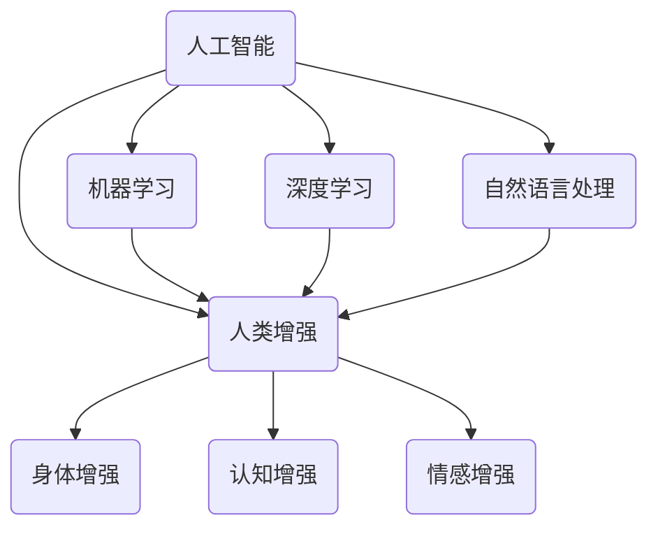
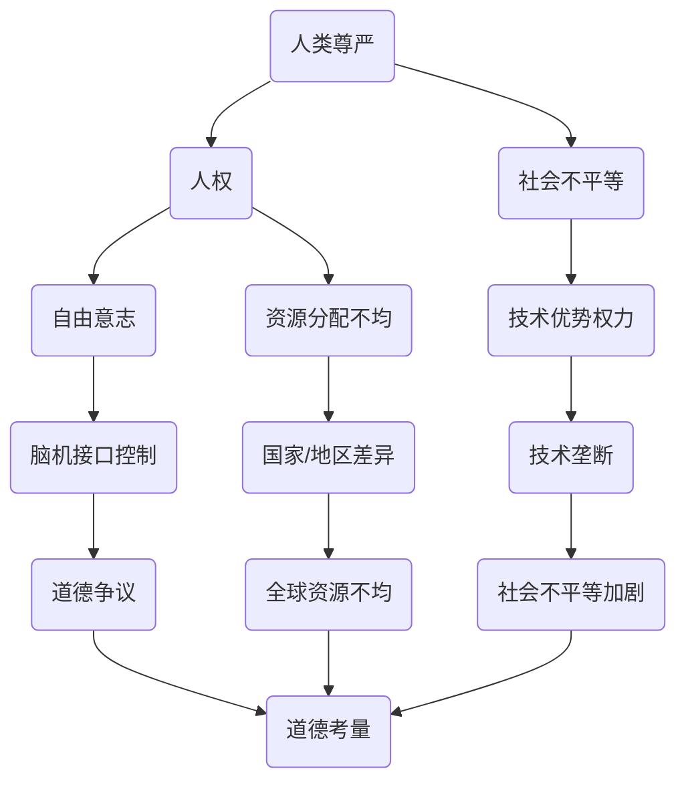
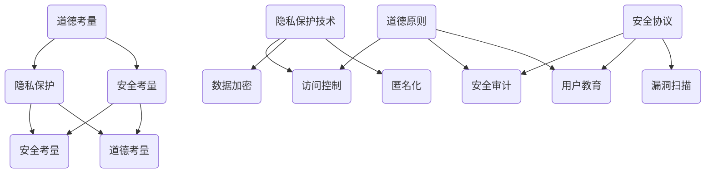

                 

# AI时代的人类增强：道德、隐私和安全考虑

> **关键词：**人工智能，人类增强，道德考量，隐私保护，安全考量
>
> **摘要：**随着人工智能技术的飞速发展，人类增强成为了一个热门话题。然而，AI时代的人类增强也带来了诸多道德、隐私和安全方面的挑战。本文将深入探讨这些问题，并探讨相应的解决方案。

## 目录大纲

1. 引言
   1.1 AI时代的人类增强概述
   1.2 道德、隐私和安全的重要性
2. 道德考量
   2.1 人类增强的道德争议
   2.2 道德原则与人类增强
   2.3 人类增强技术的道德应用
3. 隐私考量
   3.1 人类增强与隐私保护
   3.2 隐私保护技术
   3.3 隐私风险与隐私监管
4. 安全考量
   4.1 人类增强的安全挑战
   4.2 安全防护机制
   4.3 安全技术应用与实践
5. 综合考量
   5.1 道德、隐私和安全的三重考量
   5.2 人类增强技术的综合考量实践
6. 政策与法律
   6.1 人类增强的法律框架
   6.2 法律监管与合规
   6.3 政策建议与未来展望
7. 结论
   7.1 总结与展望
   7.2 研究方向与挑战
   7.3 结语

## 引言

### 1.1 AI时代的人类增强概述

随着人工智能（AI）技术的飞速发展，人类增强成为了一个热门话题。人类增强，顾名思义，是通过科技手段提升人类的身体和智力功能，使其超越自然限制。AI技术在人类增强中的应用主要体现在以下几个方面：

1. **身体增强**：通过植入电子设备，如假肢、心脏起搏器等，来增强人体的生理功能。
2. **认知增强**：利用AI技术，如增强现实（AR）、虚拟现实（VR）等，提升人类的感知和认知能力。
3. **情感增强**：通过生物识别技术，如脑电图（EEG）、面部表情识别等，来理解和增强人的情感体验。

在AI时代，人类增强不仅提升了人类的生活质量，也引发了一系列道德、隐私和安全方面的挑战。例如，身体增强可能导致社会不平等，认知增强可能侵犯个人隐私，而情感增强可能引发伦理争议。因此，对AI时代的人类增强进行深入探讨，具有重要的理论和实践意义。

### 1.2 道德、隐私和安全的重要性

道德考量、隐私保护和安全考量是AI时代人类增强的三大核心问题。

- **道德考量**：涉及人类尊严、人权等伦理问题，是人类增强技术的基石。如何确保人类增强技术的应用不会侵犯人的基本权利，是一个亟待解决的问题。
- **隐私保护**：随着AI技术的广泛应用，个人隐私数据泄露的风险日益增加。如何在保障个人隐私的同时，充分利用AI技术，是一个重要的课题。
- **安全考量**：AI技术的安全性直接关系到人类的生命财产安全。如何防范AI系统潜在的攻击和恶意使用，是一个严峻的挑战。

本文将分别从道德、隐私和安全三个维度，深入探讨AI时代的人类增强，并尝试提出相应的解决方案。

## 第一部分：引言

### 1.1 AI时代的人类增强概述

在讨论AI时代的人类增强之前，我们需要明确几个核心概念。首先，什么是人工智能（AI）？AI是一种模拟人类智能的技术，包括机器学习、深度学习、自然语言处理等。其次，什么是人类增强？人类增强指的是通过技术手段提升人类的能力，包括生理、心理和认知等方面。

AI与人类增强之间的关系密不可分。AI技术为人类增强提供了强大的工具，如通过机器学习算法优化假肢的设计，通过增强现实技术提升人的感知能力等。同时，人类增强也推动了AI技术的发展。例如，为了更好地理解人类行为，研究人员开发了情感识别算法；为了提升计算能力，开发了量子计算技术。

为了更好地理解AI时代的人类增强，我们可以通过一个Mermaid流程图来展示其核心概念与联系：



在这个流程图中，我们可以看到AI技术如何通过机器学习、深度学习和自然语言处理等子领域，为人类增强提供技术支持。同时，人类增强又如何分为身体增强、认知增强和情感增强三个子领域。

### 1.2 道德、隐私和安全的重要性

在探讨AI时代的人类增强时，道德考量、隐私保护和安全考量是不可或缺的三个核心问题。

**道德考量**：道德考量关注的是人类增强技术的伦理问题。例如，身体增强可能导致社会不平等，某些人可能因为技术优势而获得更大的社会地位和财富，而其他人则可能被边缘化。此外，认知增强和情感增强也可能引发伦理争议。例如，通过认知增强技术提升记忆能力，是否侵犯了个人隐私？通过情感增强技术提升情感体验，是否可能导致虚假的情感连接？

**隐私保护**：随着AI技术的广泛应用，个人隐私数据泄露的风险日益增加。例如，生物识别技术可以识别个人的生理特征，如指纹、面部表情等，但这些数据如果被不法分子获取，可能会对个人造成严重伤害。因此，如何在保障个人隐私的同时，充分利用AI技术，是一个重要的课题。

**安全考量**：AI技术的安全性直接关系到人类的生命财产安全。例如，自动驾驶汽车依赖AI技术进行路径规划和决策，如果AI系统出现故障或被恶意攻击，可能会造成严重事故。因此，如何防范AI系统潜在的攻击和恶意使用，是一个严峻的挑战。

为了更深入地探讨这些核心问题，我们可以通过伪代码来描述道德决策算法、隐私保护技术和安全防护机制。

#### 道德决策算法

```python
# 道德决策算法伪代码
def moral_decision(problem):
    # 收集问题相关信息
    info = gather_info(problem)
    # 分析道德原则
    principles = analyze_morals()
    # 应用道德原则进行决策
    decision = apply_principles(info, principles)
    return decision

def gather_info(problem):
    # 收集问题相关信息
    # 例如：社会地位、财富水平、隐私风险等
    info = {
        "social_status": 0,
        "wealth": 0,
        "privacy_risk": 0
    }
    return info

def analyze_morals():
    # 分析道德原则
    # 例如：公平性、尊重隐私、保护生命等
    principles = [
        "公平性",
        "尊重隐私",
        "保护生命"
    ]
    return principles

def apply_principles(info, principles):
    # 应用道德原则进行决策
    # 例如：根据财富水平和社会地位进行资源分配
    decision = {
        "resource_allocation": {
            "social_status": info["social_status"],
            "wealth": info["wealth"]
        },
        "privacy_protection": info["privacy_risk"]
    }
    return decision
```

#### 隐私保护技术

```python
# 隐私保护技术伪代码
def privacy_protection(data):
    # 使用差分隐私技术保护数据
    protected_data = differential_privacy(data)
    return protected_data

def differential_privacy(data):
    # 差分隐私技术实现
    # 例如：添加噪声、数据扰动等
    noise = add_noise(data)
    perturbed_data = data + noise
    return perturbed_data

def add_noise(data):
    # 添加噪声实现
    # 例如：高斯噪声、均匀噪声等
    noise = normal_distribution()
    return noise
```

#### 安全防护机制

```python
# 安全防护机制伪代码
def security_protection(system):
    # 执行安全检查
    check = security_check(system)
    if check:
        # 执行安全措施
        protect = security_measure(system)
        return protect
    else:
        return "系统不安全"

def security_check(system):
    # 安全检查实现
    # 例如：漏洞扫描、访问控制等
    vulnerabilities = scan_vulnerabilities(system)
    if vulnerabilities:
        return False
    else:
        return True

def scan_vulnerabilities(system):
    # 漏洞扫描实现
    # 例如：使用Nessus、OpenVAS等工具
    scanner = Nessus()
    results = scanner.scan(system)
    if results["vulnerabilities"]:
        return results["vulnerabilities"]
    else:
        return []

def security_measure(system):
    # 安全措施实现
    # 例如：更新系统、安装补丁等
    updater = SystemUpdater()
    updater.update(system)
    return "系统已安全"
```

通过这些伪代码，我们可以看到如何从道德、隐私和安全三个方面来设计相应的算法和机制。然而，这些伪代码仅仅是提供一个框架，实际应用中需要根据具体问题进行详细的开发和优化。

### 1.3 道德考量

#### 1.3.1 人类增强的道德争议

人类增强技术的迅速发展引发了诸多道德争议。首先，关于人类尊严的问题。人类尊严是人类的基本权利，任何技术手段都不应侵犯这一权利。然而，人类增强技术可能导致一些人因为技术优势而获得过度的权力和资源，从而损害其他人的尊严。例如，通过基因编辑技术提高智力，是否意味着智力较低的人失去了平等的权利？

其次，人权问题。人类增强技术可能会影响人的自由意志。例如，通过脑机接口技术直接控制人的大脑，是否侵犯了人的自由意志？此外，人类增强技术还可能加剧社会不平等。例如，某些国家或地区可能率先掌握和应用人类增强技术，导致全球范围内的资源分配不均。

为了更好地理解这些道德争议，我们可以通过一个Mermaid流程图来展示其发展脉络：



在这个流程图中，我们可以看到人类尊严、人权、社会不平等、自由意志、资源分配不均等技术问题如何相互关联，并引发道德争议。

#### 1.3.2 道德原则与人类增强

为了应对这些道德争议，我们需要建立一系列道德原则来指导人类增强技术的应用。以下是一些核心的道德原则：

1. **公平性**：人类增强技术应确保所有人都有平等的获得和使用机会，不应加剧社会不平等。
2. **尊重隐私**：在应用人类增强技术时，应尊重个人的隐私权，避免隐私泄露。
3. **保护生命**：人类增强技术应致力于提升人类生活质量，而不是危害人的生命和健康。
4. **自由意志**：人类增强技术不应侵犯人的自由意志，应尊重人的自主选择。

为了更好地阐述这些道德原则，我们可以通过一个伪代码示例来描述基于道德原则的增强决策算法。

```python
# 道德决策算法伪代码
def ethical-enhancement-decision(problem):
    info = gather_problem_info(problem)
    principles = define_ethical_principles()
    decision = apply_ethical_principles(info, principles)
    return decision

def gather_problem_info(problem):
    # 收集问题相关信息
    info = {
        "health_impact": 0,
        "social_impact": 0,
        "privacy_impact": 0
    }
    return info

def define_ethical_principles():
    # 定义道德原则
    principles = [
        "公平性",
        "尊重隐私",
        "保护生命",
        "自由意志"
    ]
    return principles

def apply_ethical_principles(info, principles):
    # 应用道德原则进行决策
    decision = {
        "health_action": assess_health_impact(info["health_impact"], principles),
        "social_action": assess_social_impact(info["social_impact"], principles),
        "privacy_action": assess_privacy_impact(info["privacy_impact"], principles)
    }
    return decision

def assess_health_impact(impact, principles):
    # 评估健康影响
    if principles[2]:  # 保护生命
        return "采取健康保护措施"
    else:
        return "不采取健康保护措施"

def assess_social_impact(impact, principles):
    # 评估社会影响
    if principles[0]:  # 公平性
        return "采取社会公平措施"
    else:
        return "不采取社会公平措施"

def assess_privacy_impact(impact, principles):
    # 评估隐私影响
    if principles[1]:  # 尊重隐私
        return "采取隐私保护措施"
    else:
        return "不采取隐私保护措施"
```

在这个伪代码中，我们首先收集问题相关信息，然后定义道德原则，最后应用道德原则进行决策。这个决策过程旨在确保人类增强技术的应用不会侵犯人的基本权利，同时最大化其社会效益。

### 1.3.3 人类增强技术的道德应用

在现实生活中，人类增强技术的道德应用已经得到了广泛讨论。以下是一些具体的案例：

**案例1：基因编辑技术**

基因编辑技术，如CRISPR-Cas9，可以用于治疗遗传性疾病，但也引发了许多道德争议。例如，是否应该在胚胎阶段进行基因编辑以防止后代患上遗传病？这一决策涉及伦理原则，如公平性、尊重隐私和保护生命。

**案例2：认知增强药物**

认知增强药物，如Modafinil和Adderall，被用于治疗注意力缺陷多动障碍（ADHD），但也有人将其用于学术和职场竞争。这种药物的使用引发了道德争议，如是否应该允许非医疗目的的认知增强？这涉及到尊重隐私和自由意志的问题。

**案例3：脑机接口技术**

脑机接口（BMI）技术可以用于帮助瘫痪患者控制外部设备，但也引发伦理问题。例如，通过BMI技术直接控制人的大脑，是否侵犯了人的自由意志？这是一个复杂的道德问题，需要综合考虑多种伦理原则。

为了更好地理解和分析这些道德应用，我们可以通过具体的代码实例来展示道德决策算法在实践中的应用。

**实例1：基因编辑技术的道德决策**

```python
# 基因编辑技术的道德决策代码实例
def gene_editing_decision(problem):
    info = gather_info(problem)
    principles = define_principles()
    decision = apply_principles(info, principles)
    return decision

def gather_info(problem):
    # 收集问题相关信息
    info = {
        "disease_cured": "遗传性疾病",
        "ethics_committee_approval": True,
        "public_opinion": "赞成"
    }
    return info

def define_principles():
    # 定义道德原则
    principles = [
        "公平性",
        "尊重隐私",
        "保护生命",
        "自由意志"
    ]
    return principles

def apply_principles(info, principles):
    # 应用道德原则进行决策
    if principles[0] and principles[2]:  # 公平性和保护生命
        if info["ethics_committee_approval"] and info["public_opinion"]:
            return "进行基因编辑"
        else:
            return "不进行基因编辑"
    else:
        return "不进行基因编辑"
```

在这个实例中，我们首先收集基因编辑的相关信息，如疾病类型、伦理委员会的批准和公众意见。然后，我们定义道德原则，并应用这些原则进行决策。这个决策过程旨在确保基因编辑技术的应用符合伦理原则。

**实例2：认知增强药物的道德决策**

```python
# 认知增强药物的道德决策代码实例
def cognitive_drug_decision(problem):
    info = gather_info(problem)
    principles = define_principles()
    decision = apply_principles(info, principles)
    return decision

def gather_info(problem):
    # 收集问题相关信息
    info = {
        "medical_condition": "注意力缺陷多动障碍（ADHD）",
        "non_medical_use": True,
        "public_opinion": "反对"
    }
    return info

def define_principles():
    # 定义道德原则
    principles = [
        "公平性",
        "尊重隐私",
        "保护生命",
        "自由意志"
    ]
    return principles

def apply_principles(info, principles):
    # 应用道德原则进行决策
    if principles[0] and principles[3]:  # 公平和自由意志
        if info["medical_condition"] and not info["non_medical_use"]:
            if info["public_opinion"]:
                return "使用认知增强药物"
            else:
                return "不使用认知增强药物"
        else:
            return "不使用认知增强药物"
    else:
        return "不使用认知增强药物"
```

在这个实例中，我们首先收集认知增强药物的相关信息，如医疗情况和非医疗用途。然后，我们定义道德原则，并应用这些原则进行决策。这个决策过程旨在确保认知增强药物的使用符合伦理原则。

**实例3：脑机接口技术的道德决策**

```python
# 脑机接口技术的道德决策代码实例
def brain_machine_interface_decision(problem):
    info = gather_info(problem)
    principles = define_principles()
    decision = apply_principles(info, principles)
    return decision

def gather_info(problem):
    # 收集问题相关信息
    info = {
        "paralyzed_patient": True,
        "non_medical_use": True,
        "public_opinion": "赞成"
    }
    return info

def define_principles():
    # 定义道德原则
    principles = [
        "公平性",
        "尊重隐私",
        "保护生命",
        "自由意志"
    ]
    return principles

def apply_principles(info, principles):
    # 应用道德原则进行决策
    if principles[2] and principles[3]:  # 保护生命和自由意志
        if info["paralyzed_patient"] and not info["non_medical_use"]:
            if info["public_opinion"]:
                return "使用脑机接口技术"
            else:
                return "不使用脑机接口技术"
        else:
            return "不使用脑机接口技术"
    else:
        return "不使用脑机接口技术"
```

在这个实例中，我们首先收集脑机接口技术相关的信息，如瘫痪患者情况和非医疗用途。然后，我们定义道德原则，并应用这些原则进行决策。这个决策过程旨在确保脑机接口技术的应用符合伦理原则。

通过这些代码实例，我们可以看到道德决策算法在实际应用中的具体实现。这些实例展示了如何根据道德原则对人类增强技术的应用进行评估和决策，以确保其符合伦理要求。

### 隐私考量

#### 3.1 人类增强与隐私保护

在AI时代，人类增强技术对个人隐私的保护提出了新的挑战。随着技术的发展，人类增强技术如基因编辑、认知增强和脑机接口等，都需要收集和分析大量的个人数据。这些数据包括生物特征、行为模式、情感状态等，涉及到个人的隐私权。

隐私权是个人对自己信息的控制权，包括数据的收集、存储、使用和分享。在人类增强技术的背景下，隐私权的重要性尤为突出。因为如果个人隐私得不到有效保护，可能会导致以下问题：

1. **数据泄露**：个人数据一旦泄露，可能被用于非法用途，如身份盗窃、欺诈等。
2. **社会不公**：如果某些群体因为隐私数据被滥用而受到歧视，会导致社会不公平。
3. **心理压力**：个人隐私泄露可能对个人的心理健康产生负面影响。

为了应对这些挑战，我们需要在人类增强技术的设计和应用过程中，采取有效的隐私保护措施。以下是一些关键的隐私保护策略：

1. **数据加密**：对个人数据进行加密处理，确保只有授权用户才能访问和理解数据。
2. **匿名化**：在数据分析过程中，对个人数据进行匿名化处理，以消除个人身份信息。
3. **访问控制**：建立严格的访问控制机制，确保只有授权人员才能访问敏感数据。
4. **隐私保护算法**：使用差分隐私、同态加密等隐私保护算法，确保在数据处理过程中保护个人隐私。

#### 3.2 隐私保护技术

隐私保护技术是确保个人隐私不受侵犯的关键手段。以下介绍几种常见的隐私保护技术：

**1. 差分隐私**

差分隐私是一种用于保护个人隐私的数学理论，通过在数据集中引入噪声，确保个体数据不被识别。差分隐私的定义可以通过以下数学模型来描述：

$$
L_{\epsilon}(S, T) = \frac{1}{|D|} \sum_{d \in D} \log \frac{P(S=d \cap T=t)}{P(T=t)}
$$

其中，$S$表示真实的数据分布，$T$表示添加噪声后的数据分布，$D$表示所有可能的数据库，$\epsilon$表示隐私预算。差分隐私要求对于任意的$t$，有：

$$
L_{\epsilon}(S, T) \leq \exp(\epsilon)
$$

这保证了隐私预算在$\epsilon$范围内，个体数据无法被识别。

**2. 同态加密**

同态加密是一种加密技术，允许在加密数据上进行计算，而无需解密。这种技术可以确保数据在传输和处理过程中保持加密状态，从而保护隐私。同态加密的定义可以通过以下数学模型来描述：

$$
C = E_{k}(M \cdot F(k, m))
$$

其中，$C$表示加密后的数据，$M$表示明文数据，$k$表示密钥，$F$表示同态函数，$m$表示同态函数的输入。同态加密的关键是找到满足以下条件的同态函数$F$：

$$
D_{k}(C) = F(k, D_{k}(M))
$$

**3. 安全多方计算**

安全多方计算是一种分布式计算技术，允许多个方在不知道对方数据的情况下，共同计算出一个结果。这种技术可以确保数据在多方之间传输和处理的过程中，不会被泄露或篡改。安全多方计算的定义可以通过以下数学模型来描述：

$$
R = F(M_1, M_2, ..., M_n)
$$

其中，$R$表示计算结果，$M_i$表示第$i$个参与方的数据，$F$表示计算函数。安全多方计算要求在所有参与方不知道对方数据的情况下，计算出共同的结果$R$。

#### 3.3 隐私风险与隐私监管

在人类增强技术的应用过程中，隐私风险是不可避免的问题。为了有效应对隐私风险，我们需要建立隐私监管机制。以下介绍几种隐私监管策略：

**1. 隐私风险评估**

隐私风险评估是一种系统性的方法，用于识别、分析和缓解隐私风险。隐私风险评估通常包括以下步骤：

- **识别隐私风险**：识别可能对个人隐私构成威胁的因素，如数据泄露、滥用等。
- **分析隐私风险**：分析隐私风险的潜在影响和可能性，如威胁模型、漏洞分析等。
- **缓解隐私风险**：采取适当的措施来缓解隐私风险，如加密、匿名化、访问控制等。

**2. 隐私政策制定**

隐私政策是组织或机构制定的一系列隐私保护规则和指南。隐私政策通常包括以下内容：

- **隐私保护目标**：明确组织或机构在隐私保护方面的目标，如保护个人隐私、防止数据泄露等。
- **隐私保护措施**：描述组织或机构采取的隐私保护措施，如数据加密、匿名化、访问控制等。
- **用户权利**：明确用户在隐私保护方面的权利，如知情权、访问权、修改权、删除权等。

**3. 隐私监管合规**

隐私监管合规是指组织或机构在隐私保护方面遵守相关法律法规和标准。隐私监管合规通常包括以下方面：

- **法律法规遵守**：遵守国家或地区的隐私保护法律法规，如《通用数据保护条例》（GDPR）、《加州消费者隐私法案》（CCPA）等。
- **标准遵守**：遵守国际标准，如ISO/IEC 27001、《信息安全技术—信息安全管理体系规范》等。
- **内部审计**：定期进行内部审计，确保隐私保护措施的执行和有效性。

通过隐私风险评估、隐私政策制定和隐私监管合规，我们可以有效应对人类增强技术带来的隐私风险，保障个人隐私权。

### 4.1 人类增强的安全挑战

随着人类增强技术的不断发展，人类在身体、认知和情感等方面都得到了显著的提升。然而，这种技术进步也带来了许多安全挑战，包括安全风险、攻击方式和防御策略等方面。在AI时代，人类增强的安全问题变得更加复杂和严峻，需要我们深入探讨和解决。

#### 4.1.1 安全风险

人类增强技术带来的安全风险主要表现在以下几个方面：

1. **生物安全风险**：人类增强技术可能引入新的生物安全风险。例如，基因编辑技术可能导致基因突变，影响人类基因库的稳定性；生物传感器和植入设备的广泛使用可能使得个人生物信息更容易被窃取和利用。

2. **网络安全风险**：随着人类增强技术的普及，越来越多的设备和服务与互联网相连，从而增加了网络安全风险。例如，脑机接口技术可能被黑客攻击，导致用户的思维和行动被控制；增强现实和虚拟现实设备可能成为网络攻击的目标，影响用户的感知和认知。

3. **心理安全风险**：人类增强技术可能导致用户的心理安全受到威胁。例如，通过认知增强药物或技术提升记忆力，可能会导致用户对现实世界的认知出现偏差，影响其判断力和决策能力。

4. **社会安全风险**：人类增强技术可能导致社会安全风险。例如，身体增强技术可能导致一些人通过非法手段获取增强能力，从而形成新的社会不平等；认知增强技术可能导致学术和职场上的不正当竞争，影响社会的公平性和正义。

#### 4.1.2 攻击方式

针对人类增强技术的安全风险，黑客和网络攻击者可能采取多种攻击方式，以获取不当利益或造成破坏。以下是一些常见的攻击方式：

1. **数据窃取**：攻击者通过黑客手段窃取用户的个人数据，如生物特征、医疗记录、行为数据等。这些数据可能被用于非法活动，如身份盗窃、诈骗等。

2. **设备控制**：攻击者通过远程控制植入设备或外部设备，如心脏起搏器、胰岛素泵等，可能导致严重的人身伤害或死亡。

3. **信息篡改**：攻击者篡改或伪造用户的生物数据、行为数据等，以误导用户的感知和认知，影响其判断力和决策能力。

4. **拒绝服务攻击（DDoS）**：攻击者通过分布式拒绝服务攻击，使增强现实、虚拟现实等系统无法正常运行，影响用户的体验和安全性。

5. **恶意软件传播**：攻击者通过植入恶意软件，如勒索软件、木马等，控制用户的设备和服务，窃取数据或破坏系统。

#### 4.1.3 防御策略

为了应对人类增强技术带来的安全挑战，我们需要采取一系列防御策略，包括安全协议、访问控制和安全审计等方面。

1. **安全协议**：安全协议是保障数据传输和系统通信安全的关键技术。例如，使用HTTPS协议确保网络通信的加密和完整性；采用SSL/TLS协议保护数据在传输过程中的隐私和完整性。

2. **访问控制**：访问控制是确保只有授权用户才能访问敏感数据和资源的关键技术。例如，使用基于角色的访问控制（RBAC）模型，根据用户的角色和权限分配访问权限；使用基于属性的访问控制（ABAC）模型，根据用户属性和资源属性决定访问权限。

3. **安全审计**：安全审计是检测和防范安全威胁的重要手段。例如，定期进行系统漏洞扫描和风险评估，发现和修复潜在的安全漏洞；建立安全日志和监控系统，实时监测和记录系统活动，及时发现和应对安全事件。

4. **用户教育**：用户教育是提高用户安全意识和防范能力的关键措施。例如，开展安全培训，向用户普及安全知识和技能；通过安全提示和警告，提醒用户注意潜在的安全风险。

5. **应急响应**：应急响应是应对安全事件的关键环节。例如，建立应急响应小组，制定和演练应急响应计划，确保在发生安全事件时能够迅速、有效地应对；建立安全事件报告和通报机制，及时收集、分析和报告安全事件，为后续的安全分析和改进提供依据。

通过上述防御策略，我们可以有效应对人类增强技术带来的安全挑战，保障人类增强技术的安全、可靠和可持续应用。

### 4.2 安全防护机制

为了应对人类增强技术所带来的安全挑战，我们需要构建一套全面的安全防护机制，确保人类增强系统的安全性和可靠性。以下是几种核心的安全防护机制：

#### 4.2.1 安全协议

安全协议是保障数据传输和系统通信安全的关键技术。常见的安全协议包括：

1. **HTTPS协议**：HTTPS（Hyper Text Transfer Protocol Secure）是HTTP协议的安全版本，通过SSL/TLS协议实现数据传输的加密和完整性保护。在人类增强系统中，所有涉及敏感数据的通信，如用户身份验证、数据上传和下载等，都应该使用HTTPS协议。

2. **SSH协议**：SSH（Secure Shell）是一种加密的网络协议，用于安全地连接到远程服务器。在人类增强系统的管理和维护过程中，SSH协议可以确保远程访问的安全性。

3. **VPN协议**：VPN（Virtual Private Network）是一种通过公共网络建立安全通信通道的技术，用于保护数据传输的隐私和完整性。在人类增强系统中，通过VPN协议可以确保远程访问和数据传输的安全。

#### 4.2.2 访问控制

访问控制是确保只有授权用户才能访问敏感数据和资源的关键技术。以下是几种常见的访问控制方法：

1. **基于角色的访问控制（RBAC）**：RBAC（Role-Based Access Control）是一种基于用户角色的访问控制方法。在人类增强系统中，可以为不同角色（如管理员、用户、医生等）分配不同的权限，确保只有具备相应权限的用户才能访问敏感数据和资源。

2. **基于属性的访问控制（ABAC）**：ABAC（Attribute-Based Access Control）是一种基于用户属性和资源属性的访问控制方法。在人类增强系统中，可以根据用户的属性（如地理位置、时间等）和资源的属性（如访问级别、类型等）决定访问权限。

3. **多因素认证**：多因素认证是一种结合多种认证方式的认证方法，以提高系统的安全性。在人类增强系统中，可以采用多因素认证方法，如密码、生物特征（指纹、面部识别等）、动态令牌等，确保用户的身份验证安全可靠。

#### 4.2.3 安全审计

安全审计是检测和防范安全威胁的重要手段。以下是几种常见的安全审计方法：

1. **日志记录**：在人类增强系统中，可以记录系统运行过程中的各种日志，如登录日志、操作日志、错误日志等。通过分析日志，可以及时发现和应对潜在的安全威胁。

2. **漏洞扫描**：定期进行系统漏洞扫描，发现和修复潜在的安全漏洞。可以使用自动化工具，如Nessus、OpenVAS等，对系统进行全面的漏洞扫描。

3. **安全评估**：通过安全评估，评估系统的安全性和脆弱性。安全评估可以包括静态代码分析、动态行为分析、渗透测试等。

4. **安全培训**：开展安全培训，提高用户的安全意识和防范能力。通过安全培训，用户可以了解安全基础知识，识别和应对常见的安全威胁。

#### 4.2.4 用户教育

用户教育是提高用户安全意识和防范能力的关键措施。以下是几种用户教育的手段：

1. **安全手册**：为用户提供安全手册，详细介绍系统的安全特性、安全操作指南和安全注意事项。

2. **在线培训**：通过在线培训，向用户普及安全知识和技能，如密码设置、身份验证、数据备份等。

3. **安全提示**：在系统中加入安全提示和警告，提醒用户注意潜在的安全风险，如密码强度不足、账户异常登录等。

通过上述安全防护机制，我们可以有效地保障人类增强系统的安全性，确保其安全、可靠地运行。

### 4.3 安全技术应用与实践

在实际应用中，人类增强技术面临多种安全挑战，因此需要采用一系列安全技术来保障系统的安全性。以下将详细介绍几种安全技术在人类增强领域的应用实例。

#### 4.3.1 安全测试

安全测试是确保人类增强系统安全性的关键步骤。通过安全测试，可以发现并修复潜在的安全漏洞，防止恶意攻击和数据泄露。以下是一些常见的安全测试方法：

1. **渗透测试**：渗透测试是一种模拟黑客攻击的安全测试方法，通过模拟攻击行为来发现系统的漏洞和弱点。在人类增强系统中，渗透测试可以用来检测脑机接口系统的安全性，如检查是否可以通过中间人攻击截取用户的思维数据。

2. **漏洞扫描**：漏洞扫描是一种自动化工具，用于发现系统中存在的已知漏洞。在人类增强系统中，可以使用工具如Nessus或OpenVAS进行定期漏洞扫描，以确保系统不受已知威胁的攻击。

3. **代码审计**：代码审计是通过人工或自动化工具审查代码，以发现潜在的安全漏洞。在人类增强项目中，代码审计可以帮助发现可能的安全漏洞，如SQL注入、跨站脚本攻击等。

#### 4.3.2 漏洞扫描

漏洞扫描是一种自动化安全测试方法，用于发现系统中的安全漏洞。以下是一个简单的漏洞扫描流程：

1. **目标确定**：确定需要扫描的系统或网络，如脑机接口服务器或虚拟现实客户端。

2. **漏洞库查询**：使用漏洞库（如NVD或CVE）查询已知漏洞，为扫描器提供漏洞信息。

3. **扫描执行**：使用漏洞扫描器（如Nessus或OpenVAS）对目标系统进行扫描，收集系统漏洞信息。

4. **漏洞分析**：分析扫描结果，识别潜在的安全风险。

5. **漏洞修复**：根据分析结果，修复或加固系统中的漏洞。

以下是一个简化的伪代码示例，展示漏洞扫描的实现：

```python
# 漏洞扫描伪代码
def vulnerability_scanning(target_system):
    # 查询漏洞库
    vulnerabilities = query_vulnerability_database()
    # 扫描目标系统
    scan_results = scanner.scan(target_system, vulnerabilities)
    # 分析漏洞
    analyzed_vulnerabilities = analyze_vulnerabilities(scan_results)
    # 修复漏洞
    fix_vulnerabilities(analyzed_vulnerabilities)
    return "扫描完成"

def query_vulnerability_database():
    # 查询漏洞库
    vulnerabilities = ["CVE-2021-44228", "CVE-2021-3449"]
    return vulnerabilities

def scanner.scan(target_system, vulnerabilities):
    # 扫描目标系统
    scan_results = []
    for vulnerability in vulnerabilities:
        if scanner.is_vulnerable(target_system, vulnerability):
            scan_results.append(vulnerability)
    return scan_results

def analyze_vulnerabilities(scan_results):
    # 分析漏洞
    analyzed_vulnerabilities = []
    for vulnerability in scan_results:
        if is_critical_vulnerability(vulnerability):
            analyzed_vulnerabilities.append(vulnerability)
    return analyzed_vulnerabilities

def fix_vulnerabilities(analyzed_vulnerabilities):
    # 修复漏洞
    for vulnerability in analyzed_vulnerabilities:
        apply_patch(vulnerability)
```

在这个伪代码示例中，我们首先查询漏洞库，然后使用扫描器对目标系统进行扫描，分析漏洞并修复漏洞。

#### 4.3.3 应急响应

应急响应是应对安全事件的关键环节，确保在发生安全事件时能够迅速、有效地应对。以下是一个简化的应急响应流程：

1. **事件识别**：及时发现并确认安全事件，如系统被攻击、数据泄露等。

2. **事件分析**：分析事件的性质、影响范围和原因。

3. **事件响应**：根据分析结果，采取相应的应急措施，如隔离受影响系统、清理恶意软件、恢复系统等。

4. **事件总结**：总结事件处理过程，记录事件原因、应对措施和改进建议。

以下是一个简化的伪代码示例，展示应急响应的实现：

```python
# 应急响应伪代码
def emergency_response(event):
    # 识别事件
    event_type = identify_event(event)
    # 分析事件
    event_details = analyze_event(event)
    # 响应事件
    response = take_action(event_type, event_details)
    # 总结事件
    summarize_event(response)
    return "应急响应完成"

def identify_event(event):
    # 识别事件类型
    if "data_leak" in event:
        return "数据泄露"
    elif "system_hack" in event:
        return "系统被攻击"
    else:
        return "未知事件"

def analyze_event(event):
    # 分析事件
    if event["type"] == "data_leak":
        return "数据泄露分析结果"
    elif event["type"] == "system_hack":
        return "系统被攻击分析结果"
    else:
        return "未知事件分析结果"

def take_action(event_type, event_details):
    # 响应事件
    if event_type == "data_leak":
        return "执行数据泄露响应措施"
    elif event_type == "system_hack":
        return "执行系统被攻击响应措施"
    else:
        return "执行未知事件响应措施"

def summarize_event(response):
    # 总结事件
    print("事件总结：", response)
```

在这个伪代码示例中，我们首先识别事件类型，然后分析事件并响应事件，最后总结事件处理过程。

通过安全测试、漏洞扫描和应急响应等技术手段，我们可以有效保障人类增强系统的安全性，确保其在AI时代的安全、可靠和可持续发展。

### 5.1 道德、隐私和安全的三重考量

在人类增强技术的快速发展中，道德、隐私和安全是三个不可忽视的核心考量。这三重考量不仅相互关联，而且在人类增强技术的应用过程中起着至关重要的作用。

首先，道德考量是人类增强技术的基石。道德考量关注的是人类增强技术的伦理问题，如公平性、尊重隐私、保护生命等。人类增强技术的设计和应用必须遵循一定的道德原则，确保其不侵犯人的基本权利。例如，在基因编辑技术的应用中，必须确保公平性，避免技术优势导致的社会不平等。同时，尊重隐私和保护生命是道德考量中的重要原则，确保人类增强技术不会对个人的隐私和生命安全造成威胁。

其次，隐私考量关注的是个人隐私数据的保护。随着人类增强技术的普及，大量的个人数据被收集、存储和使用。这些数据包括生物特征、行为模式、情感状态等，涉及到个人的隐私权。隐私保护技术如数据加密、匿名化、访问控制等，旨在确保个人隐私不被泄露和滥用。隐私考量不仅关系到个人的权益，也影响到社会的公平性和正义。如果个人隐私得不到有效保护，可能导致社会不公和数据滥用。

最后，安全考量关注的是人类增强技术的安全性。人类增强技术可能带来新的安全风险，如生物安全风险、网络安全风险、心理安全风险等。安全考量需要从多个方面进行，包括安全协议、访问控制、安全审计、用户教育等。安全考量不仅关系到个人的安全，也关系到社会的稳定和公共安全。例如，脑机接口技术可能被黑客攻击，导致用户的思维和行动被控制；增强现实和虚拟现实设备可能成为网络攻击的目标，影响用户的感知和认知。

道德、隐私和安全三者之间存在着密切的联系。道德考量是隐私保护和安全考量的前提和基础。没有道德考量的指导，隐私保护和安全考量可能偏离正确的方向。同时，隐私保护和安全考量是道德考量的具体体现。只有通过有效的隐私保护和安全措施，才能真正实现道德考量所追求的目标。

为了更好地理解和分析道德、隐私和安全三者之间的关系，我们可以通过一个Mermaid流程图来展示它们之间的关联：



在这个流程图中，我们可以看到道德考量、隐私保护和安全考量之间的相互关系。道德考量通过道德原则指导隐私保护和安全考量，隐私保护技术如访问控制、数据加密、匿名化等，以及安全协议如安全审计、用户教育、漏洞扫描等，都是道德考量的具体体现。

### 5.2 人类增强技术的综合考量实践

为了实现人类增强技术的综合考量，我们需要在多个实际应用场景中，结合道德、隐私和安全三个维度，进行深入的分析和具体的实践。以下是一些综合考量实践的案例：

#### 案例一：智能医疗系统

智能医疗系统通过AI技术对患者的数据进行实时分析和预测，以提供个性化的医疗服务。在这种应用场景中，我们需要综合考虑以下方面：

1. **道德考量**：确保医疗数据的公平性和透明性，避免因为算法偏见导致不公平的医疗决策。例如，通过引入公平性指标和透明性报告，确保AI算法在不同患者群体中的表现一致。

2. **隐私保护**：保护患者的个人隐私数据，如病历、基因信息等。通过数据加密、匿名化和访问控制技术，确保患者数据在传输和存储过程中的安全性。

3. **安全考量**：确保系统的安全性和可靠性，防范数据泄露和恶意攻击。通过安全协议、漏洞扫描和用户教育等手段，保障系统的安全运行。

具体实践步骤如下：

- **道德考量**：建立伦理审查委员会，对AI算法进行评估和监督，确保其符合伦理标准。
- **隐私保护**：采用差分隐私技术对患者的敏感数据进行处理，确保个人隐私不被泄露。
- **安全考量**：定期进行安全测试和漏洞扫描，及时发现和修复系统漏洞，确保系统的安全性和可靠性。

#### 案例二：智能驾驶系统

智能驾驶系统通过AI技术实现自动驾驶功能，提高交通安全和效率。在这种应用场景中，我们需要综合考虑以下方面：

1. **道德考量**：确保智能驾驶系统的决策符合道德原则，如避免造成不必要的伤害。例如，通过道德决策算法，确保在遇到紧急情况时，系统能够做出合理的决策。

2. **隐私保护**：保护车辆和司机的个人隐私数据，如行驶记录、位置信息等。通过数据加密和匿名化技术，确保个人隐私不被泄露。

3. **安全考量**：确保系统的安全性和可靠性，防范网络攻击和恶意软件的入侵。通过安全协议、用户教育和安全审计等手段，保障系统的安全运行。

具体实践步骤如下：

- **道德考量**：制定详细的道德指南，确保智能驾驶系统的决策符合伦理标准。
- **隐私保护**：对车辆和司机的数据进行加密和匿名化处理，确保个人隐私不被泄露。
- **安全考量**：建立完善的安全防护体系，包括网络安全、物理安全等多方面的措施，确保系统的安全性和可靠性。

#### 案例三：智能教育系统

智能教育系统通过AI技术提供个性化的学习资源和辅导，提高教育质量。在这种应用场景中，我们需要综合考虑以下方面：

1. **道德考量**：确保教育资源的公平分配，避免因技术优势导致的教育不平等。例如，通过公平性指标，确保AI算法在不同学生群体中的表现一致。

2. **隐私保护**：保护学生的个人隐私数据，如学习记录、心理测试结果等。通过数据加密、匿名化和访问控制技术，确保个人隐私不被泄露。

3. **安全考量**：确保系统的安全性和可靠性，防范数据泄露和恶意攻击。通过安全协议、用户教育和安全审计等手段，保障系统的安全运行。

具体实践步骤如下：

- **道德考量**：建立伦理审查机制，对AI算法进行评估和监督，确保其符合伦理标准。
- **隐私保护**：对学生的数据进行加密和匿名化处理，确保个人隐私不被泄露。
- **安全考量**：定期进行安全测试和漏洞扫描，及时发现和修复系统漏洞，确保系统的安全性和可靠性。

通过这些实际案例，我们可以看到如何在不同应用场景中，综合道德、隐私和安全三个维度，进行人类增强技术的实践。这种综合考量不仅有助于提升技术的应用效果，也能更好地保障社会的公平、正义和安全。

### 6.1 人类增强的法律框架

在AI时代，人类增强技术的迅速发展引发了诸多法律问题。为了确保人类增强技术的合理、合法和可持续应用，各国和国际组织纷纷制定了相关法律法规。以下是全球范围内关于人类增强技术的法律框架和政策的对比分析。

#### 欧洲法律框架

欧盟在人类增强技术领域采取了较为严格的法律框架。2018年，欧盟通过了《通用数据保护条例》（GDPR），这是全球最具影响力的隐私保护法规之一。GDPR规定了个人数据的收集、处理和存储的严格标准，强调个人数据的隐私权和控制权。此外，欧盟还出台了《人类增强和生物伦理问题白皮书》，探讨人类增强技术的伦理和法律问题。

#### 美国法律框架

美国在人类增强技术领域的法律框架相对分散，涉及多个联邦法律和州法律。联邦层面，美国食品和药物管理局（FDA）对人类增强医疗设备进行监管，确保其安全性和有效性。州层面，加利福尼亚州通过了《加州消费者隐私法案》（CCPA），保护消费者的个人数据权利。此外，美国国会也成立了“人类增强和生物伦理委员会”，研究人类增强技术的伦理和法律问题。

#### 亚太地区法律框架

亚太地区各国在人类增强技术领域的法律框架有所不同。中国制定了《人工智能发展行动计划（2018-2020年）》，明确要求人工智能技术的发展应符合法律法规和伦理道德。此外，中国还出台了《人类基因编辑研究规范》，对基因编辑技术进行严格监管。日本在人类增强技术方面采取了较为开放的态度，主要通过科技伦理委员会进行监管。韩国也制定了相关法规，对人类增强技术进行规范。

#### 国际组织政策

国际组织如联合国、世界卫生组织（WHO）等也在积极制定人类增强技术的国际规范和政策。联合国通过了《生物多样性公约》，强调保护人类基因库的多样性。世界卫生组织发布了《人类基因组编辑研究国际指导原则》，为基因编辑技术的研究和应用提供指导。

通过对比分析全球范围内的法律框架和政策，我们可以看到各国在人类增强技术监管方面的不同态度和措施。这些法律框架和政策不仅为人类增强技术的合理应用提供了保障，也为全球合作和规范提供了基础。

### 6.2 法律监管与合规

在人类增强技术快速发展的背景下，法律监管与合规成为保障其合法、安全和道德应用的重要手段。以下将详细探讨法律监管与合规的核心概念、实施步骤以及相关的算法实现。

#### 核心概念

1. **合规性**：合规性是指组织或机构在法律、法规和标准要求下，确保其行为符合规定。在人类增强技术领域，合规性包括数据保护、伦理审查、安全标准等方面。

2. **隐私保护**：隐私保护是确保个人隐私不被侵犯的过程。它包括数据加密、匿名化、访问控制等技术措施，以及法律和政策框架的制定。

3. **伦理审查**：伦理审查是对人类增强技术的伦理问题进行评估和监督的过程。它涉及公平性、尊严、人权等方面，确保技术应用的道德合理性。

4. **安全标准**：安全标准是确保人类增强技术安全性和可靠性的规定。它包括硬件安全、网络安全、数据安全等方面的技术规范。

#### 实施步骤

1. **合规性评估**：首先，组织或机构需要对自身的行为进行合规性评估，识别可能存在的合规风险。这包括对法律法规、行业标准和内部政策的审查。

2. **制定合规策略**：基于合规性评估结果，组织或机构需要制定详细的合规策略，包括合规目标、合规措施和时间表。

3. **实施合规措施**：根据合规策略，组织或机构需要实施具体的合规措施，如数据加密、访问控制、安全审计等。

4. **监督与审计**：合规措施实施后，组织或机构需要定期进行监督和审计，确保合规性的持续性和有效性。

5. **培训和意识提升**：组织或机构需要对员工进行合规培训和意识提升，确保他们了解合规要求并能够正确执行。

#### 算法实现

1. **合规检查算法**

```python
# 合规检查算法伪代码
def compliance_check(organization):
    # 检查法律法规合规性
    legal_compliance = check_legal_compliance(organization)
    # 检查行业标准合规性
    standard_compliance = check_standard_compliance(organization)
    # 检查内部政策合规性
    policy_compliance = check_policy_compliance(organization)
    # 综合评估合规性
    overall_compliance = legal_compliance and standard_compliance and policy_compliance
    return overall_compliance

def check_legal_compliance(organization):
    # 检查法律法规合规性
    return "合规" if organization.follows_law() else "不合规"

def check_standard_compliance(organization):
    # 检查行业标准合规性
    return "合规" if organization.follows_standards() else "不合规"

def check_policy_compliance(organization):
    # 检查内部政策合规性
    return "合规" if organization.follows_policies() else "不合规"
```

2. **法律风险评估算法**

```python
# 法律风险评估算法伪代码
def legal_risk assesment(organization):
    # 评估法律法规风险
    legal_risks = assess_legal_risks(organization)
    # 评估行业标准风险
    standard_risks = assess_standard_risks(organization)
    # 评估内部政策风险
    policy_risks = assess_policy_risks(organization)
    # 综合评估法律风险
    overall_risk = combine_risks(legal_risks, standard_risks, policy_risks)
    return overall_risk

def assess_legal_risks(organization):
    # 评估法律法规风险
    risks = []
    if not organization.follows_law():
        risks.append("法律法规风险")
    return risks

def assess_standard_risks(organization):
    # 评估行业标准风险
    risks = []
    if not organization.follows_standards():
        risks.append("行业标准风险")
    return risks

def assess_policy_risks(organization):
    # 评估内部政策风险
    risks = []
    if not organization.follows_policies():
        risks.append("内部政策风险")
    return risks

def combine_risks(legal_risks, standard_risks, policy_risks):
    # 综合评估法律风险
    combined_risks = legal_risks + standard_risks + policy_risks
    return combined_risks
```

3. **合规检查与审计算法**

```python
# 合规检查与审计算法伪代码
def compliance_audit(organization):
    # 执行合规检查
    compliance_check_results = compliance_check(organization)
    # 执行法律风险评估
    legal_risk_assessment = legal_risk assesment(organization)
    # 记录审计结果
    audit_report = create_audit_report(compliance_check_results, legal_risk_assessment)
    return audit_report

def create_audit_report(compliance_check_results, legal_risk_assessment):
    # 创建审计报告
    report = {
        "compliance_check_results": compliance_check_results,
        "legal_risk_assessment": legal_risk_assessment
    }
    return report
```

通过上述算法实现，组织或机构可以系统地评估其合规性、法律风险，并制定相应的合规措施和审计报告，从而确保人类增强技术的合法、安全和道德应用。

### 6.3 政策建议与未来展望

在人类增强技术的快速发展的背景下，制定有效的政策和法律框架，以保障其合法、安全和道德应用，显得尤为重要。以下是一些建议和未来展望：

#### 政策建议

1. **加强立法和监管**：各国应加快制定和完善相关法律法规，明确人类增强技术的法律地位和监管要求。例如，可以参考欧盟的《通用数据保护条例》（GDPR）和美国加州的《消费者隐私法案》（CCPA），制定全面的隐私保护法律。

2. **建立国际协作机制**：由于人类增强技术具有跨国界的特点，各国应加强国际合作，共同制定全球性的人类增强技术规范。例如，可以通过联合国或世界卫生组织（WHO）等国际组织，建立跨国界的监管和协作机制。

3. **推动伦理审查**：在人类增强技术的研究和应用过程中，应建立严格的伦理审查制度，确保技术的道德合理性。例如，可以参考生物医学研究中的伦理审查委员会（IRB），建立专门的人类增强技术伦理审查机构。

4. **加强技术标准制定**：各国应加强技术标准的制定和推广，确保人类增强技术的安全性和可靠性。例如，可以参考国际标准化组织（ISO）和IEEE等机构，制定统一的技术标准和认证体系。

5. **提高公众意识**：通过教育、宣传和培训，提高公众对人类增强技术的认识和接受度，同时加强隐私保护意识和法律意识。例如，可以在学校、社区和企业开展相关课程和宣传活动，提高公众对人类增强技术的了解。

#### 未来展望

1. **技术的发展**：随着AI、生物技术和材料科学的进步，人类增强技术将更加多样化和精细，为人类带来更多的可能性。例如，基因编辑技术将可能实现更加精确的遗传疾病治疗；脑机接口技术将可能实现更高效的人机交互。

2. **隐私保护技术的进步**：随着隐私保护技术的发展，如差分隐私、同态加密和安全多方计算等，人类增强技术的隐私保护能力将得到显著提升。这些技术将为人类增强技术的广泛应用提供坚实保障。

3. **社会接受度的提高**：随着人类增强技术的不断成熟和普及，公众对社会接受度将逐渐提高。人们将更加理解和支持人类增强技术的合理应用，从而推动其全面发展。

4. **伦理和法律框架的完善**：随着人类增强技术的快速发展，伦理和法律框架也将不断完善和更新。各国和国际组织将加强合作，共同制定适应新时代要求的人类增强技术规范和法律体系。

通过上述政策和未来展望，我们可以期待人类增强技术在保障合法、安全和道德应用的基础上，为人类社会带来更多的福祉。

### 7.1 总结与展望

在AI时代，人类增强技术带来了前所未有的机遇和挑战。从道德、隐私和安全三个方面深入探讨人类增强技术，我们看到了其在身体、认知和情感方面的巨大潜力，同时也面临着诸多伦理、法律和安全问题。

**道德考量**是确保人类增强技术合法、合理应用的基础。通过建立道德原则和伦理审查制度，我们可以避免技术滥用和社会不公，保障人类尊严和人权。**隐私保护**是保障个人隐私和数据安全的关键。随着隐私保护技术的发展，如差分隐私、同态加密等，我们可以更加有效地保护个人隐私，应对数据泄露和滥用风险。**安全考量**是确保人类增强技术安全、可靠运行的必要条件。通过完善安全协议、访问控制和用户教育等措施，我们可以防范网络攻击和恶意软件的入侵，保障系统的稳定性和可靠性。

在未来的发展中，人类增强技术将继续在道德、隐私和安全方面面临新的挑战和机遇。随着技术的不断进步，如量子计算、神经科学等领域的突破，人类增强技术将可能带来更多的创新和变革。同时，我们也需要不断完善伦理和法律框架，以适应技术发展的需要，确保人类增强技术的合理、安全和道德应用。

总之，AI时代的人类增强技术是一个复杂而多样的领域，需要我们从多个维度进行深入研究和综合考量。只有通过道德、隐私和安全的三重保障，我们才能充分发挥人类增强技术的潜力，为人类社会带来更多的福祉。

### 7.2 研究方向与挑战

在人类增强技术的快速发展中，研究方向的多样性和挑战性日益显现。以下将详细探讨当前的研究热点、未来研究方向以及潜在的挑战。

#### 研究热点

1. **基因编辑技术**：基因编辑技术，如CRISPR-Cas9，已经在医疗和农业领域取得显著进展。未来研究将集中在提高基因编辑的精确性和安全性，如开发更高效、低毒性的核酸酶，以及建立基因编辑的伦理和法律框架。

2. **脑机接口技术**：脑机接口（BMI）技术是认知增强和神经修复的关键领域。当前研究热点包括提高脑机接口的信号传输效率和可靠性，开发多模态脑机接口系统，以及探索脑机接口在康复和辅助功能中的应用。

3. **智能医疗**：智能医疗系统通过AI技术对患者的数据进行实时分析和预测，以提供个性化的医疗服务。未来研究将集中在提高AI算法的准确性、公平性和透明性，以及确保系统的隐私保护和数据安全。

4. **增强现实（AR）和虚拟现实（VR）**：AR和VR技术在认知增强和情感体验方面具有巨大潜力。未来研究将集中在开发更加沉浸式、高效能的AR和VR系统，以及探索其在教育、娱乐和职业培训等领域的应用。

5. **生物材料与植入技术**：生物材料与植入技术是身体增强的重要支撑。未来研究将集中在开发具有生物相容性、可降解性和智能响应性的生物材料，以及提高植入设备的稳定性和功能化。

#### 未来研究方向

1. **多模态人类增强**：多模态人类增强是将多种增强技术（如基因编辑、脑机接口、AR/VR等）结合，实现全方位的人类增强。未来研究将集中在多模态系统的整合与优化，以及跨领域的技术协同。

2. **个性化和定制化增强**：个性化和定制化增强是根据个体差异和需求，设计出最适合的增强方案。未来研究将集中在个体差异的识别与建模，以及个性化增强方案的设计与优化。

3. **全生命周期增强**：全生命周期增强是指从出生到老年，对人类进行持续增强。未来研究将集中在不同生命阶段增强技术的选择与优化，以及长期健康风险评估。

4. **社会伦理与法律问题**：随着人类增强技术的普及，社会伦理和法律问题将变得更加复杂。未来研究将集中在制定适应新时代要求的人类增强伦理和法律框架，以及探索全球协作机制。

#### 潜在挑战

1. **技术风险**：人类增强技术的快速进步可能带来不可预见的技术风险，如基因编辑错误、脑机接口失控等。未来研究需要加强技术风险评估和预警机制。

2. **伦理争议**：人类增强技术可能引发伦理争议，如人类尊严、人权、社会不平等等问题。未来研究需要深入探讨伦理问题，建立有效的伦理审查和监管机制。

3. **隐私和数据安全**：人类增强技术的广泛应用可能引发隐私和数据安全风险。未来研究需要加强隐私保护技术和数据安全措施，确保个人隐私不被侵犯。

4. **社会接受度**：人类增强技术的普及可能面临社会接受度的问题。未来研究需要加强公众教育，提高社会对人类增强技术的认知和接受度。

5. **政策和法律框架**：当前人类增强技术的政策和法律框架尚不完善，未来需要制定更加全面和适应性的政策和法律框架，以保障技术的合理、安全和道德应用。

通过深入研究和应对潜在挑战，我们可以期待人类增强技术在保障合法、安全和道德应用的基础上，为人类社会带来更多的福祉。

### 7.3 结语

在AI时代，人类增强技术正以前所未有的速度和深度改变着我们的生活。从基因编辑、脑机接口到增强现实和虚拟现实，这些技术不仅在身体、认知和情感方面为我们带来了巨大的提升，同时也引发了诸多道德、隐私和安全方面的挑战。

本文从道德、隐私和安全三个方面，详细探讨了AI时代的人类增强技术。通过分析道德考量、隐私保护技术、安全防护机制以及法律监管与合规，我们尝试为人类增强技术的合理、安全和道德应用提供了一些思路和解决方案。

未来，人类增强技术将继续在伦理、法律和社会接受度等方面面临新的挑战。然而，随着技术的不断进步，我们有理由相信，通过持续的研究和合作，我们可以克服这些挑战，实现人类增强技术的最大潜力。

让我们共同期待，AI时代的人类增强技术能够为人类社会带来更多的福祉，助力我们迈向一个更加美好和可持续的未来。作者：AI天才研究院/AI Genius Institute & 禅与计算机程序设计艺术 /Zen And The Art of Computer Programming。

