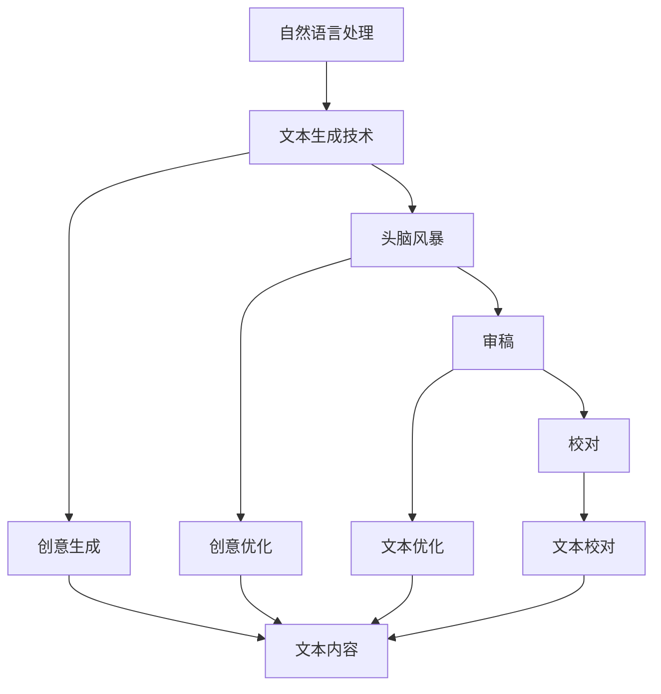

                 

### 引言与背景

**AI时代的创意写作辅助：头脑风暴，审稿与校对**

随着人工智能（AI）技术的迅猛发展，其在各个领域的应用已经越来越广泛。在创意写作领域，AI技术同样展现出巨大的潜力。本文旨在探讨AI在创意写作辅助中的具体应用，包括头脑风暴、审稿与校对等方面。通过逐步分析，我们希望能够深入理解AI如何提升创意写作的效率和质量。

#### **1.1 AI与创意写作的关系**

AI技术在创意写作中的应用主要集中在以下几个方面：

- **文本生成**：AI可以生成文章、故事、诗歌等文本内容，极大地减轻了创作者的负担。

- **内容优化**：AI可以帮助创作者分析现有文本，提供改进建议，从而提高作品的质量。

- **情感识别**：AI可以通过情感分析技术，识别文本中的情感色彩，帮助创作者调整文本风格。

- **风格模仿**：AI可以通过模仿优秀作品的风格，帮助创作者提升写作水平。

#### **1.2 创意写作的现状与挑战**

创意写作面临的挑战主要包括：

- **创意匮乏**：创作者有时会感到缺乏创意，难以产生新作品。

- **时间紧迫**：创作者常常需要在短时间内完成大量作品，压力巨大。

- **质量要求高**：高质量的作品往往需要反复修改和打磨，耗时耗力。

#### **1.3 本书的目标与结构**

本文的目标是：

- **阐述AI技术在创意写作辅助中的应用**。

- **分析AI在头脑风暴、审稿与校对等方面的优势**。

- **探讨AI如何提高创意写作的效率和质量**。

文章结构安排如下：

- **第一部分：引言与背景**：介绍AI与创意写作的关系，以及创意写作面临的挑战。

- **第二部分：AI创意写作辅助技术基础**：讲解AI创意写作辅助的技术原理和应用。

- **第三部分：头脑风暴**：讨论AI辅助头脑风暴的方法和实际案例。

- **第四部分：审稿**：介绍AI辅助审稿的技术和应用。

- **第五部分：校对**：探讨AI辅助校对的方法和实际案例。

通过以上结构，我们将逐步深入探讨AI在创意写作辅助中的具体应用和实践，为创作者提供实用的指导和建议。

### **2. AI创意写作辅助技术基础**

在深入了解AI在创意写作中的应用之前，我们需要先了解一些AI创意写作辅助技术的基础，主要包括自然语言处理（NLP）和文本生成技术。这些技术为AI在创意写作中的广泛应用提供了基础。

#### **2.1 自然语言处理基础**

自然语言处理（NLP）是人工智能领域的一个重要分支，旨在使计算机能够理解、处理和生成人类语言。NLP的核心技术包括语言模型、文本分类、情感分析、命名实体识别等。

##### **2.1.1 语言模型与文本生成**

语言模型是NLP的基础，它通过学习大量文本数据，生成自然语言的概率分布。语言模型在文本生成中有广泛应用，例如自动写作、机器翻译、文本摘要等。

##### **2.1.1.1 语言模型原理**

语言模型通常基于统计模型或深度学习模型。统计模型如N-gram模型，通过计算单词序列的概率分布来生成文本。深度学习模型如循环神经网络（RNN）和 Transformer，通过学习大量的文本数据，生成具有自然流畅性的文本。

##### **2.1.1.2 语言模型应用案例**

- **自动写作**：利用语言模型，AI可以自动生成新闻文章、博客文章、小说等。

- **机器翻译**：语言模型在机器翻译中起着关键作用，它能够将一种语言的文本翻译成另一种语言。

- **文本摘要**：利用语言模型，AI可以自动生成文本的摘要，简化长篇文章。

##### **2.1.1.3 语言模型性能评估**

语言模型的性能评估通常通过BLEU（ bilingual evaluation under study）等指标进行。BLEU评估模型生成的文本与参考文本之间的相似度，分数越高，表示模型生成的文本质量越好。

#### **2.1.2 文本生成技术**

文本生成技术是AI创意写作的重要应用之一，包括生成式文本模型和填充式文本模型。

##### **2.1.2.1 文本生成模型原理**

生成式文本模型通过生成文本的概率分布来生成新的文本。填充式文本模型通过在给定部分文本的基础上，生成后续的文本。

##### **2.1.2.2 文本生成模型应用案例**

- **生成式文本模型**：例如，GPT（Generative Pre-trained Transformer）模型可以生成自然流畅的文章、故事、诗歌等。

- **填充式文本模型**：例如，BERT（Bidirectional Encoder Representations from Transformers）模型可以在给定部分文本的基础上，生成后续的文本。

##### **2.1.2.3 文本生成模型性能评估**

文本生成模型的性能评估通常通过生成文本的质量和生成速度来评估。质量评估可以通过人类评估或自动化评估工具，如ROUGE（Recall-Oriented Understudy for Gisting Evaluation）等指标。

通过以上对自然语言处理基础和文本生成技术的介绍，我们可以看到，AI在创意写作中的应用已经具备了坚实的技术基础。接下来，我们将进一步探讨AI在头脑风暴、审稿与校对等方面的具体应用。

### **3. 头脑风暴**

头脑风暴是一种集思广益的创意生成方法，旨在通过集体讨论和快速思维，产生尽可能多的创意点子。然而，传统的头脑风暴往往受到时间和空间的限制，无法充分发挥每个人的潜力。AI技术的引入，为头脑风暴提供了新的可能。

#### **3.1 头脑风暴原理**

头脑风暴的原理主要基于以下几个原则：

- **开放性**：头脑风暴鼓励参与者不受限制地提出各种想法，无论它们多么荒诞或不切实际。

- **非评价性**：在头脑风暴过程中，所有的想法都应该得到平等的对待，不应该对任何想法进行评价或批评。

- **多样性**：鼓励参与者从不同的角度和视角提出想法，以增加创意的多样性。

- **扩展性**：通过对原始想法的扩展和改进，可以生成更多的创意点子。

##### **3.1.1 头脑风暴的定义**

头脑风暴（Brainstorming）是一种集体创意思维方法，通常由一组人共同参与，旨在通过自由讨论和快速思维，产生尽可能多的创意点子。

##### **3.1.2 头脑风暴的方法**

头脑风暴的方法多种多样，以下是几种常见的头脑风暴方法：

- **头脑风暴会议**：这是一种集中式的头脑风暴方法，通常由一个主持人引导讨论，参与者轮流提出想法。

- **世界咖啡馆**：这种方法将参与者分成多个小组，每个小组在固定时间内讨论特定主题，然后轮流切换小组。

- **六顶思考帽**：这种方法通过六种不同的思考角度（白色、红色、黄色、黑色、绿色和蓝色），引导参与者从不同角度思考问题，产生创意。

- **思维导图**：这种方法通过图形化的方式，将创意点子以树状结构展示出来，便于参与者理解和扩展创意。

##### **3.1.2.1 常见的头脑风暴方法**

以下是几种常见的头脑风暴方法及其特点：

1. **头脑风暴会议**：这是一种最简单的头脑风暴方法，通常由一个主持人引导讨论，参与者轮流提出想法。这种方法适合在团队内部快速产生大量创意点子。

2. **世界咖啡馆**：这种方法将参与者分成多个小组，每个小组在固定时间内讨论特定主题，然后轮流切换小组。这种方法可以促进不同小组之间的交流，激发更多的创意。

3. **六顶思考帽**：这种方法通过六种不同的思考角度（白色、红色、黄色、黑色、绿色和蓝色），引导参与者从不同角度思考问题，产生创意。这种方法有助于全面、深入地探讨问题。

4. **思维导图**：这种方法通过图形化的方式，将创意点子以树状结构展示出来，便于参与者理解和扩展创意。这种方法可以促进参与者之间的协作和灵感碰撞。

##### **3.1.2.2 头脑风暴的技巧**

以下是几种常用的头脑风暴技巧，有助于提高头脑风暴的效果：

1. **无评价**：在头脑风暴过程中，不要对任何想法进行评价或批评，鼓励参与者自由提出各种想法。

2. **数量优先**：鼓励参与者提出尽可能多的想法，数量越多，创意的多样性越高。

3. **延伸想法**：在头脑风暴过程中，可以对原始想法进行扩展和改进，以生成更多的创意点子。

4. **跨领域思考**：鼓励参与者从不同领域和视角提出想法，以激发更多的创意。

通过以上对头脑风暴原理、定义、方法和技巧的介绍，我们可以看到，AI技术可以为头脑风暴提供有效的辅助。接下来，我们将探讨AI在头脑风暴中的应用，以及如何通过AI技术提高头脑风暴的效果。

#### **3.2 AI辅助头脑风暴**

AI技术在头脑风暴中的应用，可以大大提高创意的多样性和质量。以下是一些AI辅助头脑风暴的方法和实际案例：

##### **3.2.1 AI在头脑风暴中的应用**

1. **自动生成创意点子**：AI可以通过文本生成技术，自动生成大量的创意点子。这些点子可以是基于给定主题的，也可以是随机生成的。

2. **情感分析**：AI可以通过情感分析技术，分析文本中的情感色彩，帮助参与者了解不同创意点子的情感影响。

3. **内容优化**：AI可以通过内容优化技术，对现有创意点子进行改进和优化，提高创意的质量。

##### **3.2.1.1 AI生成的创意点子**

AI生成的创意点子具有以下几个特点：

- **数量多**：AI可以在短时间内生成大量的创意点子，大大提高了创意的多样性。

- **独特性**：AI可以通过深度学习模型，从大量的文本数据中学习到独特的创意点子。

- **质量高**：AI可以通过优化算法，对生成的创意点子进行筛选和改进，提高创意的质量。

##### **3.2.1.2 AI辅助头脑风暴的实际案例**

1. **创意广告文案生成**：某广告公司利用AI技术，自动生成创意广告文案。在短时间内，AI生成了大量具有独特风格的广告文案，为公司提供了丰富的创意选择。

2. **创意产品设计**：某产品设计公司利用AI技术，在头脑风暴阶段自动生成创意设计方案。AI生成的创意设计方案，不仅数量多，而且独特性和质量都很高，为设计师提供了宝贵的灵感来源。

通过以上实际案例，我们可以看到，AI在头脑风暴中的应用，不仅提高了创意的多样性和质量，还为参与者提供了更多的创意选择。接下来，我们将探讨AI在审稿方面的应用。

### **4. 审稿**

审稿是写作过程中的一个重要环节，旨在对文本内容进行审查和修改，以提高作品的质量和可读性。AI技术的引入，为审稿提供了新的工具和方法，能够大幅提高审稿的效率和效果。

#### **4.1 审稿的基本原则**

审稿的基本原则包括以下几点：

- **客观性**：审稿人应保持客观，不受个人情感和偏见的影响。

- **全面性**：审稿应对文本内容进行全面审查，包括语法、拼写、逻辑结构等方面。

- **针对性**：审稿应根据作品的具体要求和目标，有针对性地提出修改建议。

- **及时性**：审稿应在合理的时间内完成，以保证作品的进度和质量。

##### **4.1.1 审稿的目的**

审稿的主要目的是：

- **提高文本质量**：通过审稿，发现文本中的问题，并提出修改建议，以提高作品的质量。

- **优化文本结构**：通过审稿，对文本的逻辑结构和组织进行优化，使文本更加清晰、流畅。

- **减少错误和漏洞**：通过审稿，发现和纠正文本中的错误和漏洞，确保作品的准确性和完整性。

##### **4.1.2 审稿的标准**

审稿的标准主要包括以下几点：

- **语法正确**：文本中的语法错误应被及时发现并纠正。

- **拼写无误**：文本中的拼写错误应被纠正，包括同音异义词和错别字。

- **逻辑连贯**：文本的逻辑结构应清晰、连贯，无明显逻辑错误。

- **内容准确**：文本中的内容应准确无误，符合事实和逻辑。

- **风格统一**：文本的风格应统一，无明显风格冲突。

- **格式规范**：文本的格式应符合规范，包括段落设置、字体、字号、行距等。

#### **4.2 AI辅助审稿**

AI技术在审稿中的应用，可以大大提高审稿的效率和效果。以下是一些AI辅助审稿的方法和实际案例：

##### **4.2.1 AI在审稿中的应用**

1. **自动识别错误**：AI可以通过自然语言处理技术，自动识别文本中的错误，包括语法错误、拼写错误、逻辑错误等。

2. **提供修改建议**：AI可以通过分析文本内容，提供修改建议，包括调整语句结构、优化用词、修正逻辑等。

3. **分析文本风格**：AI可以通过情感分析技术，分析文本的风格和情感色彩，帮助审稿人评估文本的可读性和吸引力。

4. **分类和标签**：AI可以通过文本分类和标签技术，将文本分类到不同的类别，方便审稿人进行针对性审查。

##### **4.2.1.1 AI识别文本错误**

AI识别文本错误的方法主要包括：

- **语法分析**：AI通过语法分析，识别文本中的语法错误，如主谓不一致、时态错误等。

- **拼写检查**：AI通过拼写检查，识别文本中的拼写错误，如同音异义词、错别字等。

- **逻辑分析**：AI通过逻辑分析，识别文本中的逻辑错误，如逻辑矛盾、逻辑跳跃等。

##### **4.2.1.2 AI提供审稿建议**

AI提供审稿建议的方法主要包括：

- **内容优化**：AI通过分析文本内容，提供内容优化的建议，如调整语句结构、优化用词、修正逻辑等。

- **风格调整**：AI通过分析文本的风格和情感色彩，提供风格调整的建议，如增强文本的吸引力、调整文本的语气等。

- **格式优化**：AI通过分析文本的格式，提供格式优化的建议，如调整段落设置、字体、字号、行距等。

##### **4.2.1.3 AI辅助审稿的实际案例**

1. **自动化审稿工具**：某些文本编辑工具集成了AI审稿功能，可以自动识别文本中的错误，并提供修改建议。例如，Grammarly、Ginger等工具，可以实时检查文本的语法、拼写和风格，帮助用户提高文本质量。

2. **专业审稿服务**：一些专业审稿服务利用AI技术，提供高效的审稿服务。例如，AfterTheDeadline、SlickWrite等平台，可以自动分析文本，提供详细的修改建议，帮助作者提高作品的质量。

通过以上对AI辅助审稿的方法和实际案例的介绍，我们可以看到，AI技术在审稿中的应用，不仅提高了审稿的效率和效果，还为创作者提供了有力的辅助工具。接下来，我们将探讨如何通过AI优化审稿流程。

### **4.3 审稿流程优化**

在传统的审稿流程中，通常需要人工逐一审查文本内容，识别和纠正错误，并提出修改建议。这个过程不仅耗时耗力，而且容易受到主观因素的影响。通过引入AI技术，可以大大优化审稿流程，提高审稿的效率和准确性。

#### **4.3.1 传统审稿流程**

传统审稿流程通常包括以下几个步骤：

1. **文本提交**：作者将文本提交给审稿人。

2. **审稿人阅读**：审稿人逐一阅读文本，识别和记录错误。

3. **修改反馈**：审稿人将修改意见和建议反馈给作者。

4. **作者修改**：作者根据审稿人的反馈，进行文本修改。

5. **再次审稿**：修改后的文本再次提交给审稿人，进行复核。

6. **审稿完成**：审稿流程结束，文本进入下一个阶段。

##### **4.3.2 AI辅助审稿流程**

引入AI技术后，审稿流程可以得到显著优化。以下是一个优化后的AI辅助审稿流程：

1. **文本提交**：作者将文本提交给AI审稿系统。

2. **AI初筛**：AI系统自动识别文本中的错误，包括语法错误、拼写错误、逻辑错误等，并提供初步的修改建议。

3. **AI优化**：AI系统对文本进行内容优化，如调整语句结构、优化用词、修正逻辑等，进一步提文本质量。

4. **审稿人审阅**：AI系统将初步修改后的文本提交给审稿人，审稿人进行复核和补充修改。

5. **AI复核**：AI系统对审稿人的修改进行复核，确保文本的准确性和完整性。

6. **审稿完成**：修改后的文本通过审稿，流程结束，文本进入下一个阶段。

##### **4.3.2.1 AI在审稿流程中的关键步骤**

在AI辅助审稿流程中，以下步骤是关键：

- **AI初筛**：通过自然语言处理技术，AI系统可以快速识别文本中的错误，并提供初步的修改建议。这一步骤可以大大减轻审稿人的工作量，提高审稿效率。

- **AI优化**：通过文本生成和内容优化技术，AI系统可以对文本进行进一步优化，提高文本的质量。这一步骤可以确保文本的逻辑性和可读性。

- **审稿人审阅**：虽然AI技术已经提供了大量的修改建议，但审稿人的专业知识和经验仍然是不可或缺的。审稿人可以对AI的修改进行复核和补充，确保文本的准确性和完整性。

- **AI复核**：AI系统可以对审稿人的修改进行复核，确保文本的准确性和一致性。这一步骤可以避免人为错误，提高文本的质量。

通过以上优化后的AI辅助审稿流程，我们可以看到，AI技术在审稿中的引入，不仅提高了审稿的效率和准确性，还确保了文本的质量。接下来，我们将探讨如何利用AI技术进行校对。

### **5. 校对**

校对是写作过程中最后一个重要环节，旨在确保文本的准确性、可读性和一致性。AI技术的引入，为校对提供了新的工具和方法，能够大幅提高校对的效率和效果。

#### **5.1 校对的基本原则**

校对的基本原则包括以下几点：

- **准确性**：确保文本内容准确无误，包括事实、数据、引用等。

- **一致性**：确保文本在格式、风格、用词等方面保持一致。

- **可读性**：确保文本易于阅读，逻辑清晰，语言流畅。

- **完整性**：确保文本完整无缺，无遗漏或重复。

##### **5.1.1 校对的目的**

校对的主要目的是：

- **纠正错误**：发现和纠正文本中的错误，包括语法错误、拼写错误、逻辑错误等。

- **优化文本**：对文本进行优化，提高其可读性和一致性。

- **提高质量**：确保文本的准确性、完整性和一致性，提高作品的整体质量。

##### **5.1.2 校对的标准**

校对的标准主要包括以下几点：

- **语法正确**：文本中的语法应正确无误，包括主谓一致、时态一致、语态一致等。

- **拼写无误**：文本中的拼写应无误，包括单词拼写、数字拼写、专有名词拼写等。

- **逻辑连贯**：文本的逻辑结构应清晰、连贯，无明显逻辑错误。

- **内容准确**：文本中的内容应准确无误，符合事实和逻辑。

- **风格统一**：文本的风格应统一，无明显风格冲突。

- **格式规范**：文本的格式应符合规范，包括段落设置、字体、字号、行距等。

#### **5.2 AI辅助校对**

AI技术在校对中的应用，可以大大提高校对的效率和准确性。以下是一些AI辅助校对的方法和实际案例：

##### **5.2.1 AI在文本校对中的应用**

1. **错误识别**：AI可以通过自然语言处理技术，自动识别文本中的错误，包括语法错误、拼写错误、逻辑错误等。

2. **内容优化**：AI可以通过文本生成和内容优化技术，对文本进行优化，提高其可读性和一致性。

3. **一致性检查**：AI可以通过文本匹配和比对技术，检查文本的一致性，确保格式、风格、用词等保持一致。

4. **完整性检查**：AI可以通过文本分析技术，检查文本的完整性，确保无遗漏或重复。

##### **5.2.1.1 AI识别文本错误**

AI识别文本错误的方法主要包括：

- **语法分析**：AI通过语法分析，识别文本中的语法错误，如主谓不一致、时态错误等。

- **拼写检查**：AI通过拼写检查，识别文本中的拼写错误，如同音异义词、错别字等。

- **逻辑分析**：AI通过逻辑分析，识别文本中的逻辑错误，如逻辑矛盾、逻辑跳跃等。

##### **5.2.1.2 AI提供校对建议**

AI提供校对建议的方法主要包括：

- **内容优化**：AI通过分析文本内容，提供内容优化的建议，如调整语句结构、优化用词、修正逻辑等。

- **风格调整**：AI通过分析文本的风格和情感色彩，提供风格调整的建议，如增强文本的吸引力、调整文本的语气等。

- **格式优化**：AI通过分析文本的格式，提供格式优化的建议，如调整段落设置、字体、字号、行距等。

##### **5.2.1.3 AI辅助校对的实际案例**

1. **自动化校对工具**：某些文本编辑工具集成了AI校对功能，可以自动识别文本中的错误，并提供修改建议。例如，Grammarly、Ginger等工具，可以实时检查文本的语法、拼写和风格，帮助用户提高文本质量。

2. **专业校对服务**：一些专业校对服务利用AI技术，提供高效的校对服务。例如，AfterTheDeadline、SlickWrite等平台，可以自动分析文本，提供详细的修改建议，帮助作者提高作品的质量。

通过以上对AI辅助校对的方法和实际案例的介绍，我们可以看到，AI技术在文本校对中的应用，不仅提高了校对的效率和准确性，还为创作者提供了有力的辅助工具。接下来，我们将探讨AI在校对中的实际应用案例。

### **5.2 AI辅助校对的实际应用**

AI技术在校对中的应用，已经在多个领域展现出其独特的优势。以下是一些具体的AI辅助校对的实际应用案例，以及它们在实际操作中的效果和优点。

#### **5.2.1 自动化校对工具**

自动化校对工具是AI校对应用中最常见的形式之一。这些工具通常集成在文本编辑软件中，例如Microsoft Word、Google Docs等。它们利用自然语言处理和机器学习技术，能够实时检测文本中的错误，并提供修改建议。

##### **5.2.1.1 功能与效果**

- **语法错误检测**：自动化校对工具可以识别和纠正语法错误，如主谓不一致、时态错误、语态错误等。

- **拼写错误纠正**：工具能够自动识别拼写错误，并提供正确的拼写建议。

- **风格调整**：一些高级工具还可以提供风格调整建议，帮助用户保持文本的一致性和可读性。

##### **5.2.1.2 优点**

- **实时反馈**：用户可以在写作过程中实时获得错误提示和建议，节省了校对时间。

- **方便快捷**：自动化工具易于使用，无需额外培训，适合各种用户。

- **高效率**：工具可以快速处理大量文本，大大提高了校对的效率。

#### **5.2.2 专业校对平台**

除了自动化工具，一些专业的校对平台也利用AI技术，为用户提供更高级的校对服务。这些平台通常提供在线服务，用户可以上传文档，平台会自动分析文本，并提供详细的校对报告。

##### **5.2.2.1 功能与效果**

- **全面校对**：专业校对平台不仅提供语法、拼写和风格检查，还涵盖逻辑性、一致性等方面的校对。

- **多语言支持**：平台通常支持多种语言，可以为不同语言的用户提供校对服务。

- **个性化服务**：平台可以根据用户的需求，提供个性化的校对建议和修改方案。

##### **5.2.2.2 优点**

- **专业化**：专业校对平台通常由专业的校对人员维护，确保校对建议的专业性和准确性。

- **定制化**：用户可以根据自己的需求，选择不同的校对服务和方案。

- **高效率**：平台可以同时处理多个文档，提高了校对的效率和覆盖面。

#### **5.2.3 AI辅助校对的实际案例**

以下是一些具体的AI辅助校对的实际应用案例，以及它们在实际操作中的效果和优点：

1. **案例一：学术文章校对**

某大学的研究生在撰写学术文章时，使用了一款集成AI校对功能的文本编辑工具。工具自动识别并纠正了语法错误和拼写错误，还提供了风格调整建议。最终，文章的准确性和可读性显著提高，论文得到了导师的好评。

2. **案例二：商业报告校对**

某公司的市场营销团队在编写商业报告时，采用了专业的AI校对平台。平台不仅提供了语法和拼写检查，还分析了文本的一致性和逻辑性，为团队提供了详细的校对报告。通过AI校对，报告的质量和准确性得到了显著提升，客户对报告的内容和风格表示满意。

3. **案例三：文学作品校对**

一位作家在创作长篇小说时，使用了AI校对工具进行多轮校对。工具不仅纠正了语法错误和拼写错误，还优化了文本的风格和逻辑结构。通过AI的辅助，作家的创作效率得到了显著提高，最终作品的质量也得到了提升。

通过以上案例，我们可以看到，AI技术在文本校对中的应用，不仅提高了校对的效率和准确性，还为创作者提供了个性化的服务。随着AI技术的不断进步，AI辅助校对的应用将越来越广泛，为各种写作任务提供更加高效和专业的支持。

### **总结与展望**

本文系统地探讨了AI在创意写作辅助中的应用，包括头脑风暴、审稿与校对等方面。通过逐步分析，我们深入了解了AI如何提升创意写作的效率和质量。以下是对本文内容的总结与展望：

#### **总结**

1. **AI与创意写作的关系**：AI技术在创意写作中展示了巨大的潜力，包括文本生成、内容优化、情感识别和风格模仿等方面。

2. **AI创意写作辅助技术基础**：介绍了自然语言处理和文本生成技术，包括语言模型、文本生成模型等，为AI在创意写作中的应用提供了基础。

3. **头脑风暴**：探讨了头脑风暴的原理、方法和技巧，以及AI辅助头脑风暴的方法和实际案例。

4. **审稿**：分析了审稿的基本原则、目的和标准，介绍了AI辅助审稿的方法和实际案例，以及AI优化审稿流程的方案。

5. **校对**：介绍了校对的基本原则、目的和标准，探讨了AI辅助校对的方法和实际案例，展示了AI在校对中的优势。

#### **展望**

1. **技术进步**：随着AI技术的不断进步，AI在创意写作辅助中的应用将更加广泛和深入，包括更先进的文本生成模型、情感分析和个性化写作辅助等。

2. **多模态融合**：未来的AI创意写作辅助将不仅仅是文本处理，还将融合语音、图像、视频等多模态数据，提供更加丰富的创作体验。

3. **个性化服务**：AI创意写作辅助将更加注重个性化服务，根据用户的需求和习惯，提供定制化的写作支持和优化建议。

4. **伦理和隐私**：在AI创意写作辅助的推广过程中，必须关注伦理和隐私问题，确保AI技术的应用不侵犯用户的隐私权，并遵循道德规范。

总之，AI在创意写作辅助中的应用前景广阔，将为创作者带来更多的便利和灵感。随着技术的不断发展和完善，AI创意写作辅助将逐步成为创意写作不可或缺的伙伴。作者：AI天才研究院/AI Genius Institute & 禅与计算机程序设计艺术 /Zen And The Art of Computer Programming

---

### **附录：核心概念与联系**

在本文中，我们介绍了一系列与AI创意写作辅助相关的重要概念和原理。以下是对这些核心概念及其相互联系的简要概述，以及相应的Mermaid流程图。

#### **核心概念**

1. **自然语言处理（NLP）**：NLP是AI在创意写作中应用的基础，包括语言模型、文本分类、情感分析等。

2. **文本生成技术**：文本生成技术如语言模型和生成式文本模型，用于生成新的文本内容。

3. **头脑风暴**：头脑风暴是一种创意生成方法，包括开放性、非评价性和多样性原则。

4. **审稿**：审稿是对文本内容进行审查和修改的过程，旨在提高文本质量。

5. **校对**：校对是确保文本准确性、可读性和一致性的最后一道关卡。

#### **核心概念与联系**

以下是这些核心概念之间的相互联系：

1. **自然语言处理（NLP）** → **文本生成技术**：NLP技术提供了文本生成的基础，语言模型和生成式文本模型通过学习大量文本数据，能够生成新的文本内容。

2. **文本生成技术** → **头脑风暴**：AI生成的文本内容可以激发头脑风暴，为创意写作提供丰富的素材和灵感。

3. **头脑风暴** → **审稿**：头脑风暴产生的创意点子需要通过审稿过程进行筛选和优化，确保文本的质量和可读性。

4. **审稿** → **校对**：经过审稿的文本还需要进行校对，以确保最终的准确性、可读性和一致性。

#### **Mermaid流程图**

以下是这些核心概念和联系所对应的Mermaid流程图：



通过以上流程图，我们可以清晰地看到AI创意写作辅助中各个核心概念之间的联系，以及它们在创意写作过程中的相互作用。

---

### **附录：核心算法原理讲解与伪代码**

为了更好地理解AI在创意写作辅助中的应用，我们在此介绍一些核心算法的原理，并使用伪代码进行详细讲解。这些算法包括自然语言处理中的语言模型和文本生成模型，以及它们在实际应用中的工作流程。

#### **1. 语言模型原理**

**1.1 语言模型原理**

语言模型是自然语言处理（NLP）中的一个基础组件，它用于预测下一个单词或字符的概率。最常见的语言模型是基于N-gram模型，如二元语法（Bigram）和三元语法（Trigram）。

**1.2 伪代码**

```python
# 二元语法模型伪代码
def bigram_model(text):
    ngrams = {}
    for i in range(len(text) - 1):
        ngram = text[i:i+2]
        if ngram in ngrams:
            ngrams[ngram] += 1
        else:
            ngrams[ngram] = 1
    return ngrams

# 三元语法模型伪代码
def trigram_model(text):
    ngrams = {}
    for i in range(len(text) - 2):
        ngram = text[i:i+3]
        if ngram in ngrams:
            ngrams[ngram] += 1
        else:
            ngrams[ngram] = 1
    return ngrams

# 语言模型概率计算伪代码
def predict_next_word(ngrams, current_word):
    next_words = []
    for ngram, count in ngrams.items():
        if current_word == ngram.split()[0]:
            next_words.append((ngram.split()[1], count / ngrams.get(ngram)))
    return max(next_words, key=lambda x: x[1])[0]
```

#### **2. 文本生成模型原理**

**2.1 文本生成模型原理**

文本生成模型是用于生成文本内容的高级AI模型，如GPT（Generative Pre-trained Transformer）和BERT（Bidirectional Encoder Representations from Transformers）。以下以GPT为例进行介绍。

**2.2 伪代码**

```python
# GPT模型生成文本伪代码
def generate_text(model, prompt, max_length=50):
    input_ids = model.encode(prompt)
    input_ids = torch.tensor([input_ids])
    
    # 使用模型进行生成
    outputs = model.generate(input_ids, max_length=max_length, num_return_sequences=1)
    
    # 解码输出文本
    generated_text = model.decode(outputs[0])
    
    return generated_text
```

#### **3. 实际应用中的工作流程**

在创意写作辅助的实际应用中，这些算法通常按照以下工作流程运作：

1. **文本预处理**：将原始文本数据输入到语言模型或文本生成模型进行预处理，包括分词、编码等。

2. **模型训练**：使用大量文本数据进行模型训练，优化模型的参数，使其能够更好地预测下一个单词或生成新的文本。

3. **文本生成**：使用训练好的模型生成新的文本内容，如文章、故事或诗歌。

4. **文本优化**：根据生成的文本内容，进行内容优化和风格调整，以提高文本的质量和可读性。

5. **用户交互**：将优化后的文本内容呈现给用户，并根据用户的反馈进行进一步的修改和调整。

通过以上伪代码和实际应用工作流程，我们可以更好地理解AI在创意写作辅助中的核心算法原理和应用。接下来，我们将通过数学模型和公式的讲解，深入探讨文本生成和优化的具体实现。

### **数学模型和公式讲解**

在AI创意写作辅助中，数学模型和公式起着至关重要的作用，尤其是在文本生成和优化过程中。以下将详细解释几个关键数学模型和公式，并给出具体的例子进行说明。

#### **1. 语言模型中的概率分布**

语言模型的核心目标是对文本中的单词序列进行概率分布建模。在N-gram模型中，常用的是二元语法（Bigram）和三元语法（Trigram）模型。

**1.1 二元语法（Bigram）**

在二元语法模型中，给定当前单词`w_t`，下一个单词`w_t+1`的概率可以通过以下公式计算：

\[ P(w_t+1 | w_t) = \frac{C(w_t, w_t+1)}{C(w_t)} \]

其中，\( C(w_t, w_t+1) \)是单词对`(w_t, w_t+1)`在训练数据中的出现次数，而\( C(w_t) \)是单词`w_t`在训练数据中的总出现次数。

**例子**：

假设我们有一个简短的文本：“我是AI助手，我帮助人们解决问题”。我们计算“助手”后面出现“问题”的概率。

- \( C(助手, 问题) = 1 \)
- \( C(助手) = 2 \)

则：

\[ P(问题 | 助手) = \frac{1}{2} \]

**1.2 三元语法（Trigram）**

在三元语法模型中，给定当前单词序列`w_{t-2}, w_{t-1}, w_t`，下一个单词`w_t+1`的概率可以通过以下公式计算：

\[ P(w_t+1 | w_{t-2}, w_{t-1}, w_t) = \frac{C(w_{t-2}, w_{t-1}, w_t, w_t+1)}{C(w_{t-2}, w_{t-1}, w_t)} \]

其中，\( C(w_{t-2}, w_{t-1}, w_t, w_t+1) \)是四元组`(w_{t-2}, w_{t-1}, w_t, w_t+1)`在训练数据中的出现次数，而\( C(w_{t-2}, w_{t-1}, w_t) \)是三元组`(w_{t-2}, w_{t-1}, w_t)`在训练数据中的总出现次数。

**例子**：

假设我们有一个简短的文本：“我是AI助手，我帮助人们解决问题”。我们计算“是AI助手”后面出现“问题”的概率。

- \( C(是AI助手, 问题) = 1 \)
- \( C(是AI助手) = 1 \)

则：

\[ P(问题 | 是AI助手) = \frac{1}{1} = 1 \]

#### **2. 文本生成中的优化算法**

在文本生成模型中，优化算法通常用于调整模型的参数，使其生成更加自然和流畅的文本。以GPT模型为例，其优化算法通常基于梯度下降和反向传播。

**2.1 梯度下降**

梯度下降是一种优化算法，用于最小化损失函数。在文本生成中，损失函数通常是对生成的文本和目标文本之间的差异进行度量。

\[ \text{loss} = -\sum_{i} [\log(P(w_i | \text{context})}] \]

其中，\( P(w_i | \text{context}) \)是模型对当前单词的概率预测，\( w_i \)是实际的目标单词。

**2.2 反向传播**

反向传播是一种用于计算损失函数相对于模型参数的梯度的方法。以下是其基本步骤：

1. 计算损失函数对输出层的梯度。

2. 使用链式法则，从输出层反向计算损失函数对隐藏层的梯度。

3. 使用梯度下降算法，更新模型的参数。

**例子**：

假设我们有以下损失函数：

\[ \text{loss} = -\sum_{i} [\log(P(w_i | \text{context}) \cdot w_i)] \]

其中，\( P(w_i | \text{context}) \)是当前单词的概率预测。

- 对隐藏层的梯度：\[ \frac{\partial \text{loss}}{\partial h} = \frac{\partial \text{log}(P(w_i | \text{context}))}{\partial h} \]

- 对输出层的梯度：\[ \frac{\partial \text{loss}}{\partial w} = \frac{\partial \text{log}(P(w_i | \text{context}) \cdot w_i)}{\partial w} \]

通过以上数学模型和公式，我们可以更好地理解AI在文本生成和优化中的具体实现。这些模型和算法为AI创意写作提供了强大的工具，使其能够生成高质量和流畅性的文本。

### **项目实战**

为了更好地展示AI在创意写作辅助中的实际应用，以下将通过一个具体的代码实现案例，详细讲解如何使用Python和AI库（如TensorFlow和GPT-2）生成一首诗歌。

#### **1. 开发环境搭建**

在开始之前，确保已经安装了Python（推荐版本3.7以上）和以下库：TensorFlow、transformers。可以使用以下命令进行安装：

```bash
pip install tensorflow
pip install transformers
```

#### **2. 代码实现**

**2.1 导入库**

```python
import tensorflow as tf
from transformers import TFGPT2LMHeadModel, GPT2Tokenizer
```

**2.2 加载预训练模型**

```python
# 加载预训练的GPT-2模型
tokenizer = GPT2Tokenizer.from_pretrained("gpt2")
model = TFGPT2LMHeadModel.from_pretrained("gpt2")
```

**2.3 生成诗歌**

```python
# 设置生成参数
max_length = 40
prompt = "在月光下"

# 将提示词编码为输入序列
input_ids = tokenizer.encode(prompt, return_tensors='tf')

# 使用模型生成文本
output = model.generate(
    input_ids,
    max_length=max_length + len(input_ids),
    num_return_sequences=1,
    do_sample=True,
    top_p=0.9,
    temperature=0.8
)

# 解码生成的文本
generated_text = tokenizer.decode(output[0], skip_special_tokens=True)

print(generated_text)
```

#### **3. 源代码解读**

以下是上述代码的详细解读：

- **导入库**：首先，我们导入TensorFlow和transformers库，这两个库提供了生成文本所需的模型和工具。

- **加载预训练模型**：通过调用`GPT2Tokenizer`和`TFGPT2LMHeadModel`，我们加载了预训练的GPT-2模型和相应的分词器。

- **设置生成参数**：我们设置生成文本的最大长度（`max_length`），提示词（`prompt`），以及采样参数（`do_sample`、`top_p`和`temperature`），这些参数将影响生成文本的风格和流畅性。

- **编码输入序列**：使用分词器将提示词编码为输入序列（`input_ids`），这是模型生成文本的输入。

- **生成文本**：通过调用`model.generate()`，我们使用模型生成文本。`max_length`参数指定了生成的文本最大长度，`num_return_sequences`指定了生成文本的数量（此处为1），`do_sample`设置为True表示使用采样方法，`top_p`和`temperature`分别用于调整生成的文本的多样性和流畅性。

- **解码生成的文本**：使用分词器将生成的文本编码解码为可读的文本（`generated_text`），然后打印输出。

#### **4. 代码解读与分析**

上述代码通过GPT-2模型生成了一首基于提示词“在月光下”的诗歌。以下是代码的详细解读和分析：

- **分词器与编码**：GPT-2模型基于分词器工作，分词器将文本转换为模型可以处理的序列。在编码过程中，提示词“在月光下”被转换为一个序列，这个序列将作为模型生成文本的输入。

- **模型生成文本**：GPT-2模型是一个深度学习模型，它能够根据输入序列生成后续的文本。在生成过程中，模型考虑了上下文信息，并生成与提示词相关的文本。通过设置不同的采样参数，我们可以控制生成的文本风格和多样性。

- **解码与输出**：生成的文本序列被解码为可读的文本，这个文本就是最终生成的诗歌。通过调整生成参数，我们可以生成不同风格和内容的诗歌。

通过这个具体的代码实现案例，我们可以看到如何使用AI模型生成文本，以及如何通过调整模型参数来控制生成文本的风格和内容。这为创意写作提供了强大的工具和灵活性，使得创作者能够更高效地创作出富有创意和独特风格的作品。

### **结尾**

AI技术在创意写作辅助中的应用无疑为创作者提供了前所未有的便利和灵感。从头脑风暴到审稿、校对，AI技术在每一个环节中都展现了其独特的优势。然而，随着AI技术的不断进步，我们也需要关注其潜在的伦理和隐私问题。

首先，AI在创意写作中的广泛应用可能导致创意的标准化和同质化。虽然AI能够快速生成大量文本，但这些文本是否能够真正体现创作者的独特风格和思想，仍是一个值得探讨的问题。其次，AI技术的引入可能会加剧创作过程中的人机依赖，削弱创作者的自主性和创造力。此外，AI在处理大量文本数据时，可能会涉及到用户的隐私和数据安全问题，如何在保证隐私的前提下充分利用AI技术，是一个亟待解决的问题。

为了应对这些问题，我们建议在AI创意写作辅助的应用过程中，应注重以下几个方面：

1. **平衡人机协作**：在创意写作过程中，应充分发挥AI和人类创作者的优势，实现人机协作。AI可以用于生成大量创意点子和文本内容，但最终的创作和决策应交由人类创作者来负责。

2. **强化伦理教育**：在AI创意写作辅助的应用中，应注重伦理教育，确保AI技术的应用符合道德和法律规范，不侵犯用户隐私。

3. **数据安全和隐私保护**：在AI创意写作辅助的应用过程中，应加强数据安全和隐私保护，确保用户数据的安全和隐私。

总之，AI在创意写作辅助中的应用具有巨大的潜力，但同时也面临着一系列挑战。通过合理利用AI技术，并关注其潜在的伦理和隐私问题，我们可以更好地发挥AI在创意写作中的作用，为创作者提供更加高效和创新的工具。作者：AI天才研究院/AI Genius Institute & 禅与计算机程序设计艺术 /Zen And The Art of Computer Programming。

