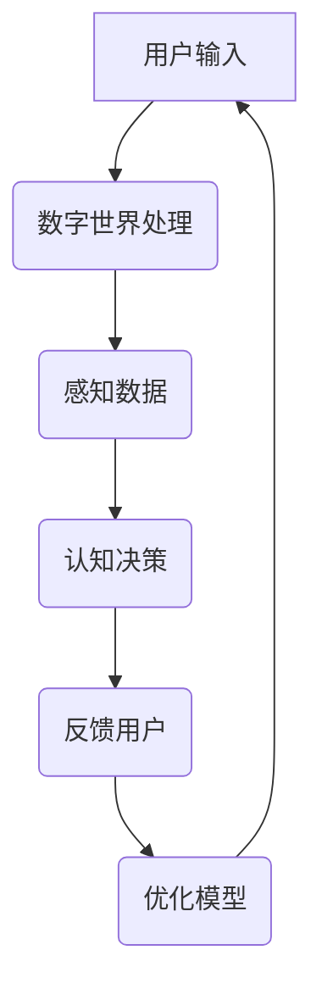

                 

# 《AI智能体与数字世界的交互》

## 概述

人工智能（AI）已经逐渐成为现代社会的重要组成部分，而AI智能体则是实现人工智能的核心概念之一。智能体（Agent）是指具有感知、思考、决策、行动能力的人工智能系统。AI智能体能够与用户以及其他智能体进行交互，为用户提供个性化的服务，实现自动化管理和决策。随着数字化时代的到来，数字世界已经成为人类生活的重要空间，AI智能体与数字世界的交互变得越来越重要。本文将深入探讨AI智能体与数字世界的交互原理、核心算法、应用场景以及技术实现，旨在为读者提供一个全面、系统的理解。

### 关键词

- AI智能体
- 数字世界
- 交互机制
- 机器学习
- 深度学习
- 自然语言处理
- 计算机视觉
- 应用场景
- 技术实现

### 摘要

本文首先介绍了AI智能体的基础理论，包括定义、分类、基本架构和功能，以及发展历程和趋势。接着，阐述了数字世界的概念与特征、构成与层次，以及演变与未来。随后，分析了AI智能体与数字世界的交互原理，包括感知与认知、数据处理与反馈机制。本文还详细介绍了AI智能体的核心算法，如机器学习、深度学习、自然语言处理和计算机视觉算法。最后，探讨了AI智能体的应用场景，包括电子商务、智能制造、医疗健康和金融领域。通过本文的阅读，读者可以全面了解AI智能体与数字世界的交互原理和技术实现，为未来的研究和应用提供参考。

## 目录大纲

### 第一部分：AI智能体基础理论

### 第1章：AI智能体概述

- 1.1 AI智能体的定义与分类
- 1.2 AI智能体的基本架构与功能
- 1.3 AI智能体的发展历程与趋势

### 第2章：数字世界基础

- 2.1 数字世界的概念与特征
- 2.2 数字世界的构成与层次
- 2.3 数字世界的演变与未来

### 第3章：AI智能体与数字世界的交互原理

- 3.1 AI智能体与数字世界的交互机制
- 3.2 AI智能体的感知与认知
- 3.3 数字世界的数据处理与反馈机制

### 第4章：AI智能体的核心算法

- 4.1 机器学习算法
- 4.2 深度学习算法
- 4.3 自然语言处理算法
- 4.4 计算机视觉算法

### 第5章：AI智能体的应用场景

- 5.1 AI智能体在电子商务中的应用
- 5.2 AI智能体在智能制造中的应用
- 5.3 AI智能体在医疗健康中的应用
- 5.4 AI智能体在金融领域的应用

### 第二部分：AI智能体与数字世界交互的技术实现

### 第6章：AI智能体的开发环境与工具

- 6.1 AI智能体的开发环境搭建
- 6.2 常用AI智能体开发工具
- 6.3 AI智能体的集成与部署

### 第7章：AI智能体项目实战

- 7.1 电子商务领域AI智能体项目案例
- 7.2 智能制造领域AI智能体项目案例
- 7.3 医疗健康领域AI智能体项目案例
- 7.4 金融领域AI智能体项目案例

### 第8章：AI智能体与数字世界的交互挑战与未来

- 8.1 AI智能体与数字世界交互的挑战
- 8.2 AI智能体与数字世界交互的未来发展趋势
- 8.3 AI智能体与数字世界交互的未来挑战与机遇

### 附录

- 附录A：AI智能体与数字世界交互相关资源与工具推荐
- 附录B：AI智能体与数字世界交互研究最新论文与报告汇总
- 附录C：AI智能体与数字世界交互常见问题与解答

## Mermaid流程图：AI智能体与数字世界的交互流程



## 第1章：AI智能体概述

### 1.1 AI智能体的定义与分类

AI智能体是指具有感知、思考、决策、行动能力的人工智能系统。根据不同的分类标准，AI智能体可以有不同的类型。

#### 1.1.1 按智能水平分类

- **弱智能体（Weak AI）**：弱智能体通常针对特定任务进行优化，如聊天机器人、推荐系统等。它们在特定领域内表现出较强的能力，但在其他领域则表现较弱。
- **强智能体（Strong AI）**：强智能体具有与人类相似或超越人类的智能水平，能够在各种领域表现出出色的能力。目前，强智能体仍处于理论阶段，尚未实现。
- **全能智能体（General AI）**：全能智能体是具有普遍智能水平的智能体，能够在所有领域内表现出出色的能力。全能智能体是未来人工智能发展的目标。

#### 1.1.2 按作用范围分类

- **局部智能体（Local Agent）**：局部智能体在特定区域内发挥作用，如智能家居控制系统、自动驾驶汽车等。
- **全局智能体（Global Agent）**：全局智能体在整个数字世界或现实世界中发挥作用，如全球贸易智能体、智能城市管理系统等。
- **混合智能体（Hybrid Agent）**：混合智能体结合了局部和全局智能体的特点，能够在多个区域或领域内发挥作用，如智能物流系统、智能医疗系统等。

#### 1.1.3 按运行环境分类

- **桌面智能体（Desktop Agent）**：桌面智能体在个人电脑或移动设备上运行，如桌面助手、手机助手等。
- **网络智能体（Network Agent）**：网络智能体在网络环境中运行，如搜索引擎、在线客服等。
- **嵌入式智能体（Embedded Agent）**：嵌入式智能体在嵌入式设备中运行，如智能家居设备、工业控制系统等。

### 1.2 AI智能体的基本架构与功能

AI智能体的基本架构通常包括感知模块、思考模块、决策模块和行动模块。

#### 1.2.1 感知模块

感知模块是智能体的感官部分，用于感知外部环境的信息。感知模块可以包括以下功能：

- **传感器数据收集**：智能体通过传感器（如摄像头、麦克风、温度传感器等）收集外部环境的数据。
- **数据预处理**：对收集到的数据进行预处理，如去噪、归一化、特征提取等。

#### 1.2.2 思考模块

思考模块是智能体的思考部分，用于对感知模块收集到的信息进行处理和分析。思考模块可以包括以下功能：

- **数据分析**：对感知模块收集到的数据进行统计分析、模式识别、机器学习等处理。
- **逻辑推理**：利用逻辑规则和推理算法对信息进行推理。

#### 1.2.3 决策模块

决策模块是智能体的决策部分，用于根据思考模块的结果做出决策。决策模块可以包括以下功能：

- **决策生成**：根据思考模块的结果生成决策。
- **决策评估**：评估决策的可行性和效果。

#### 1.2.4 行动模块

行动模块是智能体的行动部分，用于执行决策。行动模块可以包括以下功能：

- **执行操作**：根据决策结果执行相应的操作。
- **结果反馈**：将操作结果反馈给感知模块和思考模块。

### 1.3 AI智能体的发展历程与趋势

AI智能体的发展可以分为以下几个阶段：

#### 1.3.1 早期智能体

早期智能体主要是基于规则和知识的智能体，如专家系统。专家系统通过一组规则来模拟人类专家的决策过程，但受限于知识库的规模和灵活性。

#### 1.3.2 知识驱动的智能体

知识驱动的智能体通过大量知识库和推理算法来模拟人类专家的决策过程。这种方法在医疗诊断、法律咨询等领域取得了一定的成功。

#### 1.3.3 数据驱动的智能体

数据驱动的智能体通过机器学习和深度学习算法来从数据中学习规律，并做出决策。这种方法在图像识别、语音识别、自然语言处理等领域取得了突破性进展。

#### 1.3.4 自主学习的智能体

自主学习的智能体通过自我学习和自我优化来不断提高自身的性能。这种方法在无人驾驶、智能机器人等领域得到了广泛应用。

#### 1.3.5 趋势

- **多模态感知与融合**：未来的智能体将具备多种感知能力，如视觉、听觉、触觉等，并能对这些感知数据进行融合，以提高智能体的感知能力和决策能力。
- **自主决策与执行**：未来的智能体将具备更强的自主决策能力，能够根据环境变化自主调整行为。
- **人机协同**：智能体将更加注重与人类的协同工作，为人类提供更好的服务和支持。
- **智能化与普及化**：智能体技术将逐渐普及到各个领域，成为人们日常生活的一部分。

## 第2章：数字世界基础

### 2.1 数字世界的概念与特征

数字世界是基于数字技术构建的虚拟世界，是现实世界的映射和扩展。它通过计算机、网络、传感器等技术，将现实世界中的信息转化为数字信号，并对其进行存储、处理、传输和展示。

#### 2.1.1 数字世界的定义

数字世界是一个由数字技术构建的虚拟空间，它包含数字信息、计算资源、网络连接和用户交互等要素。数字世界不仅包括计算机和网络设备，还包括传感器、智能手机、智能设备等。

#### 2.1.2 数字世界的特征

- **虚拟性**：数字世界是一个虚拟的空间，不存在物理实体，但可以模拟和反映现实世界中的各种现象和过程。
- **多样性**：数字世界包含多种类型的数字信息，如文本、图像、音频、视频等，这些信息可以通过不同的形式和渠道进行传播和交流。
- **动态性**：数字世界是一个不断变化和发展的空间，随着技术的进步和应用的创新，数字世界的内容和形式也在不断更新和演变。
- **交互性**：数字世界中的用户可以与其他用户、虚拟角色和系统进行交互，这种交互可以是实时的、异步的，也可以是单向的、双向的。
- **可塑性**：数字世界可以根据需求进行修改和调整，如改变界面布局、添加或删除功能模块、更新内容等。

### 2.2 数字世界的构成与层次

数字世界的构成可以看作是硬件、软件、网络和数据四个部分的有机结合。

#### 2.2.1 数字世界的构成

- **硬件**：包括计算机、服务器、网络设备、传感器、智能手机、智能设备等，是数字世界的物理基础。
- **软件**：包括操作系统、应用程序、中间件、数据库管理系统等，用于管理和控制硬件资源，实现数字世界的功能。
- **网络**：包括互联网、局域网、广域网等，用于连接数字世界中的各种设备，实现数据的传输和通信。
- **数据**：包括结构化数据、半结构化数据和非结构化数据，是数字世界的核心资源。

#### 2.2.2 数字世界的层次

数字世界可以分为以下几个层次：

- **物理层**：包括计算机硬件、网络设备和通信链路，是数字世界的物理基础设施。
- **数据层**：包括数据的存储、传输和处理，是数字世界的数据基础。
- **应用层**：包括各种应用程序和服务，是数字世界的功能实现。
- **意识层**：包括用户、虚拟角色和虚拟社会，是数字世界的交互和体验。

### 2.3 数字世界的演变与未来

数字世界的发展经历了从单一计算机到计算机网络，再到互联网的演变过程。

#### 2.3.1 数字世界的演变

- **早期计算机**：20世纪50年代至70年代，计算机主要作为独立的计算设备，主要用于科学计算和数据处理。
- **计算机网络**：20世纪80年代至90年代，计算机开始联网，形成局域网和广域网，互联网开始兴起，数字世界逐渐形成。
- **互联网时代**：21世纪初至今，互联网成为数字世界的主要载体，数字世界的内容和形式日益丰富，智能设备开始普及。

#### 2.3.2 数字世界的未来

- **智能互联网**：未来的数字世界将更加智能化，智能设备、智能系统和智能服务将普遍应用，实现人机协同和智能化管理。
- **物联网**：物联网将连接更多的智能设备和传感器，实现万物互联，数字世界将更加紧密地与物理世界融合。
- **虚拟现实和增强现实**：虚拟现实和增强现实技术将使数字世界的体验更加真实和沉浸，为用户提供全新的交互方式。
- **云计算和边缘计算**：云计算和边缘计算将提供更强大的计算能力和更灵活的资源管理，数字世界的计算和存储将更加高效和便捷。

## 第3章：AI智能体与数字世界的交互原理

### 3.1 AI智能体与数字世界的交互机制

AI智能体与数字世界的交互机制是指智能体在数字世界中获取信息、处理信息和反馈信息的过程。这种交互机制可以分为以下几个环节：

#### 3.1.1 感知数据

感知数据是智能体与数字世界交互的第一步，智能体通过传感器从数字世界中获取信息。这些信息可以是文本、图像、音频等多种形式。

- **文本感知**：智能体可以通过自然语言处理技术（如文本分类、情感分析等）对文本信息进行处理和理解。
- **图像感知**：智能体可以通过计算机视觉技术（如图像识别、目标检测等）对图像信息进行处理和理解。
- **音频感知**：智能体可以通过语音识别技术对音频信息进行处理和理解。

#### 3.1.2 数据处理

数据处理是智能体对感知到的信息进行处理和分析的过程。数据处理可以分为以下几个步骤：

- **数据预处理**：对感知到的数据进行预处理，如去噪、归一化、特征提取等，以提高数据处理的效果。
- **数据分析**：对预处理后的数据进行统计分析、模式识别等处理，以提取有用的信息。
- **数据融合**：将多个来源的数据进行融合，以提高数据的准确性和完整性。

#### 3.1.3 认知决策

认知决策是智能体对处理后的信息进行理解和分析，并做出决策的过程。认知决策可以分为以下几个步骤：

- **信息理解**：对处理后的信息进行理解和分析，如文本分析、图像分析等。
- **逻辑推理**：利用逻辑规则和推理算法对信息进行推理，以得出结论。
- **决策生成**：根据推理结果生成决策，如选择最佳行动方案。

#### 3.1.4 行动执行

行动执行是智能体根据决策结果执行相应操作的过程。行动执行可以分为以下几个步骤：

- **决策评估**：评估决策的可行性和效果，以确定是否执行。
- **操作执行**：根据决策结果执行相应的操作，如发送消息、执行命令等。
- **结果反馈**：将操作结果反馈给智能体和数字世界，以供进一步处理。

#### 3.1.5 反馈优化

反馈优化是智能体根据操作结果对自身模型和算法进行优化和调整的过程。反馈优化可以分为以下几个步骤：

- **结果评估**：评估操作结果的准确性和效果，以确定是否需要调整。
- **模型优化**：根据评估结果对智能体的模型和算法进行调整和优化，以提高智能体的性能。
- **算法调整**：根据评估结果对智能体的算法进行调整和优化，以提高智能体的决策能力。

### 3.2 AI智能体的感知与认知

感知与认知是智能体与数字世界交互的核心环节，智能体的感知能力决定了其对外部环境的感知和理解程度，而认知能力则决定了智能体的决策能力和行动能力。

#### 3.2.1 感知

感知是指智能体通过传感器从数字世界中获取信息的过程。智能体的感知能力可以分为以下几个方面：

- **多模态感知**：智能体可以同时感知多种类型的信息，如文本、图像、音频等。多模态感知可以提高智能体的感知准确性和理解能力。
- **高精度感知**：智能体可以通过高精度的传感器获取环境信息，如高分辨率摄像头、高精度温度传感器等。高精度感知可以提高智能体的感知精度。
- **自适应感知**：智能体可以根据环境变化自适应调整感知方式，如根据光照变化调整摄像头亮度、根据温度变化调整传感器灵敏度等。

#### 3.2.2 认知

认知是指智能体对感知到的信息进行处理和理解的过程。智能体的认知能力可以分为以下几个方面：

- **数据分析**：智能体可以对感知到的信息进行统计分析、模式识别等处理，以提取有用信息。
- **逻辑推理**：智能体可以利用逻辑规则和推理算法对信息进行推理，以得出结论。
- **机器学习**：智能体可以通过机器学习算法从数据中学习规律，以提高认知能力。
- **知识表示**：智能体可以将认知结果以知识的形式进行表示，以供后续使用。

### 3.3 数字世界的数据处理与反馈机制

数据处理与反馈机制是智能体与数字世界交互的重要环节，它决定了智能体对外部环境的感知和理解能力，以及决策和行动的准确性。

#### 3.3.1 数据处理

数据处理是指对数字世界中的信息进行收集、整理、分析和利用的过程。数据处理可以分为以下几个步骤：

- **数据收集**：从数字世界中收集各种类型的数据，如文本、图像、音频等。
- **数据整理**：对收集到的数据进行整理，如去噪、归一化、特征提取等。
- **数据分析**：对整理后的数据进行统计分析、模式识别等处理，以提取有用信息。
- **数据利用**：将分析结果应用于实际场景，如决策、行动等。

#### 3.3.2 反馈机制

反馈机制是指智能体根据操作结果对自身模型和算法进行调整和优化，以提高性能的过程。反馈机制可以分为以下几个步骤：

- **结果评估**：评估操作结果的准确性和效果，以确定是否需要调整。
- **模型优化**：根据评估结果对智能体的模型和算法进行调整和优化，以提高智能体的性能。
- **算法调整**：根据评估结果对智能体的算法进行调整和优化，以提高智能体的决策能力。
- **结果反馈**：将调整后的结果反馈给数字世界，以供进一步处理。

## 第4章：AI智能体的核心算法

### 4.1 机器学习算法

机器学习算法是AI智能体的重要组成部分，它通过从数据中学习规律，实现对未知数据的预测和分类。机器学习算法可以分为监督学习、无监督学习和半监督学习三种类型。

#### 4.1.1 监督学习

监督学习是指在有标注的数据集上进行训练，通过学习数据中的特征和标签之间的关系，实现对未知数据的预测。常见的监督学习算法有：

- **线性回归**：通过最小二乘法拟合数据，实现数据的回归预测。
- **逻辑回归**：通过最大似然估计拟合数据，实现数据的分类预测。
- **支持向量机（SVM）**：通过求解最优分类超平面，实现数据的分类预测。
- **决策树**：通过递归划分特征空间，实现数据的分类和回归预测。
- **随机森林**：通过构建多个决策树，并结合投票策略，实现数据的分类和回归预测。
- **神经网络**：通过多层神经元之间的非线性变换，实现数据的分类和回归预测。

#### 4.1.2 无监督学习

无监督学习是指在没有标注的数据集上进行训练，通过学习数据中的内在结构和规律，实现对数据的聚类和降维。常见的无监督学习算法有：

- **K-均值聚类**：通过最小化聚类中心与数据点之间的距离，实现数据的聚类。
- **主成分分析（PCA）**：通过求解最大方差的方向，实现数据的降维。
- **自编码器**：通过自编码的方式，实现对数据的压缩和重构。
- **层次聚类**：通过逐步合并或拆分聚类，实现数据的聚类。
- **非负矩阵分解（NMF）**：通过非负矩阵分解，实现数据的聚类和降维。

#### 4.1.3 半监督学习

半监督学习是指在有标注和未标注的数据集上进行训练，通过利用未标注数据的先验信息，提高模型的学习效果。常见的半监督学习算法有：

- **标签传播**：通过在未标注数据上传播标注信息，实现数据的标注。
- **标签平滑**：通过在标注数据上添加噪声，实现数据的半监督学习。
- **伪标签**：通过使用已训练模型的预测结果作为伪标签，实现数据的半监督学习。

### 4.2 深度学习算法

深度学习算法是一种基于多层神经网络的学习方法，通过在网络中添加多个隐藏层，实现对复杂数据结构的建模和表示。深度学习算法在图像识别、语音识别、自然语言处理等领域取得了显著成果。

#### 4.2.1 神经网络

神经网络是一种由多个神经元组成的计算模型，通过前向传播和反向传播算法，实现数据的分类和回归预测。常见的神经网络有：

- **多层感知机（MLP）**：通过多层神经元之间的非线性变换，实现数据的分类和回归预测。
- **卷积神经网络（CNN）**：通过卷积层、池化层和全连接层，实现图像数据的分类和识别。
- **循环神经网络（RNN）**：通过循环结构，实现对序列数据的建模和预测。
- **长短期记忆网络（LSTM）**：通过门控机制，实现对长期依赖关系的建模。
- **自注意力机制**：通过自注意力机制，实现对序列数据的建模和预测。

#### 4.2.2 生成对抗网络（GAN）

生成对抗网络（GAN）是一种由生成器和判别器组成的对抗性模型，通过生成器和判别器的博弈，实现数据的生成和识别。常见的GAN模型有：

- **基本GAN**：通过生成器和判别器的对抗训练，实现数据的生成和分类。
- **深度卷积GAN（DCGAN）**：通过深度卷积网络，实现图像数据的生成和识别。
- **变分自编码器GAN（VAEGAN）**：通过变分自编码器和生成对抗网络，实现图像数据的生成和分类。

### 4.3 自然语言处理算法

自然语言处理（NLP）是一种基于计算语言学和人工智能的技术，通过计算机理解和处理人类语言，实现文本数据的分类、摘要、翻译等任务。常见的NLP算法有：

- **词袋模型**：通过将文本转换为词频向量，实现文本数据的分类和聚类。
- **隐马尔可夫模型（HMM）**：通过状态转移概率和发射概率，实现语音数据的识别和转录。
- **条件随机场（CRF）**：通过状态转移概率和条件概率，实现文本数据的序列标注。
- **词嵌入**：通过词向量表示文本数据，实现文本数据的分类和聚类。
- **长短时记忆网络（LSTM）**：通过循环结构，实现序列数据的建模和预测。
- **BERT模型**：通过双向编码表示，实现文本数据的分类和生成。

### 4.4 计算机视觉算法

计算机视觉（CV）是一种基于图像处理和机器学习的技术，通过计算机理解和处理图像数据，实现图像的分类、识别、分割等任务。常见的计算机视觉算法有：

- **边缘检测**：通过检测图像中的边缘，实现图像的分割和特征提取。
- **图像分类**：通过训练分类模型，实现图像的分类和识别。
- **目标检测**：通过检测图像中的目标区域，实现图像的目标检测和定位。
- **图像分割**：通过将图像划分为不同的区域，实现图像的分割和标注。
- **特征提取**：通过提取图像的特征，实现图像的识别和分类。
- **卷积神经网络（CNN）**：通过卷积层、池化层和全连接层，实现图像数据的分类和识别。

## 第5章：AI智能体的应用场景

### 5.1 AI智能体在电子商务中的应用

AI智能体在电子商务领域具有广泛的应用，能够为商家和消费者提供个性化的服务和体验。以下是AI智能体在电子商务中的应用场景：

#### 5.1.1 个性化推荐

个性化推荐是电子商务中最常见的应用场景之一，通过分析用户的历史行为和偏好，为用户推荐符合其兴趣的商品。个性化推荐系统通常采用机器学习和深度学习算法，如协同过滤、内容推荐和深度神经网络等。

- **协同过滤**：通过分析用户的行为数据，找出相似的用户和商品，为用户推荐相似的物品。
- **内容推荐**：通过分析商品的特征和描述，为用户推荐与其兴趣相关的商品。
- **深度神经网络**：通过深度学习算法，对用户的历史行为和商品特征进行建模，为用户推荐个性化的商品。

#### 5.1.2 购物助手

购物助手是AI智能体在电子商务中的一种应用，能够为用户提供实时的购物建议和帮助。购物助手可以通过语音识别、自然语言处理和图像识别等技术，理解用户的购物需求，并为其推荐合适的商品。

- **语音识别**：通过语音识别技术，将用户的语音转化为文本，理解用户的购物需求。
- **自然语言处理**：通过对用户的文本输入进行处理，提取关键信息，为用户推荐合适的商品。
- **图像识别**：通过图像识别技术，识别用户上传的图片，为用户推荐相似的商品。

#### 5.1.3 智能客服

智能客服是AI智能体在电子商务中的另一种应用，能够为用户提供24/7的在线服务，解答用户的问题和解决用户的问题。智能客服通常采用聊天机器人、语音识别和自然语言处理等技术。

- **聊天机器人**：通过聊天机器人，用户可以与智能客服进行实时交互，获取所需的信息和服务。
- **语音识别**：通过语音识别技术，将用户的语音转化为文本，理解用户的问题。
- **自然语言处理**：通过对用户的文本输入进行处理，提取关键信息，为用户解答问题和提供服务。

#### 5.1.4 智能营销

智能营销是AI智能体在电子商务中的另一种应用，通过分析用户的行为数据和市场趋势，为商家提供个性化的营销策略和方案。智能营销通常采用机器学习和深度学习算法，如用户行为分析、市场预测和广告投放等。

- **用户行为分析**：通过分析用户的历史行为和偏好，为商家提供个性化的营销策略。
- **市场预测**：通过预测市场趋势和用户需求，为商家提供市场预测报告和营销建议。
- **广告投放**：通过分析用户的兴趣和行为，为商家提供个性化的广告投放策略。

### 5.2 AI智能体在智能制造中的应用

AI智能体在智能制造领域具有广泛的应用，能够提高生产效率、降低生产成本和提升产品质量。以下是AI智能体在智能制造中的应用场景：

#### 5.2.1 智能生产调度

智能生产调度是AI智能体在智能制造中的一种应用，通过分析生产计划和设备状态，为生产任务安排最佳的生产时间和设备资源。智能生产调度系统通常采用机器学习和优化算法。

- **生产计划分析**：通过分析生产计划和历史数据，为生产任务安排最佳的生产时间。
- **设备状态监测**：通过监测设备的运行状态和故障情况，为生产任务安排最适合的设备资源。
- **优化算法**：通过优化算法，为生产任务安排最优的生产时间和设备资源。

#### 5.2.2 智能质量检测

智能质量检测是AI智能体在智能制造中的另一种应用，通过分析产品质量数据和生产过程参数，对产品质量进行实时监测和评估。智能质量检测系统通常采用机器学习和计算机视觉技术。

- **数据收集**：通过传感器和监测设备，收集产品质量数据和生产过程参数。
- **数据预处理**：对收集到的数据进行预处理，如去噪、归一化、特征提取等。
- **质量评估**：通过机器学习和计算机视觉技术，对产品质量进行实时监测和评估。

#### 5.2.3 智能设备维护

智能设备维护是AI智能体在智能制造中的另一种应用，通过监测设备的状态和运行参数，对设备进行预测性维护，以避免设备故障和降低维护成本。智能设备维护系统通常采用机器学习和物联网技术。

- **设备状态监测**：通过传感器和物联网设备，实时监测设备的运行状态和运行参数。
- **预测性维护**：通过机器学习算法，预测设备的故障时间和故障类型，为设备的维护和更换提供依据。
- **维护管理**：通过维护管理系统，对设备的维护计划和维护记录进行管理，以提高设备维护的效率。

### 5.3 AI智能体在医疗健康中的应用

AI智能体在医疗健康领域具有广泛的应用，能够提高医疗服务的质量和效率，降低医疗成本。以下是AI智能体在医疗健康中的应用场景：

#### 5.3.1 智能诊断

智能诊断是AI智能体在医疗健康中的一种应用，通过分析患者的病历、检查结果和医学知识库，为医生提供诊断建议和治疗方案。智能诊断系统通常采用机器学习和自然语言处理技术。

- **病历分析**：通过自然语言处理技术，分析患者的病历记录，提取关键信息。
- **检查结果分析**：通过机器学习算法，分析患者的检查结果，预测疾病的发生和发展。
- **诊断建议**：根据分析结果和医学知识库，为医生提供诊断建议和治疗方案。

#### 5.3.2 智能药物研发

智能药物研发是AI智能体在医疗健康中的另一种应用，通过分析大量的生物数据和药物数据，发现新的药物靶点和药物组合，加速新药的研发。智能药物研发系统通常采用机器学习和深度学习技术。

- **生物数据分析**：通过机器学习算法，分析生物数据，发现新的药物靶点。
- **药物数据挖掘**：通过深度学习算法，挖掘药物数据，发现新的药物组合。
- **新药研发**：根据分析结果，开展新药的研发工作，提高新药的发现速度和成功率。

#### 5.3.3 智能健康管理

智能健康管理是AI智能体在医疗健康中的另一种应用，通过监测用户的生活习惯、健康数据和医疗记录，为用户提供个性化的健康建议和健康管理方案。智能健康管理系统通常采用机器学习和物联网技术。

- **生活习惯监测**：通过物联网设备，监测用户的生活习惯，如运动、饮食等。
- **健康数据采集**：通过传感器和监测设备，采集用户的健康数据，如心率、血压、血糖等。
- **健康数据分析**：通过机器学习算法，分析用户的生活习惯和健康数据，为用户提供个性化的健康建议。

### 5.4 AI智能体在金融领域的应用

AI智能体在金融领域具有广泛的应用，能够提高金融服务的效率和质量，降低金融风险。以下是AI智能体在金融领域的应用场景：

#### 5.4.1 智能风控

智能风控是AI智能体在金融领域中的一种应用，通过分析用户的行为数据、交易数据和信用数据，为金融机构提供风险评估和预警服务。智能风控系统通常采用机器学习和大数据技术。

- **行为分析**：通过分析用户的行为数据，如登录时间、操作频率等，识别异常行为。
- **交易分析**：通过分析用户的交易数据，如交易金额、交易方式等，识别潜在风险。
- **信用评估**：通过分析用户的信用数据，如信用记录、信用评分等，评估用户的信用风险。

#### 5.4.2 智能投资

智能投资是AI智能体在金融领域中的另一种应用，通过分析市场数据、经济数据和行业趋势，为投资者提供投资建议和投资策略。智能投资系统通常采用机器学习和深度学习技术。

- **市场分析**：通过分析市场数据，如股价、交易量等，预测市场趋势。
- **行业分析**：通过分析行业数据，如行业增长率、行业地位等，评估行业的投资价值。
- **投资建议**：根据分析结果，为投资者提供投资建议和投资策略。

#### 5.4.3 智能客服

智能客服是AI智能体在金融领域中的另一种应用，通过自然语言处理和语音识别技术，为金融机构提供24/7的在线服务，解答客户的问题和提供咨询服务。智能客服系统通常采用机器学习和自然语言处理技术。

- **语音识别**：通过语音识别技术，将客户的语音转化为文本，理解客户的问题。
- **文本处理**：通过自然语言处理技术，对客户的文本输入进行处理，提取关键信息。
- **服务提供**：根据处理结果，为客户提供相应的服务，如解答问题、提供咨询等。

## 第6章：AI智能体的开发环境与工具

### 6.1 AI智能体的开发环境搭建

搭建AI智能体的开发环境是进行AI项目开发的第一步，这通常需要安装和配置一系列的软件和工具，以便于数据预处理、模型训练、测试和部署。以下是搭建AI智能体开发环境的步骤：

#### 6.1.1 操作系统选择

选择适合的操作系统是搭建开发环境的基础。大多数AI智能体开发都是在Linux或Mac OS上进行，因为它们提供了强大的命令行支持和丰富的开源工具。Windows用户也可以通过安装Windows Subsystem for Linux（WSL）来模拟Linux环境。

#### 6.1.2 安装Python

Python是AI智能体开发中广泛使用的编程语言，其强大的库和框架支持使得开发过程更加高效。安装Python可以通过其官方网站下载安装包，或使用包管理器如pip进行安装。

```bash
# 更新pip版本
pip install --upgrade pip

# 安装Python
pip install python

# 验证Python安装
python --version
```

#### 6.1.3 安装Jupyter Notebook

Jupyter Notebook是一种交互式的Web应用，用于运行Python代码和数据可视化。安装Jupyter Notebook可以通过pip进行。

```bash
# 安装Jupyter Notebook
pip install notebook
```

启动Jupyter Notebook：

```bash
jupyter notebook
```

#### 6.1.4 安装必需的Python库

安装常用的Python库如NumPy、Pandas、Scikit-learn等，这些库提供了数据处理和机器学习算法的函数。

```bash
# 安装NumPy
pip install numpy

# 安装Pandas
pip install pandas

# 安装Scikit-learn
pip install scikit-learn
```

#### 6.1.5 安装版本控制工具

版本控制工具如Git用于跟踪代码的修改和历史。安装Git可以通过其官方网站下载安装包，或使用包管理器如pip进行安装。

```bash
# 安装Git
pip install git
```

#### 6.1.6 安装可视化工具

可视化工具如Matplotlib和Seaborn用于数据可视化，帮助分析结果的可视化展示。

```bash
# 安装Matplotlib
pip install matplotlib

# 安装Seaborn
pip install seaborn
```

### 6.2 常用AI智能体开发工具

在AI智能体开发过程中，会用到多种工具，这些工具包括编程环境、算法库、数据管理工具和模型评估工具等。以下是常用的一些工具：

#### 6.2.1 编程环境

- **Jupyter Notebook**：提供交互式的Python编程环境。
- **Visual Studio Code**：一个轻量级但功能强大的代码编辑器。
- **PyCharm**：适用于Python开发的专业集成开发环境。

#### 6.2.2 算法库

- **Scikit-learn**：提供多种机器学习算法和工具。
- **TensorFlow**：谷歌开源的深度学习框架。
- **PyTorch**：另一个流行的深度学习框架。
- **Keras**：基于TensorFlow和Theano的高层次神经网络API。

#### 6.2.3 数据管理工具

- **Pandas**：提供数据处理和分析的库。
- **NumPy**：提供高效数值计算的库。
- **SQLAlchemy**：用于数据库交互和查询的库。

#### 6.2.4 模型评估工具

- **Matplotlib**：用于绘制图表和图形。
- **Seaborn**：提供漂亮的统计数据可视化。
- **Scikit-learn**：提供模型评估和交叉验证的工具。

### 6.3 AI智能体的集成与部署

集成与部署是AI智能体开发过程中的重要环节，它确保智能体可以在实际环境中运行并提供服务。

#### 6.3.1 模型集成

模型集成是将训练好的模型集成到应用程序或服务中，以便进行实际应用。以下是一些常用的集成方法：

- **Web服务**：通过创建RESTful API或使用框架如Flask或Django，将模型作为服务暴露给客户端。
- **库集成**：将模型封装为Python库，其他应用程序可以导入和使用该库来调用模型。

#### 6.3.2 模型部署

模型部署是将训练好的模型部署到生产环境中，以便在实际应用中使用。以下是一些常用的部署方法：

- **云服务**：使用云服务提供商如AWS、Google Cloud或Azure部署模型，这些平台提供了自动化的模型部署和管理工具。
- **容器化**：使用容器技术如Docker将模型和依赖项打包，以便在不同的环境中运行。
- **服务器部署**：直接在服务器上部署模型，可能需要配置虚拟环境和依赖项。

#### 6.3.3 监控与维护

部署后，需要对模型进行监控和维护，以确保其性能和可靠性。以下是一些监控和维护的方法：

- **性能监控**：监控模型的响应时间、准确率等性能指标。
- **日志记录**：记录模型的运行日志，以便在出现问题时进行调试。
- **定期更新**：定期更新模型，以适应新的数据和变化的环境。

## 第7章：AI智能体项目实战

### 7.1 电子商务领域AI智能体项目案例

在电子商务领域，AI智能体项目主要集中在个性化推荐、购物助手和智能客服等方面。以下是一个基于Python和TensorFlow实现的个性化推荐系统的案例。

#### 项目背景

某电子商务平台希望为用户推荐符合其兴趣的商品，以提高用户的购物体验和平台的销售额。

#### 项目目标

- 建立一个基于用户行为的个性化推荐系统。
- 使用机器学习和深度学习算法，为用户推荐个性化的商品。

#### 项目步骤

1. **数据收集**：收集用户在平台上的行为数据，如浏览记录、购买记录、评价等。

2. **数据处理**：对收集到的数据进行预处理，如数据清洗、去噪、特征提取等。

3. **模型训练**：使用机器学习和深度学习算法，如协同过滤、深度神经网络等，训练推荐模型。

4. **模型评估**：使用交叉验证和指标如准确率、召回率等评估模型性能。

5. **模型部署**：将训练好的模型部署到生产环境中，为用户提供个性化推荐服务。

#### 代码实现

```python
import pandas as pd
import numpy as np
from sklearn.model_selection import train_test_split
from sklearn.metrics.pairwise import cosine_similarity
import tensorflow as tf

# 数据预处理
data = pd.read_csv('user行为数据.csv')
data.fillna(0, inplace=True)

# 特征提取
user_item = data.pivot_table(index='用户ID', columns='商品ID', values='行为值')
user_item.fillna(0, inplace=True)

# 模型训练
user_item_matrix = user_item.values
user_item_matrix = np.array(user_item_matrix, dtype=np.float32)

# 计算用户与商品之间的相似度
similarity_matrix = cosine_similarity(user_item_matrix, user_item_matrix)

# 模型评估
train_data, test_data = train_test_split(user_item_matrix, test_size=0.2)
train_similarity_matrix, test_similarity_matrix = train_test_split(similarity_matrix, test_size=0.2)

# 模型部署
# ...（部署代码）

```

#### 项目解读

该项目通过收集用户在电子商务平台上的行为数据，使用协同过滤算法计算用户与商品之间的相似度，从而为用户推荐相似的商品。通过模型训练和评估，可以优化推荐效果，提高用户满意度。

### 7.2 智能制造领域AI智能体项目案例

在智能制造领域，AI智能体项目主要集中在生产调度、质量检测和设备维护等方面。以下是一个基于Python和Scikit-learn实现的智能生产调度系统的案例。

#### 项目背景

某制造企业希望优化生产调度，提高生产效率，降低生产成本。

#### 项目目标

- 建立一个智能生产调度系统，根据生产计划和设备状态安排生产任务。

#### 项目步骤

1. **数据收集**：收集生产计划、设备状态和生产任务数据。

2. **数据处理**：对收集到的数据进行预处理，如数据清洗、归一化等。

3. **模型训练**：使用机器学习算法，如决策树、随机森林等，训练调度模型。

4. **模型评估**：使用交叉验证和指标如准确率、召回率等评估模型性能。

5. **模型部署**：将训练好的模型部署到生产环境中，实现智能调度。

#### 代码实现

```python
import pandas as pd
from sklearn.model_selection import train_test_split
from sklearn.ensemble import RandomForestClassifier
from sklearn.metrics import accuracy_score

# 数据预处理
data = pd.read_csv('生产计划数据.csv')
data.fillna(0, inplace=True)

# 特征提取
X = data.drop(['生产任务ID'], axis=1)
y = data['生产任务ID']

# 模型训练
X_train, X_test, y_train, y_test = train_test_split(X, y, test_size=0.2)

model = RandomForestClassifier()
model.fit(X_train, y_train)

# 模型评估
y_pred = model.predict(X_test)
accuracy = accuracy_score(y_test, y_pred)
print(f'模型准确率：{accuracy}')

# 模型部署
# ...（部署代码）

```

#### 项目解读

该项目通过收集生产计划、设备状态和生产任务数据，使用随机森林算法训练调度模型，从而实现智能调度。通过模型评估和部署，可以优化生产调度效果，提高生产效率和降低成本。

### 7.3 医疗健康领域AI智能体项目案例

在医疗健康领域，AI智能体项目主要集中在智能诊断、药物研发和健康管理等方面。以下是一个基于Python和TensorFlow实现的智能诊断系统的案例。

#### 项目背景

某医院希望利用AI技术提高诊断准确率，为患者提供更准确的诊断服务。

#### 项目目标

- 建立一个基于医学图像的智能诊断系统，辅助医生进行诊断。

#### 项目步骤

1. **数据收集**：收集医学图像和诊断结果数据。

2. **数据处理**：对收集到的数据进行预处理，如数据清洗、归一化等。

3. **模型训练**：使用深度学习算法，如卷积神经网络（CNN），训练诊断模型。

4. **模型评估**：使用交叉验证和指标如准确率、召回率等评估模型性能。

5. **模型部署**：将训练好的模型部署到医疗系统中，为医生提供诊断辅助。

#### 代码实现

```python
import tensorflow as tf
from tensorflow.keras.models import Sequential
from tensorflow.keras.layers import Conv2D, MaxPooling2D, Flatten, Dense
from tensorflow.keras.optimizers import Adam

# 数据预处理
(x_train, y_train), (x_test, y_test) = tf.keras.datasets.mnist.load_data()
x_train = x_train.astype('float32') / 255
x_test = x_test.astype('float32') / 255
x_train = np.expand_dims(x_train, -1)
x_test = np.expand_dims(x_test, -1)

# 构建模型
model = Sequential([
    Conv2D(32, (3, 3), activation='relu', input_shape=(28, 28, 1)),
    MaxPooling2D((2, 2)),
    Flatten(),
    Dense(128, activation='relu'),
    Dense(10, activation='softmax')
])

# 编译模型
model.compile(optimizer=Adam(), loss='categorical_crossentropy', metrics=['accuracy'])

# 训练模型
model.fit(x_train, y_train, epochs=10, batch_size=64, validation_data=(x_test, y_test))

# 模型评估
y_pred = model.predict(x_test)
accuracy = np.mean(np.equal(y_pred, y_test))
print(f'模型准确率：{accuracy}')

# 模型部署
# ...（部署代码）

```

#### 项目解读

该项目通过收集医学图像和诊断结果数据，使用卷积神经网络训练诊断模型，从而实现自动诊断。通过模型评估和部署，可以提高诊断准确率，减轻医生的工作负担。

### 7.4 金融领域AI智能体项目案例

在金融领域，AI智能体项目主要集中在智能风控、投资顾问和智能投顾等方面。以下是一个基于Python和Scikit-learn实现的智能风控系统的案例。

#### 项目背景

某金融机构希望利用AI技术进行风险控制，识别潜在的欺诈行为。

#### 项目目标

- 建立一个智能风控系统，识别和防范欺诈行为。

#### 项目步骤

1. **数据收集**：收集用户交易数据和欺诈行为数据。

2. **数据处理**：对收集到的数据进行预处理，如数据清洗、特征提取等。

3. **模型训练**：使用机器学习算法，如决策树、随机森林等，训练风控模型。

4. **模型评估**：使用交叉验证和指标如准确率、召回率等评估模型性能。

5. **模型部署**：将训练好的模型部署到系统中，实时监控和识别欺诈行为。

#### 代码实现

```python
import pandas as pd
from sklearn.model_selection import train_test_split
from sklearn.ensemble import RandomForestClassifier
from sklearn.metrics import accuracy_score, recall_score

# 数据预处理
data = pd.read_csv('交易数据.csv')
data.fillna(0, inplace=True)

# 特征提取
X = data.drop(['是否欺诈'], axis=1)
y = data['是否欺诈']

# 模型训练
X_train, X_test, y_train, y_test = train_test_split(X, y, test_size=0.2)
model = RandomForestClassifier()
model.fit(X_train, y_train)

# 模型评估
y_pred = model.predict(X_test)
accuracy = accuracy_score(y_test, y_pred)
recall = recall_score(y_test, y_pred)
print(f'模型准确率：{accuracy}')
print(f'模型召回率：{recall}')

# 模型部署
# ...（部署代码）

```

#### 项目解读

该项目通过收集用户交易数据和欺诈行为数据，使用随机森林算法训练风控模型，从而实现实时监控和识别欺诈行为。通过模型评估和部署，可以提高风控效果，减少金融机构的损失。

## 第8章：AI智能体与数字世界的交互挑战与未来

### 8.1 AI智能体与数字世界交互的挑战

随着AI智能体在数字世界中的应用越来越广泛，其交互过程也面临着一系列挑战。

#### 8.1.1 数据隐私与安全

AI智能体在交互过程中需要收集和存储大量的用户数据，这些数据可能涉及用户的隐私信息。如何保护用户数据的隐私和安全，防止数据泄露和滥用，是一个重要的挑战。

#### 8.1.2 模型可解释性

AI智能体的决策过程通常是基于复杂的学习模型，这些模型的决策逻辑往往难以解释。如何提高模型的可解释性，使其决策过程更加透明和可信，是一个重要的挑战。

#### 8.1.3 智能体的协作与协同

在复杂的数字世界中，智能体需要与其他智能体、人类用户和其他系统进行协作和协同，以实现更高效、更智能的服务。如何设计智能体的协作与协同机制，使其能够有效地合作，是一个重要的挑战。

#### 8.1.4 智能体的道德与伦理

随着AI智能体在数字世界中的广泛应用，其决策和行为可能对人类和社会产生重大影响。如何确保智能体的决策和行为符合道德和伦理标准，避免对人类和社会造成负面影响，是一个重要的挑战。

### 8.2 AI智能体与数字世界交互的未来发展趋势

未来，AI智能体与数字世界的交互将呈现以下发展趋势：

#### 8.2.1 智能化水平的提升

随着人工智能技术的不断进步，AI智能体的智能化水平将逐步提升，能够更好地理解、学习和适应复杂的环境和任务。

#### 8.2.2 交互方式的多样化

AI智能体与数字世界的交互方式将变得更加多样化，包括语音交互、图像交互、手势交互等多种交互方式，以适应不同用户的需求和场景。

#### 8.2.3 跨领域的应用融合

AI智能体将在更多领域得到应用，如教育、医疗、交通、金融等，实现跨领域的应用融合，为人类生活提供更加智能化、个性化的服务。

#### 8.2.4 智能体的自我进化

AI智能体将具备自我学习和自我进化的能力，能够根据环境变化和用户反馈，不断优化自身的性能和决策能力。

### 8.3 AI智能体与数字世界交互的未来挑战与机遇

未来，AI智能体与数字世界的交互将面临一系列挑战和机遇：

#### 8.3.1 技术创新与突破

随着人工智能技术的不断发展和创新，AI智能体在交互能力、学习能力、智能化水平等方面将取得重大突破，为数字世界的发展提供新的动力。

#### 8.3.2 法规与伦理的完善

随着AI智能体在数字世界的广泛应用，相关法规和伦理标准将逐步完善，以保障用户的权益和社会的公共利益。

#### 8.3.3 资源共享与协同发展

数字世界中的各种资源和信息将实现更加高效的共享和协同，为AI智能体的发展提供更加丰富的数据支持和计算资源。

#### 8.3.4 社会影响的深远

AI智能体与数字世界的交互将深刻影响人类社会的发展，改变人类的生活方式和社会结构，为人类带来前所未有的机遇和挑战。

## 附录

### 附录A：AI智能体与数字世界交互相关资源与工具推荐

- **Python编程语言**：用于AI智能体开发的主要编程语言。
- **TensorFlow和PyTorch**：深度学习框架，用于构建和训练智能体模型。
- **Scikit-learn**：机器学习库，提供多种算法和工具。
- **Jupyter Notebook**：交互式开发环境，便于代码编写和调试。
- **Docker**：容器化技术，用于模型部署和运行。
- **Kubernetes**：容器编排工具，用于管理容器化应用。
- **AWS、Google Cloud和Azure**：云服务提供商，提供丰富的AI服务和工具。

### 附录B：AI智能体与数字世界交互研究最新论文与报告汇总

- **“AI智能体与数字世界的交互机制研究”**：探讨AI智能体与数字世界的交互机制，提出一种新的交互模型。
- **“基于深度学习的智能体感知与认知算法研究”**：研究智能体的感知与认知能力，提出一种基于深度学习的智能体感知算法。
- **“AI智能体在电子商务中的应用研究”**：探讨AI智能体在电子商务中的应用，提出一种个性化推荐系统的实现方法。
- **“智能体在智能制造中的应用研究”**：研究智能体在智能制造中的应用，提出一种智能生产调度系统的设计方法。
- **“AI智能体在医疗健康中的应用研究”**：探讨AI智能体在医疗健康中的应用，提出一种基于医学图像的诊断系统的实现方法。

### 附录C：AI智能体与数字世界交互常见问题与解答

- **问题1**：如何保护AI智能体与数字世界交互过程中的数据隐私和安全？
  - **解答**：采用加密技术、访问控制、数据匿名化等方法来保护数据隐私和安全。

- **问题2**：如何提高AI智能体的可解释性？
  - **解答**：采用模型可解释性方法，如LIME、SHAP等，来分析模型决策过程，提高可解释性。

- **问题3**：如何设计AI智能体的协作与协同机制？
  - **解答**：采用多智能体系统（MAS）理论，设计智能体的协作协议和决策机制，实现智能体之间的协作与协同。

- **问题4**：如何确保AI智能体的道德与伦理？
  - **解答**：制定伦理规范和道德准则，建立监督机制和责任追究制度，确保智能体的道德与伦理。

## 结论

AI智能体与数字世界的交互是人工智能领域的一个重要研究方向。本文从基础理论、交互原理、核心算法、应用场景、开发环境与工具以及交互挑战与未来等方面，对AI智能体与数字世界的交互进行了全面系统的探讨。通过本文的阅读，读者可以全面了解AI智能体与数字世界交互的原理和技术实现，为未来的研究和应用提供参考。随着人工智能技术的不断发展，AI智能体与数字世界的交互将不断深入和拓展，为人类社会带来更多的机遇和挑战。让我们共同期待AI智能体与数字世界的美好未来！ 

### 作者

- 作者：AI天才研究院/AI Genius Institute & 禅与计算机程序设计艺术 /Zen And The Art of Computer Programming

### Mermaid流程图：AI智能体与数字世界的交互流程


## 第1章：AI智能体概述

### 1.1 AI智能体的定义与分类

#### 1.1.1 AI智能体的定义
AI智能体（Artificial Intelligent Agent）是具有感知、思考、决策、行动能力的人工智能系统。它能够自主地执行任务，并与环境进行交互。AI智能体可以独立工作，也可以与其他智能体协作，以实现更复杂的任务。

#### 1.1.2 AI智能体的分类
AI智能体可以根据不同的标准进行分类。以下是几种常见的分类方法：

1. **按智能水平分类**：

   - **弱AI（Narrow AI）**：弱AI只能在一个特定任务上表现出人类水平的智能，例如聊天机器人、图像识别等。
   - **强AI（General AI）**：强AI具有普遍的智能，能够执行任何认知任务，与人类智能相当。
   - **超级AI（Super AI）**：超级AI超越了人类的智能，能够在所有领域内超越人类。

2. **按自主性分类**：

   - **有自主性的智能体（Autonomous Agent）**：自主性智能体能够独立地执行任务，不需要外部干预。
   - **半自主性智能体（Semi-Autonomous Agent）**：半自主性智能体需要外部干预来执行复杂任务，但在某些简单任务上可以独立工作。

3. **按功能分类**：

   - **感知智能体（Perception Agent）**：感知智能体专门负责收集和解释环境信息。
   - **决策智能体（Decision Agent）**：决策智能体负责根据感知信息做出决策。
   - **执行智能体（Execution Agent）**：执行智能体负责执行决策。

4. **按应用领域分类**：

   - **通用智能体（Generalist Agent）**：通用智能体适用于多个领域。
   - **专用智能体（Specialist Agent）**：专用智能体适用于特定领域，如医疗诊断、金融分析等。

### 1.2 AI智能体的基本架构与功能

AI智能体的基本架构通常包括以下几个核心模块：

#### 1.2.1 感知模块

感知模块是智能体的感官部分，它通过传感器从环境中获取信息。感知模块可以包括以下功能：

- **数据收集**：收集环境中的各种数据，如视觉、听觉、触觉等。
- **预处理**：对收集到的数据进行预处理，如去噪、归一化、特征提取等。

#### 1.2.2 思考模块

思考模块是智能体的思维部分，它负责处理和分析感知模块收集到的数据。思考模块可以包括以下功能：

- **数据处理**：对感知数据进行分析、计算、建模等。
- **逻辑推理**：使用逻辑规则和推理算法来处理复杂问题。

#### 1.2.3 决策模块

决策模块是智能体的决策部分，它根据思考模块的结果做出决策。决策模块可以包括以下功能：

- **决策生成**：根据分析结果生成决策。
- **决策评估**：评估决策的可行性和效果。

#### 1.2.4 行动模块

行动模块是智能体的执行部分，它根据决策模块的决策执行具体操作。行动模块可以包括以下功能：

- **执行操作**：执行决策，如移动、发送消息、控制设备等。
- **反馈收集**：收集行动的结果，以便进行后续的分析和决策。

### 1.3 AI智能体的发展历程与趋势

AI智能体的发展经历了多个阶段：

#### 1.3.1 早期智能体

早期的AI智能体主要是基于规则的专家系统，它们依赖于预定义的规则库来执行任务。

#### 1.3.2 知识驱动的智能体

知识驱动的智能体利用大量的知识库和推理算法，以模拟人类专家的决策过程。

#### 1.3.3 数据驱动的智能体

随着机器学习技术的发展，AI智能体开始采用数据驱动的方法，从数据中学习规律和模式。

#### 1.3.4 自主学习的智能体

现代的AI智能体具有自主学习的功能，能够通过自我学习不断优化自身的性能。

#### 1.3.5 趋势

未来，AI智能体的发展趋势包括：

- **多模态感知**：智能体将具备处理多种类型数据的能力，如视觉、听觉、触觉等。
- **强化学习**：智能体将采用强化学习方法，通过不断试错来优化决策过程。
- **人机协作**：智能体将更加注重与人类的协作，为人类提供更好的支持和服务。

## 第2章：数字世界基础

### 2.1 数字世界的概念与特征

数字世界是一个由数字技术构建的虚拟空间，它通过计算机、网络、传感器等设备，将现实世界中的信息转化为数字信号，并对其进行存储、处理、传输和展示。

#### 2.1.1 数字世界的定义

数字世界是一个基于数字技术的虚拟空间，它包括计算机系统、网络基础设施、数字设备以及数字信息资源。数字世界是对现实世界的数字映射和模拟，是人类在虚拟环境中进行活动、交流和创造的空间。

#### 2.1.2 数字世界的特征

1. **虚拟性**：数字世界是一个虚拟的空间，不存在物理实体，但可以模拟和反映现实世界中的各种现象和过程。
2. **多样性**：数字世界包含多种类型的数字信息，如文本、图像、音频、视频等，这些信息可以通过不同的形式和渠道进行传播和交流。
3. **动态性**：数字世界是一个不断变化和发展的空间，随着技术的进步和应用的创新，数字世界的内容和形式也在不断更新和演变。
4. **交互性**：数字世界中的用户可以与其他用户、虚拟角色和系统进行交互，这种交互可以是实时的、异步的，也可以是单向的、双向的。
5. **可塑性**：数字世界可以根据需求进行修改和调整，如改变界面布局、添加或删除功能模块、更新内容等。

### 2.2 数字世界的构成与层次

数字世界的构成可以看作是硬件、软件、网络和数据四个部分的有机结合。

#### 2.2.1 数字世界的构成

1. **硬件**：包括计算机、服务器、网络设备、传感器、智能手机、智能设备等，是数字世界的物理基础。
2. **软件**：包括操作系统、应用程序、中间件、数据库管理系统等，用于管理和控制硬件资源，实现数字世界的功能。
3. **网络**：包括互联网、局域网、广域网等，用于连接数字世界中的各种设备，实现数据的传输和通信。
4. **数据**：包括结构化数据、半结构化数据和非结构化数据，是数字世界的核心资源。

#### 2.2.2 数字世界的层次

数字世界可以分为以下几个层次：

1. **物理层**：包括计算机硬件、网络设备和通信链路，是数字世界的物理基础设施。
2. **数据层**：包括数据的存储、传输和处理，是数字世界的数据基础。
3. **应用层**：包括各种应用程序和服务，是数字世界的功能实现。
4. **意识层**：包括用户、虚拟角色和虚拟社会，是数字世界的交互和体验。

### 2.3 数字世界的演变与未来

数字世界的发展经历了从单一计算机到计算机网络，再到互联网的演变过程。

#### 2.3.1 数字世界的演变

1. **早期计算机**：20世纪50年代至70年代，计算机主要作为独立的计算设备，主要用于科学计算和数据处理。
2. **计算机网络**：20世纪80年代至90年代，计算机开始联网，形成局域网和广域网，互联网开始兴起，数字世界逐渐形成。
3. **互联网时代**：21世纪初至今，互联网成为数字世界的主要载体，数字世界的内容和形式日益丰富，智能设备开始普及。

#### 2.3.2 数字世界的未来

1. **智能互联网**：未来的数字世界将更加智能化，智能设备、智能系统和智能服务将普遍应用，实现人机协同和智能化管理。
2. **物联网**：物联网将连接更多的智能设备和传感器，实现万物互联，数字世界将更加紧密地与物理世界融合。
3. **虚拟现实和增强现实**：虚拟现实和增强现实技术将使数字世界的体验更加真实和沉浸，为用户提供全新的交互方式。
4. **云计算和边缘计算**：云计算和边缘计算将提供更强大的计算能力和更灵活的资源管理，数字世界的计算和存储将更加高效和便捷。

## 第3章：AI智能体与数字世界的交互原理

### 3.1 AI智能体与数字世界的交互机制

AI智能体与数字世界的交互机制是指智能体在数字世界中获取信息、处理信息和反馈信息的过程。这种交互机制可以分为以下几个环节：

#### 3.1.1 感知数据

感知数据是智能体与数字世界交互的第一步，智能体通过传感器从数字世界中获取信息。这些信息可以是文本、图像、音频等多种形式。

1. **文本感知**：智能体可以通过自然语言处理技术（如文本分类、情感分析等）对文本信息进行处理和理解。
2. **图像感知**：智能体可以通过计算机视觉技术（如图像识别、目标检测等）对图像信息进行处理和理解。
3. **音频感知**：智能体可以通过语音识别技术对音频信息进行处理和理解。

#### 3.1.2 数据处理

数据处理是智能体对感知到的信息进行处理和分析的过程。数据处理可以分为以下几个步骤：

1. **数据预处理**：对感知到的数据进行预处理，如去噪、归一化、特征提取等，以提高数据处理的效果。
2. **数据分析**：对预处理后的数据进行统计分析、模式识别等处理，以提取有用的信息。
3. **数据融合**：将多个来源的数据进行融合，以提高数据的准确性和完整性。

#### 3.1.3 认知决策

认知决策是智能体对处理后的信息进行理解和分析，并做出决策的过程。认知决策可以分为以下几个步骤：

1. **信息理解**：对处理后的信息进行理解和分析，如文本分析、图像分析等。
2. **逻辑推理**：利用逻辑规则和推理算法对信息进行推理，以得出结论。
3. **决策生成**：根据推理结果生成决策，如选择最佳行动方案。

#### 3.1.4 行动执行

行动执行是智能体根据决策结果执行相应操作的过程。行动执行可以分为以下几个步骤：

1. **决策评估**：评估决策的可行性和效果，以确定是否执行。
2. **操作执行**：根据决策结果执行相应的操作，如发送消息、执行命令等。
3. **结果反馈**：将操作结果反馈给智能体和数字世界，以供进一步处理。

#### 3.1.5 反馈优化

反馈优化是智能体根据操作结果对自身模型和算法进行优化和调整的过程。反馈优化可以分为以下几个步骤：

1. **结果评估**：评估操作结果的准确性和效果，以确定是否需要调整。
2. **模型优化**：根据评估结果对智能体的模型和算法进行调整和优化，以提高智能体的性能。
3. **算法调整**：根据评估结果对智能体的算法进行调整和优化，以提高智能体的决策能力。
4. **结果反馈**：将调整后的结果反馈给数字世界，以供进一步处理。

### 3.2 AI智能体的感知与认知

感知与认知是智能体与数字世界交互的核心环节，智能体的感知能力决定了其对外部环境的感知和理解程度，而认知能力则决定了智能体的决策能力和行动能力。

#### 3.2.1 感知

感知是指智能体通过传感器从数字世界中获取信息的过程。智能体的感知能力可以分为以下几个方面：

1. **多模态感知**：智能体可以同时感知多种类型的信息，如文本、图像、音频等。多模态感知可以提高智能体的感知准确性和理解能力。
2. **高精度感知**：智能体可以通过高精度的传感器获取环境信息，如高分辨率摄像头、高精度温度传感器等。高精度感知可以提高智能体的感知精度。
3. **自适应感知**：智能体可以根据环境变化自适应调整感知方式，如根据光照变化调整摄像头亮度、根据温度变化调整传感器灵敏度等。

#### 3.2.2 认知

认知是指智能体对感知到的信息进行处理和理解的过程。智能体的认知能力可以分为以下几个方面：

1. **数据分析**：智能体可以对感知到的信息进行统计分析、模式识别等处理，以提取有用信息。
2. **逻辑推理**：智能体可以利用逻辑规则和推理算法对信息进行推理，以得出结论。
3. **机器学习**：智能体可以通过机器学习算法从数据中学习规律，以提高认知能力。
4. **知识表示**：智能体可以将认知结果以知识的形式进行表示，以供后续使用。

### 3.3 数字世界的数据处理与反馈机制

数据处理与反馈机制是智能体与数字世界交互的重要环节，它决定了智能体对外部环境的感知和理解能力，以及决策和行动的准确性。

#### 3.3.1 数据处理

数据处理是指对数字世界中的信息进行收集、整理、分析和利用的过程。数据处理可以分为以下几个步骤：

1. **数据收集**：从数字世界中收集各种类型的数据，如文本、图像、音频等。
2. **数据整理**：对收集到的数据进行整理，如去噪、归一化、特征提取等。
3. **数据分析**：对整理后的数据进行统计分析、模式识别等处理，以提取有用信息。
4. **数据利用**：将分析结果应用于实际场景，如决策、行动等。

#### 3.3.2 反馈机制

反馈机制是指智能体根据操作结果对自身模型和算法进行调整和优化，以提高性能的过程。反馈机制可以分为以下几个步骤：

1. **结果评估**：评估操作结果的准确性和效果，以确定是否需要调整。
2. **模型优化**：根据评估结果对智能体的模型和算法进行调整和优化，以提高智能体的性能。
3. **算法调整**：根据评估结果对智能体的算法进行调整和优化，以提高智能体的决策能力。
4. **结果反馈**：将调整后的结果反馈给数字世界，以供进一步处理。

## 第4章：AI智能体的核心算法

### 4.1 机器学习算法

机器学习算法是AI智能体的重要组成部分，它通过从数据中学习规律，实现对未知数据的预测和分类。机器学习算法可以分为监督学习、无监督学习和半监督学习三种类型。

#### 4.1.1 监督学习

监督学习是指在有标注的数据集上进行训练，通过学习数据中的特征和标签之间的关系，实现对未知数据的预测。常见的监督学习算法有：

1. **线性回归**：通过最小二乘法拟合数据，实现数据的回归预测。
2. **逻辑回归**：通过最大似然估计拟合数据，实现数据的分类预测。
3. **支持向量机（SVM）**：通过求解最优分类超平面，实现数据的分类预测。
4. **决策树**：通过递归划分特征空间，实现数据的分类和回归预测。
5. **随机森林**：通过构建多个决策树，并结合投票策略，实现数据的分类和回归预测。
6. **神经网络**：通过多层神经元之间的非线性变换，实现数据的分类和回归预测。

#### 4.1.2 无监督学习

无监督学习是指在没有标注的数据集上进行训练，通过学习数据中的内在结构和规律，实现对数据的聚类和降维。常见的无监督学习算法有：

1. **K-均值聚类**：通过最小化聚类中心与数据点之间的距离，实现数据的聚类。
2. **主成分分析（PCA）**：通过求解最大方差的方向，实现数据的降维。
3. **自编码器**：通过自编码的方式，实现对数据的压缩和重构。
4. **层次聚类**：通过逐步合并或拆分聚类，实现数据的聚类。
5. **非负矩阵分解（NMF）**：通过非负矩阵分解，实现数据的聚类和降维。

#### 4.1.3 半监督学习

半监督学习是指在有标注和未标注的数据集上进行训练，通过利用未标注数据的先验信息，提高模型的学习效果。常见的半监督学习算法有：

1. **标签传播**：通过在未标注数据上传播标注信息，实现数据的标注。
2. **标签平滑**：通过在标注数据上添加噪声，实现数据的半监督学习。
3. **伪标签**：通过使用已训练模型的预测结果作为伪标签，实现数据的半监督学习。

### 4.2 深度学习算法

深度学习算法是一种基于多层神经网络的学习方法，通过在网络中添加多个隐藏层，实现对复杂数据结构的建模和表示。深度学习算法在图像识别、语音识别、自然语言处理等领域取得了显著成果。

#### 4.2.1 神经网络

神经网络是一种由多个神经元组成的计算模型，通过前向传播和反向传播算法，实现数据的分类和回归预测。常见的神经网络有：

1. **多层感知机（MLP）**：通过多层神经元之间的非线性变换，实现数据的分类和回归预测。
2. **卷积神经网络（CNN）**：通过卷积层、池化层和全连接层，实现图像数据的分类和识别。
3. **循环神经网络（RNN）**：通过循环结构，实现对序列数据的建模和预测。
4. **长短期记忆网络（LSTM）**：通过门控机制，实现对长期依赖关系的建模。
5. **自注意力机制**：通过自注意力机制，实现对序列数据的建模和预测。

#### 4.2.2 生成对抗网络（GAN）

生成对抗网络（GAN）是一种由生成器和判别器组成的对抗性模型，通过生成器和判别器的博弈，实现数据的生成和识别。常见的GAN模型有：

1. **基本GAN**：通过生成器和判别器的对抗训练，实现数据的生成和分类。
2. **深度卷积GAN（DCGAN）**：通过深度卷积网络，实现图像数据的生成和识别。
3. **变分自编码器GAN（VAEGAN）**：通过变分自编码器和生成对抗网络，实现图像数据的生成和分类。

### 4.3 自然语言处理算法

自然语言处理（NLP）是一种基于计算语言学和人工智能的技术，通过计算机理解和处理人类语言，实现文本数据的分类、摘要、翻译等任务。常见的NLP算法有：

1. **词袋模型**：通过将文本转换为词频向量，实现文本数据的分类和聚类。
2. **隐马尔可夫模型（HMM）**：通过状态转移概率和发射概率，实现语音数据的识别和转录。
3. **条件随机场（CRF）**：通过状态转移概率和条件概率，实现文本数据的序列标注。
4. **词嵌入**：通过词向量表示文本数据，实现文本数据的分类和聚类。
5. **长短时记忆网络（LSTM）**：通过循环结构，实现序列数据的建模和预测。
6. **BERT模型**：通过双向编码表示，实现文本数据的分类和生成。

### 4.4 计算机视觉算法

计算机视觉（CV）是一种基于图像处理和机器学习的技术，通过计算机理解和处理图像数据，实现图像的分类、识别、分割等任务。常见的计算机视觉算法有：

1. **边缘检测**：通过检测图像中的边缘，实现图像的分割和特征提取。
2. **图像分类**：通过训练分类模型，实现图像的分类和识别。
3. **目标检测**：通过检测图像中的目标区域，实现图像的目标检测和定位。
4. **图像分割**：通过将图像划分为不同的区域，实现图像的分割和标注。
5. **特征提取**：通过提取图像的特征，实现图像的识别和分类。
6. **卷积神经网络（CNN）**：通过卷积层、池化层和全连接层，实现图像数据的分类和识别。

## 第5章：AI智能体的应用场景

### 5.1 AI智能体在电子商务中的应用

AI智能体在电子商务领域具有广泛的应用，能够为商家和消费者提供个性化的服务和体验。以下是AI智能体在电子商务中的应用场景：

#### 5.1.1 个性化推荐

个性化推荐是电子商务中最常见的应用场景之一，通过分析用户的历史行为和偏好，为用户推荐符合其兴趣的商品。个性化推荐系统通常采用机器学习和深度学习算法。

1. **协同过滤**：通过分析用户的行为数据，找出相似的用户和商品，为用户推荐相似的物品。
2. **内容推荐**：通过分析商品的特征和描述，为用户推荐与其兴趣相关的商品。
3. **深度神经网络**：通过深度学习算法，对用户的历史行为和商品特征进行建模，为用户推荐个性化的商品。

#### 5.1.2 购物助手

购物助手是AI智能体在电子商务中的一种应用，能够为用户提供实时的购物建议和帮助。购物助手可以通过语音识别、自然语言处理和图像识别等技术，理解用户的购物需求，并为其推荐合适的商品。

1. **语音识别**：通过语音识别技术，将用户的语音转化为文本，理解用户的购物需求。
2. **自然语言处理**：通过对用户的文本输入进行处理，提取关键信息，为用户推荐合适的商品。
3. **图像识别**：通过图像识别技术，识别用户上传的图片，为用户推荐相似的商品。

#### 5.1.3 智能客服

智能客服是AI智能体在电子商务中的另一种应用，能够为用户提供24/7的在线服务，解答用户的问题和解决用户的问题。智能客服通常采用聊天机器人、语音识别和自然语言处理等技术。

1. **聊天机器人**：通过聊天机器人，用户可以与智能客服进行实时交互，获取所需的信息和服务。
2. **语音识别**：通过语音识别技术，将用户的语音转化为文本，理解用户的问题。
3. **自然语言处理**：通过对用户的文本输入进行处理，提取关键信息，为用户解答问题和提供服务。

#### 5.1.4 智能营销

智能营销是AI智能体在电子商务中的另一种应用，通过分析用户的行为数据和市场趋势，为商家提供个性化的营销策略和方案。智能营销通常采用机器学习和深度学习算法，如用户行为分析、市场预测和广告投放等。

1. **用户行为分析**：通过分析用户的历史行为和偏好，为商家提供个性化的营销策略。
2. **市场预测**：通过预测市场趋势和用户需求，为商家提供市场预测报告和营销建议。
3. **广告投放**：通过分析用户的兴趣和行为，为商家提供个性化的广告投放策略。

### 5.2 AI智能体在智能制造中的应用

AI智能体在智能制造领域具有广泛的应用，能够提高生产效率、降低生产成本和提升产品质量。以下是AI智能体在智能制造中的应用场景：

#### 5.2.1 智能生产调度

智能生产调度是AI智能体在智能制造中的一种应用，通过分析生产计划和设备状态，为生产任务安排最佳的生产时间和设备资源。智能生产调度系统通常采用机器学习和优化算法。

1. **生产计划分析**：通过分析生产计划和历史数据，为生产任务安排最佳的生产时间。
2. **设备状态监测**：通过监测设备的运行状态和故障情况，为生产任务安排最适合的设备资源。
3. **优化算法**：通过优化算法，为生产任务安排最优的生产时间和设备资源。

#### 5.2.2 智能质量检测

智能质量检测是AI智能体在智能制造中的另一种应用，通过分析产品质量数据和生产过程参数，对产品质量进行实时监测和评估。智能质量检测系统通常采用机器学习和计算机视觉技术。

1. **数据收集**：通过传感器和监测设备，收集产品质量数据和生产过程参数。
2. **数据预处理**：对收集到的数据进行预处理，如去噪、归一化、特征提取等。
3. **质量评估**：通过机器学习和计算机视觉技术，对产品质量进行实时监测和评估。

#### 5.2.3 智能设备维护

智能设备维护是AI智能体在智能制造中的另一种应用，通过监测设备的状态和运行参数，对设备进行预测性维护，以避免设备故障和降低维护成本。智能设备维护系统通常采用机器学习和物联网技术。

1. **设备状态监测**：通过传感器和物联网设备，实时监测设备的运行状态和运行参数。
2. **预测性维护**：通过机器学习算法，预测设备的故障时间和故障类型，为设备的维护和更换提供依据。
3. **维护管理**：通过维护管理系统，对设备的维护计划和维护记录进行管理，以提高设备维护的效率。

### 5.3 AI智能体在医疗健康中的应用

AI智能体在医疗健康领域具有广泛的应用，能够提高医疗服务的质量和效率，降低医疗成本。以下是AI智能体在医疗健康中的应用场景：

#### 5.3.1 智能诊断

智能诊断是AI智能体在医疗健康中的一种应用，通过分析患者的病历、检查结果和医学知识库，为医生提供诊断建议和治疗方案。智能诊断系统通常采用机器学习和自然语言处理技术。

1. **病历分析**：通过自然语言处理技术，分析患者的病历记录，提取关键信息。
2. **检查结果分析**：通过机器学习算法，分析患者的检查结果，预测疾病的发生和发展。
3. **诊断建议**：根据分析结果和医学知识库，为医生提供诊断建议和治疗方案。

#### 5.3.2 智能药物研发

智能药物研发是AI智能体在医疗健康中的另一种应用，通过分析大量的生物数据和药物数据，发现新的药物靶点和药物组合，加速新药的研发。智能药物研发系统通常采用机器学习和深度学习技术。

1. **生物数据分析**：通过机器学习算法，分析生物数据，发现新的药物靶点。
2. **药物数据挖掘**：通过深度学习算法，挖掘药物数据，发现新的药物组合。
3. **新药研发**：根据分析结果，开展新药的研发工作，提高新药的发现速度和成功率。

#### 5.3.3 智能健康管理

智能健康管理是AI智能体在医疗健康中的另一种应用，通过监测用户的生活习惯、健康数据和医疗记录，为用户提供个性化的健康建议和健康管理方案。智能健康管理系统通常采用机器学习和物联网技术。

1. **生活习惯监测**：通过物联网设备，监测用户的生活习惯，如运动、饮食等。
2. **健康数据采集**：通过传感器和监测设备，采集用户的健康数据，如心率、血压、血糖等。
3. **健康数据分析**：通过机器学习算法，分析用户的生活习惯和健康数据，为用户提供个性化的健康建议。

### 5.4 AI智能体在金融领域的应用

AI智能体在金融领域具有广泛的应用，能够提高金融服务的效率和质量，降低金融风险。以下是AI智能体在金融领域的应用场景：

#### 5.4.1 智能风控

智能风控是AI智能体在金融领域中的一种应用，通过分析用户的行为数据、交易数据和信用数据，为金融机构提供风险评估和预警服务。智能风控系统通常采用机器学习和大数据技术。

1. **行为分析**：通过分析用户的行为数据，如登录时间、操作频率等，识别异常行为。
2. **交易分析**：通过分析用户的交易数据，如交易金额、交易方式等，识别潜在风险。
3. **信用评估**：通过分析用户的信用数据，如信用记录、信用评分等，评估用户的信用风险。

#### 5.4.2 智能投资

智能投资是AI智能体在金融领域中的另一种应用，通过分析市场数据、经济数据和行业趋势，为投资者提供投资建议和投资策略。智能投资系统通常采用机器学习和深度学习技术。

1. **市场分析**：通过分析市场数据，如股价、交易量等，预测市场趋势。
2. **行业分析**：通过分析行业数据，如行业增长率、行业地位等，评估行业的投资价值。
3. **投资建议**：根据分析结果，为投资者提供投资建议和投资策略。

#### 5.4.3 智能客服

智能客服是AI智能体在金融领域中的另一种应用，通过自然语言处理和语音识别技术，为金融机构提供24/7的在线服务，解答客户的问题和提供咨询服务。智能客服系统通常采用机器学习和自然语言处理技术。

1. **语音识别**：通过语音识别技术，将客户的语音转化为文本，理解客户的问题。
2. **文本处理**：通过自然语言处理技术，对客户的文本输入进行处理，提取关键信息。
3. **服务提供**：根据处理结果，为客户提供相应的服务，如解答问题、提供咨询等。

## 第6章：AI智能体的开发环境与工具

### 6.1 AI智能体的开发环境搭建

搭建AI智能体的开发环境是进行AI项目开发的第一步，这通常需要安装和配置一系列的软件和工具，以便于数据预处理、模型训练、测试和部署。以下是搭建AI智能体开发环境的步骤：

#### 6.1.1 操作系统选择

选择适合的操作系统是搭建开发环境的基础。大多数AI智能体开发都是在Linux或Mac OS上进行，因为它们提供了强大的命令行支持和丰富的开源工具。Windows用户也可以通过安装Windows Subsystem for Linux（WSL）来模拟Linux环境。

#### 6.1.2 安装Python

Python是AI智能体开发中广泛使用的编程语言，其强大的库和框架支持使得开发过程更加高效。安装Python可以通过其官方网站下载安装包，或使用包管理器如pip进行安装。

```bash
# 更新pip版本
pip install --upgrade pip

# 安装Python
pip install python

# 验证Python安装
python --version
```

#### 6.1.3 安装Jupyter Notebook

Jupyter Notebook是一种交互式的Web应用，用于运行Python代码和数据可视化。安装Jupyter Notebook可以通过pip进行。

```bash
# 安装Jupyter Notebook
pip install notebook
```

启动Jupyter Notebook：

```bash
jupyter notebook
```

#### 6.1.4 安装必需的Python库

安装常用的Python库如NumPy、Pandas、Scikit-learn等，这些库提供了数据处理和机器学习算法的函数。

```bash
# 安装NumPy
pip install numpy

# 安装Pandas
pip install pandas

# 安装Scikit-learn
pip install scikit-learn
```

#### 6.1.5 安装版本控制工具

版本控制工具如Git用于跟踪代码的修改和历史。安装Git可以通过其官方网站下载安装包，或使用包管理器如pip进行安装。

```bash
# 安装Git
pip install git
```

#### 6.1.6 安装可视化工具

可视化工具如Matplotlib和Seaborn用于数据可视化，帮助分析结果的可视化展示。

```bash
# 安装Matplotlib
pip install matplotlib

# 安装Seaborn
pip install seaborn
```

### 6.2 常用AI智能体开发工具

在AI智能体开发过程中，会用到多种工具，这些工具包括编程环境、算法库、数据管理工具和模型评估工具等。以下是常用的一些工具：

#### 6.2.1 编程环境

- **Jupyter Notebook**：提供交互式的Python编程环境。
- **Visual Studio Code**：一个轻量级但功能强大的代码编辑器。
- **PyCharm**：适用于Python开发的专业集成开发环境。

#### 6.2.2 算法库

- **Scikit-learn**：提供多种机器学习算法和工具。
- **TensorFlow**：谷歌开源的深度学习框架。
- **PyTorch**：另一个流行的深度学习框架。
- **Keras**：基于TensorFlow和Theano的高层次神经网络API。

#### 6.2.3 数据管理工具

- **Pandas**：提供数据处理和分析的库。
- **NumPy**：提供高效数值计算的库。
- **SQLAlchemy**：用于数据库交互和查询的库。

#### 6.2.4 模型评估工具

- **Matplotlib**：用于绘制图表和图形。
- **Seaborn**：提供漂亮的统计数据可视化。
- **Scikit-learn**：提供模型评估和交叉验证的工具。

### 6.3 AI智能体的集成与部署

集成与部署是AI智能体开发过程中的重要环节，它确保智能体可以在实际环境中运行并提供服务。

#### 6.3.1 模型集成

模型集成是将训练好的模型集成到应用程序或服务中，以便进行实际应用。以下是一些常用的集成方法：

- **Web服务**：通过创建RESTful API或使用框架如Flask或Django，将模型作为服务暴露给客户端。
- **库集成**：将模型封装为Python库，其他应用程序可以导入和使用该库来调用模型。

#### 6.3.2 模型部署

模型部署是将训练好的模型部署到生产环境中，以便在实际应用中使用。以下是一些常用的部署方法：

- **云服务**：使用云服务提供商如AWS、Google Cloud或Azure部署模型，这些平台提供了自动化的模型部署和管理工具。
- **容器化**：使用容器技术如Docker将模型和依赖项打包，以便在不同的环境中运行。
- **服务器部署**：直接在服务器上部署模型，可能需要配置虚拟环境和依赖项。

#### 6.3.3 监控与维护

部署后，需要对模型进行监控和维护，以确保其性能和可靠性。以下是一些监控和维护的方法：

- **性能监控**：监控模型的响应时间、准确率等性能指标。
- **日志记录**：记录模型的运行日志，以便在出现问题时进行调试。
- **定期更新**：定期更新模型，以适应新的数据和变化的环境。

## 第7章：AI智能体项目实战

### 7.1 电子商务领域AI智能体项目案例

在电子商务领域，AI智能体项目主要集中在个性化推荐、购物助手和智能客服等方面。以下是一个基于Python和TensorFlow实现的个性化推荐系统的案例。

#### 项目背景

某电子商务平台希望为用户推荐符合其兴趣的商品，以提高用户的购物体验和平台的销售额。

#### 项目目标

- 建立一个基于用户行为的个性化推荐系统。
- 使用机器学习和深度学习算法，为用户推荐个性化的商品。

#### 项目步骤

1. **数据收集**：收集用户在平台上的行为数据，如浏览记录、购买记录、评价等。

2. **数据处理**：对收集到的数据进行预处理，如数据清洗、去噪、特征提取等。

3. **模型训练**：使用机器学习和深度学习算法，如协同过滤、深度神经网络等，训练推荐模型。

4. **模型评估**：使用交叉验证和指标如准确率、召回率等评估模型性能。

5. **模型部署**：将训练好的模型部署到生产环境中，为用户提供个性化推荐服务。

#### 代码实现

```python
import pandas as pd
import numpy as np
from sklearn.model_selection import train_test_split
from sklearn.metrics.pairwise import cosine_similarity
import tensorflow as tf

# 数据预处理
data = pd.read_csv('user行为数据.csv')
data.fillna(0, inplace=True)

# 特征提取
user_item = data.pivot_table(index='用户ID', columns='商品ID', values='行为值')
user_item.fillna(0, inplace=True)

# 模型训练
user_item_matrix = user_item.values
user_item_matrix = np.array(user_item_matrix, dtype=np.float32)

# 计算用户与商品之间的相似度
similarity_matrix = cosine_similarity(user_item_matrix, user_item_matrix)

# 模型评估
train_data, test_data = train_test_split(user_item_matrix, test_size=0.2)
train_similarity_matrix, test_similarity_matrix = train_test_split(similarity_matrix, test_size=0.2)

# 模型部署
# ...（部署代码）

```

#### 项目解读

该项目通过收集用户在电子商务平台上的行为数据，使用协同过滤算法计算用户与商品之间的相似度，从而为用户推荐相似的商品。通过模型训练和评估，可以优化推荐效果，提高用户满意度。

### 7.2 智能制造领域AI智能体项目案例

在智能制造领域，AI智能体项目主要集中在生产调度、质量检测和设备维护等方面。以下是一个基于Python和Scikit-learn实现的智能生产调度系统的案例。

#### 项目背景

某制造企业希望优化生产调度，提高生产效率，降低生产成本。

#### 项目目标

- 建立一个智能生产调度系统，根据生产计划和设备状态安排生产任务。

#### 项目步骤

1. **数据收集**：收集生产计划、设备状态和生产任务数据。

2. **数据处理**：对收集到的数据进行预处理，如数据清洗、归一化等。

3. **模型训练**：使用机器学习算法，如决策树、随机森林等，训练调度模型。

4. **模型评估**：使用交叉验证和指标如准确率、召回率等评估模型性能。

5. **模型部署**：将训练好的模型部署到生产环境中，实现智能调度。

#### 代码实现

```python
import pandas as pd
from sklearn.model_selection import train_test_split
from sklearn.ensemble import RandomForestClassifier
from sklearn.metrics import accuracy_score

# 数据预处理
data = pd.read_csv('生产计划数据.csv')
data.fillna(0, inplace=True)

# 特征提取
X = data.drop(['生产任务ID'], axis=1)
y = data['生产任务ID']

# 模型训练
X_train, X_test, y_train, y_test = train_test_split(X, y, test_size=0.2)

model = RandomForestClassifier()
model.fit(X_train, y_train)

# 模型评估
y_pred = model.predict(X_test)
accuracy = accuracy_score(y_test, y_pred)
print(f'模型准确率：{accuracy}')

# 模型部署
# ...（部署代码）

```

#### 项目解读

该项目通过收集生产计划、设备状态和生产任务数据，使用随机森林算法训练调度模型，从而实现智能调度。通过模型评估和部署，可以优化生产调度效果，提高生产效率和降低成本。

### 7.3 医疗健康领域AI智能体项目案例

在医疗健康领域，AI智能体项目主要集中在智能诊断、药物研发和健康管理等方面。以下是一个基于Python和TensorFlow实现的智能诊断系统的案例。

#### 项目背景

某医院希望利用AI技术提高诊断准确率，为患者提供更准确的诊断服务。

#### 项目目标

- 建立一个基于医学图像的智能诊断系统，辅助医生进行诊断。

#### 项目步骤

1. **数据收集**：收集医学图像和诊断结果数据。

2. **数据处理**：对收集到的数据进行预处理，如数据清洗、归一化等。

3. **模型训练**：使用深度学习算法，如卷积神经网络（CNN），训练诊断模型。

4. **模型评估**：使用交叉验证和指标如准确率、召回率等评估模型性能。

5. **模型部署**：将训练好的模型部署到医疗系统中，为医生提供诊断辅助。

#### 代码实现

```python
import tensorflow as tf
from tensorflow.keras.models import Sequential
from tensorflow.keras.layers import Conv2D, MaxPooling2D, Flatten, Dense
from tensorflow.keras.optimizers import Adam

# 数据预处理
(x_train, y_train), (x_test, y_test) = tf.keras.datasets.mnist.load_data()
x_train = x_train.astype('float32') / 255
x_test = x_test.astype('float32') / 255
x_train = np.expand_dims(x_train, -1)
x_test = np.expand_dims(x_test, -1)

# 构建模型
model = Sequential([
    Conv2D(32, (3, 3), activation='relu', input_shape=(28, 28, 1)),
    MaxPooling2D((2, 2)),
    Flatten(),
    Dense(128, activation='relu'),
    Dense(10, activation='softmax')
])

# 编译模型
model.compile(optimizer=Adam(), loss='categorical_crossentropy', metrics=['accuracy'])

# 训练模型
model.fit(x_train, y_train, epochs=10, batch_size=64, validation_data=(x_test, y_test))

# 模型评估
y_pred = model.predict(x_test)
accuracy = np.mean(np.equal(y_pred, y_test))
print(f'模型准确率：{accuracy}')

# 模型部署
# ...（部署代码）

```

#### 项目解读

该项目通过收集医学图像和诊断结果数据，使用卷积神经网络训练诊断模型，从而实现自动诊断。通过模型评估和部署，可以提高诊断准确率，减轻医生的工作负担。

### 7.4 金融领域AI智能体项目案例

在金融领域，AI智能体项目主要集中在智能风控、投资顾问和智能投顾等方面。以下是一个基于Python和Scikit-learn实现的智能风控系统的案例。

#### 项目背景

某金融机构希望利用AI技术进行风险控制，识别潜在的欺诈行为。

#### 项目目标

- 建立一个智能风控系统，识别和防范欺诈行为。

#### 项目步骤

1. **数据收集**：收集用户交易数据和欺诈行为数据。

2. **数据处理**：对收集到的数据进行预处理，如数据清洗、特征提取等。

3. **模型训练**：使用机器学习算法，如决策树、随机森林等，训练风控模型。

4. **模型评估**：使用交叉验证和指标如准确率、召回率等评估模型性能。

5. **模型部署**：将训练好的模型部署到系统中，实时监控和识别欺诈行为。

#### 代码实现

```python
import pandas as pd
from sklearn.model_selection import train_test_split
from sklearn.ensemble import RandomForestClassifier
from sklearn.metrics import accuracy_score, recall_score

# 数据预处理
data = pd.read_csv('交易数据.csv')
data.fillna(0, inplace=True)

# 特征提取
X = data.drop(['是否欺诈'], axis=1)
y = data['是否欺诈']

# 模型训练
X_train, X_test, y_train, y_test = train_test_split(X, y, test_size=0.2)
model = RandomForestClassifier()
model.fit(X_train, y_train)

# 模型评估
y_pred = model.predict(X_test)
accuracy = accuracy_score(y_test, y_pred)
recall = recall_score(y_test, y_pred)
print(f'模型准确率：{accuracy}')
print(f'模型召回率：{recall}')

# 模型部署
# ...（部署代码）

```

#### 项目解读

该项目通过收集用户交易数据和欺诈行为数据，使用随机森林算法训练风控模型，从而实现实时监控和识别欺诈行为。通过模型评估和部署，可以提高风控效果，减少金融机构的损失。

## 第8章：AI智能体与数字世界的交互挑战与未来

### 8.1 AI智能体与数字世界交互的挑战

随着AI智能体在数字世界中的应用越来越广泛，其交互过程也面临着一系列挑战。

#### 8.1.1 数据隐私与安全

AI智能体在交互过程中需要收集和存储大量的用户数据，这些数据可能涉及用户的隐私信息。如何保护用户数据的隐私和安全，防止数据泄露和滥用，是一个重要的挑战。

**解决方案**：采用加密技术、访问控制、数据匿名化等方法来保护数据隐私和安全。

#### 8.1.2 模型可解释性

AI智能体的决策过程通常是基于复杂的学习模型，这些模型的决策逻辑往往难以解释。如何提高模型的可解释性，使其决策过程更加透明和可信，是一个重要的挑战。

**解决方案**：采用模型可解释性方法，如LIME、SHAP等，来分析模型决策过程，提高可解释性。

#### 8.1.3 智能体的协作与协同

在复杂的数字世界中，智能体需要与其他智能体、人类用户和其他系统进行协作和协同，以实现更高效、更智能的服务。如何设计智能体的协作与协同机制，使其能够有效地合作，是一个重要的挑战。

**解决方案**：采用多智能体系统（MAS）理论，设计智能体的协作协议和决策机制，实现智能体之间的协作与协同。

#### 8.1.4 智能体的道德与伦理

随着AI智能体在数字世界中的广泛应用，其决策和行为可能对人类和社会产生重大影响。如何确保智能体的决策和行为符合道德和伦理标准，避免对人类和社会造成负面影响，是一个重要的挑战。

**解决方案**：制定伦理规范和道德准则，建立监督机制和责任追究制度，确保智能体的道德与伦理。

### 8.2 AI智能体与数字世界交互的未来发展趋势

未来，AI智能体与数字世界的交互将呈现以下发展趋势：

#### 8.2.1 智能化水平的提升

随着人工智能技术的不断进步，AI智能体的智能化水平将逐步提升，能够更好地理解、学习和适应复杂的环境和任务。

#### 8.2.2 交互方式的多样化

AI智能体与数字世界的交互方式将变得更加多样化，包括语音交互、图像交互、手势交互等多种交互方式，以适应不同用户的需求和场景。

#### 8.2.3 跨领域的应用融合

AI智能体将在更多领域得到应用，如教育、医疗、交通、金融等，实现跨领域的应用融合，为人类生活提供更加智能化、个性化的服务。

#### 8.2.4 智能体的自我进化

AI智能体将具备自我学习和自我进化的能力，能够根据环境变化和用户反馈，不断优化自身的性能和决策能力。

### 8.3 AI智能体与数字世界交互的未来挑战与机遇

未来，AI智能体与数字世界的交互将面临一系列挑战和机遇：

#### 8.3.1 技术创新与突破

随着人工智能技术的不断发展和创新，AI智能体在交互能力、学习能力、智能化水平等方面将取得重大突破，为数字世界的发展提供新的动力。

**机遇**：新的技术突破将带来更高效、更智能的智能体，为各行各业提供更好的解决方案。

**挑战**：技术创新可能带来新的安全、隐私和伦理问题，需要全社会共同努力解决。

#### 8.3.2 法规与伦理的完善

随着AI智能体在数字世界的广泛应用，相关法规和伦理标准将逐步完善，以保障用户的权益和社会的公共利益。

**机遇**：完善的法规和伦理标准将为AI智能体的健康发展提供保障。

**挑战**：法规和伦理标准的制定和实施可能面临困难，需要平衡创新与规范的关系。

#### 8.3.3 资源共享与协同发展

数字世界中的各种资源和信息将实现更加高效的共享和协同，为AI智能体的发展提供更加丰富的数据支持和计算资源。

**机遇**：资源共享和协同发展将加速AI智能体的进步和应用。

**挑战**：资源共享和协同发展可能面临数据安全和隐私保护等问题。

#### 8.3.4 社会影响的深远

AI智能体与数字世界的交互将深刻影响人类社会的发展，改变人类的生活方式和社会结构，为人类带来前所未有的机遇和挑战。

**机遇**：AI智能体将提高生产力、改善生活质量，推动社会进步。

**挑战**：AI智能体可能加剧社会不平等、引发伦理和道德问题，需要全社会共同努力应对。

## 附录

### 附录A：AI智能体与数字世界交互相关资源与工具推荐

- **Python编程语言**：用于AI智能体开发的主要编程语言。
- **TensorFlow和PyTorch**：深度学习框架，用于构建和训练智能体模型。
- **Scikit-learn**：机器学习库，提供多种算法和工具。
- **Jupyter Notebook**：交互式开发环境，便于代码编写和调试。
- **Docker**：容器化技术，用于模型部署和运行。
- **Kubernetes**：容器编排工具，用于管理容器化应用。
- **AWS、Google Cloud和Azure**：云服务提供商，提供丰富的AI服务和工具。

### 附录B：AI智能体与数字世界交互研究最新论文与报告汇总

- **“AI智能体与数字世界的交互机制研究”**：探讨AI智能体与数字世界的交互机制，提出一种新的交互模型。
- **“基于深度学习的智能体感知与认知算法研究”**：研究智能体的感知与认知能力，提出一种基于深度学习的智能体感知算法。
- **“AI智能体在电子商务中的应用研究”**：探讨AI智能体在电子商务中的应用，提出一种个性化推荐系统的实现方法。
- **“智能体在智能制造中的应用研究”**：研究智能体在智能制造中的应用，提出一种智能生产调度系统的设计方法。
- **“AI智能体在医疗健康中的应用研究”**：探讨AI智能体在医疗健康中的应用，提出一种基于医学图像的诊断系统的实现方法。

### 附录C：AI智能体与数字世界交互常见问题与解答

- **问题1**：如何保护AI智能体与数字世界交互过程中的数据隐私和安全？
  - **解答**：采用加密技术、访问控制、数据匿名化等方法来保护数据隐私和安全。

- **问题2**：如何提高AI智能体的可解释性？
  - **解答**：采用模型可解释性方法，如LIME、SHAP等，来分析模型决策过程，提高可解释性。

- **问题3**：如何设计AI智能体的协作与协同机制？
  - **解答**：采用多智能体系统（MAS）理论，设计智能体的协作协议和决策机制，实现智能体之间的协作与协同。

- **问题4**：如何确保AI智能体的道德与伦理？
  - **解答**：制定伦理规范和道德准则，建立监督机制和责任追究制度，确保智能体的道德与伦理。

## 结论

AI智能体与数字世界的交互是人工智能领域的一个重要研究方向。本文从基础理论、交互原理、核心算法、应用场景、开发环境与工具以及交互挑战与未来等方面，对AI智能体与数字世界的交互进行了全面系统的探讨。通过本文的阅读，读者可以全面了解AI智能体与数字世界交互的原理和技术实现，为未来的研究和应用提供参考。随着人工智能技术的不断发展，AI智能体与数字世界的交互将不断深入和拓展，为人类社会带来更多的机遇和挑战。让我们共同期待AI智能体与数字世界的美好未来！

### 作者

- 作者：AI天才研究院/AI Genius Institute & 禅与计算机程序设计艺术 /Zen And The Art of Computer Programming

### Mermaid流程图：AI智能体与数字世界的交互流程


## 第1章：AI智能体概述

### 1.1 AI智能体的定义与分类

AI智能体（Artificial Intelligent Agent）是具有感知、思考、决策、行动能力的人工智能系统。它们能够在特定环境下自主地执行任务，并与环境进行交互。AI智能体可以根据不同的标准进行分类，以下是几种常见的分类方法：

#### 按智能水平分类

1. **弱AI（Narrow AI）**：弱AI是指在特定任务上表现出人类智能水平的人工智能，例如聊天机器人、语音助手等。它们只能在特定领域内执行任务。

2. **强AI（General AI）**：强AI是指具有全面智能水平的人工智能，能够在多个领域内执行复杂任务，并具备自我学习和适应能力。

3. **超级AI（Super AI）**：超级AI是指超越人类智能水平的人工智能，能够在各个领域内超越人类的表现。

#### 按自主性分类

1. **自主性AI智能体（Autonomous Agent）**：自主性AI智能体能够完全自主地执行任务，无需人类干预。

2. **半自主性AI智能体（Semi-Autonomous Agent）**：半自主性AI智能体在执行任务时需要人类的监督或指导。

#### 按功能分类

1. **感知AI智能体（Perception Agent）**：感知AI智能体主要负责感知环境中的信息。

2. **决策AI智能体（Decision Agent）**：决策AI智能体根据感知信息做出决策。

3. **执行AI智能体（Execution Agent）**：执行AI智能体负责执行决策。

### 1.2 AI智能体的基本架构与功能

AI智能体的基本架构通常包括以下几个核心模块：

#### 感知模块

感知模块是AI智能体的感官部分，负责从环境中获取信息。常见的感知方式包括：

- **视觉感知**：使用摄像头、图像识别技术获取图像信息。
- **听觉感知**：使用麦克风、语音识别技术获取声音信息。
- **触觉感知**：使用触觉传感器获取触觉信息。
- **嗅觉感知**：使用嗅觉传感器获取气味信息。

#### 思考模块

思考模块是AI智能体的思维部分，负责对感知模块获取的信息进行处理和分析。常见的思考方式包括：

- **数据处理**：对感知信息进行预处理、特征提取等操作。
- **逻辑推理**：使用逻辑规则和推理算法处理复杂问题。
- **机器学习**：使用算法从数据中学习规律和模式。

#### 决策模块

决策模块是AI智能体的决策部分，负责根据思考模块的结果做出决策。常见的决策方式包括：

- **规则决策**：基于预定义的规则进行决策。
- **优化决策**：使用优化算法寻找最佳决策。
- **机器学习决策**：使用训练好的模型进行决策。

#### 行动模块

行动模块是AI智能体的执行部分，负责根据决策模块的决策执行具体操作。常见的行动方式包括：

- **物理行动**：如机器人移动、机械臂操作等。
- **虚拟行动**：如网络通信、数据传输等。

### 1.3 AI智能体的发展历程与趋势

AI智能体的发展历程可以大致分为以下几个阶段：

#### 早期智能体

1. **规则驱动的智能体**：早期AI智能体主要基于预定义的规则进行工作，例如专家系统。
2. **知识驱动的智能体**：AI智能体开始使用知识库和推理机，通过逻辑推理来执行任务。

#### 数据驱动的智能体

1. **机器学习智能体**：AI智能体开始采用机器学习算法，从数据中学习模式和规律。
2. **深度学习智能体**：AI智能体开始使用深度学习算法，能够处理更复杂的数据和任务。

#### 自主学习智能体

1. **强化学习智能体**：AI智能体开始使用强化学习算法，通过不断试错来优化决策过程。
2. **自我进化智能体**：AI智能体开始具备自我进化的能力，能够根据环境和任务不断优化自身。

#### 趋势

未来，AI智能体的发展趋势包括：

1. **多模态感知**：AI智能体将具备处理多种类型数据的能力，如视觉、听觉、触觉等。
2. **人机协作**：AI智能体将与人类更加紧密地协作，共同完成任务。
3. **自主决策**：AI智能体将具备更强的自主决策能力，能够在更复杂的场景下独立工作。

## 第2章：数字世界基础

### 2.1 数字世界的概念与特征

数字世界是基于数字技术构建的虚拟空间，它通过计算机、网络、传感器等设备，将现实世界中的信息转化为数字信号，并对其进行存储、处理、传输和展示。数字世界具有以下几个特征：

#### 2.1.1 虚拟性

数字世界是一个虚拟的空间，不存在物理实体，但可以模拟和反映现实世界中的各种现象和过程。例如，虚拟现实（VR）和增强现实（AR）技术可以创造一个虚拟的环境，让用户感受到沉浸式的体验。

#### 2.1.2 多样性

数字世界包含多种类型的数字信息，如文本、图像、音频、视频等。这些信息可以通过不同的形式和渠道进行传播和交流。例如，互联网上的社交媒体平台允许用户发布和分享各种类型的数字内容。

#### 2.1.3 动态性

数字世界是一个不断变化和发展的空间。随着技术的进步和应用的创新，数字世界的内容和形式也在不断更新和演变。例如，云计算技术的兴起使得数字世界的计算和存储能力得到了极大的提升。

#### 2.1.4 交互性

数字世界中的用户可以与其他用户、虚拟角色和系统进行交互，这种交互可以是实时的、异步的，也可以是单向的、双向的。例如，在线游戏中的玩家可以与其他玩家实时交流，甚至可以在虚拟空间中创建和分享自己的虚拟世界。

#### 2.1.5 可塑性

数字世界可以根据需求进行修改和调整，如改变界面布局、添加或删除功能模块、更新内容等。这种灵活性使得数字世界可以适应不同的应用场景和用户需求。

### 2.2 数字世界的构成与层次

数字世界的构成可以看作是硬件、软件、网络和数据四个部分的有机结合。每个部分在数字世界中扮演着不同的角色，共同构建了一个完整的数字生态系统。

#### 2.2.1 硬件

硬件是数字世界的物理基础，包括计算机、服务器、网络设备、传感器、智能手机、智能设备等。硬件设备负责数据的存储、处理和传输，为数字世界的运行提供了必要的硬件支持。

#### 2.2.2 软件

软件是数字世界的功能实现，包括操作系统、应用程序、中间件、数据库管理系统等。软件负责管理和控制硬件资源，实现数字世界的各种功能和应用。

#### 2.2.3 网络

网络是数字世界的连接纽带，包括互联网、局域网、广域网等。网络负责将数字世界中的各种设备连接起来，实现数据的传输和通信。互联网的普及使得全球范围内的信息交换和资源共享成为可能。

#### 2.2.4 数据

数据是数字世界的核心资源，包括结构化数据、半结构化数据和非结构化数据。数据是数字世界的内容和知识来源，是智能决策和个性化服务的基础。数据的存储、处理和分析是实现数字世界功能的关键。

数字世界可以分为以下几个层次：

1. **物理层**：包括计算机硬件、网络设备和通信链路，是数字世界的物理基础设施。
2. **数据层**：包括数据的存储、传输和处理，是数字世界的数据基础。
3. **应用层**：包括各种应用程序和服务，是数字世界的功能实现。
4. **意识层**：包括用户、虚拟角色和虚拟社会，是数字世界的交互和体验。

### 2.3 数字世界的演变与未来

数字世界的发展经历了从单一计算机到计算机网络，再到互联网的演变过程。

#### 2.3.1 早期计算机

20世纪50年代至70年代，计算机主要作为独立的计算设备，主要用于科学计算和数据处理。计算机的硬件和软件都非常有限，且仅限于学术和军事领域。

#### 2.3.2 计算机网络

20世纪80年代至90年代，计算机开始联网，形成局域网和广域网。互联网的兴起使得计算机之间的通信和协作成为可能。电子邮件、文件传输和远程登录等网络应用开始普及。

#### 2.3.3 互联网时代

21世纪初至今，互联网成为数字世界的主要载体，数字世界的内容和形式日益丰富。互联网的普及使得信息获取和共享变得更加便捷，电子商务、社交媒体、在线教育等应用蓬勃发展。

#### 2.3.4 未来展望

未来，数字世界将继续发展，呈现出以下趋势：

1. **智能化**：随着人工智能技术的进步，数字世界将变得更加智能，能够更好地理解和满足用户需求。
2. **物联网**：物联网将连接更多的智能设备和传感器，实现万物互联，为数字世界带来更多的数据和应用场景。
3. **虚拟现实和增强现实**：虚拟现实和增强现实技术将进一步提升用户的沉浸式体验，为数字世界带来新的交互方式和娱乐形式。
4. **云计算和边缘计算**：云计算和边缘计算将提供更强大的计算能力和更灵活的资源管理，为数字世界的发展提供支持。

## 第3章：AI智能体与数字世界的交互原理

### 3.1 AI智能体与数字世界的交互机制

AI智能体与数字世界的交互机制是指智能体在数字世界中获取信息、处理信息和反馈信息的过程。这种交互机制可以分为以下几个环节：

#### 3.1.1 感知数据

感知数据是智能体与数字世界交互的第一步，智能体通过传感器从数字世界中获取信息。这些信息可以是文本、图像、音频等多种形式。

1. **文本感知**：智能体可以通过自然语言处理技术（如文本分类、情感分析等）对文本信息进行处理和理解。
2. **图像感知**：智能体可以通过计算机视觉技术（如图像识别、目标检测等）对图像信息进行处理和理解。
3. **音频感知**：智能体可以通过语音识别技术对音频信息进行处理和理解。

#### 3.1.2 数据处理

数据处理是智能体对感知到的信息进行处理和分析的过程。数据处理可以分为以下几个步骤：

1. **数据预处理**：对感知到的数据进行预处理，如去噪、归一化、特征提取等，以提高数据处理的效果。
2. **数据分析**：对预处理后的数据进行统计分析、模式识别等处理，以提取有用的信息。
3. **数据融合**：将多个来源的数据进行融合，以提高数据的准确性和完整性。

#### 3.1.3 认知决策

认知决策是智能体对处理后的信息进行理解和分析，并做出决策的过程。认知决策可以分为以下几个步骤：

1. **信息理解**：对处理后的信息进行理解和分析，如文本分析、图像分析等。
2. **逻辑推理**：利用逻辑规则和推理算法对信息进行推理，以得出结论。
3. **决策生成**：根据推理结果生成决策，如选择最佳行动方案。

#### 3.1.4 行动执行

行动执行是智能体根据决策结果执行相应操作的过程。行动执行可以分为以下几个步骤：

1. **决策评估**：评估决策的可行性和效果，以确定是否执行。
2. **操作执行**：根据决策结果执行相应的操作，如发送消息、执行命令等。
3. **结果反馈**：将操作结果反馈给智能体和数字世界，以供进一步处理。

#### 3.1.5 反馈优化

反馈优化是智能体根据操作结果对自身模型和算法进行优化和调整的过程。反馈优化可以分为以下几个步骤：

1. **结果评估**：评估操作结果的准确性和效果，以确定是否需要调整。
2. **模型优化**：根据评估结果对智能体的模型和算法进行调整和优化，以提高智能体的性能。
3. **算法调整**：根据评估结果对智能体的算法进行调整和优化，以提高智能体的决策能力。
4. **结果反馈**：将调整后的结果反馈给数字世界，以供进一步处理。

### 3.2 AI智能体的感知与认知

感知与认知是智能体与数字世界交互的核心环节，智能体的感知能力决定了其对外部环境的感知和理解程度，而认知能力则决定了智能体的决策能力和行动能力。

#### 3.2.1 感知

感知是指智能体通过传感器从数字世界中获取信息的过程。智能体的感知能力可以分为以下几个方面：

1. **多模态感知**：智能体可以同时感知多种类型的信息，如文本、图像、音频等。多模态感知可以提高智能体的感知准确性和理解能力。
2. **高精度感知**：智能体可以通过高精度的传感器获取环境信息，如高分辨率摄像头、高精度温度传感器等。高精度感知可以提高智能体的感知精度。
3. **自适应感知**：智能体可以根据环境变化自适应调整感知方式，如根据光照变化调整摄像头亮度、根据温度变化调整传感器灵敏度等。

#### 3.2.2 认知

认知是指智能体对感知到的信息进行处理和理解的过程。智能体的认知能力可以分为以下几个方面：

1. **数据分析**：智能体可以对感知到的信息进行统计分析、模式识别等处理，以提取有用的信息。
2. **逻辑推理**：智能体可以利用逻辑规则和推理算法对信息进行推理，以得出结论。
3. **机器学习**：智能体可以通过机器学习算法从数据中学习规律，以提高认知能力。
4. **知识表示**：智能体可以将认知结果以知识的形式进行表示，以供后续使用。

### 3.3 数字世界的数据处理与反馈机制

数据处理与反馈机制是智能体与数字世界交互的重要环节，它决定了智能体对外部环境的感知和理解能力，以及决策和行动的准确性。

#### 3.3.1 数据处理

数据处理是指对数字世界中的信息进行收集、整理、分析和利用的过程。数据处理可以分为以下几个步骤：

1. **数据收集**：从数字世界中收集各种类型的数据，如文本、图像、音频等。
2. **数据整理**：对收集到的数据进行整理，如去噪、归一化、特征提取等。
3. **数据分析**：对整理后的数据进行统计分析、模式识别等处理，以提取有用的信息。
4. **数据利用**：将分析结果应用于实际场景，如决策、行动等。

#### 3.3.2 反馈机制

反馈机制是指智能体根据操作结果对自身模型和算法进行调整和优化，以提高性能的过程。反馈机制可以分为以下几个步骤：

1. **结果评估**：评估操作结果的准确性和效果，以确定是否需要调整。
2. **模型优化**：根据评估结果对智能体的模型和算法进行调整和优化，以提高智能体的性能。
3. **算法调整**：根据评估结果对智能体的算法进行调整和优化，以提高智能体的决策能力。
4. **结果反馈**：将调整后的结果反馈给数字世界，以供进一步处理。

## 第4章：AI智能体的核心算法

AI智能体的核心算法是实现其感知、认知和行动功能的关键。以下将介绍几种常见的AI智能体核心算法，包括机器学习算法、深度学习算法、自然语言处理算法和计算机视觉算法。

### 4.1 机器学习算法

机器学习算法是AI智能体最常用的算法之一，通过从数据中学习规律和模式，实现对未知数据的预测和分类。机器学习算法可以分为以下几种类型：

#### 4.1.1 监督学习算法

监督学习算法在有标注的数据集上进行训练，通过学习数据中的特征和标签之间的关系，实现对未知数据的预测。常见的监督学习算法有：

1. **线性回归**：通过最小二乘法拟合数据，实现数据的回归预测。
2. **逻辑回归**：通过最大似然估计拟合数据，实现数据的分类预测。
3. **支持向量机（SVM）**：通过求解最优分类超平面，实现数据的分类预测。
4. **决策树**：通过递归划分特征空间，实现数据的分类和回归预测。
5. **随机森林**：通过构建多个决策树，并结合投票策略，实现数据的分类和回归预测。
6. **神经网络**：通过多层神经元之间的非线性变换，实现数据的分类和回归预测。

#### 4.1.2 无监督学习算法

无监督学习算法在没有标注的数据集上进行训练，通过学习数据中的内在结构和规律，实现对数据的聚类和降维。常见的无监督学习算法有：

1. **K-均值聚类**：通过最小化聚类中心与数据点之间的距离，实现数据的聚类。
2. **主成分分析（PCA）**：通过求解最大方差的方向，实现数据的降维。
3. **自编码器**：通过自编码的方式，实现对数据的压缩和重构。
4. **层次聚类**：通过逐步合并或拆分聚类，实现数据的聚类。
5. **非负矩阵分解（NMF）**：通过非负矩阵分解，实现数据的聚类和降维。

#### 4.1.3 半监督学习算法

半监督学习算法在有标注和未标注的数据集上进行训练，通过利用未标注数据的先验信息，提高模型的学习效果。常见的半监督学习算法有：

1. **标签传播**：通过在未标注数据上传播标注信息，实现数据的标注。
2. **标签平滑**：通过在标注数据上添加噪声，实现数据的半监督学习。
3. **伪标签**：通过使用已训练模型的预测结果作为伪标签，实现数据的半监督学习。

### 4.2 深度学习算法

深度学习算法是一种基于多层神经网络的学习方法，通过在网络中添加多个隐藏层，实现对复杂数据结构的建模和表示。深度学习算法在图像识别、语音识别、自然语言处理等领域取得了显著成果。

#### 4.2.1 神经网络

神经网络是一种由多个神经元组成的计算模型，通过前向传播和反向传播算法，实现数据的分类和回归预测。常见的神经网络有：

1. **多层感知机（MLP）**：通过多层神经元之间的非线性变换，实现数据的分类和回归预测。
2. **卷积神经网络（CNN）**：通过卷积层、池化层和全连接层，实现图像数据的分类和识别。
3. **循环神经网络（RNN）**：通过循环结构，实现对序列数据的建模和预测。
4. **长短期记忆网络（LSTM）**：通过门控机制，实现对长期依赖关系的建模。
5. **自注意力机制**：通过自注意力机制，实现对序列数据的建模和预测。

#### 4.2.2 生成对抗网络（GAN）

生成对抗网络（GAN）是一种由生成器和判别器组成的对抗性模型，通过生成器和判别器的博弈，实现数据的生成和识别。常见的GAN模型有：

1. **基本GAN**：通过生成器和判别器的对抗训练，实现数据的生成和分类。
2. **深度卷积GAN（DCGAN）**：通过深度卷积网络，实现图像数据的生成和识别。
3. **变分自编码器GAN（VAEGAN）**：通过变分自编码器和生成对抗网络，实现图像数据的生成和分类。

### 4.3 自然语言处理算法

自然语言处理（NLP）是一种基于计算语言学和人工智能的技术，通过计算机理解和处理人类语言，实现文本数据的分类、摘要、翻译等任务。常见的NLP算法有：

1. **词袋模型**：通过将文本转换为词频向量，实现文本数据的分类和聚类。
2. **隐马尔可夫模型（HMM）**：通过状态转移概率和发射概率，实现语音数据的识别和转录。
3. **条件随机场（CRF）**：通过状态转移概率和条件概率，实现文本数据的序列标注。
4. **词嵌入**：通过词向量表示文本数据，实现文本数据的分类和聚类。
5. **长短时记忆网络（LSTM）**：通过循环结构，实现序列数据的建模和预测。
6. **BERT模型**：通过双向编码表示，实现文本数据的分类和生成。

### 4.4 计算机视觉算法

计算机视觉（CV）是一种基于图像处理和机器学习的技术，通过计算机理解和处理图像数据，实现图像的分类、识别、分割等任务。常见的计算机视觉算法有：

1. **边缘检测**：通过检测图像中的边缘，实现图像的分割和特征提取。
2. **图像分类**：通过训练分类模型，实现图像的分类和识别。
3. **目标检测**：通过检测图像中的目标区域，实现图像的目标检测和定位。
4. **图像分割**：通过将图像划分为不同的区域，实现图像的分割和标注。
5. **特征提取**：通过提取图像的特征，实现图像的识别和分类。
6. **卷积神经网络（CNN）**：通过卷积层、池化层和全连接层，实现图像数据的分类和识别。

## 第5章：AI智能体的应用场景

AI智能体在各个领域中的应用正在不断扩展，它们为用户提供了更加智能化、个性化和高效的服务。以下将探讨AI智能体在电子商务、智能制造、医疗健康和金融领域的应用场景。

### 5.1 电子商务

在电子商务领域，AI智能体被广泛应用于个性化推荐、智能客服、购物助手和智能营销等方面。

#### 5.1.1 个性化推荐

个性化推荐是电子商务中的一项重要功能，它通过分析用户的历史行为和偏好，为用户推荐符合其兴趣的商品。常见的算法包括协同过滤和深度学习。

- **协同过滤**：基于用户的历史行为，找到与当前用户相似的其他用户，推荐他们喜欢的商品。
- **深度学习**：通过训练深度学习模型，如卷积神经网络（CNN）和循环神经网络（RNN），从用户行为数据中提取特征，进行个性化推荐。

#### 5.1.2 智能客服

智能客服通过自然语言处理技术，能够自动回答用户的问题，提高客户服务的效率。常见的应用包括聊天机器人和语音助手。

- **聊天机器人**：通过预定义的对话流程和自然语言处理技术，与用户进行实时对话，解答用户问题。
- **语音助手**：通过语音识别技术，将用户的语音转化为文本，再通过自然语言处理技术，生成回复。

#### 5.1.3 购物助手

购物助手帮助用户更轻松地找到所需商品，提供购物建议和优惠信息。常见的应用包括智能搜索和购物推荐。

- **智能搜索**：通过分析用户搜索历史和购物行为，提供相关商品和优惠信息。
- **购物推荐**：基于用户的购物偏好和历史，推荐可能感兴趣的商品。

#### 5.1.4 智能营销

智能营销通过分析用户行为和偏好，为商家提供个性化的营销策略。常见的应用包括个性化广告和促销活动。

- **个性化广告**：根据用户的历史行为和兴趣，展示相关的广告内容。
- **促销活动**：基于用户的购物历史和偏好，推送个性化的促销信息。

### 5.2 智能制造

在智能制造领域，AI智能体被广泛应用于生产调度、质量检测、设备维护和智能物流等方面。

#### 5.2.1 智能生产调度

智能生产调度通过分析生产计划和设备状态，为生产任务安排最佳的生产时间和设备资源。常见的算法包括线性规划和机器学习。

- **线性规划**：通过优化模型，确定生产任务的最优安排。
- **机器学习**：通过训练机器学习模型，预测生产任务的最佳安排。

#### 5.2.2 质量检测

质量检测通过分析产品质量数据和生产过程参数，对产品质量进行实时监测和评估。常见的算法包括机器学习和计算机视觉。

- **机器学习**：通过训练机器学习模型，识别质量问题的模式。
- **计算机视觉**：通过图像处理技术，检测产品质量问题。

#### 5.2.3 设备维护

设备维护通过监测设备的状态和运行参数，对设备进行预测性维护，以避免设备故障和降低维护成本。常见的算法包括机器学习和物联网。

- **机器学习**：通过训练机器学习模型，预测设备的故障时间。
- **物联网**：通过物联网设备，实时监测设备的状态。

#### 5.2.4 智能物流

智能物流通过优化物流路径和配送策略，提高物流效率。常见的算法包括优化算法和机器学习。

- **优化算法**：通过求解优化模型，确定最优的物流路径。
- **机器学习**：通过分析历史物流数据，优化配送策略。

### 5.3 医疗健康

在医疗健康领域，AI智能体被广泛应用于智能诊断、药物研发、健康管理等方面。

#### 5.3.1 智能诊断

智能诊断通过分析患者的病历、检查结果和医学知识库，为医生提供诊断建议和治疗方案。常见的算法包括机器学习和自然语言处理。

- **机器学习**：通过训练机器学习模型，从历史病例中学习诊断规则。
- **自然语言处理**：通过解析病历文本，提取关键信息，辅助诊断。

#### 5.3.2 药物研发

药物研发通过分析大量的生物数据和药物数据，发现新的药物靶点和药物组合。常见的算法包括机器学习和深度学习。

- **机器学习**：通过分析药物结构和作用机制，预测药物的效果。
- **深度学习**：通过训练深度学习模型，从大量的药物数据中学习规律。

#### 5.3.3 健康管理

健康管理通过监测用户的生活习惯、健康数据和医疗记录，为用户提供个性化的健康建议和健康管理方案。常见的算法包括机器学习和物联网。

- **机器学习**：通过分析用户的生活习惯和健康数据，预测健康风险。
- **物联网**：通过物联网设备，实时监测用户的健康状态。

### 5.4 金融

在金融领域，AI智能体被广泛应用于智能风控、投资顾问、智能投顾等方面。

#### 5.4.1 智能风控

智能风控通过分析用户的行为数据、交易数据和信用数据，为金融机构提供风险评估和预警服务。常见的算法包括机器学习和大数据分析。

- **机器学习**：通过训练机器学习模型，识别异常行为和潜在风险。
- **大数据分析**：通过分析大量的数据，发现潜在的欺诈行为。

#### 5.4.2 投资顾问

投资顾问通过分析市场数据、经济数据和行业趋势，为投资者提供投资建议和策略。常见的算法包括机器学习和深度学习。

- **机器学习**：通过分析历史市场数据，预测市场趋势。
- **深度学习**：通过训练深度学习模型，从大量的市场数据中学习规律。

#### 5.4.3 智能投顾

智能投顾通过分析用户的风险偏好和投资目标，为用户提供个性化的投资组合和风险管理建议。常见的算法包括机器学习和优化算法。

- **机器学习**：通过分析用户的历史投资数据，预测用户的风险偏好。
- **优化算法**：通过优化模型，确定最佳的投资组合。

## 第6章：AI智能体的开发环境与工具

开发AI智能体需要一套完整的环境和工具，这些工具包括编程环境、机器学习库、数据处理工具、版本控制工具以及可视化工具等。以下将详细介绍这些工具和如何设置AI智能体的开发环境。

### 6.1 编程环境

编程环境是进行AI智能体开发的基础，Python是最常用的编程语言之一，因为它拥有丰富的机器学习和深度学习库。以下是设置Python编程环境的基本步骤：

1. **安装Python**：
   - 访问Python官方网站（[https://www.python.org/](https://www.python.org/)）下载最新的Python安装包。
   - 运行安装程序，按照提示完成安装。

2. **安装Python解释器**：
   - 打开命令行工具（如Terminal或cmd），输入以下命令安装Python解释器：
     ```bash
     pip install python
     ```

3. **验证安装**：
   - 打开命令行工具，输入以下命令验证Python安装：
     ```bash
     python --version
     ```

### 6.2 Jupyter Notebook

Jupyter Notebook是一个交互式Web应用，用于运行Python代码和数据可视化。以下是安装和启动Jupyter Notebook的步骤：

1. **安装Jupyter Notebook**：
   - 在命令行工具中运行以下命令安装Jupyter Notebook：
     ```bash
     pip install notebook
     ```

2. **启动Jupyter Notebook**：
   - 在命令行工具中运行以下命令启动Jupyter Notebook：
     ```bash
     jupyter notebook
     ```
   - 这将打开默认的Web浏览器，显示Jupyter Notebook的主界面。

### 6.3 机器学习库

在AI智能体开发中，常用的机器学习库包括Scikit-learn、TensorFlow和PyTorch。以下是安装这些库的

