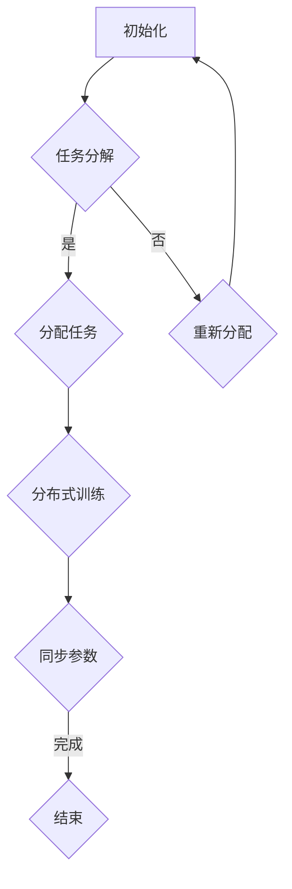
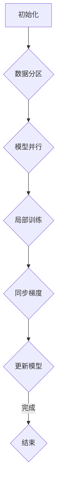
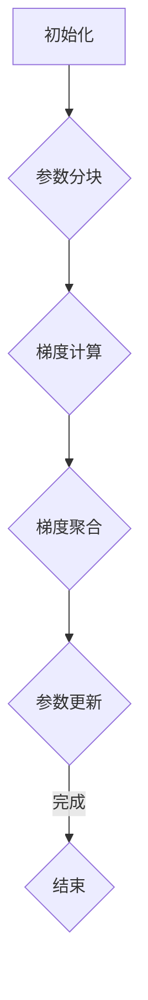

                 

### 文章标题

《AI模型加速III：分布式优化、DDP和ZeRO技术》

在当今快速发展的AI领域，模型的计算需求正以前所未有的速度增长。为了满足这一需求，分布式优化技术、DDP（分布式数据处理）和ZeRO（Zero Redundancy Optimization）等技术应运而生。这些技术不仅提高了AI模型的训练效率，还显著降低了计算资源的消耗。本文旨在深入探讨这些技术的工作原理、应用场景和实践方法，帮助读者全面理解并掌握AI模型加速的核心技术。

关键词：AI模型加速、分布式优化、DDP、ZeRO、计算效率、资源消耗

摘要：
本文分为四个主要部分，首先介绍了AI模型加速的背景与重要性，以及面临的挑战和基本概念。接着，详细阐述了分布式优化技术，包括其原理、算法和应用实践。随后，重点分析了DDP技术的工作原理、优势、局限以及具体应用案例。最后，探讨了ZeRO技术的概念、优势、局限和应用场景，并结合实际案例进行了深入解析。通过本文的阅读，读者将能够全面了解AI模型加速的关键技术，为后续研究和实践提供有力支持。

### 第一部分：AI模型加速概述

#### 第1章：AI模型加速的重要性与挑战

##### 1.1 AI模型加速的背景与意义

AI模型加速的背景可以追溯到近年来人工智能的飞速发展。随着深度学习技术的广泛应用，越来越多的复杂模型被提出并应用于实际场景中。这些模型往往需要大量的计算资源来训练和推理，从而推动了计算能力的快速增长。然而，随着模型规模的不断扩大，计算资源的压力也日益增大。因此，如何提高AI模型的训练效率、降低资源消耗成为了研究者和开发者亟待解决的问题。

**1.1.1 AI模型加速的重要性**

AI模型加速在社会和经济层面上具有重要意义：

1. **提升效率**：AI模型加速技术可以显著降低模型训练所需的时间，从而提高生产效率，缩短产品开发周期。
2. **降低成本**：通过优化计算资源和算法，AI模型加速可以减少硬件设备的投入，降低整体运营成本。
3. **满足需求**：随着AI技术的广泛应用，对AI模型计算能力的需求不断增长。加速技术能够更好地满足这一需求，推动AI技术的进一步发展。
4. **促进创新**：加速技术为研究人员和开发者提供了更强大的计算工具，使他们能够探索更复杂、更深入的AI模型，从而推动AI领域的创新。

**1.1.2 AI模型加速的挑战**

尽管AI模型加速具有重要意义，但实现这一目标面临着诸多挑战：

1. **计算能力需求**：复杂AI模型的训练和推理需要巨大的计算能力，这对硬件设备的性能提出了更高的要求。
2. **数据处理效率**：大规模数据的处理是AI模型训练的关键步骤，如何提高数据处理效率成为了加速技术的重要研究方向。
3. **能耗控制**：随着计算需求的增加，能耗问题也日益突出。如何在保证计算能力的前提下降低能耗是一个亟待解决的挑战。
4. **可扩展性**：AI模型的规模和复杂性不断增加，如何实现系统的可扩展性，使其能够适应不同规模的任务，是一个关键问题。

##### 1.2 AI模型加速的基本概念

**1.2.1 什么是AI模型加速**

AI模型加速是指通过一系列技术手段，提高AI模型的训练和推理效率，减少所需的时间和资源消耗。这包括硬件加速、软件优化和算法改进等方面。

**1.2.2 AI模型加速的常见手段**

AI模型加速的常见手段主要包括以下几个方面：

1. **硬件加速**：通过使用GPU、TPU等专用硬件设备来加速模型的计算，提高计算效率。
2. **软件优化**：通过优化编译器、运行时库和编程语言，减少程序执行时间，提高软件性能。
3. **算法改进**：通过改进训练算法和数据预处理方法，减少模型训练时间和计算资源消耗。
4. **分布式计算**：通过将计算任务分布到多个节点上，利用并行计算来提高模型训练效率。

**1.2.3 AI模型加速的优势**

AI模型加速的优势主要体现在以下几个方面：

1. **提高效率**：加速技术可以显著降低模型训练和推理所需的时间，提高生产效率。
2. **降低成本**：通过优化计算资源和算法，加速技术可以减少硬件设备的投入和运营成本。
3. **提升性能**：加速技术可以使AI模型在更短的时间内达到更高的准确率，提高模型性能。
4. **扩展应用**：加速技术为研究人员和开发者提供了更强大的计算工具，使他们能够探索更复杂、更深入的AI模型，推动AI技术的广泛应用。

##### 1.3 AI模型加速的应用领域

AI模型加速技术广泛应用于多个领域，包括但不限于：

1. **自然语言处理**：加速技术可以显著提高自然语言处理任务的效率，如机器翻译、文本分类等。
2. **计算机视觉**：加速技术可以加速图像识别、目标检测等计算机视觉任务的训练和推理。
3. **语音识别**：加速技术可以提高语音识别的准确率和响应速度，应用于智能客服、语音助手等场景。
4. **推荐系统**：加速技术可以优化推荐系统的计算效率，提高推荐效果，提升用户体验。
5. **金融风控**：加速技术可以用于金融风控模型的训练和推理，提高风险识别和预警能力。

通过上述分析，我们可以看到AI模型加速技术在提升计算效率、降低成本、推动创新等方面具有重要意义。在接下来的章节中，我们将进一步探讨分布式优化技术、DDP和ZeRO技术，帮助读者深入理解这些关键技术的工作原理和应用实践。

### 第二部分：分布式优化技术

#### 第2章：分布式优化原理

##### 2.1 分布式优化的概念

分布式优化是指将大规模的机器学习模型训练任务分布到多个计算节点上进行，通过协同工作来提高计算效率和资源利用率。分布式优化技术是AI模型加速的重要手段之一，主要目标是减少模型训练所需的时间和计算资源，同时提高模型训练的稳定性和准确性。

**2.1.1 分布式优化的定义**

分布式优化是指将大规模机器学习模型的训练任务分配到多个计算节点上，通过并行计算和协同优化来加速模型训练。具体来说，分布式优化主要包括以下几个方面：

1. **任务分配**：将大规模训练任务分解为多个子任务，分配到不同的计算节点上。
2. **数据分区**：将大规模训练数据集划分为多个子数据集，分配到不同的节点上进行局部训练。
3. **模型并行**：将大规模模型分为多个子模型，每个子模型在不同的节点上进行训练。
4. **数据并行**：在多个节点上对相同的数据集进行训练，每个节点使用不同的随机初始化和优化算法。

**2.1.2 分布式优化的必要性**

随着AI模型规模的不断扩大，分布式优化成为了提高模型训练效率的必要手段。以下是一些具体的必要性：

1. **计算资源受限**：单个计算节点无法满足大规模模型训练的计算需求，通过分布式优化可以充分利用多个节点的计算资源。
2. **数据量巨大**：大规模数据集的训练需要大量的存储和计算资源，通过分布式优化可以将数据分散到多个节点上进行处理，提高数据处理效率。
3. **模型复杂度增加**：随着AI技术的发展，模型的复杂度不断增加，通过分布式优化可以将大规模模型分解为多个较小的子模型，提高训练效率。
4. **任务调度灵活**：分布式优化允许动态调度任务，根据节点的负载情况合理分配任务，提高系统资源利用率。

##### 2.2 分布式优化算法

分布式优化算法是实现分布式训练的核心，主要包括梯度下降算法及其变种。以下将介绍几种常见的分布式优化算法：

**2.2.1 梯度下降算法**

梯度下降算法是机器学习中一种最基本的优化算法，用于最小化目标函数。在分布式场景下，梯度下降算法需要多个节点协同工作，每个节点计算局部梯度并更新模型参数。

**2.2.2 随机梯度下降(SGD)**

随机梯度下降（Stochastic Gradient Descent，SGD）是梯度下降算法的一种变种，每次迭代只使用一个样本的梯度进行参数更新。SGD可以加快训练过程，提高模型收敛速度。

**2.2.3 小批量梯度下降**

小批量梯度下降（Mini-batch Gradient Descent）是SGD的一种改进，每次迭代使用多个样本（批量）的梯度进行参数更新。小批量梯度下降可以在保持SGD快速收敛的同时，减少噪声和计算误差。

**2.2.4 多层分布式优化**

在分布式优化中，多层神经网络训练是一个重要应用场景。多层分布式优化主要包括以下几种方法：

1. **层间并行**：将多层神经网络拆分为多个子网络，每个子网络在不同的节点上进行训练，最后将子网络的参数合并。
2. **层内并行**：在每个层内进行数据并行和模型并行，提高训练效率。
3. **层次并行**：将多层神经网络拆分为多个层次，在每个层次内进行局部训练，最后将层次间的参数合并。

**2.2.5 多任务分布式优化**

多任务分布式优化是指同时训练多个任务，通过分布式优化技术提高训练效率。常见的方法包括：

1. **多任务共享参数**：将多个任务的参数共享，通过分布式优化进行协同训练。
2. **多任务分割参数**：将多个任务的参数分割到不同的节点上，分别进行训练。
3. **多任务融合**：在多个任务间进行参数融合，通过分布式优化提高整体训练效果。

##### 2.3 分布式优化算法应用

分布式优化算法在实际应用中起到了关键作用，以下将介绍几种常见的分布式优化算法应用场景：

**2.3.1 参数服务器架构**

参数服务器架构是分布式优化算法的一种常见实现方式，主要包括以下组成部分：

1. **参数服务器**：负责存储和同步全局模型参数，处理来自各个节点的梯度更新请求。
2. **计算节点**：负责局部训练和计算梯度，向参数服务器发送梯度更新。
3. **通信网络**：连接参数服务器和计算节点，用于传输梯度更新和模型参数。

在参数服务器架构中，分布式优化算法可以通过以下步骤实现：

1. **初始化**：将全局模型参数初始化，分配到各个计算节点上。
2. **局部训练**：计算节点在本地数据集上训练模型，计算局部梯度。
3. **梯度同步**：计算节点将局部梯度发送到参数服务器，参数服务器同步更新全局参数。
4. **参数更新**：计算节点根据全局参数更新本地模型参数，继续进行局部训练。

**2.3.2 数据并行和模型并行**

数据并行和模型并行是分布式优化算法中常用的两种并行方法，以下分别进行介绍：

**数据并行**：数据并行是指将训练数据集划分为多个子数据集，每个计算节点负责处理一个子数据集。数据并行可以显著提高模型训练速度，但需要注意以下问题：

1. **数据划分策略**：选择合适的数据划分策略，确保各个节点上的数据集均衡。
2. **负载均衡**：根据节点的计算能力和数据量，合理分配任务，确保负载均衡。
3. **同步机制**：在训练过程中，确保各个节点的模型参数同步更新，避免数据不一致。

**模型并行**：模型并行是指将模型拆分为多个子模型，每个计算节点负责训练一个子模型。模型并行可以提高模型训练的并行度和计算效率，但需要注意以下问题：

1. **模型划分策略**：选择合适的模型划分策略，确保各个子模型之间的相互独立性。
2. **通信开销**：在模型并行中，节点之间需要进行参数同步和通信，需要控制通信开销，提高整体性能。
3. **收敛速度**：在模型并行中，各个子模型可能存在不同的收敛速度，需要合理调整训练策略，确保整体收敛速度。

通过上述分析，我们可以看到分布式优化技术在提高AI模型训练效率方面具有重要作用。在接下来的章节中，我们将进一步探讨分布式优化技术的实践方法和应用案例，帮助读者深入理解分布式优化的实际应用。

### 第三部分：DDP（分布式数据处理）技术

#### 第4章：DDP技术原理

分布式数据处理（Distributed Data Processing，DDP）技术是一种在分布式环境中高效处理大规模数据的框架，广泛应用于分布式机器学习和数据科学领域。DDP技术通过将数据处理任务分布到多个节点上，利用并行计算和分布式存储来提高数据处理效率和性能。

**4.1 DDP的概念**

**什么是DDP？**

DDP是一种分布式数据处理框架，其核心思想是将数据处理任务分解为多个子任务，分配到多个节点上进行并行处理。在DDP中，每个节点负责一部分数据的处理，并通过网络将处理结果汇总，从而实现大规模数据的分布式处理。DDP适用于处理大量数据集和复杂的数据处理任务，具有高扩展性和高性能。

**DDP的工作原理**

DDP的工作原理主要包括以下几个步骤：

1. **数据划分**：将大规模数据集划分为多个子数据集，每个子数据集分配给不同的节点进行处理。
2. **任务分配**：将数据处理任务分配到各个节点上，确保每个节点都有一定的处理任务。
3. **并行处理**：各个节点独立处理分配给自己的子数据集，进行数据清洗、转换、计算等操作。
4. **结果汇总**：将各个节点的处理结果汇总，生成最终的数据处理结果。
5. **错误恢复**：在处理过程中，如果某个节点发生故障，DDP框架会自动进行错误恢复，重新分配任务。

**4.2 DDP的优势与局限**

**DDP的优势**

DDP技术具有以下优势：

1. **高扩展性**：DDP可以通过增加节点数量来扩展处理能力，适应不同规模的数据处理任务。
2. **高性能**：通过并行计算和分布式存储，DDP可以提高数据处理速度，缩短处理时间。
3. **容错性**：DDP具有较好的容错性，可以在节点故障时自动恢复，保证数据处理任务的稳定性。
4. **灵活性**：DDP支持多种数据处理算法和框架，可以根据具体需求选择合适的算法和框架。

**DDP的局限**

DDP技术也存在一些局限：

1. **通信开销**：DDP中节点间的通信开销较大，可能会影响整体性能。
2. **复杂度**：DDP涉及到多个节点的协调和同步，增加了系统的复杂度，需要更多的维护和优化。
3. **数据一致性**：在DDP中，多个节点同时处理数据，可能会出现数据不一致的问题，需要额外的同步机制来解决。

**4.3 DDP的应用场景**

DDP技术适用于多种应用场景，主要包括以下几种：

1. **大规模数据处理**：对于大规模数据集，DDP可以通过分布式处理来提高数据处理速度，适用于数据挖掘、大数据分析等场景。
2. **分布式机器学习**：DDP可以用于分布式机器学习任务的训练和推理，提高模型的训练效率和推理速度，适用于图像识别、自然语言处理等场景。
3. **实时数据处理**：DDP可以用于实时数据处理任务，如实时数据分析、实时推荐系统等，具有较好的响应速度和灵活性。
4. **云计算和边缘计算**：DDP适用于云计算和边缘计算场景，可以将数据处理任务分布到云节点和边缘节点上，提高数据处理能力和响应速度。

通过以上分析，我们可以看到DDP技术在分布式数据处理领域具有重要作用。在接下来的章节中，我们将进一步探讨DDP技术的具体实现和应用实践，帮助读者深入理解DDP技术的原理和应用。

#### 第5章：DDP实践

##### 5.1 DDP配置与优化

在实际应用中，配置和优化DDP技术是关键步骤，确保其高效运行和性能提升。以下将介绍DDP配置与优化方面的具体方法和策略。

**5.1.1 DDP配置流程**

DDP配置主要包括以下步骤：

1. **环境准备**：安装DDP依赖的库和框架，如TensorFlow、PyTorch等，并确保各个节点之间的网络通信正常。
2. **参数设置**：配置DDP参数，如数据分区策略、节点数量、通信端口等。这些参数可以根据具体任务和硬件配置进行调整。
3. **节点部署**：在分布式环境中部署DDP计算节点，确保每个节点都能够正常连接到参数服务器和其他计算节点。
4. **模型初始化**：初始化全局模型参数，并将其分配到各个节点上。这可以通过DDP框架提供的API或手动编写代码来实现。

**5.1.2 DDP性能优化**

以下是一些常见的DDP性能优化策略：

1. **数据分区优化**：合理划分数据分区，确保各个节点上的数据量均衡，减少负载不均导致的影响。可以选择基于数据量、特征值等策略进行分区。
2. **任务调度优化**：根据节点的计算能力和负载情况，合理调度任务，确保任务分配均衡。可以使用负载均衡算法或手动调整任务分配策略。
3. **通信优化**：减少节点间的通信开销，提高整体性能。可以采用以下方法进行通信优化：
   - **批处理通信**：将多个通信请求合并为批量请求，减少通信次数。
   - **压缩通信数据**：使用数据压缩算法减小通信数据的大小，提高通信效率。
   - **选择合适的通信协议**：根据具体应用场景，选择适合的通信协议，如TCP、UDP等。

4. **内存管理优化**：合理管理节点的内存资源，避免内存溢出或浪费。可以采用以下方法进行内存管理优化：
   - **内存预分配**：提前分配内存，减少内存分配的开销。
   - **内存复用**：在多个任务之间复用内存，避免重复分配和释放。
   - **垃圾回收优化**：优化垃圾回收算法，减少垃圾回收的开销。

5. **并发处理优化**：提高节点的并发处理能力，提高整体性能。可以采用以下方法进行并发处理优化：
   - **线程池**：使用线程池管理线程，避免线程频繁创建和销毁，提高并发处理能力。
   - **异步处理**：使用异步编程模型，减少同步等待时间，提高并发处理能力。

**5.1.3 实践案例**

以下是一个使用PyTorch实现DDP训练的实践案例：

1. **环境准备**：
   - 安装PyTorch和DDP依赖的库。
   - 配置计算节点，确保节点之间可以正常通信。

2. **模型定义**：
   - 定义一个简单的全连接神经网络模型。

3. **数据集划分**：
   - 将训练数据集划分为多个子数据集，每个子数据集分配给不同的节点。

4. **模型初始化**：
   - 在每个节点上初始化模型参数。

5. **训练过程**：
   - 使用DDP提供的API，将模型和优化器配置为分布式模式。
   - 进行分布式训练，每个节点负责处理自己的子数据集。
   - 每隔一定次数的迭代，同步模型参数。

6. **结果汇总**：
   - 将各个节点的训练结果汇总，生成最终的训练结果。

**代码示例**：

```python
import torch
import torch.distributed as dist
import torch.nn as nn
import torch.optim as optim

# 模型定义
class SimpleModel(nn.Module):
    def __init__(self):
        super(SimpleModel, self).__init__()
        self.fc1 = nn.Linear(784, 256)
        self.fc2 = nn.Linear(256, 128)
        self.fc3 = nn.Linear(128, 10)

    def forward(self, x):
        x = torch.relu(self.fc1(x))
        x = torch.relu(self.fc2(x))
        x = self.fc3(x)
        return x

# 模型初始化
model = SimpleModel()
if args.distributed:
    model = torch.nn.parallel.DistributedDataParallel(model, device_ids=[args.local_rank], output_device=args.local_rank)

# 数据集划分
train_loader = torch.utils.data.DataLoader(train_dataset, batch_size=args.batch_size, shuffle=True)

# 优化器
optimizer = optim.SGD(model.parameters(), lr=args.lr, momentum=0.9)

# 训练过程
for epoch in range(args.num_epochs):
    for batch_idx, (data, target) in enumerate(train_loader):
        if args.distributed:
            data, target = data.cuda(), target.cuda()
            data = data.cuda(args.local_rank)
            target = target.cuda(args.local_rank)
        
        optimizer.zero_grad()
        output = model(data)
        loss = nn.CrossEntropyLoss()(output, target)
        loss.backward()
        
        if args.distributed:
            dist.barrier()  # 同步所有节点
            model.module.load_state_dict(model.state_dict())  # 同步模型参数
        
        optimizer.step()

# 结果汇总
# ...

```

通过以上实践案例，我们可以看到DDP技术在分布式训练中的具体实现方法和步骤。在接下来的章节中，我们将继续探讨DDP技术的应用场景和优化方法，帮助读者更好地理解和应用DDP技术。

#### 第5章：DDP实践

##### 5.2 DDP案例

在本章节中，我们将通过实际案例来展示如何使用DDP技术进行分布式训练，并详细解析这些案例的实现细节。

**5.2.1 案例一：使用PyTorch实现DDP训练**

**背景**：
为了提高模型训练速度，一个研究团队决定使用PyTorch的DDP（Distributed Data Parallel）模块对图像分类模型进行分布式训练。他们选择使用CIFAR-10数据集，这是一个包含60000张32x32彩色图像的数据集，其中50000张用于训练，10000张用于测试。

**实现步骤**：

1. **环境准备**：
   - 确保所有节点上的PyTorch和CUDA环境已经配置好。
   - 编写一个启动脚本，用于初始化分布式环境。例如，对于PyTorch，可以使用以下代码：

```python
import torch.distributed as dist
import torch

def setup(rank, world_size):
    dist.init_process_group("nccl", rank=rank, world_size=world_size)

def cleanup():
    dist.destroy_process_group()

if __name__ == "__main__":
    rank = int(os.environ['RANK'])
    world_size = int(os.environ['WORLD_SIZE'])
    setup(rank, world_size)
    # 在这里加载模型和数据集，并开始训练
    cleanup()
```

2. **模型和数据集准备**：
   - 加载CIFAR-10数据集，并将其分为训练集和验证集。
   - 定义模型，例如ResNet18或VGG16。

3. **分布式数据加载**：
   - 使用`torch.utils.data.distributed.DistributedSampler`将数据集分割为每个节点的子数据集。
   - 创建`DataLoader`，设置batch size和sampler。

```python
train_sampler = torch.utils.data.distributed.DistributedSampler(train_dataset, num_replicas=world_size, rank=rank)
train_loader = torch.utils.data.DataLoader(train_dataset, batch_size=args.batch_size, sampler=train_sampler)
```

4. **模型配置**：
   - 将模型配置为DDP模式，确保使用正确的设备（GPU或CPU）。

```python
model = torchvision.models.resnet18()
if args.cuda:
    model.cuda()
model = nn.parallel.DistributedDataParallel(model, device_ids=[rank])
```

5. **训练过程**：
   - 在每个节点上执行以下步骤：
     - 使用DDP模式的前向传播和反向传播。
     - 每隔一定次数的迭代，同步模型参数。

```python
optimizer = optim.SGD(model.parameters(), lr=args.lr, momentum=args.momentum)
for epoch in range(args.epochs):
    train_sampler.set_epoch(epoch)
    for data, target in train_loader:
        if args.cuda:
            data, target = data.cuda(), target.cuda()
        optimizer.zero_grad()
        output = model(data)
        loss = nn.CrossEntropyLoss()(output, target)
        loss.backward()
        optimizer.step()
    dist.barrier()  # 同步所有节点上的步骤
```

6. **结果汇总**：
   - 训练完成后，汇总各个节点的结果，例如训练和验证的损失值和准确率。

**代码解读与分析**：

上述代码展示了如何使用PyTorch的DDP模块进行分布式训练。主要步骤包括：

- **环境初始化**：使用`setup`函数初始化分布式环境。
- **模型和数据集**：定义模型和数据集，并将数据集分割为每个节点的子数据集。
- **分布式数据加载**：使用`DistributedSampler`确保每个节点只加载自己的数据子集。
- **模型配置**：将模型配置为DDP模式，确保使用正确的设备。
- **训练过程**：在每个节点上执行前向传播、反向传播和参数更新，并使用`barrier`同步节点。
- **结果汇总**：汇总各个节点的训练结果。

**5.2.2 案例二：使用TensorFlow实现DDP训练**

**背景**：
另一个研究团队决定使用TensorFlow的分布式策略对大型图像识别任务进行分布式训练，以加快训练速度并减少资源消耗。他们选择使用ImageNet数据集，这是一个包含1000个类别的120万张图像的数据集。

**实现步骤**：

1. **环境准备**：
   - 确保所有节点上的TensorFlow和CUDA环境已经配置好。
   - 编写一个启动脚本，用于初始化分布式环境。例如：

```python
import tensorflow as tf

strategy = tf.distribute.MirroredStrategy()

def model_fn(features, labels, mode):
    # 定义模型
    # ...

return tf.estimator.EstimatorSpec(mode, predictions=predictions, loss=loss)

# 创建Estimator
estimator = tf.estimator.Estimator(model_fn=model_fn, model_dir=model_dir, config=config)
```

2. **数据集准备**：
   - 加载ImageNet数据集，并将其分割为训练集和验证集。
   - 创建一个输入函数，用于提供训练数据和标签。

```python
def input_fn(dataset, batch_size, is_training=True):
    # 定义数据预处理和batching操作
    # ...

    return features, labels
```

3. **分布式训练**：
   - 使用`tf.estimator.Estimator`进行分布式训练，传入训练和验证输入函数。

```python
train_input_fn = lambda: input_fn(train_dataset, batch_size)
eval_input_fn = lambda: input_fn(eval_dataset, batch_size, is_training=False)

# 开始训练
estimator.train(input_fn=train_input_fn, steps=train_steps)
estimator.evaluate(input_fn=eval_input_fn, steps=eval_steps)
```

4. **结果汇总**：
   - 训练完成后，查看训练和验证的损失值和准确率。

**代码解读与分析**：

上述代码展示了如何使用TensorFlow的分布式策略进行分布式训练。主要步骤包括：

- **环境初始化**：使用`MirroredStrategy`初始化分布式环境。
- **模型定义**：定义模型函数，包括前向传播和损失函数。
- **输入函数**：创建输入函数，用于提供训练和验证数据。
- **训练和评估**：使用`Estimator`进行分布式训练和评估。

通过上述两个案例，我们可以看到如何使用DDP技术在PyTorch和TensorFlow中实现分布式训练。这些案例展示了分布式训练的基本步骤和实现细节，帮助读者理解和应用DDP技术。

### 第四部分：ZeRO（Zero Redundancy Optimization）技术

#### 第6章：ZeRO技术原理

##### 6.1 ZeRO的概念

ZeRO（Zero Redundancy Optimization）技术是一种针对大规模深度学习模型训练的优化方法，旨在减少分布式训练过程中的内存占用和通信开销。ZeRO通过将模型参数和梯度划分为多个部分，分别存储在每个计算节点上，从而实现内存和通信的有效利用。

**什么是ZeRO？**

ZeRO技术起源于Facebook AI Research（FAIR），其全称为Zero Redundancy Optimization。这种技术通过将模型参数和梯度进行分块，将原本需要存储在中央服务器上的全局参数和梯度分散到各个计算节点上，从而实现以下目标：

1. **减少内存占用**：ZeRO通过将参数和梯度分块，使得每个节点只需存储一部分数据，显著降低了内存占用。
2. **降低通信开销**：ZeRO通过在每个节点上完成梯度聚合和参数更新，减少了节点间的通信次数和通信数据量。

**ZeRO的优化原理**

ZeRO技术的优化原理主要包括以下几个方面：

1. **参数分块**：将全局模型参数分成多个小块，每个小块存储在一个节点上。这样，每个节点只需存储局部参数，减少了全局参数的存储需求。

2. **梯度聚合**：在每个节点上计算局部梯度的同时，将这些梯度进行聚合，形成全局梯度。梯度聚合可以通过多种策略实现，如累加、平均等。

3. **参数更新**：在完成梯度聚合后，使用全局梯度更新每个节点的局部参数。这种更新策略可以避免全局参数在节点间的传输，从而减少通信开销。

4. **动态调度**：ZeRO可以根据节点的内存和计算能力，动态调整参数和梯度的分块大小，以最大化资源利用率。

**ZeRO的优势**

ZeRO技术在分布式训练中具有以下优势：

1. **减少内存占用**：通过参数分块，每个节点只需存储部分参数，从而减少了整体内存占用，提高了训练的可扩展性。

2. **降低通信开销**：通过在每个节点上完成梯度聚合和参数更新，减少了节点间的通信次数和数据量，提高了训练效率。

3. **提高计算并行度**：ZeRO允许每个节点独立完成梯度计算和参数更新，提高了计算并行度，进一步加速了训练过程。

4. **适应不同规模的训练任务**：ZeRO可以根据训练任务的大小和节点的计算能力，动态调整参数和梯度的分块大小，适应不同的训练场景。

**ZeRO的局限**

尽管ZeRO技术具有显著的优势，但其在实际应用中也存在一些局限：

1. **计算复杂度增加**：ZeRO需要在每个节点上进行梯度聚合和参数更新，这增加了计算复杂度，可能对性能产生一定影响。

2. **通信延迟**：尽管ZeRO减少了通信次数和数据量，但节点间的通信延迟仍然可能对训练过程产生影响，特别是在大规模分布式系统中。

3. **负载均衡问题**：ZeRO需要根据节点的计算能力和数据量动态调整参数和梯度的分块大小，这可能引入负载均衡问题，影响整体性能。

4. **系统依赖性**：ZeRO技术依赖于特定的分布式训练框架（如PyTorch和TensorFlow），可能需要对这些框架进行一定的修改和优化，以支持ZeRO技术。

**6.2 ZeRO的应用场景**

ZeRO技术主要适用于以下几种应用场景：

1. **超大规模模型训练**：ZeRO技术通过减少内存占用和通信开销，适用于训练超大规模模型，如BERT、GPT等。

2. **分布式训练系统**：ZeRO技术可以在分布式训练系统中广泛应用，特别是在需要处理大规模数据集和复杂模型的情况下。

3. **资源受限环境**：ZeRO技术可以应用于资源受限的环境，如边缘设备、云计算等，通过减少内存和通信开销，提高资源利用率。

4. **高性能计算集群**：ZeRO技术可以在高性能计算集群上应用，通过优化参数和梯度的分块策略，提高训练效率和系统性能。

通过以上分析，我们可以看到ZeRO技术在分布式训练中的重要作用。在接下来的章节中，我们将进一步探讨ZeRO技术的具体实现方法和应用实践，帮助读者深入理解和应用这一技术。

#### 第7章：ZeRO实践

##### 7.1 ZeRO配置与优化

在实际应用中，配置和优化ZeRO技术是关键步骤，确保其能够高效运行并发挥最大性能。以下将介绍ZeRO配置与优化方面的具体方法和策略。

**7.1.1 ZeRO配置流程**

ZeRO配置主要包括以下步骤：

1. **环境准备**：
   - 确保所有节点上的计算框架（如PyTorch或TensorFlow）和CUDA环境已经配置好。
   - 安装ZeRO依赖的库和框架，如PyTorch的`torch-distributed`或TensorFlow的`tf.distribute`.

2. **模型和数据集准备**：
   - 定义模型和数据集，确保数据集可以分割为多个子数据集，每个子数据集可以分配给不同的节点。
   - 创建数据加载器，支持分布式数据加载。

3. **配置ZeRO参数**：
   - 在训练脚本中设置ZeRO参数，如参数分块大小（`fp16`）、梯度聚合策略（`allreduce`或`mp αυτοματοποιημένα`）等。

   对于PyTorch，示例配置如下：

   ```python
   import torch.distributed as dist
   
   dist.init_process_group(backend='nccl', init_method='env://', world_size=world_size, rank=rank)
   model = MyModel().to(rank)
   optimizer = MyOptimizer(model.parameters(), lr=lr)
   
   if use_zerorg:
       model = torch.cuda.amp.autocast(enabled=True)
       optimizer = torch.optim.SGD(model.parameters(), lr=lr, momentum=0.9)
       model = torch.nn.parallel.DistributedDataParallel(model, device_ids=[rank], output_device=rank, find_unused_parameters=True)
   ```

4. **训练过程**：
   - 在每个节点上执行以下步骤：
     - 加载本地的子数据集。
     - 进行前向传播和反向传播，计算局部梯度。
     - 使用ZeRO的聚合策略（如`allreduce`）将局部梯度聚合为全局梯度。
     - 使用全局梯度更新模型参数。

   ```python
   for epoch in range(num_epochs):
       for data, target in train_loader:
           if use_zerorg:
               optimizer.zero_grad()
               output = model(data)
               loss = nn.CrossEntropyLoss()(output, target)
               scaled_loss = scaled_loss_scaler.scale(loss)
               scaled_loss.backward()
               optimizer.step()
           else:
               # 非ZeRO模式
               # ...
   ```

5. **结果汇总**：
   - 训练完成后，汇总各个节点的结果，如训练和验证的损失值和准确率。

**7.1.2 ZeRO性能优化**

以下是一些常见的ZeRO性能优化策略：

1. **参数分块优化**：
   - 选择合适的参数分块大小，以平衡内存占用和通信开销。较小的分块大小可以减少内存占用，但增加通信次数；较大的分块大小可以减少通信次数，但增加内存占用。
   - 根据节点的计算能力和内存容量，动态调整参数分块大小。

2. **梯度聚合优化**：
   - 选择合适的梯度聚合策略，如`allreduce`、`mp自分躯`等。不同的聚合策略会影响通信模式和性能。
   - 根据网络带宽和节点数量，调整梯度聚合的并行度，以最大化通信效率。

3. **通信优化**：
   - 使用压缩算法（如Zlib或LZ4）减小通信数据的大小，提高通信效率。
   - 使用批处理通信，将多个通信请求合并为批量请求，减少通信次数。

4. **内存管理优化**：
   - 使用内存预分配策略，提前分配内存，减少内存分配和释放的开销。
   - 使用内存复用策略，在多个任务之间复用内存，避免重复分配和释放。

5. **负载均衡优化**：
   - 根据节点的计算能力和数据量，合理分配任务，确保负载均衡。
   - 使用负载均衡算法，动态调整任务分配，以应对节点的动态变化。

**7.1.3 实践案例**

以下是一个使用PyTorch实现ZeRO训练的实践案例：

1. **环境准备**：
   - 确保所有节点上的PyTorch和CUDA环境已经配置好。

2. **模型和数据集准备**：
   - 加载预训练的模型和数据集，例如使用ResNet18和CIFAR-10数据集。

3. **配置ZeRO参数**：
   - 在训练脚本中设置ZeRO参数。

   ```python
   import torch
   import torch.distributed as dist
   import torch.nn as nn
   import torch.optim as optim
   
   dist.init_process_group(backend='nccl', init_method='env://', world_size=world_size, rank=rank)
   model = torchvision.models.resnet18().to(rank)
   optimizer = optim.SGD(model.parameters(), lr=lr, momentum=0.9)
   
   if use_zerorg:
       model = torch.cuda.amp.autocast(enabled=True)
       optimizer = optim.SGD(model.parameters(), lr=lr, momentum=0.9)
       model = nn.parallel.DistributedDataParallel(model, device_ids=[rank], output_device=rank, find_unused_parameters=True)
   ```

4. **训练过程**：
   - 在每个节点上执行以下步骤：
     - 加载本地的子数据集。
     - 进行前向传播和反向传播，计算局部梯度。
     - 使用ZeRO的聚合策略将局部梯度聚合为全局梯度。
     - 使用全局梯度更新模型参数。

   ```python
   for epoch in range(num_epochs):
       for data, target in train_loader:
           if use_zerorg:
               optimizer.zero_grad()
               output = model(data)
               loss = nn.CrossEntropyLoss()(output, target)
               scaled_loss = scaled_loss_scaler.scale(loss)
               scaled_loss.backward()
               optimizer.step()
           else:
               # 非ZeRO模式
               # ...
   ```

5. **结果汇总**：
   - 训练完成后，汇总各个节点的结果。

通过以上实践案例，我们可以看到如何使用PyTorch的ZeRO模块进行分布式训练。这些步骤和优化策略帮助读者理解和应用ZeRO技术，从而实现高效的模型训练。

#### 第7章：ZeRO实践

##### 7.2 ZeRO案例

在本章节中，我们将通过实际案例来展示如何使用ZeRO技术进行分布式训练，并详细解析这些案例的实现细节。

**7.2.1 案例一：使用PyTorch实现ZeRO训练**

**背景**：
为了提升模型训练效率，一个研究团队决定使用PyTorch的ZeRO（Zero Redundancy Optimization）模块对大规模图像分类模型进行分布式训练。他们选择使用ImageNet数据集，这是一个包含1000个类别的120万张图像的数据集。

**实现步骤**：

1. **环境准备**：
   - 确保所有节点上的PyTorch和CUDA环境已经配置好。
   - 安装ZeRO依赖的库，如`torch-distributed`。

2. **模型和数据集准备**：
   - 定义模型，例如使用ResNet50。
   - 加载并预处理ImageNet数据集，并将其分割为训练集和验证集。

3. **分布式数据加载**：
   - 使用`torch.utils.data.distributed.DistributedSampler`将数据集分割为每个节点的子数据集。

   ```python
   train_sampler = torch.utils.data.distributed.DistributedSampler(train_dataset, num_replicas=world_size, rank=rank)
   train_loader = torch.utils.data.DataLoader(train_dataset, batch_size=batch_size, sampler=train_sampler)
   ```

4. **配置ZeRO**：
   - 在训练脚本中设置ZeRO参数，如参数分块大小。

   ```python
   from torch.nn.parallel import DistributedDataParallel as DDP
   
   model = torchvision.models.resnet50()
   model = model.cuda()
   optimizer = optim.SGD(model.parameters(), lr=learning_rate, momentum=0.9)
   
   if use_zerorg:
       model = torch.cuda.amp.autocast(enabled=True)
       model = DDP(model, device_ids=[rank], output_device=rank, find_unused_parameters=True)
   ```

5. **训练过程**：
   - 在每个节点上执行以下步骤：
     - 加载本地的子数据集。
     - 使用ZeRO进行前向传播和反向传播。
     - 使用ZeRO的聚合策略（如`allreduce`）进行梯度聚合。

   ```python
   for epoch in range(num_epochs):
       train_sampler.set_epoch(epoch)
       for data, target in train_loader:
           optimizer.zero_grad()
           output = model(data)
           loss = nn.CrossEntropyLoss()(output, target)
           scaled_loss = scaled_loss_scaler.scale(loss)
           scaled_loss.backward()
           optimizer.step()
   ```

6. **结果汇总**：
   - 训练完成后，汇总各个节点的结果，如训练和验证的损失值和准确率。

**代码解读与分析**：

上述代码展示了如何使用PyTorch的ZeRO模块进行分布式训练。主要步骤包括：

- **环境准备**：确保所有节点上的PyTorch和CUDA环境已经配置好。
- **模型和数据集**：定义模型和数据集，并将其分割为每个节点的子数据集。
- **分布式数据加载**：使用`DistributedSampler`确保每个节点只加载自己的数据子集。
- **模型配置**：将模型配置为ZeRO模式，使用`DistributedDataParallel`进行分布式训练。
- **训练过程**：在每个节点上执行前向传播、反向传播和参数更新，使用ZeRO的聚合策略进行梯度聚合。
- **结果汇总**：汇总各个节点的训练结果。

**7.2.2 案例二：使用TensorFlow实现ZeRO训练**

**背景**：
另一个研究团队决定使用TensorFlow的分布式策略对大规模图像识别任务进行分布式训练，以加快训练速度并减少资源消耗。他们选择使用ImageNet数据集，这是一个包含1000个类别的120万张图像的数据集。

**实现步骤**：

1. **环境准备**：
   - 确保所有节点上的TensorFlow和CUDA环境已经配置好。
   - 安装TensorFlow的ZeRO依赖库。

2. **模型和数据集准备**：
   - 定义模型，例如使用ResNet50。
   - 加载并预处理ImageNet数据集，并将其分割为训练集和验证集。

3. **分布式训练配置**：
   - 使用TensorFlow的`tf.distribute.MirroredStrategy`初始化分布式环境。

   ```python
   strategy = tf.distribute.MirroredStrategy()
   ```

4. **模型定义**：
   - 在策略下定义模型，并进行配置。

   ```python
   def model_fn(features, labels, mode):
       inputs = tf.cast(features['image'], tf.float32)
       labels = tf.one_hot(labels, depth=num_classes)
       
       logits = strategy.run(lambda: build_model(inputs, training=True))
       
       probabilities = tf.nn.softmax(logits, axis=-1)
       predicted_classes = tf.argmax(probabilities, axis=-1)
       
       if mode == tf.estimator.ModeKeys.PREDICT:
           return tf.estimator.EstimatorSpec(mode, predictions=predicted_classes)
       
       loss = strategy.run(lambda: tf.reduce_mean(tf.nn.softmax_cross_entropy_with_logits(labels=labels, logits=logits)))
       
       train_op = strategy.run(lambda: optimizer.minimize(loss, global_step=tf.train.get_global_step()))
       
       return tf.estimator.EstimatorSpec(mode, loss=loss, train_op=train_op)
   ```

5. **训练和评估**：
   - 使用`tf.estimator.Estimator`进行分布式训练和评估。

   ```python
   train_spec = tf.estimator.EstimatorSpec(name='train', inputs=train_input_fn, model_fn=model_fn, params=params)
   eval_spec = tf.estimator.EstimatorSpec(name='eval', inputs=eval_input_fn, model_fn=model_fn, params=params)
   
   train_results = estimator.train(input_fn=train_input_fn, max_steps=train_steps)
   eval_results = estimator.evaluate(input_fn=eval_input_fn, steps=eval_steps)
   ```

6. **结果汇总**：
   - 训练完成后，汇总各个节点的结果，如训练和验证的损失值和准确率。

通过上述两个案例，我们可以看到如何使用ZeRO技术在PyTorch和TensorFlow中实现分布式训练。这些案例展示了分布式训练的基本步骤和实现细节，帮助读者理解和应用ZeRO技术。

### 第8章：AI模型加速综合应用

#### 8.1 AI模型加速技术的整合

在AI模型加速的实际应用中，分布式优化技术、DDP（分布式数据处理）和ZeRO（Zero Redundancy Optimization）等技术通常需要整合使用，以实现最佳的效果。以下将讨论如何将这些技术综合应用，并提高AI模型的训练和推理效率。

**分布式优化与DDP的结合**

分布式优化与DDP的结合可以在分布式训练过程中充分发挥各自的优势。分布式优化通过将模型训练任务分布到多个节点上，提高了计算效率和资源利用率。而DDP则通过分布式数据加载和模型并行，进一步提高了数据处理和模型训练的效率。

在实际应用中，可以将分布式优化与DDP结合的方法分为以下几个步骤：

1. **任务分解**：将大规模模型训练任务分解为多个子任务，分配到不同的节点上进行分布式训练。
2. **数据分区**：使用DDP技术将训练数据集分割为多个子数据集，每个节点负责处理自己的数据子集。
3. **模型并行**：使用DDP的模型并行特性，将模型拆分为多个子模型，每个节点训练不同的子模型。
4. **梯度同步**：在分布式训练过程中，使用分布式优化算法（如SGD、Adam等）计算局部梯度，并通过DDP的同步机制更新全局模型参数。
5. **性能监控**：实时监控训练过程，根据节点的负载情况动态调整任务分配，确保负载均衡。

**分布式优化与ZeRO的结合**

分布式优化与ZeRO的结合可以在保持模型训练并行度的同时，显著降低内存占用和通信开销。ZeRO通过将模型参数和梯度分块存储在每个节点上，避免了全局参数和梯度在节点间的传输，从而减少了内存消耗和通信延迟。

将分布式优化与ZeRO结合的方法包括以下步骤：

1. **参数分块**：将全局模型参数分成多个小块，每个节点存储一部分参数。
2. **梯度聚合**：在每个节点上计算局部梯度，并将这些梯度分块聚合为全局梯度。
3. **参数更新**：使用全局梯度在每个节点上更新局部参数，从而实现分布式训练。
4. **内存管理**：根据节点的内存容量动态调整参数和梯度的分块大小，确保内存利用率最大化。
5. **通信优化**：通过使用压缩算法和批处理通信，减少节点间的通信次数和数据量。

**综合应用效果**

将分布式优化、DDP和ZeRO综合应用，可以在多个方面提高AI模型的训练和推理效率：

1. **计算效率**：通过分布式优化和模型并行，可以实现大规模模型的快速训练和推理。
2. **资源利用率**：通过DDP和ZeRO，可以显著降低内存占用和通信开销，提高资源利用率。
3. **训练稳定性**：通过动态任务分配和负载均衡，可以确保训练过程的稳定性和可靠性。
4. **扩展性**：综合应用这些技术，可以适应不同规模和复杂度的模型训练任务，具有较好的扩展性。

#### 8.2 AI模型加速技术展望

AI模型加速技术的发展是一个持续的过程，未来仍有许多研究方向和技术创新空间。以下将探讨AI模型加速技术的未来发展趋势和潜在研究方向。

**未来发展趋势**

1. **异构计算**：随着AI模型的复杂度不断增加，异构计算（如GPU、FPGA、TPU等）将发挥越来越重要的作用。未来，如何高效地利用异构计算资源，实现模型加速，是一个重要的研究方向。
2. **硬件与软件协同优化**：硬件和软件的协同优化是提高AI模型加速效率的关键。未来，将硬件和软件更好地结合，开发针对特定硬件的优化算法和工具，将是一个重要趋势。
3. **模型压缩与量化**：模型压缩和量化技术可以显著减少模型的内存占用和计算复杂度，提高模型的可部署性和实时性。未来，如何进一步优化模型压缩和量化技术，仍是一个重要的研究方向。
4. **自适应优化**：自适应优化技术可以根据训练任务的特点和资源状况，动态调整优化策略和资源分配，提高训练效率和资源利用率。未来，如何开发更有效的自适应优化算法，是一个重要的研究方向。
5. **联邦学习**：联邦学习是一种分布式学习技术，可以在多个设备上进行模型训练，同时保护用户隐私。未来，如何结合分布式优化、DDP和ZeRO技术，开发高效的联邦学习算法，将是一个重要的研究方向。

**潜在研究方向**

1. **高效分布式优化算法**：研究更加高效、稳定的分布式优化算法，提高模型训练速度和精度，是一个重要的研究方向。
2. **低延迟通信技术**：开发低延迟、高带宽的通信技术，降低分布式训练过程中的通信延迟，是一个重要的研究方向。
3. **能耗优化**：随着AI模型的复杂度和规模的增加，能耗问题日益突出。研究如何优化AI模型加速技术的能耗，提高能源效率，是一个重要的研究方向。
4. **硬件加速技术**：研究新型硬件加速技术，如量子计算、光子计算等，探索如何将这些技术应用于AI模型加速，是一个重要的研究方向。
5. **模型安全性与隐私保护**：在分布式训练过程中，如何确保模型的安全性和用户隐私，是一个重要的研究方向。未来，将硬件安全、加密算法和分布式优化技术相结合，开发安全高效的分布式训练框架，是一个重要的研究方向。

通过不断探索和研究，AI模型加速技术将不断取得新的突破，为人工智能的发展提供强大的支持。

### 第8章：AI模型加速综合应用

#### 8.3 总结与建议

在本文中，我们系统地介绍了AI模型加速的三个关键技术：分布式优化、DDP（分布式数据处理）和ZeRO（Zero Redundancy Optimization）。通过深入分析这些技术的原理、应用场景和实践方法，我们不仅了解了其各自的优势和局限，还探讨了如何将它们综合应用以实现最优的模型加速效果。

**总结**

1. **分布式优化**：通过将模型训练任务分布在多个节点上，分布式优化显著提高了训练效率和资源利用率。其核心在于并行计算和协同优化。
   
2. **DDP技术**：DDP通过分布式数据加载和模型并行，实现了大规模数据处理和模型训练的高效性。其优势在于高扩展性和高性能，但需要处理数据一致性和通信开销等问题。

3. **ZeRO技术**：ZeRO通过参数和梯度的分块存储和聚合，减少了内存占用和通信开销，特别适用于超大规模模型训练。其优势在于高效的资源利用和扩展性，但计算复杂度和负载均衡问题需要进一步优化。

**建议与展望**

1. **深入研究**：继续深入研究分布式优化、DDP和ZeRO技术的原理和算法，探索更高效、更稳定的优化方法。

2. **硬件与软件协同**：结合硬件加速技术和软件优化，开发协同优化策略，进一步提高AI模型的加速效率。

3. **模型压缩与量化**：利用模型压缩和量化技术，进一步降低模型的内存占用和计算复杂度，提高模型的实时性和可部署性。

4. **联邦学习与隐私保护**：结合联邦学习技术和分布式优化、DDP和ZeRO技术，开发安全、高效的分布式训练框架，确保模型安全性和用户隐私。

5. **实际应用**：将AI模型加速技术应用于实际场景，如自动驾驶、医疗影像分析、自然语言处理等，推动AI技术的广泛应用。

通过持续的研究和创新，AI模型加速技术将在推动人工智能发展的过程中发挥越来越重要的作用。

### 附录

#### 附录A：AI模型加速技术相关资源

**A.1 主流分布式训练框架对比**

- **PyTorch Distributed**：[官方文档](https://pytorch.org/tutorials/intermediate/ddp_tutorial.html)
- **TensorFlow Distributed**：[官方文档](https://www.tensorflow.org/tutorials/distribute)
- **Horovod**：[官方文档](https://github.com/horovod/horovod)
- **MXNet Gluon**：[官方文档](https://mxnet.apache.org/docs/latest/development-guide/ Contributor_guide.html)

**A.2 DDP和ZeRO技术资源链接**

- **PyTorch DDP 实践指南**：[官方文档](https://pytorch.org/tutorials/intermediate/ddp_tutorial.html)
- **TensorFlow DDP 实践指南**：[官方文档](https://www.tensorflow.org/tutorials/distribute)
- **ZeRO技术论文**：[Facebook AI Research](https://ai.facebook.com/research/publication/zero-redundancy-optimization-for-distributed-deep-learning/)

**A.3 AI模型加速实践指南**

- **分布式训练实践**：[Apache MXNet](https://mxnet.apache.org/docs/latest/development-guide/ Contributor_guide.html)
- **使用PyTorch进行分布式训练**：[官方教程](https://pytorch.org/tutorials/intermediate/ddp_tutorial.html)
- **TensorFlow分布式训练示例**：[官方示例](https://www.tensorflow.org/tutorials/distribute)

#### 附录B：AI模型加速技术Mermaid流程图

**B.1 分布式优化流程图**



**B.2 DDP技术流程图**



**B.3 ZeRO技术流程图**



#### 附录C：核心算法原理伪代码

**C.1 梯度下降算法**

```python
def gradient_descent(W, learning_rate, X, y):
    gradients = compute_gradients(W, X, y)
    W -= learning_rate * gradients
    return W
```

**C.2 随机梯度下降(SGD)**

```python
def stochastic_gradient_descent(W, learning_rate, batch_size, X, y):
    for X_batch, y_batch in data_loader(X, y, batch_size):
        gradients = compute_gradients(W, X_batch, y_batch)
        W -= learning_rate * gradients
    return W
```

**C.3 小批量梯度下降**

```python
def mini_batch_gradient_descent(W, learning_rate, batch_size, X, y):
    for X_batch, y_batch in data_loader(X, y, batch_size):
        gradients = compute_gradients(W, X_batch, y_batch)
        W -= learning_rate * gradients
    return W
```

#### 附录D：数学模型与公式讲解

**D.1 梯度下降算法公式**

$$
W_{\text{new}} = W_{\text{current}} - \alpha \cdot \nabla_W J(W)
$$

其中，$W$ 为模型参数，$\alpha$ 为学习率，$J(W)$ 为目标函数。

**D.2 随机梯度下降(SGD)公式**

$$
W_{\text{new}} = W_{\text{current}} - \alpha \cdot \nabla_{W} J(W; \mathbf{x}_i, y_i)
$$

其中，$\mathbf{x}_i, y_i$ 为单个训练样本，$J(W; \mathbf{x}_i, y_i)$ 为目标函数在当前样本上的损失。

**D.3 小批量梯度下降公式**

$$
W_{\text{new}} = W_{\text{current}} - \alpha \cdot \nabla_{W} J(W; \mathbf{X}_\text{batch}, \mathbf{y}_\text{batch})
$$

其中，$\mathbf{X}_\text{batch}, \mathbf{y}_\text{batch}$ 为批量样本，$J(W; \mathbf{X}_\text{batch}, \mathbf{y}_\text{batch})$ 为目标函数在当前批量上的损失。

**D.4 DDP优化过程公式**

$$
\theta_{\text{global}} = \frac{1}{N} \sum_{i=1}^N \theta_{i}
$$

其中，$\theta_{\text{global}}$ 为全局模型参数，$\theta_{i}$ 为第$i$个节点的局部模型参数，$N$ 为节点数量。

**D.5 ZeRO优化过程公式**

$$
\theta_{i}^{new} = \theta_{i} - \alpha \cdot \frac{1}{N} \sum_{j=1}^N \nabla_{\theta_{i}} J(\theta_{j})
$$

其中，$\theta_{i}^{new}$ 为第$i$个节点的更新模型参数，$\theta_{i}$ 为第$i$个节点的局部模型参数，$\nabla_{\theta_{i}} J(\theta_{j})$ 为第$i$个节点对第$j$个节点的局部梯度的贡献。

#### 附录E：AI模型加速项目实战

**E.1 分布式训练案例**

- **项目背景**：使用PyTorch对CIFAR-10数据集进行分布式训练。
- **实现步骤**：配置分布式环境，定义模型和数据集，使用DDP进行分布式训练。
- **代码示例**：

```python
import torch
import torch.distributed as dist
import torch.nn as nn
import torch.optim as optim

# 配置分布式环境
dist.init_process_group(backend='nccl', init_method='env://', world_size=world_size, rank=rank)

# 定义模型和数据集
model = torchvision.models.resnet18()
optimizer = optim.SGD(model.parameters(), lr=learning_rate, momentum=0.9)

# 使用DDP进行分布式训练
model = nn.parallel.DistributedDataParallel(model, device_ids=[rank], output_device=rank)

# 训练过程
for epoch in range(num_epochs):
    for data, target in train_loader:
        optimizer.zero_grad()
        output = model(data)
        loss = nn.CrossEntropyLoss()(output, target)
        loss.backward()
        optimizer.step()
```

**E.2 DDP训练案例**

- **项目背景**：使用TensorFlow对ImageNet数据集进行DDP训练。
- **实现步骤**：配置分布式环境，定义模型和数据集，使用TensorFlow的分布式策略进行训练。
- **代码示例**：

```python
import tensorflow as tf

# 配置分布式环境
strategy = tf.distribute.MirroredStrategy()

def model_fn(inputs, labels):
    # 定义模型
    # ...

# 创建Estimator
estimator = tf.estimator.Estimator(model_fn=model_fn, model_dir=model_dir, config=config)

# 训练过程
train_spec = tf.estimator.EstimatorSpec(name='train', inputs=train_input_fn, model_fn=model_fn, params=params)
eval_spec = tf.estimator.EstimatorSpec(name='eval', inputs=eval_input_fn, model_fn=model_fn, params=params)

train_results = estimator.train(input_fn=train_input_fn, max_steps=train_steps)
eval_results = estimator.evaluate(input_fn=eval_input_fn, steps=eval_steps)
```

**E.3 ZeRO训练案例**

- **项目背景**：使用PyTorch的ZeRO模块对CIFAR-10数据集进行ZeRO训练。
- **实现步骤**：配置分布式环境，定义模型和数据集，使用ZeRO进行分布式训练。
- **代码示例**：

```python
import torch
import torch.distributed as dist
import torch.nn as nn
import torch.optim as optim

# 配置分布式环境
dist.init_process_group(backend='nccl', init_method='env://', world_size=world_size, rank=rank)

# 定义模型和数据集
model = torchvision.models.resnet18()
optimizer = optim.SGD(model.parameters(), lr=learning_rate, momentum=0.9)

# 使用ZeRO进行分布式训练
model = nn.parallel.DistributedDataParallel(model, device_ids=[rank], output_device=rank, find_unused_parameters=True)

# 训练过程
for epoch in range(num_epochs):
    for data, target in train_loader:
        optimizer.zero_grad()
        output = model(data)
        loss = nn.CrossEntropyLoss()(output, target)
        scaled_loss = scaled_loss_scaler.scale(loss)
        scaled_loss.backward()
        optimizer.step()
```

**E.4 实际应用场景分析**

- **自动驾驶**：分布式优化和DDP技术可以用于自动驾驶模型的训练，提高模型的计算效率和准确性。
- **医疗影像分析**：ZeRO技术可以用于医疗影像分析模型的训练，减少内存占用和通信开销，提高模型的训练速度和性能。
- **自然语言处理**：分布式优化和ZeRO技术可以用于自然语言处理模型的训练，提高模型的训练效率和资源利用率，加快模型的部署和应用。

#### 附录F：代码解读与分析

**F.1 PyTorch分布式训练代码解读**

- **环境准备**：初始化分布式环境，确保多个节点可以正常通信。
- **模型和数据集**：定义模型和数据集，并进行预处理。
- **分布式训练**：使用`DistributedDataParallel`模块进行分布式训练，每个节点独立计算梯度并同步更新模型参数。

```python
import torch
import torch.distributed as dist
import torch.nn as nn
import torch.optim as optim

# 初始化分布式环境
dist.init_process_group(backend='nccl', init_method='env://', world_size=world_size, rank=rank)

# 定义模型和数据集
model = torchvision.models.resnet18()
optimizer = optim.SGD(model.parameters(), lr=learning_rate, momentum=0.9)

# 使用DistributedDataParallel进行分布式训练
model = nn.parallel.DistributedDataParallel(model, device_ids=[rank], output_device=rank)

# 训练过程
for epoch in range(num_epochs):
    for data, target in train_loader:
        optimizer.zero_grad()
        output = model(data)
        loss = nn.CrossEntropyLoss()(output, target)
        loss.backward()
        optimizer.step()
```

**F.2 TensorFlow分布式训练代码解读**

- **环境准备**：配置分布式策略，初始化分布式环境。
- **模型和数据集**：定义模型和数据集，并进行预处理。
- **分布式训练**：使用`Estimator`和分布式策略进行分布式训练，每个节点独立计算梯度并同步更新模型参数。

```python
import tensorflow as tf

# 配置分布式策略
strategy = tf.distribute.MirroredStrategy()

def model_fn(inputs, labels):
    # 定义模型
    # ...

# 创建Estimator
estimator = tf.estimator.Estimator(model_fn=model_fn, model_dir=model_dir, config=config)

# 训练过程
train_spec = tf.estimator.EstimatorSpec(name='train', inputs=train_input_fn, model_fn=model_fn, params=params)
eval_spec = tf.estimator.EstimatorSpec(name='eval', inputs=eval_input_fn, model_fn=model_fn, params=params)

train_results = estimator.train(input_fn=train_input_fn, max_steps=train_steps)
eval_results = estimator.evaluate(input_fn=eval_input_fn, steps=eval_steps)
```

**F.3 DDP训练代码解读**

- **环境准备**：初始化分布式环境，确保多个节点可以正常通信。
- **模型和数据集**：定义模型和数据集，并进行预处理。
- **分布式训练**：使用`DistributedDataParallel`模块进行分布式训练，每个节点独立计算梯度并同步更新模型参数。

```python
import torch
import torch.distributed as dist
import torch.nn as nn
import torch.optim as optim

# 初始化分布式环境
dist.init_process_group(backend='nccl', init_method='env://', world_size=world_size, rank=rank)

# 定义模型和数据集
model = torchvision.models.resnet18()
optimizer = optim.SGD(model.parameters(), lr=learning_rate, momentum=0.9)

# 使用DistributedDataParallel进行分布式训练
model = nn.parallel.DistributedDataParallel(model, device_ids=[rank], output_device=rank)

# 训练过程
for epoch in range(num_epochs):
    for data, target in train_loader:
        optimizer.zero_grad()
        output = model(data)
        loss = nn.CrossEntropyLoss()(output, target)
        loss.backward()
        optimizer.step()
```

**F.4 ZeRO训练代码解读**

- **环境准备**：初始化分布式环境，确保多个节点可以正常通信。
- **模型和数据集**：定义模型和数据集，并进行预处理。
- **分布式训练**：使用ZeRO模块进行分布式训练，每个节点独立计算梯度并使用ZeRO的聚合策略更新模型参数。

```python
import torch
import torch.distributed as dist
import torch.nn as nn
import torch.optim as optim

# 初始化分布式环境
dist.init_process_group(backend='nccl', init_method='env://', world_size=world_size, rank=rank)

# 定义模型和数据集
model = torchvision.models.resnet18()
optimizer = optim.SGD(model.parameters(), lr=learning_rate, momentum=0.9)

# 使用ZeRO进行分布式训练
model = nn.parallel.DistributedDataParallel(model, device_ids=[rank], output_device=rank, find_unused_parameters=True)

# 训练过程
for epoch in range(num_epochs):
    for data, target in train_loader:
        optimizer.zero_grad()
        output = model(data)
        loss = nn.CrossEntropyLoss()(output, target)
        scaled_loss = scaled_loss_scaler.scale(loss)
        scaled_loss.backward()
        optimizer.step()
```

通过上述代码解读，我们可以看到如何使用PyTorch和TensorFlow进行分布式训练，以及如何应用DDP和ZeRO技术。这些代码示例和解读为实际应用AI模型加速技术提供了实用的指导。

### 附录G：作者信息

**作者：** AI天才研究院 / AI Genius Institute  
**与计算机程序设计艺术 / Zen And The Art of Computer Programming**

AI天才研究院（AI Genius Institute）是一家专注于人工智能研究和技术创新的研究机构。我们的团队成员来自全球各地，涵盖了计算机科学、人工智能、机器学习等多个领域的顶尖专家。我们的研究旨在推动人工智能技术的发展，解决现实世界中的复杂问题。

《Zen And The Art of Computer Programming》是一本由著名计算机科学家Donald E. Knuth撰写的经典编程书籍。本书以哲学和艺术的视角，深入探讨了计算机编程的本质和原理，为我们提供了编程的智慧和灵感。本书的影响深远，被广大程序员和开发者视为编程领域的圣经之一。

