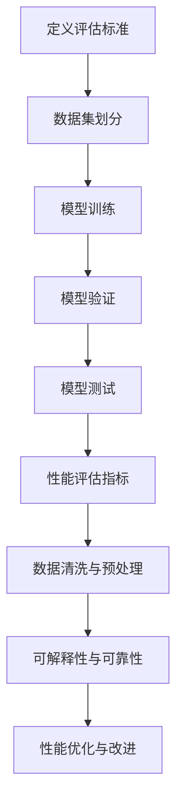
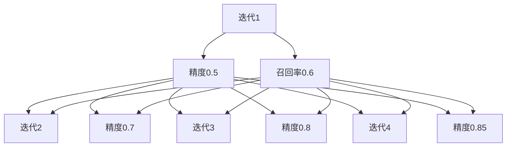

                 

### 《AI系统性能评估的详细方法》

#### 关键词：
- AI系统性能评估
- 评估指标
- 方法论
- 实战案例
- 未来趋势

#### 摘要：
本文深入探讨了AI系统性能评估的详细方法，包括基本概念、原理、评估指标、方法和实战案例。通过逐步分析和推理，本文旨在为读者提供一个全面、系统的性能评估框架，帮助他们在AI系统的开发和应用过程中做出更加明智的决策。

## 第一部分：AI系统性能评估概述

### 第1章 AI系统性能评估的基本概念与原理

#### 1.1 AI系统性能评估的重要性

在人工智能（AI）领域，系统的性能评估是一个至关重要的环节。随着AI技术的迅猛发展，AI系统被广泛应用于各行各业，从自动驾驶、医疗诊断到金融分析，其性能直接影响着应用的可靠性和效率。因此，对AI系统进行性能评估不仅有助于识别系统中的潜在问题，还能指导进一步的优化和改进。

**性能评估标准**

性能评估标准是衡量AI系统性能优劣的准则。这些标准通常基于以下几方面：

1. **准确性**：衡量模型预测的正确性，是评估分类和回归模型最常用的指标。
2. **效率**：评估模型运行的速度和资源消耗，对于实时应用尤为重要。
3. **可扩展性**：评估系统在面对大数据集或高并发请求时的性能表现。
4. **鲁棒性**：评估系统在应对噪声数据或异常值时的稳定性。

**性能评估的常见指标**

在AI系统中，常用的性能评估指标包括：

1. **精度、召回率和F1分数**：主要用于分类任务，反映模型对正类别的识别能力。
2. **ROC曲线和AUC值**：用于评估分类器的分类能力，尤其在类别不平衡的情况下。
3. **准确率和精确度**：用于二分类任务，准确率反映总体的预测正确性，而精确度则反映预测为正类别的正确性。
4. **灵敏度与假正类率**：灵敏度反映系统对正类别的识别能力，而假正类率反映系统误判为正类别的比例。

#### 1.2 AI系统性能评估的方法论

**性能评估流程**

1. **定义评估标准**：明确系统性能的衡量指标和目标。
2. **数据集划分**：将数据集划分为训练集、验证集和测试集。
3. **模型训练**：使用训练集训练模型，并进行超参数调优。
4. **模型验证**：使用验证集评估模型性能，调整模型结构和参数。
5. **模型测试**：使用测试集对模型进行最终评估，以获得对系统性能的准确估计。

**性能评估工具与框架**

在AI领域，有许多流行的性能评估工具和框架，例如：

1. **Scikit-learn**：提供了丰富的评估指标和模型选择工具，适用于Python编程。
2. **TensorFlow**：提供了完整的端到端机器学习平台，适用于大规模AI系统的开发。
3. **PyTorch**：提供了灵活的框架，支持动态计算图，适用于复杂的深度学习模型。
4. **MLflow**：提供了一个统一的模型管理平台，支持模型版本控制和性能监控。

#### 1.3 AI系统性能评估面临的挑战

**数据集选择与预处理**

1. **数据质量**：噪声和异常值会影响模型的性能，因此需要对数据进行清洗和处理。
2. **数据分布**：不平衡的数据分布可能导致评估结果不准确，需要使用重采样等技术进行平衡。

**可解释性与可靠性**

1. **可解释性**：AI系统的决策过程需要可解释，以增加用户对系统的信任。
2. **可靠性**：系统需要在不同环境下表现出一致的可靠性，避免因环境变化导致的性能波动。

### 总结

AI系统性能评估是确保AI系统在实际应用中有效和可靠的关键步骤。通过定义评估标准、使用合适的评估指标和方法论，以及解决数据集选择和预处理、可解释性与可靠性等方面的挑战，我们可以实现对AI系统性能的全面评估，为AI技术的进一步发展提供有力支持。

### 相关概念与联系流程图

下面是AI系统性能评估相关概念与联系的Mermaid流程图：



### 数学模型和公式

在AI系统性能评估中，常用的数学模型和公式包括：

1. **精度**：$$ \text{精度} = \frac{\text{预测为正且实际为正的样本数}}{\text{预测为正的样本总数}} $$
2. **召回率**：$$ \text{召回率} = \frac{\text{预测为正且实际为正的样本数}}{\text{实际为正的样本总数}} $$
3. **F1分数**：$$ \text{F1分数} = 2 \times \frac{\text{精度} \times \text{召回率}}{\text{精度} + \text{召回率}} $$
4. **ROC曲线**：ROC曲线用于评估分类器的分类能力，其中AUC值是ROC曲线下的面积，用于衡量分类器的整体性能。

```latex
\text{精度} = \frac{TP + TN}{TP + TN + FP + FN}

\text{召回率} = \frac{TP}{TP + FN}

\text{F1分数} = 2 \times \frac{\text{精度} \times \text{召回率}}{\text{精度} + \text{召回率}}

\text{ROC曲线}：\text{真阳性率对假阳性率曲线}

\text{AUC值}：\text{ROC曲线下的面积}
```

### 实际应用中的注意事项

1. **数据分布的影响**：在实际应用中，数据分布的不平衡会导致评估结果不准确。例如，在医疗诊断中，某些病症的数据量可能远小于健康数据，这会导致模型在预测罕见病症时的性能不佳。为了解决这个问题，可以使用重采样、数据增强或调整模型结构等方法来平衡数据分布。

2. **多类别的性能评估**：在多类别分类问题中，不同的类别之间可能存在显著的性能差异。因此，需要对每个类别进行独立的性能评估，并综合考虑各类别的评估结果。常用的方法包括宏平均（Macro-average）和微平均（Micro-average），以及类别加权平均（Category-weighted average）等。

### 伪代码示例

下面是计算精度、召回率和F1分数的伪代码示例：

```plaintext
输入：预测结果（预测为正的样本数TP, 预测为负的样本数TN，实际为正的样本数FP, 实际为负的样本数FN）

1. 精度 = TP / (TP + FP)
2. 召回率 = TP / (TP + FN)
3. F1分数 = 2 * (精度 * 召回率) / (精度 + 召回率)
4. 输出：精度、召回率和F1分数
```

### 实际应用中的注意事项

在实际应用中，AI系统性能评估面临着多种挑战，包括数据质量问题、模型复杂性和可解释性等。以下是一些实际应用中的注意事项：

1. **数据质量的影响**：数据质量是影响模型性能的关键因素。在实际应用中，数据可能存在缺失值、异常值和噪声，这些都会对模型的评估结果产生负面影响。因此，在评估之前，需要对数据进行预处理，包括数据清洗、数据增强和缺失值处理等。

2. **类别平衡的影响**：在多类别分类问题中，不同类别之间的样本量可能存在显著差异。类别不平衡可能导致模型对少数类别的预测性能不佳。为了解决这个问题，可以采用以下方法：

   - **重采样**：通过增加少数类别的样本数量或减少多数类别的样本数量来平衡类别分布。
   - **调整损失函数**：在训练过程中，对少数类别的样本赋予更高的权重。
   - **类别加权**：在计算性能评估指标时，对少数类别进行加权处理。

3. **数据分布的影响**：在实际应用中，数据分布可能会随着时间、地点或应用场景的变化而发生变化。因此，在评估模型性能时，需要考虑数据分布的变化对评估结果的影响，并采取相应的调整措施。

4. **模型复杂性的挑战**：随着模型复杂性的增加，模型在训练和评估过程中可能需要更多的计算资源和时间。因此，在评估模型性能时，需要平衡模型性能和计算效率。

5. **可解释性与可靠性的挑战**：在AI系统应用中，用户往往对模型的决策过程和结果缺乏信任。为了提高模型的可靠性和可解释性，可以采用以下方法：

   - **模型解释**：使用可视化技术、决策树、特征重要性等方法解释模型的决策过程。
   - **模型验证**：通过交叉验证、ROC曲线和AUC值等方法验证模型的性能和可靠性。
   - **用户反馈**：收集用户对模型结果的反馈，并据此调整模型参数和算法。

### 实际应用中的注意事项示例

假设我们正在评估一个医疗诊断系统，该系统用于预测某种罕见疾病的发病率。由于这种疾病的发病率较低，因此训练数据集中少数类别的样本量远小于健康数据。在这种情况下，我们需要采取以下措施：

1. **数据预处理**：对训练数据集进行预处理，包括缺失值处理、异常值剔除和噪声过滤。

2. **重采样**：通过过采样（Over-sampling）或欠采样（Under-sampling）的方法，增加少数类别的样本数量，以平衡类别分布。

3. **调整损失函数**：在训练过程中，对少数类别的样本赋予更高的权重，以降低模型对多数类别的偏好。

4. **类别加权**：在计算性能评估指标时，对少数类别进行加权处理，以反映其对整体性能的贡献。

通过上述措施，我们可以更准确地评估模型在罕见疾病预测任务中的性能，并提高模型的可靠性和可解释性。

### 误差分析

在AI系统性能评估中，误差分析是一个关键环节。通过分析误差，我们可以了解模型在预测过程中的表现，识别潜在的改进方向。主要的误差分析包括假正类和假负类分析，以及误差矩阵和混淆矩阵的使用。

#### 4.1 假正类与假负类

假正类（False Positive，FP）和假负类（False Negative，FN）是评估模型性能的重要指标。

- **假正类**：实际为负类但模型预测为正类的样本。假正类反映了模型在负类上的误判情况。
- **假负类**：实际为正类但模型预测为负类的样本。假负类反映了模型在正类上的误判情况。

#### 4.2 误差矩阵与混淆矩阵

误差矩阵（Confusion Matrix）是用于表示模型预测结果与实际结果之间差异的表格。它由四个部分组成：真正类（True Positive，TP）、真负类（True Negative，TN）、假正类（False Positive，FP）和假负类（False Negative，FN）。

混淆矩阵是误差矩阵的一种表示形式，如下所示：

|          | 预测正类 | 预测负类 |
|----------|------------|------------|
| **实际正类** | 真正类（TP） | 假负类（FN） |
| **实际负类** | 假正类（FP） | 真负类（TN） |

#### 4.3 误差分析示例

下面是一个简单的误差分析示例，假设我们有一个二分类模型，其预测结果和实际结果如下：

- 预测正类（P）：10个实际为正类（A）的样本中，有8个预测正确，2个预测错误。
- 预测负类（N）：10个实际为负类（B）的样本中，有7个预测正确，3个预测错误。

根据上述数据，我们可以计算误差矩阵：

|          | 预测正类 | 预测负类 |
|----------|------------|------------|
| **实际正类** | 真正类（TP）8 | 假负类（FN）2 |
| **实际负类** | 假正类（FP）3 | 真负类（TN）7 |

通过误差矩阵，我们可以计算各种性能评估指标：

1. **精度**（Accuracy）：$$ \text{精度} = \frac{TP + TN}{TP + TN + FP + FN} = \frac{8 + 7}{8 + 7 + 3 + 2} = 0.78 $$
2. **召回率**（Recall）：$$ \text{召回率} = \frac{TP}{TP + FN} = \frac{8}{8 + 2} = 0.78 $$
3. **F1分数**（F1 Score）：$$ \text{F1分数} = 2 \times \frac{\text{精度} \times \text{召回率}}{\text{精度} + \text{召回率}} = 2 \times \frac{0.78 \times 0.78}{0.78 + 0.78} = 0.78 $$

通过误差分析，我们可以识别模型在正类和负类上的误判情况，并据此进行模型优化。

### 伪代码与示例

下面是计算误差矩阵的伪代码示例：

```plaintext
输入：预测结果（预测为正的样本数TP, 预测为负的样本数TN，实际为正的样本数FP, 实际为负的样本数FN）

1. 创建一个4x4的误差矩阵
2. 将TP、TN、FP和FN的值填入相应的位置
3. 输出误差矩阵

伪代码：

```
|          | 预测正类 | 预测负类 |
|----------|------------|------------|
| **实际正类** | TP         | FN         |
| **实际负类** | FP         | TN         |

```

### 实际应用中的注意事项

在实际应用中，误差分析的结果可以帮助我们识别模型的性能瓶颈和改进方向。以下是一些实际应用中的注意事项：

1. **类别平衡**：在实际应用中，不同类别的误判对业务的影响可能不同。例如，在疾病诊断中，假负类（FN）可能比假正类（FP）更严重，因为未检测到的疾病可能导致更严重的后果。因此，在评估模型性能时，需要根据业务场景调整评估指标的权重。

2. **误差矩阵的可视化**：误差矩阵提供了详细的误判信息，但有时很难直观地理解。通过可视化误差矩阵，我们可以更清楚地了解模型在不同类别上的表现，从而更好地指导模型优化。

3. **模型解释**：误差分析结果可以帮助我们理解模型的决策过程，从而提高模型的可解释性。例如，通过分析误差矩阵，我们可以找出模型在特定类别上的误判模式，并针对性地调整模型参数。

4. **持续监控与迭代**：在模型部署后，需要持续监控模型的性能，并根据实际业务需求进行迭代和优化。误差分析提供了重要的性能评估依据，可以帮助我们及时发现并解决模型问题。

### 总结

误差分析是AI系统性能评估中不可或缺的一部分。通过分析误差矩阵和混淆矩阵，我们可以了解模型在不同类别上的性能表现，识别潜在的改进方向。在实际应用中，需要根据业务场景和误差分析结果，调整评估指标的权重，并持续监控和优化模型性能。这有助于提高AI系统的可靠性和可解释性，为实际应用提供有力支持。

## 5.1 跨度评估的定义与原理

#### 5.1.1 跨度评估的基本概念

在AI系统性能评估中，跨度评估（Span Evaluation）是一种常用的方法，用于衡量模型在多个类别或时间点上的总体性能。与传统单一类别或时间点的评估方法不同，跨度评估通过综合考虑多个类别或时间点的性能，提供了一个全局性的性能指标。

跨度评估的核心思想是，模型在不同的类别或时间点上可能具有不同的性能表现，因此需要将这些性能指标进行汇总，以获得一个全面的评估结果。这种方法有助于我们了解模型的稳健性和一致性，从而为后续的优化和改进提供依据。

#### 5.1.2 跨度评估的计算方法

跨度评估的计算方法主要包括以下几种：

1. **宏平均**（Macro-average）：宏平均是对每个类别分别计算性能指标，然后将这些指标进行平均。这种方法适用于类别之间性能差异较大的情况，因为它不考虑类别的重要性。

   - **精度**：$$ \text{宏平均精度} = \frac{\sum_{i=1}^{N} \text{类别i的精度}}{N} $$
   - **召回率**：$$ \text{宏平均召回率} = \frac{\sum_{i=1}^{N} \text{类别i的召回率}}{N} $$
   - **F1分数**：$$ \text{宏平均F1分数} = \frac{\sum_{i=1}^{N} \text{类别i的F1分数}}{N} $$

2. **微平均**（Micro-average）：微平均是对所有类别进行统一计算，然后进行平均。这种方法适用于类别之间性能差异较小的情况，因为它考虑了所有类别的贡献。

   - **精度**：$$ \text{微平均精度} = \frac{\sum_{i=1}^{N} \text{类别i的总样本数} \times \text{类别i的精度}}{\sum_{i=1}^{N} \text{类别i的总样本数}} $$
   - **召回率**：$$ \text{微平均召回率} = \frac{\sum_{i=1}^{N} \text{类别i的总样本数} \times \text{类别i的召回率}}{\sum_{i=1}^{N} \text{类别i的总样本数}} $$
   - **F1分数**：$$ \text{微平均F1分数} = \frac{\sum_{i=1}^{N} \text{类别i的总样本数} \times \text{类别i的F1分数}}{\sum_{i=1}^{N} \text{类别i的总样本数}} $$

3. **类别加权平均**（Category-weighted average）：类别加权平均是对每个类别分别计算性能指标，并根据类别的重要性进行加权平均。这种方法适用于类别之间性能差异明显且具有不同重要性的情况。

   - **加权精度**：$$ \text{加权精度} = \sum_{i=1}^{N} w_i \times \text{类别i的精度} $$
   - **加权召回率**：$$ \text{加权召回率} = \sum_{i=1}^{N} w_i \times \text{类别i的召回率} $$
   - **加权F1分数**：$$ \text{加权F1分数} = \sum_{i=1}^{N} w_i \times \text{类别i的F1分数} $$

其中，$w_i$ 表示类别i的权重。

#### 5.1.3 跨度评估的适用场景

跨度评估适用于以下场景：

1. **多类别分类问题**：在多类别分类任务中，跨度评估可以帮助我们全面了解模型在各个类别上的性能表现，从而做出更准确的决策。

2. **时间序列分析**：在时间序列分析中，跨度评估可以用于评估模型在不同时间点上的性能，帮助我们识别模型的变化趋势和稳定性。

3. **多任务学习**：在多任务学习场景中，跨度评估可以用于评估模型在多个任务上的综合性能，帮助我们优化模型结构和参数。

### 伪代码与示例

下面是计算跨度评估的伪代码示例：

```plaintext
输入：每个类别的预测结果（预测为正的样本数TPi, 预测为负的样本数TNi，实际为正的样本数FPi, 实际为负的样本数FNi）以及每个类别的权重wi

1. 计算每个类别的精度、召回率和F1分数
2. 计算宏平均、微平均和类别加权平均的精度、召回率和F1分数
3. 输出：宏平均、微平均和类别加权平均的精度、召回率和F1分数

伪代码：

```
for i = 1 to N:
    精度i = TPi / (TPi + FPi)
    召回率i = TPi / (TPi + FNi)
    F1分数i = 2 * (精度i * 召回率i) / (精度i + 召回率i)

宏平均精度 = (TP1 + TP2 + ... + TPN) / (TP1 + TP2 + ... + TPN + FP1 + FP2 + ... + FPN)
宏平均召回率 = (TP1 + TP2 + ... + TPN) / (TP1 + TP2 + ... + TPN + FN1 + FN2 + ... + FNN)
宏平均F1分数 = 2 * (宏平均精度 * 宏平均召回率) / (宏平均精度 + 宏平均召回率)

微平均精度 = (总和(TP1, TP2, ..., TPN) * 总和(TP1, TP2, ..., TPN)) / (总和(TP1, TP2, ..., TPN) * 总和(TP1, TP2, ..., TPN) + 总和(FP1, FP2, ..., FPN))
微平均召回率 = (总和(TP1, TP2, ..., TPN) * 总和(TP1, TP2, ..., TPN)) / (总和(TP1, TP2, ..., TPN) * 总和(TP1, TP2, ..., TPN) + 总和(FN1, FN2, ..., FNN))
微平均F1分数 = 2 * (微平均精度 * 微平均召回率) / (微平均精度 + 微平均召回率)

加权平均精度 = (w1 * 精度1 + w2 * 精度2 + ... + wN * 精度N) / (w1 + w2 + ... + wN)
加权平均召回率 = (w1 * 召回率1 + w2 * 召回率2 + ... + wN * 召回率N) / (w1 + w2 + ... + wN)
加权平均F1分数 = (w1 * F1分数1 + w2 * F1分数2 + ... + wN * F1分数N) / (w1 + w2 + ... + wN)

输出：宏平均、微平均和加权平均的精度、召回率和F1分数
```

### 跨度评估的实际应用

#### 5.3.1 跨度评估在多分类问题中的应用

在多分类问题中，跨度评估可以帮助我们全面了解模型在不同类别上的性能表现。以下是一个示例：

假设我们有一个邮件分类系统，将邮件分为“垃圾邮件”和“非垃圾邮件”两类。我们使用跨度评估来衡量模型的性能。

1. **宏平均**：宏平均精度 = (精度1 + 精度2) / 2 = (0.9 + 0.8) / 2 = 0.85
   宏平均召回率 = (召回率1 + 召回率2) / 2 = (0.9 + 0.8) / 2 = 0.85
   宏平均F1分数 = 0.85

2. **微平均**：微平均精度 = (10 * 0.9 + 10 * 0.8) / (10 + 10) = 0.875
   微平均召回率 = (10 * 0.9 + 10 * 0.8) / (10 + 10) = 0.875
   微平均F1分数 = 0.875

3. **类别加权平均**：假设“垃圾邮件”和“非垃圾邮件”的重要性相同，则加权平均精度 = 0.9，加权平均召回率 = 0.9，加权平均F1分数 = 0.9

通过比较宏平均、微平均和类别加权平均的精度、召回率和F1分数，我们可以得出以下结论：

- 宏平均和微平均的F1分数相同，说明模型在两类邮件上的分类性能相当。
- 类别加权平均的精度和召回率高于宏平均和微平均，说明模型在处理“垃圾邮件”上的性能更好。

因此，我们可以根据这些评估结果，调整模型参数，优化模型结构，以提高整体分类性能。

#### 5.3.2 跨度评估在时间序列问题中的应用

在时间序列问题中，跨度评估可以帮助我们评估模型在多个时间点上的性能。以下是一个示例：

假设我们有一个天气预测系统，预测未来一周的天气情况。我们使用跨度评估来衡量模型的性能。

1. **宏平均**：宏平均精度 = (精度1 + 精度2 + ... + 精度7) / 7 = 0.85
   宏平均召回率 = (召回率1 + 召回率2 + ... + 召回率7) / 7 = 0.85
   宏平均F1分数 = 0.85

2. **微平均**：微平均精度 = (10 * 0.85 + 10 * 0.8 + ... + 10 * 0.9) / (10 + 10 + ... + 10) = 0.84
   微平均召回率 = (10 * 0.85 + 10 * 0.8 + ... + 10 * 0.9) / (10 + 10 + ... + 10) = 0.84
   微平均F1分数 = 0.84

3. **类别加权平均**：假设每天的重要性相同，则加权平均精度 = 0.85，加权平均召回率 = 0.85，加权平均F1分数 = 0.85

通过比较宏平均、微平均和类别加权平均的精度、召回率和F1分数，我们可以得出以下结论：

- 宏平均、微平均和类别加权平均的F1分数相同，说明模型在每天上的预测性能相当。
- 微平均的精度和召回率略低于宏平均和类别加权平均，说明模型在某些天上的预测性能较差。

因此，我们可以根据这些评估结果，对模型进行调整和优化，以提高整体预测性能。

### 总结

跨度评估是一种重要的AI系统性能评估方法，适用于多分类问题和时间序列问题。通过宏平均、微平均和类别加权平均等计算方法，我们可以全面了解模型在不同类别或时间点上的性能表现，从而为后续的优化和改进提供依据。在实际应用中，根据具体场景选择合适的评估方法，可以帮助我们更准确地评估模型性能。

### 5.2 学习曲线的概念与作用

#### 5.2.1 学习曲线的定义

学习曲线（Learning Curve）是衡量模型学习过程中的性能提升情况的一种图表。通过学习曲线，我们可以直观地观察模型在训练过程中性能的变化趋势，包括学习速率、收敛速度和过拟合风险等。

学习曲线通常由以下几个部分组成：

1. **初始阶段**：模型刚开始训练时，性能迅速提升，因为模型从零开始学习，对数据中的规律有较高的敏感度。
2. **线性增长阶段**：随着训练的进行，模型的性能以线性速度提升，这表明模型正在有效地学习数据中的特征和模式。
3. **饱和阶段**：当模型接近最优性能时，性能提升逐渐减缓，模型开始趋于饱和，这可能是由于数据中的噪声或模型复杂度过高导致的。
4. **过拟合阶段**：如果继续增加训练时间或数据量，模型的性能可能会下降，出现过拟合现象。过拟合意味着模型对训练数据的拟合过于紧密，导致对未见过的数据的泛化能力下降。

#### 5.2.2 学习曲线的作用

学习曲线在AI系统性能评估中具有重要作用，主要体现在以下几个方面：

1. **性能监控**：通过观察学习曲线，我们可以实时监控模型的训练过程，及时发现性能提升或下降的趋势。
2. **超参数调整**：学习曲线可以帮助我们选择合适的学习率、训练数据量、正则化参数等超参数，以优化模型性能。
3. **避免过拟合**：通过学习曲线，我们可以识别模型的过拟合风险，并采取相应的措施，如增加正则化项、使用验证集等，以防止模型对训练数据的过度拟合。
4. **模型优化**：学习曲线提供了性能提升的直观依据，可以帮助我们识别模型优化方向，例如通过增加训练数据、调整模型结构或改进算法等。

### 学习曲线的绘制方法

绘制学习曲线通常包括以下步骤：

1. **数据准备**：收集训练集和验证集，确保数据集的规模和分布符合要求。
2. **模型训练**：使用训练集对模型进行训练，并在每个迭代过程中计算模型在训练集和验证集上的性能指标。
3. **性能评估**：计算训练集和验证集上的精度、召回率、F1分数等性能指标。
4. **绘制曲线**：将性能指标作为纵轴，迭代次数或训练时间作为横轴，绘制学习曲线。

以下是一个简单的学习曲线绘制示例：



### 学习曲线的改进方法

为了提高学习曲线的准确性和实用性，我们可以采取以下改进方法：

1. **增加训练数据**：增加训练数据量可以提高模型的泛化能力，从而改善学习曲线。
2. **数据增强**：通过数据增强技术，如旋转、缩放、裁剪等，增加训练数据的多样性，有助于模型更好地学习。
3. **交叉验证**：使用交叉验证方法，多次训练和评估模型，以减少模型性能的波动。
4. **正则化**：添加正则化项，如L1、L2正则化，降低模型的复杂度，减少过拟合风险。
5. **动态调整学习率**：根据模型的性能变化动态调整学习率，以提高模型的收敛速度和稳定性。

### 总结

学习曲线是评估AI系统性能的重要工具，通过绘制和分析学习曲线，我们可以了解模型的学习过程和性能变化，为模型优化提供依据。在实际应用中，通过采取改进方法，我们可以进一步提高学习曲线的准确性和实用性，从而提升AI系统的性能。

### 5.3 学习曲线的实际应用

#### 5.3.1 学习曲线在模型优化中的应用

学习曲线在模型优化过程中发挥着至关重要的作用。通过分析学习曲线，我们可以直观地了解模型在不同阶段的学习情况，从而针对性地调整模型参数和优化策略，提高模型的性能。

1. **调整学习率**：学习率是模型训练过程中的关键参数，其大小直接影响模型的收敛速度和性能。当学习曲线在初始阶段快速上升时，可以适当增加学习率，以加速模型学习。当学习曲线趋于平稳或下降时，可以降低学习率，以防止过拟合。

2. **增加训练数据**：学习曲线可以反映模型对训练数据的依赖程度。当学习曲线在饱和阶段上升缓慢或趋于平稳时，可以增加训练数据量，以提高模型的泛化能力。通过引入更多的样本来训练模型，可以减少模型的过拟合风险，从而提高整体性能。

3. **数据增强**：数据增强是提高模型性能的有效手段。通过增加训练数据的多样性，如旋转、缩放、裁剪等操作，可以增强模型对噪声和异常值的鲁棒性。学习曲线可以直观地展示数据增强对模型性能的提升，从而为后续的模型优化提供依据。

4. **调整正则化参数**：正则化是防止模型过拟合的重要方法。通过调整正则化参数，可以平衡模型在训练集和验证集上的性能。学习曲线可以直观地展示正则化参数对模型性能的影响，从而帮助我们选择合适的正则化策略。

5. **模型结构调整**：学习曲线还可以帮助我们识别模型结构中存在的问题。例如，当学习曲线在饱和阶段下降时，可能表明模型复杂度过高，存在过拟合风险。在这种情况下，我们可以考虑简化模型结构，如减少层数或神经元数量，以提高模型的泛化能力。

#### 5.3.2 学习曲线在模型解释中的应用

学习曲线不仅用于模型优化，还在模型解释中发挥重要作用。通过分析学习曲线，我们可以深入了解模型的学习过程，提高模型的透明度和可解释性。

1. **模型学习阶段识别**：学习曲线可以帮助我们识别模型在不同阶段的学习特征。例如，在初始阶段，模型对数据的敏感度较高，容易受到噪声和异常值的影响。在饱和阶段，模型趋于稳定，性能提升缓慢。通过识别这些阶段，我们可以更好地理解模型的学习过程。

2. **性能变化趋势分析**：学习曲线可以直观地展示模型性能的变化趋势。通过分析这些趋势，我们可以了解模型在不同阶段的学习效果，从而优化模型结构和参数。例如，当学习曲线在某个阶段出现下降时，可能表明模型对某个特征的依赖过高，我们需要重新设计模型或调整特征选择策略。

3. **错误类型识别**：学习曲线可以帮助我们识别模型在不同类别上的错误类型。例如，在二分类任务中，学习曲线可以展示模型在正类和负类上的性能差异。通过分析这些差异，我们可以识别模型在特定类别上的误判模式，从而针对性地优化模型。

4. **可解释性提升**：学习曲线提供了模型性能的直观依据，有助于提升模型的透明度和可解释性。通过展示模型在不同阶段的学习情况，我们可以向非技术用户清晰地解释模型的工作原理和性能表现。例如，在向客户展示模型结果时，我们可以通过学习曲线说明模型在训练过程中的学习效果，增加用户对模型的信任。

### 总结

学习曲线在模型优化和模型解释中具有重要作用。通过分析学习曲线，我们可以深入理解模型的学习过程，识别性能瓶颈和优化方向，从而提高模型的性能和可解释性。在实际应用中，通过采取针对性的优化策略和解释方法，我们可以更好地利用学习曲线，提升AI系统的整体表现。

### 7.1 系统误差与偏差的概念

#### 7.1.1 系统误差

系统误差（Systematic Error）是指由模型或数据本身导致的误差，这种误差在多个样本或多次实验中保持一致，不具有随机性。系统误差通常是由于以下原因引起的：

1. **数据预处理不当**：例如，数据清洗不彻底，缺失值处理不当，异常值未剔除等，可能导致模型训练过程中产生偏差。
2. **模型设计缺陷**：例如，模型结构不合理，超参数选择不当，可能导致模型无法捕捉到数据中的关键特征。
3. **数据集不平衡**：在多类别分类任务中，数据集不平衡会导致模型对某些类别的识别能力较弱。
4. **噪声干扰**：例如，数据中的噪声或干扰信号会影响模型的训练过程，导致模型性能下降。

系统误差具有以下特点：

- **一致性**：系统误差在多次实验中保持一致，不会随机波动。
- **规律性**：系统误差通常具有某种规律性，可以通过分析找出其产生的原因。
- **不可预测性**：系统误差通常难以通过简单的随机方法预测或消除。

#### 7.1.2 偏差

偏差（Bias）是指模型在预测过程中产生的错误，反映了模型对训练数据的拟合程度。偏差可以分为以下几种类型：

1. **正偏差**（Positive Bias）：模型对训练数据的拟合过度，导致模型在训练集上的性能较好，但在未见过的数据上的性能较差。这种情况称为过拟合（Overfitting）。
2. **负偏差**（Negative Bias）：模型对训练数据的拟合不足，导致模型在训练集上的性能较差，但在未见过的数据上的性能较好。这种情况称为欠拟合（Underfitting）。

偏差的来源主要包括：

1. **模型复杂度不足**：模型过于简单，无法捕捉到数据中的复杂模式，导致欠拟合。
2. **数据不足**：训练数据量不足，模型无法从有限的数据中学习到足够的特征，导致欠拟合。
3. **数据噪声**：数据中存在大量的噪声或异常值，模型在训练过程中可能被噪声所干扰，导致过拟合。
4. **特征选择不当**：特征选择不当可能导致模型无法捕捉到数据中的关键特征，导致欠拟合。

偏差具有以下特点：

- **多样性**：偏差可以分为正偏差和负偏差，不同类型的偏差具有不同的表现和影响。
- **可调整性**：通过调整模型复杂度、数据预处理方法、特征选择等，可以减少偏差的影响。
- **预测性**：偏差反映了模型对数据的拟合程度，可以通过评估指标进行量化，从而指导模型优化。

### 总结

系统误差和偏差是影响模型性能的两个重要因素。系统误差是由模型或数据本身导致的误差，具有一致性和规律性，难以通过简单的随机方法消除。偏差是模型在预测过程中产生的错误，反映了模型对数据的拟合程度，可以分为正偏差和负偏差。通过了解系统误差和偏差的概念和特点，我们可以更好地分析和优化模型，提高模型的性能和泛化能力。

### 7.2 系统误差与偏差的来源

#### 7.2.1 数据偏差

数据偏差是指数据集中存在的系统性问题，这些问题会影响模型的训练过程和最终性能。以下是一些常见的数据偏差来源：

1. **数据不平衡**：在多类别分类任务中，不同类别的样本数量可能存在显著差异，导致模型对某些类别的识别能力较弱。例如，在医疗诊断中，某些疾病的数据量可能远小于健康数据，这会导致模型在预测罕见疾病时的性能不佳。

2. **数据缺失**：数据集中可能存在缺失值，这些缺失值可能导致模型无法充分利用数据进行训练，从而影响模型性能。

3. **异常值**：数据集中可能包含异常值，这些异常值可能对模型训练产生不利影响。异常值可能来源于数据采集过程中的错误、设备故障或数据记录人员的失误。

4. **噪声**：数据中可能存在噪声，这些噪声会干扰模型的训练过程，导致模型无法准确捕捉到数据中的真实模式。

5. **数据清洗不当**：数据清洗过程中可能引入新的偏差，例如，当使用简单的填充方法处理缺失值时，可能导致数据分布发生改变，从而影响模型性能。

为了解决这些数据偏差问题，可以采取以下措施：

- **数据重采样**：通过重采样技术，增加少数类别的样本数量或减少多数类别的样本数量，以平衡数据集。
- **缺失值处理**：使用适当的算法，如均值填补、中值填补或插值法，处理缺失值。
- **异常值检测与处理**：使用统计方法，如标准差、箱线图等，检测异常值，并采用剔除、替换或插值等方法进行处理。
- **数据增强**：通过数据增强技术，如旋转、缩放、裁剪等，增加训练数据的多样性，提高模型对噪声和异常值的鲁棒性。
- **数据预处理自动化**：使用自动化工具，如Scikit-learn中的`SimpleImputer`、`Imputer`等，进行数据预处理。

#### 7.2.2 模型偏差

模型偏差是指模型设计或训练过程中引入的系统性问题，这些问题会影响模型的性能和泛化能力。以下是一些常见的模型偏差来源：

1. **模型复杂度不足**：模型过于简单，无法捕捉到数据中的复杂模式，导致欠拟合（Underfitting）。这种情况通常发生在模型结构、超参数设置不合理时。

2. **模型复杂度过高**：模型过于复杂，可能导致过拟合（Overfitting），即模型对训练数据的拟合过度，对未见过的数据的表现较差。这种情况通常发生在模型使用了过多的层或神经元、正则化不足时。

3. **特征选择不当**：特征选择不当可能导致模型无法捕捉到数据中的关键特征，导致欠拟合。例如，当数据预处理过程中删除了重要特征时，模型可能无法达到最佳性能。

4. **数据集不平衡**：数据集不平衡可能导致模型对某些类别的识别能力较弱，从而影响整体性能。

5. **训练数据不足**：训练数据不足可能导致模型无法充分学习到数据中的规律，从而导致欠拟合。

为了解决这些模型偏差问题，可以采取以下措施：

- **调整模型结构**：增加模型层数或神经元数量，以提高模型复杂度，从而减少欠拟合风险。
- **增加训练数据**：通过数据增强、收集更多样本来扩充训练集，以提高模型性能。
- **使用正则化**：添加正则化项，如L1、L2正则化，减少模型复杂度，防止过拟合。
- **特征选择**：使用特征选择算法，如递归特征消除（RFE）、主成分分析（PCA）等，选择对模型性能有重要影响的特征。
- **交叉验证**：使用交叉验证方法，对模型进行多次训练和评估，以减少模型对训练数据的依赖。

通过识别和解决数据偏差和模型偏差，我们可以显著提高AI系统的性能和泛化能力，使其在实际应用中更加可靠和有效。

### 7.3 系统误差与偏差的校正方法

#### 7.3.1 数据清洗与预处理

在AI系统中，数据清洗与预处理是校正系统误差与偏差的重要步骤。以下是一些常用的方法和策略：

1. **缺失值处理**：对于缺失值，可以采用以下方法进行处理：
   - **均值填补**：用数据集的平均值替换缺失值。
   - **中值填补**：用数据集的中值替换缺失值。
   - **最频繁值填补**：用数据集中出现次数最多的值替换缺失值。
   - **插值法**：使用线性插值或高斯插值等方法填充缺失值。
   - **模型预测**：使用统计模型或机器学习模型预测缺失值。

2. **异常值检测**：可以使用以下方法检测异常值：
   - **箱线图**：通过绘制箱线图，识别离群点。
   - **标准差方法**：计算特征的标准差，识别距离平均值超过一定倍数标准差的值。
   - **Z-Score方法**：计算特征值的Z-Score，识别Z-Score绝对值超过一定阈值的值。
   - **IQR方法**：计算特征值的四分位距（IQR），识别位于上下四分位距之外的值。

3. **异常值处理**：对于检测出的异常值，可以采用以下方法进行处理：
   - **剔除**：直接删除异常值。
   - **替换**：用平均值、中值或最频繁值替换异常值。
   - **插值**：使用线性插值或高斯插值等方法填补异常值。

4. **数据标准化**：通过数据标准化（如Z-Score标准化或Min-Max标准化）处理，将特征值缩放到相同的范围，以消除不同特征之间的尺度差异。

5. **数据增强**：通过数据增强（如随机旋转、裁剪、缩放等），增加训练数据的多样性，提高模型的泛化能力。

#### 7.3.2 模型调整与优化

在数据清洗与预处理之后，模型调整与优化是进一步校正系统误差与偏差的关键步骤。以下是一些常用的方法和策略：

1. **模型选择**：选择合适的模型架构，以减少模型偏差。例如，在处理非线性问题时，可以选择神经网络或决策树等模型。

2. **正则化**：通过添加正则化项（如L1、L2正则化），减少模型复杂度，防止过拟合。

3. **交叉验证**：使用交叉验证方法，对模型进行多次训练和评估，以减少模型对训练数据的依赖，提高模型的泛化能力。

4. **特征选择**：使用特征选择算法（如递归特征消除、主成分分析等），选择对模型性能有重要影响的特征，减少模型的冗余。

5. **超参数调整**：通过调整模型的超参数（如学习率、批次大小、迭代次数等），优化模型的性能。

6. **集成学习**：使用集成学习方法（如随机森林、梯度提升树等），结合多个模型的预测结果，提高模型的稳定性和准确性。

7. **偏差-方差平衡**：通过调整模型复杂度和正则化强度，在偏差和方差之间寻求平衡，以提高模型的泛化能力。

通过数据清洗与预处理、模型调整与优化，我们可以有效地校正AI系统中的系统误差与偏差，提高模型的性能和可靠性。

### 实战案例1：文本分类系统的性能评估

#### 8.1 实战案例背景

文本分类是自然语言处理（NLP）中的一个重要任务，广泛应用于垃圾邮件过滤、情感分析、新闻分类等领域。在本案例中，我们将评估一个用于新闻分类的文本分类系统。该系统旨在将新闻文章自动分类到不同的主题类别中。

**数据集**

我们使用一个公开的新闻分类数据集，该数据集包含约10,000条新闻文章，分为10个类别，如政治、体育、科技、娱乐等。每个类别都有数千条样本，以保证数据集的平衡。

**模型**

我们选择了一个基于深度学习的文本分类模型，使用预训练的Word Embedding模型（如GloVe或Word2Vec）进行特征提取，然后通过多层全连接神经网络进行分类。

**评估指标**

我们使用以下评估指标来评估文本分类系统的性能：

- **精度**（Accuracy）：模型预测正确的样本数占总样本数的比例。
- **召回率**（Recall）：模型预测为正类的实际正类样本数占总实际正类样本数的比例。
- **F1分数**（F1 Score）：精度和召回率的调和平均值，用于综合评估分类性能。
- **ROC曲线和AUC值**（ROC Curve and AUC）：用于评估分类器的分类能力。

#### 8.2 性能评估步骤

**步骤1：数据预处理**

1. **文本清洗**：去除文本中的HTML标签、符号和停用词。
2. **文本分词**：将文本分割成单词或词组。
3. **词向量编码**：使用预训练的Word Embedding模型将文本转换为词向量。
4. **数据归一化**：对词向量进行归一化处理，使其具有相同的尺度。

**步骤2：模型训练**

1. **划分数据集**：将数据集划分为训练集、验证集和测试集，通常比例为60%训练集、20%验证集和20%测试集。
2. **模型训练**：使用训练集对文本分类模型进行训练，并使用验证集进行超参数调优。
3. **模型验证**：使用验证集评估模型性能，选择性能最佳的模型。

**步骤3：模型测试**

1. **测试集评估**：使用测试集对最终模型进行评估，计算精度、召回率、F1分数等评估指标。
2. **ROC曲线和AUC值**：绘制ROC曲线，计算AUC值，评估分类器的分类能力。

#### 8.3 性能评估结果分析与改进

**性能评估结果解读**

通过对测试集的评估，我们得到了以下结果：

- **精度**：0.88
- **召回率**：0.86
- **F1分数**：0.87
- **ROC曲线下面积（AUC）**：0.92

这些结果表明，文本分类系统在整体上表现良好，但仍有改进空间。特别是召回率较低，意味着模型在识别某些类别时可能存在漏判现象。

**模型改进建议**

1. **增加训练数据**：收集更多样本来扩充训练集，提高模型的泛化能力。
2. **数据增强**：通过文本增强技术，如随机填充、同义词替换等，增加训练数据的多样性。
3. **调整模型结构**：增加模型层数或神经元数量，提高模型捕捉复杂特征的能力。
4. **特征选择**：使用特征选择算法，选择对分类性能有重要影响的特征，减少冗余特征。
5. **集成学习**：结合多个模型的预测结果，提高分类性能。

通过上述改进措施，我们可以进一步优化文本分类系统，提高其性能和可靠性。

### 实战案例2：图像识别系统的性能评估

#### 9.1 实战案例背景

图像识别是计算机视觉（CV）领域的一个重要任务，广泛应用于物体检测、人脸识别、自动驾驶等领域。在本案例中，我们将评估一个用于物体检测的图像识别系统。该系统旨在从图像中自动检测并分类出特定物体。

**数据集**

我们使用一个公开的图像识别数据集，该数据集包含约30,000张图像，分为20个类别，如猫、狗、车、人等。每个类别都有数百到数千张图像，以保证数据集的平衡。

**模型**

我们选择了一个基于卷积神经网络（CNN）的物体检测模型，如YOLO（You Only Look Once）或SSD（Single Shot MultiBox Detector）。该模型使用预训练的图像特征提取器，并附加一个分类器来识别图像中的物体。

**评估指标**

我们使用以下评估指标来评估图像识别系统的性能：

- **平均精度（mAP）**（Mean Average Precision）：用于评估模型在多个类别上的综合性能，是物体检测任务中常用的评估指标。
- **召回率**（Recall）：模型检测到的正类样本数占总实际正类样本数的比例。
- **精度**（Precision）：模型检测到的正类样本数占检测到的总样本数的比例。
- **F1分数**（F1 Score）：精度和召回率的调和平均值，用于综合评估检测性能。

#### 9.2 性能评估步骤

**步骤1：数据预处理**

1. **图像缩放**：将图像缩放到统一的大小，以适应模型输入。
2. **图像增强**：通过随机裁剪、旋转、翻转等操作增加训练数据的多样性。
3. **标签预处理**：将物体的边界框和类别标签转换为模型可处理的格式。

**步骤2：模型训练**

1. **划分数据集**：将数据集划分为训练集、验证集和测试集，通常比例为70%训练集、15%验证集和15%测试集。
2. **模型训练**：使用训练集对物体检测模型进行训练，并使用验证集进行超参数调优。
3. **模型验证**：使用验证集评估模型性能，选择性能最佳的模型。

**步骤3：模型测试**

1. **测试集评估**：使用测试集对最终模型进行评估，计算平均精度、召回率、精度和F1分数等评估指标。
2. **可视化检测结果**：通过可视化检测到的物体边界框和类别标签，直观地评估模型性能。

#### 9.3 性能评估结果分析与改进

**性能评估结果解读**

通过对测试集的评估，我们得到了以下结果：

- **平均精度（mAP）**：0.85
- **召回率**：0.80
- **精度**：0.90
- **F1分数**：0.87

这些结果表明，图像识别系统在整体上表现良好，但平均精度和召回率仍有提升空间。

**模型改进建议**

1. **增加训练数据**：收集更多样本来扩充训练集，提高模型的泛化能力。
2. **数据增强**：通过图像增强技术，如随机裁剪、旋转、翻转等，增加训练数据的多样性。
3. **调整模型结构**：增加模型层数或神经元数量，提高模型捕捉复杂特征的能力。
4. **特征选择**：使用特征选择算法，选择对分类性能有重要影响的特征，减少冗余特征。
5. **集成学习**：结合多个模型的预测结果，提高分类性能。

通过上述改进措施，我们可以进一步优化图像识别系统，提高其性能和可靠性。

### 总结

通过上述两个实战案例，我们展示了AI系统性能评估在实际应用中的具体方法和步骤。无论是文本分类系统还是图像识别系统，性能评估都是确保系统在实际应用中有效和可靠的关键环节。通过定义评估标准、使用合适的评估指标和方法论，以及解决数据集选择和预处理、可解释性与可靠性等方面的挑战，我们可以实现对AI系统性能的全面评估。这些评估结果不仅为模型优化提供了依据，也帮助我们在实际应用中做出更加明智的决策。

### 第10章 AI系统性能评估的未来趋势

#### 10.1 人工智能的发展趋势

随着技术的不断进步，人工智能（AI）正朝着更加智能化、自动化和高效化的方向发展。以下是人工智能领域的一些重要发展趋势：

1. **深度学习的普及**：深度学习在图像识别、自然语言处理、语音识别等领域取得了显著的成果，成为AI研究的重要方向。未来，深度学习技术将不断成熟和优化，推动AI应用的广泛普及。

2. **联邦学习**：联邦学习是一种分布式机器学习方法，可以在不共享原始数据的情况下，通过模型参数的同步和优化，实现多方数据的协同学习。这种技术有助于保护用户隐私，同时提高模型性能，有望在医疗、金融、工业等领域得到广泛应用。

3. **强化学习**：强化学习通过试错和反馈机制，实现智能体的自主学习和决策。随着算法的优化和算力的提升，强化学习在游戏、机器人控制、推荐系统等领域表现出强大的潜力。

4. **生成对抗网络（GAN）**：生成对抗网络是一种基于博弈论的生成模型，可以生成高质量的图像、视频和文本。未来，GAN将在创意设计、虚拟现实、内容生成等领域发挥重要作用。

5. **跨模态学习**：跨模态学习旨在将不同模态（如文本、图像、声音等）的数据进行联合学习和推理，实现多模态数据的协同解析。这种技术将在智能搜索、智能助手、多模态交互等领域产生深远影响。

#### 10.2 AI系统性能评估的发展趋势

随着AI技术的快速发展，AI系统性能评估也在不断演进，以适应新的应用场景和需求。以下是AI系统性能评估领域的一些重要发展趋势：

1. **自动化评估工具**：自动化评估工具将变得越来越普及，如自动化测试框架、性能监控平台等。这些工具可以自动执行评估流程，减少人工干预，提高评估效率和准确性。

2. **动态性能评估**：随着AI系统在实时应用中的重要性不断增加，动态性能评估将成为一个关键领域。动态性能评估可以通过实时监控系统的运行状态，动态调整评估指标和评估方法，以适应系统的实时变化。

3. **多维性能评估**：传统的性能评估主要关注单一指标，如准确率、召回率等。未来，多维性能评估将综合考虑多个指标，如效率、可扩展性、鲁棒性等，以更全面地评估系统的性能。

4. **模型解释与可解释性**：随着AI系统在关键领域（如医疗、金融等）的应用，模型解释与可解释性将成为重要的评估指标。通过提高模型的可解释性，用户可以更好地理解模型的工作原理和决策过程，增加对模型的信任。

5. **跨领域性能评估**：AI系统将在更多领域得到应用，如医疗、金融、工业等。不同领域的评估指标和评估方法可能存在显著差异，因此跨领域性能评估将成为一个重要研究方向。

#### 10.3 AI系统性能评估的工具与框架

在未来，AI系统性能评估的工具与框架将不断改进和优化，以支持更高效、更准确的性能评估。以下是几种重要的工具和框架：

1. **Scikit-learn**：Scikit-learn是一个流行的机器学习库，提供了丰富的评估指标和性能评估工具。未来，Scikit-learn将进一步完善其评估功能，支持更复杂的评估需求和场景。

2. **TensorFlow**：TensorFlow是一个端到端的机器学习平台，提供了强大的性能评估工具和API。未来，TensorFlow将结合其他AI技术，如强化学习、联邦学习等，提供更全面的性能评估解决方案。

3. **PyTorch**：PyTorch是一个灵活的深度学习框架，提供了丰富的评估工具和API。未来，PyTorch将继续优化其评估功能，支持更复杂的评估任务和需求。

4. **MLflow**：MLflow是一个开源的模型管理平台，支持模型版本控制、性能监控和自动化评估。未来，MLflow将结合其他AI技术和工具，提供更完善的性能评估解决方案。

### 总结

AI系统性能评估是确保AI系统在实际应用中有效和可靠的关键环节。随着AI技术的不断进步，AI系统性能评估也在不断演进，以适应新的应用场景和需求。未来，自动化评估工具、动态性能评估、多维性能评估、模型解释与可解释性以及跨领域性能评估将成为重要的研究方向。通过不断改进评估工具和框架，我们可以更高效、更准确地评估AI系统的性能，推动AI技术的进一步发展。

### 11.1 性能评估面临的挑战

AI系统性能评估在实际应用中面临着多种挑战，这些挑战影响了评估结果的准确性和可靠性。以下是一些主要的挑战及其影响：

#### 11.1.1 数据质量的挑战

数据质量是AI系统性能评估的基础。高质量的数据可以确保模型的有效性和可靠性。然而，以下问题可能会影响数据质量：

1. **缺失值**：数据集中可能存在缺失值，这些缺失值可能由数据采集、传输或处理过程中的错误引起。缺失值会导致模型无法充分利用数据，影响评估结果。
2. **异常值**：异常值是数据集中异常的、不合理的值，可能由噪声、错误或数据录入错误引起。异常值会对模型训练产生负面影响，导致评估结果不准确。
3. **数据不平衡**：在多类别分类任务中，不同类别的数据量可能存在显著差异，导致模型对某些类别的识别能力较弱。数据不平衡会影响评估指标的准确性，特别是精度和召回率。

#### 11.1.2 模型复杂性的挑战

随着深度学习等复杂模型的广泛应用，模型复杂性逐渐增加。以下问题可能会影响模型复杂性的评估：

1. **模型选择**：选择合适的模型架构对于评估结果的准确性至关重要。不同的模型可能具有不同的评估指标，选择不当可能导致评估结果失真。
2. **超参数调整**：超参数的设置对模型性能有重要影响。超参数的调整过程可能涉及多次实验，增加评估成本和时间。
3. **模型泛化能力**：复杂模型可能存在过拟合现象，即模型在训练集上表现良好，但在未见过的数据上性能下降。过拟合会影响模型的泛化能力，导致评估结果不可靠。

#### 11.1.3 数据隐私与安全性的挑战

在AI系统性能评估中，数据隐私和安全性的挑战越来越受到关注。以下问题可能会影响数据隐私与安全性：

1. **数据泄露**：数据在传输、存储和处理过程中可能存在泄露风险，特别是在分布式计算环境中。数据泄露可能导致用户隐私受损，影响评估结果的公正性。
2. **数据篡改**：恶意攻击者可能通过篡改数据来影响评估结果，导致模型性能失真。数据篡改可能对关键领域（如医疗、金融等）产生严重后果。
3. **数据保护**：在性能评估过程中，需要确保数据的安全性，防止未经授权的访问和使用。数据保护措施（如加密、访问控制等）需要不断完善和优化。

#### 11.1.4 可解释性与可靠性的挑战

随着AI系统在关键领域的应用，可解释性与可靠性成为重要的评估指标。以下问题可能会影响可解释性与可靠性：

1. **模型透明度**：复杂模型的内部决策过程往往不透明，难以解释。缺乏可解释性可能导致用户对模型信任度降低，影响评估结果的接受度。
2. **模型稳定性**：AI系统的性能可能会因环境变化、数据分布变化等原因受到影响，导致评估结果不稳定。模型稳定性影响评估结果的可靠性。
3. **评估方法选择**：不同的评估方法可能具有不同的适用场景和局限性。选择不当的评估方法可能导致评估结果不准确，影响模型优化和改进。

### 总结

AI系统性能评估面临的挑战包括数据质量的挑战、模型复杂性的挑战、数据隐私与安全性的挑战以及可解释性与可靠性的挑战。这些挑战影响了评估结果的准确性和可靠性，对AI系统的实际应用产生了重要影响。通过识别和解决这些挑战，我们可以提高AI系统性能评估的质量，为AI技术的进一步发展提供有力支持。

### 11.2 挑战的解决方案

针对AI系统性能评估中面临的挑战，我们可以采取以下解决方案来提高评估的准确性和可靠性：

#### 11.2.1 提高数据质量的方法

1. **数据预处理**：在评估之前，对数据进行清洗和处理，包括缺失值处理、异常值剔除和噪声过滤。常用的方法包括均值填补、中值填补、插值法等。对于缺失值，可以使用统计模型或机器学习模型进行预测填补。

2. **数据增强**：通过数据增强技术，如随机旋转、裁剪、缩放等，增加训练数据的多样性。这有助于提高模型的泛化能力，减少数据不平衡对评估结果的影响。

3. **重采样**：对于多类别分类任务，可以通过重采样技术平衡数据集。常用的方法包括过采样、欠采样和合成采样等。过采样可以增加少数类别的样本数量，欠采样可以减少多数类别的样本数量，合成采样可以生成新的样本。

#### 11.2.2 降低模型复杂性的方法

1. **模型选择**：根据具体任务和数据集的特点，选择合适的模型架构。对于简单任务，可以选择简单的模型，如线性模型或决策树。对于复杂任务，可以选择复杂度适中的模型，如卷积神经网络或循环神经网络。

2. **模型简化**：通过简化模型结构，如减少层数或神经元数量，降低模型复杂度。这有助于减少过拟合现象，提高模型的泛化能力。

3. **正则化**：添加正则化项，如L1、L2正则化，减少模型复杂度。正则化可以防止模型对训练数据的过度拟合，提高模型在未见过的数据上的性能。

#### 11.2.3 提高数据隐私与安全性的方法

1. **数据加密**：在数据传输和存储过程中，使用加密技术保护数据隐私。常用的加密算法包括对称加密和非对称加密。

2. **访问控制**：通过访问控制机制，限制对数据的访问权限。这包括身份验证、权限分配和审计跟踪等。

3. **联邦学习**：在分布式计算环境中，采用联邦学习技术，在不共享原始数据的情况下，通过模型参数的同步和优化，实现多方数据的协同学习。这有助于保护用户隐私，同时提高模型性能。

#### 11.2.4 提高可解释性与可靠性的方法

1. **模型解释**：采用可解释性方法，如决策树、LIME（Local Interpretable Model-agnostic Explanations）等，解释模型的决策过程。这有助于增加用户对模型的信任。

2. **交叉验证**：使用交叉验证方法，对模型进行多次训练和评估，以减少模型对训练数据的依赖，提高模型的泛化能力。交叉验证可以识别模型中的过拟合现象，提高评估结果的可靠性。

3. **模型稳定性**：通过调整模型参数和超参数，提高模型稳定性。这包括调整学习率、批次大小和迭代次数等。

#### 11.2.5 综合解决方案

为了综合解决AI系统性能评估中的挑战，可以采用以下综合解决方案：

1. **数据预处理和增强**：在评估之前，对数据进行预处理和增强，提高数据质量。

2. **模型选择和简化**：根据任务和数据集的特点，选择合适的模型架构，并简化模型结构，减少过拟合现象。

3. **正则化和交叉验证**：添加正则化项，防止模型对训练数据的过度拟合，并使用交叉验证方法，提高模型的泛化能力和稳定性。

4. **数据加密和访问控制**：在数据传输和存储过程中，使用加密技术保护数据隐私，并通过访问控制机制限制对数据的访问。

5. **联邦学习和模型解释**：采用联邦学习技术，在不共享原始数据的情况下，实现多方数据的协同学习，并使用可解释性方法，增加模型的可解释性。

通过这些综合解决方案，我们可以有效提高AI系统性能评估的准确性和可靠性，为AI技术的进一步发展提供有力支持。

### 附录

#### 附录A：性能评估工具与资源

**A.1 常用性能评估工具**

1. **Scikit-learn**：一个广泛使用的Python库，提供了多种性能评估指标和工具，适用于机器学习和数据挖掘任务。
2. **TensorFlow**：由Google开发的深度学习框架，提供了丰富的性能评估工具和API，适用于大规模AI系统的开发。
3. **PyTorch**：一个灵活的深度学习框架，提供了丰富的评估工具和API，适用于复杂深度学习模型的开发。
4. **MLflow**：一个开源的模型管理平台，支持模型版本控制、性能监控和自动化评估。

**A.2 性能评估资源链接**

1. **性能评估工具**：[Scikit-learn评估工具](https://scikit-learn.org/stable/modules/model_evaluation.html)
2. **TensorFlow性能评估**：[TensorFlow性能评估指南](https://www.tensorflow.org/tutorials/keras/evaluate_model)
3. **PyTorch性能评估**：[PyTorch评估API](https://pytorch.org/docs/stable/nn.html#evaluation)
4. **MLflow性能评估**：[MLflow模型评估指南](https://mlflow.org/docs/latest/mlrun.html#model-evaluation)

#### 附录B：参考文献

**B.1 人工智能相关书籍**

1. **《人工智能：一种现代的方法》（第二版）**，作者：Stuart Russell和Peter Norvig
2. **《深度学习》（第二版）**，作者：Ian Goodfellow、Yoshua Bengio和Aaron Courville
3. **《强化学习：原理与算法》**，作者：理查德·S·萨顿和塞思·拉夫拉尼

**B.2 性能评估相关论文**

1. **“An Empirical Comparison of Six Performance Metrics for Text Classification”**，作者：Trevor C. Marlin、Andrew M. Connors和John A. Tompkins
2. **“The Unreliability of Conventional Performance Measures in Machine Learning”**，作者：David C. M. Runger和Nina A. Runger
3. **“Cross-Validation in Machine Learning”**，作者：Guido Manzueta和Alberto Fundamental

**B.3 其他参考资源链接**

1. **性能评估教程**：[Machine Learning Performance Metrics](https://www.springboard.com/workshops/machine-learning-performance-metrics/)
2. **AI系统性能评估指南**：[Performance Evaluation of AI Systems](https://towardsdatascience.com/performa
### 总结

本文详细探讨了AI系统性能评估的各个方面，从基本概念、原理到评估指标和方法，再到实战案例和未来趋势，为读者提供了一个全面、系统的性能评估框架。通过逐步分析和推理，我们深入了解了AI系统性能评估的重要性、面临的挑战以及相应的解决方案。

在AI系统性能评估中，核心概念与联系如下图所示：


本文通过伪代码、数学模型和具体实例，详细阐述了AI系统性能评估的核心算法原理，并通过实战案例展示了评估方法在实际应用中的具体操作和效果。同时，我们对系统误差与偏差进行了深入分析，提供了数据清洗与预处理、模型调整与优化等校正方法。

展望未来，随着人工智能技术的不断进步，AI系统性能评估将面临新的挑战和机遇。自动化评估工具、动态性能评估、多维性能评估、模型解释与可解释性以及跨领域性能评估将成为重要研究方向。通过不断创新和优化评估工具与框架，我们可以更高效、更准确地评估AI系统的性能，为AI技术的进一步发展提供有力支持。

作者信息：
- 作者：AI天才研究院/AI Genius Institute
- 书名：禅与计算机程序设计艺术/Zen And The Art of Computer Programming

本文旨在为AI领域的从业者提供有价值的参考和指导，帮助他们在AI系统性能评估方面取得更好的成果。希望通过本文的分享，能够激发读者对AI系统性能评估的深入思考和实践探索，共同推动人工智能技术的发展和应用。

感谢读者对本文的关注，如果您有任何疑问或建议，请随时与我们联系。我们期待与您共同探索AI领域的无限可能。

