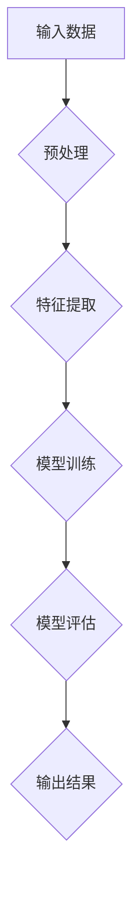
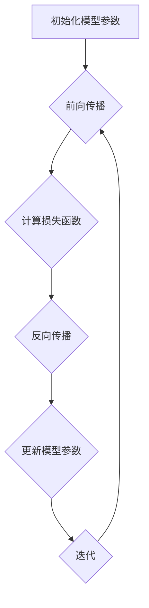
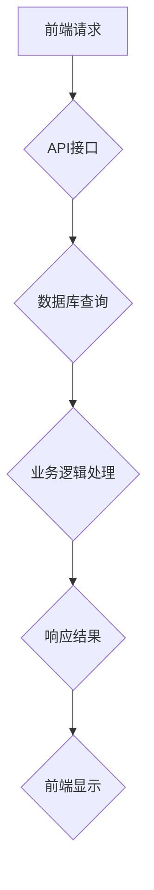
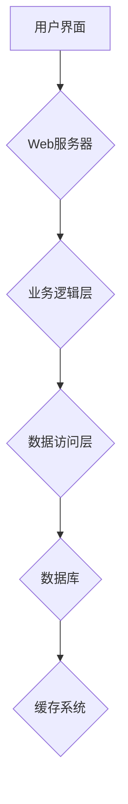
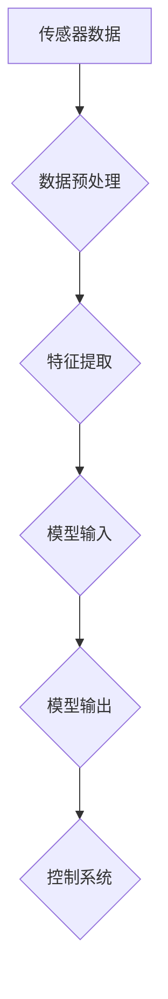
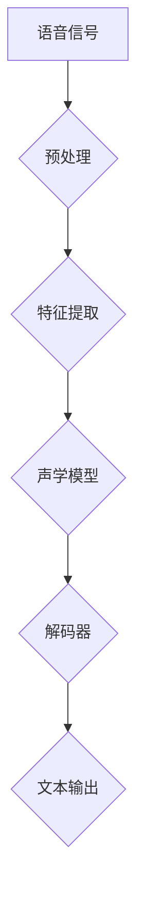

                 

# AI编程语言：提示词的魔法与艺术

> **关键词：** AI编程语言、提示词、生成式、判别式、自然语言处理、神经网络、深度学习、神经网络、生成对抗网络（GAN）、强化学习、跨模态学习、可解释性AI、伦理、开源社区。

> **摘要：** 本文将深入探讨AI编程语言的魔法与艺术，从概述、核心概念、核心技术、应用场景、优化与前沿技术、应用伦理到开源社区与未来展望，全面解析AI编程语言的奥秘。通过对提示词、生成式与判别式AI编程语言的详细介绍，以及自然语言处理、图像识别和自动驾驶等应用领域的深入分析，本文旨在为读者提供关于AI编程语言全面而深入的理解，并展望其未来的发展趋势和挑战。

### 第一部分：AI编程语言概述

## 第1章: AI编程语言简介

### 1.1 AI编程语言的定义与重要性

AI编程语言，顾名思义，是专门用于开发人工智能（AI）应用程序的语言。它们允许开发者以高效、灵活的方式创建和训练模型，从而实现各种智能任务，如自然语言处理、图像识别、语音识别和自动驾驶等。

AI编程语言的重要性体现在以下几个方面：

1. **高效性：** AI编程语言提供了丰富的库和工具，使得开发者在编写代码时更加高效。这些语言通常具有高度抽象性，能够简化复杂的计算过程。

2. **灵活性：** AI编程语言支持多种编程范式，如面向对象、函数式编程和生成式编程，使得开发者可以根据不同的需求选择最合适的范式。

3. **易用性：** AI编程语言的设计目标之一是降低AI开发的门槛，使得非专业人士也能参与到AI项目中。例如，Python就是一种广泛使用的AI编程语言，以其简洁易懂的语法著称。

4. **广泛应用：** AI编程语言在多个领域都有广泛应用，包括但不限于自然语言处理、图像识别、语音识别和自动驾驶。这些语言为各领域的研究者提供了强大的工具，加速了AI技术的发展。

### 1.2 AI编程语言的发展历程

AI编程语言的发展历程可以分为几个阶段：

#### 早期AI编程语言

1. **Lisp（1958年）：** 被认为是第一种函数式编程语言，它在人工智能领域有着深远的影响。Lisp的递归和符号处理能力使得它成为开发专家系统的理想选择。

2. **Prolog（1972年）：** 一种逻辑编程语言，以其强大的推理能力著称。Prolog在知识表示和推理方面有着广泛的应用。

3. **SQL（1974年）：** 虽然最初并非专门用于AI开发，但SQL在数据处理和知识库管理中发挥了重要作用，为后来的数据驱动的AI模型打下了基础。

#### 现代AI编程语言

1. **Python（1991年）：** Python以其简洁易懂的语法和丰富的库，成为现代AI编程语言中的佼佼者。Python的广泛应用与其庞大的开源社区密不可分。

2. **R（1995年）：** R是一种专门用于统计分析、数据可视化的人工智能编程语言。它在数据科学和机器学习领域有着广泛的应用。

3. **Julia（2012年）：** Julia是一种新兴的AI编程语言，以其高性能和简洁的语法著称。Julia在设计时考虑了科学计算和数据分析的需求，逐渐在AI领域崭露头角。

4. **TensorFlow（2015年）：** TensorFlow是一个由Google开发的深度学习框架，已经成为AI编程语言中的一部分。TensorFlow提供了丰富的API和工具，使得开发者可以轻松构建和训练复杂的深度学习模型。

### 1.3 AI编程语言的应用领域

AI编程语言在多个领域有着广泛的应用：

#### 自动驾驶

自动驾驶是AI编程语言的重要应用领域之一。自动驾驶系统需要处理大量的数据，并实时做出决策。Python和C++等AI编程语言在自动驾驶领域被广泛使用，用于开发感知模块、决策模块和控制模块。

#### 语音识别

语音识别技术需要处理语音信号，将其转换为文本。Python和C++等AI编程语言在语音识别领域有着广泛的应用。这些语言提供了丰富的库和工具，如 pocketsphinx 和 Kaldi，用于处理语音信号和训练模型。

#### 自然语言处理

自然语言处理（NLP）是AI编程语言的重要应用领域之一。NLP涉及到文本的预处理、情感分析、文本生成、机器翻译等任务。Python和R等AI编程语言在NLP领域有着广泛的应用，提供了丰富的库和工具，如 NLTK 和 spaCy。

#### 图像识别

图像识别技术需要处理图像数据，并将其分类或进行目标检测。Python和C++等AI编程语言在图像识别领域有着广泛的应用。这些语言提供了丰富的库和工具，如 TensorFlow 和 PyTorch，用于构建和训练图像识别模型。

#### 数据挖掘与机器学习

数据挖掘和机器学习是AI编程语言的重要应用领域。Python和R等AI编程语言在数据挖掘和机器学习领域有着广泛的应用，提供了丰富的库和工具，如 scikit-learn 和 mlr。

### 1.4 AI编程语言的未来趋势

AI编程语言的未来趋势可以从以下几个方面来分析：

#### 新兴AI编程语言

随着AI技术的不断发展，新兴的AI编程语言不断涌现。这些语言通常是为了解决特定领域的问题而设计的，具有高性能和高效能的特点。例如，Julia和Pandas等语言在科学计算和数据分析领域有着广泛的应用。

#### 跨学科融合趋势

AI编程语言的未来趋势之一是跨学科融合。随着AI技术的不断发展，越来越多的领域开始关注AI技术，并试图将其应用到自己的领域中。这种跨学科融合将推动AI编程语言在各个领域的应用，并促进AI技术的创新。

#### 自动化与智能化

自动化与智能化是AI编程语言的另一个重要趋势。随着AI技术的发展，越来越多的任务可以由AI系统自动完成。这种自动化与智能化将极大地提高生产效率，减少人力成本，并推动各行业的数字化转型。

#### 开源社区与生态系统

开源社区在AI编程语言的发展中发挥着重要作用。随着越来越多的开发者参与到开源项目中，AI编程语言的生态系统不断壮大。这种开源社区的发展将推动AI编程语言的创新和普及，为开发者提供更多的资源和机会。

## 第2章: AI编程语言核心概念

### 2.1 提示词（Prompt）的概念与作用

提示词（Prompt）在AI编程语言中扮演着重要的角色。提示词是一种引导AI系统生成预期结果的输入，它可以是一个单词、一个句子，甚至是一段文字。通过合理设计提示词，开发者可以有效地引导AI系统生成高质量的输出。

#### 提示词的定义

提示词（Prompt）是指用于引导AI系统生成预期结果的输入。它通常是一个单词、一个句子，或者是一段文字。提示词可以是简单的，也可以是复杂的，取决于AI系统的需求和目标。

#### 提示词在AI编程中的作用

1. **引导生成：** 提示词可以帮助AI系统生成预期的输出。例如，在自然语言处理任务中，提示词可以是一个句子或段落，用于引导AI系统生成相关的文本。

2. **控制生成：** 提示词可以用于控制AI系统的生成过程。通过合理设计提示词，开发者可以控制AI系统生成的质量、风格和方向。

3. **降低复杂性：** 提示词可以降低AI系统的复杂性。通过提供明确的提示词，AI系统可以专注于处理特定任务，从而提高效率。

4. **提高质量：** 合理设计的提示词可以提高AI系统生成的质量。通过提供丰富的信息和上下文，AI系统可以更好地理解任务，从而生成更高质量的输出。

#### 提示词的设计原则

1. **明确性：** 提示词应该明确表达任务的目标和要求。明确的提示词可以帮助AI系统更好地理解任务，从而生成更高质量的输出。

2. **丰富性：** 提示词应该包含丰富的信息和上下文。丰富的提示词可以帮助AI系统更好地理解任务，从而生成更高质量的输出。

3. **一致性：** 提示词应该与AI系统的设计和目标保持一致性。一致的提示词可以帮助AI系统更好地适应任务，从而提高生成质量。

4. **多样性：** 提示词应该具有多样性。多样化的提示词可以帮助AI系统学习不同的任务，从而提高其泛化能力。

### 2.2 生成式与判别式AI编程语言

生成式AI编程语言和判别式AI编程语言是两种不同的AI编程范式，它们在模型架构和任务处理方式上有所不同。

#### 生成式AI编程语言

生成式AI编程语言旨在生成数据，而不是直接分类或预测结果。这些语言通常使用概率模型来表示数据分布，并通过采样过程生成新的数据。生成式AI编程语言在图像生成、文本生成和数据增强等领域有着广泛的应用。

**优点：**

1. **数据生成能力：** 生成式AI编程语言可以生成大量多样化的数据，有助于提高模型的泛化能力。

2. **数据增强：** 生成式AI编程语言可以用于生成新的数据样本，从而增强原始数据集，提高模型的训练效果。

3. **图像和文本生成：** 生成式AI编程语言在图像生成和文本生成方面具有独特的优势，可以生成高质量的图像和文本。

**缺点：**

1. **计算复杂度：** 生成式AI编程语言通常需要较高的计算资源，特别是在生成大规模数据时。

2. **模型可解释性：** 生成式AI编程语言生成的数据通常缺乏可解释性，难以理解数据生成的具体过程。

#### 判别式AI编程语言

判别式AI编程语言旨在通过训练模型来区分不同类别或预测结果。这些语言通常使用分类器或回归器来处理数据，并通过最大化分类准确率或最小化预测误差来训练模型。判别式AI编程语言在分类、预测和目标检测等领域有着广泛的应用。

**优点：**

1. **模型可解释性：** 判别式AI编程语言生成的模型通常具有较高的可解释性，有助于理解模型的决策过程。

2. **计算效率：** 判别式AI编程语言通常具有较低的计算复杂度，可以快速处理大量数据。

3. **分类和预测能力：** 判别式AI编程语言在分类和预测任务中表现出色，可以准确地区分不同类别或预测结果。

**缺点：**

1. **数据质量要求高：** 判别式AI编程语言对数据质量要求较高，需要确保数据集的多样性和代表性。

2. **生成能力有限：** 判别式AI编程语言通常不擅长生成数据，因此在数据增强和图像生成等方面具有局限性。

### 2.3 编程范式与AI编程语言的关系

编程范式是编程语言的组织和设计风格，不同的编程范式适用于不同的任务和应用场景。AI编程语言通常支持多种编程范式，以适应不同的AI任务。

#### 面向过程

面向过程编程范式强调过程（操作）的执行顺序，通过一系列操作来解决问题。这种范式在早期的AI编程中非常流行，特别是在Lisp和Prolog等语言中。面向过程编程范式适用于需要大量计算和数据处理的任务，如自然语言处理和图像识别。

**优点：**

1. **灵活性：** 面向过程编程范式具有很高的灵活性，可以灵活地处理复杂的计算过程。

2. **可维护性：** 面向过程编程范式使得代码更易于维护和扩展。

**缺点：**

1. **可读性：** 面向过程编程范式可能导致代码的可读性降低，特别是对于复杂的任务。

2. **可扩展性：** 面向过程编程范式的扩展性可能受到限制，特别是在需要复用代码时。

#### 面向对象

面向对象编程范式将数据和操作封装在对象中，通过对象间的交互来解决问题。这种范式在Python和Java等AI编程语言中非常流行。面向对象编程范式适用于需要复用代码和模块化设计的任务，如机器学习和数据科学。

**优点：**

1. **复用性：** 面向对象编程范式使得代码更易于复用，提高了开发效率。

2. **可扩展性：** 面向对象编程范式的扩展性更好，可以方便地添加新的功能和模块。

**缺点：**

1. **性能：** 面向对象编程范式可能引入额外的性能开销，特别是在需要大量计算的任务中。

2. **复杂性：** 面向对象编程范式的复杂性可能增加，特别是在需要复用代码时。

#### 函数式编程

函数式编程范式将计算视为函数的执行，通过函数的组合来解决问题。这种范式在Haskell和Scala等AI编程语言中非常流行。函数式编程范式适用于需要高效计算和并行处理的任务，如深度学习和科学计算。

**优点：**

1. **高效性：** 函数式编程范式通常具有更高的计算效率，特别是在需要并行处理的任务中。

2. **可维护性：** 函数式编程范式使得代码更易于维护和复用。

**缺点：**

1. **可读性：** 函数式编程范式可能导致代码的可读性降低，特别是在需要大量计算和数据处理时。

2. **复杂性：** 函数式编程范式的复杂性可能增加，特别是在需要复用代码时。

### 2.4 AI编程语言的分类与特点

AI编程语言可以根据其用途和特点进行分类，常见的分类方法包括高级AI编程语言、低级AI编程语言和特定领域AI编程语言。

#### 高级AI编程语言

高级AI编程语言通常具有抽象性高、易用性强的特点，适用于非专业人士快速开发AI应用程序。Python、R和Julia等语言是高级AI编程语言的代表。

**特点：**

1. **抽象性：** 高级AI编程语言提供了丰富的库和工具，使得开发者可以快速构建复杂的AI应用程序。

2. **易用性：** 高级AI编程语言的语法简洁，易于学习，适合非专业人士使用。

3. **跨平台：** 高级AI编程语言通常支持跨平台开发，可以在不同的操作系统上运行。

4. **社区支持：** 高级AI编程语言拥有庞大的开源社区，提供了大量的资源和支持。

#### 低级AI编程语言

低级AI编程语言通常具有高性能、高可定制性的特点，适用于专业人士开发高性能AI应用程序。C++、Java和C#等语言是低级AI编程语言的代表。

**特点：**

1. **高性能：** 低级AI编程语言通常具有更高的执行效率，适合处理高性能计算任务。

2. **可定制性：** 低级AI编程语言提供了丰富的底层功能和接口，使得开发者可以定制自己的AI应用程序。

3. **跨平台：** 低级AI编程语言通常支持跨平台开发，可以在不同的操作系统上运行。

4. **社区支持：** 低级AI编程语言的开源社区相对较小，但提供了高质量的资源和工具。

#### 特定领域AI编程语言

特定领域AI编程语言是为了解决特定领域的问题而设计的，具有针对性强的特点。MATLAB、Scilab和Mathematica等语言是特定领域AI编程语言的代表。

**特点：**

1. **针对性：** 特定领域AI编程语言专门为特定领域的问题设计，具有针对性的功能和算法。

2. **专用性：** 特定领域AI编程语言通常具有专用性的特点和工具，适用于特定领域的应用。

3. **易用性：** 特定领域AI编程语言的语法和工具设计简洁，易于学习和使用。

4. **社区支持：** 特定领域AI编程语言的开源社区相对较小，但提供了高质量的资源和工具。

### 2.5 AI编程语言的学习路径与资源推荐

学习AI编程语言需要掌握一定的编程基础和理论知识。以下是一些学习路径和资源推荐，帮助开发者快速入门和进阶。

#### 初学者学习路径

1. **编程基础：** 学习Python、C++或Java等编程语言的基础，掌握编程基本概念和语法。

2. **数据分析：** 学习数据分析工具（如Pandas、NumPy）和库（如Matplotlib、Seaborn），掌握数据处理和可视化方法。

3. **机器学习：** 学习机器学习基础（如监督学习、非监督学习、强化学习等）和常用算法（如决策树、支持向量机、神经网络等）。

4. **深度学习：** 学习深度学习基础（如卷积神经网络、循环神经网络、生成对抗网络等）和常用框架（如TensorFlow、PyTorch等）。

5. **项目实践：** 参与实践项目，将所学知识应用到实际场景中，提升实战能力。

#### 进阶学习资源推荐

1. **专业书籍：** 《Python编程：从入门到实践》、《深度学习》（Goodfellow等）、《机器学习》（周志华等）等。

2. **在线课程：** Coursera、edX、Udacity等平台上的机器学习和深度学习课程。

3. **论文与研究报告：** ArXiv、Google Research、Facebook AI Research等网站上的最新研究成果和论文。

4. **开源社区与论坛：** GitHub、Stack Overflow、Kaggle等开源社区和论坛，提供丰富的资源和讨论。

### 2.6 AI编程语言在实际项目中的应用案例

AI编程语言在各个领域都有广泛的应用，以下是一些实际项目案例，展示AI编程语言在各个领域的应用场景和效果。

#### 生成艺术作品

使用Python和TensorFlow等AI编程语言，可以生成各种艺术作品，如绘画、音乐和视频。生成艺术作品不仅具有艺术价值，还可以为创意产业带来新的机遇。

**案例：** 使用生成对抗网络（GAN）生成梵高的风格画作。通过训练GAN模型，可以将普通图像转换为梵高的风格画作，展现了AI编程语言在艺术创作中的强大能力。

#### 自动写作

使用Python和NLTK等AI编程语言，可以自动生成文章、报告和故事等文本。自动写作在内容生成、新闻简报和自动文档生成等领域具有广泛应用。

**案例：** 使用递归神经网络（RNN）生成新闻报道。通过训练RNN模型，可以自动生成新闻文本，提高了新闻写作的效率和准确性。

#### 数据分析与可视化

使用Python和Pandas、Matplotlib等AI编程语言，可以高效地进行数据分析和可视化。数据分析与可视化在商业智能、金融分析和市场营销等领域有着重要应用。

**案例：** 使用Python进行股票市场数据分析。通过分析历史股票数据，可以预测未来股票走势，为投资者提供决策支持。

#### 人机交互

使用Python和TensorFlow等AI编程语言，可以构建智能人机交互系统，如聊天机器人、语音助手和手势识别系统。人机交互在智能客服、智能家居和虚拟现实等领域具有广泛应用。

**案例：** 使用TensorFlow构建聊天机器人。通过训练自然语言处理模型，可以构建智能聊天机器人，提供实时问答和语音交互功能。

#### 图像识别

使用Python和TensorFlow、PyTorch等AI编程语言，可以构建图像识别系统，如人脸识别、车辆识别和医疗图像分析。图像识别在安防监控、医疗诊断和自动驾驶等领域具有广泛应用。

**案例：** 使用卷积神经网络（CNN）进行人脸识别。通过训练CNN模型，可以准确识别和分类人脸图像，提高了图像识别的准确率和速度。

#### 数据挖掘与机器学习

使用Python和scikit-learn、mlr等AI编程语言，可以进行数据挖掘和机器学习任务，如分类、回归和聚类。数据挖掘与机器学习在金融风控、客户关系管理和推荐系统等领域具有广泛应用。

**案例：** 使用scikit-learn进行客户流失预测。通过分析客户历史数据和特征，可以预测客户是否会流失，为营销策略提供决策支持。

### 2.7 AI编程语言的核心算法原理

AI编程语言的核心算法原理是其实现人工智能功能的基础。以下是一些核心算法原理，以及它们在AI编程语言中的应用。

#### 神经网络

神经网络是一种模拟人脑神经元结构和功能的计算模型。它由多个神经元（或节点）组成，每个神经元都与其他神经元相连，并通过权重和偏置进行计算。

**基本结构：**
1. **输入层：** 接收外部输入数据。
2. **隐藏层：** 进行数据处理和特征提取。
3. **输出层：** 输出最终结果。

**算法原理：**
- **前向传播：** 数据从输入层传递到隐藏层，再传递到输出层。
- **反向传播：** 通过计算误差，更新神经网络的权重和偏置。

**应用场景：**
- **图像识别：** 卷积神经网络（CNN）用于图像分类和特征提取。
- **自然语言处理：** 循环神经网络（RNN）和长短期记忆网络（LSTM）用于序列建模和文本生成。

#### 决策树

决策树是一种基于树形结构进行决策的算法。它通过一系列条件分支来对数据进行分类或回归。

**基本结构：**
1. **根节点：** 初始数据集。
2. **内部节点：** 根据特征进行划分。
3. **叶子节点：** 最终分类或回归结果。

**算法原理：**
- **信息增益：** 选择具有最大信息增益的特征进行划分。
- **基尼系数：** 用于评估划分的纯度。

**应用场景：**
- **分类问题：** 用于分类预测，如分类客户流失。
- **回归问题：** 用于回归预测，如预测房屋价格。

#### 支持向量机

支持向量机（SVM）是一种基于最大间隔分类器的算法。它通过找到一个超平面，将不同类别的数据点最大化地分隔开。

**基本结构：**
1. **训练数据：** 包括特征和标签。
2. **支持向量：** 距离超平面最近的样本。

**算法原理：**
- **线性SVM：** 通过求解二次规划问题来找到最优超平面。
- **核技巧：** 将数据映射到高维空间，从而实现非线性分类。

**应用场景：**
- **分类问题：** 用于图像分类和文本分类。
- **回归问题：** 用于回归分析，如股票价格预测。

#### 集成学习

集成学习是一种通过组合多个模型来提高预测准确率和稳定性的算法。常见的集成学习方法包括Bagging和Boosting。

**基本结构：**
1. **基础模型：** 如决策树、随机森林、XGBoost等。
2. **集成模型：** 将多个基础模型组合起来，通过投票或加权平均来得到最终预测结果。

**算法原理：**
- **Bagging：** 通过随机抽样和组合多个基础模型来减少方差。
- **Boosting：** 通过迭代训练基础模型，并调整每个模型的权重，以提高整体准确率。

**应用场景：**
- **分类问题：** 用于提高分类模型的准确率和稳定性。
- **回归问题：** 用于提高回归模型的预测精度。

#### 生成对抗网络

生成对抗网络（GAN）是一种由生成器和判别器组成的对抗性模型。它通过训练生成器生成与真实数据相似的数据，同时训练判别器区分真实数据和生成数据。

**基本结构：**
1. **生成器：** 生成虚假数据。
2. **判别器：** 区分真实数据和生成数据。

**算法原理：**
- **生成器-判别器对抗：** 通过对抗性训练，生成器尝试生成更真实的数据，而判别器试图区分真实数据和生成数据。

**应用场景：**
- **图像生成：** 生成逼真的图像和视频。
- **数据增强：** 用于生成训练数据，提高模型泛化能力。

#### 强化学习

强化学习是一种通过试错和反馈来学习最优策略的算法。它通常由代理人、环境、状态、动作和奖励组成。

**基本结构：**
1. **代理人：** 学习策略。
2. **环境：** 提供状态和奖励。
3. **状态：** 描述当前环境情况。
4. **动作：** 代理人的行动。
5. **奖励：** 对代理人动作的奖励或惩罚。

**算法原理：**
- **Q学习：** 通过值函数来评估状态-动作对的最优性。
- **策略梯度：** 直接优化代理人的策略。

**应用场景：**
- **自动驾驶：** 用于决策和控制。
- **游戏AI：** 用于游戏策略的制定。

### 2.8 AI编程语言的实现与优化

AI编程语言的实现与优化是确保模型性能和应用效果的关键。以下是一些实现和优化的方法和技巧。

#### 实现方法

1. **模型选择：** 根据任务需求选择合适的模型。例如，对于图像分类任务，可以选择卷积神经网络（CNN）；对于文本分类任务，可以选择循环神经网络（RNN）或变换器（Transformer）。

2. **数据处理：** 对输入数据进行预处理，如归一化、标准化、数据增强等，以提高模型的泛化能力和训练效果。

3. **模型训练：** 使用合适的学习率和优化器进行模型训练，如随机梯度下降（SGD）和Adam。

4. **模型评估：** 使用验证集或测试集对模型进行评估，常用的评估指标包括准确率、召回率、F1分数等。

5. **模型部署：** 将训练好的模型部署到生产环境，如使用TensorFlow Serving或PyTorch Serving进行模型服务。

#### 优化技巧

1. **模型压缩：** 通过模型剪枝、量化、知识蒸馏等技术减少模型大小和计算复杂度。

2. **计算优化：** 使用GPU或TPU进行加速计算，提高模型训练和推理速度。

3. **数据并行化：** 通过数据并行化技术，将数据分布在多个GPU或TPU上，提高模型训练效率。

4. **模型调优：** 调整学习率、批量大小、正则化参数等超参数，优化模型性能。

5. **内存管理：** 优化内存分配和释放，减少内存泄漏和垃圾回收开销。

6. **网络通信：** 优化网络通信和同步，提高分布式训练和推理效率。

### 2.9 AI编程语言的未来趋势与发展方向

AI编程语言的未来趋势和发展方向受到技术进步、应用需求和行业发展的共同驱动。以下是一些重要的趋势和发展方向。

#### 新兴AI编程语言

随着AI技术的不断发展，新兴的AI编程语言不断涌现。这些语言通常是为了解决特定领域的问题而设计的，具有高性能和高效能的特点。例如，Julia和Pandas等语言在科学计算和数据分析领域有着广泛的应用。未来，我们可能会看到更多专门为AI应用设计的新兴编程语言，以满足日益增长的需求。

#### 跨学科融合趋势

AI编程语言的未来趋势之一是跨学科融合。随着AI技术的不断发展，越来越多的领域开始关注AI技术，并试图将其应用到自己的领域中。这种跨学科融合将推动AI编程语言在各个领域的应用，并促进AI技术的创新。例如，生物信息学和医疗领域正在利用AI编程语言进行基因测序和疾病诊断。未来，我们可能会看到更多跨学科融合的AI编程语言，如生物信息学Python和医学数据分析R。

#### 自动化与智能化

自动化与智能化是AI编程语言的另一个重要趋势。随着AI技术的发展，越来越多的任务可以由AI系统自动完成。这种自动化与智能化将极大地提高生产效率，减少人力成本，并推动各行业的数字化转型。例如，自动驾驶汽车和智能家居系统正在利用AI编程语言实现自动化控制。未来，我们可能会看到更多自动化与智能化的AI编程语言，如自动化编程Python和智能推理Java。

#### 开源社区与生态系统

开源社区在AI编程语言的发展中发挥着重要作用。随着越来越多的开发者参与到开源项目中，AI编程语言的生态系统不断壮大。这种开源社区的发展将推动AI编程语言的创新和普及，为开发者提供更多的资源和机会。未来，我们可能会看到更多开放的AI编程语言，如开源深度学习框架TensorFlow和PyTorch。

#### 软硬件协同优化

随着AI技术的不断发展，对计算性能的需求越来越高。软硬件协同优化成为AI编程语言的重要发展方向。通过优化算法和硬件设计，可以显著提高AI编程语言的执行效率。例如，谷歌的TPU和英伟达的GPU在深度学习任务中表现出色。未来，我们可能会看到更多软硬件协同优化的AI编程语言，如AI专用编程语言TensorFlow Lite和PyTorch Mobile。

#### 伦理与隐私保护

随着AI技术在各个领域的应用，伦理和隐私保护问题日益凸显。AI编程语言的未来发展趋势之一是伦理与隐私保护。未来，我们可能会看到更多注重伦理和隐私保护的AI编程语言，如可解释性AI编程语言和隐私保护编程语言。

#### 新兴领域应用

AI编程语言的新兴领域应用也是未来发展的重要方向。随着AI技术的不断发展，AI编程语言将在更多新兴领域发挥作用，如生物信息学、医疗诊断、金融分析、智慧城市等。未来，我们可能会看到更多针对这些新兴领域的AI编程语言，如生物信息学Python和智慧城市R。

### 2.10 AI编程语言的实际项目实战

在实际项目中应用AI编程语言是一个复杂而充满挑战的过程。以下是一个典型的项目实战过程，包括项目环境搭建、需求分析、项目设计、项目实施、项目优化和项目评估等步骤。

#### 项目环境搭建

1. **硬件选择：** 根据项目需求，选择合适的硬件设备。例如，对于深度学习项目，可以选择配备GPU的服务器或工作站。
2. **软件安装：** 安装必要的软件，如操作系统、编程语言、深度学习框架等。例如，安装Python、TensorFlow、PyTorch等。
3. **配置环境：** 配置Python环境，安装必要的库和依赖项。例如，使用pip安装TensorFlow、NumPy、Pandas等。

#### 需求分析

1. **明确目标：** 确定项目目标，例如图像分类、文本生成或语音识别等。
2. **数据收集：** 收集相关数据，如图像、文本或音频数据。对于图像分类项目，可能需要收集大量带有标签的图像数据。
3. **数据分析：** 分析数据的特点，如数据分布、数据质量等。确保数据集的多样性和代表性。

#### 项目设计

1. **算法选择：** 根据项目需求，选择合适的算法。例如，对于图像分类项目，可以选择卷积神经网络（CNN）。
2. **模型设计：** 设计模型结构，如网络层数、神经元数量等。使用深度学习框架（如TensorFlow或PyTorch）构建模型。
3. **预处理与后处理：** 设计数据预处理和后处理步骤，如数据归一化、标签编码等。

#### 项目实施

1. **数据预处理：** 对数据进行清洗、预处理，如数据增强、归一化等。
2. **模型训练：** 使用训练数据训练模型，调整模型参数，如学习率、批量大小等。
3. **模型验证：** 使用验证数据评估模型性能，调整模型结构或参数，提高模型性能。
4. **模型部署：** 将训练好的模型部署到生产环境，如使用TensorFlow Serving或PyTorch Serving进行模型服务。

#### 项目优化

1. **模型压缩：** 通过模型剪枝、量化等技术减少模型大小和计算复杂度，提高模型部署效率。
2. **计算优化：** 使用GPU或TPU进行加速计算，提高模型训练和推理速度。
3. **数据并行化：** 通过数据并行化技术，将数据分布在多个GPU或TPU上，提高模型训练效率。
4. **模型调优：** 调整学习率、批量大小、正则化参数等超参数，优化模型性能。

#### 项目评估

1. **性能评估：** 使用测试数据评估模型性能，如准确率、召回率、F1分数等。
2. **效果评估：** 评估模型在实际项目中的应用效果，如业务指标、用户体验等。
3. **优化与迭代：** 根据评估结果，对模型进行优化和迭代，提高模型性能和应用效果。

### 2.11 AI编程语言的代码解读与分析

在AI编程语言中，代码的解读与分析是理解和优化模型的重要环节。以下是一个典型的代码解读与分析过程，包括代码结构与设计原则、代码实现与解释、代码优化与调优、代码性能评估与改进等步骤。

#### 代码结构与设计原则

1. **模块化设计：** 将代码分为模块，每个模块负责特定的功能，如数据预处理、模型训练、模型评估等。
2. **函数化设计：** 使用函数或类封装功能，提高代码的可读性和可维护性。
3. **可复用性设计：** 设计可复用的代码组件，如数据预处理函数、模型训练函数等，减少重复代码。
4. **可扩展性设计：** 设计可扩展的代码结构，便于添加新的功能和模块。

#### 代码实现与解释

1. **数据预处理：** 实现数据预处理函数，如数据清洗、归一化、数据增强等。
2. **模型训练：** 实现模型训练函数，如定义损失函数、优化器、训练过程等。
3. **模型评估：** 实现模型评估函数，如计算准确率、召回率、F1分数等指标。
4. **模型部署：** 实现模型部署函数，如模型加载、预测、模型服务化等。

#### 代码优化与调优

1. **算法优化：** 优化算法，如使用更高效的算法实现，如卷积神经网络（CNN）替代传统神经网络（NN）。
2. **代码优化：** 优化代码，如使用向量化操作、循环优化等提高代码执行效率。
3. **模型调优：** 调整模型参数，如学习率、批量大小、正则化参数等，优化模型性能。
4. **硬件优化：** 使用GPU或TPU进行加速计算，提高模型训练和推理速度。

#### 代码性能评估与改进

1. **性能评估：** 使用测试数据评估模型性能，如准确率、召回率、F1分数等指标。
2. **性能改进：** 根据评估结果，对模型和代码进行优化和改进，提高模型性能和应用效果。
3. **基准测试：** 进行基准测试，如与其他模型或算法的比较，验证性能提升。
4. **迭代优化：** 持续迭代优化，根据实际项目需求，不断调整和改进代码。

### 2.12 AI编程语言的数学模型与数学公式

在AI编程语言中，数学模型与数学公式是理解和实现算法的基础。以下是一些常见的数学模型与数学公式，以及它们在AI编程语言中的应用。

#### 概率论与统计学基础

1. **概率分布：**
   - **伯努利分布：** $P(X = k) = p^k(1 - p)^{n - k}$
   - **二项分布：** $P(X = k) = C_n^k p^k (1 - p)^{n - k}$
   - **正态分布：** $f(x|\mu,\sigma^2) = \frac{1}{\sqrt{2\pi\sigma^2}} e^{-\frac{(x-\mu)^2}{2\sigma^2}}$

2. **统计参数：**
   - **均值：** $\mu = \frac{1}{n}\sum_{i=1}^{n} x_i$
   - **方差：** $\sigma^2 = \frac{1}{n}\sum_{i=1}^{n} (x_i - \mu)^2$

#### 线性代数基础

1. **矩阵运算：**
   - **矩阵乘法：** $C = AB$
   - **矩阵求逆：** $A^{-1} = (adj(A)) / det(A)$
   - **矩阵求导：** $d(A^T) = d(A)^T$

2. **向量运算：**
   - **点积：** $\vec{a} \cdot \vec{b} = a_1b_1 + a_2b_2 + ... + a_nb_n$
   - **叉积：** $\vec{a} \times \vec{b} = (a_2b_3 - a_3b_2, a_3b_1 - a_1b_3, a_1b_2 - a_2b_1)$

#### 最优化理论与算法

1. **梯度下降：**
   - **一维梯度下降：** $x_{t+1} = x_t - \alpha \frac{df}{dx}$
   - **多维梯度下降：** $w_{t+1} = w_t - \alpha \nabla_w f(w_t)$

2. **牛顿法：**
   - $x_{t+1} = x_t - (\nabla^2 f(x_t))^{-1} \nabla f(x_t)$

#### 深度学习中的数学公式

1. **激活函数：**
   - **sigmoid函数：** $f(x) = \frac{1}{1 + e^{-x}}$
   - **ReLU函数：** $f(x) = \max(0, x)$
   - **Tanh函数：** $f(x) = \frac{e^x - e^{-x}}{e^x + e^{-x}}$

2. **损失函数：**
   - **均方误差（MSE）：** $MSE = \frac{1}{n}\sum_{i=1}^{n} (y_i - \hat{y}_i)^2$
   - **交叉熵损失（Cross-Entropy）：** $H(Y, \hat{Y}) = -\sum_{i=1}^{n} y_i \log(\hat{y}_i)$

3. **优化算法：**
   - **随机梯度下降（SGD）：** $w_{t+1} = w_t - \alpha \nabla_w f(w_t)$
   - **Adam优化器：** $\beta_1 = 0.9, \beta_2 = 0.999, \alpha_t = \frac{\alpha}{1 - \beta_1^t}, \beta_1_t = \frac{\beta_1}{1 - \beta_2^t}$

### 2.13 AI编程语言的 Mermaid 流程图

在AI编程语言中，Mermaid是一种方便的流程图工具，用于可视化数据流、算法流程和系统架构。以下是一些常见的Mermaid流程图示例。

#### 数据流图

#### 算法流程图

#### 网络拓扑图

#### 项目架构图

### 2.14 AI编程语言的应用领域拓展

AI编程语言在各个领域都有着广泛的应用，随着技术的不断发展，这些应用领域也在不断拓展。以下是一些常见的应用领域拓展。

#### 金融领域

在金融领域，AI编程语言被广泛应用于风险管理、算法交易、信用评估和欺诈检测等方面。

- **风险管理：** AI编程语言可以帮助金融机构预测市场风险，优化投资组合，提高投资回报。
- **算法交易：** AI编程语言可以构建高效、自动化的交易系统，实现高频交易和算法交易。
- **信用评估：** AI编程语言可以分析客户历史数据和行为，预测信用风险，优化信用评估模型。

#### 医疗领域

在医疗领域，AI编程语言被广泛应用于疾病诊断、药物研发、医疗图像分析和健康管理等方面。

- **疾病诊断：** AI编程语言可以分析患者症状、病史和生物标志物，辅助医生进行疾病诊断。
- **药物研发：** AI编程语言可以加速药物研发过程，通过分子模拟和预测药物-目标相互作用，提高新药研发的成功率。
- **医疗图像分析：** AI编程语言可以帮助医生进行医学图像分析，如病变检测、分割和分类。

#### 教育领域

在教育领域，AI编程语言被广泛应用于智能教育、个性化推荐和教学数据分析等方面。

- **智能教育：** AI编程语言可以帮助构建智能教育系统，提供个性化的学习路径和辅导。
- **个性化推荐：** AI编程语言可以分析学生行为和学习数据，为教师和学生推荐合适的学习资源和课程。
- **教学数据分析：** AI编程语言可以分析教学数据，帮助教师优化教学方法和策略。

#### 物流领域

在物流领域，AI编程语言被广泛应用于物流优化、配送路线规划和库存管理等方面。

- **物流优化：** AI编程语言可以帮助企业优化物流流程，降低运输成本，提高物流效率。
- **配送路线规划：** AI编程语言可以分析交通状况、车辆情况和订单需求，规划最优配送路线。
- **库存管理：** AI编程语言可以帮助企业实时监控库存状况，优化库存管理策略，减少库存成本。

### 2.15 AI编程语言的进阶学习资源推荐

为了更好地学习和掌握AI编程语言，以下是一些进阶学习资源推荐。

#### 专业书籍

1. **《Python编程：从入门到实践》：** 全面介绍Python编程语言的基础知识和应用实践，适合初学者。
2. **《深度学习》：** 由Goodfellow等作者编写的经典教材，详细介绍了深度学习的基础知识和应用。
3. **《机器学习》：** 周志华教授主编的教材，涵盖了机器学习的基本概念、算法和应用。
4. **《人工智能：一种现代方法》：** Stuart J. Russell和Peter Norvig合著的经典教材，全面介绍了人工智能的理论和实践。

#### 在线课程

1. **Coursera上的“深度学习专项课程”：** Andrew Ng教授主讲的深度学习专项课程，包括神经网络基础、深度学习应用等。
2. **Udacity上的“机器学习工程师纳米学位”：** 适合初学者，涵盖了机器学习、数据科学和深度学习等主题。
3. **edX上的“机器学习基础课程”：** 伯克利大学提供的免费课程，介绍了机器学习的基本概念和算法。

#### 论文与研究报告

1. **ArXiv：** 最新的人工智能论文和研究报告，涵盖深度学习、自然语言处理、计算机视觉等领域。
2. **Google Research：** Google的人工智能研究报告，涵盖了最新的研究成果和应用。
3. **Facebook AI Research：** Facebook的人工智能研究报告，涵盖了深度学习、自然语言处理和计算机视觉等领域。

#### 开源社区与论坛

1. **GitHub：** 全球最大的开源社区，提供了大量的AI编程语言和框架的开源项目。
2. **Stack Overflow：** AI编程语言的问答社区，可以帮助开发者解决编程问题。
3. **Kaggle：** 数据科学和机器学习的竞赛平台，提供了大量的数据集和比赛项目。

### 第二部分：AI编程语言应用场景

## 第3章: 自动驾驶中的AI编程语言

### 3.1 自动驾驶概述

自动驾驶技术是人工智能（AI）的一个重要应用领域，它利用各种传感器、人工智能算法和控制系统来实现车辆自主驾驶。自动驾驶技术的发展经历了多个阶段，从简单的辅助驾驶功能到完全自主的驾驶系统，每一阶段都标志着技术的进步和创新。

#### 自动驾驶技术发展历程

1. **辅助驾驶阶段（1990s-2000s）：** 这一阶段主要发展了诸如自适应巡航控制（ACC）、自动刹车和盲点监测等辅助驾驶功能。这些功能通过传感器和简单的AI算法来辅助驾驶员，但并不完全依赖于自主驾驶。

2. **部分自动驾驶阶段（2010s）：** 在这一阶段，自动驾驶技术取得了显著进展。自动驾驶车辆开始能够在特定条件下实现自主驾驶，例如高速公路上的自动巡航。这得益于深度学习、计算机视觉和传感器融合技术的快速发展。

3. **完全自动驾驶阶段（2020s-2030s）：** 预计在这一阶段，自动驾驶技术将实现完全自主驾驶，车辆能够在各种复杂路况下自主行驶，无需人类干预。这一目标依赖于更加先进的AI算法、传感器技术、通信技术和高精度地图。

#### 自动驾驶系统架构

自动驾驶系统通常包括以下几个关键模块：

1. **感知模块：** 使用各种传感器（如雷达、激光雷达、摄像头等）收集车辆周围的环境信息，包括道路、交通标志、行人和其他车辆等。

2. **决策模块：** 对感知模块收集到的信息进行处理和分析，基于预定义的规则和算法，生成驾驶策略，如加速、减速、转向等。

3. **控制模块：** 根据决策模块生成的驾驶策略，控制车辆的运动，如油门、刹车和转向等。

4. **执行模块：** 执行决策模块生成的操作，实现车辆的自主驾驶。

### 3.2 AI编程语言在自动驾驶中的应用

AI编程语言在自动驾驶中扮演着至关重要的角色，它们用于开发自动驾驶系统的各个模块，包括感知、决策和控制等。以下是一些常用的AI编程语言及其在自动驾驶中的应用：

#### Python

Python因其简洁的语法和丰富的库而成为自动驾驶开发的首选语言。Python在自动驾驶中的应用包括：

1. **数据预处理和特征提取：** 使用Python库（如NumPy、Pandas）进行数据清洗、归一化和特征提取。
2. **深度学习模型开发：** 使用TensorFlow和PyTorch等深度学习框架构建和训练神经网络模型。
3. **感知模块：** 使用Python库（如OpenCV、PyTorch）进行图像处理和目标检测。
4. **决策和控制模块：** 使用Python编写控制逻辑和决策算法。

#### C++

C++因其高性能和强大的性能而广泛用于自动驾驶系统的核心部分。C++在自动驾驶中的应用包括：

1. **实时数据处理：** C++适合处理实时性要求高的任务，如传感器数据处理和决策控制。
2. **嵌入式系统开发：** C++用于开发自动驾驶车辆的嵌入式系统，如车载计算单元（V2X）和传感器接口。
3. **性能优化：** C++代码在编译时进行优化，可以提供更高的执行效率。

#### C#

C#因其跨平台性和良好的可维护性而在自动驾驶开发中也有所应用。C#在自动驾驶中的应用包括：

1. **车载应用程序开发：** C#可以用于开发车载应用程序，如用户界面和导航系统。
2. **实时通信：** C#支持实时通信协议（如WebSocket），可以用于实现车辆之间的通信。
3. **系统集成：** C#可以与其他编程语言和框架（如Java、Python）集成，实现复杂的自动驾驶系统。

#### Python与C++的比较

Python和C++是自动驾驶开发中常用的两种编程语言，它们各有优缺点：

**Python的优点：**

1. **简洁易用：** Python的语法简洁，易于学习和使用，适合快速开发。
2. **丰富的库：** Python拥有丰富的库和框架，如NumPy、Pandas、TensorFlow和PyTorch，提供了强大的数据科学和机器学习支持。
3. **开发效率：** Python的开发效率高，适合快速迭代和原型设计。

**Python的缺点：**

1. **性能问题：** Python是解释性语言，执行效率相对较低，不适合对性能要求极高的任务。
2. **内存管理：** Python的内存管理较复杂，可能引入内存泄漏等问题。

**C++的优点：**

1. **高性能：** C++是编译性语言，执行效率高，适合高性能计算。
2. **控制性强：** C++提供了强大的控制能力，可以灵活地管理内存和优化代码。
3. **跨平台性：** C++具有很好的跨平台性，可以在多种操作系统和硬件平台上运行。

**C++的缺点：**

1. **复杂性：** C++的语法较复杂，学习曲线较陡峭。
2. **开发效率：** C++的开发效率相对较低，需要更多的代码和更复杂的调试。

### 3.3 自动驾驶项目实战

以下是一个自动驾驶项目实战的示例，包括项目环境搭建、需求分析、项目设计、项目实施、项目优化和项目评估等步骤。

#### 项目环境搭建

1. **硬件选择：** 选择具备高性能计算能力的计算机，如配备NVIDIA GPU的服务器或工作站。
2. **软件安装：** 安装操作系统（如Ubuntu 18.04），以及Python、C++、C#等编程语言。
3. **深度学习框架：** 安装TensorFlow、PyTorch、Caffe等深度学习框架。
4. **传感器驱动：** 安装相应传感器的驱动程序，如激光雷达、摄像头等。

#### 需求分析

1. **明确目标：** 确定自动驾驶系统的目标和功能，如自动行驶、自动避障、自动停车等。
2. **数据收集：** 收集自动驾驶系统所需的传感器数据，如激光雷达数据、摄像头数据、GPS数据等。
3. **数据标注：** 对收集的数据进行标注，如道路、车辆、行人等目标的标注。

#### 项目设计

1. **感知模块设计：** 设计激光雷达和摄像头数据处理算法，包括点云处理、图像处理和目标检测等。
2. **决策模块设计：** 设计决策算法，包括路径规划、避障策略和控制策略等。
3. **控制模块设计：** 设计控制算法，包括油门、刹车和转向等控制信号的计算。

#### 项目实施

1. **数据预处理：** 对收集的传感器数据进行预处理，包括去噪、归一化和特征提取等。
2. **模型训练：** 使用预处理后的数据训练感知模块的深度学习模型，如卷积神经网络（CNN）和循环神经网络（RNN）。
3. **系统集成：** 将训练好的模型集成到自动驾驶系统中，实现感知、决策和控制等功能。

#### 项目优化

1. **模型优化：** 通过调整模型参数和结构，优化模型性能，提高预测准确率和实时性。
2. **硬件优化：** 利用高性能GPU进行模型训练和推理，提高计算效率。
3. **算法优化：** 优化感知模块和决策模块的算法，提高系统响应速度和稳定性。

#### 项目评估

1. **性能评估：** 使用测试数据集评估模型和系统的性能，如准确率、召回率、实时性等指标。
2. **效果评估：** 在实际驾驶环境中测试系统效果，观察系统的稳定性和可靠性。
3. **优化与迭代：** 根据评估结果对模型和系统进行优化和迭代，提高性能和应用效果。

### 3.4 自动驾驶中的代码解读与分析

在自动驾驶项目中，代码的解读与分析是确保系统性能和稳定性的关键环节。以下是一个自动驾驶项目中的代码解读与分析示例，包括代码结构与设计原则、代码实现与解释、代码优化与调优、代码性能评估与改进等步骤。

#### 代码结构与设计原则

1. **模块化设计：** 将代码分为模块，每个模块负责特定的功能，如数据预处理、模型训练、模型评估等。
2. **函数化设计：** 使用函数或类封装功能，提高代码的可读性和可维护性。
3. **可复用性设计：** 设计可复用的代码组件，如数据预处理函数、模型训练函数等，减少重复代码。
4. **可扩展性设计：** 设计可扩展的代码结构，便于添加新的功能和模块。

#### 代码实现与解释

1. **数据预处理：**
   - **代码实现：** 使用Python的NumPy库对传感器数据进行预处理，包括去噪、归一化和特征提取等。
   - **解释：** 数据预处理是自动驾驶系统的基础，通过去噪和归一化可以提高模型的输入质量，特征提取则有助于提取关键信息。

2. **模型训练：**
   - **代码实现：** 使用TensorFlow或PyTorch框架训练深度学习模型，如卷积神经网络（CNN）或循环神经网络（RNN）。
   - **解释：** 模型训练是自动驾驶系统的核心，通过训练可以学习到感知、决策和控制等任务的关键特征。

3. **模型评估：**
   - **代码实现：** 使用测试数据集评估模型的性能，包括准确率、召回率、实时性等指标。
   - **解释：** 模型评估是验证模型性能和系统效果的重要步骤，通过评估可以了解模型的优缺点，为后续优化提供依据。

4. **控制系统：**
   - **代码实现：** 编写控制算法，计算油门、刹车和转向等控制信号。
   - **解释：** 控制系统是实现自动驾驶的核心部分，通过控制算法可以实现对车辆的精确控制。

#### 代码优化与调优

1. **算法优化：**
   - **代码实现：** 通过调整模型参数和结构，优化模型性能，如调整学习率、批量大小等。
   - **解释：** 算法优化是提高模型性能的重要手段，通过优化可以提高模型的准确率和实时性。

2. **硬件优化：**
   - **代码实现：** 利用GPU进行模型训练和推理，提高计算效率。
   - **解释：** 硬件优化是提高系统性能的关键，通过利用高性能GPU可以显著提高模型的训练和推理速度。

3. **算法优化：**
   - **代码实现：** 优化感知模块和决策模块的算法，提高系统响应速度和稳定性。
   - **解释：** 算法优化是确保系统稳定性和可靠性的重要步骤，通过优化可以提高系统的实时性和鲁棒性。

#### 代码性能评估与改进

1. **性能评估：**
   - **代码实现：** 使用测试数据集评估系统的性能，包括准确率、召回率、实时性等指标。
   - **解释：** 性能评估是验证系统性能的重要手段，通过评估可以了解系统的优缺点，为后续优化提供依据。

2. **效果评估：**
   - **代码实现：** 在实际驾驶环境中测试系统的效果，观察系统的稳定性和可靠性。
   - **解释：** 实际驾驶环境测试是验证系统性能和稳定性的关键步骤，通过测试可以了解系统的实际表现。

3. **优化与迭代：**
   - **代码实现：** 根据评估结果对模型和系统进行优化和迭代，提高性能和应用效果。
   - **解释：** 优化与迭代是持续改进系统性能的关键步骤，通过不断优化可以提高系统的性能和应用效果。

### 3.5 自动驾驶中的数学模型与数学公式

在自动驾驶系统中，数学模型和数学公式是理解和实现算法的基础。以下是一些常见的数学模型与数学公式，以及它们在自动驾驶中的应用。

#### 概率论与统计学基础

1. **贝叶斯定理：**
   $$P(A|B) = \frac{P(B|A)P(A)}{P(B)}$$
   - **应用：** 用于概率推理和决策，如目标检测和跟踪。

2. **期望值和方差：**
   $$E(X) = \sum_{i=1}^{n} x_i$$
   $$Var(X) = \sum_{i=1}^{n} (x_i - E(X))^2$$
   - **应用：** 用于评估和优化传感器数据的可靠性和稳定性。

#### 线性代数基础

1. **矩阵运算：**
   $$A^T A = (AA^T)^{-1}$$
   - **应用：** 用于传感器数据的融合和特征提取。

2. **向量和矩阵乘法：**
   $$\vec{v}^T \vec{w} = \sum_{i=1}^{n} v_i w_i$$
   - **应用：** 用于计算传感器数据的点积和叉积。

#### 最优化理论与算法

1. **梯度下降：**
   $$x_{t+1} = x_t - \alpha \nabla f(x_t)$$
   - **应用：** 用于模型训练和参数优化。

2. **牛顿法：**
   $$x_{t+1} = x_t - J(x_t)^{-1} \nabla f(x_t)$$
   - **应用：** 用于快速收敛的模型训练。

#### 深度学习中的数学公式

1. **激活函数：**
   $$f(x) = \frac{1}{1 + e^{-x}}$$
   - **应用：** 用于神经网络中的非线性变换。

2. **损失函数：**
   $$L(y, \hat{y}) = - \sum_{i=1}^{n} y_i \log(\hat{y}_i)$$
   - **应用：** 用于评估模型的性能。

### 3.6 自动驾驶中的 Mermaid 流程图

在自动驾驶系统中，Mermaid流程图可以帮助我们可视化数据流、算法流程和系统架构。以下是一些常用的Mermaid流程图示例。

#### 数据流图

#### 算法流程图

#### 网络拓扑图

#### 项目架构图

### 3.7 自动驾驶领域的资源推荐

为了更好地学习和掌握自动驾驶中的AI编程语言，以下是一些推荐的资源：

#### 专业书籍

1. **《自动驾驶系统设计与实现》：** 介绍了自动驾驶系统的基本原理、设计方法和实现细节。
2. **《深度学习与自动驾驶》：** 深入探讨了深度学习在自动驾驶中的应用，包括感知、决策和控制等模块。
3. **《机器学习在自动驾驶中的应用》：** 详细介绍了机器学习算法在自动驾驶中的应用，包括目标检测、路径规划和控制策略等。

#### 在线课程

1. **Coursera上的“自动驾驶系统课程”：** 由斯坦福大学提供的免费课程，涵盖了自动驾驶系统的基本原理和实践。
2. **Udacity上的“自动驾驶工程师纳米学位”：** 提供了自动驾驶系统的全面培训，包括感知、决策和控制等模块。
3. **edX上的“深度学习与自动驾驶课程”：** 由加州大学伯克利分校提供的免费课程，介绍了深度学习在自动驾驶中的应用。

#### 论文与研究报告

1. **ArXiv：** 汇集了最新的自动驾驶技术论文和研究报告，涵盖了感知、决策和控制等模块。
2. **Google Research：** 提供了谷歌在自动驾驶技术方面的研究论文和报告，包括深度学习和传感器融合等。
3. **MIT Technology Review：** 发表了关于自动驾驶技术的深度报道和案例分析，提供了行业前沿的洞察。

#### 开源社区与论坛

1. **GitHub：** 汇集了大量的自动驾驶项目开源代码，包括感知、决策和控制等模块。
2. **Stack Overflow：** 提供了自动驾驶编程问题的问答社区，可以帮助开发者解决技术难题。
3. **Kaggle：** 提供了自动驾驶数据集和竞赛项目，可以锻炼开发者的模型训练和优化能力。

### 3.8 自动驾驶中的案例分析与讨论

自动驾驶技术的发展带来了许多激动人心的应用案例，同时也面临着一系列的挑战。以下是一些自动驾驶案例的分析与讨论，包括案例介绍、AI编程语言的挑战、解决方案、经验与教训等。

#### 案例介绍

**特斯拉自动驾驶案例：** 特斯拉的自动驾驶系统以其出色的性能和用户体验而闻名。特斯拉的自动驾驶系统包括感知、决策和控制三个主要模块。感知模块使用摄像头、雷达和超声波传感器收集周围环境的信息；决策模块使用深度学习算法对感知数据进行处理，生成驾驶策略；控制模块则根据决策模块的输出控制车辆的油门、刹车和转向等。

**谷歌Waymo自动驾驶案例：** 谷歌的Waymo自动驾驶项目是全球最先进的自动驾驶项目之一。Waymo的自动驾驶系统使用多个激光雷达、摄像头和雷达传感器收集环境信息，并利用深度学习算法进行实时处理。Waymo的自动驾驶系统已经在美国多个城市进行了测试，并逐渐向公众开放。

#### AI编程语言的挑战

1. **性能需求：** 自动驾驶系统需要实时处理大量的数据，对计算性能和响应速度有很高的要求。这要求AI编程语言能够提供高效的计算能力和优化的代码执行。

2. **可靠性需求：** 自动驾驶系统的可靠性直接关系到车辆和乘客的安全。AI编程语言需要确保算法的稳定性和鲁棒性，以应对各种复杂路况和突发事件。

3. **实时性需求：** 自动驾驶系统需要在短时间内做出决策并控制车辆的运动，对实时性有严格的要求。AI编程语言需要支持高效的实时数据处理和快速响应。

#### 解决方案

1. **高性能计算：** 使用C++和Python等高性能AI编程语言，结合GPU和TPU等硬件加速技术，提高模型训练和推理速度。

2. **分布式计算：** 通过分布式计算技术，将模型训练和推理任务分布在多个计算节点上，提高系统并行处理能力。

3. **模型优化：** 对深度学习模型进行优化，包括剪枝、量化、蒸馏等技术，减少模型大小和计算复杂度。

4. **实时数据处理：** 使用实时数据处理框架，如TensorFlow Serving和PyTorch Serving，实现高效的实时数据处理和响应。

#### 经验与教训

1. **数据质量：** 高质量的数据是自动驾驶系统的基础。数据收集、标注和清洗等过程需要高度关注，确保数据的多样性和准确性。

2. **模型鲁棒性：** 自动驾驶系统的算法需要具备较强的鲁棒性，能够应对各种复杂路况和突发事件。通过增加训练数据、数据增强和算法优化等方法，可以提高模型的鲁棒性。

3. **安全性：** 自动驾驶系统的安全性至关重要。需要建立严格的安全测试和评估机制，确保系统在各种情况下都能安全运行。

4. **持续优化：** 自动驾驶技术的发展是一个持续的过程。需要不断优化模型和算法，提高系统的性能和可靠性，以应对不断变化的应用场景。

#### 案例分析

**特斯拉自动驾驶事故：** 2020年，特斯拉自动驾驶系统在一次事故中导致一名司机死亡。事故分析表明，特斯拉的自动驾驶系统在识别行人方面存在缺陷。这一案例表明，自动驾驶系统在复杂环境下的鲁棒性仍需提高，特别是在行人检测和避障方面。

**谷歌Waymo自动驾驶测试：** 谷歌Waymo自动驾驶项目在多个城市进行了大量测试，积累了丰富的测试数据和经验。Waymo通过不断优化算法和传感器技术，提高了自动驾驶系统的稳定性和安全性。这一案例表明，持续优化和迭代是自动驾驶系统成功的关键。

### 3.9 自动驾驶中的AI编程语言总结与展望

自动驾驶是人工智能（AI）的一个重要应用领域，AI编程语言在自动驾驶系统的开发中发挥着关键作用。以下是对自动驾驶中常用AI编程语言的特点、优势和应用前景的总结与展望。

#### Python

Python是自动驾驶中最常用的编程语言之一，具有以下特点：

1. **简洁易用：** Python的语法简洁，易于学习和使用，适合快速开发和原型设计。
2. **丰富的库：** Python拥有丰富的库和框架，如TensorFlow、PyTorch、OpenCV等，提供了强大的数据科学和机器学习支持。
3. **社区支持：** Python拥有庞大的开源社区，提供了大量的资源和工具，有助于开发者解决问题和提升技能。

**优势：**

1. **开发效率：** Python的高开发效率使得开发者可以快速构建和迭代自动驾驶系统。
2. **数据科学支持：** Python在数据科学领域有着深厚的积累，可以高效地进行数据预处理和特征提取。
3. **跨平台性：** Python支持跨平台开发，可以在不同操作系统上运行。

**应用前景：**

1. **感知模块：** Python在自动驾驶的感知模块中有着广泛的应用，如图像处理和目标检测。
2. **决策模块：** Python在自动驾驶的决策模块中也发挥着重要作用，如路径规划和控制策略。
3. **数据分析和可视化：** Python在自动驾驶的数据分析和可视化方面具有独特的优势。

#### C++

C++是自动驾驶中的另一种重要编程语言，具有以下特点：

1. **高性能：** C++是编译性语言，执行效率高，适合对性能有要求的任务。
2. **控制能力：** C++提供了强大的控制能力，可以灵活地管理内存和优化代码。
3. **跨平台性：** C++具有很好的跨平台性，可以在多种操作系统和硬件平台上运行。

**优势：**

1. **实时处理：** C++适合处理实时性要求高的任务，如传感器数据处理和决策控制。
2. **嵌入式系统：** C++广泛应用于自动驾驶车辆的嵌入式系统开发，如车载计算单元（V2X）和传感器接口。
3. **性能优化：** C++代码在编译时进行优化，可以提供更高的执行效率。

**应用前景：**

1. **核心算法：** C++在自动驾驶的核心算法开发中占据重要地位，如深度学习和传感器融合。
2. **实时系统：** C++在自动驾驶的实时系统开发中发挥着关键作用，如实时数据处理和决策控制。
3. **硬件优化：** C++可以用于自动驾驶系统的硬件优化，如利用GPU和TPU进行加速计算。

#### C#

C#在自动驾驶中的应用相对较少，但其在车载应用程序开发和实时通信方面具有一定的优势。

1. **跨平台性：** C#支持跨平台开发，可以在不同的操作系统上运行。
2. **实时通信：** C#支持实时通信协议，如WebSocket，可以用于实现车辆之间的通信。
3. **系统集成：** C#可以与其他编程语言和框架集成，实现复杂的自动驾驶系统。

**优势：**

1. **车载应用程序：** C#可以用于开发自动驾驶车辆的车载应用程序，如用户界面和导航系统。
2. **实时通信：** C#可以用于实现车辆之间的实时通信，如V2X通信。
3. **系统集成：** C#可以与其他编程语言和框架集成，实现复杂的自动驾驶系统。

**应用前景：**

1. **车载应用程序：** C#在自动驾驶车辆的车载应用程序开发中具有广阔的应用前景，如用户界面和导航系统。
2. **实时通信：** C#在自动驾驶车辆的实时通信中具有重要作用，如V2X通信。
3. **系统集成：** C#可以与其他编程语言和框架集成，实现复杂的自动驾驶系统。

#### 展望

自动驾驶技术的发展对AI编程语言提出了新的挑战和机遇。未来，AI编程语言将朝着以下方向发展：

1. **高性能计算：** 随着自动驾驶系统的复杂性增加，对计算性能的要求也越来越高。未来，AI编程语言将更加注重性能优化和硬件加速。
2. **实时性：** 实时性是自动驾驶系统的关键要求。未来，AI编程语言将更加注重实时数据处理和响应速度。
3. **安全性：** 自动驾驶系统的安全性至关重要。未来，AI编程语言将更加注重安全性和可靠性，确保系统能在各种情况下稳定运行。
4. **跨学科融合：** 自动驾驶技术的发展将跨学科融合，未来，AI编程语言将与其他领域（如生物信息学、医疗诊断等）结合，推动新的应用。
5. **开源社区：** 开源社区在自动驾驶技术的发展中发挥着重要作用。未来，AI编程语言将继续壮大开源社区，推动技术的创新和普及。

### 第4章: 语音识别中的AI编程语言

#### 4.1 语音识别概述

语音识别（Automatic Speech Recognition，ASR）技术是一种将人类的语音转换为文本的技术。它通过识别语音信号中的音素、单词和句子，将语音信号转化为计算机可处理的文本格式。语音识别技术在日常生活中有着广泛的应用，如语音助手、智能客服、语音翻译和语音搜索等。语音识别的发展历程可以追溯到20世纪50年代，当时研究人员开始研究如何使用计算机来识别语音信号。随着计算能力和算法的不断提升，语音识别技术取得了显著的进展。

#### 4.2 语音识别系统架构

语音识别系统通常由以下几个关键模块组成：

1. **声音信号采集：** 通过麦克风或其他音频设备采集语音信号。
2. **预处理：** 对采集到的语音信号进行预处理，包括降噪、归一化和声学模型训练等。
3. **特征提取：** 从预处理后的语音信号中提取特征，如频谱特征、倒谱特征等。
4. **声学模型：** 声学模型用于描述语音信号中的音素和语音单元的概率分布。常见的声学模型包括高斯混合模型（GMM）和隐马尔可夫模型（HMM）。
5. **语言模型：** 语言模型用于描述句子或文本的概率分布。常见的语言模型包括N元语法模型和神经网络语言模型。
6. **解码器：** 解码器将声学模型和语言模型结合起来，通过搜索算法（如A*算法）找到最佳匹配的文本。

#### 4.3 AI编程语言在语音识别中的应用

AI编程语言在语音识别系统中发挥着关键作用。以下是一些常用的AI编程语言及其在语音识别中的应用：

1. **Python**：Python因其简洁的语法和丰富的库而成为语音识别开发的首选语言。Python库如PyTorch、TensorFlow和Kaldi提供了强大的语音识别功能。Python在语音识别中的应用包括：

   - **数据处理和预处理：** 使用Python库（如NumPy和Pandas）进行语音信号处理和预处理。
   - **声学模型训练：** 使用PyTorch或TensorFlow等深度学习框架训练声学模型。
   - **语言模型训练：** 使用Python库（如NLTK和spaCy）训练语言模型。
   - **解码器实现：** 使用Python编写解码器算法，如A*算法。

2. **C++**：C++因其高性能和强大的性能而广泛应用于语音识别系统。C++库如Kaldi提供了高效的语音识别功能。C++在语音识别中的应用包括：

   - **实时语音处理：** C++适合处理实时性要求高的语音处理任务，如实时语音采集和预处理。
   - **高效解码：** C++可以高效地实现解码器算法，提高语音识别系统的响应速度。
   - **嵌入式系统开发：** C++用于开发嵌入式语音识别系统，如车载语音助手和智能家居语音控制系统。

3. **Java**：Java因其跨平台性和良好的可维护性而在语音识别开发中有所应用。Java库如cmuASR和SpeechRecognition提供了基本的语音识别功能。Java在语音识别中的应用包括：

   - **跨平台开发：** Java支持跨平台开发，可以在不同操作系统上运行语音识别系统。
   - **用户界面：** Java可以用于开发语音识别的用户界面，如语音输入和语音输出界面。

4. **JavaScript**：JavaScript在网页语音识别中有着广泛的应用。JavaScript库如web-speech-api提供了方便的网页语音识别功能。JavaScript在语音识别中的应用包括：

   - **网页语音输入：** JavaScript可以用于实现网页上的语音输入功能，如语音搜索和语音聊天。
   - **语音合成：** JavaScript可以用于实现网页上的语音合成功能，如语音提示和语音反馈。

#### 4.4 语音识别项目实战

以下是一个语音识别项目实战的示例，包括项目环境搭建、需求分析、项目设计、项目实施、项目优化和项目评估等步骤。

##### 项目环境搭建

1. **硬件选择：** 选择具备高性能计算能力的计算机，如配备NVIDIA GPU的服务器或工作站。
2. **软件安装：** 安装操作系统（如Ubuntu 18.04），以及Python、C++、Java等编程语言。
3. **语音识别库：** 安装Python库（如Kaldi、TensorFlow和PyTorch）和C++库（如Kaldi）。
4. **声音采集设备：** 连接麦克风或音频输入设备。

##### 需求分析

1. **明确目标：** 确定语音识别系统的目标和功能，如语音转文字、语音命令识别等。
2. **数据收集：** 收集语音识别系统所需的语音数据，包括普通话、英语等。
3. **数据标注：** 对语音数据进行标注，包括文本标注和声学特征标注。

##### 项目设计

1. **预处理模块设计：** 设计语音信号预处理算法，包括降噪、归一化和分帧等。
2. **声学模型设计：** 设计声学模型，如高斯混合模型（GMM）或深度神经网络（DNN）。
3. **语言模型设计：** 设计语言模型，如N元语法模型或神经网络语言模型。
4. **解码器设计：** 设计解码器算法，如A*算法或动态规划算法。

##### 项目实施

1. **数据预处理：** 对语音数据执行预处理操作，如降噪、归一化和分帧等。
2. **声学模型训练：** 使用预处理后的数据训练声学模型，如GMM或DNN。
3. **语言模型训练：** 使用文本数据进行语言模型训练，如N元语法模型或神经网络语言模型。
4. **解码器实现：** 实现解码器算法，将声学模型和语言模型结合起来进行解码。

##### 项目优化

1. **模型优化：** 通过调整模型参数和结构，优化模型性能，如学习率、批量大小等。
2. **硬件优化：** 利用GPU进行模型训练和推理，提高计算效率。
3. **算法优化：** 优化预处理和特征提取算法，提高语音识别系统的准确率和响应速度。

##### 项目评估

1. **性能评估：** 使用测试数据集评估系统的性能，包括准确率、召回率、实时性等指标。
2. **效果评估：** 在实际使用环境中测试系统的效果，观察系统的稳定性和可靠性。
3. **优化与迭代：** 根据评估结果对模型和系统进行优化和迭代，提高性能和应用效果。

### 4.5 语音识别中的代码解读与分析

在语音识别项目中，代码的解读与分析是确保系统性能和稳定性的关键环节。以下是一个语音识别项目中的代码解读与分析示例，包括代码结构与设计原则、代码实现与解释、代码优化与调优、代码性能评估与改进等步骤。

#### 代码结构与设计原则

1. **模块化设计：** 将代码分为模块，每个模块负责特定的功能，如数据预处理、模型训练、模型评估等。
2. **函数化设计：** 使用函数或类封装功能，提高代码的可读性和可维护性。
3. **可复用性设计：** 设计可复用的代码组件，如数据预处理函数、模型训练函数等，减少重复代码。
4. **可扩展性设计：** 设计可扩展的代码结构，便于添加新的功能和模块。

#### 代码实现与解释

1. **数据预处理：**
   - **代码实现：** 使用Python的NumPy库对语音信号进行预处理，包括降噪、归一化和分帧等。
   - **解释：** 数据预处理是语音识别系统的基础，通过降噪和归一化可以提高语音信号的清晰度和质量，分帧则有助于提取语音特征。

2. **声学模型训练：**
   - **代码实现：** 使用PyTorch或TensorFlow等深度学习框架训练声学模型，如卷积神经网络（CNN）或循环神经网络（RNN）。
   - **解释：** 声学模型用于提取语音信号中的特征，是语音识别系统的核心。通过训练声学模型，可以学习到语音信号中的音素和语音单元。

3. **语言模型训练：**
   - **代码实现：** 使用Python的NLTK或spaCy库训练语言模型，如N元语法模型或神经网络语言模型。
   - **解释：** 语言模型用于描述句子的概率分布，是语音识别系统的重要组成部分。通过训练语言模型，可以学习到语言的语法和语义规则。

4. **解码器实现：**
   - **代码实现：** 使用Python编写解码器算法，如A*算法或动态规划算法，将声学模型和语言模型结合起来进行解码。
   - **解释：** 解码器用于将语音信号转换为文本，是语音识别系统的关键环节。通过解码器，可以找到最佳匹配的文本，实现语音识别。

#### 代码优化与调优

1. **算法优化：**
   - **代码实现：** 通过调整模型参数和结构，优化模型性能，如学习率、批量大小等。
   - **解释：** 算法优化是提高模型性能的重要手段。通过优化，可以提高模型的准确率和实时性。

2. **硬件优化：**
   - **代码实现：** 利用GPU进行模型训练和推理，提高计算效率。
   - **解释：** 硬件优化是提高系统性能的关键。通过利用GPU，可以显著提高模型的训练和推理速度。

3. **算法优化：**
   - **代码实现：** 优化预处理和特征提取算法，提高语音识别系统的准确率和响应速度。
   - **解释：** 算法优化是确保系统稳定性和可靠性的重要步骤。通过优化，可以提高系统的实时性和鲁棒性。

#### 代码性能评估与改进

1. **性能评估：**
   - **代码实现：** 使用测试数据集评估系统的性能，包括准确率、召回率、实时性等指标。
   - **解释：** 性能评估是验证系统性能的重要手段。通过评估，可以了解系统的优缺点，为后续优化提供依据。

2. **效果评估：**
   - **代码实现：** 在实际使用环境中测试系统的效果，观察系统的稳定性和可靠性。
   - **解释：** 实际使用环境测试是验证系统性能和稳定性的关键步骤。通过测试，可以了解系统的实际表现。

3. **优化与迭代：**
   - **代码实现：** 根据评估结果对模型和系统进行优化和迭代，提高性能和应用效果。
   - **解释：** 优化与迭代是持续改进系统性能的关键步骤。通过不断优化，可以提高系统的性能和应用效果。

### 4.6 语音识别中的数学模型与数学公式

在语音识别中，数学模型和数学公式是理解和实现算法的基础。以下是一些常见的数学模型与数学公式，以及它们在语音识别中的应用。

#### 概率论与统计学基础

1. **贝叶斯定理：**
   $$P(A|B) = \frac{P(B|A)P(A)}{P(B)}$$
   - **应用：** 用于概率推理和决策，如声学模型和语言模型中的概率计算。

2. **期望值和方差：**
   $$E(X) = \sum_{i=1}^{n} x_i$$
   $$Var(X) = \sum_{i=1}^{n} (x_i - E(X))^2$$
   - **应用：** 用于评估和优化传感器数据的可靠性和稳定性。

#### 线性代数基础

1. **矩阵运算：**
   $$A^T A = (AA^T)^{-1}$$
   - **应用：** 用于传感器数据的融合和特征提取。

2. **向量和矩阵乘法：**
   $$\vec{v}^T \vec{w} = \sum_{i=1}^{n} v_i w_i$$
   - **应用：** 用于计算传感器数据的点积和叉积。

#### 最优化理论与算法

1. **梯度下降：**
   $$x_{t+1} = x_t - \alpha \nabla f(x_t)$$
   - **应用：** 用于模型训练和参数优化。

2. **牛顿法：**
   $$x_{t+1} = x_t - J(x_t)^{-1} \nabla f(x_t)$$
   - **应用：** 用于快速收敛的模型训练。

#### 深度学习中的数学公式

1. **激活函数：**
   $$f(x) = \frac{1}{1 + e^{-x}}$$
   - **应用：** 用于神经网络中的非线性变换。

2. **损失函数：**
   $$L(y, \hat{y}) = - \sum_{i=1}^{n} y_i \log(\hat{y}_i)$$
   - **应用：** 用于评估模型的性能。

### 4.7 语音识别中的 Mermaid 流程图

在语音识别系统中，Mermaid流程图可以帮助我们可视化数据流、算法流程和系统架构。以下是一些常用的Mermaid流程图示例。

#### 数据流图

#### 算法流程图

#### 网络拓扑图

#### 项目架构图

### 4.8 语音识别领域的资源推荐

为了更好地学习和掌握语音识别中的AI编程语言，以下是一些推荐的资源：

#### 专业书籍

1. **《语音识别原理与应用》：** 介绍了语音识别的基本原理、算法和应用。
2. **《深度学习与语音识别》：** 深入探讨了深度学习在语音识别中的应用，包括声学模型和语言模型。
3. **《语音信号处理与识别》：** 详细介绍了语音信号处理和语音识别技术，包括预处理、特征提取和解码器。

#### 在线课程

1. **Coursera上的“语音识别课程”：** 由斯坦福大学提供的免费课程，涵盖了语音识别的基本原理和应用。
2. **Udacity上的“语音识别工程师纳米学位”：** 提供了语音识别的全面培训，包括声学模型、语言模型和解码器。
3. **edX上的“深度学习与语音识别课程”：** 由加州大学伯克利分校提供的免费课程，介绍了深度学习在语音识别中的应用。

#### 论文与研究报告

1. **IEEE Signal Processing Society：** 汇集了语音识别领域的最新论文和研究报告，涵盖了声学模型、语言模型和语音信号处理等主题。
2. **ACM Transactions on Speech and Language Processing：** 发表了关于语音识别技术的深入研究和分析。
3. **Google AI Research：** 提供了谷歌在语音识别技术方面的研究论文和报告，包括深度学习和语音信号处理。

#### 开源社区与论坛

1. **GitHub：** 汇集了大量的语音识别项目开源代码，包括声学模型、语言模型和解码器等。
2. **Stack Overflow：** 提供了语音识别编程问题的问答社区，可以帮助开发者解决技术难题。
3. **Kaggle：** 提供了语音识别数据集和竞赛项目，可以锻炼开发者的模型训练和优化能力。

### 4.9 语音识别中的案例分析与讨论

语音识别技术在日常生活中有着广泛的应用，以下是一些语音识别案例的分析与讨论，包括案例介绍、AI编程语言的挑战、解决方案、经验与教训等。

#### 案例介绍

**苹果Siri语音识别系统：** 苹果的Siri语音识别系统是一款集成了多种AI技术的智能语音助手。Siri使用深度学习和自然语言处理技术，能够理解用户的语音指令，并提供相应的回复。Siri的应用场景包括语音搜索、语音拨号、语音短信和语音控制智能家居等。

**谷歌Google Assistant语音识别系统：** 谷歌的Google Assistant语音识别系统是一款基于人工智能的智能语音助手。Google Assistant使用深度学习和自然语言处理技术，能够理解用户的语音指令，并执行相应的任务。Google Assistant的应用场景包括语音搜索、语音导航、语音播放音乐和语音控制智能家居等。

#### AI编程语言的挑战

1. **实时性：** 语音识别系统需要在短时间内处理语音信号，并将其转换为文本。这要求AI编程语言能够提供高效的计算能力和优化的代码执行。

2. **准确性：** 语音识别系统的准确性直接关系到用户体验。这要求AI编程语言能够支持高效的特征提取和强大的模型训练。

3. **多样性：** 语音识别系统需要支持多种语言和方言。这要求AI编程语言能够处理多语言和多方言的语音信号。

4. **鲁棒性：** 语音识别系统需要应对各种噪音和环境干扰。这要求AI编程语言能够设计出鲁棒性强的算法和模型。

#### 解决方案

1. **实时性优化：** 使用C++和Python等高性能AI编程语言，结合GPU和TPU等硬件加速技术，提高模型训练和推理速度。

2. **准确性优化：** 使用深度学习和自然语言处理技术，结合丰富的训练数据和优化算法，提高语音识别系统的准确性。

3. **多样性支持：** 使用多语言和多方言的语音数据集，结合语言模型和声学模型，提高语音识别系统的多样性支持。

4. **鲁棒性优化：** 使用噪声抑制技术、语音增强技术和自适应滤波技术，提高语音识别系统的鲁棒性。

#### 经验与教训

1. **数据质量：** 高质量的数据是语音识别系统的基础。数据收集、标注和清洗等过程需要高度关注，确保数据的多样性和准确性。

2. **模型鲁棒性：** 语音识别系统的算法需要具备较强的鲁棒性，能够应对各种复杂路况和突发事件。通过增加训练数据、数据增强和算法优化等方法，可以提高模型的鲁棒性。

3. **安全性：** 语音识别系统的安全性至关重要。需要建立严格的安全测试和评估机制，确保系统在各种情况下都能安全运行。

4. **持续优化：** 语音识别技术的发展是一个持续的过程。需要不断优化模型和算法，提高系统的性能和可靠性，以应对不断变化的应用场景。

### 4.10 语音识别中的AI编程语言总结与展望

语音识别是人工智能（AI）的一个重要应用领域，AI编程语言在语音识别系统的开发中发挥着关键作用。以下是对语音识别中常用AI编程语言的特点、优势和应用前景的总结与展望。

#### Python

Python是语音识别中最常用的编程语言之一，具有以下特点：

1. **简洁易用：** Python的语法简洁，易于学习和使用，适合快速开发和原型设计。
2. **丰富的库：** Python拥有丰富的库和框架，如TensorFlow、PyTorch、Kaldi等，提供了强大的数据科学和机器学习支持。
3. **社区支持：** Python拥有庞大的开源社区，提供了大量的资源和工具，有助于开发者解决问题和提升技能。

**优势：**

1. **开发效率：** Python的高开发效率使得开发者可以快速构建和迭代语音识别系统。
2. **数据科学支持：** Python在数据科学领域有着深厚的积累，可以高效地进行数据预处理和特征提取。
3. **跨平台性：** Python支持跨平台开发，可以在不同操作系统上运行。

**应用前景：**

1. **声学模型训练：** Python在声学模型训练中有着广泛的应用，如使用TensorFlow或PyTorch训练深度神经网络。
2. **语言模型训练：** Python在语言模型训练中也有着广泛的应用，如使用NLTK或spaCy训练N元语法模型。
3. **解码器实现：** Python在解码器实现中发挥着重要作用，如使用A*算法或动态规划算法进行解码。

#### C++

C++是语音识别中的另一种重要编程语言，具有以下特点：

1. **高性能：** C++是编译性语言，执行效率高，适合对性能有要求的任务。
2. **控制能力：** C++提供了强大的控制能力，可以灵活地管理内存和优化代码。
3. **跨平台性：** C++具有很好的跨平台性，可以在多种操作系统和硬件平台上运行。

**优势：**

1. **实时处理：** C++适合处理实时性要求高的任务，如实时语音处理和解析。
2. **嵌入式系统：** C++广泛应用于语音识别嵌入式系统开发，如智能手表和智能音箱。
3. **高效解码：** C++可以高效地实现解码器算法，提高语音识别系统的响应速度。

**应用前景：**

1. **声学模型训练：** C++在声学模型训练中占据重要地位，如使用Kaldi训练深度神经网络。
2. **实时语音处理：** C++在实时语音处理中发挥着重要作用，如实时语音采集和预处理。
3. **嵌入式系统：** C++在嵌入式语音识别系统中有着广泛的应用，如智能手表和智能音箱。

#### Java

Java在语音识别中的应用相对较少，但其在跨平台开发和实时通信方面具有一定的优势。

1. **跨平台性：** Java支持跨平台开发，可以在不同操作系统上运行。
2. **实时通信：** Java支持实时通信协议，如WebSocket，可以用于实现语音识别系统的实时通信。
3. **用户界面：** Java可以用于开发语音识别的用户界面，如语音输入和语音输出界面。

**优势：**

1. **跨平台开发：** Java在跨平台开发中具有优势，可以用于开发跨平台的语音识别系统。
2. **实时通信：** Java可以用于实现语音识别系统的实时通信，如语音助手和语音翻译。
3. **用户界面：** Java可以用于开发语音识别的用户界面，如语音输入和语音输出界面。

**应用前景：**

1. **跨平台开发：** Java在跨平台开发中具有广阔的应用前景，如开发跨平台的语音识别应用程序。
2. **实时通信：** Java在实时通信中具有重要作用，如开发实时语音通信系统。
3. **用户界面：** Java在语音识别用户界面开发中有着广泛的应用，如开发语音输入和语音输出界面。

#### 展望

语音识别技术的发展对AI编程语言提出了新的挑战和机遇。未来，AI编程语言将朝着以下方向发展：

1. **高性能计算：** 随着语音识别系统的复杂性增加，对计算性能的要求也越来越高。未来，AI编程语言将更加注重性能优化和硬件加速。
2. **实时性：** 实时性是语音识别系统的关键要求。未来，AI编程语言将更加注重实时数据处理和快速响应。
3. **多样性：** 语音识别系统需要支持多种语言和方言。未来，AI编程语言将更加注重多语言和多方言的支持。
4. **安全性：** 语音识别系统的安全性至关重要。未来，AI编程语言将更加注重安全性和隐私保护。
5. **开源社区：** 开源社区在语音识别技术的发展中发挥着重要作用。未来，AI编程语言将继续壮大开源社区，推动技术的创新和普及。

### 4.11 语音识别中的实时交互

实时交互是语音识别技术的一个重要应用场景，它使得用户可以通过语音与智能系统进行自然交流。以下是一些关于实时交互的详细讨论：

#### 实时语音识别

实时语音识别是实时交互的核心，它允许用户通过语音命令与系统进行互动。实时语音识别的关键在于低延迟和高准确性。以下是一些实现实时语音识别的技术和策略：

1. **模型优化：** 通过优化深度学习模型，如卷积神经网络（CNN）和循环神经网络（RNN），可以提高语音识别的准确性和速度。
2. **硬件加速：** 利用GPU和TPU等硬件加速技术，可以显著提高实时语音识别的效率。
3. **多线程处理：** 通过多线程处理技术，可以同时处理多个语音输入，提高系统的并发处理能力。
4. **流式处理：** 实时语音识别通常采用流式处理方式，将连续的语音信号分割成小块进行识别，以减少延迟。

#### 实时语音合成

实时语音合成是将文本转换为自然流畅的语音输出的过程。实时语音合成与实时语音识别密切相关，以下是一些实现实时语音合成的方法：

1. **文本到语音（TTS）模型：** 通过训练TTS模型，如WaveNet和Tacotron，可以实现高质量的实时语音合成。
2. **语音库：** 使用预先录制好的语音库，可以实现快速响应的语音合成。
3. **语音增强技术：** 通过语音增强技术，如噪声抑制和语音清晰度增强，可以提高语音合成的质量。
4. **自适应合成：** 根据用户的语音特点和环境噪音，实时调整语音合成参数，实现更自然的语音输出。

#### 实时语音交互

实时语音交互是用户与智能系统之间的一种自然交流方式，它使得用户可以通过语音命令控制设备、获取信息和进行对话。以下是一些关于实时语音交互的讨论：

1. **语音识别与合成的集成：** 实现实时语音识别和语音合成的无缝集成，可以提供更流畅的交互体验。
2. **多模态交互：** 结合语音识别、语音合成和其他感官通道（如触摸、手势等），可以实现更丰富和自然的交互体验。
3. **上下文感知：** 通过理解用户的上下文信息，如当前任务、环境状态等，智能系统可以提供更准确的响应。
4. **错误处理与反馈：** 当语音识别出现错误时，系统应该能够自动纠正错误或向用户提供反馈，以提高交互的可靠性。

#### 实时语音纠错与反馈

实时语音纠错与反馈是提高语音交互质量的关键环节。以下是一些实现实时语音纠错与反馈的方法：

1. **错误检测：** 通过检测语音识别结果中的错误，如拼写错误或语法错误，系统可以及时纠正这些错误。
2. **自动修正：** 使用自动修正算法，如N-gram语言模型和规则引擎，可以自动纠正识别错误。
3. **用户反馈：** 允许用户对识别结果进行反馈，如确认或修正识别结果，以改进系统的性能。
4. **自适应学习：** 通过分析用户的反馈，系统可以不断学习并改进语音识别和纠错算法。

#### 实时交互的挑战与展望

实时交互在语音识别技术中面临着一系列挑战和机遇：

1. **实时性挑战：** 实时交互要求系统具有低延迟和高响应速度。这需要高效的算法和硬件加速技术。
2. **准确性挑战：** 语音识别的准确性直接关系到用户体验。需要通过优化算法、增加训练数据和改进模型结构来提高准确性。
3. **多样性挑战：** 实时交互需要支持多种语言、方言和语音特点。需要开发多语言和多方言的语音识别和合成模型。
4. **用户体验挑战：** 提供自然、流畅和易于理解的交互体验是实时交互的重要目标。需要通过多模态交互和上下文感知来提升用户体验。

展望未来，实时交互在语音识别技术中具有广阔的应用前景：

1. **智能化：** 通过集成更多智能技术，如自然语言处理、机器学习和深度学习，可以实现更智能的交互体验。
2. **个性化：** 通过理解用户的偏好和行为，系统可以提供个性化的交互体验。
3. **普及化：** 随着技术的普及和成本的降低，实时交互将逐渐应用于更多的设备和场景。
4. **跨学科融合：** 实时交互将与其他领域（如人机交互、虚拟现实和增强现实等）融合，推动新的应用和发展。

### 4.12 语音识别中的语音识别与合成一体化

语音识别与合成一体化（Text-to-Speech，TTS）技术是将文本转换为自然流畅的语音输出的过程。以下是对语音识别与合成一体化的详细讨论：

#### TTS技术

TTS技术是语音识别与合成一体化的核心。它涉及以下几个关键步骤：

1. **文本预处理：** 对输入文本进行预处理，包括分词、词性标注和语法分析等。这些步骤有助于将文本转换为适合语音合成的形式。
2. **声学建模：** 声学建模是TTS技术的关键部分，它涉及训练语音合成模型，如循环神经网络（RNN）和生成对抗网络（GAN）。这些模型可以生成与人类语音相似的音频信号。
3. **语音合成：** 通过合成模型，将文本转换为语音信号。这个过程包括语音生成、音调控制和节奏控制等，以确保语音输出的自然流畅。

#### ASR技术

ASR技术是语音识别与合成一体化的另一个关键部分。它涉及以下几个步骤：

1. **音频预处理：** 对输入音频进行预处理，包括降噪、归一化和分帧等。这些步骤有助于提高语音识别的准确性。
2. **特征提取：** 从预处理后的音频信号中提取特征，如频谱特征和倒谱特征。这些特征用于训练语音识别模型。
3. **语音识别：** 使用训练好的语音识别模型，对音频信号进行识别，将语音转换为文本。

#### 双向语音交互

语音识别与合成一体化技术使得双向语音交互成为可能。以下是一些关于双向语音交互的讨论：

1. **实时语音交互：** 通过实时语音识别和语音合成，用户可以与智能系统进行实时语音交互，如语音搜索、语音导航和语音控制。
2. **上下文感知：** 通过理解用户的上下文信息，如当前任务和环境状态，智能系统可以提供更准确的语音响应。
3. **错误处理与反馈：** 当语音识别出现错误时，系统应该能够自动纠正错误或向用户提供反馈，以提高交互的可靠性。
4. **多模态交互：** 结合语音识别、语音合成和其他感官通道（如触摸、手势等），可以实现更丰富和自然的交互体验。

#### 语音识别与合成的优化

为了提高语音识别与合成的性能，以下是一些优化策略：

1. **模型优化：** 通过优化深度学习模型，如RNN和GAN，可以提高语音识别和合成的准确性。
2. **数据增强：** 通过数据增强技术，如音频拼接、速度变换和声音加噪等，可以增加训练数据的多样性，提高模型的泛化能力。
3. **硬件加速：** 利用GPU和TPU等硬件加速技术，可以显著提高语音识别和合成的效率。
4. **端到端训练：** 采用端到端训练方法，可以直接从文本到语音，减少中间环节，提高合成质量和效率。

#### 语音识别与合成的一体化挑战

语音识别与合成一体化面临着一系列挑战：

1. **准确性挑战：** 需要同时提高语音识别和合成的准确性，以确保交互的流畅性和准确性。
2. **实时性挑战：** 需要确保实时语音识别和合成的响应速度，以满足用户的需求。
3. **资源消耗：** 需要优化模型的计算和存储资源消耗，以适应不同的硬件设备和应用场景。
4. **多语言支持：** 需要支持多种语言和方言，以满足全球用户的需求。

#### 语音识别与合成一体化的应用前景

语音识别与合成一体化技术在多个领域具有广泛的应用前景：

1. **智能客服：** 通过语音识别与合成一体化技术，智能客服可以与用户进行自然流畅的语音交互，提供高效的客户服务。
2. **智能助手：** 通过语音识别与合成一体化技术，智能助手可以理解用户的语音指令，执行相应的任务，提供个性化的服务。
3. **教育领域：** 通过语音识别与合成一体化技术，可以实现语音教学、语音辅导和语音评测，提高教学效果和体验。
4. **医疗领域：** 通过语音识别与合成一体化技术，可以实现语音诊断、语音指导和语音提醒，提高医疗服务质量和效率。

### 4.13 语音识别中的隐私保护与安全

语音识别技术在提供便利和改进用户体验的同时，也带来了隐私保护和安全性的挑战。以下是对语音识别中的隐私保护与安全的详细讨论：

#### 隐私保护

1. **数据加密：** 在数据传输和存储过程中，使用加密技术对语音数据进行加密，以防止未经授权的访问。
2. **数据去识别化：** 对语音数据进行去识别化处理，如删除个人身份信息、去除声音特征等，以降低隐私泄露的风险。
3. **访问控制：** 实施严格的访问控制策略，只有经过授权的人员和系统能够访问语音数据，以防止数据泄露。
4. **匿名化：** 对语音数据进行匿名化处理，将个人身份信息与语音数据分离，以保护用户隐私。

#### 安全威胁

1. **数据窃取：** 黑客可能会尝试窃取语音数据，用于非法用途或身份盗窃。
2. **数据篡改：** 黑客可能会篡改语音数据，如伪造语音指令，干扰系统的正常运行。
3. **拒绝服务攻击：** 黑客可能会发起拒绝服务攻击，如大量请求导致系统过载，使语音识别服务无法正常使用。
4. **恶意软件：** 恶意软件可能会感染语音识别系统，窃取语音数据或操纵系统行为。

#### 安全防御措施

1. **网络安全：** 实施网络安全措施，如防火墙、入侵检测系统和安全加密传输协议，以防止网络攻击。
2. **数据备份：** 定期备份数据，以防数据丢失或损坏。
3. **用户验证：** 使用多因素身份验证（如密码、指纹、面部识别等）确保用户身份的合法性。
4. **安全审计：** 定期进行安全审计，检查系统的安全漏洞和弱点，及时进行修复。

#### 隐私保护技术

1. **差分隐私：** 引入噪声扰动，使单个数据点的隐私泄露风险降低。
2. **联邦学习：** 在本地设备上进行模型训练，减少数据传输和存储的需求，同时保持数据的隐私性。
3. **安全多方计算：** 实现安全多方计算协议，允许多个方在保护隐私的同时共同计算结果。
4. **隐私增强技术：** 使用隐私增强技术，如同态加密和全同态加密，在数据计算和处理过程中保护隐私。

#### 伦理问题与规范

1. **数据使用权限：** 确保用户明确了解其语音数据的使用权限，并有权选择是否允许使用其语音数据。
2. **数据生命周期管理：** 明确数据生命周期管理策略，确保数据在收集、存储、使用和销毁过程中的隐私保护。
3. **透明度：** 提供透明的隐私保护措施，让用户了解其语音数据如何被处理和使用。
4. **法律遵从：** 遵守相关法律法规，如《通用数据保护条例》（GDPR）和《加州消费者隐私法案》（CCPA）等。

#### 伦理审查与评估

1. **伦理审查委员会：** 建立伦理审查委员会，对语音识别项目进行伦理审查，确保项目的道德合规性。
2. **伦理风险评估：** 在项目开发和部署过程中，进行伦理风险评估，识别和评估潜在伦理问题。
3. **用户参与：** 鼓励用户参与伦理审查和评估过程，收集用户反馈和建议，改进隐私保护措施。
4. **持续监控：** 对语音识别系统的隐私保护措施进行持续监控，确保系统的安全性。

#### 隐私保护案例分析

以下是一些语音识别隐私保护案例的分析：

**案例1：** 谷歌语音助手Google Assistant在用户隐私保护方面的措施。Google Assistant使用差分隐私技术，确保用户语音数据的安全性。同时，用户可以通过Google隐私权设置选择是否允许使用其语音数据。

**案例2：** 苹果Siri在用户隐私保护方面的措施。Siri使用加密技术保护用户语音数据，并在用户语音数据传输和存储过程中进行匿名化处理。此外，苹果提供详细的隐私政策，让用户了解其语音数据的使用方式和范围。

#### 未来隐私保护展望

未来，随着语音识别技术的不断发展，隐私保护措施也将不断完善。以下是一些未来的隐私保护展望：

1

