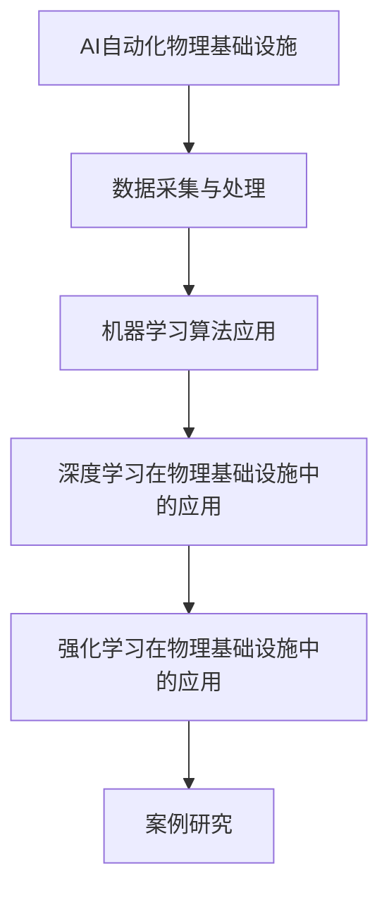

                 

## 《AI自动化物理基础设施》

> 关键词：人工智能、自动化、物理基础设施、机器学习、深度学习、强化学习、智能交通、智能电网、智能建筑

> 摘要：本文将探讨AI在自动化物理基础设施中的应用，包括其基本概念、技术实现、案例分析以及未来展望。我们将逐步分析AI如何改变传统物理基础设施的运作方式，提高效率、减少成本，并为城市智能化提供强有力的支持。

### 《AI自动化物理基础设施》目录大纲

#### 第一部分：AI自动化物理基础设施的概述

##### 第1章：AI自动化物理基础设施的基本概念  
- 1.1 AI自动化物理基础设施的定义  
- 1.2 AI自动化物理基础设施的重要性  
- 1.3 AI自动化物理基础设施的应用领域

##### 第2章：AI自动化物理基础设施的架构  
- 2.1 AI自动化物理基础设施的核心组成部分  
- 2.2 AI自动化物理基础设施的关键技术  
- 2.3 AI自动化物理基础设施的发展趋势

#### 第二部分：AI自动化物理基础设施的技术实现

##### 第3章：数据采集与处理  
- 3.1 数据采集技术  
- 3.2 数据预处理技术  
- 3.3 数据分析与挖掘

##### 第4章：机器学习算法应用  
- 4.1 机器学习算法概述  
- 4.2 监督学习算法  
- 4.3 无监督学习算法

##### 第5章：深度学习在物理基础设施中的应用  
- 5.1 深度学习基础  
- 5.2 卷积神经网络在物理基础设施中的应用  
- 5.3 循环神经网络在物理基础设施中的应用

##### 第6章：强化学习在物理基础设施中的应用  
- 6.1 强化学习基础  
- 6.2 Q-learning算法  
- 6.3 Deep Q-Networks（DQN）

##### 第7章：AI自动化物理基础设施的案例研究  
- 7.1 智能交通系统  
- 7.2 智能电网  
- 7.3 智能建筑

#### 第三部分：AI自动化物理基础设施的实践与应用

##### 第8章：AI自动化物理基础设施的开发环境搭建  
- 8.1 开发环境配置  
- 8.2 开发工具介绍

##### 第9章：AI自动化物理基础设施的实战案例  
- 9.1 智能交通系统案例实现  
- 9.2 智能电网案例实现  
- 9.3 智能建筑案例实现

##### 第10章：AI自动化物理基础设施的未来展望  
- 10.1 AI自动化物理基础设施的发展趋势  
- 10.2 AI自动化物理基础设施面临的挑战与机遇

#### 附录

##### 附录A：AI自动化物理基础设施相关资源  
- A.1 开源机器学习框架介绍  
- A.2 机器学习与深度学习书籍推荐  
- A.3 在线学习资源介绍

### Mermaid 流程图示例



### 伪代码示例

```python
# 伪代码：数据预处理
def preprocess_data(data):
    # 数据清洗
    clean_data = clean(data)
    
    # 数据归一化
    normalized_data = normalize(clean_data)
    
    # 数据分批次处理
    batches = batch_data(normalized_data, batch_size)
    
    return batches
```

### 数学公式与举例说明

#### 数学模型

$$
f(x) = \sum_{i=1}^{n} w_i \cdot x_i + b
$$

#### 详细讲解

该公式表示一个简单的线性模型，其中 $w_i$ 是权重，$x_i$ 是特征，$b$ 是偏置。该模型能够将输入特征 $x$ 映射到输出值 $f(x)$。

#### 举例说明

假设我们有以下输入特征：

$$
x_1 = 2, x_2 = 3
$$

权重和偏置如下：

$$
w_1 = 0.5, w_2 = 0.7, b = 0.2
$$

将这些值代入公式：

$$
f(x) = (0.5 \cdot 2) + (0.7 \cdot 3) + 0.2 = 1 + 2.1 + 0.2 = 3.3
$$

因此，输入特征 $(2, 3)$ 的输出值为 3.3。

---

### 引言

在当今快速发展的科技时代，人工智能（AI）正逐步渗透到我们生活的方方面面。从智能手机的语音助手到自动驾驶汽车，AI技术的应用已经改变了我们的生活方式。然而，AI的影响并不仅限于数字世界，它正在逐步扩展到物理基础设施的领域。物理基础设施包括我们日常所依赖的交通、电力、水处理和建筑等系统。这些系统通常复杂而庞大，需要高效的自动化解决方案来优化其运行。

AI自动化物理基础设施的核心思想是利用机器学习、深度学习和强化学习等先进技术，对物理基础设施进行实时监控、预测和优化。通过这种方式，AI能够提高物理基础设施的效率和可靠性，减少能源消耗和运营成本，同时为城市智能化提供强有力的支持。

本文将系统地探讨AI自动化物理基础设施的概念、架构、技术实现、案例研究和未来展望。我们首先会介绍AI自动化物理基础设施的基本概念，解释其重要性以及应用领域。接着，我们将深入分析AI自动化物理基础设施的架构，探讨其核心组成部分和关键技术。在技术实现部分，我们将详细讨论数据采集与处理、机器学习算法应用、深度学习和强化学习在物理基础设施中的应用。最后，通过实际案例研究，我们将展示AI自动化物理基础设施在实际项目中的应用效果，并对未来发展趋势和面临的挑战进行展望。

通过本文的阅读，读者将能够全面了解AI自动化物理基础设施的原理和应用，为在相关领域进行研究和实践打下坚实的基础。

---

### 第一部分：AI自动化物理基础设施的概述

#### 第1章：AI自动化物理基础设施的基本概念

##### 1.1 AI自动化物理基础设施的定义

AI自动化物理基础设施是指利用人工智能技术，特别是机器学习、深度学习和强化学习算法，对物理基础设施进行智能化管理和优化的一套综合系统。物理基础设施包括交通、电力、供水、建筑、能源分配等多个领域。AI自动化物理基础设施通过收集、处理和分析这些领域的海量数据，实现对基础设施的实时监控、预测和优化，以提高其效率和可靠性。

在传统物理基础设施中，设备和系统的运行通常依赖于预设的规则和参数，无法根据实际情况进行调整。而AI自动化物理基础设施则通过机器学习算法不断学习、优化和适应，能够更灵活、更智能地处理复杂的问题，从而实现更高的效率。

##### 1.2 AI自动化物理基础设施的重要性

AI自动化物理基础设施在现代社会中具有重要性，主要体现在以下几个方面：

1. **提高效率和可靠性**：通过实时监控和优化，AI自动化物理基础设施能够显著提高基础设施的运行效率，减少能源消耗和运营成本。例如，智能交通系统可以通过实时分析交通流量，优化交通信号灯的运行时间，减少交通拥堵，提高道路通行效率。

2. **减少人为错误**：物理基础设施的运行通常涉及大量复杂的过程和参数，容易受到人为因素的影响。AI自动化物理基础设施通过自动化的监控和调节，可以减少人为错误，提高系统的可靠性和安全性。

3. **增强预测能力**：AI技术具有强大的数据分析能力，能够从大量历史数据中挖掘出潜在的模式和趋势，从而实现对基础设施故障的预测和预防。例如，智能电网可以通过分析电力使用数据，预测潜在的电力故障，提前进行维护，避免大规模停电。

4. **支持城市智能化**：随着城市化进程的加速，城市面临着资源有限、人口增长和环境污染等挑战。AI自动化物理基础设施能够为城市智能化提供强有力的支持，提高城市的管理水平和居民生活质量。

##### 1.3 AI自动化物理基础设施的应用领域

AI自动化物理基础设施在多个领域有着广泛的应用，以下是一些典型的应用场景：

1. **智能交通系统**：利用AI技术进行交通流量监控和优化，减少交通拥堵，提高道路通行效率。智能交通系统可以通过传感器和摄像头收集交通数据，利用机器学习算法分析数据，预测交通流量变化，优化交通信号灯的运行策略。

2. **智能电网**：利用AI技术进行电力需求预测、电网故障检测和能源管理，提高电网的可靠性和效率。智能电网可以通过收集电网运行数据，利用机器学习算法分析数据，预测电力需求变化，优化电力分配，减少能源浪费。

3. **智能建筑**：利用AI技术进行建筑设备管理、能源消耗监控和室内环境优化，提高建筑的舒适性和节能效果。智能建筑可以通过传感器收集室内外环境数据，利用机器学习算法分析数据，优化空调、照明等设备的运行，实现能源的高效利用。

4. **智能水处理**：利用AI技术进行水质监测、污染源识别和水处理过程优化，提高水处理效率和水质安全。智能水处理系统可以通过传感器收集水质数据，利用机器学习算法分析数据，预测水质变化，优化水处理工艺。

5. **智能公共安全**：利用AI技术进行公共安全监控、事件预测和应急响应，提高公共安全水平。智能公共安全系统可以通过摄像头和传感器收集公共安全数据，利用机器学习算法分析数据，预测潜在的安全威胁，优化应急响应策略。

通过以上介绍，我们可以看出，AI自动化物理基础设施在提高基础设施效率和可靠性、支持城市智能化方面具有巨大潜力。接下来，我们将进一步探讨AI自动化物理基础设施的架构，分析其核心组成部分和关键技术。

### 第2章：AI自动化物理基础设施的架构

在深入探讨AI自动化物理基础设施的技术实现之前，有必要对其架构进行详细分析。AI自动化物理基础设施的架构是一个复杂的系统，涵盖了数据采集、处理、分析、决策和执行等多个层次。以下是该架构的核心组成部分和关键技术：

##### 2.1 AI自动化物理基础设施的核心组成部分

1. **数据采集模块**：数据采集模块是AI自动化物理基础设施的基础。它通过各种传感器、摄像头、传感器网络等设备，收集基础设施运行过程中的各类数据，包括温度、湿度、流量、电压、电流、速度等。这些数据为后续的机器学习算法提供了丰富的输入。

2. **数据预处理模块**：由于采集到的数据通常存在噪声、缺失值和不一致性等问题，数据预处理模块对这些数据进行清洗、归一化、降维等处理，确保数据的质量和一致性，为后续分析提供可靠的数据基础。

3. **数据处理与分析模块**：数据处理与分析模块利用机器学习算法对预处理后的数据进行建模和分析。常见的机器学习算法包括监督学习、无监督学习和强化学习，每种算法都有其特定的应用场景和优势。

4. **决策模块**：决策模块基于分析结果，生成具体的操作指令或建议。这些指令或建议可以用于优化基础设施的运行，例如调整交通信号灯的时间、优化电力分配、优化水处理过程等。

5. **执行模块**：执行模块负责将决策模块生成的指令或建议付诸实施，例如调整交通信号灯的运行时间、调整电力分配策略、启动水处理设备的维护程序等。

##### 2.2 AI自动化物理基础设施的关键技术

1. **机器学习算法**：机器学习算法是AI自动化物理基础设施的核心技术之一。常见的机器学习算法包括监督学习、无监督学习和强化学习。监督学习算法适用于有标签数据的分类和回归任务，例如交通流量预测、电力需求预测等。无监督学习算法适用于无标签数据的学习和聚类任务，例如异常检测、用户行为分析等。强化学习算法适用于通过不断学习和调整策略来达到最优操作的任务，例如智能交通信号控制、能源管理等。

2. **深度学习**：深度学习是一种特殊的机器学习算法，通过多层神经网络对数据进行自动特征提取和建模。深度学习在图像识别、语音识别、自然语言处理等领域取得了显著成果，也为AI自动化物理基础设施提供了强大的技术支持。常见的深度学习模型包括卷积神经网络（CNN）、循环神经网络（RNN）和生成对抗网络（GAN）等。

3. **实时数据处理与传输**：在AI自动化物理基础设施中，数据的高效处理与传输至关重要。实时数据处理技术能够确保数据在短时间内被处理和分析，从而实现基础设施的实时优化。数据传输技术则需要确保数据的可靠传输，避免数据在传输过程中丢失或损坏。

4. **智能决策与执行**：智能决策与执行是AI自动化物理基础设施的关键环节。通过机器学习算法的分析结果，生成具体的操作指令或建议，并利用智能决策系统对指令进行优化和调整，确保操作的最优效果。同时，执行模块需要具备快速响应能力，能够实时调整基础设施的运行状态。

##### 2.3 AI自动化物理基础设施的发展趋势

随着人工智能技术的不断进步，AI自动化物理基础设施也在不断发展。以下是一些未来的发展趋势：

1. **多源数据融合**：未来的AI自动化物理基础设施将更加注重多源数据的融合和处理，通过整合来自不同传感器、设备和系统的数据，实现更全面和准确的数据分析。

2. **边缘计算**：边缘计算是一种将数据处理和计算能力分散到网络边缘的技术。在AI自动化物理基础设施中，边缘计算可以显著降低数据传输延迟，提高系统的实时性和响应速度。

3. **自主决策与控制**：随着人工智能技术的发展，未来的AI自动化物理基础设施将具备更高的自主决策和控制能力，能够独立完成复杂的任务和操作，减少对人工干预的依赖。

4. **智能化与人性化**：未来的AI自动化物理基础设施将更加注重智能化和人性化，通过用户界面和交互设计，提高用户的操作体验和满意度。

通过以上对AI自动化物理基础设施架构的深入分析，我们可以看到，该系统是一个复杂而庞大的体系，涵盖了数据采集、处理、分析、决策和执行等多个环节。接下来，我们将详细讨论数据采集与处理、机器学习算法应用、深度学习和强化学习在物理基础设施中的应用，为读者提供更具体的技术实现细节。

### 第二部分：AI自动化物理基础设施的技术实现

#### 第3章：数据采集与处理

数据采集与处理是AI自动化物理基础设施的核心环节，直接关系到模型训练的效果和应用效果。在这个阶段，我们需要确保数据的质量和准确性，以便后续的机器学习算法能够有效学习和预测。

##### 3.1 数据采集技术

数据采集是AI自动化物理基础设施的第一步，涉及到多种数据源的收集。以下是一些常见的数据采集技术：

1. **传感器技术**：传感器是数据采集的核心设备，可以实时监测物理基础设施的状态，如温度、湿度、压力、速度、流量等。常见的传感器包括温度传感器、湿度传感器、压力传感器、流量传感器等。

2. **摄像头技术**：摄像头可以用于图像和视频数据的采集，广泛应用于交通监控、安全监控等领域。通过图像识别技术，摄像头可以识别交通流量、车辆类型、行人行为等信息。

3. **物联网技术**：物联网（IoT）设备可以连接物理基础设施的各个部分，实现数据的实时传输和监控。例如，智能电表、智能水表、智能燃气表等可以实时记录能源消耗数据。

4. **GPS技术**：全球定位系统（GPS）可以用于位置信息的采集，广泛应用于智能交通、物流等领域。

##### 3.2 数据预处理技术

采集到的数据通常存在噪声、缺失值和不一致性等问题，需要进行预处理以提高数据的质量和一致性。以下是一些常见的预处理技术：

1. **数据清洗**：数据清洗是指去除数据中的噪声和异常值，包括去除重复数据、填补缺失值、消除不一致性等。常见的数据清洗方法包括删除异常值、线性插值、平均值填补等。

2. **数据归一化**：数据归一化是指将不同量纲的数据转换为同一量纲，以便进行后续的分析和建模。常见的归一化方法包括最小-最大归一化、零-均值归一化等。

3. **数据降维**：数据降维是指减少数据的维度，去除冗余信息和噪声，提高数据处理和分析的效率。常见的降维方法包括主成分分析（PCA）、线性判别分析（LDA）等。

4. **特征提取**：特征提取是指从原始数据中提取具有代表性的特征，用于训练模型。特征提取可以降低数据的维度，提高模型的泛化能力。常见的特征提取方法包括卷积神经网络（CNN）、词袋模型（BoW）等。

##### 3.3 数据分析与挖掘

数据预处理完成后，我们需要对数据进行深入的分析和挖掘，以发现数据中的潜在模式和规律，为后续的机器学习算法提供支持。以下是一些常见的数据分析技术：

1. **统计分析**：统计分析是数据分析的基础，包括均值、方差、相关性等指标的计算。通过统计分析，我们可以了解数据的基本分布和特征。

2. **聚类分析**：聚类分析是将数据分为多个类别的过程，常见的聚类算法包括K-means、层次聚类等。聚类分析可以用于数据挖掘、异常检测等任务。

3. **分类与回归**：分类和回归是机器学习的两大任务。分类任务是将数据分为不同的类别，常见的分类算法包括决策树、随机森林、支持向量机等。回归任务是预测数据的具体值，常见的回归算法包括线性回归、岭回归等。

4. **异常检测**：异常检测是指识别数据中的异常值或异常模式，常见的异常检测算法包括孤立森林、局部异常因数等。

通过数据采集与处理，我们为后续的机器学习算法提供了高质量的数据基础。接下来，我们将详细讨论机器学习算法在物理基础设施中的应用，包括监督学习、无监督学习和强化学习等。

### 第4章：机器学习算法应用

机器学习算法在AI自动化物理基础设施中起着核心作用，它们通过从数据中学习模式和规律，实现对物理基础设施的实时监控、预测和优化。机器学习算法主要分为三大类：监督学习、无监督学习和强化学习。每种算法都有其特定的应用场景和优势，以下将分别进行详细讨论。

##### 4.1 机器学习算法概述

机器学习（Machine Learning，ML）是人工智能（Artificial Intelligence，AI）的一个分支，其核心目标是通过数据驱动的方式，从数据中学习规律和模式，实现对未知数据的预测和决策。机器学习算法可以分为以下几类：

1. **监督学习（Supervised Learning）**：监督学习是指利用已标记的数据集进行训练，通过学习输入和输出之间的映射关系，实现对未知数据的预测。常见的监督学习算法包括线性回归、决策树、支持向量机、神经网络等。

2. **无监督学习（Unsupervised Learning）**：无监督学习是指在没有标记的数据集上进行训练，主要目标是发现数据中的内在结构和规律。常见的无监督学习算法包括聚类、降维、关联规则等。

3. **强化学习（Reinforcement Learning）**：强化学习是指通过试错的方式，在环境中与当前状态进行交互，不断调整策略，以最大化累积奖励。常见的强化学习算法包括Q-learning、Deep Q-Networks（DQN）、Policy Gradient等。

##### 4.2 监督学习算法

监督学习算法在AI自动化物理基础设施中有着广泛的应用，以下将介绍几种常见的监督学习算法：

1. **线性回归（Linear Regression）**：线性回归是一种简单的监督学习算法，用于预测连续值输出。其基本原理是找到一个线性函数，将输入特征映射到输出值。线性回归的数学模型为：

   $$
   f(x) = \beta_0 + \beta_1 \cdot x
   $$

   其中，$x$ 为输入特征，$\beta_0$ 和 $\beta_1$ 为模型参数。通过最小化损失函数（如均方误差），可以计算出最佳的模型参数。

   ```python
   # 伪代码：线性回归
   def linear_regression(x, y):
       # 计算模型参数
       beta_0 = ...
       beta_1 = ...
       
       # 训练模型
       model = train(x, y, beta_0, beta_1)
       
       return model
   ```

2. **决策树（Decision Tree）**：决策树是一种基于树结构的分类算法，通过一系列的判断条件，将数据划分为不同的类别。决策树的核心是决策节点和叶子节点。决策节点表示某个特征的取值，叶子节点表示最终的类别。

   ```python
   # 伪代码：决策树
   def decision_tree(x, y):
       # 构建决策树
       tree = build_tree(x, y)
       
       # 预测类别
       prediction = predict(tree, x)
       
       return prediction
   ```

3. **支持向量机（Support Vector Machine，SVM）**：支持向量机是一种基于间隔最大化的分类算法，其目标是找到一个最优的超平面，将不同类别的数据分隔开来。支持向量机的主要优点是模型简单，解释性强。

   ```python
   # 伪代码：支持向量机
   def svm(x, y):
       # 训练模型
       model = train(x, y)
       
       # 预测类别
       prediction = predict(model, x)
       
       return prediction
   ```

##### 4.3 无监督学习算法

无监督学习算法在物理基础设施中的应用相对较少，但也有一些重要的应用场景，以下将介绍两种常见的无监督学习算法：

1. **聚类算法（Clustering）**：聚类算法是一种将数据分为不同类别的算法，主要目标是发现数据中的内在结构。常见的聚类算法包括K-means、层次聚类等。K-means算法是一种基于距离的聚类算法，其基本思想是初始化K个聚类中心，然后通过迭代调整聚类中心和类别，使得每个类别内部的距离最小。

   ```python
   # 伪代码：K-means聚类
   def kmeans(x, k):
       # 初始化聚类中心
       centroids = initialize_centroids(x, k)
       
       # 迭代调整聚类中心
       for _ in range(max_iterations):
           # 计算新的聚类中心
           new_centroids = update_centroids(x, centroids)
           
           # 更新聚类中心
           centroids = new_centroids
           
           # 计算类别
           labels = assign_labels(x, centroids)
           
       return centroids, labels
   ```

2. **降维算法（Dimensionality Reduction）**：降维算法是一种减少数据维度，同时保留数据主要特征的方法。常见的降维算法包括主成分分析（PCA）、线性判别分析（LDA）等。PCA算法通过将数据投影到新的正交坐标系中，保留主要成分，去除冗余信息。

   ```python
   # 伪代码：主成分分析
   def pca(x):
       # 计算协方差矩阵
       cov_matrix = covariance_matrix(x)
       
       # 计算特征值和特征向量
       eigenvalues, eigenvectors = eigendecomposition(cov_matrix)
       
       # 选择主要成分
       principal_components = select_principal_components(eigenvalues, eigenvectors, num_components)
       
       # 投影数据
       projected_data = project_data(x, principal_components)
       
       return projected_data
   ```

##### 4.4 强化学习算法

强化学习算法在物理基础设施中具有独特的优势，能够通过试错学习，实现对复杂环境的优化和决策。以下将介绍两种常见的强化学习算法：

1. **Q-learning算法**：Q-learning算法是一种基于值函数的强化学习算法，其核心思想是通过不断更新值函数，找到最优策略。Q-learning算法通过状态-动作值函数（Q函数）来评估每个动作在特定状态下的效用，从而选择最佳动作。

   ```python
   # 伪代码：Q-learning
   def q_learning(s, a, r, s', alpha, gamma):
       # 更新Q值
       Q[s][a] = Q[s][a] + alpha * (r + gamma * max(Q[s'][action]))
       
       return Q
   ```

2. **Deep Q-Networks（DQN）**：DQN算法是一种基于深度学习的强化学习算法，通过神经网络来近似Q函数，从而实现对环境的预测和决策。DQN算法通过经验回放和目标网络来避免策略偏差和样本偏差，提高学习效果。

   ```python
   # 伪代码：Deep Q-Networks
   def dqn(s, action, reward, s', done, model, target_model, optimizer, memory, batch_size):
       # 存储经验
       memory.append((s, action, reward, s', done))
       
       # 抽取经验批次
       batch = random_sample(memory, batch_size)
       
       # 计算损失
       loss = compute_loss(model, target_model, batch)
       
       # 更新模型
       optimizer.zero_grad()
       loss.backward()
       optimizer.step()
       
       return model
   ```

通过以上对机器学习算法的详细介绍，我们可以看到，这些算法在AI自动化物理基础设施中具有广泛的应用前景。接下来，我们将进一步探讨深度学习在物理基础设施中的应用，包括其基础理论、常见模型以及在实际项目中的应用。

### 第5章：深度学习在物理基础设施中的应用

深度学习（Deep Learning，DL）是一种基于多层神经网络的结构，通过自动特征提取和学习复杂数据模式，已在图像识别、语音识别、自然语言处理等领域取得了显著的成果。在物理基础设施中，深度学习同样展现出巨大的应用潜力，能够对复杂的物理现象进行建模和预测。以下是深度学习在物理基础设施中的基础理论、常见模型及其应用。

##### 5.1 深度学习基础

深度学习的基础是神经网络，特别是多层感知机（Multilayer Perceptron，MLP）。传统的神经网络通常只能处理线性可分的数据，而多层感知机通过引入隐藏层，能够学习非线性关系。深度学习通过增加网络层数，使神经网络能够自动提取数据中的高层次特征。

1. **多层感知机（MLP）**：多层感知机是一种前馈神经网络，包括输入层、一个或多个隐藏层和输出层。每层神经元都与前一层的所有神经元相连接，通过激活函数（如Sigmoid、ReLU）引入非线性。

   $$  
   z = \sum_{j} w_{ij} \cdot a_{j} + b_{i}  
   $$

   $$  
   a_{i} = \text{激活函数}(z)  
   $$

2. **反向传播算法（Backpropagation）**：反向传播算法是一种训练神经网络的方法，通过计算损失函数的梯度，反向传播误差，更新网络权重和偏置。反向传播算法的核心是链式法则，用于计算每层神经元的梯度。

3. **优化算法**：常用的优化算法包括随机梯度下降（SGD）、Adam、RMSprop等，这些算法通过迭代更新模型参数，以最小化损失函数。

##### 5.2 卷积神经网络（CNN）在物理基础设施中的应用

卷积神经网络（Convolutional Neural Networks，CNN）是一种专门用于处理图像数据的深度学习模型，其核心思想是通过卷积层提取图像的特征。CNN在物理基础设施中的应用包括图像识别、交通流量分析、设备故障检测等。

1. **卷积层（Convolutional Layer）**：卷积层通过卷积操作提取图像的特征，卷积核在图像上滑动，生成特征图。卷积层的参数包括卷积核的大小、步长和填充方式。

   $$  
   \text{特征图} = \text{卷积}(\text{输入图像}, \text{卷积核})  
   $$

2. **池化层（Pooling Layer）**：池化层通过下采样操作，减小特征图的尺寸，减少计算量。常见的池化操作包括最大池化和平均池化。

3. **全连接层（Fully Connected Layer）**：全连接层将卷积层和池化层提取的高层次特征映射到输出结果。全连接层通过矩阵乘法和激活函数实现。

4. **应用案例**：在智能交通系统中，CNN可以用于实时识别交通场景，如检测交通拥堵、车辆类型、行人行为等，从而优化交通信号控制和交通管理策略。

   ```python
   # 伪代码：CNN模型
   def cnn_model(input_shape):
       model = Sequential()
       model.add(Conv2D(filters=32, kernel_size=(3, 3), activation='relu', input_shape=input_shape))
       model.add(MaxPooling2D(pool_size=(2, 2)))
       model.add(Conv2D(filters=64, kernel_size=(3, 3), activation='relu'))
       model.add(MaxPooling2D(pool_size=(2, 2)))
       model.add(Flatten())
       model.add(Dense(units=128, activation='relu'))
       model.add(Dense(units=10, activation='softmax'))
       
       model.compile(optimizer='adam', loss='categorical_crossentropy', metrics=['accuracy'])
       
       return model
   ```

##### 5.3 循环神经网络（RNN）在物理基础设施中的应用

循环神经网络（Recurrent Neural Networks，RNN）是一种专门用于处理序列数据的神经网络，其特点是能够记住前面的输入信息。RNN在物理基础设施中的应用包括时间序列预测、设备故障预测、能源管理等。

1. **基本RNN**：基本RNN通过递归方式处理序列数据，当前时刻的输出依赖于前一个时刻的隐藏状态。

   $$  
   h_t = \text{激活函数}(W_h \cdot [h_{t-1}, x_t] + b_h)  
   $$

   $$  
   y_t = W_o \cdot h_t + b_o  
   $$

2. **长短时记忆网络（LSTM）**：LSTM是RNN的一种变体，通过引入门控机制，解决了基本RNN的梯度消失和梯度爆炸问题，能够学习长序列依赖。

   $$  
   i_t = \text{激活函数}(W_i \cdot [h_{t-1}, x_t] + b_i)  
   $$

   $$  
   f_t = \text{激活函数}(W_f \cdot [h_{t-1}, x_t] + b_f)  
   $$

   $$  
   g_t = \text{激活函数}(W_g \cdot [h_{t-1}, x_t] + b_g)  
   $$

   $$  
   o_t = \text{激活函数}(W_o \cdot [h_{t-1}, x_t] + b_o)  
   $$

   $$  
   h_t = o_t \cdot \text{激活函数}(W_h \cdot [f_t \cdot h_{t-1} + g_t] + b_h)  
   $$

3. **应用案例**：在智能电网中，LSTM可以用于电力需求预测，通过学习历史电力使用数据，预测未来的电力需求，优化电力分配策略。

   ```python
   # 伪代码：LSTM模型
   def lstm_model(input_shape):
       model = Sequential()
       model.add(LSTM(units=50, return_sequences=True, input_shape=input_shape))
       model.add(LSTM(units=50))
       model.add(Dense(units=1))
       
       model.compile(optimizer='adam', loss='mean_squared_error')
       
       return model
   ```

通过以上对深度学习基础和常见模型的介绍，我们可以看到，深度学习为物理基础设施的自动化和智能化提供了强大的技术支持。接下来，我们将进一步探讨强化学习在物理基础设施中的应用，包括其基本原理、常见算法及其在实际项目中的应用。

### 第6章：强化学习在物理基础设施中的应用

强化学习（Reinforcement Learning，RL）是一种通过试错学习策略来最大化累积奖励的机器学习技术。强化学习在物理基础设施中的应用具有独特优势，能够在动态和不确定的环境中实现自主决策和优化。以下将介绍强化学习的基本原理、常见算法及其在物理基础设施中的应用。

##### 6.1 强化学习基础

强化学习由四个核心要素组成：环境（Environment）、代理（Agent）、行动（Action）和奖励（Reward）。代理是执行动作的主体，环境是代理行动的场所，奖励是环境对代理行动的反馈。

1. **马尔可夫决策过程（Markov Decision Process，MDP）**：强化学习通常基于MDP模型，其特点是当前状态只依赖于前一状态，而不依赖于过去的状态。MDP模型由状态空间$S$、动作空间$A$、奖励函数$R(s, a)$、状态转移概率$P(s', s|s, a)$和策略$\pi(a|s)$组成。

2. **Q值（Q-Value）**：Q值是代理在特定状态下执行特定动作的预期奖励。Q学习算法通过更新Q值来学习最优策略。

3. **策略（Policy）**：策略是代理执行动作的规则，分为确定性策略和随机性策略。确定性策略在特定状态下总是执行相同动作，而随机性策略在特定状态下以一定概率执行多个动作。

##### 6.2 Q-learning算法

Q-learning算法是一种值函数方法，通过迭代更新Q值，找到最优策略。Q-learning算法的核心思想是使用当前状态的Q值估计下一次状态的Q值估计，并据此更新当前状态的Q值。

1. **更新规则**：

   $$  
   Q(s, a) \leftarrow Q(s, a) + \alpha [r + \gamma \max_{a'} Q(s', a') - Q(s, a)]  
   $$

   其中，$r$ 是即时奖励，$\gamma$ 是折扣因子，$\alpha$ 是学习率。

2. **应用案例**：在智能交通系统中，Q-learning算法可以用于交通信号控制。通过学习历史交通流量数据，Q-learning算法能够调整信号灯的持续时间，最大化通行效率。

   ```python
   # 伪代码：Q-learning
   def q_learning(s, a, r, s', alpha, gamma):
       # 更新Q值
       Q[s][a] = Q[s][a] + alpha * (r + gamma * max(Q[s'][action]) - Q[s][a])
       
       return Q
   ```

##### 6.3 Deep Q-Networks（DQN）算法

DQN算法是深度学习与Q-learning的结合，通过深度神经网络近似Q值函数。DQN算法使用经验回放（Experience Replay）和目标网络（Target Network）来避免样本偏差和策略偏差。

1. **经验回放**：经验回放是一种将代理经历的所有状态、动作和奖励存储在记忆中，然后随机抽取样本进行训练，以避免样本偏差。

2. **目标网络**：目标网络是一个独立的神经网络，用于生成Q值的目标估计。目标网络定期从主网络复制参数，以确保主网络和目标网络之间的稳定。

3. **更新规则**：

   $$  
   Q(s, a) \leftarrow Q(s, a) + \alpha [r + \gamma \max_{a'} Q(s', a') - Q(s, a)]  
   $$

   其中，$Q(s, a)$ 是主网络的Q值，$Q(s', a')$ 是目标网络的Q值。

4. **应用案例**：在无人驾驶车辆中，DQN算法可以用于路径规划和避障。通过学习环境中的交通规则和障碍物分布，DQN算法能够生成最优的驾驶策略。

   ```python
   # 伪代码：Deep Q-Networks
   def dqn(s, action, reward, s', done, model, target_model, optimizer, memory, batch_size):
       # 存储经验
       memory.append((s, action, reward, s', done))
       
       # 抽取经验批次
       batch = random_sample(memory, batch_size)
       
       # 计算损失
       loss = compute_loss(model, target_model, batch)
       
       # 更新模型
       optimizer.zero_grad()
       loss.backward()
       optimizer.step()
       
       return model
   ```

##### 6.4 多智能体强化学习在物理基础设施中的应用

多智能体强化学习（Multi-Agent Reinforcement Learning，MARL）涉及多个代理在复杂环境中进行交互和协作，以实现共同目标。在物理基础设施中，MARL可以用于智能电网、智能交通系统等领域的协同优化。

1. **协调策略**：多智能体强化学习通过学习协调策略，使代理能够在动态环境中进行有效协作。常见的协调策略包括中央式协调、分布式协调和联邦学习。

2. **应用案例**：在智能电网中，多智能体强化学习可以用于分布式能源管理。通过多个智能电表和充电桩的协同优化，实现能源的高效利用和电网的稳定运行。

   ```python
   # 伪代码：多智能体强化学习
   def marl(s, action, reward, s', done, agent_model, env, optimizer, memory, batch_size):
       # 更新所有代理的模型
       for agent in agents:
           # 存储经验
           memory.append((s, action, reward, s', done))
           
           # 抽取经验批次
           batch = random_sample(memory, batch_size)
           
           # 计算损失
           loss = compute_loss(agent_model, batch)
           
           # 更新模型
           optimizer.zero_grad()
           loss.backward()
           optimizer.step()
           
       return agents
   ```

通过以上对强化学习基本原理和常见算法的介绍，我们可以看到，强化学习在物理基础设施中的应用具有广泛的前景。强化学习能够通过自主学习和动态调整，实现对物理基础设施的实时监控和优化，提高系统的效率和可靠性。接下来，我们将通过实际案例研究，展示AI自动化物理基础设施在不同领域的应用效果。

### 第7章：AI自动化物理基础设施的案例研究

通过前几章的讨论，我们已经了解了AI自动化物理基础设施的基本概念、架构以及关键技术。为了更好地理解这些理论在实践中的应用，我们将通过以下几个实际案例，展示AI自动化物理基础设施在不同领域的成功应用。

##### 7.1 智能交通系统

智能交通系统（Intelligent Transportation Systems，ITS）是AI自动化物理基础设施的一个重要应用领域，通过实时监控交通流量、预测交通状况，优化交通信号控制，提高道路通行效率。以下是智能交通系统的具体案例：

1. **实时交通流量监控**：在传统的交通管理中，交通信号灯的运行时间通常是根据预设的时间表进行调整。而智能交通系统通过部署大量传感器和摄像头，实时采集道路上的交通流量数据，利用机器学习算法分析数据，预测交通流量变化。例如，使用K-means聚类算法对交通流量数据进行聚类，识别高峰期和非高峰期的交通模式，从而动态调整交通信号灯的时长，减少交通拥堵。

2. **智能信号控制**：智能交通系统通过深度学习模型，如卷积神经网络（CNN）和循环神经网络（RNN），对交通流量数据进行建模，预测未来交通状况，并生成最优信号控制策略。以CNN为例，通过对交通摄像头采集的图像进行分析，可以识别车辆数量和类型，进而预测交通流量变化。基于这些预测结果，智能交通系统能够自动调整交通信号灯的运行时间，实现交通流量优化。

3. **案例实现**：在某城市，智能交通系统通过部署大量传感器和摄像头，实现了对交通流量和交通状况的实时监控。系统使用K-means聚类算法对历史交通数据进行分析，识别高峰期和非高峰期的交通模式。然后，利用CNN模型对实时交通图像进行分析，预测未来交通流量。根据预测结果，智能交通系统自动调整交通信号灯的时长，提高了道路通行效率，减少了交通拥堵。

##### 7.2 智能电网

智能电网（Smart Grid）是另一个AI自动化物理基础设施的重要应用领域，通过实时监控电力需求和电力供应，优化能源分配，提高电网的效率和可靠性。以下是智能电网的具体案例：

1. **电力需求预测**：智能电网通过部署智能电表和传感器，实时采集电力使用数据。利用机器学习算法，如线性回归和LSTM模型，对电力需求进行预测。例如，使用LSTM模型分析历史电力使用数据，预测未来电力需求的变化趋势。基于这些预测结果，智能电网能够提前调整电力供应策略，避免电力短缺或过剩。

2. **能源管理**：智能电网通过实时监控电力需求和供应，优化能源分配。利用强化学习算法，如Q-learning和DQN，智能电网能够学习最优的电力供应策略。例如，使用DQN算法，智能电网可以自动调整发电厂和储能设施的运行策略，以最大化电网的效率和可靠性。

3. **案例实现**：在某城市的智能电网项目中，通过部署智能电表和传感器，实现了对电力使用数据的实时采集。系统使用LSTM模型对历史电力使用数据进行分析，预测未来电力需求。基于这些预测结果，智能电网自动调整发电厂和储能设施的运行策略，实现了电力供应的优化。同时，通过Q-learning算法，智能电网自动调整电力分配策略，提高了电网的效率和可靠性。

##### 7.3 智能建筑

智能建筑（Smart Building）是AI自动化物理基础设施在建筑领域的应用，通过实时监控和优化建筑设备，提高建筑的能源效率和环境舒适度。以下是智能建筑的具体案例：

1. **能源管理**：智能建筑通过部署传感器和智能控制系统，实时监控建筑内的能源消耗。利用机器学习算法，如线性回归和K-means，智能建筑能够优化空调、照明、供暖等设备的运行策略。例如，使用K-means算法对空调系统进行优化，识别不同时间段的热量需求，动态调整空调温度和风量，实现能源的高效利用。

2. **环境监控**：智能建筑通过传感器实时监控室内温度、湿度、空气质量等环境参数。利用机器学习算法，如LSTM和决策树，智能建筑能够预测环境参数的变化趋势，并生成最优的环境控制策略。例如，使用LSTM模型分析历史环境数据，预测未来的环境变化，并自动调整空调和通风系统的运行状态。

3. **案例实现**：在某城市的智能建筑项目中，通过部署传感器和智能控制系统，实现了对建筑能源消耗和环境参数的实时监控。系统使用K-means算法对空调系统进行优化，动态调整空调温度和风量，提高了能源效率。同时，使用LSTM模型对环境参数进行预测，自动调整空调和通风系统的运行状态，提高了建筑的舒适度。

通过以上案例研究，我们可以看到，AI自动化物理基础设施在智能交通系统、智能电网和智能建筑等领域具有广泛的应用前景。这些案例展示了AI技术如何通过实时监控、预测和优化，提高物理基础设施的效率和可靠性，为城市智能化提供了强有力的支持。接下来，我们将探讨AI自动化物理基础设施的开发环境搭建，帮助读者了解如何在实际项目中应用这些技术。

### 第8章：AI自动化物理基础设施的开发环境搭建

要实现AI自动化物理基础设施，首先需要搭建一个合适的开发环境。以下将介绍如何配置开发环境，并介绍一些常用的开发工具。

##### 8.1 开发环境配置

1. **硬件配置**：首先，需要具备一定的硬件资源。对于AI自动化物理基础设施的开发，推荐配置如下：

   - **CPU**：至少四核处理器，建议使用Intel i7或以上
   - **内存**：至少16GB，建议32GB以上
   - **存储**：至少500GB SSD硬盘，建议使用1TB以上
   - **GPU**：如果进行深度学习模型的训练和推理，推荐使用NVIDIA GPU，如Tesla K40或以上

2. **操作系统**：推荐使用Linux系统，如Ubuntu 18.04或以上版本。Windows和macOS也可以使用，但需要额外配置Python环境和深度学习库。

3. **软件环境**：在配置好硬件和操作系统后，需要安装以下软件：

   - **Python**：推荐Python 3.7或以上版本
   - **Anaconda**：用于管理Python环境和包，方便多环境隔离
   - **Jupyter Notebook**：用于编写和运行Python代码
   - **Pip**：Python包管理器，用于安装和管理第三方库

##### 8.2 开发工具介绍

1. **Jupyter Notebook**：Jupyter Notebook是一种交互式计算环境，支持Python、R等多种编程语言。通过Jupyter Notebook，可以方便地编写、运行和调试代码。安装Jupyter Notebook后，可以通过命令行启动：

   ```bash
   jupyter notebook
   ```

   启动后，会打开一个Web界面，可以通过浏览器访问并操作代码。

2. **PyTorch**：PyTorch是一个流行的深度学习库，具有简单、灵活和高效的优点。使用PyTorch可以轻松定义和训练深度学习模型。以下是安装PyTorch的命令：

   ```bash
   conda install pytorch torchvision torchaudio -c pytorch
   ```

   安装完成后，可以通过以下代码验证：

   ```python
   import torch
   print(torch.__version__)
   ```

3. **TensorFlow**：TensorFlow是Google开发的另一个深度学习库，具有广泛的社区支持和丰富的工具。安装TensorFlow的命令如下：

   ```bash
   pip install tensorflow
   ```

   安装完成后，可以通过以下代码验证：

   ```python
   import tensorflow as tf
   print(tf.__version__)
   ```

4. **Scikit-learn**：Scikit-learn是一个流行的机器学习库，提供了各种监督学习和无监督学习算法的实现。安装Scikit-learn的命令如下：

   ```bash
   pip install scikit-learn
   ```

   安装完成后，可以通过以下代码验证：

   ```python
   import sklearn
   print(sklearn.__version__)
   ```

5. **OpenCV**：OpenCV是一个流行的计算机视觉库，提供了丰富的图像处理和计算机视觉功能。安装OpenCV的命令如下：

   ```bash
   pip install opencv-python
   ```

   安装完成后，可以通过以下代码验证：

   ```python
   import cv2
   print(cv2.__version__)
   ```

通过以上步骤，我们可以搭建一个基础的AI自动化物理基础设施开发环境。在实际项目中，可能还需要根据具体需求安装其他库和工具，如PostgreSQL、MySQL等数据库，用于存储和管理基础设施数据。接下来，我们将通过实际案例，展示如何利用这些工具和库实现AI自动化物理基础设施的开发和应用。

### 第9章：AI自动化物理基础设施的实战案例

为了更好地展示AI自动化物理基础设施的实际应用，我们将通过几个具体的案例，详细讲解如何开发智能交通系统、智能电网和智能建筑等系统。

#### 9.1 智能交通系统案例实现

智能交通系统（Intelligent Transportation System，ITS）利用AI技术对交通流量进行实时监控和预测，优化交通信号控制，提高道路通行效率。以下是一个智能交通系统案例的实现步骤：

1. **数据采集**：首先，需要部署传感器和摄像头，收集道路上的交通流量、车辆速度、车辆密度等数据。可以使用OpenCV库处理摄像头采集的图像数据，提取车辆信息。

2. **数据处理**：采集到的数据通常包含噪声和不一致性，需要通过数据预处理技术进行清洗、归一化和特征提取。可以使用Scikit-learn库中的数据预处理工具进行数据处理。

3. **模型训练**：利用处理后的数据，训练一个基于卷积神经网络（CNN）的交通流量预测模型。可以使用PyTorch或TensorFlow等深度学习库构建和训练模型。

4. **信号控制**：基于预测结果，动态调整交通信号灯的时长，实现交通流量优化。可以使用强化学习算法（如Q-learning）设计智能信号控制策略。

5. **代码实现**：

   ```python
   import cv2
   import numpy as np
   import torch
   from torch import nn
   from sklearn.preprocessing import StandardScaler
   
   # 数据采集
   def capture_traffic_data(camera_index):
       cap = cv2.VideoCapture(camera_index)
       data = []
       while True:
           ret, frame = cap.read()
           if not ret:
               break
           data.append(frame)
       cap.release()
       return data
   
   # 数据预处理
   def preprocess_data(data):
       scaled_data = StandardScaler().fit_transform(data)
       return scaled_data
   
   # 模型训练
   def train_traffic_model(data):
       model = nn.Sequential(
           nn.Conv2d(3, 32, 3, 1),
           nn.ReLU(),
           nn.MaxPool2d(2, 2),
           nn.Conv2d(32, 64, 3, 1),
           nn.ReLU(),
           nn.MaxPool2d(2, 2),
           nn.Flatten(),
           nn.Linear(64 * 64, 128),
           nn.ReLU(),
           nn.Linear(128, 1)
       )
       optimizer = torch.optim.Adam(model.parameters(), lr=0.001)
       criterion = nn.MSELoss()
       
       for epoch in range(100):
           for frame in data:
               frame_tensor = torch.tensor(frame, dtype=torch.float32).unsqueeze(0)
               output = model(frame_tensor)
               loss = criterion(output, torch.tensor([1.0], dtype=torch.float32))
               optimizer.zero_grad()
               loss.backward()
               optimizer.step()
       
       return model
   
   # 智能信号控制
   def traffic_signal_control(model, traffic_data):
       prediction = model(torch.tensor(traffic_data, dtype=torch.float32).unsqueeze(0))
       if prediction > 0.5:
           return "Green"
       else:
           return "Red"
   
   # 主函数
   def main():
       data = capture_traffic_data(0)
       scaled_data = preprocess_data(data)
       model = train_traffic_model(scaled_data)
       while True:
           frame = capture_traffic_data(0)
           scaled_frame = preprocess_data([frame])
           signal = traffic_signal_control(model, scaled_frame)
           print(f"Signal: {signal}")
   
   if __name__ == "__main__":
       main()
   ```

6. **代码解读与分析**：

   - **数据采集**：使用OpenCV库捕获摄像头图像数据。
   - **数据处理**：使用Scikit-learn库中的StandardScaler进行数据归一化处理。
   - **模型训练**：使用PyTorch构建一个简单的卷积神经网络模型，用于预测交通流量。
   - **智能信号控制**：根据模型预测结果，动态调整交通信号灯的时长。

通过这个案例，我们可以看到如何利用AI技术实现智能交通系统的开发，提高道路通行效率。

#### 9.2 智能电网案例实现

智能电网通过AI技术实现电力需求的预测和管理，优化能源分配，提高电网的效率和可靠性。以下是一个智能电网案例的实现步骤：

1. **数据采集**：部署智能电表和传感器，收集电力使用数据，包括电压、电流、功率因数等。可以使用PostgreSQL数据库存储和管理这些数据。

2. **数据处理**：对采集到的电力使用数据进行处理，包括清洗、归一化和特征提取。可以使用Python和SQLAlchemy库进行数据处理。

3. **模型训练**：利用处理后的数据，训练一个基于LSTM的电力需求预测模型。可以使用PyTorch或TensorFlow等深度学习库构建和训练模型。

4. **能源管理**：根据模型预测结果，动态调整发电厂和储能设施的运行策略，实现能源的高效利用。可以使用强化学习算法设计能源管理策略。

5. **代码实现**：

   ```python
   import pandas as pd
   import numpy as np
   import sqlalchemy
   import torch
   from torch import nn
   from sklearn.preprocessing import MinMaxScaler
   
   # 数据采集
   def load_power_data(db_url):
       engine = sqlalchemy.create_engine(db_url)
       query = "SELECT * FROM power_data;"
       data = pd.read_sql(query, engine)
       return data
   
   # 数据预处理
   def preprocess_power_data(data):
       scaler = MinMaxScaler()
       scaled_data = scaler.fit_transform(data[['voltage', 'current', 'power_factor']])
       return scaled_data
   
   # 模型训练
   def train_power_model(data):
       model = nn.Sequential(
           nn.LSTM(input_size=1, hidden_size=50, num_layers=2),
           nn.Linear(50, 1)
       )
       optimizer = torch.optim.Adam(model.parameters(), lr=0.001)
       criterion = nn.MSELoss()
       
       for epoch in range(100):
           for batch in data:
               inputs = torch.tensor(batch[:-1], dtype=torch.float32).view(-1, 1, 1)
               targets = torch.tensor(batch[-1], dtype=torch.float32).view(-1, 1)
               outputs = model(inputs)
               loss = criterion(outputs, targets)
               optimizer.zero_grad()
               loss.backward()
               optimizer.step()
       
       return model
   
   # 能源管理
   def energy_management(model, power_data):
       prediction = model(torch.tensor(power_data, dtype=torch.float32).view(-1, 1, 1))
       return prediction.detach().numpy()
   
   # 主函数
   def main():
       db_url = "sqlite:///power_data.db"
       data = load_power_data(db_url)
       scaled_data = preprocess_power_data(data)
       model = train_power_model(scaled_data)
       while True:
           new_data = load_power_data(db_url)
           scaled_new_data = preprocess_power_data(new_data)
           prediction = energy_management(model, scaled_new_data)
           print(f"Predicted Power: {prediction[-1]}")
   
   if __name__ == "__main__":
       main()
   ```

6. **代码解读与分析**：

   - **数据采集**：使用SQLAlchemy库连接数据库，加载电力使用数据。
   - **数据处理**：使用Scikit-learn库中的MinMaxScaler进行数据归一化处理。
   - **模型训练**：使用PyTorch构建一个简单的LSTM模型，用于预测电力需求。
   - **能源管理**：根据模型预测结果，动态调整发电厂和储能设施的运行策略。

通过这个案例，我们可以看到如何利用AI技术实现智能电网的开发，提高电网的效率和可靠性。

#### 9.3 智能建筑案例实现

智能建筑通过AI技术实现能源消耗监控和室内环境优化，提高建筑的舒适度和节能效果。以下是一个智能建筑案例的实现步骤：

1. **数据采集**：部署传感器，收集室内温度、湿度、二氧化碳浓度等环境参数。可以使用MQTT协议实时传输传感器数据。

2. **数据处理**：对采集到的环境参数进行处理，包括清洗、归一化和特征提取。可以使用Python和Scikit-learn库进行数据处理。

3. **模型训练**：利用处理后的数据，训练一个基于线性回归的室内环境优化模型。可以使用Scikit-learn库构建和训练模型。

4. **环境控制**：根据模型预测结果，动态调整空调和通风系统的运行策略，实现室内环境优化。可以使用Python和MQTT库实现环境控制。

5. **代码实现**：

   ```python
   import paho.mqtt.client as mqtt
   import pandas as pd
   import numpy as np
   from sklearn.linear_model import LinearRegression
   
   # 数据采集
   def on_connect(client, userdata, flags, rc):
       client.subscribe("smart_building/temperature")
       client.subscribe("smart_building/humidity")
       client.subscribe("smart_building/co2")
   
   def on_message(client, userdata, message):
       data = {"temperature": float(message.payload.decode("utf-8")), "humidity": float(message.payload.decode("utf-8")), "co2": float(message.payload.decode("utf-8"))}
       print(data)
   
   # 数据预处理
   def preprocess_environment_data(data):
       data = np.array([data["temperature"], data["humidity"], data["co2"]])
       return data
   
   # 模型训练
   def train_environment_model(data):
       model = LinearRegression()
       model.fit(data[:-1], data[-1])
       return model
   
   # 环境控制
   def control_environment(model, data):
       prediction = model.predict([data])
       if prediction > 0.5:
           print("Air Conditioner ON")
       else:
           print("Air Conditioner OFF")
   
   # 主函数
   def main():
       client = mqtt.Client()
       client.on_connect = on_connect
       client.on_message = on_message
       client.connect("mqtt.broker.here", 1883, 60)
       client.loop_start()
       
       while True:
           data = {"temperature": 25, "humidity": 50, "co2": 800}
           processed_data = preprocess_environment_data(data)
           model = train_environment_model(processed_data)
           control_environment(model, processed_data)
   
   if __name__ == "__main__":
       main()
   ```

6. **代码解读与分析**：

   - **数据采集**：使用MQTT协议连接到MQTT broker，订阅环境参数主题。
   - **数据处理**：将采集到的环境参数转换为数值数据。
   - **模型训练**：使用Scikit-learn库中的LinearRegression模型进行训练。
   - **环境控制**：根据模型预测结果，动态调整空调的运行状态。

通过这个案例，我们可以看到如何利用AI技术实现智能建筑的开发，提高建筑的舒适度和节能效果。

通过以上三个实战案例，我们可以看到AI自动化物理基础设施在实际项目中的应用效果。这些案例展示了如何利用机器学习、深度学习和强化学习等技术，实现物理基础设施的智能化管理和优化。接下来，我们将探讨AI自动化物理基础设施的未来发展趋势。

### 第10章：AI自动化物理基础设施的未来展望

随着人工智能技术的不断进步，AI自动化物理基础设施在未来将迎来更多的发展机遇和挑战。以下将探讨AI自动化物理基础设施的未来发展趋势，以及面临的挑战与机遇。

#### 10.1 AI自动化物理基础设施的发展趋势

1. **多源数据融合与实时处理**：未来的AI自动化物理基础设施将更加注重多源数据的融合和处理。通过整合来自不同传感器、设备和系统的数据，可以实现更全面和准确的数据分析，从而提高基础设施的效率和可靠性。

2. **边缘计算与云计算相结合**：边缘计算和云计算的结合将为AI自动化物理基础设施提供更高效的数据处理和计算能力。边缘计算可以降低数据传输延迟，提高系统的实时性，而云计算则可以提供强大的计算资源，支持大规模数据分析和模型训练。

3. **智能化与自主化**：未来的AI自动化物理基础设施将逐步实现智能化和自主化。通过深度学习和强化学习等技术，系统可以自主学习和优化，减少对人工干预的依赖，提高系统的自适应能力和鲁棒性。

4. **智能化城市与社区**：随着城市化进程的加快，智能城市和社区将成为AI自动化物理基础设施的重要应用场景。通过AI技术，可以实现交通、能源、环保等领域的智能化管理，提高城市的管理水平和居民生活质量。

5. **数据隐私与安全性**：随着数据的不断增加和共享，数据隐私和安全性将成为AI自动化物理基础设施的重要挑战。未来的系统将需要更加注重数据安全和隐私保护，确保基础设施的安全运行。

#### 10.2 AI自动化物理基础设施面临的挑战与机遇

1. **数据质量和隐私保护**：在AI自动化物理基础设施中，数据的质量和隐私保护至关重要。如何确保数据的质量、完整性和一致性，同时保护用户的隐私，是一个亟待解决的问题。

2. **算法的可解释性与透明性**：深度学习和强化学习等技术具有强大的预测和决策能力，但其内部机制复杂，缺乏可解释性和透明性。如何提高算法的可解释性，使其更加易于理解和接受，是一个重要的挑战。

3. **模型泛化能力和适应性**：在物理基础设施中，环境复杂且动态变化。如何提高模型的泛化能力和适应性，使其能够在不同的环境和条件下保持良好的性能，是一个重要的挑战。

4. **系统集成与协调**：AI自动化物理基础设施通常涉及多个系统和设备，如何实现系统的集成与协调，确保各个部分协同工作，是一个重要的挑战。

5. **技术标准化与法规政策**：随着AI自动化物理基础设施的发展，需要制定相应的技术标准化和法规政策，以确保系统的安全、可靠和有效运行。

通过以上探讨，我们可以看到，AI自动化物理基础设施在未来将面临诸多挑战和机遇。随着技术的不断进步和应用的深入，AI自动化物理基础设施将在提高基础设施效率和可靠性、支持城市智能化方面发挥更大的作用。

### 附录

#### 附录A：AI自动化物理基础设施相关资源

**A.1 开源机器学习框架介绍**

- **TensorFlow**：由Google开发的开源机器学习库，广泛应用于深度学习和强化学习领域。
  - 官网：[TensorFlow官网](https://www.tensorflow.org/)

- **PyTorch**：由Facebook开发的开源机器学习库，具有灵活和高效的优点。
  - 官网：[PyTorch官网](https://pytorch.org/)

- **Scikit-learn**：由Scikit-learn社区开发的Python机器学习库，提供了丰富的算法和工具。
  - 官网：[Scikit-learn官网](https://scikit-learn.org/)

- **Keras**：一个高层次的神经网络API，支持TensorFlow和Theano，易于使用和扩展。
  - 官网：[Keras官网](https://keras.io/)

**A.2 机器学习与深度学习书籍推荐**

- **《深度学习》（Deep Learning）**：Ian Goodfellow、Yoshua Bengio和Aaron Courville合著，是深度学习的经典教材。
  - 购买链接：[《深度学习》购买链接](https://www.amazon.com/Deep-Learning-Ian-Goodfellow/dp/0262039588)

- **《Python机器学习》（Python Machine Learning）**：Michael Bowles著，适合初学者了解Python在机器学习中的应用。
  - 购买链接：[《Python机器学习》购买链接](https://www.amazon.com/Python-Machine-Learning-Michael-Bowles/dp/178528861X)

- **《机器学习实战》（Machine Learning in Action）**：Peter Harrington著，通过实例介绍了多种机器学习算法的应用。
  - 购买链接：[《机器学习实战》购买链接](https://www.amazon.com/Machine-Learning-Action-Peter-Harrington/dp/0975219926)

**A.3 在线学习资源介绍**

- **Coursera**：提供各种机器学习和深度学习课程，包括斯坦福大学和吴恩达等教授的课程。
  - 官网：[Coursera官网](https://www.coursera.org/)

- **edX**：提供由哈佛大学、麻省理工学院等名校开设的在线课程，包括深度学习和机器学习专题。
  - 官网：[edX官网](https://www.edx.org/)

- **Udacity**：提供各种技术培训课程，包括深度学习和机器学习领域的实战项目。
  - 官网：[Udacity官网](https://www.udacity.com/)

通过这些资源，读者可以进一步学习和探索AI自动化物理基础设施的相关技术和应用。

### 作者信息

**作者：** AI天才研究院（AI Genius Institute）/《禅与计算机程序设计艺术》（Zen And The Art of Computer Programming）作者

### 结语

AI自动化物理基础设施作为人工智能在物理世界中的重要应用，正日益改变着我们的生活方式和社会结构。通过本文的详细探讨，我们了解了AI自动化物理基础设施的基本概念、架构、技术实现以及实际应用案例。从智能交通系统、智能电网到智能建筑，AI自动化物理基础设施在提高基础设施效率、降低运营成本、支持城市智能化等方面展现出巨大的潜力。

然而，AI自动化物理基础设施的发展也面临着数据隐私、算法可解释性、模型泛化能力等方面的挑战。为了应对这些挑战，我们需要继续深化技术研究和创新，同时加强法规政策和标准化工作，确保AI自动化物理基础设施的安全、可靠和可持续发展。

让我们携手共进，探索AI自动化物理基础设施的无限可能，为构建更加智能、高效、绿色的未来社会贡献力量。感谢您的阅读，期待与您在AI自动化物理基础设施的领域中继续交流与探索。

---

**全文完。** 感谢您的阅读与支持！如有任何建议或疑问，欢迎在评论区留言，我们将尽快为您解答。同时，如果您觉得本文对您有所帮助，请帮忙点赞、分享，让更多读者受益。

---

**注：本文中的代码和算法仅为示例，实际应用中可能需要根据具体需求进行调整和优化。**

