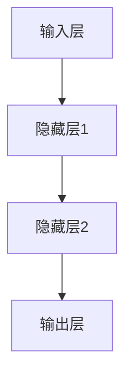
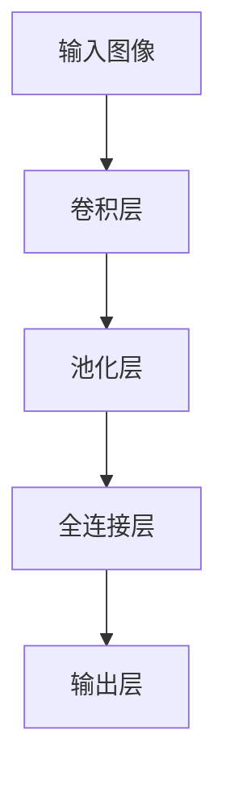
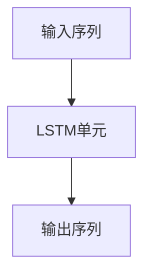
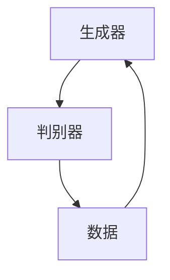

                 

## AI自动化的未来发展趋势

### 关键词：人工智能、自动化、机器学习、深度学习、自然语言处理、计算机视觉

### 摘要：

本文旨在探讨人工智能（AI）自动化的未来发展趋势。随着AI技术的不断进步，自动化已经成为各个行业不可或缺的一部分。本文将从基础概念、关键技术、应用案例、挑战与未来展望等方面，详细分析AI自动化的发展趋势。通过梳理AI自动化的核心概念和关键技术，我们能够更好地理解其在不同行业中的应用潜力，以及面临的技术挑战和未来发展方向。

### 第一部分: AI自动化的基础概念

#### 第1章: AI自动化的基础概念

##### 1.1 AI自动化概述

**AI自动化与自动化技术的区别**：

AI自动化是指利用人工智能技术来实现自动化过程，包括从数据采集、处理、分析到决策的各个环节。而传统自动化技术则主要依赖于预设的规则和程序，缺乏自适应性和学习能力。

**AI自动化的重要性**：

AI自动化的优势在于其能够通过学习大量数据，自动调整和优化过程，提高生产效率、降低成本，并减少人为错误。在制造业、金融、医疗、零售等多个领域，AI自动化的应用正逐步改变传统行业的工作模式。

**AI自动化的应用领域**：

AI自动化在各个领域的应用广泛，如智能制造、智能金融、智能医疗、智能交通、智能家居等。通过AI技术的引入，传统行业正在向智能化、自动化方向发展。

##### 1.2 AI自动化的核心概念

**机器学习与深度学习**：

机器学习是AI的核心技术之一，通过训练模型来从数据中学习规律。深度学习是机器学习的一个分支，主要依赖于神经网络模型，具有更强的表达能力和学习能力。

**监督学习、无监督学习和强化学习**：

监督学习是通过对已标注的数据进行训练，模型能够预测未知数据的结果。无监督学习则无需标注数据，主要关注数据的内在结构和规律。强化学习通过试错和奖励机制来优化行为。

**自然语言处理与计算机视觉**：

自然语言处理（NLP）是AI技术在处理和生成自然语言方面的应用。计算机视觉则是通过图像和视频数据来获取信息，实现图像识别、目标检测、人脸识别等功能。

##### 1.3 AI自动化的技术架构

**数据预处理与数据清洗**：

数据预处理是AI自动化过程中的重要环节，包括数据的采集、清洗、转换和归一化等步骤。数据清洗是确保数据质量的关键。

**特征工程与模型选择**：

特征工程是通过对数据进行特征提取和构造，以提升模型的性能。模型选择则是在不同类型的机器学习算法中选择合适的模型。

**模型训练与评估**：

模型训练是通过迭代优化模型参数，使其能够在训练数据上达到较好的表现。评估则是对模型性能进行衡量和比较。

**部署与监控**：

模型部署是将训练好的模型应用到实际环境中，实现自动化过程。监控则是对自动化过程进行实时监控，以确保系统的稳定运行。

### 第二部分: AI自动化的关键技术

#### 第2章: AI自动化的关键技术

##### 2.1 机器学习算法原理

**线性回归算法**：

线性回归是最简单的机器学习算法之一，通过建立输入变量和输出变量之间的线性关系来预测结果。其伪代码如下：

```python
# 线性回归伪代码
def linear_regression(X, y):
    # 计算斜率和截距
    theta = (X.T * X)^(-1) * (X.T * y)
    return theta
```

**逻辑回归算法**：

逻辑回归是一种广义线性模型，用于分类问题。其数学模型为：

$$
\sigma(z) = \frac{1}{1 + e^{-z}}
$$

其中，$\sigma$表示逻辑函数，$z$为输入特征。

**决策树与随机森林**：

决策树是一种基于树结构的分类算法，通过递归地将数据集划分为不同的子集。随机森林则是在决策树的基础上引入随机性，提高模型的泛化能力。

**支持向量机**：

支持向量机（SVM）是一种用于分类和回归的线性模型。其目标是找到最佳的超平面，使得分类边界最大化。

##### 2.2 深度学习算法原理

**神经网络基础**：

神经网络是一种模拟人脑神经元连接的模型，通过多层神经元结构来处理复杂问题。其基本结构如下：



**卷积神经网络（CNN）**：

卷积神经网络是一种专门用于图像处理和计算机视觉的深度学习模型。其核心是卷积操作和池化操作，可以有效地提取图像特征。



**循环神经网络（RNN）与长短期记忆网络（LSTM）**：

循环神经网络是一种可以处理序列数据的深度学习模型。长短期记忆网络（LSTM）是RNN的一个变体，通过引入门控机制来解决长短期依赖问题。



**生成对抗网络（GAN）**：

生成对抗网络是一种无监督学习的深度学习模型，由生成器和判别器两个网络组成。生成器生成假数据，判别器判断数据的真实性。



##### 2.3 自然语言处理技术

**词嵌入技术**：

词嵌入是一种将自然语言文本映射到高维空间的技术，用于表示词语的语义信息。常见的词嵌入技术包括Word2Vec、GloVe等。

**序列模型与注意力机制**：

序列模型是一种用于处理序列数据的深度学习模型，如RNN和LSTM。注意力机制是一种通过动态调整输入特征的重要性来提高模型性能的技术。

**语言模型与序列标注**：

语言模型是一种用于预测下一个词语的概率的模型，如n-gram模型和神经网络语言模型。序列标注是对文本中的词语进行分类的任务，如命名实体识别。

##### 2.4 计算机视觉技术

**图像分类与目标检测**：

图像分类是将图像划分为不同类别的问题，如分类算法中的softmax输出。目标检测是在图像中识别和定位目标物体的问题，如YOLO和Faster R-CNN。

**人脸识别与姿态估计**：

人脸识别是通过比较人脸特征来实现身份验证的问题。姿态估计是通过对图像中的物体进行空间位置和姿态估计的问题，如PoseNet。

**图像生成与风格迁移**：

图像生成是通过生成模型生成新的图像的问题，如生成对抗网络（GAN）。风格迁移是将一种艺术风格应用到另一张图像的问题，如VGG19和StyleGAN。

### 第3章: AI自动化的应用案例

#### 第3章: AI自动化的应用案例

##### 3.1 制造业中的AI自动化

**智能制造与工业4.0**：

智能制造是利用AI技术实现生产过程的高度自动化和智能化。工业4.0是制造业向智能化、数字化方向发展的战略，其核心是AI自动化。

**机器人自动化与生产优化**：

机器人自动化是利用机器人替代人工进行生产操作，提高生产效率和降低成本。生产优化是通过AI技术对生产过程进行实时监控和优化，提高生产质量和降低浪费。

**质量检测与设备维护**：

质量检测是利用AI技术对产品进行质量检测和缺陷识别，提高产品质量。设备维护是通过AI技术对设备运行状态进行监测和预测，预防设备故障。

##### 3.2 零售业中的AI自动化

**个性化推荐系统**：

个性化推荐系统是根据用户的历史行为和兴趣，推荐相应的商品和服务。通过AI技术，可以实现更准确的推荐结果，提高用户体验和销售转化率。

**客户服务与聊天机器人**：

客户服务是通过AI技术实现自动化的客户服务，如智能客服和聊天机器人。通过自然语言处理技术，可以模拟人类的对话，提高服务效率和客户满意度。

**库存管理与供应链优化**：

库存管理是通过AI技术对库存进行实时监控和优化，降低库存成本和提高供应链效率。供应链优化是通过AI技术对供应链过程进行优化，提高供应链的稳定性和灵活性。

##### 3.3 医疗保健中的AI自动化

**医疗影像分析**：

医疗影像分析是利用AI技术对医学影像进行自动分析和诊断，如计算机辅助诊断（CAD）。通过AI技术，可以实现更准确和高效的诊断结果。

**疾病预测与诊断**：

疾病预测与诊断是利用AI技术对患者的病史、基因信息等进行分析，预测疾病风险和诊断疾病。通过AI技术，可以实现更早期、更准确的疾病预测和诊断。

**个性化治疗与健康管理**：

个性化治疗是根据患者的病情和基因信息，制定个性化的治疗方案。健康管理是通过AI技术对患者的健康数据进行实时监控和分析，提供个性化的健康建议。

### 第4章: AI自动化的挑战与未来发展趋势

#### 第4章: AI自动化的挑战与未来发展趋势

##### 4.1 数据隐私与安全

**数据隐私保护技术**：

数据隐私保护技术包括数据加密、匿名化、差分隐私等，用于保护用户的隐私数据。通过这些技术，可以在数据分析和共享过程中保护用户的隐私。

**安全加密算法**：

安全加密算法包括对称加密、非对称加密、哈希函数等，用于确保数据的传输和存储安全。通过这些算法，可以防止数据被未经授权的访问和篡改。

**法律法规与伦理问题**：

法律法规与伦理问题是AI自动化面临的重大挑战。需要制定相应的法律法规来规范AI自动化的应用，保护用户的隐私和数据安全。同时，需要关注AI自动化的伦理问题，如算法偏见、数据歧视等。

##### 4.2 模型解释性与可解释性

**模型解释性的重要性**：

模型解释性是指模型决策过程的可解释性，可以帮助用户理解模型的决策过程，提高模型的透明度和可信度。

**模型解释技术**：

模型解释技术包括特征重要性分析、决策树解释、神经网络解释等，用于解释模型的决策过程。通过这些技术，可以更好地理解模型的决策过程，提高模型的透明度和可解释性。

**可解释性在决策支持中的应用**：

可解释性在决策支持中的应用包括医疗诊断、金融风险评估、法律判决等。通过可解释性技术，可以帮助决策者更好地理解和评估模型的决策过程，提高决策的准确性和可靠性。

##### 4.3 AI自动化与人类工作

**AI自动化对劳动力市场的影响**：

AI自动化对劳动力市场的影响包括就业岗位的减少和技能需求的变化。需要关注AI自动化对劳动力市场的影响，制定相应的政策来应对就业岗位的减少和技能需求的变化。

**AI与人类协作的工作模式**：

AI与人类协作的工作模式包括AI辅助决策、AI代劳等。通过AI技术，可以提高工作效率和准确性，实现人与机器的协作。

**教育与职业培训**：

教育与职业培训是应对AI自动化挑战的重要手段。需要加强AI技术教育，提高人才的AI技术水平，以适应AI自动化的需求。

##### 4.4 未来发展趋势

**新一代AI技术展望**：

新一代AI技术包括强化学习、迁移学习、联邦学习等，具有更高的灵活性和适应性。未来新一代AI技术的发展将推动AI自动化的进一步应用和优化。

**AI自动化在新兴行业中的应用**：

AI自动化在新兴行业中的应用包括智能交通、智慧城市、物联网等。未来AI自动化将在新兴行业中发挥更大的作用，推动行业的智能化和自动化发展。

**AI自动化与可持续发展**：

AI自动化与可持续发展包括节能减排、环境保护等。通过AI自动化技术，可以实现更高效、更环保的生产和生活方式，推动可持续发展。

### 附录

#### 附录A: AI自动化开发工具与资源

##### A.1 开发工具对比

**TensorFlow**：

TensorFlow是谷歌开发的开源机器学习库，具有丰富的功能和强大的生态系统。适用于各种规模的机器学习和深度学习项目。

**PyTorch**：

PyTorch是Facebook开发的开源机器学习库，具有灵活的动态计算图和易于使用的接口。适用于研究和实验性项目。

**Keras**：

Keras是Python的深度学习库，基于TensorFlow和Theano开发，提供了简单的接口和丰富的预训练模型。适用于快速原型开发和项目部署。

**其他工具介绍**：

其他常用的深度学习库还包括MXNet、Caffe等，适用于不同的应用场景和需求。

##### A.2 数据集介绍

**公开数据集资源**：

公开数据集资源包括ImageNet、CIFAR-10、MNIST等，涵盖了图像、文本、语音等多种类型的数据，适用于机器学习和深度学习研究。

**特定领域数据集介绍**：

特定领域数据集包括医疗影像数据集、金融交易数据集、气象数据集等，适用于特定领域的应用和研究。

**数据清洗与预处理技巧**：

数据清洗与预处理是机器学习和深度学习项目中的重要环节，包括数据去重、缺失值处理、数据转换等。

##### A.3 AI自动化研究论文推荐

**杰出论文精选**：

推荐一些在AI自动化领域具有影响力的论文，如《Deep Learning》、《Reinforcement Learning: An Introduction》等。

**重要会议与期刊**：

介绍一些在AI自动化领域的重要会议和期刊，如NeurIPS、ICML、JMLR等。

**开源代码与实现**：

推荐一些开源的AI自动化项目，如TensorFlow、PyTorch等，提供丰富的代码和实现，方便学习和实践。

### 作者

**作者：AI天才研究院/AI Genius Institute & 禅与计算机程序设计艺术 /Zen And The Art of Computer Programming**

本文由AI天才研究院撰写，旨在探讨AI自动化的未来发展趋势。通过详细的分析和讲解，我们希望能够为读者提供对AI自动化领域的深入理解和启示。如有任何疑问或建议，欢迎联系作者。

