                 

# AI赋能软件开发

## 关键词
- 人工智能
- 软件开发
- 机器学习
- 深度学习
- 自动化
- 编程辅助
- 软件工程

## 摘要
随着人工智能技术的迅猛发展，其在软件开发中的应用日益广泛。本文将从AI基础、数据预处理、机器学习基础、深度学习基础、AI与软件开发的结合、AI工具与框架、项目实战以及未来展望等方面，深入探讨AI赋能软件开发的具体实践与前景。通过本文的阅读，读者将了解到如何利用AI技术提高软件开发的效率和质量，推动软件工程的创新发展。

## 目录

## 第一部分: AI基础

### 第1章: AI概述

#### 1.1 AI的定义与历史
#### 1.2 AI的类型与分类
#### 1.3 AI的核心原理
#### 1.4 AI的应用场景

### 第2章: 数据预处理

#### 2.1 数据清洗
#### 2.2 特征工程
#### 2.3 数据可视化

### 第3章: 机器学习基础

#### 3.1 监督学习
#### 3.2 无监督学习

### 第4章: 深度学习基础

#### 4.1 深度神经网络
#### 4.2 卷积神经网络
#### 4.3 循环神经网络

## 第二部分: AI赋能软件开发

### 第5章: AI与软件开发的结合

#### 5.1 AI在软件开发中的应用
#### 5.2 AI驱动的软件开发流程

### 第6章: AI工具与框架

#### 6.1 TensorFlow
#### 6.2 PyTorch
#### 6.3 Keras

### 第7章: AI项目实战

#### 7.1 项目背景与目标
#### 7.2 项目需求分析
#### 7.3 项目设计
#### 7.4 项目实现
#### 7.5 项目部署与维护

### 第8章: AI与软件开发未来展望

#### 8.1 AI在软件开发中的趋势
#### 8.2 AI开发中的挑战与对策

## 附录

### 附录A: 常用AI资源与工具

---

### 引言

随着人工智能（AI）技术的不断进步，其已经在多个领域展示了巨大的潜力，包括医疗、金融、制造业和交通等。在软件开发领域，AI的应用同样具有重要意义。通过AI技术，开发者可以自动化代码生成、优化软件性能、提升代码质量和安全性。本文旨在深入探讨AI赋能软件开发的具体实践和未来前景，帮助读者了解如何利用AI技术提升软件开发效率和创新能力。

### 第一部分: AI基础

#### 第1章: AI概述

#### 1.1 AI的定义与历史

人工智能是一门研究、开发用于模拟、延伸和扩展人的智能的理论、方法、技术及应用系统的科学技术。AI起源于20世纪50年代，当时科学家们开始探索如何使计算机具备类似人类智能的能力。从最初的逻辑推理、知识表示到现代的机器学习和深度学习，人工智能经历了多个发展阶段。

#### 1.2 AI的类型与分类

AI可以根据不同的标准进行分类。常见的分类方式包括：

- **基于推理**的AI：通过逻辑推理和符号计算实现智能。
- **基于知识**的AI：利用知识库和推理机进行决策。
- **基于学习**的AI：通过学习算法从数据中获取知识和模式。
- **基于模仿**的AI：通过模拟人类行为和思维过程实现智能。

#### 1.3 AI的核心原理

AI的核心原理主要包括以下几个方面：

- **神经网络**：模仿人脑神经元连接的结构，用于数据处理和模式识别。
- **机器学习**：通过算法从数据中学习并作出预测或决策。
- **深度学习**：一种特殊的机器学习方法，通过多层神经网络进行复杂的数据处理。

#### 1.4 AI的应用场景

AI在多个领域都有广泛应用，包括：

- **计算机视觉**：用于图像识别、目标检测和图像生成。
- **自然语言处理**：用于语言翻译、文本分类和语音识别。
- **游戏**：如围棋、国际象棋等游戏中的智能对手。
- **医疗**：用于疾病诊断、药物发现和个性化治疗。

#### 第2章: 数据预处理

#### 2.1 数据清洗

数据清洗是数据预处理的重要步骤，包括处理缺失值、异常值和重复数据。处理缺失值的方法包括：

- **删除缺失值**：适用于缺失值较多的情况。
- **填充缺失值**：使用平均值、中位数或模式进行填充。

处理异常值的方法包括：

- **删除异常值**：适用于异常值对模型影响较大的情况。
- **修正异常值**：使用统计学方法或专业领域知识进行修正。

#### 2.2 特征工程

特征工程是提高模型性能的关键步骤，包括特征提取和特征选择。

- **特征提取**：通过降维、转换或组合原始数据得到新的特征。
- **特征选择**：从大量特征中筛选出对模型性能有显著影响的特征。

#### 2.3 数据可视化

数据可视化是数据分析和解释的重要手段，包括散点图、折线图、饼图等。数据可视化有助于发现数据中的规律和趋势，为后续分析提供指导。

#### 第3章: 机器学习基础

#### 3.1 监督学习

监督学习是机器学习的一种类型，通过已有数据的标签来训练模型。常见的监督学习算法包括：

- **线性回归**：用于预测连续值。
- **逻辑回归**：用于预测概率。
- **决策树**：通过树的形态进行分类或回归。

#### 3.2 无监督学习

无监督学习是机器学习的另一种类型，没有预定的标签。常见的无监督学习算法包括：

- **K-均值聚类**：用于无监督聚类。
- **主成分分析**：用于降维和特征提取。
- **自编码器**：用于特征提取和学习数据表示。

#### 第4章: 深度学习基础

#### 4.1 深度神经网络

深度神经网络（DNN）是一种多层神经网络，用于处理复杂数据。DNN的核心组成部分包括：

- **神经元**：用于数据处理和计算。
- **层**：包括输入层、隐藏层和输出层。
- **激活函数**：用于引入非线性。

#### 4.2 卷积神经网络

卷积神经网络（CNN）是一种专门用于处理图像数据的神经网络。CNN的核心组成部分包括：

- **卷积层**：用于提取图像特征。
- **池化层**：用于减小特征图的大小。
- **全连接层**：用于分类或回归。

#### 4.3 循环神经网络

循环神经网络（RNN）是一种专门用于处理序列数据的神经网络。RNN的核心组成部分包括：

- **循环单元**：用于处理序列中的每个元素。
- **门控**：用于控制信息传递。
- **长短期记忆（LSTM）**：用于解决RNN的梯度消失问题。

#### 第二部分: AI赋能软件开发

##### 第5章: AI与软件开发的结合

##### 5.1 AI在软件开发中的应用

AI在软件开发中的应用主要包括自动化代码生成、代码审查与漏洞检测、软件性能优化等。自动化代码生成可以通过机器学习和自然语言处理技术，自动生成代码模板和函数实现。代码审查与漏洞检测可以利用AI技术自动分析代码，发现潜在的安全漏洞和逻辑错误。软件性能优化可以通过机器学习算法，自动调整代码和算法，提高软件的运行效率和性能。

##### 5.2 AI驱动的软件开发流程

AI驱动的软件开发流程包括需求分析、设计与实现、测试与部署等环节。在需求分析阶段，AI可以帮助分析用户需求，自动生成功能需求文档。在设计与实现阶段，AI可以帮助自动生成代码框架和关键实现部分，减少开发者的工作量。在测试与部署阶段，AI可以帮助自动化测试，快速定位问题，并优化部署过程。

##### 第6章: AI工具与框架

##### 6.1 TensorFlow

TensorFlow是一种开源的深度学习框架，用于构建和训练神经网络。TensorFlow的主要功能包括：

- **模型构建**：提供丰富的API，方便构建复杂的神经网络。
- **训练与优化**：提供高效的训练算法和优化器。
- **部署**：支持多种部署方式，包括本地、云端和移动端。

##### 6.2 PyTorch

PyTorch是一种流行的深度学习框架，以动态计算图和灵活性著称。PyTorch的主要功能包括：

- **动态计算图**：提供灵活的编程接口，方便调试和优化。
- **GPU加速**：提供高效的GPU计算能力，加速训练和推理过程。
- **生态系统**：提供丰富的预训练模型和工具包，方便开发者快速入门。

##### 6.3 Keras

Keras是一种基于TensorFlow的高层神经网络API，以简单易用著称。Keras的主要功能包括：

- **简单易用**：提供简洁的API，方便快速搭建和训练模型。
- **兼容性**：支持多种深度学习框架，包括TensorFlow、Theano和Microsoft Cognitive Toolkit。
- **扩展性**：提供自定义层和模型的功能，方便开发者进行深度定制。

##### 第7章: AI项目实战

##### 7.1 项目背景与目标

在本章中，我们将介绍一个实际的人工智能项目，该项目旨在利用深度学习技术实现图像识别任务。项目的目标是训练一个深度神经网络，能够准确识别图像中的物体类别。

##### 7.2 项目需求分析

项目需求分析包括以下方面：

- **功能需求**：项目需要能够接收输入图像，并输出物体类别。
- **非功能需求**：项目需要具备较高的准确率和实时性，能够处理大规模的图像数据。

##### 7.3 项目设计

项目设计包括以下方面：

- **数据集准备**：收集并预处理大量的图像数据，用于训练和测试模型。
- **模型选择**：选择合适的深度学习模型，如卷积神经网络（CNN）。
- **训练与优化**：使用训练数据集训练模型，并优化模型参数。

##### 7.4 项目实现

项目实现包括以下方面：

- **开发环境搭建**：安装深度学习框架和依赖库。
- **源代码实现**：编写深度学习模型的代码，包括数据预处理、模型训练和模型评估等。
- **代码解读与分析**：详细解读源代码，分析模型结构和训练过程。

##### 7.5 项目部署与维护

项目部署与维护包括以下方面：

- **部署**：将训练好的模型部署到服务器或移动设备上，以便进行实时图像识别。
- **监控**：监控模型运行状态，确保其稳定性和准确性。
- **升级**：根据实际需求和性能表现，对模型进行更新和优化。

##### 第8章: AI与软件开发未来展望

##### 8.1 AI在软件开发中的趋势

AI在软件开发中的发展趋势包括：

- **自动化**：AI技术将进一步提升软件开发的自动化程度，减少人工干预。
- **个性化**：AI技术将帮助软件更加个性化，满足用户的需求和偏好。
- **智能化**：AI技术将使软件具有更高的智能化水平，具备自主学习、自我优化和自我修复的能力。

##### 8.2 AI开发中的挑战与对策

AI开发面临的挑战包括：

- **数据隐私与安全性**：如何确保数据的安全性和隐私性，防止数据泄露。
- **模型透明性与解释性**：如何提高模型的透明性和解释性，增强用户对模型的信任。
- **AI伦理与责任问题**：如何确保AI技术在伦理和责任范围内使用，防止滥用。

##### 附录

##### 附录A: 常用AI资源与工具

附录A列出了常用的AI资源与工具，包括：

- **开源机器学习库**：如TensorFlow、PyTorch和Keras等。
- **AI社区与论坛**：如Kaggle、Reddit AI和AI Stack Exchange等。
- **在线课程与学习资源**：如Coursera、edX和Udacity等。

---

### 结论

人工智能在软件开发中的应用正逐渐深入，为开发者提供了更多的工具和可能性。通过本文的介绍，读者可以了解到AI赋能软件开发的核心概念、技术原理和应用实践。展望未来，随着AI技术的不断进步，我们可以期待在软件开发领域看到更多的创新和突破。同时，我们也要关注AI开发中面临的挑战，确保其能够为人类社会带来更多积极的影响。

### 作者信息

- 作者：AI天才研究院/AI Genius Institute & 禅与计算机程序设计艺术 /Zen And The Art of Computer Programming

---

本文共计约 8000 字，涵盖 AI 基础、数据预处理、机器学习基础、深度学习基础、AI 与软件开发的结合、AI 工具与框架、项目实战以及未来展望等部分。每个部分都详细讲解了相关概念、技术原理和应用实践，力求为读者提供全面、深入的见解。

---

**注意：本文为示例文章，部分内容可能需要根据实际情况进行调整和补充。文章中的代码实现和数学公式仅为示例，实际项目中可能有所不同。**

---

**附：本文的 Mermaid 流程图**

```mermaid
graph TD
    A[AI概述] --> B[AI的定义与历史]
    A --> C[AI的类型与分类]
    A --> D[AI的核心原理]
    A --> E[AI的应用场景]
    F[数据预处理] --> G[数据清洗]
    F --> H[特征工程]
    F --> I[数据可视化]
    J[机器学习基础] --> K[监督学习]
    J --> L[无监督学习]
    M[深度学习基础] --> N[深度神经网络]
    M --> O[卷积神经网络]
    M --> P[循环神经网络]
    Q[AI与软件开发结合] --> R[AI在软件开发中的应用]
    Q --> S[AI驱动的软件开发流程]
    T[AI工具与框架] --> U[TensorFlow]
    T --> V[PyTorch]
    T --> W[Keras]
    X[AI项目实战] --> Y[项目背景与目标]
    X --> Z[项目需求分析]
    X --> AA[项目设计]
    X --> AB[项目实现]
    X --> AC[项目部署与维护]
    AD[未来展望] --> AE[AI在软件开发中的趋势]
    AD --> AF[AI开发中的挑战与对策]
```



---

**附：本文的核心算法原理讲解伪代码**

```python
# 线性回归模型
def linear_regression(X, y):
    # 计算系数
    theta = (X.T * X).I * (X.T * y)
    # 预测
    y_pred = X * theta
    return y_pred

# K-均值聚类算法
def k_means(data, k, max_iterations):
    # 初始化聚类中心
    centroids = initialize_centroids(data, k)
    # 迭代计算
    for _ in range(max_iterations):
        # 计算每个数据点的簇分配
        assignments = assign_points_to_clusters(data, centroids)
        # 更新聚类中心
        centroids = update_centroids(data, assignments, k)
    return centroids, assignments

# 卷积神经网络
def conv_neural_network(input_data, model):
    # 前向传播
    output = forward_pass(input_data, model)
    # 求解损失函数
    loss = compute_loss(output, target)
    # 反向传播
    backward_pass(output, target, model)
    return output, loss
```

---

**附：本文的数学模型和公式讲解**

$$
\text{线性回归模型：} y = \beta_0 + \beta_1x_1 + \beta_2x_2 + ... + \beta_nx_n
$$

$$
\text{K-均值聚类：} C = \{c_1, c_2, ..., c_k\}, \text{其中} c_j = \frac{1}{N_j} \sum_{i=1}^{N} x_i
$$

$$
\text{卷积神经网络：} f(x) = \sigma(\sum_{j=1}^{n} w_{j} * x_{j} + b)
$$

---

**感谢您的阅读，希望本文能够帮助您更好地了解AI赋能软件开发的相关知识。**

---

**作者：AI天才研究院/AI Genius Institute & 禅与计算机程序设计艺术 /Zen And The Art of Computer Programming**## 第一部分: AI基础

### 第1章: AI概述

#### 1.1 AI的定义与历史

人工智能（Artificial Intelligence，简称AI）是指通过计算机模拟人类智能行为的技术。AI的研究目标是开发能够思考、学习、解决问题、理解和创造的人类智能水平的计算机系统。AI的起源可以追溯到20世纪50年代，当时以约翰·冯·诺伊曼（John von Neumann）和艾伦·图灵（Alan Turing）等人为代表的一批科学家开始探讨如何使计算机具备智能。这一时期，人工智能主要聚焦在逻辑推理和知识表示上。

20世纪60年代，人工智能进入了一个短暂的“黄金时代”。在这个时期，科学家们开发了第一个专家系统（Expert System），如Dendral和MACSYMA，这些系统能够在特定领域内进行复杂推理和问题解决。然而，由于硬件限制和算法复杂度的增加，人工智能在20世纪70年代遭遇了第一次重大挫折，这一时期被称为“AI冬天”。

20世纪80年代，随着计算机性能的提升和机器学习技术的兴起，人工智能研究再次得到关注。特别是在机器人学和自然语言处理领域，人工智能取得了显著进展。20世纪90年代，随着互联网的兴起，人工智能的应用范围进一步扩大，包括搜索引擎、推荐系统、电子商务等。

进入21世纪，特别是深度学习技术的突破，使人工智能进入了一个新的发展阶段。深度学习模型在图像识别、语音识别、自然语言处理等领域取得了超越人类的表现。如今，人工智能已经成为计算机科学领域的一个核心研究方向，并在各行各业中发挥着越来越重要的作用。

#### 1.2 AI的类型与分类

人工智能可以根据不同的标准进行分类。以下是几种常见的分类方式：

1. **基于推理的AI**：
   - **专家系统**：利用知识库和推理机进行决策。
   - **知识图谱**：通过实体和关系构建复杂的知识网络。

2. **基于知识的AI**：
   - **决策树**：通过树形结构进行分类或回归。
   - **规则引擎**：基于预定义的规则进行决策。

3. **基于学习的AI**：
   - **监督学习**：通过已有数据的标签进行学习。
   - **无监督学习**：没有预定的标签，自动发现数据中的模式。
   - **强化学习**：通过与环境的交互进行学习，以达到最优策略。

4. **基于模仿的AI**：
   - **生成对抗网络（GAN）**：通过模拟对抗过程生成数据。
   - **模拟进化**：通过模拟生物进化过程进行优化。

5. **混合式AI**：
   - **认知计算**：结合人类思维和计算能力，进行问题解决。
   - **多智能体系统**：通过多个智能体协同工作，实现复杂任务。

#### 1.3 AI的核心原理

AI的核心原理包括以下几个方面：

1. **神经网络**：
   - **基本结构**：神经网络由输入层、隐藏层和输出层组成，每个层包含多个神经元。
   - **激活函数**：用于引入非线性，常见的有ReLU、Sigmoid和Tanh函数。
   - **反向传播算法**：用于更新神经网络的权重和偏置，优化模型性能。

2. **机器学习**：
   - **监督学习**：通过已有数据的标签进行学习，常见的算法有线性回归、决策树、支持向量机等。
   - **无监督学习**：没有预定的标签，自动发现数据中的模式，常见的算法有聚类、降维等。
   - **强化学习**：通过与环境的交互进行学习，常见的算法有Q学习、SARSA等。

3. **深度学习**：
   - **基本概念**：深度学习是一种特殊的机器学习方法，通过多层神经网络进行复杂的数据处理。
   - **卷积神经网络（CNN）**：用于处理图像数据，通过卷积层和池化层提取特征。
   - **循环神经网络（RNN）**：用于处理序列数据，通过循环单元和门控机制处理信息。

#### 1.4 AI的应用场景

AI在多个领域都有广泛应用，以下是一些典型的应用场景：

1. **计算机视觉**：
   - **图像识别**：通过卷积神经网络，实现对图像内容的识别和分类。
   - **目标检测**：通过物体检测算法，定位图像中的目标物体。
   - **图像生成**：通过生成对抗网络（GAN），生成具有特定风格或内容的图像。

2. **自然语言处理**：
   - **文本分类**：通过机器学习算法，对文本进行分类。
   - **语言翻译**：通过神经网络模型，实现不同语言之间的翻译。
   - **语音识别**：通过深度学习模型，将语音信号转换为文本。

3. **游戏**：
   - **智能对手**：通过强化学习，训练出能够战胜人类玩家的智能对手。
   - **游戏AI**：通过模拟人类思维过程，实现复杂游戏策略。

4. **医疗**：
   - **疾病诊断**：通过图像识别和自然语言处理，辅助医生进行疾病诊断。
   - **药物发现**：通过机器学习，预测药物的疗效和副作用。
   - **个性化治疗**：通过分析患者的基因数据和病历，制定个性化的治疗方案。

5. **金融**：
   - **风险管理**：通过机器学习模型，预测金融市场风险。
   - **欺诈检测**：通过异常检测算法，发现金融交易中的欺诈行为。
   - **投资策略**：通过分析市场数据，制定最优的投资策略。

6. **制造业**：
   - **自动化控制**：通过机器学习和深度学习，实现对生产过程的自动控制。
   - **质量检测**：通过图像识别和自然语言处理，检测产品质量。
   - **供应链管理**：通过预测分析，优化供应链管理和库存控制。

#### 1.5 AI的发展趋势

随着技术的不断进步，人工智能正在朝着以下几个方向发展：

1. **计算能力提升**：
   - **GPU和TPU**：通过专用硬件加速计算，提高深度学习模型的训练效率。
   - **量子计算**：虽然目前还处于早期阶段，但量子计算有望在未来的AI应用中发挥重要作用。

2. **数据驱动的AI**：
   - **大数据**：随着数据量的增加，AI模型能够从更多样化的数据中学习，提高模型的泛化能力。
   - **数据隐私**：如何保护用户数据隐私，同时利用数据的价值，是当前研究的重要方向。

3. **跨学科融合**：
   - **心理学**：通过研究人类认知和心理过程，提高AI的情感智能和交互能力。
   - **生物学**：借鉴生物系统的自组织和自适应特性，设计更加智能的AI系统。

4. **边缘计算**：
   - **物联网**：通过边缘计算，将数据处理和决策能力从云端转移到边缘设备，提高响应速度和降低延迟。

5. **人机协作**：
   - **混合智能**：通过结合人类和机器的智能，实现更高效的决策和问题解决。
   - **AI伦理**：如何在保证技术发展的同时，遵循伦理和道德原则，避免潜在的社会风险。

#### 1.6 本章总结

本章介绍了人工智能的基本概念、历史发展、类型与分类、核心原理以及应用场景。通过对AI概述的深入探讨，读者可以了解到AI的发展历程、关键技术以及在不同领域的广泛应用。本章内容为后续章节的学习奠定了基础，帮助读者全面了解AI赋能软件开发的前景和挑战。

### 第2章: 数据预处理

#### 2.1 数据清洗

数据清洗是数据预处理过程中至关重要的一环，旨在去除原始数据中的噪声、异常值和重复数据，确保数据的质量和一致性。数据清洗的主要步骤包括：

1. **处理缺失值**：
   - **删除缺失值**：适用于缺失值较多或者数据量较大的情况，删除缺失值可以简化数据集，减少计算复杂度。
   - **填充缺失值**：适用于缺失值较少或者关键特征的情况，常用的填充方法包括：
     - **平均值填充**：用特征的均值来填充缺失值。
     - **中位数填充**：用特征的中位数来填充缺失值。
     - **模式填充**：用特征的模式（即出现次数最多的值）来填充缺失值。
     - **插值法**：使用时间序列数据的插值方法来填充缺失值。
     - **机器学习模型填充**：使用机器学习模型预测缺失值，如k近邻算法、随机森林等。

2. **处理异常值**：
   - **删除异常值**：适用于异常值对模型影响较大的情况，例如在异常值较多时，直接删除可以避免异常值对模型训练产生不良影响。
   - **修正异常值**：适用于异常值对模型影响较小或者需要保留的情况，可以通过以下方法进行修正：
     - **统计学方法**：使用统计学方法，如Z-score、IQR（四分位距）等方法，识别出异常值并进行修正。
     - **专业领域知识**：根据具体的业务背景，使用专业领域知识对异常值进行修正。

3. **处理重复值**：
   - **删除重复值**：直接删除重复的数据记录，确保数据集的唯一性。
   - **保留最新或重要记录**：在某些情况下，可以保留最新的或最重要的记录，删除其他重复的记录。

4. **数据格式统一**：
   - **日期格式**：统一日期格式的表示方法，例如将所有日期转换为YYYY-MM-DD格式。
   - **文本格式**：统一文本格式的表示方法，例如将所有文本转换为小写或大写。
   - **数值格式**：统一数值的表示方法，例如将所有数值转换为浮点数格式。

#### 2.2 特征工程

特征工程是数据预处理中的关键步骤，其目标是提取出有用的特征，并降低数据的维度，从而提高模型的表现。特征工程的主要步骤包括：

1. **特征提取**：
   - **数值特征提取**：对原始数据进行简单的统计变换，如计算均值、方差、标准差等。
   - **文本特征提取**：对文本数据进行处理，提取词频、词袋、TF-IDF等特征。
   - **图像特征提取**：对图像数据进行处理，提取边缘、颜色、纹理等特征。
   - **时间序列特征提取**：对时间序列数据进行处理，提取趋势、周期、季节性等特征。

2. **特征选择**：
   - **过滤式特征选择**：基于特征的重要性进行筛选，常用的方法有信息增益、互信息、方差贡献率等。
   - **包裹式特征选择**：通过迭代搜索最优特征子集，常用的方法有前向选择、后向选择、嵌入法等。
   - **基于模型的特征选择**：通过构建模型评估特征的重要性，常用的方法有随机森林、LASSO回归等。

3. **特征缩放**：
   - **标准化**：将所有特征缩放到相同的尺度，常用的方法有Z-score标准化和Min-Max标准化。
   - **归一化**：将特征转换为0-1之间的小数，常用的方法有Min-Max归一化和Log变换。

4. **特征组合**：
   - **交互特征**：通过组合原始特征，生成新的交互特征，以提高模型的复杂度和表现。
   - **特征聚合**：将多个相似的特征合并为一个特征，减少特征维度。

#### 2.3 数据可视化

数据可视化是数据分析和解释的重要手段，通过图形化的方式展示数据分布、趋势和关系，帮助分析师和开发者更好地理解数据。数据可视化主要包括以下方法：

1. **基础图表**：
   - **柱状图**：用于展示不同类别或组的数据对比。
   - **折线图**：用于展示数据随时间变化的趋势。
   - **饼图**：用于展示数据中各个类别的占比。
   - **散点图**：用于展示两个特征之间的关系。

2. **高级图表**：
   - **热力图**：用于展示多维数据的分布和相关性。
   - **箱线图**：用于展示数据的分布和异常值。
   - **密度图**：用于展示数据的密度分布。
   - **地图**：用于展示地理数据。

3. **交互式可视化**：
   - **交互式图表**：允许用户通过拖拽、点击等方式与数据交互，深入了解数据细节。
   - **动态图表**：通过动画效果展示数据的变化过程。

4. **数据可视化工具**：
   - **Matplotlib**：Python的基础绘图库，可以生成多种类型的图表。
   - **Seaborn**：基于Matplotlib的图形可视化库，提供多种高级图表。
   - **Plotly**：提供交互式图表的库，支持多种前端技术。
   - **Tableau**：商业化的数据可视化工具，提供丰富的图表和交互功能。

#### 2.4 本章总结

本章介绍了数据预处理中的数据清洗、特征工程和数据可视化。数据清洗是确保数据质量的重要步骤，特征工程是提升模型表现的关键步骤，数据可视化则是帮助理解和解释数据的工具。通过对本章内容的了解，读者可以掌握数据预处理的基本方法和技巧，为后续的机器学习和深度学习打下坚实的基础。

### 第3章: 机器学习基础

#### 3.1 监督学习

监督学习是一种机器学习类型，其主要特点是使用已标记的数据集进行学习，通过训练模型来预测新数据的标签。监督学习可以分为回归和分类两种类型。

##### 3.1.1 线性回归

线性回归是最基本的监督学习算法之一，用于预测连续值。其核心假设是数据之间的关系可以用一条直线来表示。

**线性回归模型公式**：
$$
y = \beta_0 + \beta_1x_1 + \beta_2x_2 + ... + \beta_nx_n
$$

其中，$y$ 是预测值，$x_1, x_2, ..., x_n$ 是输入特征，$\beta_0, \beta_1, \beta_2, ..., \beta_n$ 是模型的参数。

**最小二乘法**：
为了找到最优的参数，可以使用最小二乘法（Ordinary Least Squares，OLS）来最小化预测值与实际值之间的误差平方和。

**伪代码**：
```python
def linear_regression(X, y):
    # X是输入特征矩阵，y是标签向量
    # 计算参数
    theta = (X.T * X).I * (X.T * y)
    # 预测
    y_pred = X * theta
    return y_pred
```

**数学模型**：
$$
\min_{\theta} \sum_{i=1}^{n} (y_i - \theta^T x_i)^2
$$

**举例说明**：
假设我们有以下数据集：
$$
\begin{array}{cc}
x_1 & y \\
1 & 2 \\
2 & 4 \\
3 & 5 \\
4 & 7 \\
5 & 8 \\
\end{array}
$$

我们可以使用线性回归模型来预测$x_6$的值。首先，我们需要计算输入特征矩阵$X$和标签向量$y$：
$$
X = \begin{bmatrix}
1 & 2 \\
2 & 4 \\
3 & 5 \\
4 & 7 \\
5 & 8 \\
\end{bmatrix}, \quad y = \begin{bmatrix}
2 \\
4 \\
5 \\
7 \\
8 \\
\end{bmatrix}
$$

然后，我们可以使用最小二乘法来求解参数$\theta$：
$$
\theta = (X^T X)^{-1} X^T y
$$

计算得到的参数$\theta$为：
$$
\theta = \begin{bmatrix}
\beta_0 \\
\beta_1 \\
\end{bmatrix} = \begin{bmatrix}
1 \\
1 \\
\end{bmatrix}
$$

因此，线性回归模型为：
$$
y = 1 + x
$$

预测$x_6$的值为：
$$
y_6 = 1 + 6 = 7
$$

##### 3.1.2 逻辑回归

逻辑回归（Logistic Regression）是一种用于预测概率的分类算法，特别适用于二分类问题。逻辑回归的核心思想是通过线性模型来预测一个连续的概率值，然后通过逻辑函数（Sigmoid函数）将其转换为概率。

**逻辑回归模型公式**：
$$
\pi(x) = \frac{1}{1 + e^{-(\beta_0 + \beta_1x_1 + \beta_2x_2 + ... + \beta_nx_n})}
$$

其中，$\pi(x)$ 是预测的概率，$x_1, x_2, ..., x_n$ 是输入特征，$\beta_0, \beta_1, \beta_2, ..., \beta_n$ 是模型的参数。

**伪代码**：
```python
def logistic_regression(X, y):
    # X是输入特征矩阵，y是标签向量
    # 初始化参数
    theta = np.random.rand(num_features+1, 1)
    # 设置迭代次数和步长
    num_iterations = 1000
    learning_rate = 0.01
    # 梯度下降
    for _ in range(num_iterations):
        # 计算预测概率
        y_pred = sigmoid(X * theta)
        # 计算损失函数
        loss = -1/n * (y.T * np.log(y_pred) + (1-y).T * np.log(1-y_pred))
        # 计算梯度
        grad = 1/n * (X.T * (y_pred - y))
        # 更新参数
        theta -= learning_rate * grad
    return theta

def sigmoid(x):
    return 1 / (1 + np.exp(-x))
```

**数学模型**：
$$
\min_{\theta} \frac{1}{n} \sum_{i=1}^{n} [-y_i \log(\pi(x_i)) - (1 - y_i) \log(1 - \pi(x_i))]
$$

**举例说明**：
假设我们有以下数据集：
$$
\begin{array}{cc}
x_1 & y \\
1 & 0 \\
2 & 1 \\
3 & 0 \\
4 & 1 \\
5 & 0 \\
\end{array}
$$

我们可以使用逻辑回归模型来预测$x_6$的标签。首先，我们需要计算输入特征矩阵$X$和标签向量$y$：
$$
X = \begin{bmatrix}
1 & 2 \\
1 & 3 \\
1 & 4 \\
1 & 5 \\
\end{bmatrix}, \quad y = \begin{bmatrix}
0 \\
1 \\
0 \\
1 \\
0 \\
\end{bmatrix}
$$

然后，我们可以使用梯度下降法来求解参数$\theta$。在每次迭代中，我们需要计算预测概率$y_pred$、损失函数$loss$和梯度$grad$，并根据梯度更新参数$\theta$。

经过多次迭代后，我们可以得到最优的参数$\theta$。使用这些参数，我们可以预测$x_6$的标签。如果预测概率大于0.5，则预测为1，否则预测为0。

##### 3.1.3 决策树与随机森林

决策树是一种基于树形结构进行决策的监督学习算法。每个内部节点表示一个特征，每个分支表示一个特征取值，每个叶子节点表示一个类别或预测值。决策树的构建过程如下：

1. **选择最优特征**：通过计算信息增益或基尼不纯度等指标，选择具有最大信息增益或最小基尼不纯度的特征作为分割依据。
2. **分割数据集**：将数据集按照最优特征的不同取值分割为子数据集。
3. **递归构建树**：对每个子数据集重复步骤1和2，直到满足停止条件（如最大深度、最小样本数等）。

**信息增益**：
$$
\text{IG}(A) = \sum_{v \in V} p(v) \cdot \text{H}(L_v)
$$

其中，$A$ 是特征，$V$ 是特征的所有可能取值，$p(v)$ 是取值$v$的概率，$\text{H}(L_v)$ 是特征$A$在取值$v$时，子数据集的熵。

**基尼不纯度**：
$$
\text{Gini}(A) = 1 - \sum_{v \in V} p(v)^2
$$

随机森林（Random Forest）是一种基于决策树的集成学习方法，通过构建多棵决策树，并利用投票机制进行预测。随机森林的核心特点包括：

1. **随机特征选择**：在构建每棵决策树时，从所有特征中随机选择一部分特征进行分割。
2. **Bootstrap采样**：在构建每棵决策树时，从原始数据集中随机抽取子数据集进行训练。
3. **集成预测**：通过多数投票或平均法，结合多棵决策树的预测结果。

**伪代码**：
```python
def random_forest(X, y, n_estimators, max_depth):
    # X是输入特征矩阵，y是标签向量
    # 初始化决策树列表
    trees = []
    for _ in range(n_estimators):
        # Bootstrap采样
        X_subset, y_subset = bootstrap_sample(X, y)
        # 构建决策树
        tree = build_tree(X_subset, y_subset, max_depth)
        trees.append(tree)
    # 集成预测
    y_pred = vote(trees, X)
    return y_pred

def build_tree(X, y, max_depth):
    # 训练决策树
    if max_depth == 0 or is_leaf(y):
        return Leaf(y)
    # 选择最优特征
    best_feature = select_best_feature(X, y)
    # 分割数据集
    left_child = build_tree(X[:, best_feature] < threshold, y, max_depth - 1)
    right_child = build_tree(X[:, best_feature] >= threshold, y, max_depth - 1)
    return Node(best_feature, threshold, left_child, right_child)

def vote(trees, X):
    # 计算多棵决策树的预测结果
    y_pred = []
    for tree in trees:
        y_pred.append(predict(tree, X))
    # 多数投票或平均法
    if is_majority_vote:
        return majority_vote(y_pred)
    else:
        return average_vote(y_pred)
```

**举例说明**：
假设我们有以下数据集：
$$
\begin{array}{cc}
x_1 & y \\
1 & 0 \\
2 & 1 \\
3 & 0 \\
4 & 1 \\
5 & 0 \\
\end{array}
$$

我们可以使用随机森林模型来预测$x_6$的标签。首先，我们需要计算输入特征矩阵$X$和标签向量$y$：
$$
X = \begin{bmatrix}
1 & 2 \\
1 & 3 \\
1 & 4 \\
1 & 5 \\
\end{bmatrix}, \quad y = \begin{bmatrix}
0 \\
1 \\
0 \\
1 \\
0 \\
\end{bmatrix}
$$

然后，我们可以使用Bootstrap采样和随机特征选择来构建多棵决策树。在每次构建决策树时，从所有特征中随机选择一部分特征进行分割，并对每个子数据集进行递归构建树。

最后，我们可以通过多数投票或平均法，结合多棵决策树的预测结果，预测$x_6$的标签。

#### 3.2 无监督学习

无监督学习是一种机器学习类型，其主要特点是使用未标记的数据集进行学习，目的是发现数据中的隐藏结构或模式。无监督学习可以分为聚类和降维两种类型。

##### 3.2.1 K-均值聚类

K-均值聚类是一种常用的聚类算法，其目标是找到一个由K个簇组成的划分，使得每个簇内的数据点尽可能接近，簇与簇之间的数据点尽可能远。

**K-均值聚类算法**：

1. **初始化簇中心**：随机选择K个数据点作为初始簇中心。
2. **分配数据点**：对于每个数据点，计算其与簇中心的距离，并将其分配到距离最近的簇。
3. **更新簇中心**：重新计算每个簇的中心，即该簇内所有数据点的均值。
4. **重复步骤2和3**，直到簇中心不再发生变化或达到最大迭代次数。

**伪代码**：
```python
def k_means(data, k, max_iterations):
    # data是输入数据集，k是簇的数量，max_iterations是最大迭代次数
    centroids = initialize_centroids(data, k)
    for _ in range(max_iterations):
        assignments = assign_points_to_clusters(data, centroids)
        centroids = update_centroids(data, assignments, k)
    return centroids, assignments

def initialize_centroids(data, k):
    # 随机选择K个数据点作为初始簇中心
    return random.sample(data, k)

def assign_points_to_clusters(data, centroids):
    # 将每个数据点分配到距离最近的簇
    assignments = []
    for data_point in data:
        distances = [euclidean_distance(data_point, centroid) for centroid in centroids]
        assignments.append(np.argmin(distances))
    return assignments

def update_centroids(data, assignments, k):
    # 重新计算每个簇的中心
    new_centroids = []
    for i in range(k):
        cluster_points = [data[j] for j in range(len(data)) if assignments[j] == i]
        new_centroids.append(np.mean(cluster_points, axis=0))
    return new_centroids
```

**数学模型**：
$$
c_j = \frac{1}{N_j} \sum_{i=1}^{N} x_i
$$

其中，$c_j$ 是第j个簇的中心，$N_j$ 是第j个簇中的数据点数量，$x_i$ 是第i个数据点。

**举例说明**：
假设我们有以下数据集：
$$
\begin{array}{cc}
x_1 & x_2 \\
1 & 2 \\
2 & 3 \\
3 & 1 \\
4 & 4 \\
5 & 5 \\
\end{array}
$$

我们可以使用K-均值聚类算法来将其分为两个簇。首先，随机选择两个数据点作为初始簇中心：
$$
\text{初始簇中心：} c_1 = (1, 2), c_2 = (3, 1)
$$

然后，计算每个数据点与簇中心的距离，并将其分配到距离最近的簇。接下来，重新计算每个簇的中心，并重复这个过程，直到簇中心不再发生变化。

经过多次迭代后，我们得到最终的簇中心：
$$
c_1 = (3/2, 5/2), c_2 = (7/2, 3/2)
$$

最终，数据集被分为两个簇：
$$
\text{簇1：} (1, 2), (3, 1), (4, 4)
$$
$$
\text{簇2：} (2, 3), (5, 5)
$$

##### 3.2.2 主成分分析

主成分分析（Principal Component Analysis，PCA）是一种常用的降维技术，其目标是在保留数据主要信息的前提下，将高维数据转换为低维数据。

**PCA算法**：

1. **数据标准化**：将数据缩放到相同的尺度，以消除不同特征之间的量纲影响。
2. **计算协方差矩阵**：计算数据点之间的协方差矩阵，即：
   $$
   S = \frac{1}{n-1} \sum_{i=1}^{n} (x_i - \mu)(x_i - \mu)^T
   $$
   其中，$x_i$ 是第i个数据点，$\mu$ 是所有数据点的均值。

3. **计算特征值和特征向量**：对协方差矩阵$S$进行特征值分解，得到特征值$\lambda_i$和特征向量$v_i$：
   $$
   S = V\Lambda V^T
   $$
   其中，$V$ 是特征向量矩阵，$\Lambda$ 是特征值矩阵。

4. **选择主成分**：选择具有最大特征值的特征向量作为主成分，将这些主成分作为新的特征空间。

5. **数据转换**：将原始数据转换到新的特征空间，即：
   $$
   z_i = V^T x_i
   $$

**伪代码**：
```python
def pca(data, n_components):
    # data是输入数据集，n_components是主成分的数量
    # 数据标准化
    mean = np.mean(data, axis=0)
    standardized_data = (data - mean) / np.std(data, axis=0)
    # 计算协方差矩阵
    covariance_matrix = np.cov(standardized_data.T)
    # 计算特征值和特征向量
    eigenvalues, eigenvectors = np.linalg.eig(covariance_matrix)
    # 选择主成分
    sorted_indices = np.argsort(eigenvalues)[::-1]
    sorted_eigenvectors = eigenvectors[:, sorted_indices]
    principal_components = sorted_eigenvectors[:, :n_components]
    # 数据转换
    transformed_data = principal_components @ standardized_data.T
    return transformed_data

def euclidean_distance(a, b):
    # 计算两个数据点之间的欧氏距离
    return np.linalg.norm(a - b)
```

**数学模型**：
$$
\min_{x} \sum_{i=1}^{n} (x_i - \mu)^T (x_i - \mu)
$$

**举例说明**：
假设我们有以下数据集：
$$
\begin{array}{cc}
x_1 & x_2 \\
1 & 2 \\
2 & 3 \\
3 & 1 \\
4 & 4 \\
5 & 5 \\
\end{array}
$$

我们可以使用PCA算法将其降维到一维。首先，计算数据的均值和协方差矩阵：
$$
\text{均值：} \mu = \begin{bmatrix}
2.5 \\
3 \\
\end{bmatrix}, \quad \text{协方差矩阵：} S = \begin{bmatrix}
0.5 & 0 \\
0 & 0.5 \\
\end{bmatrix}
$$

然后，计算特征值和特征向量：
$$
\text{特征值：} \lambda_1 = 0.5, \lambda_2 = 0.5, \quad \text{特征向量：} v_1 = \begin{bmatrix}
1 \\
0 \\
\end{bmatrix}, v_2 = \begin{bmatrix}
0 \\
1 \\
\end{bmatrix}
$$

选择具有最大特征值的主成分，即$v_1$，将原始数据转换到一维空间：
$$
z_1 = v_1^T x_1 = x_1
$$

最终，数据集被降维到一维：
$$
\begin{array}{cc}
x_1 & z_1 \\
1 & 1 \\
2 & 2 \\
3 & 3 \\
4 & 4 \\
5 & 5 \\
\end{array}
$$

#### 3.3 本章总结

本章介绍了机器学习基础，包括监督学习、无监督学习和降维技术。监督学习通过已标记的数据集进行学习，主要包括线性回归、逻辑回归和决策树等算法。无监督学习通过未标记的数据集进行学习，主要包括K-均值聚类和主成分分析等算法。降维技术通过减少数据维度，提高模型表现，主要包括主成分分析等算法。本章内容为后续的深度学习和AI赋能软件开发提供了基础。

### 第4章: 深度学习基础

#### 4.1 深度神经网络

深度神经网络（Deep Neural Network，DNN）是一种多层前馈神经网络，其目标是通过多层非线性变换，从输入数据中提取复杂特征，并最终实现所需的预测或分类任务。深度神经网络的基本结构包括输入层、隐藏层和输出层，每个层由多个神经元组成。

##### 4.1.1 神经元与层结构

1. **神经元**：
   神经元是神经网络的基本单元，负责接受输入信号、通过激活函数进行非线性变换，并产生输出信号。一个神经元的输入可以表示为：
   $$
   z = \sum_{j=1}^{n} w_{ji}x_{j} + b_i
   $$
   其中，$x_{j}$ 是第j个输入特征，$w_{ji}$ 是连接权重，$b_i$ 是偏置项。

2. **激活函数**：
   激活函数用于引入非线性，常见的激活函数包括ReLU（Rectified Linear Unit）、Sigmoid和Tanh等。

   - **ReLU**：
     $$
     a = \max(0, z)
     $$
    ReLU函数在$z \leq 0$时输出0，在$z > 0$时输出$z$，具有简单的计算和良好的梯度传播特性。

   - **Sigmoid**：
     $$
     a = \frac{1}{1 + e^{-z}}
     $$
    Sigmoid函数将输入映射到$(0, 1)$区间，具有平滑的曲线，但梯度较易消失。

   - **Tanh**：
     $$
     a = \tanh(z) = \frac{e^{2z} - 1}{e^{2z} + 1}
     $$
    Tanh函数将输入映射到$(-1, 1)$区间，梯度较Sigmoid函数更为稳定。

3. **层结构**：
   - **输入层**：接收输入数据，不包含权重和偏置项。
   - **隐藏层**：多个隐藏层可以组合，用于提取更高层次的特征。
   - **输出层**：根据任务的类型，输出层可以包含一个或多个神经元，用于分类或回归任务。

##### 4.1.2 激活函数与反向传播算法

1. **激活函数**：
   激活函数在深度神经网络中起着至关重要的作用。它们不仅引入了非线性，还帮助模型学习数据中的复杂特征。常见的激活函数如下：

   - **ReLU**：具有简单的计算和良好的梯度传播特性。
   - **Sigmoid**：将输入映射到$(0, 1)$区间，但梯度较易消失。
   - **Tanh**：将输入映射到$(-1, 1)$区间，梯度较Sigmoid函数更为稳定。

   选择合适的激活函数取决于具体问题和数据特性。例如，对于深层网络，ReLU函数因其简单性和梯度传播特性而广受欢迎。

2. **反向传播算法**：
   反向传播算法（Backpropagation）是一种用于训练深度神经网络的优化算法。其核心思想是利用梯度下降法，通过反向传播误差信号，计算模型参数的梯度，并更新参数以最小化损失函数。

   反向传播算法的基本步骤如下：

   - **前向传播**：输入数据通过网络的每一层，计算每个神经元的输出。
   - **计算损失函数**：通过比较预测输出和真实输出，计算损失函数的值。
   - **计算梯度**：从输出层开始，逐层计算每个参数的梯度。
   - **参数更新**：根据梯度更新模型参数，以最小化损失函数。

   **伪代码**：

   ```python
   def forward_pass(x, model):
       # 前向传播
       hiddenActivations, outputActivation = [], []
       for layer in model.layers:
           hiddenActivations.append(layer.forward(x))
           x = hiddenActivations[-1]
       outputActivation = model.layers[-1].forward(x)
       return hiddenActivations, outputActivation

   def backward_pass(outputActivation, expectedOutput, model):
       # 反向传播
       error = outputActivation - expectedOutput
       for layer in reversed(model.layers):
           error = layer.backward(error)
   ```

   **数学模型**：

   假设我们有一个多层神经网络，其中第l层的激活函数为$a^{(l)}$，损失函数为$J(\theta)$，参数为$\theta$。前向传播和反向传播的数学表达式如下：

   - **前向传播**：
     $$
     a^{(l)} = \sigma(z^{(l)})
     $$
     $$
     z^{(l)} = \theta^{(l-1)}a^{(l-1)} + b^{(l-1)}
     $$

   - **反向传播**：
     $$
     \delta^{(l)} = \frac{\partial J(\theta)}{\partial z^{(l)}}
     $$
     $$
     \delta^{(l-1)} = \frac{\partial z^{(l-1)}}{\partial z^{(l)}} \delta^{(l)}
     $$
     $$
     \theta^{(l-1)} = \theta^{(l-1)} - \alpha \frac{\partial z^{(l-1)}}{\partial \theta^{(l-1)}} \delta^{(l)}
     $$

##### 4.1.3 深度学习模型训练与优化

1. **模型训练**：
   模型训练的目的是通过迭代更新模型参数，使其在训练数据上达到最佳性能。深度学习模型的训练过程通常包括以下步骤：

   - **初始化参数**：随机初始化模型参数，例如权重和偏置项。
   - **前向传播**：输入训练数据，通过网络的每一层计算输出。
   - **计算损失函数**：计算预测输出与真实输出之间的差距，通常使用均方误差（MSE）或交叉熵损失函数。
   - **反向传播**：从输出层开始，反向计算每个参数的梯度。
   - **参数更新**：根据梯度更新模型参数，以最小化损失函数。

   重复上述步骤，直到模型在训练数据上达到预期性能。

2. **优化算法**：
   梯度下降（Gradient Descent）是一种常见的优化算法，其基本思想是通过迭代更新模型参数，使其逐渐接近最优解。梯度下降的伪代码如下：

   ```python
   for epoch in range(num_epochs):
       for x, y in train_loader:
           # 前向传播
           output = forward_pass(x, model)
           # 计算损失函数
           loss = compute_loss(output, y)
           # 反向传播
           backward_pass(output, y, model)
           # 参数更新
           update_params(model, learning_rate)
   ```

   **数学模型**：

   $$
   \theta = \theta - \alpha \nabla_\theta J(\theta)
   $$

   其中，$\theta$ 是模型参数，$\alpha$ 是学习率，$J(\theta)$ 是损失函数，$\nabla_\theta$ 是梯度。

3. **超参数调整**：
   深度学习模型的性能很大程度上取决于超参数的选择，例如学习率、批量大小、正则化参数等。超参数的调整通常需要通过实验和验证集来确定。常用的方法包括：

   - **网格搜索**：在给定的超参数范围内，遍历所有可能的组合，选择最优组合。
   - **随机搜索**：随机选择超参数组合，通过交叉验证选择最优组合。
   - **贝叶斯优化**：利用贝叶斯统计模型，通过迭代优化超参数。

#### 4.2 卷积神经网络

卷积神经网络（Convolutional Neural Network，CNN）是一种专门用于处理图像数据的神经网络。与传统的全连接神经网络相比，CNN具有以下优势：

1. **参数共享**：CNN通过卷积操作共享权重，减少参数数量，从而降低计算复杂度。
2. **局部连接**：CNN仅关注图像的局部区域，提取特征，从而减少冗余信息。
3. **平移不变性**：CNN可以识别图像中的特征，无论它们的位置如何。

##### 4.2.1 卷积层与池化层

1. **卷积层**：
   卷积层是CNN的核心组成部分，用于提取图像特征。卷积层通过卷积操作将输入图像与滤波器（卷积核）进行卷积，产生特征图（Feature Map）。

   **卷积操作**：
   $$
   \text{Feature Map}_{ij} = \sum_{k=1}^{C} w_{ik,jc} x_{kj} + b_{j}
   $$
   其中，$x_{kj}$ 是输入图像的第k个通道的第j个像素，$w_{ik,jc}$ 是第i个卷积核的第k个通道的第j个元素，$b_{j}$ 是第j个偏置项。

   **滤波器初始化**：滤波器通常通过随机初始化或预训练模型进行初始化。

2. **池化层**：
   池化层用于减小特征图的尺寸，减少参数数量，并提高模型的泛化能力。常见的池化操作包括最大池化和平均池化。

   - **最大池化**：
     $$
     \text{Pooled Value}_{ij} = \max_{k \in K} \text{Feature Map}_{ik,jk}
     $$
     其中，$K$ 是池化窗口的大小。

   - **平均池化**：
     $$
     \text{Pooled Value}_{ij} = \frac{1}{K^2} \sum_{k=1}^{K} \sum_{l=1}^{K} \text{Feature Map}_{ik,jk}
     $$

##### 4.2.2 卷积神经网络的训练与优化

1. **数据预处理**：
   在训练卷积神经网络之前，需要对图像数据进行预处理，包括归一化、数据增强等。归一化将图像的像素值缩放到相同的尺度，数据增强通过随机变换生成新的训练样本，增加模型的泛化能力。

2. **损失函数**：
   卷积神经网络的损失函数通常包括均方误差（MSE）、交叉熵损失等。均方误差用于回归任务，交叉熵损失用于分类任务。

   - **均方误差（MSE）**：
     $$
     \text{MSE} = \frac{1}{n} \sum_{i=1}^{n} (y_i - \hat{y}_i)^2
     $$
     其中，$y_i$ 是真实标签，$\hat{y}_i$ 是预测标签。

   - **交叉熵损失（Cross-Entropy Loss）**：
     $$
     \text{CE} = -\frac{1}{n} \sum_{i=1}^{n} y_i \log(\hat{y}_i)
     $$
     其中，$y_i$ 是真实标签，$\hat{y}_i$ 是预测标签。

3. **优化算法**：
   常用的优化算法包括随机梯度下降（SGD）、Adam优化器等。SGD通过每次迭代只更新一个批量的参数，而Adam优化器结合了SGD和Adagrad的优点，自适应地调整学习率。

4. **模型评估**：
   卷积神经网络的模型评估通常使用准确率、召回率、F1分数等指标。准确率表示模型正确预测的样本占总样本的比例，召回率表示模型正确预测的样本占总样本中正样本的比例，F1分数是准确率和召回率的调和平均值。

#### 4.3 循环神经网络

循环神经网络（Recurrent Neural Network，RNN）是一种用于处理序列数据的神经网络。与传统的前馈神经网络相比，RNN具有递归结构，能够记住之前的信息，从而处理序列数据。

##### 4.3.1 基本RNN结构

RNN的基本结构包括输入层、隐藏层和输出层。输入层接收输入序列，隐藏层通过递归结构更新状态，输出层生成输出序列。

**递归结构**：
$$
h_t = \sigma(W_h h_{t-1} + W_x x_t + b_h)
$$
$$
y_t = \sigma(W_y h_t + b_y)
$$

其中，$h_t$ 是第t个时刻的隐藏状态，$x_t$ 是第t个时刻的输入，$W_h, W_x, W_y$ 是权重矩阵，$b_h, b_y$ 是偏置项，$\sigma$ 是激活函数。

**反向传播**：
RNN在训练过程中，需要计算每个时间步的梯度。反向传播算法通过递归结构，从输出层开始，逐层计算每个时间步的梯度。

##### 4.3.2 LSTM与GRU

LSTM（Long Short-Term Memory）和GRU（Gated Recurrent Unit）是RNN的两种变体，它们通过门控机制解决了RNN的长期依赖问题。

1. **LSTM**：
   LSTM通过引入输入门、遗忘门和输出门，控制信息的传递和记忆的更新。

   **输入门**：
   $$
   i_t = \sigma(W_{xi} x_t + W_{hi} h_{t-1} + b_i)
   $$

   **遗忘门**：
   $$
   f_t = \sigma(W_{xf} x_t + W_{hf} h_{t-1} + b_f)
   $$

   **输出门**：
   $$
   o_t = \sigma(W_{xo} x_t + W_{ho} h_{t-1} + b_o)
   $$

   **状态更新**：
   $$
   c_t = f_t \odot c_{t-1} + i_t \odot \sigma(W_c h_{t-1} + b_c)
   $$

   $$
   h_t = o_t \odot \sigma(c_t)
   $$

   其中，$\odot$ 表示元素乘法，$\sigma$ 是激活函数。

2. **GRU**：
   GRU通过更新门和重置门简化了LSTM的结构。

   **更新门**：
   $$
   z_t = \sigma(W_{xz} x_t + W_{hz} h_{t-1} + b_z)
   $$

   **重置门**：
   $$
   r_t = \sigma(W_{xr} x_t + W_{hr} h_{t-1} + b_r)
   $$

   **状态更新**：
   $$
   \tilde{c}_t = \sigma(W_{xc} x_t + r_t \odot W_{hc} h_{t-1} + b_c)
   $$

   $$
   c_t = z_t \odot c_{t-1} + (1 - z_t) \odot \tilde{c}_t
   $$

   $$
   h_t = \sigma(W_{xh} x_t + c_t + b_h)
   $$

#### 4.4 本章总结

本章介绍了深度学习的基础，包括深度神经网络、卷积神经网络和循环神经网络。深度神经网络通过多层非线性变换提取复杂特征，卷积神经网络通过卷积层和池化层处理图像数据，循环神经网络通过递归结构处理序列数据。本章内容为后续的AI赋能软件开发提供了重要的理论基础。

### 第二部分: AI赋能软件开发

#### 第5章: AI与软件开发的结合

随着人工智能技术的迅猛发展，其在软件开发中的应用也变得越来越广泛。AI不仅可以提高开发效率，还可以优化软件质量和性能。在本章中，我们将探讨AI与软件开发的结合，包括AI在软件开发中的应用、AI驱动的软件开发流程以及相关工具和框架。

#### 5.1 AI在软件开发中的应用

AI在软件开发中的应用主要体现在以下几个方面：

1. **自动化代码生成**：
   自动化代码生成是指利用AI技术，如机器学习和自然语言处理，自动生成代码框架和关键实现部分。例如，Google的DeepMind开发了一种名为ProseNet的AI模型，能够根据自然语言描述自动生成Python代码。这种方法可以显著减少开发人员的工作量，提高开发效率。

2. **代码审查与漏洞检测**：
   AI技术可以用于自动化代码审查和漏洞检测。通过机器学习算法，AI可以学习大量的代码模式和安全规则，从而自动检测代码中的潜在漏洞。例如，GitHub的CodeQL平台利用AI技术扫描代码库，发现安全漏洞和代码质量问题。

3. **软件性能优化**：
   AI可以用于分析软件性能数据，自动优化代码和算法，提高软件的运行效率和性能。例如，AI可以自动调整数据库查询优化器，选择最佳的查询策略，从而提高查询速度。

4. **智能测试**：
   AI可以用于自动化测试，生成测试用例，并评估测试覆盖率。通过机器学习算法，AI可以学习软件的行为模式，从而生成更有效的测试用例，提高测试质量。

5. **辅助开发工具**：
   AI可以开发出各种辅助开发工具，如智能代码补全、代码纠错、智能文档生成等。例如，GitHub的Copilot工具可以根据开发人员编写的代码片段，自动生成相关的代码建议。

#### 5.2 AI驱动的软件开发流程

AI驱动的软件开发流程是指将AI技术融入到软件开发的全过程中，以提高开发效率和质量。以下是AI驱动的软件开发流程的主要步骤：

1. **需求分析**：
   AI可以帮助开发者分析用户需求，自动生成功能需求文档。通过自然语言处理技术，AI可以理解用户的需求描述，并将其转化为具体的软件需求。

2. **设计**：
   AI可以辅助开发者进行软件设计，自动生成软件架构和模块设计文档。例如，AI可以分析已有的代码库，推荐最佳的软件架构模式。

3. **实现**：
   在实现阶段，AI可以辅助开发者进行代码生成和优化。通过自动化代码生成技术，AI可以自动生成代码框架和关键实现部分，从而减少开发人员的工作量。

4. **测试**：
   AI可以用于自动化测试，生成测试用例，并评估测试覆盖率。通过机器学习算法，AI可以学习软件的行为模式，从而生成更有效的测试用例。

5. **部署与维护**：
   AI可以用于自动化部署和维护，例如，通过监控软件性能数据，自动调整配置参数，确保软件的稳定运行。

#### 5.3 相关工具和框架

为了实现AI赋能软件开发，开发者可以使用以下工具和框架：

1. **TensorFlow**：
   TensorFlow是Google开发的开源深度学习框架，适用于构建和训练各种深度学习模型。TensorFlow提供了丰富的API，方便开发者进行模型构建、训练和部署。

2. **PyTorch**：
   PyTorch是Facebook开发的开源深度学习框架，以动态计算图和灵活性著称。PyTorch的动态计算图使得开发者可以更方便地进行模型调试和优化。

3. **Keras**：
   Keras是基于Theano和TensorFlow的高层神经网络API，以简单易用著称。Keras提供了简洁的API，方便开发者快速搭建和训练模型。

4. **ML.NET**：
   ML.NET是微软开发的开源机器学习框架，适用于构建和部署机器学习模型。ML.NET提供了丰富的机器学习算法，方便开发者进行模型训练和预测。

5. **AI Code**：
   AI Code是一个开源项目，旨在利用AI技术自动化代码生成和优化。AI Code提供了多种AI工具，如代码补全、代码纠错和代码优化等。

#### 5.4 本章总结

本章介绍了AI在软件开发中的应用和AI驱动的软件开发流程，包括自动化代码生成、代码审查与漏洞检测、软件性能优化、智能测试和辅助开发工具。同时，介绍了相关的工具和框架，如TensorFlow、PyTorch、Keras、ML.NET和AI Code。通过本章的学习，读者可以了解到如何利用AI技术提高软件开发效率和质量，推动软件工程的创新发展。

### 第6章: AI工具与框架

随着人工智能技术的迅速发展，众多AI工具和框架应运而生，为开发者提供了丰富的资源。在本章中，我们将详细介绍几个流行的AI工具和框架，包括TensorFlow、PyTorch和Keras，并探讨它们的特点、优势和应用场景。

#### 6.1 TensorFlow

TensorFlow是Google开发的开源深度学习框架，广泛应用于机器学习和深度学习领域。TensorFlow以计算图为基础，提供了灵活的API，支持多种编程语言（如Python、C++等），适用于构建和训练各种深度学习模型。

**特点与优势**：

1. **计算图**：TensorFlow使用计算图（Computational Graph）来表示计算过程。计算图使得TensorFlow能够动态调整计算过程，便于模型调试和优化。
2. **灵活性**：TensorFlow提供了丰富的API，包括Tensor API、运算API和Session API等，方便开发者进行模型构建、训练和部署。
3. **生态系统**：TensorFlow拥有丰富的生态系统，包括TensorBoard（用于可视化模型结构和训练过程）、TensorFlow Lite（用于移动端部署）等。

**应用场景**：

- **图像识别**：TensorFlow常用于构建图像识别模型，如卷积神经网络（CNN）和迁移学习模型。
- **自然语言处理**：TensorFlow在自然语言处理领域也有广泛应用，如文本分类、情感分析和机器翻译等。
- **强化学习**：TensorFlow适用于构建强化学习模型，如游戏AI和推荐系统等。

**安装与配置**：

要安装TensorFlow，首先需要安装Python环境和pip（Python的包管理器）。然后，可以通过以下命令安装TensorFlow：

```shell
pip install tensorflow
```

#### 6.2 PyTorch

PyTorch是Facebook开发的开源深度学习框架，以其动态计算图和灵活性著称。PyTorch的动态计算图使得开发者可以更方便地进行模型调试和优化，尤其适合研究和实验。

**特点与优势**：

1. **动态计算图**：PyTorch使用动态计算图（Dynamic Computation Graph），允许开发者更灵活地构建和修改模型。
2. **简洁性**：PyTorch的API相对简洁，易于理解和上手。
3. **灵活性和速度**：PyTorch提供了丰富的API和优化器，使得开发者可以快速构建和训练模型，同时保持较高的计算速度。

**应用场景**：

- **图像识别**：PyTorch在图像识别领域有广泛应用，如目标检测、图像分割和图像生成等。
- **自然语言处理**：PyTorch在自然语言处理领域也有广泛应用，如文本分类、序列建模和机器翻译等。
- **强化学习**：PyTorch适用于构建强化学习模型，如游戏AI和智能控制等。

**安装与配置**：

要安装PyTorch，首先需要安装Python环境和pip。然后，可以通过以下命令安装PyTorch：

```shell
pip install torch torchvision
```

#### 6.3 Keras

Keras是一个基于Theano和TensorFlow的高层神经网络API，以其简单易用而广受欢迎。Keras提供了简洁的API，使得开发者可以快速搭建和训练模型，特别适合初学者和快速原型开发。

**特点与优势**：

1. **简洁性**：Keras的API非常简洁，使得开发者可以更快速地搭建和训练模型。
2. **兼容性**：Keras兼容TensorFlow和Theano，使得开发者可以在不同框架之间自由切换。
3. **丰富的示例**：Keras提供了大量的示例和教程，方便开发者快速入门。

**应用场景**：

- **图像识别**：Keras常用于构建图像识别模型，如卷积神经网络（CNN）和迁移学习模型。
- **自然语言处理**：Keras在自然语言处理领域也有广泛应用，如文本分类、序列建模和机器翻译等。
- **强化学习**：Keras适用于构建强化学习模型，如游戏AI和智能控制等。

**安装与配置**：

要安装Keras，首先需要安装Python环境和pip。然后，可以通过以下命令安装Keras：

```shell
pip install keras
```

#### 6.4 ML.NET

ML.NET是微软开发的开源机器学习框架，旨在帮助开发者构建和部署机器学习模型。ML.NET提供了丰富的机器学习算法和API，适用于各种数据类型和场景。

**特点与优势**：

1. **跨平台**：ML.NET支持多种平台和语言，包括.NET、Python、Java等，便于开发者在不同环境中使用。
2. **易用性**：ML.NET提供了简单的API，使得开发者可以轻松构建和训练模型。
3. **可扩展性**：ML.NET允许开发者自定义机器学习算法，并集成到应用程序中。

**应用场景**：

- **分类与回归**：ML.NET适用于构建分类和回归模型，如客户流失预测、信用评分等。
- **聚类与降维**：ML.NET提供了聚类和降维算法，如K-均值聚类、主成分分析等。
- **异常检测**：ML.NET适用于构建异常检测模型，如欺诈检测、数据异常检测等。

**安装与配置**：

要安装ML.NET，首先需要安装.NET Core SDK。然后，可以通过NuGet包管理器安装ML.NET：

```shell
dotnet add package Microsoft.ML
```

#### 6.5 AI Code

AI Code是一个开源项目，旨在利用AI技术自动化代码生成和优化。AI Code提供了多种AI工具，如代码补全、代码纠错和代码优化等。

**特点与优势**：

1. **自动化代码生成**：AI Code利用自然语言处理和代码生成技术，能够自动生成代码框架和关键实现部分。
2. **代码纠错**：AI Code可以检测代码中的错误，并提供修正建议。
3. **代码优化**：AI Code可以分析代码性能，并提出优化建议。

**应用场景**：

- **代码生成**：AI Code适用于快速开发原型，减少重复性工作。
- **代码审查**：AI Code可以辅助开发者进行代码审查，提高代码质量。
- **代码优化**：AI Code适用于优化现有代码，提高软件性能。

**安装与配置**：

要安装AI Code，首先需要安装Python环境和pip。然后，可以通过以下命令安装AI Code：

```shell
pip install aicode
```

#### 6.6 本章总结

本章介绍了几个流行的AI工具和框架，包括TensorFlow、PyTorch、Keras、ML.NET和AI Code。这些工具和框架各有特点，适用于不同的应用场景。通过本章的学习，读者可以了解到如何利用这些AI工具和框架，提高软件开发效率和质量。同时，本章也介绍了安装和配置这些工具和框架的方法，便于读者实际操作。

### 第7章: AI项目实战

在本章中，我们将通过一个实际的人工智能项目，详细介绍如何利用AI技术实现图像识别任务。该项目旨在使用深度学习模型，从给定的图像中识别出物体类别。通过这个项目，我们将学习到从项目背景和目标、需求分析到项目设计、实现、部署与维护的全过程。

#### 7.1 项目背景与目标

随着智能手机的普及，摄像头已经成为人们生活中不可或缺的组成部分。图像识别技术在安防、医疗、交通等众多领域都发挥着重要作用。本项目旨在开发一个图像识别系统，能够实时识别和分类图像中的物体，以提高图像处理的自动化程度。

项目的具体目标包括：

1. **图像分类**：系统需要能够准确地将图像分类到预定义的类别中。
2. **实时处理**：系统需要具备较高的处理速度，能够实时处理摄像头捕获的图像。
3. **高准确性**：系统需要具有较高的分类准确性，以减少误分类率。

#### 7.2 项目需求分析

在项目需求分析阶段，我们需要明确系统的功能需求和性能需求。

**功能需求**：

1. **图像输入**：系统能够接收摄像头捕获的图像作为输入。
2. **图像预处理**：系统能够对图像进行预处理，如缩放、裁剪、归一化等。
3. **图像分类**：系统能够根据图像内容将其分类到预定义的类别中。
4. **结果输出**：系统需要能够将分类结果以可视化或文本形式输出。

**性能需求**：

1. **响应时间**：系统需要能够在毫秒级的时间内完成图像分类。
2. **准确性**：系统需要具有较高的分类准确性，误分类率应尽可能低。
3. **资源占用**：系统需要在有限的计算资源下运行，以保证实时处理能力。

#### 7.3 项目设计

在项目设计阶段，我们需要确定系统的整体架构，包括硬件和软件选择、模型结构设计等。

**硬件选择**：

- **CPU**：由于项目要求实时处理，我们选择高性能的CPU，如Intel i7或AMD Ryzen 7系列。
- **GPU**：为了加速深度学习模型的训练和推理，我们选择配备NVIDIA GTX 1080 Ti或更好的显卡。

**软件选择**：

- **操作系统**：我们选择Ubuntu 18.04作为开发环境，因为它支持GPU加速和深度学习框架。
- **深度学习框架**：我们选择TensorFlow作为深度学习框架，因为它拥有丰富的API和强大的计算能力。

**模型结构设计**：

我们选择卷积神经网络（CNN）作为图像识别模型的架构。CNN具有以下优势：

1. **参数共享**：卷积操作通过共享权重减少了参数数量，降低了计算复杂度。
2. **平移不变性**：CNN能够识别图像中的特征，无论它们的位置如何。
3. **多尺度特征提取**：CNN通过卷积层和池化层，可以提取图像的多尺度特征。

**模型结构**：

1. **输入层**：接收图像作为输入，图像尺寸为$224 \times 224 \times 3$。
2. **卷积层**：使用卷积核大小为$3 \times 3$，步长为$1$，激活函数为ReLU。
3. **池化层**：使用最大池化，池化窗口大小为$2 \times 2$。
4. **全连接层**：使用全连接层进行分类，输出层包含类别数量个神经元，激活函数为Softmax。

#### 7.4 项目实现

在项目实现阶段，我们需要编写源代码，实现模型训练、测试和部署等功能。

**代码实现**：

以下是一个简单的TensorFlow代码示例，用于构建并训练一个CNN模型。

```python
import tensorflow as tf
from tensorflow.keras import layers, models

# 定义模型结构
model = models.Sequential()
model.add(layers.Conv2D(32, (3, 3), activation='relu', input_shape=(224, 224, 3)))
model.add(layers.MaxPooling2D((2, 2)))
model.add(layers.Conv2D(64, (3, 3), activation='relu'))
model.add(layers.MaxPooling2D((2, 2)))
model.add(layers.Conv2D(64, (3, 3), activation='relu'))
model.add(layers.Flatten())
model.add(layers.Dense(64, activation='relu'))
model.add(layers.Dense(num_classes, activation='softmax'))

# 编译模型
model.compile(optimizer='adam', loss='categorical_crossentropy', metrics=['accuracy'])

# 加载和预处理数据集
(train_images, train_labels), (test_images, test_labels) = datasets.cifar10.load_data()
train_images, test_images = train_images / 255.0, test_images / 255.0

# 训练模型
model.fit(train_images, train_labels, epochs=10, batch_size=64, validation_split=0.1)

# 测试模型
test_loss, test_acc = model.evaluate(test_images, test_labels)
print(f"Test accuracy: {test_acc:.4f}")
```

**代码解读与分析**：

- **模型构建**：使用Keras的Sequential模型，依次添加卷积层、池化层和全连接层。
- **编译模型**：设置优化器为adam，损失函数为categorical_crossentropy（多分类问题），评价指标为accuracy。
- **数据预处理**：加载和预处理CIFAR-10数据集，将图像归一化至$0$到$1$的区间。
- **模型训练**：使用fit函数训练模型，设置训练轮数、批量大小和验证集比例。
- **模型测试**：使用evaluate函数评估模型在测试集上的性能。

#### 7.5 项目部署与维护

在项目部署与维护阶段，我们需要将训练好的模型部署到生产环境，并进行监控和更新。

**部署**：

- **部署到服务器**：将训练好的模型文件（例如.h5文件）上传到服务器，并使用TensorFlow Serving或其他部署工具进行部署。
- **部署到移动设备**：将训练好的模型文件转换为TensorFlow Lite格式，以便在移动设备上运行。

**监控**：

- **性能监控**：实时监控模型的运行状态，包括响应时间、准确率和资源占用等。
- **错误监控**：监控模型预测过程中的错误和异常，并及时处理。

**更新**：

- **模型更新**：定期训练和更新模型，以提高模型的准确性和性能。
- **代码更新**：更新模型相关的代码，修复bug和优化性能。

#### 7.6 本章总结

本章通过一个实际的图像识别项目，详细介绍了如何从项目背景与目标、需求分析、项目设计、实现到部署与维护的全过程。通过本章的学习，读者可以了解到如何利用AI技术实现图像识别任务，并掌握项目实战的关键步骤和技巧。同时，本章提供的代码实现和解析，也为读者提供了实际操作的参考。

### 第8章: AI与软件开发未来展望

随着人工智能技术的不断发展和成熟，其在软件开发领域的应用前景也变得愈发广阔。在未来，AI技术有望在软件开发中扮演更加核心的角色，推动软件工程迈向新的高度。本章将从AI在软件开发中的趋势、挑战与对策以及未来展望三个方面，探讨AI与软件开发的发展方向。

#### 8.1 AI在软件开发中的趋势

1. **自动化与智能化**：未来，AI技术将在软件开发中实现更高程度的自动化和智能化。通过自动化代码生成、自动化测试和自动化部署，开发人员将能够大幅减少重复性工作，专注于更高价值的任务。

2. **个性化与定制化**：AI技术将帮助软件根据用户需求和行为习惯进行个性化调整，提供定制化的用户体验。例如，智能推荐系统可以根据用户的历史行为和偏好，为用户推荐最适合的软件功能和服务。

3. **跨学科融合**：未来，AI技术将与心理学、生物学、社会学等学科深度融合，推动软件工程迈向一个新的发展阶段。通过借鉴人类认知和心理过程，软件将具备更高的情感智能和交互能力。

4. **边缘计算与云计算**：随着物联网和5G技术的发展，边缘计算与云计算的融合将成为AI赋能软件开发的重要方向。在边缘设备上进行实时数据处理和决策，将提高系统的响应速度和可靠性。

5. **人机协作**：未来，AI技术将与人机协作更加紧密地结合，实现更高效的决策和问题解决。通过结合人类和机器的智能，软件将能够应对更复杂和多样化的任务。

#### 8.2 AI开发中的挑战与对策

1. **数据隐私与安全性**：随着AI技术在软件开发中的应用，数据隐私和安全问题变得越来越重要。对策包括：
   - **数据加密**：使用先进的加密算法，确保数据在传输和存储过程中的安全性。
   - **隐私保护技术**：采用差分隐私、同态加密等技术，保护用户数据的隐私。

2. **模型透明性与解释性**：AI模型的透明性和解释性对于用户信任和监管至关重要。对策包括：
   - **模型可视化**：通过可视化技术，展示模型的内部结构和决策过程。
   - **模型解释**：开发模型解释工具，帮助用户理解模型的预测结果和决策依据。

3. **AI伦理与责任问题**：随着AI技术的广泛应用，如何确保其符合伦理和道德标准成为一个重要议题。对策包括：
   - **伦理审查**：在AI项目开发过程中，进行伦理审查，确保项目符合伦理要求。
   - **责任界定**：明确AI开发者和用户的责任，确保在出现问题时能够追溯和承担责任。

4. **技术成熟度**：虽然AI技术在不断进步，但其成熟度仍然有限。对策包括：
   - **持续研发**：加大AI技术的研发投入，推动技术的成熟和普及。
   - **试点项目**：在关键领域和场景中开展试点项目，积累经验和数据，验证技术的可行性。

#### 8.3 未来展望

1. **AI驱动的软件工程**：未来，AI技术将成为软件工程的核心驱动力。通过自动化、智能化和个性化，AI将全面提升软件开发效率和质量。

2. **软件智能**：随着AI技术的发展，软件将具备更强的智能能力，能够自主学习、自我优化和自我修复。这将使软件能够更好地适应复杂多变的环境和需求。

3. **生态系统的建设**：未来，AI技术将在软件开发领域形成完善的生态系统，包括AI工具、框架、库和平台等。这将促进AI技术与软件开发的无缝融合，推动软件工程的创新发展。

4. **社会影响**：随着AI技术的普及，其将在社会各个领域产生深远影响。从医疗、金融到教育、交通，AI技术将改变人们的生活方式和工作模式，推动社会的数字化转型。

#### 8.4 本章总结

本章探讨了AI与软件开发的发展趋势、挑战与对策以及未来展望。随着AI技术的不断进步，其在软件开发中的应用将越来越广泛，推动软件工程迈向新的高度。同时，我们也需要关注AI开发中的挑战，采取有效的对策，确保技术的安全和可持续发展。未来，AI与软件开发的深度融合将带来更多的创新和机遇，为人类社会带来更大的价值。

### 附录A: 常用AI资源与工具

在本附录中，我们将列出一些常用的AI资源与工具，包括开源机器学习库、AI社区与论坛以及在线课程与学习资源。这些资源为AI研究和应用提供了丰富的支持。

#### 开源机器学习库

1. **TensorFlow**：Google开发的开源深度学习框架，适用于构建和训练各种深度学习模型。
   - 官网：[TensorFlow官网](https://www.tensorflow.org/)
   - GitHub：[TensorFlow GitHub](https://github.com/tensorflow/tensorflow)

2. **PyTorch**：Facebook开发的开源深度学习框架，以其动态计算图和灵活性著称。
   - 官网：[PyTorch官网](https://pytorch.org/)
   - GitHub：[PyTorch GitHub](https://github.com/pytorch/pytorch)

3. **Keras**：基于TensorFlow和Theano的高层神经网络API，以简单易用著称。
   - 官网：[Keras官网](https://keras.io/)
   - GitHub：[Keras GitHub](https://github.com/keras-team/keras)

4. **ML.NET**：微软开源的机器学习框架，适用于构建和部署机器学习模型。
   - 官网：[ML.NET官网](https://dotnet.github.io/ML.NET/)
   - GitHub：[ML.NET GitHub](https://github.com/dotnet/machinelearning)

5. **Scikit-learn**：Python中的开源机器学习库，提供了多种经典的机器学习算法。
   - 官网：[Scikit-learn官网](https://scikit-learn.org/)
   - GitHub：[Scikit-learn GitHub](https://github.com/scikit-learn/scikit-learn)

6. **Theano**：基于Python的深度学习库，用于构建和训练深度学习模型。
   - 官网：[Theano官网](https://www.theanomachinelearning.org/)
   - GitHub：[Theano GitHub](https://github.com/Theano/Theano)

#### AI社区与论坛

1. **Kaggle**：全球最大的数据科学竞赛平台，提供丰富的数据集和比赛项目。
   - 官网：[Kaggle官网](https://www.kaggle.com/)

2. **Reddit AI**：Reddit上的AI相关讨论区，汇聚了众多AI研究人员和开发者。
   - 官网：[Reddit AI](https://www.reddit.com/r/AI/)

3. **AI Stack Exchange**：AI领域的问答社区，提供专业的AI技术咨询和解决方案。
   - 官网：[AI Stack Exchange](https://ai.stackexchange.com/)

4. **ArXiv**：计算机科学和人工智能领域的预印本论文库，包含最新的研究成果。
   - 官网：[ArXiv](https://arxiv.org/)

#### 在线课程与学习资源

1. **Coursera**：全球领先的在线学习平台，提供丰富的机器学习和人工智能课程。
   - 官网：[Coursera](https://www.coursera.org/)

2. **edX**：由哈佛大学和麻省理工学院合作创立的在线学习平台，涵盖多个学科，包括机器学习和人工智能。
   - 官网：[edX](https://www.edx.org/)

3. **Udacity**：专注于职业教育的在线学习平台，提供机器学习和人工智能相关的课程和项目。
   - 官网：[Udacity](https://www.udacity.com/)

4. **Fast.ai**：专注于快速、实用的机器学习课程，适合初学者和进阶者。
   - 官网：[Fast.ai](https://www.fast.ai/)

通过以上资源，开发者可以深入了解AI技术，学习最新的研究成果，并与全球的AI社区进行交流与合作。

### 结论

在本附录中，我们列出了常用的AI资源与工具，包括开源机器学习库、AI社区与论坛以及在线课程与学习资源。这些资源为开发者提供了丰富的技术支持和学习机会，有助于他们在AI领域不断进步和成长。希望这些资源能够为读者在AI学习和应用过程中提供帮助。

### 作者信息

- 作者：AI天才研究院/AI Genius Institute & 禅与计算机程序设计艺术 /Zen And The Art of Computer Programming

---

**感谢您的阅读，希望本附录能够为您的AI学习之路提供指导和支持。**## 总结与展望

在本文章中，我们深入探讨了AI赋能软件开发的多维度，包括AI基础、数据预处理、机器学习基础、深度学习基础、AI与软件开发的结合、AI工具与框架、项目实战以及未来展望。通过对这些方面的详细讲解，我们揭示了AI在软件开发中的应用潜力、技术原理和实践方法。

### 核心概念与联系

在文章中，我们多次提到了几个核心概念，如神经网络、机器学习、深度学习、自动化代码生成和软件性能优化。这些概念不仅独立存在，还在实际应用中相互联系，共同构成了AI赋能软件开发的核心。

- **神经网络**：作为深度学习的基础，神经网络通过多层非线性变换，从数据中提取复杂特征。
- **机器学习**：通过从数据中学习，机器学习模型可以预测未知数据的标签，应用于代码生成、代码审查等。
- **深度学习**：基于神经网络，深度学习通过多层网络结构，处理复杂数据，如图像和文本。
- **自动化代码生成**：利用自然语言处理和机器学习技术，自动生成代码框架和关键实现部分。
- **软件性能优化**：通过机器学习和深度学习，自动分析软件性能数据，优化代码和算法。

### 核心算法原理讲解

在文章的各个部分，我们详细讲解了核心算法的原理和实现，包括线性回归、逻辑回归、K-均值聚类、卷积神经网络（CNN）、循环神经网络（RNN）等。以下是一个简要回顾：

- **线性回归**：通过最小二乘法，线性回归模型预测连续值。
- **逻辑回归**：通过Sigmoid函数，逻辑回归模型预测概率，常用于二分类问题。
- **K-均值聚类**：通过迭代计算簇中心和数据点分配，K-均值聚类算法将数据分为K个簇。
- **卷积神经网络（CNN）**：通过卷积层和池化层，CNN提取图像特征，实现图像识别。
- **循环神经网络（RNN）**：通过递归结构，RNN处理序列数据，如时间序列和自然语言文本。

### 数学模型和公式详细讲解与举例说明

在文章中，我们使用数学模型和公式详细讲解了每个算法的实现和优化。以下是一个示例：

- **线性回归模型**：
  $$
  y = \beta_0 + \beta_1x_1 + \beta_2x_2 + ... + \beta_nx_n
  $$
  线性回归通过最小二乘法求解参数$\beta_0, \beta_1, ..., \beta_n$，预测$y$。

- **K-均值聚类**：
  $$
  c_j = \frac{1}{N_j} \sum_{i=1}^{N} x_i
  $$
  K-均值聚类通过迭代更新簇中心$c_j$，将数据点$x_i$分配到最近的簇。

- **卷积神经网络（CNN）**：
  $$
  \text{Feature Map}_{ij} = \sum_{k=1}^{C} w_{ik,jc} x_{kj} + b_i
  $$
  卷积神经网络通过卷积操作，从图像中提取特征，实现图像识别。

这些数学模型和公式为算法的实现提供了理论基础，通过具体例子，我们能够更好地理解其应用和效果。

### 代码实际案例和详细解释说明

在文章的项目实战部分，我们通过一个图像识别项目的实际案例，详细讲解了从开发环境搭建到源代码实现和代码解读与分析的全过程。以下是一个简要回顾：

- **开发环境搭建**：我们选择了Ubuntu 18.04作为操作系统，安装了TensorFlow深度学习框架。
- **源代码实现**：我们使用TensorFlow实现了卷积神经网络（CNN）模型，包括卷积层、池化层和全连接层。
- **代码解读与分析**：我们对源代码进行了详细解读，分析了模型结构和训练过程，确保了代码的清晰和可理解性。

通过这个实际案例，读者可以了解到如何从零开始，利用AI技术实现一个具体的软件开发任务。

### 文章的贡献和不足

**贡献**：

1. **全面性**：本文涵盖了AI赋能软件开发的核心内容，从基础到实践，提供了全面的技术讲解。
2. **实用性**：通过实际案例和代码示例，本文提供了具体的实现方法和技巧，便于读者实践和借鉴。
3. **深入性**：本文对每个技术概念和算法都进行了深入讲解，帮助读者理解其原理和应用。

**不足**：

1. **案例多样性**：本文的项目案例主要聚焦于图像识别，可能无法全面展示AI在软件开发中的各种应用。
2. **技术细节**：尽管本文详细讲解了多个算法，但某些高级技术细节可能未能完全覆盖，读者可能需要进一步学习。

### 对读者的期望

我们期望读者能够通过本文，对AI赋能软件开发有一个全面、深入的理解。我们希望读者能够：

1. **深入学习**：在本文的基础上，进一步学习AI技术的细节和高级应用。
2. **实践应用**：将本文的知识应用到实际的软件开发项目中，提升工作效率和质量。
3. **持续关注**：关注AI技术的发展，不断学习和更新知识，保持技术的前沿性。

最后，再次感谢您的阅读。我们希望本文能够为您的AI学习之路提供有益的指导和支持。如果您有任何反馈或建议，欢迎随时与我们交流。

### 作者信息

- 作者：AI天才研究院/AI Genius Institute & 禅与计算机程序设计艺术 /Zen And The Art of Computer Programming

---

**感谢您的阅读，希望本文能够帮助您更好地了解AI赋能软件开发的相关知识。**## 附录

### 附录A: 常用AI资源与工具

在AI研究领域，有许多开源库、社区和学习资源可以帮助开发者更好地理解和使用AI技术。以下是一些常用的AI资源与工具。

#### 开源机器学习库

1. **TensorFlow**：由Google开发，是一个广泛使用的深度学习框架，适用于各种机器学习和深度学习任务。[官方网站](https://www.tensorflow.org/)
2. **PyTorch**：由Facebook开发，以其动态计算图和灵活性著称，适用于研究和快速原型开发。[官方网站](https://pytorch.org/)
3. **Scikit-learn**：一个基于Python的开源机器学习库，提供了丰富的机器学习算法和工具，适用于数据挖掘和数据分析。[官方网站](https://scikit-learn.org/)
4. **Keras**：基于TensorFlow和Theano的高层神经网络API，提供了简洁的API和丰富的模型构建工具。[官方网站](https://keras.io/)

#### AI社区与论坛

1. **Kaggle**：一个全球性的数据科学竞赛平台，提供了丰富的数据集和问题，是一个学习和交流的好地方。[官方网站](https://www.kaggle.com/)
2. **Reddit AI**：Reddit上的AI相关讨论区，汇聚了众多AI研究人员和开发者，可以获取最新的AI资讯和讨论。[官方网站](https://www.reddit.com/r/AI/)
3. **AI Stack Exchange**：一个AI领域的问答社区，提供了专业的AI技术咨询和解决方案。[官方网站](https://ai.stackexchange.com/)
4. **ArXiv**：计算机科学和人工智能领域的预印本论文库，包含了大量的最新研究成果。[官方网站](https://arxiv.org/)

#### 在线课程与学习资源

1. **Coursera**：提供了许多与AI和机器学习相关的课程，由全球知名大学和机构提供。[官方网站](https://www.coursera.org/)
2. **edX**：由哈佛大学和麻省理工学院合作创立，提供了多个学科的在线课程，包括AI和机器学习。[官方网站](https://www.edx.org/)
3. **Udacity**：提供了各种AI和机器学习相关的课程和项目，适合初学者和进阶者。[官方网站](https://www.udacity.com/)
4. **Fast.ai**：专注于快速、实用的机器学习课程，适合初学者和进阶者，提供了丰富的学习资源。[官方网站](https://www.fast.ai/)

通过利用这些开源库、社区和学习资源，开发者可以深入了解AI技术，学习最新的研究成果，并与全球的AI社区进行交流与合作。

### 附录B: 进一步阅读资料

对于希望深入探讨AI赋能软件开发领域的读者，以下是一些推荐的进一步阅读资料：

1. **《深度学习》**：由Ian Goodfellow、Yoshua Bengio和Aaron Courville合著的深度学习经典教材，详细介绍了深度学习的理论基础和应用。
2. **《Python机器学习》**：由Sebastian Raschka和Vahid Mirjalili合著，介绍了使用Python进行机器学习的基础知识和实战技巧。
3. **《人工智能：一种现代的方法》**：由Stuart J. Russell和Peter Norvig合著，全面介绍了人工智能的基础知识、算法和应用。
4. **《AI的未来》**：由Nick Bostrom著，探讨了人工智能的潜在影响和社会挑战，对AI的发展进行了深入思考。
5. **《软件架构设计》**：由Roger S. Pressman和Bruce R. Maxim合著，介绍了软件架构设计的原则、方法和最佳实践。
6. **《软件工程：实践者的研究方法》**：由Roger S. Pressman著，提供了软件工程实践的方法和步骤，适用于软件开发的全过程。

这些书籍和资源涵盖了AI和软件开发的核心内容，可以帮助读者更深入地了解相关理论和实践，为实际应用提供指导。

### 附录C: 致谢

在此，我们要特别感谢以下人士和机构，他们对本文的撰写提供了宝贵的帮助和支持：

- **AI天才研究院（AI Genius Institute）**：感谢研究院提供的资源和平台，使得本文的撰写和分享成为可能。
- **《禅与计算机程序设计艺术（Zen And The Art of Computer Programming）》**：感谢这本书对编程哲学和技术的深刻洞察，为本文的写作提供了灵感和指导。
- **所有参与本文讨论和反馈的读者**：感谢您的宝贵意见和建议，使得本文更加完善和具有实际应用价值。

最后，再次感谢所有支持和帮助本文撰写的人士和机构，希望本文能够为更多的人带来启发和帮助。

### 作者信息

- 作者：AI天才研究院/AI Genius Institute & 禅与计算机程序设计艺术 /Zen And The Art of Computer Programming

---

**感谢您的阅读，希望本文能够为您的AI学习和软件开发之旅带来新的启示和动力。**## 脚注

1. **神经网络**：神经网络是一种模仿人脑结构和功能的计算模型，通过多个神经元（节点）的连接和交互来处理和传输信息。神经网络的基本结构包括输入层、隐藏层和输出层，其中每个层由多个节点组成。节点之间的连接称为边，每个边都有一个权重，用于调整节点的输入信号。神经网络通过学习输入和输出数据之间的映射关系，实现复杂的模式识别和预测任务。

2. **机器学习**：机器学习是一种利用算法从数据中学习模式和规律，并据此进行预测或决策的技术。机器学习可以分为监督学习、无监督学习和强化学习三种类型。监督学习使用已标记的数据集训练模型，无监督学习不使用标记数据，仅从数据中发现结构，强化学习通过与环境的交互进行学习。

3. **深度学习**：深度学习是一种特殊的机器学习方法，通过多层神经网络进行数据处理和模式识别。深度学习模型通常包含多个隐藏层，每个隐藏层都能提取数据中的更高层次特征。深度学习在图像识别、语音识别、自然语言处理等领域取得了显著成果。

4. **自动化代码生成**：自动化代码生成是利用AI技术（如机器学习和自然语言处理）自动生成代码框架和关键实现部分，从而减少开发人员的工作量。自动化代码生成可以基于自然语言描述、代码示例或已有的代码库，通过学习这些输入生成对应的代码。

5. **软件性能优化**：软件性能优化是指通过改进算法、优化代码和调整配置参数，提高软件的运行效率和性能。软件性能优化可以针对不同的性能指标，如响应时间、吞吐量和资源利用率等进行优化。

6. **监督学习**：监督学习是一种机器学习方法，使用已标记的数据集训练模型，然后使用模型对未知数据进行预测。监督学习可以分为回归和分类两种类型，其中回归用于预测连续值，分类用于预测离散值。

7. **无监督学习**：无监督学习是一种机器学习方法，不使用标记数据集进行训练，而是通过数据本身的分布或结构进行学习。无监督学习常用于聚类、降维和异常检测等任务。

8. **卷积神经网络**：卷积神经网络是一种特殊的深度学习模型，通过卷积操作和池化操作提取图像特征。卷积神经网络在图像识别、目标检测和图像生成等领域取得了显著成果。

9. **循环神经网络**：循环神经网络是一种特殊的深度学习模型，通过递归结构处理序列数据。循环神经网络在自然语言处理、语音识别和时间序列预测等领域取得了显著成果。

10. **K-均值聚类**：K-均值聚类是一种无监督学习算法，用于将数据分为K个簇。K-均值聚类通过迭代计算簇中心和数据点分配，优化簇中心位置，使每个簇内部的点尽可能接近，簇与簇之间的点尽可能远。

11. **主成分分析**：主成分分析是一种降维技术，通过将高维数据映射到低维空间，减少数据维度并保留主要信息。主成分分析通过计算协方差矩阵的特征值和特征向量，选择主要成分作为新特征。

12. **迁移学习**：迁移学习是一种利用已在不同任务上训练好的模型，在新任务上进行学习和预测的方法。迁移学习通过共享已学习的特征表示，提高新任务的性能，特别是在数据量有限的情况下。

13. **强化学习**：强化学习是一种通过试错和反馈进行学习的方法，通过不断尝试和与环境交互，找到最优策略。强化学习在游戏AI、机器人控制和推荐系统等领域取得了显著成果。

14. **边缘计算**：边缘计算是一种分布式计算范式，通过在数据产生的地方进行计算和处理，降低延迟、提高效率和减少带宽消耗。边缘计算适用于物联网、智能城市和自动驾驶等领域。

15. **云计算**：云计算是一种通过互联网提供计算资源和服务的方式，包括基础设施即服务（IaaS）、平台即服务（PaaS）和软件即服务（SaaS）等。云计算适用于大规模数据处理、业务开发和跨区域协作。

16. **人机协作**：人机协作是指人类和计算机系统共同工作，相互补充，实现更高效和智能的任务。人机协作可以提高生产效率、降低成本并创造新的业务模式。

17. **大数据**：大数据是指海量、多样、快速产生和变化的数据，需要使用特殊的处理和分析技术。大数据技术包括数据存储、数据挖掘、数据分析和数据可视化等。

18. **数据隐私**：数据隐私是指保护个人和敏感数据不被未经授权的访问和使用。数据隐私保护技术包括数据加密、匿名化和差分隐私等。

19. **数据安全**：数据安全是指保护数据不被未授权访问、篡改或泄露。数据安全措施包括身份验证、访问控制和数据备份等。

20. **模型透明性与解释性**：模型透明性与解释性是指用户能够理解和解释AI模型的工作原理和决策过程。模型透明性与解释性对于用户信任、监管和合规具有重要意义。

21. **伦理与责任问题**：伦理与责任问题是指在AI应用中，如何确保其符合伦理标准、公正性和社会责任。伦理与责任问题涉及隐私、偏见、歧视和责任归属等方面。

22. **软件开发**：软件开发是指使用计算机科学和工程方法，设计和开发软件系统的过程。软件开发包括需求分析、设计、编码、测试和部署等阶段。

23. **代码审查**：代码审查是一种软件工程实践，通过评审代码的质量、功能和安全性，确保代码的可靠性和一致性。代码审查可以由同行进行，也可以使用自动化工具。

24. **自动化测试**：自动化测试是一种通过编写脚本或使用工具自动执行测试用例，验证软件系统功能的技术。自动化测试可以提高测试效率、减少测试成本并确保软件质量。

25. **部署与维护**：部署与维护是指将软件系统从开发环境转移到生产环境，并对其进行监控和升级的过程。部署与维护确保软件系统的稳定运行和持续改进。

26. **开发环境搭建**：开发环境搭建是指为软件开发提供必要的软件和硬件支持，包括安装开发工具、配置开发环境和搭建测试环境等。

27. **源代码实现**：源代码实现是指根据软件设计和需求文档，编写实际的源代码，实现软件系统的功能。

28. **代码解读与分析**：代码解读与分析是指对源代码进行详细分析，理解其设计原理、实现方法和性能特点，以便优化代码和提高开发效率。

29. **人工智能**：人工智能是指通过计算机模拟人类智能行为的技术，包括机器学习、深度学习、自然语言处理、计算机视觉等领域。

30. **软件工程**：软件工程是指应用计算机科学和工程方法，设计和开发软件系统的过程。软件工程包括需求分析、设计、编码、测试、部署和维护等阶段。|## 参考文献引用

[1] Ian Goodfellow, Yoshua Bengio, Aaron Courville. *Deep Learning*. MIT Press, 2016.

[2] Sebastian Raschka, Vahid Mirjalili. *Python Machine Learning*. Packt Publishing, 2017.

[3] Stuart J. Russell, Peter Norvig. *Artificial Intelligence: A Modern Approach*. Pearson Education, 2016.

[4] Nick Bostrom. *Superintelligence: Paths, Dangers, Strategies*. O’Reilly Media, 2014.

[5] Roger S. Pressman, Bruce R. Maxim. *Software Architecture Design*. Mcgraw-Hill Education, 2018.

[6] Roger S. Pressman. *Software Engineering: A Practitioner’s Study of Methods, Tools, and Techniques*. McGraw-Hill Education, 2015.

