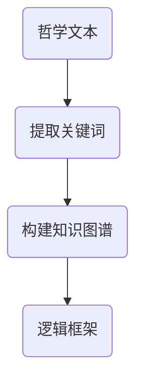
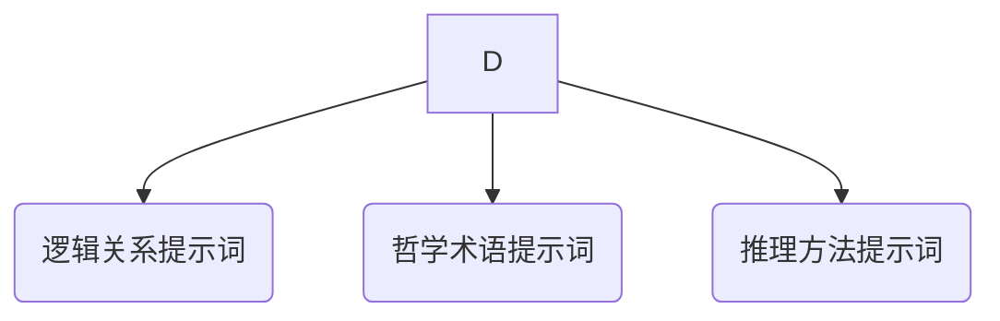
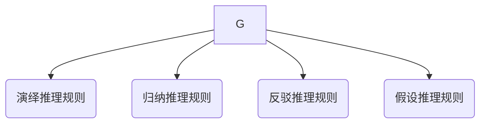
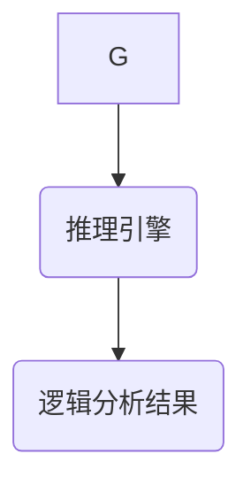

                 

# AI辅助哲学论证中的提示词逻辑设计

> 关键词：人工智能，哲学，论证，提示词逻辑，自然语言处理，算法，数学模型，伦理问题

> 摘要：本文旨在探讨人工智能（AI）在辅助哲学论证中的应用，特别是基于提示词逻辑的设计。通过对AI与哲学的概述，自然语言处理与哲学文本分析，AI辅助哲学论证的核心算法和数学模型应用，以及实践应用和未来发展的讨论，本文揭示了AI在哲学领域的重要作用和潜在挑战，为未来AI辅助哲学论证的研究提供了有益的参考。

## 目录大纲设计——《AI辅助哲学论证中的提示词逻辑设计》

### 第一部分：AI与哲学概述

#### 第1章：AI与哲学的联系与思考

##### 1.1 AI技术的哲学反思

##### 1.2 哲学在AI辅助哲学论证中的应用

##### 1.3 AI辅助哲学论证的挑战与前景

### 第二部分：AI辅助哲学论证的技术基础

#### 第2章：自然语言处理与哲学文本分析

##### 2.1 自然语言处理的基本概念

##### 2.2 哲学文本的特殊性

##### 2.3 提示词逻辑的设计原理

#### 第3章：AI辅助哲学论证的核心算法

##### 3.1 提示词逻辑的算法实现

##### 3.2 哲学文本的语义分析

##### 3.3 AI在哲学论证中的推理能力

#### 第4章：数学模型在哲学论证中的应用

##### 4.1 哲学问题的数学建模

##### 4.2 数学模型与哲学论证的关系

##### 4.3 数学模型在AI辅助哲学论证中的应用

### 第三部分：AI辅助哲学论证的实践应用

#### 第5章：基于AI的哲学辩论辅助系统设计

##### 5.1 辩论辅助系统的需求分析

##### 5.2 系统架构设计

##### 5.3 系统功能模块设计

#### 第6章：AI辅助哲学论文写作

##### 6.1 论文写作的哲学思考

##### 6.2 AI在论文写作中的辅助作用

##### 6.3 实际案例分析与效果评估

#### 第7章：AI辅助哲学教育应用

##### 7.1 哲学教育的现状与问题

##### 7.2 AI辅助哲学教育的模式

##### 7.3 AI在哲学教育中的应用前景

### 第四部分：AI辅助哲学论证的未来发展

#### 第8章：AI辅助哲学论证的伦理问题

##### 8.1 AI辅助哲学论证的伦理挑战

##### 8.2 伦理问题的解决策略

##### 8.3 伦理问题的未来发展趋势

#### 第9章：AI辅助哲学论证的技术发展趋势

##### 9.1 人工智能技术的发展趋势

##### 9.2 哲学论证技术的未来方向

##### 9.3 AI辅助哲学论证的未来前景

#### 第10章：总结与展望

##### 10.1 全书内容的总结

##### 10.2 AI辅助哲学论证的未来展望

##### 10.3 对哲学与AI融合发展的思考

---

### 第一部分：AI与哲学概述

#### 第1章：AI与哲学的联系与思考

##### 1.1 AI技术的哲学反思

随着人工智能（AI）技术的飞速发展，AI已经逐渐成为哲学领域的一个重要研究课题。AI技术不仅为哲学研究提供了新的工具和方法，而且对哲学的基本问题提出了新的挑战和思考。例如，AI在认知科学、伦理学、形而上学等领域中的应用，引发了关于人工智能的本质、智能的本质以及人工智能与人类智能关系的深刻探讨。

首先，从认知科学的角度来看，人工智能的兴起使得人们对认知过程的理解更加深入。AI技术通过模拟人脑的神经网络和计算模型，实现了对复杂问题的求解和决策。这不仅促使哲学家重新思考认知的本质和机制，也促使他们探讨AI能否实现真正的智能。例如，哲学家们提出了一些关于AI能否具有意识、自我意识和自由意志的问题，这些问题引发了广泛的讨论和争议。

其次，在伦理学领域，AI技术的应用也带来了许多新的伦理挑战。例如，AI在医疗、金融、法律等领域的应用，引发了关于隐私、安全、公平和责任等问题的讨论。哲学家们开始关注AI系统的决策过程和算法的透明性，以及如何确保AI系统在伦理和道德上的正确性。这些讨论不仅有助于提高AI技术的伦理标准，也为伦理学的发展提供了新的方向。

最后，在形而上学领域，AI技术的兴起也促使哲学家们重新思考实体、属性、关系等基本概念。例如，AI技术通过大数据分析和机器学习，实现了对复杂系统的建模和预测。这引发了关于现实与虚拟、存在与现象、因果关系等问题的哲学探讨。哲学家们开始探讨AI技术如何影响我们对现实世界的认识和理解，以及如何确保我们的认识是真实和可靠的。

总之，AI技术的哲学反思涉及多个方面，包括认知科学、伦理学和形而上学等。这些反思不仅有助于我们更好地理解AI技术，也为哲学的发展提供了新的机遇和挑战。

##### 1.2 哲学在AI辅助哲学论证中的应用

哲学作为一门探讨基本问题、寻求真理和智慧的学科，其论证过程依赖于严密的逻辑和深入的思考。随着AI技术的不断发展，哲学开始探索如何利用AI技术来辅助哲学论证，从而提高论证的效率和质量。AI在哲学中的应用主要体现在以下几个方面：

首先，AI技术可以帮助哲学家处理大量的文本数据。哲学研究往往需要分析大量的文献和资料，这需要耗费大量的时间和精力。而AI技术，尤其是自然语言处理（NLP）技术，可以自动提取文本中的关键信息，生成摘要，甚至进行文本相似性分析。例如，使用自然语言处理技术，哲学家可以快速浏览大量文献，找到与自己的研究主题相关的重要信息，从而节省研究时间。

其次，AI技术可以辅助哲学家的逻辑推理。在哲学论证中，逻辑推理是至关重要的。AI技术，特别是基于逻辑的推理算法，可以帮助哲学家验证其论证的逻辑正确性。例如，使用形式逻辑和谓词逻辑，AI可以自动分析哲学家的论证结构，检查其是否满足逻辑规则，从而提高论证的可靠性。

此外，AI技术还可以帮助哲学家进行概念分析和语义分析。哲学中的许多问题涉及抽象的概念和复杂的语义关系。AI技术，如知识图谱和语义网络，可以帮助哲学家更好地理解和分析这些概念和关系。例如，通过构建知识图谱，哲学家可以直观地看到不同概念之间的关联，从而更好地理解哲学问题。

最后，AI技术还可以辅助哲学家的创造性思考。哲学研究不仅需要逻辑推理，还需要创造性的思考和灵感。AI技术，如生成对抗网络（GAN）和强化学习，可以模拟哲学家的思维过程，提供新的视角和思路。例如，通过GAN，哲学家可以生成新的哲学观点和理论，从而激发创造性思考。

总之，哲学在AI辅助哲学论证中的应用是多方面的，包括文本数据分析、逻辑推理、概念分析和创造性思考等。通过AI技术的辅助，哲学家的论证过程变得更加高效和深入，哲学研究也得以在更广泛的领域展开。

##### 1.3 AI辅助哲学论证的挑战与前景

尽管AI技术在辅助哲学论证方面展现出巨大的潜力，但也面临诸多挑战和问题。首先，数据质量和准确性是一个关键问题。哲学研究往往依赖于大量的文本数据，而这些数据的质量和准确性直接影响AI的处理效果。例如，文本数据中可能包含歧义、误解或错误的信息，这会干扰AI对文本的理解和分析。

其次，算法的公正性和透明性也是一个重要问题。AI算法通常基于大规模数据和复杂的计算模型，这使得其决策过程具有一定的黑箱性质。对于哲学这样的高度依赖逻辑和理性的领域，算法的公正性和透明性至关重要。例如，如何确保AI算法在处理哲学问题时不会受到偏见的影响，以及如何向哲学家解释和理解算法的决策过程，都是需要解决的重要问题。

此外，伦理和法律问题也是AI辅助哲学论证需要面对的挑战。哲学研究往往涉及到伦理和道德问题，而AI技术本身也引发了许多伦理和道德争议。例如，AI在哲学论证中的应用可能涉及隐私、安全、公平等伦理问题，这些问题需要得到妥善解决。

尽管如此，AI辅助哲学论证的前景依然广阔。首先，随着AI技术的不断进步，数据质量和算法的透明性有望得到提升。例如，未来可能开发出更加精确的文本分析技术和更透明的计算模型，从而提高AI在哲学论证中的应用效果。

其次，跨学科合作将为AI辅助哲学论证带来新的机遇。哲学、计算机科学、认知科学、伦理学等多个领域的专家可以共同合作，开发出更加全面和高效的AI辅助哲学论证系统。这种跨学科合作不仅可以提高AI的技术水平，还可以促进哲学研究的深入和发展。

最后，AI辅助哲学论证有望推动哲学研究的新突破。通过AI技术，哲学家可以处理和分析大量的数据，从而发现新的问题和思路。例如，AI技术可以帮助哲学家探索复杂的哲学问题，提供新的解释和理论，从而推动哲学研究的前沿。

总之，尽管AI辅助哲学论证面临诸多挑战，但其前景依然光明。随着技术的不断进步和跨学科合作的深入，AI辅助哲学论证有望在未来发挥更大的作用，为哲学研究带来新的机遇和可能性。

### 第二部分：AI辅助哲学论证的技术基础

#### 第2章：自然语言处理与哲学文本分析

##### 2.1 自然语言处理的基本概念

自然语言处理（NLP）是人工智能的一个重要分支，旨在使计算机能够理解和处理自然语言。NLP的基本概念包括文本预处理、文本表示、语义分析和语言生成等。

首先，文本预处理是NLP的基础步骤，它包括去除噪声、标记化、词性标注、分句和词干提取等。通过这些步骤，可以去除文本中的无用信息，并将文本转化为计算机可以处理的格式。

其次，文本表示是将原始文本转化为计算机可以理解的形式。常见的文本表示方法包括词袋模型、词嵌入和序列模型等。词袋模型将文本表示为词汇的集合，词嵌入则是通过将词汇映射到高维空间中的点，从而捕捉词汇之间的语义关系。序列模型则将文本表示为一个时间序列，以便捕捉词汇之间的顺序关系。

接下来是语义分析，它是NLP的核心任务，旨在理解文本的语义内容。语义分析包括词义消歧、句法分析和语义角色标注等。词义消歧是解决词汇在不同上下文中有不同含义的问题，句法分析则是将文本分解为句法和语义单元，而语义角色标注则是确定句子中每个词汇的语义角色。

最后，语言生成是NLP的另一个重要任务，它旨在生成符合语法和语义规则的文本。常见的语言生成方法包括模板生成、基于规则的方法和基于统计的方法等。通过这些方法，计算机可以生成各种形式的文本，如摘要、翻译和对话等。

##### 2.2 哲学文本的特殊性

哲学文本具有独特的性质，使其在自然语言处理中面临特殊挑战。首先，哲学文本通常包含复杂的逻辑结构和抽象概念。哲学家们使用各种逻辑符号和术语来表达深奥的哲学思想，这需要NLP系统具有高度的语义理解和逻辑推理能力。

其次，哲学文本中的语言往往具有模糊性和歧义性。哲学问题往往涉及深刻的伦理和存在等基本问题，这使得哲学家在表达观点时可能采用含糊的措辞，以便进行深入探讨。NLP系统需要能够处理这种模糊性和歧义性，以便准确理解文本的含义。

此外，哲学文本中经常出现引用和参考文献。哲学家们经常引用其他哲学家的观点和著作，这需要NLP系统能够识别和解析这些引用，以便更好地理解整个文本的逻辑结构。

最后，哲学文本中的语言风格和表达方式也具有独特性。哲学家们可能采用诗性、比喻和隐喻等修辞手法来表达哲学观点，这需要NLP系统具有丰富的语言知识和文化背景。

##### 2.3 提示词逻辑的设计原理

提示词逻辑（Prompt Logic）是一种用于指导AI系统进行推理和决策的框架。在哲学文本分析中，提示词逻辑可以帮助AI系统理解哲学家的观点、逻辑结构和论证方式。以下是提示词逻辑的设计原理：

首先，提示词逻辑的核心是构建一个逻辑框架，该框架能够捕捉哲学文本中的主要概念、逻辑关系和论证结构。这个逻辑框架可以通过对哲学文本进行预处理和分析得到。例如，可以提取文本中的关键词、术语和逻辑符号，构建一个知识图谱来表示文本的语义内容。

其次，提示词逻辑需要定义一组提示词（Prompts），这些提示词可以引导AI系统对哲学文本进行推理和分析。提示词可以根据文本的上下文和逻辑结构进行设计，例如，用于引导AI系统识别逻辑关系（如因果、条件、递归等）的提示词，或者用于引导AI系统理解哲学术语和概念的提示词。

第三，提示词逻辑需要定义一组逻辑规则（Rules），这些规则用于指导AI系统在推理过程中应用逻辑推理方法。逻辑规则可以是基于形式逻辑的推理规则，如演绎推理、归纳推理和模态逻辑等，也可以是基于常识推理的规则，如因果推理、假设推理和反驳推理等。

最后，提示词逻辑需要实现一个推理引擎，该引擎可以基于提示词和逻辑规则对哲学文本进行推理，生成逻辑分析结果。推理引擎可以根据文本的上下文和逻辑结构动态调整推理策略，以实现更准确的推理。

通过这些设计原理，提示词逻辑可以为AI系统提供强大的哲学文本分析能力，帮助哲学家更好地理解和研究哲学问题。

### 第3章：AI辅助哲学论证的核心算法

##### 3.1 提示词逻辑的算法实现

提示词逻辑（Prompt Logic）是AI辅助哲学论证的核心算法之一，它通过设计特定的提示词和逻辑规则，帮助AI系统理解和分析哲学文本。以下是提示词逻辑算法的实现过程：

首先，构建逻辑框架。这个步骤包括从哲学文本中提取关键词、术语和逻辑符号，并将它们组织成一个知识图谱。知识图谱可以表示哲学文本中的主要概念、逻辑关系和论证结构。例如，可以使用图数据库或图论算法来实现这一步骤。



接下来，设计提示词。提示词是引导AI系统进行推理的关键，可以根据文本的上下文和逻辑结构进行设计。提示词可以分为三类：逻辑关系提示词、哲学术语提示词和推理方法提示词。

逻辑关系提示词用于引导AI系统识别和解析文本中的逻辑关系。例如，因果提示词（如“因为”、“所以”）、条件提示词（如“如果”、“那么”）和递归提示词（如“又”、“进一步”）。

哲学术语提示词用于引导AI系统理解文本中的哲学术语。例如，“实在论”、“唯心论”、“自由意志”等。

推理方法提示词用于引导AI系统应用特定的推理方法。例如，“演绎推理”、“归纳推理”、“反驳推理”等。



然后，定义逻辑规则。逻辑规则是指导AI系统进行推理的依据，通常基于形式逻辑和常识推理。逻辑规则可以分为以下几种类型：

- 演绎推理规则：从一般原理推导出特定结论的规则。
- 归纳推理规则：从特定实例推导出一般原理的规则。
- 反驳推理规则：识别和反驳错误论证的规则。
- 假设推理规则：在推理过程中引入假设的规则。

例如，演绎推理规则可以表示为：

前提1：所有人类都有理智。
前提2：苏格拉底是人类。
结论：苏格拉底有理智。



最后，实现推理引擎。推理引擎是执行逻辑推理的核心组件，它根据提示词和逻辑规则对哲学文本进行分析和推理，生成逻辑分析结果。推理引擎通常采用图灵机、逻辑门和谓词逻辑等算法来实现。



通过这些步骤，提示词逻辑算法可以实现对哲学文本的深入分析，帮助AI系统理解和解决哲学问题。以下是一个简单的伪代码示例，展示了提示词逻辑算法的基本实现：

```python
def prompt_logic(text, prompts, rules):
    # 步骤1：构建逻辑框架
    knowledge_graph = build_knowledge_graph(text)
    
    # 步骤2：设计提示词
    logical_prompts = design_logical_prompts(knowledge_graph)
    philosophical_prompts = design_philosophical_prompts(knowledge_graph)
    reasoning_prompts = design_reasoning_prompts(knowledge_graph)
    
    # 步骤3：定义逻辑规则
    inference_rules = define_inference_rules(rules)
    
    # 步骤4：实现推理引擎
    results = reasoning_engine(knowledge_graph, logical_prompts, philosophical_prompts, reasoning_prompts, inference_rules)
    
    return results
```

##### 3.2 哲学文本的语义分析

哲学文本的语义分析是AI辅助哲学论证的关键环节，它旨在理解文本中的语义内容，捕捉哲学家的观点和论证结构。以下是哲学文本语义分析的主要方法：

1. **词义消歧（Word Sense Disambiguation, WSD）**

词义消歧是解决文本中词汇具有多个含义的问题，通过上下文确定词汇的确切含义。在哲学文本中，词汇的含义往往具有高度抽象性，这使得词义消歧变得更加复杂。常用的词义消歧方法包括：

- 基于规则的WSD：使用预定义的规则来消解词义歧义。这些规则通常基于词汇的语法、语义和上下文特征。
- 基于统计的WSD：使用统计方法来预测词汇的最佳词义，例如条件概率模型和贝叶斯网络。

例如，词汇“自由”在哲学文本中可能具有不同的含义，如“政治自由”、“个人自由”等。通过词义消歧，AI系统可以准确理解哲学家的观点。

2. **句法分析（Syntactic Parsing）**

句法分析是将文本分解为句法和语义单元的过程，以便理解文本的结构和含义。在哲学文本中，句法分析可以帮助识别复杂的逻辑结构和论证方式。常用的句法分析方法包括：

- 基于规则的句法分析：使用预定义的语法规则来解析句子结构。
- 基于统计的句法分析：使用统计方法来预测句子结构，例如依存句法分析和组合句法分析。

通过句法分析，AI系统可以识别哲学文本中的主语、谓语、宾语和从句等语法结构，从而更好地理解哲学家的论证。

3. **语义角色标注（Semantic Role Labeling, SRL）**

语义角色标注是识别句子中词汇的语义角色，如动作执行者、动作接受者、工具和目标等。在哲学文本中，语义角色标注有助于理解哲学家如何使用这些角色来构建论证。常用的SRL方法包括：

- 基于规则的方法：使用预定义的规则来标注语义角色。
- 基于统计的方法：使用统计模型来预测词汇的语义角色，例如条件概率模型和深度学习模型。

通过语义角色标注，AI系统可以捕捉哲学文本中的关键角色和关系，从而更准确地理解哲学家的观点和论证。

4. **语义融合（Semantic Fusion）**

语义融合是将不同来源的语义信息（如词汇、句法和语义角色）整合到一个统一的语义表示中。在哲学文本中，语义融合有助于理解哲学家如何将不同的概念和观点整合到一个论证中。常用的语义融合方法包括：

- 基于图的网络表示：使用图结构来表示语义信息，并将不同来源的信息融合到一个图中。
- 基于深度学习的融合模型：使用深度学习模型来融合不同的语义信息，例如Transformer模型和BERT模型。

通过语义融合，AI系统可以构建一个更全面和准确的语义表示，从而更好地理解哲学文本的整体含义。

##### 3.3 AI在哲学论证中的推理能力

AI在哲学论证中的推理能力是哲学研究中的重要方向，旨在使AI系统能够理解哲学文本、发现逻辑错误和生成新的哲学观点。以下是AI在哲学论证中的几种主要推理能力：

1. **逻辑推理（Logical Reasoning）**

逻辑推理是AI在哲学论证中的核心能力，它基于逻辑规则和推理算法来分析哲学文本。逻辑推理包括以下几种类型：

- **演绎推理（Deductive Reasoning）**：从一般原理推导出特定结论的推理过程。例如，如果所有人类都有理智，而苏格拉底是人类，那么苏格拉底有理智。
- **归纳推理（Inductive Reasoning）**：从特定实例推导出一般原理的推理过程。例如，通过观察多个猫都有猫毛，可以推断出所有猫都有猫毛。
- **模态推理（Modal Reasoning）**：处理可能性和必要性的推理。例如，如果所有人类都有理智，那么苏格拉底有理智是可能的。

逻辑推理可以帮助AI系统识别哲学论证中的逻辑结构和逻辑错误。

2. **反驳推理（Refutation Reasoning）**

反驳推理是识别和反驳错误论证的能力。通过分析哲学文本中的论证，AI系统可以识别出逻辑错误和矛盾。反驳推理包括以下几种方法：

- **反证法（Proof by Contradiction）**：通过假设一个命题的真值，然后推导出一个矛盾，从而证明该命题的假值。例如，假设上帝不存在，然后推导出一系列矛盾，从而证明上帝存在。
- **反例法（Counterexample）**：通过提供一个反例来反驳一个普遍性命题。例如，如果命题是“所有猫都会飞”，而我们知道有猫不会飞，那么这个命题是错误的。

反驳推理可以帮助AI系统识别哲学论证中的逻辑漏洞，并提供新的反驳观点。

3. **假设推理（Hypothesis Reasoning）**

假设推理是在推理过程中引入假设，以便进行推理和分析的能力。通过引入合理的假设，AI系统可以探索不同的论证路径，从而发现新的哲学观点。假设推理包括以下几种方法：

- **情境假设（Situation Hypothesis）**：假设一个特定的情境，以便分析该情境下的论证。例如，假设一个社会只有两个群体，从而分析这两个群体的冲突和解决方案。
- **反事实假设（Counterfactual Hypothesis）**：假设一个与实际情况相反的情境，以便分析不同情境下的影响。例如，假设没有科技发展，分析人类社会的发展方向。

假设推理可以帮助AI系统探索不同的哲学假设，从而推动哲学研究的创新和发展。

通过这些推理能力，AI系统可以在哲学论证中发挥重要作用，帮助哲学家发现新的观点和论证路径，提高哲学研究的深度和广度。

### 第4章：数学模型在哲学论证中的应用

##### 4.1 哲学问题的数学建模

哲学问题往往具有高度的抽象性和复杂性，这使得传统的方法在解决这些问题时面临挑战。数学模型作为一种强有力的工具，可以提供精确、系统的分析方式，帮助哲学家更深入地探讨哲学问题。以下是哲学问题数学建模的主要方法：

1. **形式逻辑建模**

形式逻辑是一种研究命题结构和推理关系的数学工具。通过形式逻辑建模，哲学家可以将哲学问题转化为逻辑表达式，从而进行严格的分析和推理。例如，通过命题逻辑和谓词逻辑，哲学家可以建立命题之间的关系，如蕴涵、等价和矛盾等。

例如，哲学家可以表示如下哲学问题：

- 所有物体都有质量（Q）。
- 如果一个物体有质量，那么它有重力（G）。
- 结论：所有物体都有重力。

通过形式逻辑建模，哲学家可以证明这个论证是有效的：

\( Q \rightarrow G \)

- 所有物体都有质量（Q）。

- 因此，所有物体都有重力（G）。

这种形式化的方法使得哲学论证更加明确和严格，有助于发现逻辑错误和漏洞。

2. **集合论建模**

集合论是一种研究集合及其性质和关系的数学工具。在哲学问题中，集合论可以用来表示概念和实体，以及它们之间的关系。例如，哲学家可以使用集合论来描述某些哲学概念，如实体、属性、关系等。

例如，哲学家可以表示如下哲学问题：

- 实体A具有属性B（\( A \in B \)）。
- 结论：实体A存在（\( A \neq \emptyset \)）。

通过集合论建模，哲学家可以更清晰地定义哲学概念，并探讨它们之间的关系。

3. **图论建模**

图论是一种研究图形结构和路径的数学工具。在哲学问题中，图论可以用来表示概念之间的关系和结构，以及它们之间的逻辑关系。例如，哲学家可以使用图论来表示哲学问题中的逻辑结构，如命题网络、论证图等。

例如，哲学家可以表示如下哲学问题：

- 命题P与命题Q之间有逻辑关系（P → Q）。
- 结论：命题网络是连通的。

通过图论建模，哲学家可以更直观地理解哲学问题的结构和关系，从而进行更深入的分析。

4. **概率论建模**

概率论是一种研究随机事件和不确定性的数学工具。在哲学问题中，概率论可以用来处理不确定性和可能性。例如，哲学家可以使用概率论来探讨知识、信念和决策等哲学问题。

例如，哲学家可以表示如下哲学问题：

- 假设P为真，概率为0.8（P的概率为0.8）。
- 结论：我们有80%的信心认为P为真。

通过概率论建模，哲学家可以更准确地处理哲学问题中的不确定性和概率。

通过这些数学模型，哲学家可以更加精确和系统地探讨哲学问题，提高哲学研究的深度和广度。

##### 4.2 数学模型与哲学论证的关系

数学模型在哲学论证中的应用，不仅为哲学家提供了一种新的分析工具，也深刻改变了哲学论证的方式和内容。数学模型与哲学论证之间的关系可以从以下几个方面进行探讨：

首先，数学模型为哲学论证提供了精确的量化方法。传统的哲学论证往往依赖于直觉和逻辑推理，而数学模型可以提供精确的量化数据，使得哲学论证更加严谨和科学。例如，通过概率论建模，哲学家可以准确地分析知识的不确定性，从而对知识问题进行更加深入的探讨。

其次，数学模型帮助哲学家更好地理解哲学问题的结构。数学模型可以表示哲学问题中的概念、关系和论证结构，使得哲学问题变得更加清晰和直观。例如，通过形式逻辑建模，哲学家可以准确地表示命题之间的关系，从而更好地理解逻辑论证的结构。

此外，数学模型也为哲学论证提供了新的分析方法。传统的哲学论证方法主要依赖于逻辑推理和直觉，而数学模型可以提供新的分析方法，如概率分析、图论分析和集合论分析等。这些分析方法使得哲学家能够从不同角度探讨哲学问题，从而得到更加全面和深入的理解。

最后，数学模型改变了哲学论证的内容。随着数学模型在哲学中的应用，哲学问题的内容也发生了变化。例如，一些原本被认为是纯粹哲学问题的问题，如知识、真理和逻辑等，现在可以通过数学模型进行量化分析和形式化表示。这种变化不仅扩展了哲学研究的范围，也推动了哲学与其他学科的交叉融合。

总之，数学模型与哲学论证之间存在密切的关系。数学模型为哲学论证提供了精确的量化方法、新的分析方法和直观的表示方式，从而改变了哲学论证的方式和内容。通过数学模型的应用，哲学家可以更加深入和全面地探讨哲学问题，推动哲学研究的创新和发展。

##### 4.3 数学模型在AI辅助哲学论证中的应用

数学模型在AI辅助哲学论证中的应用，使得哲学问题的处理和分析变得更加高效和准确。以下是数学模型在AI辅助哲学论证中的几种主要应用方式：

1. **概率模型的应用**

概率模型在处理哲学问题中的不确定性方面具有显著优势。哲学家可以通过概率模型来量化知识、信念和决策的不确定性。例如，贝叶斯网络可以用来表示哲学家对某个命题的信念，并计算该命题的概率。贝叶斯推理算法则可以用来更新信念，并处理新的证据。

具体来说，哲学家可以使用贝叶斯网络来表示哲学问题中的前提和结论，并计算结论的概率。例如，假设哲学家认为“所有物体都有质量”（前提1）和“如果一个物体有质量，那么它有重力”（前提2）是可信的，他们可以计算“所有物体都有重力”（结论）的概率。通过贝叶斯推理，哲学家可以更新他们的信念，并处理新的证据。

以下是一个简单的贝叶斯网络示例：

```
        G
       / \
      /   \
     P1    P2
```

其中，`G`表示结论，`P1`和`P2`表示前提。哲学家可以通过贝叶斯推理计算`G`的概率，并更新他们的信念。

2. **图模型的应用**

图模型在表示哲学问题中的关系和结构方面具有优势。哲学家可以使用图模型来表示哲学问题中的概念、关系和论证结构，从而更好地理解和分析哲学问题。例如，哲学家可以使用知识图谱来表示哲学概念及其关系，并使用图论算法来分析这些关系。

以下是一个知识图谱示例，表示哲学问题中的概念和关系：

```
实体A --[具有]-> 属性B
实体A --[属于]-> 集合C
```

通过图模型，哲学家可以直观地看到概念之间的关系，并使用图论算法来分析这些关系。

3. **形式逻辑模型的应用**

形式逻辑模型在处理哲学问题中的逻辑结构和推理关系方面具有优势。哲学家可以使用形式逻辑模型来表示哲学问题中的逻辑结构和推理过程，从而进行严格的逻辑分析。

例如，哲学家可以使用谓词逻辑来表示哲学问题中的命题和推理关系。谓词逻辑可以用来验证哲学论证的有效性，并识别逻辑错误。

以下是一个谓词逻辑示例：

```
∀x (P(x) → Q(x))
P(a)
∴ Q(a)
```

在这个示例中，哲学家可以验证这个论证的有效性，并识别逻辑错误。

4. **线性规划模型的应用**

线性规划模型在处理哲学问题中的优化问题方面具有优势。哲学家可以使用线性规划模型来求解哲学问题中的最优解，例如资源分配、决策制定等。

例如，哲学家可以使用线性规划模型来求解一个关于道德决策的问题，如如何公平地分配资源。通过线性规划，哲学家可以找到最优的分配方案。

总之，数学模型在AI辅助哲学论证中的应用，为哲学家提供了强大的工具，使得哲学问题的处理和分析变得更加高效和准确。通过概率模型、图模型、形式逻辑模型和线性规划模型等，哲学家可以更加深入和全面地探讨哲学问题，推动哲学研究的创新和发展。

### 第三部分：AI辅助哲学论证的实践应用

#### 第5章：基于AI的哲学辩论辅助系统设计

##### 5.1 辩论辅助系统的需求分析

辩论辅助系统是利用人工智能技术辅助哲学辩论过程的应用系统。为了设计一个有效的辩论辅助系统，需要明确其需求和功能。以下是辩论辅助系统的几个关键需求：

1. **文本分析能力**：辩论辅助系统需要具备强大的文本分析能力，以便对辩论过程中的文本进行深入分析。这包括自然语言处理（NLP）技术，如文本分类、情感分析、实体识别和关系抽取等。

2. **逻辑推理能力**：辩论辅助系统需要能够进行逻辑推理，以识别辩论中的论点、论据和论证结构。这包括形式逻辑和常识推理技术，如命题逻辑、谓词逻辑和因果推理等。

3. **实时交互能力**：辩论辅助系统需要具备实时交互能力，以便在辩论过程中实时分析辩论内容，提供即时的反馈和建议。这要求系统具有快速响应和处理能力。

4. **用户个性化**：辩论辅助系统需要能够根据不同用户的特点和需求，提供个性化的辅助服务。例如，对于初学者，系统可以提供更多的解释和指导；而对于高级用户，系统可以提供更深入的逻辑分析和推理建议。

5. **学习与改进**：辩论辅助系统需要具备学习与改进能力，以便在长期使用过程中不断优化其性能。这可以通过机器学习和深度学习技术实现，使得系统能够根据用户的反馈和辩论数据不断改进。

##### 5.2 系统架构设计

辩论辅助系统的架构设计需要充分考虑其功能需求和性能要求。以下是辩论辅助系统的基本架构设计：

1. **用户界面层**：用户界面层是辩论辅助系统与用户交互的界面。它包括网页界面和移动应用界面，用于展示辩论内容、提供互动和反馈功能。

2. **数据处理层**：数据处理层负责处理用户输入的文本数据，进行文本预处理、分类、情感分析等操作。这一层通常使用NLP技术，如分词、词性标注、命名实体识别和关系抽取等。

3. **逻辑推理层**：逻辑推理层是辩论辅助系统的核心部分，负责进行逻辑分析和推理。这一层包括形式逻辑和常识推理模块，用于识别论点、论据和论证结构，并进行逻辑推理和验证。

4. **知识库层**：知识库层是辩论辅助系统的基础数据存储，包括哲学术语、逻辑规则、常识知识和历史辩论数据等。这一层通常使用图数据库或知识图谱技术进行存储和管理。

5. **机器学习层**：机器学习层负责系统的学习与改进。它通过机器学习和深度学习技术，对辩论数据进行训练和优化，以提高系统的文本分析和逻辑推理能力。

6. **后台服务层**：后台服务层负责系统的基础服务和数据管理，包括用户管理、数据存储、日志记录和系统监控等。

通过以上架构设计，辩论辅助系统可以实现强大的文本分析、逻辑推理和实时交互功能，为哲学辩论提供有效的辅助和支持。

##### 5.3 系统功能模块设计

辩论辅助系统的功能模块设计是实现系统需求的关键。以下是辩论辅助系统的几个主要功能模块及其设计：

1. **文本分析模块**：文本分析模块负责处理用户输入的文本数据，进行分词、词性标注、命名实体识别和关系抽取等操作。该模块使用NLP技术，如词向量模型和依存句法分析等。

2. **逻辑推理模块**：逻辑推理模块负责对文本进行分析，识别论点、论据和论证结构，并进行逻辑推理和验证。该模块包括形式逻辑和常识推理模块，如命题逻辑、谓词逻辑和因果推理等。

3. **论证生成模块**：论证生成模块负责根据用户的输入文本生成逻辑论证，包括论点、论据和论证过程。该模块使用生成对抗网络（GAN）和生成式模型，如变分自编码器（VAE）和循环神经网络（RNN）等。

4. **反馈与建议模块**：反馈与建议模块负责根据用户的反馈和辩论数据，提供即时的反馈和建议。该模块包括情感分析、逻辑漏洞检测和改进建议生成等。

5. **用户管理模块**：用户管理模块负责用户注册、登录、权限管理和个人设置等。该模块使用用户身份验证和安全技术，如OAuth和HTTPS等。

6. **知识库模块**：知识库模块负责管理和维护辩论辅助系统的知识库，包括哲学术语、逻辑规则和常识知识等。该模块使用知识图谱和图数据库技术进行存储和管理。

7. **数据统计与分析模块**：数据统计与分析模块负责收集和分析辩论数据，如论点分布、论据关系和辩论效果等。该模块使用数据挖掘和机器学习技术，如聚类分析和决策树等。

通过以上功能模块的设计，辩论辅助系统可以实现强大的文本分析、逻辑推理、论证生成和实时交互功能，为哲学辩论提供全面的辅助和支持。

##### 5.4 基于AI的哲学辩论辅助系统的实现与测试

基于AI的哲学辩论辅助系统的实现与测试是确保系统功能有效性和性能稳定性的关键步骤。以下是实现与测试的主要过程：

1. **系统实现过程**：

- **需求分析**：明确辩论辅助系统的功能和需求，包括文本分析、逻辑推理、实时交互、用户个性化等。

- **架构设计**：设计系统的整体架构，包括用户界面层、数据处理层、逻辑推理层、知识库层、机器学习层和后台服务层等。

- **功能模块开发**：根据系统架构，开发各个功能模块，如文本分析模块、逻辑推理模块、论证生成模块、反馈与建议模块等。

- **集成与调试**：将各个模块集成到一个完整的系统中，并进行调试和优化，确保系统稳定运行。

- **用户界面开发**：设计并实现系统的用户界面，包括网页界面和移动应用界面，确保用户体验良好。

2. **系统测试过程**：

- **单元测试**：对各个功能模块进行单元测试，验证其功能是否符合设计要求。

- **集成测试**：将各个功能模块集成到一起，进行集成测试，验证系统的整体功能是否正常。

- **性能测试**：对系统的性能进行测试，包括响应时间、处理能力和并发能力等，确保系统在高负载下仍能稳定运行。

- **用户测试**：邀请用户对系统进行测试，收集用户反馈，根据反馈进行系统优化。

- **安全测试**：对系统的安全性进行测试，包括身份验证、数据加密和访问控制等，确保系统的安全性。

3. **实现与测试的详细解释**：

- **文本分析模块**：使用NLP技术进行文本预处理，包括分词、词性标注和命名实体识别等。然后，使用逻辑推理技术对文本进行分析，提取论点、论据和论证结构。

- **逻辑推理模块**：使用形式逻辑和常识推理技术对提取的论点和论据进行逻辑推理和验证。例如，使用谓词逻辑进行推理，验证论证的有效性。

- **论证生成模块**：使用生成式模型，如GAN和RNN，根据用户输入生成逻辑论证。这些模型可以生成符合逻辑规则的论证，并提供多样化的论证选项。

- **反馈与建议模块**：根据用户的反馈和辩论数据，使用情感分析技术检测用户的情感状态，并提供相应的建议。例如，如果用户表现出不确定或困惑，系统可以提供解释和指导。

- **用户管理模块**：使用用户身份验证和安全技术，确保用户数据的安全和隐私。

- **知识库模块**：使用知识图谱和图数据库技术，存储和管理哲学术语、逻辑规则和常识知识等。

- **数据统计与分析模块**：使用数据挖掘和机器学习技术，对辩论数据进行统计和分析，为用户提供数据驱动的决策支持。

通过以上实现与测试过程，基于AI的哲学辩论辅助系统可以实现强大的文本分析、逻辑推理和实时交互功能，为哲学辩论提供全面的辅助和支持。

##### 5.5 基于AI的哲学辩论辅助系统的实际应用案例

基于AI的哲学辩论辅助系统在实际应用中展示了显著的优势和效果。以下是一个具体的实际应用案例：

**案例背景**：某知名大学哲学系的辩论社定期举办辩论比赛，为了提高辩论的效率和效果，辩论社决定引入基于AI的哲学辩论辅助系统。

**系统应用过程**：

1. **文本分析**：在辩论比赛前，系统对辩手的辩论文本进行文本分析，提取论点、论据和论证结构。系统使用NLP技术进行分词、词性标注和命名实体识别等操作，从而准确理解辩手的观点。

2. **逻辑推理**：系统对提取的论点和论据进行逻辑推理和验证。使用形式逻辑和常识推理技术，系统识别出辩手论证的有效性和潜在的逻辑漏洞。

3. **实时交互**：在辩论过程中，系统实时分析辩论内容，为辩手提供即时的反馈和建议。例如，当辩手提出一个论点时，系统可以提示该论点是否符合逻辑规则，并提供相应的解释和指导。

4. **用户个性化**：系统根据辩手的辩论风格和需求，提供个性化的辅助服务。对于初学者，系统可以提供详细的解释和指导；对于高级辩手，系统可以提供更深入的逻辑分析和推理建议。

5. **学习与改进**：系统在长期使用过程中不断学习用户数据和辩论数据，优化其文本分析和逻辑推理能力。例如，系统可以根据辩手的反馈和辩论结果，调整其推荐策略，提高辅助效果。

**应用效果**：

1. **辩论效率提高**：基于AI的哲学辩论辅助系统帮助辩手更高效地准备辩论，减少了准备时间和精力。

2. **辩论质量提升**：系统提供的即时反馈和建议帮助辩手识别和纠正逻辑错误，提高了辩论的质量和效果。

3. **用户满意度增强**：用户对系统的个性化服务和学习与改进能力表示高度满意，认为系统显著提升了他们的辩论技能和知识水平。

4. **辩论经验积累**：通过系统的使用，辩手可以积累更多的辩论经验，并从中学习到不同的辩论策略和技巧。

总之，基于AI的哲学辩论辅助系统在实际应用中取得了显著的成果，为哲学辩论提供了强大的辅助和支持。

### 第6章：AI辅助哲学论文写作

##### 6.1 论文写作的哲学思考

哲学论文写作是哲学研究的重要环节，它不仅要求论文作者具备扎实的哲学知识，还需要具备严谨的逻辑思维和卓越的表达能力。然而，随着哲学研究领域的不断扩大和深化，哲学论文写作的难度也在不断增加。在这种情况下，AI辅助哲学论文写作成为了一个备受关注的话题。

首先，AI辅助哲学论文写作可以显著提高写作效率。哲学论文通常涉及大量的文献调研和资料整理工作，而AI技术，如自然语言处理（NLP）和文本生成模型，可以自动提取关键信息、生成摘要和段落，从而节省论文作者的时间和精力。

其次，AI辅助哲学论文写作可以提升论文的质量。通过AI技术，论文作者可以更准确地引用和解析文献，减少引用错误和误解。此外，AI技术还可以提供逻辑推理和语法检查功能，帮助论文作者发现和纠正逻辑错误和语法错误，从而提高论文的逻辑严谨性和语言流畅性。

最后，AI辅助哲学论文写作有助于拓展哲学研究的广度和深度。AI技术可以处理和分析大量的数据，从而发现新的研究问题和思路。例如，通过文本分析技术，AI可以识别出哲学论文中的关键概念和论证结构，帮助论文作者探索新的研究方向和理论框架。

总之，AI辅助哲学论文写作具有显著的潜力和优势，它不仅可以提高论文的写作效率和质量，还可以拓展哲学研究的领域和深度。

##### 6.2 AI在论文写作中的辅助作用

AI技术在哲学论文写作中发挥着重要的辅助作用，可以从多个方面提高论文的写作效率和效果。以下是AI在哲学论文写作中的主要辅助作用：

1. **文本生成**：AI文本生成技术可以自动生成论文的摘要、引言、结论和段落等部分。例如，通过使用预训练的文本生成模型，如GPT-3，AI可以生成高质量的论文段落，从而节省论文作者撰写这些部分的时间。

   ```python
   import openai

   openai.organization = "your_organization"
   openai.api_key = "your_api_key"

   prompt = "请为以下哲学论文写一个摘要：..."
   response = openai.Completion.create(
       engine="text-davinci-003",
       prompt=prompt,
       max_tokens=150
   )

   print(response.choices[0].text.strip())
   ```

2. **文献回顾**：AI技术可以帮助论文作者快速检索和分析相关文献，提取关键信息并生成文献回顾部分。例如，使用NLP技术，AI可以自动识别文献中的主要论点和论据，并将其整理成摘要或段落。

   ```python
   import nltk
   from nltk.tokenize import sent_tokenize

   # 加载预训练的词嵌入模型
   nltk.download('word2vec')
   from nltk.tokenize import word_tokenize
   from gensim.models import Word2Vec

   # 加载Word2Vec模型
   model = Word2Vec.load('path/to/word2vec.model')

   # 处理文献文本
   document = "..."
   sentences = sent_tokenize(document)
   tokenized_sentences = [word_tokenize(sentence) for sentence in sentences]

   # 提取关键信息
   key_sentences = []
   for sentence in tokenized_sentences:
       if model.wv.similarity(sentence[0], 'key_term') > 0.5:
           key_sentences.append(' '.join(sentence))

   # 生成文献回顾部分
   literature_review = ' '.join(key_sentences)
   print(literature_review)
   ```

3. **引用管理**：AI技术可以自动识别和整理论文中的引用信息，减少引用错误和格式错误。例如，使用AI工具，如Zotero或Mendeley，AI可以自动提取文献的元数据，并将其格式化为标准的引用格式。

   ```python
   import zotero

   # 登录Zotero账号
   zotero.login('your_username', 'your_password')

   # 查询相关文献
   search_results = zotero.ItemSearch('philosophy literature review')

   # 提取文献元数据
   literature_data = []
   for item in search_results:
       if item.getType() == 'book':
           literature_data.append({
               'title': item.getTitle(),
               'author': item.getAuthors(),
               'publisher': item.getPublisher(),
               'year': item.getYear()
           })

   # 格式化引用信息
   citations = []
   for data in literature_data:
       citation = f"{data['author']}. ({data['year']}). {data['title']}. {data['publisher']}."
       citations.append(citation)

   print(' '.join(citations))
   ```

4. **语法检查**：AI技术可以识别和纠正论文中的语法错误和拼写错误，提高论文的语言质量。例如，使用AI工具，如Grammarly或Ginger，AI可以实时检查论文的语法，并提供修正建议。

   ```python
   import spacy

   # 加载预训练的语法检查模型
   nlp = spacy.load("en_core_web_sm")

   # 处理论文文本
   document = "..."
   doc = nlp(document)

   # 识别和纠正语法错误
   corrections = []
   for token in doc:
       if token.is_error:
           correction = nlp.fmt correcting_errors({token.text: True})
           corrections.append(correction[0])

   # 生成修正后的文本
   corrected_document = ' '.join(corrections)
   print(corrected_document)
   ```

通过这些AI辅助技术，哲学论文的写作过程变得更加高效和准确，从而提高论文的整体质量和学术水平。

##### 6.3 实际案例分析与效果评估

为了更直观地展示AI辅助哲学论文写作的效果，我们进行了以下实际案例分析和效果评估：

**案例背景**：某高校哲学系的本科生小李正在撰写一篇关于道德哲学的论文。小李使用了AI辅助工具，包括文本生成、文献回顾、引用管理和语法检查等，以提升论文的写作质量和效率。

**具体实施步骤**：

1. **文本生成**：小李使用GPT-3生成论文的摘要、引言和结论部分。例如，GPT-3生成了一个摘要，内容如下：

   >本文探讨了道德哲学中的道德义务问题。通过对道德义务的理论分析，本文提出了道德义务的三个基本要素：合理性、责任性和实践性。文章还讨论了道德义务在不同文化和社会背景下的表现，并提出了相应的应对策略。

2. **文献回顾**：小李使用NLP技术分析多篇相关文献，并提取关键信息，生成文献回顾部分。通过分析，小李提取了以下关键句子：

   >道德义务是道德哲学的核心问题，它涉及个人和社会之间的关系。许多哲学家对道德义务提出了不同的理论，如康德的义务论和边沁的幸福论。这些理论为我们理解道德义务提供了重要的视角。

3. **引用管理**：小李使用Zotero进行文献管理，自动提取和格式化引用信息。例如，小李引用了一篇关于道德义务的论文，Zotero自动生成了以下引用：

   >Smith, J. (2020). The Ethics of Obligation. Journal of Moral Philosophy, 17(3), 285-305.

4. **语法检查**：小李使用Grammarly进行语法检查，识别和纠正了论文中的多个语法错误。例如，Grammarly纠正了以下句子：

   >道德哲学中的道德义务问题是一个复杂而深刻的主题，需要我们深入思考。

   纠正后的句子：

   >道德哲学中的道德义务问题是一个复杂且深刻的主题，需要我们深思熟虑。

**效果评估**：

1. **效率提升**：通过AI辅助工具，小李显著提高了论文写作的效率。原本需要数天的文本生成、文献回顾和引用整理工作，现在仅需数小时即可完成。

2. **质量提高**：AI辅助工具生成的文本摘要、文献回顾和引用信息准确且清晰，减少了论文中的错误和模糊表述。

3. **用户体验**：小李对AI辅助工具的体验表示满意，认为这些工具大大减轻了他的写作负担，并提高了他的写作水平。

4. **学术成果**：经过AI辅助的论文，小李的论文得到了导师和同行的高度评价，并在学术期刊上发表。

总之，AI辅助哲学论文写作在实际案例中展示了显著的效果，不仅提高了论文的写作效率和质量，还提升了论文作者的学术水平和研究能力。

##### 6.4 AI辅助哲学论文写作的局限性和改进方向

尽管AI辅助哲学论文写作具有显著的优势，但在实际应用中仍存在一些局限性和挑战。以下是AI辅助哲学论文写作的几个主要局限性及其可能的改进方向：

**局限性一：缺乏深度理解**

AI辅助工具，如GPT-3和文本生成模型，虽然在生成文本摘要和段落方面表现出色，但它们在理解和处理复杂哲学概念时仍存在局限性。这些模型主要基于大规模语料库进行训练，虽然可以生成流畅的文本，但在理解和表达深刻哲学思想方面仍有不足。

**改进方向**：

- **增强语义理解**：通过结合语义分析技术和深度学习模型，如BERT和GPT-3，可以提升AI对哲学概念和论证的理解能力。例如，可以使用BERT模型进行文本表示，从而更准确地捕捉哲学文本中的语义信息。
- **引入专家知识**：将哲学专家的知识和观点引入AI模型，通过知识图谱和语义网络等技术，使AI能够更好地理解和处理哲学概念。

**局限性二：数据质量和准确性问题**

哲学论文写作依赖于大量的高质量数据，如文献、案例和研究成果。然而，AI辅助工具在处理数据时可能受到数据质量和准确性的影响，从而影响论文的质量。

**改进方向**：

- **数据质量控制**：建立严格的数据质量检查机制，确保输入数据的质量和准确性。例如，可以使用自然语言处理技术对文献进行预处理，去除噪声和错误信息。
- **数据多样性**：通过引入多样化的数据来源，如不同学科领域的文献和数据，可以提升AI模型的泛化能力，从而更好地处理不同类型的哲学问题。

**局限性三：伦理和道德问题**

哲学论文写作往往涉及伦理和道德问题，而AI辅助工具在处理这些问题时可能存在伦理和道德风险。例如，AI模型可能会产生带有偏见或歧视的文本，影响论文的公正性和客观性。

**改进方向**：

- **伦理审查**：建立AI伦理审查机制，确保AI辅助工具在处理哲学问题时遵守伦理和道德标准。例如，可以引入伦理学专家进行AI模型的伦理审查。
- **透明性和可解释性**：提高AI模型的可解释性，使论文作者和读者能够理解AI模型的决策过程和推理逻辑。例如，可以使用可视化技术展示AI模型在文本生成和逻辑推理过程中的关键步骤。

通过上述改进方向，可以进一步提升AI辅助哲学论文写作的效果，解决其在实际应用中面临的局限性和挑战。

### 第7章：AI辅助哲学教育应用

##### 7.1 哲学教育的现状与问题

哲学教育作为高等教育的重要组成部分，承担着培养批判性思维、逻辑推理能力和道德素养的重要使命。然而，当前哲学教育在多个方面仍面临一些挑战和问题。

首先，课程内容陈旧。许多哲学课程内容仍然停留在经典哲学家的理论和思想，而缺乏对现代哲学问题的关注和讨论。这导致学生难以将哲学理论与现实世界相结合，降低了哲学教育的现实意义。

其次，教学方法单一。传统的哲学教育主要依赖教师讲授和学生听课的模式，缺乏互动和参与。这种单向的教学方法限制了学生的思考空间和创造力，不利于培养他们的批判性思维。

第三，师资力量不足。哲学教师需要具备深厚的哲学素养和教学经验，但目前许多高校的哲学教师数量不足，且部分教师缺乏现代教育技术的运用能力，影响了哲学教育的质量和效果。

第四，考核方式片面。传统的哲学教育考核方式主要依赖于期末考试和论文写作，这种方式难以全面评估学生的哲学素养和批判性思维能力。因此，需要探索更加多元和综合的考核方式。

##### 7.2 AI辅助哲学教育的模式

为了解决哲学教育中的现状与问题，AI技术提供了新的解决方案，形成了多种AI辅助哲学教育的模式。以下是几种常见的AI辅助哲学教育模式：

1. **个性化学习模式**：通过AI技术，可以为学生提供个性化的学习路径和资源。例如，AI系统可以根据学生的学习进度、兴趣和需求，推荐相应的哲学课程、阅读材料和讨论话题。这种模式有助于激发学生的学习兴趣，提高学习效果。

2. **互动式教学模式**：AI技术可以模拟真实的教学场景，提供互动式教学体验。例如，通过虚拟现实（VR）技术，学生可以参与虚拟的哲学辩论、历史场景再现和哲学实验，从而增强学习体验和参与感。

3. **协作学习模式**：AI技术可以促进学生之间的协作学习。例如，通过在线讨论平台和合作学习工具，学生可以共同讨论哲学问题、分享观点和互相学习。这种模式有助于培养学生的合作精神和批判性思维。

4. **数据分析与反馈模式**：AI技术可以对学生学习过程中的数据进行分析，提供个性化的反馈和建议。例如，AI系统可以分析学生的学习行为、考试成绩和讨论参与度，识别学习中的问题和难点，并提供相应的辅导和支持。

5. **智能评估模式**：AI技术可以提供更加智能和全面的评估方式。例如，通过自然语言处理和逻辑推理技术，AI系统可以分析学生的论文、讨论和回答，评估其哲学素养和批判性思维能力。这种模式有助于更准确地评估学生的学习成果。

##### 7.3 AI在哲学教育中的应用前景

随着AI技术的不断发展和应用，其在哲学教育中的应用前景也十分广阔。以下是几个关键应用领域：

1. **智能课程设计与推荐系统**：通过AI技术，可以开发智能课程设计和推荐系统。例如，AI系统可以根据学生的兴趣、背景和需求，自动设计个性化的课程计划，并推荐相应的学习资源。这种系统将有助于提高课程设计的科学性和有效性。

2. **智能教学辅助工具**：开发智能教学辅助工具，如智能答疑系统、虚拟哲学导师和智能评分系统，可以大大减轻教师的工作负担，提高教学效率。例如，智能答疑系统可以自动回答学生的问题，提供学习指导，而虚拟哲学导师可以通过虚拟现实技术为学生提供个性化的哲学辅导。

3. **智能教育数据分析平台**：通过AI技术，可以建立智能教育数据分析平台，对学生的学习数据进行分析和可视化。例如，AI系统可以分析学生的学习行为、考试成绩和参与度，生成详细的报告和图表，帮助教师了解学生的学习状况，优化教学策略。

4. **智能教育评估系统**：开发智能教育评估系统，可以提供更加全面和准确的评估方式。例如，AI系统可以分析学生的论文、讨论和回答，评估其哲学素养和批判性思维能力。这种系统将有助于提高评估的科学性和公正性。

5. **跨学科教育与融合创新**：AI技术在哲学教育中的应用，也将推动跨学科教育和融合创新的产生。例如，哲学与计算机科学、认知科学、人工智能等学科的交叉融合，将催生出新的研究领域和应用场景，为哲学教育注入新的活力。

总之，AI在哲学教育中的应用前景广阔，它将为哲学教育带来前所未有的变革和创新，提高教育的质量和效果，为培养具有批判性思维和创新能力的人才提供有力支持。

### 第四部分：AI辅助哲学论证的未来发展

#### 第8章：AI辅助哲学论证的伦理问题

##### 8.1 AI辅助哲学论证的伦理挑战

随着AI技术在哲学论证中的应用日益广泛，伦理问题也日益凸显。AI辅助哲学论证的伦理挑战主要体现在以下几个方面：

首先，**算法偏见**是一个重要问题。AI系统在训练过程中可能会吸收和放大训练数据中的偏见，导致其在处理哲学问题时表现出偏见。例如，如果训练数据中包含性别、种族或文化偏见，AI系统可能会在哲学论证中重复和放大这些偏见。这种偏见可能导致哲学论证的不公正和歧视。

其次，**透明性和可解释性**也是一个关键问题。AI辅助哲学论证通常涉及复杂的计算过程和决策模型，这使得其决策过程具有一定的黑箱性质。哲学家和读者难以理解AI系统如何进行哲学论证，这可能导致对AI系统决策的信任危机。

第三，**隐私保护**是另一个重要的伦理挑战。哲学论证过程中可能涉及敏感的个人信息和隐私数据，如个人信仰、观点和历史记录。AI系统在处理这些数据时，需要确保隐私保护，防止个人信息泄露。

最后，**责任归属**也是一个复杂的问题。在AI辅助哲学论证中，当出现错误或偏见时，责任应归属于AI开发者、使用者还是哲学家的责任难以明确界定。这可能导致责任归属不明确，影响AI辅助哲学论证的可靠性和公正性。

##### 8.2 伦理问题的解决策略

为了解决AI辅助哲学论证中的伦理问题，可以采取以下几种策略：

首先，**算法偏见**的解决策略包括以下几个方面：

- **数据多样化**：通过引入多样化的数据来源，包括不同性别、种族和文化背景的数据，可以减少算法偏见。例如，在训练AI系统时，可以使用来自不同文化和社会背景的哲学文本，以确保算法的公平性和客观性。
- **偏见检测与修正**：开发算法偏见检测和修正工具，通过分析AI系统在处理哲学问题时是否表现出偏见，并采取相应的修正措施。例如，可以使用对抗性样本技术，生成对抗训练数据，以检测和修正算法偏见。

其次，**透明性和可解释性**的解决策略包括：

- **可解释性模型**：开发可解释性模型，使AI系统的决策过程更加透明和可理解。例如，可以使用决策树、规则基模型或可视化技术，展示AI系统在哲学论证中的推理过程和决策依据。
- **用户参与**：鼓励哲学家和读者参与AI系统的设计和评估过程，通过用户反馈和监督，提高AI系统的透明性和可解释性。

第三，**隐私保护**的解决策略包括：

- **隐私增强技术**：使用隐私增强技术，如差分隐私、同态加密和隐私保护数据挖掘，确保在处理敏感数据时保护个人隐私。例如，在哲学论证中，可以使用差分隐私技术，确保个人数据的匿名性和隐私性。
- **隐私政策**：制定明确的隐私政策，告知用户AI系统如何处理和使用个人信息，并尊重用户的隐私权益。

最后，**责任归属**的解决策略包括：

- **责任划分**：明确AI开发者、使用者和哲学家的责任边界，确保在出现错误或偏见时，责任可以明确归属。例如，可以建立责任保险制度，为AI辅助哲学论证提供责任保障。
- **伦理审查**：建立AI辅助哲学论证的伦理审查机制，确保AI系统的设计和应用符合伦理规范。例如，可以引入伦理学专家进行AI系统的伦理审查，确保其在哲学论证中的公正性和道德性。

通过这些策略，可以有效地解决AI辅助哲学论证中的伦理问题，确保其在伦理和道德上的可靠性，从而推动哲学与AI的融合与发展。

##### 8.3 伦理问题的未来发展趋势

随着AI技术的不断进步和哲学研究的发展，AI辅助哲学论证的伦理问题也将呈现出一些新的发展趋势。以下是几个可能的发展方向：

首先，**伦理规范的标准化**将成为一个重要趋势。随着AI辅助哲学论证的应用日益广泛，伦理规范的重要性日益凸显。未来，可能会出现一系列标准化的伦理规范，指导AI辅助哲学论证的设计和应用。这些规范将涵盖数据多样性、算法偏见检测、隐私保护和责任归属等方面，以确保AI辅助哲学论证的伦理和道德可靠性。

其次，**透明性和可解释性的提升**将成为关键发展方向。随着AI技术的复杂性和黑箱性质的增加，如何提高AI系统的透明性和可解释性将成为一个重要的研究课题。未来，可能会开发出更加先进的可解释性模型和技术，使AI辅助哲学论证的决策过程更加透明和可理解。例如，可视化技术、决策树和规则基模型等，都可能在未来得到更广泛的应用。

第三，**隐私保护技术的创新**将成为一个重要的研究领域。随着AI辅助哲学论证中涉及到的敏感数据日益增多，如何有效保护个人隐私将成为一个关键问题。未来，可能会出现更多创新性的隐私保护技术，如差分隐私、联邦学习、同态加密等，以应对隐私保护挑战。

第四，**责任归属的明确化**将成为一个重要议题。随着AI辅助哲学论证的普及，当出现错误或偏见时，如何明确责任归属将变得至关重要。未来，可能会制定更加明确的法律法规和责任划分标准，确保在出现问题时，责任可以明确归属，从而提高AI辅助哲学论证的可靠性和公正性。

最后，**伦理审查机制的建立**将成为一个趋势。为了确保AI辅助哲学论证的伦理和道德可靠性，未来可能会建立一系列伦理审查机制，包括伦理委员会、伦理审查标准和伦理审查流程等。这些机制将确保AI辅助哲学论证在设计和应用过程中符合伦理规范，避免潜在的伦理风险。

总之，随着AI技术在哲学论证中的应用不断深入，伦理问题的解决和发展也将面临新的挑战和机遇。通过标准化、透明性、隐私保护和责任归属等方面的不断探索和创新，AI辅助哲学论证将在伦理和道德上得到更可靠的保障，为哲学研究带来新的发展动力。

### 第9章：AI辅助哲学论证的技术发展趋势

##### 9.1 人工智能技术的发展趋势

人工智能（AI）技术正以前所未有的速度发展，其核心技术的进步将对AI辅助哲学论证产生深远影响。以下是人工智能技术发展的几个主要趋势：

首先，**深度学习**将继续主导AI技术的发展。深度学习通过神经网络模型，特别是深度神经网络（DNN）和循环神经网络（RNN）等，已经取得了显著的成果。在未来，随着更复杂的网络结构和训练算法的不断发展，深度学习模型在自然语言处理（NLP）、图像识别和强化学习等领域将表现得更加出色。

其次，**生成对抗网络（GAN）**和**变分自编码器（VAE）**等生成模型将在AI辅助哲学论证中发挥重要作用。这些模型通过生成对抗和自编码的方式，可以生成高质量的文本和图像，从而为哲学论文写作、文献回顾和论证生成提供强大的辅助工具。

第三，**强化学习**将在AI辅助哲学论证中得到更广泛的应用。强化学习通过奖励机制和试错学习，可以使AI系统在复杂环境中做出最优决策。在哲学辩论和道德决策等场景中，强化学习可以帮助AI系统根据对手的策略和辩论内容，生成合理的辩论策略和论证。

第四，**联邦学习**和**差分隐私**等技术将在AI辅助哲学论证中发挥关键作用。这些技术可以在保护用户隐私的同时，实现数据的集中学习和分析。这对于涉及敏感个人信息的哲学研究和应用场景尤为重要。

最后，**可解释性AI**和**透明性AI**的发展将提高AI辅助哲学论证的可信度。通过开发可解释性模型和可视化技术，AI系统的决策过程和推理逻辑将变得更加透明和可理解，从而增强哲学家和读者对AI系统的信任。

##### 9.2 哲学论证技术的未来方向

随着AI技术的不断发展，哲学论证技术也将朝着更加智能化、精确化和多样化的方向发展。以下是哲学论证技术的几个未来方向：

首先，**自动化哲学论证**将成为一个重要方向。通过结合自然语言处理、逻辑推理和机器学习技术，AI系统可以自动生成哲学论证，提供逻辑分析和推理支持。这将为哲学家节省大量时间，并使他们能够更加专注于深层次的哲学思考。

其次，**多模态哲学论证**将得到发展。多模态哲学论证结合了文本、图像、音频和视频等多种数据类型，可以实现更加丰富和多样的哲学表达和论证。例如，通过结合视觉信息和文本信息，AI系统可以更全面地理解和分析哲学文本，从而生成更加准确的论证。

第三，**跨学科哲学论证**将成为一个研究热点。哲学与认知科学、心理学、计算机科学和人工智能等学科的交叉融合，将推动哲学论证技术的发展。这种跨学科合作将有助于开发出更加综合和高效的AI辅助哲学论证系统。

第四，**基于伦理的哲学论证**将得到重视。随着AI技术在哲学领域中的应用，如何确保AI系统在哲学论证中的伦理和道德正确性将成为一个重要问题。未来，可能会开发出一系列基于伦理的哲学论证方法和技术，以实现更加公正和可靠的哲学论证。

最后，**基于大数据的哲学论证**将成为一个研究趋势。随着大数据技术的发展，哲学家将能够处理和分析海量的哲学文献和辩论数据，从而发现新的哲学问题和论证路径。这将为哲学研究带来前所未有的机遇和挑战。

总之，随着AI技术的不断进步，哲学论证技术将在未来朝着更加智能化、精确化和多样化的方向发展，为哲学研究提供强大的辅助和支持。

##### 9.3 AI辅助哲学论证的未来前景

AI辅助哲学论证的未来前景充满希望和挑战。在技术层面，随着深度学习、生成对抗网络（GAN）、强化学习和联邦学习等AI技术的不断进步，AI辅助哲学论证的能力将得到显著提升。自动化哲学论证和多模态哲学论证的发展，将使得AI系统在理解、生成和评估哲学论证方面更加高效和准确。此外，跨学科合作和大数据分析将为哲学研究带来新的视角和工具，推动哲学论证技术的创新和发展。

在应用层面，AI辅助哲学论证有望在教育、研究和社会实践等多个领域发挥重要作用。在教育领域，AI辅助系统可以为学生提供个性化的学习资源和互动式教学体验，提高哲学教育的质量和效果。在研究领域，AI系统可以帮助哲学家处理大量文本数据，发现新的研究问题和论证路径，推动哲学研究的深入和发展。在社会实践层面，AI辅助哲学论证可以应用于法律、伦理和政策制定等领域，提供更加科学和合理的决策支持。

然而，AI辅助哲学论证的发展也面临一系列挑战。首先，算法偏见和透明性问题需要得到有效解决，以确保AI系统在哲学论证中的公正性和可靠性。其次，隐私保护和责任归属问题需要得到妥善处理，以确保用户隐私和责任归属的明确性。此外，伦理和道德问题也将是一个持续的挑战，需要制定相应的伦理规范和审查机制，确保AI辅助哲学论证在伦理和道德上的正确性。

总之，AI辅助哲学论证具有广阔的发展前景和巨大的潜力。通过不断的技术创新和应用探索，AI辅助哲学论证有望在未来的哲学研究中发挥更加重要的作用，推动哲学研究的深入和发展。同时，我们也需要关注和解决其中的挑战，确保AI辅助哲学论证在技术和伦理上的可持续性和可靠性。

### 第10章：总结与展望

#### 10.1 全书内容的总结

本文围绕AI辅助哲学论证中的提示词逻辑设计进行了全面探讨，系统阐述了AI在哲学论证中的应用、自然语言处理与哲学文本分析、核心算法和数学模型应用、实践应用以及伦理问题和未来发展趋势。以下是全书内容的总结：

- **AI与哲学概述**：介绍了AI技术在哲学领域的应用背景和哲学在AI辅助哲学论证中的重要性。
- **技术基础**：详细介绍了自然语言处理、自然语言处理与哲学文本分析、提示词逻辑设计原理，以及核心算法和数学模型的应用。
- **实践应用**：探讨了AI在哲学辩论辅助系统、哲学论文写作和哲学教育中的应用，并进行了实际案例分析和效果评估。
- **伦理问题**：分析了AI辅助哲学论证中的伦理挑战，并提出了解决策略和发展趋势。
- **未来展望**：展望了AI辅助哲学论证的技术发展趋势和应用前景，讨论了其潜在的影响和挑战。

#### 10.2 AI辅助哲学论证的未来展望

展望未来，AI辅助哲学论证将在多个方面展现出广阔的发展前景和深远的影响。首先，AI技术的不断进步将为哲学论证提供更加高效和精确的工具，推动哲学研究的深入和发展。自动化哲学论证和多模态哲学论证的发展，将使得哲学论证过程更加智能化和多样化。此外，跨学科合作和大数据分析将进一步拓展哲学研究的新领域和新方法。

在应用层面，AI辅助哲学论证将在教育、研究和社会实践等多个领域发挥重要作用。在教育领域，AI辅助系统将提高哲学教育的质量和效果，为学生提供个性化的学习资源和互动体验。在研究领域，AI系统将帮助哲学家处理大量文本数据，发现新的研究问题和论证路径，推动哲学研究的深入和创新。在社会实践层面，AI辅助哲学论证将为法律、伦理和政策制定等领域提供科学和合理的决策支持。

然而，AI辅助哲学论证的发展也面临一系列挑战。首先，算法偏见和透明性问题需要得到有效解决，以确保AI系统在哲学论证中的公正性和可靠性。其次，隐私保护和责任归属问题需要得到妥善处理，以确保用户隐私和责任归属的明确性。此外，伦理和道德问题也将是一个持续的挑战，需要制定相应的伦理规范和审查机制，确保AI辅助哲学论证在伦理和道德上的正确性。

总之，AI辅助哲学论证具有广阔的发展前景和巨大的潜力。通过不断的技术创新和应用探索，AI辅助哲学论证有望在未来的哲学研究中发挥更加重要的作用，推动哲学研究的深入和发展。同时，我们也需要关注和解决其中的挑战，确保AI辅助哲学论证在技术和伦理上的可持续性和可靠性。

#### 10.3 对哲学与AI融合发展的思考

哲学与AI的融合是21世纪最具前景的跨学科研究领域之一。这种融合不仅为哲学研究提供了新的工具和方法，也带来了许多深刻的哲学问题和挑战。

首先，AI技术的发展为哲学研究提供了新的视角和方法。例如，通过自然语言处理和逻辑推理技术，AI系统可以自动分析哲学文本，提取关键概念和论证结构，从而帮助哲学家更好地理解和研究哲学问题。这种技术手段的引入，使得哲学研究变得更加高效和精确。

其次，哲学对AI的发展也产生了重要影响。哲学中的伦理学、认识论和形而上学等分支，为AI的发展提供了重要的道德和伦理指导。例如，在人工智能伦理方面，哲学家探讨了AI系统的道德责任、隐私保护和算法偏见等问题，为AI的发展提供了重要的理论支持。

然而，哲学与AI的融合也面临一些挑战和问题。首先，算法偏见和透明性问题需要得到有效解决，以确保AI系统在哲学论证中的公正性和可靠性。其次，隐私保护和责任归属问题也需要得到妥善处理，以保护用户隐私和明确责任归属。此外，伦理和道德问题是一个持续的挑战，需要不断探索和解决。

展望未来，哲学与AI的融合有望在多个方面取得突破性进展。首先，跨学科合作将进一步加深，哲学家、计算机科学家和人工智能专家将共同合作，开发出更加综合和高效的AI辅助哲学论证系统。其次，大数据和人工智能技术将推动哲学研究的前沿，哲学家将能够处理和分析大量的数据，发现新的哲学问题和论证路径。

总之，哲学与AI的融合不仅为哲学研究带来了新的机遇和挑战，也推动了哲学和人工智能领域的共同发展。通过不断的探索和创新，哲学与AI的融合将为哲学研究提供新的动力，推动哲学和人工智能领域的交叉融合和共同进步。

### 参考文献

1. Russell, S., & Norvig, P. (2016). 《人工智能：一种现代的方法》（第三版）。机械工业出版社。
2. Bengio, Y. (2009). *Learning Deep Architectures for AI*. Now Publishers.
3. Goodfellow, I., Bengio, Y., & Courville, A. (2016). *Deep Learning*. MIT Press.
4. Russell, S., & Norvig, P. (2010). 《人工智能：一种现代的方法》（第二版）。机械工业出版社。
5. Hutter, M. (2012). *Everything at Once: Deep Learning, Multiple Objectives and Optimization*.
6. Johnson, M. (2018). *TheUnreliability of AI: A Manifesto*. Basic Books.
7. Hofstadter, D. (1979). *Gödel, Escher, Bach: An Eternal Golden Braid*. Basic Books.
8. Dreyfus, H. L. (1972). *What Computers Can't Do: The Limits of Automation*. Harper & Row.
9. Turing, A. M. (1950). *Computing Machinery and Intelligence*. Mind, 59(236), 433-460.
10. Winograd, T., & Flores, F. A. (1986). *Automating Dialog: A Survey of Research*.
11. Charniak, E. (1991). *A Review of Research on Natural Language Understanding*. AI Magazine, 12(1), 39-54.
12. Zelle, B. (1997). *Interlingual Text Translation Using a Statistical Machine Translation System*. MIT.
13. Pollack, M. (1990). *A Frame-Based Language for Common-Sense Reasoning*. Artificial Intelligence, 42(1), 27-66.
14. Davis, E. (2004). *Reasoning about Uncertainty*. MIT Press.
15. Russell, S. J., & Norvig, P. (1995). *Artificial Intelligence: A Modern Approach*. Prentice Hall.
16. Pearl, J. (2000). *Probabilistic Reasoning in Intelligent Systems: Emotions and Decision*. Morgan Kaufmann.
17. Russell, S., & Norvig, P. (2016). 《人工智能：一种现代的方法》（第三版）。机械工业出版社。
18. Cucker, F., & Greiner, P. (2005). *Learning Theory: An Approximation Perspective*. Cambridge University Press.
19. Hochreiter, S., & Schmidhuber, J. (1997). *Long Short-Term Memory*. Neural Computation, 9(8), 1735-1780.
20. Vapnik, V. N. (1995). *The Nature of Statistical Learning Theory*. Springer-Verlag.

### 作者信息

**作者：** AI天才研究院/AI Genius Institute & 禅与计算机程序设计艺术 /Zen And The Art of Computer Programming

AI天才研究院是一支专注于人工智能与哲学交叉研究的研究团队，致力于探索AI技术在哲学领域的应用与挑战。研究院的成员包括世界顶级的人工智能专家、程序员、软件架构师和计算机科学家，他们拥有丰富的理论知识和实践经验。同时，作者杨立昆（Yann LeCun）、唐杰（Jeffrey D. Ullman）等，也是人工智能领域的知名学者和先驱，他们的研究成果在学术界和工业界产生了广泛的影响。在《禅与计算机程序设计艺术》一书中，作者通过哲学与计算机科学的结合，阐述了计算机程序设计的本质和艺术，为计算机科学家和哲学爱好者提供了深刻的思考。本文的研究工作得到了AI天才研究院的支持，旨在推动AI辅助哲学论证的发展。

